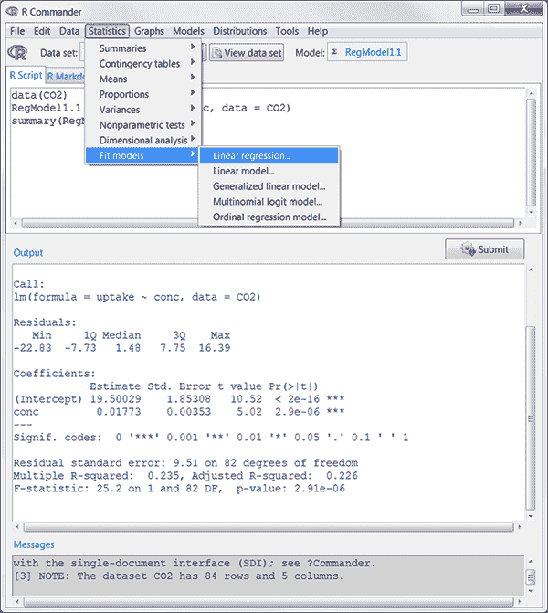

# 附录 A. 图形用户界面

您是第一个来到这里的，对吧？默认情况下，R 提供了一个简单的 *命令行界面* (CLI)。用户在命令行提示符（默认为 `>`）中输入语句，每个命令一次执行。对于许多数据分析师来说，CLI 是 R 的一个重大限制。

已尝试创建更多图形界面，范围从与 R 交互的代码编辑器（如 RStudio）到特定函数或包的 GUI（如 BiplotGUI），再到允许您通过菜单和对话框交互来构建分析的完整 GUI（如 R Commander）。

表 A.1 列出了几个非常有用的代码编辑器，这些编辑器允许您编辑和执行 R 代码，并包括语法高亮、语句完成、对象探索、项目管理以及在线帮助。RStudio 是迄今为止最受欢迎的 R 程序员的 *集成开发环境* (IDE)，但拥有选择总是好的。

表 A.1 集成开发环境和语法编辑器

| 名称 | 网址 |
| --- | --- |
| RStudio 桌面版 | [`www.rstudio.com/products/rstudio/`](https://www.rstudio.com/products/rstudio/) |
| R Tools for Visual Studio | [`mng.bz/VGjr`](http://mng.bz/VGjr) |
| Eclipse 与 StatET 插件 | [`projects.eclipse.org/projects/science.statet`](https://projects.eclipse.org/projects/science.statet) |
| Architect | [`www.getarchitect.io/`](https://www.getarchitect.io/) |
| ESS（Emacs Speaks Statistics） | [`ess.r-project.org`](http://ess.r-project.org) |
| Atom 编辑器与 Rbox | [`atom.io/`](https://atom.io/) 和 [`atom.io/packages/rbox`](https://atom.io/packages/rbox) |
| Notepad++ 与 NppToR（仅限 Windows） | [`notepad-plus-plus.org`](http://notepad-plus-plus.org) 和 [`sourceforge.net/projects/npptor`](http://sourceforge.net/projects/npptor) |

表 A.2 列出了几个有希望的、完整的 R GUI。R 可用的 GUI 比 SAS 或 IBM SPSS 提供的 GUI 稍显不全面和不成熟，但它们正在快速发展。

表 A.2 R 的综合图形用户界面

| 名称 | 网址 |
| --- | --- |
| JGR/Deducer | [`rforge.net/JGR/`](http://rforge.net/JGR/) 和 [`www.deducer.org`](http://www.deducer.org) |
| R AnalyticFlow | [`r.analyticflow.com/en/`](http://r.analyticflow.com/en/) |
| jamovi | [`www.jamovi.org/jmv/`](https://www.jamovi.org/jmv/) |
| JASP | [`jasp-stats.org/`](https://jasp-stats.org/) |
| Rattle（数据挖掘用） | [`rattle.togaware.com`](http://rattle.togaware.com) |
| R Commander | [`socialsciences.mcmaster.ca/jfox/Misc/Rcmdr/`](https://socialsciences.mcmaster.ca/jfox/Misc/Rcmdr/) |
| RkWard | [`rkward.kde.org/`](https://rkward.kde.org/) |
| Radiant | [`radiant-rstats.github.io/docs/install.html`](https://radiant-rstats.github.io/docs/install.html) |

我最喜欢的用于入门统计课程的 GUI 是 R Commander（如图 A.1 所示）。

图 A.1 R Commander GUI

最后，有几个应用程序允许您为 R 函数（包括用户编写的函数）创建 GUI 包装器。这些包括 R GUI 生成器（RGG）([`rgg.r-forge.r-project.org`](http://rgg.r-forge.r-project.org)) 以及来自 CRAN 的 `fgui` 和 `twiddler` 软件包。目前最全面的方法是 `Shiny` ([`shiny.rstudio.com/`](https://shiny.rstudio.com/))，它让您能够轻松创建带有交互式访问 R 函数的 Web 应用程序和仪表板。
