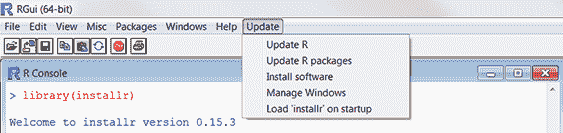

# 附录 G. 更新 R 安装

作为消费者，我们理所当然地认为我们可以通过“检查更新”选项来更新软件。在第一章中，我提到可以使用 `update.packages()` 函数下载并安装贡献包的最新版本。不幸的是，更新 R 安装本身可能更复杂。

如果你想要将 R 安装从 5.1.0 更新到 6.1.1，你必须有创意。（当我写这段话时，当前版本实际上是 4.1.1，但我希望这本书在未来几年里看起来时尚且最新。）这里描述了两种方法：使用 `installr` 包的自动化方法和适用于所有平台的手动方法。

## G.1 自动安装（仅限 Windows）

如果你是一个 Windows 用户，可以使用 `installr` 包来更新 R 安装。首先安装该包并加载它：

```
install.packages("installr")
library(installr)
```

这在 RGui 中添加了一个更新菜单（见图 G.1）。



图 G.1 `installr` 包添加到 Windows RGui 中的更新菜单

该菜单允许你安装 R 的新版本，更新现有包，并安装其他有用的软件产品（如 RStudio）。目前，`installr` 包仅适用于 Windows 平台。对于 macOS 用户或不想使用 `installr` 的 Windows 用户，更新 R 通常是一个手动过程。

## G.2 手动安装（Windows 和 macOS）

从 CRAN ([`cran.r-project.org/bin`](http://cran.r-project.org/bin)) 下载并安装 R 的最新版本相对简单。复杂因素在于，新安装中不包括自定义设置（包括之前安装的贡献包）。在我的当前设置中，我安装了 500 多个贡献包。我真的不希望每次升级我的 R 安装时都要手动写下它们的名称并重新安装！

网上关于如何优雅且高效地更新 R 安装有很多讨论。这里描述的方法既不优雅也不高效，但我发现它在 Windows 和 macOS 平台上都工作得很好。

在这种方法中，你使用 `installed.packages()` 函数将包列表保存到 R 目录树之外的位置，然后使用该列表与 `install.packages()` 函数下载并安装最新贡献包到新的 R 安装中。以下是步骤：

1.  如果你有一个自定义的 Rprofile.site 文件（见附录 B），请将其保存到 R 外部。

1.  启动你的当前版本 R，并输入以下语句：

    ```
    oldip <- installed.packages()[,1]
    save(oldip, file="path/installedPackages.Rdata")
    ```

    其中 `path` 是 R 之外的一个目录。

1.  下载并安装 R 的新版本。

1.  如果你在步骤 1 中保存了自定义版本的 Rprofile.site 文件，请将其复制到新安装中。

1.  启动 R 的新版本，并输入以下语句：

    ```
    load("path/installedPackages.Rdata")
    newip <- installed.packages()[,1]
    for(i in setdiff(oldip, newip)){ 
      install.packages(i)
    }
    ```

    `path` 是在第 2 步中指定的位置。

1.  删除旧安装（可选）。

这种方法只会安装来自 CRAN 的包。它不会找到来自其他位置的包。您必须单独查找和下载这些包。幸运的是，这个过程会显示一个无法安装的包列表。在我的最后一次安装中，`globaltest` 和 `Biobase` 找不到。因为我从 Bioconductor 网站获取了它们，所以我能够通过以下代码安装它们：

```
source("http://bioconductor.org/biocLite.R")
biocLite("globaltest")
biocLite("Biobase")
```

第 6 步涉及可选的删除旧安装包。在 Windows 机器上，可以同时安装多个 R 版本。如果需要，可以通过开始菜单 > 控制面板 > 卸载程序来卸载旧版本。在 macOS 平台上，新版本的 R 将覆盖旧版本。要在 macOS 上删除任何残留文件，请使用 Finder 转到 /Library/Frameworks/R.frameworks/versions/ 目录，并删除代表旧版本的文件夹。

显然，手动更新现有的 R 版本比这样一款复杂的软件所期望的要复杂得多。我希望能有一天，这个附录只需简单地说“选择检查更新选项”来更新 R 安装包。

## G.3 更新 R 安装包（Linux）

在 Linux 平台上更新 R 安装包的过程与在 Windows 和 macOS 机器上使用的过程有很大不同。此外，它还因 Linux 发行版（Debian、Red Hat、SUSE 或 Ubuntu）而异。有关详细信息，请参阅 [`cran.r-project.org/bin/linux`](http://cran.r-project.org/bin/linux)。
