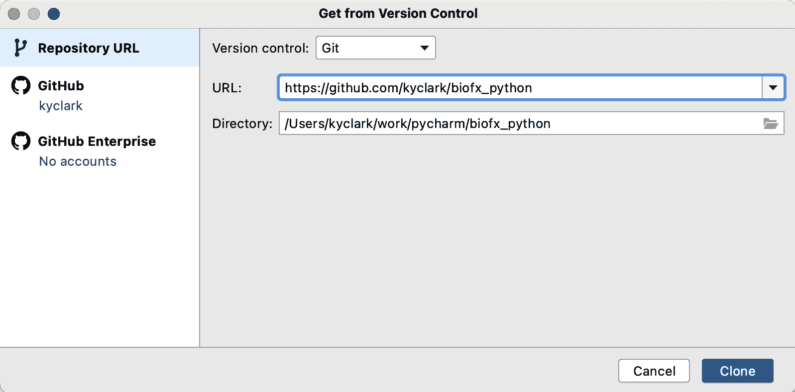
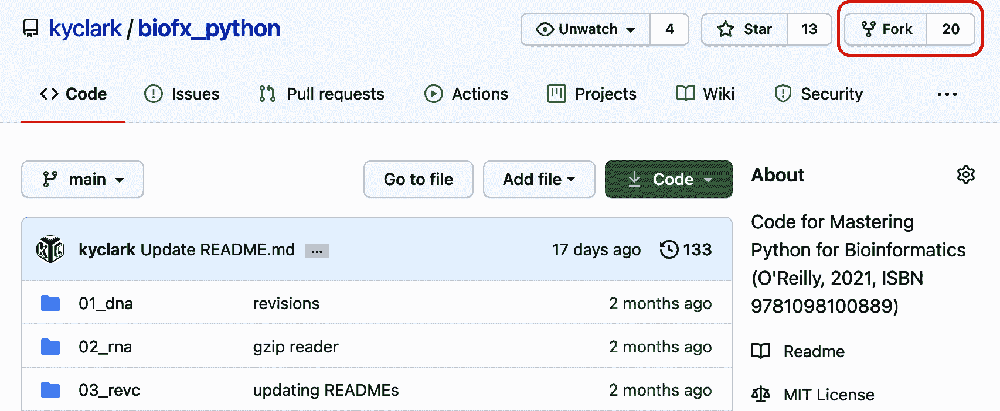

# 序言

编程是一种力量倍增器。我们可以编写计算机程序来摆脱繁琐的手动任务并加速研究。编写*任何*语言的程序都可能提高您的生产力，但每种语言都有不同的学习曲线和工具，这些工具可以改善或阻碍编程过程。

商界有一句格言说你有三个选择：

1.  快速

1.  好

1.  便宜

选择任意两个。

当涉及到编程语言时，Python 处于一个甜蜜点，因为它*快速*，因为它相当容易学习和编写一个工作原型的想法——基本上它总是我写任何程序时会使用的第一种语言。我觉得 Python 是*便宜*的，因为我的程序通常会在像我的笔记本电脑或小型 AWS 实例这样的商品硬件上运行得足够好。然而，我会争辩说，使用 Python 并不一定容易做出*好*的程序，因为语言本身相对宽松。例如，它允许在操作中混合字符和数字，这会导致程序崩溃。

本书是为那些希望了解 Python 最佳实践和工具的初学生生物信息学程序员编写的，例如以下内容：

+   自 Python 3.6 起，你可以添加类型提示，指示变量应该是*类型*，如数字或列表，并可以使用`mypy`工具确保正确使用这些类型。

+   像`pytest`这样的测试框架可以使用好数据和坏数据来测试您的代码，以确保它以某种可预测的方式做出反应。

+   类似`pylint`和`flake8`的工具可以找出潜在错误和风格问题，这会使你的程序更难理解。

+   `argparse`模块可以记录和验证程序的参数。

+   Python 生态系统允许您利用数百个现有模块，如 Biopython，以缩短程序并使其更可靠。

通过单独使用这些工具实践，可以提高你的程序，但将它们全部结合起来会以复利的方式提升你的代码质量。这本书并非生物信息学教科书。重点在于 Python 提供了什么，使其适合编写*可复现*的科学程序。也就是说，我会向你展示如何设计和测试程序，使得在相同输入情况下总是产生相同输出的结果。生物信息学中充斥着写得很糟糕、未经记录的程序，我的目标是逐步扭转这一趋势，一次一个程序。

程序复现性的标准包括：

参数

所有程序参数都可以设置为运行时参数。这意味着没有硬编码的值，这需要更改源代码才能改变程序的行为。

文档

程序应该通过打印参数和用法来响应`--help`参数。

测试

你应该能够运行一个测试套件，以证明代码符合某些规范

你可能期望这会逻辑上导致也许是正确的程序，但遗憾的是，正如艾兹格·戴克斯特（Edsger Dijkstra）所说，“程序测试可以用来显示错误的存在，但永远不能用来显示其不存在！”

大多数生物信息学家要么是学习编程的科学家，要么是学习生物学的程序员（或者像我这样两者都要学习的人）。无论你如何进入生物信息学领域，我都想向你展示实用的编程技术，帮助你快速编写正确的程序。我将从如何编写能够文档化和验证其参数的程序开始。然后我将展示如何编写和运行测试，以确保程序实现其所述功能。

例如，第一章向你展示如何从 DNA 字符串中报告四核苷酸频率。听起来相当简单，对吧？这是一个微不足道的想法，但我将花费大约 40 页来展示如何构建、文档化和测试这个程序。我将花费大量时间来展示如何编写和测试该程序的多个不同版本，以便探索 Python 数据结构、语法、模块和工具的许多方面。

# 谁应该阅读这本书？

如果你关心编程的工艺，并且想学习如何编写能够生成文档、验证参数、优雅失败和可靠工作的程序，那么你应该阅读这本书。测试是理解你的代码和验证其正确性的关键技能。我将向你展示如何使用我编写的测试，以及如何为你的程序编写测试。

要充分利用这本书，你应该已经对 Python 有扎实的理解。我将在《Tiny Python Projects》（Manning, 2020）所教授的技能基础上展开讲解，例如如何使用 Python 数据结构如字符串、列表、元组、字典、集合和命名元组。你不必是 Python 的专家，但我一定会推动你理解我在那本书中介绍的一些高级概念，比如类型、正则表达式、以及关于高阶函数的想法，还有关于测试以及如何使用`pylint`、`flake8`、`yapf`和`pytest`来检查风格、语法和正确性的工具。一个显著的不同之处在于，我将会在本书中始终使用类型注解，并使用`mypy`工具确保类型的正确使用。

# 编程风格：为什么我避免使用 OOP 和异常处理

我倾向于避免面向对象编程（OOP）。如果你不知道 OOP 是什么，没关系。Python 本身是一种面向对象的语言，几乎从字符串到集合的每个元素在技术上都是具有内部状态和方法的对象。你会遇到足够多的对象，以了解 OOP 的含义，但我介绍的程序大多数将避免使用对象来表示思想。

话虽如此，第一章展示了如何使用`class`来表示复杂的数据结构。`class`允许我定义带有类型注释的数据结构，以便我可以验证自己是否正确使用了数据类型。这确实有助于理解面向对象编程的一些内容。例如，类定义了对象的属性，类可以从父类继承属性，但这基本上描述了我在 Python 中使用面向对象编程的限制和原因。如果你现在不完全理解，不要担心，看到实例后你会理解的。

而非面向对象的代码，我展示了几乎完全由*函数*组成的程序。这些函数也是*纯函数*，它们只会对给定的值进行操作。也就是说，纯函数从不依赖于像全局变量这样的隐藏的可变状态，并且在给定相同参数时始终返回相同的值。此外，每个函数都将有一个相关联的测试，我可以运行以验证其行为是否可预测。我认为，这样可以比使用面向对象编程编写的解决方案更简短、更透明、更易于测试。你可能持有不同意见，当然可以按照自己喜欢的编程风格编写解决方案，只要它们能通过测试即可。Python 的[函数式编程指南文档](https://docs.python.org/3/howto/functional.html)很好地阐述了为什么 Python 适合函数式编程（FP）。

最后，本书中的程序也避免了使用异常，我认为这对于个人使用的短程序是合适的。管理异常以确保它们不会中断程序的流程会增加另一层复杂性，我认为这会影响人们理解程序的能力。对于在 Python 中编写返回错误的函数，我通常感到不满意。许多人会引发异常，并让`try`/`catch`块处理错误。如果我觉得异常是合理的，我通常会选择*不*捕获它，而是让程序崩溃。在这方面，我遵循了 Erlang 语言的创造者 Joe Armstrong 的一个想法，他说：“Erlang 的*方式*是编写快乐路径，而不是写满了错误修正代码的曲折小通道。”

如果你选择编写公开发布的程序和模块，你将需要更多地了解异常和错误处理，但这超出了本书的范围。

# 结构

本书分为两个主要部分。第一部分解决了[Rosalind.info 网站](http://rosalind.info/about)上的 14 个编程挑战。第二部分展示了更复杂的程序，演示了我认为在生物信息学中重要的其他模式或概念。书中的每一章都描述了一个编程挑战，供你编写，并提供了一个测试套件，用于确定你是否编写了一个可工作的程序。

尽管[“Python 之禅”](https://oreil.ly/20PSy)说“应该有一种——最好只有一种——明显的方法来做到这一点”，但我相信通过尝试多种不同的方法来解决问题，你可以学到很多东西。Perl 是我进入生物信息学的门户，Perl 社区“多种方法来解决问题”（TMTOWTDI）的精神仍然深深地影响着我。我通常会按照主题与变体的方式来编写每一章，展示多种解决方案，探索 Python 语法和数据结构的不同方面。

# 测试驱动开发。

> 更重要的不仅仅是进行测试，更重要的是设计测试，这是已知的最好的缺陷预防方法之一。为了创建一个有用的测试而进行的思考可以在代码编写之前发现并消除错误——事实上，测试设计思维可以在软件创建的每个阶段，从概念、规范、设计、编码到其余阶段，发现并消除错误。
> 
> Boris Beizer，《软件测试技术》（Thompson Computer Press）。

在所有的实验过程中，我都会有测试套件，我会不断运行它们以确保程序继续正确运行。每当有机会，我都会尝试教授*测试驱动开发*（TDD），这个概念在肯特·贝克（Addison-Wesley, 2002）的同名书籍中有详细解释。TDD 主张在编写代码*之前*先编写测试。典型的循环包括以下步骤：

1.  添加一个测试。

1.  运行所有的测试，看看新的测试是否失败。

1.  编写代码。

1.  运行测试。

1.  重构代码。

1.  重复。

在该书的[GitHub 代码库](https://oreil.ly/yrTZZ)中，您将找到每个程序的测试。我将解释如何运行和编写测试，我希望在学习结束时您能相信使用 TDD 的常识和基本的正直。我希望先考虑测试会开始改变您理解和探索编码的方式。

# 使用命令行和安装 Python。

我在生物信息学中的经验一直集中在 Unix 命令行上。我日常工作的大部分时间都在某种 Linux 服务器上，使用 Shell 脚本、Perl 和 Python 拼接现有的命令行程序。虽然我可能会在我的笔记本上编写和调试程序或流水线，但我经常会将我的工具部署到高性能计算（HPC）集群中，调度程序将异步地运行我的程序，通常在深夜或周末，并且无需我的监督或干预。此外，我所有构建数据库和网站以及管理服务器的工作都完全通过命令行进行，因此我强烈认为你需要精通这个环境才能在生物信息学中取得成功。

我使用 Macintosh 编写和测试了本书的所有材料，macOS 具有 Terminal 应用程序，您可以在其中使用命令行。我还使用各种 Linux 发行版测试了所有程序，并且 GitHub 存储库包含有关如何使用 Linux 虚拟机与 Docker 的说明。此外，我使用 Windows 10 在 Ubuntu 分布的 Windows 子系统（WSL）版本 1 上测试了所有程序。我*强烈*建议 Windows 用户使用 WSL 以获得真正的 Unix 命令行，但 Windows Shell（如`cmd.exe`、PowerShell 和 Git Bash）有时对某些程序也能够工作得足够好。

我建议您探索集成开发环境（IDE），如 VS Code、PyCharm 或 Spyder，以帮助您编写、运行和测试程序。这些工具集成了文本编辑器、帮助文档和终端。尽管我使用`vim`编辑器在终端中编写了所有程序、测试甚至本书，但大多数人可能更喜欢至少使用像 Sublime、TextMate 或 Notepad++这样的现代文本编辑器。

我使用 Python 版本 3.8.6 和 3.9.1 编写和测试了所有示例。一些示例使用了 Python 语法，在 3.6 版本中不存在，因此我建议您不要使用该版本。Python 2.x 已不再受支持，不应使用。我倾向于从[Python 下载页面](https://www.python.org/downloads)获取最新版本的 Python 3，但我也成功地使用了[Anaconda Python 发行版](https://www.anaconda.com)。您可能在 Ubuntu 上有像`apt`这样的软件包管理器，或者在 Mac 上有`brew`，它们可以安装最新版本，或者您可以选择从源代码构建。无论您的平台和安装方法如何，我建议您尝试使用最新版本，因为语言仍在不断变化，大多数情况下是变得更好。

请注意，我选择将程序呈现为命令行程序而不是 Jupyter Notebooks，原因有几个。我喜欢 Notebooks 用于数据探索，但 Notebooks 的源代码存储在 JavaScript 对象表示（JSON）中，而不是按行排列的文本。这使得使用`diff`等工具查找两个 Notebooks 之间的差异非常困难。此外，Notebooks 无法进行参数化，这意味着我无法从程序外部传递参数以更改行为，而是必须直接更改源代码。这使得程序缺乏灵活性，无法进行自动化测试。虽然我鼓励您探索 Notebooks，特别是作为运行 Python 的交互式方式，但我将专注于如何编写命令行程序。

# 获取代码和测试

所有代码和测试都可以从该书的 GitHub 存储库中获取。您可以使用程序 Git（可能需要安装）使用以下命令将代码复制到您的计算机上。这将在您的计算机上创建一个名为*biofx_python*的新目录，其中包含存储库的内容：

```py
$ git clone https://github.com/kyclark/biofx_python
```

如果你喜欢使用集成开发环境（IDE），可能可以通过该界面克隆存储库，如图 P-1 所示。许多 IDE 可以帮助您管理项目并编写代码，但它们的工作方式都不同。为了保持简单，我将展示如何使用命令行来完成大多数任务。



###### 图 P-1\. PyCharm 工具可以直接为您克隆 GitHub 存储库

有些工具，如 PyCharm，可能会自动尝试在项目目录内创建*虚拟环境*。这是一种隔离 Python 版本和模块的方式，使其与计算机上的其他项目隔离开来。无论您是否使用虚拟环境都是个人偏好。这不是使用它们的要求。

你可能更喜欢在你自己的账户中复制代码，这样你就可以跟踪你的更改并与他人分享你的解决方案。这叫做*分叉*，因为你正在从我的代码中分叉出来，并将你的程序添加到存储库中。

要分叉我的 GitHub 存储库，请执行以下操作：

1.  在 GitHub.com 上创建一个账户。

1.  转到[*https://github.com/kyclark/biofx_python*](https://github.com/kyclark/biofx_python)。

1.  单击右上角的 Fork 按钮（见图 P-2）将存储库复制到您的账户中。



###### 图 P-2\. 在我的 GitHub 存储库上的 Fork 按钮会在您的账户中复制代码

现在您在您的存储库中拥有了我所有代码的副本，您可以使用 Git 将该代码复制到您的计算机上。确保用您实际的 GitHub ID 替换`*YOUR_GITHUB_ID*`：

```py
$ git clone https://github.com/*YOUR_GITHUB_ID*/biofx_python
```

在您复制后，我可能会更新存储库。如果您希望能够获取这些更新，您需要配置 Git 将我的存储库设置为*上游*源。要这样做，在您将存储库克隆到计算机上后，进入您的*biofx_python*目录：

```py
$ cd biofx_python
```

然后执行此命令：

```py
$ git remote add upstream https://github.com/kyclark/biofx_python.git
```

每当您想要从我的更新存储库中更新您的存储库时，可以执行此命令：

```py
$ git pull upstream main
```

# 安装模块

您需要安装几个 Python 模块和工具。我在存储库的顶层包含了一个*requirements.txt*文件。该文件列出了运行本书中程序所需的所有模块。一些 IDE 可能会检测到此文件并提供安装，或者您可以使用以下命令：

```py
$ python3 -m pip install -r requirements.txt
```

或使用`pip3`工具：

```py
$ pip3 install -r requirements.txt
```

有时`pylint`可能会抱怨程序中的一些变量名，而当您导入没有类型注释的模块时，`mypy`会引发一些问题。要消除这些错误，您可以在家目录中创建初始化文件，这些程序将使用它们来自定义其行为。在源存储库的根目录中，有名为*pylintrc*和*mypy.ini*的文件，您应该像这样将它们复制到您的家目录中：

```py
$ cp pylintrc ~/.pylintrc
$ cp mypy.ini ~/.mypy.ini
```

或者，您可以使用以下命令生成新的*pylintrc*：

```py
$ cd ~
$ pylint --generate-rcfile > .pylintrc
```

随意定制这些文件以适应您的喜好。

# 安装 new.py 程序

我写了一个名为`new.py`的 Python 程序，它可以创建 Python 程序。很元，我知道。我最初是为自己写的，然后把它给了我的学生，因为我认为从一个空白屏幕开始写程序相当困难。`new.py`程序将创建一个新的、结构良好的 Python 程序，使用`argparse`模块来解释命令行参数。它应该已经在前面的部分与模块依赖项一起安装了。如果没有，你可以使用`pip`模块来安装它，就像这样：

```py
$ python3 -m pip install new-py
```

你现在应该能够执行**`new.py`**，看到类似这样的输出：

```py
$ new.py
usage: new.py [-h] [-n NAME] [-e EMAIL] [-p PURPOSE] [-t] [-f] [--version]
              program
new.py: error: the following arguments are required: program
```

每个练习都会建议你使用`new.py`来开始编写你的新程序。例如，在第一章中，你将在*01_dna*目录下创建一个名为`dna.py`的程序，就像这样：

```py
$ cd 01_dna/
$ new.py dna.py
Done, see new script "dna.py".
```

如果你然后执行**`./dna.py --help`**，你会看到它生成了关于如何使用程序的帮助文档。你应该在编辑器中打开`dna.py`程序，修改参数，并添加你的代码以满足程序和测试的要求。

请注意，使用`new.py`并不是必须的。我只是提供这个作为一个开始的辅助工具。这是我开始我自己的每一个程序的方式，但是，虽然我觉得它有用，你可能更喜欢走另一条路。只要你的程序通过测试套件，你可以按照你喜欢的方式编写它们。

# 我为什么写这本书？

理查德·哈明在贝尔实验室担任数学家和研究员数十年。他以寻找他不认识的人并询问他们的研究而闻名。然后他会问他们认为在他们领域里最大、最迫切的未解决问题是什么。如果他们对这两个问题的答案不同，他会问：“那你为什么不去解决呢？”

我觉得生物信息学中最迫切的问题之一是许多软件编写质量低劣，缺乏适当的文档和测试，如果有的话。我想向你展示，使用类型、测试、代码检查和格式化工具并不是那么困难，因为随着时间的推移，添加新功能和发布更多更好的软件会变得更容易。你将有信心确切地知道你的程序在某种程度上是正确的。

为此，我将演示软件开发的最佳实践。尽管我使用 Python 作为媒介，但这些原则适用于从 C 到 R 再到 JavaScript 的任何语言。你从这本书中最重要的学到的东西是开发、测试、文档化、发布和支持软件的技艺，这样我们就可以共同推进科学研究计算。

我在生物信息学领域的职业是漫游和幸福意外的产物。我在大学里学习了英国文学和音乐，然后开始使用数据库、HTML，并最终在 1990 年代中期在工作中学会了编程。到 2001 年，我已经成为一个不错的 Perl 黑客，并且设法在 Cold Spring Harbor Laboratory（CSHL）成为了 Dr. Lincoln Stein 的网页开发人员。他和我的老板 Dr. Doreen Ware 耐心地给我灌输了足够的生物学知识，以理解他们想要编写的程序。我在一个名为 Gramene.org 的比较植物基因组学数据库上工作了 13 年，学到了相当多的科学知识，同时继续探索编程语言和计算机科学。

林肯热衷于分享从数据和代码到教育的一切。他在 CSHL 开设了为期两周的集中课程，教授 Unix 命令行、Perl 编程和生物信息学技能的生物编程课程。尽管现在使用 Python 教学，但这门课程仍在进行中，我也有几次担任助教的机会。我一直觉得帮助别人学习他们将用于推进研究的技能是有意义的。

就是在我在 CSHL 的任期期间，我遇到了 Bonnie Hurwitz，她最终离开去亚利桑那大学（UA）攻读博士学位。当她在 UA 开设新实验室时，我是她的第一个雇员。我和 Bonnie 一起工作了几年，教学成为了我的工作中最喜欢的部分之一。与林肯的课程一样，我们向想要涉足更多计算方法的科学家介绍了基本的编程技能。

我为这些课程编写的一些材料成为了我第一本书《微型 Python 项目》的基础，我试图在其中教授 Python 语言语法的基本要素，以及如何使用测试来确保程序的正确性和可重复性——这些对科学编程至关重要。这本书从这里开始，重点介绍了将帮助您编写生物学程序的 Python 要素。

# 本书中使用的约定

本书使用以下排版约定：

*斜体*

表示新术语、URL、电子邮件地址、文件名和文件扩展名，以及密码子和 DNA 碱基。

`固定宽度`

用于程序清单，以及段落内用于引用诸如变量或函数名称、数据库、数据类型、环境变量、语句和关键字等程序元素。

**`固定宽度粗体`**

显示用户应该按字面输入的命令或其他文本。

*`固定宽度斜体`*

显示应该用用户提供的值或上下文确定的值替换的文本。

此元素表示提示或建议。

此元素表示一般注释。

此元素表示警告或注意事项。

# 使用代码示例

补充资料（代码示例、练习等）可在[*https://github.com/kyclark/biofx_python*](https://github.com/kyclark/biofx_python)下载。

如果您有技术问题或使用代码示例时遇到问题，请发送电子邮件至*bookquestions@oreilly.com*。

本书旨在帮助您完成工作。通常情况下，如果本书提供示例代码，您可以在程序和文档中使用它。除非您复制了大量代码片段，否则无需征得我们的许可。例如，编写一个使用本书多个代码片段的程序无需许可。销售或分发 O’Reilly 书籍的示例代码则需要许可。引用本书并引用示例代码回答问题无需许可。将本书大量示例代码整合到您产品的文档中则需要许可。

我们欣赏，但通常不要求归属。归属通常包括标题、作者、出版商和 ISBN。例如：“*生物信息学 Python 大师*，作者 Ken Youens-Clark（O’Reilly）。版权所有 2021 年 Charles Kenneth Youens-Clark，978-1-098-10088-9。”

如果您认为您对代码示例的使用超出了公平使用或上述许可的范围，请随时通过*permissions@oreilly.com*与我们联系。

# O’Reilly Online Learning

40 多年来，[*O’Reilly Media*](http://oreilly.com)提供技术和商业培训、知识和见解，帮助公司取得成功。

我们独特的专家和创新者网络通过书籍、文章和我们的在线学习平台分享他们的知识和专业知识。O’Reilly 的在线学习平台为您提供按需访问的实时培训课程、深入学习路径、交互式编码环境，以及来自 O’Reilly 和其他 200 多家出版商的广泛文本和视频集合。更多信息，请访问[*http://oreilly.com*](http://oreilly.com)。

# 如何联系我们

请将有关本书的评论和问题发送至出版社：

+   O’Reilly Media, Inc.

+   1005 Gravenstein Highway North

+   加州塞巴斯托波尔 95472

+   800-998-9938（美国或加拿大）

+   707-829-0515（国际或本地）

+   707-829-0104（传真）

我们有本书的网页，列出勘误、示例和任何额外信息。您可以访问[*https://oreil.ly/mastering-bioinformatics-python*](https://oreil.ly/mastering-bioinformatics-python)。

通过电子邮件*bookquestions@oreilly.com*进行评论或咨询有关本书的技术问题。

获取关于我们书籍和课程的新闻和信息，请访问[*http://oreilly.com*](http://oreilly.com)。

在 Facebook 上找到我们：[*http://facebook.com/oreilly*](http://facebook.com/oreilly)

关注我们的 Twitter：[*http://twitter.com/oreillymedia*](http://twitter.com/oreillymedia)

观看我们的 YouTube 频道：[*http://www.youtube.com/oreillymedia*](http://www.youtube.com/oreillymedia)

# 致谢

我要感谢所有审阅过这本书的人，包括我的编辑 Corbin Collins；整个制作团队，尤其是我的制作编辑 Caitlin Ghegan；我的技术审阅者 Al Scherer, Brad Fulton, Bill Lubanovic, Rangarajan Janani 和 Joshua Orvis；以及许多其他提供宝贵反馈的人，包括 Mark Henderson, Marc Bañuls Tornero 和 Scott Cain 博士。

在我的职业生涯中，我非常幸运地遇到了许多出色的老板、主管和同事，他们帮助我成长并推动我变得更好。Eric Thorsen 是第一个看出我有学习编程潜力的人，他帮助我学习了各种编程语言和数据库，以及关于销售和支持的重要经验教训。Steve Reppucci 是我在 boston.com 的老板，他使我更深入地理解了 Perl 和 Unix，以及如何成为一个诚实而周到的团队领导者。在 CSHL，Lincoln Stein 博士冒险聘请一个对生物学一无所知的人到他的实验室工作，他推动我创造了我未曾想象的程序。Doreen Ware 博士耐心地教导我生物学，并推动我承担领导角色和发表论文。Bonnie Hurwitz 博士在多年的高性能计算学习中一直支持我，教我更多编程语言，指导，教学和写作。在每个职位上，还有许多同事教会了我编程的同时也教会了我如何做人，我要感谢每一个在我成长路上帮助过我的人。

在我的个人生活中，如果没有我的家人，我可能一事无成。他们一直爱护和支持我。我的父母一直在我生活中给予巨大支持，如果没有他们，我肯定不会成为现在的我。Lori Kindler 和我已经结婚 25 年，我无法想象没有她的生活。我们一起育有三个孩子，他们是我无比欢乐和挑战的源泉。

¹ 以罗莎琳德·弗兰克林命名，她因在发现 DNA 结构方面的贡献而本该获得诺贝尔奖。
