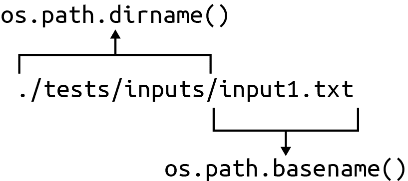
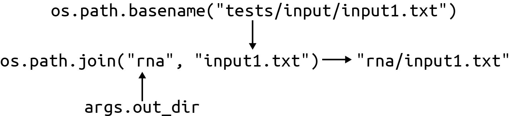
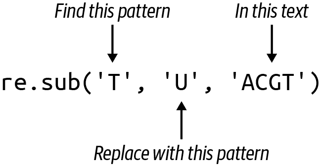

# 第二章：将 DNA 转录为 mRNA：突变字符串，读写文件

为了表达维持生命所必需的蛋白质，DNA 区域必须被转录成一种称为*messenger RNA*（mRNA）的 RNA 形式。虽然 DNA 和 RNA 之间有许多迷人的生化差异，但就我们的目的而言，唯一的区别是 DNA 序列中代表嘧啶碱基的所有*T*字符需要更改为尿嘧啶字母*U*。正如在[Rosalind RNA 页面](https://oreil.ly/9Dddm)上所描述的那样，我将向您展示如何编写一个接受像`ACGT`这样的 DNA 字符串并打印转录 mRNA `ACGU`的程序。我可以使用 Python 的`str.replace()`函数在一行中完成这个任务：

```py
>>> 'GATGGAACTTGACTACGTAAATT'.replace('T', 'U')
'GAUGGAACUUGACUACGUAAAUU'
```

您已经在第一章中看到如何编写一个从命令行或文件接受 DNA 序列并打印结果的程序，因此如果再次这样做，您不会学到太多新东西。我将通过解决生物信息学中常见的模式来使这个程序更有趣。具体来说，我将展示如何处理一个或多个输入文件，并将结果放置在输出目录中。例如，将测序运行的结果作为包含需要进行质量检查和过滤的文件目录返回，将清理后的序列放入新的目录进行分析。这里的输入文件包含 DNA 序列，每行一个，我将 mRNA 序列写入到同名文件中。

在本章中，您将学习：

+   如何编写一个需要一个或多个文件输入的程序

+   如何创建目录

+   如何读写文件

+   如何修改字符串

# 入门

可能会有所帮助，先尝试运行其中一个解决方案，看看程序应该如何工作。首先切换到*02_rna*目录，并将第一个解决方案复制到程序`rna.py`：

```py
$ cd 02_rna
$ cp solution1_str_replace.py rna.py
```

使用`-h`标志请求程序的用法：

```py
$ ./rna.py -h
usage: rna.py [-h] [-o DIR] FILE [FILE ...] 

Transcribe DNA into RNA

positional arguments: 
  FILE                  Input DNA file

optional arguments:
  -h, --help            show this help message and exit
  -o DIR, --out_dir DIR
                        Output directory (default: out) 
```


用方括号（`[]`）括起来的参数是可选的。`[FILE ...]`语法表示可以重复使用该参数。


输入`FILE`参数将是位置参数。


可选的输出目录默认为*out*。

该程序的目标是处理一个或多个包含 DNA 序列的文件。以下是第一个测试输入文件：

```py
$ cat tests/inputs/input1.txt
GATGGAACTTGACTACGTAAATT
```

运行`rna.py`程序，使用此输入文件，并注意输出：

```py
$ ./rna.py tests/inputs/input1.txt
Done, wrote 1 sequence in 1 file to directory "out".
```

现在应该有一个名为*out*的目录，其中包含一个名为*input1.txt*的文件：

```py
$ ls out/
input1.txt
```

文件的内容应与输入的 DNA 序列匹配，但所有的*T*都应更改为*U*：

```py
$ cat out/input1.txt
GAUGGAACUUGACUACGUAAAUU
```

您应该使用多个输入运行程序，并验证您在输出目录中获取多个文件。在这里，我将使用所有测试输入文件，输出目录称为*rna*。请注意摘要文本如何使用*序列*和*文件*的正确单数/复数形式：

```py
$ ./rna.py --out_dir rna tests/inputs/*
Done, wrote 5 sequences in 3 files to directory "rna".
```

我可以使用带有`-l`选项的`wc`（单词计数）程序来计算输出文件中的*行*数，并验证*rna*目录中是否写入了五个序列到三个文件：

```py
$ wc -l rna/*
       1 rna/input1.txt
       2 rna/input2.txt
       2 rna/input3.txt
       5 total
```

## 定义程序的参数

如您从前面的使用情况所见，您的程序应接受以下参数：

+   一个或多个位置参数，必须是每个包含要转录的 DNA 字符串的可读文本文件。

+   一个可选的`-o`或`--out_dir`参数，用于命名一个输出目录以将 RNA 序列写入其中。默认值应为`out`。

您可以自由编写和结构化您的程序（只要它们通过测试），但我总是会使用**`new.py`**和我在第一章展示的结构来启动程序。`--force`标志表示应覆盖现有的`rna.py`：

```py
$ new.py --force -p "Transcribe DNA to RNA" rna.py
Done, see new script "rna.py".
```

## 定义一个可选参数

修改`get_args()`函数以接受前面部分描述的参数。首先定义`out_dir`参数。我建议您将由`new.py`生成的`-a|--arg`选项更改为以下内容：

```py
parser.add_argument('-o', 
                    '--out_dir', 
                    help='Output directory', 
                    metavar='DIR', 
                    type=str, 
                    default='out') 
```


这是短标志名称。短标志以单个破折号开头，后跟单个字符。


这是长标志名称。长标志以两个破折号开头，后跟比短标志更易记的字符串。这也将是`argparse`用来访问值的名称。


这将包含在使用说明中，以描述该参数。


`metavar`也是在使用中显示的简短描述。


所有参数的默认类型都是`str`（字符串），因此这在技术上是多余的，但仍然是记录文档的一个好主意。


如果在定义选项时未指定`default`属性，则默认值将为`None`。

## 定义一个或多个必需的位置参数

对于`FILE`值，我可以修改默认的`-f|--file`参数如下：

```py
parser.add_argument('file', 
                    help='Input DNA file(s)', 
                    metavar='FILE', 
                    nargs='+', 
                    type=argparse.FileType('rt')) 
```


移除`-f`短标记和`--file`中的两个破折号，使其成为一个*位置*参数称为`file`。可选参数以破折号开头，位置参数不会。


`help`字符串指示参数应为一个或多个包含 DNA 序列的文件。


此字符串在简短的使用说明中打印，表示该参数是一个文件。


这表明参数的数量。`+`表示需要一个或多个值。


这是`argparse`将强制执行的实际类型。我要求任何值都必须是可读的文本（`rt`）文件。

## 使用 nargs 定义参数的数量

我使用`nargs`来描述程序接受的*参数数量*。除了使用整数值来准确描述允许的数目外，还可以使用 Table 2-1 中显示的三个符号。

表 2-1\. `nargs`的可能值

| 符号 | 意义 |
| --- | --- |
| `?` | 零个或一个 |
| `*` | 零个或多个 |
| `+` | 一个或多个 |

当您在`nargs`中使用`+`时，`argparse`将提供参数作为一个列表。即使只有一个参数，也会得到包含一个元素的列表。您永远不会得到空列表，因为至少需要一个参数。

## 使用 argparse.FileType()验证文件参数

`argparse.FileType()`函数非常强大，使用它可以节省大量验证文件输入的时间。当您使用此类型定义参数时，如果任何参数不是文件，`argparse`将打印错误消息并停止程序的执行。例如，我会假设在您的*02_dna*目录中没有名为*blargh*的文件。请注意当我传递该值时的结果：

```py
$ ./rna.py blargh
usage: rna.py [-h] [-o DIR] FILE [FILE ...]
rna.py: error: argument FILE: can't open 'blargh': [Errno 2]
No such file or directory: 'blargh'
```

在这里并不明显，但程序从未跳出`get_args()`函数，因为`argparse`执行了以下操作：

1.  检测到*blargh*不是一个有效的文件

1.  打印了简短的使用说明

1.  打印了一个有用的错误消息

1.  用非零值退出程序

这就是一个良好编写的程序应该如何工作，尽快检测和拒绝不良参数，并通知用户出现的问题。所有这些都是在我仅仅描述所需参数类型的情况下发生的。再次强调，最好的代码是您根本不需要编写的代码（或者像埃隆·马斯克说的那样，“最好的零件是没有零件，最好的流程是没有流程。”）

因为我使用了文件*类型*，列表的元素不会是表示文件名的字符串，而是打开的文件句柄。文件句柄是读写文件内容的机制。在上一章节中，当 DNA 参数是文件名时，我使用了文件句柄。

在源代码中定义这些参数的顺序在此情况下并不重要。您可以在位置参数之前或之后定义选项。只有当您有多个位置参数时，顺序才重要——第一个参数将用于第一个位置参数，第二个参数用于第二个位置参数，依此类推。

## 定义`Args`类

最后，我需要一种方法来定义`Args`类，以表示参数：

```py
from typing import NamedTuple, List, TextIO 

class Args(NamedTuple):
    """ Command-line arguments """
    files: List[TextIO] 
    out_dir: str 
```


我将需要从`typing`模块导入两个新项，`List`用于描述列表，`TextIO`用于打开文件句柄。


`files`属性将是一个打开的文件句柄列表。


`out_dir`属性将是一个字符串。

我可以使用这个类来创建从`get_args()`返回的值。以下语法使用位置表示法，使得`file`是第一个字段，`out_dir`是第二个字段。当有一个或两个字段时，我倾向于使用位置表示法：

```py
return Args(args.file, args.out_dir)
```

明确地使用字段名称更安全，而且在我有更多字段时，可能更容易阅读，也会变得至关重要：

```py
return Args(files=args.file, out_dir=args.out_dir)
```

现在我已经具备了定义、记录和验证输入的所有代码。接下来，我将展示程序的其余部分应该如何工作。

## 使用伪代码概述程序：

我将在`main()`函数中勾画程序逻辑的基础，使用代码和伪代码混合来概述如何处理输入和输出文件。每当你在编写新程序时遇到困难时，这种方法都可以帮助你看到*需要*做什么。然后你可以找出*如何*做到这一点：

```py
def main() -> None:
    args = get_args()

    if not os.path.isdir(args.out_dir): 
        os.makedirs(args.out_dir) 

    num_files, num_seqs = 0, 0 
    for fh in args.files: 
        # open an output file in the output directory 
        # for each line/sequence from the input file:
            # write the transcribed sequence to the output file
            # update the number of sequences processed
        # update the number of files processed

    print('Done.') 
```


`os.path.isdir()`函数将报告输出目录是否存在。


`os.makedirs()`函数将创建目录路径。


初始化变量以记录写入的文件数和序列数，以在程序退出时提供反馈。


使用`for`循环迭代`args.files`列表中的文件句柄。迭代变量`fh`有助于我记住其类型。


这是描述你需要对每个文件处理的伪代码步骤。


为用户打印一个摘要，让他们知道发生了什么。

`os.makedirs()` 函数将创建一个目录及其所有父目录，而 `os.mkdir()` 函数将在父目录不存在时失败。我在我的代码中只使用第一个函数。

如果你认为你知道如何完成程序，请随意继续。确保运行 **`pytest`**（或 **`make test`**）来确保你的代码是正确的。如果你需要关于如何读写文件的更多指导，请跟着我走。接下来我将处理伪代码部分。

## 迭代输入文件

请记住，`args.files` 是一个 `List[TextIO]`，意味着它是一个文件句柄的列表。我可以使用 `for` 循环访问列表中任何可迭代元素：

```py
for fh in args.files:
```

我想在这里强调，我选择了一个迭代器变量称为 `fh`，因为每个值都是文件句柄。我有时看到一些人总是在 `for` 循环中使用像 `i` 或 `x` 这样的迭代器变量名，但这些都不是描述性的变量名。[¹] 我会承认，在迭代数字时使用像 `n`（代表 *number*）或 `i`（代表 *integer*）这样的变量名是非常常见的，比如：

```py
for i in range(10):
```

有时我会使用 `x` 和 `xs`（读作 *exes*）来代表某个通用值的 *one* 和 *many*：

```py
for x in xs:
```

否则，非常重要的是使用准确描述它们代表的内容的变量名。

## 创建输出文件名

根据伪代码，第一个目标是打开一个输出文件。为此，我需要一个文件名，该文件名将输入文件的基本名称与输出目录的名称结合起来。也就是说，如果输入文件是 *dna/input1.txt*，输出目录是 *rna*，那么输出文件路径应该是 *rna/input1.txt*。

`os` 模块用于与操作系统（如 Windows、macOS 或 Linux）交互，而 `os.path` 模块有许多方便的函数可以使用，比如 `os.path.dirname()` 函数用于从文件路径中获取目录名称和 `os.path.basename()` 函数用于获取文件名称（见 Figure 2-1）：

```py
>>> import os
>>> os.path.dirname('./tests/inputs/input1.txt')
'./tests/inputs'
>>> os.path.basename('./tests/inputs/input1.txt')
'input1.txt'
```



###### 图 2-1\. `os.path` 模块包含诸如 `dirname()` 和 `basename()` 这样的有用函数，用于从文件路径中提取部分

新序列将被写入到 `args.out_dir` 中的输出文件中。我建议您使用 `os.path.join()` 函数与输入文件的基本名称创建输出文件名，如 Figure 2-2 所示。这将确保输出文件名在 Unix 和 Windows 上都有效，因为它们使用不同的路径分隔符—斜杠 (`/`) 和反斜杠 (`\`)。您可能还想要研究类似功能的 `pathlib` 模块。



###### 图 2-2\. `os.path.join()` 将通过将输出目录与输入文件的基本名称组合来创建输出路径

你可以从文件句柄的 `fh.name` 属性获取文件路径：

```py
for fh in args.files:
    out_file = os.path.join(args.out_dir, os.path.basename(fh.name))
    print(fh.name, '->', out_file)
```

运行你的程序以验证它是否如下所示：

```py
$ ./rna.py tests/inputs/*
tests/inputs/input1.txt -> out/input1.txt
tests/inputs/input2.txt -> out/input2.txt
tests/inputs/input3.txt -> out/input3.txt
```

我在慢慢向程序应该做什么迈进。写入一两行代码然后运行你的程序来检查它是否正确是非常重要的。我经常看到学生尝试在运行之前写很多行代码 —— 整个程序甚至 —— 这从来不会有好结果。

## 打开输出文件

使用这个输出文件名，你需要使用 `open()` 函数。我在第一章中使用了这个函数来从输入文件中读取 DNA。默认情况下，`open()` 只允许我读取文件，但我需要写入文件。我可以通过传递一个可选的第二个参数来指示我想要以写入方式打开文件：字符串 `w` 代表*写入*。

当你用 `w` 模式打开现有文件时，文件将会*被覆盖*，这意味着其先前的内容会立即且永久丢失。如果需要，你可以使用 `os.path.isfile()` 函数来检查你是否打开了一个已存在的文件。

如 表 2-2 所示，你还可以使用值 `r` 代表*读取*（默认值），使用 `a` 来*追加*，这样可以在现有文件末尾写入更多内容。

表 2-2\. 文件写入模式

| 模式 | 含义 |
| --- | --- |
| `w` | 写入 |
| `r` | 读取 |
| `a` | 追加 |

表 2-3 显示你也可以使用 `t` 和 `b` 模式来读取和写入文本或原始字节。

表 2-3\. 文件内容模式

| 模式 | 含义 |
| --- | --- |
| `t` | 文本 |
| `b` | 字节 |

你可以结合使用这些，例如使用 `rb` *读取字节* 和 `wt` *写入文本*，这正是我在这里想要的：

```py
for fh in args.files:
    out_file = os.path.join(args.out_dir, os.path.basename(fh.name))
    out_fh = open(out_file, 'wt') 
```


注意，我将变量命名为 `out_fh` 是为了提醒自己这是输出文件句柄。

## 写入输出序列

再次查看伪代码，我有两层循环迭代 —— 一个用于每个输入文件句柄，然后一个用于文件句柄中的每行 DNA。要从打开的文件句柄中读取每行，我可以使用另一个 `for` 循环：

```py
for fh in args.files:
    for dna in fh:
```

*input2.txt* 文件包含两个序列，每个序列以换行符结尾：

```py
$ cat tests/inputs/input2.txt
TTAGCCCAGACTAGGACTTT
AACTAGTCAAAGTACACC
```

首先，我将展示如何将每个序列打印到控制台，然后演示如何使用 `print()` 将内容写入文件句柄。第一章 提到 `print()` 函数将自动追加换行符（在 Unix 平台上是 `\n`，在 Windows 上是 `\r\n`），除非我告诉它不要这样做。为了避免以下代码产生两个换行符，一个来自序列，一个来自 `print()`，我可以使用 `str.rstrip()` 函数删除序列中的换行符，如下所示：

```py
>>> fh = open('./tests/inputs/input2.txt')
>>> for dna in fh:
...     print(dna.rstrip()) 
...
TTAGCCCAGACTAGGACTTT
AACTAGTCAAAGTACACC
```


使用 `dna.rstrip()` 去除末尾的换行符。

或者使用 `print()` 的 `end` 选项：

```py
>>> fh = open('./tests/inputs/input2.txt')
>>> for dna in fh:
...     print(dna, end='') 
...
TTAGCCCAGACTAGGACTTT
AACTAGTCAAAGTACACC
```


在结尾使用空字符串而不是换行符。

目标是将每个 DNA 序列转录为 RNA 并将结果写入 `out_fh`。在本章的介绍中，我建议您可以使用 `str.replace()` 函数。如果您在 REPL 中阅读 `help(str.replace)`，您将看到它将“返回一个将所有出现的旧子字符串替换为新子字符串的副本”：

```py
>>> dna = 'ACTG'
>>> dna.replace('T', 'U')
'ACUG'
```

有其他方法可以将 *T* 更改为 *U*，我稍后会探讨。首先，我想指出，在 Python 中，字符串是不可变的，这意味着它们不能在原地修改。也就是说，我可以检查 DNA 字符串中是否有字母 *T*，然后使用 `str.index()` 函数找到位置并尝试用字母 *U* 覆盖它，但这会引发异常：

```py
>>> dna = 'ACTG'
>>> if 'T' in dna:
...     dna[dna.index('T')] = 'U'
...
Traceback (most recent call last):
  File "<stdin>", line 2, in <module>
TypeError: 'str' object does not support item assignment
```

相反，我将使用 `str.replace()` 创建一个新的字符串：

```py
>>> dna.replace('T', 'U')
'ACUG'
>>> dna
'ACTG'
```

我需要将这个新字符串写入 `out_fh` 输出文件句柄。我有两个选项。首先，我可以使用 `print()` 函数的 `file` 选项来描述 *在哪里* 打印字符串。在 REPL 中请参阅 `help(print)` 文档：

```py
print(...)
    print(value, ..., sep=' ', end='\n', file=sys.stdout, flush=False)

    Prints the values to a stream, or to sys.stdout by default.
    Optional keyword arguments:
    file:  a file-like object (stream); defaults to the current sys.stdout. 
    sep:   string inserted between values, default a space.
    end:   string appended after the last value, default a newline.
    flush: whether to forcibly flush the stream.
```


这是我需要将字符串打印到打开的文件句柄的选项。

我需要将 `out_fh` 文件句柄用作 `file` 参数。我想指出，默认的 `file` 值是 `sys.stdout`。在命令行上，`STDOUT`（读作 *standard out*）是程序输出的标准位置，通常是控制台。

另一个选项是直接使用文件句柄 `out_fh.write()` 方法本身，但请注意，此函数 *不会* 添加换行符。你需要自己决定何时添加换行符。在读取以换行符结尾的这些序列的情况下，它们是不需要的。

## 打印状态报告

当我的程序运行完成时，我几乎总是喜欢打印一些东西，这样我至少知道它们已经完成了。可能只是简单的“完成了！”然而，在这里，我想知道处理了多少个序列在多少个文件中。我还想知道在哪里找到输出，如果我忘记了默认输出目录的名称，这尤其有帮助。

测试期望您使用正确的语法²来描述数字，例如 *1 sequence* 和 *1 file*：

```py
$ ./rna.py tests/inputs/input1.txt
Done, wrote 1 sequence in 1 file to directory "out".
```

或者 *3 sequences* 和 *2 files*：

```py
$ ./rna.py --out_dir rna tests/inputs/input[12].txt 
Done, wrote 3 sequences in 2 files to directory "rna".
```


语法 `input[12].txt` 是一种说法，表示 1 或 2 可能出现，因此 *input1.txt* 和 *input2.txt* 都会匹配。

## 使用测试套件

您可以运行**`pytest -xv`**来运行*tests/rna_test.py*。通过的测试套件看起来像这样：

```py
$ pytest -xv
======================= test session starts ========================
...

tests/rna_test.py::test_exists PASSED                        [ 14%] 
tests/rna_test.py::test_usage PASSED                         [ 28%] 
tests/rna_test.py::test_no_args PASSED                       [ 42%] 
tests/rna_test.py::test_bad_file PASSED                      [ 57%] 
tests/rna_test.py::test_good_input1 PASSED                   [ 71%] 
tests/rna_test.py::test_good_input2 PASSED                   [ 85%]
tests/rna_test.py::test_good_multiple_inputs PASSED          [100%]

======================== 7 passed in 0.37s =========================
```


`rna.py` 程序存在。


当请求时，程序打印用法说明。


当未提供参数时，程序以错误退出。


当提供错误文件参数时，程序打印错误消息。


接下来的测试都验证程序在给出良好输入时是否正常工作。

一般来说，我首先编写尝试破坏程序的测试，然后再给出良好输入。例如，我希望程序在没有文件或给出不存在的文件时失败。正如最好的侦探可以像罪犯一样思考，我尝试想象所有可能破坏我的程序的方法，并测试它们在这些情况下的可预测行为。

前三个测试与第一章完全相同。对于第四个测试，我传递一个不存在的文件，并期望非零退出值以及用法和错误消息。请注意，错误明确提到了有问题的值，即坏文件名。您应努力创建反馈，让用户准确地知道问题所在以及如何修复：

```py
def test_bad_file():
    """ Die on missing input """

    bad = random_filename() 
    retval, out = getstatusoutput(f'{RUN} {bad}') 
    assert retval != 0 
    assert re.match('usage:', out, re.IGNORECASE) 
    assert re.search(f"No such file or directory: '{bad}'", out) 
```


这是我编写的一个函数，用于生成一串随机字符。


用这个不存在的文件运行程序。


确保退出值不是`0`。


使用正则表达式（*regex*）查找输出中的用法。


使用另一个正则表达式来查找描述坏输入文件名的错误消息。

我还没有介绍正则表达式，但它们将成为我后来编写的解决方案的核心。要了解它们为何有用，请查看以坏文件输入运行程序时的输出：

```py
$ ./rna.py dKej82
usage: rna.py [-h] [-o DIR] FILE [FILE ...]
rna.py: error: argument FILE: can't open 'dKej82':
[Errno 2] No such file or directory: 'dKej82'
```

使用`re.match()`函数，我正在寻找以`out`文本开头的文本模式。使用`re.search()`函数，我正在寻找出现在`out`文本中的另一个模式。稍后我会详细介绍正则表达式，现在仅需指出它们非常有用。

我将展示最后一个测试，验证在提供良好输入时程序是否正确运行。有许多编写此类测试的方法，所以不要认为这是唯一的正确方法：

```py
def test_good_input1():
    """ Runs on good input """

    out_dir = 'out' 
    try: 
        if os.path.isdir(out_dir): 
            shutil.rmtree(out_dir) 

        retval, out = getstatusoutput(f'{RUN} {INPUT1}') 
        assert retval == 0
        assert out == 'Done, wrote 1 sequence in 1 file to directory "out".'
        assert os.path.isdir(out_dir) 
        out_file = os.path.join(out_dir, 'input1.txt')
        assert os.path.isfile(out_file) 
        assert open(out_file).read().rstrip() == 'GAUGGAACUUGACUACGUAAAUU' 

    finally: 
        if os.path.isdir(out_dir): 
            shutil.rmtree(out_dir)
```


这是默认的输出目录名称。


`try`/`finally`块有助于确保在测试失败时进行清理。


查看输出目录是否留有上次运行的残留物。


使用`shutil.rmtree()`函数删除目录及其内容。


用已知的良好输入文件运行程序。


确保已创建预期的输出目录。


确保已创建预期的输出文件。


确保输出文件的内容是正确的。


即使`try`块中出现失败，也会执行此`finally`块。


清理测试环境。

我想强调检查程序应该执行的每个方面是多么重要。在这里，程序应处理一些输入文件，创建一个输出目录，然后将处理后的数据放入输出目录中的文件中。我正在使用已知的输入来测试每一个这些要求，以验证是否创建了预期的输出。

还有另外几个测试我不会在这里详细介绍，因为它们与我已经展示的类似，但我鼓励你阅读整个*tests/rna_test.py*程序。第一个输入文件有一个序列。第二个输入文件有两个序列，我用它来测试是否将两个序列写入输出文件。第三个输入文件有两个非常长的序列。通过单独和结合使用这些输入，我试图测试我能想象到的程序的每个方面。

尽管你可以使用 `pytest` 运行 *tests/rna_test.py* 中的测试，我也建议你使用 `pylint`、`flake8` 和 `mypy` 来检查你的程序。`make test` 快捷方式可以为您执行此操作，因为它将使用额外的参数执行 `pytest` 来运行这些工具。您的目标应该是一个完全干净的测试套件。

你可能会发现 `pylint` 会抱怨像 `fh` 这样的变量名太短，或者不是 *snake_case*，即小写单词用下划线连接。我在 GitHub 仓库的顶层包含了一个 *pylintrc* 配置文件。将其复制到家目录下的文件 *.pylintrc* 中，以消除这些错误。

现在你应该有足够的信息和测试来帮助你完成这个程序。在你查看我的解决方案之前，如果你尝试自己编写工作程序，你将从这本书中获得最大的收益。一旦你有一个工作版本，尝试找到其他解决方法。如果你了解正则表达式，那是一个很好的解决方案。如果不了解，我将演示一个使用它们的版本。

# 解决方案

下面的两个解决方案仅在如何用 *T* 替换 *U* 方面有所不同。第一个使用 `str.replace()` 方法，第二个引入了正则表达式并使用了 Python 的 `re.sub()` 函数。

## 解决方案 1：使用 str.replace()

下面是一个完全使用我在本章介绍的 `str.replace()` 方法的解决方案的全部内容：

```py
#!/usr/bin/env python3
""" Transcribe DNA into RNA """

import argparse
import os
from typing import NamedTuple, List, TextIO

class Args(NamedTuple):
    """ Command-line arguments """
    files: List[TextIO]
    out_dir: str

# --------------------------------------------------
def get_args() -> Args:
    """ Get command-line arguments """

    parser = argparse.ArgumentParser(
        description='Transcribe DNA into RNA',
        formatter_class=argparse.ArgumentDefaultsHelpFormatter)

    parser.add_argument('file',
                        help='Input DNA file',
                        metavar='FILE',
                        type=argparse.FileType('rt'),
                        nargs='+')

    parser.add_argument('-o',
                        '--out_dir',
                        help='Output directory',
                        metavar='DIR',
                        type=str,
                        default='out')

    args = parser.parse_args()

    return Args(args.file, args.out_dir)

# --------------------------------------------------
def main() -> None:
    """ Make a jazz noise here """

    args = get_args()

    if not os.path.isdir(args.out_dir):
        os.makedirs(args.out_dir)

    num_files, num_seqs = 0, 0 
    for fh in args.files: 
        num_files += 1 
        out_file = os.path.join(args.out_dir, os.path.basename(fh.name))
        out_fh = open(out_file, 'wt') 

        for dna in fh: 
            num_seqs += 1 
            out_fh.write(dna.replace('T', 'U')) 

        out_fh.close() 

    print(f'Done, wrote {num_seqs} sequence{"" if num_seqs == 1 else "s"} '
          f'in {num_files} file{"" if num_files == 1 else "s"} '
          f'to directory "{args.out_dir}".') 

# --------------------------------------------------
if __name__ == '__main__':
    main()
```


初始化文件和序列的计数器。


迭代文件句柄。


递增文件计数器。


打开用于此输入文件的输出文件。


迭代输入文件中的序列。


递增序列的计数器。


将转录的序列写入输出文件。


关闭输出文件句柄。


打印状态。请注意，我依赖于 Python 隐式连接相邻字符串来创建一个输出字符串。

## 解决方案 2：使用 re.sub()

我之前建议过，你可以探索如何使用正则表达式来解决这个问题。正则表达式是一种描述文本模式的语言。它们存在已久，甚至在 Python 诞生之前就有了。虽然一开始它们可能看起来有些令人畏惧，但是学习正则表达式绝对是值得的。³

要在 Python 中使用正则表达式，我必须导入`re`模块：

```py
>>> import re
```

之前，我使用了`re.search()`函数在另一个字符串中查找文本模式。对于这个程序，我要找的模式是字母*T*，我可以直接写成一个字符串：

```py
>>> re.search('T', 'ACGT') 
<re.Match object; span=(3, 4), match='T'> 
```


在字符串`ACGT`中搜索模式`T`。


因为找到了`T`，返回值是一个`Re.Match`对象，显示找到模式的位置。如果搜索失败，则返回`None`。

`span=(3, 4)`报告了找到模式`T`的起始和停止索引位置。我可以使用这些位置来通过切片提取子字符串：

```py
>>> 'ACGT'[3:4]
'T'
```

但不只是找到*T*，我想用字符串`T`替换为`U`。如图 2-3 所示，`re.sub()`（*substitute*）函数可以实现这一点。



###### 图 2-3\. `re.sub()`函数将返回一个新字符串，其中所有模式的实例都被替换为新字符串

结果是一个新字符串，其中所有*T*都已替换为*U*：

```py
>>> re.sub('T', 'U', 'ACGT') 
'ACGU' 
```


在字符串`ACGT`中用`U`替换每个`T`。


结果是一个新字符串，其中进行了替换。

要使用这个版本，我可以修改内部的`for`循环，如所示。请注意，我选择使用`str.strip()`方法来删除输入 DNA 字符串末尾的换行符，因为`print()`会添加一个换行符：

```py
for dna in fh:
    num_seqs += 1
    print(re.sub('T', 'U', dna.rstrip()), file=out_fh) 
```


从`dna`中删除换行符，用`U`替换所有的`T`，并将结果打印到输出文件句柄。

# Benchmarking

你可能会好奇哪个解决方案更快。比较程序的相对运行时间称为*基准测试*，我将展示一种简单的方法，使用一些基本的`bash`命令比较这两个解决方案。我将使用*./tests/inputs/input3.txt*文件，因为它是最大的测试文件。我可以在`bash`中编写一个`for`循环，几乎与 Python 的语法相同。请注意，我在这个命令中使用换行符以提高可读性，并用`>`表示行继续。你可以用分号(`;`)来将其写成一行：

```py
$ for py in ./solution*
> do echo $py && time $py ./tests/inputs/input3.txt
> done
./solution1_str_replace.py
Done, wrote 2 sequences in 1 file to directory "out".

real	0m1.539s
user	0m0.046s
sys	    0m0.036s
./solution2_re_sub.py
Done, wrote 2 sequences in 1 file to directory "out".

real	0m0.179s
user	0m0.035s
sys	    0m0.013s
```

看起来第二种使用正则表达式的解决方案更快，但我没有足够的数据来确定。我需要一个更实质性的输入文件。在 *02_rna* 目录下，您会找到一个名为 `genseq.py` 的程序，我写了这个程序将在一个名为 *seq.txt* 的文件中生成 1,000,000 个碱基的 1,000 个序列。当然，您可以修改参数：

```py
$ ./genseq.py --help
usage: genseq.py [-h] [-l int] [-n int] [-o FILE]

Generate long sequence

optional arguments:
  -h, --help            show this help message and exit
  -l int, --len int     Sequence length (default: 1000000)
  -n int, --num int     Number of sequences (default: 100)
  -o FILE, --outfile FILE
                        Output file (default: seq.txt)
```

使用默认设置生成的文件 *seq.txt* 大约为 95 MB。以下是程序在更现实的输入文件上的表现：

```py
$ for py in ./solution*; do echo $py && time $py seq.txt; done
./solution1_str_replace.py
Done, wrote 100 sequences in 1 file to directory "out".

real	0m0.456s
user	0m0.372s
sys	0m0.064s
./solution2_re_sub.py
Done, wrote 100 sequences in 1 file to directory "out".

real	0m3.100s
user	0m2.700s
sys	0m0.385s
```

第一种解决方案似乎更快。说实话，我想出了几种其他解决方案，但所有这些解决方案都比这两种糟糕得多。我以为我正在创造越来越聪明的解决方案，最终会导致最佳性能。当我认为我最好的程序竟然比这两个慢了几个数量级时，我的自尊受到了严重打击。当你有假设时，应该像俗话说的那样，“信任，但验证”。

# 进一步探讨

修改您的程序以打印序列的长度到输出文件，而不是转录的 RNA。最终状态报告最大、最小和平均序列长度。

# 回顾

本章的要点：

+   `argparse.FileType` 选项将验证文件参数。

+   `argparse` 的 `nargs` 选项允许您为参数定义有效参数的数量。

+   `os.path.isdir()` 函数可以检测目录是否存在。

+   `os.makedirs()` 函数将创建一个目录结构。

+   默认情况下，`open()` 函数仅允许读取文件。必须使用 `w` 选项来写入文件句柄，`a` 选项用于将值附加到现有文件。

+   文件句柄可以使用 `t` 选项打开*文本*（默认）或 `b` 选项打开*字节*，例如在读取图像文件时。

+   字符串是不可变的，有许多方法可以将字符串更改为新字符串，包括 `str.replace()` 和 `re.sub()`。

¹ 正如 Phil Karlton 所说，“计算机科学中只有两件难事：缓存失效和命名事物。”

² 抱歉，但我无法停止做英语专业的人。

³ [*精通正则表达式*](https://oreil.ly/R7O1r) 由 Jeffrey Friedl（O’Reilly，2006）是我找到的最佳书籍之一。
