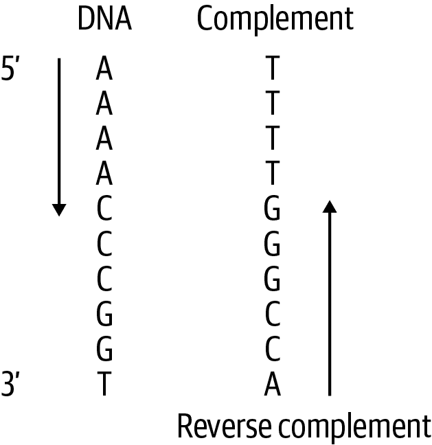
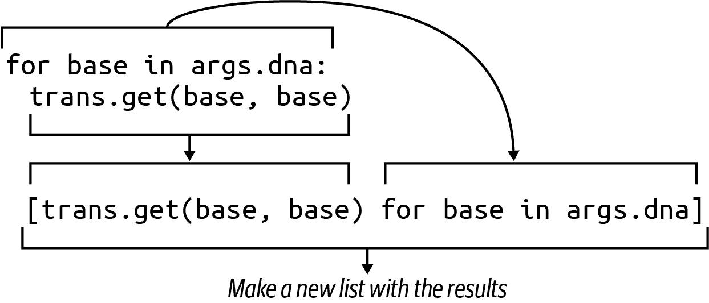
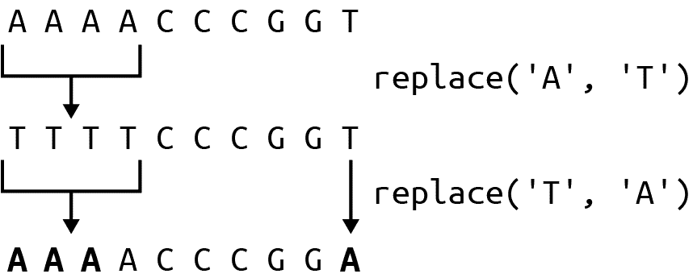

# 第三章：DNA 的反向互补：字符串操作

[Rosalind REVC 挑战](https://oreil.ly/ot4z6)解释 DNA 的碱基形成*A-T*和*G-C*的配对。此外，DNA 具有方向性，通常从 5'-端（*五端*）向 3'-端（*三端*）读取。如图 Figure 3-1 所示，DNA 字符串*AAAACCCGGT*的互补是*TTTTGGGCCA*。然后我反转这个字符串（从 3'-端读取）以获得*ACCGGGTTTT*作为反向互补。



###### 图 3-1\. DNA 的反向互补是从相反方向读取的互补序列

虽然你可以找到许多现有工具来生成 DNA 的反向互补序列——我将透露最终解决方案将使用 Biopython 库中的一个函数——但编写我们自己的算法的目的是探索 Python。在本章中，您将学习：

+   如何使用字典实现决策树作为查找表

+   如何动态生成列表或字符串

+   如何使用`reversed()`函数，这是迭代器的一个示例

+   Python 如何类似地处理字符串和列表

+   如何使用列表推导生成列表

+   如何使用`str.maketrans()`和`str.translate()`来转换一个字符串

+   如何使用 Biopython 的`Bio.Seq`模块

+   真正的宝藏是你沿途结交的朋友

# 入门指南

此程序的代码和测试位于*03_revc*目录中。为了了解程序如何工作，请切换到该目录并将第一个解决方案复制到名为`revc.py`的程序中：

```py
$ cd 03_revc
$ cp solution1_for_loop.py revc.py
```

运行程序时使用`--help`来查看使用方法：

```py
$ ./revc.py --help
usage: revc.py [-h] DNA

Print the reverse complement of DNA

positional arguments:
  DNA         Input sequence or file

optional arguments:
  -h, --help  show this help message and exit
```

程序需要`DNA`并将打印反向互补序列，所以我会给它一个字符串：

```py
$ ./revc.py AAAACCCGGT
ACCGGGTTTT
```

正如帮助文档所示，程序还将接受文件作为输入。第一个测试输入有相同的字符串：

```py
$ cat tests/inputs/input1.txt
AAAACCCGGT
```

因此输出应该是相同的：

```py
$ ./revc.py tests/inputs/input1.txt
ACCGGGTTTT
```

我想让程序的规格稍微难一点，这样测试就会通过大小写的混合。输出应该尊重输入的大小写：

```py
$ ./revc.py aaaaCCCGGT
ACCGGGtttt
```

运行**`pytest`**（或**`make test`**）来查看程序应该通过哪些类型的测试。当你对程序的预期功能感到满意时，重新开始：

```py
$ new.py -f -p 'Print the reverse complement of DNA' revc.py
Done, see new script "revc.py".
```

编辑`get_args()`函数，直到程序将打印前面的用法。然后修改您的程序，以便它将从命令行或输入文件中回显输入：

```py
$ ./revc.py AAAACCCGGT
AAAACCCGGT
$ ./revc.py tests/inputs/input1.txt
AAAACCCGGT
```

如果你运行测试套件，你应该会发现你的程序通过了前三个测试：

```py
$ pytest -xv
============================= test session starts ==============================
...

tests/revc_test.py::test_exists PASSED                                   [ 14%]
tests/revc_test.py::test_usage PASSED                                    [ 28%]
tests/revc_test.py::test_no_args PASSED                                  [ 42%]
tests/revc_test.py::test_uppercase FAILED                                [ 57%]

=================================== FAILURES ===================================
________________________________ test_uppercase ________________________________

    def test_uppercase():
        """ Runs on uppercase input """

        rv, out = getstatusoutput(f'{RUN} AAAACCCGGT')
        assert rv == 0
>       assert out == 'ACCGGGTTTT'
E       AssertionError: assert 'AAAACCCGGT' == 'ACCGGGTTTT'
E         - ACCGGGTTTT
E         + AAAACCCGGT

tests/revc_test.py:47: AssertionError
=========================== short test summary info ============================
FAILED tests/revc_test.py::test_uppercase - AssertionError: assert 'AAAACCCGG...
!!!!!!!!!!!!!!!!!!!!!!!!!! stopping after 1 failures !!!!!!!!!!!!!!!!!!!!!!!!!!!
========================= 1 failed, 3 passed in 0.33s ==========================
```

程序正在传递输入字符串`AAAACCCGGT`，并且测试期望它打印`ACCGGGTTTT`。由于程序正在回显输入，这个测试失败了。如果您认为自己能写一个满足这些测试的程序，就去做吧。否则，我将向您展示如何创建 DNA 的反向互补序列，从简单的方法开始，逐步发展到更优雅的解决方案。

## 遍历反向字符串

在创建 DNA 的反向互补物时，首先反转序列再补充，或者反之，都没有关系。 无论哪种方式，您都会得到相同的答案，所以我将从如何反转字符串开始。 在第二章中，我展示了如何使用字符串切片获取字符串的一部分。 如果省略起始位置，它将从开头开始：

```py
>>> dna = 'AAAACCCGGT'
>>> dna[:2]
'AA'
```

如果省略了停止位置，它将进行到末尾：

```py
>>> dna[-2:]
'GT'
```

如果省略了起始和停止位置，它将返回整个字符串的副本：

```py
>>> dna[:]
'AAAACCCGGT'
```

它还需要一个可选的第三个参数来指示步长。我可以使用没有参数的情况下开始和停止，步长为`-1`来反转字符串：

```py
>>> dna[::-1]
'TGGCCCAAAA'
```

Python 还有一个内置的`reversed()`函数，所以我会尝试一下：

```py
>>> reversed(dna)
<reversed object at 0x7ffc4c9013a0>
```

惊喜！ 您可能希望看到字符串`TGGCCCAAAA`。 但是，如果您在 REPL 中阅读`help(reversed)`，您会发现该函数将“返回给定序列的值的反向迭代器。”

什么是*迭代器*？Python 的[函数式编程指南](https://oreil.ly/dIzn3)将迭代器描述为“代表数据流的对象。” 我提到过*可迭代*是 Python 可以单独访问的一些项目的集合；例如，字符串的字符或列表中的元素。 迭代器是一种在耗尽之前将生成值的东西。 就像我可以从字符串的第一个字符（或列表的第一个元素或文件的第一行）开始阅读直到字符串的结尾（或列表或文件）一样，迭代器可以从它产生的第一个值迭代到它完成的位置。

在这种情况下，`reversed()`函数返回一个承诺，即在出现需要时立即产生反转的值。 这是一个*惰性*函数的示例，因为它等待被迫执行任何工作。 强制从`reversed()`中获取值的一种方法是使用将消耗值的函数。 例如，如果唯一的目标是反转字符串，那么我可以使用`str.join()`函数。 我总觉得这个函数的语法是反向的，但您经常会在用于连接序列的字符串文字上调用`str.join()`方法：

```py
>>> ''.join(reversed(dna)) 
'TGGCCCAAAA'
```


使用空字符串连接 DNA 字符串的反转字符。

另一种方法使用`list()`函数强制`reversed()`生成值：

```py
>>> list(reversed(dna))
['T', 'G', 'G', 'C', 'C', 'C', 'A', 'A', 'A', 'A']
```

等等，发生了什么？ `dna`变量是一个字符串，但我得到了一个列表——不仅仅是因为我使用了`list()`函数。 `reversed()`的文档显示该函数接受一个*序列*，这意味着任何返回一个东西然后另一个东西的数据结构或函数。 在列表或迭代器上下文中，Python 将字符串视为字符列表：

```py
>>> list(dna)
['A', 'A', 'A', 'A', 'C', 'C', 'C', 'G', 'G', 'T']
```

一个更长的构建反向 DNA 序列的方法是使用`for`循环来迭代逆转的碱基，并将它们附加到一个字符串中。首先我将声明一个`rev`变量，然后使用`+=`运算符以逆序附加每个碱基：

```py
>>> rev = '' 
>>> for base in reversed(dna): 
...     rev += base 
...
>>> rev
'TGGCCCAAAA'
```


用空字符串初始化`rev`变量。


逆转 DNA 的碱基。


将当前碱基附加到`rev`变量。

但由于我仍然需要补全碱基，所以还没有完全完成。

## 创建决策树

一共有八种互补：*A* 到 *T* 和 *G* 到 *C*，包括大小写，然后反过来。我还需要处理字符不是 *A*、*C*、*G* 或 *T* 的情况。我可以使用`if`/`elif`语句创建一个决策树。我将变量更改为`revc`，因为现在它是反向互补，我将找出每个碱基的正确互补。

```py
revc = '' 
for base in reversed(dna): 
    if base == 'A': 
        revc += 'T' 
    elif base == 'T':
        revc += 'A'
    elif base == 'G':
        revc += 'C'
    elif base == 'C':
        revc += 'G'
    elif base == 'a':
        revc += 't'
    elif base == 't':
        revc += 'a'
    elif base == 'g':
        revc += 'c'
    elif base == 'c':
        revc += 'g'
    else: 
        revc += base
```


初始化一个变量来保存反向互补字符串。


逆转 DNA 字符串中的碱基。


测试每个大写和小写碱基。


将补充的碱基附加到变量中。


如果碱基与这些测试中的任何一个不匹配，则使用原始碱基。

如果检查`revc`变量，它看起来是正确的：

```py
>>> revc
'ACCGGGTTTT'
```

您应该能够将这些想法整合到一个能通过测试套件的程序中。要理解程序的确切预期结果，请查看*tests/revc_test.py*文件。在通过`test_uppercase()`函数后，查看`test_lowercase()`函数的预期结果：

```py
def test_lowercase():
    """ Runs on lowercase input """

    rv, out = getstatusoutput(f'{RUN} aaaaCCCGGT') 
    assert rv == 0 
    assert out == 'ACCGGGtttt' 
```


使用小写和大写 DNA 字符串运行程序。


退出值应为`0`。


程序的输出应该是指定的字符串。

下一步测试将使用文件名而不是字符串作为输入：

```py
def test_input1():
    """ Runs on file input """

    file, expected = TEST1 
    rv, out = getstatusoutput(f'{RUN} {file}') 
    assert rv == 0 
    assert out == open(expected).read().rstrip() 
```


`TEST1` 元组是一个输入文件和一个期望输出文件。


使用文件名运行程序。


确保退出值为`0`。


打开并读取预期文件，然后将其与输出进行比较。

阅读和理解测试代码同样重要，因为学习如何编写解决方案。当你编写程序时，你可能会发现可以从这些测试中借鉴许多想法，节省时间。

## 重构

尽管上一节中的算法将产生正确答案，但它并不是一个优雅的解决方案。然而，这是一个可以开始的地方，通过了测试。现在你也许对挑战有了更好的理解，是时候重构程序了。我提出的一些解决方案只有一两行代码。以下是你可以考虑的一些想法：

+   使用字典作为查找表，而不是`if`/`elif`链。

+   将`for`循环重写为列表推导。

+   使用`str.translate()`方法来补充碱基。

+   创建一个`Bio.Seq`对象并找到能为你完成此任务的方法。

没有必要急于向前阅读。花时间尝试其他解决方案。我还没有介绍所有这些想法，所以我鼓励你研究任何不明白的地方，看看你是否能够自己弄清楚。

我记得音乐学校的一位老师与我分享过这句话：

> 然后一位老师说，告诉我们如何教导。
> 
> 他说：
> 
> 没有人可以向你揭示除了已经半睡在你知识的黎明中的东西。
> 
> 在寺庙的阴影中行走，他在追随者中间，不是给予他的智慧，而是给予他的信仰和爱。
> 
> 如果他确实是聪明的，他不会命令你进入他智慧的殿堂，而是会引导你到你自己心灵的门槛。
> 
> 卡里尔·贾伯兰

# 解决方案

所有解决方案都共享相同的`get_args()`函数，如下所示：

```py
class Args(NamedTuple): 
    """ Command-line arguments """
    dna: str

# --------------------------------------------------
def get_args() -> Args:
    """ Get command-line arguments """

    parser = argparse.ArgumentParser(
        description='Print the reverse complement of DNA',
        formatter_class=argparse.ArgumentDefaultsHelpFormatter)

    parser.add_argument('dna', metavar='DNA', help='Input sequence or file')

    args = parser.parse_args()

    if os.path.isfile(args.dna): 
        args.dna = open(args.dna).read().rstrip()

    return Args(args.dna) 
```


该程序的唯一参数是一个 DNA 字符串。


处理读取文件输入的情况。


返回一个`Args`对象，以符合函数签名。

## 解决方案 1：使用 for 循环和决策树

这是我的第一个解决方案，使用`if`/`else`决策树：

```py
def main() -> None:
    args = get_args()
    revc = '' 

    for base in reversed(args.dna): 
        if base == 'A': 
            revc += 'T'
        elif base == 'T':
            revc += 'A'
        elif base == 'G':
            revc += 'C'
        elif base == 'C':
            revc += 'G'
        elif base == 'a':
            revc += 't'
        elif base == 't':
            revc += 'a'
        elif base == 'g':
            revc += 'c'
        elif base == 'c':
            revc += 'g'
        else:
            revc += base

    print(revc) 
```


初始化一个变量来保存反向互补序列。


遍历 DNA 参数的反向碱基。


创建一个`if`/`elif`决策树来确定每个碱基的互补碱基。


打印结果。

## 解决方案 2：使用字典查找

我提到过，`if`/`else`链是应该尽量替换的。这是 18 行代码（LOC），可以更轻松地使用字典查找表示：

```py
>>> trans = {
...     'A': 'T', 'C': 'G', 'G': 'C', 'T': 'A',
...     'a': 't', 'c': 'g', 'g': 'c', 't': 'a'
... }
```

如果我使用`for`循环遍历 DNA 字符串，我可以使用`dict.get()`方法安全地请求 DNA 字符串中的每个碱基来创建互补序列（见图 3-1）。请注意，我将使用`base`作为`dict.get()`的可选第二个参数。如果碱基不存在于查找表中，则将默认使用碱基本身，就像第一个解决方案中的`else`情况一样：

```py
>>> for base in 'AAAACCCGGT':
...     print(base, trans.get(base, base))
...
A T
A T
A T
A T
C G
C G
C G
G C
G C
T A
```

我可以创建一个`complement`变量来保存我生成的新字符串：

```py
>>> complement = ''
>>> for base in 'AAAACCCGGT':
...     complement += trans.get(base, base)
...
>>> complement
'TTTTGGGCCA'
```

你之前看到过，在字符串上使用`reversed()`函数会以相反的顺序返回字符串的字符列表：

```py
>>> list(reversed(complement))
['A', 'C', 'C', 'G', 'G', 'G', 'T', 'T', 'T', 'T']
```

我可以使用`str.join()`函数从列表创建一个新字符串：

```py
>>> ''.join(reversed(complement))
'ACCGGGTTTT'
```

当我将所有这些想法结合在一起时，`main()`函数变得明显更短。这也更容易扩展，因为向决策树添加新分支只需要向字典添加新的键/值对：

```py
def main() -> None:
    args = get_args()
    trans = { 
        'A': 'T', 'C': 'G', 'G': 'C', 'T': 'A',
        'a': 't', 'c': 'g', 'g': 'c', 't': 'a'
    }

    complement = '' 
    for base in args.dna: 
        complement += trans.get(base, base) 

    print(''.join(reversed(complement))) 
```


这是一个字典，展示了如何将一个碱基翻译成其互补碱基。


初始化一个变量来保存 DNA 互补序列。


遍历 DNA 字符串中的每个碱基。


将碱基的翻译或碱基本身附加到互补序列中。


反转互补序列并在空字符串上连接结果。

Python 字符串和列表在某种程度上是可互换的。我可以将`complement`变量更改为列表，程序中的其他内容都不会改变：

```py
def main() -> None:
    args = get_args()
    trans = {
        'A': 'T', 'C': 'G', 'G': 'C', 'T': 'A',
        'a': 't', 'c': 'g', 'g': 'c', 't': 'a'
    }

    complement = [] 
    for base in args.dna:
        complement += trans.get(base, base)

    print(''.join(reversed(complement)))
```


将互补序列初始化为空列表而不是字符串。

我在这里强调 `+=` 运算符可以用于字符串和列表，以在末尾追加一个新值。还有一个 `list.append()` 方法也可以实现相同的效果：

```py
for base in args.dna:
    complement.append(trans.get(base, base))
```

`reversed()` 函数在列表上的效果与在字符串上的效果一样好。对我来说，使用两种不同类型的 `complement` 结果对代码的影响如此之小，这有些引人注目。

## 解决方案 3：使用列表推导式

我建议你使用列表推导式，而没有告诉你它是什么。如果你以前从未使用过，它本质上是在用于创建新列表的方括号（`[]`）内部写一个 `for` 循环的方式（见图 3-2）。当 `for` 循环的目标是构建一个新的字符串或列表时，使用列表推导式要明智得多。



###### 图 3-2\. 列表推导式使用 `for` 循环生成一个新列表

这将三行初始化 `complement` 并循环遍历 DNA 字符串的操作缩短为一行：

```py
def main() -> None:
    args = get_args()
    trans = {
        'A': 'T', 'C': 'G', 'G': 'C', 'T': 'A',
        'a': 't', 'c': 'g', 'g': 'c', 't': 'a'
    }

    complement = [trans.get(base, base) for base in args.dna] 
    print(''.join(reversed(complement)))
```


用列表推导式替换 `for` 循环。

由于 `complement` 变量只使用一次，我甚至可以通过直接使用列表推导式来进一步缩短这个过程：

```py
print(''.join(reversed([trans.get(base, base) for base in args.dna])))
```

这是可以接受的，因为该行的长度小于 PEP8 建议的 79 个字符的最大值，但它不如较长版本易读。你应该使用你认为最容易理解的版本。

## 解决方案 4：使用 str.translate()

在第二章中，我使用 `str.replace()` 方法将所有的 *T* 替换为 *U*，当将 DNA 转录为 RNA 时。我能在这里使用吗？让我们试试。我将从初始化 DNA 字符串并将 *A* 替换为 *T* 开始。请记住，字符串是 *不可变* 的，这意味着我不能直接更改一个字符串，而是必须用新值覆盖字符串：

```py
>>> dna = 'AAAACCCGGT'
>>> dna = dna.replace('A', 'T')
```

现在让我们看看 DNA 字符串：

```py
>>> dna
'TTTTCCCGGT'
```

你能看到这里开始出错了吗？我现在将 *T* 补足为 *A*，看看你能否发现问题：

```py
>>> dna = dna.replace('T', 'A')
>>> dna
'AAAACCCGGA'
```

正如图 3-3 所示，第一步中转变为 *T* 的所有 *A* 刚刚又变回了 *A*。哦，这会让人发疯的。



###### 图 3-3\. 迭代使用 `str.replace()` 导致值的双重替换和错误的答案

幸运的是，Python 有 `str.translate()` 函数，专门用于这个目的。如果你阅读 **`help(str.translate)`**，你会发现该函数需要一个“必须是 Unicode 序数到 Unicode 序数、字符串或 `None` 的映射”的表格。`trans` 字典表将起到作用，但首先，它必须传递给 `str.maketrans()` 函数，以将补充表转换为使用键的 *序数* 值的形式：

```py
>>> trans = {
...     'A': 'T', 'C': 'G', 'G': 'C', 'T': 'A',
...     'a': 't', 'c': 'g', 'g': 'c', 't': 'a'
... }
>>> str.maketrans(trans)
{65: 'T', 67: 'G', 71: 'C', 84: 'A', 97: 't', 99: 'g', 103: 'c', 116: 'a'}
```

你可以看到字符串键 `A` 被转换为整数值 `65`，这与 `ord()` 函数返回的值相同：

```py
>>> ord('A')
65
```

这个值表示 ASCII（美国标准信息交换码表，发音为 as-key）表中字符*A*的序数位置。也就是说，*A*是表中的第 65 个字符。`chr()`函数将颠倒此过程，提供由序数值表示的字符：

```py
>>> chr(65)
'A'
```

`str.translate()`函数要求互补表具有键的序数值，这正是我从`str.maketrans()`中获取的：

```py
>>> 'AAAACCCGGT'.translate(str.maketrans(trans))
'TTTTGGGCCA'
```

最后，我需要反向互补。这里有一个融合了所有这些想法的解决方案：

```py
def main() -> None:
    args = get_args()

    trans = str.maketrans({ 
        'A': 'T', 'C': 'G', 'G': 'C', 'T': 'A',
        'a': 't', 'c': 'g', 'g': 'c', 't': 'a'
    })
    print(''.join(reversed(args.dna.translate(trans)))) 
```


创建用于`str.translate()`函数的翻译表。


使用`trans`表互补 DNA。反转并连接成新字符串。

不过，等等——还有更多！还有另一种更简短的写法。根据`help(str.translate)`文档：

> 如果只有一个参数，它必须是将 Unicode 序数（整数）或字符映射到 Unicode 序数、字符串或`None`的字典。字符键将被转换为序数。*如果有两个参数，它们必须是长度相等的字符串，且在生成的字典中，`x`中的每个字符将映射到`y`中相同位置的字符。*

因此，我可以删除`trans`字典，并像这样编写整个解决方案：

```py
def main() -> None:
    args = get_args()
    trans = str.maketrans('ACGTacgt', 'TGCAtgca') 
    print(''.join(reversed(args.seq.translate(trans)))) 
```


使用长度相等的两个字符串制作翻译表。


创建反向互补。

如果你想毁掉某人的一天——很可能那个人会是未来的你——你甚至可以将其压缩成一行代码。

## 解决方案 5：使用 Bio.Seq

在本章开头我告诉过你，最终的解决方案将涉及一个现有的函数。¹ 许多从事生物信息学的 Python 程序员共同贡献了一套名为[Biopython](https://biopython.org)的模块。他们编写并测试了许多非常有用的算法，当你可以使用他人的代码时，自己编写代码很少有意义。

确保你已经先通过运行以下命令安装了`biopython`：

```py
$ python3 -m pip install biopython
```

我可以使用`import Bio`来导入整个模块，但只导入我需要的代码更加合理。这里我只需要`Seq`类：

```py
>>> from Bio import Seq
```

现在我可以使用`Seq.reverse_complement()`函数：

```py
>>> Seq.reverse_complement('AAAACCCGGT')
'ACCGGGTTTT'
```

这个最终的解决方案是我推荐的版本，因为它是最短的，而且使用了现有的、经过充分测试和文档化的模块，在 Python 生物信息学中几乎无处不在：

```py
def main() -> None:
    args = get_args()
    print(Seq.reverse_complement(args.dna)) 
```


使用 `Bio.Seq.reverse_complement()` 函数。

当您在此解决方案上运行 `mypy` 时（您确实在每一个程序上运行 `mypy`，对吗？），您可能会收到以下错误：

```py
=================================== FAILURES ===================================
___________________________________ revc.py ____________________________________
6: error: Skipping analyzing 'Bio': found module but no type hints or library
    stubs
6: note: See https://mypy.readthedocs.io/en/latest/running_mypy.html#missing
    -imports
===================================== mypy =====================================
Found 1 error in 1 file (checked 2 source files)
mypy.ini: No [mypy] section in config file

=========================== short test summary info ============================
FAILED revc.py::mypy
!!!!!!!!!!!!!!!!!!!!!!!!!! stopping after 1 failures !!!!!!!!!!!!!!!!!!!!!!!!!!!
========================= 1 failed, 1 skipped in 0.20s =========================
```

要消除此错误，您可以告诉 `mypy` 忽略缺少类型注解的导入文件。在本书的 [GitHub 仓库的根目录](https://oreil.ly/RpMgV) 中，您将找到名为 *mypy.ini* 的文件，其内容如下：

```py
$ cat mypy.ini
[mypy]
ignore_missing_imports = True
```

向任何工作目录添加 *mypy.ini* 文件允许您对 `mypy` 在相同目录中运行时使用的默认值进行更改。如果您希望进行全局更改，以便 `mypy` 无论您在哪个目录中都使用这些内容，则将相同内容放入 *$HOME/.mypy.ini* 中。

# 复习

手动创建 DNA 的反向互补序列是一种入门仪式。这是我展示的内容：

+   您可以使用一系列 `if`/`else` 语句或使用字典作为查找表来编写决策树。

+   字符串和列表非常相似。两者都可以使用 `for` 循环进行迭代，而 `+=` 运算符可用于向两者附加元素。

+   列表推导使用 `for` 循环来迭代一个序列并生成新列表。

+   `reversed()` 函数是一个惰性函数，它将以相反的顺序返回序列的迭代器。

+   您可以在 REPL 中使用 `list()` 函数来强制执行惰性函数、迭代器和生成器，以生成它们的值。

+   `str.maketrans()` 和 `str.translate()` 函数可以执行字符串替换并生成新字符串。

+   `ord()` 函数返回字符的序数值，而 `chr()` 函数则根据给定的序数值返回字符。

+   Biopython 是专门用于生物信息学的模块和函数集合。创建 DNA 的反向互补序列的首选方法是使用 `Bio.Seq.reverse_complement()` 函数。

¹ 这有点像我的高中微积分老师花了一周时间教我们如何进行手动导数，然后展示了如何在 20 秒内通过拉下指数等方式完成。
