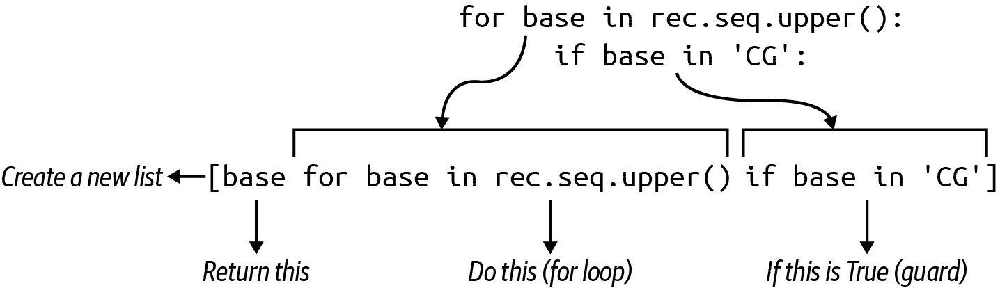

# 第五章：计算 GC 含量：解析 FASTA 和分析序列

在第一章中，你统计了 DNA 字符串中的所有碱基。在这个练习中，你需要计算序列中的*G*和*C*的数量，并除以序列的长度，以确定 GC 含量，如[Rosalind GC 页面](https://oreil.ly/gv8V7)所述。GC 含量在几个方面具有信息性。较高的 GC 含量水平表明在分子生物学中相对较高的熔解温度，并且编码蛋白质的 DNA 序列倾向于在富含 GC 的区域中找到。解决此问题的方法有很多种，它们都始于使用 Biopython 解析 FASTA 文件，这是生物信息学中的一个关键文件格式。我将向你展示如何使用`Bio.SeqIO`模块迭代文件中的序列，以识别具有最高 GC 含量的序列。

你将学到：

+   如何使用`Bio.SeqIO`解析 FASTA 格式

+   如何读取`STDIN`（读音为*standard in*）

+   使用列表理解、`filter()`和`map()`表达`for`循环的几种方法

+   如何解决运行时挑战，如解析大文件时的内存分配。

+   关于`sorted()`函数的更多信息

+   如何在格式字符串中包含格式化指令

+   如何使用`sum()`函数将一组数字相加

+   如何使用正则表达式在字符串中计算模式的出现次数

# 入门指南

此程序的所有代码和测试位于*05_gc*目录中。虽然我想将此程序命名为`gc.py`，但事实证明这与一个非常重要的名为[`gc.py`](https://oreil.ly/7eNBw)的 Python 模块发生了冲突，该模块用于垃圾回收，例如释放内存。相反，我将使用`cgc.py`代替*calculate GC*。

如果我将我的程序命名为`gc.py`，我的代码将会*遮蔽*内置的`gc`模块，使其不可用。同样，我可以创建具有名称`len`或`dict`的变量和函数，这将遮蔽那些内置函数。这将导致许多不良情况发生，因此最好避免使用这些名称。诸如`pylint`和`flake8`之类的程序可以发现这样的问题。

首先复制第一个解决方案并要求用法：

```py
$ cp solution1_list.py cgc.py
$ ./cgc.py -h
usage: cgc.py [-h] [FILE] 

Compute GC content

positional arguments:
  FILE        Input sequence file (default: <_io.TextIOWrapper 
              name='<stdin>' mode='r' encoding='utf-8'>)

optional arguments:
  -h, --help  show this help message and exit
```


注意，位置参数`[FILE]`位于方括号中，表示它是可选的。


这是一个相当丑陋的消息，试图解释默认输入是`STDIN`。

如第二章所述，该程序期望一个文件作为输入，并将拒绝无效或无法读取的文件。为了说明第二点，使用`touch`创建一个空文件，然后使用`chmod`（改变模式）将权限设置为`000`（所有读/写/执行位关闭）：

```py
$ touch cant-touch-this
$ chmod 000 cant-touch-this
```

注意，错误消息明确告诉我我缺少读取文件的权限：

```py
$ ./cgc.py cant-touch-this
usage: cgc.py [-h] [FILE]
cgc.py: error: argument FILE: can't open 'cant-touch-this': [Errno 13]
Permission denied: 'cant-touch-this'
```

现在用有效的输入运行程序，并观察程序打印具有最高 GC 百分比的记录的 ID：

```py
$ ./cgc.py tests/inputs/1.fa
Rosalind_0808 60.919540
```

该程序还可以从`STDIN`中读取。仅仅因为我觉得有趣，我会向你展示如何在`bash` shell 中使用管道操作符（`|`）将一个程序的`STDOUT`输出路由到另一个程序的`STDIN`中。例如，`cat`程序会将文件的内容打印到`STDOUT`：

```py
$ cat tests/inputs/1.fa
>Rosalind_6404
CCTGCGGAAGATCGGCACTAGAATAGCCAGAACCGTTTCTCTGAGGCTTCCGGCCTTCCC
TCCCACTAATAATTCTGAGG
>Rosalind_5959
CCATCGGTAGCGCATCCTTAGTCCAATTAAGTCCCTATCCAGGCGCTCCGCCGAAGGTCT
ATATCCATTTGTCAGCAGACACGC
>Rosalind_0808
CCACCCTCGTGGTATGGCTAGGCATTCAGGAACCGGAGAACGCTTCAGACCAGCCCGGAC
TGGGAACCTGCGGGCAGTAGGTGGAAT
```

使用管道，我可以将其提供给我的程序：

```py
$ cat tests/inputs/1.fa | ./cgc.py
Rosalind_0808 60.919540
```

我也可以使用`<`操作符从文件中重定向输入：

```py
$ ./cgc.py < tests/inputs/1.fa
Rosalind_0808 60.919540
```

要开始，请删除此程序并重新开始：

```py
$ new.py -fp 'Compute GC content' cgc.py
Done, see new script "cgc.py".
```

以下显示如何修改程序的第一部分以接受一个单一的位置参数，该参数是一个有效的可读文件：

```py
import argparse
import sys
from typing import NamedTuple, TextIO, List, Tuple
from Bio import SeqIO

class Args(NamedTuple):
    """ Command-line arguments """
    file: TextIO 

def get_args() -> Args:
    """ Get command-line arguments """

    parser = argparse.ArgumentParser(
        description='Compute GC content',
        formatter_class=argparse.ArgumentDefaultsHelpFormatter)

    parser.add_argument('file',
                        metavar='FILE',
                        type=argparse.FileType('rt'), 
                        nargs='?',
                        default=sys.stdin,
                        help='Input sequence file')

    args = parser.parse_args()

    return Args(args.file)
```


`Args`类的唯一属性是一个文件句柄。


创建一个位置参数文件，如果提供，必须是可读的文本文件。

很少将位置参数设为可选，但在这种情况下，我想要处理一个单个文件输入或者从`STDIN`读取。为此，我使用`nargs='?'`指示该参数应接受零个或一个参数（见表 2-2 中的“打开输出文件”）并设置`default=sys.stdin`。在第二章中，我提到`sys.stdout`是一个始终打开写入的文件句柄。类似地，`sys.stdin`是一个始终打开读取`STDIN`的文件句柄。这是使你的程序能够从文件或`STDIN`中读取的所有所需代码，我觉得这相当整洁和清晰。

修改你的`main()`函数以打印文件的名称：

```py
def main() -> None:
    args = get_args()
    print(args.file.name)
```

确保它能正常工作：

```py
$ ./cgc.py tests/inputs/1.fa
tests/inputs/1.fa
```

运行**`pytest`**来查看你的进展。你应该通过前三个测试，但在第四个测试上失败：

```py
$ pytest -xv
============================ test session starts ============================
....

tests/cgc_test.py::test_exists PASSED                                 [ 20%]
tests/cgc_test.py::test_usage PASSED                                  [ 40%]
tests/cgc_test.py::test_bad_input PASSED                              [ 60%]
tests/cgc_test.py::test_good_input1 FAILED                            [ 80%]

================================= FAILURES ==================================
_____________________________ test_good_input1 ______________________________

    def test_good_input1():
        """ Works on good input """

        rv, out = getstatusoutput(f'{RUN} {SAMPLE1}') 
        assert rv == 0
>       assert out == 'Rosalind_0808 60.919540' 
E       AssertionError: assert './tests/inputs/1.fa' == 'Rosalind_0808 60.919540'
E         - Rosalind_0808 60.919540 
E         + ./tests/inputs/1.fa 

tests/cgc_test.py:48: AssertionError
========================== short test summary info ==========================
FAILED tests/cgc_test.py::test_good_input1 - AssertionError: assert './tes...
!!!!!!!!!!!!!!!!!!!!!!!!! stopping after 1 failures !!!!!!!!!!!!!!!!!!!!!!!!!
======================== 1 failed, 3 passed in 0.34s ========================
```


测试正在使用第一个输入文件运行程序。


预期输出是给定的字符串。


这是预期的字符串。


这是打印出的字符串。

到目前为止，你已经通过相对较少的工作创建了一个语法正确、结构良好并且有文档的程序来验证文件输入。接下来，你需要找出如何找到 GC 含量最高的序列。

## 使用 Biopython 解析 FASTA 文件

来自传入文件或`STDIN`的数据应该是以 FASTA 格式表示的序列数据，这是表示生物序列的常见方式。让我们看看第一个文件，以了解格式：

```py
$ cat tests/inputs/1.fa
>Rosalind_6404 
CCTGCGGAAGATCGGCACTAGAATAGCCAGAACCGTTTCTCTGAGGCTTCCGGCCTTCCC 
TCCCACTAATAATTCTGAGG
>Rosalind_5959
CCATCGGTAGCGCATCCTTAGTCCAATTAAGTCCCTATCCAGGCGCTCCGCCGAAGGTCT
ATATCCATTTGTCAGCAGACACGC
>Rosalind_0808
CCACCCTCGTGGTATGGCTAGGCATTCAGGAACCGGAGAACGCTTCAGACCAGCCCGGAC
TGGGAACCTGCGGGCAGTAGGTGGAAT
```


FASTA 记录以行首的`>`开始。序列 ID 是直到第一个空格的任何后续文本。


序列可以是任意长度，可以跨多行或放在单行上。

FASTA 文件的头部可能会非常混乱，非常快速。我鼓励您从国家生物技术信息中心（NCBI）下载真实序列或查看*17_synth/tests/inputs*目录中的文件以获取更多示例。

虽然教您如何手动解析此文件可能很有趣（对于某些有趣的价值观来说），但我将直接使用 Biopython 的`Bio.SeqIO`模块：

```py
>>> from Bio import SeqIO
>>> recs = SeqIO.parse('tests/inputs/1.fa', 'fasta') 
```


第一个参数是输入文件的名称。由于此函数可以解析许多不同的记录格式，因此第二个参数是数据的格式。

我可以像往常一样使用`type()`来检查`recs`的类型：

```py
>>> type(recs)
<class 'Bio.SeqIO.FastaIO.FastaIterator'>
```

我已经几次展示了迭代器，甚至在第四章中创建了一个。在那个练习中，我使用`next()`函数从斐波那契数列生成器中获取下一个值。我将在这里做同样的事情，以获取第一个记录并检查其类型：

```py
>>> rec = next(recs)
>>> type(rec)
<class 'Bio.SeqRecord.SeqRecord'>
```

要了解有关序列记录的更多信息，我强烈建议您阅读[SeqRecord 文档](https://biopython.org/wiki/SeqRecord)，此外还可以在 REPL 中查看文档，您可以使用**`help(rec)`**查看。必须*解析*FASTA 记录的数据，这意味着从其语法和结构中辨别数据的含义。如果您在 REPL 中查看`rec`，您将看到类似于字典的输出。此输出与`repr(seq)`的输出相同，后者用于“返回对象的规范字符串表示”：

```py
SeqRecord(
  seq=Seq('CCTGCGGAAGATCGGCACTAGAATAGCCAGAACCGTTTCTCTGAGGCTTCCGGC...AGG'), 
  id='Rosalind_6404', 
  name='Rosalind_6404', 
  description='Rosalind_6404',
  dbxrefs=[])
```


序列的多行被连接成一个由`Seq`对象表示的单个序列。


FASTA 记录的`ID`是从`>`之后开始的标题中的所有字符，直到第一个空格。


`SeqRecord`对象还可以处理具有更多字段的数据，例如`name`、`description`和数据库交叉引用(`dbxrefs`)。由于这些字段在 FASTA 记录中不存在，ID 会被复制为`name`和`description`，而`dbxrefs`的值则为空列表。

如果打印序列，这些信息将被*字符串化*，因此更容易阅读。这个输出与`str(rec)`的输出相同，后者旨在提供对象的有用字符串表示：

```py
>>> print(rec)
ID: Rosalind_6404
Name: Rosalind_6404
Description: Rosalind_6404
Number of features: 0
Seq('CCTGCGGAAGATCGGCACTAGAATAGCCAGAACCGTTTCTCTGAGGCTTCCGGC...AGG')
```

对于这个程序来说，最突出的特性是记录的序列。你可能期望这是一个`str`，但实际上它是另一个对象：

```py
>>> type(rec.seq)
<class 'Bio.Seq.Seq'>
```

使用**`help(rec.seq)`**查看`Seq`对象提供的属性和方法。我只想要 DNA 序列本身，可以通过`str()`函数将序列强制转换为字符串来获取：

```py
>>> str(rec.seq)
'CCTGCGGAAGATCGGCACTAGAATAGCCAGAACCGTTTCTCTGAGGCTTCCGGCCTT...AGG'
```

注意，这是我在上一章的最后一个解决方案中使用的相同类，用于创建反向互补序列。我可以在这里这样使用它：

```py
>>> rec.seq.reverse_complement()
Seq('CCTCAGAATTATTAGTGGGAGGGAAGGCCGGAAGCCTCAGAGAAACGGTTCTGG...AGG')
```

`Seq`对象还有许多其他有用的方法，我鼓励你探索文档，因为这些方法可以节省大量时间。¹ 现在，你可能已经有足够的信息来完成挑战了。你需要遍历所有序列，确定*G*或*C*碱基的百分比，并返回具有最大值的记录的 ID 和 GC 含量。我建议你自己编写一个解决方案。如果需要更多帮助，我会展示一种方法，并介绍几种解决方案的变体。

## 使用`for`循环迭代序列

到目前为止，我已经展示了`SeqIO.parse()`接受文件名作为第一个参数，但`args.file`参数将是一个打开的文件句柄。幸运的是，该函数也接受这种形式：

```py
>>> from Bio import SeqIO
>>> recs = SeqIO.parse(open('./tests/inputs/1.fa'), 'fasta')
```

我可以使用`for`循环来遍历每个记录，打印出 ID 和每个序列的前 10 个碱基：

```py
>>> for rec in recs:
...     print(rec.id, rec.seq[:10])
...
Rosalind_6404 CCTGCGGAAG
Rosalind_5959 CCATCGGTAG
Rosalind_0808 CCACCCTCGT
```

请花一点时间再次运行这些代码，并注意什么也不会被打印出来：

```py
>>> for rec in recs:
...     print(rec.id, rec.seq[:10])
...
```

我之前展示了`recs`是一个`Bio.SeqIO.FastaIO.FastaIterator`，像所有迭代器一样，它会产生值直到耗尽。如果想要再次循环遍历记录，需要重新使用`SeqIO.parse()`函数创建`recs`对象。

暂时假设序列如下：

```py
>>> seq = 'CCACCCTCGTGGTATGGCT'
```

我需要找出字符串中有多少个*C*和*G*。我可以使用另一个`for`循环来迭代序列的每个碱基，并在碱基为*G*或*C*时增加一个计数器：

```py
gc = 0 
for base in seq: 
    if base in ('G', 'C'): 
        gc += 1 
```


初始化一个变量用于计算*G/C*碱基的计数。


迭代每个序列中的每个碱基（字符）。


看看元组中是否包含`G`或`C`的碱基。


增加 GC 计数器。

要找出 GC 含量的百分比，将 GC 计数除以序列的长度：

```py
>>> gc
12
>>> len(seq)
19
>>> gc / len(seq)
0.631578947368421
```

程序输出应为具有最高`GC`计数的序列的 ID，一个空格，并截断为六个有效数字的 GC 含量。格式化数字的最简单方法是了解更多关于`str.format()`的信息。`help`中没有太多文档，因此建议您阅读[PEP 3101](https://oreil.ly/OIpEq)以了解高级字符串格式化。

在第一章中，我展示了如何使用`{}`作为占位符来插入变量，无论是使用`str.format()`还是 f-string。您可以在花括号中的冒号（`:`）后添加格式化指令。这种语法看起来像类 C 语言中的`printf()`函数使用的语法，因此`{:0.6f}`是一个六位数的浮点数：

```py
>>> '{:0.6f}'.format(gc * 100 / len(seq))
'63.157895'
```

或者，直接在 f-string 内执行代码：

```py
>>> f'{gc * 100 / len(seq):0.06f}'
'63.157895'
```

要找出具有最大`GC`计数的序列，您有几个选项，我将在解决方案中都展示：

+   制作所有 ID 及其 GC 含量的列表（元组列表会很好用）。按照 GC 含量排序并取最大值。

+   记录最大值的 ID 和 GC 含量。在发现新的最大值时覆盖它。

我认为这应该足以让您完成一个解决方案。您可以做到。害怕是心灵的杀手。继续努力直到通过*所有*测试，包括那些用于检查代码风格和类型的测试。您的测试输出应该看起来像这样：

```py
$ make test
python3 -m pytest -xv --disable-pytest-warnings --flake8 --pylint
--pylint-rcfile=../pylintrc --mypy cgc.py tests/cgc_test.py
=========================== test session starts ===========================
...
collected 10 items

cgc.py::FLAKE8 SKIPPED                                              [  9%]
cgc.py::mypy PASSED                                                 [ 18%]
tests/cgc_test.py::FLAKE8 SKIPPED                                   [ 27%]
tests/cgc_test.py::mypy PASSED                                      [ 36%]
tests/cgc_test.py::test_exists PASSED                               [ 45%]
tests/cgc_test.py::test_usage PASSED                                [ 54%]
tests/cgc_test.py::test_bad_input PASSED                            [ 63%]
tests/cgc_test.py::test_good_input1 PASSED                          [ 72%]
tests/cgc_test.py::test_good_input2 PASSED                          [ 81%]
tests/cgc_test.py::test_stdin PASSED                                [ 90%]
::mypy PASSED                                                       [100%]
================================== mypy ===================================

Success: no issues found in 2 source files
====================== 9 passed, 2 skipped in 1.67s =======================
```

# 解决方案

与以往一样，所有解决方案共享相同的`get_args()`，因此只显示差异。

## 解决方案 1：使用列表

让我们来看看我的第一个解决方案。我总是试图从最明显和简单的方法开始，您会发现这通常是最冗长的。一旦理解了逻辑，希望您能够理解更强大和更简洁的表达相同想法的方式。对于这个第一个解决方案，确保还从`typing`模块中导入`List`和`Tuple`：

```py
def main() -> None:
    args = get_args()
    seqs: List[Tuple[float, str]] = [] 

    for rec in SeqIO.parse(args.file, 'fasta'): 
        gc = 0 
        for base in rec.seq.upper(): 
            if base in ('C', 'G'): 
                gc += 1 
        pct = (gc * 100) / len(rec.seq) 
        seqs.append((pct, rec.id)) 

    high = max(seqs) 
    print(f'{high[1]} {high[0]:0.6f}') 
```


初始化一个空列表以保存 GC 含量和序列 ID 的元组。


遍历输入文件中的每个记录。


初始化一个 GC 计数器。


遍历每个序列，将其大写以防止可能的混合大小写输入。


检查基序是否为*C*或*G*。


增加 GC 计数器。


计算 GC 含量。


添加一个新的元组，包括 GC 含量和序列 ID。


取最大值。


打印最高值的序列 ID 和 GC 含量。

变量`seqs`的类型注解`List[Tuple[float, str]]`不仅提供了一种通过像`mypy`这样的工具来程序化地检查代码的方式，还增加了一层文档说明。代码的读者不必跳到前面去看将要添加到列表中的数据类型，因为已经通过类型显式地描述了。

在这个解决方案中，我决定制作一个包含所有 ID 和 GC 百分比的列表，主要是为了展示如何创建元组列表。然后我想指出 Python 排序的一些神奇属性。让我们从`sorted()`函数开始，它在处理字符串时与你想象的一样有效：

```py
>>> sorted(['McClintock', 'Curie', 'Doudna', 'Charpentier'])
['Charpentier', 'Curie', 'Doudna', 'McClintock']
```

当所有值都是数字时，它们将按数字顺序排序，所以我得到了这个有点不错的功能：

```py
>>> sorted([2, 10, 1])
[1, 2, 10]
```

注意，相同的值*作为字符串*会按字典顺序排序：

```py
>>> sorted(['2', '10', '1'])
['1', '10', '2']
```

现在考虑一个元组列表，其中第一个元素是`float`，第二个元素是`str`。`sorted()`将如何处理这个列表？首先按第一个元素*数字*排序，然后按第二个元素*字典顺序*排序：

```py
>>> sorted([(0.2, 'foo'), (.01, 'baz'), (.01, 'bar')])
[(0.01, 'bar'), (0.01, 'baz'), (0.2, 'foo')]
```

将`seqs`结构化为`List[Tuple[float, str]]`利用了`sorted()`的内置行为，允许我快速地按 GC 含量对序列进行排序并选择最高值：

```py
>>> high = sorted(seqs)[-1]
```

这与找到最高值相同，`max()`函数可以更容易地实现：

```py
>>> high = max(seqs)
```

`high`是一个元组，第一个位置是序列 ID，零位置是需要格式化的 GC 含量：

```py
print(f'{high[1]} {high[0]:0.6f}')
```

## 解决方案 2：类型注解和单元测试

在`for`循环中隐藏着一个计算 GC 含量的代码片段，需要将其提取到一个带有测试的函数中。遵循测试驱动开发（TDD）的思想，我将首先定义一个`find_gc()`函数：

```py
def find_gc(seq: str) -> float: 
    """ Calculate GC content """

    return 0\. 
```


此函数接受一个`str`并返回一个`float`。


目前我返回 `0`。请注意，末尾的 `.` 告诉 Python 这是一个 `float`。这是 `0.0` 的简写。

接下来，我将定义一个函数作为单元测试。因为我使用 `pytest`，所以这个函数的名称必须以 `test_` 开头。因为我正在测试 `find_gc()` 函数，所以我将函数命名为 `test_find_gc`。我将使用一系列 `assert` 语句来测试函数对给定输入返回的预期结果。请注意，这个测试函数既作为正式测试，又作为额外的文档片段，因为读者可以看到输入和输出：

```py
def test_find_gc():
    """ Test find_gc """

    assert find_gc('') == 0\. 
    assert find_gc('C') == 100\. 
    assert find_gc('G') == 100\. 
    assert find_gc('CGCCG') == 100\. 
    assert find_gc('ATTAA') == 0.
    assert find_gc('ACGT') == 50.
```


如果一个函数接受一个 `str`，我总是从空字符串开始测试，以确保它返回一些有用的东西。


单个 `C` 应为 100% GC。


单个 `G` 也是如此。


各种其他测试混合各种百分比的碱基。

几乎不可能彻底检查函数的每个可能输入，因此我通常依赖于抽样检查。请注意，[`hypothesis` 模块](https://hypothesis.readthedocs.io/en/latest) 可以生成随机值进行测试。可以假设 `find_gc()` 函数足够简单，这些测试就足够了。我编写函数的目标是使其尽可能简单，但不简化。正如 Tony Hoare 所说，“编写代码有两种方式：编写简单到明显没有错误的代码，或者编写复杂到明显没有明显错误的代码。”

`find_gc()` 和 `test_find_gc()` 函数在 `cgc.py` 程序中，而不在 *tests/cgc_test.py* 模块中。要执行单元测试，我在源代码上运行 `pytest`，*期望测试失败*：

```py
$ pytest -v cgc.py
============================ test session starts ============================
...

cgc.py::test_find_gc FAILED                                           [100%] 

================================= FAILURES ==================================
__________________________________ test_gc __________________________________

    def test_find_gc():
        """ Test find_gc """

        assert find_gc('') == 0\. 
>       assert find_gc('C') == 100\. 
E       assert 0 == 100.0
E         +0
E         -100.0

cgc.py:74: AssertionError
========================== short test summary info ==========================
FAILED cgc.py::test_gc - assert 0 == 100.0
============================= 1 failed in 0.32s =============================
```


单元测试如预期般失败。


第一个测试通过，因为预期结果是`0`。


这个测试失败，因为它应该返回 `100`。

现在我已经建立了一个基准，可以继续进行。我知道我的代码未能达到某些期望，这是通过测试正式定义的。为了解决这个问题，我将`main()`中的所有相关代码移动到函数中：

```py
def find_gc(seq: str) -> float:
    """ Calculate GC content """

    if not seq: 
        return 0 

    gc = 0 
    for base in seq.upper():
        if base in ('C', 'G'):
            gc += 1

    return (gc * 100) / len(seq)
```


当序列为空字符串时，防止尝试除以 0。


如果没有序列，GC 含量为 0。


这与之前的代码相同。

然后再次运行`pytest`检查函数是否工作：

```py
$ pytest -v cgc.py
============================ test session starts ============================
...

cgc.py::test_gc PASSED                                                [100%]

============================= 1 passed in 0.30s =============================
```

这是 TDD：

+   定义一个测试函数。

+   编写测试。

+   确保函数未通过测试。

+   使函数工作。

+   确保函数通过测试（并且所有之前的测试仍然通过）。

如果以后遇到导致我的代码出现错误的序列，我会修复代码并将其添加为更多测试。我不应该担心像`find_gc()`函数接收`None`或整数列表这样的奇怪情况*因为我使用了类型注解*。测试是有用的。类型注解是有用的。结合测试和类型可以使代码更易于验证和理解。

我想对这个解决方案进行另一个添加：一个自定义类型来记录持有 GC 含量和序列 ID 的元组。我将其称为`MySeq`，只是为了避免与`Bio.Seq`类产生混淆。我在`Args`定义下面添加了这个：

```py
class MySeq(NamedTuple):
    """ Sequence """
    gc: float 
    name: str 
```


GC 含量是一个百分比。


我更愿意使用字段名`id`，但那与内置于 Python 中的`id()`*标识*函数冲突。

下面是如何将其合并到代码中的方法：

```py
def main() -> None:
    args = get_args()
    seqs: List[MySeq] = [] 

    for rec in SeqIO.parse(args.file, 'fasta'):
        seqs.append(MySeq(find_gc(rec.seq), rec.id)) 

    high = sorted(seqs)[-1] 
    print(f'{high.name} {high.gc:0.6f}') 
```


使用`MySeq`作为类型注解。


使用来自`find_gc()`函数的返回值和记录 ID 创建`MySeq`。


这仍然有效，因为`MySeq`是一个元组。


使用字段访问而不是元组的索引位置。

这个版本的程序可能更容易阅读。您可以创建尽可能多的自定义类型来更好地记录和测试您的代码。

## 解决方案 3：保持运行的最大变量

前一个解决方案效果不错，但有点啰嗦，并且在我只关心最大值时无谓地跟踪*所有*序列。考虑到测试输入很小，这永远不会成为问题，但生物信息学始终关注扩展。试图存储所有序列的解决方案最终会导致内存耗尽。考虑处理 100 万、10 亿或 1000 亿序列。最终，内存会耗尽。

这是一个能够适应任意序列数量的解决方案，因为它只分配一个单个元组来记住最高值：

```py
def main():
    args = get_args()
    high = MySeq(0., '') 

    for rec in SeqIO.parse(args.file, 'fasta'):
        pct = find_gc(rec.seq) 
        if pct > high.gc: 
            high = MySeq(pct, rec.id) 

    print(f'{high.name} {high.gc:0.6f}') 
```


初始化一个变量来记住最高值。类型注释是多余的，因为`mypy`将期望此变量始终保持此类型。


计算 GC 含量。


查看 GC 百分比是否大于最高值。


如果是，使用这个百分比 GC 和序列 ID 覆盖最高值。


打印最高值。

对于此解决方案，我也采用了稍微不同的方法来计算`GC`含量：

```py
def find_gc(seq: str) -> float:
    """ Calculate GC content """

    return (seq.upper().count('C') + 
            seq.upper().count('G')) * 100 / len(seq) if seq else 0 
```


使用`str.count()`方法来查找序列中的`C`和`G`。


由于序列状态有两个条件——空字符串或非空字符串——我更喜欢使用一个`if`表达式编写单个`return`。

我将用最后一个解决方案来进行基准测试。首先，我需要生成一个包含大量序列的输入文件，比如 10K。在*05_gc*目录中，您会找到一个类似于我在*02_rna*目录中使用的`genseq.py`文件。这个文件生成一个 FASTA 文件：

```py
$ ./genseq.py -h
usage: genseq.py [-h] [-l int] [-n int] [-s sigma] [-o FILE]

Generate long sequence

optional arguments:
  -h, --help            show this help message and exit
  -l int, --len int     Average sequence length (default: 500)
  -n int, --num int     Number of sequences (default: 1000)
  -s sigma, --sigma sigma
                        Sigma/STD (default: 0.1)
  -o FILE, --outfile FILE
                        Output file (default: seqs.fa)
```

这是我生成输入文件的方式：

```py
$ ./genseq.py -n 10000 -o 10K.fa
Wrote 10,000 sequences of avg length 500 to "10K.fa".
```

我可以使用`hyperfine`来比较这两种实现：

```py
$ hyperfine -L prg ./solution2_unit_test.py,./solution3_max_var.py '{prg} 10K.fa'
Benchmark #1: ./solution2_unit_test.py 10K.fa
  Time (mean ± σ):      1.546 s ±  0.035 s    [User: 2.117 s, System: 0.147 s]
  Range (min … max):    1.511 s …  1.625 s    10 runs

Benchmark #2: ./solution3_max_var.py 10K.fa
  Time (mean ± σ):     368.7 ms ±   3.0 ms    [User: 957.7 ms, System: 137.1 ms]
  Range (min … max):   364.9 ms … 374.7 ms    10 runs

Summary
  './solution3_max_var.py 10K.fa' ran
    4.19 ± 0.10 times faster than './solution2_unit_test.py 10K.fa'
```

看起来第三个解决方案比在 10K 序列上运行的第二个解决方案快大约四倍。您可以尝试生成更多和更长的序列进行自己的基准测试。我建议您创建一个包含至少一百万序列的文件，并将您的第一个解决方案与此版本进行比较。

## 解决方案 4：使用带有保护条件的列表推导式

图 5-1 显示了在序列中查找所有*C*和*G*的另一种方法是使用列表推导和第一个解决方案中的`if`比较，这被称为*guard*。



###### 图 5-1\. 一个带有 guard 的列表推导将只选择对于`if`表达式返回真值的元素

列表推导仅产生通过检查`base`是否在字符串`'CG'`中的 guard 的元素：

```py
>>> gc = [base for base in 'CCACCCTCGTGGTATGGCT' if base in 'CG']
>>> gc
['C', 'C', 'C', 'C', 'C', 'C', 'G', 'G', 'G', 'G', 'G', 'C']
```

由于结果是一个新列表，我可以使用`len()`函数来找出有多少个`C`和`G`：

```py
>>> len(gc)
12
```

我可以将这个想法整合到`find_gc()`函数中：

```py
def find_gc(seq: str) -> float:
    """ Calculate GC content """

    if not seq:
        return 0

    gc = len([base for base in seq.upper() if base in 'CG']) 
    return (gc * 100) / len(seq)
```


另一种计算*C*和*G*数量的方法是使用带有 guard 的列表推导来选择它们。

## Solution 5: 使用 filter()函数

带有 guard 的列表推导的概念可以使用高阶函数`filter()`来表达。在本章的早些时候，我使用`map()`函数将`int()`函数应用于列表的所有元素，以产生一个新的整数列表。`filter()`函数的工作方式类似，接受一个函数作为第一个参数和一个可迭代对象作为第二个参数。但它有所不同，只有在应用函数时返回真值的元素才会被返回。由于这是一个惰性函数，因此在 REPL 中我需要用`list()`来强制转换：

```py
>>> list(filter(lambda base: base in 'CG', 'CCACCCTCGTGGTATGGCT'))
['C', 'C', 'C', 'C', 'C', 'C', 'G', 'G', 'G', 'G', 'G', 'C']
```

所以这里是表达与上一个解决方案相同的另一种方式：

```py
def find_gc(seq: str) -> float:
    """ Calculate GC content """

    if not seq:
        return 0

    gc = len(list(filter(lambda base: base in 'CG', seq.upper()))) 
    return (gc * 100) / len(seq)
```


使用`filter()`选择仅匹配*C*或*G*的碱基。

## Solution 6: 使用 map()函数和布尔值求和

`map()`函数是我喜欢的一个函数，所以我想展示另一种使用它的方法。我可以使用`map()`将每个碱基转换为 1（如果它是*C*或*G*），否则为`0`：

```py
>>> seq = 'CCACCCTCGTGGTATGGCT'
>>> list(map(lambda base: 1 if base in 'CG' else 0, seq))
[1, 1, 0, 1, 1, 1, 0, 1, 1, 0, 1, 1, 0, 0, 0, 1, 1, 1, 0]
```

然后计算*C*和*G*的数量只是简单地对这个列表求和，我可以使用`sum()`函数来实现：

```py
>>> sum(map(lambda base: 1 if base in 'CG' else 0, seq))
12
```

我可以缩短我的`map()`以返回比较的结果（它是一个`bool`但也是一个`int`），然后将其求和：

```py
>>> sum(map(lambda base: base in 'CG', seq))
12
```

这里是我如何将这个想法整合进来：

```py
def find_gc(seq: str) -> float:
    """ Calculate GC content """

    if not seq:
        return 0

    gc = sum(map(lambda base: base in 'CG', seq.upper())) 
    return (gc * 100) / len(seq)
```


根据它们与碱基*C*或*G*的比较将序列转换为布尔值，然后对`True`值求和以得到计数。

## Solution 7: 使用正则表达式查找模式

到目前为止，我已经向您展示了多种手动迭代字符串中字符序列的方法，以挑选出匹配`C`或`G`的字符。这就是模式匹配，而这正是正则表达式所做的。对您来说，学习另一种领域特定语言（DSL）的成本是必要的，但由于正则表达式在 Python 之外广泛使用，这是值得的。首先导入`re`模块：

```py
>>> import re
```

你应该阅读**`help(re)`**，因为这是一个非常有用的模块。我想使用`re.findall()`函数来查找字符串中模式的所有出现。我可以通过使用方括号将要包含的任何字符括起来来为正则表达式引擎创建*字符类*模式。类`[GC]`表示*匹配 G 或 C*：

```py
>>> re.findall('[GC]', 'CCACCCTCGTGGTATGGCT')
['C', 'C', 'C', 'C', 'C', 'C', 'G', 'G', 'G', 'G', 'G', 'C']
```

如前所述，我可以使用`len()`函数找出有多少个`C`和`G`。以下代码显示了我如何将其合并到我的函数中。请注意，如果序列为空字符串，我使用`if`表达式返回`0`，这样可以避免在`len(seq)`为`0`时进行除法：

```py
def find_gc(seq: str) -> float:
    """ Calculate GC content """

    return len(re.findall('[GC]', seq.upper()) * 100) / len(seq) if seq else 0
```

请注意，重要的是从`main()`中调用此函数时要显式强制`rec.seq`值（即`Seq`对象）转换为字符串，使用`str()`：

```py
def main() -> None:
    args = get_args()
    high = MySeq(0., '')

    for rec in SeqIO.parse(args.file, 'fasta'):
        pct = find_gc(str(rec.seq)) 
        if pct > high.gc:
            high = MySeq(pct, rec.id)

    print(f'{high.name} {high.gc:0.6f}')
```


强制将序列转换为字符串值，否则将传递`Seq`对象。

## 解决方案 8：一个更复杂的`find_gc()`函数

在这个最终的解决方案中，我将几乎所有代码从`main()`移动到`find_gc()`函数中。我希望该函数接受一个`SeqRecord`对象而不是序列的字符串，并且希望它返回`MySeq`元组。

首先我将更改测试：

```py
def test_find_gc() -> None:
    """ Test find_gc """

    assert find_gc(SeqRecord(Seq(''), id='123')) == (0.0, '123')
    assert find_gc(SeqRecord(Seq('C'), id='ABC')) == (100.0, 'ABC')
    assert find_gc(SeqRecord(Seq('G'), id='XYZ')) == (100.0, 'XYZ')
    assert find_gc(SeqRecord(Seq('ACTG'), id='ABC')) == (50.0, 'ABC')
    assert find_gc(SeqRecord(Seq('GGCC'), id='XYZ')) == (100.0, 'XYZ')
```

这些基本上与以前相同的测试，但我现在传递的是`SeqRecord`对象。为了使其在 REPL 中工作，您需要导入一些类：

```py
>>> from Bio.Seq import Seq
>>> from Bio.SeqRecord import SeqRecord
>>> seq = SeqRecord(Seq('ACTG'), id='ABC')
```

如果你查看对象，它看起来与我从输入文件中读取的数据非常相似，因为我只关心`seq`字段：

```py
SeqRecord(seq=Seq('ACTG'),
  id='ABC',
  name='<unknown name>',
  description='<unknown description>',
  dbxrefs=[])
```

如果你运行**`pytest`**，你的`test_find_gc()`函数应该失败，因为你还没有修改`find_gc()`函数。以下是我编写它的方式：

```py
def find_gc(rec: SeqRecord) -> MySeq: 
    """ Return the GC content, record ID for a sequence """

    pct = 0\. 
    if seq := str(rec.seq): 
        gc = len(re.findall('[GC]', seq.upper())) 
        pct = (gc * 100) / len(seq)

    return MySeq(pct, rec.id) 
```


该函数接受一个`SeqRecord`并返回一个`MySeq`。


将其初始化为浮点数`0.`。


此语法是 Python 3.8 新增的，允许在一行中使用*海象*操作符（`:=`）进行变量赋值（第一步）和测试（第二步）。


这段代码与以前的代码相同。


返回一个`MySeq`对象。

[PEP 572](https://www.python.org/dev/peps/pep-0572)提出了海象运算符`:=`，指出`=`运算符只能在语句形式下命名表达式的结果，“使其在列表推导和其他表达式上下文中不可用”。这个新操作符结合了两个动作，即将表达式的值赋给变量，然后评估该变量。在前述代码中，`seq`被赋予字符串化序列的值。如果评估结果为真值，例如非空字符串，则将执行以下代码块。

这会根本改变`main()`函数。`for`循环可以包含一个`map()`函数，将每个`SeqRecord`转换为`MySeq`：

```py
def main() -> None:
    args = get_args()
    high = MySeq(0., '') 
    for seq in map(find_gc, SeqIO.parse(args.file, 'fasta')): 
        if seq.gc > high.gc: 
            high = seq 

    print(f'{high.name} {high.gc:0.6f}') 
```


初始化`high`变量。


使用`map()`将每个`SeqRecord`转换为`MySeq`。


将当前序列的 GC 含量与运行时高值进行比较。


覆盖该值。


打印结果。

扩展`find_gc()`函数的要点是隐藏更多程序的内部细节，这样我可以编写更具表现力的程序。也许你会有不同看法，但我认为这是程序中最易读的版本。

# 基准测试

那么谁是赢家呢？有一个`bench.sh`程序将在所有`solution*.py`与*seqs.fa*文件上运行`hyperfine`。以下是结果：

```py
Summary
  './solution3_max_var.py seqs.fa' ran
    2.15 ± 0.03 times faster than './solution8_list_comp_map.py seqs.fa'
    3.88 ± 0.05 times faster than './solution7_re.py seqs.fa'
    5.38 ± 0.11 times faster than './solution2_unit_test.py seqs.fa'
    5.45 ± 0.18 times faster than './solution4_list_comp.py seqs.fa'
    5.46 ± 0.14 times faster than './solution1_list.py seqs.fa'
    6.22 ± 0.08 times faster than './solution6_map.py seqs.fa'
    6.29 ± 0.14 times faster than './solution5_filter.py seqs.fa'
```

# 进一步

尝试编写一个 FASTA 解析器。创建一个名为*faparser*的新目录：

```py
$ mkdir faparser
```

切换到该目录，并使用`-t|--write_test`选项运行**`new.py`**：

```py
$ cd faparser/
$ new.py -t faparser.py
Done, see new script "faparser.py".
```

现在您应该有一个包含*tests*目录和一个起始测试文件的结构：

```py
$ tree
.
├── Makefile
├── faparser.py
└── tests
    └── faparser_test.py

1 directory, 3 files
```

你可以运行**`make test`**或**`pytest`**来验证至少一切都在运行。将*05_gc*目录中的*tests/inputs*目录复制到新的*tests*目录中，以便有一些测试输入文件。现在考虑一下你希望你的新程序如何工作。我想它将接受一个（或多个）可读的文本文件作为输入，因此您可以相应地定义您的参数。然后，您的程序会对数据做什么？例如，您是否希望打印每个序列的 ID 和长度？现在编写测试和代码来手动解析输入的 FASTA 文件并打印输出。挑战自己。

# 复习

本章的要点：

+   你可以从打开的文件句柄`sys.stdin`读取`STDIN`。

+   `Bio.SeqIO.parse()`函数将解析 FASTA 格式的序列文件为记录，这样可以访问记录的 ID 和序列。

+   您可以使用多种结构来访问可迭代对象的所有元素，包括`for`循环、列表推导式以及`filter()`和`map()`函数。

+   带守卫条件的列表推导式仅会生成在守卫条件返回真值的元素。这也可以使用`filter()`函数来表达。

+   避免编写试图存储输入文件中所有数据的算法，因为这样可能超出机器可用的内存。

+   `sorted()`函数将按字典顺序和数字顺序分别对字符串和数字的同类列表进行排序。它还可以按顺序对元组列表的每个位置进行排序。

+   字符串格式化模板可以包含类似于`printf()`的指令，以控制输出值的呈现方式。

+   `sum()`函数将对一组数字进行求和。

+   Python 中的布尔值实际上是整数。

+   正则表达式可以找到文本的模式。

¹ 俗话说，“几周的编码可以节省几小时的规划。”
