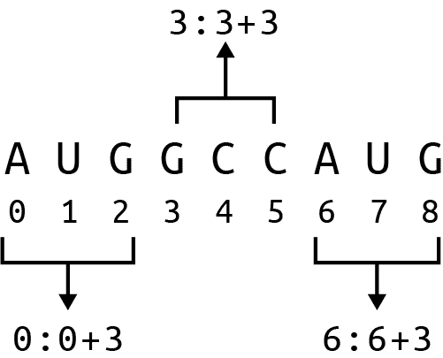
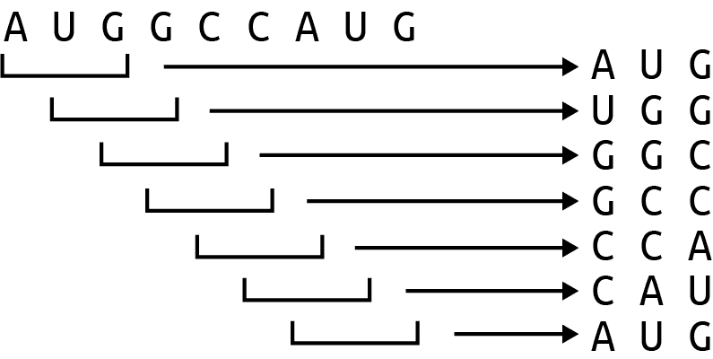
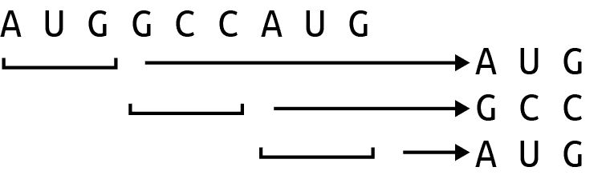
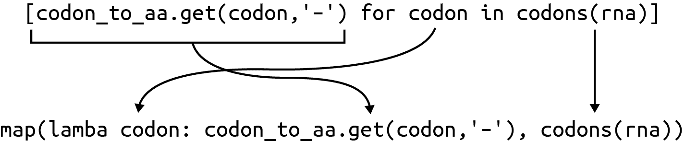

# 第七章：mRNA 翻译成蛋白质：更多的函数式编程

根据分子生物学的中心法则，*DNA 生成 mRNA，mRNA 生成蛋白质*。在第二章中，我展示了如何将 DNA 转录成 mRNA，现在是时候将 mRNA 翻译成蛋白质序列了。正如在[Rosalind PROT 页面](https://oreil.ly/OgBcW)上描述的那样，现在我需要编写一个接受 mRNA 字符串并生成氨基酸序列的程序。我将展示几种解决方案，包括列表、`for`循环、列表推导、字典和高阶函数，但最后我会用 Biopython 函数结束。不过，这将会非常有趣。

大部分时间我会专注于如何编写、测试和组合小函数来创建解决方案。你将学到：

+   如何使用字符串切片从序列中提取密码子/K-mers

+   如何使用字典作为查找表

+   如何将`for`循环转换为列表推导和`map()`表达式

+   如何使用`takewhile()`和`partial()`函数

+   如何使用`Bio.Seq`模块将 mRNA 翻译成蛋白质

# 入门指南

你需要在*07_prot*目录中工作。我建议你从将第一个解决方案复制到`prot.py`并要求用法开始：

```py
$ cp solution1_for.py prot.py
$ ./prot.py -h
usage: prot.py [-h] RNA

Translate RNA to proteins

positional arguments:
  RNA         RNA sequence

optional arguments:
  -h, --help  show this help message and exit
```

该程序需要一个 RNA 序列作为单个位置参数。从现在开始，我会使用术语*RNA*，但要知道我指的是*mRNA*。以下是使用 Rosalind 页面示例字符串的结果：

```py
$ ./prot.py AUGGCCAUGGCGCCCAGAACUGAGAUCAAUAGUACCCGUAUUAACGGGUGA
MAMAPRTEINSTRING
```

运行**`make test`**确保程序正常工作。当你觉得你对程序的工作原理有了相当好的理解时，从头开始：

```py
$ new.py -fp 'Translate RNA to proteins' prot.py
Done, see new script "prot.py".
```

这是我定义参数的方式：

```py
class Args(NamedTuple):
    """ Command-line arguments """
    rna: str 

def get_args() -> Args:
    """Get command-line arguments"""

    parser = argparse.ArgumentParser(
        description='Translate RNA to proteins',
        formatter_class=argparse.ArgumentDefaultsHelpFormatter)

    parser.add_argument('rna', type=str, metavar='RNA', help='RNA sequence') 

    args = parser.parse_args()

    return Args(args.rna)
```


唯一的参数是一串 mRNA。


定义`rna`作为一个位置字符串。

修改你的参数，直到程序能够产生正确的用法，然后修改你的`main()`函数以打印输入的 RNA 字符串：

```py
def main() -> None:
    args = get_args()
    print(args.rna)
```

验证它是否有效：

```py
$ ./prot.py AUGGCCAUGGCGCCCAGAACUGAGAUCAAUAGUACCCGUAUUAACGGGUGA
AUGGCCAUGGCGCCCAGAACUGAGAUCAAUAGUACCCGUAUUAACGGGUGA
```

运行**`pytest`**或**`make test`**来查看你的表现。你的程序应该通过前两个测试，并且在第三个测试中失败，输出应该是蛋白质翻译。如果你认为你能解决这个问题，继续执行你的解决方案。挣扎是完全可以接受的。没有什么可着急的，所以如果需要的话可以多花几天时间。确保除了专注编码时间外，还包括小睡和散步（扩散思维时间）。如果需要帮助，请继续阅读。

## K-mers 和密码子

到目前为止，你已经看到了许多关于如何迭代字符串字符的例子，比如 DNA 的碱基。在这里，我需要将 RNA 的碱基分组成三个一组，以便读取每个密码子，即三个核苷酸序列，对应一个氨基酸。共有 64 个密码子，如表 7-1 所示。

表格 7-1\. RNA 密码子表描述了 RNA 的三联体如何编码 22 种氨基酸

| AAA K | AAC N | AAG K | AAU N | ACA T |
| --- | --- | --- | --- | --- |
| ACC T | ACG T | ACU T | AGA R | AGC S |
| AGG R | AGU S | AUA I | AUC I | AUG M |
| AUU I | CAA Q | CAC H | CAG Q | CAU H |
| CCA P | CCC P | CCG P | CCU P | CGA R |
| CGC R | CGG R | CGU R | CUA L | CUC L |
| CUG L | CUU L | GAA E | GAC D | GAG E |
| GAU D | GCA A | GCC A | GCG A | GCU A |
| GGA G | GGC G | GGG G | GGU G | GUA V |
| GUC V | GUG V | GUU V | UAC Y | UAU Y |
| UCA S | UCC S | UCG S | UCU S | UGC C |
| UGG W | UGU C | UUA L | UUC F | UUG L |
| UUU F | UAA 终止 | UAG 终止 | UGA 终止 |  |

给定一些 RNA 字符串：

```py
>>> rna = 'AUGGCCAUGGCGCCCAGAACUGAGAUCAAUAGUACCCGUAUUAACGGGUGA'
```

我想读取前三个碱基，*AUG*。如图 7-1 所示，我可以使用字符串切片从索引 0 到 3 手动抓取字符（请记住上界不包括在内）：

```py
>>> rna[0:3]
'AUG'
```


###### 图 7-1\. 使用字符串切片从 RNA 中提取密码子

下一个密码子可通过将起始和停止位置加 3 来找到：

```py
>>> rna[3:6]
'GCC'
```

你能看出出现了什么模式吗？对于第一个数字，我需要从 0 开始加 3。对于第二个数字，我需要在第一个数字上加 3（见图 7-2）。



###### 图 7-2\. 每个切片是密码子起始位置的函数，可以使用`range()`函数找到

我可以使用`range()`函数处理第一部分，它可以接受一、两或三个参数。给定一个参数，它将生成从 0 到给定值但不包括给定值的所有数字。请注意这是一个惰性函数，我将使用`list()`来强制它：

```py
>>> list(range(10))
[0, 1, 2, 3, 4, 5, 6, 7, 8, 9]
```

给定两个参数，`range()`将假定第一个是起始位置，第二个是停止位置：

```py
>>> list(range(5, 10))
[5, 6, 7, 8, 9]
```

第三个参数将被解释为步长。在第三章中，我使用`range()`没有起始或停止位置，步长为`-1`来反转字符串。在这种情况下，我想从 0 开始计数直到 RNA 的长度，步长为 3。这些是密码子的起始位置：

```py
>>> list(range(0, len(rna), 3))
[0, 3, 6, 9, 12, 15, 18, 21, 24, 27, 30, 33, 36, 39, 42, 45, 48]
```

我可以使用列表推导生成起始和停止值作为元组。停止位置比起始位置多 3。这里仅展示前五个：

```py
>>> [(n, n + 3) for n in range(0, len(rna), 3)][:5]
[(0, 3), (3, 6), (6, 9), (9, 12), (12, 15)]
```

我可以使用这些值来对 RNA 进行切片：

```py
>>> [rna[n:n + 3] for n in range(0, len(rna), 3)][:5]
['AUG', 'GCC', 'AUG', 'GCG', 'CCC']
```

密码子是 RNA 的子序列，类似于*k-mers*。这里的*k*是大小，为 3，*mer*类似于*聚合物*中的*共享*。通常用 k-mers 的大小来指代它们，所以这里我可能称之为*3-mer*。k-mers 重叠一个字符，所以窗口向右移动一个碱基。图 7-3 展示了输入 RNA 的前九个碱基中找到的前七个 3-mer。



###### 图 7-3\. RNA 序列前九个碱基中的所有 3-mer

任何序列*s*中 k-mers 的数量*n*为：

<math alttext="n equals l e n left-parenthesis s right-parenthesis minus k plus 1" display="block"><mrow><mi>n</mi> <mo>=</mo> <mi>l</mi> <mi>e</mi> <mi>n</mi> <mo>(</mo> <mi>s</mi> <mo>)</mo> <mo>-</mo> <mi>k</mi> <mo>+</mo> <mn>1</mn></mrow></math>

该 RNA 序列的长度为 51，因此包含 49 个 3-mer：

```py
>>> len(rna) - k + 1
49
```

除了考虑多帧翻译（我将在第十四章中展示），密码子不重叠，因此每次移动 3 个位置（参见图 7-4），留下 17 个密码子：

```py
>>> len([rna[n:n + 3] for n in range(0, len(rna), 3)])
17
```



###### 图 7-4\. 密码子是非重叠的 3-mers

## 翻译密码子

现在你知道如何从 RNA 中提取密码子了，让我们考虑如何将密码子翻译成蛋白质。Rosalind 页面提供了以下翻译表：

```py
UUU F      CUU L      AUU I      GUU V
UUC F      CUC L      AUC I      GUC V
UUA L      CUA L      AUA I      GUA V
UUG L      CUG L      AUG M      GUG V
UCU S      CCU P      ACU T      GCU A
UCC S      CCC P      ACC T      GCC A
UCA S      CCA P      ACA T      GCA A
UCG S      CCG P      ACG T      GCG A
UAU Y      CAU H      AAU N      GAU D
UAC Y      CAC H      AAC N      GAC D
UAA Stop   CAA Q      AAA K      GAA E
UAG Stop   CAG Q      AAG K      GAG E
UGU C      CGU R      AGU S      GGU G
UGC C      CGC R      AGC S      GGC G
UGA Stop   CGA R      AGA R      GGA G
UGG W      CGG R      AGG R      GGG G
```

使用字典来查找像 `AUG` 这样的字符串自然是一个合适的数据结构，以找到它翻译为蛋白质 `M`，这也正是表示蛋白质序列起始的密码子。我把字典中的 `Stop` 改为 `*`，用于表示终止密码子，标志着蛋白质序列的结束。我把我的字典命名为 `codon_to_aa`，可以这样使用它：

```py
>>> rna = 'AUGGCCAUGGCGCCCAGAACUGAGAUCAAUAGUACCCGUAUUAACGGGUGA'
>>> aa = []
>>> for codon in [rna[n:n + 3] for n in range(0, len(rna), 3)]:
...     aa.append(codon_to_aa[codon])
...
>>> aa
['M', 'A', 'M', 'A', 'P', 'R', 'T', 'E', 'I', 'N', 'S', 'T', 'R', 'I',
 'N', 'G', '*']
```

`*` 密码子表示翻译结束的位置，通常会显示以便你知道找到了终止并且蛋白质已完成。为了通过 Rosalind 的测试，输出中不应包含终止密码子。注意，终止密码子可能出现在 RNA 字符串的末尾之前。这些提示应足够让你创建一个能通过测试的解决方案。确保运行 **`pytest`** 和 **`make test`** 以确保你的程序在逻辑上和风格上都是正确的。

# 解决方案

在本节中，我将展示将 RNA 翻译成蛋白质的五种变体，从完全手动解决方案（其中我使用字典对 RNA 密码子表进行编码）到使用 Biopython 函数的单行代码。所有解决方案都使用之前展示的相同 `get_args()`。

## 解决方案 1：使用 for 循环

这是我第一个解决方案的完整内容，它使用 `for` 循环来迭代密码子，并通过字典将其翻译为蛋白质：

```py
def main() -> None:
    args = get_args()
    rna = args.rna.upper() 
    codon_to_aa = { 
        'AAA': 'K', 'AAC': 'N', 'AAG': 'K', 'AAU': 'N', 'ACA': 'T',
        'ACC': 'T', 'ACG': 'T', 'ACU': 'T', 'AGA': 'R', 'AGC': 'S',
        'AGG': 'R', 'AGU': 'S', 'AUA': 'I', 'AUC': 'I', 'AUG': 'M',
        'AUU': 'I', 'CAA': 'Q', 'CAC': 'H', 'CAG': 'Q', 'CAU': 'H',
        'CCA': 'P', 'CCC': 'P', 'CCG': 'P', 'CCU': 'P', 'CGA': 'R',
        'CGC': 'R', 'CGG': 'R', 'CGU': 'R', 'CUA': 'L', 'CUC': 'L',
        'CUG': 'L', 'CUU': 'L', 'GAA': 'E', 'GAC': 'D', 'GAG': 'E',
        'GAU': 'D', 'GCA': 'A', 'GCC': 'A', 'GCG': 'A', 'GCU': 'A',
        'GGA': 'G', 'GGC': 'G', 'GGG': 'G', 'GGU': 'G', 'GUA': 'V',
        'GUC': 'V', 'GUG': 'V', 'GUU': 'V', 'UAC': 'Y', 'UAU': 'Y',
        'UCA': 'S', 'UCC': 'S', 'UCG': 'S', 'UCU': 'S', 'UGC': 'C',
        'UGG': 'W', 'UGU': 'C', 'UUA': 'L', 'UUC': 'F', 'UUG': 'L',
        'UUU': 'F', 'UAA': '*', 'UAG': '*', 'UGA': '*',
    }

    k = 3 
    protein = '' 
    for codon in [rna[i:i + k] for i in range(0, len(rna), k)]: 
        aa = codon_to_aa.get(codon, '-') 
        if aa == '*': 
            break 
        protein += aa 

    print(protein) 
```


复制传入的 RNA，并强制转换为大写。


使用字典创建密码子/氨基酸查找表。


确定用于查找 k-mer 的 `k` 的大小。


初始化蛋白质序列为空字符串。


遍历 RNA 的密码子。


使用 `dict.get()` 查找这个密码子对应的氨基酸，并在找不到时返回短横线。


检查这是否为终止密码子。


退出`for`循环。


将氨基酸追加到蛋白质序列中。


打印蛋白质序列。

## 解决方案 2：添加单元测试

第一个解决方案工作得相当好，对于如此简短的程序，它的组织也相当不错。问题在于，短程序通常会变成长程序。函数变得越来越长是很常见的，因此我想展示如何将`main()`中的代码拆分为几个更小的函数，并附带测试。一般来说，我喜欢看到一个函数在 50 行或更少的情况下适合，至于一个函数可以有多短，我不反对只有一行代码。

我的第一直觉是提取找到密码子的代码，并将其变成一个带有单元测试的函数。我可以先定义一个函数的占位符，类型签名帮助我思考函数接受什么参数并返回什么结果：

```py
def codons(seq: str) -> List[str]: 
    """ Extract codons from a sequence """

    return [] 
```


函数将接受一个字符串，并返回一个字符串列表。


现在，只返回一个空列表。

接下来，我定义一个`test_codons()`函数来设想它可能如何工作。每当我有一个字符串作为函数参数时，我尝试传递空字符串。（每当我有一个整数作为函数参数时，我尝试传递`0`。）然后我尝试其他可能的值，并设想函数应该做什么。如你所见，我在这里做了一些判断调用，通过返回长度小于三个碱基的字符串。我只期望函数将一个字符串分解成至少三个碱基的子字符串。在这里，没有理由让完美成为好的敌人：

```py
def test_codons() -> None:
    """ Test codons """

    assert codons('') == []
    assert codons('A') == ['A']
    assert codons('ABC') == ['ABC']
    assert codons('ABCDE') == ['ABC', 'DE']
    assert codons('ABCDEF') == ['ABC', 'DEF']
```

现在编写满足这些测试的函数。如果我将相关代码从`main()`移入`codons()`函数中，结果如下：

```py
def codons(seq: str) -> List[str]:
    """ Extract codons from a sequence """

    k = 3
    ret = []
    for codon in [seq[i:i + k] for i in range(0, len(seq), k)]:
        ret.append(codon)

    return ret
```

如果我尝试在此程序上运行`pytest`，我看到它通过了。万岁！由于`for`循环用于构建返回列表，使用列表推导式在风格上更好：

```py
def codons(seq: str) -> List[str]:
    """ Extract codons from a sequence """

    k = 3
    return [seq[i:i + k] for i in range(0, len(seq), k)]
```

这是一个精心编写和测试过的小函数，可以使代码其余部分更易读：

```py
def main() -> None:
    args = get_args()
    rna = args.rna.upper()
    codon_to_aa = {
        'AAA': 'K', 'AAC': 'N', 'AAG': 'K', 'AAU': 'N', 'ACA': 'T',
        'ACC': 'T', 'ACG': 'T', 'ACU': 'T', 'AGA': 'R', 'AGC': 'S',
        'AGG': 'R', 'AGU': 'S', 'AUA': 'I', 'AUC': 'I', 'AUG': 'M',
        'AUU': 'I', 'CAA': 'Q', 'CAC': 'H', 'CAG': 'Q', 'CAU': 'H',
        'CCA': 'P', 'CCC': 'P', 'CCG': 'P', 'CCU': 'P', 'CGA': 'R',
        'CGC': 'R', 'CGG': 'R', 'CGU': 'R', 'CUA': 'L', 'CUC': 'L',
        'CUG': 'L', 'CUU': 'L', 'GAA': 'E', 'GAC': 'D', 'GAG': 'E',
        'GAU': 'D', 'GCA': 'A', 'GCC': 'A', 'GCG': 'A', 'GCU': 'A',
        'GGA': 'G', 'GGC': 'G', 'GGG': 'G', 'GGU': 'G', 'GUA': 'V',
        'GUC': 'V', 'GUG': 'V', 'GUU': 'V', 'UAC': 'Y', 'UAU': 'Y',
        'UCA': 'S', 'UCC': 'S', 'UCG': 'S', 'UCU': 'S', 'UGC': 'C',
        'UGG': 'W', 'UGU': 'C', 'UUA': 'L', 'UUC': 'F', 'UUG': 'L',
        'UUU': 'F', 'UAA': '*', 'UAG': '*', 'UGA': '*',
    }

    protein = ''
    for codon in codons(rna): 
        aa = codon_to_aa.get(codon, '-')
        if aa == '*':
            break
        protein += aa

    print(protein)
```


寻找密码子的复杂性隐藏在一个函数中。

此外，这个函数（及其测试）现在更容易集成到另一个程序中。最简单的情况是复制粘贴这些行，但更好的解决方案是共享函数。让我演示一下如何使用 REPL。如果你的 `prot.py` 程序中有 `codons()` 函数，那么导入这个函数：

```py
>>> from prot import codons
```

现在你可以执行 `codons()` 函数：

```py
>>> codons('AAACCCGGGTTT')
['AAA', 'CCC', 'GGG', 'TTT']
```

或者你可以导入整个 `prot` 模块并像这样调用函数：

```py
>>> import prot
>>> prot.codons('AAACCCGGGTTT')
['AAA', 'CCC', 'GGG', 'TTT']
```

Python *程序* 也是可重复使用代码的 *模块*。有时你执行一个源代码文件，它就变成了一个程序，但在 Python 中程序和模块之间并没有很大区别。这就是所有程序末尾对联的含义：

```py
if __name__ == '__main__': 
    main() 
```


当一个 Python 程序作为程序 *执行* 时，`__name__` 的值是 `__main__`。


调用 `main()` 函数启动程序。

当一个 Python 模块被另一段代码 *导入* 时，`__name__` 是模块的名称；例如，在 `prot.py` 中是 `prot`。如果你在程序末尾简单地调用 `main()` 而没有检查 `__name__`，那么它将在你的模块被导入时执行，这不好。

随着你编写越来越多的 Python 代码，你可能会发现自己重复解决一些相同的问题。通过编写函数并在项目之间共享，而不是复制粘贴代码片段，来分享常见解决方案会更好。Python 很容易将可重用函数放入模块并在其他程序中导入它们。

## 解决方案 3：另一个函数和一个列表推导式

`codons()` 函数整洁实用，使 `main()` 函数更易于理解；然而，所有留在 `main()` 中的代码都涉及蛋白质的翻译。我想把这部分隐藏在一个 `translate()` 函数中，并且这是我想使用的测试：

```py
def test_translate() -> None:
    """ Test translate """

    assert translate('') == '' 
    assert translate('AUG') == 'M' 
    assert translate('AUGCCGUAAUCU') == 'MP' 
    assert translate('AUGGCCAUGGCGCCCAGAACUGAGAU' 
                     'CAAUAGUACCCGUAUUAACGGGUGA') == 'MAMAPRTEINSTRING' 
```


我通常用空字符串来测试字符串参数。


测试单个氨基酸。


在序列结束之前使用终止密码测试。


注意相邻的字符串文字被合并为一个字符串。这是在源代码中换行的一个有用方法。


使用来自 Rosalind 的示例进行测试。

我将所有代码从`main()`移到这里，将`for`循环改为列表推导，并使用列表切片来截断蛋白质在终止密码子处：

```py
def translate(rna: str) -> str:
    """ Translate codon sequence """

    codon_to_aa = {
        'AAA': 'K', 'AAC': 'N', 'AAG': 'K', 'AAU': 'N', 'ACA': 'T',
        'ACC': 'T', 'ACG': 'T', 'ACU': 'T', 'AGA': 'R', 'AGC': 'S',
        'AGG': 'R', 'AGU': 'S', 'AUA': 'I', 'AUC': 'I', 'AUG': 'M',
        'AUU': 'I', 'CAA': 'Q', 'CAC': 'H', 'CAG': 'Q', 'CAU': 'H',
        'CCA': 'P', 'CCC': 'P', 'CCG': 'P', 'CCU': 'P', 'CGA': 'R',
        'CGC': 'R', 'CGG': 'R', 'CGU': 'R', 'CUA': 'L', 'CUC': 'L',
        'CUG': 'L', 'CUU': 'L', 'GAA': 'E', 'GAC': 'D', 'GAG': 'E',
        'GAU': 'D', 'GCA': 'A', 'GCC': 'A', 'GCG': 'A', 'GCU': 'A',
        'GGA': 'G', 'GGC': 'G', 'GGG': 'G', 'GGU': 'G', 'GUA': 'V',
        'GUC': 'V', 'GUG': 'V', 'GUU': 'V', 'UAC': 'Y', 'UAU': 'Y',
        'UCA': 'S', 'UCC': 'S', 'UCG': 'S', 'UCU': 'S', 'UGC': 'C',
        'UGG': 'W', 'UGU': 'C', 'UUA': 'L', 'UUC': 'F', 'UUG': 'L',
        'UUU': 'F', 'UAA': '*', 'UAG': '*', 'UGA': '*',
    }

    aa = [codon_to_aa.get(codon, '-') for codon in codons(rna)] 
    if '*' in aa: 
        aa = aa[:aa.index('*')] 

    return ''.join(aa) 
```


使用列表推导将密码子列表转换为氨基酸列表。


查看列表中是否存在终止（`*`）密码子。


使用列表切片覆盖氨基酸直到终止密码子的索引处。


将氨基酸连接在空字符串上并返回新的蛋白质序列。

要理解这一点，请考虑以下 RNA 序列：

```py
>>> rna = 'AUGCCGUAAUCU'
```

我可以使用 `codons()` 函数获取密码子：

```py
>>> from solution3_list_comp_slice import codons, translate
>>> codons(rna)
['AUG', 'CCG', 'UAA', 'UCU']
```

并使用列表推导将其转换为氨基酸：

```py
>>> codon_to_aa = {
...     'AAA': 'K', 'AAC': 'N', 'AAG': 'K', 'AAU': 'N', 'ACA': 'T',
...     'ACC': 'T', 'ACG': 'T', 'ACU': 'T', 'AGA': 'R', 'AGC': 'S',
...     'AGG': 'R', 'AGU': 'S', 'AUA': 'I', 'AUC': 'I', 'AUG': 'M',
...     'AUU': 'I', 'CAA': 'Q', 'CAC': 'H', 'CAG': 'Q', 'CAU': 'H',
...     'CCA': 'P', 'CCC': 'P', 'CCG': 'P', 'CCU': 'P', 'CGA': 'R',
...     'CGC': 'R', 'CGG': 'R', 'CGU': 'R', 'CUA': 'L', 'CUC': 'L',
...     'CUG': 'L', 'CUU': 'L', 'GAA': 'E', 'GAC': 'D', 'GAG': 'E',
...     'GAU': 'D', 'GCA': 'A', 'GCC': 'A', 'GCG': 'A', 'GCU': 'A',
...     'GGA': 'G', 'GGC': 'G', 'GGG': 'G', 'GGU': 'G', 'GUA': 'V',
...     'GUC': 'V', 'GUG': 'V', 'GUU': 'V', 'UAC': 'Y', 'UAU': 'Y',
...     'UCA': 'S', 'UCC': 'S', 'UCG': 'S', 'UCU': 'S', 'UGC': 'C',
...     'UGG': 'W', 'UGU': 'C', 'UUA': 'L', 'UUC': 'F', 'UUG': 'L',
...     'UUU': 'F', 'UAA': '*', 'UAG': '*', 'UGA': '*',
... }
>>> aa = [codon_to_aa.get(c, '-') for c in codons(rna)]
>>> aa
['M', 'P', '*', 'S']
```

我可以看到终止密码子的存在：

```py
>>> '*' in aa
True
```

所以序列需要在索引 2 处截断：

```py
>>> aa.index('*')
2
```

我可以使用列表切片选择到终止密码子的位置。如果没有提供起始位置，则 Python 假定索引为 0：

```py
>>> aa = aa[:aa.index('*')]
>>> aa
['M', 'P']
```

最后，需要将这些列表连接为空字符串：

```py
>>> ''.join(aa)
'MP'
```

`main()` 函数包含了新函数，使得程序非常易读：

```py
def main() -> None:
    args = get_args()
    print(translate(args.rna.upper()))
```

这是另一个单位测试几乎重复集成测试的实例，后者仍然很重要，因为它确保程序能够工作，生成文档，处理参数等等。尽管这种解决方案可能显得过于工程化，但我希望你专注于如何将程序分解为更小的*函数*，以便理解、测试、组合和共享。

## 解决方案 4：使用 `map()`、`partial()` 和 `takewhile()` 函数进行函数式编程

对于下一个解决方案，我想展示如何使用三个高阶函数 `map()`、`partial()` 和 `takewhile()` 重写一些逻辑。图 7-5 显示列表推导如何被重写为 `map()`。



###### 图 7-5\. 列表推导可以被重写为 `map()`

我可以使用 `map()` 获取氨基酸序列。你可能认为这比列表推导更容易阅读，也可能不认为；关键是理解它们在功能上是等效的，都将一个列表转换为一个新列表：

```py
>>> aa = list(map(lambda codon: codon_to_aa.get(codon, '-'), codons(rna)))
>>> aa
['M', 'P', '*', 'S']
```

找到终止密码子并切片列表的代码可以使用 `itertools.takewhile()` 函数重写：

```py
>>> from itertools import takewhile
```

如其名，此函数会在谓词满足时从序列中 *取* 元素。一旦谓词失败，函数就停止产生值。这里的条件是残留物不是 `*`（停止）：

```py
>>> list(takewhile(lambda residue: residue != '*', aa))
['M', 'P']
```

如果你喜欢使用这些高阶函数，可以通过使用我在 第四章 中展示的 `functools.partial()` 函数更进一步。这里我想部分应用 `operator.ne()`（不等于）函数：

```py
>>> from functools import partial
>>> import operator
>>> not_stop = partial(operator.ne, '*')
```

函数 `not_stop()` 在返回值之前需要再加一个字符串值：

```py
>>> not_stop('F')
True
>>> not_stop('*')
False
```

当我组合这些函数时，它们几乎读起来像是一句英语句子：

```py
>>> list(takewhile(not_stop, aa))
['M', 'P']
```

这里是我如何使用纯函数思想编写 `translate()` 函数的方式：

```py
def translate(rna: str) -> str:
    """ Translate codon sequence """

    codon_to_aa = {
        'AAA': 'K', 'AAC': 'N', 'AAG': 'K', 'AAU': 'N', 'ACA': 'T',
        'ACC': 'T', 'ACG': 'T', 'ACU': 'T', 'AGA': 'R', 'AGC': 'S',
        'AGG': 'R', 'AGU': 'S', 'AUA': 'I', 'AUC': 'I', 'AUG': 'M',
        'AUU': 'I', 'CAA': 'Q', 'CAC': 'H', 'CAG': 'Q', 'CAU': 'H',
        'CCA': 'P', 'CCC': 'P', 'CCG': 'P', 'CCU': 'P', 'CGA': 'R',
        'CGC': 'R', 'CGG': 'R', 'CGU': 'R', 'CUA': 'L', 'CUC': 'L',
        'CUG': 'L', 'CUU': 'L', 'GAA': 'E', 'GAC': 'D', 'GAG': 'E',
        'GAU': 'D', 'GCA': 'A', 'GCC': 'A', 'GCG': 'A', 'GCU': 'A',
        'GGA': 'G', 'GGC': 'G', 'GGG': 'G', 'GGU': 'G', 'GUA': 'V',
        'GUC': 'V', 'GUG': 'V', 'GUU': 'V', 'UAC': 'Y', 'UAU': 'Y',
        'UCA': 'S', 'UCC': 'S', 'UCG': 'S', 'UCU': 'S', 'UGC': 'C',
        'UGG': 'W', 'UGU': 'C', 'UUA': 'L', 'UUC': 'F', 'UUG': 'L',
        'UUU': 'F', 'UAA': '*', 'UAG': '*', 'UGA': '*',
    }

    aa = map(lambda codon: codon_to_aa.get(codon, '-'), codons(rna))
    return ''.join(takewhile(partial(operator.ne, '*'), aa))
```

## 解决方案 5：使用 Bio.Seq.translate()

如约，最后的解决方案使用了 Biopython。在 第三章 中，我使用了 `Bio.Seq.reverse_complement()` 函数，这里可以使用 `Bio.Seq.translate()`。首先，导入 `Bio.Seq` 类：

```py
>>> from Bio import Seq
```

然后调用 `translate()` 函数。请注意，终止密码子用 `*` 表示：

```py
>>> rna = 'AUGGCCAUGGCGCCCAGAACUGAGAUCAAUAGUACCCGUAUUAACGGGUGA'
>>> Seq.translate(rna)
'MAMAPRTEINSTRING*'
```

默认情况下，此函数不会在终止密码子处停止翻译：

```py
>>> Seq.translate('AUGCCGUAAUCU')
'MP*S'
```

如果在 REPL 中阅读 `help(Seq.translate)`，你会发现 `to_stop` 选项可以将其更改为 Rosalind 挑战所期望的版本：

```py
>>> Seq.translate('AUGCCGUAAUCU', to_stop=True)
'MP'
```

这是我将所有内容整合在一起的方式：

```py
def main() -> None:
    args = get_args()
    print(Seq.translate(args.rna, to_stop=True))
```

这是我推荐的解决方案，因为它依赖广泛使用的 Biopython 模块。虽然手动编写解决方案探索如何编码是有趣且启发性的，但更好的实践是使用已由专门开发团队编写和测试过的代码。

# 基准测试

哪种方法最快？我可以使用我在 第四章 中介绍的 `hyperfine` 基准测试程序来比较程序的运行时间。因为这是一个非常简短的程序，我决定至少运行每个程序 1,000 次，正如在仓库中的 `bench.sh` 程序中所记录的那样。

尽管第二种解决方案运行速度最快，可能比 Biopython 版本快多达 1.5 倍，但我仍然建议使用后者，因为这是一个在社区广泛使用并且有详细文档和测试的模块。

# 更进一步

添加一个 `--frame-shift` 参数，默认为 `0`，允许值为 `0-2`（包括）。使用帧移来从备用位置开始读取 RNA。

# 复习

本章的重点实际上是如何编写、测试和组合函数来解决手头的问题。我编写了用于查找序列中密码子和翻译 RNA 的函数。然后展示了如何使用高阶函数来组合其他函数，最后使用了 Biopython 的现成函数。

+   K-mers 是序列的 *k* 长度子序列。

+   密码子是在特定框架中不重叠的 3-mer。

+   字典作为查找表格非常有用，比如将密码子翻译为氨基酸。

+   `for` 循环、列表推导式和 `map()` 都是将一个序列转换为另一个的方法。

+   `takewhile()` 函数类似于 `filter()` 函数，根据值的谓词或测试从序列中接受值。

+   `partial()` 函数允许将参数部分应用于一个函数。

+   `Bio.Seq.translate()` 函数将 RNA 序列翻译成蛋白质序列。
