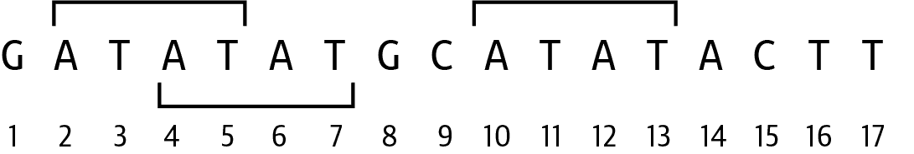

# 第八章：在 DNA 中查找基序：探索序列相似性

在 [Rosalind SUBS 挑战](https://oreil.ly/hoUhB) 中，我将搜索另一个序列内任何出现的序列。共享的子序列可能代表诸如标记、基因或调控序列等保守元素。两个生物之间的保守序列可能暗示一些遗传或收敛特征。我将探讨如何使用 Python 中的 `str`（字符串）类编写解决方案，并将字符串与列表进行比较。然后，我将探讨如何使用高阶函数表达这些想法，并将继续讨论我在 第七章 中开始的 k-mer。最后，我将展示如何使用正则表达式找到模式，并指出重叠匹配的问题。

在本章中，我将演示：

+   如何使用 `str.find()`、`str.index()` 和字符串切片

+   如何使用集合创建唯一的元素集合

+   如何组合高阶函数

+   如何使用 k-mer 查找子序列

+   如何使用正则表达式查找可能重叠的序列

# 入门

本章的代码和测试位于 *08_subs*。我建议您从将第一个解决方案复制到程序 `subs.py` 并请求帮助开始：

```py
$ cd 08_subs/
$ cp solution1_str_find.py subs.py
$ ./subs.py -h
usage: subs.py [-h] seq subseq

Find subsequences

positional arguments:
  seq         Sequence
  subseq      subsequence

optional arguments:
  -h, --help  show this help message and exit
```

该程序应报告子序列在序列中的起始位置。如 图 8-1 所示，子序列 *ATAT* 可以在序列 *GATATATGCATATACTT* 的位置 2、4 和 10 处找到：

```py
$ ./subs.py GATATATGCATATACTT ATAT
2 4 10
```



###### 图 8-1。子序列 *ATAT* 可以在位置 2、4 和 10 找到

运行测试以查看您是否了解将要预期的内容，然后从头开始编写您的程序：

```py
$ new.py -fp 'Find subsequences' subs.py
Done, see new script "subs.py".
```

这是我定义程序参数的方法：

```py
class Args(NamedTuple): 
    """ Command-line arguments """
    seq: str
    subseq: str

def get_args() -> Args: 
    """ Get command-line arguments """

    parser = argparse.ArgumentParser(
        description='Find subsequences',
        formatter_class=argparse.ArgumentDefaultsHelpFormatter)

    parser.add_argument('seq', metavar='seq', help='Sequence')

    parser.add_argument('subseq', metavar='subseq', help='subsequence')

    args = parser.parse_args()

    return Args(args.seq, args.subseq) 
```


`Args` 类将有两个字符串字段，`seq` 和 `subseq`。


函数返回一个 `Args` 对象。


使用 `Args` 打包并返回参数。

让您的 `main()` 打印序列和子序列：

```py
def main() -> None:
    args = get_args()
    print(f'sequence = {args.seq}')
    print(f'subsequence = {args.subseq}')
```

使用预期的输入运行程序，并验证它是否正确打印了参数：

```py
$ ./subs.py GATATATGCATATACTT ATAT
sequence = GATATATGCATATACTT
subsequence = ATAT
```

现在您有一个应该通过前两个测试的程序。如果您认为自己能够独立完成，请继续；否则，我将向您展示一种在一个字符串中找到另一个字符串的位置的方法。

## 查找子序列

为了演示如何找到子序列，我将首先在 REPL 中定义以下序列和子序列：

```py
>>> seq = 'GATATATGCATATACTT'
>>> subseq = 'ATAT'
```

我可以使用 `in` 来确定一个序列是否是另一个序列的子集。这也适用于列表、集合或字典的键的成员资格：

```py
>>> subseq in seq
True
```

这是很好的信息，但它没有告诉我*字符串*可以在哪里找到。幸运的是有`str.find()`函数，它说`subseq`可以从索引 1（即第二个字符）开始找到：

```py
>>> seq.find(subseq)
1
```

我从 Rosalind 的描述中知道答案应该是 2、4 和 10。我刚刚找到了 2，那么下一个如何找到？我不能再次调用相同的函数，因为我会得到相同的答案。我需要进一步查看序列。也许`help(str.find)`可能有一些用处？

```py
>>> help(str.find)
find(...)
    S.find(sub[, start[, end]]) -> int

    Return the lowest index in S where substring sub is found,
    such that sub is contained within S[start:end].  Optional
    arguments start and end are interpreted as in slice notation.

    Return -1 on failure.
```

看起来我可以指定一个*起始*位置。我将使用比第一个子序列被发现的位置大 1 的位置，这个位置是 1，所以从 2 开始：

```py
>>> seq.find(subseq, 2)
3
```

太好了。这是下一个答案——好吧，4 是下一个答案，但你知道我是什么意思的。我再试一次，这次从 4 开始：

```py
>>> seq.find(subseq, 4)
9
```

那是我预料之外的最后一个值。如果我尝试使用起始值为 10 会发生什么？正如文档所示，这将返回`-1`来指示无法找到子序列：

```py
>>> seq.find(subseq, 10)
-1
```

你能想到一种方法来遍历序列，并记住子序列被找到的最后位置直到找不到为止吗？

另一个选项是使用`str.index()`，但仅当子序列存在时：

```py
>>> if subseq in seq:
...     seq.index(subseq)
...
1
```

要找到下一个出现，你可以使用最后已知位置对序列进行切片。你将不得不将这个位置添加到起始位置，但你本质上是在做同样的操作，即向序列深入以查找子序列是否存在以及其位置在哪里：

```py
>>> if subseq in seq[2:]:
...     seq.index(subseq[2:])
...
1
```

如果你阅读**`help(str.index)`**，你会发现，像`str.find()`一样，这个函数接受第二个可选的索引起始位置来开始查找：

```py
>>> if subseq in seq[2:]:
...     seq.index(subseq, 2)
...
3
```

第三种方法是使用 k-mer。如果子序列存在，那么它就是一个 k-mer，其中*k*是子序列的长度定义。使用你从第七章中提取序列中所有 k-mer 及其位置的代码，并注意与子序列匹配的 k-mer 的位置。

最后，由于我正在寻找一种文本模式，我可以使用正则表达式。在第五章中，我使用`re.findall()`函数来查找 DNA 中所有*G*和*C*。我可以类似地使用这种方法来找到序列中所有的子序列：

```py
>>> import re
>>> re.findall(subseq, seq)
['ATAT', 'ATAT']
```

这似乎有一些问题。一个问题是它只返回了两个子序列，而我知道有三个。另一个问题是这并不提供关于*匹配位置*的任何信息。不用担心，`re.finditer()`函数解决了这个第二个问题：

```py
>>> list(re.finditer(subseq, seq))
[<re.Match object; span=(1, 5), match='ATAT'>,
 <re.Match object; span=(9, 13), match='ATAT'>]
```

现在显而易见它找到了第一个和最后一个子序列。为什么它不会找到第二个实例？原来正则表达式对重叠模式处理得不太好，但是对搜索模式的一些添加可以解决这个问题。我将把这个问题留给你和一些互联网搜索，看看你是否能找到解决方案。

我介绍了四种不同的解决方案。看看你能否使用每种方法编写解决方案。关键在于探索 Python 的各个角落，存储可能在未来某个程序中起决定性作用的有趣片段和技巧。花上几个小时或几天也没关系。坚持下去，直到你有解决方案能够通过`pytest`和`make test`。

# 解决方案

所有解决方案都共享相同的`get_args()`，如前所示。

## 解决方案 1：使用`str.find()`方法

这是我使用`str.find()`方法的第一个解决方案：

```py
def main() -> None:
    args = get_args()
    last = 0 
    found = [] 
    while True: 
        pos = args.seq.find(args.subseq, last) 
        if pos == -1: 
            break
        found.append(pos + 1) 
        last = pos + 1 

    print(*found) 
```


将`last`位置初始化为`0`，序列的起始位置。


初始化一个列表以保存发现子序列的所有位置。


创建一个使用`while`的无限循环。


使用`str.find()`查找子序列，使用上次已知位置。


如果返回`-1`，则未找到子序列，因此退出循环。


将大于索引的值附加到已发现位置的列表中。


更新最后已知位置，其值比找到的索引大一。


使用`*`打印已找到的位置，将列表扩展为其元素。函数将使用空格分隔多个值。

此解决方案开启了跟踪*最后*发现子序列的位置。我将其初始化为`0`：

```py
>>> last = 0
```

我使用`str.find()`查找子序列，从上次已知位置开始：

```py
>>> seq = 'GATATATGCATATACTT'
>>> subseq = 'ATAT'
>>> pos = seq.find(subseq, last)
>>> pos
1
```

只要`seq.find()`返回除`-1`以外的值，我将更新最后位置为大于该值的一个以便从下一个字符开始搜索：

```py
>>> last = pos + 1
>>> pos = seq.find(subseq, last)
>>> pos
3
```

另一个函数调用找到了最后一个实例：

```py
>>> last = pos + 1
>>> pos = seq.find(subseq, last)
>>> pos
9
```

最后，`seq.find()`返回`-1`表示无法再找到该模式：

```py
>>> last = pos + 1
>>> pos = seq.find(subseq, last)
>>> pos
-1
```

对于具有 C 语言背景的人来说，这种解决方案将立即变得易于理解。这是一种非常 *命令式* 的方法，具有大量用于更新算法状态的详细逻辑。*状态* 是程序中数据随时间变化的方式。例如，正确更新和使用上一个已知位置对于使这种方法工作至关重要。后续方法使用的显式编码要少得多。

## 解决方案 2：使用 `str.index()` 方法

下一个解决方案是使用上一个已知位置对序列进行切片的变体：

```py
def main() -> None:
    args = get_args()
    seq, subseq = args.seq, args.subseq 
    found = []
    last = 0
    while subseq in seq[last:]: 
        last = seq.index(subseq, last) + 1 
        found.append(last) 

    print(' '.join(map(str, found))) 
```


解包序列和子序列。


询问子序列是否出现在从上次找到的位置开始的序列片段中。只要此条件为真，`while` 循环就会执行。


使用 `str.index()` 获取子序列的起始位置。`last` 变量通过将子序列索引加 1 来更新，以创建下一个起始位置。


将此位置追加到找到位置列表中。


使用 `map()` 将所有找到的整数位置强制转换为字符串，然后在空格上进行连接以打印。

再次，我依赖于跟踪子序列被找到的上一个位置。我从位置 0 或字符串的开头开始：

```py
>>> last = 0
>>> if subseq in seq[last:]:
...     last = seq.index(subseq, last) + 1
...
>>> last
2
```

第一个解决方案中的 `while True` 循环是开始一个无限循环的常见方法。在这里，只要子序列在序列的片段中被找到，`while` 循环就会执行，这意味着我不必手动决定何时 `break` 出循环：

```py
>>> last = 0
>>> found = []
>>> while subseq in seq[last:]:
...     last = seq.index(subseq, last) + 1
...     found.append(last)
...
>>> found
[2, 4, 10]
```

在这种情况下，找到的位置是一个整数值列表。在第一个解决方案中，我使用 `*found` 来展开列表，并依赖于 `print()` 将值强制转换为字符串并在空格上进行连接。如果我尝试使用 `str.join()` 从 `found` 创建新字符串，我会遇到问题。`str.join()` 函数将许多 *字符串* 连接成单个字符串，因此当你给它非字符串值时会引发异常：

```py
>>> ' '.join(found)
Traceback (most recent call last):
  File "<stdin>", line 1, in <module>
TypeError: sequence item 0: expected str instance, int found
```

我可以使用列表推导式，使用 `str()` 函数将每个数字 `n` 转换为字符串：

```py
>>> ' '.join([str(n) for n in found])
'2 4 10'
```

这也可以使用 `map()` 来写：

```py
>>> ' '.join(map(lambda n: str(n), found))
'2 4 10'
```

我完全可以省略 `lambda`，因为 `str()` 函数期望单个参数，并且 `map()` 自然会将每个 `found` 的值作为参数传递给 `str()`。这是我首选的方法，将整数列表转换为字符串列表：

```py
>>> ' '.join(map(str, found))
'2 4 10'
```

## 解决方案 3：一种纯函数式方法

下一个解决方案结合了许多先前的想法，使用纯函数式方法。首先，考虑第一和第二个解决方案中使用的`while`循环，用于将非负值附加到`found`列表中。这听起来像是列表理解可以做的事情吗？迭代的值范围包括从 0 到序列末尾减去子序列长度的所有位置`n`：

```py
>>> r = range(len(seq) - len(subseq))
>>> [n for n in r]
[0, 1, 2, 3, 4, 5, 6, 7, 8, 9, 10, 11, 12]
```

列表理解可以使用这些值和`str.find()`来搜索子序列在序列中从每个位置`n`开始。从位置 0 和 1 开始，子序列可以在索引 1 处找到。从位置 2 和 3 开始，子序列可以在索引 3 处找到。这一直持续到`-1`指示子序列在那些位置`n`上不存在：

```py
>>> [seq.find(subseq, n) for n in r]
[1, 1, 3, 3, 9, 9, 9, 9, 9, 9, -1, -1, -1]
```

我只想要非负值，所以我使用`filter()`将它们移除：

```py
>>> list(filter(lambda n: n >= 0, [seq.find(subseq, n) for n in r]))
[1, 1, 3, 3, 9, 9, 9, 9, 9, 9]
```

这也可以通过反转`lambda`中的比较来编写：

```py
>>> list(filter(lambda n: 0 <= n, [seq.find(subseq, n) for n in r]))
[1, 1, 3, 3, 9, 9, 9, 9, 9, 9]
```

我向您展示这个，因为我想使用`partial()`与`operator.le()`（小于或等于）函数，因为我不喜欢`lambda`表达式：

```py
>>> from functools import partial
>>> import operator
>>> ok = partial(operator.le, 0)
>>> list(filter(ok, [seq.find(subseq, n) for n in r]))
[1, 1, 3, 3, 9, 9, 9, 9, 9, 9]
```

我想将列表理解改为`map()`：

```py
>>> list(filter(ok, map(lambda n: seq.find(subseq, n), r)))
[1, 1, 3, 3, 9, 9, 9, 9, 9, 9]
```

但我再次想要摆脱`lambda`，所以使用`partial()`：

```py
>>> find = partial(seq.find, subseq)
>>> list(filter(ok, map(find, r)))
[1, 1, 3, 3, 9, 9, 9, 9, 9, 9]
```

我可以使用`set()`来获取一个不同的列表：

```py
>>> set(filter(ok, map(find, r)))
{1, 3, 9}
```

这些几乎是正确的值，但它们是*索引*位置，零基础的。我需要值加一，所以我可以创建一个函数来加 1，并使用`map()`应用它：

```py
>>> add1 = partial(operator.add, 1)
>>> list(map(add1, set(filter(ok, map(find, r)))))
[2, 4, 10]
```

在这些有限的例子中，结果已经正确排序；但是，人们永远不能依赖于集合中的值的顺序。我必须使用`sorted()`函数确保它们在数值上正确排序：

```py
>>> sorted(map(add1, set(filter(ok, map(find, r)))))
[2, 4, 10]
```

最后，我需要打印这些仍然存在的整数列表的值：

```py
>>> print(sorted(map(add1, set(filter(ok, map(find, r))))))
[2, 4, 10]
```

那几乎是正确的。与第一个解决方案一样，我需要展开结果以使`print()`看到单独的元素：

```py
>>> print(*sorted(map(add1, set(filter(ok, map(find, r))))))
2 4 10
```

这是很多右括号。这段代码开始看起来有点像 Lisp。如果将所有这些想法结合起来，你最终得到与命令式解决方案相同的答案，但现在只结合函数：

```py
def main() -> None:
    args = get_args()
    seq, subseq = args.seq, args.subseq 
    r = list(range(len(seq) - len(subseq))) 
    ok = partial(operator.le, 0) 
    find = partial(seq.find, subseq) 
    add1 = partial(operator.add, 1) 
    print(*sorted(map(add1, set(filter(ok, map(find, r)))))) 
```


展开序列和子序列。


生成一个数字范围，直到序列的长度减去子序列的长度。


创建一个部分`ok()`函数，如果给定的数字大于或等于`0`，则返回`True`。


创建一个部分`find()`函数，当提供起始参数时，将查找序列中的子序列。


创建一个部分函数`add1()`，它将返回比参数大一的值。


将范围内的所有数字应用于`find()`函数，过滤掉负值，使用`set()`函数使结果唯一，对值加 1 并排序后再打印。

这个解决方案只使用*纯*函数，对于背景在 Haskell 编程语言中的人来说应该很容易理解。如果对你来说这似乎一团糟，请花些时间在 REPL 中逐个理解每个部分如何完美地配合在一起。

## 解决方案 4：使用 K-mers

我提到过你可以尝试使用 k-mers 找到答案，这在第七章中已经展示过了。如果子序列存在于序列中，那么它必须是一个 k-mer，其中*k*等于子序列的长度：

```py
>>> seq = 'GATATATGCATATACTT'
>>> subseq = 'ATAT'
>>> k = len(subseq)
>>> k
4
```

这里是序列中的所有 4-mers：

```py
>>> kmers = [seq[i:i + k] for i in range(len(seq) - k + 1)]
>>> kmers
['GATA', 'ATAT', 'TATA', 'ATAT', 'TATG', 'ATGC', 'TGCA', 'GCAT', 'CATA',
 'ATAT', 'TATA', 'ATAC', 'TACT', 'ACTT']
```

这里是与子序列相同的 4-mers：

```py
>>> list(filter(lambda s: s == subseq, kmers))
['ATAT', 'ATAT', 'ATAT']
```

我需要知道位置以及 k-mers。`enumerate()`函数将返回序列中所有元素的索引和值。以下是前四个：

```py
>>> kmers = list(enumerate([seq[i:i + k] for i in range(len(seq) - k + 1)]))
>>> kmers[:4]
[(0, 'GATA'), (1, 'ATAT'), (2, 'TATA'), (3, 'ATAT')]
```

我可以与`filter()`一起使用，但现在`lambda`接收的是索引和值的元组，所以我需要查看第二个字段（即索引 1）：

```py
>>> list(filter(lambda t: t[1] == subseq, kmers))
[(1, 'ATAT'), (3, 'ATAT'), (9, 'ATAT')]
```

我真正关心的只是获取匹配 k-mers 的索引。我可以使用带有`if`表达式的`map()`来重写这个，当匹配时返回索引位置，否则返回`None`：

```py
>>> list(map(lambda t: t[0] if t[1] == subseq else None, kmers))
[None, 1, None, 3, None, None, None, None, None, 9, None, None, None, None]
```

我对标准的`map()`函数只能传递单个值给`lambda`感到沮丧。我需要的是一种可以打散元组的方法，就像`*t`，将其转换为两个值。幸运的是，我研究了`itertools`模块的文档，并找到了`starmap()`函数，因为它会给`lambda`参数添加一个*星号*来打散它。这使我能够将类似`(0, 'GATA')`的元组值解包为变量`i`（索引值为`0`）和`kmer`（值为`'GATA'`）。有了这些，我可以比较`kmer`与子序列，并将索引(`i`)加 1：

```py
>>> from itertools import starmap
>>> list(starmap(lambda i, kmer: i + 1 if kmer == subseq else None, kmers))
[None, 2, None, 4, None, None, None, None, None, 10, None, None, None, None]
```

这可能看起来是一个奇怪的选择，直到我告诉你，如果在`lambda`中传递`None`，`filter()`将使用每个值的真值性，因此将排除`None`值。因为这行代码变得相当长，我将在单独的一行上写函数`f()`来进行`map()`：

```py
>>> f = lambda i, kmer: i + 1 if kmer == subseq else None
>>> list(filter(None, starmap(f, kmers)))
[2, 4, 10]
```

我可以使用命令式技术表达一个 k-mer 解决方案：

```py
def main() -> None:
    args = get_args()
    seq, subseq = args.seq, args.subseq
    k = len(subseq) 
    kmers = [seq[i:i + k] for i in range(len(seq) - k + 1)] 
    found = [i + 1 for i, kmer in enumerate(kmers) if kmer == subseq] 
    print(*found) 
```


在寻找 k-mers 时，`k`是子序列的长度。


使用列表推导式从序列生成所有 k-mer。


迭代遍历所有 k-mer 的索引和值，其中 k-mer 等于子序列。返回比索引位置大一的值。


打印找到的位置。

我还可以使用纯函数技术表达这些想法。请注意，`mypy` 坚持对 `found` 变量进行类型注释：

```py
def main() -> None:
    args = get_args()
    seq, subseq = args.seq, args.subseq
    k = len(subseq)
    kmers = enumerate(seq[i:i + k] for i in range(len(seq) - k + 1)) 
    found: Iterator[int] = filter( 
        None, starmap(lambda i, kmer: i + 1 if kmer == subseq else None, kmers))
    print(*found) 
```


生成一个 k-mer 的枚举列表。


选择与子序列相等的那些 k-mer 的位置。


打印结果。

我发现命令式版本更易于阅读，但建议您使用您认为最直观的版本。无论您更喜欢哪个解决方案，有趣的是 k-mer 在许多情况下都可以证明极其有用，例如用于部分序列比较。

## 解决方案 5：使用正则表达式查找重叠模式

到目前为止，我一直在编写相当复杂的解决方案来查找字符串中的字符模式。这恰好是正则表达式的领域，因此手动编写解决方案有点愚蠢。在本章的早些时候，我展示了 `re.finditer()` 函数不会找到重叠的匹配项，因此当我知道有三个匹配项时，它只返回两个：

```py
>>> import re
>>> list(re.finditer(subseq, seq))
[<re.Match object; span=(1, 5), match='ATAT'>,
 <re.Match object; span=(9, 13), match='ATAT'>]
```

我将向您展示解决方案非常简单，但我想强调的是，直到我在互联网上搜索之前，我并不知道解决方案。找到答案的关键是知道要使用什么搜索词——诸如*正则表达式重叠模式*之类的内容会提供几个有用的结果。这一旁白的重点在于，没有人知道所有的答案，您将不断搜索解决问题的方法，甚至是您以前从未意识到的问题。重要的不是您知道什么，而是您能学到什么。

问题实际上是正则表达式引擎*消耗*匹配的字符串。也就是说，一旦引擎匹配了第一个*ATAT*，它就从匹配的末尾重新开始搜索。解决方案是使用语法 `?=(<*pattern*>`) 将搜索模式包装在*正向查找断言*中，这样引擎就不会消耗匹配的字符串。请注意，这是*正向*查找断言；还有*负向*查找断言以及正向和负向查找断言。

因此，如果子序列是 *ATAT*，那么我想要模式为 `?=(ATAT)`。现在的问题是正则表达式引擎不会 *保存* 匹配结果 —— 我只是告诉它寻找这个模式，但没有告诉它对找到的文本做任何处理。我需要进一步将断言包裹在括号中以创建一个 *捕获组*：

```py
>>> list(re.finditer('(?=(ATAT))', 'GATATATGCATATACTT'))
[<re.Match object; span=(1, 1), match=''>,
 <re.Match object; span=(3, 3), match=''>,
 <re.Match object; span=(9, 9), match=''>]
```

我可以使用列表推导式遍历此迭代器，在每个 `re.Match` 对象上调用 `match.start()` 函数，并加 1 以校正位置：

```py
>>> [match.start() + 1 for match in re.finditer(f'(?=({subseq}))', seq)]
[2, 4, 10]
```

这是我建议作为解决这个问题的最佳方式的最终解决方案：

```py
def main() -> None:
    args = get_args()
    seq, subseq = args.seq, args.subseq
    print(*[m.start() + 1 for m in re.finditer(f'(?=({subseq}))', seq)])
```

# 基准测试

对我来说，看到哪种解决方案运行速度最快总是很有趣。我将再次使用 `hyperfine` 运行每个版本 1,000 次：

```py
$ hyperfine -m 1000 -L prg ./solution1_str_find.py,./solution2_str_index.py,\
./solution3_functional.py,./solution4_kmers_functional.py,\
./solution4_kmers_imperative.py,./solution5_re.py \
'{prg} GATATATGCATATACTT ATAT' --prepare 'rm -rf __pycache__'
...
Summary
  './solution2_str_index.py GATATATGCATATACTT ATAT' ran
    1.01 ± 0.11 times faster than
        './solution4_kmers_imperative.py GATATATGCATATACTT ATAT'
    1.02 ± 0.14 times faster than
        './solution5_re.py GATATATGCATATACTT ATAT'
    1.02 ± 0.14 times faster than
        './solution3_functional.py GATATATGCATATACTT ATAT'
    1.03 ± 0.13 times faster than
        './solution4_kmers_functional.py GATATATGCATATACTT ATAT'
    1.09 ± 0.18 times faster than
        './solution1_str_find.py GATATATGCATATACTT ATAT'
```

在我看来，这些差异并不显著，不能仅凭性能来决定我的选择。我更倾向于使用正则表达式，因为它们专门设计用于查找文本模式。

# 进一步探讨

扩展程序以查找子序列 *模式*。例如，您可以搜索简单的序列重复（也称为 *SSR* 或微卫星），如 `GA(26)`，它表示“*GA* 重复 26 次”。或者像 `(GA)15GT(GA)2` 这样的重复，它表示“*GA* 重复 15 次，然后是 *GT*，然后是 *GA*，重复 2 次。” 还要考虑如何找到使用第一章提到的 IUPAC 代码表示的子序列。例如，*R* 表示 *A* 或 *G*，因此 *ARC* 可以匹配序列 *AAC* 和 *AGC*。

# 复习

本章的关键点：

+   `str.find()` 和 `str.index()` 方法可以确定给定字符串中是否存在子序列。

+   集合可以用来创建独特的元素集合。

+   按照定义，k-mers 是子序列，相对快速地提取和比较。

+   正则表达式可以通过使用前瞻断言结合捕获组来找到重叠的序列。
