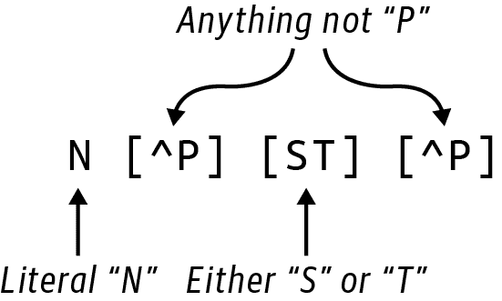
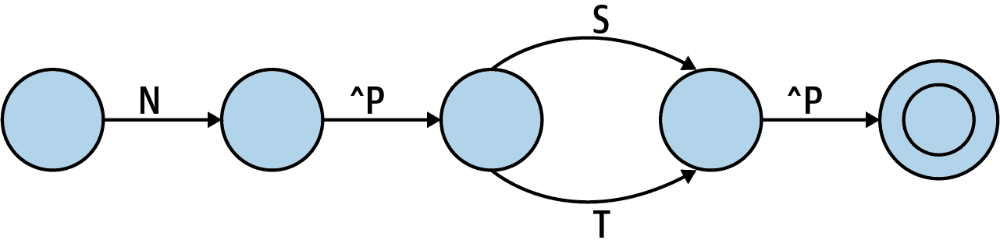

# 第十一章。查找蛋白质基序：获取数据和使用正则表达式

现在我们花了相当多的时间寻找序列基序。如[罗莎琳德 MPRT 挑战](https://oreil.ly/EAp3i)所述，蛋白质中的共享或保守序列意味着共享功能。在这个练习中，我需要识别包含 N-糖基化基序的蛋白质序列。程序的输入是一个蛋白质 ID 列表，将用于从[UniProt 网站](https://www.uniprot.org)下载序列。在演示了如何手动和编程方式下载数据之后，我将展示如何使用正则表达式和编写手动解决方案来查找这一基序。

你将学到：

+   如何从互联网上获取数据

+   如何编写正则表达式来查找 N-糖基化基序

+   如何手动查找 N-糖基化基序

# 入门

所有这个程序的代码和测试都位于*11_mprt*目录中。要开始，请将第一个解决方案复制到程序`mprt.py`中：

```py
$ cd 11_mprt
$ cp solution1_regex.py mprt.py
```

检查用法：

```py
$ ./mprt.py -h
usage: mprt.py [-h] [-d DIR] FILE

Find locations of N-glycosylation motif

positional arguments:
  FILE                  Input text file of UniProt IDs 

optional arguments:
  -h, --help            show this help message and exit
  -d DIR, --download_dir DIR 
                        Directory for downloads (default: fasta)
```


所需的位置参数是一个蛋白质 ID 文件。


可选的下载目录名默认为*fasta*。

输入文件将列出蛋白质 ID，每行一个。在罗莎琳德示例中提供的蛋白质 ID 组成了第一个测试输入文件：

```py
$ cat tests/inputs/1.txt
A2Z669
B5ZC00
P07204_TRBM_HUMAN
P20840_SAG1_YEAST
```

使用此参数运行程序。程序的输出列出包含 N-糖基化基序及其位置的每个蛋白质 ID：

```py
$ ./mprt.py tests/inputs/1.txt
B5ZC00
85 118 142 306 395
P07204_TRBM_HUMAN
47 115 116 382 409
P20840_SAG1_YEAST
79 109 135 248 306 348 364 402 485 501 614
```

运行上述命令后，你应该看到默认的*fasta*目录已创建。在其中你应该找到四个 FASTA 文件。除非你删除下载目录（例如运行**`make clean`**），否则使用这些蛋白质 ID 的所有后续运行都会更快，因为将使用缓存数据。

使用命令**`head -2`**查看每个文件的前两行。某些 FASTA 记录的标题相当长，所以我在这里分行显示它们以防止换行，但实际的标题必须在一行内：

```py
$ head -2 fasta/*
==> fasta/A2Z669.fasta <==
>sp|A2Z669|CSPLT_ORYSI CASP-like protein 5A2 OS=Oryza sativa subsp.
 indica OX=39946 GN=OsI_33147 PE=3 SV=1
MRASRPVVHPVEAPPPAALAVAAAAVAVEAGVGAGGGAAAHGGENAQPRGVRMKDPPGAP

==> fasta/B5ZC00.fasta <==
>sp|B5ZC00|SYG_UREU1 Glycine--tRNA ligase OS=Ureaplasma urealyticum
 serovar 10 (strain ATCC 33699 / Western) OX=565575 GN=glyQS PE=3 SV=1
MKNKFKTQEELVNHLKTVGFVFANSEIYNGLANAWDYGPLGVLLKNNLKNLWWKEFVTKQ

==> fasta/P07204_TRBM_HUMAN.fasta <==
>sp|P07204|TRBM_HUMAN Thrombomodulin OS=Homo sapiens OX=9606 GN=THBD PE=1 SV=2
MLGVLVLGALALAGLGFPAPAEPQPGGSQCVEHDCFALYPGPATFLNASQICDGLRGHLM

==> fasta/P20840_SAG1_YEAST.fasta <==
>sp|P20840|SAG1_YEAST Alpha-agglutinin OS=Saccharomyces cerevisiae
 (strain ATCC 204508 / S288c) OX=559292 GN=SAG1 PE=1 SV=2
MFTFLKIILWLFSLALASAININDITFSNLEITPLTANKQPDQGWTATFDFSIADASSIR
```

运行**`make test`**查看程序应通过的测试类型。当你准备好时，从头开始运行程序：

```py
$ new.py -fp 'Find locations of N-glycosylation motif' mprt.py
Done, see new script "mprt.py".
```

你应该定义一个位置文件参数和一个可选的下载目录作为程序的参数：

```py
class Args(NamedTuple):
    """ Command-line arguments """
    file: TextIO 
    download_dir: str 

def get_args() -> Args:
    """Get command-line arguments"""

    parser = argparse.ArgumentParser(
        description='Find location of N-glycosylation motif',
        formatter_class=argparse.ArgumentDefaultsHelpFormatter)

    parser.add_argument('file',
                        help='Input text file of UniProt IDs',
                        metavar='FILE',
                        type=argparse.FileType('rt')) 

    parser.add_argument('-d',
                        '--download_dir',
                        help='Directory for downloads',
                        metavar='DIR',
                        type=str,
                        default='fasta') 

    args = parser.parse_args()

    return Args(args.file, args.download_dir)
```


`file`将是一个文件句柄。


`download_dir`将是一个字符串。


确保`file`参数是一个可读的文本文件。


`download_dir`是一个可选的字符串，有一个合理的默认值。

确保你的程序可以创建用法，然后开始打印文件中的蛋白质 ID。每个 ID 以换行符结尾，所以我将使用`str.rstrip()`（*右侧去除*）方法从右侧去除任何空白：

```py
def main() -> None:
    args = get_args()
    for prot_id in map(str.rstrip, args.file):
        print(prot_id)
```

运行程序，确保你看到蛋白质 ID：

```py
$ ./mprt.py tests/inputs/1.txt
A2Z669
B5ZC00
P07204_TRBM_HUMAN
P20840_SAG1_YEAST
```

如果你运行**`pytest`**，你应该通过前三个测试并失败第四个。

## 下载命令行上的序列文件

下一个工作是获取蛋白质序列。每个蛋白质的 UniProt 信息可以通过将蛋白质 ID 替换到 URL *http://www.uniprot.org/uniprot/{uniprot_id}* 中找到。我将修改程序以打印这个字符串：

```py
def main() -> None:
    args = get_args()
    for prot_id in map(str.rstrip, args.file):
        print(f'http://www.uniprot.org/uniprot/{prot_id}')
```

现在你应该看到这个输出：

```py
$ ./mprt.py tests/inputs/1.txt
http://www.uniprot.org/uniprot/A2Z669
http://www.uniprot.org/uniprot/B5ZC00
http://www.uniprot.org/uniprot/P07204_TRBM_HUMAN
http://www.uniprot.org/uniprot/P20840_SAG1_YEAST
```

将第一个 URL 粘贴到你的 Web 浏览器中并检查页面。这里有大量的数据，全部以人类可读的格式展示。向下滚动到序列，你应该看到 203 个氨基酸。如果必须解析此页面以提取序列，那将是件糟糕的事情。幸运的是，我可以在 URL 末尾添加*.fasta*并获得序列的 FASTA 文件。

在我向你展示如何使用 Python 下载序列之前，我认为你应该知道如何使用命令行工具来做这件事。从命令行可以使用`curl`（你可能需要安装）来下载序列。默认情况下，这会将文件内容打印到`STDOUT`：

```py
$ curl https://www.uniprot.org/uniprot/A2Z669.fasta
>sp|A2Z669|CSPLT_ORYSI CASP-like protein 5A2 OS=Oryza sativa subsp.
 indica OX=39946 GN=OsI_33147 PE=3 SV=1
MRASRPVVHPVEAPPPAALAVAAAAVAVEAGVGAGGGAAAHGGENAQPRGVRMKDPPGAP
GTPGGLGLRLVQAFFAAAALAVMASTDDFPSVSAFCYLVAAAILQCLWSLSLAVVDIYAL
LVKRSLRNPQAVCIFTIGDGITGTLTLGAACASAGITVLIGNDLNICANNHCASFETATA
MAFISWFALAPSCVLNFWSMASR
```

你可以将其重定向到文件：

```py
$ curl https://www.uniprot.org/uniprot/A2Z669.fasta > A2Z669.fasta
```

或者使用`-o|--output`选项来命名输出文件：

```py
$ curl -o A2Z669.fasta https://www.uniprot.org/uniprot/A2Z669.fasta
```

你也可以使用`wget`（网络获取，可能需要安装）来下载序列文件，就像这样：

```py
$ wget https://www.uniprot.org/uniprot/A2Z669.fasta
```

无论你使用哪种工具，现在你应该有一个名为*A2Z669.fasta*的包含序列数据的文件：

```py
$ cat A2Z669.fasta
>sp|A2Z669|CSPLT_ORYSI CASP-like protein 5A2 OS=Oryza sativa subsp.
 indica OX=39946 GN=OsI_33147 PE=3 SV=1
MRASRPVVHPVEAPPPAALAVAAAAVAVEAGVGAGGGAAAHGGENAQPRGVRMKDPPGAP
GTPGGLGLRLVQAFFAAAALAVMASTDDFPSVSAFCYLVAAAILQCLWSLSLAVVDIYAL
LVKRSLRNPQAVCIFTIGDGITGTLTLGAACASAGITVLIGNDLNICANNHCASFETATA
MAFISWFALAPSCVLNFWSMASR
```

我知道这是一本关于 Python 的书，但学习如何编写基本的`bash`程序也是值得的。就像有些故事可以用俳句来讲述，而另一些则是庞大的小说，有些任务可以用几个 shell 命令轻松表达，而其他则需要更复杂语言的数千行代码。有时我可以用 10 行`bash`来做我需要的事情。当我达到大约 30 行`bash`时，我通常会转向 Python 或 Rust。

这是我如何使用`bash`脚本自动下载蛋白质的方式：

```py
#!/usr/bin/env bash 

if [[ $# -ne 1 ]]; then 
    printf "usage: %s FILE\n" $(basename "$0") 
    exit 1 
fi

OUT_DIR="fasta" 
[[ ! -d "$OUT_DIR" ]] && mkdir -p "$OUT_DIR" 

while read -r PROT_ID; do 
    echo "$PROT_ID"   
    URL="https://www.uniprot.org/uniprot/${PROT_ID}" 
    OUT_FILE="$OUT_DIR/${PROT_ID}.fasta" 
    wget -q -o "$OUT_FILE" "$URL" 
done < $1 

echo "Done, see output in \"$OUT_DIR\"." 
```


shebang（`#!`）应该使用`env`（环境）来找到`bash`。


检查参数的数量（`$#`）是否为`1`。


使用程序的基本名称（`$0`）打印使用语句。


用非零值退出。


定义输出目录为*fasta*。请注意，在`bash`中，您可以在变量分配周围没有空格。


如果输出目录不存在，则创建它。


将文件中的每一行读入`PROT_ID`变量中。


打印当前蛋白质 ID，以便用户知道正在发生某事。


使用双引号内的变量插值构建 URL。


通过结合输出目录和蛋白质 ID 构建输出文件名。


使用`-q`（静默）标志调用`wget`，将 URL 获取到输出文件中。


这从第一个位置参数（`$1`）读取每一行，即输入文件名。


让用户知道程序已经完成，并告知输出文件的位置。

我可以像这样运行它：

```py
$ ./fetch_fasta.sh tests/inputs/1.txt
A2Z669
B5ZC00
P07204_TRBM_HUMAN
P20840_SAG1_YEAST
Done, see output in "fasta".
```

现在应该有一个*fasta*目录，其中包含四个 FASTA 文件。编写`mprt.py`程序的一种方法是首先使用类似于这样的东西获取所有输入文件，然后将 FASTA 文件作为参数提供。这在生物信息学中是非常常见的模式，编写这样的 shell 脚本是记录确切地如何检索数据以进行分析的绝佳方式。确保像这样的程序始终提交到您的源代码库，并考虑添加一个名称为*fasta*的*Makefile*目标，其左侧紧随着一个冒号，后面是一个单个制表符缩进的命令：

```py
fasta:
	./fetch_fasta.sh tests/inputs/1.txt
```

现在你应该能够运行**`make fasta`**来自动化获取数据的过程。通过编写程序以接受输入文件作为参数而不是硬编码它，我可以使用此程序和多个*Makefile*目标来自动化下载许多不同的数据集的过程。复现性为胜利。

## 使用 Python 下载序列文件

我现在将把`bash`实用程序翻译成 Python。正如你从前面的程序中看到的那样，获取每个序列文件涉及到几个步骤。我不希望这成为`main()`的一部分，因为它会使程序变得凌乱，所以我会为此编写一个函数：

```py
def fetch_fasta(fh: TextIO, fasta_dir: str) -> List[str]: 
    """ Fetch the FASTA files into the download directory """

    return [] 
```


该函数将接受蛋白质 ID 的文件句柄和下载目录名称，并返回已下载或已存在的文件列表。务必将 `typing.List` 添加到您的导入中。


暂时返回一个空列表。

我想这样调用它：

```py
def main() -> None:
    args = get_args()
    files = fetch_fasta(args.file, args.download_dir)
    print('\n'.join(files))
```

运行您的程序，并确保它编译并且不打印任何内容。现在添加以下 Python 代码来获取序列。您需要导入 `os` 、`sys` 和 [`requests`](https://oreil.ly/nYSUM) ，这是用于进行网络请求的库：

```py
def fetch_fasta(fh: TextIO, fasta_dir: str) -> List[str]:
    """ Fetch the FASTA files into the download directory """

    if not os.path.isdir(fasta_dir): 
        os.makedirs(fasta_dir) 

    files = [] 
    for prot_id in map(str.rstrip, fh): 
        fasta = os.path.join(fasta_dir, prot_id + '.fasta') 
        if not os.path.isfile(fasta): 
            url = f'http://www.uniprot.org/uniprot/{prot_id}.fasta' 
            response = requests.get(url) 
            if response.status_code == 200: 
                print(response.text, file=open(fasta, 'wt')) 
            else:
                print(f'Error fetching "{url}": "{response.status_code}"',
                      file=sys.stderr) 
                continue 

        files.append(fasta) 

    return files 
```


如果输出目录不存在，则创建它。


如果不存在，则创建目录及其所需的父目录。


初始化返回文件名列表。


从文件中读取每个蛋白质 ID。


构造输出文件名，将输出目录与蛋白质 ID 结合起来。


检查文件是否已存在。


构造到 FASTA 文件的 URL。


发送 *GET* 请求获取文件。


200 的响应代码表示成功。


将响应的文本写入输出文件。


将一条警告打印到 `STDERR` ，指出文件无法获取。


跳转到下一次迭代。


将文件追加到返回列表中。


返回现在本地存在的文件。

`os.makedirs()`是一个示例函数，如果创建失败会抛出异常。这可能是由于用户权限不足以创建目录，或者由于磁盘错误。我捕获和处理这种错误的目的是什么？如果我的程序无法解决问题，我觉得让它大声崩溃，输出错误代码和堆栈跟踪，比捕获和处理异常要好得多。人们必须在程序能够工作之前解决潜在的问题。捕获和错误处理异常比让程序崩溃更糟糕。

这种逻辑几乎与`bash`程序完全相似。如果重新运行程序，应该会有一个*fasta*目录，其中包含四个文件，并且程序应该会打印出下载文件的名称：

```py
$ ./mprt.py tests/inputs/1.txt
fasta/A2Z669.fasta
fasta/B5ZC00.fasta
fasta/P07204_TRBM_HUMAN.fasta
fasta/P20840_SAG1_YEAST.fasta
```

## 编写正则表达式以查找基序

Rosalind 页面指出：

> 为了允许其变化形式的存在，蛋白质基序以以下缩写表示：`[XY]`表示*要么是 X 或 Y*，`{X}`表示*除了 X 以外的任何氨基酸*。例如，N-糖基化基序写作`N{P}[ST]{P}`。

[Prosite 网站](https://oreil.ly/aFwWe)是一个蛋白质域、家族和功能位点的数据库。[N-糖基化基序的详细信息](https://oreil.ly/VrQLl)显示了类似的*共识模式* `N-{P}-[ST]-{P}`。这两种模式与图 11-1 中显示的正则表达式非常接近。



###### 图 11-1\. N-糖基化蛋白质基序的正则表达式

在这个正则表达式中，`N`表示字面字符*N*。`[ST]`是一个字符类，表示字符*S*或*T*。它与我在第五章中写的`[GC]`正则表达式找到*G*或*C*的方式相同。`[^P]`是一个*否定*字符类，表示匹配任何不是*P*的字符。

有些人（好吧，主要是我）喜欢使用有限状态机（FSMs）的符号来表示正则表达式，例如图 11-2 中显示的这种表示方式。想象模式从左侧输入。它首先需要找到字母*N*，才能进行下一步。接下来可以是任何不是字母*P*的字符。然后，图表有两条经过字母*S*或*T*的替代路径，之后必须再次跟随一个非*P*字符。如果模式到达双圆圈，表示匹配成功。



###### 图 11-2\. 识别 N-糖基化基序的 FSM 的图形表示

在第八章中，我指出使用正则表达式查找重叠文本时存在问题。第一个测试文件中没有这种情况，但我用来解决问题的另一个数据集确实有两个重叠的基序。让我在 REPL 中演示：

```py
>>> import re
>>> regex = re.compile('N[^P][ST][^P]')
```

在这里我使用`re.compile()`函数来强制正则表达式引擎解析模式并创建必要的内部代码来进行匹配。这类似于编译语言如 C 使用人类可编辑和读取的源代码转换为计算机可以直接执行的机器代码。这种转换在使用`re.compile()`时只发生一次，而像`re.search()`这样的函数必须在每次调用时重新编译正则表达式。

下面是*P07204_TRBM_HUMAN*蛋白序列的相关部分，该部分具有在第一和第二位置开始的模式（见图 11-3）。`re.findall()`函数显示仅找到第一个位置开始的模式：

```py
>>> seq = 'NNTSYS'
>>> regex.findall(seq)
['NNTS']
```


###### 图 11-3\. 此序列包含两个重叠的模体副本

如同第 8 章中一样，解决方案是将正则表达式包装在一个使用`?=(<*pattern*>`的前瞻断言中，这本身需要包装在捕获括号中：

```py
>>> regex = re.compile('(?=(N[^P][ST][^P]))')
>>> regex.findall(seq)
['NNTS', 'NTSY']
```

我需要知道匹配的位置，这可以从`re.finditer()`获取。这将返回一个`re.Match`对象列表，每个对象都有一个`match.start()`函数，该函数将返回匹配起始位置的零偏移索引。我需要加 1 以使用基于 1 的计数报告位置：

```py
>>> [match.start() + 1 for match in regex.finditer(seq)]
[1, 2]
```

这应该足以帮助您解决剩下的问题。继续进行修改，直到通过所有测试为止。确保从 Rosalind 站点下载数据集，并验证您的解决方案是否能够通过该测试。看看是否还可以编写一个不使用正则表达式的版本。回顾一下 FSM 模型，并思考如何在 Python 代码中实现这些想法。

# 解决方案

我将提出两种解决此问题的变体。两者都使用先前显示的相同的`get_args()`和`fetch_fasta()`函数。第一种使用正则表达式找到模体，第二种则设想在一个可怕的、荒凉的智力荒原中解决问题，在那里正则表达式不存在。

## 解决方案 1：使用正则表达式

以下是我使用正则表达式的最终解决方案。确保为此导入`re`和`Bio.SeqIO`：

```py
def main():
    args = get_args()
    files = fetch_fasta(args.file, args.download_dir) 
    regex = re.compile('(?=(N[^P][ST][^P]))') 

    for file in files: 
        prot_id, _ = os.path.splitext(os.path.basename(file)) 
        recs = SeqIO.parse(file, 'fasta') 
        if rec := next(recs): 
            if matches := list(regex.finditer(str(rec.seq))): 
                print(prot_id) 
                print(*[match.start() + 1 for match in matches]) 
```


为给定文件中的蛋白质 ID 获取序列文件。将文件放入指定的下载目录中。


编译 N-糖基化模体的正则表达式。


遍历文件。


从文件的基本名称减去文件扩展名获取蛋白质 ID。


创建一个懒惰迭代器以从文件中获取 FASTA 序列。


尝试从迭代器中检索第一个序列记录。


强制将序列转换为 `str`，然后尝试查找文本中基序的所有匹配项。


打印蛋白质 ID。


打印所有匹配项，修正为基于 1 的计数。

在这个解决方案中，我使用了 `os.path.basename()` 和 `os.path.splitext()` 函数。我经常使用这些函数，所以我希望确保你准确理解它们的作用。我首次在 第二章 中介绍了 `os.path.basename()` 函数。此函数将从可能包含目录的路径中返回文件名：

```py
>>> import os
>>> basename = os.path.basename('fasta/B5ZC00.fasta')
>>> basename
'B5ZC00.fasta'
```

函数 `os.path.splitext()` 将文件名分解为文件扩展名前部分和扩展名部分：

```py
>>> os.path.splitext(basename)
('B5ZC00', '.fasta')
```

文件扩展名可以提供有关文件的有用元数据。例如，您的操作系统可能知道要使用 Microsoft Excel 打开以 *.xls* 或 *.xlsx* 结尾的文件。有许多用于 FASTA 扩展名的约定，包括 *.fasta*、*.fa*、*.fna*（用于核苷酸）和 *.faa*（用于氨基酸）。您可以为 FASTA 文件添加任何扩展名或不添加扩展名，但请记住，FASTA 文件始终是纯文本，无需特殊应用程序即可查看。此外，仅因为文件具有类似 FASTA 的扩展名并不一定意味着它是 FASTA 文件。*买方自负*。

在前面的代码中，我不需要扩展名，所以我将其赋值给变量 `_`（下划线），这是一种表明我不打算使用该值的约定。我还可以使用列表切片从函数中获取第一个元素：

```py
>>> os.path.splitext(basename)[0]
'B5ZC00'
```

## 解决方案 2：编写手动解决方案

如果我为了生产使用而编写这样的程序，我将使用正则表达式来查找基序。然而，在这种情况下，我想挑战自己找到一个手动解决方案。像往常一样，我想写一个函数来封装这个想法，所以我先草拟出来：

```py
def find_motif(text: str) -> List[int]: 
    """ Find a pattern in some text """

    return [] 
```


函数将获取一些文本，并返回在文本中可以找到基序的整数列表。


现在，返回空列表。

有函数的最大原因是写一个测试，我会编码我期望匹配和失败的示例：

```py
def test_find_motif() -> None:
    """ Test find_pattern """

    assert find_motif('') == [] 
    assert find_motif('NPTX') == [] 
    assert find_motif('NXTP') == [] 
    assert find_motif('NXSX') == [0] 
    assert find_motif('ANXTX') == [1] 
    assert find_motif('NNTSYS') == [0, 1] 
    assert find_motif('XNNTSYS') == [1, 2] 
    assert find_motif('XNNTSYSXNNTSYS') == [1, 2, 8, 9] 
```


确保函数在给定空字符串时不会像抛出异常这样愚蠢地做某事。


这应该失败，因为第二个位置有一个 *P*。


这应该失败，因为第四个位置有一个 *P*。


这应该在字符串开头找到基序。


这应该找到不在字符串开头的基序。


这应该在字符串开头找到重叠的基序。


这应该找到不在字符串开头的重叠基序。


这是一个稍微复杂的模式，包含四个基序的副本。

我可以将这些函数添加到我的 `mprt.py` 程序中，并可以在该源代码上运行 `pytest` 来确保测试*如预期般*失败。现在我需要编写 `find_motif()` 代码来通过这些测试。我决定再次使用 k-mer，所以我将从第九章和第十章带入 `find_kmers()` 函数（当然，我会测试它，但我会在这里省略）：

```py
def find_kmers(seq: str, k: int) -> List[str]:
    """ Find k-mers in string """

    n = len(seq) - k + 1
    return [] if n < 1 else [seq[i:i + k] for i in range(n)]
```

由于基序长度为四个字符，我可以用它来找到序列中所有的 4-mer：

```py
>>> from solution2_manual import find_kmers
>>> seq = 'NNTSYS'
>>> find_kmers(seq, 4)
['NNTS', 'NTSY', 'TSYS']
```

我还需要它们的位置。我在第八章介绍的 `enumerate()` 函数将为序列中的项提供索引和值：

```py
>>> list(enumerate(find_kmers(seq, 4)))
[(0, 'NNTS'), (1, 'NTSY'), (2, 'TSYS')]
```

我可以在迭代时展开每个位置和 k-mer，像这样：

```py
>>> for i, kmer in enumerate(find_kmers(seq, 4)):
...     print(i, kmer)
...
0 NNTS
1 NTSY
2 TSYS
```

取第一个 k-mer，*NNTS*。一种测试这种模式的方法是手动检查每个索引：

```py
>>> kmer = 'NNTS'
>>> kmer[0] == 'N' and kmer[1] != 'P' and kmer[2] in 'ST' and kmer[3] != 'P'
True
```

我知道前两个 k-mer 应该匹配，事实证明如此：

```py
>>> for i, kmer in enumerate(find_kmers(seq, 4)):
...   kmer[0] == 'N' and kmer[1] != 'P' and kmer[2] in 'ST' and kmer[3] != 'P'
...
True
True
False
```

尽管有效，但这太繁琐了。我想把这段代码隐藏在一个函数中：

```py
def is_match(seq: str) -> bool:
    """ Find the N-glycosylation """

    return len(seq) == 4 and (seq[0] == 'N' and seq[1] != 'P'
                              and seq[2] in 'ST' and seq[3] != 'P')
```

这是我为该函数编写的一个测试：

```py
def test_is_match() -> None:
    """ Test is_match """

    assert not is_match('') 
    assert is_match('NASA') 
    assert is_match('NATA')
    assert not is_match('NATAN') 
    assert not is_match('NPTA') 
    assert not is_match('NASP') 
```


如果函数接受字符串参数，我总是用空字符串进行测试。


接下来的两个序列应该匹配。


此序列过长，应予以拒绝。


此序列第二个位置有一个 *P*，应予以拒绝。


这个序列在第四个位置有一个*P*，应该被拒绝。

这使得代码更加可读：

```py
>>> for i, kmer in enumerate(find_kmers(seq, 4)):
...     print(i, kmer, is_match(kmer))
...
0 NNTS True
1 NTSY True
2 TSYS False
```

我只想要匹配的 k-mer。我可以使用带有保护的`if`表达式来编写这段代码，我在第五章和第六章中展示过：

```py
>>> kmers = list(enumerate(find_kmers(seq, 4)))
>>> [i for i, kmer in kmers if is_match(kmer)]
[0, 1]
```

或者使用我在第九章中展示的`starfilter()`函数：

```py
>>> from iteration_utilities import starfilter
>>> list(starfilter(lambda i, s: is_match(s), kmers))
[(0, 'NNTS'), (1, 'NTSY')]
```

我只想要每个元组的第一个元素，所以我可以使用`map()`来选择它们：

```py
>>> matches = starfilter(lambda i, s: is_match(s), kmers)
>>> list(map(lambda t: t[0], matches))
[0, 1]
```

就其价值而言，Haskell 广泛使用元组，并在预设中包含两个方便的函数：`fst()`用于从 2 元组获取第一个元素，`snd()`用于获取第二个元素。确保为此代码导入`typing.Tuple`：

```py
def fst(t: Tuple[Any, Any]) -> Any:
    return t[0]

def snd(t: Tuple[Any, Any]) -> Any:
    return t[1]
```

使用这些函数，我可以像这样消除`starfilter()`：

```py
>>> list(map(fst, filter(lambda t: is_match(snd(t)), kmers)))
[0, 1]
```

但是请注意，如果我尝试使用`filter()`/`starmap()`技术，我之前展示过几次的话，会有一个非常微妙的 bug：

```py
>>> from itertools import starmap
>>> list(filter(None, starmap(lambda i, s: i if is_match(s) else None, kmers)))
[1]
```

它只返回第二个匹配项。为什么？因为在`filter()`中使用`None`作为谓词。根据`help(filter)`，“如果函数为`None`，返回为`True`的项。”在第一章中，我介绍了真值和假值的概念。布尔值`True`和`False`分别由整数值`1`和`0`表示；因此，实际数字零（无论是`int`还是`float`）在技术上是`False`，这意味着任何非零数字都不是`False`，或者说是真值。Python 会在布尔上下文中评估许多数据类型，以决定它们是真还是假。

在这种情况下，将`None`用作`filter()`的谓词会导致它移除数字`0`：

```py
>>> list(filter(None, [1, 0, 2]))
[1, 2]
```

我从 Perl 和 JavaScript 转到 Python，这两种语言在不同的上下文中也会悄悄地强制转换值，所以对这种行为并不感到惊讶。如果你来自像 Java、C 或 Haskell 这样有更严格类型的语言，这可能会令人非常困扰。我经常觉得 Python 是一种非常强大的语言，如果你在任何时候都确切地知道自己在做什么。这是一个很高的门槛，所以在编写 Python 代码时，大量使用类型和测试至关重要。

最后，我觉得列表推导式是最易读的。这是我如何编写我的函数手动识别蛋白质模体的方式：

```py
def find_motif(text: str) -> List[int]:
    """ Find a pattern in some text """

    kmers = list(enumerate(find_kmers(text, 4))) 
    return [i for i, kmer in kmers if is_match(kmer)] 
```


从文本中获取 4-mer 的位置和值。


选择与模体匹配的 k-mer 的位置。

使用这个函数几乎和我使用正则表达式的方式完全相同，这正是将复杂性隐藏在函数背后的关键所在：

```py
def main() -> None:
    args = get_args()
    files = fetch_fasta(args.file, args.download_dir)

    for file in files:
        prot_id, _ = os.path.splitext(os.path.basename(file))
        recs = SeqIO.parse(file, 'fasta')
        if rec := next(recs):
            if matches := find_motif(str(rec.seq)): 
                pos = map(lambda p: p + 1, matches) 
                print('\n'.join([prot_id, ' '.join(map(str, pos))])) 
```


尝试查找与模体匹配的任何匹配项。


匹配结果是一个从 0 开始的索引列表，因此对每个索引加 1。


将整数值转换为字符串，并在空格上连接它们以打印。

尽管这样做很有效且有趣（结果可能因人而异），但我不希望使用或维护这段代码。希望它能让您感受到正则表达式为我们做了多少工作。正则表达式允许我描述*我想要什么*，而不是*如何获得它*。

# 深入了解

[真核线性基序数据库示例](http://elm.eu.org/elms)提供了用于在蛋白质中定义功能位点的基序查找表达式。编写一个程序，在给定的一组 FASTA 文件中搜索任何模式的出现。

# 回顾

本章的要点：

+   您可以使用命令行实用程序如`curl`和`wget`从互联网获取数据。有时编写一个 Shell 脚本执行此类任务是有意义的，有时使用像 Python 这样的语言来编码更好。

+   正则表达式可以找到 N-糖基化基序，但必须将其包装在前瞻断言和捕获括号中以找到重叠匹配。

+   手动查找 N-糖基化基序是可能的，但并不容易。

+   当您需要从扩展名中分离文件名时，`os.path.splitext()`函数非常有用。

+   文件扩展名是约定俗成的，可能不可靠。
