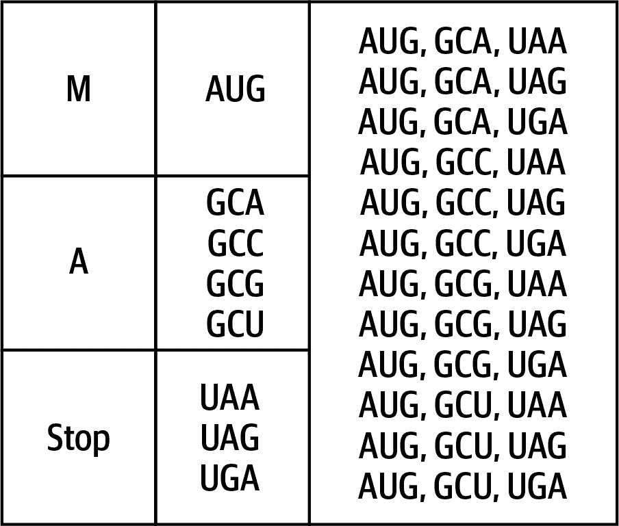

# 第十二章。从蛋白质推断 mRNA：列表的乘积和减少

如[罗莎琳的 mRNA 挑战](https://oreil.ly/ZYelo)中所述，该程序的目标是找出可以产生给定蛋白质序列的 mRNA 字符串数量。你会发现这个数字可能非常大，因此最终答案将是除以给定值后的余数。我希望展示我能通过尝试生成可以匹配特定模式的所有字符串来扭转正则表达式的局面。我还将展示如何创建数字和列表的乘积，以及如何将任何值列表*减少*到单个值，并在此过程中谈论可能导致问题的一些内存问题。

你将学到：

+   如何使用 `functools.reduce()` 函数创建一个数学 `product()` 函数来相乘数字

+   如何使用 Python 的取模（`%`）运算符

+   关于缓冲区溢出问题

+   什么是单子群

+   如何通过交换键和值来反转字典

# 入门指南

你应该在存储库的 *12_mrna* 目录中工作。首先将第一个解决方案复制到程序 `mrna.py` 中：

```py
$ cd 12_mrna/
$ cp solution1_dict.py mrna.py
```

像往常一样，首先检查用法：

```py
$ ./mrna.py -h
usage: mrna.py [-h] [-m int] protein

Inferring mRNA from Protein

positional arguments:
  protein               Input protein or file 

optional arguments:
  -h, --help            show this help message and exit
  -m int, --modulo int  Modulo value (default: 1000000) 
```


所需的位置参数是一个蛋白质序列或包含蛋白质序列的文件。


`--modulo` 选项默认为 1,000,000。

用罗莎琳示例 *MA* 运行程序，并验证它是否打印 `12`，可能编码该蛋白质序列的 1,000,000 取模后的 mRNA 序列数量：

```py
$ ./mrna.py MA
12
```

该程序还将读取序列的输入文件。第一个输入文件的序列长度为 998，结果应为 `448832`：

```py
$ ./mrna.py tests/inputs/1.txt
448832
```

用其他输入运行程序，还要执行**`make test`**测试。当你确信理解程序应该如何工作时，重新开始：

```py
$ new.py -fp 'Infer mRNA from Protein' mrna.py
Done, see new script "mrna.py".
```

按照用法描述定义参数。蛋白质可能是一个字符串或一个文件名，但我选择将参数建模为一个字符串。如果用户提供了一个文件，我将读取内容并将其传递给程序，就像我在第三章中首次展示的那样：

```py
class Args(NamedTuple):
    """ Command-line arguments """
    protein: str 
    modulo: int 

def get_args() -> Args:
    """ Get command-line arguments """

    parser = argparse.ArgumentParser(
        description='Infer mRNA from Protein',
        formatter_class=argparse.ArgumentDefaultsHelpFormatter)

    parser.add_argument('protein', 
                        metavar='protein',
                        type=str,
                        help='Input protein or file')

    parser.add_argument('-m', 
                        '--modulo',
                        metavar='int',
                        type=int,
                        default=1000000,
                        help='Modulo value')

    args = parser.parse_args()

    if os.path.isfile(args.protein): 
        args.protein = open(args.protein).read().rstrip()

    return Args(args.protein, args.modulo)
```


所需的 `protein` 参数应为一个字符串，可能是一个文件名。


`modulo` 选项是一个整数，默认为 `1000000`。


如果 `protein` 参数命名一个现有文件，则从文件中读取蛋白质序列。

将您的 `main()` 更改为打印蛋白质序列：

```py
def main() -> None:
    args = get_args()
    print(args.protein)
```

验证您的程序从命令行和文件中打印出蛋白质：

```py
$ ./mrna.py MA
MA
$ ./mrna.py tests/inputs/1.txt | wc -c 
  998
```


`-c` 选项到 `wc` 表示我只想要输入中的字符数的计数。

您的程序应通过前两个测试并失败第三个。

## 创建列表的乘积

当输入为 *MA* 时，程序应打印出响应 `12`，这是能够产生该蛋白质序列的可能 mRNA 字符串数量，如 图 12-1 所示。使用来自 第七章 的同一 RNA 编码表，我发现氨基甲酸 (*M*) 由 mRNA 密码序列 *AUG* 编码，^(1) 丙氨酸 (*A*) 有四种可能的密码子 (*GCA*, *GCC*, *GCG*, *GCU*)，而终止密码子有三种 (*UAA*, *UAG*, *UGA*)。这三组的乘积为 1 × 4 × 3 = 12。



###### 图 12-1\. 编码蛋白质序列 MA 的所有密码子的笛卡尔乘积结果为 12 个 mRNA 序列

在 第九章 中，我介绍了 `itertools.product()` 函数，它将从值列表生成笛卡尔乘积。我可以像这样在 REPL 中生成这 12 个密码子的所有可能组合：

```py
>>> from itertools import product
>>> from pprint import pprint
>>> combos = product(*codons)
```

如果您尝试打印 `combos` 查看内容，您会看到它不是一个值列表，而是一个 *product object*。也就是说，这是另一个延迟生成值的对象：

```py
>>> pprint(combos)
<itertools.product object at 0x7fbdd822dac0>
```

我可以使用 `list()` 函数强制转换值：

```py
>>> pprint(list(combos))
[('AUG', 'GCA', 'UAA'),
 ('AUG', 'GCA', 'UAG'),
 ('AUG', 'GCA', 'UGA'),
 ('AUG', 'GCC', 'UAA'),
 ('AUG', 'GCC', 'UAG'),
 ('AUG', 'GCC', 'UGA'),
 ('AUG', 'GCG', 'UAA'),
 ('AUG', 'GCG', 'UAG'),
 ('AUG', 'GCG', 'UGA'),
 ('AUG', 'GCU', 'UAA'),
 ('AUG', 'GCU', 'UAG'),
 ('AUG', 'GCU', 'UGA')]
```

我想向您展示一个等待您的小错误。再试打印组合：

```py
>>> pprint(list(combos))
[]
```

此乘积对象像生成器一样，仅会产生值一次，然后将被用尽。所有后续调用将生成空列表。为了保存结果，我需要将强制转换后的列表保存到一个变量中：

```py
>>> combos = list(product(*codons))
```

该产品的长度为 `12`，表示有 12 种方式将这些氨基酸组合成序列 *MA*：

```py
>>> len(combos)
12
```

## 使用模块化乘法避免溢出

随着输入蛋白质序列长度的增加，可能组合的数量会变得极其庞大。例如，第二个测试使用具有 998 个残基的蛋白质文件，导致大约 8.98 × 10²⁹ 个假设的 mRNA 序列。Rosalind 挑战说明：

> 由于内存限制，大多数内置语言数据格式对整数的大小有上限：在某些 Python 版本中，`int` 变量可能要求不大于 2³¹−1，即 2,147,483,647\. 因此，为了处理 Rosalind 中的大数，我们需要设计一种系统，允许我们在不实际存储大数的情况下操作它们。

非常大的数字可能会超过整数大小的内存限制，特别是在旧的 32 位系统上。为了避免这种情况，最终答案应该是组合数对 1,000,000 取模的结果。模运算返回一个数除以另一个数的余数。例如，5 模 2 = 1，因为 5 除以 2 是 2，余数为 1。Python 有`%`运算符来计算模运算：

```py
>>> 5 % 2
1
```

对于 998 个残基的蛋白质来说，答案是 448,832，这是在将 8.98 × 10²⁹除以 1,000,000 后的余数：

```py
$ ./mrna.py tests/inputs/1.txt
448832
```

在第五章中，我介绍了用于数学运算的 NumPy 模块。正如你所预料的那样，有一个`numpy.prod()`函数可以计算一组数字的乘积。不幸的是，当我尝试计算像 1000 的阶乘这样的大数时，它可能会悄无声息地失败并返回`0`：

```py
>>> import numpy as np
>>> np.prod(range(1, 1001))
0
```

这里的问题是 NumPy 是用 C 实现的，比 Python 更快，C 代码尝试存储比整数可用内存更大的数字。不幸的结果是`0`。这种类型的错误通常被称为*缓冲区溢出*，在这里缓冲区是一个整数变量，但也可以是字符串、浮点数、列表或任何其他容器。一般来说，Python 程序员不必像其他语言的程序员那样担心内存分配，但我必须意识到底层库的限制。因为`int`的最大大小可能因机器而异，`numpy.prod()`是一个不可靠的解决方案，应该避免使用。

自 Python 3.8 以来，存在一个`math.prod()`函数，可以计算像 1000 的阶乘这样的极大乘积。这是因为所有计算都发生在 Python 内部，而 Python 中的整数几乎是*无限大*的，这意味着它们仅受到计算机可用内存的限制。请在您的计算机上运行这个试试：

```py
>>> import math
>>> math.prod(range(1, 1001))
```

然而，请注意，当我应用模运算时，结果是`0`：

```py
>>> math.prod(range(1, 1001)) % 1000000
0
```

再次，我遇到了由于 Python 在除法操作中使用了有界类型`float`而导致的溢出问题，这是一个不太可能遇到的问题，如果您使用`math.prod()`和对结果进行模运算。在解决方案中，我将展示一种计算任意大数字集合乘积的方法，使用模运算以避免整数溢出。这应该足以帮助您解决问题。继续努力，直到您的程序通过所有测试。

# 解决方案

我提出了三种解决方案，它们主要在用于表示 RNA 翻译信息的字典结构以及如何计算数字列表的数学乘积方面有所不同。

## 解决方案 1：使用 RNA 密码子表的字典

对于我的第一个解决方案，我使用了来自第七章的 RNA 密码子表来查找每个残基的密码子数量：

```py
>>> c2aa = {
...     'AAA': 'K', 'AAC': 'N', 'AAG': 'K', 'AAU': 'N', 'ACA': 'T',
...     'ACC': 'T', 'ACG': 'T', 'ACU': 'T', 'AGA': 'R', 'AGC': 'S',
...     'AGG': 'R', 'AGU': 'S', 'AUA': 'I', 'AUC': 'I', 'AUG': 'M',
...     'AUU': 'I', 'CAA': 'Q', 'CAC': 'H', 'CAG': 'Q', 'CAU': 'H',
...     'CCA': 'P', 'CCC': 'P', 'CCG': 'P', 'CCU': 'P', 'CGA': 'R',
...     'CGC': 'R', 'CGG': 'R', 'CGU': 'R', 'CUA': 'L', 'CUC': 'L',
...     'CUG': 'L', 'CUU': 'L', 'GAA': 'E', 'GAC': 'D', 'GAG': 'E',
...     'GAU': 'D', 'GCA': 'A', 'GCC': 'A', 'GCG': 'A', 'GCU': 'A',
...     'GGA': 'G', 'GGC': 'G', 'GGG': 'G', 'GGU': 'G', 'GUA': 'V',
...     'GUC': 'V', 'GUG': 'V', 'GUU': 'V', 'UAC': 'Y', 'UAU': 'Y',
...     'UCA': 'S', 'UCC': 'S', 'UCG': 'S', 'UCU': 'S', 'UGC': 'C',
...     'UGG': 'W', 'UGU': 'C', 'UUA': 'L', 'UUC': 'F', 'UUG': 'L',
...     'UUU': 'F', 'UAA': '*', 'UAG': '*', 'UGA': '*',
... }
```

我想要遍历蛋白质序列*MA*加上终止密码子，以找到所有编码密码子。请注意，来自罗萨琳德的序列不以终止密码子结束，所以我必须添加`*`。我可以使用列表推导式和守卫来表达这一点：

```py
>>> protein = 'MA'
>>> for aa in protein + '*':
...     print(aa, [c for c, res in c2aa.items() if res == aa])
...
M ['AUG']
A ['GCA', 'GCC', 'GCG', 'GCU']
* ['UAA', 'UAG', 'UGA']
```

我不需要编码给定残基的密码子实际列表，只需要我可以使用`len()`函数找到的数字：

```py
>>> possible = [
...     len([c for c, res in c2aa.items() if res == aa])
...     for aa in protein + '*'
... ]
>>>
>>> possible
[1, 4, 3]
```

答案在于将这些值相乘。在前一节中，我建议您可以使用`math.prod()`函数：

```py
>>> import math
>>> math.prod(possible)
12
```

虽然这个方法可以完美地工作，但我想借此机会谈谈*将*一系列值减少为单个值。在第五章中，我介绍了`sum()`函数，它将数字 1、4 和 3 相加得到结果 8：

```py
>>> sum(possible)
8
```

它这样做是成对的，首先将 1 + 4 相加得到 5，然后将 5 + 3 相加得到 8。如果我将`+`运算符改为`*`，那么我得到一个乘积，结果是 12，如图 12-2 所示。


###### 图 12-2\. 使用加法和乘法减少数字列表

这就是减少值列表背后的思想，也正是`functools.reduce()`函数帮助我们做到的。这是另一个高阶函数，类似于`filter()`和`map()`以及本书中我使用过的其他函数，但有一个重要的区别：`lambda`函数将接收*两个*参数而不是一个。文档显示如何编写`sum()`：

```py
reduce(...)
    reduce(function, sequence[, initial]) -> value

    Apply a function of two arguments cumulatively to the items of a sequence,
    from left to right, so as to reduce the sequence to a single value.
    For example, reduce(lambda x, y: x+y, [1, 2, 3, 4, 5]) calculates
    ((((1+2)+3)+4)+5).  If initial is present, it is placed before the items
    of the sequence in the calculation, and serves as a default when the
    sequence is empty.
```

这是我如何使用这个来编写自己版本的`sum()`：

```py
>>> from functools import reduce
>>> reduce(lambda x, y: x + y, possible)
8
```

要创建一个乘积，我可以将加法改为乘法：

```py
>>> reduce(lambda x, y: x * y, possible)
12
```

我可以使用`functools.reduce()`来编写自己的`product()`函数：

```py
def product(xs: List[int]) -> int: 
    """ Return the product """

    return reduce(lambda x, y: x * y, xs, 1) 
```


返回整数列表的乘积。


使用`functools.reduce()`函数逐步将值相乘。使用`1`作为初始结果确保空列表返回`1`。

为什么要这样做？一部分是出于好奇心，但我还想展示如何编写一个可以在不依赖 Python 无界整数的情况下工作的函数。为了避免在减少的任何步骤中溢出，我需要将模操作合并到函数本身而不是应用到最终结果上。考虑到我不是数学专家，我不知道如何编写这样一个函数。我在互联网上搜索并找到了一些代码，我修改成了这个：

```py
def mulmod(a: int, b: int, mod: int) -> int: 
    """ Multiplication with modulo """

    def maybemod(x): 
        ret = (x % mod) if mod > 1 and x > mod else x
        return ret or x 

    res = 0 
    a = maybemod(a) 
    while b > 0: 
        if b % 2 == 1: 
            res = maybemod(res + a) 

        a = maybemod(a * 2) 
        b //= 2 

    return res
```


`mulmod()`函数接受两个整数`a`和`b`以及一个整数模值`mod`来进行乘法。


这是一个封闭的函数，用于可能返回模 `mod` 的值。


如果结果为 `0`，则返回原始值；否则，返回计算得到的值。


初始化结果。


可能减少 `a` 的大小。


在 `b` 大于 `0` 的同时循环。


检查 `b` 是否为奇数。


将 `a` 加到结果中，并可能对结果取模。


将 `a` 加倍，并可能对值取模。


使用地板除法将 `b` 减半，最终结果为 `0` 并终止循环。

下面是我写的测试：

```py
def test_mulmod() -> None:
    """ Text mulmod """

    assert mulmod(2, 4, 3) == 2
    assert mulmod(9223372036854775807, 9223372036854775807, 1000000) == 501249
```

我选择这些大数，因为它们是我机器上的 `sys.maxsize`：

```py
>>> import sys
>>> sys.maxsize
9223372036854775807
```

注意，这与我可以从 `math.prod()` 得到的答案相同，但我的版本不依赖于 Python 的动态整数大小，并且不像（更多地）绑定于我的机器上的可用内存：

```py
>>> import math
>>> math.prod([9223372036854775807, 9223372036854775807]) % 1000000
501249
```

为了集成这一点，我编写了一个 `modprod()` 函数，并添加了一个如下的测试：

```py
def modprod(xs: List[int], modulo: int) -> int:
    """ Return the product modulo a value """

    return reduce(lambda x, y: mulmod(x, y, modulo), xs, 1)

def test_modprod() -> None:
    """ Test modprod """

    assert modprod([], 3) == 1
    assert modprod([1, 4, 3], 1000000) == 12
    n = 9223372036854775807
    assert modprod([n, n], 1000000) == 501249
```

请注意，它可以处理前述的 1000 阶乘的示例。这个答案仍然太大而无法打印，但重点是答案不是 `0`：

```py
>>> modprod(range(1, 1001), 1000000)
```

最终答案是这些数字的乘积模给定的参数。以下是我如何将所有这些内容整合到一起的：

```py
def main() -> None:
    args = get_args()
    codon_to_aa = { 
        'AAA': 'K', 'AAC': 'N', 'AAG': 'K', 'AAU': 'N', 'ACA': 'T',
        'ACC': 'T', 'ACG': 'T', 'ACU': 'T', 'AGA': 'R', 'AGC': 'S',
        'AGG': 'R', 'AGU': 'S', 'AUA': 'I', 'AUC': 'I', 'AUG': 'M',
        'AUU': 'I', 'CAA': 'Q', 'CAC': 'H', 'CAG': 'Q', 'CAU': 'H',
        'CCA': 'P', 'CCC': 'P', 'CCG': 'P', 'CCU': 'P', 'CGA': 'R',
        'CGC': 'R', 'CGG': 'R', 'CGU': 'R', 'CUA': 'L', 'CUC': 'L',
        'CUG': 'L', 'CUU': 'L', 'GAA': 'E', 'GAC': 'D', 'GAG': 'E',
        'GAU': 'D', 'GCA': 'A', 'GCC': 'A', 'GCG': 'A', 'GCU': 'A',
        'GGA': 'G', 'GGC': 'G', 'GGG': 'G', 'GGU': 'G', 'GUA': 'V',
        'GUC': 'V', 'GUG': 'V', 'GUU': 'V', 'UAC': 'Y', 'UAU': 'Y',
        'UCA': 'S', 'UCC': 'S', 'UCG': 'S', 'UCU': 'S', 'UGC': 'C',
        'UGG': 'W', 'UGU': 'C', 'UUA': 'L', 'UUC': 'F', 'UUG': 'L',
        'UUU': 'F', 'UAA': '*', 'UAG': '*', 'UGA': '*',
    }

    possible =  ![2
        len([c for c, res in codon_to_aa.items() if res == aa])
        for aa in args.protein + '*'
    ]
    print(modprod(possible, args.modulo)) 
```


一个将 RNA 密码子编码为氨基酸的字典。


迭代蛋白质残基加上停止密码子，然后找到与给定氨基酸匹配的密码子数量。


打印可能性的乘积模给定的值。

## 解决方案 2：扭转节拍

对于下一个解决方案，我决定颠倒 RNA 密码子字典的键和值，使得唯一的氨基酸形成键，而值则是密码子的列表。知道如何像这样翻转字典非常方便，但只有当值是唯一的时候才能起作用。例如，我可以创建一个查找表，将 DNA 碱基如*A*或*T*映射到它们的名称：

```py
>>> base_to_name = dict(A='adenine', G='guanine', C='cytosine', T='thymine')
>>> base_to_name['A']
'adenine'
```

要反过来，从名称转到碱基，我可以使用`dict.items()`获取键/值对：

```py
>>> list(base_to_name.items())
[('A', 'adenine'), ('G', 'guanine'), ('C', 'cytosine'), ('T', 'thymine')]
```

然后我将它们通过`reversed()`映射，最后将结果传递给`dict()`函数以创建字典：

```py
>>> dict(map(reversed, base_to_name.items()))
{'adenine': 'A', 'guanine': 'G', 'cytosine': 'C', 'thymine': 'T'}
```

如果我尝试在第一个解决方案中使用的 RNA 密码子表上尝试，我会得到这个：

```py
>>> pprint(dict(map(reversed, c2aa.items())))
{'*': 'UGA',
 'A': 'GCU',
 'C': 'UGU',
 'D': 'GAU',
 'E': 'GAG',
 'F': 'UUU',
 'G': 'GGU',
 'H': 'CAU',
 'I': 'AUU',
 'K': 'AAG',
 'L': 'UUG',
 'M': 'AUG',
 'N': 'AAU',
 'P': 'CCU',
 'Q': 'CAG',
 'R': 'CGU',
 'S': 'UCU',
 'T': 'ACU',
 'V': 'GUU',
 'W': 'UGG',
 'Y': 'UAU'}
```

您可以看到我缺少大部分密码子。只有*M*和*W*有一个密码子。其余的都去哪了？当创建字典时，Python 会用最新的值覆盖键的任何现有值。例如，在原始表中，*UUG*是最后指定给*L*的值，因此这是保留的值。只需记住这个反转字典键/值的技巧，并确保值是唯一的。值得一提的是，如果我需要这样做，我会使用`collections.defaultdict()`函数：

```py
>>> from collections import defaultdict
>>> aa2codon = defaultdict(list)
>>> for k, v in c2aa.items():
...     aa2codon[v].append(k)
...
>>> pprint(aa2codon)
defaultdict(<class 'list'>,
            {'*': ['UAA', 'UAG', 'UGA'],
             'A': ['GCA', 'GCC', 'GCG', 'GCU'],
             'C': ['UGC', 'UGU'],
             'D': ['GAC', 'GAU'],
             'E': ['GAA', 'GAG'],
             'F': ['UUC', 'UUU'],
             'G': ['GGA', 'GGC', 'GGG', 'GGU'],
             'H': ['CAC', 'CAU'],
             'I': ['AUA', 'AUC', 'AUU'],
             'K': ['AAA', 'AAG'],
             'L': ['CUA', 'CUC', 'CUG', 'CUU', 'UUA', 'UUG'],
             'M': ['AUG'],
             'N': ['AAC', 'AAU'],
             'P': ['CCA', 'CCC', 'CCG', 'CCU'],
             'Q': ['CAA', 'CAG'],
             'R': ['AGA', 'AGG', 'CGA', 'CGC', 'CGG', 'CGU'],
             'S': ['AGC', 'AGU', 'UCA', 'UCC', 'UCG', 'UCU'],
             'T': ['ACA', 'ACC', 'ACG', 'ACU'],
             'V': ['GUA', 'GUC', 'GUG', 'GUU'],
             'W': ['UGG'],
             'Y': ['UAC', 'UAU']})
```

这是我在以下解决方案中使用的数据结构。我还展示了如何使用`math.prod()`函数而不是自己编写代码：

```py
def main():
    args = get_args()
    aa_to_codon = { 
        'A': ['GCA', 'GCC', 'GCG', 'GCU'],
        'C': ['UGC', 'UGU'],
        'D': ['GAC', 'GAU'],
        'E': ['GAA', 'GAG'],
        'F': ['UUC', 'UUU']
        'G': ['GGA', 'GGC', 'GGG', 'GGU'],
        'H': ['CAC', 'CAU'],
        'I': ['AUA', 'AUC', 'AUU'],
        'K': ['AAA', 'AAG'],
        'L': ['CUA', 'CUC', 'CUG', 'CUU', 'UUA', 'UUG'],
        'M': ['AUG'],
        'N': ['AAC', 'AAU'],
        'P': ['CCA', 'CCC', 'CCG', 'CCU'],
        'Q': ['CAA', 'CAG'],
        'R': ['AGA', 'AGG', 'CGA', 'CGC', 'CGG', 'CGU'],
        'S': ['AGC', 'AGU', 'UCA', 'UCC', 'UCG', 'UCU'],
        'T': ['ACA', 'ACC', 'ACG', 'ACU'],
        'V': ['GUA', 'GUC', 'GUG', 'GUU'],
        'W': ['UGG'],
        'Y': ['UAC', 'UAU'],
        '*': ['UAA', 'UAG', 'UGA'],
    }

    possible = [len(aa_to_codon[aa]) for aa in args.protein + '*'] 
    print(math.prod(possible) % args.modulo) 
```


用残基作为键，密码子作为值来表示字典。


找到编码蛋白质序列中每种氨基酸的密码子数量以及终止密码子。


使用`math.prod()`计算乘积，然后应用模运算符。

这个版本要短得多，并假设机器有足够的内存来计算乘积。（Python 将处理表示天文数字所需的内存要求。）对我罗莎琳德提供的所有数据集而言，这是真的，但您可能有一天会遇到需要在旅途中使用类似`mulmod()`函数的情况。

## 解决方案 3: 编码最少信息

前一个解决方案编码了比找到解决方案所需更多的信息。由于我只需要编码给定氨基酸的密码子数量，而不是实际列表，我可以创建这个查找表：

```py
>>> codons = {
...     'A': 4, 'C': 2, 'D': 2, 'E': 2, 'F': 2, 'G': 4, 'H': 2, 'I': 3,
...     'K': 2, 'L': 6, 'M': 1, 'N': 2, 'P': 4, 'Q': 2, 'R': 6, 'S': 6,
...     'T': 4, 'V': 4, 'W': 1, 'Y': 2, '*': 3,
... }
```

列表推导式将返回所需的乘积数字。我会在这里使用`1`作为`dict.get()`的默认参数，以防我找到字典中不存在的残基：

```py
>>> [codons.get(aa, 1) for aa in 'MA*']
[1, 4, 3]
```

导致这段代码：

```py
def main():
    args = get_args()
    codons = { 
        'A': 4, 'C': 2, 'D': 2, 'E': 2, 'F': 2, 'G': 4, 'H': 2, 'I': 3,
        'K': 2, 'L': 6, 'M': 1, 'N': 2, 'P': 4, 'Q': 2, 'R': 6, 'S': 6,
        'T': 4, 'V': 4, 'W': 1, 'Y': 2, '*': 3,
    }
    nums = [codons.get(aa, 1) for aa in args.protein + '*'] 
    print(math.prod(nums) % args.modulo) 
```


编码每种氨基酸的密码子数量。


查找每种氨基酸及终止子的密码子数量。


输出给定值取模后的组合乘积。

# 进一步探讨

在某种意义上，我颠倒了正则表达式匹配的思路，通过创建所有可能的匹配字符串。也就是说，能产生蛋白质 *MA* 的 12 种模式如下：

```py
$ ./show_patterns.py MA
    1: AUGGCAUAA
    2: AUGGCAUAG
    3: AUGGCAUGA
    4: AUGGCCUAA
    5: AUGGCCUAG
    6: AUGGCCUGA
    7: AUGGCGUAA
    8: AUGGCGUAG
    9: AUGGCGUGA
   10: AUGGCUUAA
   11: AUGGCUUAG
   12: AUGGCUUGA
```

本质上，我可以尝试使用这些信息创建一个统一的正则表达式。这可能并不容易，甚至可能不可能，但这个想法可能帮助我找到蛋白质的基因组来源。例如，前两个序列的区别在于它们的最后一个碱基。在 *A* 和 *G* 之间的交替可以用字符类 `[AG]` 表示：

```py
  AUGGCAUAA
+ AUGGCAUAG
  ---------
  AUGGCAUA[AG]
```

你能写一个工具，将许多正则表达式模式组合成一个单一模式吗？

# 复习

本章的关键点：

+   `itertools.product()` 函数将创建列表可迭代对象的笛卡尔积。

+   `functools.reduce()` 是一个高阶函数，它提供了一种从可迭代对象中逐渐组合成对元素的方式。

+   Python 的 `%`（取模）运算符将返回除法后的余数。

+   数字和字符串的同类列表可以通过加法、乘法和连接等幺半群操作减少为单一值。

+   一个具有唯一值的字典可以通过交换键和值来反转。

+   Python 中整数值的大小仅受可用内存限制。

^(1) 虽然存在其他可能的起始密码子，但罗莎琳问题只考虑了这一个。
