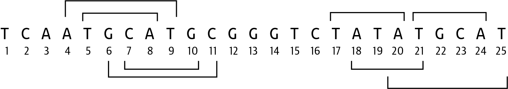

# 第十三章：位置限制位点：使用、测试和共享代码

DNA 中的*回文*序列是指其 5'到 3'碱基序列在两条链上是相同的。例如，图 13-1 显示 DNA 序列*GCATGC*的反向互补序列是该序列本身。


###### 图 13-1\. 反向回文等于其反向互补序列

我可以通过代码验证这一点：

```py
>>> from Bio import Seq
>>> seq = 'GCATGC'
>>> Seq.reverse_complement(seq) == seq
True
```

正如在[Rosalind REVP 挑战](https://oreil.ly/w3Tdm)中描述的那样，限制酶识别和切割 DNA 中特定的回文序列，称为限制位点。它们通常具有 4 到 12 个核苷酸的长度。这个练习的目标是找到每个可能的限制酶在 DNA 序列中的位置。解决这个问题的代码可能非常复杂，但对一些函数式编程技术的清晰理解有助于创建一个简短而优雅的解决方案。我将探索`map()`、`zip()`和`enumerate()`以及许多小的、经过测试的函数。

你将学到：

+   如何找到反向回文

+   如何创建模块以共享常用函数

+   关于`PYTHONPATH`环境变量

# 入门指南

这个练习的代码和测试位于*13_revp*目录下。首先将一个解决方案复制到程序`revp.py`中开始：

```py
$ cd 13_revp
$ cp solution1_zip_enumerate.py revp.py
```

检查用法：

```py
$ ./revp.py -h
usage: revp.py [-h] FILE

Locating Restriction Sites

positional arguments:
  FILE        Input FASTA file 

optional arguments:
  -h, --help  show this help message and exit
```


唯一必需的参数是一个 FASTA 格式的 DNA 序列的单个位置文件。

先看一下第一个测试输入文件。其内容与 Rosalind 页面上的示例相同：

```py
$ cat tests/inputs/1.fa
>Rosalind_24
TCAATGCATGCGGGTCTATATGCAT
```

运行程序，使用此输入，并验证你是否看到每个字符串中长度介于 4 到 12 之间的每个反向回文的位置（使用基于 1 的计数），如图 13-2 所示。注意，结果的顺序无关紧要：

```py
$ ./revp.py tests/inputs/1.fa
5 4
7 4
17 4
18 4
21 4
4 6
6 6
20 6
```



###### 图 13-2\. 在序列*TCAATGCATGCGGGTCTATATGCAT*中找到的八个反向回文的位置。

运行测试以验证程序是否通过，然后重新开始：

```py
$ new.py -fp 'Locating Restriction Sites' revp.py
Done, see new script "revp.py".
```

这是定义程序参数的一种方式：

```py
class Args(NamedTuple):
    """ Command-line arguments """
    file: TextIO 

def get_args() -> Args:
    """ Get command-line arguments """

    parser = argparse.ArgumentParser(
        description='Locating Restriction Sites',
        formatter_class=argparse.ArgumentDefaultsHelpFormatter)

    parser.add_argument('file', 
                        help='Input FASTA file',
                        metavar='FILE',
                        type=argparse.FileType('rt'))

    args = parser.parse_args()

    return Args(args.file)
```


唯一的参数是一个文件。


定义一个必须是可读文本文件的参数。

暂时让`main()`函数打印输入文件名：

```py
def main() -> None:
    args = get_args()
    print(args.file.name)
```

手动验证程序是否能生成正确的用法，是否会拒绝伪文件，并打印一个有效输入的名称：

```py
$ ./revp.py tests/inputs/1.fa
tests/inputs/1.fa
```

运行**`make test`**，你应该发现通过了一些测试。现在你可以编写程序的基础部分了。

## 使用 K-mer 查找所有子序列

第一步是从 FASTA 输入文件中读取序列。我可以使用 `SeqIO.parse()` 创建一个惰性迭代器，然后使用 `next()` 获取第一个序列：

```py
>>> from Bio import SeqIO
>>> recs = SeqIO.parse(open('tests/inputs/1.fa'), 'fasta')
>>> rec = next(recs)
>>> seq = str(rec.seq)
>>> seq
'TCAATGCATGCGGGTCTATATGCAT'
```

如果文件为空，比如 *tests/inputs/empty.fa*，则上述代码不安全。如果尝试以同样的方式打开此文件并调用 `next()`，Python 将会引发 `StopIteration` 异常。在你的代码中，我建议你使用一个 `for` 循环来检测迭代器的耗尽并优雅地退出。

```py
>>> empty = SeqIO.parse(open('tests/inputs/empty.fa'), 'fasta')
>>> next(empty)
Traceback (most recent call last):
  File "<stdin>", line 1, in <module>
  File "/Library/Frameworks/Python.framework/Versions/3.9/lib/python3.9/
  site-packages/Bio/SeqIO/Interfaces.py", line 73, in __next__
    return next(self.records)
StopIteration
```

我需要找到所有长度在 4 到 12 之间的序列。这听起来又是 k-mer 的工作，所以我将从 第九章 中引入 `find_kmers()` 函数：

```py
>>> def find_kmers(seq, k):
...     n = len(seq) - k + 1
...     return [] if n < 1 else [seq[i:i + k] for i in range(n)]
...
```

我可以使用 `range()` 生成从 4 到 12 之间的所有数字，记住结束位置不包括在内，所以我必须取到 13。因为每个 `k` 有很多 k-mer，我将打印出 `k` 的值以及找到的 k-mer 的数量：

```py
>>> for k in range(4, 13):
...     print(k, len(find_kmers(seq, k)))
...
4 22
5 21
6 20
7 19
8 18
9 17
10 16
11 15
12 14
```

## 查找所有反向互补序列

在 第三章 中，我展示了许多找到反向互补的方法，结论是 `Bio.Seq.reverse_complement()` 可能是最简单的方法。首先找到所有的 12-mer：

```py
>>> kmers = find_kmers(seq, 12)
>>> kmers
['TCAATGCATGCG', 'CAATGCATGCGG', 'AATGCATGCGGG', 'ATGCATGCGGGT',
 'TGCATGCGGGTC', 'GCATGCGGGTCT', 'CATGCGGGTCTA', 'ATGCGGGTCTAT',
 'TGCGGGTCTATA', 'GCGGGTCTATAT', 'CGGGTCTATATG', 'GGGTCTATATGC',
 'GGTCTATATGCA', 'GTCTATATGCAT']
```

要创建反向互补序列的列表，你可以使用列表推导式：

```py
>>> from Bio import Seq
>>> revc = [Seq.reverse_complement(kmer) for kmer in kmers]
```

或者使用 `map()`：

```py
>>> revc = list(map(Seq.reverse_complement, kmers))
```

无论哪种方式，你应该有 12 个反向互补序列：

```py
>>> revc
['CGCATGCATTGA', 'CCGCATGCATTG', 'CCCGCATGCATT', 'ACCCGCATGCAT',
 'GACCCGCATGCA', 'AGACCCGCATGC', 'TAGACCCGCATG', 'ATAGACCCGCAT',
 'TATAGACCCGCA', 'ATATAGACCCGC', 'CATATAGACCCG', 'GCATATAGACCC',
 'TGCATATAGACC', 'ATGCATATAGAC']
```

## 将所有内容整合在一起

你应该已经具备完成这个挑战所需的一切。首先，将所有的 k-mer 与它们的反向互补配对，找出相同的那些，并打印它们的位置。你可以使用 `for` 循环来遍历它们，或者考虑使用我们在 第六章 中首次介绍的 `zip()` 函数来创建这些配对。这是一个有趣的挑战，我相信在阅读我的解决方案之前，你能找到一个可行的解决方案。

# 解决方案

我将展示三种方法来查找限制位点，它们越来越依赖函数来隐藏程序的复杂性。

## 解决方案 1：使用 `zip()` 和 `enumerate()` 函数

在我的第一个解决方案中，我首先使用 `zip()` 将 k-mer 和它们的反向互补配对。假设 `k=4`：

```py
>>> seq = 'TCAATGCATGCGGGTCTATATGCAT'
>>> kmers = find_kmers(seq, 4)
>>> revc = list(map(Seq.reverse_complement, kmers))
>>> pairs = list(zip(kmers, revc))
```

我还需要知道这些配对的位置，这可以通过 `enumerate()` 得到。如果检查这些配对，我发现其中一些（4、6、16、17 和 20）是相同的：

```py
>>> pprint(list(enumerate(pairs)))
[(0, ("TCAA", "TTGA")),
 (1, ("CAAT", "ATTG")),
 (2, ("AATG", "CATT")),
 (3, ("ATGC", "GCAT")),
 (4, ("TGCA", "TGCA")),
 (5, ("GCAT", "ATGC")),
 (6, ("CATG", "CATG")),
 (7, ("ATGC", "GCAT")),
 (8, ("TGCG", "CGCA")),
 (9, ("GCGG", "CCGC")),
 (10, ("CGGG", "CCCG")),
 (11, ("GGGT", "ACCC")),
 (12, ("GGTC", "GACC")),
 (13, ("GTCT", "AGAC")),
 (14, ("TCTA", "TAGA")),
 (15, ("CTAT", "ATAG")),
 (16, ("TATA", "TATA")),
 (17, ("ATAT", "ATAT")),
 (18, ("TATG", "CATA")),
 (19, ("ATGC", "GCAT")),
 (20, ("TGCA", "TGCA")),
 (21, ("GCAT", "ATGC"))]
```

我可以使用带有保护条件的列表推导式来找到所有配对相同的位置。注意，我将索引值加 1 以得到基于 1 的位置：

```py
>>> [pos + 1 for pos, pair in enumerate(pairs) if pair[0] == pair[1]]
[5, 7, 17, 18, 21]
```

在 第十一章 中，我介绍了用于获取二元组中第一个或第二个元素的函数 `fst()` 和 `snd()`。我想在这里使用它们，这样就不必再用元组索引了。我还继续使用之前章节中的 `find_kmers()` 函数。现在看起来是时候将这些函数放入一个单独的模块中，这样我就可以根据需要导入它们，而不是复制它们了。

如果检查 `common.py` 模块，你会看到这些函数及其测试。我可以运行 `pytest` 确保它们全部通过：

```py
$ pytest -v common.py
============================= test session starts ==============================
...

common.py::test_fst PASSED                                               [ 33%]
common.py::test_snd PASSED                                               [ 66%]
common.py::test_find_kmers PASSED                                        [100%]

============================== 3 passed in 0.01s ===============================
```

因为 `common.py` 在当前目录中，所以我可以从中导入任何我喜欢的函数：

```py
>>> from common import fst, snd
>>> [pos + 1 for pos, pair in enumerate(pairs) if fst(pair) == snd(pair)]
[5, 7, 17, 18, 21]
```

这里是我如何在第一个解决方案中结合这些想法的方式：

```py
def main() -> None:
    args = get_args()
    for rec in SeqIO.parse(args.file, 'fasta'): 
        for k in range(4, 13): 
            kmers = find_kmers(str(rec.seq), k) 
            revc = list(map(Seq.reverse_complement, kmers)) 

            for pos, pair in enumerate(zip(kmers, revc)): 
                if fst(pair) == snd(pair): 
                    print(pos + 1, k) 
```


遍历 FASTA 文件中的记录。


遍历所有 `k` 的值。


找到这个 `k` 的 k-mer。


找到 k-mer 的反向互补。


遍历位置和 k-mer/反向互补对。


检查对的第一个元素是否与第二个元素相同。


打印位置加 1（以修正基于 0 的索引）和序列 `k` 的大小。

## 解决方案 2：使用 `operator.eq()` 函数

虽然我喜欢 `fst()` 和 `snd()` 函数，并想强调如何共享模块和函数，但我却重复了 `operator.eq()` 函数。我在第六章首次引入了这个模块，用于使用 `operator.ne()`（不等于）函数，并且在其他地方也使用了 `operator.le()`（小于或等于）和 `operator.add()` 函数。

我可以像这样重写前面解决方案的一部分：

```py
for pos, pair in enumerate(zip(kmers, revc)):
    if operator.eq(*pair): 
        print(pos + 1, k)
```


使用函数版本的 `==` 操作符来比较对的元素。请注意需要展开对以将元组扩展为其两个值。

我更喜欢使用守卫的列表推导来压缩这段代码：

```py
def main() -> None:
    args = get_args()
    for rec in SeqIO.parse(args.file, 'fasta'):
        for k in range(4, 13):
            kmers = find_kmers(str(rec.seq), k)
            revc = map(Seq.reverse_complement, kmers)
            pairs = enumerate(zip(kmers, revc))

            for pos in [pos + 1 for pos, pair in pairs if operator.eq(*pair)]: 
                print(pos, k)
```


使用守卫进行相等比较，并在列表推导中修正位置。

## 解决方案 3：编写一个 `revp()` 函数

在最终解决方案中，我喜欢编写一个 `revp()` 函数并创建一个测试。这将使程序更易读，并且也会更容易将此函数移入像 `common.py` 这样的模块中，以便在其他项目中共享。

如往常一样，我设想函数的签名：

```py
def revp(seq: str, k: int) -> List[int]: 
    """ Return positions of reverse palindromes """

    return [] 
```


我想传入一个序列和一个`k`值，以获取反向回文字符串的位置列表。


目前，返回空列表。

这是我编写的测试。请注意，我决定该函数应该校正索引以进行基于 1 的计数：

```py
def test_revp() -> None:
    """ Test revp """

    assert revp('CGCATGCATTGA', 4) == [3, 5]
    assert revp('CGCATGCATTGA', 5) == []
    assert revp('CGCATGCATTGA', 6) == [2, 4]
    assert revp('CGCATGCATTGA', 7) == []
    assert revp('CCCGCATGCATT', 4) == [5, 7]
    assert revp('CCCGCATGCATT', 5) == []
    assert revp('CCCGCATGCATT', 6) == [4, 6]
```

如果我将这些添加到我的`revp.py`程序中并运行`pytest revp.py`，我会看到测试失败，这正是应该的。现在我可以填写代码：

```py
def revp(seq: str, k: int) -> List[int]:
    """ Return positions of reverse palindromes """

    kmers = find_kmers(seq, k)
    revc = map(Seq.reverse_complement, kmers)
    pairs = enumerate(zip(kmers, revc))
    return [pos + 1 for pos, pair in pairs if operator.eq(*pair)]
```

如果我再次运行 `pytest`，我应该会得到通过的测试。`main()` 函数现在更易读了：

```py
def main() -> None:
    args = get_args()
    for rec in SeqIO.parse(args.file, 'fasta'):
        for k in range(4, 13): 
            for pos in revp(str(rec.seq), k): 
                print(pos, k) 
```


遍历每个`k`值。


遍历在序列中找到的每个大小为`k`的反向回文字符串。


打印反向回文的位置和大小。

请注意，可以在列表推导式中使用多个迭代器。我可以将两个`for`循环合并成一个，如下所示：

```py
for k, pos in [(k, pos) for k in range(4, 13) for pos in revp(seq, k)]: 
    print(pos, k)
```


首先迭代`k`值，然后使用这些值迭代`revp()`值，并将两者作为元组返回。

我可能不会使用这种结构。它让我想起了我的老同事乔，他会开玩笑说：“如果写起来很难，那么阅读起来也应该很难！”

# 测试程序

我想花一点时间查看 *tests/revp_test.py* 中的集成测试。前两个测试总是一样的，检查预期程序的存在性以及在请求时程序将生成一些用法说明。对于接受文件作为输入的程序（比如这个程序），我包括一个测试，即程序拒绝无效文件。我通常也会挑战其他输入，比如在预期整数时传递字符串，以确保参数被拒绝。

在确认程序的参数全部验证通过后，我开始传递良好的输入值，以确保程序按预期工作。这需要我使用有效的、已知的输入，并验证程序产生正确的预期输出。在这种情况下，我使用 *tests/inputs* 目录中的文件编码输入和输出。例如，文件 *1.fa* 的预期输出可以在 *1.fa.out* 中找到：

```py
$ ls tests/inputs/
1.fa          2.fa          empty.fa
1.fa.out      2.fa.out      empty.fa.out
```

以下是第一个输入：

```py
$ cat tests/inputs/1.fa
>Rosalind_24
TCAATGCATGCGGGTCTATATGCAT
```

期望的输出是：

```py
$ cat tests/inputs/1.fa.out
5 4
7 4
17 4
18 4
21 4
4 6
6 6
20 6
```

第二个输入文件比第一个大得多。这在 Rosalind 问题中很常见，因此试图在测试程序中包含输入和输出值作为字面字符串是不合适的。第二个文件的预期输出长度为 70 行。最后一个测试是针对空文件，预期输出为空字符串。虽然这似乎是显而易见的，但重点是检查程序在空输入文件时是否会抛出异常。

在 *tests/revp_test.py* 中，我编写了一个 `run()` 辅助函数，该函数接受输入文件的名称，读取预期输出文件名，并运行程序以检查输出：

```py
def run(file: str) -> None: 
    """ Run the test """

    expected_file = file + '.out' 
    assert os.path.isfile(expected_file) 

    rv, out = getstatusoutput(f'{PRG} {file}') 
    assert rv == 0 

    expected = set(open(expected_file).read().splitlines()) 
    assert set(out.splitlines()) == expected 
```


函数接受输入文件的名称。


输出文件是输入文件名加上 *.out*。


确保输出文件存在。


使用输入文件运行程序并捕获返回值和输出。


确保程序报告了成功运行。


读取预期输出文件，将内容按行分割并创建结果字符串的集合。


将程序的输出按行分割并创建一个集合，以便与预期结果进行比较。集合使我能够忽略行的顺序。

这简化了测试。请注意，`INPUT*` 和 `EMPTY` 变量在模块顶部声明：

```py
def test_ok1() -> None:
    run(INPUT1)

def test_ok2() -> None:
    run(INPUT2)

def test_mepty() -> None:
    run(EMPTY)
```

我鼓励你花一些时间阅读每个程序的 **_test.py* 文件。我希望你能将测试整合到你的开发工作流中，我相信你可以从我的测试中找到大量可供复制的代码，这将节省你的时间。

# 深入了解

程序中硬编码了长度为最小（4）和最大（12）的位点值。添加命令行参数以将这些作为整数选项传递，并使用这些默认值更改代码。添加测试以确保找到不同范围内正确的位点。

编写一个程序，可以识别英语回文，例如“A man, a plan, a canal—Panama!” 开始创建一个新的存储库。找几个有趣的回文来用于测试。确保提供不是回文的短语，并验证你的算法也能拒绝这些短语。将你的代码发布到互联网上，并收获编写开源软件的名声、荣誉和利润。

# 复习

本章的关键点：

+   可以通过将它们放入模块并根据需要导入来重用函数。

+   `PYTHONPATH` 环境变量指示 Python 在查找代码模块时应搜索的目录。
