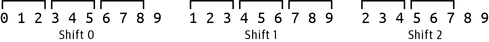
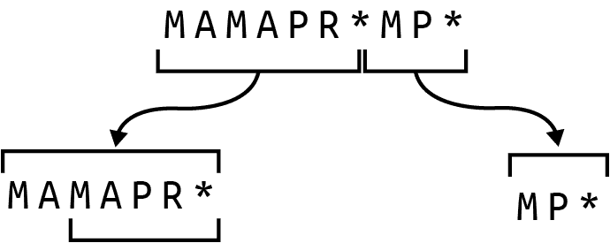
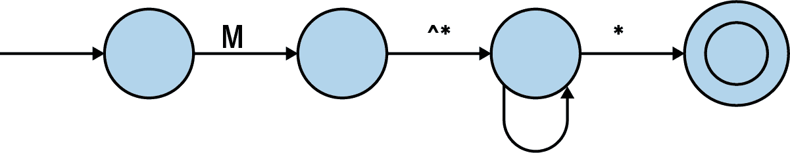

# 第十四章：寻找开放阅读框架

[ORF 挑战](https://oreil.ly/DPWXc)是本书中我将处理的最后一个 Rosalind 问题。其目标是在 DNA 序列中找到所有可能的开放阅读框架（ORFs）。一个 ORF 是从起始密码子到终止密码子之间的核苷酸区域。解决方案将考虑前向和反向互补以及移码。虽然有像 TransDecoder 这样的现有工具来找到编码区域，但编写一个专门的解决方案将集成许多前几章的技能，包括读取 FASTA 文件、创建序列的反向互补、使用字符串切片、找到 k-mer、使用多个`for`循环/迭代、翻译 DNA 和使用正则表达式。

你将学到：

+   如何将序列截断到与密码子大小整除的长度

+   如何使用`str.find()`和`str.partition()`函数

+   如何使用代码格式化、注释和 Python 的隐式字符串连接来记录正则表达式

# 入门指南

这个挑战的代码、测试和解决方案位于*14_orf*目录中。首先复制第一个解决方案到`orf.py`程序中：

```py
$ cd 14_orf/
$ cp solution1_iterate_set.py orf.py
```

如果你请求使用方法，你将看到程序需要一个 FASTA 格式文件的单个位置参数：

```py
$ ./orf.py -h
usage: orf.py [-h] FILE

Open Reading Frames

positional arguments:
  FILE        Input FASTA file

optional arguments:
  -h, --help  show this help message and exit
```

第一个测试输入文件与 Rosalind 页面上的示例内容相同。请注意，我在这里断开了序列文件，但在输入文件中是单行：

```py
$ cat tests/inputs/1.fa
>Rosalind_99
AGCCATGTAGCTAACTCAGGTTACATGGGGATGACCCCGCGACTTGGATTAGAGTCTCTTTTGGAATAAG\
CCTGAATGATCCGAGTAGCATCTCAG
```

运行程序并注意输出。ORF 的顺序并不重要：

```py
$ ./orf.py tests/inputs/1.fa
M
MGMTPRLGLESLLE
MLLGSFRLIPKETLIQVAGSSPCNLS
MTPRLGLESLLE
```

运行测试套件以确保程序通过测试。当你对程序的工作方式感到满意时，请重新开始：

```py
$ new.py -fp 'Open Reading Frames' orf.py
Done, see new script "orf.py".
```

到这一步，你可能不需要帮助来定义单个位置参数文件，但这是你可以使用的代码：

```py
class Args(NamedTuple):
    """ Command-line arguments """
    file: TextIO

def get_args() -> Args:
    """ Get command-line arguments """

    parser = argparse.ArgumentParser(
        description='Open Reading Frames',
        formatter_class=argparse.ArgumentDefaultsHelpFormatter)

    parser.add_argument('file', 
                        help='Input FASTA file',
                        metavar='FILE',
                        type=argparse.FileType('rt'))

    args = parser.parse_args()

    return Args(args.file)
```


定义一个必须是可读文本文件的位置参数。

修改`main()`函数以打印传入的文件名：

```py
def main() -> None:
    args = get_args()
    print(args.file.name)
```

验证程序是否打印使用说明，拒绝坏文件，并打印有效参数的文件名：

```py
$ ./orf.py tests/inputs/1.fa
tests/inputs/1.fa
```

到这一步，你的程序应该通过前三个测试。接下来，我将讨论如何让程序找到开放阅读框架（ORFs）。

## 在每一帧内翻译蛋白质

可以写一些伪代码来帮助勾勒出需要发生的事情：

```py
def main() -> None:
    args = get_args()

    # Iterate through each DNA sequence in the file:
        # Transcribe the sequence from DNA to mRNA
        # Iterate using the forward and reverse complement of the mRNA:
            # Iterate through 0, 1, 2 for frames in this sequence:
                # Translate the mRNA frame into a protein sequence
                # Try to find the ORFs in this protein sequence
```

你可以使用`for`循环来迭代通过`Bio.SeqIO`读取的输入序列：

```py
def main() -> None:
    args = get_args()

    for rec in SeqIO.parse(args.file, 'fasta'):
        print(str(rec.seq))
```

运行程序以验证其工作情况：

```py
$ ./orf.py tests/inputs/1.fa
AGCCATGTAGCTAACTCAGGTTACATGGGGATGACCCCGCGACTTGGATTAGAGTCTCTTTTGGA\
ATAAGCCTGAATGATCCGAGTAGCATCTCAG
```

我需要将这段转录成 mRNA，这意味着将所有的*T*改成*U*。你可以使用第第二章中任何你喜欢的解决方案，只要你的程序现在能打印出这个：

```py
$ ./orf.py tests/inputs/1.fa
AGCCAUGUAGCUAACUCAGGUUACAUGGGGAUGACCCCGCGACUUGGAUUAGAGUCUCUUUUGGA\
AUAAGCCUGAAUGAUCCGAGUAGCAUCUCAG
```

接下来，参考第三章，让你的程序打印出这个序列的前向和反向互补：

```py
$ ./orf.py tests/inputs/1.fa
AGCCAUGUAGCUAACUCAGGUUACAUGGGGAUGACCCCGCGACUUGGAUUAGAGUCUCUUUUGGA\
AUAAGCCUGAAUGAUCCGAGUAGCAUCUCAG
CUGAGAUGCUACUCGGAUCAUUCAGGCUUAUUCCAAAAGAGACUCUAAUCCAAGUCGCGGGGUCA\
UCCCCAUGUAACCUGAGUUAGCUACAUGGCU
```

参考第七章来将前向和反向互补转化为蛋白质：

```py
$ ./orf.py tests/inputs/1.fa
SHVANSGYMGMTPRLGLESLLE*A*MIRVASQ
LRCYSDHSGLFQKRL*SKSRGHPHVT*VSYMA
```

现在，不再从每个 mRNA 序列的开头读取，而是通过从零点、第一个和第二个字符开始读取来实现移位，可以使用字符串切片。如果使用 Biopython 翻译 mRNA 切片，可能会遇到以下警告：

> *部分密码子，长度(sequence)不是三的倍数。在翻译之前明确修剪序列或添加尾随的 N。这在未来可能会成为错误。*

为了修复这个问题，我创建了一个函数来截断序列，使其最接近被一个值偶数分割：

```py
def truncate(seq: str, k: int) -> str:
    """ Truncate a sequence to even division by k """

    return ''
```

图 14-1 显示了通过字符串`0123456789`进行位移并将每个结果截断到可以被 3 整除的长度的结果。



###### 图 14-1\. 将各种移位截断到密码子大小 3 可以整除的长度

这是一个你可以使用的测试：

```py
def test_truncate() -> None:
    """ Test truncate """

    seq = '0123456789'
    assert truncate(seq, 3) == '012345678'
    assert truncate(seq[1:], 3) == '123456789'
    assert truncate(seq[2:], 3) == '234567'
```

修改你的程序，以打印 mRNA 的前向和反向互补物的三种移位的蛋白质翻译。确保打印完整的翻译，包括所有的终止(`*`)密码子，如下所示：

```py
$ ./orf.py tests/inputs/1.fa
SHVANSGYMGMTPRLGLESLLE*A*MIRVASQ
AM*LTQVTWG*PRDLD*SLFWNKPE*SE*HL
PCS*LRLHGDDPATWIRVSFGISLNDPSSIS
LRCYSDHSGLFQKRL*SKSRGHPHVT*VSYMA
*DATRIIQAYSKRDSNPSRGVIPM*PELATW
EMLLGSFRLIPKETLIQVAGSSPCNLS*LHG
```

## 在蛋白质序列中找到 ORF

现在，程序可以从每个 mRNA 的移位框中找到所有蛋白质序列，是时候在蛋白质中寻找开放阅读框了。你的代码需要考虑从每个起始密码子到第一个随后的终止密码子的每个区间。密码子*AUG*是最常见的起始密码子，编码氨基酸甲硫氨酸(*M*)。有三种可能的终止密码子，用星号(`*`)表示。例如，图 14-2 显示，氨基酸序列*MAMAPR**包含两个起始密码子和一个终止密码子，因此有*MAMAPR*和*MAPR*两种可能的蛋白质。尽管通常工具只报告较长的序列，但 Rosalind 挑战期望所有可能的序列。


###### 图 14-2\. 蛋白质序列 MAMAPR*有两个重叠的开放阅读框

我决定编写一个名为`find_orfs()`的函数，它将接受一个氨基酸字符串并返回一个 ORF 列表：

```py
def find_orfs(aa: str) -> List[str]: 
    """ Find ORFs in AA sequence """

    return [] 
```


该函数接受一个氨基酸字符串，并返回可能的蛋白质字符串列表。


目前，返回空列表。

这是这个函数的一个测试。如果你能实现通过这个测试的`find_orfs()`，那么你应该能够通过集成测试：

```py
def test_find_orfs() -> None:
    """ Test find_orfs """

    assert find_orfs('') == [] 
    assert find_orfs('M') == [] 
    assert find_orfs('*') == [] 
    assert find_orfs('M*') == ['M'] 
    assert find_orfs('MAMAPR*') == ['MAMAPR', 'MAPR'] 
    assert find_orfs('MAMAPR*M') == ['MAMAPR', 'MAPR'] 
    assert find_orfs('MAMAPR*MP*') == ['MAMAPR', 'MAPR', 'MP'] 
```


空字符串应该不产生 ORF。


单个起始密码子而没有终止密码子应该不产生 ORF。


单个终止密码子而没有前置的起始密码子应该不产生 ORF。


即使在停止密码子之前没有中间碱基，函数也应该返回起始密码子。


此序列包含两个 ORF。


此序列同样仅包含两个 ORF。


此序列在两个不同部分中包含三个推测的 ORF。

一旦你能在每个 mRNA 序列中找到所有 ORFs，你应该将它们收集到一个独特的列表中。我建议你使用`set()`来完成这个任务。虽然我的解决方案按排序顺序打印 ORFs，但这不是测试的要求。解决问题的关键是将你已经学到的各种技能组合起来。编写越来越长的程序的技艺在于组合你理解和测试过的较小的片段。继续努力直到你通过所有的测试。

# 解决方案

我将提出三种解决方案来使用两个字符串函数和正则表达式来查找 ORFs。

## 解决方案 1：使用`str.index()`函数

首先，这里是我编写的`truncate()`函数的方法，该函数将在尝试转换各种移码 mRNA 序列时缓解`Bio.Seq.translate()`函数的影响：

```py
def truncate(seq: str, k: int) -> str:
    """ Truncate a sequence to even division by k """

    length = len(seq) 
    end = length - (length % k) 
    return seq[:end] 
```


找到序列的长度。


所需子序列的末尾是长度减去长度模`k`。


返回子序列。

接下来，这里是编写`find_orfs()`的一种方法，它使用`str.index()`函数来查找每个起始密码子 *M* 后面跟着一个`*`停止密码子：

```py
def find_orfs(aa: str) -> List[str]:
    orfs = [] 
    while 'M' in aa: 
        start = aa.index('M') 
        if '*' in aa[start + 1:]: 
            stop = aa.index('*', start + 1) 
            orfs.append(''.join(aa[start:stop])) 
            aa = aa[start + 1:] 
        else:
            break 

    return orfs
```


初始化一个列表来保存 ORFs。


创建一个循环来在存在起始密码子时迭代。


使用`str.index()`查找起始密码子的位置。


查看起始密码子位置后是否存在停止密码子。


获取起始密码子之后停止密码子的索引。


使用字符串切片来获取蛋白质。


将氨基酸字符串设置为起始密码子位置之后的索引，以查找下一个起始密码子。


如果没有停止密码子，退出`while`循环。

这里是我如何将这些想法整合到程序中的方法：

```py
def main() -> None:
    args = get_args()
    for rec in SeqIO.parse(args.file, 'fasta'): 
        rna = str(rec.seq).replace('T', 'U') 
        orfs = set() 

        for seq in [rna, Seq.reverse_complement(rna)]: 
            for i in range(3): 
                if prot := Seq.translate(truncate(seq[i:], 3), to_stop=False): 
                    for orf in find_orfs(prot): 
                        orfs.add(orf) 

        print('\n'.join(sorted(orfs))) 
```


遍历输入序列。


将 DNA 序列转录为 mRNA。


创建一个空集合来保存所有的 ORF。


遍历 mRNA 的正向和反向互补。


遍历移码。


尝试将截断的、移码的 mRNA 翻译成蛋白质序列。


遍历蛋白质序列中找到的每一个 ORF。


将 ORF 添加到集合中以保持唯一列表。


打印排序后的 ORF。

## 解决方案 2：使用 str.partition()函数

这里是编写`find_orfs()`函数的另一种方法，使用了`str.partition()`。此函数将字符串分成某个子字符串前的部分、子字符串本身和后面的部分。例如，字符串*MAMAPR*MP**可以在终止密码子(`*`)上进行分区：

```py
>>> 'MAMAPR*MP*'.partition('*')
('MAMAPR', '*', 'MP*')
```

如果蛋白质序列不包含终止密码子，则函数将在第一个位置返回整个序列和其他位置返回空字符串：

```py
>>> 'M'.partition('*')
('M', '', '')
```

在这个版本中，我使用了两个无限循环。第一个尝试在终止密码子上对给定的氨基酸序列进行分区。如果这不成功，我退出循环。图 14-3 显示蛋白质序列*MAMAPR*MP**包含两个有起始和终止密码子的部分。



###### 图 14-3。蛋白质序列*MAMAPR*MP*包含两个有起始和终止密码子的部分

第二个循环检查第一个分区，以找到所有以*M*起始密码子的子序列。因此，在分区*MAMAPR*中，它找到两个序列*MAMAPR*和*MAPR*。然后，代码截断氨基酸序列到最后分区*MP**，重复操作直到找到所有 ORF：

```py
def find_orfs(aa: str) -> List[str]:
    """ Find ORFs in AA sequence """

    orfs = [] 
    while True: 
        first, middle, rest = aa.partition('*') 
        if middle == '': 
            break

        last = 0 
        while True: 
            start = first.find('M', last) 
            if start == -1: 
                break
            orfs.append(first[start:]) 
            last = start + 1 
        aa = rest 

    return orfs 
```


初始化一个用于返回 ORF 的列表。


创建第一个无限循环。


在终止密码子上对氨基酸序列进行分区。


如果终止密码子不存在，则中间为空，因此退出外循环。


设置一个变量以记住起始密码子的最后位置。


创建第二个无限循环。


使用`str.find()`方法找到起始密码子的索引。


值为-1 表示起始密码子不存在，因此退出内循环。


将起始索引到 ORF 列表的子字符串添加。


将最后已知位置移动到当前起始位置之后。


将蛋白质序列截断到初始分区的最后部分。


将 ORFs 返回给调用者。

## 解决方案 3：使用正则表达式

在这个最终解决方案中，我再次指出，正则表达式可能是找到文本模式的最合适解决方案。这个模式总是以*M*开头，我可以使用`re.findall()`函数来找到这个蛋白质序列中的四个*M*：

```py
>>> import re
>>> re.findall('M', 'MAMAPR*MP*M')
['M', 'M', 'M', 'M']
```

Rosalind 挑战不考虑非规范起始密码子，因此 ORF 始终以*M*开头，并延伸到第一个停止密码子。在这些之间，可以有零个或多个非停止密码子，我可以用`[^*]`的否定字符类来表示，该类排除停止密码子，后跟一个`*`以指示可以有*零个或多个*之前的模式：

```py
>>> re.findall('M[^*]*', 'MAMAPR*MP*M')
['MAMAPR', 'MP', 'M']
```

我需要将停止密码子`*`添加到这个模式中。因为文字星号是一个元字符，我必须使用反斜杠进行转义：

```py
>>> re.findall('M[^*]*\*', 'MAMAPR*MP*M')
['MAMAPR*', 'MP*']
```

我也可以将星号放在字符类内，这样它就没有元字符的含义：

```py
>>> re.findall('M[^*]*[*]', 'MAMAPR*MP*M')
['MAMAPR*', 'MP*']
```

图 14-4 显示了使用有限状态机图的正则表达式来找到开放阅读框的模式。



###### 图 14-4\. 正则表达式找到开放阅读框的有限状态机图示

我可以看到这个模式接近工作，但它只找到三个 ORFs 中的两个，因为第一个与第二个重叠。就像第八章和 11 章中一样，我可以在正向先行断言中包装模式。此外，我将使用括号创建一个围绕 ORF 到停止密码子的捕获组：

```py
>>> re.findall('(?=(M[^*]*)[*])', 'MAMAPR*MP*M')
['MAMAPR', 'MAPR', 'MP']
```

这是一个使用这个模式的`find_orfs()`的版本：

```py
def find_orfs(aa: str) -> List[str]:
    """ Find ORFs in AA sequence """

    return re.findall('(?=(M[^*]*)[*])', aa)
```

尽管这通过了`test_find_orfs()`，但这是一个复杂的正则表达式，我每次回头都需要重新学习它。另一种编写方式是将正则表达式的每个功能部分放在单独的行上，然后跟随一条行尾注释，并依赖 Python 的隐式字符串连接（首次出现在第二章）将它们连接成一个字符串。这是我首选的找到开放阅读框（ORFs）的方法：

```py
def find_orfs(aa: str) -> List[str]:
    """ Find ORFs in AA sequence """

    pattern = ( 
        '(?='    # start positive look-ahead to handle overlaps
        '('      # start a capture group
        'M'      # a literal M
        '[^*]*'  # zero or more of anything not the asterisk
        ')'      # end the capture group
        '[*]'    # a literal asterisk
        ')')     # end the look-ahead group

    return re.findall(pattern, aa) 
```


括号将下面的行分组，以便 Python 会自动将字符串连接成单个字符串。确保没有逗号，否则 Python 会创建一个元组。


使用`re.findall()`函数与模式。

这是一个更长的函数，但下次看到它时会更容易理解。唯一的缺点是我用来格式化代码的`yapf`会移除注释的垂直对齐，因此我必须手动格式化这部分。不过，我认为值得这样做，以获得更具自我描述性的代码。

# 更进一步

扩展程序以处理多个输入文件，并将所有唯一的 ORFs 写入指定的输出文件。

# 复习

本章的关键点：

+   如果输入序列不能被三整除，`Bio.Seq.translate()` 函数会打印警告，因此我编写了一个 `truncate()` 函数来修剪蛋白质。

+   `str.find()` 和 `str.partition()` 函数各自提供了在字符串中查找子序列的方法。

+   正则表达式仍然是我在文本中查找模式的首选方法。

+   复杂的正则表达式可以分行编写，并附有注释，这样 Python 会隐式地将它们连接成单个字符串。
