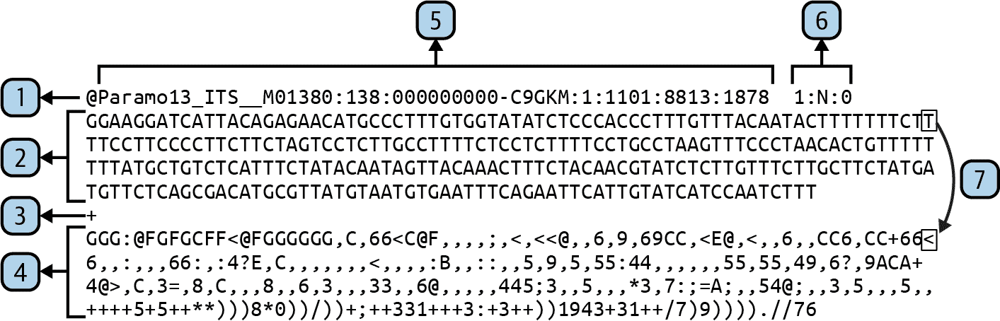
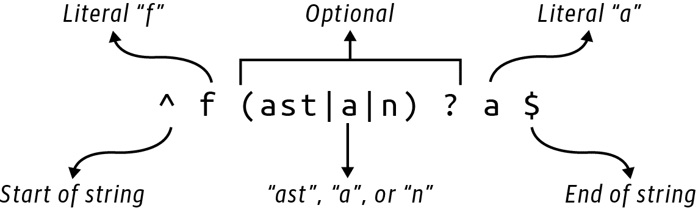
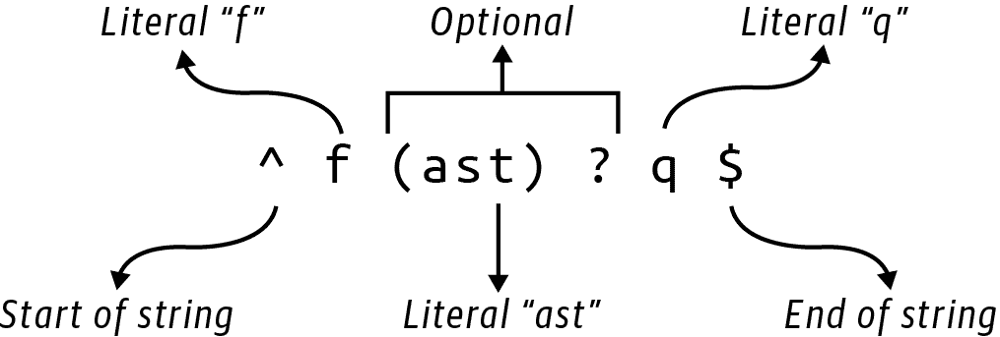
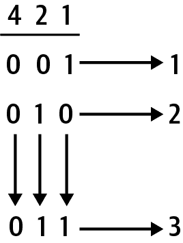

# 第十六章：FASTX grep：创建一个选择序列的实用程序

有一次，一个同事让我找出 FASTQ 文件中所有具有包含字符串*LSU*（表示*长亚单位*RNA）的描述或名称的 RNA 序列。虽然可以通过使用`grep`程序在 FASTQ 文件中找到与某些模式匹配的所有行来解决此问题¹，但是使用 Python 编写解决方案可以创建一个可以扩展到处理其他格式（如 FASTA）的程序，并且可以根据其他标准（如长度或 GC 含量）选择记录。此外，您还可以添加选项以更改输出序列格式，并为用户提供方便，例如根据文件扩展名猜测输入文件的格式。

在本章中，你将学到：

+   关于 FASTQ 文件的结构

+   如何执行不区分大小写的正则表达式匹配

+   有关在代码中实现 DWIM（做我想要的）和 DRY（不要重复自己）思想

+   如何使用`and`和`or`操作来减少布尔值和位

# 使用 grep 在文件中查找行

`grep`程序可以找到文件中与给定模式匹配的所有行。如果我在 FASTQ 文件中搜索*LSU*，它会找到包含此模式的两个标题行：

```py
$ grep LSU tests/inputs/lsu.fq
@ITSLSUmock2p.ITS_M01380:138:000000000-C9GKM:1:1101:14440:2042 2:N:0
@ITSLSUmock2p.ITS_M01384:138:000000000-C9GKM:1:1101:14440:2043 2:N:0
```

如果目标只是查找多少序列包含此字符串，我可以将其管道传递到`wc`（单词计数）以使用`-l`选项计算行数：

```py
$ grep LSU tests/inputs/lsu.fq | wc -l
       2
```

由于我的目标是提取头部包含子字符串*LSU*的序列记录，我必须做更多的工作。只要输入文件是 FASTQ 格式，我仍然可以使用`grep`，但这需要更好地理解格式。

# FASTQ 记录的结构

FASTQ 序列格式是从测序仪接收序列数据的常见方式，因为它包括每个碱基的碱基调用和质量分数。也就是说，测序仪通常报告一个碱基及其正确的测量确定性。例如，一些测序技术可能在同源聚合物串中遇到麻烦，比如许多*A*的聚(*A*)串，其中测序仪可能无法正确计数。随着读数变长，许多测序仪也会对碱基调用失去信心。质量分数是拒绝或截断低质量读数的重要手段。

根据测序仪的不同，有些碱基可能很难区分，模糊性可能会使用我在第一章中描述的 IUPAC 代码来报告，例如用*R*表示*A*或*G*，或者用*N*表示任意碱基。

FASTQ 格式在许多 Rosalind 挑战中使用的 FASTA 格式有些相似。作为提醒，FASTA 记录以`>`符号开头，后跟标识序列并可能包含元数据的标题行。然后是序列本身，可能是一行（可能很长）文本，也可能是分成多行。相比之下，FASTQ 记录必须始终是确切的四行，如图 16-1 所示。



###### 图 16-1\. FASTQ 记录的元素 —— 尽管此显示中的长行已换行，但实际记录包含四行。

让我们仔细看一下这个图的内容：

1.  第一行以 `@` 符号开头，并包含头部信息。

1.  第二行包含没有换行的序列。

1.  第三行以 `+` 符号开头。通常只有这个符号，但有时头部信息可能会重复。

1.  第四行包含序列中每个碱基的质量分数，且没有换行。

1.  序列 ID 是直到第一个空格的所有字符。

1.  附加元数据可能跟随 ID 并包含在描述中。

1.  序列中的每个碱基在质量行中都有一个对应的伙伴，表示此碱基正确的置信度。

FASTQ 头部具有与 FASTA 记录中头部相同的结构，唯一的区别是它以 `@` 符号而不是 `>` 符号开头。序列标识符通常是从 `@` 到第一个空格之间的所有字符。包含序列的第二行不能包含任何换行，序列中的每个碱基都有对应的质量值在第四行中。第四行上的质量分数使用字符的 ASCII 值来编码基本调用的确定性。这些分数首先使用 ASCII 表中的可打印字符，最初是在 第三章 中介绍的。

ASCII 表中的前 32 个值是不可打印的控制字符和空格。可打印字符从第 33 个开始，标点符号后跟数字。第一个字母 *A* 直到 65 才出现，大写字符在小写字符之前。以下是存储库中包含的 `asciitbl.py` 程序输出的 ASCII 表中 128 个值的序号值：

```py
$ ./asciitbl.py
  0 NA      26 NA      52 4       78 N      104 h
  1 NA      27 NA      53 5       79 O      105 i
  2 NA      28 NA      54 6       80 P      106 j
  3 NA      29 NA      55 7       81 Q      107 k
  4 NA      30 NA      56 8       82 R      108 l
  5 NA      31 NA      57 9       83 S      109 m
  6 NA      32 SPACE   58 :       84 T      110 n
  7 NA      33 !       59 ;       85 U      111 o
  8 NA      34 "       60 <       86 V      112 p
  9 NA      35 #       61 =       87 W      113 q
 10 NA      36 $       62 >       88 X      114 r
 11 NA      37 %       63 ?       89 Y      115 s
 12 NA      38 &       64 @       90 Z      116 t
 13 NA      39 '       65 A       91 [      117 u
 14 NA      40 (       66 B       92 \      118 v
 15 NA      41 )       67 C       93 ]      119 w
 16 NA      42 *       68 D       94 ^      120 x
 17 NA      43 +       69 E       95 _      121 y
 18 NA      44 ,       70 F       96 `      122 z
 19 NA      45 -       71 G       97 a      123 {
 20 NA      46 .       72 H       98 b      124 |
 21 NA      47 /       73 I       99 c      125 }
 22 NA      48 0       74 J      100 d      126 ~
 23 NA      49 1       75 K      101 e      127 DEL
 24 NA      50 2       76 L      102 f
 25 NA      51 3       77 M      103 g
```

查看 图 16-1 中 FASTQ 记录的质量行，看看字符是如何从开始的大写字母到末尾的标点符号和数字进行变化的。请注意，第四行上的 `@` 和 `+` 符号表示可能的质量值，因此它们不是表示记录开头或分隔线的元字符。因此，FASTQ 记录不能使用换行符来断开序列（如 FASTA 记录）或质量行：符号 `@` 和 `+` 可能会成为行中的第一个字符，使得无法找到记录的起始位置。结合这一点与通常由一个单独的 `+` 符号组成的完全无用的第三行，有时无端地重述了所有的头部信息，你就会明白为什么不应该让生物学家定义文件格式。

有多种使用不同范围表示质量分数的编码标准。

因为 FASTQ 记录必须是四行长，我可以使用 `-A|--after-context` 选项来指定每个匹配后面的行数：

```py
$ grep -A 4 LSU tests/inputs/lsu.fq | head -4
@ITSLSUmock2p.ITS_M01380:138:000000000-C9GKM:1:1101:14440:2042 2:N:0
CAAGTTACTTCCTCTAAATGACCAAGCCTAGTGTAGAACCATGTCGTCAGTGTCAGTCTGAGTGTAGATCT\
CGGTGGTCGCCGTATCATTAAAAAAAAAAATGTAATACTACTAGTAATTATTAATATTATAATTTTGTCTA\
TTAGCATCTTATTATAGATAGAAGATATTATTCATATTTCACTATCTTATACTGATATCAGCTTTATCAGA\
TCACACTCTAGTGAAGATTGTTCTTAACTGAAATTTCCTTCTTCATACAGACACATTAATCTTACCTA
+
EFGGGGGGGGGCGGGGGFCFFFGGGGGFGGGGGGGGGGGFGGGGGGGFGFFFCFGGFFGGGGGGGGGFGGG\
GFGGGDG<FD@4@CFFGGGGCFFAFEFEG+,9,,,,99,,,5,,49,4,8,4,444,4,4,,,,,,,,,,,\
,,,8,,,,63,,,,,,,,376,3,,,,,,,8,,,,,,,,,+++++++++++++3++25+++0+*+0+*0+*\
**))*0))1/+++**************.****.*******0*********/(,(/).)))1)).).).
```

只要感兴趣的子字符串仅出现在头部（记录的第一行），这将有效。如果 `grep` 成功在记录的任何其他行中找到匹配项，它将打印该行及其接下来的三行，导致无法使用的垃圾。考虑到我想精确控制要搜索的记录部分以及输入文件可能是 FASTQ、FASTA 或任意其他格式，很快就会显而易见，`grep` 不能带我走得很远。

# 入门指南

首先，我会展示我的解决方案是如何工作的，然后挑战你来实现你自己的版本。此练习的所有代码和测试都在仓库的 *16_fastx_grep* 目录中。首先进入此目录，并将解决方案复制到 `fastx_grep.py`：

```py
$ cd 16_fastx_grep
$ cp solution.py fastx_grep.py
```

`grep` 的使用显示它接受两个位置参数，一个模式和一个或多个文件：

```py
$ grep -h
usage: grep [-abcDEFGHhIiJLlmnOoqRSsUVvwxZ] [-A num] [-B num] [-C[num]]
	[-e pattern] [-f file] [--binary-files=value] [--color=when]
	[--context[=num]] [--directories=action] [--label] [--line-buffered]
	[--null] [pattern] [file ...]
```

请求 `fastx_grep.py` 程序的帮助，并查看它具有类似的接口，需要一个模式和一个或多个输入文件。此外，此程序可以解析不同的输入文件格式，生成各种输出格式，将输出写入文件，并执行不区分大小写的匹配：

```py
$ ./fastx_grep.py -h
usage: fastx_grep.py [-h] [-f str] [-O str] [-o FILE] [-i]
                     PATTERN FILE [FILE ...]

Grep through FASTX files

positional arguments:
  PATTERN               Search pattern 
  FILE                  Input file(s) 

optional arguments:
  -h, --help            show this help message and exit
  -f str, --format str  Input file format (default: ) 
  -O str, --outfmt str  Output file format (default: ) 
  -o FILE, --outfile FILE
                        Output file (default: <_io.TextIOWrapper 
                        name='<stdout>' mode='w' encoding='utf-8'>)
  -i, --insensitive     Case-insensitive search (default: False) 
```


正则表达式（模式）是第一个位置参数。


需要第二个的一个或多个位置文件参数。


序列的输入文件格式，可以是 *fasta* 或 *fastq*。默认情况下会从文件扩展名猜测。


输出文件格式，可以是 *fasta*、*fastq* 或 *fasta-2line* 中的一种。默认情况下与输入文件相同。


输出文件名；默认为 `STDOUT`。


是否执行不区分大小写的匹配；默认为 `False`。

此程序具有比第一部分的许多程序更复杂的参数集合。像往常一样，我喜欢使用 `NamedTuple` 来模拟选项：

```py
from typing import List, NamedTuple, TextIO

class Args(NamedTuple):
    """ Command-line arguments """
    pattern: str 
    files: List[TextIO] 
    input_format: str 
    output_format: str 
    outfile: TextIO 
    insensitive: bool 
```


要使用的正则表达式。


一个或多个输入文件。


输入文件的格式，例如 FASTA 或 FASTQ。


输出文件的格式。


输出文件的名称。


是否执行不区分大小写的搜索。

这是我定义程序参数的方法：

```py
def get_args() -> Args:
    """ Get command-line arguments """

    parser = argparse.ArgumentParser(
        description='Grep through FASTX files',
        formatter_class=argparse.ArgumentDefaultsHelpFormatter)

    parser.add_argument('pattern', 
                        metavar='PATTERN',
                        type=str,
                        help='Search pattern')

    parser.add_argument('file',
                        metavar='FILE',
                        nargs='+',
                        type=argparse.FileType('rt'), 
                        help='Input file(s)')

    parser.add_argument('-f',
                        '--format',
                        help='Input file format',
                        metavar='str',
                        choices=['fasta', 'fastq'], 
                        default='')

    parser.add_argument('-O',
                        '--outfmt',
                        help='Output file format',
                        metavar='str',
                        choices=['fasta', 'fastq', 'fasta-2line'], 
                        default='')

    parser.add_argument('-o',
                        '--outfile',
                        help='Output file',
                        type=argparse.FileType('wt'), 
                        metavar='FILE',
                        default=sys.stdout)

    parser.add_argument('-i', 
                        '--insensitive',
                        help='Case-insensitive search',
                        action='store_true')

    args = parser.parse_args()

    return Args(pattern=args.pattern,
                files=args.file,
                input_format=args.format,
                output_format=args.outfmt,
                outfile=args.outfile,
                insensitive=args.insensitive)
```


模式将是一个字符串。


输入必须是可读的文本文件。


使用`choices`来约束输入值。默认值将从输入文件扩展名中猜测。


使用`choices`来约束值；默认使用输入格式。*fasta-2line*选项不会将长序列分割成多行，因此每条记录只使用两行。


输出文件将是可写的文本文件。默认为`STDOUT`。


一个标志来指示不区分大小写的搜索。默认值为`False`。

如果您运行以下命令在*lsu.fq*测试文件中搜索*LSU*，您应该看到八行输出，表示两个 FASTQ 记录：

```py
$ ./fastx_grep.py LSU tests/inputs/lsu.fq | wc -l
       8
```

但是，如果您搜索小写的*lsu*，您应该看不到输出：

```py
$ ./fastx_grep.py lsu tests/inputs/lsu.fq | wc -l
       0
```

使用`-i|--insensitive`标志执行不区分大小写的搜索：

```py
$ ./fastx_grep.py -i lsu tests/inputs/lsu.fq  | wc -l
       8
```

您可以使用`-o|--outfile`选项将结果写入文件，而不是`STDOUT`：

```py
$ ./fastx_grep.py -o out.fq -i lsu tests/inputs/lsu.fq
$ wc -l out.fq
       8 out.fq
```

如果您查看*out.fq*文件，您会看到它的格式与原始输入一样是 FASTQ 格式。您可以使用`-O|--outfmt`选项将其更改为类似 FASTA 的格式，并查看输出文件以验证格式：

```py
$ ./fastx_grep.py -O fasta -o out.fa -i lsu tests/inputs/lsu.fq
$ head -3 out.fa
>ITSLSUmock2p.ITS_M01380:138:000000000-C9GKM:1:1101:14440:2042 2:N:0
CAAGTTACTTCCTCTAAATGACCAAGCCTAGTGTAGAACCATGTCGTCAGTGTCAGTCTG
AGTGTAGATCTCGGTGGTCGCCGTATCATTAAAAAAAAAAATGTAATACTACTAGTAATT
```

尝试使用*fasta-2line*输出格式，看看长序列如何不会被分割成多行。请注意，该程序也可以处理 FASTA 输入，无需我指示文件格式，因为它是从*.fa*文件扩展名中猜测出来的：

```py
$ ./fastx_grep.py -o out.fa -i lsu tests/inputs/lsu.fa
$ ../15_seqmagique/seqmagique.py out.fa
name      min_len    max_len    avg_len    num_seqs
out.fa        281        301     291.00           2
```

运行**`pytest -v`**以查看程序的所有测试，这些测试包括猜测文件格式、处理空文件、搜索小写和大写输入，同时包括大小写敏感和不敏感的情况、写入输出文件以及写入不同的输出格式。当您认为自己了解了程序必须处理的所有选项时，请重新开始：

```py
$ new.py -fp 'Grep through FASTX files' fastx_grep.py
Done, see new script "fastx_grep.py".
```

## 猜测文件格式

如果您查看前一节中创建的*out.fa*，您会发现它是以 FASTA 格式保存的，与输入格式匹配，但我从未指定过输入文件格式。程序智能地检查输入文件的文件扩展名，并根据表 16-1 中的假设猜测格式。类似地，如果没有指定输出格式，则假定输入文件格式为所需的输出格式。这是软件开发中*DWIM*原则的一个例子：做我所想要的。

表 16-1\. FASTA/Q 文件的常见文件扩展名

| Extension | Format |
| --- | --- |
| *.fasta* | FASTA |
| *.fa* | FASTA |
| *.fna* | FASTA（核苷酸） |
| *.faa* | FASTA（氨基酸） |
| *.fq* | FASTQ |
| *.fastq* | FASTQ |

您的程序同样需要猜测输入文件的格式。我创建了一个`guess_format()`函数，它接受文件名并返回一个字符串，要么是`fasta`，要么是`fastq`。这是函数的一个桩代码：

```py
def guess_format(filename: str) -> str:
    """ Guess format from extension """

    return ''
```

这是我写的测试。在定义了参数之后，我建议您从这个函数开始。在您的代码通过这个测试之前，请不要继续：

```py
def test_guess_format() -> None:
    """ Test guess_format """

    assert guess_format('/foo/bar.fa') == 'fasta'
    assert guess_format('/foo/bar.fna') == 'fasta'
    assert guess_format('/foo/bar.faa') == 'fasta'
    assert guess_format('/foo/bar.fasta') == 'fasta'
    assert guess_format('/foo/bar.fq') == 'fastq'
    assert guess_format('/foo/bar.fastq') == 'fastq'
    assert guess_format('/foo/bar.fx') == ''
```

这可能有助于勾勒出程序应该如何工作：

```py
def main():
    get the program arguments

    for each input file:
        guess the input format or complain that it can't be guessed
        figure out the output format from the args or use the input format

        for each record in the input file:
            if the sequence ID or description matches the pattern:
                write the sequence to the output file in the output format
```

例如，我可以通过使用 shell glob `*.f[aq]`在三个输入文件上运行程序，以指示所有以字母*f*开头并以字母*a*或*q*结尾的文件：

```py
$ ls tests/inputs/*.f[aq]
tests/inputs/empty.fa  tests/inputs/lsu.fa    tests/inputs/lsu.fq
```

这应该向文件*out.fa*写入四个序列：

```py
$ ./fastx_grep.py -O fasta -o out.fa -i lsu tests/inputs/*.f[aq]
$ ../15_seqmagique/seqmagique.py out.fa
name      min_len    max_len    avg_len    num_seqs
out.fa        281        301     291.00           4
```

这是一个复杂的程序，可能需要您相当长的时间才能完成。在你的挣扎中有价值，所以只需继续编写并运行测试，你还应该阅读以了解如何挑战你的程序。

# 解决方案

根据我的经验，这是一个真实复杂的程序，捕捉了我经常编写的许多模式。它开始验证和处理一些输入文件。我是一个真正懒惰的程序员²，总是希望给我的程序尽可能少的信息，所以我很高兴写一点代码来猜测文件格式。

## 从文件扩展名猜测文件格式

我将从猜测文件格式的函数开始：

```py
def guess_format(filename: str) -> str:
    """ Guess format from extension """

    ext = re.sub('^[.]', '', os.path.splitext(filename)[1]) 

    return 'fasta' if re.match('f(ast|a|n)?a$', ext) else 'fastq' if re.match( 
        'f(ast)?q$', ext) else ''
```


使用`os.path.splitext()`函数获取文件扩展名并去除前导点。


如果扩展名与 Table 16-1 中的 FASTA 文件模式之一匹配，则返回字符串 `fasta`；如果匹配 FASTQ 模式，则返回 `fastq`；否则返回空字符串。

`os.path.splitext()` 函数将文件名的根和扩展名作为一个 2 元组返回：

```py
>>> import os
>>> os.path.splitext('/foo/bar.fna')
('/foo/bar', '.fna')
```

由于我只关心第二部分，我可以使用 `_` 将元组的第一个成员赋值给一个丢弃变量：

```py
>>> _, ext = os.path.splitext('/foo/bar.fna')
>>> ext
'.fna'
```

相反，我选择索引元组以仅选择扩展名：

```py
>>> ext = os.path.splitext('/foo/bar.fna')[1]
>>> ext
'.fna'
```

因为我不想要前导点，我可以使用字符串切片来移除它，但这看起来对我来说既神秘又难以理解：

```py
>>> ext = os.path.splitext('/foo/bar.fna')[1][1:]
>>> ext
'fna'
```

相反，我更喜欢使用我在 Chapter 2 中首次介绍的 `re.sub()` 函数。我要查找的模式是字符串开头的字面点。插入符号 `^` 表示字符串的开头，`.` 是一个元字符，表示任何字符。为了显示我想要一个字面点，我必须在其前面加上反斜杠，如 `^\.`，或者将其放在字符类中，如 `^[.]`：

```py
>>> import re
>>> ext = re.sub('^[.]', '', os.path.splitext('/foo/bar.fna')[1]) 
>>> ext
'fna'
```


使用 `re.sub()` 函数去除文件扩展名开头的字面点。

如 Table 16-1 所示，有四个常见的 FASTA 文件扩展名，可以用一个紧凑的正则表达式表示。回想一下，`re` 模块中有两个用于搜索的函数：

+   `re.match()` 函数用于从字符串开头找到匹配项。

+   `re.search()` 函数可以在字符串的任意位置找到匹配项。

在这个例子中，我使用 `re.match()` 函数来确保模式（第一个参数）在扩展名（第二个参数）的开头找到匹配项：

```py
>>> re.match('f(ast|a|n)?a$', ext)
<re.Match object; span=(0, 3), match='fna'>
```

要从 `re.search()` 中获得相同的结果，我需要在模式的开始处使用插入符号来锚定字符串的开始：

```py
>>> re.search('^f(ast|a|n)?a$', ext)
<re.Match object; span=(0, 3), match='fna'>
```

Figure 16-2 描述了正则表达式的每个部分。



###### 图 16-2\. 用于匹配四种 FASTA 模式的正则表达式

作为有限状态机图的绘制，可能会有所帮助，如 Figure 16-3 所示。


###### 图 16-3\. 用于匹配四种 FASTA 模式的有限状态机图

由于 FASTQ 文件只有两种模式，因此模式相对较简单：

```py
>>> re.search('^f(ast)?q$', 'fq')
<re.Match object; span=(0, 2), match='fq'>
>>> re.search('^f(ast)?q$', 'fastq')
<re.Match object; span=(0, 5), match='fastq'>
```

Figure 16-4 解释了这个正则表达式。



###### 图 16-4\. 用于匹配两种 FASTQ 模式的正则表达式

Figure 16-5 展示了相同的想法作为有限状态机的表示。


###### 图 16-5\. 用于匹配两种 FASTQ 模式的有限状态机图

## 当计划顺利进行时，我非常喜欢它

下面是我如何在 `main()` 中使用我在本章第一部分介绍的结构编写的：

```py
def main() -> None:
    args = get_args()
    regex = re.compile(args.pattern, re.IGNORECASE if args.insensitive else 0) 

    for fh in args.files: 
        input_format = args.input_format or guess_format(fh.name) 

        if not input_format: 
            sys.exit(f'Please specify file format for "{fh.name}"')

        output_format = args.output_format or input_format 

        for rec in SeqIO.parse(fh, input_format): 
            if any(map(regex.search, [rec.id, rec.description])): 
                SeqIO.write(rec, args.outfile, output_format) 
```


编译正则表达式以找到给定的模式。


遍历输入文件。


使用输入格式或从文件名猜测它。


如果没有输入文件格式，则报错退出。


使用输出格式或使用输入格式。


遍历文件中的每个序列。


查看序列 ID 或描述是否与模式匹配。


如果是这样，请将序列写入输出文件。

有几件事我想要强调，我将从使用`sys.exit()`来中断程序处理文件的过程中，如果我无法决定输出文件格式。这是一个我不一定期望用户提供的值，希望在程序运行时能够弄清楚。如果不能，那么我需要向用户返回一个错误消息，并向操作系统返回一个退出值，指示失败。我需要用户重新开始并纠正缺失的信息，然后才能继续。

我还要指出我使用`any()`函数的地方，该函数在`all()`函数中有一个类似物。这两个函数将一系列真值值减少为单个布尔值。`all()`函数将返回`True`，如果*所有*值为真，否则为`False`：

```py
>>> all([True, True, True])
True
>>> all([True, False, True])
False
```

当`any()`函数返回`True`时，*任何*值为真，否则为`False`：

```py
>>> any([True, False, True])
True
>>> any([False, False, False])
False
```

我将此与编译的正则表达式一起使用，搜索记录的 ID 和描述字段。该正则表达式还使用`re.IGNORECASE`标志来开启不区分大小写的匹配。为了解释这一点，我想离题讨论一下 Python 如何使用`and`和`or`结合布尔值，以及使用相应的位运算符`&`和`|`。

## 合并正则表达式搜索标志

默认情况下，正则表达式区分大小写，但该程序需要处理大小写敏感和不敏感的搜索。例如，如果我搜索小写的*lsu*但记录标头只有大写的*LSU*，我期望这次搜索失败：

```py
>>> import re
>>> type(re.search('lsu', 'This contains LSU'))
<class 'NoneType'>
```

一种忽略大小写的方法是强制搜索模式和字符串都转换为大写或小写：

```py
>>> re.search('lsu'.upper(), 'This contains LSU'.upper())
<re.Match object; span=(14, 17), match='LSU'>
```

另一种方法是向`re.search()`函数提供一个可选标志：

```py
>>> re.search('lsu', 'This contains LSU', re.IGNORECASE)
<re.Match object; span=(14, 17), match='LSU'>
```

可以缩短为`re.I`：

```py
>>> re.search('lsu', 'This contains LSU', re.I)
<re.Match object; span=(14, 17), match='LSU'>
```

在程序中，当我编译正则表达式时使用这个：

```py
regex = re.compile(args.pattern, re.IGNORECASE if args.insensitive else 0) 
```


如果`args.insensitive`为`True`，则在编译模式时使用`re.IGNORECASE`选项；否则，使用`0`，表示没有选项。

我首先展示了如何在第十一章中编译正则表达式。优点是 Python 只需解析模式一次，通常可以使代码运行更快。这里我需要决定是否使用可选标志进行不区分大小写匹配。我可以使用其他标志改变正则表达式匹配的许多方面，这些标志可以使用位或`|`运算符组合。我认为最好从`help(re)`的文档开始：

```py
Each function other than purge and escape can take an optional 'flags' argument
consisting of one or more of the following module constants, joined by "|".
A, L, and U are mutually exclusive.
    A  ASCII       For string patterns, make \w, \W, \b, \B, \d, \D
                   match the corresponding ASCII character categories
                   (rather than the whole Unicode categories, which is the
                   default).
                   For bytes patterns, this flag is the only available
                   behaviour and needn't be specified.
    I  IGNORECASE  Perform case-insensitive matching.
    L  LOCALE      Make \w, \W, \b, \B, dependent on the current locale.
    M  MULTILINE   "^" matches the beginning of lines (after a newline)
                   as well as the string.
                   "$" matches the end of lines (before a newline) as well
                   as the end of the string.
    S  DOTALL      "." matches any character at all, including the newline.
    X  VERBOSE     Ignore whitespace and comments for nicer looking RE's.
    U  UNICODE     For compatibility only. Ignored for string patterns (it
                   is the default), and forbidden for bytes patterns.
```

仔细观察，我发现`re.IGNORECASE`是一个[`enum`](https://oreil.ly/J6Wsy)或*枚举*，具有可能值：

```py
>>> type(re.IGNORECASE)
<enum 'RegexFlag'>
```

根据[文档](https://oreil.ly/nONMy)，这是“`enum.IntFlag`的子类”描述如下：（https://oreil.ly/l1dyG）

> 创建枚举常量的基类，可以使用位运算符组合它们而不失去它们的`IntFlag`成员资格。`IntFlag`成员也是`int`的子类。

这意味着`re.IGNORECASE`深层次上是一个`int`，就像`False`实际上是`0`，`True`实际上是`1`一样。我进行了一些侦探工作，通过添加`0`来确定标志的整数值：

```py
>>> for flag in sorted([re.A, re.I, re.L, re.M, re.S, re.X, re.U]):
...     print(f'{flag:15} {flag + 0:5} {0 + flag:#011b}')
...
re.IGNORECASE       2 0b000000010
re.LOCALE           4 0b000000100
re.MULTILINE        8 0b000001000
re.DOTALL          16 0b000010000
re.UNICODE         32 0b000100000
re.VERBOSE         64 0b001000000
re.ASCII          256 0b100000000
```

注意每个值都是 2 的幂，因此每个标志可以由单个唯一位表示。这使得可以使用文档中提到的`|`运算符组合标志。为了演示，我可以使用前缀`0b`表示原始字节字符串。以下是数字 1 和 2 的二进制表示。请注意，每个值仅使用一个设置为 1 的位：

```py
>>> one = 0b001
>>> two = 0b010
```

如果我使用`|`来对位进行*或*操作，每个三位数都将使用表 16-2 中显示的真值表进行组合。

表 16-2\. 或运算（`|`）的真值表

| 第一 | 第二 | 结果 |
| --- | --- | --- |
| T | T | T |
| T | F | T |
| F | T | T |
| F | F | F |

如图 16-6 所示，Python 将查看每个位，并且如果任一位为 1，则选择 1，仅当两个位都为 0 时，结果为 0，导致`0b011`，这是数字 3 的二进制表示，因为位置 1 和 2 的位均已设置：

```py
>>> one | two
3
```



###### 图 16-6\. 当对每列位进行或运算时，任何位置为 1 的情况都会得到 1；如果所有位都为 0，则结果为 0。

当使用`&`运算符时，Python 仅当两个位都为 1 时才会返回 1；否则，会返回 0，如表 16-3 所示。

表 16-3\. 与运算（`&`）的真值表

| 第一 | 第二 | 结果 |
| --- | --- | --- |
| T | T | T |
| T | F | F |
| F | T | F |
| F | F | F |

因此，使用`&`来组合`one`和`two`将导致值为`0b000`，这是 0 的二进制表示：

```py
>>> one & two
0
```

我可以使用`|`运算符来连接多个正则表达式标志位。例如，`re.IGNORECASE`是 2，表示为`0b010`，`re.LOCALE`是 4，表示为`0b100`。按位或将它们组合为`0b110`，这是数字 6：

```py
>>> 0b010 | 0b100
6
```

我可以验证这一点：

```py
>>> (re.IGNORECASE | re.LOCALE) == 6
True
```

要返回到`re.compile()`函数，默认情况下是区分大小写的：

```py
>>> regex = re.compile('lsu')
>>> type(regex.search('This contains LSU'))
<class 'NoneType'>
```

如果用户想要执行不区分大小写的搜索，那么我想要执行类似这样的操作：

```py
>>> regex = re.compile('lsu', re.IGNORECASE)
>>> regex.search('This contains LSU')
<re.Match object; span=(14, 17), match='LSU'>
```

避免这种情况的一种方法是使用一个`if`语句：

```py
regex = None
if args.insensitive:
    regex = re.compile(args.pattern, re.IGNORECASE)
else:
    regex = re.compile(args.pattern)
```

我不喜欢这个解决方案，因为它违反了*DRY*原则：不要重复自己。我可以编写一个`if`表达式来选择`re.IGNORECASE`标志或一些表示*无标志*的默认值，这个值恰好是数字 0：

```py
regex = re.compile(args.pattern, re.IGNORECASE if args.insensitive else 0)
```

如果我想要扩展这个程序以包括文档中的任何其他搜索标志，我可以使用`|`来组合它们。第六章和第十二章讨论了将多个值*减少*为单个值的思想。例如，我可以使用加法将数字列表减少到它们的和，或者使用乘法创建乘积，并使用`str.join()`函数将字符串列表减少到单个值。我可以类似地使用按位`|`来减少所有的正则表达式标志：

```py
>>> (re.A | re.I | re.L | re.M | re.S | re.X | re.U) + 0
382
```

因为这些标志使用唯一的位，所以可以通过使用`&`运算符来确定特定位是否处于打开状态，从而确切地找出生成特定值时使用了哪些标志。例如，前面我展示了如何使用`|`组合标志`re.IGNORECASE`和`re.LOCALE`：

```py
>>> flags = re.IGNORECASE | re.LOCALE
```

要查看`flags`变量中是否存在特定标志，我使用`&`。当我进行*与*操作时，只有两个值中都存在的 1 位才会返回：

```py
>>> flags & re.IGNORECASE
re.IGNORECASE
```

如果我*与*一个不在组合值中的标志，结果将为 0：

```py
>>> (flags & re.VERBOSE) + 0
0
```

关于组合位的信息太多了。所以，如果你不知道，现在你知道了。

## 减少布尔值

我想把这个带回我在这个程序中使用的`any()`函数。与整数值的按位组合类似，我可以类似地减少多个布尔值。也就是说，这里是与表 16-2 中相同的信息，使用`or`运算符来组合布尔值：

```py
>>> True or True
True
>>> True or False
True
>>> False or True
True
>>> False or False
False
```

这与使用`any()`和布尔值列表是一样的。如果*任何*值为真，则整个表达式为`True`：

```py
>>> any([True, True])
True
>>> any([True, False])
True
>>> any([False, True])
True
>>> any([False, False])
False
```

这里是与表 16-3 中相同的数据，使用`and`来组合布尔值：

```py
>>> True and True
True
>>> True and False
False
>>> False and True
False
>>> False and False
False
```

这与使用`all()`是一样的。只有当*所有*值都为真时，整个表达式才为`True`：

```py
>>> all([True, True])
True
>>> all([True, False])
False
>>> all([False, True])
False
>>> all([False, False])
False
```

这是我使用这个想法的代码行：

```py
if any(map(regex.search, [rec.id, rec.description])):
```

`map()` 函数将每个 `rec.id` 和 `rec.description` 的值传递给 `regex.search()` 函数，返回一个可以解释其真实性的值列表。如果其中任何一个是真的——意味着至少在一个字段中找到了匹配——则 `any()` 将返回 `True`，并且应将序列写入输出文件。

# 进一步探索

有时序列头部包含键/值元数据，如“Organism=Oryza sativa”。添加一个选项来搜索这些值。确保将输入文件示例添加到 *tests/inputs* 目录，并将相应的测试添加到 *tests/fastx_grep_test.py* 中。

扩展程序以处理额外的输入序列格式，如 GenBank、EMBL 和 SwissProt。同样，请确保添加示例文件和测试以确保程序正常工作。

修改程序以选择具有一些最小长度和质量分数的序列。

# 复习

本章的重点：

+   FASTQ 文件格式要求每个记录由四行表示：一个头部、序列、一个分隔符和质量分数。

+   正则表达式匹配可以接受控制标志，例如是否执行大小写不敏感匹配。默认情况下，正则表达式是区分大小写的。

+   要指定多个正则表达式标志，请使用 `|`（*或*）按位运算符来组合标志的整数值。

+   布尔值可以使用 `and` 和 `or` 操作符以及 `any()` 和 `all()` 函数进行简化。

+   DWIM（做我想要的）美学意味着你尝试预测用户自然和智能地希望程序做什么。

+   DRY（不要重复自己）原则意味着你永远不要在代码中重复相同的想法，而是将其隔离到一个位置或函数中。

¹ 有人说这是 *全局正则表达式打印* 的缩写。

² 根据[*Perl 编程*](https://oreil.ly/XnvaC)（Tom Christiansen 等著，O’Reilly，2012）中的描述，程序员的三大美德是懒惰、急躁和傲慢。
