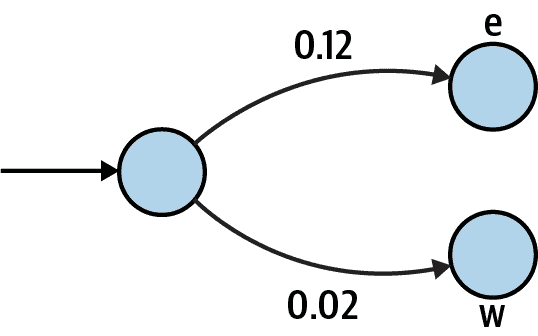
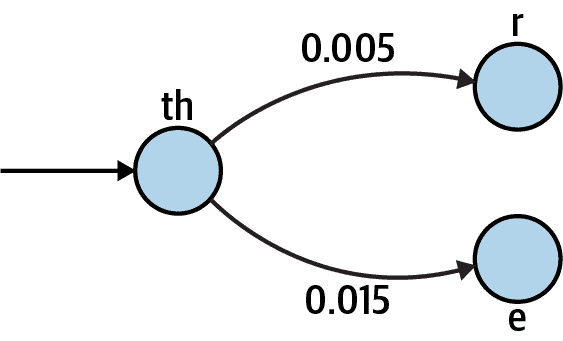

# 第十七章\. DNA 合成器：使用马尔可夫链创建合成数据

马尔可夫链是用于表示给定数据集中可能性序列的模型。它是一种机器学习（ML）算法，因为它能从输入数据中发现或学习模式。在这个练习中，我将展示如何使用训练在一组 DNA 序列上的马尔可夫链来生成新的 DNA 序列。

在这个练习中，你将：

+   读取一些输入序列文件以找出给定*k*的所有唯一 k-mer。

+   使用这些 k-mer 创建马尔可夫链来生成长度受最小和最大限制的一些新序列。

+   学习生成器。

+   使用随机种子复制随机选择。

# 理解马尔可夫链

在克劳德·香农的[《通信的数学理论》](https://oreil.ly/8Gka4)（1948 年）中，作者描述了一种意外类似于我一直用来说明正则表达式的图和有限状态图的*马尔可夫过程*。香农将这一过程描述为“系统的有限数量可能的*状态*”和“一组转移概率”，其中一个状态将导致另一个状态。

例如，对于马尔可夫过程的一个例子，香农描述了一个系统，通过从英语字母表的 26 个字母和一个空格中随机选择来生成文本字符串。在“零阶近似”中，每个字符被选择的概率相等。这个过程生成的字符串中，像*bz*和*qr*这样的字母组合可能与*st*和*qu*一样频繁出现。然而，实际的英语单词表明，后两者比前两者常见得多：

```py
$ for LETTERS in bz qr st qu
> do echo -n $LETTERS && grep $LETTERS /usr/share/dict/words | wc -l; done
bz       4
qr       1
st   21433
qu    3553
```

为了更准确地模拟从一个字母到另一个字母的可能过渡，香农引入了一个“一阶近似…通过选择连续的字母独立进行，但每个字母的选择概率与其在自然语言中的使用概率相同”。对于这个模型，我需要在代表性的英语文本上训练选择过程。香农指出，字母*e*的使用概率为 0.12，反映了它在英语单词中的使用频率，而使用频率较低的*w*的概率为 0.02，如图 17-1 所示。



###### 图 17-1\. 一个有限状态图，包括从英语中任意字符移动到字母“e”或“w”的概率

香农继续描述了一个“二阶近似”，其中后续字母“根据各字母跟随第一个字母的频率选择”。这与我在第一部分中多次使用的 k-mer 相关。在语言学中，这些被称为*N-gram*。例如，给定 2-mer *th*，可能出现的 3-mer 是字母*e*或*r*，而*z*是不可能的，因为没有英语单词包含序列*thz*。

我可以粗略估算我能找到这些模式的频率。我使用 **`wc -l`** 命令来计算系统字典中约有 236K 个英语单词的行数：

```py
$ wc -l /usr/share/dict/words
  235886 /usr/share/dict/words
```

要找出子字符串的频率，我需要考虑到某些单词可能具有两次模式的情况。例如，以下是一些包含多个 *the* 模式的单词：

```py
$ grep -E '.*the.*the.*' /usr/share/dict/words | head -3
diathermotherapy
enthelminthes
hyperthermesthesia
```

我可以使用 `grep -io` 命令以不区分大小写 (`-i`) 的方式搜索 *thr* 和 *the* 字符串，同时 `-o` 标志告诉 `grep` 仅返回匹配的字符串，这将显示每个单词中的所有匹配项。我发现 *thr* 出现了 1,270 次，而 *the* 出现了 3,593 次：

```py
$ grep -io thr /usr/share/dict/words | wc -l
    1270
$ grep -io the /usr/share/dict/words | wc -l
    3593
```

将这些数字除以总单词数会得出 *thr* 的频率为 0.005，*the* 的频率为 0.015，如图 17-2 所示。



###### 图 17-2\. 显示从“th”到“r”或“e”的有限状态图中的移动概率

我可以应用这些思想通过阅读一些样本序列并注意到一些 k-mer（如 10 个碱基对）的碱基排序来生成新的 DNA 序列。重要的是要注意，不同的训练文本将会影响模型。例如，英语单词和拼写随时间的推移而改变，因此在旧英语文本（如 *Beowulf* 和 *Canterbury Tales*）上进行训练将产生与现代报纸文章不同的结果。这是机器学习中的 *学习* 部分。许多机器学习算法旨在从某些数据集中找到模式并应用于另一个数据集。在这个程序的情况下，生成的序列在组成上将与输入序列有些相似。使用人类基因组作为训练数据将产生与使用来自海洋热液喷口的病毒元基因组不同的结果。

# 入门指南

你应该在包含此程序输入和测试的 *17_synth* 目录中工作。首先将解决方案复制到 `synth.py` 程序：

```py
$ cd 17_synth
$ cp solution.py synth.py
```

这个程序有大量参数。运行帮助命令以查看它们：

```py
$ ./synth.py -h
usage: synth.py [-h] [-o FILE] [-f format] [-n number] [-x max] [-m min]
                [-k kmer] [-s seed]
                FILE [FILE ...]

Create synthetic DNA using Markov chain

positional arguments:
  FILE                  Training file(s) 

optional arguments:
  -h, --help            show this help message and exit
  -o FILE, --outfile FILE
                        Output filename (default: out.fa) 
  -f format, --format format
                        Input file format (default: fasta) 
  -n number, --num number
                        Number of sequences to create (default: 100) 
  -x max, --max_len max
                        Maximum sequence length (default: 75) 
  -m min, --min_len min
                        Minimum sequence length (default: 50) 
  -k kmer, --kmer kmer  Size of kmers (default: 10) 
  -s seed, --seed seed  Random seed value (default: None) 
```


唯一需要的参数是一个或多个输入文件。


输出文件名将默认为 *out.fa*。


输入格式应为 *fasta* 或 *fastq*，默认为第一个。


默认生成的序列数将为 100。


默认的最大序列长度为 75 bp。


默认的最小序列长度为 50 bp。


默认的 k-mer 长度是`10 bp`。


默认的随机种子是值为`None`。

像往常一样，我创建一个`Args`类来表示这些参数。我使用以下`typing`导入。注意后面程序中使用了`Dict`：

```py
from typing import NamedTuple, List, TextIO, Dict, Optional

class Args(NamedTuple):
    """ Command-line arguments """
    files: List[TextIO] 
    outfile: TextIO 
    file_format: str 
    num: int 
    min_len: int 
    max_len: int 
    k: int 
    seed: Optional[int] 
```


输入的`files` 将是一个打开文件句柄的列表。


`outfile` 将是一个打开的文件句柄。


输入文件的`file_format` 是一个字符串。


要生成的序列数（`num`）是一个整数。


`min_len` 是一个整数。


`max_len` 是一个整数。


`k` 表示 k-mer 长度为整数。


随机种子可以是值为`None`或整数。

这是我定义程序参数的方式：

```py
def get_args() -> Args:
    """ Get command-line arguments """

    parser = argparse.ArgumentParser(
        description='Create synthetic DNA using Markov chain',
        formatter_class=argparse.ArgumentDefaultsHelpFormatter)

    parser.add_argument('file',
                        help='Training file(s)',
                        metavar='FILE',
                        nargs='+',
                        type=argparse.FileType('rt')) 

    parser.add_argument('-o',
                        '--outfile',
                        help='Output filename',
                        metavar='FILE',
                        type=argparse.FileType('wt'), 
                        default='out.fa')

    parser.add_argument('-f',
                        '--format',
                        help='Input file format',
                        metavar='format',
                        type=str,
                        choices=['fasta', 'fastq'], 
                        default='fasta')

    parser.add_argument('-n',
                        '--num',
                        help='Number of sequences to create',
                        metavar='number',
                        type=int,
                        default=100) 

    parser.add_argument('-x',
                        '--max_len',
                        help='Maximum sequence length',
                        metavar='max',
                        type=int,
                        default=75) 

    parser.add_argument('-m',
                        '--min_len',
                        help='Minimum sequence length',
                        metavar='min',
                        type=int,
                        default=50) 

    parser.add_argument('-k',
                        '--kmer',
                        help='Size of kmers',
                        metavar='kmer',
                        type=int,
                        default=10) 

    parser.add_argument('-s',
                        '--seed',
                        help='Random seed value',
                        metavar='seed',
                        type=int,
                        default=None) 

    args = parser.parse_args()

    return Args(files=args.file,
                outfile=args.outfile,
                file_format=args.format,
                num=args.num,
                min_len=args.min_len,
                max_len=args.max_len,
                k=args.kmer,
                seed=args.seed)
```


`type` 限制为可读的文本文件，`nargs` 要求一个或多个值。


`type` 限制为可写的文本文件，文件名默认为*out.fa*。


`choices` 限制为`fasta`或`fastq`，默认为`fasta`。


`type` 限制为有效的整数值，默认为`100`。


`type` 限制为有效的整数值，默认为`75`。


`type` 限制为有效的整数值，默认为`50`。


`type` 限制为有效的整数值，默认为`10`。


`type` 限制为有效的整数值，默认为`None`。

`seed`的`type=int`但默认为`None`可能看起来有点奇怪，因为`None`不是整数。我想说的是，如果用户提供种子的任何值，它必须是有效的整数；否则，值将为`None`。这也反映在`Args.seed`的定义中，作为`Optional[int]`，这意味着该值可以是`int`或`None`。请注意，这相当于`typing.Union[int, None]`，即`int`类型和`None`值的联合。

## 理解随机种子

这个程序有一定的随机性，因为你生成序列。我可以从 Shannon 的零阶实现开始，选择每个碱基的基础独立随机。我可以使用`random.choice()`函数选择一个碱基：

```py
>>> bases = list('ACGT')
>>> import random
>>> random.choice(bases)
'G'
```

如果我想生成一个 10-bp 序列，我可以使用带有`range()`函数的列表推导，就像这样：

```py
>>> [random.choice(bases) for _ in range(10)]
['G', 'T', 'A', 'A', 'C', 'T', 'C', 'T', 'C', 'T']
```

我可以进一步使用`random.randint()`函数在一定范围内选择随机序列长度：

```py
>>> [random.choice(bases) for _ in range(random.randint(10, 20))]
['G', 'T', 'C', 'A', 'C', 'C', 'A', 'G', 'C', 'A', 'G']
```

如果你在你的计算机上执行上述代码，你几乎不可能看到与所示相同的输出。幸运的是，这些选择只是伪随机的，因为它们是由随机数生成器(RNG)确定性地产生的。真正的随机、不可重现的选择会使得测试这个程序变得不可能。

我可以使用*seed*或初始值来强制伪随机选择可预测。如果你阅读**`help(random.seed)`**，你会看到“支持的种子类型包括`None`、`int`、`float`、`str`、`bytes`和`bytearray`。”例如，我可以使用整数作为种子：

```py
>>> random.seed(1)
>>> [random.choice(bases) for _ in range(random.randint(10, 20))]
['A', 'G', 'A', 'T', 'T', 'T', 'T', 'C', 'A', 'T', 'A', 'T']
```

我也可以使用字符串：

```py
>>> random.seed('markov')
>>> [random.choice(bases) for _ in range(random.randint(10, 20))]
['G', 'A', 'G', 'C', 'T', 'A', 'A', 'C', 'G', 'T', 'C', 'C', 'C', 'G', 'G']
```

如果你执行上述代码，你应该得到与所示完全相同的输出。默认情况下，随机种子为`None`，你会注意到这是程序的默认值。这与不设置种子相同，因此当程序使用默认值运行时，它将以伪随机方式运行。在测试时，我可以提供一个值，以产生已知结果，以验证程序是否正常工作。

注意，我已经强制用户提供一个整数值。虽然使用整数很方便，但在编写自己的程序时，你可以使用字符串、数字或字节进行种子化。只需记住整数`4`和字符串`'4'`是两个不同的值，会产生不同的结果：

```py
>>> random.seed(4) 
>>> [random.choice(bases) for _ in range(random.randint(10, 20))]
['G', 'A', 'T', 'T', 'C', 'A', 'A', 'A', 'T', 'G', 'A', 'C', 'G']
>>> random.seed('4') 
>>> [random.choice(bases) for _ in range(random.randint(10, 20))]
['G', 'A', 'T', 'C', 'G', 'G', 'A', 'G', 'A', 'C', 'C', 'A']
```


使用整数值`4`作为种子。


使用字符串值`'4'`作为种子。

随机种子影响从那一点开始的每次对`random`函数的调用。这会对你的程序造成*全局*变化，因此应该极度谨慎地看待。通常情况下，在验证参数后我会立即在我的程序中设置随机种子：

```py
def main() -> None:
    args = get_args()
    random.seed(args.seed)
```

如果种子是默认值`None`，这不会影响`random`函数。如果用户提供了一个种子值，那么所有随后的`random`调用都会受到影响。

## 读取训练文件

我程序的第一步是读取训练文件。由于我用`argparse`定义了这个参数，处理验证输入文件的过程已经完成，我知道我将得到一个`List[TextIO]`，即打开文件句柄的列表。我将使用`Bio.SeqIO.parse()`，与前几章类似，来读取序列。

从训练文件中，我希望生成一个描述每个 k-mer 后续可能基的加权概率的字典。我认为使用类型别名来定义几种新类型来描述这一点很有帮助。首先，我想要一个字典，将像*T*这样的碱基映射到一个介于 0 和 1 之间的浮点值，以描述选择该碱基的概率。我将其称为`WeightedChoice`：

```py
WeightedChoice = Dict[str, float]
```

例如，在序列*ACGTACGC*中，3-mer *ACG*后跟等可能的*T*或*C*。我将其表示如下：

```py
>>> choices = {'T': 0.5, 'C': 0.5}
```

接下来，我想要一个类型，将 k-mer *ACG*映射到选择。我将其称为`Chain`，因为它表示马尔可夫链：

```py
Chain = Dict[str, WeightedChoice]
```

它看起来像这样：

```py
>>> weighted = {'ACG': {'T': 0.5, 'C': 0.5}}
```

输入文件中的每个 k-mer 将有一个加权选项的字典，用于选择下一个碱基。这是我用来定义读取训练文件函数的方式：

```py
def read_training(fhs: List[TextIO], file_format: str, k: int) -> Chain: 
    """ Read training files, return dict of chains """

    pass 
```


函数接受文件句柄列表、文件的格式以及要读取的 k-mer 大小。它返回类型`Chain`。


使用`pass`来什么都不做，并暂时返回`None`。

由于 k-mers 在这个解决方案中非常重要，您可能希望使用来自第 I 部分的`find_kmers()`函数。作为提醒，对于具有此签名的函数：

```py
def find_kmers(seq: str, k: int) -> List[str]:
    """ Find k-mers in string """
```

我将使用以下测试：

```py
def test_find_kmers() -> None:
    """ Test find_kmers """

    assert find_kmers('ACTG', 2) == ['AC', 'CT', 'TG']
    assert find_kmers('ACTG', 3) == ['ACT', 'CTG']
    assert find_kmers('ACTG', 4) == ['ACTG']
```

我认为看到这个函数的具体内容和我的期望返回很有帮助。在*tests/unit_test.py*文件中，你会找到这个程序的所有单元测试。这是该函数的测试：

```py
def test_read_training() -> None: 
    """ Test read_training """

    f1 = io.StringIO('>1\nACGTACGC\n') 
    assert read_training([f1], 'fasta', 4) == { 
        'ACG': { 'T': 0.5, 'C': 0.5 },
        'CGT': { 'A': 1.0 },
        'GTA': { 'C': 1.0 },
        'TAC': { 'G': 1.0 }
    }

    f2 = io.StringIO('@1\nACGTACGC\n+\n!!!!!!!!') 
    assert read_training([f2], 'fastq', 5) == {  
        'ACGT': { 'A': 1.0 },
        'CGTA': { 'C': 1.0 },
        'GTAC': { 'G': 1.0 },
        'TACG': { 'C': 1.0 }
    }
```


函数不接受任何参数并返回`None`。


定义一个包含单个序列的模拟文件句柄，其格式为 FASTA。


以 FASTA 格式读取数据并返回 4-mers 的马尔可夫链。


定义一个包含单个序列的模拟文件句柄，其格式为 FASTQ。


读取 FASTQ 格式的数据并返回 5-mer 的马尔可夫链。

为了帮助你更好地理解 k-mer，我包含了一个叫做`kmer_tiler.py`的程序，它将展示给定序列中的重叠 k-mer。前面函数中的第一个测试检查 3-mer *ACG*后面是否跟着等概率的*T*或*C*，以创建 4-mer *ACGT*和*ACGC*。通过查看`kmer_tiler.py`的输出，我可以看到这两种可能性：

```py
$ ./kmer_tiler.py ACGTACGC -k 4
There are 5 4-mers in "ACGTACGC."
ACGTACGC
ACGT 
 CGTA
  GTAC
   TACG
    ACGC 
```


*ACG*后面跟着*T*。


*ACG*后面跟着*C*。

利用这些信息，我可以创建香农的二阶近似。例如，如果我随机选择 3-mer *ACG*来开始生成新的序列，我可以等概率地添加*T*或*C*。根据这些训练数据，我永远不会添加*A*或*G*，因为这些模式从未出现过。

这是一个难以编写的函数，所以让我给你一些提示。首先，你需要在所有文件的所有序列中找到所有的 k-mer。对于每个 k-mer，你需要找到长度为`k - 1`的序列中所有可能的末端。也就是说，如果`k`是`4`，你首先找到所有的 4-mer，然后注意如何用最后一个碱基完成前面的 3-mer。

我使用了`collections.Counter()`，得到了一个类似这样的中间数据结构：

```py
{
    'ACG': Counter({'T': 1, 'C': 1}),
    'CGT': Counter({'A': 1}),
    'GTA': Counter({'C': 1}),
    'TAC': Counter({'G': 1})
}
```

由于输入文件都是 DNA 序列，每个 k-mer 最多可能有四种选择。马尔可夫链的关键在于给这些值赋权重，因此接下来我需要将每个选项除以总选项数。例如在*ACG*的情况下，有两个可能的值，每个值出现一次，因此它们的权重为 1/2 或 0.5。从这个函数返回的数据结构如下所示：

```py
{
    'ACG': {'T': 0.5, 'C': 0.5},
    'CGT': {'A': 1.0},
    'GTA': {'C': 1.0},
    'TAC': {'G': 1.0}
}
```

我建议你首先专注于编写通过这个测试的函数。

## 生成序列

接下来，我建议你专注于使用`Chain`来生成新的序列。以下是你函数的桩代码：

```py
def gen_seq(chain: Chain, k: int, min_len: int, max_len: int) -> Optional[str]: 
    """ Generate a sequence """

    return '' 
```


该函数接受`Chain`、k-mer 的大小以及序列的最小和最大长度。它可能会或可能不会返回一个新的序列字符串，原因我稍后会解释。


现在，暂时返回空字符串。

当写桩代码时，我会用`pass`替换成返回一些虚拟值。在这里，我使用空字符串，因为函数返回一个`str`。重点是创建一个 Python 可以解析的函数，我可以用来测试。此时，我*期望*函数会失败。

这是我为此编写的测试：

```py
def test_gen_seq() -> None: 
    """ Test gen_seq """

    chain = { 
        'ACG': { 'T': 0.5, 'C': 0.5 },
        'CGT': { 'A': 1.0 },
        'GTA': { 'C': 1.0 },
        'TAC': { 'G': 1.0 }
    }

    state = random.getstate() 
    random.seed(1) 
    assert gen_seq(chain, k=4, min_len=6, max_len=12) == 'CGTACGTACG' 
    random.seed(2) 
    assert gen_seq(chain, k=4, min_len=5, max_len=10) == 'ACGTA' 
    random.setstate(state) 
```


该函数不接受任何参数，并返回`None`。


这是`read_training()`函数返回的数据结构。


保存当前全局状态的`random`模块。


将种子设置为已知值`1`。


验证生成适当的序列。


将种子设置为已知值`2`。


验证生成适当的序列。


恢复`random`模块到任意之前的状态。

如前所述，全局调用`random.seed()`会修改`random`模块的状态。我使用`random.getstate()`保存修改前的当前状态，并在测试完成后恢复该状态。

编写这个函数很棘手，所以我会给你一些指导。你首先会随机选择要生成的序列长度，`random.randint()`函数正好能做到这一点。请注意上下限都是包含的：

```py
>>> min_len, max_len = 5, 10
>>> import random
>>> seq_len = random.randint(min_len, max_len)
>>> seq_len
9
```

接下来，你应该使用马尔可夫`Chain`结构的一个键来初始化序列。请注意需要强制转换`list(chain.keys())`以避免出现错误“`dict_keys` object is not subscriptable”：

```py
>>> chain = {
...     'ACG': { 'T': 0.5, 'C': 0.5 },
...     'CGT': { 'A': 1.0 },
...     'GTA': { 'C': 1.0 },
...     'TAC': { 'G': 1.0 }
... }
>>> seq = random.choice(list(chain.keys()))
>>> seq
'ACG'
```

我决定设置一个循环，条件是序列长度小于所选序列长度。在循环内部，我将不断追加碱基。要选择每个新的碱基，我需要获取不断增长的序列的最后`k - 1`个碱基，可以使用列表切片和负索引来实现。以下是循环的一个执行过程：

```py
>>> k = 4
>>> while len(seq) < seq_len:
...     prev = seq[-1 * (k - 1):]
...     print(prev)
...     break
...
ACG
```

如果前一个值在给定的链中出现，那么可以使用`random.choices()`函数选择下一个碱基。如果你阅读**`help(random.choices)`**，你会发现该函数接受一个`population`来选择，考虑`weights`以进行选择，并且`k`用于返回选择的数量。对于给定 k-mer 的链的键是 population：

```py
>>> opts = chain['ACG']
>>> pop = opts.keys()
>>> pop
dict_keys(['T', 'C'])
```

链的值是权重：

```py
>>> weights = opts.values()
>>> weights
dict_values([0.5, 0.5])
```

注意需要使用`list()`强制转换键和值，并且`random.choices()`在请求一个值时始终返回一个列表，因此你需要选择第一个值：

```py
>>> from random import choices
>>> next = choices(population=list(pop), weights=list(weights), k=1)
>>> next
['T']
```

我可以将其追加到序列中：

```py
>>> seq += next[0]
>>> seq
'ACGT'
```

循环重复，直到序列达到正确的长度或选择了链中不存在的先前值。下一次循环时，`prev` 3-mer 将是 *CGT*，因为这些是`seq`中的最后三个碱基。碰巧 *CGT* 是链中的一个键，但有时您可能会发现由于链中不存在下一个 k-mer，无法继续序列。在这种情况下，您可以退出循环，并从函数返回`None`。这就是为什么`gen_seq()`函数签名返回`Optional[str]`的原因；我不希望我的函数返回过短的序列。建议您在此函数通过单元测试之前不要继续进行。

## 程序结构

一旦能够读取训练文件并使用马尔可夫链算法生成新序列，即可将新序列打印到输出文件中。以下是我的程序的一般概述：

```py
def main() -> None:
    args = get_args()
    random.seed(args.seed)
    chains = read_training(...)
    seqs = calls to gen_seq(...)
    print each sequence to the output file
    print the final status
```

请注意，程序仅会生成 FASTA 输出，每个序列的 ID 应从 1 开始编号。也就是说，您的输出文件应如下所示：

```py
>1
GGATTAGATA
>2
AGTCAACG
```

由于要检查的选项很多，测试套件相当大。建议您运行 **`make test`** 或查阅 *Makefile* 以查看更长的命令，确保正确运行所有单元测试和集成测试。

# 解决方案

对于这个复杂的程序，我只有一个解决方案。我将从读取训练文件的函数开始，这需要您从 `collections` 模块导入 `defaultdict()` 和 `Counter()`：

```py
def read_training(fhs: List[TextIO], file_format: str, k: int) -> Chain:
    """ Read training files, return dict of chains """

    counts: Dict[str, Dict[str, int]] = defaultdict(Counter) 
    for fh in fhs: 
        for rec in SeqIO.parse(fh, file_format): 
            for kmer in find_kmers(str(rec.seq), k): 
                counts[kmer[:k - 1]][kmer[-1]] += 1 

    def weight(freqs: Dict[str, int]) -> Dict[str, float]: 
        total = sum(freqs.values()) 
        return {base: freq / total for base, freq in freqs.items()} 

    return {kmer: weight(freqs) for kmer, freqs in counts.items()} 
```


初始化一个字典以保存马尔可夫链。


遍历每个文件句柄。


遍历文件句柄中的每个序列。


遍历序列中的每个 k-mer。


将 k-mer 的前缀用作马尔可夫链中的键，并将最终碱基的计数加一。


定义一个将计数转换为加权值的函数。


查找碱基的总数。


将每个碱基的频率除以总数。


使用字典推导将原始计数转换为权重。

这使用了第一部分中的 `find_kmers()` 函数，其定义如下：

```py
def find_kmers(seq: str, k: int) -> List[str]:
    """ Find k-mers in string """

    n = len(seq) - k + 1 
    return [] if n < 1 else [seq[i:i + k] for i in range(n)] 
```


k-mer 的数量是序列长度减去`k`加 1。


使用列表推导从序列中选择所有 k-mer。

这是我编写的`gen_seq()`函数来生成单个序列的方式：

```py
def gen_seq(chain: Chain, k: int, min_len: int, max_len: int) -> Optional[str]:
    """ Generate a sequence """

    seq = random.choice(list(chain.keys())) 
    seq_len = random.randint(min_len, max_len) 

    while len(seq) < seq_len: 
        prev = seq[-1 * (k - 1):] 
        if choices := chain.get(prev): 
            seq += random.choices(population=list(choices.keys()), 
                                  weights=list(choices.values()),
                                  k=1)[0]
        else:
            break 

    return seq if len(seq) >= min_len else None 
```


将序列初始化为链中键的随机选择。


选择序列的长度。


在序列长度小于期望长度时执行循环。


选择最后`k - 1`个碱基。


尝试获取此 k-mer 的选择列表。


使用加权选择随机选择下一个碱基。


如果在链中找不到这个 k-mer，退出循环。


如果新序列足够长，则返回新序列；否则返回`None`。

要集成所有这些，这是我的`main()`函数：

```py
def main() -> None:
    args = get_args()
    random.seed(args.seed) 
    if chain := read_training(args.files, args.file_format, args.k): 
        seqs = (gen_seq(chain, args.k, args.min_len, args.max_len) 
                for _ in count())

        for i, seq in enumerate(filter(None, seqs), start=1): 
            print(f'>{i}\n{seq}', file=args.outfile) 
            if i == args.num: 
                break

        print(f'Done, see output in "{args.outfile.name}".') 
    else:
        sys.exit(f'No {args.k}-mers in input sequences.') 
```


设置随机种子。


使用给定大小`k`读取以给定格式的训练文件。如果序列比`k`短，可能会失败。


创建生成器以生成序列。


使用`filter()`和谓词`None`从`seqs`生成器中移除虚假元素。使用`enumerate()`从索引位置 1 开始而不是 0 迭代位置和序列。


使用索引位置打印 FASTA 格式的序列。


如果已生成足够的序列，则退出循环。


打印最终状态。


让用户知道为什么无法生成序列。

我想花点时间解释上述代码中的生成器。我使用 `range()` 函数生成所需数量的序列。我本可以像这样使用列表推导式：

```py
>>> from solution import gen_seq, read_training
>>> import io
>>> f1 = io.StringIO('>1\nACGTACGC\n')
>>> chain = read_training([f1], 'fasta', k=4)
>>> [gen_seq(chain, k=4, min_len=3, max_len=5) for _ in range(3)]
['CGTACG', 'CGTACG', 'TACGTA']
```

列表推导式会在继续下一行之前强制创建所有序列。如果我要创建数百万个序列，程序会在这里阻塞，并且可能会使用大量内存来存储所有序列。如果我用圆括号 `()` 替换列表推导式中的方括号 `[]`，那么它就变成了一个惰性生成器：

```py
>>> seqs = (gen_seq(chain, k=4, min_len=3, max_len=5) for _ in range(3))
>>> type(seqs)
<class 'generator'>
```

我仍然可以像遍历值列表一样处理它，但这些值只在需要时产生。这意味着创建生成器的代码行几乎立即执行并继续到 `for` 循环。此外，程序仅使用生成下一个序列所需的内存。

使用 `range()` 和序列的数量存在一个小问题，即我知道 `gen_seq()` 函数有时可能返回 `None` 来指示随机选择导致未能生成足够长的序列。我需要生成器无上限地运行，并在生成足够多的序列后停止请求序列。我可以使用 `itertools.count()` 创建无限序列，并使用带有 `None` 谓词的 `filter()` 来移除假值元素：

```py
>>> seqs = ['ACGT', None, 'CCCGT']
>>> list(filter(None, seqs))
['ACGT', 'CCCGT']
```

我可以运行最终程序来使用默认设置创建输出文件：

```py
$ ./synth.py tests/inputs/*
Done, see output in "out.fa".
```

然后，我可以使用来自第十五章的 `seqmagique.py` 验证它是否在预期范围内生成了正确数量的序列：

```py
$ ../15_seqmagique/seqmagique.py out.fa
name      min_len    max_len    avg_len    num_seqs
out.fa         50         75      63.56         100
```

真的很棒。

# 深入探讨

添加一个 `--type` 选项来生成 DNA 或 RNA 序列。

扩展程序以处理前端和反向读取分别存储在两个文件中的成对端序列。

现在你了解了马尔可夫链，你可能会对看到它们在生物信息学中的其他用途感兴趣。例如，[HMMER](http://hmmer.org) 工具使用隐藏的马尔可夫模型在序列数据库中找到同源物并创建序列比对。

# 复习

本章的关键点：

+   使用随机种子来复制伪随机选择。

+   马尔可夫链可用于编码图中一个节点移动到另一个节点或状态的概率。

+   通过用圆括号替换方括号，可以将列表推导式转换为惰性生成器。
