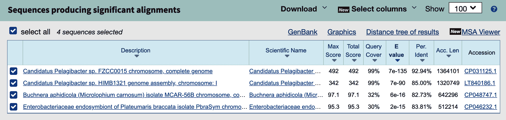
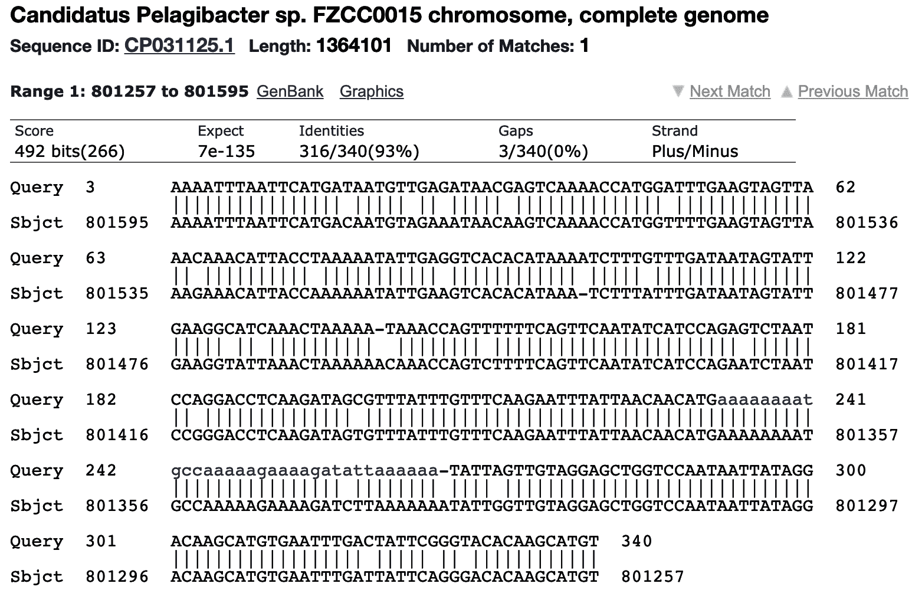

# 第十九章。Blastomatic：解析分隔文本文件

分隔文本文件是编码列数据的一种标准方式。你可能熟悉类似于 Microsoft Excel 或 Google Sheets 的电子表格，其中每个工作表可能包含具有跨顶部的列和向下运行的记录的数据集。您可以将这些数据导出为文本文件，其中数据的列是*分隔的*，或者由一个字符分隔。很多时候，分隔符是逗号，文件的扩展名为*.csv*。这种格式称为*CSV*，代表*逗号分隔的值*。当分隔符是制表符时，扩展名可能为*.tab*，*.txt*或*.tsv*，代表*制表符分隔的值*。文件的第一行通常包含列的名称。值得注意的是，这不适用于来自 BLAST（基本局部比对搜索工具）的表格输出，BLAST 是生物信息学中最流行的工具之一，用于比较序列。在本章中，我将向您展示如何解析此输出，并使用`csv`和`pandas`模块将 BLAST 结果与另一个分隔文本文件中的元数据合并。

在这个练习中，你将学到：

+   如何使用`csvkit`和`csvchk`查看分隔文本文件

+   如何使用`csv`和`pandas`模块解析分隔文本文件

# BLAST 简介

BLAST 程序是生物信息学中用于确定序列相似性的最普遍工具之一。在第六章中，我展示了两个序列之间的 Hamming 距离是相似性的一种度量，并将其与对齐概念进行了比较。而 Hamming 距离从开头比较两个序列，BLAST 的对齐则从两个序列开始重叠的地方开始，并允许插入、删除和不匹配以找到最长可能的相似区域。

我将向您展示国家生物技术中心（NCBI）的 BLAST 网络界面，但如果您在本地安装了 BLAST，也可以使用`blastn`。我将比较来自[全球海洋采样探险（GOS）](https://oreil.ly/POkOV)的 100 个序列与 NCBI 的序列数据库。GOS 是最早的宏基因组研究之一，始于 2000 年代初，当时克雷格·文特博士资助了一项为期两年的远征，收集和分析来自全球各地海洋样本。这是一个*宏基因组*项目，因为遗传物质直接来自环境样本。使用 BLAST 的目的是将未知的 GOS 序列与 NCBI 中已知的序列进行比较，以确定其可能的分类。

我使用了来自第十八章的 FASTX 采样器，随机选择了*tests/inputs/gos.fa*中的 100 个输入序列：

```py
$ ../15_seqmagique/seqmagique.py tests/inputs/gos.fa
name                   min_len    max_len    avg_len    num_seqs
tests/inputs/gos.fa        216       1212    1051.48         100
```

我使用[NCBI BLAST 工具](https://oreil.ly/gXErw)将这些序列与*nr/nt*（非冗余核苷酸）数据库进行比较，使用`blastn`程序比较核苷酸。结果页面允许我选择每个 100 个序列的详细结果。如 Figure 19-1 所示，第一个序列有四个匹配到已知序列的*hits*。第一个和最佳匹配在其长度的 99%上与[*Candidatus Pelagibacter*](https://oreil.ly/qywN2)的某部分基因组大约相似度达到 93%。考虑到 GOS 查询序列来自海洋，这看起来是一个合理的匹配。



###### Figure 19-1\. 第一个 GOS 序列在 nr/nt 中有四个可能的匹配

Figure 19-2 展示了查询序列与*Candidatus Pelagibacter*基因组区域的相似程度。请注意，对齐允许单核苷酸变异（SNVs）以及由序列之间的删除或插入引起的间隙。如果你想挑战自己，请尝试编写一个序列比对工具。你可以在 Figure 19-2 中看到一个例子。



###### Figure 19-2\. 最佳 BLAST 匹配的比对结果

尽管逐个探索每个匹配很有趣，但我想下载所有匹配的表格。有一个下载所有菜单，提供 11 种下载格式。我选择了“Hit table(csv)”格式，并在*tests/inputs*目录下拆分为*hits1.csv*和*hits2.csv*：

```py
$ wc -l tests/inputs/hits*.csv
     500 tests/inputs/hits1.csv
     255 tests/inputs/hits2.csv
     755 total
```

如果你用文本编辑器打开这些文件，你会看到它们包含逗号分隔的值。你也可以用类似 Excel 的电子表格程序打开文件，以列格式查看数据，并且你可能会注意到这些列没有名称。如果你在像群集节点这样的远程机器上，可能无法访问像 Excel 这样的图形程序来检查结果。此外，Excel 仅限于大约 100 万行和 16000 列。在真实的生物信息学中，很容易超过这两个值，因此我将向你展示一些命令行工具，可以用来查看分隔文本文件。

# 使用 csvkit 和 csvchk

首先，我想介绍一下`csvkit`模块，“用于转换和处理 CSV 的命令行工具套件”。存储库的*requirements.txt*文件列出了这个依赖项，所以它可能已经安装。如果没有安装，你可以使用这个命令来安装它：

```py
$ python3 -m pip install csvkit
```

这将安装几个有用的工具，我鼓励你阅读[文档](https://oreil.ly/QDAn2)以了解它们。我想强调`csvlook`，它“在控制台中将 CSV 文件渲染为 Markdown 兼容的固定宽度表格”。运行**`csvlook --help`**以查看用法，并注意有一个`-H|--no-header-row`选项，可以查看没有标题行的文件。以下命令将显示前三行匹配表格。根据你的屏幕大小，这可能无法阅读：

```py
$ csvlook -H --max-rows 3 tests/inputs/hits1.csv
```

[`csvchk`程序](https://oreil.ly/T2QSo)将一个宽记录转置为一个纵向以列名在左侧而不是在顶部的竖向记录。这也应该已经安装了其他模块依赖项，但如果需要，你可以使用`pip`来安装它：

```py
$ python3 -m pip install csvchk
```

如果你阅读了使用说明，你会发现这个工具还有一个`-N|--noheaders`选项。使用`csvchk`检查相同的 hits 文件中的第一条记录：

```py
$ csvchk -N tests/inputs/hits1.csv
// ****** Record 1 ****** //
Field1  : CAM_READ_0234442157
Field2  : CP031125.1
Field3  : 92.941
Field4  : 340
Field5  : 21
Field6  : 3
Field7  : 3
Field8  : 340
Field9  : 801595
Field10 : 801257
Field11 : 6.81e-135
Field12 : 492
```

你可以从 NCBI BLAST 下载的输出文件与 BLAST 程序的命令行版本匹配，比如用于比较核苷酸的`blastn`，用于比较蛋白质的`blastp`等等。`blastn`的帮助文档包含一个`-outfmt`选项，用于指定输出格式，使用介于 0 到 18 之间的数字。前面的输出文件格式是“制表符”选项 6：

```py
 *** Formatting options
 -outfmt <String>
   alignment view options:
     0 = Pairwise,
     1 = Query-anchored showing identities,
     2 = Query-anchored no identities,
     3 = Flat query-anchored showing identities,
     4 = Flat query-anchored no identities,
     5 = BLAST XML,
     6 = Tabular,
     7 = Tabular with comment lines,
     8 = Seqalign (Text ASN.1),
     9 = Seqalign (Binary ASN.1),
    10 = Comma-separated values,
    11 = BLAST archive (ASN.1),
    12 = Seqalign (JSON),
    13 = Multiple-file BLAST JSON,
    14 = Multiple-file BLAST XML2,
    15 = Single-file BLAST JSON,
    16 = Single-file BLAST XML2,
    17 = Sequence Alignment/Map (SAM),
    18 = Organism Report
```

当你发现制表输出文件不包含列标题时，你可能会感到奇怪。如果你仔细阅读所有的格式选项，你可能会注意到输出格式 7 是“带有注释行的制表符”，然后你可能会问自己：这个选项会包含列名吗？亲爱的读者，你会非常失望地发现它并不会。选项 7 与 NCBI BLAST 页面上的“Hits table(text)”选项相同。下载并打开该文件，你会发现它包含有关搜索的元数据，这些元数据以`#`字符开头的行中以非结构化文本形式存在。由于许多语言（包括 Python）使用这个作为注释字符来指示应该忽略的行，因此通常会说元数据被*注释掉*，许多分隔文本解析器将跳过这些行。

那么列名是什么呢？我必须解析`blastn`使用说明的数百行才能找到“选项 6、7、10 和 17 可以被另外配置”以包含任意的 53 个可选字段。如果未指定字段，则默认字段如下：

+   `qaccver`: 查询序列访问号/ID

+   `saccver`: 主体序列访问号/ID

+   `pident`: 相同匹配的百分比

+   `length`: 对齐长度

+   `mismatch`: 不匹配数

+   `gapopen`: 缺口开放数

+   `qstart`: 在查询中对齐的开始位置

+   `qend`: 在查询中对齐的结束位置

+   `sstart`: 在主体中对齐的开始位置

+   `send`: 在主体中对齐的结束位置

+   `evalue`: 期望值

+   `bitscore`: 比特分数

如果你再次查看`csvchk`的用法，你会发现有一个选项可以为记录命名`-f|--fieldnames`。以下是我如何查看一个 hits 文件的第一条记录并指定列名的方式：

```py
$ csvchk -f 'qseqid,sseqid,pident,length,mismatch,gapopen,qstart,qend,\
  sstart,send,evalue,bitscore' tests/inputs/hits1.csv
// ****** Record 1 ****** //
qseqid   : CAM_READ_0234442157
sseqid   : CP031125.1
pident   : 92.941
length   : 340
mismatch : 21
gapopen  : 3
qstart   : 3
qend     : 340
sstart   : 801595
send     : 801257
evalue   : 6.81e-135
bitscore : 492
```

这是一个更有用的输出。如果你喜欢这个命令，你可以在`bash`中创建一个名为`blstchk`的别名，就像这样：

```py
alias blstchk='csvchk -f "qseqid,sseqid,pident,length,mismatch,gapopen,\
    qstart,qend,sstart,send,evalue,bitscore"'
```

大多数 shell 允许您在每次启动新 shell 时读取的文件中定义别名，比如在 `bash` 中，您可以将这一行添加到您的 `$HOME` 目录中的一个文件中，比如 *.bash_profile*、*.bashrc* 或 *.profile*。其他 shell 也有类似的属性。别名是一个方便的方法，用于为常用命令创建全局快捷方式。如果您希望在特定项目或目录中创建命令快捷方式，请考虑在 *Makefile* 中使用目标。

下面是我如何使用 `blstchk` 命令的方式：

```py
$ blstchk tests/inputs/hits1.csv
// ****** Record 1 ****** //
qseqid   : CAM_READ_0234442157
sseqid   : CP031125.1
pident   : 92.941
length   : 340
mismatch : 21
gapopen  : 3
qstart   : 3
qend     : 340
sstart   : 801595
send     : 801257
evalue   : 6.81e-135
bitscore : 492
```

本章程序的目标是将 BLAST 命中链接到文件 *tests/inputs/meta.csv* 中找到的 GOS 序列的深度和位置。我将使用 `-g|--grep` 选项来 `csvchk` 查找前一个查询序列，*CAM_READ_0234442157*：

```py
$ csvchk -g CAM_READ_0234442157 tests/inputs/meta.csv
// ****** Record 1 ****** //
seq_id     : CAM_READ_0234442157
sample_acc : CAM_SMPL_GS112
date       : 8/8/05
depth      : 4573
salinity   : 32.5
temp       : 26.6
lat_lon    : -8.50525,80.375583
```

BLAST 结果可以与元数据结合，其中前者的 `qseqid` 等于后者的 `seq_id`。有一个命令行工具叫做 `join`，会精确执行此操作。输入必须都排序过，我会使用 `-t` 选项指示逗号是字段分隔符。默认情况下，`join` 假定每个文件的第一列是公共值，这在这里是正确的。输出是两个文件字段的逗号分隔的联合：

```py
$ cd tests/inputs/
$ join -t , <(sort hits1.csv) <(sort meta.csv) | csvchk -s "," -N - 
// ****** Record 1 ****** //
Field1  : CAM_READ_0234442157
Field2  : CP046232.1
Field3  : 83.810
Field4  : 105
Field5  : 12
Field6  : 5
Field7  : 239
Field8  : 340
Field9  : 212245
Field10 : 212143
Field11 : 2.24e-15
Field12 : 95.3
Field13 : CAM_SMPL_GS112
Field14 : 8/8/05
Field15 : 4573
Field16 : 32.5
Field17 : 26.6
Field18 : -8.50525,80.375583
```


使用 shell 重定向 `<` 读取排序后的两个输入文件的结果作为 `join` 的两个位置输入。`join` 的输出被导向到 `csvchk`。

虽然了解如何使用 `join` 是好的，但是此输出并不特别有用，因为它没有列标题。（而且，重点是学习如何在 Python 中执行此操作。）您如何向此信息添加标题？您会在 `bash` 脚本或 *Makefile* 目标中拼凑一些 shell 命令，还是会编写一个 Python 程序？让我们继续前进，好吗？接下来，我将向您展示程序应该如何工作以及它将创建的输出。

# 入门指南

此练习的所有代码和测试都可以在存储库的 *19_blastomatic* 目录中找到。切换到此目录并将第二个解决方案复制到程序 `blastomatic.py`：

```py
$ cd 19_blastomatic/
$ cp solution2_dict_writer.py blastomatic.py
```

该程序将接受 BLAST 命中和元数据文件，并将生成一个输出文件，显示序列 ID、百分比身份匹配、深度以及样品的纬度和经度。可选择性地，输出可以按百分比身份进行过滤。请求程序的帮助以查看选项：

```py
$ ./blastomatic.py -h
usage: blastomatic.py [-h] -b FILE -a FILE [-o FILE] [-d DELIM] [-p PCTID]

Annotate BLAST output

optional arguments:
  -h, --help            show this help message and exit
  -b FILE, --blasthits FILE
                        BLAST -outfmt 6 (default: None) 
  -a FILE, --annotations FILE
                        Annotations file (default: None) 
  -o FILE, --outfile FILE
                        Output file (default: out.csv) 
  -d DELIM, --delimiter DELIM
                        Output field delimiter (default: ) 
  -p PCTID, --pctid PCTID
                        Minimum percent identity (default: 0.0) 
```


来自 `-outfmt 6` 中的 BLAST 搜索的表格输出文件。


一个关于序列的元数据的注释文件。


输出文件的名称，默认为 *out.csv*。


输出文件的分隔符，默认根据输出文件扩展名猜测。


最小百分比标识，默认为 `0`。

如果我使用第一个命中文件运行程序，则会将 500 条序列写入输出文件 *out.csv*：

```py
$ ./blastomatic.py -b tests/inputs/hits1.csv -a tests/inputs/meta.csv
Exported 500 to "out.csv".
```

我可以使用 `csvlook` 和 `--max-rows` 选项查看表格的前两行：

```py
$ csvlook --max-rows 2 out.csv
| qseqid              | pident | depth | lat_lon            |
| ------------------- | ------ | ----- | ------------------ |
| CAM_READ_0234442157 | 92.941 | 4,573 | -8.50525,80.375583 |
| CAM_READ_0234442157 | 85.000 | 4,573 | -8.50525,80.375583 |
| ...                 |    ... |   ... | ...                |
```

或者我可以使用 `-l|--limit` 选项与 `csvchk` 进行相同操作：

```py
$ csvchk --limit 2 out.csv
// ****** Record 1 ****** //
qseqid  : CAM_READ_0234442157
pident  : 92.941
depth   : 4573
lat_lon : -8.50525,80.375583
// ****** Record 2 ****** //
qseqid  : CAM_READ_0234442157
pident  : 85.000
depth   : 4573
lat_lon : -8.50525,80.375583
```

如果我只想导出百分比标识大于或等于 90% 的命中记录，我可以使用 `-p|--pctid` 选项找出仅有 190 条记录：

```py
$ ./blastomatic.py -b tests/inputs/hits1.csv -a tests/inputs/meta.csv -p 90
Exported 190 to "out.csv".
```

我可以查看文件，确认它似乎已选择了正确的数据：

```py
$ csvlook --max-rows 4 out.csv
| qseqid                  | pident | depth | lat_lon              |
| ----------------------- | ------ | ----- | -------------------- |
| CAM_READ_0234442157     | 92.941 | 4,573 | -8.50525,80.375583   |
| JCVI_READ_1091145027519 | 97.368 |     2 | 44.137222,-63.644444 |
| JCVI_READ_1091145742680 | 98.714 |    64 | 44.690277,-63.637222 |
| JCVI_READ_1091145742680 | 91.869 |    64 | 44.690277,-63.637222 |
| ...                     |    ... |   ... | ...                  |
```

`blastomatic.py` 程序默认将输出写入逗号分隔的文件 *out.csv*。您可以使用 `-d|--delimiter` 选项指定不同的分隔符，并使用 `-o|--outfile` 选项指定不同的文件。请注意，如果未指定分隔符，将从输出文件名的扩展名猜测分隔符。扩展名 *.csv* 将被视为逗号，否则将使用制表符。

运行 **`make test`** 来查看完整的测试套件。当您认为理解程序应如何工作时，请重新开始：

```py
$ new.py -fp 'Annotate BLAST output' blastomatic.py
Done, see new script "blastomatic.py".
```

## 定义参数

这是我用来定义参数的类：

```py
class Args(NamedTuple):
    """ Command-line arguments """
    hits: TextIO 
    annotations: TextIO 
    outfile: TextIO 
    delimiter: str 
    pctid: float 
```


BLAST 命中文件将是一个打开的文件句柄。


元数据文件将是一个打开的文件句柄。


输出文件将是一个打开的文件句柄。


输出文件分隔符将是一个字符串。


百分比标识将是一个浮点数。

下面是我解析和验证参数的方式：

```py
def get_args():
    """ Get command-line arguments """

    parser = argparse.ArgumentParser(
        description='Annotate BLAST output',
        formatter_class=argparse.ArgumentDefaultsHelpFormatter)

    parser.add_argument('-b',
                        '--blasthits',
                        metavar='FILE',
                        type=argparse.FileType('rt'), 
                        help='BLAST -outfmt 6',
                        required=True)

    parser.add_argument('-a',
                        '--annotations',
                        help='Annotations file',
                        metavar='FILE',
                        type=argparse.FileType('rt'), 
                        required=True)

    parser.add_argument('-o',
                        '--outfile',
                        help='Output file',
                        metavar='FILE',
                        type=argparse.FileType('wt'), 
                        default='out.csv')

    parser.add_argument('-d',
                        '--delimiter',
                        help='Output field delimiter', 
                        metavar='DELIM',
                        type=str,
                        default='')

    parser.add_argument('-p',
                        '--pctid',
                        help='Minimum percent identity', 
                        metavar='PCTID',
                        type=float,
                        default=0.)

    args = parser.parse_args()

    return Args(hits=args.blasthits, 
                annotations=args.annotations,
                outfile=args.outfile,
                delimiter=args.delimiter or guess_delimiter(args.outfile.name), 
                pctid=args.pctid)
```


BLAST 文件必须是可读的文本文件。


元数据文件必须是可读的文本文件。


输出文件必须是可写的文本文件。


输出字段分隔符是一个字符串，默认为我从输出文件名中猜测的空字符串。


最小百分比标识应为浮点数，默认为 `0`。


创建 `Args` 对象。请注意，`Args` 的字段不需要与参数名匹配。


我编写了一个函数，从输出文件名中猜测分隔符。

这个程序有两个必需的文件参数：BLAST hits 和注释。我不想将它们作为位置参数，因为那样我的用户必须记住顺序。最好将它们作为命名选项，但这样它们就变成了可选的，而我不想这样。为了克服这个问题，我对两个文件参数都使用了`required=True`，以确保用户提供它们。

你可能想从`guess_delimiter()`函数开始。这是我编写的测试：

```py
def test_guess_delimiter() -> None:
    """ Test guess_delimiter """

    assert guess_delimiter('/foo/bar.csv') == ','
    assert guess_delimiter('/foo/bar.txt') == '\t'
    assert guess_delimiter('/foo/bar.tsv') == '\t'
    assert guess_delimiter('/foo/bar.tab') == '\t'
    assert guess_delimiter('') == '\t'
```

使用一些最小的代码来启动你的`main()`：

```py
def main() -> None:
    args = get_args()
    print('hits', args.hits.name)
    print('meta', args.annotations.name)
```

确保这个工作：

```py
$ ./blastomatic.py -a tests/inputs/meta.csv -b tests/inputs/hits1.csv
hits tests/inputs/hits1.csv
meta tests/inputs/meta.csv
```

到目前为止，当你运行**`make test`**时，你应该能够通过几个测试。接下来，我将向你展示如何解析分隔文本文件。

## 使用 csv 模块解析分隔文本文件

Python 有一个`csv`模块，可以轻松处理分隔文本文件，但我想首先向你展示它确切的操作，这样你就能够欣赏它节省的努力。首先，我将打开元数据文件并从第一行读取头部。我可以在文件句柄上调用`fh.readline()`方法来读取一行文本。这将仍然包含换行符，因此我调用`str.rstrip()`来移除字符串右侧的任何空白。最后，我调用`str.split(',')`来使用分隔逗号拆分行：

```py
>>> fh = open('tests/inputs/meta.csv')
>>> headers = fh.readline().rstrip().split(',')
>>> headers
['seq_id', 'sample_acc', 'date', 'depth', 'salinity', 'temp', 'lat_lon']
```

目前为止，一切都好。我将尝试解析下一行数据：

```py
>>> line = fh.readline()
>>> data = line.split(',')
>>> data
['JCVI_READ_1092301105055', 'JCVI_SMPL_1103283000037', '2/11/04', '1.6', '',
 '25.4', '"-0.5938889', '-91.06944"']
```

你能看到这里的问题吗？我已经将包含逗号的`lat_lon`字段分割成了两个值，给我七个字段的八个值：

```py
>>> len(headers), len(data)
(7, 8)
```

使用`str.split()`将无法正常工作，因为它未考虑分隔符是字段值的一部分的情况。也就是说，当字段分隔符被引号括起来时，它不是字段分隔符。注意`lat_lon`值被正确地引用：

```py
>>> line[50:]
'11/04,1.6,,25.4,"-0.5938889,-91.06944"\n\'
```

一种正确解析这一行的方法是使用`pyparsing`模块：

```py
>>> import pyparsing as pp
>>> data = pp.commaSeparatedList.parseString(line).asList()
>>> data
['JCVI_READ_1092301105055', 'JCVI_SMPL_1103283000037', '2/11/04', '1.6',
 '', '25.4', '"-0.5938889,-91.06944"']
```

差不多了，但是`lat_lon`字段周围仍然有引号。我可以使用正则表达式将它们移除：

```py
>>> import re
>>> data = list(map(lambda s: re.sub(r'^"|"$', '', s), data)) 
>>> data
['JCVI_READ_1092301105055', 'JCVI_SMPL_1103283000037', '2/11/04', '1.6', '',
 '25.4', '-0.5938889,-91.06944']
```


这个正则表达式将锚定在字符串开头或结尾的引号替换为空字符串。

现在，我已经得到了`headers`列表和给定记录的`data`列表，我可以通过将它们压缩在一起创建一个字典。我在第六章和第十三章中使用了`zip()`函数将两个列表连接成元组的列表。因为`zip()`是一个惰性函数，我必须在 REPL 中使用`list()`函数来强制求值：

```py
>>> from pprint import pprint
>>> pprint(list(zip(headers, data)))
[('seq_id', 'JCVI_READ_1092301105055'),
 ('sample_acc', 'JCVI_SMPL_1103283000037'),
 ('date', '2/11/04'),
 ('depth', '1.6'),
 ('salinity', ''),
 ('temp', '25.4'),
 ('lat_lon', '-0.5938889,-91.06944')]
```

我可以将`list()`函数改为`dict()`来将其转换为字典：

```py
>>> pprint(dict(zip(headers, data)))
{'date': '2/11/04',
 'depth': '1.6',
 'lat_lon': '-0.5938889,-91.06944',
 'salinity': '',
 'sample_acc': 'JCVI_SMPL_1103283000037',
 'seq_id': 'JCVI_READ_1092301105055',
 'temp': '25.4'}
```

我可以迭代文件的每一行，并通过压缩头部和数据创建记录的字典。这样做完全可行，但是所有这些工作在`csv`模块中已经为我完成。以下是如何使用`csv.DictReader()`将同一文件解析为字典列表。默认情况下，它将使用逗号作为分隔符：

```py
>>> import csv
>>> reader = csv.DictReader(open('tests/inputs/meta.csv'))
>>> for rec in reader:
...     pprint(rec)
...     break
...
{'date': '2/11/04',
 'depth': '1.6',
 'lat_lon': '-0.5938889,-91.06944',
 'salinity': '',
 'sample_acc': 'JCVI_SMPL_1103283000037',
 'seq_id': 'JCVI_READ_1092301105055',
 'temp': '25.4'}
```

这样就容易多了。以下是我如何使用它来创建以序列 ID 为键的所有注释的字典。为此，请确保添加 `from pprint import pprint`：

```py
def main():
    args = get_args()
    annots_reader = csv.DictReader(args.annotations, delimiter=',') 
    annots = {row['seq_id']: row for row in annots_reader} 
    pprint(annots)
```


使用 `csv.DictReader()` 解析注释文件句柄中的 CSV 数据。


使用字典推导式创建以每个记录中的 `seq_id` 字段为键的字典。

使用输入文件运行此程序，并查看是否获得一个看起来合理的数据结构。在这里，我将 `STDOUT` 重定向到名为 *out* 的文件，并使用 `head` 进行检查：

```py
$ ./blastomatic.py -a tests/inputs/meta.csv -b tests/inputs/hits1.csv > out
$ head out
{'CAM_READ_0231669837': {'date': '8/4/05',
                         'depth': '7',
                         'lat_lon': '-12.092617,96.881733',
                         'salinity': '32.4',
                         'sample_acc': 'CAM_SMPL_GS108',
                         'seq_id': 'CAM_READ_0231669837',
                         'temp': '25.8'},
 'CAM_READ_0231670003': {'date': '8/4/05',
                         'depth': '7',
                         'lat_lon': '-12.092617,96.881733',
```

在继续阅读 BLAST 命中结果之前，我想打开输出文件句柄。输出文件的格式应该是另一个分隔文本文件。默认情况下，它将是一个 CSV 文件，但用户可以选择其他格式，如制表符分隔。文件的第一行应该是标题行，因此我将立即写入这些内容：

```py
def main():
    args = get_args()
    annots_reader = csv.DictReader(args.annotations, delimiter=',')
    annots = {row['seq_id']: row for row in annots_reader}

    headers = ['qseqid', 'pident', 'depth', 'lat_lon'] 
    args.outfile.write(args.delimiter.join(headers) + '\n') 
```


这些是输出文件的列名。


`args.outfile` 是用于写入文本的文件句柄。在 `args.delimiter` 字符串上连接标题并写入。请务必添加换行符。

或者，您可以使用带有 `file` 参数的 `print()`：

```py
print(args.delimiter.join(headers), file=args.outfile)
```

接下来，我将遍历 BLAST 命中结果。由于文件的第一行缺少列名，因此需要为 `csv.DictReader()` 提供 `fieldnames`：

```py
def main():
    args = get_args()
    annots_reader = csv.DictReader(args.annotations, delimiter=',')
    annots = {row['seq_id']: row for row in annots_reader}

    headers = ['qseqid', 'pident', 'depth', 'lat_lon']
    args.outfile.write(args.delimiter.join(headers) + '\n')

    hits = csv.DictReader(args.hits, 
                          delimiter=',',
                          fieldnames=[
                              'qseqid', 'sseqid', 'pident', 'length',
                              'mismatch', 'gapopen', 'qstart', 'qend',
                              'sstart', 'send', 'evalue', 'bitscore'
                          ])

    for hit in hits: 
        if float(hit.get('pident', -1)) < args.pctid: 
            continue
        print(hit.get('qseqid')) 
```


解析 BLAST CSV 文件。


迭代处理每个 BLAST 命中结果。


跳过百分比 ID 小于最小值的命中结果。使用 `float()` 函数将文本转换为浮点值。


打印查询序列 ID。

使用最小百分比 ID 为 90 运行此版本的程序，并验证您是否从第一个文件中获得了 190 个命中结果：

```py
$ ./blastomatic.py -a tests/inputs/meta.csv -b tests/inputs/hits1.csv -p 90 \
    | wc -l
     190
```

如果在元数据文件中以 BLAST 命中的 `qseqid` 值作为 `seq_id` 找到，则将序列 ID、来自 BLAST 命中的百分比 ID 以及来自元数据文件的深度和纬度/经度值打印到输出文件中。这应该足以让您开始运行此程序。请务必运行测试以验证您的程序是否正确。

## 使用 pandas 模块解析分隔文本文件

pandas 模块提供了另一种有效的方法来读取分隔文件。 这个模块与 NumPy 一起是数据科学中使用的基本 Python 库之一。 如果您熟悉 R 语言，我将使用`pd.read_csv()`函数，它与 R 语言中的`read_csv()`函数非常相似。 注意，该函数可以读取由任何分隔符指定的文本，但默认为逗号。

通常分隔符是单个字符，但也可以使用字符串拆分文本。 如果这样做，您可能会遇到警告“ParserWarning: Falling back to the *python* engine because the *c* engine does not support regex separators (separators > 1 char and different from *\s+* are interpreted as regex); you can avoid this warning by specifying engine=*python*.”

通常使用别名`pd`导入 pandas 是很常见的：

```py
>>> import pandas as pd
>>> meta = pd.read_csv('tests/inputs/meta.csv')
```

pandas 的许多功能都基于 R 的思想。 pandas 数据框是一个二维对象，它将元数据文件中的所有列和行都保存在一个单独的对象中，就像 R 中的数据框一样。 也就是说，前面示例中的`reader`是用于顺序检索每个记录的接口，但 pandas 数据框是文件中所有数据的完整表示。 因此，数据框的大小将受到计算机内存量的限制。 就像我警告过使用`fh.read()`将整个文件读入内存一样，您必须谨慎选择使用 pandas 可以实际读取的文件。 如果必须处理数百万行大小为千兆字节的分隔文本文件，我建议使用`csv.DictReader()`逐条处理记录。

如果在 REPL 中评估`meta`对象，则会显示表格的样本。 您可以看到 pandas 使用文件的第一行作为列标题。 如省略号所示，由于屏幕宽度受限，一些列已被省略：

```py
>>> meta
                     seq_id  ...                lat_lon
0   JCVI_READ_1092301105055  ...   -0.5938889,-91.06944
1   JCVI_READ_1092351051817  ...   -0.5938889,-91.06944
2   JCVI_READ_1092301096881  ...   -0.5938889,-91.06944
3   JCVI_READ_1093017101914  ...   -0.5938889,-91.06944
4   JCVI_READ_1092342065252  ...     9.164444,-79.83611
..                      ...  ...                    ...
95  JCVI_READ_1091145742670  ...   44.690277,-63.637222
96  JCVI_READ_1091145742680  ...   44.690277,-63.637222
97  JCVI_READ_1091150268218  ...   44.690277,-63.637222
98  JCVI_READ_1095964929867  ...  -1.9738889,-95.014725
99  JCVI_READ_1095994150021  ...  -1.9738889,-95.014725

[100 rows x 7 columns]
```

要查找数据框中行数和列数，请检查`meta.shape`属性。 注意，这不需要加括号，因为它不是方法调用。 此数据框有 100 行和 7 列：

```py
>>> meta.shape
(100, 7)
```

我可以检查`meta.columns`属性获取列名：

```py
>>> meta.columns
Index(['seq_id', 'sample_acc', 'date', 'depth', 'salinity', 'temp', 'lat_lon'],
dtype='object')
```

数据框的一个优点是，您可以使用类似于访问字典中字段的语法查询列中的所有值。 在这里，我将选择盐度值，并注意 pandas 已将这些值从文本转换为浮点值，缺失值用`NaN`（不是数字）表示：

```py
>>> meta['salinity']
0      NaN
1      NaN
2      NaN
3      NaN
4      0.1
      ...
95    30.2
96    30.2
97    30.2
98     NaN
99     NaN
Name: salinity, Length: 100, dtype: float64
```

我可以使用几乎与 R 中相同的语法找到盐度大于 50 的行。 这将根据断言*盐度大于 50*返回一个布尔值数组：

```py
>>> meta['salinity'] > 50
0     False
1     False
2     False
3     False
4     False
      ...
95    False
96    False
97    False
98    False
99    False
Name: salinity, Length: 100, dtype: bool
```

我可以使用这些布尔值作为掩码，仅选择条件为`True`的行：

```py
>>> meta[meta['salinity'] > 50]
                     seq_id  ...               lat_lon
23  JCVI_READ_1092351234516  ...  -1.2283334,-90.42917
24  JCVI_READ_1092402566200  ...  -1.2283334,-90.42917
25  JCVI_READ_1092402515846  ...  -1.2283334,-90.42917

[3 rows x 7 columns]
```

结果是一个新的数据框，所以我可以查看找到的盐度值：

```py
>>> meta[meta['salinity'] > 50]['salinity']
23    63.4
24    63.4
25    63.4
Name: salinity, dtype: float64
```

如果你使用 pandas 读取 BLAST hits 文件，需要像之前的示例一样提供列名：

```py
>>> cols = ['qseqid', 'sseqid', 'pident', 'length', 'mismatch', 'gapopen',
'qstart', 'qend', 'sstart', 'send', 'evalue', 'bitscore']
>>> hits = pd.read_csv('tests/inputs/hits1.csv', names=cols)
>>> hits
                      qseqid      sseqid  ...         evalue  bitscore
0        CAM_READ_0234442157  CP031125.1  ...  6.810000e-135     492.0
1        CAM_READ_0234442157  LT840186.1  ...   7.260000e-90     342.0
2        CAM_READ_0234442157  CP048747.1  ...   6.240000e-16      97.1
3        CAM_READ_0234442157  CP046232.1  ...   2.240000e-15      95.3
4    JCVI_READ_1095946186912  CP038852.1  ...   0.000000e+00    1158.0
..                       ...         ...  ...            ...       ...
495  JCVI_READ_1095403503430  EU805356.1  ...   0.000000e+00    1834.0
496  JCVI_READ_1095403503430  EU804987.1  ...   0.000000e+00    1834.0
497  JCVI_READ_1095403503430  EU804799.1  ...   0.000000e+00    1834.0
498  JCVI_READ_1095403503430  EU804695.1  ...   0.000000e+00    1834.0
499  JCVI_READ_1095403503430  EU804645.1  ...   0.000000e+00    1834.0

[500 rows x 12 columns]
```

程序的一个要素是仅选择那些百分比 ID 大于或等于某个最小值的命中结果。pandas 会自动将`pident`列转换为浮点数值。在这里，我将选择那些百分比 ID 大于或等于`90`的命中结果：

```py
>>> wanted = hits[hits['pident'] >= 90]
>>> wanted
                      qseqid      sseqid  ...         evalue  bitscore
0        CAM_READ_0234442157  CP031125.1  ...  6.810000e-135     492.0
12   JCVI_READ_1091145027519  CP058306.1  ...   6.240000e-06      65.8
13   JCVI_READ_1091145742680  CP000084.1  ...   0.000000e+00    1925.0
14   JCVI_READ_1091145742680  CP038852.1  ...   0.000000e+00    1487.0
111  JCVI_READ_1091145742680  CP022043.2  ...   1.320000e-07      71.3
..                       ...         ...  ...            ...       ...
495  JCVI_READ_1095403503430  EU805356.1  ...   0.000000e+00    1834.0
496  JCVI_READ_1095403503430  EU804987.1  ...   0.000000e+00    1834.0
497  JCVI_READ_1095403503430  EU804799.1  ...   0.000000e+00    1834.0
498  JCVI_READ_1095403503430  EU804695.1  ...   0.000000e+00    1834.0
499  JCVI_READ_1095403503430  EU804645.1  ...   0.000000e+00    1834.0

[190 rows x 12 columns]
```

要遍历数据框中的行，使用`wanted.iterrows()`方法。请注意，这与`enumerate()`函数类似，返回的是行索引和行值的元组：

```py
>>> for i, hit in wanted.iterrows():
...     print(hit)
...     break
...
qseqid      CAM_READ_0234442157
sseqid               CP031125.1
pident                   92.941
length                      340
mismatch                     21
gapopen                       3
qstart                        3
qend                        340
sstart                   801595
send                     801257
evalue                    0.000
bitscore                492.000
Name: 0, dtype: object
```

要从数据框中打印出单个记录的字段，你可以像使用字典一样使用方括号访问字段或者使用熟悉的`dict.get()`方法。与字典类似，前一种方法如果拼写错误将会抛出异常，而后一种方法会静默地返回`None`：

```py
>>> for i, hit in wanted.iterrows():
...     print(hit['qseqid'], hit.get('pident'), hit.get('nope'))
...     break
...
CAM_READ_0234442157 92.941 None
```

如同前面的示例一样，我建议你先阅读元数据，然后迭代 BLAST 命中。你可以通过在`meta`数据框中搜索`seq_id`字段来查找元数据。元数据文件中的序列 ID 是唯一的，所以你应该最多只找到一个：

```py
>>> seqs = meta[meta['seq_id'] == 'CAM_READ_0234442157']
>>> seqs
                 seq_id      sample_acc  ...  temp             lat_lon
91  CAM_READ_0234442157  CAM_SMPL_GS112  ...  26.6  -8.50525,80.375583

[1 rows x 7 columns]
```

你可以遍历匹配项，或者使用`iloc`访问器获取第一个（零号）记录：

```py
>>> seqs.iloc[0]
seq_id        CAM_READ_0234442157
sample_acc         CAM_SMPL_GS112
date                       8/8/05
depth                      4573.0
salinity                     32.5
temp                         26.6
lat_lon        -8.50525,80.375583
Name: 91, dtype: object
```

如果未找到任何匹配项，你将得到一个空的数据框：

```py
>>> seqs = meta[meta['seq_id'] == 'X']
>>> seqs
Empty DataFrame
Columns: [seq_id, sample_acc, date, depth, salinity, temp, lat_lon]
Index: []
```

你可以检查`seqs.empty`属性来查看它是否为空：

```py
>>> seqs.empty
True
```

或者从`seqs.shape`中检查行数值：

```py
>>> seqs.shape[0]
0
```

数据框也可以使用`to_csv()`方法将其值写入文件。与`read_csv()`类似，你可以指定任何`sep`字段分隔符，默认为逗号。注意，默认情况下，pandas 会将行索引包括在输出文件的第一个字段中。我通常使用`index=False`来省略这个。例如，我将保存盐度大于 50 的元数据记录到*salty.csv*文件中只需一行代码：

```py
>>> meta[meta['salinity'] > 50].to_csv('salty.csv', index=False)
```

我可以使用`csvchk`或`csvlook`验证数据是否已写入：

```py
$ csvchk salty.csv
// ****** Record 1 ****** //
seq_id     : JCVI_READ_1092351234516
sample_acc : JCVI_SMPL_1103283000038
date       : 2/19/04
depth      : 0.2
salinity   : 63.4
temp       : 37.6
lat_lon    : -1.2283334,-90.42917
```

对 pandas 的全面审查远远超出了本书的范围，但这应该足以让你找到一个解决方案。如果你想了解更多，我推荐阅读[*Python 数据分析*](https://oreil.ly/kAtUU)（Wes McKinney 著，O’Reilly，2017）和[*Python 数据科学手册*](https://oreil.ly/1V94U)（Jake VanderPlas 著，O’Reilly，2016）。

# 解决方案

我有四种解决方案，两种使用`csv`模块，另外两种使用 pandas。所有解决方案均使用我编写的`guess_delimiter()`函数，代码如下：

```py
def guess_delimiter(filename: str) -> str:
    """ Guess the field separator from the file extension """

    ext = os.path.splitext(filename)[1] 
    return ',' if ext == '.csv' else '\t' 
```


从`os.path.splitext()`中选择文件扩展名。


如果文件扩展名是*.csv*，则返回逗号，否则返回制表符。

## 解决方案 1：使用字典手动连接表格

此版本紧随本章章节早期的所有建议：

```py
def main():
    args = get_args()
    annots_reader = csv.DictReader(args.annotations, delimiter=',') 
    annots = {row['seq_id']: row for row in annots_reader} 

    headers = ['qseqid', 'pident', 'depth', 'lat_lon'] 
    args.outfile.write(args.delimiter.join(headers) + '\n') 

    hits = csv.DictReader(args.hits, 
                          delimiter=',',
                          fieldnames=[
                              'qseqid', 'sseqid', 'pident', 'length',
                              'mismatch', 'gapopen', 'qstart', 'qend',
                              'sstart', 'send', 'evalue', 'bitscore'
                          ])

    num_written = 0 
    for hit in hits: 
        if float(hit.get('pident', -1)) < args.pctid: 
            continue

        if seq_id := hit.get('qseqid'): 
            if seq := annots.get(seq_id): 
                num_written += 1 
                args.outfile.write(
                    args.delimiter.join( 
                        map(lambda s: f'"{s}"', [
                            seq_id,
                            hit.get('pident'),
                            seq.get('depth'),
                            seq.get('lat_lon')
                        ])) + '\n')

    args.outfile.close() 
    print(f'Exported {num_written:,} to "{args.outfile.name}".') 
```


创建注释文件的解析器。


将所有注释读入以序列 ID 为键的字典中。


定义输出文件的标头。


将标头写入输出文件。


创建 BLAST 命中的解析器。


初始化记录写入计数器。


遍历 BLAST 命中。


跳过百分比 ID 小于最小值的记录。


尝试获取 BLAST 查询序列 ID。


尝试在注释中找到此序列 ID。


如果找到，则增加计数器并写入输出值。


引用所有字段以确保分隔符受保护。


关闭输出文件。


向用户打印最终状态。在 `num_written` 格式化的逗号将为数字添加千位分隔符。

## 解决方案 2：使用 `csv.DictWriter()` 编写输出文件

下一个解决方案与第一个的不同之处在于我使用 `csv.DictWriter()` 编写输出文件。我通常更喜欢使用这种方法，因为它将处理，例如，包含字段分隔符的字段正确引用：

```py
def main():
    args = get_args()
    annots_reader = csv.DictReader(args.annotations, delimiter=',')
    annots = {row['seq_id']: row for row in annots_reader}

    writer = csv.DictWriter( 
        args.outfile,
        fieldnames=['qseqid', 'pident', 'depth', 'lat_lon'],
        delimiter=args.delimiter)
    writer.writeheader() 

    hits = csv.DictReader(args.hits,
                          delimiter=',',
                          fieldnames=[
                              'qseqid', 'sseqid', 'pident', 'length',
                              'mismatch', 'gapopen', 'qstart', 'qend',
                              'sstart', 'send', 'evalue', 'bitscore'
                          ])

    num_written = 0
    for hit in hits:
        if float(hit.get('pident', -1)) < args.pctid:
            continue

        if seq_id := hit.get('qseqid'):
            if seq := annots.get(seq_id):
                num_written += 1
                writer.writerow({ 
                    'qseqid': seq_id,
                    'pident': hit.get('pident'),
                    'depth': seq.get('depth'),
                    'lat_lon': seq.get('lat_lon'),
                })

    print(f'Exported {num_written:,} to "{args.outfile.name}".') 
```


创建一个写入器对象来创建分隔文本输出文件。


将标头行写入输出文件。


写入一行数据，传入一个与编写器定义的 `fieldnames` 键相同的字典。


使用格式化指令`{:,}`将使数字以千位分隔符打印。

## 解决方案 3：使用 Pandas 读写文件

在某些方面，Pandas 版本更为简单，而在其他方面则更为复杂。我选择将所有输出记录存储在 Python 列表中，并从中实例化新的数据帧以编写输出文件：

```py
def main():
    args = get_args()
    annots = pd.read_csv(args.annotations, sep=',') 
    hits = pd.read_csv(args.hits, 
                       sep=',',
                       names=[
                           'qseqid', 'sseqid', 'pident', 'length', 'mismatch',
                           'gapopen', 'qstart', 'qend', 'sstart', 'send',
                           'evalue', 'bitscore'
                       ])

    data = [] 
    for _, hit in hits[hits['pident'] >= args.pctid].iterrows(): 
        meta = annots[annots['seq_id'] == hit['qseqid']] 
        if not meta.empty: 
            for _, seq in meta.iterrows(): 
                data.append({ 
                    'qseqid': hit['qseqid'],
                    'pident': hit['pident'],
                    'depth': seq['depth'],
                    'lat_lon': seq['lat_lon'],
                })

    df = pd.DataFrame.from_records(data=data) 
    df.to_csv(args.outfile, index=False, sep=args.delimiter) 

    print(f'Exported {len(data):,} to "{args.outfile.name}".') 
```


将元数据文件读入数据框。


将 BLAST 命中读入数据框。


初始化输出数据的列表。


选择所有百分比 ID 大于或等于最小百分比的 BLAST 命中。


选择给定查询序列 ID 的元数据。


验证元数据不为空。


迭代元数据记录（尽管通常只有一个）。


使用输出数据存储一个新的字典。


从输出数据创建一个新的数据框。


将数据框写入输出文件，省略数据框索引值。


将状态打印到控制台。

## 解决方案 4：使用 pandas 连接文件

在最后的解决方案中，我使用 pandas 将元数据和 BLAST 数据框进行连接，就像我在本章早些时候演示的 `join` 程序一样：

```py
def main():
    args = get_args()
    annots = pd.read_csv(args.annotations, sep=',', index_col='seq_id') 
    hits = pd.read_csv(args.hits,
                       sep=',',
                       index_col='qseqid', 
                       names=[
                           'qseqid', 'sseqid', 'pident', 'length', 'mismatch',
                           'gapopen', 'qstart', 'qend', 'sstart', 'send',
                           'evalue', 'bitscore'
                       ])

    joined = hits[hits['pident'] >= args.pctid].join(annots, how='inner') 

    joined.to_csv(args.outfile, 
                  index=True,
                  index_label='qseqid',
                  columns=['pident', 'depth', 'lat_lon'],
                  sep=args.delimiter)

    print(f'Exported {joined.shape[0]:,} to "{args.outfile.name}".')
```


读取注释文件并将索引列设置为 `seq_id`。


读取 BLAST 命中并将索引列设置为 `qseqid`。


选择具有所需百分比 ID 的 BLAST 命中，并使用索引列对注释执行内连接。


使用指定的分隔符将 `joined` 数据框的所需列写入输出文件。包括索引并命名为 `qseqid`。

连接操作非常复杂，让我花点时间解释一下。首先，每个数据框必须具有唯一的索引，默认情况下是行索引：

```py
>>> import pandas as pd
>>> annots = pd.read_csv('tests/inputs/meta.csv')
>>> annots.index
RangeIndex(start=0, stop=100, step=1)
```

相反，我希望 pandas 使用 `seq_id` 列作为索引，我使用 `index_col` 参数指定：

```py
>>> annots = pd.read_csv('tests/inputs/meta.csv', index_col='seq_id')
```

我也可以指示零字段：

```py
>>> annots = pd.read_csv('tests/inputs/meta.csv', index_col=0)
```

现在索引设置为 `seq_id`：

```py
>>> annots.index[:10]
Index(['JCVI_READ_1092301105055', 'JCVI_READ_1092351051817',
       'JCVI_READ_1092301096881', 'JCVI_READ_1093017101914',
       'JCVI_READ_1092342065252', 'JCVI_READ_1092256406745',
       'JCVI_READ_1092258001174', 'JCVI_READ_1092959499253',
       'JCVI_READ_1092959656555', 'JCVI_READ_1092959499263'],
      dtype='object', name='seq_id')
```

类似地，我希望 BLAST 命中可以根据查询序列 ID 进行索引：

```py
>>> cols = ['qseqid', 'sseqid', 'pident', 'length', 'mismatch', 'gapopen',
 'qstart', 'qend', 'sstart', 'send', 'evalue', 'bitscore']
>>> hits = pd.read_csv('tests/inputs/hits1.csv', names=cols, index_col='qseqid')
>>> hits.index[:10]
Index(['CAM_READ_0234442157', 'CAM_READ_0234442157', 'CAM_READ_0234442157',
       'CAM_READ_0234442157', 'JCVI_READ_1095946186912',
       'JCVI_READ_1095946186912', 'JCVI_READ_1095946186912',
       'JCVI_READ_1095946186912', 'JCVI_READ_1095946186912',
       'JCVI_READ_1091145027519'],
      dtype='object', name='qseqid')
```

我可以选择具有 `pident` 大于或等于最小值的 BLAST 命中。例如，我找到了值为 90 的 190 行：

```py
>>> wanted = hits[hits['pident'] >= 90]
>>> wanted.shape
(190, 11)
```

结果数据框仍然以`qseqid`列为索引，因此我可以将其与具有相同索引值（序列 ID）的注释进行连接。默认情况下，pandas 将执行*左* *连接*，选择第一个或*左*数据框中的所有行，并对没有在右数据框中找到配对的行填充空值。*右* *连接*与*左*连接相反，选择*右*数据框中的所有记录，而不考虑左数据框中是否有匹配。由于我只想要具有注释的命中，所以我使用*内* *连接*。图 19-3 演示了使用维恩图进行连接的情况。


###### 图 19-3\. 左连接选择左表中的所有记录，右连接选择右表中的所有记录，内连接仅选择两者都有的记录

连接操作创建一个新的数据框，其中包含两个数据框的所有列，就像我在 “使用 csvkit 和 csvchk” 中展示的`join`工具一样：

```py
>>> joined = wanted.join(annots, how='inner')
>>> joined
                             sseqid   pident  ...  temp              lat_lon
CAM_READ_0234442157      CP031125.1   92.941  ...  26.6   -8.50525,80.375583
JCVI_READ_1091120852400  CP012541.1  100.000  ...  25.0     24.488333,-83.07
JCVI_READ_1091141680691  MN693562.1   90.852  ...  27.7  10.716389,-80.25445
JCVI_READ_1091141680691  MN693445.1   90.645  ...  27.7  10.716389,-80.25445
JCVI_READ_1091141680691  MN693445.1   91.935  ...  27.7  10.716389,-80.25445
...                             ...      ...  ...   ...                  ...
JCVI_READ_1095913058159  CP000437.1   94.737  ...   9.4  41.485832,-71.35111
JCVI_READ_1095913058159  AM286280.1   92.683  ...   9.4  41.485832,-71.35111
JCVI_READ_1095913058159  DQ682149.1   94.737  ...   9.4  41.485832,-71.35111
JCVI_READ_1095913058159  AM233362.1   94.737  ...   9.4  41.485832,-71.35111
JCVI_READ_1095913058159  AY871946.1   94.737  ...   9.4  41.485832,-71.35111

[190 rows x 17 columns]
```

另一种写法是使用`pd.merge()`函数，默认情况下会执行内连接。我必须指示左右数据框中用于连接的列，这种情况下是索引：

```py
>>> joined = pd.merge(wanted, annots, left_index=True, right_index=True)
```

我可以使用`joined.to_csv()`方法将数据框写入输出文件。请注意，共同的序列 ID 是索引，没有列名。我希望索引包含在输出文件中，因此我使用`index=True`和`index_name='qseqid'`以使文件与预期输出匹配：

```py
>>> out_fh = open('out.csv', 'wt')
>>> joined.to_csv(out_fh, index=True, index_label='qseqid',
columns=['pident', 'depth', 'lat_lon'], sep=',')
```

# 更进一步

添加按其他字段（如温度、盐度或 BLAST e 值）过滤的选项。

默认包含输出文件中来自两个文件的所有列，并添加一个选项来选择列的子集。

# 复习

本章的重点：

+   Shell 别名可用于为常见命令创建快捷方式。

+   分隔文本文件不总是包含列标题。BLAST 的表格输出格式就是这种情况。

+   `csv` 和 `pandas` 模块可以读取和写入分隔文本文件。

+   可以使用`join`命令行工具或在 Python 中使用字典的共同键或 pandas 数据框的共同索引来连接数据集中的共同列。

+   如果您需要在内存中访问所有数据（例如，进行数据的统计分析或快速访问某列的所有值），pandas 是读取分隔文件的良好选择。如果您需要解析非常大的分隔文件并可以独立处理记录，则使用`csv`模块以获得更好的性能。

^(1) 你可能会自言自语地说，“我的天啊！他们到底做了什么？”
