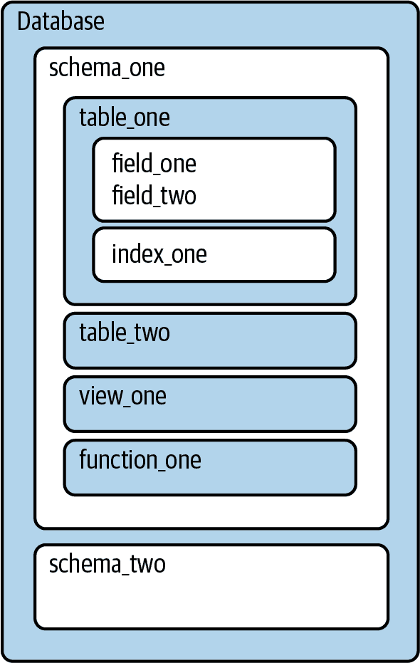
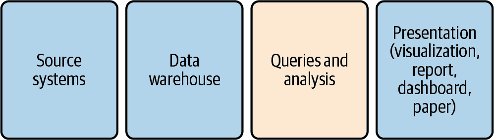
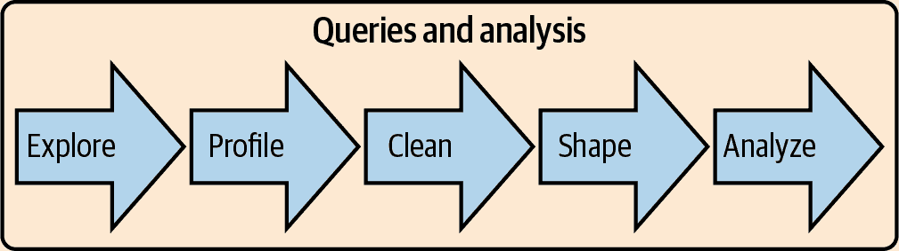
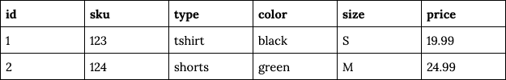

# 第一章：数据分析与 SQL

如果你正在阅读这本书，你可能对数据分析感兴趣，并希望使用 SQL 来完成它。你可能对数据分析有经验，但对 SQL 比较新，或者你可能对 SQL 有经验，但对数据分析比较新。或者你可能对这两个主题都很陌生。无论你的起点如何，本章为本书其余部分涵盖的主题奠定基础，并确保我们有共同的词汇。我将首先讨论什么是数据分析，然后转向 SQL 的讨论：它是什么，为什么如此流行，它与其他工具的比较，以及它如何融入数据分析中。然后，由于现代数据分析与使其成为可能的技术密切相关，我将结束本章讨论您在工作中可能遇到的不同类型的数据库，它们的用途以及这对您编写的 SQL 的意义。

# 什么是数据分析？

收集和存储数据以进行分析是一项非常人性化的活动。用于跟踪粮食存储、税收和人口的系统可以追溯到数千年前，而统计学的根源可以追溯到数百年前。相关学科，包括统计过程控制、运营研究和控制论，在 20 世纪蓬勃发展。有许多不同的名称用来描述数据分析学科，如商业智能（BI）、分析学、数据科学和决策科学，从业者有各种各样的职称。营销人员、产品经理、业务分析师和其他各种人群也进行数据分析。在本书中，我将使用术语“数据分析师”和“数据科学家”互换地表示使用 SQL 理解数据的人。我将称用于构建报告和仪表板的软件为“BI 工具”。

当代意义上的数据分析得以实现，并且与计算历史交织在一起。研究和商业化的趋势共同塑造了它，并且其中包含了一些重要研究人员和大公司的故事，我们将在 SQL 部分讨论这些内容。数据分析将计算的力量与传统统计学的技术融合在一起。数据分析既是数据发现的一部分，也是数据解释和数据沟通的一部分。数据分析的目的很常见是通过人类甚至是通过自动化逐渐增加的机器来改进决策制定。

健全的方法论至关重要，但分析不仅仅是生成正确的数字。它关乎好奇心、提问以及数字背后的“为什么”。它关乎模式和异常，发现和解释关于企业和人类行为的线索。有时分析是基于特定问题而收集的数据集进行的，如科学研究或在线实验。分析也可以针对因业务活动产生的数据，如公司产品的销售，或出于分析目的生成的数据，比如网站和移动应用的用户交互跟踪。这些数据具有广泛的应用可能性，从故障排除到规划用户界面（UI）改进，但通常以一种需要处理才能得出答案的格式和数量到达。第二章将讨论数据分析准备工作，第八章将讨论所有数据从业者都应熟悉的一些伦理和隐私问题。

数据分析已经触及几乎所有行业：制造业、零售业、金融业、医疗保健、教育以及甚至政府都受其影响。体育队伍自从比利·比恩担任奥克兰运动家队总经理之初便采用数据分析，这在迈克尔·刘易斯的书籍《金球》（Norton）中得到了广泛传播。数据分析应用于市场营销、销售、物流、产品开发、用户体验设计、支持中心、人力资源等领域。技术、应用和计算能力的结合导致了数据工程和数据科学等相关领域的蓬勃发展。

数据分析本质上是基于历史数据进行的，重要的是要记住过去并不一定预测未来。世界在变化，组织也在变化——新产品和流程被引入，竞争对手崛起和衰落，社会政治气候变化。批评声音指责数据分析只是在回顾过去。尽管这种说法有一定道理，但我见过组织通过分析历史数据获得了巨大价值。挖掘历史数据有助于我们理解客户、供应商和流程的特征和行为。历史数据可以帮助我们制定明智的估计和预测结果的范围，有时会错误，但很多时候会正确。过去的数据可以指出缺口、弱点和机会。它让组织优化、节省资金，并降低风险和欺诈。它还可以帮助组织发现机会，并成为让客户满意的新产品的基石。

###### 注意

如今，几乎没有不进行某种形式的数据分析的组织，但仍然有一些顽固的例外。为什么一些组织不使用数据分析？一个论点是成本与价值的比例。收集、处理和分析数据需要工作和一定程度的财务投入。有些组织可能太新，或者过于随意。如果没有一个一致的流程，很难生成足够一致的数据进行分析。最后，还有伦理考量。收集或存储某些人在某些情况下的数据可能受到监管甚至禁止。例如，有关儿童和医疗干预的数据是敏感的，围绕其收集有广泛的法规。即使是其他方面数据驱动的组织也需要注意客户隐私，并深思熟虑应收集哪些数据、为什么需要这些数据以及应该存储多长时间。欧盟的《通用数据保护条例》（GDPR）和加州消费者隐私法案（CCPA）等法规已改变了企业对消费者数据的看法。我们将在第八章中更深入地讨论这些法规。作为数据从业者，我们应始终思考我们工作的伦理意涵。

当我与组织合作时，我喜欢告诉人们，数据分析不是一个在固定日期结束的项目，而是一种生活方式。培养数据驱动的思维是一个过程，收获成果是一段旅程。未知变为已知，困难问题被逐步解答直至找到答案，最关键的信息被嵌入到支持战术和战略决策的仪表板中。有了这些信息，新的更难的问题被提出，然后这个过程重复。

数据分析对于想要开始学习的人来说很容易接触，但要掌握却很困难。技术可以学习，特别是 SQL。许多问题，如优化营销支出或检测欺诈，是熟悉的并且可以跨行业转换。每个组织都是不同的，每个数据集都有其特点，所以即使是熟悉的问题也可能带来新的挑战。传达结果是一种技能。学会提出良好的建议，并成为组织的信任伙伴需要时间。根据我的经验，简单而有说服力的分析比复杂而表达不清的分析更具有影响力。成功的数据分析还需要伙伴关系。你可能有很好的见解，但如果没有人来执行，你并没有真正产生影响。即使拥有所有技术，关键仍然在于人，关系至关重要。

# 为什么选择 SQL？

本节描述了什么是 SQL，使用它的好处，它与其他常用于分析的语言的比较，以及最后 SQL 如何融入分析工作流程。

## 什么是 SQL？

SQL 是与数据库通信的语言。这个缩写代表结构化查询语言，可以发音为“sequel”，也可以按每个字母发音，如“ess cue el”。这只是我们将看到的许多关于 SQL 的争议和不一致之一，但无论你如何发音，大多数人都会明白你的意思。关于 SQL 是否是编程语言存在一些争论。它不像 C 或 Python 那样是通用的编程语言。没有数据库和表中的数据，SQL 只是一个文本文件。SQL 不能建立网站，但它在与数据库中的数据工作时非常强大。在实际层面上，最重要的是 SQL 可以帮助你完成数据分析工作。

IBM 是第一个开发 SQL 数据库的公司，使用了 1960 年代 Edgar Codd 发明的关系模型。关系模型是使用关系管理数据的理论描述。通过创建第一个数据库，IBM 帮助推动了这一理论，但它也考虑到了商业因素，正如 Oracle、Microsoft 和其他所有商业化数据库的公司一样。从一开始，计算机理论与商业现实之间存在紧张关系。SQL 在 1987 年成为国际标准化组织（ISO）标准，1986 年成为美国国家标准化组织（ANSI）标准。尽管所有主要数据库在实现 SQL 时都遵循这些标准，但许多数据库具有使用户更轻松的变体和功能。这些变体使得在不进行某些修改的情况下在数据库之间移动 SQL 更加困难。

SQL 用于访问、操作和检索数据库中对象的数据。数据库可以有一个或多个*模式*，提供组织和结构，并包含其他对象。在模式内，数据分析中最常用的对象是表、视图和函数。表包含字段，用于保存数据。表可以有一个或多个*索引*；索引是一种特殊的数据结构，允许更有效地检索数据。索引通常由数据库管理员定义。视图本质上是存储的查询，可以像表一样引用。函数允许常用的计算或过程集存储，并在查询中轻松引用。它们通常由数据库管理员或 DBA 创建。图 1-1 概述了数据库的组织。

###### 图 1-1\. 数据库组织和数据库对象概述

要   要与数据库通信，SQL 有四种子语言用于处理不同的工作，这些在大多数数据库类型中都是标准的。大多数从事数据分析工作的人不需要每天记住这些子语言的名称，但在与数据库管理员或数据工程师的交流中可能会涉及到，因此我会简要介绍它们。这些命令可以在同一 SQL 语句中流畅地运行，有些可以同时存在于同一个 SQL 语句中。

*DQL*，或者*数据查询语言*，是本书的主要内容。它用于查询数据，可以理解为使用代码向数据库提问。DQL 命令包括*SELECT*，对于之前使用过 SQL 的用户来说应该很熟悉，但根据我的经验，DQL 这个缩写并不经常使用。SQL 查询可以只有一行，也可以跨越多行。SQL 查询可以访问单个表（或视图），可以通过连接从多个表中组合数据，也可以在同一数据库中查询多个模式。SQL 查询通常不能跨数据库查询，但在某些情况下，可以通过巧妙的网络设置或额外的软件从多个来源检索数据，甚至可以是不同类型的数据库。SQL 查询是自包含的，除了表之外，不引用变量或前面步骤中的输出，不像脚本语言那样。

*DDL*，或者*数据定义语言*，用于在数据库中创建和修改表、视图、用户和其他对象。它影响结构但不影响内容。有三个常见的命令：*CREATE*用于创建新对象，*ALTER*用于更改对象的结构，比如向表中添加列，*DROP*删除整个对象及其结构。你可能会听到 DBA 和数据工程师谈论与 DDL 相关的工作，这实际上是指用于创建、修改或删除的文件或代码片段。在分析环境中使用 DDL 的例子包括创建临时表的代码。

*DCL*，或者*数据控制语言*，用于访问控制。命令包括*GRANT*和*REVOKE*，分别用于授予权限和撤销权限。在分析环境中，*GRANT*可能需要用于允许同事查询你创建的表。当有人告诉你数据库中存在一个表但你看不到时，可能需要对你的用户授予权限。

*DML*，或者*数据操作语言*，用于操作数据本身。命令包括*INSERT*用于添加新记录，基本上是 ETL 中的“加载”步骤，*UPDATE*用于更改字段中的值，*DELETE*用于删除行。如果你有任何类型的自管理表（如临时表、沙箱表），或者扮演数据库所有者和分析者的角色，你将遇到这些命令。

这四种子语言存在于所有主要的数据库中。在本书中，我主要将专注于 DQL。我们将在第八章中涉及到一些 DDL 和 DML 命令，并且您也会在[书籍的 GitHub 网站](https://github.com/cathytanimura/sql_book)中看到一些示例，这些示例用于创建和填充示例中使用的数据。由于这些共同的命令集，任何数据库编写的 SQL 代码对于习惯于使用 SQL 的人来说都会很熟悉。然而，从另一个数据库中阅读 SQL 可能会感觉有点像听一个使用与您相同语言但来自其他国家或地区的人说话。语言的基本结构是相同的，但俚语不同，有些词甚至有完全不同的意义。数据库之间 SQL 的变化通常被称为*方言*，数据库用户会提到 Oracle SQL、MSSQL 或其他方言。

然而，一旦您掌握了 SQL，只要注意到如空值、日期和时间戳的处理、整数的除法以及大小写敏感等细节，您就可以与不同类型的数据库一起工作。

本书以 PostgreSQL 或 Postgres 作为示例，尽管我会尝试指出在其他类型数据库中代码可能会有意义上的不同。您可以在个人计算机上安装[Postgres](https://www.postgresql.org/download)来跟随示例操作。

## SQL 的好处

使用 SQL 进行数据分析有很多好处，从计算能力到数据分析工具中的普及性和其灵活性都是如此。

或许使用 SQL 的最佳理由是，世界上大部分的数据已经存储在数据库中。很可能您自己的组织已经有一个或多个数据库。即使数据尚未存储在数据库中，将其加载到数据库中也可能值得，以便利用存储和计算优势，尤其是与电子表格等替代方案相比。近年来，计算能力有了爆炸性增长，数据仓库和数据基础设施已经发展出来以利用这种增长。一些新的云数据库允许在内存中查询大量数据，进一步加快速度。等待查询结果返回几分钟或几小时的时代可能已经结束，尽管分析师可能会因此编写更复杂的查询。

SQL 是与数据库交互和从中检索数据的事实标准。许多流行软件都使用 SQL 连接数据库，从电子表格到商业智能和可视化工具以及编程语言如 Python 和 R（在下一节讨论）。由于可用的计算资源，尽可能在数据库中执行尽可能多的数据操作和聚合通常有下游优势。我们将在第八章深入讨论构建复杂数据集以供下游工具使用的策略。

SQL 的基本构建块可以以无数种方式组合起来。从相对较少的构建块——语法——开始，SQL 就可以完成广泛的任务。SQL 可以进行迭代开发，并且在进行过程中轻松审查结果。它可能不是一个完整的编程语言，但它可以做很多事情，从数据转换到复杂计算再到回答问题。

最后，SQL 相对容易学习，具有有限的语法量。您可以快速学习基本关键字和结构，然后随着时间的推移在处理各种数据集时不断完善自己的技能。考虑到世界上各种数据集和可能提出的问题范围，SQL 的应用几乎是无限的。SQL 在许多大学教授，并且许多人在工作中掌握了一些技能。即使没有 SQL 技能的员工也可以接受培训，学习曲线可能比其他编程语言更容易。这使得将数据存储在关系数据库中进行分析成为组织的合乎逻辑的选择。

## SQL 与 R 或 Python 的比较

虽然 SQL 是数据分析中流行的语言，但它并不是唯一的选择。R 和 Python 是用于数据分析的其他流行语言之一。R 是统计和绘图语言，而 Python 是一种通用编程语言，在处理数据方面有优势。两者都是开源的，可以安装在笔记本电脑上，并有活跃的社区开发处理各种数据操作和分析任务的包或扩展。在选择 R 和 Python 之间，超出了本书的范围，但在线上有许多关于它们各自优势的讨论。这里将它们作为 SQL 的编码语言替代品来考虑。

SQL 与其他编程语言的一个主要区别在于代码运行的位置以及因此可用的计算资源。SQL 始终在数据库服务器上运行，利用其所有的计算资源。对于分析，R 和 Python 通常在您的本地机器上运行，因此计算资源受本地可用资源的限制。当在大数据集上执行除最简单分析以外的任何工作时，将工作推向具有更多资源的数据库服务器是一个不错的选择。由于数据库通常设置为持续接收新数据，所以当需要定期更新报告或仪表板时，SQL 也是一个不错的选择。

第二个区别在于数据的存储和组织方式。关系型数据库总是将数据组织成表内的行和列，因此对于每个查询，SQL 都假设这种结构。R 和 Python 有更多种存储数据的方式，包括变量、列表和字典等多种选项。这些提供了更大的灵活性，但学习曲线更陡峭。为了便于数据分析，R 拥有数据框架（data frames），类似于数据库表格，将数据组织成行和列。而 pandas 包则使得数据框架在 Python 中得以使用。即使存在其他选项，表格结构仍然对于分析是宝贵的。

循环是 SQL 与大多数其他计算机编程语言之间的另一个主要区别。*循环*是一种指令或一组指令，重复执行直到满足指定条件。SQL 聚合隐式地循环处理数据集，无需额外的代码。稍后我们将看到，在数据透视或反透视时，无法循环处理字段可能导致 SQL 语句冗长。虽然深入讨论超出了本书的范围，一些供应商已经为 SQL 创建了扩展，例如 Oracle 的 PL/SQL 和 Microsoft SQL Server 的 T-SQL，这些扩展允许功能，例如循环。

SQL 的一个缺点是你的数据必须在数据库中¹，而 R 和 Python 可以从本地存储的文件导入数据，也可以访问存储在服务器或网站上的文件。这对于许多临时项目是方便的。数据库可以安装在笔记本电脑上，但这确实增加了额外的开销。另一方面，例如 R 的 dbplyr 包和 Python 的 SQLAlchemy 包允许使用这些语言编写的程序连接到数据库，执行 SQL 查询，并在进一步处理步骤中使用结果。在这方面，R 或 Python 可以与 SQL 互补。

R 和 Python 都具有复杂的统计函数，这些函数可以是内置的或者在包中可用。尽管 SQL 有例如计算平均值和标准偏差的函数，但是在实验分析中需要的 p 值和统计显著性的计算（详见第七章）无法仅使用 SQL 完成。除了复杂的统计学外，机器学习是另一个最好使用这些其他编程语言来处理的领域。

在决定是否使用 SQL、R 或 Python 进行分析时，请考虑：

+   数据位于何处——是在数据库、文件还是网站中？

+   数据量有多大？

+   数据将用于何处——报告、可视化、统计分析？

+   是否需要使用新数据进行更新或刷新？更新频率是多少？

+   你的团队或组织使用什么，以及符合现有标准有多重要？

关于哪种语言和工具最适合进行数据分析或数据科学存在很多争论。与许多事物一样，通常有多种方法可以完成分析。编程语言在流行度上不断演变和变化，我们很幸运生活和工作在一个有这么多好选择的时代。SQL 已经存在很长时间，可能在未来几年仍然流行。最终目标是使用最适合工作的最佳工具。本书将帮助您充分利用 SQL 进行数据分析，无论您的工具包中还有什么其他工具。

## SQL 作为数据分析工作流的一部分

现在我已经解释了 SQL 是什么，讨论了它的一些好处，并将其与其他语言进行了比较，我们将转向讨论 SQL 在数据分析过程中的位置。分析工作总是从一个问题开始，可能是关于新客户数量、销售趋势如何，或者为什么有些用户长时间停留，而其他人试用服务后就不再返回。一旦问题被确定，我们考虑数据的来源、数据存储位置、分析计划以及如何向观众呈现结果。图 1-2 展示了这个过程中的步骤。本书的重点是查询和分析，尽管我会简要讨论其他步骤，以便将查询和分析阶段放入更广泛的背景中。

###### 图 1-2\. 数据分析过程中的步骤

首先，数据由*源系统*生成，这个术语包括任何生成感兴趣数据的人或机器过程。数据可以由人工生成，例如某人填写表格或在医生就诊时记录笔记。数据也可以是机器生成的，例如应用程序数据库记录购买、事件流系统记录网站点击，或者营销管理工具记录电子邮件打开。源系统可以生成多种不同类型和格式的数据，第二章将更详细地讨论它们以及源类型可能如何影响分析。

第二步是将数据移动并存储到数据库进行分析。我将使用术语*数据仓库*，这是一个将组织中各处的数据整合到一个中央库中的数据库，以及*数据存储*，它是指可以查询的任何类型的数据存储系统。您可能会遇到的其他术语包括*数据集市*，它通常是数据仓库的一个子集，或者更专注的数据仓库；以及*数据湖*，一个术语，它可以意味着数据驻留在文件存储系统中，或者它存储在数据库中，但没有数据仓库中常见的数据转换程度。数据仓库可以从简单小型到庞大昂贵。在本书的示例中，运行在笔记本电脑上的数据库就足够了。重要的是将您需要进行分析的数据集中在一个地方。

###### 注意

通常由个人或团队负责将数据加载到数据仓库中。这个过程称为*ETL*，即抽取、转换、加载。抽取从源系统中提取数据。转换可选地更改数据结构，执行数据质量清洗或聚合数据。加载将数据放入数据库中。这个过程也可以称为*ELT*，即抽取、加载、转换——区别在于，在加载数据之后才执行转换，通常使用 SQL。在 ETL 的上下文中，您可能还会听到*源*和*目标*这些术语。源是数据来源，目标是目的地，即数据库及其中的表格。即使使用 SQL 进行转换，也会使用其他语言如 Python 或 Java 来将步骤粘合在一起，协调调度，并在出现问题时发出警报。市场上有许多商业产品以及开源工具可用，因此团队不必完全从头开始创建 ETL 系统。

一旦数据进入数据库，下一步是执行查询和分析。在这一步骤中，应用 SQL 来探索、分析、清洗、整理和分析数据。图 1-3 展示了这个过程的一般流程。探索数据包括熟悉主题、数据生成地点以及存储数据的数据库表格。分析包括检查数据集中的唯一值和记录分布。清洗包括修复不正确或不完整的数据，添加分类和标志，处理空值。整理是将数据排列成结果集中所需的行和列的过程。最后，分析数据涉及审查输出以发现趋势、结论和洞察。虽然这个过程被展示为线性的，但在实践中，它往往是循环的——例如，当整理或分析显示需要清洗的数据时。

###### 图 1-3\. 分析工作流程中查询和分析步骤内的阶段

将数据呈现为最终输出形式是整体工作流程的最后一步。商业人士不会希望收到一份 SQL 代码的文件；他们期待你呈现图表、图形和见解。沟通是通过分析产生影响的关键因素，为此我们需要一种与他人共享结果的方式。有时候，你可能需要应用比 SQL 更复杂的统计分析，或者想将数据输入到机器学习（ML）算法中。幸运的是，大多数报告和可视化工具都有 SQL 连接器，可以让你从整个表或预先编写的 SQL 查询中提取数据。通常用于 ML 的统计软件和语言也通常具有 SQL 连接器。

分析工作流程包括多个步骤，并且通常涉及多种工具和技术。SQL 查询和分析是许多分析的核心，也是我们将在接下来的章节中重点讨论的内容。第二章将讨论源系统的类型及其生成的数据类型。本章的其余部分将介绍你在分析过程中可能会遇到的数据库类型。

# 数据库类型及其处理方式

如果你在使用 SQL，那么你就在处理数据库。数据库类型各不相同——从开源到专有，从行存储到列存储。有本地数据库和云数据库，还有混合数据库，组织在云供应商基础设施上运行数据库软件。还有许多根本不是数据库但可以用 SQL 查询的数据存储。

不同类型的数据库各有千秋；在进行分析工作时，每种数据库类型都有其优势和劣势。与分析工作流程的其他部分使用的工具不同，你可能对组织中使用的数据库技术没有太多发言权。了解你所使用的数据库的细节将帮助你更高效地工作，并利用它提供的任何特殊 SQL 函数。熟悉其他类型的数据库将有助于你在进行构建或迁移数据仓库的项目时使用。你可能希望在个人、小规模项目中在笔记本电脑上安装数据库，或者出于类似原因获取云数据仓库的实例。

自引入以来，数据库和数据存储一直是技术发展的一个动态领域。自 21 世纪初以来，几项趋势驱动了技术的发展，这些趋势对今天的数据从业者来说真是令人兴奋。首先，随着互联网、移动设备和物联网（IoT）的发展，数据量急剧增加。2020 年，[IDC 预测](https://oreil.ly/oEWDD)，到 2025 年，全球存储的数据量将增长到 175ZB。这种数据规模难以想象，并且并非所有数据都将存储在用于分析的数据库中。如今，公司拥有的数据规模达到了 TB 和 PB 级，这在 20 世纪 90 年代及更早时期的技术下是不可能处理的。其次，数据存储和计算成本的降低，以及云计算的出现，使组织更便宜、更容易地收集和存储这些海量数据。计算机内存价格下降，意味着大量数据可以加载到内存中，执行计算，并返回结果，而无需读写磁盘，大大提高了速度。第三，分布式计算使得能够将工作负载分散到许多机器上。这使得大量可调整的计算能力能够用于复杂的数据任务中。

数据库和数据存储以多种不同方式结合这些技术趋势，以优化特定类型的任务。对于分析工作，有两种广泛的数据库类别是相关的：行存储和列存储。在下一节中，我将介绍它们，讨论它们的相似性和不同之处，以及在这些数据库中存储数据时的分析意义。最后，我将介绍一些超出数据库的其他类型的数据基础设施，您可能会遇到。

## 行存储数据库

*行存储*数据库，也称为*事务性*数据库，旨在高效处理事务：*插入*、*更新*和*删除*。流行的开源行存储数据库包括 MySQL 和 Postgres。在商业领域，Microsoft SQL Server、Oracle 和 Teradata 被广泛使用。虽然它们并非专为分析而优化，但多年来，行存储数据库是建立数据仓库的唯一选择。通过精心调整和模式设计，这些数据库可以用于分析。由于开源选项成本低廉，并且熟悉维护的数据库管理员，它们也很有吸引力。许多组织在数据基础设施建设的第一步中，将生产数据库复制到相同的技术中。因此，数据分析师和数据科学家在职业生涯中可能会与行存储数据库中的数据打交道。

我们通常将表格看作行和列，但是数据必须进行序列化以便存储。查询会在硬盘上搜索所需数据。硬盘被组织成一系列固定大小的块。扫描硬盘既耗时又耗资源，因此尽量减少需要扫描的磁盘量以返回查询结果至关重要。行存储数据库通过将数据按行序列化来解决这个问题。图 1-4 展示了行存储数据的示例。在查询时，整行数据被读入内存。这种方法在进行行级更新时速度快，但如果需要跨多行进行计算且只需要少数列，则速度较慢。

###### 图 1-4\. 行存储，即将每行数据一起存储在磁盘上

为了减少表格的宽度，行存储数据库通常按照*第三范式*进行建模，这是一种数据库设计方法，旨在仅存储每个信息片段一次，以避免重复和不一致性。这对事务处理非常高效，但通常会导致数据库中存在大量表格，每个表格只有少数列。分析这样的数据通常需要进行多次连接，非开发人员可能很难理解所有表格之间的关系以及特定数据存储在哪里。在进行分析时，通常的目标是反范式化，或者将所有数据聚集在一个地方。

表格通常有一个*主键*来确保唯一性——换句话说，它防止数据库为相同内容创建多条记录。表格通常会有一个`id`列，它是一个自增整数，每次插入新记录时都会获得上次插入记录之后的下一个整数，或者是由主键生成器创建的字母数字值。还应该有一组列，这些列一起使得行数据唯一；这些字段的组合被称为*复合键*，有时也称为*业务键*。例如，在一个人员表中，`first_name`、`last_name`和`birthdate`一起可能使得行数据唯一。`Social_security_id`也可以是唯一标识符，除了表的`person_id`列。

表还可以选择性地添加索引，以加快查找特定记录和涉及这些列的连接速度。索引将字段的值以单个数据片段的形式存储，同时存储行指针。由于索引比整个表小，因此扫描速度更快。通常会对主键建立索引，但也可以对其他字段或字段组建立索引。在使用行存储数据库时，了解所使用的表中哪些字段有索引非常有用。通过添加索引可以加快常见连接操作的速度，因此值得调查分析查询是否运行时间过长。索引并非免费：它们占用存储空间，并减慢加载速度，因为每次插入新值都需要更新。数据库管理员可能不会为所有可能有助于分析的内容建立索引。除了报告外，分析工作可能不足以优化索引。在解决问题的新方法时，通常会放弃一种方法。

[星型模式建模](https://oreil.ly/5WiSp)部分是为了使行存储数据库更适合分析工作负载而开发的。其基础在《数据仓库工具包》一书中详细阐述，推崇将数据建模为一系列事实表和维度表。事实表代表事件，如零售店交易。维度包含描述符，如客户姓名和产品类型。由于数据并不总是完全适合事实和维度的分类，因此有一个名为[snowflake 模式](https://oreil.ly/rpj4N)的扩展，其中一些维度具有自己的维度。

## 列存储数据库

*列存储*数据库在 21 世纪初蓬勃发展，尽管它们的理论历史可以追溯到行存储数据库的历史。列存储数据库将一列的值存储在一起，而不是将一行的值存储在一起。这种设计优化了读取多条记录但不一定读取所有列的查询。流行的列存储数据库包括 Amazon Redshift、Snowflake 和 Vertica。

由于压缩技术，列存储数据库在存储大容量数据方面非常高效。缺失值和重复值可以用非常小的标记值表示，而不是完整的值。例如，列存储数据库不会将“United Kingdom”存储成成千上万次，而是存储一个占用极小空间的代理值，同时存储完整的“United Kingdom”值的查找。列存储数据库还通过利用排序数据中值的重复性来压缩数据。例如，数据库可以存储“United Kingdom”标记值重复 100 次的事实，这比重复存储该标记 100 次还要节省空间。

列存储数据库不强制执行主键，也没有索引。重复值由于压缩而不成问题。因此，模式可以针对分析查询进行定制，所有数据都在一个地方，而不是分布在多个需要联接的表中。但是，没有主键可能会导致重复数据轻易混入，因此了解数据来源和质量检查非常重要。

大多数列存储数据库中更新和删除操作成本很高，因为单个行的数据是分布式存储而不是存储在一起的。对于非常大的表，可能存在只写策略，因此我们还需要了解一些关于数据生成的信息，以便确定要使用的记录。数据读取速度也可能较慢，因为在应用计算之前需要对其进行解压缩。

列存储数据库通常是快速分析工作的黄金标准。它们使用标准的 SQL（带有一些特定供应商的变化），在写查询时在很多方面与行存储数据库的工作没有什么不同。数据的大小很重要，以及为数据库分配的计算和存储资源。我见过在几秒钟内跨百万甚至十亿条记录运行的聚合操作。这对生产力大有裨益。

###### 提示

有一些技巧需要注意。由于某些类型的压缩依赖于排序，了解表上进行排序的字段，并将它们用于过滤查询，可以提高性能。如果两个表都很大，则联接表可能很慢。

总而言之，某些数据库可能更容易或更快速地进行操作，但数据库类型本身不会阻止您执行本书中的任何分析。与所有工具一样，使用适合数据量和任务复杂性的工具将使您能够专注于创建有意义的分析。

## 其他类型的数据基础设施

数据库并非存储数据的唯一方式，现在有越来越多的选择，可以存储分析和支持应用程序所需的数据。文件存储系统，有时被称为*数据湖*，可能是数据库仓库的主要替代方案。NoSQL 数据库和基于搜索的数据存储是提供低延迟应用程序开发和搜索日志文件的替代数据存储系统。虽然它们通常不是分析过程的一部分，但它们越来越成为组织数据基础设施的一部分，因此我也会在本节简要介绍它们。一个有趣的趋势值得指出的是，尽管这些新类型的基础设施最初旨在摆脱 SQL 数据库的限制，但许多都最终实现了某种 SQL 接口来查询数据。

Hadoop，也称为 HDFS（“Hadoop 分布式文件系统”），是一个利用数据存储和计算能力成本不断下降以及分布式系统的开源文件存储系统。文件被分割成块，并且 Hadoop 将它们分布在存储在集群中的节点或计算机的文件系统上。运行操作的代码被发送到节点，它们并行处理数据。Hadoop 的一个重大突破是允许大量数据以低廉的价格存储。许多大型互联网公司发现，与传统数据库的成本和存储限制相比，这是一个优势，特别是面对大量通常是非结构化数据的情况。Hadoop 的早期版本有两个主要缺点：需要专门的编码技能来检索和处理数据，因为它与 SQL 不兼容，并且程序的执行时间通常相当长。Hadoop 已经成熟，开发了各种工具，允许对数据进行 SQL 或类 SQL 的访问，并加快查询时间。

过去几年中，还推出了其他商业和开源产品，利用廉价的数据存储和快速的内存数据处理，同时提供 SQL 查询功能。其中一些甚至允许分析人员编写单个查询，从多个底层源返回数据。这对于处理大量数据的任何人都是令人兴奋的，并且证明了 SQL 的重要性。

NoSQL 是一种允许非严格关系型数据建模的技术。它允许非常低延迟的存储和检索，这在许多在线应用中至关重要。该类别包括键值对存储和图数据库，后者以节点-边格式存储，以及文档存储。你可能在组织中听说过的这些数据存储的例子有 Cassandra、Couchbase、DynamoDB、Memcached、Giraph 和 Neo4j。早期，NoSQL 被宣传为使 SQL 过时，但最近该首字母缩略词被市场宣传为“不仅仅是 SQL”。为了分析目的，通常需要将存储在 NoSQL 键值存储中的数据移动到更传统的 SQL 数据仓库中，因为 NoSQL 并不优化于一次查询多条记录。图数据库有网络分析等应用，分析工作可以直接在其中使用特定的查询语言进行。然而，工具景观一直在不断演变，也许将来我们能够用 SQL 分析这些数据。

基于搜索的数据存储包括 Elasticsearch 和 Splunk。Elasticsearch 和 Splunk 通常用于分析机器生成的数据，例如日志。这些以及类似的技术具有非 SQL 查询语言，但如果您了解 SQL，通常也能理解它们。鉴于 SQL 技能的普遍性，一些数据存储，如 Elasticsearch，已添加了 SQL 查询接口。这些工具在它们设计的用例中非常有用且功能强大，但通常不适合本书涵盖的分析任务类型。多年来我向人们解释过，它们非常适合在大海中寻找针，但并不太适合测量大海本身。

无论是哪种类型的数据库或其他数据存储技术，趋势是明确的：即使数据量增长并且用例变得更加复杂，SQL 仍然是访问数据的标准工具。其庞大的现有用户群、易学习曲线和强大的分析任务能力意味着，即使是试图摆脱 SQL 的技术也会回归并适应它。

# 结论

数据分析是一个令人兴奋的学科，对于企业和其他组织有多种应用。SQL 在处理数据方面有许多优点，特别是对于任何存储在数据库中的数据。查询和分析数据是更大分析工作流的一部分，数据科学家可能预期使用多种数据存储类型。既然我们已经奠定了分析、SQL 和数据存储的基础，本书的其余部分将深入探讨如何使用 SQL 进行分析。第二章重点介绍了数据准备，从数据类型的介绍开始，然后转向分析数据的配置、清理和塑形。第 3 至第七章介绍了数据分析的应用，重点关注时间序列分析、队列分析、文本分析、异常检测和实验分析。第八章介绍了在其他工具中进行进一步分析的复杂数据集开发技术。最后，第九章总结了如何将不同类型的分析结合起来获得新的见解，并列出了一些额外资源来支持您的分析旅程。

¹ 有一些较新的技术允许对非关系型数据源中存储的数据进行 SQL 查询。

² Ralph Kimball 和 Margy Ross，*数据仓库工具包*，第 3 版（印第安纳波利斯：Wiley，2013 年）。
