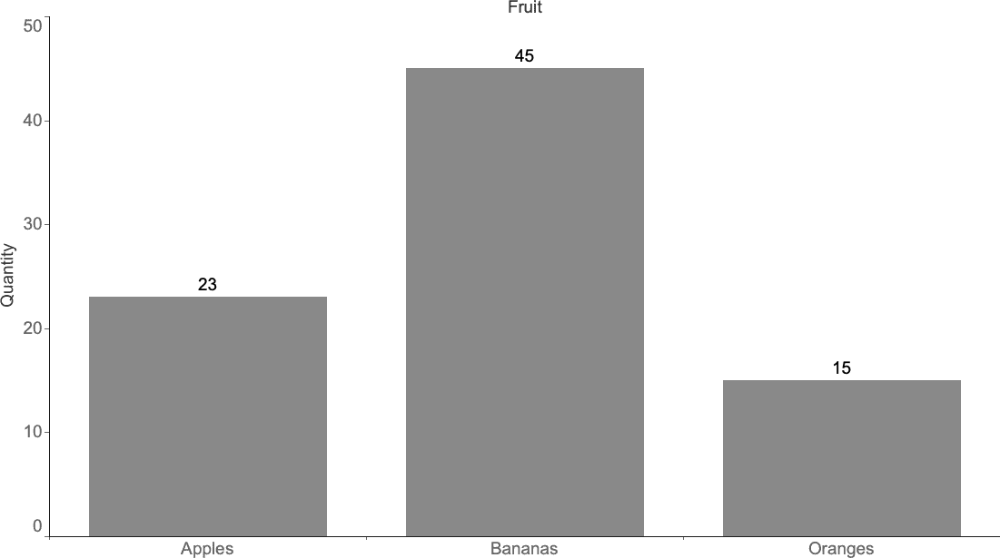
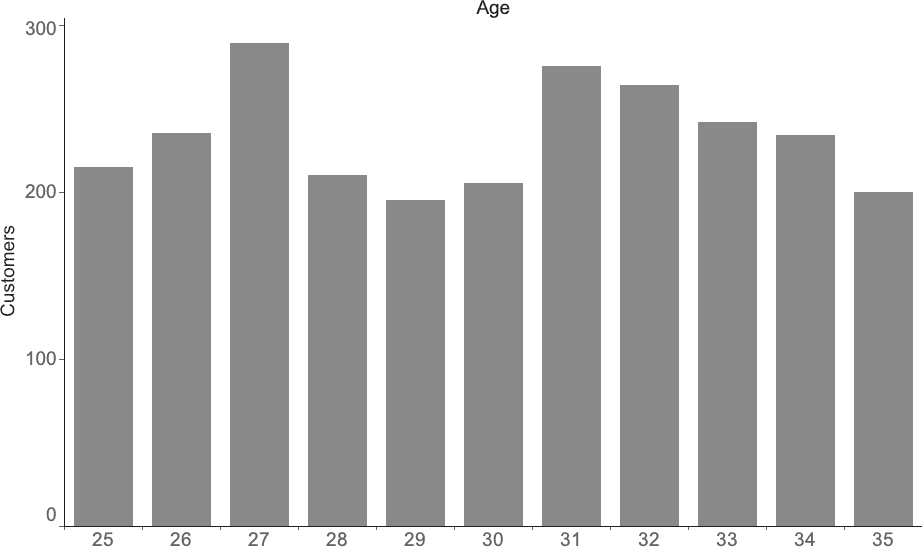
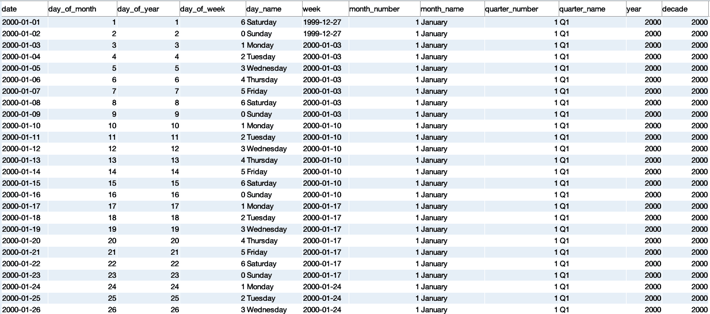
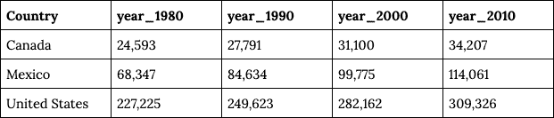

# 第二章：准备数据进行分析

估计数据科学家花在数据准备上的时间有所不同，但可以肯定的是，这一步骤占据了与数据工作的大部分时间。2014 年，《纽约时报》报道称，数据科学家将 50%至 80%的时间用于清理和整理数据。CrowdFlower 在 2016 年的调查发现，数据科学家将 60%的时间用于清理和组织数据，以便为分析或建模工作做准备。准备数据是如此普遍的任务，以至于出现了用于描述它的术语，如数据 munging、数据 wrangling 和数据准备。（“Mung”是 Mash Until No Good 的首字母缩写，我偶尔也会这样做。）所有这些数据准备工作只是毫无意义的苦工，还是过程中的一个重要部分呢？

当数据集有一个*数据字典*时，数据准备就更容易了，这是一个有关字段、可能的值、数据收集方式以及与其他数据关系的清晰描述的文档或存储库。不幸的是，这种情况经常并非如此。即使是认识到其价值的人，通常也不会将文档编制排在首位，或者随着添加新字段和表格或数据填充方式的变化，文档会变得过时。数据剖析生成了数据字典的许多元素，因此，如果你的组织已经有了数据字典，现在是使用它并为其做贡献的好时机。如果当前尚无数据字典存在，请考虑开始创建一个！这是你可以为团队和未来的自己提供的最有价值的礼物之一。一个最新的数据字典能够通过基于已完成的剖析工作而不是重复进行来加速数据剖析过程。它还将提高你分析结果的质量，因为你可以验证是否正确使用了字段并应用了适当的过滤器。

即使有数据字典存在，作为分析的一部分，你可能仍然需要进行数据准备工作。在本章中，我将从你可能遇到的数据类型的回顾开始。接下来是 SQL 查询结构的回顾。然后，我将讨论数据剖析作为了解其内容并检查数据质量的一种方式。接下来我会谈一些数据塑形技术，以返回需要进一步分析的列和行。最后，我将介绍一些清理数据的有用工具，以解决任何质量问题。

# 数据类型

数据是分析的基础，所有数据都有数据库数据类型，并且还属于一个或多个数据类别。对数据可能采取的多种形式有坚实的理解将帮助你成为一名更有效的数据分析师。我将从分析中最常见的数据库数据类型开始。然后我将转向一些概念性分组，这些分组有助于我们理解数据的来源、质量和可能的应用。

## 数据库数据类型

数据库表中的字段都有定义的数据类型。大多数数据库都有关于它们支持的类型的良好文档，这是获取本文档之外所需细节的良好资源。要成为一名优秀的分析师，您并不一定需要成为数据类型细微差别的专家，但在本书的后面，我们会遇到需要考虑数据类型的情况，因此本节将介绍基础知识。主要的数据类型包括字符串、数值、逻辑和日期时间，如表 2-1 所总结的。这些基于 Postgres，但在大多数主要数据库类型中是类似的。

表 2-1\. 常见数据库数据类型总结

| 类型 | 名称 | 描述 |
| --- | --- | --- |
| **String** | CHAR / VARCHAR | 存储字符串。CHAR 是固定长度的，而 VARCHAR 是可变长度的，最大长度为某个值（例如 256 个字符）。 |
|   | TEXT / BLOB | 存储不适合在 VARCHAR 中的较长字符串。调查对象输入的描述或自由文本可能存储在这些字段中。 |
| **Numeric** | INT / SMALLINT / BIGINT | 存储整数（整数）。一些数据库支持 SMALLINT 和/或 BIGINT。当字段只需存储位数较少的值时可以使用 SMALLINT，它比普通的 INT 占用更少的内存。BIGINT 可以存储比 INT 更多位数的数字，但占用的空间比 INT 大。 |
|   | FLOAT / DOUBLE / DECIMAL | 存储十进制数，有时可以指定小数位数。 |
| **Logical** | BOOLEAN | 存储 TRUE 或 FALSE 值。 |
|   | DATETIME / TIMESTAMP | 存储带有时间的日期。通常以 YYYY-MM-DD hh:mi:ss 格式表示，其中 YYYY 是四位数年份，MM 是两位数月份，DD 是两位数日期，hh 是两位数小时（通常为 24 小时制，取值范围为 0 到 23），mi 是两位数分钟，ss 是两位数秒。一些数据库只存储没有时区的时间戳，而其他一些数据库有专门的类型用于带和不带时区的时间戳。 |
|   | TIME | 存储时间。 |

字符串数据类型最为灵活。这些可以包含字母、数字和特殊字符，包括制表符和换行符等不可打印字符。字符串字段可以定义为固定或可变长度的字符数。例如，CHAR 字段可以定义为仅允许两个字符以保存美国州名缩写，而存储州全名的字段需要是 VARCHAR 以允许可变长度的字符。字段可以定义为 TEXT、CLOB（字符大对象）或 BLOB（二进制大对象，可以包括附加数据类型如图像），具体取决于数据库以存储非常长的字符串，尽管由于它们通常占用大量空间，这些数据类型往往被节俭使用。当数据加载时，如果到达的字符串超过了定义的数据类型，它们可能会被截断或完全拒绝。SQL 有许多字符串函数，我们将用于各种分析目的。

数字数据类型是存储数字的所有类型，包括正数和负数。数学函数和运算符可以应用于数字字段。数字数据类型包括 INT 类型以及允许小数点的 FLOAT、DOUBLE 和 DECIMAL 类型。整数数据类型通常被实现，因为它们比它们的小数对应类型使用更少的内存。在某些数据库中，如 Postgres，在整数除法时，结果是一个整数，而不是带有小数位的值，这可能与您的期望不同。我们将在本章后面讨论转换数字数据类型以获得正确结果。

逻辑数据类型称为 BOOLEAN。它具有 TRUE 和 FALSE 的值，并且是存储适当情况下的信息的有效方式。比较两个字段的操作将返回一个 BOOLEAN 值作为结果。这种数据类型通常用于创建*标志*，即总结数据中属性存在或不存在的字段。例如，存储电子邮件数据的表可能有一个 BOOLEAN `has_opened`字段。

日期时间类型包括 DATE、TIMESTAMP 和 TIME。尽可能将日期和时间数据存储在这些数据库类型的字段中，因为 SQL 有许多有用的函数可以对它们进行操作。时间戳和日期在数据库中非常常见，并且对许多类型的分析至关重要，特别是时间序列分析（见第三章）和队列分析（见第四章）。第三章将讨论日期和时间格式化、转换和计算。

其他数据类型，如 JSON 和地理类型，一些数据库支持，而一些不支持。我在这里不会详细介绍它们，因为它们通常超出本书的范围。但它们显示了 SQL 继续发展以应对新兴分析任务的迹象。

除了数据库数据类型之外，还有许多概念上对数据进行分类的方式。这些分类方式可以影响数据的存储方式以及我们对其进行分析的方式。接下来我将讨论这些分类数据类型。

## 结构化与非结构化

数据通常被描述为结构化数据、非结构化数据或有时为半结构化数据。大多数数据库设计用来处理*结构化数据*，其中每个属性存储在一个列中，并且每个实体的实例表示为行。首先创建数据模型，然后根据该数据模型插入数据。例如，地址表可以有街道地址、城市、州和邮政编码字段。每一行将保存特定客户的地址。每个字段都有数据类型，并且只允许输入该类型的数据。当结构化数据插入表中时，将验证每个字段以确保其符合正确的数据类型。结构化数据易于使用 SQL 进行查询。

*非结构化数据*与结构化数据相反。它没有预先确定的结构、数据模型或数据类型。非结构化数据通常是那些不属于数据库数据的“其他所有内容”。文件、电子邮件和网页都属于非结构化数据。照片、图像、视频和音频文件也是非结构化数据的例子。它们不符合传统的数据类型，因此对于关系型数据库来说更难以高效存储和使用 SQL 进行查询。因此，非结构化数据通常存储在关系型数据库之外。这样可以快速加载数据，但由于缺乏数据验证，可能导致数据质量不佳。正如我们在第一章中看到的，技术不断发展，正在开发新工具以允许 SQL 查询多种类型的非结构化数据。

*半结构化数据*介于这两种类别之间。许多“非结构化”数据具有一定的结构，我们可以利用它。例如，电子邮件具有发件人和收件人电子邮件地址、主题行、正文文本和发送时间戳，这些可以与这些字段分开存储在数据模型中。元数据，或者关于数据的数据，可以从其他文件类型中提取并存储以进行分析。例如，音乐音频文件可能带有艺术家、歌曲名称、流派和时长的标签。通常情况下，半结构化数据的结构化部分可以使用 SQL 进行查询，SQL 通常也可用于解析或提取结构化数据以进一步查询。我们将在第五章中讨论文本分析时看到这些应用。

## 定量数据与定性数据

*定量数据*是数值型的。它测量人、事物和事件。定量数据可以包括描述符，例如客户信息、产品类型或设备配置，同时也包括数值信息，例如价格、数量或访问持续时间。数据可以应用计数、求和、平均数或其他数值函数。定量数据今天通常是由机器生成的，但并非必须如此。在纸质患者接待表上记录的身高、体重和血压是定量数据，教师在电子表格中输入的学生测验分数也是定量数据。

*定性数据*通常是基于文本的，包括意见、感觉和非严格定量的描述。温度和湿度水平是定量数据，而像“炎热潮湿”这样的描述则是定性的。客户为产品支付的价格是定量的，他们喜欢还是不喜欢它则是定性的。调查反馈、客户支持询问和社交媒体帖子都属于定性数据。有整个专业处理定性数据。在数据分析的背景下，我们通常尝试量化定性数据。其中一种技术是提取关键词或短语并计算它们的出现次数。我们将在第五章更详细地探讨这一点时，会看到更多的技术。另一种技术是情感分析，通过语言结构解释使用的词语含义，除了它们的频率。句子或其他文本主体可以评分其积极或消极的程度，然后使用计数或平均数来得出可能难以总结的见解。自然语言处理领域已经取得了令人兴奋的进展，尽管大部分工作是通过 Python 等工具完成的。

## 第一方、第二方和第三方数据

*第一方数据*由组织自行收集。这可以通过服务器日志、记录交易和客户信息的数据库或其他由组织建立和控制的系统完成，并生成有助于分析的数据。由于这些系统是内部创建的，通常可以找到建造它们的人，并了解数据生成的方式。数据分析师还可能能够影响或控制某些数据的创建和存储方式，尤其是在数据质量差的时候由于错误导致的情况下。

*第二方数据*来自为组织提供服务或代表其进行业务功能的供应商。这些通常是软件即服务（SaaS）产品；常见示例包括 CRM、电子邮件和营销自动化工具、电子商务支持软件以及网页和移动互动追踪器。这些数据与第一方数据类似，因为它们涉及组织本身，由其员工和客户创建。然而，生成和存储数据的代码以及数据模型都由外部控制，数据分析师通常对这些方面影响有限。第二方数据越来越多地被导入组织的数据仓库进行分析。可以通过自定义代码或 ETL 连接器完成此操作，或者使用提供数据集成的 SaaS 供应商。

###### 小贴士

许多 SaaS 供应商提供一些报告功能，因此可能会出现是否值得将数据复制到数据仓库的问题。与工具交互的部门可能会发现报告足够，例如客户服务部门从其帮助台软件中报告解决问题的时间和代理人的生产力。另一方面，客户服务互动可能是客户保留模型的重要输入，这需要将这些数据与销售和取消数据整合到数据存储中。在决定是否从特定数据源导入数据时，有一个很好的经验法则：如果将数据与其他系统的数据组合能够创造价值，那就导入它；如果不能，那么在有更强的案例之前再等待进行这项工作。

*第三方数据*可以从政府等免费来源购买或获取。除非数据是专门为组织收集的，数据团队通常无法控制格式、频率和数据质量。这些数据通常缺乏第一方和第二方数据的细粒度。例如，大多数第三方来源没有用户级数据，而是可能在邮政编码或城市级别或更高级别与第一方数据合并。然而，第三方数据可能包含独特和有用的信息，例如聚合消费模式、人口统计数据和市场趋势，否则这些信息收集可能非常昂贵或不可能实现。

## 稀疏数据

*稀疏数据* 是指在较大集合中存在少量信息的情况。稀疏数据可能会表现为某一列中许多空值和少量实际值。空值不同于值为 0，是数据的 *缺失*，这将在数据清洗部分后面详细讨论。稀疏数据可能发生在事件稀缺的情况下，例如软件错误或产品目录长尾中的产品购买。它也可能发生在功能或产品推出的早期阶段，只有测试人员或测试客户可以访问时。JSON 是一种处理稀疏数据的方法，从编写和存储的角度来看，它只存储存在的数据并省略其余部分。这与行存储数据库形成对比，后者即使没有值也必须为字段保留内存空间。

对于分析而言，稀疏数据可能会带来问题。当事件稀疏时，趋势未必有意义，相关性也难以与偶然波动区分开来。值得分析数据，正如本章后面讨论的那样，以了解数据是否稀疏以及稀疏数据的位置。一些选项包括将不经常发生的事件或项目分组到更常见的类别中，完全排除稀疏数据或时间段的分析，或显示描述性统计信息以及警示说明，说明这些趋势未必有意义。

存在多种不同类型的数据及其描述方式，其中许多方式是重叠的或不是互斥的。熟悉这些类型不仅有助于编写良好的 SQL，还有助于决定如何以适当的方式分析数据。您可能并不总是能预先知道数据类型，这就是为什么数据分析如此关键的原因。在我们进入具体内容和我们的第一个代码示例之前，我将简要回顾 SQL 查询结构。

# SQL 查询结构

SQL 查询具有常见的子句和语法，尽管可以以几乎无限的方式组合这些子句以实现分析目标。本书假定您具有一定的 SQL 知识，但我将在此回顾基础知识，以便我们在接下来的代码示例中有一个共同的基础。

*SELECT* 子句确定查询将返回的列。每个 *SELECT* 子句中的表达式将返回一列，表达式之间用逗号分隔。表达式可以是来自表的字段，如 `sum` 这样的聚合，或者任何数量的计算，如 CASE 语句、类型转换和本章后面以及整本书中将讨论的各种函数。

*FROM* 子句确定 *SELECT* 子句中的表达式是从哪些表派生的。一个“表”可以是数据库表，视图（一种保存的查询，否则像表一样工作），或者子查询。子查询本身是一个用括号括起来的查询，其结果被引用它的查询视为任何其他表。一个查询可以在 *FROM* 子句中引用多个表，尽管它们必须使用 *JOIN* 类型之一以及指定表之间关系的条件。*JOIN* 条件通常指定每个表中字段之间的相等性，例如 `orders.customer_id = customers.customer_id`。*JOIN* 条件可以包括多个字段，并且还可以指定不等式或值的范围，例如日期范围。我们将在本书中看到一系列实现特定分析目标的 *JOIN* 条件。*INNER JOIN* 返回两个表中都匹配的所有记录。*LEFT JOIN* 返回第一个表的所有记录，但只返回第二个表中匹配的记录。*RIGHT JOIN* 返回第二个表的所有记录，但只返回第一个表中匹配的记录。*FULL OUTER JOIN* 返回两个表的所有记录。当第一个表中的每条记录与第二个表中的多条记录匹配时，可以产生笛卡尔 *JOIN*。通常应避免笛卡尔 *JOIN*，尽管有一些特定的用例，比如生成填充时间序列的数据时会故意使用它们。最后，*FROM* 子句中的表可以被别名化，或者给定一个或多个字母的较短名称，可以在查询的其他子句中引用。别名可以使查询编写人员免于重复输入长表名，并且使查询更易于阅读。

###### 提示

尽管可以在同一查询中使用 *LEFT JOIN* 和 *RIGHT JOIN*，但当您坚持使用其中一种时，跟踪逻辑要容易得多。实际上，*LEFT JOIN* 比 *RIGHT JOIN* 更常用。

*WHERE* 子句指定需要从结果集中排除或删除行的限制或过滤器。*WHERE* 是可选的。

当 *SELECT* 子句包含聚合函数并且至少有一个非聚合字段时，*GROUP BY* 子句是必需的。记住应该放在 *GROUP BY* 子句中的内容的一个简单方法是，它应该包括所有不是聚合的字段。在大多数数据库中，有两种列出 *GROUP BY* 字段的方式：按字段名称或按位置，如 1、2、3 等。一些人更喜欢使用字段名称表示法，SQL Server 要求使用这种表示法。我更喜欢位置表示法，特别是当 *GROUP BY* 字段包含复杂表达式或者当我进行大量迭代时。本书通常会使用位置表示法。

这涵盖了 SQL 查询结构的基础。第八章将详细讨论这些子句的每一个，以及在本书中较少见但出现的一些额外子句的顺序评估。既然我们有了这个基础，我们可以转向分析过程中最重要的部分之一：数据剖析。

# 剖析：分布

数据剖析是我开始处理任何新数据集时首先做的事情。我查看数据是如何安排成模式和表的。我查看表名以熟悉所涵盖的主题，例如客户、订单或访问。我检查几个表的列名，并开始构建表之间关系的心理模型。例如，表可能包括一个通过`order_id`与`order`表相关的行项目分解的`order_detail`表，而`order`表则通过`customer_id`与`customer`表相关。如果有数据字典，我会审查并与样本行中看到的数据进行比较。

表通常代表组织的操作或某些操作的子集，因此我考虑涵盖的领域或领域，例如电子商务、营销或产品互动。当我们了解数据生成方式时，处理数据会更容易。剖析可以提供关于这一点的线索，或者关于向来源、组织内外负责收集或生成数据的人提出的问题。即使你自己收集数据，剖析也是有用的。

另一个我检查的细节是如何表示历史数据，如果有的话。例如，复制生产数据库的数据集可能不包含客户地址或订单状态的先前值，而一个构建良好的数据仓库可能会有每日变化数据字段的快照。

数据剖析与*探索性数据分析*或 EDA 的概念相关，由 John Tukey 命名。在他的同名书籍中，¹ Tukey 描述了如何通过计算各种摘要和可视化结果来分析数据集。他包括了查看数据分布的技术，包括茎叶图、箱线图和直方图。

在检查几个数据样本后，我开始查看分布。分布可以帮助我了解数据中存在的值的范围及其出现频率，是否存在空值，以及负值是否与正值并存。分布可以针对连续或分类数据创建，并称为频率。在本节中，我们将看看如何创建直方图，如何使用分箱来理解连续值的分布，以及如何使用 n-分位数来更精确地了解分布情况。

## 柱状图和频率

了解数据集以及其中特定字段的最佳方法之一是检查每个字段中值的频率。无论您是否怀疑某些值是否可能，或者是否发现意外值并想知道它们出现的频率，频率检查都非常有用。频率查询可以对任何数据类型执行，包括字符串、数字、日期和布尔值。频率查询还是检测稀疏数据的一种有效方式。

查询很简单。可以用`count(*)`找到行数，并在*GROUP BY*中列出要分析的字段。例如，我们可以检查虚构的`fruit_inventory`表中每种类型的水果的频率：

```
SELECT fruit, count(*) as quantity
FROM fruit_inventory
GROUP BY 1
;
```

###### 提示

在使用`count`时，考虑一下数据集中是否可能存在重复记录是值得的。当您想要记录数时可以使用`count(*)`，但是使用`count distinct`可以找出有多少个唯一项。

*频率图* 是一种可视化数据集中某些事物出现次数的方法。通常在 x 轴上绘制被分析的字段，y 轴上显示观察次数。图 2-1 展示了我们查询的水果频率图的示例。频率图也可以横向绘制，这样可以很好地容纳较长的值名称。请注意，这是无序的分类数据。



###### 图 2-1\. 水果库存的频率图

*直方图* 是一种可视化数据集中数值分布的方法，对于具有统计学背景的人来说应该很熟悉。一个基本的直方图可以展示一组客户的年龄分布。假设我们有一个包含姓名、注册日期、年龄和其他属性的`customers`表。要按年龄创建直方图，通过数值字段`age`进行*GROUP BY*，并计算`count customer_id`：

```
SELECT age, count(customer_id) as customers
FROM customers
GROUP BY 1 
;
```

我们假设的年龄分布结果在图 2-2 中显示。



###### 图 2-2\. 按年龄分布的客户

我反复使用的另一种技巧，也成为我最喜欢的面试问题之一的基础，涉及到聚合后跟随的频率计数。我给候选人一个名为`orders`的假设表，其中包含日期、客户标识符、订单标识符和金额，然后要求他们编写一个 SQL 查询，返回每个客户的订单分布。这不能用简单的查询解决；它需要一个中间聚合步骤，可以通过子查询完成。首先，在子查询中对每个`customer_id`的订单数进行`count`。外部查询使用`orders`数作为类别，并计算客户的数量：

```
SELECT orders, count(*) as num_customers
FROM
(
    SELECT customer_id, count(order_id) as orders
    FROM orders
    GROUP BY 1
) a
GROUP BY 1
;
```

这种类型的分析可以应用于需要查看数据中特定实体或属性出现频率的任何情况。在这些示例中，已使用`count`，但也可以使用其他基本聚合函数（`sum`、`avg`、`min`和`max`）来创建直方图。例如，我们可能想通过他们所有订单的`sum`，他们的`avg`订单大小，他们的`min`订单日期或他们的`max`（最近）订单日期来对客户进行分析。

## 分箱

当处理连续值时，分箱非常有用。不是计算每个值的观察次数或记录数，而是将数值范围分组在一起，这些分组称为*箱*或*桶*。然后计算落入每个区间的记录数。箱可以具有可变大小或固定大小，这取决于您的目标是将数据分组为对组织具有特定含义的箱，还是大致相等宽度的箱，或包含大致相等记录数的箱。可以使用 CASE 语句、四舍五入和对数函数创建箱。

CASE 语句允许评估条件逻辑。这些语句非常灵活，我们将在整本书中不断使用它们，应用于数据分析、清理、文本分析等领域。CASE 语句的基本结构是：

```
case when condition1 then return_value_1
     when condition2 then return_value_2
     ...
     else return_value_default
     end
```

WHEN 条件可以是相等性、不等式或其他逻辑条件。THEN 返回值可以是常量、表达式或表中的字段。可以包括任意数量的条件，但语句将在条件第一次评估为 TRUE 时停止执行并返回结果。ELSE 告诉数据库如果找不到匹配项应使用什么作为默认值，也可以是常量或字段。ELSE 是可选的，如果不包括，则任何非匹配项将返回 null。CASE 语句还可以嵌套，以便返回值是另一个 CASE 语句。

###### 提示

THEN 后的返回值必须是相同的数据类型（字符串、数值、布尔值等），否则会报错。如果遇到此类情况，请考虑转换为通用数据类型，例如字符串。

CASE 语句是一种灵活的方法，用于控制箱数、每个箱中落入的值的范围以及如何命名这些箱。当存在非常小或非常大值的长尾需要分组而不希望在分布的某些部分中出现空箱时，它们尤其有用。某些数值范围具有需要在数据中重新创建的业务含义。许多 B2B 公司根据员工数量或收入将客户分为“企业”和“SMB”（中小型企业）类别，因为它们的购买模式不同。例如，假设我们正在考虑打折运费优惠，并且想知道有多少客户会受到影响。我们可以使用 CASE 语句将`order_amount`分成三个桶：

```
SELECT 
case when order_amount <= 100 then 'up to 100'
     when order_amount <= 500 then '100 - 500'
     else '500+' end as amount_bin
,case when order_amount <= 100 then 'small'
      when order_amount <= 500 then 'medium'
      else 'large' end as amount_category
,count(customer_id) as customers
FROM orders
GROUP BY 1,2
;
```

任意大小的箱子可能很有用，但有时固定大小的箱子更适合分析。固定大小的箱子可以通过几种方式实现，包括四舍五入、对数和 n-tiles。创建等宽箱子时，四舍五入很有用。四舍五入会减少值的精度，我们通常认为四舍五入是通过减少小数位数或完全删除它们来减少的。`round`函数的形式为：

```
round(value,number_of_decimal_places)
```

小数位数也可以是负数，允许该函数四舍五入到最接近的十位、百位、千位等。表 2-2 展示了带有从–3 到 2 的参数的四舍五入结果。

Table 2-2\. 数字 123,456.789 的各种小数位数四舍五入

| 小数位数 | 公式 | 结果 |
| --- | --- | --- |
| 2 | round(123456.789,2) | 123456.79 |
| 1 | round(123456.789,1) | 123456.8 |
| 0 | round(123456.789,0) | 123457 |
| -1 | round(123456.789,-1) | 123460 |
| -2 | round(123456.789,-2) | 123500 |
| -3 | round(123456.789,-3) | 123000 |

```
SELECT round(sales,-1) as bin
,count(customer_id) as customers
FROM table
GROUP BY 1
;
```

对数是创建箱子的另一种方式，特别是在数据集中，最大值的数量级远大于最小值的情况下。家庭财富的分布、互联网上不同属性的网站访客数量以及地震的震动力量等都是具有此属性的现象的示例。虽然它们不会创建等宽箱子，但对数会创建具有有用模式的箱子。刷新一下记忆，对数是必须将 10 提高到产生该数字的指数：

log(*number*) = *exponent*

在这种情况下，10 称为底数，这通常是数据库中的默认实现，但从技术上讲，底数可以是任何数字。表 2-3 显示了几个 10 的幂的对数。

Table 2-3\. 对`log`函数在 10 的幂上的结果

| 公式 | 结果 |
| --- | --- |
| log(1) | 0 |
| log(10) | 1 |
| log(100) | 2 |
| log(1000) | 3 |
| log(10000) | 4 |

在 SQL 中，`log`函数返回其参数的对数，该参数可以是常数或字段：

```
SELECT log(sales) as bin
,count(customer_id) as customers
FROM table
GROUP BY 1
;
```

`log`函数可以用于任何正值，而不仅仅是 10 的倍数。但是，当值小于或等于 0 时，对数函数无法工作；它将返回 null 或错误，这取决于数据库。

## n-Tiles

您可能熟悉数据集的*中位数*，或者中间值。这是第 50 百分位值。一半的值大于中位数，另一半小于中位数。对于四分位数，我们填充 25 百分位和 75 百分位值。在第 25 百分位，四分之一的值较小，三分之三较大；在第 75 百分位，三分之三的值较小，四分之一较大。分位数将数据集分成 10 等份。通过使这个概念通用化，*n-tiles*允许我们计算数据集的任何百分位数：第 27 百分位数、第 50.5 百分位数等。

许多数据库内置了`median`函数，但对其余功能依赖于更通用的 n-tile 函数。这些函数是窗口函数，跨越多行计算以返回单行的值。它们接受一个参数，指定要将数据分割为的区间数，并且可以选择使用*PARTITION BY*和/或*ORDER BY*子句：

```
ntile(num_bins) over (partition by... order by...)
```

举个例子，假设我们有 12 笔交易，订单金额分别为$19.99、$9.99、$59.99、$11.99、$23.49、$55.98、$12.99、$99.99、$14.99、$34.99、$4.99 和$89.99。使用 10 个区间对`ntile`进行计算，对每个订单金额排序并分配一个从 1 到 10 的区间：

```
order_amount  ntile
------------  -----
4.99          1
9.99          1
11.99         2
12.99         2
14.99         3
19.99         4
23.49         5
34.99         6
55.98         7
59.99         8
89.99         9
99.99         10
```

这可以通过首先计算子查询中每行的`ntile`，然后在使用`min`和`max`查找值范围的上下界的外部查询中使用来实践中对记录进行分箱：

```
SELECT ntile
,min(order_amount) as lower_bound
,max(order_amount) as upper_bound
,count(order_id) as orders
FROM
(
    SELECT customer_id, order_id, order_amount
    ,ntile(10) over (order by order_amount) as ntile
    FROM orders
) a
GROUP BY 1
;
```

一个相关的函数是`percent_rank`。与返回数据所在区间不同，`percent_rank`返回百分位数。它不带参数，但需要括号，并且可以带有*PARTITION BY*和/或*ORDER BY*子句：

```
percent_rank() over (partition by... order by...)
```

尽管在分箱方面不如`ntile`有用，`percent_rank`可用于创建连续分布，或者作为报告或进一步分析的输出本身使用。由于需要对所有行进行排序，对大数据集进行计算可能会很昂贵。通过过滤表格仅包含所需数据集有助于减少计算成本。某些数据库实现了这些函数的近似版本，这些版本计算速度更快，并且如果不需要绝对精确性，则通常返回高质量的结果。在第六章中讨论异常检测时，我们将进一步探讨 n-tile 的其他用途。

在许多情境中，查看数据分布没有单一正确或客观最佳的方式。分析人员可以在理解数据和向他人展示数据方面使用上述技巧。然而，数据科学家需要运用判断力，并且在分享敏感数据的时候必须带着他们的道德雷达。

# 分析：数据质量

当涉及创建良好的分析时，数据质量是绝对关键的。尽管这似乎是显而易见的，但这是我多年从事数据工作中学到的最艰难的教训之一。过于关注数据处理的机制、找到巧妙的查询技术和恰到好处的可视化可能会导致利益相关者忽略所有这些，并指出一个数据不一致性。确保数据质量可能是分析中最难和最令人沮丧的部分之一。谚语“垃圾进，垃圾出”只捕捉了问题的一部分。好的输入再加上不正确的假设也可能导致垃圾输出。

与基本事实进行数据比较，或者已知为真的内容，是理想的，尽管并非总是可能的。例如，如果您正在使用生产数据库的副本工作，可以比较每个系统中的行数，以验证所有行是否已到达副本数据库。在其他情况下，您可能了解某个月销售的金额和数量，因此可以查询数据库以确保销售的`sum`和记录的`count`匹配。通常，您的查询结果与预期值之间的差异取决于您是否应用了正确的过滤器，例如排除取消订单或测试帐户；您如何处理空值和拼写异常；以及您是否在表之间设置了正确的*JOIN*条件。

档案记录是在数据质量问题对结果和从数据中得出的结论产生负面影响之前早期发现数据质量问题的一种方法。档案记录揭示了空值，需要解密的分类编码，需要解析的具有多个值的字段以及不寻常的日期时间格式。档案记录还可以揭示由于跟踪更改或停机而导致的数据中的间隙和步变。数据很少是完美的，通常只有通过对数据的分析使用才能发现数据质量问题。

## 检测重复项

*重复* 是指有两行（或更多）信息相同的情况。重复项可能由于多种原因存在。在数据输入时可能出现错误，如果存在某些手动步骤。跟踪调用可能会触发两次。处理步骤可能会运行多次。您可能会意外创建隐藏的多对多*连接*。无论它们如何出现，重复项都可能严重影响您的分析。我记得在我职业生涯早期，我曾经认为发现了一个很好的发现，只是产品经理指出我的销售数字是实际销售的两倍。这令人尴尬，破坏了信任，并且需要重新工作，有时候还需要对代码进行痛苦的审查以找出问题。我已经学会了在进行时检查重复项。

幸运的是，在我们的数据中找到重复项相对比较容易。一种方法是检查一个样本，所有列都有序：

```
SELECT column_a, column_b, column_c...
FROM table
ORDER BY 1,2,3...
;
```

这将显示数据是否充满重复记录，例如，在查看全新数据集时，当您怀疑某个过程正在生成重复记录时，或者在可能的笛卡尔*JOIN*之后。如果只有少量重复记录，则可能不会显示在样本中。滚动数据以尝试发现重复项对眼睛和大脑来说是一种负担。发现重复项的更系统的方法是*SELECT*列，然后`count`行数（这可能与直方图的讨论看起来很熟悉！）：

```
SELECT count(*)
FROM
(
    SELECT column_a, column_b, column_c...
    , count(*) as records
    FROM...
    GROUP BY 1,2,3...
) a
WHERE records > 1
;
```

这将告诉您是否存在任何重复情况。如果查询返回 0，则一切正常。要获取更多详细信息，您可以列出记录的数量（2、3、4 等）：

```
SELECT records, count(*)
FROM
(
    SELECT column_a, column_b, column_c..., count(*) as records
    FROM...
    GROUP BY 1,2,3...
) a
WHERE records > 1
GROUP BY 1
;
```

###### 注意

作为子查询的替代方案，您可以使用*HAVING*子句并将所有内容保留在单个主查询中。由于它在聚合和*GROUP BY*之后进行评估，*HAVING*可用于在聚合值上进行过滤：

```
SELECT column_a, column_b, column_c..., count(*) as records
FROM...
GROUP BY 1,2,3...
HAVING count(*) > 1
;
```

我更喜欢使用子查询，因为我发现它们是组织逻辑的一种有用方式。第八章将讨论评估顺序和保持 SQL 查询组织的策略。

要查看哪些记录存在重复，您可以列出所有字段，然后使用这些信息来查找存在问题的记录：

```
SELECT *
FROM
(
    SELECT column_a, column_b, column_c..., count(*) as records
    FROM...
    GROUP BY 1,2,3...
) a
WHERE records = 2
;
```

检测重复记录是一回事；解决它们又是另一回事。了解重复记录出现的原因几乎总是有用的，如果可能的话，修复上游问题。可以改进数据处理以减少或消除重复吗？是否存在 ETL 过程中的错误？您是否未考虑*JOIN*中的一对多关系？接下来，我们将介绍一些处理和移除 SQL 中重复记录的选项。

## 使用 GROUP BY 和 DISTINCT 进行去重

重复事件时常发生，而且它们并不总是由于数据质量问题引起的。例如，假设我们想要查找已成功完成交易的所有客户的列表，以便为他们的下一个订单发送优惠券。我们可能会*JOIN* `customers` 表和 `transactions` 表，这将限制返回的记录仅限于出现在 `transactions` 表中的客户：

```
SELECT a.customer_id, a.customer_name, a.customer_email
FROM customers a
JOIN transactions b on a.customer_id = b.customer_id
;
```

这将为每个客户每个交易返回一行，但希望至少有几个客户进行了多次交易。我们意外地创建了重复记录，并非因为存在任何潜在的数据质量问题，而是因为我们没有注意避免结果中的重复。幸运的是，有几种方法可以在 SQL 中避免这种情况。去除重复记录的一种方法是使用关键词*DISTINCT*：

```
SELECT distinct a.customer_id, a.customer_name, a.customer_email
FROM customers a
JOIN transactions b on a.customer_id = b.customer_id
;
```

另一种选择是使用 *GROUP BY*，虽然通常与聚合有关，但也会像 *DISTINCT* 一样进行去重。我记得第一次看到同事使用 *GROUP BY* 进行去重时，我甚至没有意识到这是可能的。我觉得它比 *DISTINCT* 稍显不直观，但结果是一样的：

```
SELECT a.customer_id, a.customer_name, a.customer_email
FROM customers a
JOIN transactions b on a.customer_id = b.customer_id
GROUP BY 1,2,3
;
```

另一种有用的技术是执行返回每个实体一行的聚合。虽然从技术上讲不是去重，但效果类似。例如，如果我们有同一客户的多笔交易并且需要返回每个客户的一条记录，我们可以找到`min`（第一个）和/或`max`（最近）的`transaction_date`：

```
SELECT customer_id
,min(transaction_date) as first_transaction_date
,max(transaction_date) as last_transaction_date
,count(*) as total_orders
FROM table
GROUP BY customer_id
;
```

重复数据或包含多条记录每个实体的数据，即使它们在技术上不是重复的，是查询结果不正确的最常见原因之一。如果突然查询返回的客户数或总销售额比预期多许多倍，您可能会怀疑重复数据是原因。幸运的是，有几种技术可以应用来防止这种情况发生。

另一个常见问题是缺失数据，接下来我们会讨论。

# 准备工作：数据清理

分析通常会揭示哪些变更可以使数据对分析更有用。一些步骤包括 CASE 转换、空值调整和数据类型更改。

## 使用 CASE 转换清洗数据

CASE 语句可以用于执行各种清洗、增强和汇总任务。有时数据存在且准确，但如果值被标准化或分组到类别中，则对分析更有用。CASE 语句的结构在本章早些时候已经介绍过，在分箱部分。

非标准值由于各种原因而存在。值可能来自具有略有不同选项列表的不同系统，系统代码可能已更改，选项可能以不同语言呈现给客户，或者客户可能能够自行填写值而不是从列表中选择。

想象一个字段包含有关个人性别的信息。表示女性的值包括“F”、“female”和“femme”。我们可以将值标准化如下：

```
CASE when gender = 'F' then 'Female'
     when gender = 'female' then 'Female'
     when gender = 'femme' then 'Female'
     else gender 
     end as gender_cleaned
```

CASE 语句还可以用于添加原始数据中不存在的分类或增强功能。例如，许多组织使用净推荐值（Net Promoter Score，NPS）来监测客户情绪。NPS 调查要求受访者评价他们有多大可能向朋友或同事推荐公司或产品，评分从 0 到 10。评分为 0 到 6 的人被视为贬损者，7 和 8 是中立者，9 和 10 是推荐者。最终得分通过从推荐者百分比中减去贬损者百分比计算得出。调查结果数据集通常包括可选的自由文本评论，并有时会使用组织已知的被调查者信息进行增强。给定一个 NPS 调查响应数据集，第一步是将响应分组为贬损者、中立者和推荐者类别：

```
SELECT response_id
,likelihood
,case when likelihood <= 6 then 'Detractor'
      when likelihood <= 8 then 'Passive'
      else 'Promoter'
     end as response_type
FROM nps_responses
;
```

注意，在评估字段和返回数据类型之间可能存在数据类型差异。在这种情况下，我们正在检查一个整数并返回一个字符串。列出所有值并使用 IN 列表也是一种选择。IN 运算符允许您指定一个项目列表，而不必为每个项目单独编写相等性。当输入不连续或值不应按顺序分组时，这是非常有用的：

```
case when likelihood in (0,1,2,3,4,5,6) then 'Detractor'
     when likelihood in (7,8) then 'Passive'
     when likelihood in (9,10) then 'Promoter'
     end as response_type
```

CASE 语句可以考虑多个列，并且可以包含 AND/OR 逻辑。它们也可以是嵌套的，虽然通常可以通过 AND/OR 逻辑避免这种情况：

```
case when likelihood <= 6 
          and country = 'US' 
          and high_value = true 
          then 'US high value detractor'
     when likelihood >= 9 
          and (country in ('CA','JP') 
               or high_value = true
              ) 
          then 'some other label'
     ... end
```

另一个可以使用 CASE 语句做的有用事情是创建指示某个值是否存在的标志，而不返回实际值。这在分析配置文件时非常有用，可以理解某个属性的存在有多普遍。标记的另一个用途是在准备用于统计分析的数据集时。在这种情况下，标志也称为虚拟变量，取值为 0 或 1，指示某些定性变量的存在或不存在。例如，我们可以使用 CASE 语句在 `gender` 和 `likelihood`（推荐概率）字段上创建 `is_female` 和 `is_promoter` 标志：

```
SELECT customer_id
,case when gender = 'F' then 1 else 0 end as is_female
,case when likelihood in (9,10) then 1 else 0 end as is_promoter
FROM ...
;
```

如果您正在处理一个每个实体有多行的数据集，比如订单中的行项目，您可以使用包含在聚合函数中的 CASE 语句来展开数据，并同时将其转换为标志，返回值为 1 或 0。我们之前看到 BOOLEAN 数据类型通常用于创建标志（表示某些属性的存在或不存在）。在这里，1 代表 TRUE，0 代表 FALSE，以便可以应用 `max` 聚合函数。其工作原理是对于每个客户，CASE 语句对于水果类型为“苹果”的任何行都返回 1。然后计算 `max`，将从任何行中返回最大值。只要客户至少购买过一个苹果，标志就会是 1；否则为 0：

```
SELECT customer_id
,max(case when fruit = 'apple' then 1 
          else 0 
          end) as bought_apples
,max(case when fruit = 'orange' then 1 
          else 0 
          end) as bought_oranges
FROM ...
GROUP BY 1
;
```

您还可以构建更复杂的条件以生成标志，例如在给定阈值或某物品数量后才进行标记为 1 的数值：

```
SELECT customer_id
,max(case when fruit = 'apple' and quantity > 5 then 1 
          else 0 
          end) as loves_apples
,max(case when fruit = 'orange' and quantity > 5 then 1 
          else 0 
          end) as loves_oranges
FROM ...
GROUP BY 1
;
```

CASE 语句非常强大，正如我们所见，它们可以用于清理、丰富数据集，并为数据集添加标志或添加虚拟变量。在下一节中，我们将看一些专门处理空值的 CASE 语句相关特殊函数。

## 类型转换和转换

数据库中的每个字段都定义了一个数据类型，我们在本章开头进行了回顾。当数据插入表中时，不符合字段类型的值将被数据库拒绝。字符串不能插入到整数字段中，布尔值不能出现在日期字段中。大多数情况下，我们可以默认数据类型，并将字符串函数应用于字符串，日期函数应用于日期等等。然而偶尔我们需要覆盖字段的数据类型并强制其成为其他类型。这就是类型转换和转换的作用所在。

*类型转换函数* 允许具有适当格式的数据片段从一种数据类型转换为另一种。语法有几种基本等效的形式。一种改变数据类型的方式是使用`cast`函数，`cast (*input* as *data_type*)`，或者使用两个冒号，`*input* :: *data_type*`。这两者是等效的，并将整数 1,234 转换为字符串：

```
cast (1234 as varchar)

1234::varchar
```

将整数转换为字符串在 CASE 语句中非常有用，用于对一些无上限或下限值的数值进行分类。例如，在以下代码中，保留小于或等于 3 的值为整数，同时对更高值返回字符串“4+”会导致错误：

```
case when order_items <= 3 then order_items
     else '4+' 
     end
```

将整数转换为 VARCHAR 类型可以解决这个问题：

```
case when order_items <= 3 then order_items::varchar
     else '4+' 
     end
```

类型转换在将本应为整数的值从字符串中解析出来后变得非常方便，然后我们希望对这些值进行聚合或者使用数学函数。假设我们有一个价格数据集，但这些值包含美元符号（$），因此字段的数据类型是 VARCHAR。我们可以使用一个名为`replace`的函数来去除$字符，这将在我们研究文本分析中的第五章中更详细地讨论：

```
SELECT replace('$19.99','$','');
replace
-------
9.99
```

然而，结果仍然是 VARCHAR 类型，因此尝试应用聚合将返回错误。为了解决这个问题，我们可以将结果`cast`为 FLOAT 类型：

```
replace('$19.99','$','')::float
cast(replace('$19.99','$','')) as float
```

日期和日期时间可以以令人眼花缭乱的格式出现，了解如何将它们*转换*为所需格式是有用的。这里我会展示一些类型转换的示例，第三章 将更详细地介绍日期和日期时间的计算。举个简单的例子，想象一下，交易或事件数据通常以 TIMESTAMP 的形式到达数据库，但我们希望按天汇总某个值，例如交易。简单地按时间戳分组会导致不必要的行数。将 TIMESTAMP 转换为 DATE 可减少结果的大小并实现我们的汇总目标：

```
SELECT tx_timestamp::date, count(transactions) as num_transactions
FROM ...
GROUP BY 1
;
```

同样地，当 SQL 函数需要 TIMESTAMP 参数时，DATE 可以转换为 TIMESTAMP。有时年、月和日存储在单独的列中，或者它们因从较长字符串中分析出来而成为单独的元素。然后需要将它们组装回日期。为此，我们使用连接运算符 ||（双管道）或 `concat` 函数，然后将结果转换为 DATE。任何这些语法都有效且返回相同的值：

```
(year || ',' || month|| '-' || day)::date
```

或者等价地：

```
cast(concat(year, '-', month, '-', day) as date)
```

另一种在字符串值和日期之间进行转换的方法是使用 `date` 函数。例如，我们可以像上面那样构造一个字符串值，并将其转换为日期：

```
date(concat(year, '-', month, '-', day))
```

*to_datatype* 函数可以同时接受值和格式字符串，从而更多地控制数据转换方式。表 2-4 总结了这些函数及其用途。在转换进出 DATE 或 DATETIME 格式时特别有用，因为它们允许您指定日期和时间元素的顺序。

表 2-4\. to_datatype 函数

| 函数 | 用途 |
| --- | --- |
| `to_char` | 将其他类型转换为字符串。 |
| `to_number` | 将其他类型转换为数值。 |
| `to_date` | 将其他类型转换为日期，并指定日期部分。 |
| `to_timestamp` | 将其他类型转换为日期，并指定日期和时间部分。 |

数据库有时会自动转换数据类型。这称为*类型强制转换*。例如，INT 和 FLOAT 数值通常可以在数学函数或聚合中一起使用，而无需显式更改类型。CHAR 和 VARCHAR 值通常可以混合使用。某些数据库会将 BOOLEAN 字段强制转换为 0 和 1 的值，其中 0 表示 FALSE，1 表示 TRUE，但某些数据库要求您显式转换值。某些数据库在混合日期和日期时间在结果集和函数中时要求更加严格。您可以阅读文档，或者进行一些简单的查询实验，了解您正在使用的数据库如何隐式和显式处理数据类型。通常有办法实现您想要的效果，尽管有时需要在查询中创造性地使用函数。

## 处理空值：coalesce、nullif、nvl 函数

当我开始处理数据时，Null 是我不得不适应的比较奇怪的概念之一。在日常生活中，我们习惯于处理具体的事物数量，而不是空值。*Null* 在数据库中有着特殊的含义，是关系数据库发明者埃德加·科德引入的，用于确保数据库有一种方式来表示丢失的信息。如果有人问我有多少个降落伞，我可以回答“零”。但如果从未问过这个问题，我就会有空的降落伞。

Null 值可以表示未收集到数据或对该行不适用的字段。当向表中添加新列时，以前创建的行的值将为空，除非显式填充为其他值。当两个表通过*外连接*进行连接时，任何在第二个表中找不到匹配记录的字段将显示为 Null。

Null 值对于某些聚合和分组是有问题的，不同类型的数据库以不同的方式处理它们。例如，假设我有五条记录，分别是 5、10、15、20 和 Null。这些数的总和是 50，但平均值则是 10 或 12.5，这取决于是否将空值计入分母。整个问题也可能被认为无效，因为其中一个值是空的。对于大多数数据库函数，空输入将返回空输出。包含空值的等式和不等式也会返回空值。如果你对空值不加注意，你的查询可能会输出各种意料之外和令人沮丧的结果。

当定义表时，它们可以允许空值，拒绝空值，或在字段原本为空时填充默认值。实际操作中，这意味着你不能总是依赖字段显示为 Null，因为它可能已经填充了默认值，比如 0。有一次我和一个数据工程师就源系统中的空日期默认为我们数据仓库中的“1970-01-01”进行了长时间的辩论。我坚持认为日期应该是空值，以反映其未知或不适用的事实。工程师指出，我可以记得筛选这些日期或使用 CASE 语句将它们改回空值。最终，我成功地指出，总有一天会有另一个不那么了解默认日期细微差别的用户来运行查询，得到关于公司成立前约一年的令人困惑的客户群集。

Null 值通常对你希望进行的分析是不方便的或不合适的。它们还可能使得分析结果对预期的受众变得混淆。商业人士未必了解如何解释空值，或者可能假设空值代表数据质量问题。

有几种方法可以使用 CASE 语句和专用的`coalesce`和`nullif`函数替换空值。我们之前看到 CASE 语句可以检查条件并返回值。它们还可以用于检查空值，并且如果找到空值，则用另一个值替换它：

```
case when num_orders is null then 0 else num_orders end

case when address is null then 'Unknown' else address end

case when column_a is null then column_b else column_a end
```

`coalesce` 函数是实现这一目标的更紧凑的方式。它接受两个或多个参数，并返回第一个非空参数：

```
coalesce(num_orders,0)

coalesce(address,'Unknown')

coalesce(column_a,column_b)

coalesce(column_a,column_b,column_c)
```

###### 注意

函数`nvl`存在于某些数据库中，类似于`coalesce`，但它只允许两个参数。

`nullif` 函数比较两个数字，如果它们不相等，则返回第一个数字；如果它们相等，则返回空值。运行此代码：

```
nullif(6,7)
```

返回 6，而以下代码返回空值：

```
nullif(6,6)
```

`nullif` 等同于以下更冗长的 CASE 语句：

```
case when 6 = 7 then 6 
     when 6 = 6 then null
     end
```

当你知道某个默认值已经插入到数据库中时，此函数可以将值转换回空值。例如，对于我的默认时间示例，我们可以通过以下方式将其更改回空值：

```
nullif(date,'1970-01-01')
```

###### 警告

在*WHERE*子句中过滤数据时，空值可能会带来问题。返回空值的值相对直接：

```
WHERE my_field is null
```

但是，假设`my_field`包含一些空值和一些水果名称。我希望返回所有不是苹果的行。看起来这应该可以工作：

```
WHERE my_field <> 'apple'
```

然而，某些数据库将排除所有“apple”行和`my_field`中的所有空值行。为了纠正这一点，SQL 应该同时过滤“apple”并明确通过 OR 连接条件包含空值：

```
WHERE my_field <> 'apple' or my_field is null
```

在处理数据时，空值是一个不可避免的事实。无论其产生的原因是什么，我们通常需要在分析中考虑它们，并将其作为数据清洗的目标。幸运的是，SQL 有许多方法可以检测它们，并且有几个有用的函数可以用来将空值替换为其他值。接下来，我们将看一下缺失数据，这是一个可能导致空值的问题，但其影响更广泛，因此值得专门一节来讨论。

## 缺失数据

数据可能因各种原因而丢失，每种原因都会对您决定如何处理数据的缺失产生影响。例如，某个字段可能不是由收集它的系统或流程所要求的，就像在电子商务结账流程中可选的“您是如何知道我们的？”字段。要求填写此字段可能会给客户带来不便，并减少成功的结账次数。或者，由于代码错误或人为失误，例如在医疗问卷中面试者错过了第二页问题，通常需要数据但未收集。数据收集方式的变化可能导致在变更前或变更后的记录中存在缺失值。例如，跟踪移动应用交互的工具可能添加一个额外字段记录交互是点击还是滚动，或者由于功能变更而移除另一个字段。数据可能成为孤立数据，当一个表引用另一个表中的值，而该行或整个表已被删除或尚未加载到数据仓库中。最后，数据可能可用，但不足以进行所需的分析粒度。例如，订阅业务中，客户按年支付月度产品，我们希望分析每月收入。

除了使用直方图和频率分析对数据进行分析外，我们还经常可以通过比较两个表中的值来检测缺失数据。例如，我们可能期望`transactions`表中的每个客户也在`customer`表中有记录。要检查这一点，可以使用*LEFT JOIN*查询这些表，并添加*WHERE*条件来查找不存在于第二个表中的客户：

```
SELECT distinct a.customer_id
FROM transactions a
LEFT JOIN customers b on a.customer_id = b.customer_id
WHERE b.customer_id is null
;
```

缺失数据本身可能是一个重要的信号，因此不要假设它总是需要修复或填充。缺失数据可以揭示底层系统设计或数据收集过程中的偏见。

具有缺失字段的记录可以完全过滤掉，但通常我们希望保留它们，并根据我们对预期或典型值的了解进行一些调整。我们有一些选择，称为*填充*技术，用于填补缺失数据。这些包括用数据集的平均值或中位数填充，或者用前一个值填充。记录缺失数据及其替换方式的文档化非常重要，因为这可能会影响数据的下游解释和使用。例如，在机器学习中使用数据时，填充值可能特别有问题。

常见的选项是用常量值填充缺失数据。当某些记录的值已知但未在数据库中填充时，用常量值填充可能很有用。例如，假设由于软件错误导致未为名为“xyz”的项目填充`price`，但我们知道价格始终为$20。可以在查询中添加 CASE 语句来处理此问题：

```
case when price is null and item_name = 'xyz' then 20 
                                              else price 
                                              end as price
```

另一种选择是填充衍生值，可以是其他列的数学函数或 CASE 语句。例如，想象一下，我们为每笔交易的`net_sales`金额有一个字段。由于漏洞，有些行没有填充这个字段，但它们填充了`gross_sales`和`discount`字段。我们可以通过从`gross_sales`中减去`discount`来计算`net_sales`：

```
SELECT gross_sales - discount as net_sales...
```

可以使用数据集中其他行的值来填充缺失的数值。从上一行传递数值称为*向前填充*，而从下一行传递数值称为*向后填充*。这可以通过`lag`和`lead`窗口函数实现，分别。例如，想象一下，我们的交易表有一个`product_price`字段，存储客户为`product`支付的未折扣价格。偶尔该字段未填充，但我们可以假设价格与上一个购买该`product`的客户支付的价格相同。我们可以使用`lag`函数在*PARTITION BY*`product`的条件下进行填充，以确保价格仅从相同的`product`中提取，并在适当的日期*ORDER BY*以确保价格是从最近的先前交易中提取的：

```
lag(product_price) over (partition by product order by order_date)
```

`lead`函数可用于在以下交易中使用`product_price`进行填充。或者，我们可以计算`product`的价格的平均值，并用其填充缺失的数值。使用上一个、下一个或平均值进行填充涉及对典型数值和合理包含在分析中的数值进行一些假设。检查结果确保其合理，并注明在数据不可用时进行了插值永远是一个好主意。

对于可用但粒度不够的数据，我们通常需要在数据集中创建额外的行。例如，假设我们有一个`customer_subscriptions`表，具有`subscription_date`和`annual_amount`字段。通过除以 12，我们可以将这个年度订阅金额分成 12 个相等的月度收入金额，有效地将 ARR（年度循环收入）转换为 MRR（月度循环收入）。

```
SELECT customer_id
,subscription_date
,annual_amount
,annual_amount / 12 as month_1
,annual_amount / 12 as month_2
...
,annual_amount / 12 as month_12
FROM customer_subscriptions
;
```

如果订阅期限可以为两年、三年或五年以及一年，这将变得有点繁琐。如果我们想要的是月份的实际日期，这也没有帮助。理论上，我们可以编写类似这样的查询：

```
SELECT customer_id
,subscription_date
,annual_amount
,annual_amount / 12 as '2020-01'
,annual_amount / 12 as '2020-02'
...
,annual_amount / 12 as '2020-12'
FROM customer_subscriptions
;
```

但是，如果数据包括来自不同时间的客户的订单，硬编码月份名称将不准确。我们可以使用 CASE 语句与硬编码的月份名称结合使用，但这样做又很繁琐，而且随着添加更复杂的逻辑，很可能出错。相反，通过*JOIN*到日期维度表等表来创建新行提供了一个优雅的解决方案。

*日期维度*是一个静态表，每天一行，可以包括扩展的日期属性，比如星期几、月份名、月末日期和财政年度。日期要足够远以覆盖所有预期的使用情况，从过去延伸到未来。由于每年只有 365 或 366 天，即使覆盖 100 年，表也不会占用很多空间。图 2-3 展示了日期维度表中数据的示例。创建日期维度的示例代码可以在本书的[GitHub 网站](https://oreil.ly/kv3dZ)找到。



###### 图 2-3\. 带有日期属性的日期维度表

如果你使用的是 Postgres 数据库，`generate_series`函数可以用来创建一个日期维度，无论是用来初始化表还是在创建表不可行的情况下。它的形式如下：

```
generate_series(*start*, *stop*, *step interval*)
```

在这个函数中，`*start*`是系列中希望的第一个日期，`*stop*`是最后一个日期，`*step interval*`是值之间的时间间隔。`*step interval*`可以取任何值，但对于日期维度来说，一天是合适的：

```
SELECT * 
FROM generate_series('2000-01-01'::timestamp,'2030-12-31', '1 day')
```

`generate_series`函数要求至少有一个参数是 TIMESTAMP，因此将“2000-01-01”转换为 TIMESTAMP。然后，我们可以创建一个查询，使每天都有一行，无论客户是否在特定日期下订单。当我们希望确保每天都计算一个客户时，或者当我们专门希望计算或分析客户没有购买的日期时，这非常有用：

```
SELECT a.generate_series as order_date, b.customer_id, b.items
FROM
(
    SELECT *
    FROM generate_series('2020-01-01'::timestamp,'2020-12-31','1 day')
) a
LEFT JOIN 
(
    SELECT customer_id, order_date, count(item_id) as items
    FROM orders
    GROUP BY 1,2
) b on a.generate_series = b.order_date
;
```

回到我们的订阅示例，我们可以使用日期维度来创建每个月的记录，通过将日期维度与订阅日期和 11 个月后（共 12 个月）之间的日期进行*JOIN*：

```
SELECT a.date
,b.customer_id
,b.subscription_date
,b.annual_amount / 12 as monthly_subscription
FROM date_dim a
JOIN customer_subscriptions b on a.date between b.subscription_date 
and b.subscription_date + interval '11 months'
;
```

数据可能因各种原因缺失，了解根本原因对于决定如何处理数据非常重要。有许多选项可以找到和替换缺失数据。这些选项包括使用 CASE 语句设置默认值，通过对同一行中的其他字段执行计算来导出值，以及从同一列中的其他值进行插值。

数据清洗是数据准备过程中的重要组成部分。数据可能因多种原因需要进行清洗。一些数据清洗是为了修复数据质量问题，比如原始数据中存在不一致或缺失值，而其他数据清洗则是为了使进一步的分析更容易或更有意义。SQL 的灵活性允许我们以多种方式执行清洗任务。

数据清洗完成后，准备过程中的一个常见下一步是塑形数据集。

# 准备工作：数据塑形

*塑造数据* 指的是操作数据在列和行中表示方式的过程。数据库中的每张表都有一个形状。每个查询的结果集也有一个形状。塑造数据可能看起来像是一个相当抽象的概念，但如果你处理足够多的数据，你会看到它的价值。这是一个可以学习、练习和掌握的技能。

在塑造数据中，一个最重要的概念是确定你需要的数据的*粒度*。就像岩石可以从大岩石到沙粒，甚至进一步到微观尘埃一样，数据的详细程度也可以有不同的层次。例如，如果一个国家的人口是一块大岩石，那么一个城市的人口是一块小石头，一个家庭的人口就是一粒沙子。在较小层次的详细数据可能包括个体的出生和死亡，或者从一个城市或国家搬到另一个城市或国家的迁移。

*展平数据* 是塑造中的另一个重要概念。这指的是减少表示实体的行数，甚至减少到单行。将多个表连接在一起创建单个输出数据集是展平数据的一种方法。另一种方法是通过聚合。

在本节中，我们首先会涵盖一些选择数据形状的考虑因素。然后我们将看一些常见的用例：透视和反透视。我们将在剩余章节中看到为特定分析塑造数据的示例。第八章 将更详细地讨论在创建用于进一步分析的数据集时，如何保持复杂 SQL 的组织结构。

## 对于哪种输出：BI、可视化、统计、ML

决定如何使用 SQL 来塑造你的数据，很大程度上取决于之后你打算如何处理这些数据。通常情况下，输出尽可能少的行数，同时仍满足你对数据粒度的需求是个不错的主意。这样可以充分利用数据库的计算能力，减少从数据库到其他地方移动数据的时间，以及减少你或其他人需要在其他工具中进行的处理量。你的输出可能会进入一些其他工具，比如用于报告和仪表板的 BI 工具，供业务用户检查的电子表格，诸如 R 这样的统计工具，或者 Python 中的机器学习模型，或者你可能直接将数据输出到用各种工具创建的可视化中。

当将数据输出到商业智能工具以生成报告和仪表板时，理解使用场景非常重要。数据集可能需要非常详细，以便用户进行探索和切片。它们可能需要小而聚合，并包括特定的计算，以便在执行仪表板中实现快速加载和响应时间。了解工具的工作方式，以及它是否更适合处理较小数据集，还是设计成在较大数据集上执行自己的聚合，都非常重要。没有“一刀切”的答案。你对数据如何使用的了解越多，就越能准备好适当地塑造数据。

对于可视化，通常最适合使用更小、聚合和高度特定的数据集，无论是在商业软件中创建还是使用像 R、Python 或 JavaScript 这样的编程语言。考虑最终用户将需要对其进行过滤的聚合和切片级别，或各种元素。有时，数据集需要每个切片一个行，以及一个“全部”切片。你可能需要将两个查询 *UNION* 在一起——一个在详细级别，一个在“全部”级别。

在为统计软件包或机器学习模型创建输出时，理解所研究的核心实体、所需的聚合级别和属性或特征非常重要。例如，模型可能需要每个客户一个记录，带有多个属性，或者每个交易一个记录，带有其关联的属性以及客户属性。通常，建模输出将遵循 Hadley Wickham 提出的“整洁数据”概念。² 整洁数据具有以下特性：

1.  每个变量形成一列。

1.  每个观察结果形成一行。

1.  每个数值都是一个单元格。

接下来我们将看看如何使用 SQL 将数据从数据库中的现有结构转换为分析所需的任何其他透视或非透视结构。

## 使用 CASE 语句进行数据透视

*数据透视表* 是一种通过根据一个属性的值排列数据行，并根据另一个属性的值排列数据列的方式来汇总数据集的方法。在每行和列的交汇处，计算汇总统计数据，如 `sum`、`count` 或 `avg`。数据透视表通常是总结业务数据的好方法，因为它们将数据重塑为更紧凑和易于理解的形式。数据透视表因其在 Microsoft Excel 中的实现而广为人知，该软件具有拖放界面用于创建数据摘要。

可以使用 CASE 语句和一个或多个聚合函数在 SQL 中创建透视表或透视输出。到目前为止，我们已经多次看到 CASE 语句，重塑数据是它们的另一个主要用途。例如，假设我们有一个 `orders` 表，每个客户的每次购买都有一行。要扁平化数据，*GROUP BY* `customer_id` 并 `sum` `order_amount`：

```
SELECT customer_id
,sum(order_amount) as total_amount
FROM orders
GROUP BY 1
; 

customer_id  total_amount
-----------  ------------
123          59.99
234          120.55
345          87.99
...          ...
```

要创建一个透视，我们还将为属性的每个值创建列。假设 `orders` 表还有一个包含购买的产品类型和 `order_date` 的 `product` 字段。要创建透视输出，*GROUP BY* `order_date`，并 `sum` 一个 CASE 语句的结果，该语句在满足产品名称条件的行时返回 `order_amount`：

```
SELECT order_date
,sum(case when product = 'shirt' then order_amount 
          else 0 
          end) as shirts_amount
,sum(case when product = 'shoes' then order_amount 
          else 0 
          end) as shoes_amount
,sum(case when product = 'hat' then order_amount 
          else 0 
          end) hats_amount
FROM orders
GROUP BY 1
;

order_date  shirts_amount  shoes_amount  hats_amount
----------  -------------  ------------  -----------
2020-05-01  5268.56        1211.65       562.25
2020-05-02  5533.84        522.25        325.62
2020-05-03  5986.85        1088.62       858.35
...         ...            ...           ...
```

请注意，在 `sum` 聚合中，您可以选择使用 "else 0" 来避免结果集中的空值。然而，在 `count` 或 `count distinct` 中，不应包含 ELSE 语句，因为这样做会增加结果集。这是因为数据库不会计算空值，但会计算零等替代值。

使用 CASE 语句进行透视非常方便，有了这种能力，可以打开数据仓库表设计的新局面，它们是长而窄的，而不是宽的，这对存储稀疏数据可能更好，因为向表添加列可能是一个昂贵的操作。例如，与其在许多不同的列中存储各种客户属性，不如在一张表中为每个客户包含多条记录，每个属性在一个单独的行中，具有 `attribute_name` 和 `attribute_value` 字段指定属性及其值。然后可以根据需要对数据进行透视，以组装具有所需属性的客户记录。当存在许多稀疏属性（只有少数客户对许多属性具有值）时，这种设计非常有效。

当需要旋转的项目数量有限时，结合聚合和 CASE 语句进行数据透视非常有效。对于那些已经使用过其他编程语言的人来说，这本质上是循环，但是一行一行地明确写出来。这样做可以给你很多控制权，比如如果你想在每一列计算不同的指标，但这也可能会很乏味。使用 CASE 语句进行透视在新值不断到来或者变化迅速时效果不佳，因为 SQL 代码需要经常更新。在这些情况下，将计算推向分析堆栈的另一层，比如 BI 工具或统计语言，可能更合适。

## 使用 UNION 语句进行反向旋转

有时我们遇到相反的问题，需要将存储在列中的数据转换为行，以创建整洁的数据。这个操作称为*unpivoting*。可能需要进行 unpivoting 的数据集是那些处于数据透视表格式的数据。例如，展示了从 1980 年开始每 10 年的北美国家的人口数据在图 2-4 中。



###### 图 2-4\. 按年份的国家人口（单位：千）

要将其转换为每个国家每年一行的结果集，我们可以使用*UNION*运算符。*UNION*是将多个查询的数据集合并为单个结果集的一种方式。有两种形式，*UNION*和*UNION ALL*。在使用*UNION*或*UNION ALL*时，每个组成查询中的列数必须匹配。数据类型必须匹配或兼容（整数和浮点数可以混合使用，但整数和字符串不能）。结果集中的列名来自第一个查询。因此，对剩余查询中的字段进行别名是可选的，但可以使查询更易读：

```
SELECT country
,'1980' as year
,year_1980 as population
FROM country_populations
    UNION ALL
SELECT country
,'1990' as year
,year_1990 as population
FROM country_populations
    UNION ALL
SELECT country
,'2000' as year
,year_2000 as population
FROM country_populations
    UNION ALL
SELECT country
,'2010' as year
,year_2010 as population
FROM country_populations
;

country        year  population
-------------  ----  ----------
Canada         1980  24593
Mexico         1980  68347
United States  1980  227225
...            ...   ...
```

在这个例子中，我们使用一个常数来硬编码年份，以便跟踪人口值对应的年份。硬编码的值可以是任何类型，具体取决于您的用例。您可能需要显式转换某些硬编码的值，例如在输入日期时：

```
'2020-01-01'::date as date_of_interest
```

*UNION*和*UNION ALL*之间有什么区别？两者都可以用于以这种方式追加或堆叠数据，但它们略有不同。*UNION*从结果集中删除重复项，而*UNION ALL*保留所有记录，无论是否重复。*UNION ALL*速度更快，因为数据库不需要对数据进行一次遍历以查找重复项。它还确保每条记录最终都出现在结果集中。我倾向于使用*UNION ALL*，只有在怀疑有重复数据时才使用*UNION*。

*UNION*数据也可以有助于将来自不同来源的数据整合在一起。例如，假设我们有一个每年数据表`populations`按国家统计的数据，还有一个年度国内生产总值或 GDP 的表`gdp`。一种选择是将这些表*JOIN*起来，得到一个包含人口和 GDP 两列的结果集：

```
SELECT a.country, a.population, b.gdp
FROM populations a
JOIN gdp b on a.country = b.country
;
```

另一种选择是将所有数据集*UNION ALL*起来，从而得到一个堆叠的数据集：

```
SELECT country, 'population' as metric, population as metric_value
FROM populations
    UNION ALL
SELECT country, 'gdp' as metric, gdp as metric_value
FROM gdp
;
```

您选择的方法主要取决于您分析所需的输出。当您在不同的表中具有多个不同的指标且没有任何单个表具有完整的实体集（在本例中是国家）时，后一种选择可能很有用。这是*FULL OUTER JOIN*的一种替代方法。

## pivot 和 unpivot 函数

认识到 pivot 和 unpivot 的使用案例很常见，一些数据库供应商已经实现了可以用更少代码完成此操作的函数。Microsoft SQL Server 和 Snowflake 有 `pivot` 函数，它们在 *WHERE* 子句中以额外的表达式形式出现。在这里，聚合可以是任何聚合函数，如 `sum` 或 `avg`，`value_column` 是要聚合的字段，而每个 `label_column` 列出的标签将创建一个列：

```
SELECT...
FROM... 
    pivot(aggregation(value_column) 
          for label_column in (label_1, label_2, ...)
;
```

我们可以重写之前使用 CASE 语句的旋转示例，如下所示：

```
SELECT *
FROM orders
  pivot(sum(order_amount) for product in ('shirt','shoes'))
GROUP BY order_date
;
```

虽然这种语法比我们之前看到的 CASE 结构更紧凑，但仍然需要指定所需的列。因此，`pivot` 并未解决需要转换为列的新到达或快速变化的字段集的问题。Postgres 具有类似的 `crosstab` 函数，可在 `tablefunc` 模块中使用。

Microsoft SQL Server 和 Snowflake 也有 `unpivot` 函数，其工作方式与 *WHERE* 子句中的表达式类似，并将行转换为列：

```
SELECT...
FROM... 
    unpivot( value_column for label_column in (label_1, label_2, ...))
;
```

例如，前面示例中的 `country_populations` 数据可以按以下方式重塑：

```
SELECT *
FROM country_populations 
    unpivot(population for year in (year_1980, year_1990, year_2000, year_2010))
;
```

这里的语法比我们之前看到的 *UNION* 或 *UNION ALL* 方法更紧凑，但必须在查询中指定列的列表。

Postgres 具有 `unnest` 数组函数，可以通过其数组数据类型对数据进行 unpivot 处理。数组是元素的集合，在 Postgres 中，可以在方括号中列出数组的元素。该函数可以在 *SELECT* 子句中使用，并采用以下形式：

```
unnest(array[element_1, element_2, ...])
```

回到早期的国家和人口示例，这个查询返回与使用重复的 *UNION ALL* 子句的查询相同的结果：

```
SELECT 
country
,unnest(array['1980', '1990', '2000', '2010']) as year
,unnest(array[year_1980, year_1990, year_2000, year_2010]) as pop
FROM country_populations
;
```

```
country  year  pop
-------  ----  -----
Canada   1980  24593
Canada   1990  27791
Canada   2000  31100
...      ...   ...
```

数据集以许多不同的格式和形状到达，并且它们并不总是以我们输出所需的格式。通过旋转或反转数据来重新塑造它们有几种选项，可以使用 CASE 语句、*UNION* 或特定于数据库的函数。了解如何操作数据以按照您想要的方式进行塑形，将为您的分析和结果呈现方式提供更大的灵活性。

# 结论

准备数据进行分析可能感觉像是你在真正进行分析之前的工作，但它对于理解数据非常基础，我总是觉得这是值得花时间的事情。理解可能遇到的不同数据类型至关重要，你应该花时间了解每张表中的数据类型。数据概要分析帮助我们更多地了解数据集的内容，并检查其质量。在我的分析项目中，我经常回头进行概要分析，因为我在构建复杂查询时了解到更多数据并需要检查我的查询结果。数据质量可能永远是个问题，因此我们已经看过一些处理和增强数据集的方法。最后，了解如何塑造数据以创建正确的输出格式是至关重要的。我们将在本书中的各种分析上下文中反复看到这些主题。下一章，关于时间序列分析，将开始我们对特定分析技术的探索。

¹ 约翰·W·图基，《探索性数据分析》（雷丁，马萨诸塞州：Addison-Wesley，1977 年）。

² 哈德利·维克姆，《整洁数据》，《统计软件杂志》第 59 卷，第 10 期（2014 年）：1–23，[*https://doi.org/10.18637/jss.v059.i10*](https://doi.org/10.18637/jss.v059.i10)。

³ 美国人口调查局，《国际数据数据库（IDB）》，最近更新于 2020 年 12 月，[*https://www.census.gov/data-tools/demo/idb*](https://www.census.gov/data-tools/demo/idb)。
