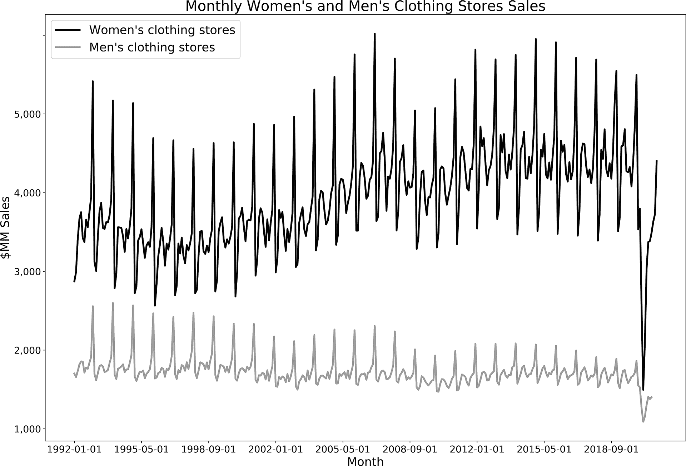

# 第三章：时间序列分析

现在我已经讲解了 SQL 和数据库以及准备数据分析的关键步骤，是时候转向可以使用 SQL 进行的具体分析类型了。世界上似乎有无数的数据集，因此它们可以分析的方式也几乎是无限的。在本章节和接下来的章节中，我将把分析类型组织成主题，希望这些主题能帮助您建立分析和 SQL 技能。许多将要讨论的技术是基于第二章和随着本书进展的前几章展示的技术。数据的时间序列如此普遍且重要，以至于我将从这里开始讨论分析主题系列。

时间序列分析是使用 SQL 进行的最常见的分析类型之一。*时间序列* 是按时间顺序记录的一系列测量或数据点，通常是在定期间隔。日常生活中有许多时间序列数据的例子，如每日最高温度、标准普尔 500 股票指数的收盘价，或者您的健身追踪器记录的每日步数。时间序列分析广泛应用于各行各业，从统计学和工程学到天气预报和业务规划。时间序列分析是理解和量化事物随时间变化的一种方法。

预测是时间序列分析的一个常见目标。由于时间只会向前推进，未来的值可以表示为过去值的函数，反之则不成立。然而，重要的是要注意，过去并不能完美预测未来。任何广泛市场条件、流行趋势、产品推出或其他重大变化的变动都会使预测变得困难。尽管如此，查看历史数据可以带来洞察，并开发一系列合理的结果对计划非常有用。在我撰写本文时，全球正处于一场前所未有的 COVID-19 大流行中，这样的情况已有 100 年未见——早于所有但最长寿的组织历史。因此，许多现有的组织尚未经历过这种特定事件，但它们已经经历了其他经济危机，比如 2001 年的互联网泡沫破裂和 9/11 袭击，以及 2007 年至 2008 年的全球金融危机。通过仔细分析和理解背景，我们通常可以提取有用的见解。

在本章中，我们将首先介绍时间序列分析的 SQL 基本构建块：用于处理日期、时间戳和时间的语法和函数。接下来，我将介绍本章后续示例中使用的零售销售数据集。随后是趋势分析方法的讨论，然后是计算滚动时间窗口。接下来是周期对比计算，用于分析具有季节性成分的数据。最后，我们将介绍一些其他对时间序列分析有用的技术。

# 日期、日期时间和时间操作

日期和时间以多种格式呈现，取决于数据源。我们经常需要或希望转换原始数据格式以便输出，或者执行计算以得出新的日期或日期部分。例如，数据集可能包含交易时间戳，但分析的目标是趋势分析月度销售。其他时候，我们可能想知道自特定事件以来经过了多少天或多少个月。幸运的是，SQL 具有强大的函数和格式化功能，可以将几乎任何原始输入转换为我们分析所需的几乎任何输出。

在这一部分，我将向您展示如何在不同时区之间转换，并深入讨论日期和日期时间的格式化。接下来，我将探讨日期数学和时间操作，包括使用时间间隔的操作。时间间隔是一种数据类型，表示一段时间，如几个月、几天或几小时。虽然数据可以存储在数据库表中作为时间间隔类型，但在实际操作中我很少见到这样做，因此我会在讨论日期和时间函数时同时介绍时间间隔。最后，我将讨论从不同数据源联接或组合数据时的一些特殊考虑因素。

## 时区转换

理解数据集中使用的标准时区可以防止在分析过程的后期出现误解和错误。时区将世界分为观察同一时间的南北地区。时区允许世界上不同地区在白天和黑夜拥有类似的时钟时间，因此无论您身处世界何处，太阳在正午时都会在头顶上。时区遵循不规则的边界，这些边界既有政治性质也有地理性质。大多数时区相隔一小时，但有些只相隔 30 或 45 分钟，全球共有 30 多个时区。许多远离赤道的国家在一年中的部分时间内采用夏令时，但也有例外，如美国和澳大利亚，其中一些州采用夏令时，而其他州则不采用。每个时区都有一个标准缩写，例如太平洋标准时间的 PST 和太平洋夏令时间的 PDT。

许多数据库设置为*协调世界时*（UTC），这是用于调节时钟的全球标准，并在此时区记录事件。它取代了*格林威治标准时间*（GMT），如果您的数据来自旧数据库，您可能仍然会看到 GMT。UTC 没有夏令时，因此整年保持一致。这对分析非常有用。我记得有一次，一位惊慌失措的产品经理让我找出为什么某个特定星期日的销售额与前一个星期日相比下降这么多。我花了几个小时编写查询和调查可能的原因，最终发现我们的数据记录在太平洋时间（PT）中。夏令时在周日凌晨开始，数据库时钟向前移动了 1 小时，这一天只有 23 小时而不是 24 小时，因此销售额似乎下降了。半年后，我们经历了一个对应的 25 小时的日子，销售额看起来异常高。

###### 注意

数据库中的时间戳通常没有编码时区信息，您需要与数据源或开发人员协商以确定数据的存储方式。我见过的数据集中，UTC 已经成为最常见的时间表示方式，但这并不是普遍适用的。

UTC 或任何机器时间记录的一个缺点是，我们丢失了生成数据库记录事件的人类操作的本地时间信息。我可能想知道人们在工作日还是在夜间和周末更频繁地使用我的移动应用。如果我的受众集中在一个时区内，那么弄清楚这一点并不难。但如果受众跨越多个时区或国际范围，那么将每个记录的时间转换为其本地时区就成为一个计算任务。

所有本地时区都有一个 UTC 偏移量。例如，PDT 的偏移量是 UTC - 7 小时，而 PST 的偏移量是 UTC - 8 小时。数据库中的时间戳以 YYYY-MM-DD hh:mi:ss 格式存储（年-月-日 时:分:秒）。带有时区的时间戳有一个额外的信息块，表示为正数或负数的 UTC 偏移量。可以使用 `at time zone` 后跟目标时区的缩写来实现从一个时区到另一个时区的转换。例如，我们可以将 UTC 中的时间戳（偏移量 - 0）转换为 PST：

```
SELECT '2020-09-01 00:00:00 -0' at time zone 'pst';

timezone
-------------------
2020-08-31 16:00:00
```

目标时区名称可以是常量，也可以是数据库字段，从而使此转换对数据集动态可行。一些数据库有类似的 `convert_timezone` 或 `convert_tz` 函数。一个参数是结果的时区，另一个参数是要从中转换的时区：

```
SELECT convert_timezone('pst','2020-09-01 00:00:00 -0');

timezone
-------------------
2020-08-31 16:00:00
```

请查阅您数据库的文档，获取目标时区和源时间戳参数的确切名称和排序方式。许多数据库包含一个时区及其缩写的列表在一个系统表中。一些常见的见于 表 3-1。您可以通过*SELECT * FROM*表名进行查询。维基百科还有一个有用的列表，标准时区缩写和它们的 UTC 偏移量，可以在[这里](https://oreil.ly/im0wi)查看。

表 3-1\. 常见数据库中的时区信息系统表

| PostgreSQL | `pg_timezone_names` |
| --- | --- |
| MySQL | `mysql.time_zone_names` |
| SQL Server | `sys.time_zone_info` |
| Redshift | `pg_timezone_names` |

时区是处理时间戳的固有部分。使用时区转换函数，可以在记录数据的时区和其他任何世界时区之间进行移动。接下来，我将向您展示几种使用 SQL 操作日期和时间戳的技巧。

## 日期和时间戳格式转换

日期和时间戳对于时间序列分析至关重要。由于源数据中日期和时间的表示方式多种多样，几乎不可避免地需要在某些时候进行日期格式转换。在本节中，我将介绍几种常见的转换方式，并演示如何在 SQL 中完成这些操作：改变数据类型、提取日期或时间戳的部分，以及根据部分创建日期或时间戳。首先，我将介绍一些有用的函数，它们可以返回当前日期和/或时间。

返回当前日期或时间是常见的分析任务，例如为结果集包含一个时间戳或在下一节中使用日期数学。当前日期和时间称为*系统时间*，使用 SQL 返回它们很容易，但不同数据库之间存在一些语法差异。

要返回当前日期，一些数据库具有`current_date`函数，无需括号：

```
SELECT current_date;
```

有更多种类的函数用于返回当前日期和时间。请查阅您数据库的文档，或直接在 SQL 窗口中尝试输入以查看函数是否返回值或错误。带有括号的函数不接受参数，但是包括括号是很重要的：

```
current_timestamp
localtimestamp
get_date()
now()
```

最后，有些函数只返回当前系统时间的时间戳部分。再次查阅文档或实验，以确定在您的数据库中使用哪些函数：

```
current_time
localtime
timeofday()
```

SQL 具有许多用于改变日期和时间格式的函数。要减少时间戳的粒度，请使用`date_trunc`函数。第一个参数是指示在第二个参数中截断时间戳的时间段级别的文本值。结果是一个时间戳值：

```
date_trunc (text, timestamp)

SELECT date_trunc('month','2020-10-04 12:33:35'::timestamp);

date_trunc
-------------------
2020-10-01 00:00:00
```

可以使用的标准参数列在表 3-2 中。这些参数的范围从微秒到千年，提供了充分的灵活性。不支持`date_trunc`的数据库（如 MySQL）有一个名为`date_format`的替代函数，可以以类似的方式使用：

```
SELECT date_format('2020-10-04 12:33:35','%Y-%m-01') as date_trunc;

date_trunc
-------------------
2020-10-01 00:00:00
```

表 3-2\. 标准时间段参数

| 时间段参数 |
| --- |
| 微秒 |
| 毫秒 |
| 秒 |
| 分钟 |
| 小时 |
| 天 |
| 周 |
| 月 |
| 季度 |
| 年 |
| 十年 |
| 世纪 |
| 千年 |

有时，我们的分析不是返回日期或时间戳，而是需要返回日期或时间的部分。例如，我们可能希望按月、星期几或每天的小时来分组销售数据。

SQL 提供了一些函数，只返回所需的日期或时间戳部分。日期和时间戳通常是可以互换的，除非请求返回的是时间部分。在这种情况下，当然是需要时间的。

`date_part`函数接受一个文本值来返回指定的部分以及一个日期或时间戳值。返回值是一个 FLOAT，这是一个带有小数部分的数值；根据您的需求，您可能希望将该值转换为整数数据类型：

```
SELECT date_part('day',current_timestamp);
SELECT date_part('month',current_timestamp);
SELECT date_part('hour',current_timestamp);
```

另一个类似的函数是`extract`，它接受一个部分名称和一个日期或时间戳值，并返回一个 FLOAT 值：

```
SELECT extract('day' from current_timestamp);

date_part
---------
27.0

SELECT extract('month' from current_timestamp);

date_part
---------
5.0

SELECT extract('hour' from current_timestamp);

date_part
---------
14.0
```

函数`date_part`和`extract`可以与间隔一起使用，但请注意，请求的部分必须与间隔的单位匹配。因此，例如，从以天表示的间隔中请求天数将返回预期值 30：

```
SELECT date_part('day',interval '30 days');

SELECT extract('day' from interval '30 days');

date_part
---------
30.0
```

但是，从以月表示的间隔中请求天数将返回值 0.0：

```
SELECT extract('day' from interval '3 months');

date_part
---------
0.0
```

###### 注意

您可以在数据库的文档或在线搜索中找到日期部分的完整列表，但一些最常见的包括日期的“day”、“month”和“year”，以及时间戳的“second”、“minute”和“hour”。

要返回日期部分的文本值，请使用`to_char`函数，该函数接受输入值和输出格式作为参数：

```
SELECT to_char(current_timestamp,'Day');
SELECT to_char(current_timestamp,'Month');
```

###### 提示

如果您曾经遇到以 Unix 时间戳存储的时间戳（自 1970 年 1 月 1 日 00:00:00 UTC 以来经过的秒数），您可以使用`to_timestamp`函数将其转换为时间戳。

有时分析需要从不同来源的部分创建日期。当年、月和日的值存储在数据库的不同列中时，就会发生这种情况。当从文本中解析出部分内容时，也可能需要这样做，这是我将在第五章中更深入讨论的一个主题。

从单独的日期和时间组件创建时间戳的简单方法是使用加号（+）将它们连接在一起：

```
SELECT date '2020-09-01' + time '03:00:00' as timestamp;

timestamp 
-------------------
2020-09-01 03:00:00
```

可以使用`make_date`、`makedate`、`date_from_parts`或`datefromparts`函数来组装日期。这些函数等效，但不同的数据库使用不同的函数名称。该函数接受年、月和日部分的参数，并返回具有日期格式的值：

```
SELECT make_date(2020,09,01);

make_date
----------
2020-09-01
```

参数可以是常量或参考字段名，并且必须是整数。组装日期或时间戳的另一种方法是将值连接在一起，然后使用一个转换语法或 `to_date` 函数将结果转换为日期格式：

```
SELECT to_date(concat(2020,'-',09,'-',01), 'yyyy-mm-dd');

to_date
----------
2020-09-01

SELECT cast(concat(2020,'-',09,'-',01) as date);

to_date
----------
2020-09-01
```

SQL 有多种方法可以格式化和转换日期和时间戳，获取系统日期和时间。在下一节中，我将开始在日期数学中应用它们。

## 日期数学

SQL 允许我们对日期执行各种数学运算。这可能令人惊讶，因为严格来说，日期不是数值数据类型，但如果您曾尝试过计算四周后的日期，这个概念应该是熟悉的。日期数学对各种分析任务都很有用。例如，我们可以用它来找出客户的年龄或任职时间，两个事件之间经过了多少时间，以及在时间窗口内发生了多少事件。

日期数学涉及两种类型的数据：日期本身和间隔。我们需要间隔的概念，因为日期和时间组件的行为不像整数。100 的十分之一是 10；一年的十分之一是 36.5 天。100 的一半是 50；一天的一半是 12 小时。间隔允许我们在时间单位之间平滑移动。间隔有两种类型：年-月间隔和日-时间间隔。我们将从返回整数值的几个操作开始，然后转向处理或返回间隔的函数。

首先，让我们找到两个日期之间的天数差。在 SQL 中有几种方法可以实现这一点。第一种方法是使用数学运算符，减号（–）：

```
SELECT date('2020-06-30') - date('2020-05-31') as days;

days
----
30
```

这将返回这两个日期之间的天数。请注意，答案是 30 天而不是 31 天。天数包括了其中一个端点。反向减去日期也可以工作，并返回一个间隔为–30 天：

```
SELECT date('2020-05-31') - date('2020-06-30') as days;

days
----
-30
```

使用 `datediff` 函数也可以找到两个日期之间的差异。Postgres 不支持它，但许多其他流行的数据库支持，包括 SQL Server、Redshift 和 Snowflake，它非常方便，特别是当目标不仅仅是返回天数时。该函数接受三个参数——要返回的时间段单位，起始时间戳或日期，以及结束时间戳或日期：

```
datediff(interval_name, start_timestamp, end_timestamp)
```

因此，我们之前的例子看起来像这样：

```
SELECT datediff('day',date('2020-05-31'), date('2020-06-30')) as days;

days
----
30
```

我们还可以找到两个日期之间的月份数，尽管一年中的月份长度有所不同，数据库会进行正确的计算：

```
SELECT datediff('month'
                ,date('2020-01-01')
                ,date('2020-06-30')
                ) as months;

months
------
5
```

在 Postgres 中，可以使用 `age` 函数来实现这一点，它计算两个日期之间的间隔：

```
SELECT age(date('2020-06-30'),date('2020-01-01'));

age
--------------
5 mons 29 days
```

我们然后可以使用 `date_part()` 函数找到时间间隔的月份组成部分：

```
SELECT date_part('month',age('2020-06-30','2020-01-01')) as months;

months
------
5.0
```

在两个日期之间减去以找到经过的时间是非常强大的。通过添加日期无法以相同的方式工作。要对日期进行加法运算，我们需要利用间隔或特殊函数。

例如，我们可以通过添加间隔`'7 days'`来将七天添加到日期中：

```
SELECT date('2020-06-01') + interval '7 days' as new_date;

new_date
-------------------
2020-06-08 00:00:00
```

一些数据库不需要间隔语法，而是自动将提供的数字转换为天数，尽管通常最好使用间隔表示法，这样既可跨数据库兼容，又能使代码更易读：

```
SELECT date('2020-06-01') + 7 as new_date;

new_date
-------------------
2020-06-08 00:00:00
```

如果要添加不同单位的时间，请使用月份、年份、小时或其他日期或时间段的间隔表示法。请注意，这也可以用于通过使用“-”而不是“+”从日期中减去间隔。许多但不是所有的数据库都有一个`date_add`或`dateadd`函数，该函数接受所需的间隔、值和起始日期，并进行数学计算。

```
SELECT date_add('month',1,'2020-06-01') as new_date;

new_date
----------
2020-07-01
```

###### 提示

请参考数据库的文档，或者尝试查询，以找出适合项目的语法和函数。

以上任何一种表述都可以用于*WHERE*子句，除了*SELECT*子句。例如，我们可以筛选出至少发生在三个月前的记录：

```
WHERE event_date < current_date - interval '3 months'
```

它们也可以用于*JOIN*条件，但请注意，如果*JOIN*条件包含计算而不是日期之间的相等或不等，数据库性能通常会较慢。

在 SQL 分析中使用日期数学是常见的，用于查找日期或时间戳之间经过的时间，并根据已知日期的间隔计算新日期。有几种方法可以找到两个日期之间经过的时间，将间隔添加到日期中，并从日期中减去间隔。接下来，我们将转向类似的时间操作。

## 时间数学

在许多分析领域中，时间数学不常见，但在某些情况下非常有用。例如，我们可能想知道一个支持代表在呼叫中心接听电话或回复请求协助的电子邮件需要多长时间。当两个事件之间的经过时间少于一天，或者将结果舍入到天数不提供足够信息时，时间操作变得重要。时间数学与日期数学类似，通过利用间隔来工作。我们可以将时间间隔添加到时间中：

```
SELECT time '05:00' + interval '3 hours' as new_time;

new_time
--------
08:00:00
```

我们可以从时间中减去间隔：

```
SELECT time '05:00' - interval '3 hours' as new_time;

new_time
--------
02:00:00
```

我们还可以相减时间，得到一个时间间隔：

```
SELECT time '05:00' - time '03:00' as time_diff;

time_diff
---------
02:00:00
```

与日期不同，时间可以相乘：

```
SELECT time '05:00' * 2 as time_multiplied;

time_multiplied
---------------
10:00:00
```

间隔也可以相乘，得到一个时间值：

```
SELECT interval '1 second' * 2000 as interval_multiplied;

interval_multiplied
-------------------
00:33:20

SELECT interval '1 day' * 45 as interval_multiplied;

interval_multiplied
-------------------
45 days
```

这些示例使用了常量值，但你也可以在 SQL 查询中包含数据库字段名称或计算，使计算变得动态。接下来，我将讨论在合并来自不同来源系统的数据集时需要考虑的特殊日期问题。

## 来自不同来源的数据连接

结合不同来源的数据是数据仓库的最具吸引力的应用之一。然而，不同的源系统可能会以不同的格式记录日期和时间，或者以不同的时区记录，甚至可能仅仅因为服务器内部时钟时间的问题而略有差异。即使来自同一数据源的表也可能存在差异，尽管这种情况较少见。在进一步分析之前，调和和标准化日期和时间戳是一个重要的步骤。

可以通过 SQL 来标准化不同格式的日期和时间戳。在日期上进行 *JOIN* 或在 *UNION* 中包含日期字段通常要求日期或时间戳具有相同的格式。在本章前面，我展示了一些处理日期和时间戳格式的技术，这些技术在处理这些问题时非常有用。在合并来自不同来源的数据时要特别注意时区问题。例如，内部数据库可能使用 UTC 时间，但来自第三方的数据可能使用本地时区。我曾看到来自软件即服务（SaaS）的数据记录在各种本地时间中。注意，时间戳的值本身不一定包含时区信息。您可能需要查阅供应商的文档并将数据转换为 UTC 时间，以便与存储在此方式的其他数据对接。另一个选项是在一个字段中存储时区信息，以便根据需要转换时间戳值。

处理来自不同来源的数据时，另一个需要注意的问题是时间戳略微不同步。当时间戳记录来自客户端设备时（例如来自一种数据源的笔记本电脑或移动电话和另一种数据源的服务器），这种情况可能会发生。我曾经看到一系列实验结果被错误计算，因为记录用户操作的客户端移动设备与记录用户分配的处理组的服务器的时间戳相差几分钟。来自移动客户端的数据似乎早于处理组时间戳到达，因此某些事件被无意中排除在外。这类问题的修复相对比较简单：不是过滤操作时间戳大于处理组时间戳的事件，而是允许在处理时间戳之前的一个短时间间隔或时间窗口内的事件包含在结果中。这可以通过 *BETWEEN* 子句和日期计算来实现，正如在最后一节所见。

在处理来自移动应用的数据时，特别注意时间戳是否表示事件在设备上发生的时间*或者*事件到达数据库的时间。这种差异可能从可以忽略不计一直到几天，这取决于移动应用是否允许离线使用以及在低信号强度期间如何处理发送数据。移动应用的数据可能会迟到，或者在设备上发生后数天才会进入数据库。日期和时间戳也可能在传输途中损坏，因此您可能会看到远在过去或未来的不可能的日期。

现在我已经展示了如何通过更改格式、转换时区、执行日期数学运算以及跨不同来源的数据集进行操作，我们已经准备好进入一些时间序列示例。首先，我将介绍本章其余部分示例数据集。

# 零售销售数据集

本章剩余部分的示例使用来自[月度零售贸易报告：零售和食品服务销售：Excel（1992 年至今）](https://www.census.gov/retail/index.html#mrts)的数据集，可在[Census.gov 网站](http://Census.gov)上找到。这份报告中的数据被用作经济指标，以了解美国消费者支出模式的趋势。尽管国内生产总值（GDP）数据每季度发布一次，但这些零售销售数据每月发布一次，因此它也被用来帮助预测 GDP。由于这两个原因，最新的数据通常在发布时被商业新闻报道。

数据跨越从 1992 年到 2020 年，并包括零售销售的子类别的详细信息。它包含未经调整和季节性调整的数字。本章将使用未经调整的数字，因为分析季节性是目标之一。销售数据以美元百万计。原始文件格式为 Excel 文件，每年一个标签，并以月份为列。[这本书的 GitHub 站点](https://oreil.ly/LMiHw)提供了一种更容易导入数据库的数据格式，以及专门用于导入到 Postgres 的代码。图 3-1 展示了`retail_sales`表的样本。


###### 图 3-1\. 美国零售销售数据集预览

# 数据趋势

对于时间序列数据，我们通常希望查找数据的趋势。趋势只是数据移动的方向。它可能随时间上升或增加，也可能随时间下降或减少。它可能保持相对平坦，或者可能有很多噪声或上下波动，以至于很难确定趋势。本节将介绍几种用于趋势时间序列数据的技术，从简单趋势图到比较趋势组件，使用百分比总计来比较部分和整体，最后使用指数计算来查看与参考时间段的百分比变化。

## 简单趋势

创建趋势可能是描述和理解数据的步骤，也可能是最终的输出。结果集是一系列日期或时间戳和一个数值。在图示时间序列时，日期或时间戳将成为 x 轴，数值将成为 y 轴。例如，我们可以检查美国总零售和食品服务销售的趋势：

```
SELECT sales_month
,sales
FROM retail_sales
WHERE kind_of_business = 'Retail and food services sales, total'
;

sales_month  sales
-----------  ------
1992-01-01   146376
1992-02-01   147079
1992-03-01   159336
...          ...
```

结果在 图 3-2 中进行了图示。


###### 图 3-2\. 月度零售和食品服务销售趋势

这些数据显然有一些模式，但也有一些噪音。将数据转换并在年度水平进行汇总可以帮助我们更好地理解。首先，我们将使用 `date_part` 函数从 `sales_month` 字段中返回年份，然后对 `sales` 进行求和。结果在 *WHERE* 子句中筛选为“总体零售和食品服务销售”。

```
SELECT date_part('year',sales_month) as sales_year   
,sum(sales) as sales
FROM retail_sales
WHERE kind_of_business = 'Retail and food services sales, total'
GROUP BY 1
;

sales_year  sales
----------  -------
1992.0      2014102
1993.0      2153095
1994.0      2330235
...         ...
```

在像 图 3-3 中展示这些数据之后，我们现在有一个随时间逐渐增长的更平滑的时间序列，这是可以预期的，因为销售值没有进行通货膨胀调整。所有零售和食品服务的销售在全球金融危机期间的 2009 年下降。在整个 2010 年代的每年增长之后，由于 COVID-19 大流行的影响，2020 年的销售与 2019 年相比保持平稳。


###### 图 3-3\. 年度总零售和食品服务销售趋势

在不同级别（如每周、每月或每年）图示时间序列数据是了解趋势的好方法。此步骤可用于简单地描述数据，但也可以是最终输出，具体取决于分析的目标。接下来，我们将转向使用 SQL 来比较时间序列的组成部分。

## 比较各个组成部分

数据集通常不仅包含单一时间序列，还包含多个切片或总体的组成部分。比较这些切片通常会显示出有趣的模式。在零售销售数据集中，不仅有总销售额的数值，还有许多子类别。让我们比较与休闲活动相关的几个类别的年度销售趋势：书店、运动用品店和爱好店。此查询在*SELECT*子句中添加了`kind_of_business`，并且由于它是另一个属性而不是聚合，还将其添加到*GROUP BY*子句中。

```
SELECT date_part('year',sales_month) as sales_year
,kind_of_business
,sum(sales) as sales
FROM retail_sales
WHERE kind_of_business in ('Book stores'
 ,'Sporting goods stores','Hobby, toy, and game stores')
GROUP BY 1,2
;

sales_year  kind_of_business             sales
----------  ---------------------------  -----
1992.0      Book stores                  8327
1992.0      Hobby, toy, and game stores  11251
1992.0      Sporting goods stores        15583
...         ...                          ...
```

结果显示在图 3-4 中。运动用品零售商的销售在三类别中起始最高，并在时间段内增长迅速，到时间序列结束时，这些销售额显著更高。运动用品店的销售从 2017 年开始下降，但在 2020 年有了大幅反弹。玩具和游戏店的销售在此期间相对稳定，中期有轻微下降，2020 年前有另一轻微下降后又反弹。书店的销售在 2000 年代中期之前一直增长，此后一直在下降。所有这些类别都受到在线零售商的影响，但时间和影响程度似乎不同。


###### 图 3-4\. 运动用品店，玩具和游戏店以及书店的年度零售销售趋势

除了简单的趋势分析外，我们可能还希望在时间序列的各个部分之间进行更复杂的比较。在接下来的几个例子中，我们将分析女装店和男装店的销售情况。请注意，由于名称中包含撇号，这是字符串开头和结尾的指示字符，我们需要用额外的撇号对其进行转义。这样数据库才能知道撇号是字符串的一部分而不是结尾。尽管我们可能考虑在数据加载管道中添加一个步骤，以删除名称中的额外撇号，但我已将其保留在这里，以展示现实世界中通常需要进行的代码调整类型。首先，我们将按月份趋势显示每种类型商店的数据：

```
SELECT sales_month
,kind_of_business
,sales
FROM retail_sales
WHERE kind_of_business in ('Men''s clothing stores'
 ,'Women''s clothing stores')
;

sales_month  kind_of_business         sales
-----------  -----------------------  -----
1992-01-01   Men's clothing stores    701
1992-01-01   Women's clothing stores  1873
1992-02-01   Women's clothing stores  1991
...          ...                      ...
```

结果显示在图 3-5 中。女装零售商的销售额远高于男装零售商。这两种类型的商店都表现出季节性，这是我将在“分析季节性”中深入讨论的一个主题。由于 2020 年的店铺关闭和 COVID-19 大流行导致购物减少，两者在 2020 年经历了显著下降。



###### 图 3-5\. 女装和男装店销售的月度趋势

月度数据显示出有趣的模式，但也有噪音，因此在接下来的几个示例中我们将使用年度聚合数据。我们之前见过这种查询格式，用于汇总总销售额和休闲类别的销售：

```
SELECT date_part('year',sales_month) as sales_year
,kind_of_business
,sum(sales) as sales
FROM retail_sales
WHERE kind_of_business in ('Men''s clothing stores'
 ,'Women''s clothing stores')
GROUP BY 1,2
;
```

女装店铺的销售额是否一直高于男装店铺？如图 Figure 3-6 所示的年度趋势，男装和女装的销售差距似乎并不是恒定的，而是在 2000 年代初期到中期逐渐扩大。尤其是在 2008 年至 2009 年的全球金融危机期间，女装销售量明显下降，而 2020 年的疫情期间两个类别的销售都大幅下降。


###### 图 3-6\. 女装和男装店铺销售的年度趋势

然而，我们不需要依赖视觉估计。为了更精确地了解这一差距，我们可以计算两个类别之间的差距、比率以及百分比差异。为此，第一步是调整数据，使每个月份都有一行数据，每个类别都有一个列。使用聚合函数结合 CASE 语句来逆转数据可以实现这一点：

```
SELECT date_part('year',sales_month) as sales_year
,sum(case when kind_of_business = 'Women''s clothing stores' 
          then sales 
          end) as womens_sales
,sum(case when kind_of_business = 'Men''s clothing stores' 
          then sales 
          end) as mens_sales
FROM retail_sales
WHERE kind_of_business in ('Men''s clothing stores'
 ,'Women''s clothing stores')
GROUP BY 1
;

sales_year  womens_sales  mens_sales
----------  ------------  ----------
1992.0      31815         10179
1993.0      32350         9962
1994.0      30585         10032
...         ...           ...
```

利用这个基础计算模块，我们可以找到数据集中时间序列之间的差异、比率和百分比差异。差异可以通过数学运算符“-”相减来计算。根据分析的目标，从男装销售额或女装销售额中找到差异可能都是合适的。这里展示了两者的等价性，除了符号的不同：

```
SELECT sales_year
,womens_sales - mens_sales as womens_minus_mens
,mens_sales - womens_sales as mens_minus_womens
FROM
(
    SELECT date_part('year',sales_month) as sales_year
    ,sum(case when kind_of_business = 'Women''s clothing stores' 
              then sales 
              end) as womens_sales
    ,sum(case when kind_of_business = 'Men''s clothing stores' 
              then sales 
              end) as mens_sales
    FROM retail_sales
    WHERE kind_of_business in ('Men''s clothing stores'
     ,'Women''s clothing stores')
    and sales_month <= '2019-12-01'
    GROUP BY 1
) a
;

sales_year  womens_minus_mens  mens_minus_womens
----------  -----------------  -----------------
1992.0      21636              -21636
1993.0      22388              -22388
1994.0      20553              -20553
...         ...                ...
```

从查询执行的角度来看，子查询并不是必需的，因为可以将聚合函数添加到或从彼此中减去。子查询通常更易读，但会增加代码的行数。根据 SQL 查询的长度或复杂性，您可能更喜欢将中间计算放在子查询中，或者直接在主查询中计算。这是一个没有子查询的示例，从女装销售中减去男装销售，并增加了一个*WHERE*子句过滤器，以移除 2020 年的空值月份：¹

```
SELECT date_part('year',sales_month) as sales_year
,sum(case when kind_of_business = 'Women''s clothing stores' 
          then sales end) 
 - 
 sum(case when kind_of_business = 'Men''s clothing stores' 
          then sales end)
 as womens_minus_mens
FROM retail_sales
WHERE kind_of_business in ('Men''s clothing stores'
 ,'Women''s clothing stores')
and sales_month <= '2019-12-01'
GROUP BY 1
;

sales_year  womens_minus_mens
----------  -----------------
1992.0      21636
1993.0      22388
1994.0      20553
...         ...
```

图 3-7\. 女装和男装店铺销售差异的年度变化


###### 图 3-7\. 女装和男装店铺销售差异的年度变化

让我们继续调查并观察这些类别之间的比率。我们将使用男装销售作为基线或分母，但请注意我们也可以轻松地使用女装店铺销售：

```
SELECT sales_year
,womens_sales / mens_sales as womens_times_of_mens
FROM
(
    SELECT date_part('year',sales_month) as sales_year
    ,sum(case when kind_of_business = 'Women''s clothing stores' 
              then sales 
              end) as womens_sales
    ,sum(case when kind_of_business = 'Men''s clothing stores' 
              then sales 
              end) as mens_sales
    FROM retail_sales
    WHERE kind_of_business in ('Men''s clothing stores'
     ,'Women''s clothing stores')
    and sales_month <= '2019-12-01'
    GROUP BY 1
) a
;

sales_year  womens_times_of_mens
----------  --------------------
1992.0      3.1255526083112290
1993.0      3.2473398915880345
1994.0      3.0487440191387560
...         ...
```

###### 提示

在进行除法运算时，SQL 返回大量小数位。在呈现分析结果之前，通常考虑对结果进行四舍五入处理。使用合适的精度（小数位数）来讲述故事。

绘制结果，如图 3-8 所示，显示出趋势与差异趋势相似，但在 2009 年差异减少时，比率实际上增加了。


###### 图 3-8\. 每年女装销售与男装销售的比率

接下来，我们可以计算女装店和男装店销售之间的百分比差异：

```
SELECT sales_year
,(womens_sales / mens_sales - 1) * 100 as womens_pct_of_mens
FROM
(
    SELECT date_part('year',sales_month) as sales_year
    ,sum(case when kind_of_business = 'Women''s clothing stores' 
              then sales 
              end) as womens_sales
    ,sum(case when kind_of_business = 'Men''s clothing stores' 
              then sales 
              end) as mens_sales
    FROM retail_sales
    WHERE kind_of_business in ('Men''s clothing stores'
     ,'Women''s clothing stores')
    and sales_month <= '2019-12-01'
    GROUP BY 1
) a
;

sales_year  womens_pct_of_mens
----------  --------------------
1992.0      212.5552608311229000
1993.0      224.7339891588034500
1994.0      204.8744019138756000
...         ...
```

尽管此输出的单位与前面示例中的单位不同，但此图的形状与比率图相同。选择使用哪种取决于您的受众和您领域的规范。所有这些声明都是准确的：在 2009 年，女装店的销售比男装店高 287 亿美元；在 2009 年，女装店的销售是男装店销售的 4.9 倍；在 2009 年，女装店的销售比男装店销售高 390%。选择哪个版本取决于您希望通过分析讲述的故事。

本节中所见的转换允许我们通过比较相关部分来分析时间序列。下一节将继续通过展示如何分析代表整体部分的系列来比较时间序列。

## 百分比总计算

当处理具有多个部分或属性构成整体的时间序列数据时，通常有必要分析每个部分对整体的贡献以及这种贡献是否随时间变化。除非数据已经包含总值的时间序列，否则我们需要计算总体总值，以便计算每行的总百分比。这可以通过自我-*JOIN*或窗口函数来实现，正如我们在第二章中所见，窗口函数是一种特殊的 SQL 函数，可以引用表中指定分区内的任何行。

首先我将展示自我-*JOIN*方法。自我-*JOIN*是指表与自身连接的任何时刻。只要查询中表的每个实例都被赋予不同的别名，数据库将把它们都视为不同的表。例如，为了找出每个系列表示的男装和女装总销售的百分比，我们可以将`retail_sales`作为`a`别名与`retail_sales`作为`b`别名进行*JOIN*，并在`sales_month`字段上。然后从别名`a`中*SELECT*出单个系列名称（`kind_of_business`）和`sales`值。然后，从别名`b`中对两个类别的销售求和，并将结果命名为`total_sales`。请注意，表之间在`sales_month`字段上的*JOIN*创建了部分笛卡尔*JOIN*，导致别名`a`的每一行对应别名`b`的两行。通过按`a.sales_month`、`a.kind_of_business`和`a.sales`进行分组，并对`b.sales`进行聚合，确切返回所需的结果。在外部查询中，每行的百分比总数通过将`sales`除以`total_sales`来计算：

```
SELECT sales_month
,kind_of_business
,sales * 100 / total_sales as pct_total_sales
FROM
(
    SELECT a.sales_month, a.kind_of_business, a.sales
    ,sum(b.sales) as total_sales
    FROM retail_sales a
    JOIN retail_sales b on a.sales_month = b.sales_month
    and b.kind_of_business in ('Men''s clothing stores'
     ,'Women''s clothing stores')
    WHERE a.kind_of_business in ('Men''s clothing stores'
     ,'Women''s clothing stores')
    GROUP BY 1,2,3
) aa
;

sales_month  kind_of_business         pct_total_sales
-----------  -----------------------  -------------------
1992-01-01   Men's clothing stores    27.2338772338772339
1992-01-01   Women's clothing stores  72.7661227661227661
1992-02-01   Men's clothing stores    24.8395620989052473
...          ...                      ...
```

在这里并不需要子查询，因为可以在没有它的情况下获得相同的结果，但是它使代码稍微容易理解一些。另一种计算每个类别总销售额百分比的方法是使用`sum`窗口函数并按`sales_month`进行*PARTITION BY*。请记住，*PARTITION BY*子句指示函数应计算的表中的部分。在这种`sum`窗口函数中不需要*ORDER BY*子句，因为计算的顺序并不重要。此外，查询不需要*GROUP BY*子句，因为窗口函数跨多行查看数据，但它们不会减少结果集中的行数：

```
SELECT sales_month, kind_of_business, sales
,sum(sales) over (partition by sales_month) as total_sales
,sales * 100 / sum(sales) over (partition by sales_month) as pct_total
FROM retail_sales 
WHERE kind_of_business in ('Men''s clothing stores'
 ,'Women''s clothing stores')
;

sales_month  kind_of_business         sales  total_sales  pct_total
-----------  -----------------------  -----  -----------  ---------
1992-01-01   Men's clothing stores    701    2574         27.233877
1992-01-01   Women's clothing stores  1873   2574         72.766122
1992-02-01   Women's clothing stores  1991   2649         75.160437
...          ...                      ...    ...          ...
```

图表化这些数据，如图 3-9，显示了一些有趣的趋势。首先，从 20 世纪 90 年代末开始，女装店销售额占总销售额的比例逐渐增加。其次，在系列初期可以看到明显的季节性模式，其中男装在 12 月和 1 月的销售额作为总销售额的百分比出现了峰值。在 21 世纪的第一个十年中，出现了两个季节性高峰，分别是夏季和冬季，但到 2010 年代末，季节性模式几乎消失，几乎变得随机。我们将在本章后面更深入地分析季节性。


###### 图 3-9\. 男装和女装店销售额占月度总额的百分比

另一个我们可能想要找到的百分比是在较长时间段内的销售额百分比，例如每个月占年度销售额的百分比。在这种情况下，可以使用自连接（self-*JOIN*）或窗口函数来完成。在这个例子中，我们将在子查询中使用自连接（self-*JOIN*）：

```
SELECT sales_month
,kind_of_business
,sales * 100 / yearly_sales as pct_yearly
FROM
(
    SELECT a.sales_month, a.kind_of_business, a.sales
    ,sum(b.sales) as yearly_sales
    FROM retail_sales a
    JOIN retail_sales b on 
     date_part('year',a.sales_month) = date_part('year',b.sales_month)
     and a.kind_of_business = b.kind_of_business
     and b.kind_of_business in ('Men''s clothing stores'
      ,'Women''s clothing stores')
    WHERE a.kind_of_business in ('Men''s clothing stores'
     ,'Women''s clothing stores')
    GROUP BY 1,2,3
) aa
;

sales_month  kind_of_business       pct_yearly
-----------  ---------------------  ------------------
1992-01-01   Men's clothing stores  6.8867275763827488
1992-02-01   Men's clothing stores  6.4642892229099126
1992-03-01   Men's clothing stores  7.1814520090382159
...          ...                    ...
```

或者，可以使用窗口函数方法：

```
SELECT sales_month, kind_of_business, sales
,sum(sales) over (partition by date_part('year',sales_month)
                               ,kind_of_business
                               ) as yearly_sales
,sales * 100 / 
 sum(sales) over (partition by date_part('year',sales_month)
                               ,kind_of_business
                               ) as pct_yearly
FROM retail_sales 
WHERE kind_of_business in ('Men''s clothing stores'
 ,'Women''s clothing stores')
;

sales_month  kind_of_business       pct_yearly
-----------  ---------------------  ------------------
1992-01-01   Men's clothing stores  6.8867275763827488
1992-02-01   Men's clothing stores  6.4642892229099126
1992-03-01   Men's clothing stores  7.1814520090382159
...          ...                    ...
```

缩小至 2019 年的结果如图 3-10 所示。这两个时间序列基本上是紧密跟踪的，但男装店在 1 月的销售额比女装店更高。男装店在 7 月有一个夏季低谷，而女装店的对应低谷则直到 9 月才出现。


###### 图 3-10\. 2019 年女装和男装销售额占年度销售额的百分比

现在我已经展示了如何使用 SQL 进行总计百分比的计算以及可以完成的分析类型，接下来我将转向索引和计算随时间变化的百分比变化。

## 索引以查看随时间变化的百分比变化

时间序列中的值通常随时间波动。销售随产品的流行度和可用性增长而增加，而网页响应时间则随工程师优化代码的努力而减少。索引数据是理解时间序列相对于基期（起始点）变化的一种方式。指数在经济学以及商业环境中被广泛使用。最著名的指数之一是消费者价格指数（CPI），它跟踪典型消费者购买的物品价格变化，并用于跟踪通货膨胀、决定工资增长等多种应用。CPI 是一个复杂的统计指标，使用各种权重和数据输入，但其基本原理很简单。选择一个基期，并计算从该基期开始每个后续期间的值的百分比变化。

使用 SQL 索引时间序列数据可以通过聚合和窗口函数，或者自连接来完成。例如，我们将女装店销售与系列的第一年 1992 年索引。第一步是在子查询中按`sales_year`聚合`sales`，正如我们之前所做的那样。在外部查询中，`first_value`窗口函数根据*ORDER BY*子句中的排序，在*PARTITION BY*子句中找到与第一行关联的值。在这个例子中，我们可以省略*PARTITION BY*子句，因为我们想要返回由子查询返回的整个数据集中的第一行的销售`value`：

```
SELECT sales_year, sales
,first_value(sales) over (order by sales_year) as index_sales
FROM
(
    SELECT date_part('year',sales_month) as sales_year
    ,sum(sales) as sales
    FROM retail_sales
    WHERE kind_of_business = 'Women''s clothing stores'
    GROUP BY 1
) a
;

sales_year  sales  index_sales
----------  -----  -----------
1992.0      31815  31815
1993.0      32350  31815
1994.0      30585  31815
...         ...    ...
```

通过这个数据样本，我们可以直观地验证索引值是否正确地设置在 1992 年的值上。接下来，找到每一行相对于这个基准年的百分比变化：

```
SELECT sales_year, sales
,(sales / first_value(sales) over (order by sales_year) - 1) * 100 
 as pct_from_index
FROM
(
    SELECT date_part('year',sales_month) as sales_year
    ,sum(sales) as sales
    FROM retail_sales
    WHERE kind_of_business = 'Women''s clothing stores'
    GROUP BY 1
) a
;

sales_year  sales  pct_from_index
----------  -----  --------------
1992.0      31815  0
1993.0      32350  1.681596731101
1994.0      30585  -3.86610089580
...         ...    ...
```

百分比变化可以是正数也可以是负数，我们将看到这种情况确实发生在这个时间序列中。在此查询中，可以用`first_value`替换`last_value`窗口函数。从系列的最后一个值开始索引远不常见，然而，由于分析问题更经常与从一个任意结束点向后查看有关，而不是从一个起始点开始，这种选择仍然存在。另外，排序顺序可以用来实现从第一个或最后一个值进行索引，通过在*ASC*和*DESC*之间切换：

```
first_value(sales) over (order by sales_year desc)
```

窗口函数提供了很大的灵活性。可以通过一系列自连接来完成索引，尽管需要更多的代码行数：

```
SELECT sales_year, sales
,(sales / index_sales - 1) * 100 as pct_from_index
FROM
(
    SELECT date_part('year',aa.sales_month) as sales_year
    ,bb.index_sales
    ,sum(aa.sales) as sales
    FROM retail_sales aa
    JOIN 
    (
        SELECT first_year, sum(a.sales) as index_sales
        FROM retail_sales a
        JOIN 
        (
            SELECT min(date_part('year',sales_month)) as first_year
            FROM retail_sales
            WHERE kind_of_business = 'Women''s clothing stores'
        ) b on date_part('year',a.sales_month) = b.first_year 
        WHERE a.kind_of_business = 'Women''s clothing stores'
        GROUP BY 1
    ) bb on 1 = 1
    WHERE aa.kind_of_business = 'Women''s clothing stores'
    GROUP BY 1,2
) aaa
;

sales_year  sales  pct_from_index
----------  -----  --------------
1992.0      31815  0
1993.0      32350  1.681596731101
1994.0      30585  -3.86610089580
...         ...    ...
```

注意到在别名`aa`和子查询`bb`之间的不寻常的*JOIN*子句`on 1 = 1`。由于我们希望`index_sales`值填充结果集中的每一行，我们不能根据年份或任何其他值进行*JOIN*，因为这将限制结果。然而，如果未指定*JOIN*子句，数据库将返回错误。我们可以通过使用任何计算结果为 TRUE 的表达式来愚弄数据库，以创建所需的笛卡尔*JOIN*。任何其他 TRUE 语句，比如`on 2 = 2`或`on 'apples' = 'apples'`，都可以使用。

###### 警告

在最后一个示例中，例如 `sales / index_sales`，请注意分母中的零。当数据库遇到除以零时，会返回错误，这可能很令人沮丧。即使你认为分母字段中的零不太可能出现，也最好通过告诉数据库在遇到零时返回备用默认值的方式来预防这种情况。可以通过 CASE 语句实现这一点。本节的示例中分母没有零，为了可读性，我将省略额外的代码。

最后，让我们看一下男装店和女装店索引时间序列的图表，如图 3-11 所示。SQL 代码如下：

```
SELECT sales_year, kind_of_business, sales
,(sales / first_value(sales) over (partition by kind_of_business 
                                   order by sales_year)
 - 1) * 100 as pct_from_index
FROM
(
    SELECT date_part('year',sales_month) as sales_year
    ,kind_of_business
    ,sum(sales) as sales
    FROM retail_sales
    WHERE kind_of_business in ('Men''s clothing stores'
     ,'Women''s clothing stores')
    and sales_month <= '2019-12-31'
    GROUP BY 1,2
) a
;
```


###### 图 3-11。男装店和女装店销售，以 1992 年的销售为基准

从这张图表可以明显看出，1992 年对于男装店的销售来说是一个高点。1992 年后销售下降，然后在 1998 年短暂回到同一水平，此后一直在下降。这一点很显著，因为数据集没有调整为不考虑通货膨胀，即随着时间推移价格上涨的趋势。女装店的销售从 1992 年开始也有所下降，但到了 2003 年又回到了 1992 年的水平。此后销售有所增加，除了 2009 年和 2010 年金融危机期间的销售下降。这些趋势的一个解释可能是，随着时间推移，男性简单地减少了对服装的支出，相对于女性来说可能对时尚不那么关注。也许男装变得更便宜，因为全球供应链降低了成本。还有一个解释可能是，男性将他们的服装购买从分类为“男装店”的零售商转移到了其他类型的零售商，如体育用品店或在线零售商。

将时间序列数据进行索引是一种强大的分析技术，可以让我们从数据中发现各种见解。SQL 非常适合这项任务，我已经展示了如何使用窗口函数和不使用窗口函数来构建索引时间序列。接下来，我将展示如何通过使用滚动时间窗口来分析数据，以便在嘈杂的时间序列中找到模式。

# 滚动时间窗口

时间序列数据通常噪声较大，这是我们寻找模式的主要目标之一的挑战。我们已经看到，聚合数据（例如从月度到年度）可以平滑结果并使其更易于解释。另一种平滑数据的技术是 *滚动时间窗口*，也称为移动计算，它考虑了多个周期。移动平均值可能是最常见的，但是通过 SQL 的强大功能，任何聚合函数都可以用于分析。滚动时间窗口在各种分析领域广泛应用，包括股票市场、宏观经济趋势和受众测量。一些计算如此常见，以至于它们有自己的首字母缩写：过去十二个月（LTM）、滚动十二个月（TTM）和年初至今（YTD）。

图 3-12 显示了一个滚动时间窗口和累计计算的示例，相对于时间序列中的十月份。


###### 图 3-12\. LTM 和 YTD 销售总和的示例

任何滚动时间序列计算的几个重要部分。首先是窗口的大小，即计算中包含的时间周期数。较大的窗口具有更大的平滑效果，但有可能失去对数据重要短期变化的敏感性。较短的窗口具有较少的平滑效果，因此对短期变化更为敏感，但可能无法有效减少噪声。

时间序列计算的第二部分是所使用的聚合函数。正如前面提到的，移动平均值可能是最常见的。还可以使用 SQL 计算移动总和、计数、最小值和最大值。移动计数在用户群体指标中非常有用（请参见以下侧边栏）。移动最小值和最大值有助于理解数据的极端值，这对于计划分析非常有用。

时间序列计算的第三部分是选择包含在窗口中的数据的分区或分组。分析可能需要每年重置窗口。或者分析可能需要每个组件或用户组的不同移动系列。第四章 将更详细地讨论用户组的队列分析，我们将考虑如何随着时间推移，留存和支出等累计值在不同人群之间的差异。分区将通过分组以及窗口函数的 *PARTITION BY* 语句来控制。

记住这三个部分后，我们将进入移动时间周期的 SQL 代码和计算，继续使用美国零售销售数据集作为示例。

## 计算滚动时间窗口

现在我们知道滚动时间窗口是什么，它们如何有用以及它们的关键组成部分，让我们开始使用美国零售销售数据集计算它们。我们将从较简单的情况开始，即数据集包含应在窗口中的每个期间的记录，然后在下一节中我们将看看当情况不是这样时该怎么做。

有两种主要方法来计算滚动时间窗口：自连接，可以在任何数据库中使用；窗口函数，在某些数据库中不可用，正如我们所见的那样。在这两种情况下，我们需要相同的结果：一个日期和与窗口大小相对应的数据点数量，我们将对其应用平均值或其他聚合函数。

为了本示例，我们将使用一个 12 个月的窗口来获取滚动年度销售额，因为数据以月为单位。然后，我们将应用平均值来获取 12 个月的移动平均零售销售额。首先，让我们开发出对计算所需的直觉。在此查询中，表的别名`a`是我们的“锚”表，从中收集日期。首先，我们将查看单个月份，2019 年 12 月。从别名`b`，查询收集将用于移动平均的 12 个单独月份的销售额。这是通过`JOIN`子句`b.sales_month between a.sales_month - interval '11 months' and a.sales_month`完成的，它创建了一个有意的笛卡尔`JOIN`：

```
SELECT a.sales_month
,a.sales
,b.sales_month as rolling_sales_month
,b.sales as rolling_sales
FROM retail_sales a
JOIN retail_sales b on a.kind_of_business = b.kind_of_business 
 and b.sales_month between a.sales_month - interval '11 months' 
 and a.sales_month
 and b.kind_of_business = 'Women''s clothing stores'
WHERE a.kind_of_business = 'Women''s clothing stores'
and a.sales_month = '2019-12-01'
;

sales_month  sales  rolling_sales_month  rolling_sales
-----------  -----  -------------------  -------------
2019-12-01   4496   2019-01-01           2511
2019-12-01   4496   2019-02-01           2680
2019-12-01   4496   2019-03-01           3585
2019-12-01   4496   2019-04-01           3604
2019-12-01   4496   2019-05-01           3807
2019-12-01   4496   2019-06-01           3272
2019-12-01   4496   2019-07-01           3261
2019-12-01   4496   2019-08-01           3325
2019-12-01   4496   2019-09-01           3080
2019-12-01   4496   2019-10-01           3390
2019-12-01   4496   2019-11-01           3850
2019-12-01   4496   2019-12-01           4496
```

注意，别名为`a`的`sales_month`和`sales`数据在窗口的每个月份行中都会重复出现。

###### 警告

请记住，`BETWEEN`子句中的日期是包含的（结果集中将返回两者）。在前述查询中使用 12 而不是 11 是一个常见错误。当有疑问时，请像我在这里所做的那样检查中间查询结果，以确保期望的时间段数量包含在窗口计算中。

下一步是应用聚合函数——在这种情况下是`avg`，因为我们想要一个滚动平均值。返回自别名`b`的记录数量包括在内，以确认每行平均包含 12 个数据点，这是一个有用的数据质量检查。别名`a`还对`sales_month`进行了过滤。由于这个数据集始于 1992 年，该年的月份，除了 12 月外，都有少于 12 个历史记录：

```
SELECT a.sales_month
,a.sales
,avg(b.sales) as moving_avg
,count(b.sales) as records_count
FROM retail_sales a
JOIN retail_sales b on a.kind_of_business = b.kind_of_business 
 and b.sales_month between a.sales_month - interval '11 months' 
 and a.sales_month
 and b.kind_of_business = 'Women''s clothing stores'
WHERE a.kind_of_business = 'Women''s clothing stores'
and a.sales_month >= '1993-01-01'
GROUP BY 1,2
;

sales_month  sales  moving_avg  records_count
-----------  -----  ----------  -------------
1993-01-01   2123   2672.08     12
1993-02-01   2005   2673.25     12
1993-03-01   2442   2676.50     12
...          ...    ...         ...
```

结果在图 3-13 中显示。虽然每月趋势有噪音，但平滑的移动平均趋势使得识别变化更加容易，比如从 2003 年到 2007 年的增长以及随后到 2011 年的下降。请注意，2020 年初的极端下降在销售后来年反弹之后仍然将移动平均值拉低。


###### 图 3-13\. 女装店每月销售额和 12 个月移动平均销售额

###### 提示

向每个别名添加过滤器`kind_of_business = 'Women''s clothing stores'`并非绝对必要。由于查询使用*INNER JOIN*，在一张表上进行过滤将自动过滤另一张表。然而，在两张表上同时过滤通常会使查询速度更快，特别是当表很大时。

窗口函数是计算滚动时间窗口的另一种方式。要创建滚动窗口，我们需要使用窗口计算的另一个可选部分：*frame clause*。*frame clause*允许您指定要包含在窗口中的记录。默认情况下，包括分区中的所有记录，在许多情况下这都很好用。然而，在更细粒度地控制包含的记录对于像移动窗口计算这样的情况很有用。语法简单，但初次遇到时可能会有些困惑。*frame clause*可以指定为：

```
{ RANGE | ROWS | GROUPS } BETWEEN frame_start AND frame_end
```

大括号中有三种框架类型选项：range、rows 和 groups。这些是您可以指定要包含在结果中的记录的方式，相对于当前行。记录始终从当前分区中选择，并按指定的*ORDER BY*排序。默认排序为升序（*ASC*），但可以更改为降序（*DESC*）。*Rows*是最简单的，允许您指定应返回的确切行数。*Range*包括在与当前行相对值的某些边界内的记录。*Groups*可用于当数据集包含每个销售月份的多行时，例如每个客户一行。

*frame_start*和*frame_end*可以是以下任何一种：

```
UNBOUNDED PRECEDING
offset PRECEDING
CURRENT ROW
offset FOLLOWING
UNBOUNDED FOLLOWING
```

*Preceding*表示包括当前行之前的行，根据*ORDER BY*排序。*Current row*就是当前行，*Following*表示包括当前行之后的行，根据*ORDER BY*排序。*UNBOUNDED*关键字表示在当前行之前或之后包括分区中的所有记录。*Offset*是记录的数量，通常只是一个整数常数，虽然也可以使用返回整数的字段或表达式。*frame clause*还具有一个可选的*frame_exclusion*选项，在此处讨论范围之外。图 3-14 展示了每个窗口帧选项将选取的行的示例。


###### 图 3-14\. 窗口帧子句及其包含的行

从分区到排序再到窗口帧，窗口函数具有多种选项来控制计算，使其非常强大且适合用相对简单的语法处理复杂的计算。回到我们的零售销售示例，使用自身*JOIN*计算的移动平均数可以在少量代码中通过窗口函数实现：

```
SELECT sales_month
,avg(sales) over (order by sales_month 
                  rows between 11 preceding and current row
                  ) as moving_avg
,count(sales) over (order by sales_month 
                  rows between 11 preceding and current row
                  ) as records_count
FROM retail_sales
WHERE kind_of_business = 'Women''s clothing stores'
;

sales_month  moving_avg  records_count
-----------  ----------  -------------
1992-01-01   1873.00     1
1992-02-01   1932.00     2
1992-03-01   2089.00     3
...          ...         ...
1993-01-01   2672.08     12
1993-02-01   2673.25     12
1993-03-01   2676.50     12
...          ...         ...
```

在此查询中，窗口按月份（升序）排序，以确保窗口记录按时间顺序排列。帧子句为`rows between 11 preceding and current row`，因为我知道每个月都有一条记录，我希望包括前 11 个月和当前行的月份在平均值和计数计算中。查询返回所有月份，包括那些没有 11 个先前月份的月份，我们可能希望通过将此查询置于子查询中并在外部查询中按月份或记录数进行过滤来过滤这些记录。

###### 提示

尽管在许多商业背景下从先前时间段计算移动平均值很常见，SQL 窗口函数足够灵活，可以包括未来时间段。它们也可以用于任何数据具有某种排序的场景，不仅限于时间序列分析。

计算滚动平均值或其他移动聚合可以通过自身*连接*或窗口函数来实现，当数据集中存在每个时间段内的记录时。根据数据库类型和数据集大小，这两种方法可能会有性能差异。不幸的是，很难预测哪一种方法会更有效，或者给出关于使用哪种方法的一般建议。值得尝试两种方法，并注意返回查询结果所需的时间；然后选择运行更快的方法作为默认选择。现在我们已经看到了如何计算滚动时间窗口，接下来我将展示如何在稀疏数据集中计算滚动窗口。

## 稀疏数据的滚动时间窗口

现实世界中的数据集可能不包含在窗口内的每个时间段的记录。感兴趣的测量可能是季节性的或自然间歇性的。例如，顾客可能会不规则地返回网站购买商品，或者特定产品可能会断货。这导致数据稀疏。

在最后一节中，我展示了如何使用自身*连接*和*JOIN*子句中的日期间隔来计算滚动窗口。您可能认为这将捕获在 12 个月时间窗口内的任何记录，无论数据集中是否全部包含，您是正确的。但是，当本身不存在该月（或者日或年）的记录时，这种方法存在问题。例如，假设我想计算截至 2019 年 12 月每款鞋店存货的滚动 12 个月销售额。然而，一些鞋子在 12 月之前已经断货，因此在那个月没有销售记录。使用自身*连接*或窗口函数将返回一个滚动销售数据集，但数据将缺少已断货的鞋子。幸运的是，我们有解决这个问题的方法：使用日期维度。

*日期维度*，一个静态表，包含每个日历日期的一行，在第二章中被引入。通过这样一个表，我们可以确保查询返回所有感兴趣的日期的结果，无论底层数据集中是否有该日期的数据点。由于`retail_sales`数据确实包含了所有月份的行，我通过添加一个子查询来模拟稀疏数据集，仅将表过滤为仅包含一月和七月（1 和 7）的`sales_month`。让我们看看在*JOIN*到`date_dim`之前的结果，但在聚合之前，以便在应用计算之前开发关于数据的直觉：

```
SELECT a.date, b.sales_month, b.sales
FROM date_dim a
JOIN 
(
    SELECT sales_month, sales
    FROM retail_sales 
    WHERE kind_of_business = 'Women''s clothing stores'
     and date_part('month',sales_month) in (1,7)
) b on b.sales_month between a.date - interval '11 months' and a.date
WHERE a.date = a.first_day_of_month
 and a.date between '1993-01-01' and '2020-12-01'
;

date        sales_month  sales
----------  -----------  -----
1993-01-01  1992-07-01   2373
1993-01-01  1993-01-01   2123
1993-02-01  1992-07-01   2373
1993-02-01  1993-01-01   2123
1993-03-01  1992-07-01   2373
...         ...          ...
```

请注意，查询返回了二月和三月的`date`结果，除了一月，尽管在子查询结果中这些月份没有销售。这是因为日期维度包含了所有月份的记录。过滤器`a.date = a.first_day_of_month`将结果集限制为每个月一个值，而不是每个月 28 到 31 行的连接结果。该查询的构建与上一节的自连接查询非常相似，其*JOIN*子句`on b.sales_month between a.date - interval '11 months' and a.date`与自连接中的*JOIN*子句形式相同。既然我们已经理解了查询将返回什么结果，我们可以继续应用`avg`聚合来获取移动平均值：

```
SELECT a.date
,avg(b.sales) as moving_avg
,count(b.sales) as records
FROM date_dim a
JOIN 
(
    SELECT sales_month, sales
    FROM retail_sales 
    WHERE kind_of_business = 'Women''s clothing stores'
     and date_part('month',sales_month) in (1,7)
) b on b.sales_month between a.date - interval '11 months' and a.date
WHERE a.date = a.first_day_of_month
 and a.date between '1993-01-01' and '2020-12-01'
GROUP BY 1
;

date        moving_avg  records
----------  ----------  -------
1993-01-01  2248.00     2
1993-02-01  2248.00     2
1993-03-01  2248.00     2
...         ...         ...
```

正如我们之前所看到的，结果集包括每个月的一行；然而，移动平均值在添加新的数据点（在本例中为一月或七月）之前保持不变。每个移动平均值由两个基础数据点组成。在实际用例中，基础数据点的数量可能会有所变化。使用数据维度时，可以使用带有 CASE 语句的聚合来返回当前月份的值，例如：

```
,max(case when a.date = b.sales_month then b.sales end) 
 as sales_in_month
```

CASE 语句内的条件可以更改为通过使用相等性、不等式或日期数学偏移返回分析所需的任何基础记录。如果您的数据库中没有日期维度，则可以使用另一种技术来模拟它。在子查询中，*SELECT*所需的*DISTINCT*日期，并以与前面示例中相同的方式*JOIN*它们到您的表中：

```
SELECT a.sales_month, avg(b.sales) as moving_avg
FROM
(
    SELECT distinct sales_month
    FROM retail_sales
    WHERE sales_month between '1993-01-01' and '2020-12-01'
) a
JOIN retail_sales b on b.sales_month between 
 a.sales_month - interval '11 months' and a.sales_month
 and b.kind_of_business = 'Women''s clothing stores' 
GROUP BY 1
;

sales_month  moving_avg
-----------  ----------
1993-01-01   2672.08
1993-02-01   2673.25
1993-03-01   2676.50
...          ...
```

在这个示例中，我使用了相同的基础表，因为我知道它包含所有的月份。然而，在实践中，任何包含所需日期的数据库表都可以使用，无论它是否与您要计算滚动聚合的表相关。

使用受控应用笛卡尔*JOIN*可以在 SQL 中计算包含稀疏或缺失数据的滚动时间窗口。接下来，我们将看看如何计算在分析中经常使用的累积值。

## 计算累积值

滚动窗口计算，例如移动平均，通常使用固定大小的窗口，如 12 个月，正如我们在上一节中看到的。另一种常用的计算类型是*累积值*，例如 YTD（年初至今），QTD（季初至今）和 MTD（月初至今）。与固定长度窗口不同，这些类型依赖于一个共同的起始点，并且随着每一行窗口大小逐渐增长。

计算累积值的最简单方法是使用窗口函数。在这个例子中，使用`sum`来查找每个月的总销售额 YTD。其他分析可能需要月度平均 YTD 或月度最大 YTD，可以通过将`sum`替换为`avg`或`max`来实现。窗口根据*PARTITION BY*子句重置，本例中为销售月份的年份。*ORDER BY*子句通常包括时间序列分析中的日期字段。即使您认为数据已经按日期排序，省略*ORDER BY*可能会导致不正确的结果，因为底层表中数据的排序方式，因此最好包括它： 

```
SELECT sales_month, sales
,sum(sales) over (partition by date_part('year',sales_month) 
                  order by sales_month
                  ) as sales_ytd
FROM retail_sales
WHERE kind_of_business = 'Women''s clothing stores'
;

sales_month  sales  sales_ytd
-----------  -----  ---------
1992-01-01   1873   1873
1992-02-01   1991   3864
1992-03-01   2403   6267
...          ...    ...
1992-12-01   4416   31815
1993-01-01   2123   2123
1993-02-01   2005   4128
...          ...    ...
```

查询为每个`sales_month`返回一条记录，该月份的`sales`以及累积总计`sales_ytd`。系列从 1992 年开始，然后在每年的 1 月份重置，就像数据集中的每一年一样。2016 年到 2020 年的结果在图 3-15 中显示。前四年显示了类似的年度模式，但 2020 年显然与众不同。


###### 图 3-15\. 女装店每月销售和年度累积销售

可以通过使用一个自*连接*来实现相同的结果，而不是使用窗口函数，该自*连接*利用笛卡尔*连接*。在这个例子中，两个表别名根据`sales_month`的年份*连接*，以确保聚合值是同一年的，并且每年重新设置。*连接*子句还指定结果应包括别名`b`中小于或等于别名`a`中的`sales_month`。在 1992 年 1 月，只有别名`b`中的 1992 年 1 月行符合此条件；在 1992 年 2 月，别名`b`中的 1992 年 1 月和 2 月行都符合此条件；依此类推：

```
SELECT a.sales_month, a.sales
,sum(b.sales) as sales_ytd
FROM retail_sales a
JOIN retail_sales b on 
 date_part('year',a.sales_month) = date_part('year',b.sales_month)
 and b.sales_month <= a.sales_month
 and b.kind_of_business = 'Women''s clothing stores'
WHERE a.kind_of_business = 'Women''s clothing stores'
GROUP BY 1,2
;

sales_month  sales  sales_ytd
-----------  -----  ---------
1992-01-01   1873   1873
1992-02-01   1991   3864
1992-03-01   2403   6267
...          ...    ...
1992-12-01   4416   31815
1993-01-01   2123   2123
1993-02-01   2005   4128
...          ...    ...
```

窗口函数需要较少的代码字符，并且一旦熟悉了语法，通常更容易跟踪它们正在计算的内容。在 SQL 中，解决问题的方法通常不止一种，滚动时间窗口就是一个很好的例子。我发现知道多种方法很有用，因为偶尔会遇到一个棘手的问题，实际上最好用看起来在其他上下文中效率较低的方法来解决。现在我们已经介绍了滚动时间窗口，我们将继续讨论 SQL 中时间序列分析的最后一个主题：季节性。

# 使用季节性进行分析

*季节性* 是指在规则间隔内重复的任何模式。与数据中的其他噪音不同，季节性可以预测。"季节性"这个词让人想到一年四季——春、夏、秋、冬——某些数据集包含这些模式。购物模式随季节而变化，从人们购买的衣服和食物到休闲和旅行的支出。冬季假日购物季对许多零售商来说可能是成败的关键。季节性也可能存在于其他时间尺度，从年到分钟。美国的总统选举每四年举行，导致媒体报道出现明显的模式。星期日的周期性是常见的，因为工作和学校主导了星期一到星期五，而家务和休闲活动主导了周末。一天中的时间也是餐厅经历季节性的一种类型，午餐和晚餐时间有高峰期，中间销售较慢。

要了解时间序列中是否存在季节性以及其规模，有助于绘制图表并视觉检查模式。尝试在不同级别进行聚合，从小时到日常、每周和每月。您还应该融入关于数据集的知识。根据您对实体或过程的了解，是否可以猜测出模式？如果可以的话，可以咨询相关主题专家。

让我们来看看零售销售数据集中的一些季节性模式，显示在图 3-16 中。珠宝店有一个高度季节性的模式，每年 12 月的高峰与节日赠礼相关联。书店每年有两个高峰：一个高峰在 8 月，与美国返校季节相对应；另一个高峰从 12 月开始，持续到 1 月，包括假日赠礼期和春季学期的返校时间。第三个例子是杂货店，其月度季节性远低于其他两个时间序列（尽管它们可能在每周的某些日子和一天的某些时段存在季节性）。这并不奇怪：人们全年需要食物。杂货店的销售在 12 月稍有增加，因为节日购物，而在 2 月份则会下降，因为这个月天数较少。


###### 图 3-16\. 书店、杂货店和珠宝店销售中的季节性模式示例

季节性可以采取许多形式，但不论如何，有一些常见的分析方法可以解决。处理季节性的一种方法是平滑处理，可以通过将数据聚合到较少粒度的时间段或使用滚动窗口来实现，正如我们之前看到的那样。处理季节性数据的另一种方法是与类似的时间段进行基准比较并分析差异。接下来我将展示几种实现这一目标的方法。

## 逐期比较：年度同比和月度同比

期间对期间的比较可以采用多种形式。第一种是将一个时间段与系列中的前一个值进行比较，这种做法在分析中非常常见，对于最常用的比较方式甚至有缩写。根据比较的聚合级别，比较可以是年度对比 (YoY)、月度对比 (MoM)、日度对比 (DoD) 等等。

对于这些计算，我们将使用 `lag` 函数，另一个窗口函数。`lag` 函数返回一个系列中的前一个或滞后值。`lag` 函数的形式如下：

```
lag(*return_value* [,*offset* [,*default*]])
```

`*return_value*` 是数据集中的任何字段，因此可以是任何数据类型。可选的 *OFFSET* 表示从分区中往回多少行来取 `*return_value*`。默认值为 1，但可以使用任何整数值。还可以选择指定一个 `*default*` 值，以在没有滞后记录可用时使用。与其他窗口函数一样，`lag` 函数也是在分区内计算的，排序由 *ORDER BY* 子句确定。如果没有指定 *PARTITION BY* 子句，`lag` 将在整个数据集上往回查找，同样地，如果没有指定 *ORDER BY* 子句，则使用数据库的顺序。通常建议在 `lag` 窗口函数中至少包含一个 *ORDER BY* 子句以控制输出。

###### 提示

`lead` 窗口函数与 `lag` 函数的工作方式相同，不同之处在于它返回由偏移确定的后续值。在时间序列中将 *ORDER BY* 从升序 (*ASC*) 更改为降序 (*DESC*)，将使 `lag` 语句效果等同于 `lead` 语句。或者，可以使用负整数作为 *OFFSET* 值来返回后续行的值。

让我们将这一方法应用于我们的零售销售数据集，以计算环比增长和同比增长。在本节中，我们将专注于书店销售，因为我是一个真正的书店迷。首先，我们将通过返回滞后的月份和滞后的销售值来开发对 `lag` 函数返回值的直觉：

```
SELECT kind_of_business, sales_month, sales
,lag(sales_month) over (partition by kind_of_business 
                        order by sales_month
                        ) as prev_month
,lag(sales) over (partition by kind_of_business 
                  order by sales_month
                  ) as prev_month_sales
FROM retail_sales
WHERE kind_of_business = 'Book stores'
;

kind_of_business  sales_month  sales  prev_month  prev_month_sales
----------------  -----------  -----  ----------  ----------------
Book stores       1992-01-01   790    (null)      (null)
Book stores       1992-02-01   539    1992-01-01  790
Book stores       1992-03-01   535    1992-02-01  539
...               ...          ...    ...         ...
```

对于每一行，返回上一个 `sales_month`，以及该月份的 `sales`，我们可以通过检查结果集的前几行来确认这一点。由于数据集中没有更早的记录，第一行的 `prev_month` 和 `prev_month_sales` 为 null。了解 `lag` 函数返回的值后，我们可以计算与上一个值的百分比变化：

```
SELECT kind_of_business, sales_month, sales
,(sales / lag(sales) over (partition by kind_of_business 
                           order by sales_month)
 - 1) * 100 as pct_growth_from_previous
FROM retail_sales
WHERE kind_of_business = 'Book stores'
;

kind_of_business  sales_month  sales  pct_growth_from_previous
----------------  -----------  -----  ------------------------
Book stores       1992-01-01   790    (null)
Book stores       1992-02-01   539    -31.77
Book stores       1992-03-01   535    -0.74
...               ...          ...    ...
```

从一月到二月销售下降了 31.8%，部分原因是假期后季节性下降以及春季学期开学。从二月到三月销售仅下降了 0.7%。

YoY 比较的计算方式类似，但首先我们需要将销售额聚合到年度水平。因为我们只关注一个 `kind_of_business`，所以我将该字段从其余的示例中删除，以简化代码。

```
SELECT sales_year, yearly_sales
,lag(yearly_sales) over (order by sales_year) as prev_year_sales
,(yearly_sales / lag(yearly_sales) over (order by sales_year)
 -1) * 100 as pct_growth_from_previous
FROM
(
    SELECT date_part('year',sales_month) as sales_year
    ,sum(sales) as yearly_sales
    FROM retail_sales
    WHERE kind_of_business = 'Book stores'
    GROUP BY 1
) a
;

sales_year  yearly_sales  prev_year_sales  pct_growth_from_previous
----------  ------------  ---------------  ------------------------
1992.0      8327          (null)           (null)
1993.0      9108          8327             9.37
1994.0      10107         9108             10.96
...         ...           ...              ...
```

从 1992 年到 1993 年，销售额增长了超过 9.3%，从 1993 年到 1994 年增长了近 11%。这些时期对时期的计算非常有用，但它们不能完全分析数据集中的季节性。例如，在图 3-17 中绘制了 MoM 百分比增长值，它们与原始时间序列一样包含同样多的季节性。


###### 图 3-17. 美国零售书店销售额上个月百分比增长

接下来的部分将演示如何使用 SQL 比较当前值与去年同月的值。

## 时期对时期比较：同月对比去年

将一个时间段的数据与一个类似的先前时间段的数据进行比较，可以有效地控制季节性变化。先前的时间段可以是前一周的同一天，前一年的同一月，或者数据集合理的其他变化。

为了实现这一比较，我们可以使用`lag`函数以及一些巧妙的分区方法：我们想要将当前值与其比较的时间单位。在这种情况下，我们将每月的`sales`与去年同月的`sales`进行比较。例如，1 月的`sales`将与前一年的 1 月`sales`进行比较，2 月的`sales`将与前一年的 2 月`sales`进行比较，依此类推。

首先，回想一下`date_part`函数在使用“month”参数时返回一个数值：

```
SELECT sales_month
,date_part('month',sales_month)
FROM retail_sales
WHERE kind_of_business = 'Book stores'
;

sales_month  date_part
-----------  ---------
1992-01-01   1.0
1992-02-01   2.0
1992-03-01   3.0
...          ...
```

接下来，我们将`date_part`包含在*PARTITION BY*子句中，以便窗口函数从前一年查找匹配的月份数值。

这是一个窗口函数子句如何在数据库字段之外进行计算的示例，从而使它们具有更高的灵活性。我发现检查中间结果以建立对最终查询返回内容的直觉非常有用，因此我们首先确认带有`partition by date_part('mon⁠th',​sales_month)`的`lag`函数是否返回预期的值：

```
SELECT sales_month, sales
,lag(sales_month) over (partition by date_part('month',sales_month) 
                        order by sales_month
                        ) as prev_year_month
,lag(sales) over (partition by date_part('month',sales_month) 
                  order by sales_month
                  ) as prev_year_sales
FROM retail_sales
WHERE kind_of_business = 'Book stores'
;

sales_month  sales  prev_year_month  prev_year_sales
-----------  -----  ---------------  ---------------
1992-01-01   790    (null)           (null)
1993-01-01   998    1992-01-01       790
1994-01-01   1053   1993-01-01       998
...          ...    ...              ...
1992-02-01   539    (null)           (null)
1993-02-01   568    1992-02-01       539
1994-02-01   635    1993-02-01       568
...          ...     ...             ...
```

第一个`lag`函数返回前一年的同月数据，我们可以通过查看`prev_year_month`值来验证。对于 1993-01-01 的`sales_month`，`prev_year_month`返回了 1992-01-01，与预期一致，并且`prev_year_sales`的值为 790，与我们在 1992-01-01 行看到的`sales`匹配。请注意，由于数据集中没有先前的记录，1992 年的`prev_year_month`和`prev_year_sales`为空。

现在我们对`lag`函数返回正确值很有信心，我们可以计算比较指标，如绝对差异和与上年同期的百分比变化：

```
SELECT sales_month, sales
,sales - lag(sales) over (partition by date_part('month',sales_month) 
                          order by sales_month
                          ) as absolute_diff
,(sales / lag(sales) over (partition by date_part('month',sales_month) 
                          order by sales_month)
 - 1) * 100 as pct_diff
FROM retail_sales
WHERE kind_of_business = 'Book stores'
;

sales_month  sales  absolute_diff  pct_diff
-----------  -----  -------------  --------
1992-01-01   790    (null)         (null)
1993-01-01   998    208            26.32
1994-01-01   1053   55             5.51
...          ...    ...            ...
```

现在我们可以在图 3-18 中绘制结果，并更容易地看到增长异常高的月份，如 2002 年 1 月，或者异常低的月份，如 2001 年 12 月。


###### 图 3-18\. 书店销售额，年同比销售额绝对差异及年同比增长率

另一个有用的分析工具是创建一个图表，将相同时间段（在本例中是月份）与每个时间序列（在本例中是年份）对齐。为此，我们将创建一个结果集，其中每个月份都有一行，以及我们想考虑的每年的列。为了获取月份，我们可以使用`date_part`或`to_char`函数，具体取决于我们是想要数字还是文本值的月份。然后，我们将使用聚合函数对数据进行透视。

这个示例使用了`max`聚合函数，但根据分析情况，可能需要使用`sum`、`count`或其他聚合函数。本例中我们将重点放在 1992 年至 1994 年之间：

```
SELECT date_part('month',sales_month) as month_number
,to_char(sales_month,'Month') as month_name
,max(case when date_part('year',sales_month) = 1992 then sales end) 
 as sales_1992
,max(case when date_part('year',sales_month) = 1993 then sales end) 
 as sales_1993
,max(case when date_part('year',sales_month) = 1994 then sales end) 
 as sales_1994
FROM retail_sales
WHERE kind_of_business = 'Book stores'
 and sales_month between '1992-01-01' and '1994-12-01'
GROUP BY 1,2
;

month_number  month_name  sales_1992  sales_1993  sales_1994
------------  ----------  ----------  ----------  ----------
1.0           January     790         998         1053
2.0           February    539         568         635
3.0           March       535         602         634
4.0           April       523         583         610
5.0           May         552         612         684
6.0           June        589         618         724
7.0           July        592         607         678
8.0           August      894         983         1154
9.0           September   861         903         1022
10.0          October     645         669         732
11.0          November    642         692         772
12.0          December    1165        1273        1409
```

通过这种方式对齐数据，我们可以立即看到一些趋势。12 月的销售额是全年最高的。1994 年的每个月销售额均高于 1992 年和 1993 年的销售额。8 月至 9 月的销售增长在 1994 年特别明显。

如同图 3-19 中的数据图表所示，趋势更加容易识别。销售额在每个月份年度增长，尽管某些月份的增长幅度较大。有了这些数据和图表，我们可以开始构建有关书店销售的故事，这可能有助于库存规划、营销促销的安排，或者作为美国零售销售更广泛故事中的证据之一。

使用 SQL 可以采用多种技术来消除季节性噪声，以比较时间序列数据。在本节中，我们已经看到了如何使用`lag`函数来比较当前值与先前可比期间的值，以及如何使用`date_part`、`to_char`和聚合函数来透视数据。接下来，我将展示一些比较多个先前期间的技术，以进一步控制时间序列数据中的噪声。


###### 图 3-19\. 1992 年至 1994 年书店销售额，按月对齐

## 与多个先前时期比较

将数据与先前可比期间进行比较是减少由季节性引起的噪声的一种有效方式。有时，仅与单个先前期间比较是不够的，特别是如果该先前期间受到异常事件影响。比如，如果一个周一是假期，那么与前一个周一进行比较就很困难。由于经济事件、恶劣天气或站点故障改变了典型行为，前一年的同月份可能是异常的。将当前值与多个先前期间的聚合值进行比较可以帮助平滑这些波动。这些技术也结合了我们学到的使用 SQL 计算滚动时间段和可比先前期间结果的内容。

第一种技术使用了 `lag` 函数，就像上一节中一样，但在这里我们将利用可选的偏移值。回想一下，当 `lag` 函数没有提供偏移值时，根据 *PARTITION BY* 和 *ORDER BY* 子句，函数返回即时前值。偏移值为 2 跳过即时前值，并返回再前一个值；偏移值为 3 返回 3 行前的值，以此类推。

对于本例，我们将比较当前月销售与前三年同月销售情况。和往常一样，首先我们将检查返回的值，确认 SQL 是否按预期工作：

```
SELECT sales_month, sales
,lag(sales,1) over (partition by date_part('month',sales_month) 
                    order by sales_month
                    ) as prev_sales_1
,lag(sales,2) over (partition by date_part('month',sales_month) 
                    order by sales_month
                    ) as prev_sales_2
,lag(sales,3) over (partition by date_part('month',sales_month) 
                    order by sales_month
                    ) as prev_sales_3
FROM retail_sales
WHERE kind_of_business = 'Book stores'
;

sales_month  sales  prev_sales_1  prev_sales_2  prev_sales_3
-----------  -----  ------------  ------------  ------------
1992-01-01   790    (null)        (null)        (null)
1993-01-01   998    790           (null)        (null)
1994-01-01   1053   998           790           (null)
1995-01-01   1308   1053          998           790
1996-01-01   1373   1308          1053          998
...          ...    ...           ...           ...
```

在没有先前记录的情况下返回 Null，并且我们可以确认正确的上年同月值已出现。从这里我们可以计算分析需要的任何比较指标，比如本例中的前三个时期滚动平均值的百分比：

```
SELECT sales_month, sales
,sales / ((prev_sales_1 + prev_sales_2 + prev_sales_3) / 3) 
 as pct_of_3_prev
FROM
(
    SELECT sales_month, sales
    ,lag(sales,1) over (partition by date_part('month',sales_month) 
                        order by sales_month
                        ) as prev_sales_1
    ,lag(sales,2) over (partition by date_part('month',sales_month) 
                        order by sales_month
                        ) as prev_sales_2
    ,lag(sales,3) over (partition by date_part('month',sales_month) 
                        order by sales_month
                        ) as prev_sales_3
    FROM retail_sales
    WHERE kind_of_business = 'Book stores'
) a
;

sales_month  sales  pct_of_3_prev
-----------  -----  -------------
1995-01-01   1308   138.12
1996-01-01   1373   122.69
1997-01-01   1558   125.24
...          ...    ...   
2017-01-01   1386   94.67
2018-01-01   1217   84.98
2019-01-01   1004   74.75
...          ...    ...
```

我们可以从结果看出，书籍销售量从上世纪 90 年代中期的前三年滚动平均值中增长，但在 2010 年代末期情况有所不同，每年的销售量占该三年滚动平均值的比例在逐年减少。

您可能已经注意到，这个问题与我们在计算滚动时间窗口时看到的问题类似。作为最后一个示例的替代方案，我们可以使用具有框架子句的 `avg` 窗口函数。为了实现这一点，*PARTITION BY* 将使用相同的 `date_part` 函数，*ORDER BY* 也是相同的。框架子句被添加以包括 `rows between 3 preceding and 1 preceding`。这包括前 1、2 和 3 行的值，但不包括当前行的值：

```
SELECT sales_month, sales
,sales / avg(sales) over (partition by date_part('month',sales_month)
                          order by sales_month
                          rows between 3 preceding and 1 preceding
                          ) as pct_of_prev_3
FROM retail_sales
WHERE kind_of_business = 'Book stores'
;

sales_month  sales  pct_of_prev_3
-----------  -----  -------------
1995-01-01   1308   138.12
1996-01-01   1373   122.62
1997-01-01   1558   125.17
...          ...    ... 
2017-01-01   1386   94.62
2018-01-01   1217   84.94
2019-01-01   1004   74.73
...          ...    ...
```

结果与先前示例的结果相匹配，证实了替代代码的等效性。

###### 提示

如果您仔细观察，您会注意到在使用三个 `lag` 窗口和使用 `avg` 窗口函数时，结果中的小数位值略有不同。这是由于数据库在中间计算中处理小数舍入的方式不同。对于许多分析而言，这种差异并不重要，但是如果您处理财务或其他受严格监管的数据时，请注意仔细检查。

分析具有季节性的数据通常涉及试图减少噪声，以便对数据中的基本趋势做出明确的结论。将数据点与多个先前时间段进行比较，可以为我们提供更平滑的趋势，并确定当前时间段实际发生的情况。这要求数据包含足够的历史记录以进行这些比较，但是当我们拥有足够长的时间序列时，这可能会提供深刻的见解。

# 结论

时间序列分析是分析数据集的一种强大方式。我们已经了解了如何通过日期和时间操作设置我们的数据进行分析。我们讨论了日期维度，并看到如何将其应用于计算滚动时间窗口。我们研究了期间对比的计算方法以及如何分析具有季节性模式的数据。在下一章中，我们将深入探讨一个与时间序列分析相关的主题：队列分析。

¹ 出版商由于对数据质量的担忧，压制了 2020 年 10 月和 11 月的数据点。由于 2020 年大流行期间商店关闭，数据的收集可能变得更加困难。
