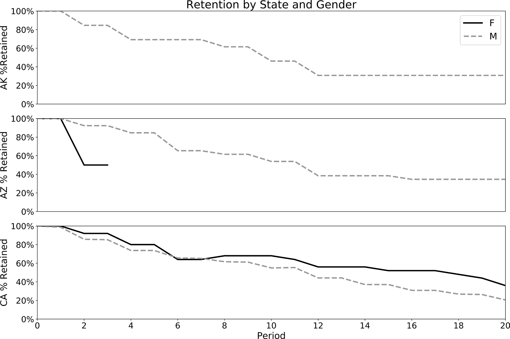

# 第四章：Cohort 分析

在第三章中，我们讨论了时间序列分析。现在，我们将转向另一种相关的分析类型，它在许多商业和其他应用中都有用途：cohort 分析。

我记得我第一次接触 cohort 分析的时候。那时我在一家小型创业公司做数据分析师的工作。我正在审查一份我与 CEO 共同完成的购买分析，他建议我按 cohort 来拆分客户群，看看行为是否随时间而变化。我以为那只是一些花哨的商学院东西，可能没什么用，但他是 CEO，所以我当然顺着他。结果证明这不只是一个噱头。将人群按 cohort 分组并随时间跟踪它们是分析数据和避免各种偏见的强大方式。cohorts 可以提供关于亚群体如何不同以及随时间如何变化的线索。

在这一章中，我们首先来看看什么是 cohorts 以及某些类型的 cohort 分析的基本组成部分。在介绍用于示例的立法者数据集之后，我们将学习如何构建留存分析，并处理诸如定义 cohort 和处理稀疏数据等各种挑战。接下来，我们将涵盖生存分析、回归分析和累积计算，这些都类似于留存分析中 SQL 代码的结构。最后，我们将看看如何将 cohort 分析与横截面分析结合起来，以理解随时间变化的人群构成。

# Cohorts：一个有用的分析框架

在我们进入代码之前，我会定义什么是 cohorts，考虑我们可以用这种分析回答哪些类型的问题，并描述任何 cohort 分析的组成部分。

一个*cohort*是一群在我们开始观察时具有某些特征的个体，下文将描述。Cohort 成员通常是人，但也可以是我们想研究的任何类型的实体：公司、产品或物理世界现象。cohort 中的个体可能意识到他们的成员身份，就像一个一年级班级的孩子意识到他们是第一年级同学群体的一部分，或者药物试验的参与者意识到他们是接受治疗的组的一部分。在其他时候，实体被虚拟地分成 cohort，例如软件公司将所有在某一年获得的客户分组，以研究他们保持客户的时间长短。无论何时，都要考虑将实体分组而不通知它们的伦理影响，如果要对它们施加任何不同的对待。

*队列分析*是一种有益的比较实体群体随时间变化的方式。许多重要行为需要几周、几个月或几年的时间来发生或发展，队列分析是理解这些变化的一种方法。队列分析提供了一个框架，用于检测队列特征与这些长期趋势之间的相关性，这可以导致关于因果驱动因素的假设。例如，通过营销活动获得的客户可能具有与那些被朋友说服尝试公司产品的客户不同的长期购买模式。队列分析可用于监测新用户或客户的新队列，并评估它们与先前队列的比较情况。这种监测可以提供早期警报信号，表明新客户的情况出现了问题（或者好转）。队列分析还用于挖掘历史数据。A/B 测试，在第七章中讨论，是确定因果关系的黄金标准，但我们不能回到过去，并为我们感兴趣的过去每个问题运行每个测试。当然，我们应该谨慎地将因果意义附加到队列分析中，而是将队列分析用作了解客户并产生未来可以严格测试的假设的一种方式。

队列分析有三个组成部分：队列分组、观察队列的时间序列数据和衡量队列成员执行的聚合指标。

*队列分组*通常基于起始日期：客户的第一次购买或订阅日期，学生入学日期等。然而，队列也可以根据其他特征形成，这些特征可以是固有的或随时间变化的。固有特征包括出生年份和国家/地区，或公司成立年份。随时间变化的特征包括居住城市和婚姻状况。当使用这些特征时，我们需要确保只在起始日期上对队列进行分组，否则实体可能会在队列组之间跳跃。

# 队列还是段？

这两个术语通常以类似的方式使用，甚至可以互换，但出于清晰起见，区分它们是值得的。*队列*是一组具有共同起始日期并随时间跟踪的用户（或其他实体）。*段*是在某一时间点具有共同特征或一组特征的用户分组，而不考虑它们的起始日期。与队列类似，段可以基于固有因素（如年龄）或行为特征进行分组。在同一月份注册的用户可以被放入一个队列并随时间跟踪。或者可以使用队列分析探索不同的用户分组，以便了解哪些分组具有最有价值的特征。本章将涵盖的分析，如保留，可以帮助在市场细分背后提供具体数据。

任何队列分析的第二个组成部分是*时间序列*。这是一系列购买、登录、互动或其他由客户或被队列化的实体执行的行动。重要的是时间序列覆盖实体的整个生命周期，否则早期队列中会有*生存偏差*。生存偏差发生在只有留下的客户在数据集中；已流失的客户因不再存在而被排除，因此其余客户看起来比新队列的质量更高或更合适（见“生存偏差”）。同样重要的是，时间序列足够长，以使实体完成感兴趣的行动。例如，如果客户倾向于每月购买一次，那么需要几个月的时间序列。另一方面，如果购买只发生一次一年，那么几年的时间序列将更可取。不可避免地，最近获取的客户没有足够的时间完成动作，与过去获取的客户相比。为了进行规范化，队列分析通常测量从起始日期起经过的周期数，而不是日历月份。通过这种方式，可以比较周期 1、周期 2 等不同的队列，看看它们随时间的演变，而不考虑动作实际发生的月份。这些间隔可以是天、周、月或年。

*总量度量* 应与对组织健康至关重要的行动有关，比如继续使用或购买产品的客户。通常在队列中对度量值进行汇总，使用 `sum`、`count` 或 `average`，尽管任何相关的汇总都可以。其结果是一个时间序列，随后可用于理解随时间行为的变化。

在本章中，我将涵盖四种类型的队列分析：留存、生存、重购行为或再购买行为，以及累积行为。

留存

留存关注的是队列成员在特定日期的时间序列中是否有记录，表示从起始日期起的周期数。这在任何预期有重复行为的组织中都很有用，无论是玩在线游戏、使用产品还是续订订阅，它有助于回答产品有多粘性或吸引力以及未来可能出现多少实体的问题。

生存

生存关注的是在数据集中保留了多少实体一定长度的时间或更长时间，而不论到那时为止的行动次数或频率。生存对于回答预期有多少人口能够保持下去是很有用的——无论是因为没有流失或死亡，还是因为没有毕业或完成某些要求而保持下去。

重购行为

重购或重复购买行为关注的是在固定时间窗口内是否发生了动作超过某个最小阈值——通常仅仅是超过一次。这种分析类型在行为是间歇性和不可预测的情况下非常有用，比如在零售业中，它描述了每个队列中重复购买者的份额在固定时间窗口内。

累积的

累积计算关注的是在一个或多个固定时间窗口内测得的总数量或总金额，而不管它们在该窗口内何时发生。累积计算经常用于计算客户生命周期价值（LTV 或 CLTV）。

四种类型的队列分析允许我们比较子群体，并了解它们随时间的差异，以便做出更好的产品、营销和财务决策。不同类型的计算方法相似，因此我们将从保留开始介绍，并展示如何修改保留代码以计算其他类型。在我们深入构建队列分析之前，让我们先看看我们将在本章的示例中使用的数据集。

# [立法者数据集](https://github.com/unitedstates/congress-legislators)

本章中的 SQL 示例将使用一个维护在[Github 库](https://github.com/unitedstates/congress-legislators)中的过去和现任美国国会成员的数据集。在美国，国会负责制定法律或立法，所以其成员也被称为立法者。由于数据集是一个 JSON 文件，我已经应用了一些转换来为分析产生更适合的数据模型，并且我已经发布了适合在书的 GitHub [legislators 文件夹](https://oreil.ly/H2tYP)中跟随示例的数据格式。

源代码库有一个很好的数据字典，所以我不会在这里重复所有细节。然而，我会提供一些细节，这些细节应该帮助那些不熟悉美国政府的人跟随本章的分析。

国会有两个议院，参议院（在数据集中为“sen”）和众议院（“rep”）。每个州有两名参议员，他们任期为六年。代表根据人口分配给各州；每个代表有一个他们独自代表的选区。代表任期为两年。在某位立法者死亡、当选或被任命到更高职务的情况下，任何一院的实际任期都可能较短。立法者通过担任领导职务累积权力和影响力，因此经常参加连任。最后，立法者可能属于一个政党，或者他们可能是“独立”的。在现代，绝大多数立法者是民主党人或共和党人，两党之间的竞争是众所周知的。立法者偶尔在任职期间更换政党。

在分析中，我们将使用两个表：`legislators` 和 `legislators_terms`。`legislators` 表包含数据集中所有包括的人员列表，包括生日、性别和一组可以用于在其他数据集中查找该人员的 ID 字段。`legislators_terms` 表包含每位立法者任期的记录，包括开始和结束日期，以及其他属性，如议会和党派。`id_bioguide` 字段用作立法者的唯一标识符，并出现在每个表中。图 4-1 展示了 `legislators` 数据的示例。图 4-2 展示了 `legislators_terms` 数据的示例。


###### 图 4-1\. `legislators` 表的示例


###### 图 4-2\. `legislators_terms` 表的示例

现在我们已经了解了什么是队列分析，以及我们将用于示例的数据集，让我们来看看如何编写用于保留分析的 SQL。SQL 将帮助我们回答的关键问题是：一旦代表就职，他们会持续多长时间？

# 保留

最常见的一种队列分析是*保留分析*。保留即是保持或继续某事物。许多技能需要练习才能保持。企业通常希望客户继续购买他们的产品或使用他们的服务，因为保留客户比获取新客户更具盈利性。雇主希望保留员工，因为招聘替代者既昂贵又耗时。当选官员寻求连任，以便继续推动选民的重要事务。

保留分析中的主要问题是，起始队列的大小——订阅者或员工数量、支出金额或其他关键指标——是否会随时间保持恒定、衰减或增加。当存在增加或减少时，变化的数量和速度也是有趣的问题。在大多数保留分析中，起始队列大小随时间倾向于衰减，因为一旦形成队列，队列就无法获得新成员，只能失去成员。收入是一个有趣的例外，因为客户队列可以在后续几个月花费比首个月更多的金额，即使其中一些客户已经流失。

留存分析使用数据集中每个周期从起始日期起的实体的`count`或金钱或操作的`sum`，并通过将这个数值除以第一个时间段内的实体，金钱或操作的`count`或`sum`来进行标准化。结果以百分比表示，起始周期的留存率始终为 100%。随着时间的推移，基于计数的留存率通常会下降，并且永远不会超过 100%，而基于金钱或行动的留存率虽然通常会下降，但可以在某一时间段内增加并超过 100%。留存分析的输出通常以表格或图形形式显示，称为留存曲线。在本章后面，我们将看到多个留存曲线的示例。

留存曲线图可以用来比较队列。要注意的第一个特征是曲线在最初几个周期内的形状，通常会有一个初始的陡峭下降。对于许多消费类应用程序，头几个月失去一半的队列是很常见的。具有比其他更陡或更缓的曲线的队列可能表明产品或客户获取来源发生了变化，值得进一步调查。要寻找的第二个特征是曲线在一定周期后是否变平或继续快速下降至零。平坦的曲线表明有一个时间点，此后大多数留存的队列成员将无限期留在其中。如果队列成员在一段时间后返回或重新激活，则留存曲线可能出现上升的情况，有时被称为笑脸曲线。最后，监控订阅收入的留存曲线，以了解时间内每个客户的增加收入迹象，是一个健康的 SaaS 软件业务的标志。

本节将展示如何创建留存分析，从时间序列本身和其他表中添加队列分组，并处理时间序列数据中可能出现的缺失和稀疏数据。有了这个框架，您将在随后的部分中学习如何进行修改，以创建其他相关类型的队列分析。因此，本节关于留存的内容将是本章中最长的部分，因为您将逐步构建代码并发展您对计算的直觉。

## SQL 用于基本留存曲线

对于留存分析，与其他队列分析一样，我们需要三个组成部分：队列定义，操作的时间序列，以及衡量与组织或流程相关的某种聚合指标。在我们的情况下，队列成员将是立法者，时间序列将是每位立法者任职的任期，而感兴趣的指标将是从起始日期起每个周期仍在职的人数的`count`。

我们将从计算基本保持率开始，然后再进入包含各种队列分组示例的部分。第一步是找到每位议员上任的第一个日期(`first_term`)。我们将使用此日期来计算时间序列中每个后续日期的期数。为此，取`term_start`的最小值，并*GROUP BY*每个`id_bioguide`，这是每位议员的唯一标识符：

```
SELECT id_bioguide
,min(term_start) as first_term
FROM legislators_terms 
GROUP BY 1
;

id_bioguide  first_term
-----------  ----------
A000118      1975-01-14
P000281      1933-03-09
K000039      1933-03-09
...          ...
```

下一步是将这段代码放入子查询中，并将其*JOIN*到时间序列中。应用`age`函数计算每个议员的`term_start`和`first_term`之间的间隔。对结果应用`date_part`函数，以年为单位转换为年度周期数。由于选举每两年或六年举行一次，我们将使用年作为计算`period`的时间间隔。我们可以使用更短的间隔，但在这个数据集中，每日或每周的波动很小。对于该周期有记录的议员的`count`是保持数：

```
SELECT date_part('year',age(b.term_start,a.first_term)) as period
,count(distinct a.id_bioguide) as cohort_retained
FROM
(
    SELECT id_bioguide, min(term_start) as first_term
    FROM legislators_terms 
    GROUP BY 1
) a
JOIN legislators_terms b on a.id_bioguide = b.id_bioguide 
GROUP BY 1
;

period  cohort_retained
------  ---------------
0.0     12518
1.0     3600
2.0     3619
...     ...
```

###### 提示

在支持`datediff`函数的数据库中，可以用这个更简单的函数代替`date_part`和`age`构造：

```
datediff('year',first_term,term_start)
```

有些数据库，比如 Oracle，将`date_part`放在最后：

```
datediff(first_term,term_start,'year'
```

现在我们有了期数和每个期数保留的议员数量，最后一步是计算总`cohort_size`并填充到每一行，以便可以将`cohort_retained`除以它。`first_value`窗口函数根据*ORDER BY*中设置的顺序返回*PARTITION BY*子句中的第一个记录，这是获取每行中队列大小的便捷方式。在这种情况下，`cohort_size`来自整个数据集中的第一个记录，因此*PARTITION BY*被省略：

```
first_value(cohort_retained) over (order by period) as cohort_size
```

要找到保持百分比，将`cohort_retained`值除以相同的计算结果：

```
SELECT period
,first_value(cohort_retained) over (order by period) as cohort_size
,cohort_retained
,cohort_retained / 
 first_value(cohort_retained) over (order by period) as pct_retained
FROM
(
    SELECT date_part('year',age(b.term_start,a.first_term)) as period
    ,count(distinct a.id_bioguide) as cohort_retained
    FROM
    (
        SELECT id_bioguide, min(term_start) as first_term
        FROM legislators_terms 
        GROUP BY 1
    ) a
    JOIN legislators_terms b on a.id_bioguide = b.id_bioguide 
    GROUP BY 1
) aa
;

period  cohort_size  cohort_retained  pct_retained
------  -----------  ---------------  ------------
0.0     12518        12518            1.0000
1.0     12518        3600             0.2876
2.0     12518        3619             0.2891
...     ...          ...              ...
```

现在我们有了一个保持率的计算，我们可以看到在第 0 期保留的议员百分比与一年后开始的第二届记录之间有明显的下降。如图图 4-3 所示，展示了曲线如何变平，并最终趋近于零，因为即使是任期最长的议员最终也会退休或去世。


###### 图 4-3\. 美国议员第一届任期开始后的保持率

我们可以将队列保持结果重新整理成表格格式展示。使用带有 CASE 语句的聚合函数进行数据的旋转和展平；在本例中使用了`max`，但是其他聚合函数如`min`或`avg`将返回相同的结果。保持率计算为 0 到 4 年，但可以通过相同的模式添加额外的年份：

```
SELECT cohort_size
,max(case when period = 0 then pct_retained end) as yr0
,max(case when period = 1 then pct_retained end) as yr1
,max(case when period = 2 then pct_retained end) as yr2
,max(case when period = 3 then pct_retained end) as yr3
,max(case when period = 4 then pct_retained end) as yr4
FROM
(
    SELECT period
    ,first_value(cohort_retained) over (order by period) 
     as cohort_size
    ,cohort_retained 
     / first_value(cohort_retained) over (order by period)
     as pct_retained
    FROM
    (
        SELECT 
        date_part('year',age(b.term_start,a.first_term)) as period
        ,count(*) as cohort_retained
        FROM
        (
            SELECT id_bioguide, min(term_start) as first_term
            FROM legislators_terms 
            GROUP BY 1
        ) a
        JOIN legislators_terms b on a.id_bioguide = b.id_bioguide 
        GROUP BY 1
    ) aa
) aaa
GROUP BY 1
;

cohort_size  yr0     yr1     yr2     yr3     yr4
-----------  ------  ------  ------  ------  ------
12518        1.0000  0.2876  0.2891  0.1463  0.2564
```

保持率似乎相当低，从图表中我们可以看到在最初几年内呈现出锯齿状。造成这种情况的一个原因是代表的任期为两年，而参议员的任期为六年，但数据集只包含新任期的开始记录；因此，我们缺少议员仍在职但未开始新任期的年份的数据。在这种情况下，每年测量保持率是误导性的。一种选择是仅在两年或六年周期内测量保持率，但我们还可以采用另一种策略来填补“缺失”的数据。我将在回到形成队列组之前介绍这一点。

## 调整时间序列以提高保持准确性

我们在第二章讨论了清理“缺失”数据的技术，我们将在本节中转向这些技术，以便为议员形成更平滑且更真实的保持曲线。在处理时间序列数据，例如队列分析时，重要的是考虑不仅存在的数据，还要考虑这些数据是否准确地反映了每个时间段内实体的存在或缺失。在数据捕获到的事件导致实体在数据中存在一段未被记录的时间时，这尤其成为问题。例如，客户购买软件订阅在交易时被记录在数据中，但客户有权在几个月或几年内使用该软件，而这段时间不一定在数据中得到体现。为了纠正这一点，我们需要一种方法来推导实体仍然存在的时间跨度，无论是通过明确的结束日期还是知道订阅或任期的长度。然后我们可以说，在这些开始和结束日期之间的任何日期该实体都存在。

在议员数据集中，我们有一个记录任期开始日期的记录，但我们缺少这样一个概念，即这个日期“赋予”议员能够在众议院或参议院中任职两年或六年的资格。为了纠正这一点并平滑曲线，我们需要填补议员在新任期之间仍在职的年份的“缺失”数值。由于这个数据集为每个任期都包括一个`term_end`值，我将展示如何通过填补开始和结束值之间的日期来创建更准确的队列保持分析。然后，我将展示如何在数据集不包含结束日期时填补结束日期。

使用数据中定义的开始日期和结束日期来计算保留是最准确的方法。对于以下示例，如果立法者在年底 12 月 31 日仍在任职，则视为保留。在美国宪法第二十修正案之前，任期始于 3 月 4 日，但之后开始日期移至 1 月 3 日，或者如果第三天是周末，则移至随后的工作日。由于特别的非周期性选举或任命以填补空缺席位，立法者可以在一年中的其他日期宣誓就职。因此，`term_start`日期在 1 月聚集，但在全年范围内分布。虽然我们可以选择另一个日期，但 12 月 31 日是围绕这些不同开始日期进行规范化的策略之一。

第一步是创建一个数据集，其中包含每位立法者在任的每个 12 月 31 日的记录。这可以通过将找到`first_term`的子查询与`legislators_terms`表进行*JOIN*来实现，以查找每个任期的`term_start`和`term_end`。对`date_dim`的第二*JOIN*检索从开始到结束日期之间的日期，限制返回值为`c.month_name = 'December'和 c.day_of_month = 31`。计算`period`为`date_dim`中的`date`与`first_term`之间的年数。请注意，即使在 1 月宣誓就职和 12 月 31 日之间可能已经过去了超过 11 个月，第一年仍然显示为 0：

```
SELECT a.id_bioguide, a.first_term
,b.term_start, b.term_end
,c.date
,date_part('year',age(c.date,a.first_term)) as period
FROM
(
    SELECT id_bioguide, min(term_start) as first_term
    FROM legislators_terms 
    GROUP BY 1
) a
JOIN legislators_terms b on a.id_bioguide = b.id_bioguide 
LEFT JOIN date_dim c on c.date between b.term_start and b.term_end 
and c.month_name = 'December' and c.day_of_month = 31
;

id_bioguide  first_term  term_start  term_end    date        period
-----------  ----------  ----------  ----------  ----------  ------
B000944      1993-01-05  1993-01-05  1995-01-03  1993-12-31  0.0
B000944      1993-01-05  1993-01-05  1995-01-03  1994-12-31  1.0
C000127      1993-01-05  1993-01-05  1995-01-03  1993-12-31  0.0
...          ...         ...         ...         ...         ...
```

###### 提示

如果没有日期维度可用，可以通过几种方式创建包含所需日期的子查询。如果您的数据库支持`generate_series`，可以创建一个子查询来返回所需的日期：

```
SELECT generate_series::date as date
FROM generate_series('1770-12-31','2020-12-
31',interval '1 year')
```

你可能想把这个保存为一个表或视图以供以后使用。或者，您可以查询数据集或数据库中具有完整日期集的任何其他表。在这种情况下，表中包含所有必要的年份，但我们将使用`make_date`函数为每年创建一个 12 月 31 日的日期：

```
SELECT distinct
make_date(date_part('year',term_start)::int,12,31)
FROM legislators_terms
```

有许多创造性的方法可以获取所需的日期系列。请使用在查询中可用且最简单的任何方法。

现在我们每个`date`（年末）都有一行，我们希望计算保留率。下一步是计算每个期间的`cohort_retained`，使用`id_bioguide`的`count`完成。在`period`上使用`coalesce`函数设置默认值为 0 时，处理议员在同一年内开始和结束任期的情况，这样便为在该年内服务提供了信用：

```
SELECT 
coalesce(date_part('year',age(c.date,a.first_term)),0) as period
,count(distinct a.id_bioguide) as cohort_retained
FROM
(
    SELECT id_bioguide, min(term_start) as first_term
    FROM legislators_terms 
    GROUP BY 1
) a
JOIN legislators_terms b on a.id_bioguide = b.id_bioguide 
LEFT JOIN date_dim c on c.date between b.term_start and b.term_end 
and c.month_name = 'December' and c.day_of_month = 31
GROUP BY 1
;

period  cohort_retained
------  ---------------
0.0     12518
1.0     12328
2.0     8166
...     ...
```

最后一步是像以前一样使用`first_value`窗口函数计算`cohort_size`和`pct_retained`：

```
SELECT period
,first_value(cohort_retained) over (order by period) as cohort_size
,cohort_retained
,cohort_retained * 1.0 / 
 first_value(cohort_retained) over (order by period) as pct_retained
FROM
(
    SELECT coalesce(date_part('year',age(c.date,a.first_term)),0) as period
    ,count(distinct a.id_bioguide) as cohort_retained
    FROM
    (
        SELECT id_bioguide, min(term_start) as first_term
        FROM legislators_terms 
        GROUP BY 1
    ) a
    JOIN legislators_terms b on a.id_bioguide = b.id_bioguide 
    LEFT JOIN date_dim c on c.date between b.term_start and b.term_end 
    and c.month_name = 'December' and c.day_of_month = 31
    GROUP BY 1
) aa
;

period  cohort_size  cohort_retained  pct_retained
------  -----------  ---------------  ------------
0.0     12518        12518            1.0000
1.0     12518        12328            0.9848
2.0     12518        8166             0.6523
...     ...          ...              ...
```

现在通过图表显示的图 4-4 的结果更加准确。几乎所有立法者在第 1 年仍然在任职，而在第 2 年发生的第一个大幅下降发生在一些代表未能连任时。


###### 图 4-4\. 调整后的议员任职年限

如果数据集不包含结束日期，则有几种选项可以补充。一种选项是在已知订阅或任期长度时，将固定的间隔添加到开始日期。这可以通过日期数学通过将恒定间隔添加到`term_start`来完成。在这里，一个 CASE 语句处理了两种`term_type`的添加：

```
SELECT a.id_bioguide, a.first_term
,b.term_start
,case when b.term_type = 'rep' then b.term_start + interval '2 years'
      when b.term_type = 'sen' then b.term_start + interval '6 years'
      end as term_end
FROM
(
    SELECT id_bioguide, min(term_start) as first_term
    FROM legislators_terms 
    GROUP BY 1
) a
JOIN legislators_terms b on a.id_bioguide = b.id_bioguide 
;

id_bioguide  first_term  term_start  term_end
-----------  ----------  ----------  ----------
B000944      1993-01-05  1993-01-05  1995-01-05
C000127      1993-01-05  1993-01-05  1995-01-05
C000141      1987-01-06  1987-01-06  1989-01-06
...          ...         ...         ...
```

这段代码块可以随后插入保留代码中以推导出`period`和`pct_retained`。这种方法的缺点在于它未能捕捉到立法者未能完成全任期的情况，这种情况可能出现在死亡或被提升到更高职位的事件中。

第二个选择是使用后续开始日期减去一天作为`term_end`日期。这可以通过`lead`窗口函数计算。这个函数类似于我们之前使用的`lag`函数，但是它不是返回分区中较早的行的值，而是返回分区中较晚的行的值，如*ORDER BY*子句所确定。默认是一行，我们将在这里使用这个默认值，但是该函数有一个可选参数指示不同数量的行。在这里，我们使用`lead`找到后续任期的`term_start`日期，然后减去间隔`'1 day'`来推导出`term_end`：

```
SELECT a.id_bioguide, a.first_term
,b.term_start
,lead(b.term_start) over (partition by a.id_bioguide 
                          order by b.term_start) 
 - interval '1 day' as term_end
FROM
(
    SELECT id_bioguide, min(term_start) as first_term
    FROM legislators_terms 
    GROUP BY 1
) a
JOIN legislators_terms b on a.id_bioguide = b.id_bioguide 
;

id_bioguide  first_term  term_start  term_end
-----------  ----------  ----------  ----------
A000001      1951-01-03  1951-01-03  (null)
A000002      1947-01-03  1947-01-03  1949-01-02
A000002      1947-01-03  1949-01-03  1951-01-02
...          ...         ...         ...
```

这段代码块随后可以插入保留代码中。这种方法有一些缺点。首先，当没有后续任期时，`lead`函数返回空值，使得该任期没有`term_end`。在这种情况下可以使用默认值，如上一个例子中所示的默认间隔。第二个缺点是该方法假设任期总是连续的，没有在职期间的空闲时间。尽管大多数立法者倾向于连续服务，直到他们的国会生涯结束，但确实存在任期之间跨越数年的间隔的例子。

当我们进行填补缺失数据的调整时，必须谨慎对待我们所做的假设。在订阅或期限为基础的情境中，显式的开始和结束日期通常是最准确的。在没有结束日期并且我们合理预期大多数客户或用户将保持所假设的持续时间时，可以使用另外两种方法中的任意一种：添加一个固定的间隔或者相对于下一个开始日期设置结束日期。

现在我们已经看到如何计算基本的保留曲线并纠正缺失日期，我们可以开始添加队列组。比较不同组之间的保留率是进行队列分析的主要原因之一。接下来，我将讨论如何从时间序列本身形成组，并在此之后，我将讨论如何从其他表中的数据形成队列组。

## 从时间序列本身派生队列

现在我们有了计算保留的 SQL 代码，我们可以开始将实体分割成队列。在本节中，我将展示如何从时间序列本身推导出队列分组。首先，我将讨论基于第一日期的基于时间的队列，并解释如何基于时间序列的其他属性进行队列分组。

建立队列的最常见方式是基于时间序列中实体首次出现的日期或时间。这意味着队列保持分析只需要一个表：时间序列本身。按首次出现或行动进行分组是有趣的，因为通常在不同时间开始的群体表现不同。对于消费者服务，早期采纳者通常更加热情，并且保持方式不同于后来的采纳者；而在 SaaS 软件中，后期采纳者可能更好地保持，因为产品更加成熟。基于时间的队列可以按照组织中有意义的任何时间粒度进行分组，尽管周、月或年队列是常见的。如果不确定使用何种分组方式，请尝试使用不同的分组运行队列分析，但不要将队列大小设定得太小，以便看到有意义的模式出现。幸运的是，一旦了解如何构建队列和保持分析，替换不同的时间粒度就变得简单了。

第一个例子将使用年度队列，然后我将演示如何更换为世纪。我们将考虑的关键问题是，立法者首次就职的时代是否与他们的保留有任何相关性。政治趋势和公众情绪确实会随时间而变化，但变化的幅度是多少呢？

要计算年度队列，我们首先将之前计算的`first_term`的年份添加到查询中，以找到`period`和`cohort_retained`：

```
SELECT date_part('year',a.first_term) as first_year
,coalesce(date_part('year',age(c.date,a.first_term)),0) as period
,count(distinct a.id_bioguide) as cohort_retained
FROM
(
    SELECT id_bioguide, min(term_start) as first_term
    FROM legislators_terms 
    GROUP BY 1
) a
JOIN legislators_terms b on a.id_bioguide = b.id_bioguide 
LEFT JOIN date_dim c on c.date between b.term_start and b.term_end 
and c.month_name = 'December' and c.day_of_month = 31
GROUP BY 1,2
;

first_year  period  cohort_retained
----------  ------  ---------------
1789.0      0.0     89
1789.0      2.0     89
1789.0      3.0     57
...         ...     ...
```

然后将此查询用作子查询，并像以前一样在外部查询中计算`cohort_size`和`pct_retained`。但是，在这种情况下，我们需要一个*PARTITION BY*子句，其中包括`first_year`，以便`first_value`仅在该`first_year`的行集内计算，而不是在子查询的整个结果集中计算：

```
SELECT first_year, period
,first_value(cohort_retained) over (partition by first_year 
                                    order by period) as cohort_size
,cohort_retained
,cohort_retained / 
 first_value(cohort_retained) over (partition by first_year 
                                    order by period) as pct_retained
FROM
(
    SELECT date_part('year',a.first_term) as first_year
    ,coalesce(date_part('year',age(c.date,a.first_term)),0) as period
    ,count(distinct a.id_bioguide) as cohort_retained
    FROM
    (
        SELECT id_bioguide, min(term_start) as first_term
        FROM legislators_terms 
        GROUP BY 1
    ) a
    JOIN legislators_terms b on a.id_bioguide = b.id_bioguide 
    LEFT JOIN date_dim c on c.date between b.term_start and b.term_end 
    and c.month_name = 'December' and c.day_of_month = 31
    GROUP BY 1,2
) aa
;

first_year  period  cohort_size  cohort_retained  pct_retained
----------  ------  -----------  ---------------  ------------
1789.0      0.0     89           89               1.0000
1789.0      2.0     89           89               1.0000
1789.0      3.0     89           57               0.6404
...         ...     ...          ...              ...
```

此数据集包含两百多个起始年份，过多无法轻松绘制或在表中检查。接下来，我们将以较少的粒度间隔查看，并将立法者按其`first_term`的世纪进行队列分组。这一变更通过在子查询`aa`中将`date_part`函数中的`year`替换为`century`轻松完成。请记住，世纪名称与它们所代表的年份有所偏移，因此 18 世纪从 1700 年到 1799 年，19 世纪从 1800 年到 1899 年，依此类推。在`first_value`函数中的分区更改为`first_century`字段：

```
SELECT first_century, period
,first_value(cohort_retained) over (partition by first_century 
                                    order by period) as cohort_size
,cohort_retained
,cohort_retained / 
 first_value(cohort_retained) over (partition by first_century 
                                    order by period) as pct_retained
FROM
(
    SELECT date_part('century',a.first_term) as first_century
    ,coalesce(date_part('year',age(c.date,a.first_term)),0) as period
    ,count(distinct a.id_bioguide) as cohort_retained
    FROM
    (
        SELECT id_bioguide, min(term_start) as first_term
        FROM legislators_terms 
        GROUP BY 1
    ) a
    JOIN legislators_terms b on a.id_bioguide = b.id_bioguide 
    LEFT JOIN date_dim c on c.date between b.term_start and b.term_end 
    and c.month_name = 'December' and c.day_of_month = 31
    GROUP BY 1,2
) aa
ORDER BY 1,2
;

first_century  period  cohort_size  cohort_retained  pct_retained
-------------  ------  -----------  ---------------  ------------
18.0           0.0     368          368              1.0000
18.0           1.0     368          360              0.9783
18.0           2.0     368          242              0.6576
...            ...     ...          ...              ...
```

结果在 图 4-5 中进行了图表化。在早期年代，首次当选于 20 世纪或 21 世纪的人员的保留率较高。21 世纪仍在进行中，因此许多这些立法者还没有机会在任职五年或更长时间，尽管他们仍然包含在分母中。我们可能需要考虑从分析中排除 21 世纪，但我保留它在这里以展示由于这种情况而导致的保留曲线的人为下降。


###### 图 4-5\. 按首次任期开始世纪保留的立法者

除了第一个日期外，时间序列中的队列可以根据表格中的值来定义。 `legislators_terms` 表格具有 `state` 字段，指示该任期中人员所代表的州。我们可以利用这一点创建队列，并且将它们基于第一个州以确保任何代表多个州的人员仅在数据中出现一次。

###### 警告

在一个随时间变化的属性上进行队列处理时，确保每个实体只分配一个值非常重要。否则，该实体可能会出现在多个队列中，从而引入分析中的偏差。通常使用数据集中最早记录的值来确定队列。

要找到每位立法者的第一个州，我们可以使用 `first_value` 窗口函数。在这个例子中，我们还将 `min` 函数转换为窗口函数，以避免冗长的 *GROUP BY* 子句：

```
SELECT distinct id_bioguide
,min(term_start) over (partition by id_bioguide) as first_term
,first_value(state) over (partition by id_bioguide 
                          order by term_start) as first_state
FROM legislators_terms 
;

id_bioguide  first_term  first_state
-----------  ----------  -----------
C000001      1893-08-07  GA
R000584      2009-01-06  ID
W000215      1975-01-14  CA
...          ...         ...
```

然后我们可以将此代码插入我们的保留代码中，以查找按`first_state`保留的情况：

```
SELECT first_state, period
,first_value(cohort_retained) over (partition by first_state 
                                    order by period) as cohort_size
,cohort_retained
,cohort_retained / 
 first_value(cohort_retained) over (partition by first_state 
                                    order by period) as pct_retained
FROM
(
    SELECT a.first_state
    ,coalesce(date_part('year',age(c.date,a.first_term)),0) as period
    ,count(distinct a.id_bioguide) as cohort_retained
    FROM
    (
        SELECT distinct id_bioguide
        ,min(term_start) over (partition by id_bioguide) as first_term
        ,first_value(state) over (partition by id_bioguide order by term_start) 
         as first_state
        FROM legislators_terms 
    ) a
    JOIN legislators_terms b on a.id_bioguide = b.id_bioguide 
    LEFT JOIN date_dim c on c.date between b.term_start and b.term_end 
    and c.month_name = 'December' and c.day_of_month = 31
    GROUP BY 1,2
) aa
;

first_state  period  cohort_size  cohort_retained  pct_retained
-----------  ------  -----------  ---------------  ------------
AK           0.0     19           19               1.0000
AK           1.0     19           19               1.0000
AK           2.0     19           15               0.7895
...          ...     ...          ...              ...
```

对具有最高总立法者数的五个州的保留曲线进行了图表化，参见 图 4-6。伊利诺伊州和马萨诸塞州的当选者保留率最高，而纽约州的保留率最低。确定原因将是这项分析的一个有趣的分支。


###### 图 4-6\. 按首个州保留的立法者：按总立法者数前五个州

使用 `min` 日期为每个实体定义时间序列中的队列相对简单，然后根据分析的适当性将该日期转换为月份、年份或世纪。在粒度之间进行切换也很简单，允许测试多个选项以找到对组织有意义的分组方式。其他属性可以与 `first_value` 窗口函数一起用于队列化。接下来，我们将转向队列属性来自时间序列之外的表格的情况。

## 从单独的表格定义队列

经常定义队列的特征存在于与包含时间序列不同的表中。例如，数据库可能具有客户表，其中包含客户可以按获取来源或注册日期进行分组的信息。从其他表或甚至子查询添加属性相对简单，并且可以在保留分析及本章后续讨论的相关分析中完成。

对于本例，我们将考虑立法者的性别是否对其保留率有影响。`legislators`表具有`gender`字段，其中 F 表示女性，M 表示男性，我们可以使用它来对立法者进行分组。为此，我们将*JOIN* `legislators`表作为别名`d`，以将`gender`添加到`cohort_retained`的计算中，取代年份或世纪：

```
SELECT d.gender
,coalesce(date_part('year',age(c.date,a.first_term)),0) as period
,count(distinct a.id_bioguide) as cohort_retained
FROM
(
    SELECT id_bioguide, min(term_start) as first_term
    FROM legislators_terms 
    GROUP BY 1
) a
JOIN legislators_terms b on a.id_bioguide = b.id_bioguide 
LEFT JOIN date_dim c on c.date between b.term_start and b.term_end 
and c.month_name = 'December' and c.day_of_month = 31
JOIN legislators d on a.id_bioguide = d.id_bioguide
GROUP BY 1,2
;

gender  period  cohort_retained
------  ------  ---------------
F       0.0     366
M       0.0     12152
F       1.0     349
M       1.0     11979
...     ...     ...
```

立法任期中服务的男性比女性明显更多。现在我们可以计算`percent_retained`，以便比较这些群体的保留率：

```
SELECT gender, period
,first_value(cohort_retained) over (partition by gender 
                                    order by period) as cohort_size
,cohort_retained
,cohort_retained/ 
 first_value(cohort_retained) over (partition by gender 
                                    order by period) as pct_retained
FROM
(
    SELECT d.gender
    ,coalesce(date_part('year',age(c.date,a.first_term)),0) as period
    ,count(distinct a.id_bioguide) as cohort_retained
    FROM
    (
        SELECT id_bioguide, min(term_start) as first_term
        FROM legislators_terms 
        GROUP BY 1
    ) a
    JOIN legislators_terms b on a.id_bioguide = b.id_bioguide 
    LEFT JOIN date_dim c on c.date between b.term_start and b.term_end 
    and c.month_name = 'December' and c.day_of_month = 31
    JOIN legislators d on a.id_bioguide = d.id_bioguide
    GROUP BY 1,2
) aa
;

gender  period  cohort_size  cohort_retained  pct_retained
------  ------  -----------  ---------------  ------------
F       0.0     366          366              1.0000
M       0.0     12152        12152            1.0000
F       1.0     366          349              0.9536
M       1.0     12152        11979            0.9858
...     ...     ...          ...              ...
```

我们可以从图 4-7 的结果中看出，与其男性对手相比，女性立法者在第 2 到第 29 期间的保留率更高。第一位女性立法者直到 1917 年才上任，当时 Jeannette Rankin 作为来自蒙大拿州的共和党代表加入了众议院。正如我们之前看到的，保留率在更近的世纪有所增加。


###### 图 4-7\. 按性别分类的立法者保留率

为了进行更公平的比较，我们可以限制分析中包含的立法者仅限于那些自国会有女性以来开始任职的人。我们可以通过向子查询`aa`添加*WHERE*过滤器来实现这一点。在这里，结果也限制为那些在 2000 年之前开始的人，以确保队列至少有 20 年的可能留任时间：

```
SELECT gender, period
,first_value(cohort_retained) over (partition by gender 
                                    order by period) as cohort_size
,cohort_retained
,cohort_retained / 
 first_value(cohort_retained) over (partition by gender 
                                    order by period) as pct_retained
FROM
(
    SELECT d.gender
    ,coalesce(date_part('year',age(c.date,a.first_term)),0) as period
    ,count(distinct a.id_bioguide) as cohort_retained
    FROM
    (
        SELECT id_bioguide, min(term_start) as first_term
        FROM legislators_terms 
        GROUP BY 1
    ) a
    JOIN legislators_terms b on a.id_bioguide = b.id_bioguide 
    LEFT JOIN date_dim c on c.date between b.term_start and b.term_end 
    and c.month_name = 'December' and c.day_of_month = 31
    JOIN legislators d on a.id_bioguide = d.id_bioguide
    WHERE a.first_term between '1917-01-01' and '1999-12-31'
    GROUP BY 1,2
) aa
;

gender  period  cohort_size  cohort_retained  pct_retained
------  ------  -----------  ---------------  ------------
F       0.0     200          200              1.0000
M       0.0     3833         3833             1.0000
F       1.0     200          187              0.9350
M       1.0     3833         3769             0.9833
...     ...     ...          ...              ...
```

男性立法者仍然比女性立法者人数多，但差距较小。队列的保留率见图 4-8。在修订后的队列中，男性立法者在第 7 年之前有更高的保留率，但从第 12 年开始，女性立法者的保留率更高。这两种基于性别的队列分析的差异突显了设置适当的队列和确保它们具有相同时间量来参加或完成其他感兴趣行动的重要性。为了进一步改进此分析，我们可以按照起始年或十年以及性别进行队列分析，以控制 20 世纪和 21 世纪初的保留率的额外变化。


###### 图 4-8\. 按性别分类的立法者保留率：1917 年至 1999 年的队列

Cohorts 可以通过时间序列和其他表格的方式定义。通过我们开发的框架，可以替换子查询、视图或其他派生表，从而打开一整套计算作为 cohort 基础的可能性。可以使用多个标准，比如起始年份和性别。将人群根据多个标准分为 cohort 时需要注意的是，这可能导致稀疏的 cohort，即某些定义的组在所有时间段的数据集中太小，无法代表所有时间段。接下来的部分将讨论克服这一挑战的方法。

## 处理稀疏 cohort

在理想的数据集中，每个 cohort 在所有感兴趣的期间都有一些操作或记录。我们已经看到由于订阅或任期跨越多个期间而可能出现“缺失”日期的情况，以及如何使用日期维度来推断中间日期进行校正。另一个问题可能是，由于分组标准，cohort 变得太小，结果数据中只偶尔出现。当 cohort 消失在结果集中时，我们希望它以零的留任值出现而不是空值。这个问题称为 *稀疏 cohort*，可以通过谨慎使用 *LEFT JOIN* 来解决。

为了演示这一点，让我们尝试通过首次代表的州来对女性立法者进行 cohort，看看留任情况是否有所不同。我们已经看到女性立法者相对较少。进一步按州对他们进行 cohort 很可能会创建一些稀疏的 cohort，其中成员非常少。在进行代码调整之前，让我们将 `first_state`（在从时间序列派生 cohort 的部分计算）添加到之前的性别示例中，并查看结果：

```
SELECT first_state, gender, period
,first_value(cohort_retained) over (partition by first_state, gender 
                                    order by period) as cohort_size
,cohort_retained
,cohort_retained / 
 first_value(cohort_retained) over (partition by first_state, gender 
                                    order by period) as pct_retained
FROM
(
    SELECT a.first_state, d.gender
    ,coalesce(date_part('year',age(c.date,a.first_term)),0) as period
    ,count(distinct a.id_bioguide) as cohort_retained
    FROM
    (
        SELECT distinct id_bioguide
        ,min(term_start) over (partition by id_bioguide) as first_term
        ,first_value(state) over (partition by id_bioguide 
                                  order by term_start) as first_state
        FROM legislators_terms 
    ) a
    JOIN legislators_terms b on a.id_bioguide = b.id_bioguide 
    LEFT JOIN date_dim c on c.date between b.term_start and b.term_end 
    and c.month_name = 'December' and c.day_of_month = 31
    JOIN legislators d on a.id_bioguide = d.id_bioguide
    WHERE a.first_term between '1917-01-01' and '1999-12-31'
    GROUP BY 1,2,3
) aa
;

first_state  gender  period  cohort_size  cohort_retained pct_retained
-----------  ------  ------  -----------  --------------- ------------
AZ           F       0.0     2            2               1.0000
AZ           M       0.0     26           26              1.0000
AZ           F       1.0     2            2               1.0000
...          ...     ...     ...          ...             ...
```

绘制前 20 个期间的结果，例如 图 4-9，显示了这些稀疏的 cohort。阿拉斯加没有女性立法者，而亚利桑那州的女性留任曲线在第三年后消失。只有加利福尼亚州，一个有很多议员的大州，两性都有完整的留任曲线。其他小州和大州的情况也如此。



###### 图 4-9. 按性别和首个州的立法者留任

现在让我们看看如何确保每个期间都有记录，以便查询在留任的情况下返回零值而不是空值。第一步是查询所有 `period` 和 cohort 属性的组合，例如 `first_state` 和 `gender`，每个组合的起始 `cohort_size`。这可以通过将计算 cohort 的子查询 `aa` 与生成一个从 0 到 20 的整数的子查询进行 *JOIN*，条件为 `on 1 = 1` 来完成。这是强制进行笛卡尔 *JOIN* 的便捷方式，当两个子查询没有共同字段时非常有用。

```
SELECT aa.gender, aa.first_state, cc.period, aa.cohort_size
FROM
(
    SELECT b.gender, a.first_state 
    ,count(distinct a.id_bioguide) as cohort_size
    FROM 
    (
        SELECT distinct id_bioguide
        ,min(term_start) over (partition by id_bioguide) as first_term
        ,first_value(state) over (partition by id_bioguide 
                                  order by term_start) as first_state
        FROM legislators_terms 
    ) a
    JOIN legislators b on a.id_bioguide = b.id_bioguide
    WHERE a.first_term between '1917-01-01' and '1999-12-31' 
    GROUP BY 1,2
) aa
JOIN
(
    SELECT generate_series as period 
    FROM generate_series(0,20,1)
) cc on 1 = 1
;

gender  state  period  cohort
------  -----  ------  ------
F       AL     0       3
F       AL     1       3
F       AL     2       3
...    ...     ...     ...
```

下一步是将此与实际任期中的时间段进行*JOIN*，并使用*LEFT JOIN*确保所有时间段都保留在最终结果中：

```
SELECT aaa.gender, aaa.first_state, aaa.period, aaa.cohort_size
,coalesce(ddd.cohort_retained,0) as cohort_retained
,coalesce(ddd.cohort_retained,0) / aaa.cohort_size as pct_retained
FROM
(
    SELECT aa.gender, aa.first_state, cc.period, aa.cohort_size
    FROM
    (
        SELECT b.gender, a.first_state
        ,count(distinct a.id_bioguide) as cohort_size
        FROM 
        (
            SELECT distinct id_bioguide
            ,min(term_start) over (partition by id_bioguide) 
             as first_term
            ,first_value(state) over (partition by id_bioguide 
                                      order by term_start) 
                                      as first_state
            FROM legislators_terms 
        ) a
        JOIN legislators b on a.id_bioguide = b.id_bioguide 
        WHERE a.first_term between '1917-01-01' and '1999-12-31' 
        GROUP BY 1,2
    ) aa
    JOIN
    (
        SELECT generate_series as period 
        FROM generate_series(0,20,1)
    ) cc on 1 = 1
) aaa
LEFT JOIN
(
    SELECT d.first_state, g.gender
    ,coalesce(date_part('year',age(f.date,d.first_term)),0) as period
    ,count(distinct d.id_bioguide) as cohort_retained
    FROM
    (
        SELECT distinct id_bioguide
        ,min(term_start) over (partition by id_bioguide) as first_term
        ,first_value(state) over (partition by id_bioguide 
                                  order by term_start) as first_state
        FROM legislators_terms 
    ) d
    JOIN legislators_terms e on d.id_bioguide = e.id_bioguide 
    LEFT JOIN date_dim f on f.date between e.term_start and e.term_end 
     and f.month_name = 'December' and f.day_of_month = 31
    JOIN legislators g on d.id_bioguide = g.id_bioguide
    WHERE d.first_term between '1917-01-01' and '1999-12-31'
    GROUP BY 1,2,3
) ddd on aaa.gender = ddd.gender and aaa.first_state = ddd.first_state 
and aaa.period = ddd.period
;

gender  first_state  period  cohort_size  cohort_retained pct_retained
------  -----------  ------  -----------  --------------- ------------
F       AL           0       3            3               1.0000
F       AL           1       3            1               0.3333
F       AL           2       3            0               0.0000
...    ...           ...     ...          ...             ...
```

然后我们可以旋转结果，并确认每个周期中每个人群都存在一个值：

```
gender  first_state  yr0    yr2     yr4     yr6     yr8      yr10
------  -----------  -----  ------  ------  ------  ------  ------
F       AL           1.000  0.0000  0.0000  0.0000  0.0000  0.0000
F       AR           1.000  0.8000  0.2000  0.4000  0.4000  0.4000
F       CA           1.000  0.9200  0.8000  0.6400  0.6800  0.6800
...     ...          ...    ...     ...     ...     ...     ...
```

请注意，此时 SQL 代码已变得非常长。编写用于人群留存分析的 SQL 的较难部分之一是保持所有逻辑清晰和代码组织良好，这是我将在第八章中进一步讨论的主题。在构建留存代码时，逐步进行检查结果并逐步进行，对个别人群进行抽样检查，以验证最终结果的准确性，我发现这非常有帮助。

人群可以用多种方式定义。到目前为止，我们已将所有人群标准化为时间序列数据中首次出现的日期。然而，这并不是唯一的选择，从实体寿命中段开始进行有趣的分析也是可以的。在结束我们对留存分析的工作之前，让我们看看这另一种定义人群的方式。

## 从非首次日期定义人群

通常，基于时间的人群是从实体在时间序列中首次出现或从某些其他最早日期（如注册日期）开始定义的。然而，基于不同日期的人群分析也可能非常有用和深刻。例如，我们可能想要查看在特定日期之前使用服务的所有客户的留存情况。这种类型的分析可以用来了解产品或营销变化是否对现有客户产生了长期影响。

当使用非首次日期时，我们需要确切地定义每个人群包含的标准。一种选择是选择在特定日历日期出现的实体。这在 SQL 代码中相对直接，但如果大部分常规用户不是每天都出现，会导致留存率取决于选择的确切日期，这可能会出现问题。一个纠正这个问题的选择是计算几个起始日期的留存率，然后平均结果。

另一个选择是使用一段时间窗口，如一周或一个月。在该窗口内出现在数据集中的任何实体都包含在人群中。虽然这种方法通常更能代表业务或过程，但折衷之处在于 SQL 代码将变得更加复杂，而查询时间可能会变慢，因为数据库计算更为密集。在查询性能和结果准确性之间找到合适的平衡是一门艺术。

让我们看看如何通过考虑在 2000 年任职的立法者数据集来计算此类中期分析。我们将按`term_type`对其进行队列化，“sen”表示参议员，“rep”表示代表。定义将包括在 2000 年任何时间内任职的任何立法者：在 2000 年之前开始并在 2000 年期间或之后结束其任期的人符合条件，以及在 2000 年开始任期的人。我们可以硬编码 2000 年的任何日期作为`first_term`，因为稍后我们将检查他们是否在 2000 年任职。也计算了此窗口内任期的`min_start`，以便在后续步骤中使用：

```
SELECT distinct id_bioguide, term_type, date('2000-01-01') as first_term
,min(term_start) as min_start
FROM legislators_terms 
WHERE term_start <= '2000-12-31' and term_end >= '2000-01-01'
GROUP BY 1,2,3
;

id_bioguide  term_type  first_term  min_start
-----------  ---------  ----------  ---------
C000858      sen        2000-01-01  1997-01-07
G000333      sen        2000-01-01  1995-01-04
M000350      rep        2000-01-01  1999-01-06
...          ...        ...         ...
```

我们可以将此插入我们的保持代码中，并进行两个调整。首先，在子查询`a`和`legislators_terms`表之间添加了一个额外的*JOIN*条件，以便仅返回从`min_start`日期开始或之后开始的任期。其次，在`date_dim`中添加了一个额外的过滤器，以便仅返回 2000 年或之后的日期：

```
SELECT term_type, period
,first_value(cohort_retained) over (partition by term_type order by period) 
 as cohort_size
,cohort_retained
,cohort_retained / 
 first_value(cohort_retained) over (partition by term_type order by period) 
 as pct_retained
FROM
(
    SELECT a.term_type
    ,coalesce(date_part('year',age(c.date,a.first_term)),0) as period
    ,count(distinct a.id_bioguide) as cohort_retained
    FROM
    (
        SELECT distinct id_bioguide, term_type
        ,date('2000-01-01') as first_term
        ,min(term_start) as min_start
        FROM legislators_terms 
        WHERE term_start <= '2000-12-31' and term_end >= '2000-01-01'
        GROUP BY 1,2,3
    ) a
    JOIN legislators_terms b on a.id_bioguide = b.id_bioguide 
    and b.term_start >= a.min_start
    LEFT JOIN date_dim c on c.date between b.term_start and b.term_end 
    and c.month_name = 'December' and c.day_of_month = 31 
    and c.year >= 2000
    GROUP BY 1,2
) aa
;

term_type  period  cohort_size  cohort_retained  pct_retained
---------  ------  -----------  ---------------  ------------
rep        0.0     440          440              1.0000
sen        0.0     101          101              1.0000
rep        1.0     440          392              0.8909
sen        1.0     101          89               0.8812
...        ...     ...          ...              ...
```

图 4-10 显示，尽管参议员任期较长，两个队列的保持率相似，在超过 10 年后，参议员的保持率实际上更低。进一步分析比较它们首次当选的不同年份或其他队列属性可能会得出一些有趣的见解。


###### 图 4-10\. 2000 年在任立法者的任期类型保持率

除了起始值之外的值上的队列常见用例是当试图分析实体达到阈值后的保持，例如一定数量的购买或一定金额的花费。与任何队列一样，定义什么条件使实体成为队列成员以及将用作起始日期的日期非常重要。

队列保持是了解时间序列数据集中实体行为的强大方法。我们已经看到了如何使用 SQL 计算保持以及如何基于时间序列本身或其他表进行队列化，以及在实体生命周期中的中间点。我们还研究了如何使用函数和*JOIN*来调整时间序列中的日期，并补偿稀疏队列。与队列保持相关的分析有几种类型：分析、存活率、回报率和累积计算，这些都是我们为保持开发的 SQL 代码的基础。让我们接下来看看它们。

# 相关队列分析

在上一节中，我们学习了如何为队列保留分析编写 SQL。保留分析捕捉了一个实体是否在特定日期或时间窗口内的时间序列数据集中。除了在特定日期的存在之外，分析通常还关心实体持续存在的时间长短，以及实体是否执行了多个动作以及这些动作的数量。可以使用类似于保留的代码来回答所有这些问题，并且非常适合于您喜欢的任何队列标准。让我们先看看这些中的第一个，生存率。

## 生存率

*生存率*，也称为*生存分析*，涉及到持续存在多长时间的问题，或者直到特定事件（如流失或死亡）发生的时间长度。生存分析可以回答关于群体中有多少比例可能会在某个时间点之后继续存在的问题。队列可以帮助识别或至少提供关于哪些特征或情况会增加或减少生存可能性的假设。

这类似于保留分析，但不是计算实体是否在特定时期存在，而是计算实体是否在该时期或后来的时间序列中存在。然后计算总队列的份额。通常根据分析的数据集性质选择一个或多个期间。例如，如果我们想知道在一周或更长时间内存活的游戏玩家的份额，我们可以检查从开始后一周发生的动作，并考虑那些仍然存活的玩家。另一方面，如果我们关心在一定年限后仍在校的学生人数，我们可以在数据集中寻找毕业事件的缺失。可以通过计算平均寿命或典型寿命来*SELECT*一个或多个期间，或者选择对组织或分析过程有意义的时间期间，如一个月、一年或更长时间期间。

在本例中，我们将看看在其第一任期开始后存活了十年或更长时间的立法者的份额。由于我们不需要知道每个任期的具体日期，我们可以先计算第一个和最后一个`term_start`日期，使用`min`和`max`聚合：

```
SELECT id_bioguide
,min(term_start) as first_term
,max(term_start) as last_term
FROM legislators_terms
GROUP BY 1
;

id_bioguide  first_term  last_term
-----------  ----------  ---------
A000118      1975-01-14  1977-01-04
P000281      1933-03-09  1937-01-05
K000039      1933-03-09  1951-01-03
...          ...         ...
```

接下来，我们在查询中添加一个`date_part`函数来找到`min term_start`的世纪，并使用`age`函数计算`tenure`，作为`min`和`max term_start`之间年数的数量：

```
SELECT id_bioguide
,date_part('century',min(term_start)) as first_century
,min(term_start) as first_term
,max(term_start) as last_term
,date_part('year',age(max(term_start),min(term_start))) as tenure
FROM legislators_terms
GROUP BY 1
;

id_bioguide  first_century  first_term  last_term  tenure
-----------  -------------  ----------  ---------  ------
A000118      20.0           1975-01-14  1977-01-04  1.0
P000281      20.0           1933-03-09  1937-01-05  3.0
K000039      20.0           1933-03-09  1951-01-03  17.0
...          ...            ...         ...         ...
```

最后，我们使用`count`计算所有立法者的`cohort_size`，并使用 CASE 语句和`count`聚合计算至少存活 10 年的人数。通过将这两个值相除，可以找到存活的百分比：

```
SELECT first_century
,count(distinct id_bioguide) as cohort_size
,count(distinct case when tenure >= 10 then id_bioguide 
                     end) as survived_10
,count(distinct case when tenure >= 10 then id_bioguide end) 
 / count(distinct id_bioguide) as pct_survived_10
FROM
(
    SELECT id_bioguide
    ,date_part('century',min(term_start)) as first_century
    ,min(term_start) as first_term
    ,max(term_start) as last_term
    ,date_part('year',age(max(term_start),min(term_start))) as tenure
    FROM legislators_terms
    GROUP BY 1
) a
GROUP BY 1
;

century  cohort  survived_10  pct_survived_10
-------  ------  -----------  ---------------
18       368     83           0.2255
19       6299    892          0.1416
20       5091    1853         0.3640
21       760     119          0.1566
```

由于术语可能连续也可能不连续，我们还可以计算每个世纪在议员中生存了五个或更多任期的比例。在子查询中，添加一个`count`以找到每位议员的总任期数。然后在外部查询中，将有五个或更多任期的议员数除以总队列大小：

```
SELECT first_century
,count(distinct id_bioguide) as cohort_size
,count(distinct case when total_terms >= 5 then id_bioguide end) 
 as survived_5
,count(distinct case when total_terms >= 5 then id_bioguide end)
 / count(distinct id_bioguide) as pct_survived_5_terms
FROM
(
    SELECT id_bioguide
    ,date_part('century',min(term_start)) as first_century
    ,count(term_start) as total_terms
    FROM legislators_terms
    GROUP BY 1
) a
GROUP BY 1
;

century  cohort  survived_5  pct_survived_5_terms
-------  ------  ----------  --------------------
18       368     63          0.1712
19       6299    711         0.1129
20       5091    2153        0.4229
21       760     205         0.2697
```

十年或五个任期有些随意。我们还可以计算每个年份或期间的存活率，并以图表或表格形式显示结果。在这里，我们计算了从 1 到 20 个任期的存活率。这通过与包含由`generate_series`函数生成的整数的子查询的笛卡尔*JOIN*来实现：

```
SELECT a.first_century, b.terms
,count(distinct id_bioguide) as cohort
,count(distinct case when a.total_terms >= b.terms then id_bioguide 
                     end) as cohort_survived
,count(distinct case when a.total_terms >= b.terms then id_bioguide 
                     end)
 / count(distinct id_bioguide) as pct_survived
FROM
(
    SELECT id_bioguide
    ,date_part('century',min(term_start)) as first_century
    ,count(term_start) as total_terms
    FROM legislators_terms
    GROUP BY 1
) a
JOIN
(
    SELECT generate_series as terms 
    FROM generate_series(1,20,1)
) b on 1 = 1
GROUP BY 1,2
;

century  terms  cohort  cohort_survived  pct_survived
-------  -----  ------  ---------------  ------------
18       1      368     368              1.0000
18       2      368     249              0.6766
18       3      368     153              0.4157
...      ...    ...     ...              ...
```

结果在图 4-11 中绘制出来。存活率在 20 世纪最高，这与我们先前看到的保留率在 20 世纪也最高的结果一致。


###### 图 4-11。议员的存活率：在任职了那么多个任期或更长时间的群体的份额。

存活率与保留率密切相关。而保留率计算的是在从开始计算的特定期间内存在的实体数，存活率只考虑实体是否在特定期间或更晚时作为存在。因此，代码更简单，因为它只需要时间序列中的第一个和最后一个日期，或日期的计数。与保留率的分组类似于保留率的分组，群体定义可以来自时间序列内部，也可以来自另一个表或子查询中。

接下来我们将考虑另一种在某些方面与存活率相反的分析类型。与其计算实体在数据集中是否在某一特定时间或更晚存在，我们将计算实体是否在某一特定时间段或更早时返回或重复某个动作。这被称为返回率或重复购买行为。

## Returnship，或者重复购买行为。

存活率对于理解一个群体可能会留下多长时间很有用。另一种有用的群体分析类型旨在了解一个群体成员在给定时间窗口内是否可以预期返回以及在该窗口期间的活动强度。这被称为*返回率*或*重复购买行为*。

例如，一个电子商务网站可能想要知道通过营销活动获得了多少新买家，以及这些买家是否成为了重复购买者。解决这个问题的一种方法是简单地计算每位客户的总购买次数。然而，比较两年前获得的客户和一个月前获得的客户并不公平，因为前者有更长的时间来回购。老一批人几乎肯定比新一批看起来更有价值。虽然在某种意义上这是正确的，但这并没有完全展示出各个群体在整个生命周期内的行为方式。

为了在不同起始日期的队列之间进行公平比较，我们需要基于*时间窗口*或从第一个日期开始的固定时间窗口创建分析，并考虑队列成员是否在该窗口内返回。这样，只要我们仅包括那些完整窗口已过去的队列，每个队列就有相同的考虑时间。在零售组织中，回归分析很常见，但也可以应用在其他领域。例如，大学可能想要了解有多少学生在第二门课程中注册，医院可能对初次事件后需要进行后续医疗治疗的患者感兴趣。

为了展示回归分析，我们可以对立法者数据集提出一个新问题：有多少立法者拥有多个任期类型，具体而言，有多少人从代表开始，最终成为参议员（有些参议员后来成为代表，但这种情况较少见）。由于这种转变的人数相对较少，我们将立法者按其首次成为代表的世纪进行分类。

第一步是找出每个世纪的队列规模，仅使用`term_type = 'rep'`的子查询和之前看到的`date_part`计算：

```
SELECT date_part('century',a.first_term) as cohort_century
,count(id_bioguide) as reps
FROM
(
    SELECT id_bioguide, min(term_start) as first_term
    FROM legislators_terms
    WHERE term_type = 'rep'
    GROUP BY 1
) a
GROUP BY 1
;

cohort_century  reps
--------------  ----
18              299
19              5773
20              4481
21              683
```

接下来，我们将执行类似的计算，通过与`legislators_terms`表的*JOIN*来查找后来成为参议员的代表。这通过`b.term_type = 'sen'`和`b.term_start > a.first_term`子句来实现：

```
SELECT date_part('century',a.first_term) as cohort_century
,count(distinct a.id_bioguide) as rep_and_sen
FROM
(
    SELECT id_bioguide, min(term_start) as first_term
    FROM legislators_terms
    WHERE term_type = 'rep'
    GROUP BY 1
) a
JOIN legislators_terms b on a.id_bioguide = b.id_bioguide
and b.term_type = 'sen' and b.term_start > a.first_term
GROUP BY 1
;

cohort_century  rep_and_sen
--------------  -----------
18              57
19              329
20              254
21              25
```

最后，我们*JOIN*这两个子查询并计算成为参议员的代表的百分比。使用*LEFT JOIN*通常建议使用这个子句，以确保所有队列都被包含，无论是否发生了随后的事件。如果某个世纪没有代表成为参议员，我们仍然希望将该世纪包含在结果集中：

```
SELECT aa.cohort_century
,bb.rep_and_sen / aa.reps as pct_rep_and_sen
FROM
(
    SELECT date_part('century',a.first_term) as cohort_century
    ,count(id_bioguide) as reps
    FROM
    (
        SELECT id_bioguide, min(term_start) as first_term
        FROM legislators_terms
        WHERE term_type = 'rep'
        GROUP BY 1
    ) a
    GROUP BY 1
) aa
LEFT JOIN
(
    SELECT date_part('century',b.first_term) as cohort_century
    ,count(distinct b.id_bioguide) as rep_and_sen
    FROM
    (
        SELECT id_bioguide, min(term_start) as first_term
        FROM legislators_terms
        WHERE term_type = 'rep'
        GROUP BY 1
    ) b
    JOIN legislators_terms c on b.id_bioguide = b.id_bioguide
    and c.term_type = 'sen' and c.term_start > b.first_term
    GROUP BY 1
) bb on aa.cohort_century = bb.cohort_century
;

cohort_century  pct_rep_and_sen
--------------  ---------------
18              0.1906
19              0.0570
20              0.0567
21              0.0366
```

18 世纪的代表最有可能成为参议员。然而，我们尚未应用时间窗口来确保公平比较。尽管我们可以安全地假设所有在 18 世纪和 19 世纪服务过的立法者现已不再生存，但许多首次当选于 20 世纪和 21 世纪的人仍处于事业的中期。将过滤器`WHERE age(c.term_start, b.first_term) <= interval '10 years'`添加到子查询`bb`中可以创建一个 10 年的时间窗口。请注意，通过更改间隔中的常数，可以轻松地调整窗口的大小。附加到子查询`a`的额外过滤器`WHERE first_term <= '2009-12-31'`排除了在数据集汇编时事业不足 10 年的人：

```
SELECT aa.cohort_century
,bb.rep_and_sen * 100.0 / aa.reps as pct_10_yrs
FROM
(
    SELECT date_part('century',a.first_term)::int as cohort_century
    ,count(id_bioguide) as reps
    FROM
    (
        SELECT id_bioguide, min(term_start) as first_term
        FROM legislators_terms
        WHERE term_type = 'rep'
        GROUP BY 1
    ) a
    WHERE first_term <= '2009-12-31'
    GROUP BY 1
) aa
LEFT JOIN
(
    SELECT date_part('century',b.first_term)::int as cohort_century
    ,count(distinct b.id_bioguide) as rep_and_sen
    FROM
    (
        SELECT id_bioguide, min(term_start) as first_term
        FROM legislators_terms
        WHERE term_type = 'rep'
        GROUP BY 1
    ) b
    JOIN legislators_terms c on b.id_bioguide = c.id_bioguide
    and c.term_type = 'sen' and c.term_start > b.first_term
    WHERE age(c.term_start, b.first_term) <= interval '10 years'
    GROUP BY 1
) bb on aa.cohort_century = bb.cohort_century
;

Cohort_century  pct_10_yrs
--------------  ----------
18              0.0970
19              0.0244
20              0.0348
21              0.0764
```

在这种新调整后，18 世纪仍然拥有最高比例的代表在 10 年内成为参议员，但 21 世纪的比例排名第二，20 世纪的比例高于 19 世纪。

由于 10 年有些随意，我们可能还想比较几个时间窗口。一种选择是多次运行查询，并注意结果。另一种选择是通过在`count distinct`聚合内使用一组 CASE 语句来形成间隔，而不是在*WHERE*子句中指定间隔：

```
SELECT aa.cohort_century
,bb.rep_and_sen_5_yrs * 1.0 / aa.reps as pct_5_yrs
,bb.rep_and_sen_10_yrs * 1.0 / aa.reps as pct_10_yrs
,bb.rep_and_sen_15_yrs * 1.0 / aa.reps as pct_15_yrs
FROM
(
    SELECT date_part('century',a.first_term) as cohort_century
    ,count(id_bioguide) as reps
    FROM
    (
        SELECT id_bioguide, min(term_start) as first_term
        FROM legislators_terms
        WHERE term_type = 'rep'
        GROUP BY 1
    ) a
    WHERE first_term <= '2009-12-31'
    GROUP BY 1
) aa
LEFT JOIN
(
    SELECT date_part('century',b.first_term) as cohort_century
    ,count(distinct case when age(c.term_start,b.first_term) 
                              <= interval '5 years' 
                         then b.id_bioguide end) as rep_and_sen_5_yrs
    ,count(distinct case when age(c.term_start,b.first_term) 
                              <= interval '10 years' 
                         then b.id_bioguide end) as rep_and_sen_10_yrs
    ,count(distinct case when age(c.term_start,b.first_term) 
                              <= interval '15 years' 
                         then b.id_bioguide end) as rep_and_sen_15_yrs
    FROM
    (
        SELECT id_bioguide, min(term_start) as first_term
        FROM legislators_terms
        WHERE term_type = 'rep'
        GROUP BY 1
    ) b
    JOIN legislators_terms c on b.id_bioguide = c.id_bioguide
    and c.term_type = 'sen' and c.term_start > b.first_term
    GROUP BY 1
) bb on aa.cohort_century = bb.cohort_century
;

cohort_century  pct_5_yrs  pct_10_yrs  pct_15_yrs 
--------------  ---------  ----------  ---------- 
18              0.0502     0.0970      0.1438
19              0.0088     0.0244      0.0409
20              0.0100     0.0348      0.0478
21              0.0400     0.0764      0.0873
```

通过这个输出，我们可以看到代表成为参议员的份额随时间的演变，无论是在每个群体内部还是跨群体之间。除了表格格式外，将输出图形化通常会显示出有趣的趋势。在图 4-12 中，基于世纪的群体被替换为基于第一个十年的群体，并展示了 10 年和 20 年的趋势。在美国新立法的最初几十年内，代表转为参议员的情况显然与后来的模式有所不同。


###### 图 4-12\. 每个由起始十年定义的群体代表后来成为参议员的份额趋势

在一个固定时间段内找到重复的行为模式对比各个群体是一个有用的工具。特别是当行为是间歇性的，比如购买行为或内容或服务消费时。在下一节中，我们将看看如何计算一个实体不仅是否有后续行动，还有多少后续行动，并通过累积计算来汇总它们。

## 累积计算

累积群体分析可用于建立*累积生命周期价值*，也称为*客户生命周期价值*（CLTV 和 LTV 缩写可互换使用），并监测更新的群体，以便能够预测他们的完整 LTV。这是可能的，因为早期行为通常与长期行为高度相关。在最初使用某项服务的几天或几周内经常返回的用户，往往最有可能长期保持在服务中。在早期购买第二或第三次的客户通常会在较长时期内继续购买。在第一个月或第一年后续费的订阅者通常也会在许多后续的月份或年份内继续停留。

在本节中，我将主要讨论客户的收入生成活动，但这种分析也可以应用于客户或实体产生成本的情况，例如产品退货、支持交互或使用医疗服务。

在累积计算中，我们更少关心实体在特定日期是否执行了某项操作，而更关心截至特定日期的总数。在这类分析中使用的累积计算通常是`count`或`sum`。我们将再次使用时间框概念，以确保对各队伍之间进行苹果对苹果的比较。让我们来看看在首次`term_start`后 10 年内开始的任期数，通过世纪和首次任期类型来分组立法者：

```
SELECT date_part('century',a.first_term) as century
,first_type
,count(distinct a.id_bioguide) as cohort
,count(b.term_start) as terms
FROM
(
    SELECT distinct id_bioguide
    ,first_value(term_type) over (partition by id_bioguide 
                                  order by term_start) as first_type
    ,min(term_start) over (partition by id_bioguide) as first_term
    ,min(term_start) over (partition by id_bioguide) 
     + interval '10 years' as first_plus_10
    FROM legislators_terms
) a
LEFT JOIN legislators_terms b on a.id_bioguide = b.id_bioguide 
and b.term_start between a.first_term and a.first_plus_10
GROUP BY 1,2
;

century  first_type  cohort  terms
-------  ----------  ------  -----
18       rep         297     760
18       sen         71      101
19       rep         5744    12165
19       sen         555     795
20       rep         4473    16203
20       sen         618     1008
21       rep         683     2203
21       sen         77      118
```

最大的队伍是 19 世纪首次当选的代表队，但最大届数队伍是在 10 年内首次当选的 20 世纪代表队。这种计算方法有助于理解一个队伍对组织的整体贡献。总销售额或总重复购买可以是有价值的度量标准。通常，我们希望对每个实体的贡献进行归一化理解。我们可能想做的计算包括每人平均行动次数，平均订单价值（AOV），订单中的商品数以及客户的订单数。为了按队伍规模进行归一化，只需除以起始队伍，这在之前处理保留率、生存率和回访率时已经做过。在这里，我们不仅这样做，还将结果转换为表格形式以便于比较：

```
SELECT century
,max(case when first_type = 'rep' then cohort end) as rep_cohort
,max(case when first_type = 'rep' then terms_per_leg end) 
 as avg_rep_terms
,max(case when first_type = 'sen' then cohort end) as sen_cohort
,max(case when first_type = 'sen' then terms_per_leg end) 
 as avg_sen_terms
FROM
(
    SELECT date_part('century',a.first_term) as century
    ,first_type
    ,count(distinct a.id_bioguide) as cohort
    ,count(b.term_start) as terms
    ,count(b.term_start) 
     / count(distinct a.id_bioguide) as terms_per_leg
    FROM
    (
        SELECT distinct id_bioguide
        ,first_value(term_type) over (partition by id_bioguide 
                                      order by term_start
                                      ) as first_type
        ,min(term_start) over (partition by id_bioguide) as first_term
        ,min(term_start) over (partition by id_bioguide) 
         + interval '10 years' as first_plus_10
        FROM legislators_terms
    ) a
    LEFT JOIN legislators_terms b on a.id_bioguide = b.id_bioguide 
    and b.term_start between a.first_term and a.first_plus_10
    GROUP BY 1,2
) aa
GROUP BY 1
;

century  rep_cohort  avg_rep_terms  sen_cohort  avg_sen_terms
-------  ----------  -------------  ----------  -------------
18       297         2.6            71          1.4
19       5744        2.1            555         1.4
20       4473        3.6            618         1.6
21       683         3.2            77          1.5
```

通过按队伍规模归一化的累积任期数，我们现在可以确认 20 世纪首次当选的代表平均拥有最多的任期数，而 19 世纪开始的人则平均拥有最少的任期数。参议员比他们的代表同行拥有更少但更长的任期，同样，那些 20 世纪开始的人平均拥有最多的任期数。

累积计算通常用于计算客户生命周期价值。LTV 通常使用货币衡量指标进行计算，如客户终身支出的总金额，或者客户在其生命周期内产生的总毛利（收入减去成本）。为了比较各个队伍之间的差异，通常选择“终身”来反映平均客户生命周期，或者方便分析的周期，如 3 年、5 年或 10 年。立法者数据集不包含财务指标，但在任何前述的 SQL 代码中加入金额值是直接的。幸运的是，SQL 是一种足够灵活的语言，我们可以根据各种分析问题调整这些模板。

队列分析包括一系列技术，可用于回答与时间相关的行为问题，以及各种属性如何导致不同群体之间差异的问题。存活率、回头率和累积计算都可以阐明这些问题。了解了队列的行为方式后，我们常常需要重新关注随时间变化的队列组成或混合情况，了解这如何影响总的保留率、存活率、回头率或累积值，从而使这些度量值与个体队列之间的差异出现意外的情况。

# 通过队列镜头的横断面分析

在这一章中，我们迄今为止一直在研究队列分析。我们通过保留率、存活率、回头率和累积行为分析跨时间追踪队列的行为。然而，这些分析面临的一个挑战是，即使它们使得队列内部的变化变得容易发现，但很难发现客户或用户基础整体组成的变化。

*混合转变*，即客户或用户基础随时间发生的组成变化，也可能发生，使后来的队列与之前的不同。混合转变可能是由于国际扩展、在有机和付费获取策略之间的转变，或是从小众爱好者观众转向更广泛的大众市场观众。沿着这些疑似线路创建额外的队列或段可以帮助诊断是否正在发生混合转变。

队列分析可以与横断面分析进行对比，后者比较个体或群体在单一时间点上的情况。例如，横断面研究可以将教育年限与当前收入进行相关性分析。积极的一面是，收集用于横断面分析的数据集通常更容易，因为不需要时间序列。横断面分析可以提供深刻的见解，为进一步研究生成假设。然而，消极的一面是，通常存在一种叫做存活偏差的选择偏差，可能导致错误的结论。

队列分析是通过将起始队列的所有成员纳入分析来克服存活偏差的一种方法。我们可以从队列分析中获取一系列横断面，以了解实体的组合如何随时间变化而变化。在任何给定日期，各种队列的用户都在场。我们可以像沉积物的层层一样使用横断面分析来检查它们，以揭示新的见解。在下一个示例中，我们将为数据集中每年的每个立法者队列的份额创建一个时间序列。

第一步是通过将`legislators`表连接到`date_dim`，*WHERE* `date_dim`中的日期位于每个任期的起始日期和结束日期之间，来找到每年在任的立法者数量。在这里，我们使用每年的 12 月 31 日来找出每年末在任的立法者：

```
SELECT b.date, count(distinct a.id_bioguide) as legislators
FROM legislators_terms a
JOIN date_dim b on b.date between a.term_start and a.term_end
and b.month_name = 'December' and b.day_of_month = 31
and b.year <= 2019
GROUP BY 1
;

date        legislators
----------  -----------
1789-12-31  89
1790-12-31  95
1791-12-31  99
...         ...
```

接下来，我们根据计算的`first_term`加入世纪队列准则：

```
SELECT b.date
,date_part('century',first_term) as century
,count(distinct a.id_bioguide) as legislators
FROM legislators_terms a
JOIN date_dim b on b.date between a.term_start and a.term_end
 and b.month_name = 'December' and b.day_of_month = 31
 and b.year <= 2019
JOIN
(
    SELECT id_bioguide, min(term_start) as first_term
    FROM legislators_terms
    GROUP BY 1
) c on a.id_bioguide = c.id_bioguide        
GROUP BY 1,2
;

date        century  legislators
----------  -------  -----------
1789-12-31  18       89
1790-12-31  18       95
1791-12-31  18       99
...         ...      ...
```

最后，我们计算每年世纪队列代表的总立法者百分比。这可以通过几种方式完成，具体取决于所需输出的形状。第一种方式是保留每个`date`和`century`组合的行，并在百分比计算的分母中使用`sum`窗口函数：

```
SELECT date
,century
,legislators
,sum(legislators) over (partition by date) as cohort
,legislators / sum(legislators) over (partition by date) 
 as pct_century
FROM
(
    SELECT b.date
    ,date_part('century',first_term) as century
    ,count(distinct a.id_bioguide) as legislators
    FROM legislators_terms a
    JOIN date_dim b on b.date between a.term_start and a.term_end
    and b.month_name = 'December' and b.day_of_month = 31
    and b.year <= 2019
    JOIN
    (
        SELECT id_bioguide, min(term_start) as first_term
        FROM legislators_terms
        GROUP BY 1
    ) c on a.id_bioguide = c.id_bioguide        
    GROUP BY 1,2
) a
;

date        century  legislators  cohort  pct_century
----------  -------  -----------  ------  -----------
2018-12-31  20       122          539     0.2263
2018-12-31  21       417          539     0.7737
2019-12-31  20       97           537     0.1806
2019-12-31  21       440          537     0.8194
...         ...      ...          ...     ...
```

第二种方法会导致每年一行，每个世纪一个列，这种表格形式可能更容易扫描趋势：

```
SELECT date
,coalesce(sum(case when century = 18 then legislators end)
          / sum(legislators),0) as pct_18
,coalesce(sum(case when century = 19 then legislators end)
          / sum(legislators),0) as pct_19
,coalesce(sum(case when century = 20 then legislators end)
          / sum(legislators),0) as pct_20
,coalesce(sum(case when century = 21 then legislators end)
          / sum(legislators),0) as pct_21
FROM
(
    SELECT b.date
    ,date_part('century',first_term) as century
    ,count(distinct a.id_bioguide) as legislators
    FROM legislators_terms a
    JOIN date_dim b on b.date between a.term_start and a.term_end
     and b.month_name = 'December' and b.day_of_month = 31
     and b.year <= 2019
    JOIN
    (
        SELECT id_bioguide, min(term_start) as first_term
        FROM legislators_terms
        GROUP BY 1
    ) c on a.id_bioguide = c.id_bioguide        
    GROUP BY 1,2
) aa
GROUP BY 1
;

date        pct_18  pct_19  pct_20  pct_21
----------  ------  ------  ------  ------
2017-12-31  0       0       0.2305  0.7695
2018-12-31  0       0       0.2263  0.7737
2019-12-31  0       0       0.1806  0.8193
...         ...     ...     ...     ...
```

我们可以像在图表 4-13 中那样绘制输出，以查看新一代立法者逐渐超过老一代，直到它们自己被新一代取代。


###### 图表 4-13。按首次当选世纪计算的每年立法者百分比

我们可以根据`first_term`而不是任期进行队列化。在不同时间点找到相对新的客户、中期任期客户和长期客户的份额可能很有见地。让我们看看国会议员的任期如何随时间变化。

第一步是计算每位立法者每年在职的累积任期。由于立法者可能因选举失败或其他原因离职，会有任期之间的空白期，我们首先在子查询中找到每年底时立法者在职的年份。然后我们将使用`count`窗口函数，窗口涵盖该立法者的所有先前行和当前行：

```
SELECT id_bioguide, date
,count(date) over (partition by id_bioguide 
                   order by date rows between 
                   unbounded preceding and current row
                   ) as cume_years
```

```
FROM
(
    SELECT distinct a.id_bioguide, b.date
    FROM legislators_terms a
    JOIN date_dim b on b.date between a.term_start and a.term_end
     and b.month_name = 'December' and b.day_of_month = 31
     and b.year <= 2019
) aa
;

id_bioguide  date        cume_years
-----------  ----------  ----------
A000001      1951-12-31  1
A000001      1952-12-31  2
A000002      1947-12-31  1
A000002      1948-12-31  2
A000002      1949-12-31  3
...          ...         ...
```

接下来，对于每个`date`和`cume_years`的组合，计算立法者的数量以创建分布：

```
SELECT date, cume_years
,count(distinct id_bioguide) as legislators
FROM
(
SELECT id_bioguide, date
,count(date) over (partition by id_bioguide 
                   order by date rows between 
                   unbounded preceding and current row
                   ) as cume_years
FROM
(
    SELECT distinct a.id_bioguide, b.date
    FROM legislators_terms a
    JOIN date_dim b on b.date between a.term_start and a.term_end
     and b.month_name = 'December' and b.day_of_month = 31
     and b.year <= 2019
    GROUP BY 1,2
    ) aa
) aaa
GROUP BY 1,2
;

date         cume_years  legislators
-----------  ----------  ----------
1789-12-31   1           89
1790-12-31   1           6
1790-12-31   2           89
1791-12-31   1           37
...          ...         ...
```

在为每年的任期计算百分比并调整展示格式之前，我们可能需要考虑对任期进行分组。我们目前的结果快速分析显示，在某些年份，几乎有 40 个不同的任期。这可能会导致可视化和解释变得困难：

```
SELECT date, count(*) as tenures
FROM 
(
    SELECT date, cume_years
    ,count(distinct id_bioguide) as legislators
    FROM
    (
        SELECT id_bioguide, date
        ,count(date) over (partition by id_bioguide 
                           order by date rows between 
                           unbounded preceding and current row
                           ) as cume_years
        FROM
        (
            SELECT distinct a.id_bioguide, b.date
            FROM legislators_terms a
            JOIN date_dim b 
             on b.date between a.term_start and a.term_end
             and b.month_name = 'December' and b.day_of_month = 31
             and b.year <= 2019
            GROUP BY 1,2
        ) aa
    ) aaa
    GROUP BY 1,2
) aaaa
GROUP BY 1
;

date         tenures
-----------  -------
1998-12-31   39
1994-12-31   39
1996-12-31   38
...          ...
```

因此，我们可能需要对数值进行分组。对任期进行分组没有唯一正确的方法。如果有组织定义的任期组，可以直接使用。否则，我通常尝试将其分成三到五个大致相等大小的组。在这里，我们将任期分为四个队列，其中`cume_years`小于或等于 4 年、5 到 10 年之间、11 到 20 年之间，以及大于或等于 21 年：

```
SELECT date, tenure
,legislators / sum(legislators) over (partition by date) 
 as pct_legislators 
FROM
(
    SELECT date
    ,case when cume_years <= 4 then '1 to 4'
          when cume_years <= 10 then '5 to 10'
          when cume_years <= 20 then '11 to 20'
          else '21+' end as tenure
    ,count(distinct id_bioguide) as legislators
    FROM
    (
        SELECT id_bioguide, date
        ,count(date) over (partition by id_bioguide 
                           order by date rows between 
                           unbounded preceding and current row
                           ) as cume_years
        FROM
        (
            SELECT distinct a.id_bioguide, b.date
            FROM legislators_terms a
            JOIN date_dim b 
             on b.date between a.term_start and a.term_end
             and b.month_name = 'December' and b.day_of_month = 31
             and b.year <= 2019
            GROUP BY 1,2
        ) a
    ) aa
    GROUP BY 1,2
) aaa
;

date        tenure    pct_legislators
----------  -------   ---------------
2019-12-31  1 to 4    0.2998
2019-12-31  5 to 10   0.3203
2019-12-31  11 to 20  0.2011
2019-12-31  21+       0.1788
...         ...       ...
```

在图表 4-14 中展示的结果表明，在国家早期，大多数立法者任期非常短。近年来，任期超过 21 年的立法者比例逐渐增加。还有有趣的周期性增加的 1 至 4 年任期立法者，可能反映了政治趋势的变化。


###### 图 4-14\. 在职年限的立法者百分比

人群的任何时间点的横截面由多个队列的成员组成。创建这些横截面的时间序列是分析趋势的另一种有趣方式。将这一点与留存的见解结合起来可以提供组织中趋势的更全面图像。

# 结论

跨时间队列分析是一种有用的方法，用于调查群体随时间变化的方式，无论是从留存、重复行为还是累积行为的角度来看。队列分析是回顾性的，通过回顾具有固有属性或行为派生属性的人群来进行。通过这种类型的分析可以找到有趣且有希望的相关性。然而，俗话说，相关不等于因果关系。要确定实际的因果关系，随机实验是金标准。第七章将深入探讨实验分析。

然而，在我们转向实验之前，我们还有其他几种类型的分析需要涵盖。接下来我们将涵盖文本分析：文本分析的组成部分经常出现在其他分析中，它本身也是分析的一个有趣方面。
