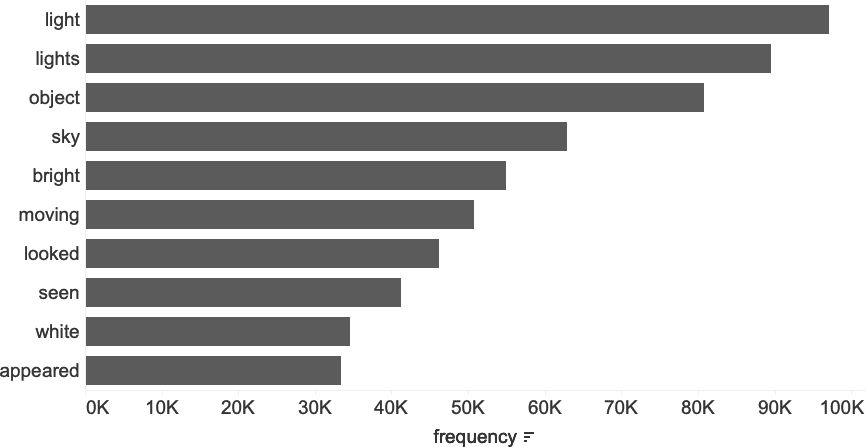

# 第五章：文本分析

在过去的两章中，我们探讨了日期和数字的应用，包括时间序列分析和队列分析。但是数据集通常不仅仅是数字值和相关时间戳。从定性属性到自由文本，字符字段通常包含潜在有趣的信息。尽管数据库擅长于数字计算，如计数、求和和平均值，但它们在处理文本数据方面也非常擅长。

我将从提供 SQL 擅长的文本分析任务概述开始这一章节，以及其他更适合使用其他编程语言的任务。接下来，我会介绍我们的 UFO 目击数据集。然后我们将进入编码部分，涵盖文本特征和分析、使用 SQL 解析数据、进行各种转换、从部分构建新文本，最后在更大的文本块中查找元素，包括使用正则表达式。

# 为什么要使用 SQL 进行文本分析？

在每天产生的海量数据中，有很大一部分是文本：单词、句子、段落，甚至更长的文档。用于分析的文本数据可以来自各种来源，包括人类或计算机应用程序填充的描述符、日志文件、支持票据、客户调查、社交媒体帖子或新闻订阅。数据库中的文本从*结构化*（数据位于不同表字段中，具有不同的含义）到*半结构化*（数据位于不同列中，但可能需要解析或清理才能有用）再到主要是*非结构化*（长 VARCHAR 或 BLOB 字段保存需要在进一步分析之前进行广泛结构化的任意长度字符串）。幸运的是，SQL 具有许多有用的函数，可以结合使用以完成各种文本结构化和分析任务。

## 什么是文本分析？

文本分析是从文本数据中提取意义和洞察的过程。文本分析大致分为两类，可以通过输出是定性还是定量来区分。*定性分析*，也可以称为*文本分析*，旨在理解和综合从单个文本或一组文本中获得的含义，通常应用其他知识或独特的结论。这项工作通常由记者、历史学家和用户体验研究人员完成。*定量分析*也旨在从文本数据中综合信息，但其输出是定量的。任务包括分类和数据提取，并且分析通常以计数或频率的形式进行，通常随时间趋势变化。SQL 更适合于定量分析，因此本章的其余部分将关注此内容。然而，如果有机会与专注于第一类文本分析的同行合作，请务必利用他们的专业知识。将定性与定量结合是获得新洞见并说服不情愿的同事的好方法。

文本分析包括几个目标或策略。第一个是文本提取，其中必须从周围文本中提取有用的数据片段。另一个是分类，其中从文本数据中提取或解析信息，以便为数据库中的行分配标签或类别。另一种策略是情感分析，其目标是理解作者的情绪或意图，从负面到正面的范围。

尽管文本分析已经存在一段时间，但随着机器学习的出现以及处理大量文本数据通常需要的计算资源，对这一领域的兴趣和研究已经蓬勃发展。*自然语言处理*（NLP）在识别、分类甚至生成全新文本数据方面取得了巨大进展。人类语言极为复杂，包括不同的语言和方言、语法和俚语，更不用说成千上万的单词，有些单词具有重叠的含义或微妙地修改其他单词的含义。正如我们将看到的，SQL 在某些形式的文本分析上表现良好，但对于其他更高级的任务，存在更适合的语言和工具。

## 为什么 SQL 是进行文本分析的好选择

使用 SQL 进行文本分析有许多好处。其中一个最明显的好处是当数据已经在数据库中时。现代数据库具有大量的计算能力，可以用于文本任务，除了我们迄今讨论过的其他任务。将数据移动到平面文件中，再用其他语言或工具进行分析是耗时的，因此在数据库内尽可能多地使用 SQL 进行工作具有优势。

如果数据尚未存储在数据库中，对于相对大的数据集，将数据移动到数据库可能是值得的。与电子表格相比，数据库在处理多条记录的转换时更为强大。SQL 不像电子表格那样容易出错，因为不需要复制和粘贴，原始数据保持不变。数据可能会被*UPDATE*命令意外地更改，但这很难发生。

SQL 在最终目标是某种形式的量化时也是一个不错的选择。计数多少支持票包含关键短语以及解析大文本中的类别，这些都是 SQL 发挥作用的好例子。SQL 擅长清理和结构化文本字段。*清理*包括删除额外字符或空格，修正大小写，以及标准化拼写。*结构化*涉及从其他字段中提取或推导元素创建新列，或从不同位置存储的部分构建新字段。字符串函数可以嵌套或应用于其他函数的结果，几乎可以进行任何可能需要的操作。

用于文本分析的 SQL 代码可以简单也可以复杂，但它总是基于规则的。在基于规则的系统中，计算机遵循一组规则或指令——既不多也不少。这与机器学习形成对比，后者根据数据进行调整。规则之所以好，是因为它们易于人类理解。它们以代码形式写下，并可以检查以确保它们产生期望的输出。规则的缺点在于它们可能变得冗长和复杂，特别是在需要处理许多不同情况时。这也可能使它们难以维护。如果输入到列中的数据的结构或类型发生变化，规则集就需要更新。我不止一次地以为自己开始用的是一个看起来简单的 CASE 语句，只有 4 或 5 行，结果随着应用程序的变化它就增长到 50 或 100 行。规则可能仍然是正确的方法，但与开发团队保持同步变更是个好主意。

最后，当您事先知道要查找的内容时，SQL 是一个不错的选择。它有许多强大的功能，包括正则表达式，允许您搜索、提取或替换特定信息。例如，“有多少评论者提到‘短电池寿命’？”这是 SQL 可以帮助您回答的问题。然而，“为什么这些客户生气？”就不会那么容易了。

## SQL 不适合的情况

SQL 基本上允许您利用数据库的力量，应用一组规则（尽管通常是强大的规则）对一组文本进行处理，使其在分析中更加有用。SQL 显然不是文本分析的唯一选择，还有许多情况并非最佳选择。了解这些情况是很有用的。

第一类涵盖了更适合人类处理的用例。当数据集非常小或非常新时，手动标记可能更快且更具信息性。此外，如果目标是阅读所有记录并得出关键主题的定性总结，选择人类更为合适。

第二类情况是当需要搜索和检索包含文本字符串的特定记录，并且需要低延迟时。像 Elasticsearch 或 Splunk 这样的工具已经开发出来为这些用例索引字符串。在 SQL 和数据库中，性能通常是一个问题；这是我们通常尝试将数据结构化为可以更容易通过数据库引擎搜索的离散列的主要原因之一。

第三类包括更广泛的 NLP 类别中的任务，其中机器学习方法以及运行它们的语言（如 Python）是更好的选择。情感分析，用于分析文本中的正面或负面情感范围，仅能以简单方式通过 SQL 处理。例如，“爱”和“恨”可以被提取并用于分类记录，但考虑到可以表达正面和负面情绪的词语范围，以及否定这些词语的各种方式，使用 SQL 几乎不可能创建一个规则集来处理所有情况。词性标注，即将文本中的单词标记为名词、动词等，最好使用 Python 中提供的库来处理。语言生成，即根据从示例文本中学到的内容创建全新文本，是另一个最好用其他工具处理的例子。我们将看到如何通过连接数据片段来创建新文本，但 SQL 仍受规则约束，不会自动从数据集中学习并适应新的示例。

现在，我们已经讨论了使用 SQL 进行文本分析的许多充分理由，以及需要避免的用例类型，接下来让我们在深入研究 SQL 代码之前，先看看我们将在示例中使用的数据集。

# UFO 目击数据集

在本章的示例中，我们将使用由[国家不明飞行物报告中心](http://www.nuforc.org)编制的 UFO 目击数据集。该数据集包含从 2006 年到 2020 年间发布的约 95,000 条报告。这些报告来自通过在线表单输入信息的个人。

我们将使用的表是 `ufo`，它只有两列。第一列是一个名为 `sighting_report` 的复合列，其中包含目击事件发生、报告以及发布的详细信息。它还包含有关目击事件的位置、形状和持续时间的元数据。第二列是一个名为 `description` 的文本字段，其中包含事件的完整描述。图示 5-1 显示了数据的一个示例。


###### 图 5-1\. `ufo` 表的示例

通过本章的示例和讨论，我将展示如何将第一列解析为结构化的日期和描述符。我还将展示如何对`description`字段执行各种分析。如果我持续处理这些数据，我可能会考虑创建一个 ETL 管道，这是一个定期以相同方式处理数据并将结果存储在新表中的作业。然而，在本章的示例中，我们将继续使用原始表格。

让我们进入代码，从 SQL 开始探索和特征化来自目击事件的文本。

# 文本特性

数据库中最灵活的数据类型是 VARCHAR，因为几乎任何数据都可以放入这种类型的字段中。因此，数据库中的文本数据呈现出各种形状和大小。与其他数据集一样，分析和特征化数据是我们首先要做的事情之一。从那里我们可以制定清理和解析分析可能需要的计划。

我们了解文本数据的一种方法是查找每个值中的字符数，可以使用`length`函数（或某些数据库中的`len`）。此函数以字符串或字符字段作为参数，并类似于其他语言和电子表格程序中的函数：

```
SELECT length('Sample string');

length
------
13
```

我们可以创建字段长度的分布来了解典型长度以及是否存在需要特殊处理的极端异常值：

```
SELECT length(sighting_report), count(*) as records
FROM ufo
GROUP BY 1
ORDER BY 1
;

length  records
------  -------
90      1
91      4
92      8
...     ...
```

我们可以在图 5-2 中看到，大多数记录的长度大约在 150 到 180 个字符之间，少数小于 140 或大于 200 个字符。`description`字段的长度范围从 5 到 64,921 个字符不等。我们可以假设即使在进行任何额外的分析之前，这个字段的变化也是非常多样的。


###### 图 5-2\. `*ufo*`表第一列字段长度的分布

让我们看一看`sighting_report`列的几个示例行。在查询工具中，我可能会浏览大约一百行左右以熟悉内容，但这些行代表了列中的值的典型情况：

```
Occurred : 3/4/2018 19:07 (Entered as : 03/04/18 19:07)Reported: 3/6/2018 7:05:12
PM 19:05Posted: 3/8/2018Location: Colorado Springs, COShape: LightDuration:3
minutes
Occurred : 10/16/2017 21:42 (Entered as : 10/16/2017 21:42)Reported: 3/6/2018
5:09:47 PM 17:09Posted: 3/8/2018Location: North Dayton, OHShape: SphereDuration:~5
minutes
Occurred : 2/15/2018 00:10 (Entered as : 2/15/18 0:10)Reported: 3/6/2018 
6:19:54 PM 18:19Posted: 3/8/2018Location: Grand Forks, NDShape: SphereDuration:
5 seconds
```

这些数据可以被称为半结构化或超负荷的。不能直接用于分析，但这里显然存储了明确的信息片段，并且在行之间的模式相似。例如，每一行都有“Occurred”后跟着类似时间戳的内容，“Location”后跟着地点，“Duration”后跟着时间长度。

###### 注意

数据可能因各种原因而最终存在于过多字段中，但我见过两种常见情况。一种情况是源系统或应用程序中没有足够的字段可用于存储所需的所有属性，因此多个属性输入到同一字段中。另一种情况是数据存储在应用程序中的 JSON blob 中，以适应稀疏属性或频繁添加新属性。虽然这两种情况在分析角度上不理想，但只要有一致的结构，通常可以通过 SQL 处理这些情况。

我们的下一步是通过将其解析为多个新字段使此字段更易于使用，每个字段都包含单个信息片段。此过程中的步骤包括：

+   规划所需的输出字段（或字段）

+   应用解析函数

+   应用转换，包括数据类型转换

+   当应用于整个数据集时，请检查结果，因为通常会有一些记录不符合模式

+   重复这些步骤，直到数据处于所需的列和格式中

我们将从`sighting_report`中解析出的新列是`occurred`、`entered_as`、`reported`、`posted`、`location`、`shape`和`duration`。接下来，我们将学习解析函数，并开始构造`ufo`数据集。

# 文本解析

使用 SQL 解析数据是从文本值中提取片段以使其更有用于分析的过程。解析将数据分割成我们想要的部分和“其余所有内容”，尽管通常我们的代码只返回我们想要的部分。

最简单的解析函数从字符串的开头或结尾返回固定数量的字符。`left`函数从字符串的左侧或开头返回字符，而`right`函数从字符串的右侧或结尾返回字符。除此之外，它们的工作方式相同，第一个参数是要解析的值，第二个参数是字符数。任一参数可以是数据库字段或计算，允许动态结果：

```
SELECT left('The data is about UFOs',3) as left_digits
,right('The data is about UFOs',4) as right_digits
;

left_digits  right_digits
-----------  -----
The          UFOs
```

在`ufo`数据集中，我们可以使用`left`函数解析出第一个单词“Occurred”：

```
SELECT left(sighting_report,8) as left_digits
,count(*)
FROM ufo
GROUP BY 1
;

left_digits  count
-----------  -----
Occurred     95463
```

我们可以确认所有记录都以此单词开头，这是个好消息，因为这意味着至少模式的这一部分是一致的。但是，我们真正想要的是发生了什么的值，而不是单词本身，所以让我们再试一次。在第一个示例记录中，发生的时间戳结束于第 25 个字符。为了删除“Occurred”并保留实际时间戳，我们可以使用`right`函数返回最右侧的 14 个字符。请注意，`right`和`left`函数是嵌套的—`right`函数的第一个参数是`left`函数的结果：

```
SELECT right(left(sighting_report,25),14) as occurred
FROM ufo
;

occurred
--------------
3/4/2018 19:07
10/16/2017 21:
2/15/2018 00:1
...
```

虽然这可以为第一条记录返回正确结果，但不幸的是，它无法处理具有两位数月份或日期值的记录。我们可以增加`left`和`right`函数返回的字符数，但结果将包含第一条记录的太多字符。

`left`和`right`函数对于提取字符串的固定长度部分非常有用，例如我们提取单词“Occurred”的操作，但对于更复杂的模式，名为`split_part`的函数更加实用。这个函数的想法是基于分隔符将字符串拆分为部分，然后允许您选择特定的部分。*分隔符*是用于指定文本或其他数据区域边界的一个或多个字符。逗号分隔符和制表符分隔符可能是最常见的，因为它们用于文本文件（如*.csv*、*.tsv*或*.txt*文件）中表示列的起始和结束位置。但是，任何字符序列都可以使用，这在我们的解析任务中会非常有用。函数的形式是：

```
split_part(string or field name, delimiter, index)
```

索引是要返回的文本相对于分隔符的位置。因此，索引 = 1 返回分隔符的第一个实例左侧的所有文本，索引 = 2 返回第一个和第二个分隔符之间的文本（或者如果分隔符仅出现一次，则返回分隔符右侧的所有文本），依此类推。没有零索引，值必须是正整数：

```
SELECT split_part('This is an example of an example string'
                  ,'an example'
                  ,1);

split_part
----------
This is 

SELECT split_part('This is an example of an example string'
                  ,'an example'
                  ,2);

split_part
----------
 of
```

###### 提示

MySQL 有一个`substring_index`函数，而 SQL Server 根本没有`split_part`函数。

注意文本中的空格将保留，除非指定为分隔符的一部分。让我们看看如何解析`sighting_report`列的元素。作为提醒，样本值如下所示：

```
Occurred : 6/3/2014 23:00 (Entered as : 06/03/14 11:00)Reported: 6/3/2014 10:33:24
PM 22:33Posted: 6/4/2014Location: Bethesda, MDShape: LightDuration:15 minutes
```

我们希望查询返回的值是“Occurred : ”和“ (Entered”之间的文本。也就是说，我们想要字符串“6/3/2014 23:00”。检查样本文本，“Occurred :”和“(Entered”只出现一次。冒号（:）多次出现，既用于将标签与值分隔开，又用于时间戳中间。这可能使得使用冒号进行解析变得棘手。开括号字符只出现一次。我们可以选择指定作为分隔符的内容，选择较长的字符串或仅包含拆分字符串所需的最少字符。我倾向于稍微冗长一些，以确保我确实获得我想要的那部分内容，但这真的取决于情况。

首先，在“Occurred : ”上拆分`sighting_report`，并检查结果：

```
SELECT split_part(sighting_report,'Occurred : ',2) as split_1
FROM ufo
;

split_1
--------------------------------------------------------------
6/3/2014 23:00 (Entered as : 06/03/14 11:00)Reported: 6/3/2014 10:33:24 PM
22:33Posted: 6/4/2014Location: Bethesda, MDShape: LightDuration:15 minutes
```

我们已成功移除标签，但仍有大量多余文本。让我们在“ (Entered”处拆分时检查结果：

```
SELECT split_part(sighting_report,' (Entered',1) as split_2
FROM ufo
;

split_2
-------------------------
Occurred : 6/3/2014 23:00
```

这更接近了，但结果中仍然有标签。幸运的是，嵌套使用`split_part`函数将仅返回所需的日期和时间值：

```
SELECT split_part(
         split_part(sighting_report,' (Entered',1)
         ,'Occurred : ',2) as occurred
FROM ufo
;

occurred
---------------
6/3/2014 23:00
4/25/2014 21:15
5/25/2014
```

现在结果包含了所需的值。再查看一些额外的行显示，两位数的日和月值已经适当处理，没有时间值的日期也是如此。事实证明，一些记录省略了“输入为”值，因此需要额外的拆分以处理标记为所需字符串末尾的“报告”标签的记录：

```
SELECT 
split_part(
  split_part(
    split_part(sighting_report,' (Entered',1)
    ,'Occurred : ',2)
    ,'Reported',1) as occurred
FROM ufo
;

occurred
---------------
6/24/1980 14:00
4/6/2006 02:05
9/11/2001 09:00
...
```

用 SQL 代码解析出来的最常见的 `发生` 值在 图 5-3 中被绘制。


###### 图 5-3\. UFO 目击事件中前 10 个最常见的 `发生` 值

###### 小贴士

找到适用于数据集中所有值的函数集是文本解析中最难的部分之一。通常需要多轮尝试和逐步分析结果来正确处理它。

下一步是应用类似的解析规则，以提取其他所需字段，使用起始和结束定界符来隔离字符串的相关部分。最终查询在几个值中多次使用 `split_part`，每个值都有不同的参数：

```
SELECT 
  split_part(
    split_part(
      split_part(sighting_report,' (Entered',1)
      ,'Occurred : ',2)
    ,'Reported',1) as occurred
,split_part(
  split_part(sighting_report,')',1)
    ,'Entered as : ',2) as entered_as
,split_part(
  split_part(
    split_part(
      split_part(sighting_report,'Post',1)
      ,'Reported: ',2)
    ,' AM',1)
  ,' PM',1) as reported
,split_part(split_part(sighting_report,'Location',1),'Posted: ',2) 
  as posted
,split_part(split_part(sighting_report,'Shape',1),'Location: ',2) 
  as location
,split_part(split_part(sighting_report,'Duration',1),'Shape: ',2) 
  as shape
,split_part(sighting_report,'Duration:',2) as duration
FROM ufo
;

occurred   entered_as   reported  posted   location     shape       duration
--------   ----------   --------  -------  -----------  ---------   -----------
7/4/2...   07/04/2...   7/5...    7/5/...  Columbus...  Formation   15 minutes
7/4/2...   07/04/2...   7/5...    7/5/...  St. John...  Circle      2-3 minutes
7/4/2...   07/7/1...    7/5...    7/5/...  Royal Pa...  Circle      3 minutes
...        ...          ...       ...      ...          ...         ...
```

通过这种 SQL 解析，数据现在处于更加结构化和可用的格式中。然而，在我们完成之前，还有一些转换可以进一步清理数据。我们将接下来查看这些字符串转换函数。

# 文本转换

转换会以某种方式更改字符串值。我们在 第三章 中看到了许多日期和时间戳转换函数。SQL 中有一组专门处理字符串值的函数。这些对于处理解析后的数据非常有用，也适用于需要调整或清理分析的任何数据库文本数据。

最常见的转换之一是更改大小写的转换。`upper` 函数将所有字母转换为大写形式，而 `lower` 函数则将所有字母转换为小写形式。例如：

```
SELECT upper('Some sample text');

upper
----------------
SOME SAMPLE TEXT

SELECT lower('Some sample text');

lower
----------------
some sample text
```

这些方法对于标准化可能以不同方式输入的值非常有用。例如，任何人都会意识到，“加利福尼亚”，“caLiforNia”和“CALIFORNIA”指的是同一个州，但数据库会将它们视为不同的值。如果我们按这些值按州统计 UFO 目击事件，我们会得到三条加利福尼亚州的记录，导致分析结论不正确。将它们全部转换为大写或小写字母可以解决这个问题。一些数据库，包括 Postgres，具有 `initcap` 函数，该函数会将字符串中每个单词的首字母大写。这对于专有名词（例如州名）非常有用：

```
SELECT initcap('caLiforNia'), initcap('golden gate bridge');

initcap     initcap
----------  ------------------
California  Golden Gate Bridge
```

我们解析的数据集中的 `shape` 字段包含一个全大写的值，“TRIANGULAR”。为了清理并将其与其他只有首字母大写的值标准化，应用 `initcap` 函数：

```
SELECT distinct shape, initcap(shape) as shape_clean
FROM
(
    SELECT split_part(
             split_part(sighting_report,'Duration',1)
             ,'Shape: ',2) as shape
    FROM ufo
) a
;

shape       shape_clean
----------  -----------
...         ... 
Sphere      Sphere
TRIANGULAR  Triangular
Teardrop    Teardrop
...         ...
```

每种形状的目击次数显示在图 5-4 中。光是远远最常见的形状，其次是圆形和三角形。一些目击没有报告形状，因此在图表中也会出现空值计数。


###### 图 5-4。UFO 目击中形状的频率

另一个有用的转换函数是称为`trim`的函数，它删除字符串开头和结尾的空格。在解析较长字符串的值或将数据从一个应用程序复制到另一个应用程序时，额外的空白字符是常见问题。例如，我们可以使用`trim`函数在以下字符串中的“California”之前去除前导空格：

```
SELECT trim('  California  ');

trim
----------
California
```

函数`trim`有一些可选参数，使其在各种数据清理挑战中非常灵活。首先，它可以从字符串的开头或末尾（或两者）移除字符。从两端修剪是默认设置，但其他选项可以通过`leading`或`trailing`指定。另外，`trim`可以移除任何字符，而不仅仅是空白字符。例如，如果某个应用程序出于某种原因在每个州名开头放置了美元符号（$），我们可以使用`trim`来移除它：

```
SELECT trim(leading '$' from '$California');
```

`duration`字段中的一些值有前导空格，因此应用`trim`将产生更清晰的输出：

```
SELECT duration, trim(duration) as duration_clean
FROM
(
    SELECT split_part(sighting_report,'Duration:',2) as duration
    FROM ufo
) a
;

duration               duration_clean
---------------------  --------------------
 ~2 seconds            ~2 seconds
 15 minutes            15 minutes
 20 minutes (ongoing)  20 minutes (ongoing)
```

最常见持续时间的目击次数在图 5-5 中绘制。持续 1 到 10 分钟的目击很常见。一些目击没有报告持续时间，因此在图表中显示空值计数。


###### 图 5-5。UFO 目击最常见的前 10 个持续时间

下一种转换类型是数据类型转换。这种转换类型在第二章中讨论，对于确保我们解析结果具有预期数据类型将非常有用。在我们的情况中，有两个字段应视为时间戳——`occurred`和`reported`列，`posted`列应为日期类型。数据类型可以通过强制转换来更改，可以使用双冒号(::)运算符或`CAST field as type`语法。我们将`entered_as`、`location`、`shape`和`duration`的值保留为 VARCHAR：

```
SELECT occurred::timestamp
,reported::timestamp as reported
,posted::date as posted
FROM
(
    SELECT 
    split_part(
      split_part(
        split_part(sighting_report,' (Entered',1)
        ,'Occurred : ',2)
      ,'Reported',1) 
      as occurred   
    ,split_part(
      split_part(
        split_part(
          split_part(sighting_report,'Post',1)
          ,'Reported: ',2)
        ,' AM',1),' PM',1) 
      as reported
    ,split_part(
      split_part(sighting_report,'Location',1)
      ,'Posted: ',2) 
      as posted
    FROM ufo
) a
;

occurred             reported             posted
-------------------  -------------------  ----------
2015-05-24 19:30:00  2015-05-25 10:07:21  2015-05-29
2015-05-24 22:40:00  2015-05-25 09:09:09  2015-05-29
2015-05-24 22:30:00  2015-05-24 10:49:43  2015-05-29
...                  ...                  ...
```

数据的一个样本转换为新的格式。请注意，数据库将秒数添加到时间戳中，即使原始值中没有秒数，并且正确识别了以月/日/年（mm/dd/yyyy）格式存在的日期。¹ 然而，在将这些转换应用于整个数据集时存在问题。一些记录根本没有值，显示为空字符串，而一些记录具有时间值但没有与之关联的日期。尽管空字符串和 null 看起来包含相同的信息——什么都没有——但数据库对它们的处理方式不同。空字符串仍然是字符串，无法转换为另一种数据类型。通过使用 CASE 语句将所有不符合规范的记录设置为 null，可以使类型转换正常工作。由于我们知道日期必须至少包含八个字符（年份四位数字，月份和日期各一到两位数字，以及两个“-”或“/”字符），因此可以通过使用 CASE 语句将长度小于 8 的任何记录设置为 null 来实现这一点：

```
SELECT 
case when occurred = '' then null 
     when length(occurred) < 8 then null
     else occurred::timestamp 
     end as occurred
,case when length(reported) < 8 then null
      else reported::timestamp 
      end as reported
,case when posted = '' then null
      else posted::date  
      end as posted
FROM
(
    SELECT 
    split_part(
      split_part(
        split_part(sighting_report,'(Entered',1)
        ,'Occurred : ',2)
      ,'Reported',1) as occurred 
    ,split_part(
      split_part(
        split_part(
          split_part(sighting_report,'Post',1)
          ,'Reported: ',2)
        ,' AM',1)
      ,' PM',1) as reported
    ,split_part(
       split_part(sighting_report,'Location',1)
       ,'Posted: ',2) as posted
    FROM ufo
) a
;

occurred             reported             posted
-------------------  -------------------  ----------
1991-10-01 14:00:00  2018-03-06 08:54:22  2018-03-08
2018-03-04 19:07:00  2018-03-06 07:05:12  2018-03-08
2017-10-16 21:42:00  2018-03-06 05:09:47  2018-03-08
...                  ...                  ...
```

我将在本节中讨论的最后一个转换是`replace`函数。有时，在字段中有一个词、短语或其他字符串，我们想要将其更改为另一个字符串或完全删除。`replace`函数在这种情况下非常有用。它接受三个参数——原始文本、要查找的字符串和要替换的字符串：

```
replace(string or field, string to find, string to substitute)
```

所以，例如，如果我们想要将“未识别飞行物体”的引用更改为“UFO”，我们可以使用`replace`函数：

```
SELECT replace('Some unidentified flying objects were noticed
above...','unidentified flying objects','UFOs');

replace
-------------------------------
Some UFOs were noticed above...
```

该函数将查找并替换第二个参数中的每个实例，无论其出现在何处。可以使用空字符串作为第三个参数，这是删除不需要的字符串部分的好方法。与其他字符串函数一样，`replace`可以嵌套，其中一个`replace`的输出成为另一个的输入。

在我们正在处理的解析的 UFO 目击数据集中，一些`location`值包括指示目击发生在城市或镇“附近”、“靠近”或“外面”的修饰词。我们可以使用`replace`来将这些标准化为“near”：

```
SELECT location
,replace(replace(location,'close to','near')
         ,'outside of','near') as location_clean
FROM
(
    SELECT split_part(split_part(sighting_report,'Shape',1)
                      ,'Location: ',2) as location
    FROM ufo
) a
;

location                     location_clean
---------------------------  ---------------------
Tombstone (outside of), AZ   Tombstone (near), AZ
Terrell (close to), TX       Terrell (near), TX
Tehachapie (outside of), CA  Tehachapie (near), CA
...                          ...
```

最常见的 UFO 目击地点的前十名已在图 5-6 中绘制出来。


###### 图 5-6. UFO 目击最常见的地点

现在，我们已经解析并清理了`sighting_report`字段的所有元素，将它们转换为了不同类型的列。最终的代码看起来像这样：

```
SELECT 
case when occurred = '' then null 
     when length(occurred) < 8 then null
     else occurred::timestamp 
     end as occurred
,entered_as
,case when length(reported) < 8 then null
      else reported::timestamp 
      end as reported
,case when posted = '' then null
      else posted::date  
      end as posted
,replace(replace(location,'close to','near'),'outside of','near') 
 as location
,initcap(shape) as shape
,trim(duration) as duration
FROM
(
    SELECT 
    split_part(
        split_part(split_part(sighting_report,' (Entered',1)
          ,'Occurred : ',2)
          ,'Reported',1) as occurred
    ,split_part(
      split_part(sighting_report,')',1)
        ,'Entered as : ',2) as entered_as   
    ,split_part(
      split_part(
        split_part(
          split_part(sighting_report,'Post',1)
          ,'Reported: ',2)
        ,' AM',1)
      ,' PM',1) as reported
    ,split_part(
       split_part(sighting_report,'Location',1)
       ,'Posted: ',2) as posted
    ,split_part(
       split_part(sighting_report,'Shape',1)
       ,'Location: ',2) as location
    ,split_part(
       split_part(sighting_report,'Duration',1)
       ,'Shape: ',2) as shape
    ,split_part(sighting_report,'Duration:',2) as duration
    FROM ufo
) a
;

occurred   entered_as  reported  posted   location     shape      duration
--------   ----------  --------  -------  ----------   --------   ----------
1988-...   8-8-198...  2018-...  2018...  Amity, ...   Unknown    4 minutes
2018-...   07/41/1...  2018-...  2018...  Bakersf...   Triangle   15 minutes
2018-...   08/01/1...  2018-...  2018...  Naples,...   Light      10 seconds
...        ...         ...       ...      ...          ...        ...
```

这段 SQL 代码可以在其他查询中重复使用，或者可以用于将原始 UFO 数据复制到新的清理过的表中。或者，它可以转换为视图或放入通用表达式以供重用。第八章将更详细地讨论这些策略。

我们已经看到如何应用解析和转换函数来清理和改善具有一定结构的文本数据的分析价值。接下来，我们将看看 UFO 目击数据集中的另一个字段，即自由文本`description`字段，并学习如何使用 SQL 函数来搜索特定元素。

# 在更大的文本块中查找元素

解析和转换是应用于文本数据的常见操作，以准备进行分析。另一个常见的操作是在更大的文本块中查找字符串。这可以用来过滤结果、分类记录或用替代值替换搜索的字符串。

## 通配符匹配：LIKE, ILIKE

SQL 具有几个用于在字符串中匹配模式的函数。LIKE 运算符在字符串中匹配指定的模式。为了允许它匹配模式而不仅仅是找到精确匹配，可以在模式的前面、后面或中间添加通配符符号。“%”通配符匹配零个或多个字符，“_”通配符匹配正好一个字符。如果目标是匹配“%”或“_”本身，请在该字符前面放置反斜杠转义符（“\”）：

```
SELECT 'this is an example string' like '%example%';

true

SELECT 'this is an example string' like '%abc%';

false

SELECT 'this is an example string' like '%this_is%';

true
```

LIKE 运算符可以在 SQL 语句的多个子句中使用。它可以用于在*WHERE*子句中过滤记录。例如，一些报告者提到他们当时与配偶在一起，因此我们可能想知道有多少份报告提到了“wife”。由于我们希望在描述文本的任何位置找到字符串，“%”通配符将在“wife”之前和之后放置：

```
SELECT count(*)
FROM ufo
WHERE description like '%wife%'
;

count
-----
6231
```

我们可以看到，超过六千份报告提到了“wife”。但是，这只会返回小写字符串的匹配项。如果有些报告者提到了“Wife”，或者他们在键入“WIFE”时忘记了大小写锁定键呢？有两种选项可以使搜索不区分大小写。一种选项是将要搜索的字段转换为前一节中讨论的`upper`或`lower`函数，这样做的效果是使搜索不区分大小写，因为字符都是大写或小写：

```
SELECT count(*)
FROM ufo
WHERE lower(description) like '%wife%'
;

count
-----
6439
```

另一种实现此目的的方法是使用 ILIKE 运算符，这实际上是一个不区分大小写的 LIKE 运算符。缺点是它不适用于每个数据库；特别是，MySQL 和 SQL Server 不支持它。但是，如果您在支持它的数据库中工作，这是一个不错的、简洁的语法选项：

```
SELECT count(*)
FROM ufo
WHERE description ilike '%wife%'
;

count
-----
6439
```

LIKE 和 ILIKE 的任何这些变体都可以通过 NOT 进行否定。因此，例如，要找到不提到“wife”的记录，我们可以使用 NOT LIKE：

```
SELECT count(*)
FROM ufo
WHERE lower(description) not like '%wife%'
;

count
-----
89024
```

可以使用 AND 和 OR 操作符对多个字符串进行过滤：

```
SELECT count(*)
FROM ufo
WHERE lower(description) like '%wife%'
or lower(description) like '%husband%'
;

count
-----
10571
```

在使用 OR 与 AND 操作符结合时，请务必使用括号来控制操作的顺序，否则可能会得到意外的结果。例如，这些*WHERE*子句由于 OR 在 AND 之前进行评估，所以返回的结果不相同：

```
SELECT count(*)
FROM ufo
WHERE lower(description) like '%wife%'
or lower(description) like '%husband%'
and lower(description) like '%mother%'
;

count
-----
6610

SELECT count(*)
FROM ufo
WHERE (lower(description) like '%wife%'
       or lower(description) like '%husband%'
       )
and lower(description) like '%mother%'
;

count
-----
382
```

除了在*WHERE*或*JOIN*...*ON*子句中进行过滤之外，LIKE 还可以在*SELECT*子句中用于对某些记录进行分类或聚合。让我们从分类开始。LIKE 运算符可以在 CASE 语句内部使用，以标记和分组记录。一些描述中提到观察者在目击期间或之前正在进行的活动，如驾驶或步行。通过使用带有 LIKE 的 CASE 语句，我们可以找出有多少描述包含这些术语：

```
SELECT 
case when lower(description) like '%driving%' then 'driving'
     when lower(description) like '%walking%' then 'walking'
     when lower(description) like '%running%' then 'running'
     when lower(description) like '%cycling%' then 'cycling'
     when lower(description) like '%swimming%' then 'swimming'
     else 'none' end as activity
,count(*)
FROM ufo
GROUP BY 1
ORDER BY 2 desc
;

activity  count
--------  -----
none      77728
driving   11675
walking   4516
running   1306
swimming  196
cycling   42
```

最常见的活动是驾驶，而不是很多人在游泳或骑行时报告目击。这或许并不令人惊讶，因为这些活动相对于驾驶来说较少见。

###### 小贴士

尽管通过文本解析转换函数得到的值可以用于*JOIN*条件，但数据库性能通常是一个问题。考虑在子查询中进行解析和/或转换，然后将结果与*JOIN*子句中的精确匹配进行连接。

请注意，此 CASE 语句仅为每个描述标记一个活动，并评估每条记录是否与语句中写入的模式匹配。包含“驾驶”和“步行”等内容的描述将被标记为“驾驶”。在许多情况下，这是合适的，特别是在分析较长的文本（如评论、调查评论或支持票证）时，标记记录具有多个类别的能力至关重要。对于这种用例，需要一系列二进制或布尔标志列。

我们之前看到，LIKE 可以用于生成 TRUE 或 FALSE 的布尔响应，并且我们可以使用它来标记行。在数据集中，许多描述提到了检测到对象的方向，如北或南，有些描述提到了多个方向。我们可能希望为每条记录添加一个字段，指示描述中是否提到了每个方向：

```
SELECT description ilike '%south%' as south
,description ilike '%north%' as north
,description ilike '%east%' as east
,description ilike '%west%' as west
,count(*)
FROM ufo
GROUP BY 1,2,3,4
ORDER BY 1,2,3,4
;
```

```
south  north  east   west   count
-----  -----  ----   -----  -----
false  false  false  false  43757
false  false  false  true   3963
false  false  true   false  5724
false  false  true   true   4202
false  true   false  false  4048
false  true   false  true   2607
false  true   true   false  3299
false  true   true   true   2592
true   false  false  false  3687
true   false  false  true   2571
true   false  true   false  3041
true   false  true   true   2491
true   true   false  false  3440
true   true   false  true   2064
true   true   true   false  2684
true   true   true   true   5293
```

结果是一个布尔矩阵，可以用来查找各种方向组合的频率，或者查找在同一描述中使用某个方向而不使用其他方向的情况。

所有这些组合在某些情境中都很有用，特别是在构建将由其他人用于探索数据或在 BI 或可视化工具中使用的数据集时。然而，有时更有用的是进一步总结数据并对包含字符串模式的记录执行聚合。在这里，我们将计算记录的数量，但如果数据集包含其他数值字段（如销售数据），也可以使用诸如`sum`和`average`之类的其他聚合函数：

```
SELECT 
count(case when description ilike '%south%' then 1 end) as south
,count(case when description ilike '%north%' then 1 end) as north
,count(case when description ilike '%west%' then 1 end) as west
,count(case when description ilike '%east%' then 1 end) as east
FROM ufo
;

south  north  west   east
-----  -----  -----  -----
25271  26027  25783  29326
```

现在我们对描述字段中方向术语的频率有了一个更紧凑的总结，可以看到“东”比其他方向提到得更频繁。结果在图 5-7 中绘制出来。


###### 图 5-7\. UFO 目击报告中罗盘方向频率

在前面的查询中，我们仍然允许包含多个方向的记录被计数多次。然而，现在无法看到具体的组合情况。可以根据需要在查询中添加复杂性，以处理此类情况，例如：

```
count(case when description ilike '%east%' 
and description ilike '%north%' then 1 end) as east
```

使用 LIKE、NOT LIKE 和 ILIKE 进行模式匹配是灵活的，可以在 SQL 查询的各种地方使用，以过滤、分类和聚合数据，以满足各种输出需求。这些操作符可以与我们之前讨论的文本解析和转换函数结合使用，提供更多的灵活性。接下来，我将讨论在匹配完全匹配时处理多个元素，然后返回讨论正则表达式中的更多模式。

## 精确匹配：IN、NOT IN

在我们继续讨论使用正则表达式进行更复杂的模式匹配之前，值得看看一些在文本分析中有用的额外操作符。虽然这些操作符不完全是关于模式匹配的，但它们通常与 LIKE 及其相关操作符一起使用，以制定一个包含准确结果集的规则集。操作符包括 IN 及其否定形式 NOT IN。这些操作符允许你指定一个匹配列表，从而使代码更加紧凑。

让我们假设我们有兴趣根据`description`的第一个单词来对目击事件进行分类。我们可以使用`split_part`函数，空格作为分隔符，找到第一个单词。许多报告以颜色作为第一个单词开始。我们可能想筛选记录，以查看以命名颜色开始的报告。这可以通过列出每种颜色并使用 OR 构造来完成：

```
SELECT first_word, description
FROM
(
    SELECT split_part(description,' ',1) as first_word
    ,description
    FROM ufo
) a
WHERE first_word = 'Red'
or first_word = 'Orange'
or first_word = 'Yellow'
or first_word = 'Green'
or first_word = 'Blue'
or first_word = 'Purple'
or first_word = 'White'
;

first_word  description
----------  ----------------------------------------------------
Blue        Blue Floating LightSaw blue light hovering...
White       White dot of light traveled across the sky, very...
Blue        Blue Beam project known seen from the high desert... 
...         ...
```

使用 IN 列表更为紧凑，并且通常更不易出错，特别是在*WHERE*子句中有其他元素时。IN 接受一个由逗号分隔的项列表进行匹配。元素的数据类型应与列的数据类型匹配。如果数据类型为数字，元素应为数字；如果数据类型为文本，元素应作为文本加引号（即使元素是数字）：

```
SELECT first_word, description
FROM
(
    SELECT split_part(description,' ',1) as first_word
    ,description
    FROM ufo
) a
WHERE first_word in ('Red','Orange','Yellow','Green','Blue','Purple','White')
;

first_word  description
----------  ----------------------------------------------------
Red         Red sphere with yellow light in middleMy Grandson... 
Blue        Blue light fireball shape shifted into several...
Orange      Orange lights.Strange orange-yellow hovering not...
...         ...
```

两   这两种形式在结果上是相同的，频率显示在图 5-8 中。


###### 图 5-8。UFO 目击描述中选择颜色作为第一个单词的频率

IN 和 NOT IN 的主要好处是它们使代码更加紧凑和易读。当在*SELECT*子句中创建更复杂的分类时，这非常有用。例如，假设我们想按第一个单词将记录分类和计数为颜色、形状、移动或其他可能的单词。我们可能会想出类似以下内容的组合，结合了解析、转换、模式匹配和 IN 列表的元素：

```
SELECT 
case when lower(first_word) in ('red','orange','yellow','green', 
'blue','purple','white') then 'Color'
when lower(first_word) in ('round','circular','oval','cigar') 
then 'Shape'
when first_word ilike 'triang%' then 'Shape'
when first_word ilike 'flash%' then 'Motion'
when first_word ilike 'hover%' then 'Motion'
when first_word ilike 'pulsat%' then 'Motion'
else 'Other' 
end as first_word_type
,count(*)
FROM
(
    SELECT split_part(description,' ',1) as first_word
    ,description
    FROM ufo
) a
GROUP BY 1
ORDER BY 2 desc
;

first_word_type  count
---------------  -----
Other            85268
Color            6196
Shape            2951
Motion           1048
```

当然，考虑到这个数据集的特性，可能需要更多的代码行和规则来准确分类报告的第一个单词。SQL 允许你创建各种复杂和微妙的表达式来处理文本数据。接下来，我们将探讨在 SQL 中处理文本数据更加复杂的方法，使用正则表达式。

## 正则表达式

在 SQL 中有许多匹配模式的方法。其中一种最强大的方法，尽管也很令人困惑，是使用正则表达式（regex）。我承认，我对正则表达式感到有些害怕，而且在我的数据分析职业生涯中很长一段时间内避免使用它们。在紧急情况下，我很幸运有同事愿意分享代码片段，并帮助我解决工作中遇到的问题。直到我接手了一个大型文本分析项目，我才决定是时候学习它们了。

*正则表达式*是由许多具有特殊含义的字符序列组成，用于定义搜索模式。学习正则表达式的主要挑战，以及在使用和维护包含它的代码时，其语法并不特别直观。代码片段读起来不像人类语言，甚至不像 SQL 或 Python 等计算机语言。然而，只要掌握了特殊字符的工作原理，就可以编写和解密代码。与我们所有查询的代码一样，从简单开始，根据需要增加复杂性，并在进行过程中检查结果是个好主意。同时，为其他分析员和未来的你留下大量注释也很重要。

正则表达式是一种语言，但仅在其他语言中使用。例如，正则表达式可以在 Java、Python 和 SQL 中调用，但没有独立的编程方式。所有主要的数据库都有某种形式的正则表达式实现。尽管语法不总是完全相同，但与其他函数一样，一旦你了解了可能性，调整语法以适应你的环境就是可能的。

完整的解释以及正则表达式的所有语法和用法超出了本书的范围，但我将展示足够的内容让你开始并完成一些 SQL 中的常见任务。如果你需要更详细的介绍，可以选择 Ben Forta（O’Reilly）的*[学习正则表达式](https://oreil.ly/5aYkb)*。首先，我将介绍如何向数据库指示你正在使用正则表达式，然后介绍语法，并且示例说明正则表达式在 UFO 目击报告分析中的实际用途。

在 SQL 语句中可以用正则表达式有两种方式。第一种是使用 POSIX 比较器，第二种是使用正则表达式函数。POSIX 代表可移植操作系统接口，是一组 IEEE 标准，但你只需知道这些即可在 SQL 代码中使用 POSIX 比较器。第一个比较器是 ~（波浪线）符号，用于比较两个语句，如果一个字符串包含在另一个字符串中则返回 TRUE。举个简单例子，我们可以检查字符串 “The data is about UFOs” 是否包含字符串 “data”：

```
SELECT 'The data is about UFOs' ~ 'data' as comparison;

comparison
----------
true
```

返回值是一个 BOOLEAN，TRUE 或 FALSE。注意，尽管它不包含任何特殊语法，“data” 是一个正则表达式。正则表达式也可以包含普通文本字符串。这个例子类似于使用 LIKE 运算符完成的功能。~ 比较器是区分大小写的。要使它不区分大小写，类似于 ILIKE，使用 ~*（波浪线后跟一个星号）：

```
SELECT 'The data is about UFOs' ~* 'DATA' as comparison;

comparison
----------
true
```

要对比较器取反，可以在波浪线或波浪线后跟星号的组合前加一个 !（感叹号）：

```
SELECT 'The data is about UFOs' !~ 'alligators' as comparison;

comparison
----------
true
```

表 5-1 总结了四个 POSIX 比较器。

表 5-1\. POSIX 比较器

| 语法 | 功能 | 区分大小写？ |
| --- | --- | --- |
| ~ | 比较两个语句，如果一个包含在另一个中则返回 TRUE | 是 |
| ~* | 比较两个语句，如果一个包含在另一个中则返回 TRUE | 否 |
| !~ | 比较两个语句，如果一个包含在另一个中则返回 FALSE | 是 |
| !~* | 比较两个语句，如果一个包含在另一个中则返回 FALSE | 否 |

现在我们有了一种方法在 SQL 中引入正则表达式，让我们熟悉一些它提供的特殊模式匹配语法。要知道的第一个特殊字符是 .（句点）符号，它是用于匹配任何单个字符的通配符：

```
SELECT 
'The data is about UFOs' ~ '. data' as comparison_1
,'The data is about UFOs' ~ '.The' as comparison_2
;

comparison_1  comparison_2
------------  ------------
true          false
```

让我们分解这个过程，以便理解正在发生的事情，并培养我们对正则表达式如何工作的直觉。在第一个比较中，模式尝试匹配任何字符（由句点表示），然后是一个空格，然后是单词 “data”。这个模式在示例句子中匹配字符串 “e data”，因此返回 TRUE。如果这看起来反直觉，因为在字母 “e” 前面和 “data” 后面有额外的字符，记住比较器只是在字符串中某处寻找这个模式，类似于 LIKE 运算符。在第二个比较中，模式尝试匹配任何字符后跟 “The”。由于在示例句子中 “The” 是字符串的开头，并且它之前没有字符，因此返回 FALSE。

要匹配多个字符，请使用 *（星号）符号。这将匹配零个或多个字符，类似于在 LIKE 语句中使用%（百分号）符号。 这种星号的用法不同于将其立即放在波浪号（~*）之后，后者使匹配不区分大小写。但是请注意，在这种情况下，“%”不是通配符，而是要匹配的文字字符：

```
SELECT 'The data is about UFOs' ~ 'data *' as comparison_1
,'The data is about UFOs' ~ 'data %' as comparison_2
;

comparison_1  comparison_2
------------  ------------
true          false
```

下一个需要了解的特殊字符是 [ 和 ]（左方括号和右方括号）。它们用于括住一组字符，其中任何一个必须匹配。尽管方括号之间可以有多个字符，但它们匹配单个字符，不过我们很快将看到如何多次匹配。方括号的一个用途是通过在方括号内将大写和小写字母括起来使模式部分不区分大小写（不要使用逗号，因为那会匹配逗号字符本身）：

```
SELECT 'The data is about UFOs' ~ '[Tt]he' as comparison;

comparison
----------
true
```

在此示例中，该模式将匹配“the”或“The”；由于此字符串是例句的开头，语句返回 TRUE 值。 这与不区分大小写匹配~*并不完全相同，因为在此案例中，“tHe”和“THE”等变体不匹配该模式：

```
SELECT 'The data is about UFOs' ~ '[Tt]he' as comparison_1
,'the data is about UFOs' ~ '[Tt]he' as comparison_2
,'tHe data is about UFOs' ~ '[Tt]he' as comparison_3
,'THE data is about UFOs' ~ '[Tt]he' as comparison_4
;

comparison_1  comparison_2  comparison_3  comparison_4
------------  ------------  ------------  ------------
true          true          false         false
```

方括号集合匹配的另一种用途是匹配包含数字的模式，允许任何数字。例如，想象一下我们想匹配任何提到“7 分钟”，“8 分钟”或“9 分钟”的描述。这可以通过使用带有几个 LIKE 操作符的 CASE 语句来实现，但是使用正则表达式的模式语法更加紧凑：

```
SELECT 'sighting lasted 8 minutes' ~ '[789] minutes' as comparison;

comparison
----------
true
```

要匹配任何数字，我们可以在方括号之间包含所有数字：

```
[0123456789]
```

然而，正则表达式允许使用 -（短划线）分隔符输入一系列字符。 所有数字可以用[0-9]表示。 也可以使用更小的数字范围，例如[0-3]或[4-9]。 此模式，与范围一起使用，相当于最后一个列出每个数字的示例：

```
SELECT 'sighting lasted 8 minutes' ~ '[7-9] minutes' as comparison;

comparison
----------
true
```

字母范围可以以类似的方式匹配。 表 5-2 总结了在 SQL 分析中最有用的范围模式。非数字和非字母的值也可以放在方括号之间，例如 [$%@]。

表 5-2\. 正则表达式范围模式

| 范围模式 | 目的 |
| --- | --- |
| [0-9] | 匹配任何数字 |
| [a-z] | 匹配任何小写字母 |
| [A-Z] | 匹配任何大写字母 |
| [A-Za-z0-9] | 匹配任何小写字母或大写字母，或任何数字 |
| [A-z] | 匹配任何 ASCII 字符；通常不使用，因为它匹配所有内容，包括符号 |

如果所需的模式匹配包含特定值或类型的值的多个实例，则一种选项是包括所需数量的范围，依次排列。例如，我们可以通过多次重复数字范围符号来匹配三位数：

```
SELECT 'driving on 495 south' ~ 'on [0-9][0-9][0-9]' as comparison;

comparison
----------
true
```

另一种选择是使用可选的特殊语法之一来多次重复模式。当你不确定模式将重复多少次时，这可能很有用，但要小心检查结果，确保不要意外返回比预期更多的匹配项。要匹配一次或多次，请在模式后面加上+（加号）符号：

```
SELECT 
'driving on 495 south' ~ 'on [0-9]+' as comparison_1
,'driving on 1 south' ~ 'on [0-9]+' as comparison_2
,'driving on 38east' ~ 'on [0-9]+' as comparison_3
,'driving on route one' ~ 'on [0-9]+' as comparison_4
;

comparison_1  comparison_2  comparison_3  comparison_4
------------  ------------  ------------  ------------
true          true          true          false
```

表 5-3 总结了指示重复模式次数的其他选项。

表 5-3\. 用于多次匹配字符集的正则表达式模式；在每种情况下，符号或符号紧跟在集合表达式之后

| 符号 | 目的 |
| --- | --- |
| + | 匹配字符集一次或多次 |
| * | 匹配字符集零次或多次 |
| ? | 匹配字符集零次或一次 |
| { } | 匹配指定次数的字符集；例如，{3} 精确匹配三次 |
| { , } | 在花括号之间指定的逗号分隔数字范围内匹配字符集的任意次数；例如，{3,5} 匹配三到五次 |

有时，我们不想匹配一个模式，而是想找到不匹配模式的项。可以在模式前面放置^（插入符）符号来执行此操作，该符号用于否定模式：

```
SELECT 
'driving on 495 south' ~ 'on [0-9]+' as comparison_1
,'driving on 495 south' ~ 'on ^[0-9]+' as comparison_2
,'driving on 495 south' ~ '^on [0-9]+' as comparison_3
;

comparison_1  comparison_2  comparison_3
------------  ------------  ------------ 
true          false         false
```

我们可能想要匹配包含特殊字符之一的模式，因此我们需要一种方法告诉数据库检查该文字字符而不将其视为特殊字符。为此，我们需要一个转义字符，在正则表达式中是反斜杠（\）符号：

```
SELECT 
'"Is there a report?" she asked' ~ '\?' as comparison_1
,'it was filed under ⁵¹.' ~ '^[0-9]+' as comparison_2
,'it was filed under ⁵¹.' ~ '\^[0-9]+' as comparison_3
;

comparison_1  comparison_2  comparison_3
------------  ------------  ------------ 
true          false         true
```

在第一行中，省略问号前面的反斜杠会导致数据库返回“无效的正则表达式”错误（错误的确切措辞可能因数据库类型而异）。在第二行中，即使^后面跟着一个或多个数字（[0-9]+），数据库也会将^解释为否定，并评估字符串是否不包含指定的数字。第三行使用反斜杠转义插入符号，现在数据库将其解释为字面插入符号。

文本数据通常包括空白字符。这些字符从我们眼睛注意到的空格开始，到微妙且有时未打印的制表符和换行符。稍后我们将看到如何使用正则表达式替换这些字符，但现在让我们关注如何在正则表达式中匹配它们。制表符用\t 匹配。换行符用\r（回车）或\n（换行符）匹配，根据操作系统的不同，有时需要同时使用：\r\n。通过运行几个简单的查询来尝试您的环境，看看返回什么结果可以达到期望的效果。要匹配任何空白字符，请使用\s，但请注意这也会匹配空格字符：

```
SELECT 
'spinning
flashing
and whirling' ~ '\n' as comparison_1
,'spinning
flashing
and whirling' ~ '\s' as comparison_2
,'spinning flashing' ~ '\s' as comparison_3
,'spinning' ~ '\s' as comparison_4
;  

comparison_1  comparison_2  comparison_3  comparison_4
------------  ------------  ------------  ------------
true          true          true          false
```

###### 提示

SQL 查询工具或 SQL 查询解析器可能难以解释直接键入它们的新行，因此可能会返回错误。如果是这种情况，请尝试从源中复制并粘贴文本，而不是直接键入。所有 SQL 查询工具应能够处理存在于数据库表中的换行。

与数学表达式类似，括号可以用于包含应一起处理的表达式。例如，我们可能希望匹配一个相对复杂的模式，该模式重复多次：

```
SELECT 
'valid codes have the form 12a34b56c' ~ '([0-9]{2}[a-z]){3}' 
  as comparison_1
,'the first code entered was 123a456c' ~ '([0-9]{2}[a-z]){3}' 
  as comparison_2
,'the second code entered was 99x66y33z' ~ '([0-9]{2}[a-z]){3}' 
  as comparison_3
;

comparison_1  comparison_2  comparison_3
------------  ------------  ------------
true          false          true
```

所有三行使用相同的正则表达式模式，`'([0-9]{2}[a-z]){3}'`，用于匹配。括号内的模式 `[0-9]{2}[a-z]` 寻找两位数字后跟一个小写字母。括号外的 `{3}` 表示整个模式应重复三次。第一行符合此模式，因为它包含字符串 `12a34b56c`。第二行不匹配该模式；它确实有两位数字后跟一个小写字母 (`23a`)，然后又有两位数字 (`23a45`)，但这第二次重复后面跟着第三位数字而不是另一个小写字母 (`23a456`)，因此没有匹配。第三行具有匹配模式 `99x66y33z`。

正如我们刚刚看到的，正则表达式可以与其他表达式（包括正则表达式和普通文本）以任意组合使用，以创建模式匹配代码。除了指定 *要* 匹配的内容外，正则表达式还可用于指定 *匹配* 的位置。使用特殊字符 \y 可以在单词的开头或结尾匹配模式（在某些数据库中，可能是 \b）。举个例子，想象一下我们有兴趣在 UFO 目击报告中找到单词“car”。我们可以写出这样的表达式：

```
SELECT 
'I was in my car going south toward my home' ~ 'car' as comparison;

comparison
----------
true
```

它在字符串中找到“car”并返回预期的 TRUE。然而，让我们从数据集中再看几个字符串，寻找相同的表达式：

```
SELECT 
'I was in my car going south toward my home' ~ 'car' 
  as comparison_1
,'UFO scares cows and starts stampede breaking' ~ 'car' 
  as comparison_2
,'I''m a carpenter and married father of 2.5 kids' ~ 'car' 
  as comparison_3
,'It looked like a brown boxcar way up into the sky' ~ 'car' 
  as comparison_4
;

comparison_1  comparison_2  comparison_3  comparison_4
------------  ------------  ------------  ------------
true          true          true          true
```

所有这些字符串也会匹配模式“car”，尽管“scares”、“carpenter”和“boxcar”并不完全符合我们寻找车辆提及时的意图。为了修正这个问题，我们可以在表达式中“car”模式的开头和结尾添加 \y：

```
SELECT 
'I was in my car going south toward my home' ~ '\ycar\y' 
  as comparison_1
,'UFO scares cows and starts stampede breaking' ~ '\ycar\y' 
  as comparison_2
,'I''m a carpenter and married father of 2.5 kids' ~ '\ycar\y' 
  as comparison_3
,'It looked like a brown boxcar way up into the sky' ~ '\ycar\y' 
  as comparison_4
;

comparison_1  comparison_2  comparison_3  comparison_4
------------  ------------  ------------  ------------
true          false         false         false
```

在这个简单的例子中，我们当然可以在单词“car”前后加上空格，结果也是一样的。这种模式的好处在于，它还会匹配那些模式位于字符串开头的情况，因此没有前导空格：

```
SELECT 'Car lights in the sky passing over the highway' ~* '\ycar\y' 
 as comparison_1
,'Car lights in the sky passing over the highway' ~* ' car ' 
 as comparison_2
;

comparison_1  comparison_2
------------  ------------
true          false
```

模式 `'\ycar\y'` 在“Car”是第一个单词时进行不区分大小写的匹配，但模式 `' car '` 则不会。要匹配整个字符串的开头，请使用特殊字符 \A，要匹配字符串的结尾，请使用 \Z：

```
SELECT 
'Car lights in the sky passing over the highway' ~* '\Acar\y' 
  as comparison_1
,'I was in my car going south toward my home' ~* '\Acar\y' 
  as comparison_2
,'An object is sighted hovering in place over my car' ~* '\ycar\Z' 
  as comparison_3
,'I was in my car going south toward my home' ~* '\ycar\Z' 
  as comparison_4
;

comparison_1  comparison_2  comparison_3  comparison_4
------------  ------------  ------------  ------------
true          false         true          false
```

在第一行中，模式在字符串开头匹配“Car”。第二行以“I”开头，因此模式不匹配。在第三行中，模式在字符串末尾寻找“car”并匹配成功。最后，在第四行中，最后一个单词是“home”，因此模式不匹配。

如果这是您第一次使用正则表达式，可能需要通过 SQL 编辑器多次阅读并进行一些实验才能掌握它们的使用方法。没有什么比实际示例更有助于巩固学习，接下来我将介绍一些应用于 UFO 目击分析的示例，并介绍一些特定的 regex SQL 函数。

###### 注意

不同数据库供应商的正则表达式实现差异很大。本节中的 POSIX 运算符适用于 Postgres 及其衍生的数据库，如 Amazon Redshift，但不一定适用于其他数据库。

与 ~ 运算符的另一种选择是`rlike`或`regexp_like`函数（取决于数据库）。它们的格式如下：

```
regexp_like(*string*, *pattern*, *optional_parameters*)
```

本节中的第一个示例将写成：

```
SELECT regexp_like('The data is about UFOs','data') 
 as comparison;
```

可选参数控制匹配类型，例如匹配是否不区分大小写。

这些数据库中有许多其他未在此处涵盖的额外函数，例如`regexp_substr`用于查找匹配的子字符串，以及`regexp_count`用于计算模式匹配的次数。Postgres 支持 POSIX，但遗憾的是不支持这些其他函数。希望进行大量文本分析的组织最好选择一个具有强大正则表达式函数集的数据库类型。

### 使用 regex 进行查找和替换

在前一节中，我们讨论了正则表达式以及如何使用 regex 构造模式来匹配数据集中字符串的部分。让我们将这一技术应用到 UFO 目击数据集中，看看它在实践中的效果。在此过程中，我还将介绍一些额外的 regex SQL 函数。

目击报告包含各种细节，例如目击者在目击时正在做什么，何时何地进行目击。另一个常被提及的细节是看到一些数量的光。作为第一个示例，让我们找出包含数字和单词“light”或“lights”的描述。为了在本书中展示，我将只检查前 100 个字符，但此代码也可以在整个描述字段中运行：

```
SELECT left(description,50)
FROM ufo
WHERE left(description,50) ~ '[0-9]+ light[s ,.]'
;

left
--------------------------------------------------
Was walking outside saw 5 lights in a line changed
2 lights about 5 mins apart, goin from west to eas
Black triangular aircraft with 3 lights hovering a
...
```

正则表达式模式匹配任意数量的数字（[0-9]+），然后是一个空格，然后是字符串“light”，最后是字母“s”，空格，逗号或句号之一。除了找到相关记录外，我们可能还想分离出仅涉及数字和单词“lights”的部分。为此，我们将使用 regex 函数`regexp_matches`。

###### 提示

正则表达式函数的支持因数据库供应商而异，有时也因数据库软件版本而异。SQL Server 不支持这些函数，而 MySQL 对它们的支持很有限。Redshift、Snowflake 和 Vertica 等分析型数据库支持各种有用的函数。Postgres 只支持匹配和替换函数。请查阅您的数据库文档以了解特定函数的可用性。

`regexp_matches`函数接受两个参数：要搜索的字符串和正则表达式匹配模式。它返回一个匹配模式的字符串数组。如果没有匹配项，则返回空值。由于返回值是一个数组，我们将使用索引[1]只返回一个 VARCHAR 值，这将允许根据需要进行其他字符串操作。如果您在其他类型的数据库中工作，`regexp_substr`函数类似于`regexp_matches`，但它返回一个 VARCHAR 值，因此不需要添加[1]索引。

###### 提示

*数组*是存储在计算机内存中的对象集合。在数据库中，数组被包含在{ }（大括号）中，这是一种识别数据库中不是我们迄今为止一直在处理的常规数据类型之一的好方法。数组在存储和检索数据时具有一些优势，但在 SQL 中使用起来不那么简单，因为它们需要特殊的语法。数组中的元素使用[ ]（方括号）表示法访问。对于我们的目的，知道第一个元素可以用[1]找到，第二个可以用[2]，以此类推，已经足够了。

基于我们的例子，我们可以从描述字段中解析所需的值，即数字和“light(s)”一词，然后按此值和最常见的变体*GROUP BY*：

```
SELECT (regexp_matches(description,'[0-9]+ light[s ,.]'))[1]
,count(*)
FROM ufo
WHERE description ~ '[0-9]+ light[s ,.]'
GROUP BY 1
ORDER BY 2 desc
; 

regexp_matches  count
--------------  -----
3 lights        1263
2 lights        565
4 lights        549
...             ...
```

前 10 个结果在图 5-9 中绘制。


###### 图 5-9\. UFO 目击描述开头提到的灯数

提到三个灯的报告比第二经常提到的灯数多两倍以上，从两到六盏灯最常见。要找到灯数的完整范围，我们可以解析匹配的文本，然后找到`min`和`max`值：

```
SELECT min(split_part(matched_text,' ',1)::int) as min_lights
,max(split_part(matched_text,' ',1)::int) as max_lights
FROM
(
    SELECT (regexp_matches(description
                           ,'[0-9]+ light[s ,.]')
                           )[1] as matched_text
    ,count(*)
    FROM ufo
    WHERE description ~ '[0-9]+ light[s ,.]'
    GROUP BY 1
) a
; 

min_lights  max_lights
----------  -----
0           2000
```

至少有一份报告提到了两千盏灯，而零灯的最小值也被提到。我们可能需要进一步审查这些报告，看看这些极端值是否还有其他有趣或不寻常的内容。

除了找到匹配项之外，我们可能希望用一些替代文本替换匹配的文本。当尝试清理数据集中具有同一基础内容多种拼写的文本时，这尤为有用。`regexp_replace`函数可以实现这一点。它类似于本章前面讨论过的`replace`函数，但它可以接受正则表达式作为匹配模式的参数。语法与`replace`函数类似：

```
regexp_replace(*field or string*, *pattern*, *replacement value*)
```

让我们将其应用于之前从`sighting_report`列中解析出来的`duration`字段的清理工作。这似乎是一个自由文本输入字段，有超过八千个不同的值。但是，检查后发现有共同的主题——大多数涉及秒、分钟和小时的某种组合：

```
SELECT split_part(sighting_report,'Duration:',2) as duration
,count(*) as reports
FROM ufo
GROUP BY 1
;

duration    reports
--------    -------
10 minutes  4571
1 hour      1599
10 min      333
10 mins     150
>1 hour     113
...         ...
```

在这个示例中，“10 minutes”，“10 min”和“10 mins”的持续时间都表示相同的时间量，但是数据库并不知道如何将它们合并，因为拼写略有不同。我们可以使用一系列嵌套的`replace`函数来转换所有这些不同的拼写。但是，我们还必须考虑到其他变体，例如大小写。在这种情况下，正则表达式非常方便，允许我们创建更紧凑的代码。第一步是开发一个匹配所需字符串的模式，我们可以使用`regexp_matches`函数来实现。审查这个中间步骤以确保我们匹配到了正确的文本是个好主意：

```
SELECT duration
,(regexp_matches(duration
                 ,'\m[Mm][Ii][Nn][A-Za-z]*\y')
                 )[1] as matched_minutes
FROM
(
    SELECT split_part(sighting_report,'Duration:',2) as duration
    ,count(*) as reports
    FROM ufo
    GROUP BY 1
) a
;

duration      matched_minutes
------------  ---------------
10 min.       min
10 minutes+   minutes
10 min        min
10 minutes +  minutes
10 minutes?   minutes
10 minutes    minutes
10 mins       mins
...           ...
```

让我们来分解一下。在子查询中，`duration`值从`sighting_report`字段中分离出来。然后，`regexp_matches`函数查找与模式匹配的字符串：

```
'\m[Mm][Ii][Nn][A-Za-z]*\y'
```

这个模式从单词的开头（\m）开始，并查找“m”，“i”和“n”这些字母的任意序列，不区分大小写（[Mm]等）。接下来，它查找零个或多个其他小写或大写字母（[A-Za-z]*），最后检查单词的结尾（\y），以便只包括包含“minutes”变体的单词，而不是字符串的其余部分。请注意，“+”和“?”字符不匹配。有了这个模式，我们现在可以用标准值“min”替换所有这些变体：

```
SELECT duration
,(regexp_matches(duration
                 ,'\m[Mm][Ii][Nn][A-Za-z]*\y')
                 )[1] as matched_minutes
,regexp_replace(duration
                 ,'\m[Mm][Ii][Nn][A-Za-z]*\y'
                 ,'min') as replaced_text
FROM
(
    SELECT split_part(sighting_report,'Duration:',2) as duration
    ,count(*) as reports
    FROM ufo
    GROUP BY 1
) a
;

duration      matched_minutes  replaced_text
-----------   ---------------  -------------
10 min.       min              10 min.
10 minutes+   minutes          10 min+
10 min        min              10 min
10 minutes +  minutes          10 min +
10 minutes?   minutes          10 min?
10 minutes    minutes          10 min
10 mins       mins             10 min
...           ...              ...
```

`replaced_text`列中的值现在更加标准化了。句号、加号和问号字符也可以通过增强正则表达式进行替换。然而，从分析的角度来看，我们可能需要考虑如何表示加号和问号所代表的不确定性。`regexp_replace`函数可以嵌套使用，以实现对不同部分或类型字符串的替换。例如，我们可以标准化分钟和小时：

```
SELECT duration
,(regexp_matches(duration
                 ,'\m[Hh][Oo][Uu][Rr][A-Za-z]*\y')
                 )[1] as matched_hour
,(regexp_matches(duration
                 ,'\m[Mm][Ii][Nn][A-Za-z]*\y')
                 )[1] as matched_minutes
,regexp_replace(
        regexp_replace(duration
                       ,'\m[Mm][Ii][Nn][A-Za-z]*\y'
                       ,'min') 
        ,'\m[Hh][Oo][Uu][Rr][A-Za-z]*\y'
        ,'hr') as replaced_text
FROM
(
    SELECT split_part(sighting_report,'Duration:',2) as duration
    ,count(*) as reports
    FROM ufo
    GROUP BY 1
) a
;

duration             matched_hour  matched_minutes  replaced_text
-------------------  ------------  ---------------  -------------
1 Hour 15 min        Hour          min              1 hr 15 min
1 hour & 41 minutes  hour          minutes          1 hr & 41 min
1 hour 10 mins       hour          mins             1 hr 10 min
1 hour 10 minutes    hour          minutes          1 hr 10 min
...                  ...           ...              ...
```

小时的正则表达式与分钟的相似，查找在单词开头的不区分大小写的“hour”，后跟零个或多个其他字母字符，直到单词的结尾。在最终结果中可能不需要中间的小时和分钟匹配，但我发现它们在开发 SQL 代码时有助于检查，以防后续出现错误。对`duration`列的完整清理可能需要更多行代码，很容易迷失并引入拼写错误。

`regexp_replace` 函数可以嵌套任意次数，或者可以与基本的 `replace` 函数结合使用。`regexp_replace` 的另一个用途是在 CASE 语句中，用于在满足语句中条件时进行有针对性的替换。正则表达式是 SQL 中强大且灵活的工具，正如我们所见，它可以在整体 SQL 查询中以多种方式使用。

在本节中，我介绍了许多搜索、查找和替换长文本中特定元素的方法，从通配符匹配（LIKE）到 IN 列表，再到使用正则表达式进行更复杂的模式匹配。所有这些方法，连同之前介绍的文本解析和转换函数，使我们能够创建具有处理当前数据集所需复杂性的定制规则集。然而，值得注意的是，在一次性数据集分析中，创建完美清理数据的复杂规则集可能值得一试。对于持续报告和监控，通常值得探索从数据源获得更清洁数据的选项。接下来，我们将讨论几种使用 SQL 构建新文本字符串的方法：使用常量、现有字符串和解析字符串。

# 构建和重塑文本

我们已经看到如何解析、转换、查找和替换字符串的元素，以执行各种清理和分析任务。除了这些功能之外，SQL 还可以用于生成文本的新组合。在本节中，我将首先讨论 *连接*，它允许不同字段和数据类型被合并为单个字段。然后我将讨论使用函数将多列合并为单行的文本形状变化，以及相反的操作：将单个字符串拆分为多行。

## 连接

可以使用 SQL 进行文本的连接来创建新文本。可以将常量或硬编码文本、数据库字段及这些字段上的计算结合在一起。有几种连接的方法。大多数数据库支持 `concat` 函数，该函数将字段或值作为参数进行连接：

```
concat(*value1*, *value2*)
concat(*value1*, *value2*, *value3*...)
```

一些数据库支持 `concat_ws`（带分隔符的连接）函数，该函数以分隔符值作为第一个参数，后跟要连接的值列表。当有多个值需要使用逗号、破折号或类似元素分隔时，这非常有用：

```
concat_ws(*separator*, *value1*, *value2*...)
```

最后，||（双竖线）可以在许多数据库中用于连接字符串（SQL Server 使用 + 代替）：

```
value1 || value2
```

###### 小贴士

如果连接中的任何值为空，数据库将返回空。如果怀疑可能出现空值，请务必使用 `coalesce` 或 CASE 替换空值为默认值。

连接可以将字段和常量字符串组合在一起。例如，想象一下，我们想要将形状标记为这样，并在每个形状的报告计数中添加“报告”一词。子查询从 `sighting_report` 字段中解析形状的名称并计算记录数。外部查询使用字符串 `' (shape)'` 和 `' reports'` 连接形状和报告：

```
SELECT concat(shape, ' (shape)') as shape
,concat(reports, ' reports') as reports
FROM
(
    SELECT split_part(
                 split_part(sighting_report,'Duration',1)
                 ,'Shape: ',2) as shape
    ,count(*) as reports
    FROM ufo
    GROUP BY 1
) a
;

Shape             reports
----------------  ------------
Changing (shape)  2295 reports
Chevron (shape)   1021 reports
Cigar (shape)     2119 reports
...               ...
```

我们也可以将两个字段结合在一起，可选地使用字符串分隔符。例如，我们可以将形状和位置的值合并到一个字段中：

```
SELECT concat(shape,' - ',location) as shape_location
,reports
FROM
(
    SELECT 
    split_part(split_part(sighting_report,'Shape',1)
      ,'Location: ',2) as location
    ,split_part(split_part(sighting_report,'Duration',1)
       ,'Shape: ',2) as shape
    ,count(*) as reports
    FROM ufo
    GROUP BY 1,2
) a
;

shape_location           reports
-----------------------  -------
Light - Albuquerque, NM  58
Circle - Albany, OR      11
Fireball - Akron, OH     8
...                      ...
```

前 10 个组合在 图 5-10 中绘制出来。


###### 图 5-10\. UFO 目击中形状和位置的顶级组合

我们之前看到，“光”是最常见的形状，因此它出现在每个顶级结果中并不奇怪。Phoenix 是最常见的位置，而拉斯维加斯则是整体第二常见的。

在这种情况下，由于我们费了那么大的劲来解析不同的字段，将它们再次连接在一起可能就没有那么有意义了。但是，将文本重新排列或将值组合到单个字段中以便在其他工具中显示是很有用的。通过组合各种字段和文本，我们还可以生成作为数据摘要的句子，用于电子邮件或自动报告。在这个例子中，子查询 `a` 解析了 `occurred` 和 `shape` 字段，正如我们之前所看到的，然后 `count` 记录。然后在子查询 `aa` 中，计算了 `occurred` 的 `min` 和 `max`，以及 `reports` 的总数，并按 `shape` 进行了 *GROUP*。排除了 `occurred` 字段长度少于八个字符的行，以删除没有正确格式化日期并避免在 `min` 和 `max` 计算中出现错误的行。最后，在外部查询中，使用 `concat` 函数组装最终的文本。日期的格式被更改为长日期形式（1957 年 4 月 9 日），显示最早和最近的日期：

```
SELECT 
concat('There were '
       ,reports
       ,' reports of '
       ,lower(shape)
       ,' objects. The earliest sighting was '
       ,trim(to_char(earliest,'Month'))
       , ' '
       , date_part('day',earliest)
       , ', '
       , date_part('year',earliest)
       ,' and the most recent was '
       ,trim(to_char(latest,'Month'))
       , ' '
       , date_part('day',latest)
       , ', '
       , date_part('year',latest)
       ,'.'
       )
FROM
(
    SELECT shape
    ,min(occurred::date) as earliest
    ,max(occurred::date) as latest
    ,sum(reports) as reports
    FROM
    (
        SELECT split_part(
                     split_part(
                           split_part(sighting_report,' (Entered',1)
                           ,'Occurred : ',2)
                     ,'Reported',1) as occurred
        ,split_part(
               split_part(sighting_report,'Duration',1)
               ,'Shape: ',2) as shape
        ,count(*) as reports
        FROM ufo
        GROUP BY 1,2
    ) a
    WHERE length(occurred) >= 8
    GROUP BY 1
) aa    
;

concat
---------------------------------------------------------------------
There were 820 reports of teardrop objects. The earliest sighting was 
April 9, 1957 and the most recent was October 3, 2020.
There were 7331 reports of fireball objects. The earliest sighting was 
June 30, 1790 and the most recent was October 5, 2020.
There were 1020 reports of chevron objects. The earliest sighting was 
July 15, 1954 and the most recent was October 3, 2020.
```

我们可以更有创意地格式化报告的数量，或者添加 `coalesce` 或 CASE 语句来处理空白的形状名称，例如。尽管这些句子重复而且因此无法与人类（或 AI）写作相比，但如果数据源经常更新，它们将是动态的，并且因此在报告应用程序中非常有用。

除了用于通过连接创建新文本的函数和操作符外，SQL 还有一些专门用于重塑文本的特殊函数，我们将在下文讨论。

## 重塑文本

正如我们在 第二章 中所看到的，改变数据的形状——无论是从行到列的透视还是反过来，即从列到行的改变——有时是有用的。我们看到了如何通过 *GROUP BY* 和聚合，或者 *UNION* 语句来实现这一点。在 SQL 中，还有一些专门用于重塑文本的特殊函数。

文本重塑的一个用例是当实体具有多个行，每个行具有不同的文本值，我们希望将它们组合成一个单一值时。当然，将值合并可能会使其更难分析，但有时候用例需要输出中每个实体只有一个记录。将各个值合并为单个字段允许我们保留细节。`string_agg` 函数接受两个参数，一个字段或表达式，以及一个分隔符，通常是逗号，但可以是任何所需的分隔符字符。该函数仅聚合非空值，并可以根据需要在函数内使用 *ORDER BY* 子句控制顺序：

```
SELECT location
,string_agg(shape,', ' order by shape asc) as shapes
FROM
(
    SELECT 
    case when split_part(
                    split_part(sighting_report,'Duration',1)
                    ,'Shape: ',2) = '' then 'Unknown'
         when split_part(
                    split_part(sighting_report,'Duration',1)
                    ,'Shape: ',2) = 'TRIANGULAR' then 'Triangle'
         else split_part(
                    split_part(sighting_report,'Duration',1),'Shape: ',2)  
         end as shape
    ,split_part(
            split_part(sighting_report,'Shape',1)
            ,'Location: ',2) as location
    ,count(*) as reports
    FROM ufo
    GROUP BY 1,2
) a
GROUP BY 1
;

location        shapes
--------------  -----------------------------------
Macungie, PA    Fireball, Formation, Light, Unknown
Kingsford, MI   Circle, Light, Triangle
Olivehurst, CA  Changing, Fireball, Formation, Oval
...             ...
```

由于 `string_agg` 是一个聚合函数，它要求查询中其他字段上有一个 *GROUP BY* 子句。在 MySQL 中，一个等效的函数是 `group_concat`，而像 Redshift 和 Snowflake 这样的分析数据库有一个类似的函数称为 `listagg`。

另一个用例是执行与 `string_agg` 完全相反的操作，而是将单个字段拆分为多行。在不同数据库中，这种实现方式存在很多不一致，甚至是否存在此类函数也不一定。Postgres 提供了一个名为 `regexp_split_to_table` 的函数，而某些其他数据库则有类似操作的 `split_to_table` 函数（请查看数据库文档以确定可用性和语法）。`regexp_split_to_table` 函数接受两个参数，一个字符串值和一个分隔符。分隔符可以是正则表达式，但请注意正则表达式也可以是一个简单的字符串，如逗号或空格字符。该函数然后将值拆分为行：

```
SELECT 
regexp_split_to_table('Red, Orange, Yellow, Green, Blue, Purple'
                      ,', '); 

regexp_split_to_table
---------------------
Red
Orange
Yellow
Green
Blue
Purple
```

要拆分的字符串可以包含任何内容，不一定是列表。我们可以使用该函数拆分任何字符串，包括句子。然后，我们可以使用它来查找文本字段中使用最频繁的单词，这是文本分析工作中的一个潜在有用工具。让我们来看看 UFO 目击报告描述中使用最频繁的单词：

```
SELECT word, count(*) as frequency
FROM
(
    SELECT regexp_split_to_table(lower(description),'\s+') as word
    FROM ufo
) a
GROUP BY 1
ORDER BY 2 desc
;

word  frequency
----  ---------
the   882810
and   477287
a     450223
```

子查询首先将 `description` 转换为小写，因为对于本例来说大小写变化并不重要。接下来，使用正则表达式 `'\s+'` 对字符串进行拆分，该正则表达式在任何一个或多个空格字符上进行拆分。

最常用的单词并不令人惊讶；然而，它们并不特别有用，因为它们只是一般使用的常见单词。要找到更有意义的列表，我们可以删除所谓的*停用词*。这些只是语言中最常用的单词。一些数据库在所谓的字典中内置了内置列表，但这些实现并不标准。没有单一一致的正确停用词列表，并且通常会根据所需应用调整特定列表；然而，在互联网上有许多常见停用词列表。例如，在这个示例中，我加载了一个包含 421 个常见词的表`stop_words`，可以在本书的[GitHub 网站](https://oreil.ly/94jIS)上找到。使用*LEFT JOIN*到`stop_words`表将这些停用词从结果集中移除，结果集中包含不在该表中的结果。

```
SELECT word, count(*) as frequency
FROM
(
    SELECT regexp_split_to_table(lower(description),'\s+') as word
    FROM ufo
) a
LEFT JOIN stop_words b on a.word = b.stop_word
WHERE b.stop_word is null
GROUP BY 1
ORDER BY 2 desc
;

word    frequency
------  ---------
light   97071
lights  89537
object  80785
...     ...
```

最常见的前 10 个单词在 UFO 目击描述中的图 5-11 中绘制成图表。



###### 图 5-11\. UFO 目击描述中最常见的单词，不包括停用词

我们可以通过向`stop_words`表中添加更多常见词或将结果*JOIN*到描述中以标记包含有趣词汇的内容来进一步复杂化。请注意，`regexp_split_to_table`和其他数据库中类似的函数可能会很慢，具体取决于所分析记录的长度和数量。

使用 SQL 进行文本构造和重塑可以根据需要以简单或复杂的方式进行。连接、字符串聚合以及字符串分割函数可以单独使用，也可以互相结合，或与其他 SQL 函数和操作符结合使用，以实现所需的数据输出。

# 结论

尽管在文本分析中，SQL 并不总是第一个提到的工具，但它具有许多强大的函数和操作符，可以完成各种任务。从解析和转换，到查找和替换，再到构造和重塑文本，SQL 既可以用来清洁和准备文本数据，也可以进行分析。

在下一章中，我们将使用 SQL 进行异常检测，这是另一个 SQL 并非总是第一个提到的工具的主题，但它具有令人惊讶的能力。

¹ 由于数据集是在美国创建的，因此采用 mm/dd/yyyy 格式。世界其他地区多使用 dd/mm/yyyy 格式。检查源数据并根据需要调整代码始终是值得的。
