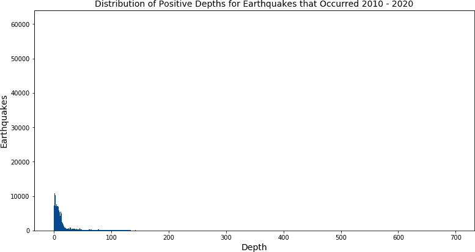

# 第六章：异常检测

*异常* 是指与同一群体的其他成员不同的东西。在数据中，异常是一条记录、一个观察结果或一个数值，其与其余数据点不同，从而引起关注或怀疑。异常有很多不同的名称，包括 *离群值*、*新奇值*、*噪声*、*偏差* 和 *异常值* 等等。在本章节中，我将交替使用 *异常* 和 *离群值* 这两个术语，你可能也会在讨论中看到其他术语。异常检测可以是分析的最终目标，也可以是更广泛分析项目中的一步。

异常通常有两种来源：真实事件中的极端或其他异常，或者在数据收集或处理过程中引入的错误。尽管检测离群值的许多步骤不论根源如何都是相同的，但我们选择如何处理特定异常取决于根本原因。因此，理解根本原因并区分这两种原因对分析过程非常重要。

真实事件可能因多种原因产生离群值。异常数据可以标志欺诈、网络入侵、产品结构缺陷、政策漏洞，或者产品使用并非开发人员预期或设想的方式。异常检测广泛用于查找金融欺诈，网络安全也利用这种类型的分析。有时异常数据的产生并非因为有人试图利用系统，而是因为客户以意想不到的方式使用产品。例如，我认识一个人，他使用健身跟踪应用来记录他在赛车场的行程，尽管该应用是为跑步、骑行、步行等活动而设计的。他当时没有找到更好的选项，也没有考虑到在赛车场上记录的速度和距离值与自行车骑行或跑步记录相比有多么异常。当可以追踪到真实过程的异常时，决定如何处理这些异常需要对分析过程、领域知识、使用条款以及有时管理产品的法律制度有很好的理解。

数据也可能因为收集或处理中的错误而包含异常。手动输入的数据以错字和不正确的数据而臭名昭著。表单、字段或验证规则的更改可能引入意外值，包括空值。常见的行为追踪网络和移动应用程序，但是任何关于何时如何进行记录的更改都可能引入异常。我花了足够多的时间诊断指标变化，我已经学会了事先询问是否最近更改了任何记录。数据处理可能会因为一些值被错误地过滤、处理步骤未能完成，或者数据被多次加载而产生重复而引入异常值。当异常来自数据处理时，我们通常可以更有信心地纠正或丢弃这些值。当然，如果可能的话，修复上游数据输入或处理总是个好主意，以防止未来的质量问题。

在本章中，我首先讨论了使用 SQL 进行此类分析的一些原因及其局限性。然后，我会介绍地震数据集，该数据集将用于本章其余部分的示例。接着，我将介绍我们在 SQL 中用于检测异常值的基本工具。然后我会讨论我们可以应用这些工具来找到的各种异常形式。一旦我们检测并理解了异常，下一步就是决定如何处理它们。异常并不总是问题，比如在欺诈检测、网络攻击检测和健康系统监测中。本章的技术也可以用于检测异常好的客户或者市场营销活动，或者客户行为的积极变化。有时异常检测的目标是将异常传递给其他人或机器处理，但通常这只是更广泛分析的一步，所以最后我会总结各种纠正异常的选项。

# SQL 对异常检测的能力和限制

SQL 是一个多才多艺、强大的语言，适用于许多数据分析任务，尽管它不能做到所有事情。在执行异常检测时，SQL 有许多优点，也有一些缺点，使得其他语言或工具对某些任务更合适。

当数据集已经在数据库中时，SQL 是值得考虑的选项，正如我们之前在第 3 和 5 章节中分别看到的时间序列和文本分析。SQL 利用数据库的计算能力快速执行大量记录的计算。特别是对于大型数据表，将数据从数据库转移到另一个工具是耗时的。在 SQL 中进行异常检测作为更大分析步骤的一部分是有意义的。通过分析 SQL 中编写的代码，可以理解为什么特定记录被标记为异常值，并且即使数据流入数据库发生变化，SQL 也能保持一致。

但是，SQL 并没有像 R 和 Python 等语言开发的软件包中那样丰富的统计学功能。SQL 有一些标准的统计函数，但对于一些数据库来说，额外的复杂统计计算可能会太慢或者太复杂。对于需要非常快速响应的使用场景，比如欺诈或入侵检测，分析数据库中的数据可能不合适，因为加载数据通常会有延迟，特别是对于分析数据库而言。一种常见的工作流是使用 SQL 进行初始分析，并确定典型的最小值、最大值和平均值，然后使用流式服务或特殊的实时数据存储开发更实时的监控。然而，检测异常模式类型，然后在流式服务或特殊的实时数据存储中实施，也是一个选择。最后，SQL 代码是基于规则的，正如我们在 第五章 中看到的。它非常适合处理已知的一组条件或标准，但 SQL 不会自动调整以适应快速变化的对手所见到的变化模式类型。对于这些应用程序，机器学习方法及其关联的语言通常是更好的选择。

现在我们已经讨论了 SQL 的优点以及何时使用它而不是另一种语言或工具，让我们先看一下本章节示例中将使用的数据，然后再进入代码本身。

# 数据集

本章示例的数据是由美国地质调查局（USGS）从 2010 年到 2020 年记录的所有地震事件组成的一组记录。USGS 提供多种格式的数据，包括实时数据源，网址为*[*https://earthquake.usgs.gov/earthquakes/feed*](https://earthquake.usgs.gov/earthquakes/feed)*。

数据集包含约 150 万条记录。每条记录代表一个单独的地震事件，包括时间戳、位置、震级、深度以及信息来源等信息。数据的示例显示在 图 6-1 中。美国地质调查局网站上提供了完整的 [数据字典](https://oreil.ly/NjgCt)。


###### 图 6-1\. `earthquakes`数据样本

地震是由地球表面上存在的构造板块之间的断层突然滑动引起的。这些板块边缘的位置经历比其他地方更多且更剧烈的地震。所谓的“火环”是沿太平洋边缘的一个地区，这个地区发生了许多地震。该地区内的各个位置，包括加利福尼亚州、阿拉斯加州、日本和印度尼西亚，将在我们的分析中频繁出现。

*震级*是地震在其源头的大小测量，由其地震波测量。震级记录在对数尺度上，这意味着震级 5 的地震振幅是震级 4 地震的 10 倍。地震的实际测量是迷人的，但超出了本书的范围。如果您想了解更多信息，可以从[美国地质调查局（USGS）网站](https://earthquake.usgs.gov)开始。

# 检测异常值

尽管异常值或异常值——与其他数据极为不同的数据点的概念似乎很简单，但实际在任何特定数据集中找到一个的挑战很大。第一个挑战涉及知道何时一个值或数据点是常见的或罕见的，第二个是设置标记这条分界线两侧值的阈值。当我们浏览`earthquakes`数据时，我们将分析深度和震级，以便了解哪些值是正常的，哪些是不寻常的。

一般来说，数据集越大或越完整，我们就越容易判断什么是真正的异常。在某些情况下，我们有标记或“地面真相”值可供参考。标签通常是数据集中指示记录是正常还是异常的列。地面真相可以从行业或科学来源获得，也可以从过去的分析中获得，例如，告诉我们任何大于 7 级的地震都是异常情况。在其他情况下，我们必须查看数据本身并应用合理的判断。在本章的其余部分，我们假设我们有足够大的数据集来做到这一点，尽管当然我们可以查阅有关典型和极端地震震级的外部参考资料。

我们使用数据集本身来检测异常值的工具分为几类。首先，我们可以对数据中的值进行排序或*ORDER BY*。这可以选择性地与各种*GROUP BY*子句结合使用，以按频率查找异常值。其次，我们可以使用 SQL 的统计函数来查找值范围两端的极端值。最后，我们可以绘制数据并进行视觉检查。

## 使用排序查找异常值

找出异常值的基本工具之一是对数据进行排序，可以通过*ORDER BY*子句完成。*ORDER BY*的默认行为是升序排序（*ASC*）。要按降序排序，请在列名后添加*DESC*。*ORDER BY*子句可以包括一个或多个列，并且每个列可以独立于其他列按升序或降序排序。排序从指定的第一列开始。如果指定了第二列，则第一次排序的结果将按第二列进行排序（保留第一次排序），依此类推，直到子句中的所有列都排序完毕。

###### 提示

由于排序发生在数据库计算查询的其余部分之后，许多数据库允许您按列号而不是按名称引用查询列。SQL Server 是一个例外；它需要完整的名称。我更喜欢编号语法，因为它可以生成更紧凑的代码，特别是当查询列包含冗长的计算或函数语法时。

例如，我们可以按`earthquakes`表中的`mag`（震级）排序：

```
SELECT mag
FROM earthquakes
ORDER BY 1 desc
;

mag
------
(null)
(null)
(null)
...
```

这将返回若干行空值。让我们注意，数据集可能包含幅度的空值——这本身可能就是一个异常值。我们可以排除空值：

```
SELECT mag
FROM earthquakes
WHERE mag is not null
ORDER BY 1 desc
;

mag
---
9.1
8.8
8.6
8.3
```

只有一个大于 9 的值，而且只有另外两个大于 8.5 的值。在许多情境中，这些看起来可能并不是特别大的值。然而，通过一点关于地震的领域知识，我们可以认识到这些值实际上都非常大且不寻常。USGS 提供了一份世界上[最大 20 次地震的列表](https://oreil.ly/gHUhy)。其中所有地震的震级都大于 8.4，而只有五次地震的震级大于 9.0，其中三次发生在我们数据集涵盖的 2010 至 2020 年期间。

另一种考虑值是否在数据集中异常的方法是计算它们的频率。我们可以统计`id`字段并按`mag`分组，以找出每个震级的地震数量。然后将每个震级的地震数量除以使用`sum`窗口函数找到的总地震数量。所有窗口函数都需要*PARTITION BY*和/或*ORDER BY*子句的*OVER*子句。由于分母应计算所有记录，我添加了*PARTITION BY* 1，这是一种强制数据库使其成为窗口函数但仍从整个表中读取的方法。最后，结果集按震级*ORDER* BY 排序：

```
SELECT mag
,count(id) as earthquakes
,round(count(id) * 100.0 / sum(count(id)) over (partition by 1),8) 
 as pct_earthquakes
FROM earthquakes
WHERE mag is not null
GROUP BY 1
ORDER BY 1 desc
;

mag  earthquakes  pct_earthquakes
---  -----------  ---------------
9.1  1            0.00006719
8.8  1            0.00006719
8.6  1            0.00006719
8.3  2            0.00013439
...  ...          ... 
6.9  53           0.00356124
6.8  45           0.00302370
6.7  60           0.00403160
...  ...          ...
```

只有一个地震震级超过 8.5，但有两次注册了 8.3。到 6.9 这个数值时，地震次数已经有两位数了，但这仍然只代表数据的非常小的百分比。在我们的调查中，我们还应检查排序的另一端，即最小值，通过升序而不是降序排序：

```
SELECT mag
,count(id) as earthquakes
,round(count(id) * 100.0 / sum(count(id)) over (partition by 1),8) 
 as pct_earthquakes
FROM earthquakes
WHERE mag is not null
GROUP BY 1
ORDER BY 1
;

mag   earthquakes  pct_earthquakes
---    -----------  ---------------
-9.99  258          0.01733587
-9     29           0.00194861
-5     1            0.00006719
-2.6   2            0.00013439
...    ...          ...
```

在值的低端，–9.99 和–9 出现的频率比我们预期的要高。尽管我们不能取零或负数的对数，当参数大于零且小于一时，对数可以为负。例如，log(0.5)约等于–0.301。值–9.99 和–9 代表极小的地震震级，我们可能怀疑这样小的地震是否真的可以被检测到。考虑到这些值的频率，我怀疑它们代表一个未知值，而不是一个真正微小的地震，因此我们可以认为它们是异常值。

除了对整体数据进行排序外，还可以通过*GROUP BY*一个或多个属性字段来查找数据子集内的异常。例如，我们可能希望检查在`place`字段中特定地理区域记录的最高和最低震级：

```
SELECT place, mag, count(*)
FROM earthquakes
WHERE mag is not null
 and place = 'Northern California'
GROUP BY 1,2
ORDER BY 1,2 desc
;

place                mag   count
-------------------  ----  -----
Northern California  5.61
Northern California  4.73  1
Northern California  4.51  1
...                  ...   ...
Northern California  -1.1  7
Northern California  -1.2  2
Northern California  -1.6  1
```

“北加利福尼亚”是数据集中最常见的`place`，仅检查其子集时，我们可以看到其高低值远不及整个数据集那么极端。整体而言，5.0 级以上的地震并不罕见，但对于“北加利福尼亚”来说，它们是异常值。

## 计算百分位数和标准偏差以发现异常

对数据进行排序并选择性地分组，然后在视觉上审查结果是发现异常的有用方法，特别是当数据具有非常极端值时。然而，如果没有领域知识，一个 9.0 级的地震是这样的异常可能并不明显。量化数据点的极端性为分析增加了另一层严谨性。有两种方法可以做到这一点：使用百分位数或标准偏差。

百分位数表示在分布中小于特定值的值的比例。分布的中位数是一个值，其中一半的人口有较低的值，另一半有较高的值。中位数如此常用，以至于它在许多但不是所有数据库中都有自己的 SQL 函数`median`。还可以计算其他百分位数。例如，我们可以找到第 25 百分位数，其中 25%的值较低，75%较高，或者第 89 百分位数，其中 89%的值较低，11%较高。百分位数通常在学术背景下发现，例如标准化测试，但可以应用于任何领域。

SQL 有一个窗口函数，`percent_rank`，它返回分区内每行的百分位数。与所有窗口函数一样，排序方向由*ORDER BY*语句控制。类似于`rank`函数，`percent_rank`不接受任何参数；它适用于查询返回的所有行。基本形式如下：

```
percent_rank() over (partition by ... order by ...)
```

*PARTITION BY* 和 *ORDER BY* 都是可选的，但函数需要*OVER*子句中的内容，并且指定排序总是一个好主意。要找到每个地震的每个地点的震级的百分位数，我们可以首先在子查询中为每一行计算`percent_rank`，然后在外部查询中计算每个震级的出现次数。注意，首先计算`percent_rank`非常重要，在进行任何聚合之前，以便在计算中考虑重复值：

```
SELECT place, mag, percentile
,count(*)
FROM
(
    SELECT place, mag
    ,percent_rank() over (partition by place order by mag) as percentile
    FROM earthquakes
    WHERE mag is not null
    and place = 'Northern California'
) a
GROUP BY 1,2,3
ORDER BY 1,2 desc
;

place                mag   percentile             count
-------------------  ----  ---------------------  -----  
Northern California  5.6   1.0                    1
Northern California  4.73  0.9999870597065141     1
Northern California  4.51  0.9999741194130283     1
...                  ...   ...                    ...
Northern California  -1.1  3.8820880457568775E-5  7
Northern California  -1.2  1.2940293485856258E-5  2
Northern California  -1.6  0.0                    1
```

在北加州地区，震级为 5.6 的地震的百分位数为 1，即 100%，表示所有其他数值均小于此值。震级为-1.6 的地震的百分位数为 0，表示没有比这个更小的数据点。

除了找到每行的确切百分位数外，SQL 还可以将数据集划分为指定数量的桶，并返回每行所属的桶，使用称为`ntile`的函数。例如，我们可能希望将数据集分成 100 个桶：

```
SELECT place, mag
,ntile(100) over (partition by place order by mag) as ntile
FROM earthquakes
WHERE mag is not null
and place = 'Central Alaska'
ORDER BY 1,2 desc
;

place           mag  ntile
--------------  ----  -----  
Central Alaska  5.4   100
Central Alaska  5.3   100
Central Alaska  5.2   100
...             ...   ...  
Central Alaska  1.5   79
...             ...   ...    
Central Alaska  -0.5  1
Central Alaska  -0.5  1
Central Alaska  -0.5  1
```

查看“中央阿拉斯加”的结果时，我们发现大于 5 的三个地震处于 100 百分位数，1.5 位于 79 百分位数，最小值-0.5 位于第一百分位数。计算这些值后，我们可以使用`max`和`min`找到每个 ntile 的边界。对于这个例子，我们将使用四个 ntile 来简化显示，但`ntile`参数允许任何正整数：

```
SELECT place, ntile
,max(mag) as maximum
,min(mag) as minimum
FROM
(
    SELECT place, mag
    ,ntile(4) over (partition by place order by mag) as ntile
    FROM earthquakes
    WHERE mag is not null
    and place = 'Central Alaska'
) a
GROUP BY 1,2
ORDER BY 1,2 desc
;

place           ntile  maximum  minimum
--------------  -----  -------  -------
Central Alaska  4      5.4      1.4
Central Alaska  3      1.4      1.1
Central Alaska  2      1.1      0.8
Central Alaska  1      0.8      -0.5
```

表示 75 到 100 百分位数的最高 ntile 为 4，具有最宽的范围，从 1.4 到 5.4。另一方面，包括 ntile 2 和 3 的中间 50%的值范围仅从 0.8 到 1.4。

除了为每一行找到百分位数或 ntile 之外，我们还可以计算查询结果集中特定百分位数。为此，我们可以使用`percentile_cont`函数或`percentile_disc`函数。两者都是窗口函数，但与先前讨论的其他窗口函数语法略有不同，因为它们需要一个*WITHIN GROUP*子句。函数的形式是：

```
percentile_cont(*numeric*) within group (order by *field_name*) over (partition by
*field_name*)
```

数字是一个介于 0 和 1 之间的值，表示要返回的百分位数。例如，0.25 返回第 25 百分位数。*ORDER BY* 子句指定要从中返回百分位数的字段，以及排序方式。*ASC* 或 *DESC* 可以选择性地添加，*ASC* 是默认值，就像 SQL 中所有*ORDER BY* 子句一样。*OVER* (*PARTITION BY*...) 子句是可选的（令人困惑的是，一些数据库不支持它，请在遇到错误时查看您的文档）。

`percentile_cont`函数将返回一个插值（计算）值，该值对应于精确的百分位数，但在数据集中可能不存在。另一方面，`percentile_disc`（不连续百分位数）函数返回数据集中最接近请求百分位数的值。对于大数据集或具有相当连续值的数据集，这两个函数的输出通常几乎没有实际差异，但考虑哪个更适合您的分析是值得的。让我们看一个示例，看看这在实践中是什么样子。我们将计算中阿拉斯加所有非空大小的第 25、50（或中位数）和 75 百分位数大小：

```
SELECT 
percentile_cont(0.25) within group (order by mag) as pct_25
,percentile_cont(0.5) within group (order by mag) as pct_50
,percentile_cont(0.75) within group (order by mag) as pct_75
FROM earthquakes
WHERE mag is not null
and place = 'Central Alaska'
;

pct_25  pct_50  pct_75
------  ------  ------
0.8     1.1     1.4
```

查询返回请求的百分位数，总结在数据集中。请注意，这些值对应于在上一个例子中计算的 ntiles 1、2 和 3 的最大值。可以通过在*ORDER BY*子句中更改字段来计算同一查询中不同字段的百分位数：

```
SELECT 
percentile_cont(0.25) within group (order by mag) as pct_25_mag
,percentile_cont(0.25) within group (order by depth) as pct_25_depth
FROM earthquakes
WHERE mag is not null
and place = 'Central Alaska'
;

pct_25_mag  pct_25_depth
----------  ------------
0.8         7.1
```

与其他窗口函数不同，当查询中存在其他字段时，`percentile_cont`和`percentile_disc`函数在查询级别需要*GROUP BY*子句。例如，如果我们想要考虑阿拉斯加内的两个地区，因此包括`place`字段，查询还必须在*GROUP BY*中包括它，并且百分位数是按`place`计算的：

```
SELECT place
,percentile_cont(0.25) within group (order by mag) as pct_25_mag
,percentile_cont(0.25) within group (order by depth) as pct_25_depth
FROM earthquakes
WHERE mag is not null
and place in ('Central Alaska', 'Southern Alaska')
GROUP BY place
;

place            pct_25_mag  pct_25_depth
---------------  ----------  ------------
Central Alaska   0.8         7.1
Southern Alaska  1.2         10.1
```

使用这些函数，我们可以找到分析所需的任何百分位数。由于中位数值通常被计算，许多数据库实现了一个只有一个参数的`median`函数，用于计算中位数的字段。这是一种方便且明显简单得多的语法，但请注意，如果`median`函数不可用，也可以使用`percentile_cont`实现同样的功能。

###### 提示

`percentile`和`median`函数在大数据集上可能速度较慢且计算密集。这是因为数据库通常必须在内存中对所有记录进行排序和排名。一些数据库供应商已实现了近似版本的函数，例如`approximate_percentile`，它们要快得多，并返回与计算整个数据集的函数非常接近的结果。

找到数据集的百分位数或 ntiles 可以使我们对异常添加一些量化。我们将在本章后面看到，这些值还为我们处理数据集中的异常提供了一些工具。然而，由于百分位数始终在 0 和 100 之间缩放，它们并不能表达某些值有多么不寻常。为此，我们可以转向 SQL 支持的额外统计函数。

为了衡量数据集中极端值的程度，我们可以使用*标准偏差*。标准偏差是一组值变化程度的度量。较低的值表示变化较小，而较高的数字表示变化较大。当数据围绕均值正态分布时，大约 68% 的值位于距均值的一标准偏差范围内，约 95% 位于两个标准偏差内。标准偏差计算公式为从均值差异总和的平方根除以观察数：

<math alttext="StartRoot sigma-summation left-parenthesis x Subscript i Baseline minus mu right-parenthesis squared slash upper N EndRoot"><msqrt><mrow><mo>∑</mo> <msup><mrow><mo>(</mo><msub><mi>x</mi> <mi>i</mi></msub> <mo>-</mo><mi>μ</mi><mo>)</mo></mrow> <mn>2</mn></msup> <mo>/</mo> <mi>N</mi></mrow></msqrt></math>

在这个公式中，*x[i]* 是一个观察值，μ 是所有观察值的平均值，∑ 表示应对所有值求和，*N* 是观察值的数量。有关标准偏差如何推导的更多信息，请参考任何良好的统计文本或在线资源¹。

大多数数据库都有三个标准偏差函数。`stddev_pop` 函数用于找出总体的标准偏差。如果数据集代表整个人口，通常使用 `stddev_pop`。`stddev_samp` 找出样本的标准偏差，与上述公式不同之处在于除以 *N* - 1 而不是 *N*。这会增加标准偏差，反映仅使用整体人口的样本时的精度损失。在许多数据库中可用的 `stddev` 函数与 `stddev_samp` 函数相同，可以简单地使用它因为长度较短。如果你处理的是来自调查或研究的样本数据，例如较大人口中的样本数据，应使用 `stddev_samp` 或 `stddev`。实际上，在处理大数据集时，`stddev_pop` 和 `stddev_samp` 的结果通常几乎没有差异。例如，在 `earthquakes` 表的 150 万记录中，仅在小数点后五位数值有所不同：

```
SELECT stddev_pop(mag) as stddev_pop_mag
,stddev_samp(mag) as stddev_samp_mag
FROM earthquakes
;

stddev_pop_mag        stddev_samp_mag
--------------------  --------------------
1.273605805569390395  1.273606233458381515
```

这些差异很小，在大多数实际应用中，使用哪个标准偏差函数并不重要。

使用此函数，我们现在可以计算数据集中每个值相对于均值的标准偏差数。这个值称为*z-分数*，是标准化数据的一种方式。高于平均值的值有正的 z-分数，低于平均值的值有负的 z-分数。图 6-2 显示了 z-分数和标准偏差与正态分布的关系。


###### 图 6-2\. 正态分布的标准偏差和 z 分数

要找到地震的 Z 分数，首先在子查询中计算整个数据集的平均值和标准差。然后使用笛卡尔*JOIN*将这些值与数据集*JOIN*回来，以便平均值和标准差值与每个地震行*JOIN*。这是通过`1 = 1`语法实现的，因为大多数数据库要求指定某些*JOIN*条件。

在外部查询中，从每个单独的震级中减去平均震级，然后除以标准差：

```
SELECT a.place, a.mag
,b.avg_mag, b.std_dev
,(a.mag - b.avg_mag) / b.std_dev as z_score
FROM earthquakes a
JOIN
(
    SELECT avg(mag) as avg_mag
    ,stddev_pop(mag) as std_dev
    FROM earthquakes
    WHERE mag is not null
) b on 1 = 1
WHERE a.mag is not null
ORDER BY 2 desc
;

place                                   mag  avg_mag  std_dev  z_score
--------------------------------------  ---  -------  -------  -------
2011 Great Tohoku Earthquake, Japan     9.1   1.6251   1.2736  5.8691
offshore Bio-Bio, Chile                 8.8   1.6251   1.2736  5.6335
off the west coast of northern Sumatra  8.6   1.6251   1.2736  5.4765
...                                     ...   ...      ...     ...
Nevada                                  -2.5  1.6251   1.2736  -3.2389
Nevada                                  -2.6  1.6251   1.2736  -3.3174
Nevada                                  -2.6  1.6251   1.2736  -3.3174
```

最大的地震的 Z 分数接近 6，而最小的（排除看起来是数据输入异常的-9 和-9.99 地震）的 Z 分数接近 3。我们可以得出结论，最大的地震比低端的那些更为极端的异常值。

## 用图表直观地查找异常值

除了对数据进行排序和计算百分位数和标准差以找到异常值外，将数据可视化为几种图表格式之一也有助于发现异常值。正如我们在前面章节中所见，图表的一个优势是它们能够以紧凑的形式总结和呈现许多数据点。通过检查图表，我们通常可以发现模式和异常值，如果仅考虑原始输出，可能会被忽略。最后，图表有助于描述数据以及与数据相关的任何潜在问题，特别是异常值，向其他人传达信息。

在本节中，我将介绍三种对异常检测有用的图表类型：条形图、散点图和箱线图。生成这些图表所需的 SQL 很简单，尽管根据所用软件的能力和限制，你可能需要使用前面章节讨论过的数据透视策略。任何主要的商业智能工具或电子表格软件，以及诸如 Python 或 R 的编程语言，都能够生成这些图表类型。本节中的图表是使用 Python 和 Matplotlib 创建的。

条形图用于绘制字段值的直方图或分布图，并且对于描述数据和发现异常值都很有用。所有值的全范围沿一个轴绘制，每个值的出现次数沿另一个轴绘制。极高和极低的值是有趣的，以及绘图的形状。我们可以快速确定分布是否近似正态（围绕峰值或平均值对称），是否具有其他类型的分布，或者是否在特定值处有峰值。

要为地震震级绘制直方图，首先创建一个数据集，分组震级并计算地震数量。然后绘制输出，如图 6-3 所示。

```
SELECT mag
,count(*) as earthquakes
FROM earthquakes
GROUP BY 1
ORDER BY 1
;

mag    earthquakes
-----  -----------
-9.99  258
-9     29
-5     1
...    ...
```


###### 图 6-3\. 地震震级分布

该图的范围从–10.0 到+10.0，这在我们之前对数据的探索中是有意义的。它峰值大约在 1.1 到 1.4 范围内，每个震级约有 40,000 次地震，但它在约 4.4 处有第二个峰值，约有 20,000 次地震。我们将在下一节关于异常形式的部分探讨这第二个峰值的原因。在这张图中很难看到极端值，因此我们可能希望放大图表的某个部分，如图 6-4：


###### 图 6-4\. 地震震级分布的放大视图，聚焦于最高震级

在这里，这些非常高强度地震的频率更容易看到，从低 7 到超过 8 的值从超过 10 下降到仅为 1。幸运的是，这些地震非常罕见。

第二种用于描述数据和发现异常值的图表是*散点图*。当数据集包含至少两个感兴趣的数值时，散点图是合适的。x 轴显示第一个数据字段的值范围，y 轴显示第二个数据字段的值范围，在数据集中的每对 x 和 y 值上绘制一个点。例如，我们可以绘制数据集中地震的震级与深度之间的散点图。首先，查询数据以创建每对值的数据集。然后像图 6-5 那样绘制输出：

```
SELECT mag, depth
,count(*) as earthquakes
FROM earthquakes
GROUP BY 1,2
ORDER BY 1,2
;

mag    depth  earthquakes
-----  -----  -----------
-9.99  -0.59  1
-9.99  -0.35  1
-9.99  -0.11  1
...    ...    ...
```


###### 图 6-5\. 震级和深度的散点图

在这张图中，我们可以看到相同幅度的地震，现在根据深度绘制，深度从零以下到大约 700 公里不等。有趣的是，高深度值超过 300 对应于大约 4 以上的震级。也许只有当这些深部地震达到最小震级后才能检测到。请注意，由于数据量大，我采取了一种捷径，将值按照震级和深度组合分组，而不是绘制所有 150 万数据点。地震的计数可以用来调整散点图中每个圆的大小，例如图 6-6，该图放大了震级从 4.0 到 7.0，深度从 0 到 50 公里的范围。


###### 图 6-6\. 震级和深度的散点图，放大并且圆圈的大小根据地震数量调整

在查找和分析异常值时非常有用的第三种图表类型是*箱线图*，也称为*箱须图*。这些图表总结了值范围中间的数据，同时保留了异常值。该图表类型以中间的箱子或矩形命名。形成矩形底部的线位于第 25 百分位值，形成顶部的线位于第 75 百分位值，而中间的线位于第 50 百分位值，即中位数。百分位数在前一节中已经讨论过了。箱线图的“盒须”是从箱子伸出的线，通常延伸到*四分位距*的 1.5 倍。四分位距简单来说是第 75 百分位值与第 25 百分位值之间的差值。超出盒须的任何值都会作为异常值绘制在图表上。

###### 提示

无论您使用哪种软件或编程语言来绘制箱线图，都会自动处理百分位数和四分位距的计算。许多软件还提供基于标准差（如均值上下的一个标准差）或更广泛百分位（如第 10 和第 90 百分位）的选项来绘制盒须。计算始终围绕中点对称（例如均值上下的一个标准差），但上下盒须的长度可能会因数据而异。

典型情况下，所有值都会在箱线图中绘制。由于数据集非常庞大，例如，我们将查看包含“日本”在`place`字段中的 16,036 次地震子集。首先，使用 SQL 创建数据集，这是一个简单的*SELECT*，选择所有符合筛选条件的`mag`值：

```
SELECT mag
FROM earthquakes
WHERE place like '%Japan%'
ORDER BY 1
;

mag
---
2.7
3.1
3.2
...
```

然后，在我们选择的图形软件中创建一个箱线图，如图 6-7 所示。


###### 图 6-7\. 展示了日本地震震级分布的箱线图

尽管绘图软件通常会提供这些信息，我们还可以使用 SQL 查找箱线图的关键值：

```
SELECT ntile_25, median, ntile_75
,(ntile_75 - ntile_25) * 1.5 as iqr
,ntile_25 - (ntile_75 - ntile_25) * 1.5 as lower_whisker
,ntile_75 + (ntile_75 - ntile_25) * 1.5 as upper_whisker
FROM
(
    SELECT 
    percentile_cont(0.25) within group (order by mag) as ntile_25
    ,percentile_cont(0.5) within group (order by mag) as median
    ,percentile_cont(0.75) within group (order by mag) as ntile_75
    FROM earthquakes
    WHERE place like '%Japan%'
) a
;

ntile_25  median  ntile_75  iqr  lower_whisker   upper_whisker
--------  ------  --------  ----  -------------  -------------
4.3       4.5     4.7       0.60  3.70           5.30
```

日本地震的中位数为 4.5，盒须从 3.7 延伸至 5.3。绘制的圆圈代表异常地震，包括小型和大型地震。2011 年的大东北地震，震级为 9.1，显然是一个异常值，即使在日本经历的较大地震中也是如此。

###### 警告

在我的经验中，箱线图是向那些没有统计背景或整天制作和查看可视化的人解释起来比较困难的可视化之一。四分位距尤其是一个特别令人困惑的概念，尽管异常值的概念似乎对大多数人来说是有意义的。如果你不确定你的观众绝对知道如何解读箱线图，请花时间用清晰但不过于技术化的术语来解释它。我保留了一幅像图 6-8 这样解释箱线图各部分的图画，并随我的工作一起发送，以防万一我的观众需要复习。


###### 图 6-8\. 箱线图各部分示意图

箱线图也可以用来比较数据的不同分组，进一步识别和诊断异常值出现的位置。例如，我们可以比较日本不同年份的地震情况。首先将`time`字段的年份添加到 SQL 输出中，然后绘制图表，如图 6-9 所示：

```
SELECT date_part('year',time)::int as year
,mag
FROM earthquakes
WHERE place like '%Japan%'
ORDER BY 1,2
;

year  mag
----  ---
2010  3.6
2010  3.7
2010  3.7
...   ...
```


###### 图 6-9\. 日本地震震级的箱线图，按年份划分

尽管箱子的中位数和范围从一年到一年会有些波动，但它们始终在 4 到 5 之间。日本每年都经历着大的离群地震，至少有一次大于 6.0，而在六年中，至少有一次地震达到或超过 7.0。日本无疑是一个地震活动非常频繁的地区。

条形图、散点图和箱线图通常用于检测和描述数据集中的异常值。它们使我们能够快速理解大量数据的复杂性，并开始讲述背后的故事。除了排序、百分位数和标准偏差之外，图表是异常检测工具包的重要组成部分。有了这些工具，我们准备讨论异常可能采取的各种形式，除了我们到目前为止见过的形式。

# 异常形式

异常可以呈现各种形状和大小。在本节中，我将讨论三种一般类型的异常：值、计数或频率以及存在或不存在。这些是调查任何数据集的起点，无论是作为概要性练习还是因为怀疑存在异常值。离群值和其他异常值通常特定于特定领域，因此总体而言，你对数据生成的方式和原因了解得越多，就越好。然而，这些发现异常的模式和技术是调查的良好起点。

## 异常值

可能是最常见的异常类型，也是这个主题首先想到的事情，就是单个值要么是极高的或极低的离群值，要么是分布中间的值非常不寻常。

在上一节中，我们探讨了几种寻找异常值的方法，包括排序、百分位数、标准差和绘图。我们发现地震数据集在震级方面既有异常大的值，也有异常小的值。震级还包含不同数量的*有效数字*，或者小数点后的数字。例如，我们可以查看围绕 1 附近的一些数值子集，并找到数据集中反复出现的模式：

```
SELECT mag, count(*)
FROM earthquakes
WHERE mag > 1
GROUP BY 1
ORDER BY 1
limit 100
;

mag         count
----------  -----
...         ... 
1.08        3863
1.08000004  1
1.09        3712
1.1         39728
1.11        3674
1.12        3995
....        ...
```

偶尔会有 8 个有效数字的数值出现。许多数值有两个有效数字，但只有一个有效数字更为普遍。这可能是由于收集震级数据的仪器精度不同所致。此外，当第二个有效数字为零时，数据库不显示第二个有效数字，因此“1.10”看起来简单地显示为“1.1”。然而，“1.1”处的大量记录表明这不仅仅是一个显示问题。根据分析目的，我们可能需要通过四舍五入来调整数值，使其具有相同数量的有效数字。

除了找到异常值之外，理解它们发生的原因或与异常相关的其他属性也是有用的。这是创造性和数据探索工作的体现。例如，数据集中有 1,215 条记录的深度值超过 600 公里。我们可能想知道这些异常值发生在哪里或者它们是如何收集的。让我们来看看来源，我们可以在`net`（表示网络）字段中找到。

```
SELECT net, count(*)
FROM earthquakes
WHERE depth > 600
GROUP BY 1
;

net  count
---  -----
us   1215
```

美国地质调查局（[USGS 国家地震信息中心，PDE](https://earthquake.usgs.gov/data/comcat/contributor/us)）网站指示了这一信息来源。然而，这并不是特别详细，因此让我们来检查一下`place`值，其中包含地震的位置信息：

```
SELECT place, count(*)
FROM earthquakes
WHERE depth > 600
GROUP BY 1
;

place                           count
------------------------------  -----
100km NW of Ndoi Island, Fiji   1
100km SSW of Ndoi Island, Fiji  1
100km SW of Ndoi Island, Fiji   1
...                             ...
```

目视检查表明，这些非常深的地震多发生在斐济的**Ndoi 岛**附近。然而，该地点包括距离和方向组成部分，如“100km NW of”，这使得总结变得更加困难。我们可以应用一些文本解析技术，集中关注地点本身，以获取更好的见解。

```
SELECT 
case when place like '% of %' then split_part(place,' of ',2) 
     else place end as place_name
,count(*)
FROM earthquakes
WHERE depth > 600
GROUP BY 1
ORDER BY 2 desc
;

place_name         count
-----------------  -----
Ndoi Island, Fiji  487
Fiji region        186
Lambasa, Fiji      140
...                ...
```

现在我们可以更加确信，大部分非常深的数值记录来自斐济某处地震，特别是集中在小火山岛 Ndoi 周围。分析可以进一步复杂化，例如通过解析文本将所有记录在更大区域内的地震分组在一起，这将揭示在斐济之后，其他非常深的地震也发生在瓦努阿图和菲律宾附近。

异常可以以拼写错误、大小写变化或其他文本错误的形式出现。发现这些错误的难易程度取决于字段的不同值的数量，或者*基数*。在应用`lower`或`upper`函数时，大小写的差异可以通过计算不同的值和应用函数后的不同值来检测：

```
SELECT count(distinct type) as distinct_types
,count(distinct lower(type)) as distinct_lower
FROM earthquakes
;

distinct_types  distinct_lower
--------------  --------------
25              24
```

`type`字段有 24 个不同的值，但是有 25 种不同的形式。为了找到具体的类型，我们可以进行计算，标记那些小写形式与实际值不匹配的值。包括每种形式的记录计数将有助于在后续决定如何处理这些值时提供背景信息：

```
SELECT type
,lower(type)
,type = lower(type) as flag
,count(*) as records
FROM earthquakes
GROUP BY 1,2,3
ORDER BY 2,4 desc
;

type       lower      flag   records
---------  ---------  -----  -------
...        ...        ...    ...
explosion  explosion  true   9887
ice quake  ice quake  true   10136
Ice Quake  ice quake  false  1
...        ...        ...    ...
```

“Ice quake”的异常值很容易识别，因为它是唯一一个返回`false`的标志计算值。由于只有一条记录包含此值，相比于低级别形式的 10,136 条记录，我们可以假设它可以与其他记录分组在一起。可以应用其他文本函数，如`trim`，如果我们怀疑值包含额外的前导或尾随空格，或者`replace`，如果我们怀疑某些拼写有多个形式，比如数字“2”和单词“two”。

拼写错误可能比其他变体更难发现。如果存在已知的正确值和拼写的集合，可以通过与包含这些值的表进行外连接或使用 CASE 语句与 IN 列表来验证数据。在任何情况下，目标是标记意外或无效的值。如果没有这样的正确值集合，我们的选择通常是应用领域知识或进行合理的猜测。在`earthquakes`表中，我们可以查看`type`值，只有少数记录，然后尝试确定是否有其他更常见的值可以替代：

```
SELECT type, count(*) as records
FROM earthquakes
GROUP BY 1
ORDER BY 2 desc
;

type                        records
--------------------------  -------
...                         ...
landslide                   15
mine collapse               12
experimental explosion      6
building collapse           5
...                         ...
meteorite                   1
accidental explosion        1
collapse                    1
induced or triggered event  1
Ice Quake                   1
rockslide                   1
```

我们之前看过“冰震”并认为它很可能与“ice quake”相同。对于“rockslide”只有一条记录，尽管我们可能认为这足够接近另一个值“landslide”，后者有 15 条记录。“崩溃”更加模糊，因为数据集包含“矿井坍塌”和“建筑物坍塌”两种情况。我们对这些值的处理，或者是否需要处理，取决于分析的目标，我将在“处理异常”中讨论。

## 异常计数或频率

有时异常不是以单个值的形式出现，而是以数据中的模式或活动簇群的形式出现。例如，在电子商务网站上，客户每小时花费 100 美元可能并不罕见，但是同一个客户在 48 小时内每小时都花费 100 美元几乎肯定是异常。

有许多维度可以表明活动的集群可能指示异常，其中许多依赖于数据的上下文。时间和位置在许多数据集中都很常见，并且是`earthquakes`数据集的特征，因此我将使用它们来说明本节中的技术。请记住，这些技术通常也可以应用于其他属性。

在短时间内频繁发生的事件可能表明异常活动。这可能是好事，例如当名人突然推广某种产品时导致该产品销量激增。它们也可能是坏事，例如当异常的峰值表明欺诈性信用卡使用或试图通过大量流量使网站崩溃时。为了理解这些类型的异常以及是否存在与正常趋势的偏差，我们首先应用适当的聚合，然后使用本章早期介绍的技术，以及第三章中讨论的时间序列分析技术。

在接下来的示例中，我将逐步介绍一系列步骤和查询，这些步骤和查询将帮助我们理解正常模式并寻找异常模式。这是一个迭代过程，利用数据分析、领域知识以及先前查询结果的洞察来引导每一步。我们将从按年计算地震数量开始，可以通过将`time`字段截断到年级别并计数记录来实现。对于不支持`date_trunc`的数据库，考虑使用`extract`或`trunc`代替：

```
SELECT date_trunc('year',time)::date as earthquake_year
,count(*) as earthquakes
FROM earthquakes
GROUP BY 1
;

earthquake_year  earthquakes
---------------  -----------
2010-01-01       122322
2011-01-01       107397
2012-01-01       105693
2013-01-01       114368
2014-01-01       135247
2015-01-01       122914
2016-01-01       122420
2017-01-01       130622
2018-01-01       179304
2019-01-01       171116
2020-01-01       184523
```

我们可以看到，2011 年和 2012 年的地震数量较其他年份少。2018 年记录数量显著增加，并在 2019 年和 2020 年保持增长。这似乎是不寻常的，我们可以假设地球突然变得更具地震活跃性，数据存在错误如记录重复，或者数据收集过程发生了变化。让我们进一步分析到月度水平，看看这一趋势是否在更详细的时间粒度上持续存在：

```
SELECT date_trunc('month',time)::date as earthquake_month
,count(*) as earthquakes
FROM earthquakes
GROUP BY 1
;

earthquake_month  earthquakes
----------------  -----------
2010-01-01        9651
2010-02-01        7697
2010-03-01        7750
...               ...
```

输出显示在图 6-10 中。我们可以看到，尽管地震数量每个月都有所变化，但从 2017 年开始似乎整体上有所增加。我们还可以看到，有三个异常月份，分别是 2010 年 4 月，2018 年 7 月和 2019 年 7 月。


###### 图 6-10\. 每月地震数量

从这里开始，我们可以继续检查更精细的时间段内的数据，也许可以选择性地通过一系列日期范围来过滤结果集，以便集中关注这些异常时间段。在缩小到特定的日期甚至每天的具体时间以确定何时发生尖峰后，我们可能希望进一步按数据集中的其他属性拆分数据。这可以帮助解释异常情况，或者至少缩小它们发生的条件范围。例如，结果表明，从 2017 年开始地震增加至少部分可以解释为`status`字段。状态指示事件是否已由人类审查（“reviewed”）或直接由系统发布而未经审查（“automatic”）：

```
SELECT date_trunc('month',time)::date as earthquake_month
,status
,count(*) as earthquakes
FROM earthquakes
GROUP BY 1,2
ORDER BY 1
;

earthquake_month  status     earthquakes
----------------  --------   -----------
2010-01-01        automatic  620
2010-01-01        reviewed   9031
2010-02-01        automatic  695
...               ...        ...
```

“automatic”和“reviewed”状态的趋势在图 6-11 中绘制。


###### 图 6-11\. 每月地震数量，按状态分割

在图表中，我们可以看到 2018 年 7 月和 2019 年 7 月的异常计数是由于“automatic”状态地震数量大幅增加，而 2010 年 4 月的尖峰是在“reviewed”状态地震中发生的。可能在 2017 年添加了新型自动记录设备到数据集中，或者也许还没有足够时间审查所有记录。

分析具有该信息的数据集中的位置是发现和理解异常的另一种强大方式。`earthquakes`表包含有关成千上万的非常小地震的信息，可能会遮蔽我们对非常大、非常显著地震的视野。让我们看看震级大于或等于 6 级的大地震的位置分布：

```
SELECT place, count(*) as earthquakes
FROM earthquakes
WHERE mag >= 6
GROUP BY 1
ORDER BY 2 desc
;

place                                 earthquakes
------------------------------------  -----------
near the east coast of Honshu, Japan  52
off the east coast of Honshu, Japan   34
Vanuatu                               28
...                                   ...
```

与时间相比，在逐步更精细的级别进行查询的地方，`place`值已经如此精细化，以至于有些难以理解整体图景，尽管日本本州地区显然突出。我们可以应用来自第五章的一些文本分析技术来解析并分组地理信息。在这种情况下，我们将使用`split_part`来删除`place`字段开头经常出现的方向文字（如“靠近海岸”或“100km N of”）：

```
SELECT 
case when place like '% of %' then split_part(place,' of ',2)
     else place
     end as place
,count(*) as earthquakes
FROM earthquakes
WHERE mag >= 6
GROUP BY 1
ORDER BY 2 desc
;

place                  earthquakes
---------------------  -----------
Honshu, Japan          89
Vanuatu                28
Lata, Solomon Islands  28
...                    ...
```

日本本州周围地区经历了 89 次地震，不仅是数据集中最大地震的发生地，而且是记录的大型地震数量的异常值。我们可以继续解析、清理和分组`place`值，以更精确地了解世界上发生重大地震的位置。

在数据中找到异常的计数、总和或频率通常需要一系列不同粒度查询的练习。通常从广泛的范围开始，然后更详细地查询，再次放大以与基线趋势进行比较，然后再次对数据的特定分割或维度进行详细查询是很常见的。幸运的是，SQL 是进行这种快速迭代的好工具。结合特别是来自时间序列分析的技术（如第三章中讨论的）和文本分析（如第五章中讨论的），将为分析带来更多丰富性。

## 数据缺失的异常

我们已经看到异常高频事件可以标志异常。请记住，记录缺失也可能标志异常。例如，手术中接受监控的病人的心跳。任何时候心跳缺失都会触发警报，就像心跳的不规则一样。然而，在许多情况下，如果您没有专门寻找它，检测数据缺失是困难的。客户并不总是宣布他们即将流失。他们只是停止使用产品或服务，然后悄悄地退出数据集。

确保数据中的缺失被注意到的一种方法是使用队列分析技术，如第四章中讨论的。特别是，*JOIN* 到日期系列或数据维度，确保每个实体都存在记录，无论其是否在该时间段内出现，这样可以更容易地检测到缺失。

检测缺失的另一种方法是查询间隙或距上次出现的时间。由于地球上构造板块的排列方式，一些地区更容易发生大地震。我们在先前的例子中也检测到了一些这种情况。即使我们知道它们可能发生的地方，地震通常很难预测。这并不能阻止一些人简单地因为距离上次大地震的时间过长而猜测下一次“大地震”。我们可以使用 SQL 来查找大地震之间的间隙和自上次大地震以来的时间：

```
SELECT place
,extract('days' from '2020-12-31 23:59:59' - latest) 
 as days_since_latest
,count(*) as earthquakes
,extract('days' from avg(gap)) as avg_gap
,extract('days' from max(gap)) as max_gap
FROM
(
    SELECT place
    ,time
    ,lead(time) over (partition by place order by time) as next_time
    ,lead(time) over (partition by place order by time) - time as gap
    ,max(time) over (partition by place) as latest
    FROM
    (
        SELECT 
        replace(
          initcap(
          case when place ~ ', [A-Z]' then split_part(place,', ',2)
               when place like '% of %' then split_part(place,' of ',2)
               else place end
        )
        ,'Region','')
        as place
        ,time
        FROM earthquakes
        WHERE mag > 5
    ) a
) a         
GROUP BY 1,2        
;

place             days_since_latest  earthquakes  avg_gap  max_gap
----------------  -----------------  -----------  -------  -------
Greece            62.0               109          36.0     256.0
Nevada            30.0               9            355.0    1234.0
Falkland Islands  2593.0             3            0.0      0.0
...               ...                ...          ...      ...
```

在最内层子查询中，`place`字段被解析和清理，返回更大的地区或国家，以及每次 5 级或更大地震的时间。第二个子查询使用`lead`函数查找每个地点和时间的下一个地震的`time`，以及每次地震与下一个地震之间的`gap`。`max`窗口函数返回每个地点的最近地震。外部查询使用`extract`函数计算数据集中距离最新的 5 级以上地震的天数，只返回两个日期相减后的间隔中的天数。由于数据集仅包括到 2020 年底的记录，因此时间戳“2020-12-31 23:59:59”被使用，尽管如果数据定期刷新，`current_timestamp`或等效表达式也是合适的。类似地，从`gap`值的平均值和最大值中提取天数。

一个地点自上次大地震以来的时间可能在实践中没有多少预测力，但在许多领域，间隔和自上次出现以来的时间度量具有实际应用。了解动作之间的典型间隔可以建立一个基准，用来比较当前的间隔。当当前间隔在历史值的范围内时，我们可能会判断客户已经保持，但是当当前间隔较长时，流失的风险就增加了。从返回历史间隔的查询结果集本身可以成为异常检测分析的主题，回答诸如客户在离开后多长时间才返回的最长时间等问题。

# 处理异常

异常可能出现在数据集中的许多原因和形式，正如我们刚刚看到的。检测到异常后，下一步是以某种方式处理它们。如何处理取决于异常的来源——潜在过程或数据质量问题——以及数据集或分析的最终目标。选项包括进行调查而不进行更改、删除、替换、重新缩放和上游修复。

## 调查

发现或试图找出异常的原因通常是决定如何处理它的第一步。这一过程既有趣又令人沮丧——有趣的是追踪和解决谜团激发了我们的技能和创造力，但令人沮丧的是我们经常在时间紧迫的情况下工作，追踪异常就像是进入一个无尽的兔子洞，使我们怀疑整个分析是否存在缺陷。

当我调查异常时，我的过程通常涉及一系列查询，这些查询在搜索模式和查看特定示例之间来回跳转。真正的异常值很容易辨认。在这种情况下，我通常会查询包含异常值的整行，以获取有关时间、来源和其他可用属性的线索。接下来，我会检查具有相同属性的记录，看看它们的值是否看起来不寻常。例如，我可能会检查同一天的其他记录是否具有正常或异常值。来自特定网站的流量或特定产品的购买可能会显示其他异常情况。

在调查内部组织生成的数据的异常源和属性后，我会与利益相关者或产品所有者联系。有时会出现已知的错误或缺陷，但通常会存在需要解决的真正问题或过程或系统中的问题，并且上下文信息很有用。对于外部或公共数据集，可能无法找到根本原因。在这些情况下，我的目标是收集足够的信息，以决定下一步讨论的选项中哪一种适合。

## 删除

处理数据异常的一个选项是简单地从数据集中删除它们。如果有理由怀疑数据收集中存在可能影响整个记录的错误，那么删除就是合适的。当数据集足够大以至于删除几条记录不太可能影响结论时，删除也是一个好选择。使用删除的另一个好理由是，当异常值非常极端以至于会使结果偏离到完全不适当的结论时。

我们之前看到 `earthquakes` 数据集包含许多震级为 –9.99 和少数为 –9 的记录。由于这些值对应的地震非常小，我们可能会怀疑它们是错误值或者仅在实际震级未知时输入。在 *WHERE* 子句中，删除具有这些值的记录非常简单：

```
SELECT time, mag, type
FROM earthquakes
WHERE mag not in (-9,-9.99)
limit 100
;

time                 mag   type
-------------------  ----  ----------
2019-08-11 03:29:20  4.3   earthquake
2019-08-11 03:27:19  0.32  earthquake
2019-08-11 03:25:39  1.8   earthquake
```

然而，在删除记录之前，我们可能需要确定包含异常值是否真的会影响输出结果。例如，我们可能想知道删除异常值是否会影响平均幅度，因为异常值很容易使平均值偏离。我们可以通过计算整个数据集的平均值以及使用 CASE 语句来排除极端低值的平均值来进行这项工作：

```
SELECT avg(mag) as avg_mag
,avg(case when mag > -9 then mag end) as avg_mag_adjusted
FROM earthquakes
;

avg_mag               avg_mag_adjusted
------------------    ------------------
1.6251015161530643    1.6273225642983641
```

这些平均值仅在第三个有效数字处有所不同（1.625 对比 1.627），这是一个相当小的差异。然而，如果我们仅筛选黄石国家公园，那里有许多值为 –9.99 的记录时，差异就更加显著：

```
SELECT avg(mag) as avg_mag
,avg(case when mag > -9 then mag end) as avg_mag_adjusted
FROM earthquakes
WHERE place = 'Yellowstone National Park, Wyoming'
;

avg_mag                 avg_mag_adjusted
----------------------  ----------------------
0.40639347873981053095  0.92332793709528214616
```

尽管这些值仍然很小，0.46 和 0.92 的平均差异足够大，我们很可能选择删除异常值。

请注意，有两种处理方式：一种是在*WHERE*子句中，从所有结果中移除异常值；另一种是在 CASE 语句中，仅从特定计算中移除异常值。选择哪种方式取决于分析的上下文以及是否重要保留行以保留总计数或其他字段中的有用值。

## 替换为备用值

异常值通常可以通过替换为其他值而不是移除整个记录来处理。备用值可以是默认值、替代值、范围内最接近的数值或诸如平均值或中位数的汇总统计量。

我们之前看到，可以使用`coalesce`函数将空值替换为默认值。当值不一定为空但由于其他原因有问题时，可以使用 CASE 语句将默认值替换。例如，我们可能希望将*非*地震的类型分组为单个“其他”值：

```
SELECT 
case when type = 'earthquake' then type
     else 'Other'
     end as event_type
,count(*)
FROM earthquakes
GROUP BY 1
;

event_type  count
----------  -------
earthquake  1461750
Other       34176
```

当然，这会减少数据中的细节，但也可以是汇总具有多个`type`异常值的数据集的一种方法，正如我们之前看到的。当您知道异常值是不正确的，并且您知道正确的值时，使用 CASE 语句替换它们也是一种保留整体数据集中行的解决方案。例如，可能在记录的末尾添加了额外的 0，或者以英寸而不是英里记录了一个值。

处理数值异常值的另一种选项是用最接近的高值或低值替换极端值。这种方法保持了大部分值范围，但防止了由极端异常值导致的误导性平均值。*Winsorization*是一种特定的技术，其中异常值被设置为数据的特定百分位。例如，将超过第 95 百分位的值设置为第 95 百分位的值，将低于第 5 百分位的值设置为第 5 百分位的值。要在 SQL 中计算这一点，我们首先计算第 5 和第 95 百分位值：

```
SELECT percentile_cont(0.95) within group (order by mag) 
 as percentile_95
,percentile_cont(0.05) within group (order by mag) 
 as percentile_05
FROM earthquakes
;

percentile_95  percentile_05
-------------  -------------
4.5            0.12
```

我们可以将此计算放在子查询中，然后使用 CASE 语句来处理将异常值设置为第 5 百分位以下和第 95 百分位以上的值。请注意，笛卡尔*JOIN*允许我们将百分位值与每个单独的幅度进行比较：

```
SELECT a.time, a.place, a.mag
,case when a.mag > b.percentile_95 then b.percentile_95
      when a.mag < b.percentile_05 then b.percentile_05
      else a.mag
      end as mag_winsorized
FROM earthquakes a
JOIN
(
    SELECT percentile_cont(0.95) within group (order by mag) 
     as percentile_95
    ,percentile_cont(0.05) within group (order by mag) 
     as percentile_05
    FROM earthquakes
) b on 1 = 1 
;

time                 place                        mag   mag_winsorize
-------------------  ---------------------------  ----  -------------
2014-01-19 06:31:50  5 km SW of Volcano, Hawaii   -9    0.12
2012-06-11 01:59:01  Nevada                       -2.6  0.12
...                  ...                          ...   ...
2020-01-27 21:59:01  31km WNW of Alamo, Nevada    2     2.0
2013-07-07 08:38:59  54km S of Fredonia, Arizona  3.5   3.5
...                  ...                          ...   ...
2013-09-25 16:42:43  46km SSE of Acari, Peru      7.1   4.5
2015-04-25 06:11:25  36km E of Khudi, Nepal       7.8   4.5
...                  ...                          ...   ...
```

第 5 百分位值为 0.12，而第 95 百分位为 4.5。低于这些阈值和高于这些阈值的值将更改为`mag_winsorize`字段中的阈值。在这些阈值之间的值保持不变。对于 winsorizing 没有设定百分位阈值。分析要求和异常值的普遍性和极端程度将根据需要使用第 1 和 99 百分位或甚至第 0.01 和 99.9 百分位。

## 重新缩放

而不是过滤记录或更改异常值的值，重新缩放值提供了一条路径，保留所有值但使分析和绘图更容易。

我们之前讨论过 z 分数，但值得指出的是，这可以用作重新缩放值的一种方式。z 分数很有用，因为它既可以用于正数也可以用于负数。

另一种常见的变换是转换为对数（log）比例。将值转换为对数比例的好处在于它们保持相同的顺序，但小数字会更加分散。对数变换也可以转换回原始比例，便于解释。缺点是对数变换不能用于负数。在`earthquakes`数据集中，我们了解到震级已经用对数比例表示。9.1 级的东北大地震是极端的，但如果不用对数比例表示，该值看起来会更极端！

`depth`字段以公里为单位。在这里，我们将查询深度和应用`log`函数的深度，然后将输出绘制在图 6-12 和 6-13 中，以展示差异。`log`函数默认使用 10 作为底数。为了减少结果集以便更轻松地绘图，深度还使用`round`函数将其四舍五入到一位有效数字。表被过滤以排除小于 0.05 的值，因为这些值会四舍五入为零或小于零：

```
SELECT round(depth,1) as depth
,log(round(depth,1)) as log_depth
,count(*) as earthquakes
FROM earthquakes
WHERE depth >= 0.05
GROUP BY 1,2
;

depth  log_depth            earthquakes
-----  -------------------  -----------
0.1    -1.0000000000000000  6994
0.2    -0.6989700043360188  6876
0.3    -0.5228787452803376  7269
...    ...                  ...
```



###### 图 6-12。地震深度分布，未调整深度


###### 图 6-13。地震深度的对数比例分布

在图 6-12 中，显然有大量的地震在 0.05 到 20 之间，但超过这个范围的分布难以看清楚，因为 x 轴延伸到 700 以捕捉数据的范围。然而，当深度转换为对数比例时，在图 6-13 中，较小值的分布要容易得多。值得注意的是，高于 1.0 的尖峰对应深度 10 公里时是明显的。

###### 小贴士

其他类型的比例变换，虽然不一定适合去除异常值，但可以通过 SQL 完成。一些常见的包括：

+   平方根：使用`sqrt`函数

+   立方根：使用`cbrt`函数

+   倒数变换：1 / `field_name`

更改单位，例如将英寸转换为英尺或磅转换为千克：用*或/乘以或除以适当的转换因子。

可以在 SQL 代码中进行重新缩放，或者通常在用于绘图的软件或编程语言中进行。对数变换在存在大量正值的情况下特别有用，并且重要的检测模式存在于较低值中时。

与所有分析一样，决定如何处理异常取决于目的以及您对数据集的上下文或领域知识量。删除异常值是最简单的方法，但为了保留所有记录，诸如 winsorizing 和重新调整的技术也很有效。

# 结论

异常检测在分析中是一种常见的实践。目标可能是检测异常值，也可能是操作这些异常值，以便为进一步分析准备数据集。在任何情况下，排序、计算百分位数以及绘制 SQL 查询输出的基本工具可以帮助您有效地找到它们。异常情况有多种类型，包括异常值、异常活动突发以及异常缺失，这些是最常见的。领域知识几乎总是在您进行发现和收集有关异常原因的信息过程中有所帮助。处理异常的选项包括调查、移除、替换为替代值和重新调整数据。选择取决于目标，但这些路径都可以通过 SQL 实现。在下一章中，我们将把注意力转向实验，目标是弄清整个受试者组是否与对照组的标准不同。

¹ *[*https://www.mathsisfun.com/data/standard-deviation-formulas.html*](https://www.mathsisfun.com/data/standard-deviation-formulas.html)* 有一个很好的解释。
