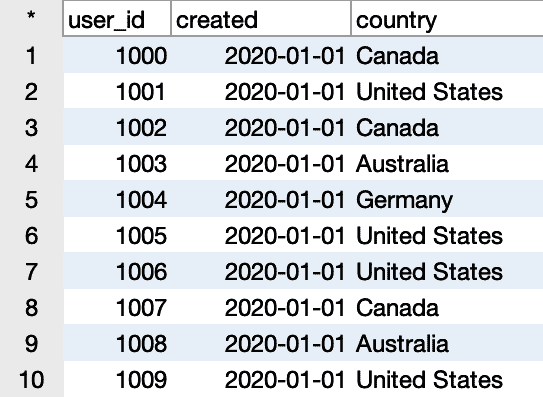
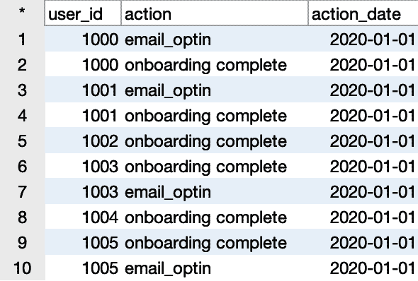
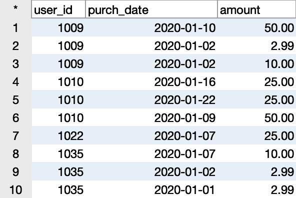
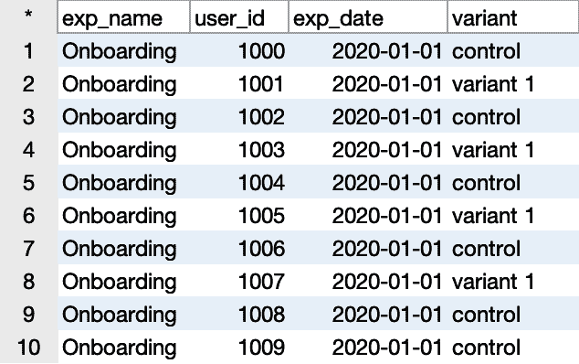
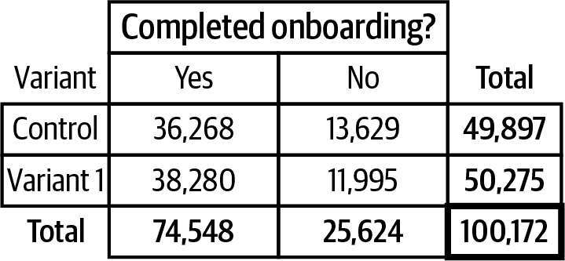

# 第七章：实验分析

*实验*，也称为*A/B 测试*或*分割测试*，被认为是建立因果关系的黄金标准。许多数据分析工作涉及建立相关性：一件事在另一件事发生时更有可能发生，无论是行动、属性还是季节模式。您可能听说过“相关不意味着因果关系”的说法，而正是数据分析中的这个问题，实验试图解决。

所有实验都始于一个*假设*：关于产品、流程或消息进行某种改变会导致行为变化的猜测。这种改变可能是用户界面、新用户入门流程、推荐算法、营销消息或时机等任何领域。理论上，只要组织构建或控制它，就可以进行实验。假设通常受到其他数据分析工作的驱动。例如，我们可能发现很高比例的人在结账流程中退出，我们可以假设如果减少步骤，更多人可能会完成结账流程。

任何实验所需的第二个要素是*成功指标*。我们假设的行为变化可能与表单完成、购买转化、点击率、保留率、参与度或组织使命相关的任何其他行为有关。成功指标应量化这种行为，易于测量，并且足够敏感以检测到变化。点击率、结账完成率和完成流程所需时间通常是很好的成功指标。保留率和客户满意度通常不太适合作为成功指标，尽管它们非常重要，因为它们往往受到超出任何个别实验所测试内容的许多因素的影响，因此对我们想测试的变化不太敏感。好的成功指标通常是您已经作为了解公司或组织健康的一部分而跟踪的指标。

###### 提示

你可能会想知道一个实验是否可以有多个成功指标。当然，使用 SQL，通常可以生成许多不同的计算和指标。但是，你应该意识到存在多重比较问题。我不会在这里进行详细解释，但核心是，你查看的地方越多，找到显著变化的可能性就越大。检查一个指标，你可能会发现实验变体中的一个是否有显著变化，也可能没有。然而，如果检查 20 个指标，至少有一个显示显著性的可能性相当大，无论实验是否与该指标有关。作为一个经验法则，应该有一个或者最多两个主要的成功指标。还可以使用一到五个额外的指标用于防范风险，有时被称为*防护指标*。例如，你可能希望确保实验不会影响页面加载时间，即使这并不是实验的目标所在。

实验的第三要素是一个随机将实体分配到控制组或实验变体组，并相应地修改体验的系统。这种类型的系统有时也被称为*分组系统*。许多软件供应商提供实验分组工具，尽管一些组织选择内部构建它们以获得更大的灵活性。无论哪种方式，要使用 SQL 进行实验分析，实体级别的分配数据必须流入数据库表中，同时包含行为数据。

###### 小贴士

本章讨论的实验特指在线实验，在这些实验中，变体分配通过计算机系统完成，并且行为被数字化跟踪。当然，科学和社会科学领域进行许多类型的实验。一个关键的区别是，在在线实验中检查的成功指标和行为通常已经被用于其他目的进行跟踪，而在许多科学研究中，结果行为是专门为实验跟踪的，并且仅在实验期间跟踪。在在线实验中，有时需要创造性地寻找能代表影响的好指标，当直接测量不可行时。

有了假设、成功指标和变体分组系统，你可以运行实验，收集数据，并使用 SQL 分析结果。

# SQL 实验分析的优势和限制

SQL 对于分析实验非常有用。在许多情况下，实验队列数据和行为数据已经流入数据库，使得 SQL 成为一个自然的选择。成功指标通常已经成为组织报告和分析词汇的一部分，并且已经开发了 SQL 查询。将变体分配数据加入现有的查询逻辑通常相对比较直接。

SQL 是自动化实验结果报告的一个很好的选择。可以为每个实验运行相同的查询，在 *WHERE* 子句中替换实验的名称或标识符。许多进行大量实验的组织已创建了标准化报告，以加快阅读速度并简化解释过程。

尽管 SQL 在实验分析的许多步骤中很有用，但它确实有一个主要缺点：SQL 无法计算统计显著性。许多数据库允许开发人员通过 *用户定义函数*（UDFs）扩展 SQL 功能。UDFs 可能能够利用来自诸如 Python 等语言的统计测试，但这超出了本书的范围。一个很好的选择是在 SQL 中计算摘要统计信息，然后使用提供在[Evanmiller.org](https://oreil.ly/3uspA)的在线计算器来确定实验结果是否具有统计显著性。

# 数据集

本章节中，我们将使用来自虚构的 Tanimura Studios 移动游戏的数据集。有四个表格。`game_users` 表包含下载移动游戏的人员记录，以及日期和国家。数据样本见图 7-1。



###### 图 7-1\. `game_users` 表的样本

`game_actions` 表包含用户在游戏中的操作记录。数据样本见图 7-2。



###### 图 7-2\. `game_actions` 表的样本

`game_purchases` 表跟踪以美元计的游戏内货币购买记录。数据样本见图 7-3。



###### 图 7-3\. `game_purchases` 表的样本

最后，`exp_assignment` 表包含用户分配给特定实验变体的记录。数据样本见图 7-4。



###### 图 7-4\. `exp_assignment` 表的样本

所有这些表中的数据都是虚构的，使用随机数生成器创建的，尽管结构类似于您可能在真实数字游戏公司的数据库中看到的。

# 实验类型

实验种类繁多。如果可以改变用户、客户、选民或其他实体体验的某些方面，理论上可以测试该变更。从分析角度来看，实验主要分为两种类型：二元结果和连续结果。

## 二元结果的实验：卡方检验

如您所预期的，二元结果实验只有两种结果：要么采取行动，要么不采取。用户完成注册流程或不完成。消费者点击网站广告或不点击。学生毕业或不毕业。对于这些类型的实验，我们计算每个变体完成操作的比例。分子是完成者的数量，分母是所有曝光单元。该指标也称为比率：完成率、点击率、毕业率等。

要确定变体中的比率是否在统计上存在差异，我们可以使用*卡方检验*，这是一种用于分类变量的统计检验。¹ 卡方检验的数据通常以*列联表*的形式显示，该表显示了两个属性交集处的观察频率。对于熟悉这种类型表格的人来说，这看起来就像是透视表。

让我们看一个例子，使用我们的移动游戏数据集。产品经理推出了新版本的入职流程，一系列屏幕向新玩家介绍游戏的工作原理。产品经理希望新版本能够增加完成入职并开始他们的第一游戏会话的玩家数量。新版本在名为“Onboarding”的实验中引入，将用户分配到控制组或变体 1，如`exp_assignment`表中跟踪的那样。`game_actions`表中的“完成入职”事件指示用户是否完成了入职流程。

列联表显示了变体分配（控制或变体 1）与是否完成入职的交集处的频率。我们可以使用查询来找到表的值。在这里，我们计算具有和没有“完成入职”动作的用户数，并按`variant`进行*GROUP BY*：

```
SELECT a.variant
,count(case when b.user_id is not null then a.user_id end) as completed
,count(case when b.user_id is null then a.user_id end) as not_completed
FROM exp_assignment a
LEFT JOIN game_actions b on a.user_id = b.user_id
 and b.action = 'onboarding complete'
WHERE a.exp_name = 'Onboarding'
GROUP BY 1
;

variant    completed  not_completed
---------  ---------  -------------
control    36268      13629
variant 1  38280      11995
```

将每行和每列的总数加起来，将此输出转换为一个列联表，如图 7-5 所示。



###### 图 7-5\. 完成入职的列联表

要使用在线显著性计算器之一，我们需要成功次数或执行动作的次数以及每个变体的总体配对数。查找所需数据点的 SQL 非常简单。从`exp_assignment`表中查询分配的变体和该变体的用户`count`。然后，我们*LEFT JOIN* `game_actions`表以查找完成入职的用户`count`。由于我们预期并非所有用户都完成了相关操作，因此需要*LEFT JOIN*。最后，通过将完成用户数除以总配对数来查找每个变体的完成百分比：

```
SELECT a.variant
,count(a.user_id) as total_cohorted
,count(b.user_id) as completions
,count(b.user_id) / count(a.user_id) as pct_completed
FROM exp_assignment a
LEFT JOIN game_actions b on a.user_id = b.user_id
 and b.action = 'onboarding complete'
WHERE a.exp_name = 'Onboarding'
GROUP BY 1
;

variant    total_cohorted  completions  pct_completed
---------  --------------  -----------  -------------
control    49897           36268        0.7269
variant 1  50275           38280        0.7614
```

我们可以看到，变体 1 确实比控制体验有更多的完成率，完成率为 76.14%，而控制体验为 72.69%。但这种差异在统计学上是否显著，允许我们拒绝无差异的假设呢？为此，我们将结果输入在线计算器，并确认在 95%的置信水平下，变体 1 的完成率显著高于控制组。变体 1 可以被宣布为胜利者。

###### 提示

常用的置信水平是 95%，尽管这不是唯一的选择。关于置信水平含义、使用哪个水平以及在比较多个变体与控制组时的调整，有许多在线文章和讨论。

二进制结果实验遵循这个基本模式。计算每个变体中的成功或完成次数，以及每个变体中的总成员数。用于获取成功事件的 SQL 可能会更加复杂，这取决于表格和动作在数据库中的存储方式，但输出是一致的。接下来，我们将转向具有连续结果的实验。

## 连续结果实验：t 检验

许多实验旨在改进*连续指标*，而不是上一节讨论的二进制结果。连续指标可以取多个值。例如，客户的消费金额、页面停留时间以及应用程序使用天数。电子商务网站通常希望增加销售额，因此它们可能会在产品页面或结账流程上进行实验。内容网站可能会测试布局、导航和标题，以增加阅读的文章数量。运行应用程序的公司可能会进行重新营销活动，提醒用户回到应用程序。

对于这些以及其他具有连续成功指标的实验，目标是找出每个变体中的平均值是否在统计上有显著差异。相关的统计检验是*双样本 t 检验*，它确定在通常为 95%的置信区间下，我们是否可以拒绝平均值相等的零假设。统计测试有三个输入，所有这些都可以通过 SQL 进行简单计算：平均值、标准差和观察数量。

让我们通过游戏数据来看一个例子。在上一节中，我们考察了新的入职流程是否提高了完成率。现在我们将考虑这个新流程是否增加了用户在游戏中的货币支出。成功指标是支出金额，因此我们需要计算每个变体的平均值和标准差。首先，我们需要计算每位用户的金额，因为用户可以进行多次购买。从`exp_assignment`表中检索分组分配，并计数用户。接下来，*LEFT JOIN*到`game_purchases`表中获取金额数据。由于不是所有用户都会购买，所以需要*LEFT JOIN*，但我们仍然需要包括他们在平均值和标准差计算中。对于没有购买记录的用户，金额默认设置为 0，使用`coalesce`函数确保这些记录被包括在内，因为`avg`和`stddev`函数会忽略空值。外部查询通过变体对输出值进行汇总：

```
SELECT variant
,count(user_id) as total_cohorted
,avg(amount) as mean_amount
,stddev(amount) as stddev_amount
FROM
(
    SELECT a.variant
    ,a.user_id
    ,sum(coalesce(b.amount,0)) as amount
    FROM exp_assignment a
    LEFT JOIN game_purchases b on a.user_id = b.user_id
    WHERE a.exp_name = 'Onboarding'
    GROUP BY 1,2
) a
GROUP BY 1
;

variant    total_cohorted  mean_amount  stddev_amount
---------  --------------  -----------  -------------
control    49897           3.781        18.940
variant 1  50275           3.688        19.220
```

接下来，我们将这些数值输入在线计算器中，并发现在 95%置信区间内，控制组和变体组之间没有显著差异。 “变体 1”组的入职完成率似乎有所提高，但未增加`金额`支出。

另一个我们可以考虑的问题是变体 1 是否影响了那些完成了入职流程的用户的支出。那些未完成入职流程的用户永远无法进入游戏，因此甚至没有机会进行购买。为了回答这个问题，我们可以使用类似于之前的查询，但是我们将向`game_actions`表添加一个*INNER JOIN*，以限制计算的用户仅限于具有“入职完成”操作的用户：

```
SELECT variant
,count(user_id) as total_cohorted
,avg(amount) as mean_amount
,stddev(amount) as stddev_amount
FROM
(
    SELECT a.variant
    ,a.user_id
    ,sum(coalesce(b.amount,0)) as amount
    FROM exp_assignment a
    LEFT JOIN game_purchases b on a.user_id = b.user_id
    JOIN game_actions c on a.user_id = c.user_id
     and c.action = 'onboarding complete'
    WHERE a.exp_name = 'Onboarding'
    GROUP BY 1,2
) a
GROUP BY 1
;

variant    total_cohorted  mean_amount  stddev_amount
---------  --------------  -----------  -------------
control    36268           5.202        22.049
variant 1  38280           4.843        21.899
```

将这些数值输入计算器后，发现控制组的平均值在 95%置信区间内显著高于变体 1 组。这个结果可能看似令人困惑，但说明了为什么事先在实验中达成对成功指标的共识是如此重要。实验变体 1 对入职完成率有积极影响，因此可以判定为成功。但它对整体支出水平没有影响。这可能是由于混合变化导致的：在变体 1 中完成入职的额外用户较不可能付款。如果基础假设是增加入职完成率将增加收入，那么实验不应被视为成功，产品经理应该提出一些新的测试想法。

# 实验中的挑战及修复失败实验的选项

虽然实验是理解因果关系的黄金标准，但实验可能出现多种问题。如果整个前提是错误的，SQL 也无法拯救。如果问题更多是技术性质的，我们可以通过查询数据的方式调整或排除有问题的数据点，仍然可以解释一些结果。进行实验会消耗工程师、设计师或营销人员创建变体的时间成本。此外还有*机会成本*，即错失的本可以通过将客户引导至最佳转化路径或产品体验而获得的好处。在实际操作层面上，使用 SQL 至少能让组织从实验中学到一些东西，通常是值得花费时间的。

## 变体分配

随机分配实验单元（可以是用户、会话或其他实体）到控制组和变体组是实验的关键要素之一。然而，有时分配过程中会出现错误，无论是因为实验规范的缺陷、技术故障还是分组软件的限制。结果是，控制组和变体组可能大小不等，可能比预期少了一些实体被分组，或者实际分配可能并非完全随机。

SQL 有时可以帮助挽救那些因分组过多而导致实验失败的情况。我曾见过这种情况发生在实验本应只针对新用户，但所有用户都被分组的情况下。另一种情况是当实验测试仅有部分用户能看到的内容时发生，无论是因为需要点击几次才能看到，还是因为需要满足特定条件，比如之前的购买记录。由于技术限制，所有用户都被分组，即使其中很多人永远也看不到实验的内容。解决方案是通过在 SQL 中添加*JOIN*来限制只考虑原本应符合条件的用户或实体。例如，在新用户实验中，我们可以添加一个*INNER JOIN*到包含用户注册日期的表或子查询，并设置一个*WHERE*条件来排除那些注册时间过早的用户。当需要满足特定条件才能看到实验时，也可以使用相同的策略。通过*JOIN*和*WHERE*条件来限制包含的实体，排除那些不应该符合条件的。做完这些操作后，应确保结果样本足够大以产生显著的结果。

如果分组的用户或实体太少，重要的是检查样本是否足够大以产生显著结果。如果不够大，则需要重新运行实验。如果样本量足够大，第二个考虑因素是分组是否存在偏差。例如，我曾经看到某些浏览器或旧版本应用由于技术限制而未被分组的情况。如果被排除的群体不是随机的，并且代表了位置、技术能力或社会经济地位的差异，重要的是考虑这些群体相对于其他群体的规模以及是否应该调整以将其纳入最终分析中。

另一个可能性是变体分配系统存在缺陷，实体并未随机分配。这在大多数现代实验工具中相当不常见，但如果发生这种情况，则会使整个实验无效。结果“太好以至于难以置信”可能表明存在变体分配问题。例如，我曾经看到过高度参与的用户由于实验配置更改而意外地分配到了治疗组和对照组。通过仔细的数据分析可以检查实体是否已分配到多个变体，以及在实验之前是否存在高或低参与度的用户聚集在特定变体中。

###### 提示

运行 A/A 测试可以帮助发现变体分配软件中的缺陷。在这种测试中，实体被分组，并且成功指标进行比较，就像任何其他实验一样。然而，体验不会发生任何变化，两个分组都接收到控制体验。由于两组接收到相同的体验，我们不应该期望成功指标有显著差异。如果确实存在差异，需要进一步调查并解决问题。

## 异常值

用于分析连续成功指标的统计测试依赖于平均值。因此，它们对异常高或低的异常值非常敏感。我曾经看到实验中的一些情况，其中一个或两个特别高消费的客户的存在使得一个变体比其他变体具有统计显著优势。如果没有这些高消费者，结果可能是中性甚至相反的。在大多数情况下，我们更关心的是一种治疗是否对各种个体产生效果，因此调整这些异常值可以使实验结果更具有意义。

我们在第六章中讨论了异常检测，实验分析是这些技术可以应用的另一个领域。异常值可以通过分析实验结果或找到实验之前的基本率来确定。异常值可以通过例如 winso 化（也在第六章中讨论过）的技术移除，该技术移除超出阈值的值，例如 95th 或 99th 百分位数。这可以在进入实验分析的 SQL 之前完成。

处理连续成功指标中的异常值的另一种选择是将成功指标转换为二进制结果。例如，不再比较对照组和变体组的平均花费，因为这可能因为少数非常高的花费者而扭曲，而是比较两组之间的购买率，然后按照讨论的在二进制结果实验部分的程序进行。我们可以考虑在“入门”实验中完成入门的用户中的购买转化率，对比对照组和变体 1 组：

```
SELECT a.variant
,count(distinct a.user_id) as total_cohorted
,count(distinct b.user_id) as purchasers
,count(distinct b.user_id) / count(distinct a.user_id) 
 as pct_purchased
FROM exp_assignment a
LEFT JOIN game_purchases b on a.user_id = b.user_id
JOIN game_actions c on a.user_id = c.user_id
 and c.action = 'onboarding complete'
WHERE a.exp_name = 'Onboarding'
GROUP BY 1
;

variant    total_cohorted  purchasers  pct_purchased
---------  --------------  ----------  -------------
control    36268           4988        0.1000
variant 1  38280           4981        0.0991
```

我们可以观察到，尽管第一个变体的用户更多，但购买者却更少。在对照组中，购买用户的比例为 10%，而第一个变体为 9.91%。接下来，我们将数据点输入在线计算器。在对照组中，转化率在统计上显著更高。在这种情况下，尽管对照组的购买率更高，但从实际角度来看，如果我们认为更多用户完成入门流程具有其他益处，我们可能愿意接受这种小幅下降。例如，更多的玩家可能会提升排名，而享受游戏的玩家可能会通过口口相传将游戏传播给朋友，这两者都有助于增长，进而可能吸引其他新玩家成为购买者。

成功指标也可以设置为阈值，并比较达到该阈值的实体的份额。例如，成功指标可以是阅读至少三篇故事或每周使用应用程序至少两次。可以以这种方式构建无数的指标，因此了解对组织而言既重要又有意义的内容至关重要。

## 时间盒定

实验通常持续几周。这意味着较早进入实验的个体有更长的时间窗口来完成与成功指标相关的操作。为了控制这一点，我们可以应用*时间盒定*——根据实验进入日期固定时间长度，并仅考虑该时间窗口内的操作。这个概念也在第四章中有所涵盖。

对于实验来说，时间框的合适大小取决于你要测量的内容。当测量通常具有即时响应的行为时，窗口可能只有一小时。对于购买转化，实验者通常允许 1 至 7 天的时间窗口。较短的窗口可以更早地分析实验结果，因为所有的分组实体都需要允许完全时间来完成行动。最佳的窗口平衡了获取结果的需求与组织的实际动态。如果客户通常在几天内转化，请考虑 7 天的窗口；如果客户通常需要 20 天或更长时间，请考虑 30 天的窗口。

例如，我们可以通过仅包括与集团事件发生后 7 天内的购买来修订我们从连续结果实验中的第一个例子。注意，使用实体分配给变体的时间作为时间框的起始点非常重要。添加了额外的*ON*子句，限制结果仅限于在“7 天”间内发生的购买：

```
SELECT variant
,count(user_id) as total_cohorted
,avg(amount) as mean_amount
,stddev(amount) as stddev_amount
FROM
(
    SELECT a.variant
    ,a.user_id
    ,sum(coalesce(b.amount,0)) as amount
    FROM exp_assignment a
    LEFT JOIN game_purchases b on a.user_id = b.user_id 
     and b.purch_date <= a.exp_date + interval '7 days'
    WHERE a.exp_name = 'Onboarding'
    GROUP BY 1,2
) a
GROUP BY 1
;

variant    total_cohorted  mean_amount  stddev_amount
---------  --------------  -----------  -------------
control    49897           1.369        5.766
variant 1  50275           1.352        5.613
```

这些平均数相似，事实上在统计上它们彼此之间没有显著差异。在这个例子中，时间框结论与没有时间框时的结论一致。

在这种情况下，购买事件相对较少。对于衡量常见事件和快速累积的指标，如页面浏览量、点击量、点赞和阅读文章，使用时间框可以防止最早分组的用户看起来比后来的分组用户显著“更好”。

## 重复接触实验

在在线实验讨论中，大多数例子都是我喜欢称之为“一劳永逸”的体验：用户只遇到一次处理，对此做出反应，然后不再经过。用户注册是一个典型的例子：消费者仅注册某项服务一次，因此对注册流程的任何更改仅影响新用户。分析这些体验上的测试相对比较简单。

另一种经验类型被我称为“重复接触”，在这种情况下，个体在使用产品或服务的过程中多次接触到变化。在涉及这些变化的任何实验中，我们可以预期个体会多次遇到它们。应用程序用户界面的变化，如颜色、文本和重要信息及链接的位置，在用户使用应用程序期间会被用户体验到。定期向客户发送提醒或促销的电子邮件营销计划也具有这种重复接触的特质。电子邮件在收件箱中作为主题行出现多次，并且如果被打开，作为内容出现。

测量重复曝光实验比测量一次性实验更加棘手，因为存在新奇效应和均值回归现象。*新奇效应*是行为因为某事物新而改变的倾向，并非因为它实际上更好。*均值回归*是现象随着时间返回到平均水平的倾向。例如，改变用户界面的任何部分都倾向于增加与其互动的人数，无论是新的按钮颜色、标志还是功能放置位置。最初指标看起来不错，因为点击率或参与度上升了。这就是新奇效应。但随着时间的推移，用户习惯于这种变化，他们倾向于以接近基线的速率点击或使用功能。这就是均值回归。运行这类实验时要回答的重要问题是新基线是否高于（或低于）之前的基线。一种解决方案是允许足够长的时间段过去，在这段时间内您可能期望发生均值回归，然后再评估结果。在某些情况下，这可能是几天；在其他情况下，可能是几周或几个月。

当变化很多或实验以系列形式出现（如电子邮件或实体邮件活动）时，弄清整个方案是否有所不同可能是个挑战。当顾客收到某种电子邮件变体后购买产品时，很容易宣称成功，但我们如何知道他们是否本来就会做出那个购买决定呢？一种选择是建立*长期对照组*。这是一个不接收任何营销消息或产品体验变更的群体。请注意，这与简单比较选择退出营销消息的用户不同，因为通常存在一些选择退出和不选择退出的偏见。设置长期对照组可能会很复杂，但几乎没有更好的方法来真正衡量活动和产品变更的累积效果。

另一种选择是对变体进行队列分析（详见第四章）。可以在较长时间段内追踪这些群体，从几周到几个月不等。可以计算和测试留存或累积指标，以查看长期内变体之间的效果是否有所不同。

尽管在实验中可能会遇到各种挑战，但它们仍然是测试和验证涉及从营销消息和创意到产品体验中所做更改因果关系的最佳方式。我们在数据分析中经常遇到不太理想的情况，因此接下来我们将转向一些分析选项，以解决无法进行 A/B 测试时的情况。

# 当无法进行控制实验时：替代分析方法

随机实验是超越相关性以建立因果关系的黄金标准。然而，有许多原因可能导致无法进行随机实验。在医疗或教育环境中，给予不同群体不同治疗可能是不道德的。监管要求可能会阻止在其他环境中进行实验，如金融服务。还可能存在实际原因，例如难以限制变异处理仅限于随机群体的访问。始终值得考虑是否有值得在伦理、监管和实际边界内测试或可测试的部分。措辞、位置和其他设计元素是一些示例。

第二种无法进行实验的情况是当变化已经发生且数据已经收集时。除了恢复变化之外，回去重新进行实验不是一个选项。有时数据分析师或数据科学家无法提供关于实验的建议。我曾多次加入一个组织，并被要求解开那些本来如果有对照组会更容易理解的变化结果。在其他情况下，变化是意外的。例如影响部分或全部客户的站点停机、表单错误以及如风暴、地震和山火等自然灾害。

虽然在没有实验的情况下，因果推断的结论不如强有力，但有一些准实验分析方法可以从数据中获得洞见。这些方法依赖于从可用数据中构建尽可能接近的“对照”和“治疗”条件的组。

## 预/后分析

**预/后分析**比较同一或相似人群在变化前后的情况。变化前的人群测量用作对照，而变化后的人群测量则用作变量或治疗组。

预/后分析在有清晰定义的变化发生在已知日期的情况下效果最好，这样可以清晰地划分出变化前后的群体。在这种分析类型中，您需要选择在变化前后测量多长时间，但这些期间应该是相等或接近相等的。例如，如果变化发生后已经过去了两周，那么将这段时间与变化前的两周进行比较。考虑比较多个时期，如变化前后一周、两周、三周和四周。如果所有这些时间段的结果都一致，那么您对结果的信心就会比结果不一致时更高。

让我们通过一个例子来详细说明。想象一下，我们的移动游戏的入职流程包括一个步骤，用户可以勾选一个框，表示他们是否希望接收游戏新闻的电子邮件。这一直以来都是默认选中的，但是一项新的法规要求现在默认不选中。2020 年 1 月 27 日，这一变更发布到游戏中，我们想要找出它是否对电子邮件选择率产生了负面影响。为此，我们将比较变更之前的两周和变更之后的两周，看看选择参与率是否有统计显著性差异。我们可以使用一周或三周的期间，但选择两周是因为它足够长，可以允许一些星期几的变化，同时也足够短，以限制其他可能影响用户愿意选择参与的因素数量。

变体通过 SQL 查询中的 CASE 语句进行分配：在变更之前创建的用户标记为“pre”，而在变更之后创建的用户标记为“post”。接下来，我们从`game_users`表中计算每个组中用户的数量。然后，我们通过与`game_actions`表的*LEFT JOIN*，限制为具有“email_optin”动作的记录，来计算选择参与的用户数量。然后我们将这些值相除以找到选择参与的百分比。我喜欢在每个变体中包含天数的计数作为质量检查，尽管不必在分析的其余部分中执行：

```
SELECT 
case when a.created between '2020-01-13' and '2020-01-26' then 'pre'
     when a.created between '2020-01-27' and '2020-02-09' then 'post'
     end as variant
,count(distinct a.user_id) as cohorted
,count(distinct b.user_id) as opted_in
,count(distinct b.user_id) / count(distinct a.user_id) as pct_optin
,count(distinct a.created) as days
FROM game_users a
LEFT JOIN game_actions b on a.user_id = b.user_id 
 and b.action = 'email_optin'
WHERE a.created between '2020-01-13' and '2020-02-09'
GROUP BY 1
;

variant  cohorted  opted_in  pct_optin  days
-------  --------  --------  ---------  ----
pre      24662     14489     0.5875     14
post     27617     11220     0.4063     14
```

###### 提示

许多数据库将日期输入视为字符串，如 `'2020-01-13'`。如果您的数据库不识别，请使用以下选项将字符串转换为日期：

```
cast('2020-01-13' as date)

date('2020-01-13')

'2020-01-13'::date
```

在这种情况下，我们可以看到，在变更之前通过入职流程的用户的电子邮件选择率明显较高——58.75%，而之后为 40.63%。将数值输入在线计算器中，确认“pre”组的比例显著高于“post”组。在这个例子中，游戏公司可能无法做太多，因为这一变更是由法规引起的。进一步的测试可能会确定，如果这是一个业务目标，提供样本内容或关于电子邮件程序的其他信息是否会鼓励更多新玩家选择参与。

在进行前后分析时，请记住，您试图了解的变化之外的其他因素可能会导致指标的增加或减少。外部事件、季节性、营销促销等因素甚至可能在几周内大幅改变环境和客户心态。因此，这种类型的分析不如真正的随机实验来证明因果关系。然而，有时这是少数可用的分析选项之一，可以生成可以在将来的控制实验中测试和完善的工作假设。

## 自然实验分析

*自然实验* 是指实体通过某种近似随机的过程获得不同体验的情况。一个组接受正常或控制体验，另一个组接受可能具有积极或消极影响的变体。通常这些实验是无意识的，比如引入软件漏洞或某个地点发生的事件。为了使这种分析有效，我们必须能够清楚地确定哪些实体受到了影响。此外，还需要一个尽可能与受影响组相似的对照组。

SQL 可用于构建变体并计算在二元结果事件中的队列大小和成功事件（或在连续结果事件中的均值、标准差和人口大小）。结果可以像任何其他实验一样插入在线计算器中。

以视频游戏数据集为例，假设在我们的数据时间段内，加拿大用户在第一次查看虚拟货币购买页面时，因为误操作多添加了一个零：每个包中的虚拟币数量增加了。例如，用户本来可以得到 10 个游戏币，现在会得到 100 个游戏币，或者本来可以得到 100 个游戏币，现在会得到 1,000 个游戏币，依此类推。我们想要回答的问题是，加拿大人是否以更高的比例转化为购买者。我们将仅与美国用户比较，而不是整个用户基础。这两个国家在地理上靠近，大多数用户使用相同语言——假设我们已经进行了其他分析，表明他们的行为相似，而其他国家的用户行为差异足以排除它们。

要进行分析，我们根据区分特征（在这种情况下是`game_users`表中的`country`字段）创建“变体”，但需要注意，根据数据集的不同，有时可能需要更复杂的 SQL。计算用户分组及其购买次数的方法与之前相同：

```
SELECT a.country
,count(distinct a.user_id) as total_cohorted
,count(distinct b.user_id) as purchasers
,count(distinct b.user_id) / count(distinct a.user_id) 
 as pct_purchased
FROM game_users a
LEFT JOIN game_purchases b on a.user_id = b.user_id
WHERE a.country in ('United States','Canada')
GROUP BY 1
;

country        total_cohorted  purchasers  pct_purchased
-------------  --------------  ----------  -------------  
Canada         20179           5011        0.2483
United States  45012           4958        0.1101
```

实际上，加拿大购买用户的比例更高——为 24.83%，而美国为 11.01%。将这些值输入在线计算器确认，加拿大的转化率在 95%置信区间下显著更高。

分析自然实验最困难的部分往往是找到一个可比较的人群，并且显示这两个人群足够相似，以支持统计检验的结论。虽然几乎不可能证明没有混杂因素，但人口统计特征和行为的仔细比较可以增加结果的可信度。由于自然实验不是真正的随机实验，因果关系的证据较弱，这一点在这类分析的呈现中应该注意。

## 围绕阈值的人群分析

在某些情况下，存在一个阈值，导致某些人或其他主体单位接受治疗，而其他人则没有。例如，某个特定的成绩平均值可能使学生有资格获得奖学金，某个收入水平可能使家庭有资格获得补助医疗保健，或者高流失风险评分可能会触发销售代表跟进客户。在这种情况下，我们可以利用这样一个想法：阈值两侧的主体很可能相似。因此，我们可以仅比较在正面和负面靠近阈值的那些人，而不是比较整个收到奖励或干预的人群。这种方法的正式名称是*回归断点设计*（RDD）。

要执行这种类型的分析，我们可以通过围绕阈值分割数据来构建“变体”，类似于我们在前/后分析中所做的。不幸的是，关于两侧值的带宽应该多宽的硬性规定并不存在。这些“变体”应该在大小上相似，并且它们应该足够大，以便在结果分析中具有显著性。一个选择是使用几个不同的范围进行多次分析。例如，您可以分析在每个组包含在阈值的 5%、7.5%和 10%内的受试者时，“治疗”组与对照组之间的差异。如果这些分析的结论一致，那么这些结论会得到更多的支持。然而，如果它们不一致，数据可能被视为无法得出结论。

与其他类型的非实验分析一样，来自 RDD 的结果应该被认为不那么确凿地证明了因果关系。潜在的混杂因素也应该受到仔细的关注。例如，如果高流失风险客户接受了多个团队的干预，或者享受到了特别折扣以鼓励他们保持客户，再加上销售代表的电话，数据可能会被这些其他变化所影响。

# 结论

实验分析是一个丰富的领域，通常包括本书其他部分所见的不同类型的分析，从异常检测到队列分析。数据剖析在追踪发生的问题时非常有用。当随机实验不可能时，有多种其他技术可用，而且可以使用 SQL 创建合成对照组和变体组。

在下一章中，我们将转向构建复杂的数据集进行分析，这一领域整合了我们迄今为止讨论过的各种主题。

¹ 参见[*https://www.mathsisfun.com/data/chi-square-test.html*](https://www.mathsisfun.com/data/chi-square-test.html)以获取对此测试的良好解释。
