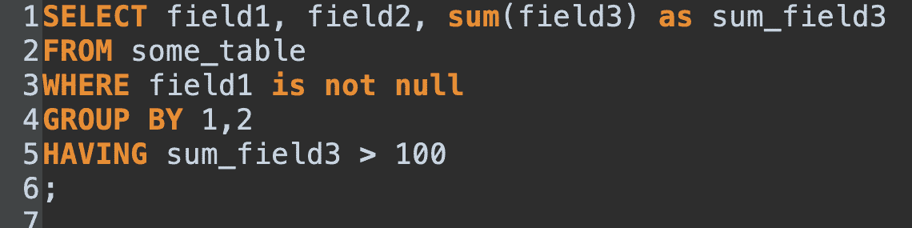
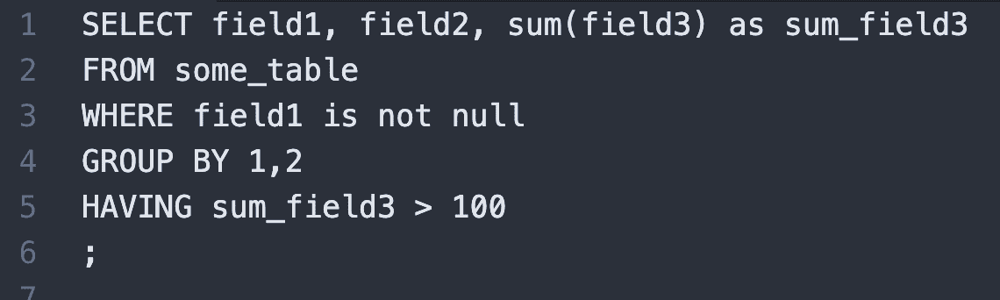
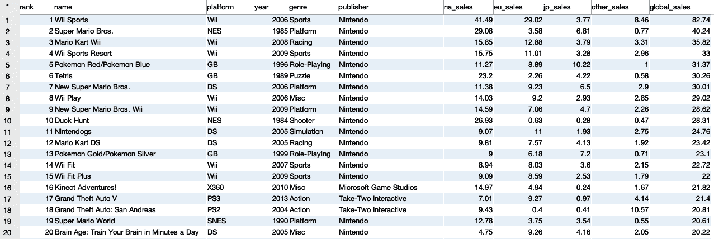

# 第八章：为分析创建复杂数据集

在第 3 到第七章中，我们讨论了使用 SQL 进行数据库中数据分析的多种方法。除了这些具体用例之外，有时查询的目标是组装一个具体但通用的数据集，可以用来执行各种进一步的分析。目标可能是数据库表、文本文件或商业智能工具。所需的 SQL 可能很简单，仅需要几个过滤器或聚合。然而，通常实现所需数据集的代码或逻辑可能非常复杂。此外，随着利益相关者请求额外的数据点或计算，此类代码可能会随时间更新。SQL 代码的组织、性能和可维护性变得至关重要，而这对于一次性分析来说并非如此。

在本章中，我将讨论组织代码的原则，以便更容易地共享和更新。然后我将讨论何时保留 SQL 中的查询逻辑，何时考虑通过 ETL（提取-转换-加载）代码转移到永久表。接下来，我将解释存储中间结果的选项——子查询、临时表和公共表达式（CTE）——以及在代码中使用它们的考虑因素。最后，我将介绍减小数据集大小的技术和处理数据隐私以及删除个人可识别信息（PII）的方法。

# 何时使用 SQL 处理复杂数据集

几乎所有为进一步分析准备的数据集都包含一些逻辑。逻辑的复杂程度可以从相对简单的情况——例如如何将表进行连接（*JOIN*）以及如何在 *WHERE* 子句中放置过滤器——到对数据的分区执行聚合、分类、解析或窗口函数的复杂计算。在为进一步分析创建数据集时，选择是保留 SQL 查询中的逻辑，还是将其推到上游的 ETL 作业或下游的其他工具，通常既是艺术也是科学。便利性、性能以及工程师的帮助可用性都是决策的因素。通常并不存在单一正确答案，但是随着您与 SQL 的工作时间越长，您会逐渐培养直觉和信心。

## 使用 SQL 的优势

SQL 是一种非常灵活的语言。希望在前几章中我已经说服了你，SQL 可以完成各种数据准备和分析任务。在开发复杂数据集时，这种灵活性是使用 SQL 的主要优势。

在处理数据集的初始阶段，您可能会执行许多查询。工作通常从几个分析查询开始，以了解数据。然后逐步构建查询，沿途检查转换和聚合，确保返回的结果正确。这可能会与更多的分析交替进行，当实际值与我们的预期不同时。复杂的数据集可以通过组合几个子查询来构建，这些子查询使用*JOIN*或*UNION*回答特定问题。运行查询并检查输出是快速的，允许快速迭代。

除了依赖表中数据的质量和及时性外，SQL 几乎没有依赖性。查询是按需运行的，不依赖于数据工程师或发布流程。分析师或数据科学家通常可以将查询嵌入到商业智能（BI）工具或 R 或 Python 代码中，而无需请求技术支持。当利益相关者需要在输出中添加另一个属性或聚合时，可以快速进行更改。

在进行新分析并且预计逻辑和结果集经常发生变化时，将逻辑保留在 SQL 代码中是理想的。此外，当查询快速且数据快速返回给利益相关者时，可能永远不需要将逻辑移动到其他位置。

## 何时应构建到 ETL 中

在某些情况下，将逻辑移入 ETL 流程比保留在 SQL 查询中更好，尤其是在工作于具有数据仓库或数据湖的组织时。使用 ETL 的两个主要原因是性能和可见性。

SQL 查询的性能取决于逻辑的复杂性、查询的表的大小以及底层数据库的计算资源。尽管许多查询运行速度很快，特别是在更新的数据库和硬件上，但您可能最终会编写一些具有复杂计算、涉及大型表的*JOIN*或笛卡尔*JOIN*的查询，或者以分钟或更长时间运行的查询。分析师或数据科学家可能愿意等待查询返回。然而，大多数数据使用者习惯于网站快速响应时间，如果他们等待数据超过几秒钟，就会感到沮丧。

ETL 在计划的时间背景下运行，并将结果写入表中。由于它在后台运行，可以运行 30 秒、五分钟或一个小时，而不会影响最终用户。计划通常是每天运行一次，但可以设置更短的间隔。最终用户可以直接查询生成的表，无需进行*JOIN*或其他逻辑，因此体验到快速的查询时间。

当 ETL 比将所有逻辑保留在 SQL 查询中更好的一个典型例子是每日快照表。在许多组织中，保留客户、订单或其他实体的每日快照对于回答分析问题非常有用。对于客户，我们可能想要计算到目前为止的总订单或访问次数，销售管道中的当前状态以及其他可能变化或累积的属性。我们在第三章关于时间序列分析和第四章关于队列分析中已经看到如何创建每日系列，包括实体不存在的天数。在个体实体级别和长时间段内，这样的查询可能变得缓慢。此外，像当前状态这样的属性可能会在源表中被覆盖，因此捕获每日快照可能是保留准确历史图片的唯一方法。开发 ETL 并将每日快照结果存储在表中通常是值得努力的。

将逻辑移到 ETL 的第二个原因是可见性。通常 SQL 查询存在于个人计算机上或者埋藏在报告代码中。其他人甚至找到查询中嵌入的逻辑，更别说理解和检查其中的错误是困难的。将逻辑移到 ETL 并将 ETL 代码存储在像 GitHub 这样的代码库中，可以让组织中的其他人更容易找到、检查和迭代它。大多数开发团队使用的代码库还存储变更历史，这是一个额外的好处，可以看到特定查询中的哪一行是何时添加或更改的。

有很多理由考虑将逻辑放入 ETL，但这种方法也有其缺点。其中一个是直到 ETL 作业运行并刷新数据之前，新结果才可用，即使底层表中已经到达了新数据。这可以通过继续针对原始数据运行 SQL 但限制到一个小时间窗口以确保查询快速来克服。这可以选择与 ETL 表上的查询结合使用，使用子查询或*UNION*。将逻辑放入 ETL 的另一个缺点是更难更改。更新或修复错误通常需要交给数据工程师，并进行代码测试、检入代码库并发布到生产数据仓库。因此，我通常选择等到我的 SQL 查询经过快速迭代期，组织已经审查并在使用的数据集之后，再将其移到 ETL 中。当然，使代码更难更改并强制进行代码审查是确保一致性和数据质量的优秀方法。

## 何时将逻辑放入其他工具

SQL 代码和查询结果在查询编辑器中经常只是分析的一部分。结果通常嵌入报告中，以表格和图形形式可视化，或在从电子表格和 BI 软件到应用统计或机器学习代码的各种工具中进一步处理。除了选择何时将逻辑上游移动到 ETL 中，我们还可以选择何时将逻辑下游移动到其他工具中。决策中关键因素是性能和具体用例。

每种工具类型都有其性能优势和限制。电子表格非常灵活，但不擅长处理大量行或跨多行的复杂计算。数据库明显具有性能优势，因此通常最好尽可能多地在数据库中进行计算，并将尽可能小的数据集传递给电子表格。

BI 工具具有各种功能，因此了解软件处理计算方式及数据使用方式至关重要。一些 BI 工具可以*缓存*数据（保留本地副本）以优化格式加速计算。其他工具每次向报告添加或移除字段时都会发出新的查询，因此主要利用数据库的计算能力。某些计算，如`count distinct`和`median`，需要详细的实体级数据。如果无法预见这些计算的所有变体，可能需要传递比理想情况下更大更详细的数据集。此外，如果目标是创建一个允许多种方式探索和切片的数据集，通常详细数据更好。找到 SQL、ETL 和 BI 工具计算的最佳组合可能需要一些迭代过程。

当目标是使用 R 或 Python 等语言在数据集上执行统计或机器学习分析时，通常详细数据更好。这两种语言都可以执行与 SQL 重叠的任务，如聚合和文本处理。通常最好尽可能多地在 SQL 中执行计算，以利用数据库的计算能力，但不要过度使用。灵活性迭代通常是建模过程中的重要部分。在 SQL 或其他语言中执行计算的选择也可能取决于您对每种语言的熟悉程度和舒适度。那些在 SQL 中非常熟悉的人可能更倾向于在数据库中进行更多的计算，而那些在 R 或 Python 中更熟练的人可能更倾向于在那里进行更多的计算。

###### 提示

尽管决定逻辑放置位置的规则不多，我会特别鼓励您遵循一个规则：避免手动步骤。在电子表格或文本编辑器中打开数据集，做出小改动，保存并继续操作足够简单。但是当您需要迭代或有新数据到达时，很容易忘记手动步骤或执行不一致。根据我的经验，没有真正的“一次性”请求。尽可能将逻辑放在某处的代码中。

SQL 是一个强大的工具，非常灵活。它也坐落在分析工作流程和工具生态系统中。决定计算放置位置可能需要一些试验和错误，因为您在 SQL、ETL 和下游工具之间进行迭代时需要考虑可行性。您对所有可用选项越熟悉和经验越丰富，您就能更好地估计权衡和继续提高工作的性能和灵活性。

# 代码组织

SQL 的格式化规则较少，这可能导致查询混乱。查询子句必须按正确顺序排列：*SELECT* 之后是 *FROM*，*GROUP BY* 不能在 *WHERE* 之前，例如。一些关键字如 *SELECT* 和 *FROM* 是 *保留字*（即不能用作字段名、表名或别名）。然而，与其他一些语言不同，数据库会忽略换行、空白（除了分隔单词的空格）和大小写。本书中的示例查询都可以写在一行上，并且可以有或没有大写字母，除非在引号字符串中。因此，代码组织的负担落在编写查询的人身上。幸运的是，我们有一些正式和非正式的工具来保持代码组织良好，从注释到“装饰性”格式化（如缩进和 SQL 代码文件的存储选项）。

## 注释

大多数编码语言都有一种方法来指示将文本块视为注释并在执行过程中忽略它。SQL 有两种选择。第一种是使用两个短划线，这会将后续行中的所有内容转换为注释：

```
-- This is a comment
```

第二种选择是使用斜杠（/）和星号（*）字符开始一个注释块，该块可以跨多行，后面跟着星号和斜杠结束注释块：

```
/*
This is a comment block
with multiple lines
*/
```

许多 SQL 编辑器调整了代码内部注释的视觉样式，将其变灰或以其他方式改变颜色，以便更容易识别。

注释代码是一个好习惯，但必须承认，许多人在日常生活中很难坚持做到这一点。SQL 通常是迅速编写的，特别是在探索或剖析练习中，我们不指望长期保留我们的代码。过度注释的代码与没有注释的代码一样难以阅读。我们都曾因为我们写了这段代码，所以我们将永远能记住写这段代码的原因的想法而受苦。然而，任何继承自同事写的长查询或离开查询几个月后再回来更新它的人都会知道，解释代码可能是令人沮丧和耗时的。

为了平衡注释的负担和好处，我尝试遵循一些经验法则。首先，在任何值具有非明显含义的地方添加注释。许多源系统将值编码为整数，而它们的含义很容易被忘记。留下一条注释使含义清晰，并使代码更易于根据需要更改：

```
WHERE status in (1,2) -- 1 is Active, 2 is Pending
```

其次，对于任何其他非明显的计算或转换进行评论。这些可以是任何人未花时间对数据集进行剖析可能不知道的内容，从数据输入错误到异常值的存在：

```
case when status = 'Live' then 'Active'
     else status end
     /* we used to call customers Live but in
     2020 we switched it to Active */
```

我尝试遵循的第三个关于注释的实践是在查询包含多个子查询时留下注释。关于每个子查询计算的简短说明使得以后在质量检查或编辑较长查询时轻松跳转到相关部分变得容易：

```
SELECT...
FROM
( -- find the first date for each customer
    SELECT ...
    FROM ...
) a
JOIN 
( -- find all of the products for each customer
    SELECT ...
    FROM ...
) b on a.field = b.field
...
;
```

良好的注释需要练习和一些纪律，但对于大部分长于几行的查询来说是值得的。注释还可以用于向整体查询添加有用的信息，例如目的、作者、创建日期等等。通过在代码中添加有帮助的注释，善待你的同事和未来的自己。

## 大小写、缩进、括号和其他格式技巧

格式化，特别是一致的格式化，是保持 SQL 代码有条理和可读性的好方法。数据库在 SQL 中忽略大小写和空白（空格、制表符和换行），因此我们可以利用这些优势将代码格式化为更易读的块。括号不仅可以控制执行顺序（我们稍后会详细讨论），还可以在视觉上组合计算元素。

大写的词突出于其他内容之中，任何收到全大写主题邮件的人都可以确认这一点。我喜欢仅在主要从句中使用大写：*SELECT*、*FROM*、*JOIN*、*WHERE* 等等。特别是在长或复杂的查询中，能够迅速识别这些内容，从而理解*SELECT*从句何时结束，*FROM*从句何时开始，节省了我大量时间。

空白字符是组织查询部分并使其更易于找到的关键方法，以及理解哪些部分在逻辑上彼此配合。任何 SQL 查询都可以在编辑器中的单行上编写，但在大多数情况下，这会导致代码左右滚动。我喜欢在新的一行上开始每个子句（*SELECT*、*FROM*等），这与大写一起帮助我跟踪每个子句的开始和结束。此外，我发现将聚合函数放在自己的行上，以及占据一些空间的函数，有助于组织。对于有两个以上 WHEN 条件的 CASE 语句，将它们分开到多行上也是一种很好的方法，可以轻松地看到和跟踪代码中正在发生的事情。例如，我们可以查询`type`和`mag`（大小），解析`place`，然后计算`earthquakes`表中的记录，在*WHERE*子句中进行一些过滤：

```
SELECT type, mag
,case when place like '%CA%' then 'California'
      when place like '%AK%' then 'Alaska'
      else trim(split_part(place,',',2)) 
      end as place
,count(*)
FROM earthquakes
WHERE date_part('year',time) >= 2019
and mag between 0 and 1
GROUP BY 1,2,3
;

type                mag  place       count
------------------  ---  ----------  -----
chemical explosion  0    California  1
earthquake          0    Alaska      160
earthquake          0    Argentina   1
...                 ...  ...         ...
```

缩进是保持代码视觉组织的另一个技巧。在 CASE 语句中添加空格或制表符以对齐其中的 WHEN 项目是一个例子。您还在整本书的示例中看到缩进的子查询。这使得子查询在视觉上显得独立，当一个查询有多级嵌套子查询时，它使得查看和理解将被评估的顺序以及哪些子查询在级别上是对等的更加容易：

```
SELECT... 
FROM 
(
    SELECT...
    FROM
    (
        SELECT...
        FROM...
    ) a
    JOIN
    (
        SELECT...
        FROM
    ) b on...
) a
...
;
```

任意数量的其他格式选择都可以，查询将返回相同的结果。长期以来，SQL 编写者倾向于有自己的格式偏好。但是，清晰和一致的格式使得创建、维护和分享 SQL 代码更加容易。

许多 SQL 查询编辑器提供某种形式的查询格式化和着色。通常关键字会被着色，使其在查询中更易于识别。这些视觉线索使得开发和审查 SQL 查询都更加容易。如果你一直在查询编辑器中编写 SQL，请尝试在纯文本编辑器中打开一个*.sql*文件，看看着色效果有多大的不同。图 8-1 展示了一个 SQL 查询编辑器的示例，同样的代码在图 8-2 中展示为纯文本编辑器中的样式（请注意，在本书的某些版本中可能为灰度显示）。



###### 图 8-1\. SQL 查询编辑器 DBVisualizer 中关键字着色的屏幕截图



###### 图 8-2\. 同样的代码在文本编辑器 Atom 中的纯文本形式

从数据库的角度来看，格式化是可选的，但这是一个好的实践。一致使用间距、大写和其他格式选项有助于保持代码的可读性，因此更容易分享和维护。

## 存储代码

在进行注释和格式化代码之后，将其存储在某个地方以备日后使用或参考是一个好主意。

许多数据分析师和科学家使用 SQL 编辑器，通常是桌面软件。SQL 编辑器很有用，因为它们通常包含用于浏览数据库架构的工具，并且有一个代码窗口。它们将文件保存为.sql 扩展名的文件，这些文本文件可以在任何文本编辑器中打开和修改。文件可以保存在本地目录或云端文件存储服务中。

由于它们是文本文件，SQL 代码文件很容易存储在像 GitHub 这样的变更控制存储库中。使用存储库提供了一个不错的备份选项，并且便于与他人分享。存储库还会跟踪文件的变更历史，这在需要查找特定更改的时间或出于法规原因需要变更历史时非常有用。GitHub 和其他工具的主要缺点是它们通常不是分析工作流程中的必需步骤。您需要记住定期更新您的代码，并且与任何手动步骤一样，很容易忘记执行更新。

# 组织计算

创建复杂数据集时，我们面临的两个相关问题是确保逻辑正确和获得良好的查询性能。逻辑必须正确，否则结果将毫无意义。对于分析目的的查询性能，与事务系统不同，通常有一个“足够好”的范围。无法返回查询的查询是有问题的，但等待 30 秒和等待一分钟的结果可能并不会有很大差别。在 SQL 中，通常有多种编写返回正确结果的查询的方法。我们可以利用这一点来确保逻辑正确并调整长时间运行查询的性能。在 SQL 中，有三种主要方法来组织中间结果的计算：子查询、临时表和公共表表达式（CTE）。在我们深入研究它们之前，我们将回顾 SQL 的评估顺序。为了结束这一部分，我将介绍`分组集`，它可以在某些情况下替代*联合*查询。

## 理解 SQL 子句评估顺序

数据库将 SQL 代码翻译成一组操作，这些操作按顺序执行以返回请求的数据。虽然不必深入了解其工作原理就能写出分析用的 SQL，但了解数据库执行操作的顺序非常有用（有时候还是必要的，以便调试出现的意外结果）。

###### 小贴士

许多现代数据库都有复杂的查询优化器，可以考虑查询的各个部分，以制定最高效的执行计划。尽管它们可能会按照不同于此处讨论的顺序考虑查询的各个部分，因此可能需要较少的人为查询优化，但它们不会按照此处讨论的顺序计算中间结果。

SQL 查询评估的一般顺序显示在表 8-1 中。SQL 查询通常仅包括可能的子句子集，因此实际评估包括与查询相关的步骤。

表 8-1\. SQL 查询评估顺序

| 1 | 包括*JOIN*及其*ON*子句的 FROM |
| --- | --- |
| 2 | WHERE |
| 3 | 包括聚合的 GROUP BY |
| 4 | HAVING |
| 5 | 窗口函数 |
| 6 | SELECT |
| 7 | DISTINCT |
| 8 | UNION |
| 9 | ORDER BY |
| 10 | LIMIT 和 OFFSET |

首先，计算*FROM*子句中的表格，以及任何*JOIN*。如果*FROM*子句包含任何子查询，在继续下一步之前需要评估这些子查询。在*JOIN*中，*ON*子句指定了如何*JOIN*表格，这也可能过滤结果集。

###### 提示

*FROM*始终首先评估，除非查询不包含*FROM*子句的情况下。在大多数数据库中，可以仅使用*SELECT*子句进行查询，如本书中的某些示例所示。仅*SELECT*查询可以返回系统信息，如日期和数据库版本。它还可以对常量应用数学、日期、文本和其他函数。尽管在最终分析中很少使用这样的查询，但它们对于快速测试函数或迭代复杂计算非常方便。

接下来，评估*WHERE*子句以确定应包含在进一步计算中的记录。请注意，*WHERE*在评估顺序中较早，因此不能包含稍后步骤中发生的计算结果。

接下来计算*GROUP BY*，包括相关的聚合函数，如`count`、`sum`和`avg`。正如您所预期的那样，*GROUP BY*将仅包括在*FROM*表格中存在的值，这是在*JOIN*和*WHERE*子句中进行过滤后的结果。

接下来评估*HAVING*。由于它跟在*GROUP BY*之后，*HAVING*可以对*GROUP BY*返回的聚合值进行过滤。通过将查询放置在子查询中并在主查询中应用过滤器，也可以通过聚合值进行过滤。例如，我们可能希望找到`legislators_terms`表中至少有一千个任期的所有州，并按照任期降序排列：

```
SELECT state
,count(*) as terms
FROM legislators_terms
GROUP BY 1
HAVING count(*) >= 1000
ORDER BY 2 desc
;

state  terms
-----  -----
NY     4159
PA     3252
OH     2239
...    ...
```

如果使用窗口函数，则在此时评估。有趣的是，因为聚合已在此时计算，所以可以在窗口函数定义中使用它们。例如，在第四章中的`legislators`数据集中，可以在单个查询中计算每个州的任期服务和所有州的平均任期：

```
SELECT state
,count(*) as terms
,avg(count(*)) over () as avg_terms
FROM legislators_terms
GROUP BY 1
;

state  terms  avg_terms
-----  -----  ---------
ND     170    746.830
NV     177    746.830
OH     2239   746.830
...    ...    ...
```

聚合也可以在*OVER*子句中使用，如下面的查询所示，它按总任期数降序排列各州：

```
SELECT state
,count(*) as terms
,rank() over (order by count(*) desc)
FROM legislators_terms
GROUP BY 1
;

state  terms  rank
-----  -----  ----
NY     4159   1
PA     3252   2
OH     2239   3
...    ...    ...
```

在这一点上，*SELECT* 子句最终被评估。这有点反直觉，因为聚合和窗口函数在查询的*SELECT*部分中被输入。然而，数据库已经处理了计算，结果可以进一步操作或直接显示。例如，聚合可以放在一个 CASE 语句中，并且可以应用数学、日期或文本函数，如果聚合的结果是这些数据类型之一。

###### 提示

聚合函数`sum`、`count`和`avg`返回数值类型。然而，`min`和`max`函数返回与输入相同的数据类型，并使用该数据类型的固有排序。例如，日期的`min`和`max`返回最早和最晚的日历日期，而文本字段的`min`和`max`则使用字母顺序确定结果。

在*SELECT*之后是*DISTINCT*，如果在查询中存在。这意味着所有行都被计算，然后进行去重。

*UNION*（或*UNION ALL*）接下来执行。到目前为止，组成*UNION*的每个查询都是独立评估的。这个阶段是将结果集合并到一起。这意味着查询可以以非常不同的方式或来自不同数据集进行计算。*UNION*只要求列的数量相同，并且这些列具有兼容的数据类型。

*ORDER BY* 几乎是评估的最后一步。这意味着它可以访问之前任何计算结果来对结果集进行排序。唯一的注意事项是，如果使用了*DISTINCT*，*ORDER BY* 不能包含在*SELECT*子句中未返回的任何字段。否则，可以完全按照查询中未出现的字段对结果集进行排序。

*LIMIT* 和 *OFFSET* 在查询执行序列中最后评估。这确保返回的结果子集将完全按照查询中的任何其他子句指定的已计算结果。这也意味着*LIMIT* 在控制数据库在返回结果之前所做的工作量方面有些限制。当查询包含大的*OFFSET*值时，这可能是最明显的。为了偏移，比如说三百万条记录，数据库仍然需要计算整个结果集，找出第三百万加一条记录的位置，然后返回*LIMIT*指定的记录。这并不意味着*LIMIT*没有用处。检查少量结果可以确认计算结果，而不会用数据压倒网络或本地机器。另外，在尽可能早地使用*LIMIT*，比如在子查询中，仍然可以显著减少数据库所需的工作量，特别是当您开发更复杂的查询时。

现在我们对数据库评估查询和执行计算的顺序有了很好的理解，我们将转向一些选项来控制这些操作在更大更复杂查询的上下文中的操作：子查询、临时表和 CTE。

## 子查询

*子查询*通常是我们学习如何控制 SQL 中评估顺序的第一种方式，或者完成单个主查询无法实现的计算的方法。它们非常灵活，可以帮助将长查询组织成具有明确目的的小块。

子查询用括号括起来，这种表示法在数学中应该很熟悉，其中括号还会强制在其余部分之前评估等式的某些部分。括号内是一个独立的查询，在主外部查询之前进行评估。假设子查询位于*FROM*子句中，则结果集可以像任何其他表一样由主代码查询。在本书中，我们已经看过许多带有子查询的示例。

一个例外是一个特殊类型的子查询，称为*侧向子查询*，它可以访问*FROM*子句中先前项目的结果。使用逗号和关键字*LATERAL*代替*JOIN*，并且没有*ON*子句。相反，在子查询中使用先前的查询。例如，假设我们想要分析当前议员以前的党派成员资格。我们可以找到他们第一次加入其他党派的年份，并检查按当前党派分组时这种情况有多常见。在第一个子查询中，我们找到当前的议员。在第二个侧向子查询中，我们使用第一个子查询的结果返回最早的`term_start`，其中党派与当前党派不同：

```
SELECT date_part('year',c.first_term) as first_year
,a.party
,count(a.id_bioguide) as legislators
FROM
(
    SELECT distinct id_bioguide, party
    FROM legislators_terms
    WHERE term_end > '2020-06-01'
) a,
LATERAL
(
    SELECT b.id_bioguide
    ,min(term_start) as first_term
    FROM legislators_terms b
    WHERE b.id_bioguide = a.id_bioguide
    and b.party <> a.party
    GROUP BY 1
) c
GROUP BY 1,2
;

first_year  party        legislators
----------  ----------   -----------
1979.0      Republican   1
2011.0      Libertarian  1
2015.0      Democrat     1
```

这种情况其实相当罕见。目前只有三名立法者改变了党派，而没有哪个党派有更多的党派变更者。有其他方法可以得到相同的结果，例如，通过将查询改为*JOIN*，并将第二个子查询中的条件移到*ON*子句中：

```
SELECT date_part('year',c.first_term) as first_year
,a.party
,count(a.id_bioguide) as legislators
FROM
(
    SELECT distinct id_bioguide, party
    FROM legislators_terms
    WHERE term_end > '2020-06-01'
) a
JOIN
(
    SELECT id_bioguide, party
    ,min(term_start) as first_term
    FROM legislators_terms
    GROUP BY 1,2
) c on c.id_bioguide = a.id_bioguide and c.party <> a.party
GROUP BY 1,2
;
```

如果第二个表非常大，通过前一个子查询返回的值进行过滤可以加快执行速度。根据我的经验，使用*LATERAL*的情况较少，因此比其他语法理解得更少，所以最好将其保留用于无法通过其他方式有效解决的用例。

子查询在控制计算顺序和灵活性方面提供了很大的帮助。然而，在较大查询中复杂的一系列计算可能会变得难以理解和维护。在其他时候，子查询的性能太慢，或者查询根本无法返回结果。幸运的是，SQL 还有一些额外的选项可以在这些情况下帮助：临时表和公共表达式。

## 临时表

*临时（temp）表*的创建方式与数据库中的任何其他表类似，但有一个关键区别：它仅在当前会话期间存在。当你只处理非常大表的一小部分时，临时表非常有用，因为小表查询速度要快得多。当你想在多个查询中使用中间结果时，它们也很有用。由于临时表是独立的，可以在同一会话中多次查询。另一个有用的场景是在某些数据库中工作，如 Redshift 或 Vertica，这些数据库将数据分区到多个节点中。将数据插入临时表可以使分区与后续查询中将*JOIN*在一起的其他表对齐。临时表的主要缺点有两个。首先，它们需要数据库权限来写入数据，出于安全原因可能不允许。其次，一些 BI 工具，如 Tableau 和 Metabase，仅允许单个 SQL 语句创建数据集，¹ 而临时表至少需要两个：*CREATE*语句和*INSERT*语句用于将数据插入临时表以及使用临时表的查询语句。

要创建临时表，请使用*CREATE*命令，后跟关键字 TEMPORARY 和您希望为其命名的名称。然后可以定义表并使用第二个语句将其填充，或者您可以使用*CREATE as SELECT*一步创建和填充。例如，您可以创建一个包含已有立法者的不同州的临时表：

```
CREATE temporary table temp_states
(
state varchar primary key
)
;

INSERT into temp_states
SELECT distinct state
FROM legislators_terms
;
```

第一条语句创建表，第二条语句从查询中填充临时表的值。请注意，通过首先定义表，我需要为所有列指定数据类型（在此示例中为`varchar`的`state`列），并且可以选择使用表定义的其他元素，如设置主键。我喜欢用“temp_”或“tmp_”作为临时表名称的前缀，以提醒自己我在主查询中使用了临时表，但这并非必须。

生成临时表的更快更简单的方法是*CREATE as SELECT*方法：

```
CREATE temporary table temp_states
as
SELECT distinct state
FROM legislators_terms
;
```

在这种情况下，数据库根据*SELECT*语句返回的数据自动决定数据类型，并且未设置主键。除非出于性能原因需要精细控制，否则第二种方法将为您提供良好的服务。

由于临时表被写入磁盘，如果需要在会话期间重新填充它们，则必须*DROP*并重新创建表，或*TRUNCATE*数据。断开并重新连接到数据库也可以起作用。

## 公共表达式（CTEs）

CTE（公共表达式）是 SQL 语言的一个相对新功能，在 2000 年代初引入了许多主要数据库。我多年来一直在使用 SQL，没有使用它们，而是使用子查询和临时表。不得不说自从几年前意识到它们以来，它们已经在我心中稳步增长。

您可以将*公共表达式*视为从子查询中提取出来并放置在查询执行开始处。它创建一个临时结果集，随后可在后续查询中的任何位置使用。一个查询可以有多个 CTEs，并且 CTEs 可以使用前面 CTEs 的结果进行额外计算。

当查询的结果在后续查询中多次使用时，CTEs 特别有用。相比之下，多次定义相同的子查询既慢（因为数据库需要多次执行相同的查询），又容易出错。忘记更新每个相同子查询中的逻辑会导致最终结果错误。由于 CTEs 是单个查询的一部分，它们不需要任何特殊的数据库权限。它们还可以是将代码组织成离散块并避免杂乱嵌套子查询的有用方式。

CTE 的主要缺点是它们在开头定义，与它们的使用位置分离。当查询非常长时，这可能会使其它人解读查询更加困难，因为需要滚动到开头检查定义，然后再返回到使用 CTE 的位置理解发生了什么。良好的注释使用可以帮助解决这个问题。第二个挑战是，CTEs 使得在长查询中执行部分更加困难。在较长的查询中检查中间结果时，很容易在查询开发工具中选择并运行一个子查询。然而，如果涉及到 CTE，必须首先注释掉周围的所有代码。

要创建 CTE，我们在整个查询的开头使用*WITH*关键字，然后是 CTE 的名称，然后是用括号括起来的组成它的查询。例如，我们可以创建一个 CTE，计算每位立法者的第一个术语，然后在进一步的计算中使用此结果，例如在第四章介绍的队列分析中使用：

```
WITH first_term as
(
    SELECT id_bioguide
    ,min(term_start) as first_term
    FROM legislators_terms 
    GROUP BY 1
) 
SELECT date_part('year',age(b.term_start,a.first_term)) as periods
,count(distinct a.id_bioguide) as cohort_retained
FROM first_term a
JOIN legislators_terms b on a.id_bioguide = b.id_bioguide 
GROUP BY 1
;

periods  cohort_retained
-------  ---------------
0.0      12518
1.0      3600
2.0      3619
...      ...
```

查询结果与在第四章中看到的使用子查询的替代查询返回的结果完全相同。可以在同一查询中使用多个 CTE，用逗号分隔：

```
WITH first_cte as
(
    SELECT...
),
second_cte as
(
    SELECT...
)
SELECT...
;
```

公共表达式（CTEs）是一种有用的控制评估顺序、在某些情况下提高性能并组织 SQL 代码的方式。一旦熟悉语法，它们易于使用，并且在大多数主要数据库中都可用。在 SQL 中通常有多种实现方式，虽然不是必需的，但 CTEs 可以为您的 SQL 技能工具箱增添有用的灵活性。

## 分组集

尽管这个下一个主题并不严格控制评估顺序，但它是避免*UNION*并让数据库在一个单独的查询语句中完成所有工作的一种便捷方法。在*GROUP BY*子句内，许多主要数据库都提供了特殊的语法，包括`grouping sets`、`cube`和`rollup`（尽管 Redshift 是一个例外，MySQL 只有`rollup`）。当数据集需要包含各种属性组合的小计时，它们非常有用。

本节示例将使用一个视频游戏销售数据集，可以在[Kaggle 上获得](https://oreil.ly/qIxRX)。它包含每款游戏的名称、平台、年份、流派和游戏发行商的属性。销售数据提供了北美、欧盟、日本、其他（世界其他地区）和全球总额。表名为`videogame_sales`。图 8-3 展示了表格的示例。



###### 图 8-3\. `videogame_sales`表的示例

因此，在视频游戏数据集中，例如，我们可能希望按独立的平台、流派和发行商聚合`global_sales`（而不仅仅是数据中存在的三个字段的组合），但将结果输出为一个查询集。这可以通过*UNION*三个查询来实现。请注意，每个查询必须至少包含所有三个分组字段的占位符：

```
SELECT platform
,null as genre
,null as publisher
,sum(global_sales) as global_sales
FROM videogame_sales
GROUP BY 1,2,3
    UNION
SELECT null as platform
,genre
,null as publisher
,sum(global_sales) as global_sales
FROM videogame_sales
GROUP BY 1,2,3
    UNION
SELECT null as platform
,null as genre
,publisher
,sum(global_sales) as global_sales
FROM videogame_sales
GROUP BY 1,2,3
;

platform  genre      publisher        global_sales
--------  ------     ---------        ------------
2600      (null)     (null)           97.08
3DO       (null)     (null)           0.10
...       ...        ...              ... 
(null)    Action     (null)           1751.18
(null)    Adventure  (null)           239.04
...       ...        ...              ... 
(null)    (null)     10TACLE Studios  0.11
(null)    (null)     1C Company       0.10
...       ...        ...              ...
```

可以通过使用`grouping sets`在更紧凑的查询中实现这一点。在*GROUP BY*子句内，`grouping sets`之后是要计算的分组列表。前述查询可以替换为：

```
SELECT platform, genre, publisher
,sum(global_sales) as global_sales
FROM videogame_sales
GROUP BY grouping sets (platform, genre, publisher)
;

platform  genre      publisher        global_sales
--------  ------     ---------        ------------
2600      (null)     (null)           97.08
3DO       (null)     (null)           0.10
...       ...        ...              ... 
(null)    Action     (null)           1751.18
(null)    Adventure  (null)           239.04
...       ...        ...              ... 
(null)    (null)     10TACLE Studios  0.11
(null)    (null)     1C Company       0.10
...       ...        ...              ...
```

`grouping sets`括号内的项可以包括空白以及逗号分隔的列列表。例如，我们可以计算全球销售而不进行任何分组，此外还包括按`platform`、`genre`和`publisher`进行的分组，通过包含一个仅由一对括号组成的列表项，我们还可以通过`coalesce`替换“All”以清理输出：

```
SELECT coalesce(platform,'All') as platform
,coalesce(genre,'All') as genre
,coalesce(publisher,'All') as publisher
,sum(global_sales) as na_sales
FROM videogame_sales
GROUP BY grouping sets ((), platform, genre, publisher)
ORDER BY 1,2,3
;

platform  genre      publisher        global_sales
--------  ------     ---------        ------------
All       All        All              8920.44
2600      All        All              97.08
3DO       All        All              0.10
...       ...        ...              ... 
All       Action     All              1751.18
All       Adventure  All              239.04
...       ...        ...              ... 
All       All        10TACLE Studios  0.11
All       All        1C Company       0.10
...       ...        ...              ...
```

如果我们想计算平台、流派和发行商的所有可能组合，例如刚刚计算的各个子总计，以及平台和流派、平台和发行商以及流派和发行商的所有组合，我们可以在`grouping sets`中指定所有这些组合。或者我们可以使用方便的`cube`语法，它可以为我们处理所有这些：

```
SELECT coalesce(platform,'All') as platform
,coalesce(genre,'All') as genre
,coalesce(publisher,'All') as publisher
,sum(global_sales) as global_sales
FROM videogame_sales
GROUP BY cube (platform, genre, publisher)
ORDER BY 1,2,3
;

platform  genre      publisher        global_sales
--------  ------     ---------        ------------
All       All        All              8920.44
PS3       All        All              957.84
PS3       Action     All              307.88
PS3       Action     Atari            0.2
All       Action     All              1751.18
All       Action     Atari            26.65
All       All        Atari            157.22
...       ...        ...              ...
```

第三个选项是函数`rollup`，它返回的数据集由括号中字段的顺序决定其组合，而不是所有可能的组合。因此，前述查询加上以下子句：

```
GROUP BY rollup (platform, genre, publisher)
```

返回以下组合的聚合结果：

```
platform, genre, publisher
platform, genre
platform
```

但是该查询*不*返回以下组合的聚合结果：

```
platform, publisher
genre,publisher
genre
publisher
```

虽然可以使用*UNION*来生成相同的输出，但`grouping sets`、`cube`和`rollup`选项在需要多级聚合时是空间和时间的重要节省者，因为它们可以减少代码行数和底层数据库表的扫描次数。曾经我创建过一个数百行长的查询，使用*UNION*生成动态网站图形的输出，需要预先计算所有可能的过滤器组合。质量检查是一项巨大的工作，更新则更加糟糕。利用`grouping sets`以及 CTE，可能会大大减少代码量，使得编写和维护更加简洁。

# 管理数据集大小和隐私问题

在处理好 SQL 逻辑、组织代码并提高效率之后，我们通常面临另一个挑战：结果集的大小。数据存储变得越来越便宜，这意味着组织存储了越来越大的数据集。计算能力也在不断增强，使得我们可以以前几章看到的复杂方式处理这些数据。然而，仍然会出现瓶颈，可能是在下游系统如 BI 工具中，也可能是在传递大数据集之间可用带宽方面。此外，数据隐私是一个重要的关注点，影响我们如何处理敏感数据。因此，在本节中我将讨论一些限制数据集大小的方法，以及数据隐私的考虑事项。

## 使用%、mod 进行抽样

减少结果集大小的一种方法是使用源数据的样本。*抽样*意味着仅使用数据点或观测的子集。当数据集足够大且子集代表整体人群时，这是合适的。例如，通常可以对网站流量进行抽样，并仍保留大部分有用的见解。在进行抽样时有两个选择。第一个选择是样本的大小，要在减少数据集大小和不丢失太多关键细节之间找到合适的平衡。样本可能包括数据点的 10%、1%或 0.1%，这取决于初始体积。第二个选择是执行抽样的实体。我们可以对网站*访问*进行 1%的抽样，但如果分析的目标是了解用户如何浏览网站，则对网站*访客*进行 1%的抽样会更好，以保留所有用户的数据点样本。

最常见的抽样方式是在*WHERE*子句中通过对实体级标识符应用函数来过滤查询结果。许多 ID 字段存储为整数。如果是这种情况，取模是实现正确结果的快速方式。取模是一个数除以另一个数时的整数余数。例如，10 除以 3 等于 3，余数（取模）为 1。SQL 有两种等效的方法来找到取模——用%符号和`mod`函数：

```
SELECT 123456 % 100 as mod_100;

mod_100
-------
56

SELECT mod(123456,100) as mod_100;

mod_100
-------
56
```

两者返回相同的答案，即 56，这也是输入值`123456`的最后两位数字。要生成数据集的 1%样本，在*WHERE*子句中放置任一语法，并将其设置为一个整数——在本例中为 7：

```
SELECT user_id, ...
FROM table
WHERE user_id % 100 = 7
;
```

取模 100 生成 1%样本，取模 1,000 生成 0.1%样本，取模 10 生成 10%样本。虽然按 10 的倍数抽样很常见，但不是必需的，任何整数都可以使用。

从包含字母和数字的字母数字标识符中进行抽样并不像从纯数字标识符进行抽样那样直接。可以使用字符串解析函数来仅隔离前几个或最后几个字符，并对它们应用过滤器。例如，我们可以使用`right`函数从字符串中解析出最后一个字符，然后仅对以字母“b”结尾的标识符进行抽样：

```
SELECT user_id, ...
FROM table
WHERE right(user_id,1) = 'b'
;
```

假设任何大写或小写字母或数字都是可能的值，这将导致约 1.6%（1/62）的样本。要返回更大的样本，请调整过滤器以允许多个值：

```
SELECT user_id, ...
FROM table
WHERE right(user_id,1) in ('b','f','m')
;
```

要创建较小的样本，请包括多个字符：

```
SELECT user_id, ...
FROM table
WHERE right(user_id,2) = 'c3'
;
```

###### 提示

当进行抽样时，值得验证所使用的生成样本的函数是否确实创建了数据的随机或接近随机的抽样。在我之前的某个角色中，我们发现某些类型的用户更有可能在其用户 ID 的最后两位数字中具有特定的组合。在这种情况下，使用`mod`函数生成 1%样本导致结果中明显的偏差。特别是字母数字标识符通常在字符串的开头或结尾有共同的模式，数据分析可以帮助识别这些模式。

抽样是通过数量级减少数据集大小的简单方法。它既可以加快 SQL 语句中的计算速度，又可以使最终结果更加紧凑，从而更快速、更容易地转移到另一个工具或系统中。然而，有时从抽样中丢失细节是不可接受的，因此需要其他技术。

## 减少维度

属性组合的不同组合数量，或者*维度*，极大地影响数据集中的记录数量。为了理解这一点，我们可以进行一个简单的思维实验。假设我们有一个包含 10 个不同值的字段，并且我们使用`count`函数统计记录数，并*按照*该字段进行*分组*。查询将返回 10 个结果。现在加入第二个字段，也有 10 个不同的值，统计记录数，并*按照*这两个字段*分组*。查询将返回 100 个结果。再加入第三个字段，每个字段有 10 个不同的值，查询结果将增长到 1,000 个结果。即使在查询的表中并非所有这三个字段的组合实际存在，很明显，向查询中添加额外的字段可以显著增加结果的大小。

在进行分析时，我们通常可以控制字段的数量，并过滤包含的值，以便得到可管理的输出。然而，在准备数据集以在其他工具中进行进一步分析时，目标通常是提供灵活性，因此包含许多不同的属性和计算。为了尽可能保留详细信息同时管理数据的总体大小，我们可以使用一个或多个分组技术。

日期和时间的细化程度通常是减少数据大小的明显方法之一。与利益相关者沟通，确定是否需要每日数据，例如，或者每周或每月汇总是否同样有效。按月份和星期几分组数据可能是在提供不同工作日与周末模式可见性的同时进行数据聚合的解决方案。限制返回时间长度始终是一种选择，但这可能会限制对长期趋势的探索。我曾看到数据团队提供一个将数据聚合到月度级别并覆盖多年的数据集，同时另一个数据集包含相同属性，但数据粒度为每日甚至每小时，时间窗口更短。

文本字段是另一个可能节省空间的检查位置。拼写或大小写的差异可能导致比实际有用的更多的不同值。应用在第五章讨论过的文本函数，比如`lower`、`trim`或`initcap`，可以标准化值，通常使数据对利益相关者更有用。REPLACE 或 CASE 语句可用于进行更微妙的调整，比如调整拼写或将更新为新值的名称更改。

有时候，仅对较长列表中的少数值感兴趣进行分析，因此对于这些值保留详细信息，而将其余的值分组是有效的。在处理地理位置时，我经常看到这种情况。世界上有接近两百个国家，但通常只有少数几个国家有足够的客户或其他数据点，使得对它们进行单独报告具有价值。在第四章中使用的`legislators`数据集包含 59 个州的值，其中包括 50 个州以及有代表的美国领土。我们可能希望创建一个数据集，其中详细列出人口最多的五个州（目前是加利福尼亚州、德克萨斯州、佛罗里达州、纽约州和宾夕法尼亚州），然后使用 CASE 语句将其余的州分组为“其他”：

```
SELECT case when state in ('CA','TX','FL','NY','PA') then state 
            else 'Other' end as state_group
,count(*) as terms
FROM legislators_terms
GROUP BY 1
ORDER BY 2 desc
;

state_group  count
-----------  -----
Other        31980
NY           4159
PA           3252
CA           2121
TX           1692
FL           859
```

查询结果仅返回了 6 行，从 59 行减少到 6 行，这代表了显著的减少。为了使列表更加动态，我们可以首先在子查询中对值进行排名，例如按照不同的`id_bioguide`（议员 ID）值进行排序，然后返回前 5 个值的`state`值和“其他”：

```
SELECT case when b.rank <= 5 then a.state 
            else 'Other' end as state_group
,count(distinct id_bioguide) as legislators            
FROM legislators_terms a 
JOIN
(
    SELECT state
    ,count(distinct id_bioguide)
    ,rank() over (order by count(distinct id_bioguide) desc) 
    FROM legislators_terms
    GROUP BY 1
) b on a.state = b.state
GROUP BY 1
ORDER BY 2 desc
;

state_group  legislators
-----------  -----------
Other        8317
NY           1494
PA           1075
OH           694
IL           509
VA           451
```

在第二个列表中，有几个州发生了变化。如果我们继续使用新数据点更新数据集，动态查询将确保输出始终反映当前的顶级值。

通过将数据转换为标志值，也可以减少维度。标志通常是二进制的（即只有两个值）。布尔值 TRUE 和 FALSE 可以用来编码标志，也可以使用 1 和 0，“是”和“否”，或任何其他有意义的一对字符串。当阈值重要时，但超过此阈值的详细信息较不重要时，标志非常有用。例如，我们可能想知道网站访客是否完成了购买，但购买的确切数量则较不重要。

在`legislators`数据集中，议员任职的期数有 28 个不同的数字。然而，我们可能只想在输出中包含是否至少任职两届的信息，我们可以通过将详细值转换为标志来实现：

```
SELECT case when terms >= 2 then true else false end as two_terms_flag
,count(*) as legislators
FROM
(
    SELECT id_bioguide
    ,count(term_id) as terms
    FROM legislators_terms
    GROUP BY 1
) a
GROUP BY 1
;

two_terms_flag  legislators
--------------  -----------
false           4139
true            8379
```

至少有两届任职的议员比只任职一届的议员多大约一倍。与数据集中的其他字段结合使用时，这种转换可以导致更小的结果集。

有时简单的真/假或存在/缺失指示器并不能完全捕捉所需的细微差别。在这种情况下，可以将数值数据转换为几个级别，以保留一些额外的细节。这可以通过 CASE 语句完成，返回值可以是数字或字符串。

我们可能不仅想知道议员是否任职第二届，还想为那些任职 10 届或更多届的人提供另一个指标：

```
SELECT 
case when terms >= 10 then '10+'
     when terms >= 2 then '2 - 9'
     else '1' end as terms_level
,count(*) as legislators
FROM
(
    SELECT id_bioguide
    ,count(term_id) as terms
    FROM legislators_terms
    GROUP BY 1
) a
GROUP BY 1
;
```

```
terms_level  legislators
-----------  -----------
1            4139
2 - 9        7496
10+          883
```

在这里，我们将 28 个不同的值减少到了 3 个，同时保留了单术语立法者、连任者和在任期间表现出色的概念。这样的分组或区分在许多领域中都存在。与这里讨论的所有转换一样，可能需要一些试验和错误来找到最有意义的阈值，以满足利益相关者的需求。找到详细信息和聚合之间的正确平衡可以大大减少数据集的大小，从而通常加快下游应用程序的交付时间和性能。

## PII 和数据隐私

数据隐私是当今数据专业人士面临的最重要问题之一。具有多个属性的大数据集可以进行更强大的分析，提供详细的洞见和建议。然而，当数据集涉及个人时，我们需要注意数据收集和使用的道德和法规维度。围绕病人、学生和金融服务客户的隐私的法规已经存在多年。近年来，关于消费者数据隐私权的法律也相继出台。欧盟通过的《通用数据保护条例》（GDPR）可能是最为人知晓的一部分。其他法规包括加州消费者隐私法案（CCPA）、澳大利亚隐私原则以及巴西的《通用数据保护法》（LGPD）。

这些及其他法规涵盖了对个人身份信息（PII）的处理、存储以及（在某些情况下）删除。一些 PII 的类别是显而易见的：姓名、地址、电子邮件、出生日期和社会安全号码。PII 还包括健康指标，如心率、血压和医疗诊断。位置信息，如 GPS 坐标，也被视为 PII，因为少数 GPS 位置可以唯一标识一个人。例如，我家和我孩子学校的 GPS 读数可以唯一标识我的家庭中的某个人。办公室的第三个 GPS 点可以唯一标识我。作为数据从业者，熟悉这些法规涵盖的内容，并与组织中的隐私法律专家讨论它们对你工作的影响是值得的，他们将具有最新的信息。

数据分析中处理包含个人身份信息（PII）的最佳实践是避免在输出中包含 PII 本身。可以通过聚合数据、替换值或对值进行哈希处理来实现这一点。

大多数分析的目标是发现趋势和模式。通常情况下，计算客户数量和平均行为，而不是在输出中包含个人详细信息。聚合通常会删除 PII；然而，需要注意的是，一组具有用户计数为 1 的属性可能会被追溯到个人。可以将这些视为异常值，并从结果中删除，以保持更高的隐私度。

如果出于某种原因需要个体数据——例如能够在下游工具中计算不同用户数量——我们可以用随机替代值替换有问题的值，以保持唯一性。`row_number` 窗口函数可用于为表中的每个个体分配新值：

```
SELECT email
,row_number() over (order by ...) 
FROM users
;
```

在这种情况下的挑战是找到一个足以使排序足够随机的字段，以便我们可以考虑生成的用户标识符为匿名化。

另一种选择是对值进行哈希处理。哈希处理采用输入值并使用算法创建新的输出值。特定输入值始终会产生相同的输出，这使得它成为在保持唯一性的同时模糊敏感值的良好选择。`md5` 函数可用于生成哈希值：

```
SELECT md5('my info');

md5
--------------------------------
0fb1d3f29f5dd1b7cabbad56cf043d1a
```

###### 警告

`md5` 函数对输入值进行哈希处理，但不对其进行加密，因此可以通过逆向操作获取原始值。对于高度敏感的数据，应与数据库管理员合作，确实加密数据。

如果可能的话，避免在 SQL 查询的输出中包含 PII 始终是最佳选择，因为这样可以避免将其扩散到其他系统或文件中。替换或掩盖这些值是次佳选择。您还可以探索安全的数据共享方法，例如直接在数据库和电子邮件系统之间开发安全的数据管道，以避免将电子邮件地址写入文件中。通过与技术和法律同事的慎重合作，可以在保护个人隐私的同时实现高质量的分析。

# 结论

在每次分析周围，都需要做出许多关于组织代码、管理复杂性、优化查询性能和在输出中保护隐私的决策。在本章中，我们讨论了许多选项、策略和可以帮助完成这些任务的特殊 SQL 语法。尽量不要被所有这些选项所淹没，也不要因为没有掌握这些主题就认为自己不能成为高效的数据分析师或数据科学家。并非所有技术在每次分析中都是必需的，通常也有其他方法可以完成工作。您在使用 SQL 分析数据的时间越长，越有可能遇到适用一个或多个这些技术的情况。

¹ 尽管在 Tableau 的情况下，可以通过初始 SQL 选项绕过此问题。
