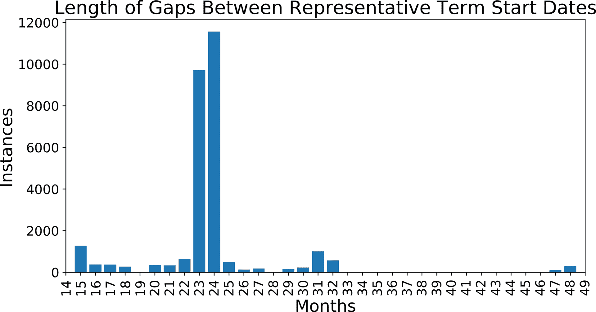

# 第九章：总结

在整本书中，我们看到 SQL 是一个灵活而强大的语言，可用于各种数据分析任务。从数据概要到时间序列、文本分析和异常检测，SQL 可以处理许多常见需求。可以在任何给定的 SQL 语句中组合技巧和函数，以进行实验分析并构建复杂数据集。虽然 SQL 不能实现所有分析目标，但它非常适合分析工具生态系统。

在这个最终章节中，我将讨论一些额外的分析类型，并指出本书涵盖的各种 SQL 技术如何结合起来完成它们。然后我将用一些资源结束，这些资源可以帮助你继续掌握数据分析之旅，或者深入研究特定主题。

# 漏斗分析

漏斗由一系列必须完成的步骤组成，以达到一个明确定义的目标。目标可能是注册服务、完成购买或获得课程完成证书。例如，网站购买漏斗中的步骤可能包括点击“添加到购物车”按钮、填写送货信息、输入信用卡，最后点击“下单”按钮。

漏斗分析结合了时间序列分析（详见第三章）和队列分析（详见第四章）的元素。漏斗分析的数据来自事件的时间序列，尽管在这种情况下，这些事件对应于不同的现实行为，而不是相同事件的重复。从一步到另一步的留存率是漏斗分析的一个关键目标，尽管在这种情况下，我们经常使用术语*转化*。通常，实体在流程的各个步骤中退出，并且每个阶段的实体数量的图表看起来像一个家庭漏斗— 因此得名。

此类型的分析用于识别摩擦、困难或混淆的领域。大量用户退出或许多用户未完成的步骤提供了优化机会。例如，一个在显示包括运费在内的总金额之前要求信用卡信息的结账流程可能会拒绝一些潜在购买者。在此步骤之前显示总金额可能促进更多完整的购买。这些变化通常是实验的主题，详情请参阅第七章。漏斗也可以监测以便检测意外的外部事件。例如，完成率的变化可能对应于良好（或不良）的公关活动，或竞争对手的定价或策略的变化。

漏斗分析的第一步是确定所有有资格进入过程的用户、客户或其他实体的基础人口。接下来，组装每个感兴趣步骤的完成数据集，包括最终目标。通常这包括一个或多个*LEFT JOIN*，以包括所有基础人口，以及完成每个步骤的人。然后，通过总`count`来计算每个步骤中的用户，并将这些步骤计数按总`count`进行分割。有两种设置查询的方法，取决于是否需要所有步骤。

当漏斗中的所有步骤都是必需的，或者如果您只想包括已完成所有步骤的用户时，将每个表*LEFT JOIN*到前一个表格：

```
SELECT count(a.user_id) as all_users
,count(b.user_id) as step_one_users
,count(b.user_id) / count(a.user_id) as pct_step_one
,count(c.user_id) as step_two_users
,count(c.user_id) / count(b.user_id) as pct_one_to_two
FROM users a
LEFT JOIN step_one b on a.user_id = b.user_id
LEFT JOIN step_two c on b.user_id = c.user_id
;
```

当用户可以跳过一步时，或者如果您希望允许这种可能性时，将每个表*LEFT JOIN*到包含完整人群的表格，并计算该起始组的份额：

```
SELECT count(a.user_id) as all_users
,count(b.user_id) as step_one_users
,count(b.user_id) / count(a.user_id) as pct_step_one
,count(c.user_id) as step_two_users
,count(c.user_id) / count(b.user_id) as pct_step_two
FROM users a
LEFT JOIN step_one b on a.user_id = b.user_id
LEFT JOIN step_two c on a.user_id = c.user_id
;
```

这是一个微妙的差别，但值得注意并根据具体情况进行调整。考虑包括时间框，只包括在特定时间范围内完成动作的用户，如果用户在长时间后可以重新进入漏斗。漏斗分析还可以包括其他维度，例如队列或其他实体属性，以促进比较并生成关于为何漏斗表现良好或不佳的额外假设。

# 流失、停滞和其他离开的定义

在第四章中讨论了流失的话题，因为流失本质上是留存的相反。通常组织希望或需要为了直接衡量而制定流失的具体定义。在某些情况下，有合同规定的结束日期，例如 B2B 软件。但通常流失是一个模糊的概念，基于时间的定义更为合适。即使存在合同结束日期，测量客户停止使用产品的时间也可以是即将取消合同的预警信号。流失定义也可以应用于某些产品或功能，即使客户并未完全从组织中流失。

基于时间的流失指标是在客户在一段时间内没有购买或与产品互动时算作流失，通常范围从 30 天到一年不等。确切的时间长度很大程度上取决于业务类型和典型的使用模式。要得出良好的流失定义，您可以使用间隔分析来找到购买或使用之间的典型时间段。要进行间隔分析，您将需要一系列动作或事件的时间序列，`lag`窗口函数以及一些日期数学。

作为示例，我们可以计算代表们任期间的典型间隔，使用第四章中介绍的议员数据集。我们将忽略政客通常被选出而不是选择离开的事实，因为除此之外，该数据集具有进行此类分析的正确结构。首先，我们将找到平均间隔。为此，我们创建一个子查询，计算每位立法者每个任期的`start_date`与上一个`start_date`之间的间隔，然后在外部查询中找到平均值。可以使用`lag`函数找到上一个`start_date`，并使用`age`函数计算间隔作为时间间隔：

```
SELECT avg(gap_interval) as avg_gap
FROM
(
    SELECT id_bioguide, term_start
    ,lag(term_start) over (partition by id_bioguide 
                           order by term_start) 
                           as prev
    ,age(term_start,
         lag(term_start) over (partition by id_bioguide 
                               order by term_start)
         ) as gap_interval
    FROM legislators_terms
    WHERE term_type = 'rep'
) a
WHERE gap_interval is not null
;

avg_gap
-------------------------------------
2 years 2 mons 17 days 15:41:54.83805
```

正如我们所预期的那样，平均值接近两年，这是合理的，因为该职位的任期长度为两年。我们还可以创建间隔的分布以选择一个现实的流失阈值。在这种情况下，我们将间隔转换为月份：

```
SELECT gap_months, count(*) as instances
FROM
(
    SELECT id_bioguide, term_start
    ,lag(term_start) over (partition by id_bioguide 
                           order by term_start) 
                           as prev
    ,age(term_start,
         lag(term_start) over (partition by id_bioguide 
                               order by term_start)
         ) as gap_interval
    ,date_part('year',
               age(term_start,
                   lag(term_start) over (partition by id_bioguide
                                         order by term_start)
                   )
              ) * 12
     + 
     date_part('month',
               age(term_start,
                   lag(term_start) over (partition by id_bioguide 
                                         order by term_start)
                   )
              ) as gap_months
    FROM legislators_terms
    WHERE term_type = 'rep'
) a
GROUP BY 1
;

gap_months  instances
----------  ---------
1.0         25
2.0         4
3.0         2
...         ...
```

如果您的数据库不支持`date_part`，可以使用`extract`作为替代方法（参见第三章中的说明和示例）。输出可以绘制，如图 9-1 所示。由于存在长尾月份，该图被放大以显示大多数间隔的范围。最常见的间隔是 24 个月，但每月也有数百个实例延伸至 32 个月。在 47 和 48 个月处还有另一个小峰。有了平均值和分布，我可能会设定 36 或 48 个月的阈值，并表示在此窗口内未被重新选举的任何代表已经“流失”。



###### 图 9-1\. 代表任期开始日期间隔长度的分布，显示从 10 到 59 个月的范围

一旦确定了客户流失的定义阈值，可以通过“自上次”分析监控客户群体。这可以指上次购买、上次付款、上次打开应用程序的时间，或者对组织相关的任何基于时间的度量。为了进行这种计算，您需要一个包含每位客户最近日期或时间戳的数据集。如果从时间序列开始，首先在子查询中找到每位客户的最近时间戳。然后应用日期数学运算，找到该日期与当前日期之间的经过时间，或者数据集中最新日期，如果数据组装后经过了一段时间。

例如，我们可以从`legislators_terms`表中找到距离上次选举的年份分布。在子查询中，使用`max`函数计算最新的起始日期，然后使用`age`函数找出自那时以来的时间间隔。在本例中，数据集中的最大日期是 2019 年 5 月 5 日。在具有最新数据的数据集中，可以替换为`current_date`或等效表达式。外部查询使用`date_part`找到间隔中的年数，并计算立法者的数量：

```
SELECT date_part('year',interval_since_last) as years_since_last
,count(*) as reps
FROM
(
    SELECT id_bioguide
    ,max(term_start) as max_date
    ,age('2020-05-19',max(term_start)) as interval_since_last
    FROM legislators_terms
    WHERE term_type = 'rep'
    GROUP BY 1
) a
GROUP BY 1
;

years_since_last  reps
----------------  -----
0.0               6
1.0               440
2.0               1
...               ...
```

相关概念是“潜伏”，通常作为完全活跃客户和流失客户之间的中间阶段使用，也可能被称为“休眠”。潜伏客户可能更容易流失，因为我们有一段时间没见到他们，但基于我们的过往经验，他们仍然有相当大的可能性会回归。在消费服务中，我见过“潜伏”覆盖从 7 到 30 天的期间，“流失”被定义为超过 30 天不使用服务的客户。公司经常尝试重新激活潜伏用户，使用的策略从电子邮件到支持团队的接触不等。通过首先找到他们的“上次活跃时间”并使用 CASE 语句根据适当的天数或月数对其进行标记，可以将每个州的客户进行定义。例如，我们可以根据他们当选多久来分组代表：

```
SELECT 
case when months_since_last <= 23 then 'Current'
     when months_since_last <= 48 then 'Lapsed'
     else 'Churned' 
     end as status
,sum(reps) as total_reps     
FROM
(
    SELECT 
    date_part('year',interval_since_last) * 12 
      + date_part('month',interval_since_last)
      as months_since_last
    ,count(*) as reps
    FROM
    (
        SELECT id_bioguide
        ,max(term_start) as max_date
        ,age('2020-05-19',max(term_start)) as interval_since_last
        FROM legislators_terms
        WHERE term_type = 'rep'
        GROUP BY 1
    ) a
    GROUP BY 1
) a
GROUP BY 1
;

status    total_reps
-------   ----------
Churned   10685
Current   446
Lapsed    105
```

这个数据集包含超过两百年的立法者任期，所以当然其中许多人已经去世，有些仍然健在但已经退休。在商业环境中，我们希望我们的流失客户数量没有比我们当前客户多出这么多，我们也想进一步了解潜伏客户的情况。

大多数组织非常关注客户流失问题，因为获取新客户通常比留住现有客户更昂贵。要了解任何状态下的客户或上次活跃时间范围的更多信息，这些分析可以进一步通过数据集中可用的任何客户属性进行切片分析。

# 购物篮分析

我有三个孩子，每次去杂货店时，我的购物篮（或者更常见的购物车）很快就会被各种食品填满，供他们一周食用。牛奶、鸡蛋和面包通常都在其中，但其他物品可能会根据时令水果的变化、孩子们是否在上学或放假以及我们是否计划做特别的餐食而有所改变。购物篮分析的名字来自于分析消费者一起购买的产品，以找出可用于营销、店铺布置或其他战略决策的模式。购物篮分析的目标可能是找到一起购买的物品组合。它也可以围绕特定产品展开：当有人购买冰淇淋时，他们还会购买什么？

虽然篮子分析最初是围绕单个交易中一起购买的物品，但这个概念可以通过几种方式扩展。零售商或电子商务店可能对客户在其生命周期内购买的物品篮感兴趣。还可以分析服务和产品功能的使用情况。常一起购买的服务可能会被捆绑成一个新的优惠，例如旅行网站提供的飞行、酒店和租车一起预订的优惠。经常一起使用的产品功能可能会放在同一个导航窗口中，或者用于建议应用程序中的下一步操作。篮子分析还可用于识别利益相关者人物角色或细分，然后用于其他类型的分析。

要找出最常见的篮子，使用篮子中的所有物品，可以使用`string_agg`函数（或类似的函数，取决于数据库类型——参见第五章）。例如，假设我们有一个`purchases`表，每个`customer_id`购买的每个`product`都有一行记录。首先，在子查询中使用`string_agg`函数找到每个客户购买的产品列表。然后按此列表进行*GROUP BY*并计算客户数量。

```
SELECT products
,count(customer_id) as customers
FROM
(
    SELECT customer_id
    ,string_agg(product,', ') as products
    FROM purchases
    GROUP BY 1
) a
GROUP BY 1
ORDER BY 2 desc
;
```

当有相对较少的可能项时，这种技术效果很好。另一个选择是找到一起购买的产品对。为此，将`purchases`表与自身进行*JOIN*，在`customer_id`上*JOIN*。第二个*JOIN*条件解决了仅在顺序不同的重复条目的问题。例如，想象一个购买了苹果和香蕉的客户——如果没有这个子句，结果集将包括“苹果，香蕉”和“香蕉，苹果”。子句`b.product > a.product`确保只包括这些变体中的一个，并且还过滤掉与自身匹配的产品：

```
SELECT product1, product2
,count(customer_id) as customers
FROM
(
    SELECT a.customer_id
    ,a.product as product1
    ,b.product as product2
    FROM purchases a
    JOIN purchases b on a.customer_id = b.customer_id 
    and b.product > a.product
) a
GROUP BY 1,2
ORDER BY 3 desc
;
```

可以通过添加额外的*JOIN*来扩展到包含三个或更多产品。要包括仅包含一个项目的篮子，将*JOIN*更改为*LEFT JOIN*。

运行购物篮分析时存在一些常见挑战。首先是性能问题，特别是在有大量产品、服务或功能的目录时。结果计算在数据库上可能变得缓慢，尤其是当目标是查找包含三个或更多项的组时，因此 SQL 包含三个或更多个自连接。考虑使用*WHERE*子句过滤表，以移除不经常购买的项目，然后执行*JOIN*。另一个挑战是少数项目非常普遍，以至于淹没所有其他组合。例如，牛奶购买频率如此之高，以至于与任何其他项目一起的组合位于组合列表的顶部。查询结果虽然准确，但在实际意义上可能仍然无意义。在这种情况下，考虑使用*WHERE*子句彻底删除最常见的项目之一，然后执行*JOIN*，这样做还有助于通过使数据集变小来改善查询性能。

购物篮分析的最后一个挑战是自我实现的预言。在购物篮分析中一起出现的物品可能会一起进行营销，增加它们一起购买的频率。这可能加强一起营销的案例，导致更多的共购买，依此类推。甚至更匹配的产品可能永远没有机会，只是因为它们没有出现在原始分析中并成为促销候选。著名的[啤酒和尿布相关性](https://oreil.ly/4d5PF)就是其中的一个例子。各种机器学习技术和大型在线公司已经尝试解决这个问题，这个领域还有许多有趣的分析方向有待开发。

# 资源

作为一种职业（甚至是一种爱好！），数据分析需要技术熟练、领域知识、好奇心和沟通技巧的综合运用。我想分享一些我最喜欢的资源，希望你在继续学习和在真实数据集上练习新技能时能够从中受益。

## 书籍和博客

虽然本书假设您具有 SQL 的工作知识，但对于基础知识或复习的良好资源包括:

+   Forta, Ben. Sams *每天 10 分钟学会 SQL*. 第 5 版. Hoboken, NJ: Sams, 2020.

+   软件公司 Mode 提供一个[SQL 教程](https://mode.com/sql-tutorial)，带有交互式查询界面，非常适合练习你的技能。

没有单一普遍接受的 SQL 风格，但你可能会发现[SQL 风格指南](https://www.sqlstyle.guide)和[现代 SQL 风格指南](https://oreil.ly/rsxBh)有用。请注意，它们的风格与本书使用的风格或彼此并不完全相同。我认为使用既一致又易读的风格是最重要的考虑因素。

你对分析方法和结果传达方式的处理通常和你编写的代码一样重要。两本锤炼这两个方面的好书是：

+   Hubbard, Douglas W. *How to Measure Anything: Finding the Value of “Intangibles” in Business*. 第 2 版。霍博肯，新泽西州：Wiley，2010 年。

+   Kahneman, Daniel. *Thinking, Fast and Slow*. 纽约：Farrar, Straus and Giroux，2011 年。

[Towards Data Science 博客](https://towardsdatascience.com)是关于多种分析主题文章的重要来源。尽管许多帖子侧重于 Python 作为编程语言，但方法和技术通常可以适应 SQL。

有趣地探讨相关性与因果关系，请参阅[Tyler Vigen 的虚假相关性](http://tylervigen.com/spurious-correlations)。

正则表达式可能有些棘手。如果你想增加理解或解决本书未涵盖的复杂情况，一个很好的资源是：

+   Forta, Ben. *Learning Regular Expressions*. 波士顿：Addison-Wesley，2018 年。

随机化测试有着悠久的历史，并涉及自然和社会科学的多个领域。然而，与统计学相比，在线实验分析仍然相对较新。许多经典的统计学文本提供了很好的介绍，但讨论的问题样本量非常小，因此未能解决在线测试的许多独特机会和挑战。几本讨论在线实验的好书包括：

+   Georgiev, Georgi Z. *Statistical Methods in Online A/B Testing*. 索非亚，保加利亚：自行出版，2019 年。

+   Kohavi, Ron, Diane Tang, and Ya Xu. *Trustworthy Online Controlled Experiments: A Practical Guide to A/B Testing*. 剑桥，英国：剑桥大学出版社，2020 年。

[Evan Miller 的 Awesome A/B Tools](https://www.evanmiller.org/ab-testing)提供了用于二元和连续结果实验的计算器，以及几个可能对本书范围之外的实验设计有用的其他测试。

## 数据集

学习和提高 SQL 技能的最佳方法是在真实数据上应用它们。如果你有工作并且可以访问组织内的数据库，那是一个很好的起点，因为你可能已经了解数据生成的背景和含义。然而，有许多有趣的公共数据集可供分析，涵盖各种各样的主题。以下是一些寻找有趣数据集的好去处：

+   [Data Is Plural](https://www.data-is-plural.com)是一份关于新奇数据集的通讯，[Data Is Plural 档案](https://dataset-finder.netlify.app)是一个可搜索的数据集宝库。

+   [FiveThirtyEight](https://fivethirtyeight.com)是一个通过数据视角报道政治、体育和科学的新闻网站。这些报道背后的数据集可以在[FiveThirtyEight GitHub 站点](https://github.com/fivethirtyeight/data)找到。

+   [Gapminder](https://www.gapminder.org/data)是一个瑞典基金会，每年发布许多人类和经济发展指标的数据，包括许多来自世界银行的数据。

+   联合国发布了许多统计数据。联合国经济和社会事务部门以相对易用的格式制作了有关[人口动态](https://population.un.org/wpp/Download/Standard/Population)的数据。

+   Kaggle 主办数据分析竞赛，并有一个可以下载和分析的[数据集库](https://www.kaggle.com/datasets)，即使在正式比赛之外也是如此。

+   许多政府在各级，从国家到地方，都已经采纳了开放数据运动，并发布各种统计数据。[Data.gov](https://www.data.gov/open-gov)维护着一个包括美国和世界各地网站列表，是一个很好的起点。

# 最后思考

我希望您在本书中找到的技术和代码对您有所帮助。我相信，掌握您正在使用的工具的良好基础非常重要，而且有许多有用的 SQL 函数和表达式可以使您的分析更快速、更准确。然而，开发出色的分析技能不仅仅是学习最新的花哨技术或语言。优秀的分析源于提出良好的问题；花时间理解数据和领域；应用适当的分析技术得出高质量、可靠的答案；最后，以对决策支持相关的方式将结果传达给您的受众。即使在与 SQL 工作近 20 年后，我依然对找到新的应用方式、新的数据集以及等待被发现的所有见解感到兴奋。
