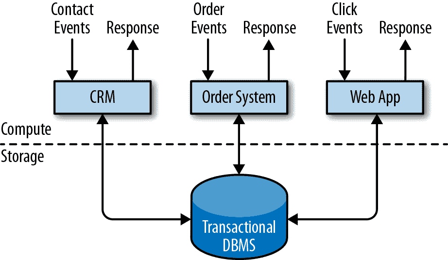
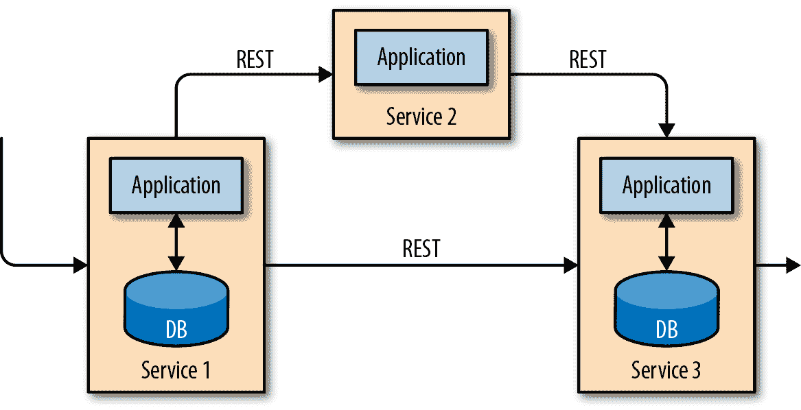
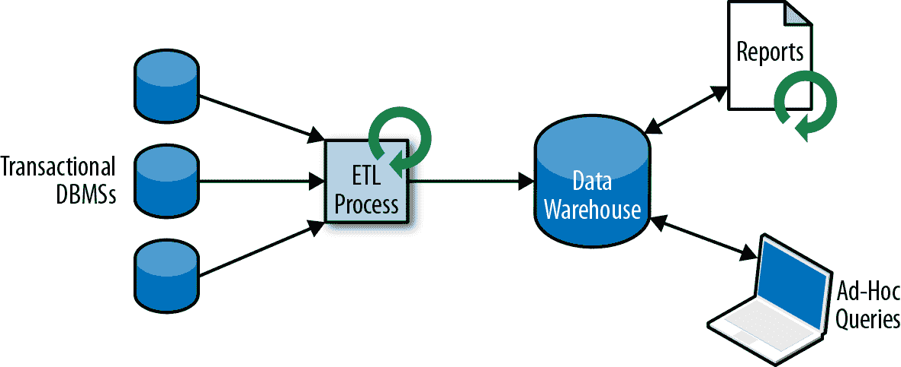
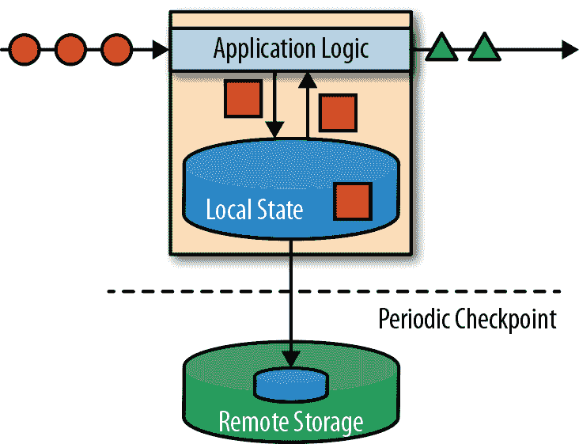
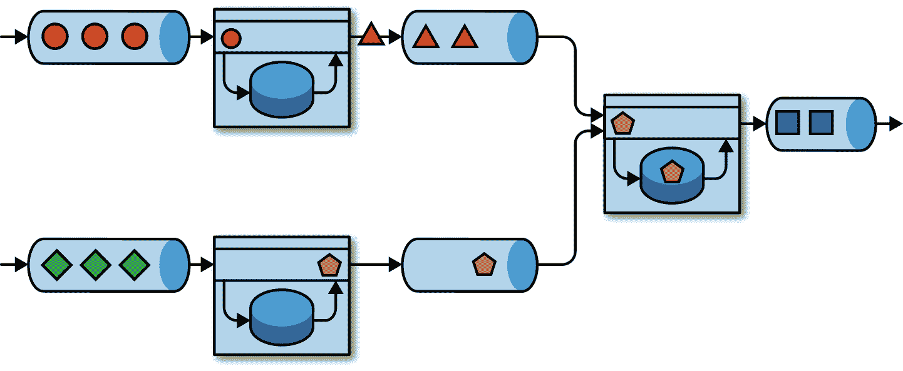
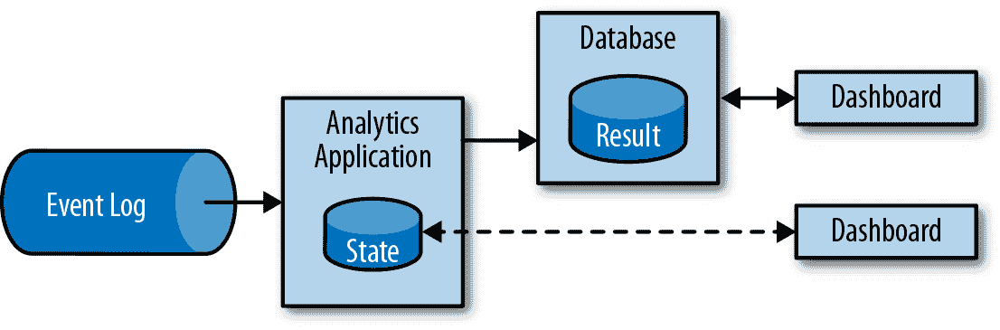
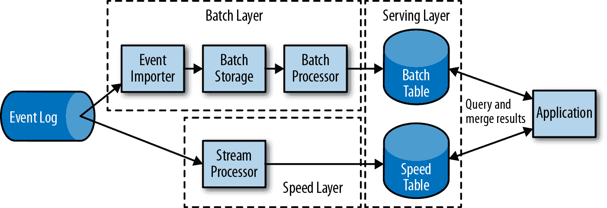
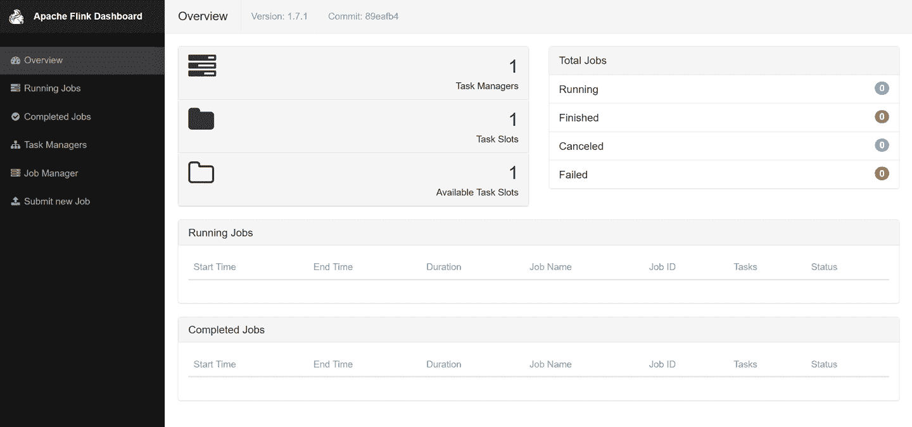
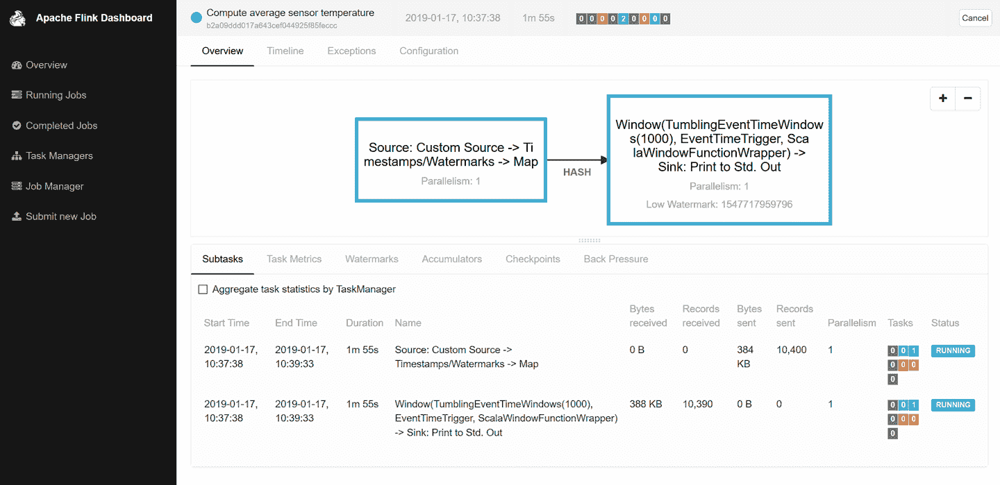

# 第一章：介绍有状态流处理

Apache Flink 是一个分布式流处理器，具有直观和表达力强的 API，可用于实现有状态的流处理应用程序。它以容错的方式高效地在大规模上运行此类应用程序。Flink 于 2014 年 4 月作为孵化项目加入 Apache 软件基金会，并于 2015 年 1 月成为顶级项目。自成立以来，Flink 拥有一个非常活跃且不断增长的用户和贡献者社区。迄今为止，已有超过五百名个人为 Flink 做出了贡献，并且它已经发展成为广泛采用的最复杂的开源流处理引擎之一。Flink 驱动许多公司和企业跨越不同行业和全球范围内的大规模、业务关键应用程序。

流处理技术在大公司和小公司中越来越受欢迎，因为它为许多成熟用例（如数据分析、ETL 和事务应用程序）提供了优越的解决方案，并促进了新的应用程序、软件架构和业务机会。在本章中，我们讨论为什么有状态流处理如此受欢迎，并评估其潜力。我们首先回顾传统数据应用程序架构，并指出它们的局限性。接下来，我们介绍基于有状态流处理的应用程序设计，展示其在传统方法上的许多有趣特性和优势。最后，我们简要讨论开源流处理器的发展，并帮助您在本地 Flink 实例上运行流应用程序。

# 传统数据基础设施

多年来，数据和数据处理在企业中普遍存在。多年来，数据的收集和使用一直在持续增长，公司设计和建立了基础设施来管理这些数据。大多数企业实施的传统架构区分两种数据处理类型：事务处理和分析处理。在本节中，我们讨论了这两种类型以及它们如何管理和处理数据。

## 事务处理

公司在日常业务活动中使用各种应用程序，如企业资源规划（ERP）系统、客户关系管理（CRM）软件和基于 Web 的应用程序。这些系统通常设计有独立的数据处理层（应用程序本身）和数据存储层（事务性数据库系统），如图 1-1 所示。



###### 图 1-1 传统的事务性应用程序设计，将数据存储在远程数据库系统中

应用程序通常连接到外部服务或面向人类用户，并持续处理诸如订单、电子邮件或网站点击等传入事件。当事件被处理时，应用程序读取其状态或通过对远程数据库系统运行事务来更新状态。通常，数据库系统为多个应用程序提供服务，有时这些应用程序可能访问相同的数据库或表。

当应用程序需要发展或扩展时，这种应用程序设计可能引发问题。由于多个应用程序可能在相同的数据表示上工作或共享相同的基础设施，更改表的架构或扩展数据库系统需要谨慎规划和大量努力。克服应用程序紧密捆绑的最新方法是微服务设计模式。微服务被设计为小型、独立和独立的应用程序。它们遵循单一事务并做好的 UNIX 哲学。更复杂的应用程序是通过连接多个只通过标准化接口（例如 RESTful HTTP 连接）进行通信的微服务构建的。因为微服务彼此之间严格解耦并且只通过定义良好的接口进行通信，因此每个微服务都可以使用不同的技术堆栈实现，包括编程语言、库和数据存储。微服务和所有必需的软件和服务通常捆绑并部署在独立的容器中。图 1-2 展示了一个微服务架构。



###### 图 1-2\. 微服务架构

## 分析处理

公司各种事务性数据库系统中存储的数据可以提供有关公司业务运营的宝贵见解。例如，订单处理系统的数据可以分析以获得销售增长趋势，识别延迟发货原因，或者预测未来销售以调整库存。然而，事务性数据通常分布在多个不连通的数据库系统中，只有在可以联合分析时才更具价值。此外，这些数据通常需要转换为通用格式。

不直接在事务性数据库上运行分析查询，而是通常将数据复制到数据仓库，这是专门用于分析查询工作负载的专用数据存储。为了填充数据仓库，事务性数据库系统管理的数据需要复制到其中。将数据复制到数据仓库的过程称为抽取-转换-加载（ETL）。ETL 过程从事务性数据库中提取数据，将其转换为通用表示形式，可能包括验证、值规范化、编码、去重和模式转换，最后将其加载到分析数据库中。ETL 过程可能非常复杂，通常需要技术上复杂的解决方案以满足性能要求。ETL 过程需要定期运行，以保持数据仓库中的数据同步。

一旦数据导入数据仓库，就可以查询和分析它。通常，在数据仓库上执行两类查询。第一类是周期性报告查询，计算业务相关统计数据，如收入、用户增长或生产产出。这些指标被汇总成报告，帮助管理层评估企业的整体健康状况。第二类是即席查询，旨在回答特定问题并支持业务关键决策，例如查询以收集收入数据和用于广播广告的支出，以评估营销活动的效果。这两种类型的查询由数据仓库以批处理方式执行，如图 1-3 所示。



###### 图 1-3\. 传统数据仓库架构用于数据分析

今天，Apache Hadoop 生态系统的组件已成为许多企业 IT 基础设施的重要部分。与将所有数据插入关系数据库系统不同，大量数据（如日志文件、社交媒体或 Web 点击日志）被写入 Hadoop 的分布式文件系统（HDFS）、S3 或其他大容量数据存储，如 Apache HBase，这些系统提供了巨大的存储能力以较低的成本。驻留在这些存储系统中的数据可以通过 SQL-on-Hadoop 引擎查询和处理，例如 Apache Hive、Apache Drill 或 Apache Impala。然而，基础设施基本上仍然与传统的数据仓库架构相同。

# 状态型流处理

几乎所有的数据都是作为连续的事件流创建的。想象一下网站或移动应用中的用户交互、订单的下达、服务器日志或传感器测量；所有这些都是事件流。事实上，很难找到一次性生成的有限完整数据集的例子。有状态的流处理是一种处理无界事件流的应用程序设计模式，适用于公司 IT 基础设施中的许多不同用例。在我们讨论其用例之前，我们简要解释一下有状态的流处理是如何工作的。

任何处理事件流且不仅执行单个记录转换的应用程序都需要是有状态的，具有存储和访问中间数据的能力。当应用程序接收到事件时，它可以执行涉及从状态读取数据或向状态写入数据的任意计算。原则上，状态可以存储和访问在多个不同的地方，包括程序变量、本地文件或嵌入式或外部数据库。

Apache Flink 将应用程序状态存储在内存中或嵌入式数据库中。由于 Flink 是一个分布式系统，本地状态需要受到保护，以避免在应用程序或机器故障时数据丢失。Flink 通过定期将应用程序状态的一致性检查点写入远程和持久存储来保证这一点。关于状态、状态一致性以及 Flink 的检查点机制将在接下来的章节中详细讨论，但是现在，图 1-4 展示了一个有状态的流式 Flink 应用程序。



###### 图 1-4\. 一个有状态的流式应用程序

有状态的流处理应用程序通常从事件日志中接收其传入事件。事件日志存储和分发事件流。事件被写入持久、只追加的日志，这意味着写入事件的顺序不能被更改。写入到事件日志的流可以被同一个或不同的消费者多次读取。由于日志的只追加属性，事件总是以完全相同的顺序发布给所有消费者。有几种事件日志系统作为开源软件提供，Apache Kafka 是最流行的，也可以作为云计算提供商提供的集成服务。

将运行在 Flink 上的有状态流应用与事件日志连接起来是有趣的，原因有多种。在这种架构中，事件日志会持久化输入事件，并能够按确定性顺序重放它们。在发生故障时，Flink 通过从先前检查点恢复其状态并重置事件日志上的读取位置来恢复有状态流应用。应用程序将会从事件日志中回放（和快进）输入事件，直到达到流的末尾。这种技术用于从故障中恢复，但也可以用于更新应用程序、修复错误和修复先前发出的结果、将应用程序迁移到不同的集群，或使用不同的应用程序版本进行 A/B 测试。

如前所述，有状态流处理是一种多用途且灵活的设计架构，可用于许多不同的用例。以下我们介绍了三类常用状态流处理实现的应用程序：（1）事件驱动应用程序，（2）数据管道应用程序和（3）数据分析应用程序。

# 真实世界的流处理用例和部署

如果您有兴趣了解更多关于真实世界用例和部署的信息，请查看 Apache Flink 的[Powered By](http://bit.ly/2FOxayO) 页面以及[Flink Forward](https://flink-forward.org/) 的演讲录音和幻灯片。

我们将应用程序的这些类描述为不同的模式，以强调有状态流处理的多功能性，但大多数真实世界的应用程序共享多个类的属性。

## 事件驱动应用

事件驱动应用是有状态的流应用，它们摄取事件流并使用特定于应用的业务逻辑处理事件。根据业务逻辑，事件驱动应用可以触发诸如发送警报或电子邮件的操作，或者将事件写入出站事件流以供另一个事件驱动应用消费。

事件驱动应用的典型用例包括：

+   实时推荐（例如在客户浏览零售商网站时推荐产品）

+   模式检测或复杂事件处理（例如用于信用卡交易中的欺诈检测）

+   异常检测（例如检测企图入侵计算机网络的尝试）

事件驱动应用是微服务的一种演进形式。它们通过事件日志进行通信，而不是通过 REST 调用，并将应用数据作为本地状态而不是写入和读取外部数据存储，比如关系型数据库或键值存储。图 1-5 展示了由事件驱动流应用组成的服务架构。



###### 图 1-5\. 事件驱动应用架构

图 1-5 中的应用程序通过事件日志连接。一个应用程序将其输出发出到事件日志，另一个应用程序消耗另一个应用程序发出的事件。事件日志解耦了发送方和接收方，并提供了异步、非阻塞的事件传输。每个应用程序可以是有状态的，并且可以在不访问外部数据存储的情况下本地管理其自己的状态。应用程序也可以单独操作和扩展。

事件驱动的应用程序相比事务性应用程序或微服务具有几个优点。与远程数据存储的读写查询相比，本地状态访问提供了非常好的性能。通过流处理器处理扩展性和容错性，通过利用事件日志作为输入源，应用程序的完整输入可靠地存储，并可以确定性地重放。此外，Flink 可以将应用程序的状态重置到先前的保存点，从而可以在不丢失状态的情况下演进或重新调整应用程序。

事件驱动的应用程序对运行它们的流处理器有相当高的要求。并非所有流处理器都同样适合运行事件驱动的应用程序。API 的表达能力以及状态处理和事件时间支持的质量决定了可以实现和执行的业务逻辑。这一方面取决于流处理器的 API、它提供的状态基元以及其对事件时间处理支持的质量。此外，一致的状态一致性和能够扩展应用程序是事件驱动应用程序的基本要求。Apache Flink 符合所有这些要求，是运行这类应用程序的非常好的选择。

## 数据管道

当今的 IT 架构包括许多不同的数据存储，例如关系型数据库系统、专用数据库系统、事件日志、分布式文件系统、内存缓存和搜索索引。所有这些系统都以不同的格式和数据结构存储数据，以便为它们特定的访问模式提供最佳性能。公司通常会将相同的数据存储在多个不同的系统中，以提高数据访问的性能。例如，在网店中提供的产品信息可以存储在事务性数据库、Web 缓存和搜索索引中。由于数据的复制，数据存储必须保持同步。

在不同存储系统中同步数据的传统方法是定期的 ETL 作业。然而，它们无法满足当今许多用例的延迟要求。一个替代方案是使用事件日志来分发更新。更新被写入和分发到事件日志。日志的消费者将更新合并到受影响的数据存储中。根据用例的不同，传输的数据可能需要在被目标数据存储摄取之前进行规范化、丰富化外部数据或聚合。

低延迟摄取、转换和插入数据是有状态流处理应用程序的另一个常见用例。这种应用称为数据管道。数据管道必须能够在短时间内处理大量数据。操作数据管道的流处理器还应具备许多源和汇接器连接器，用于从各种存储系统读取数据和写入数据。同样，Flink 可以做到这一切。

## 流式分析

定期的 ETL 作业将数据导入数据存储，并由即席或定期查询处理。无论架构是基于数据仓库还是 Hadoop 生态系统的组件，这都是批处理。多年来，周期性加载数据到数据分析系统一直是最先进的技术，但会给分析流程增加相当的延迟。

根据调度间隔，一个数据点可能需要几小时或几天才能包含在报告中。在某种程度上，可以通过使用数据管道应用程序将数据导入数据存储来减少延迟。然而，即使进行持续的 ETL，事件被查询处理之前总会有延迟。尽管这种延迟在过去可能是可以接受的，但现今的应用程序必须能够实时收集数据并立即对其进行操作（例如通过调整移动游戏中的变化条件或为在线零售商个性化用户体验）。

流式分析应用程序不等待周期性触发，而是持续摄取事件流，并通过低延迟将最新事件集成到其结果中。这类似于数据库系统用来更新物化视图的维护技术。通常，流式应用程序将其结果存储在支持高效更新的外部数据存储中，例如数据库或键值存储。流式分析应用程序的实时更新结果可用于驱动仪表盘应用程序，如图 1-6 所示。



###### 图 1-6\. 流式分析应用程序

除了事件进入分析结果所需的时间大大缩短外，流分析应用程序还有另一个不太明显的优势。传统的分析流水线由多个单独的组件组成，如 ETL 过程、存储系统，在基于 Hadoop 的环境中还包括数据处理器和调度器以触发作业或查询。相比之下，运行有状态流应用程序的流处理器负责所有这些处理步骤，包括事件摄入、连续计算（包括状态维护）和更新结果。此外，流处理器可以通过确保一次性状态一致性保证从故障中恢复，并且可以调整应用程序的计算资源。像 Flink 这样的流处理器还支持事件时间处理以生成正确和确定性的结果，并能在短时间内处理大量数据。

流分析应用程序通常用于：

+   手机网络质量的监测

+   分析移动应用程序中的用户行为

+   在消费技术中对实时数据进行即席分析

虽然我们在这里没有涉及，但 Flink 还支持对流进行分析 SQL 查询。

# 开源流处理技术的演变

数据流处理并不是一项新技术。一些最早的研究原型和商业产品可以追溯到上世纪 90 年代末。然而，最近过去的流处理技术的广泛采用在很大程度上是由成熟的开源流处理器的可用性推动的。今天，分布式开源流处理器在许多企业的关键业务应用中发挥着作用，涵盖不同行业，如（在线）零售、社交媒体、电信、游戏和银行业。开源软件是这一趋势的主要推动力，主要原因有两点：

1.  开源流处理软件是每个人都可以评估和使用的商品。

1.  由于许多开源社区的努力，可伸缩的流处理技术正在迅速成熟和发展。

仅仅 Apache 软件基金会就拥有超过十几个与流处理相关的项目。新的分布式流处理项目不断进入开源阶段，并通过新的功能和能力挑战现有技术的水平。开源社区不断改进其项目的能力，并推动流处理技术的技术边界。我们将简要回顾一下过去，看看开源流处理技术的起源及其现状。

## 一点历史

第一代分布式开源流处理器（2011）专注于事件处理，具有毫秒级延迟，并在发生故障时保证不丢失事件。这些系统具有相对低级的 API，并且不提供内置支持以获取流应用程序的准确和一致的结果，因为结果取决于事件到达的时间和顺序。此外，即使事件未丢失，它们也可能被处理多次。与批处理处理器相比，首批开源流处理器通过更好的延迟来交换结果的准确性。数据处理系统（在这个时间点上）只能提供快速或准确的结果的观察结果导致了所谓的 Lambda 架构的设计，如图 1-7 所示。



###### 图 1-7\. Lambda 架构

Lambda 架构通过一个低延迟流处理器增加了传统周期批处理架构的速度层。到达 Lambda 架构的数据由流处理器摄取，同时写入批处理存储。流处理器实时计算近似结果并将其写入速度表。批处理器定期处理批处理存储中的数据，将准确结果写入批处理表，并从速度表中删除相应的不准确结果。应用程序通过合并速度表中的近似结果和批处理表中的准确结果来消费这些结果。

Lambda 架构已不再是技术的最前沿，但仍然在许多地方使用。这种架构的最初目标是改善原始批处理分析架构的高结果延迟。然而，它也有一些显著的缺点。首先，它需要两个语义等效的应用逻辑实现，分别针对具有不同 API 的两个独立处理系统。其次，流处理器计算的结果仅是近似的。第三，Lambda 架构难以设置和维护。

在第一代基础上改进，下一代分布式开源流处理器（2013）提供了更好的故障保证，并确保在故障情况下每个输入记录对结果的影响恰好一次。此外，编程 API 从相对低级的运算符界面发展到具有更多内置原语的高级 API。然而，一些改进，如更高的吞吐量和更好的故障保证，以增加处理延迟（从毫秒到秒）为代价。此外，结果仍然依赖于到达事件的时间和顺序。

第三代分布式开源流处理器（2015 年）解决了结果依赖于到达事件的时间和顺序的问题。结合精确一次的失败语义，这一代系统是第一个能够计算一致和准确结果的开源流处理器。通过仅基于实际数据计算结果，这些系统还能以与“实时”数据相同的方式处理历史数据。另一个改进是取消了延迟/吞吐量的折衷。第三代系统能够同时提供高吞吐量和低延迟，使λ架构过时。

除了迄今为止讨论的系统特性（如容错性，性能和结果准确性）之外，流处理器还不断增加新的操作特性，例如高度可用的设置，与资源管理器（如 YARN 或 Kubernetes）的紧密集成，以及动态扩展流处理应用程序的能力。其他特性包括支持升级应用程序代码或将作业迁移到不同的集群或流处理器的新版本，而不会丢失当前状态。

# 快速查看 Flink

Apache Flink 是一个具有竞争力特性集的第三代分布式流处理器。它在大规模情况下提供精确的流处理，具有高吞吐量和低延迟。特别是以下特性使 Flink 脱颖而出：

+   事件时间和处理时间语义。事件时间语义提供了一致和准确的结果，尽管事件顺序可能混乱。处理时间语义可用于具有非常低延迟要求的应用程序。

+   精确一次的状态一致性保证。

+   在处理每秒数百万事件的同时毫秒级延迟。Flink 应用程序可以扩展到数千个核心。

+   分层 API 具有不同的表达能力和易用性折衷。本书涵盖了 DataStream API 和处理函数，提供了常见流处理操作的原语，如窗口操作和异步操作，并提供了精确控制状态和时间的接口。本书不讨论 Flink 的关系型 API，即 SQL 和 LINQ 风格的 Table API。

+   连接器与最常用的存储系统，例如 Apache Kafka，Apache Cassandra，Elasticsearch，JDBC，Kinesis，以及（分布式）文件系统，如 HDFS 和 S3。

+   由于其高度可用的设置（无单点故障），与 Kubernetes、YARN 和 Apache Mesos 的紧密集成，故障恢复快，以及动态扩展作业的能力，能够 24/7 运行流处理应用程序，几乎没有停机时间。

+   能够更新作业的应用程序代码，并将作业迁移到不同的 Flink 集群，而不会丢失应用程序的状态。

+   详细和可定制的系统和应用程序指标收集，以便及时识别和应对问题。

+   最后但同样重要的是，Flink 还是一个全功能的批处理处理器。¹

除了这些特性外，由于其易于使用的 API，Flink 也是一个非常友好的开发框架。嵌入式执行模式在单个 JVM 进程中启动应用程序和整个 Flink 系统，可用于在 IDE 中运行和调试 Flink 作业。在开发和测试 Flink 应用程序时，这一功能非常实用。

## 运行您的第一个 Flink 应用程序

接下来，我们将指导您启动本地集群并执行流应用程序，让您首次了解 Flink。我们将要运行的应用程序会按时间转换和聚合随机生成的温度传感器读数。在这个例子中，您的系统需要安装 Java 8。我们描述了 UNIX 环境的步骤，但如果您使用 Windows，我们建议设置一个带有 Linux、Cygwin（Windows 上的 Linux 环境）或 Windows Subsystem for Linux（Windows 10 引入的 Linux 子系统）的虚拟机。以下步骤展示了如何启动本地 Flink 集群并提交应用程序进行执行。

1.  前往 [Apache Flink 网页](http://flink.apache.org) 并下载适用于 Scala 2.12 的 Apache Flink 1.7.1 的无 Hadoop 二进制发行版。

1.  解压存档文件：

    ```
    $ tar xvfz flink-1.7.1-bin-scala_2.12.tgz

    ```

1.  启动本地 Flink 集群：

    ```
    $ cd flink-1.7.1
    $ ./bin/start-cluster.sh
    Starting cluster.
    Starting standalonesession daemon on host xxx.
    Starting taskexecutor daemon on host xxx.

    ```

1.  在浏览器中输入 **`http://localhost:8081`** 打开 Flink 的 Web UI。如 图 1-8 所示，您将看到有关刚启动的本地 Flink 集群的一些统计信息。它将显示一个单独的 TaskManager（Flink 的工作进程）已连接，一个单独的任务槽（由 TaskManager 提供的资源单元）可用。

    

    ###### 图 1-8\. 显示 Apache Flink web 仪表板概览的屏幕截图

1.  下载包含本书示例的 JAR 文件：

    ```
    $ wget https://streaming-with-flink.github.io/\
    examples/download/examples-scala.jar

    ```

    ###### 注意

    你也可以按照存储库的 README 文件中的步骤自行构建 JAR 文件。

1.  通过指定应用程序的入口类和 JAR 文件在本地集群上运行示例：

    ```
    $ ./bin/flink run \
      -c io.github.streamingwithflink.chapter1.AverageSensorReadings \
      examples-scala.jar
    Starting execution of program
    Job has been submitted with JobID cfde9dbe315ce162444c475a08cf93d9

    ```

1.  检查 web 仪表板。您应该看到“正在运行的作业”下列出的一个作业。如果点击该作业，您将看到与 图 1-9 类似的有关正在运行作业的数据流和实时指标的信息。

    

    ###### 图 1-9\. 显示 Apache Flink web 仪表板上运行作业的屏幕截图

1.  作业的输出被写入 Flink 工作进程的标准输出，通常被重定向到 *./log* 文件夹中的文件。您可以使用 `tail` 命令监控持续产生的输出：

    ```
    $ tail -f ./log/flink-<user>-taskexecutor-<n>-<hostname>.out

    ```

    您应该看到类似这样的行被写入文件：

    ```
    SensorReading(sensor_1,1547718199000,35.80018327300259)
    SensorReading(sensor_6,1547718199000,15.402984393403084)
    SensorReading(sensor_7,1547718199000,6.720945201171228)
    SensorReading(sensor_10,1547718199000,38.101067604893444)

    ```

    `SensorReading` 的第一个字段是 `sensorId`，第二个字段是自 `1970-01-01-00:00:00.000` 以来的毫秒时间戳，第三个字段是计算出的 5 秒内的平均温度。

1.  由于您正在运行流应用程序，该应用程序将继续运行，直到您取消它。您可以通过在 Web 仪表板中选择作业并单击页面顶部的“取消”按钮来执行此操作。

1.  最后，您应该停止本地 Flink 集群的运行：

    ```
    $ ./bin/stop-cluster.sh

    ```

到此为止。您刚刚安装并启动了第一个本地 Flink 集群，并运行了第一个 Flink DataStream API 程序！当然，关于使用 Apache Flink 进行流处理还有更多知识可以学习，这也是本书的主题。

# 总结

在本章中，我们介绍了有状态流处理，讨论了其用例，并初步了解了 Apache Flink。我们从传统数据基础设施的概述开始，讨论了业务应用程序的常见设计方式，以及如何在今天大多数公司中收集和分析数据。然后，我们介绍了有状态流处理的概念，并解释了它如何解决从业务应用程序和微服务到 ETL 和数据分析的广泛用例。我们讨论了自 2010 年代初以来开源流处理系统的发展以及流处理如何成为今天许多业务用例的可行解决方案。最后，我们深入了解了 Apache Flink 及其提供的广泛功能，并展示了如何安装本地 Flink 环境并运行第一个流处理应用程序。

¹ Flink 的批处理 API，即 DataSet API 及其运算符与其相应的流处理 API 是分开的。然而，Flink 社区的愿景是将批处理视为流处理的一种特殊情况——有界流的处理。Flink 社区的持续努力是将 Flink 发展成一个具有真正统一的批处理和流处理 API 及运行时的系统。
