# 第二章：流处理基础

到目前为止，你已经看到流处理如何解决传统批处理的一些局限性，并且它如何支持新的应用和架构。你也了解了开源流处理空间的演进和 Flink 流应用程序的外观。在本章中，你将真正进入流处理的世界。

本章的目标是介绍流处理的基本概念及其框架的需求。我们希望在阅读本章后，您能够评估现代流处理系统的特性。

# 数据流编程介绍

在深入研究流处理基础之前，让我们看一下数据流编程的背景以及本书中将使用的术语。

## 数据流图

如其名称所示，数据流程序描述了数据在操作之间的流动方式。数据流程序通常表示为有向图，其中节点称为运算符，表示计算，边表示数据依赖关系。运算符是数据流应用程序的基本功能单元。它们从输入消耗数据，对其执行计算，并将数据产生到输出以供进一步处理。没有输入端口的运算符称为数据源，没有输出端口的运算符称为数据汇。数据流图必须至少有一个数据源和一个数据汇。图 2-1 显示了一个从推文输入流中提取和计数标签的数据流程序。

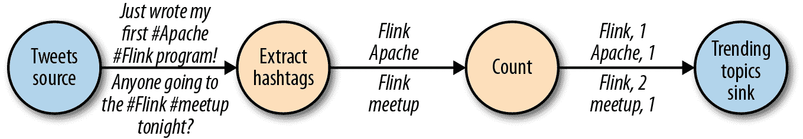

###### 图 2-1 逻辑数据流图，持续计算标签数（节点表示运算符，边表示数据依赖关系）

像图 2-1 中的数据流图被称为逻辑图，因为它们传达了计算逻辑的高层视图。为了执行数据流程序，其逻辑图被转换为物理数据流图，详细指定了程序的执行方式。例如，如果我们使用分布式处理引擎，每个运算符可能在不同的物理机器上运行多个并行任务。图 2-2 展示了图 2-1 的逻辑图的物理数据流图。在逻辑数据流图中，节点表示运算符；而在物理数据流图中，节点是任务。“提取标签”和“计数”运算符各有两个并行运算任务，每个任务在输入数据的子集上执行计算。

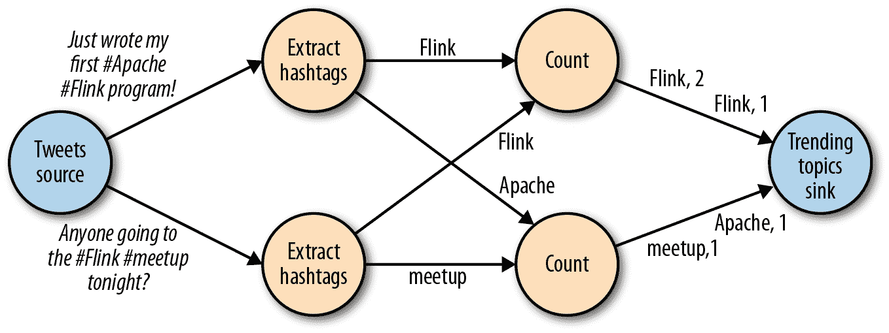

###### 图 2-2 计算标签的物理数据流计划（节点表示任务）

## 数据并行和任务并行

您可以以不同方式利用数据流图中的并行性。首先，您可以对输入数据进行分区，并使同一操作的任务并行执行数据子集。这种并行性称为数据并行性。数据并行性非常有用，因为它允许处理大量数据并将计算负载分布到多个计算节点上。其次，您可以使来自不同运算符的任务并行执行相同或不同的数据。这种并行性称为任务并行性。使用任务并行性，您可以更好地利用集群的计算资源。

## 数据交换策略

数据交换策略定义了如何在物理数据流图中将数据项分配给任务。数据交换策略可以根据运算符的语义由执行引擎自动选择，也可以由数据流程序员明确指定。在这里，我们简要回顾了一些常见的数据交换策略，如图 2-3 所示。

+   *前向*策略将数据从一个任务发送到接收任务。如果这两个任务位于同一物理机器上（这通常由任务调度器保证），这种交换策略可以避免网络通信。

+   *广播*策略将每个数据项发送到运算符的所有并行任务。由于这种策略复制数据并涉及网络通信，因此成本相当高。

+   *基于键值*策略根据键属性对数据进行分区，并保证具有相同键的数据项将由同一个任务处理。在图 2-2 中，“提取标签”运算符的输出按键（标签）进行分区，以便计数运算符任务可以正确计算每个标签的出现次数。

+   *随机*策略将数据项均匀分发到运算符任务中，以便在计算任务中均匀分配负载。

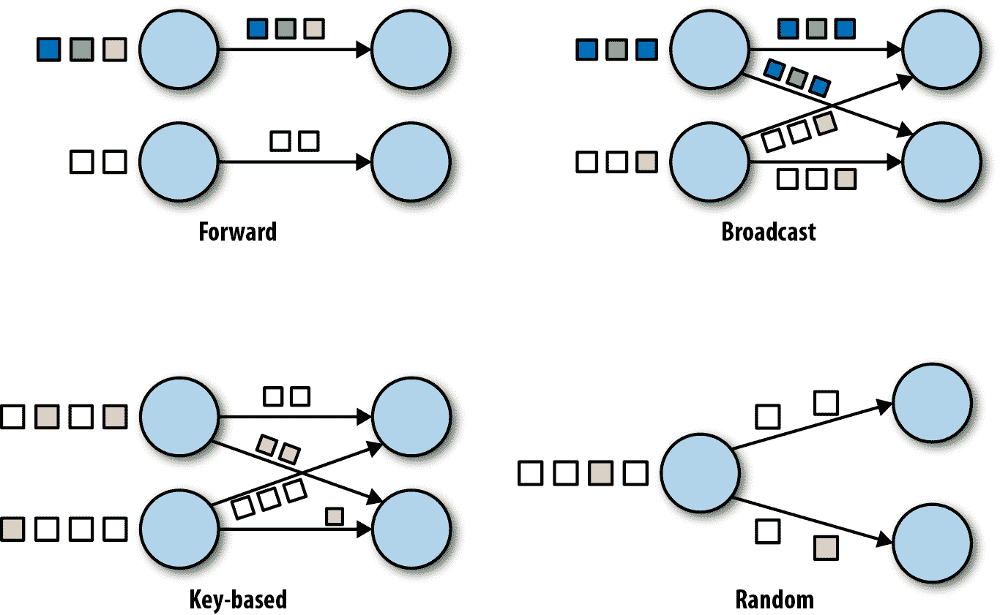

###### 图 2-3\. 数据交换策略

# 并行处理流

现在您已经熟悉了数据流编程的基础知识，是时候看看这些概念如何应用于并行处理数据流了。但首先，让我们定义一下 *数据流* 这个术语：数据流是一个潜在无界的事件序列。

数据流中的事件可以表示监控数据、传感器测量、信用卡交易、气象站观测、在线用户互动、网络搜索等。在本节中，您将学习如何使用数据流编程范式并行处理无限流。

## 延迟和吞吐量

在第一章中，你学习到流式应用程序与传统的批处理程序有不同的运行要求。在评估性能时，要求也不同。对于批处理应用程序，通常关心作业的总执行时间，或者处理引擎读取输入、执行计算并写回结果所需的时间。由于流式应用程序持续运行且输入可能是无界的，因此在数据流处理中没有总执行时间的概念。相反，流式应用程序必须尽可能快地为传入数据提供结果，同时能够处理高吞吐量的事件。我们用*延迟*和*吞吐量*来表达这些性能需求。

### 延迟

延迟指事件被处理所需的时间长度。实质上，它是接收事件并在输出中看到处理效果之间的时间间隔。为了直观理解延迟，考虑你每天去你最喜欢的咖啡店的情景。当你进入咖啡店时，里面可能已经有其他顾客了。因此，你需要排队等候，当轮到你时你就点单。收银员收到你的支付并把订单传给咖啡师，后者准备你的饮料。当你的咖啡准备好时，咖啡师会叫你的名字，然后你可以从柜台取走你的咖啡。服务延迟就是你在咖啡店内的时间，从你进入到你第一口咖啡的时间。

在数据流处理中，延迟以时间单位（例如毫秒）来衡量。根据应用程序的不同，你可能关心*平均*延迟、*最大*延迟或*百分位*延迟。例如，平均延迟值为 10 毫秒意味着事件平均在 10 毫秒内被处理。而 95 分位数的延迟值为 10 毫秒则表示 95%的事件在 10 毫秒内被处理。平均值隐藏了处理延迟的真实分布，可能会使问题难以被察觉。如果咖啡师在准备你的卡布奇诺之前发现牛奶用完了，你就得等到他们从储藏室拿来。虽然这种延迟可能会让你感到恼火，但大多数其他顾客仍然会很满意。

确保低延迟对许多流应用程序至关重要，例如欺诈检测、系统警报、网络监控以及提供严格服务水平协议的服务。低延迟是流处理的关键特性，它使我们能够实现所谓的*实时*应用程序。现代流处理器，如 Apache Flink，可以提供低至几毫秒的延迟。相比之下，传统的批处理处理延迟通常在几分钟到几小时之间。在批处理中，你首先需要批量收集事件，然后才能处理它们。因此，延迟由每批最后一个事件到达时间界定，并且自然取决于批量大小。真正的流处理不引入这种人为延迟，因此可以实现非常低的延迟。在真正的流模型中，事件一到达系统就可以被处理，延迟更接近于每个事件需要执行的实际工作量。

### 吞吐量

Throughput 是系统处理能力的衡量标准—其*处理速率*。也就是说，通过 put 告诉我们系统每个时间单位可以处理多少事件。重新访问咖啡店的例子，如果店铺从早上 7 点到晚上 7 点开放，并且一天服务 600 位顾客，那么它的平均吞吐量将是每小时 50 位顾客。虽然你希望延迟尽可能低，但通常希望吞吐量尽可能高。

吞吐量是每个时间单位内的事件或操作数。重要的是要注意，处理速率取决于到达率；低吞吐量不一定意味着性能不佳。在流处理系统中，通常希望确保系统能够处理预期的最大事件速率。也就是说，你主要关心确定*峰值*吞吐量——系统在最大负载时的性能极限。为了更好地理解峰值吞吐量的概念，让我们考虑一个流处理应用程序，该应用程序没有接收任何传入数据，因此不消耗任何系统资源。当第一个事件进来时，它将立即被处理，延迟最小。例如，如果你是早上咖啡店开门后的第一个顾客，你将立即被服务。理想情况下，你希望这种延迟保持恒定，独立于传入事件的速率。然而，一旦达到传入事件的速率，使系统资源完全被使用，我们将不得不开始缓冲事件。在咖啡店的例子中，你可能会在午餐后看到这种情况发生。很多人同时出现并且不得不排队等候。在这一点上，系统已经达到了峰值吞吐量，进一步增加事件率只会导致更糟糕的延迟。如果系统继续以比其处理能力更高的速率接收数据，缓冲区可能会不可用，并且数据可能会丢失。这种情况通常被称为*反压*，并且有不同的策略来处理它。

### 延迟与吞吐量

在这一点上，应该清楚延迟和吞吐量不是独立的度量标准。如果事件在数据处理管道中传播需要很长时间，我们就不能轻易确保高吞吐量。同样地，如果系统的容量较小，事件将被缓冲并且必须等待被处理。

让我们重新审视咖啡店的例子，以澄清延迟和吞吐量如何相互影响。首先，应该清楚的是在没有负载的情况下存在最佳延迟。也就是说，如果你是咖啡店里唯一的顾客，你会得到最快的服务。然而，在繁忙时段，顾客将不得不排队等候，延迟会增加。影响延迟和因此影响吞吐量的另一个因素是处理事件所需的时间，或者在咖啡店里为每位顾客提供服务所需的时间。想象一下在圣诞节假期期间，咖啡师必须在每杯咖啡上画圣诞老人。这意味着准备一杯饮料所需的时间将增加，导致每个人在咖啡店里花费更多时间，从而降低总体吞吐量。

那么，您是否可以同时获得低延迟和高吞吐量，还是这是一个不切实际的努力？通过雇用一个更熟练的咖啡师——一个能更快地制作咖啡的人，也许您可以在我们咖啡店的例子中降低延迟。在高负载下，这种改变还将增加吞吐量，因为可以在同样的时间内为更多客户提供服务。实现同样结果的另一种方法是雇用第二个咖啡师并利用并行性。这里的主要要点是降低延迟会增加吞吐量。自然地，如果系统可以更快地执行操作，那么它在同样时间内可以执行更多操作。事实上，在流处理管道中利用并行性时，就会发生这种情况。通过并行处理多个流，您可以降低延迟，同时处理更多事件。

## 数据流操作

流处理引擎通常提供一组内置操作来摄入、转换和输出流。这些操作符可以组合成数据流处理图，实现流应用程序的逻辑。在本节中，我们描述最常见的流处理操作。

操作可以是*无状态*或*有状态*的。无状态操作不维护任何内部状态。也就是说，事件的处理不依赖于过去看到的任何事件，也不保留任何历史记录。无状态操作易于并行化，因为可以独立处理事件，而不考虑它们的顺序。此外，在发生故障时，可以简单地重新启动无状态操作符，并从离开的地方继续处理。相比之下，有状态操作符可能会维护有关它们之前接收的事件的信息。此状态可以通过传入事件更新，并可以在未来事件的处理逻辑中使用。有状态流处理应用程序更具挑战性，因为需要有效地分区状态，并在发生故障时可靠地恢复。您将在本章末了解更多关于有状态流处理、故障场景和一致性的内容。

### 数据摄入和数据出口

数据摄入和数据出口操作允许流处理器与外部系统通信。数据*摄入*是从外部源获取原始数据并转换为适合处理的格式的操作。实现数据摄入逻辑的操作符称为*数据源*。数据源可以从 TCP 套接字、文件、Kafka 主题或传感器数据接口摄入数据。数据*出口*是生成适合外部系统消费的输出的操作。执行数据出口的操作符称为*数据接收器*，例如文件、数据库、消息队列和监控接口。

### 转换操作

变换操作是单次遍历操作，它们独立处理每个事件。这些操作逐个事件消耗并应用一些转换到事件数据，产生一个新的输出流。转换逻辑可以集成在操作符中，也可以由用户定义的函数提供，如 图 2-4 所示。函数由应用程序员编写并实现自定义计算逻辑。

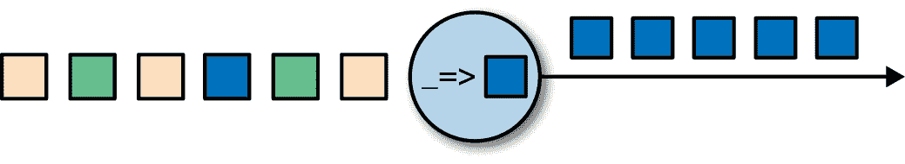

###### 图 2-4\. 带有将每个传入事件转换为更暗事件的函数的流处理操作符

操作符可以接受多个输入并产生多个输出流。它们还可以通过将流分割为多个流或将流合并为单一流来修改数据流图的结构。我们在 第五章 中讨论了 Flink 中所有可用操作符的语义。

### 滚动聚合

滚动聚合是一种不断更新的聚合，如求和、最小值和最大值，它持续更新每个输入事件。聚合操作是有状态的，并结合当前状态与传入事件以产生更新后的聚合值。需要注意的是，为了能够有效地将当前状态与事件结合并产生单个值，聚合函数必须是可结合和可交换的。否则，操作符将不得不存储完整的流历史。图 2-5 展示了一个滚动最小聚合。操作符保持当前的最小值并相应地更新每个传入事件的值。

###### 图 2-5\. 滚动最小聚合操作

### 窗口操作

变换和滚动聚合处理一个事件来产生输出事件，并可能更新状态。然而，有些操作必须收集和缓存记录以计算它们的结果。例如，考虑流连接操作或整体聚合，如中位数函数。为了有效评估这些操作在无界流上的表现，你需要限制这些操作维护的数据量。在本节中，我们讨论提供此服务的窗口操作。

除了具有实际价值之外，窗口还使流上的语义查询变得有趣。您已经看到滚动聚合如何将整个流的历史编码为聚合值，并为每个事件提供低延迟的结果。这对某些应用程序很好，但如果您只对最新数据感兴趣怎么办？考虑一个应用程序，为司机提供实时交通信息，以便他们可以避开拥堵的路线。在这种情况下，您想知道最近几分钟内某个位置是否发生了事故。另一方面，仅知道曾经发生过的所有事故可能对此案例并不那么有趣。此外，通过将流历史减少到单个聚合，您失去了关于数据随时间变化的信息。例如，您可能想知道每 5 分钟有多少车辆通过一个十字路口。

窗口操作不断从无界事件流中创建有限的事件集合，称为桶，并允许我们对这些有限集合进行计算。通常根据数据属性或时间将事件分配到桶中。为了准确定义窗口操作符的语义，我们需要确定事件如何分配到桶中以及窗口多久产生一个结果。窗口的行为由一组策略定义。窗口策略决定了何时创建新的桶，哪些事件分配到哪些桶中，以及何时评估桶的内容。后者的决定基于触发条件。当触发条件满足时，桶的内容被发送到一个评估函数上，该函数对桶元素应用计算逻辑。评估函数可以是诸如求和或最小值的聚合，也可以是应用于收集到的桶元素的自定义操作。策略可以基于时间（例如，最近五秒内接收到的事件）、计数（例如，最近一百个事件）或数据属性。接下来，我们描述常见窗口类型的语义。

+   *滚动* 窗口将事件分配到不重叠的固定大小的桶中。当窗口边界被越过时，所有事件都被发送到评估函数进行处理。基于计数的滚动窗口定义了在触发评估之前收集多少事件。图 2-6 展示了一个将输入流离散化为四个元素桶的基于计数的滚动窗口。基于时间的滚动窗口定义了一个时间间隔，在此期间事件被缓冲到桶中。图 2-7 展示了一个每 10 分钟将事件收集到桶中并触发计算的基于时间的滚动窗口。

    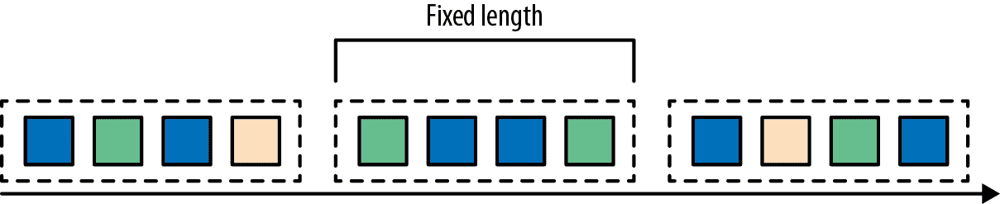

    ###### 图 2-6\. 基于计数的滚动窗口

    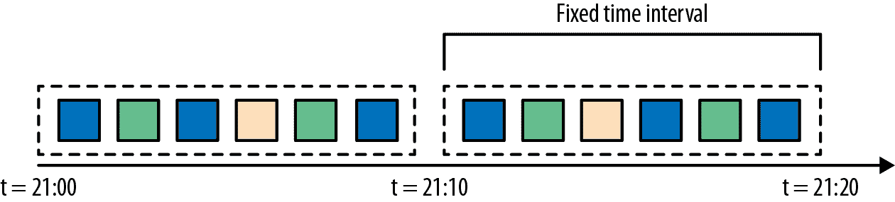

    ###### 图 2-7\. 基于时间的滚动窗口

+   *滑动* 窗口将事件分配到重叠的固定大小的桶中。因此，一个事件可能属于多个桶。我们通过提供它们的长度和*滑动*来定义滑动窗口。滑动值定义了创建新桶的间隔。图 2-8 中的滑动计数窗口具有四个事件的长度和三个事件的滑动。

    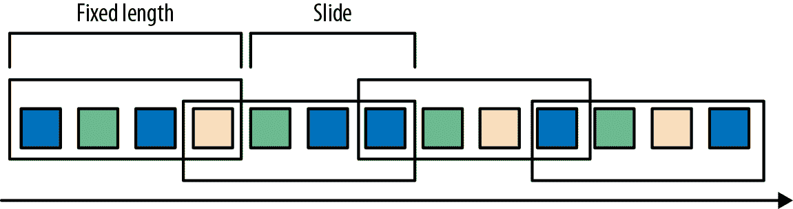

    ###### 图 2-8\. 具有四个事件长度和三个事件滑动的滑动计数窗口

+   *会话* 窗口在常见的实际场景中非常有用，这些场景中既不能应用翻滚窗口也不能应用滑动窗口。考虑一个分析在线用户行为的应用程序。在这类应用中，我们希望将来自同一用户活动期间的事件分组在一起，形成一个*会话*。会话由一系列相邻时间内发生的事件以及随后的非活动期组成。例如，用户连续查看一系列新闻文章可以被视为一个会话。由于会话的长度事先未定义，而是取决于实际数据，因此在这种情况下无法应用翻滚和滑动窗口。相反，我们需要一个窗口操作，将属于同一会话的事件分配到同一个桶中。会话窗口根据*会话间隔*值将事件分组到会话中。图 2-9 显示了一个会话窗口。

    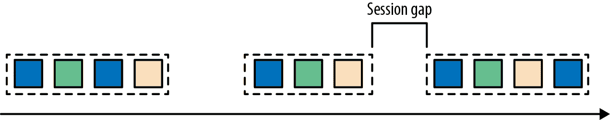

    ###### 图 2-9\. 会话窗口

到目前为止，您所看到的所有窗口类型都是在完整数据流上操作的窗口。但实际中，您可能希望将流分成多个逻辑流，并定义*并行*窗口。例如，如果您从不同传感器接收测量数据，可能希望在应用窗口计算之前按传感器 ID 对流进行分组。在并行窗口中，每个分区都独立地应用窗口策略，而不受其他分区的影响。图 2-10 展示了一个按事件颜色分区的长度为 2 的并行计数翻滚窗口。

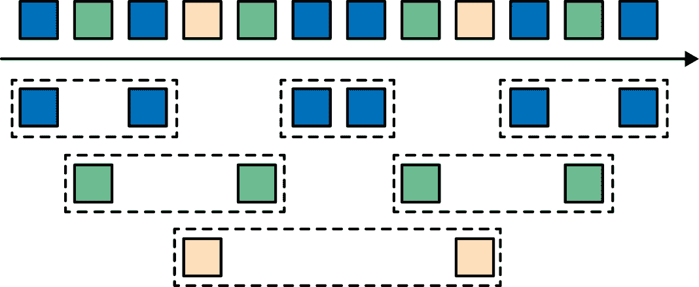

###### 图 2-10\. 长度为 2 的并行计数翻滚窗口

窗口操作与流处理中的两个主要概念密切相关：时间语义和状态管理。时间可能是流处理中最重要的方面。尽管低延迟是流处理的一大吸引特点，其真正的价值远不止于快速分析。现实世界中的系统、网络和通信通道远非完美，流数据通常会延迟或无序到达。在这种情况下，了解如何在准确和确定的条件下提供结果至关重要。更重要的是，能够处理实时产生的事件的流应用程序也应能以相同方式处理历史事件，从而实现离线分析甚至时间旅行分析。当然，如果系统不能在发生故障时保护状态，这一切都毫无意义。到目前为止，您所看到的所有窗口类型在生成结果之前都需要缓冲数据。事实上，即使是在流应用程序中计算任何有趣的事情，如简单的计数，也需要维护状态。考虑到流应用程序可能运行数天、数月甚至数年，您需要确保状态能够在发生故障时可靠地恢复，并且您的系统可以在出现故障时保证准确的结果。在本章的其余部分，我们将更深入地探讨数据流处理中关于时间和状态在故障条件下的保证概念。

# 时间语义

在本节中，我们介绍时间语义，并描述流处理中不同的时间概念。我们讨论了流处理器如何处理无序事件并提供准确的结果，以及如何使用流进行历史事件处理和时间旅行。

## 流处理中的一分钟到底意味着什么？

当处理连续到达的潜在无界事件流时，时间成为应用程序的核心方面。假设您希望连续计算结果，可能是每分钟一次。在我们的流应用程序背景下，“一分钟”到底意味着什么？

考虑一个分析用户玩在线手机游戏生成事件的程序。用户被组织成团队，应用程序收集团队的活动，并根据团队成员完成游戏目标的速度提供奖励，例如额外生命和升级。例如，如果一个团队的所有用户在一分钟内弹出了 500 个气泡，他们就可以升级。艾丽斯是一个热爱游戏的玩家，每天早晨在上班路上都会玩游戏。问题在于，艾丽斯住在柏林，每天上班都乘坐地铁。大家都知道柏林地铁的移动互联网连接非常差。考虑艾丽斯开始在手机连接到网络时弹出气泡并向分析应用程序发送事件的情况。然后突然地铁进入隧道，她的手机断网了。艾丽斯继续玩游戏，并且游戏事件被缓存在她的手机中。当地铁驶出隧道时，她重新联网，待处理的事件被发送到应用程序。应用程序应该怎么做？在这种情况下一分钟的含义是什么？是否包括艾丽斯离线时的时间？ Figure 2-11 描述了这个问题。

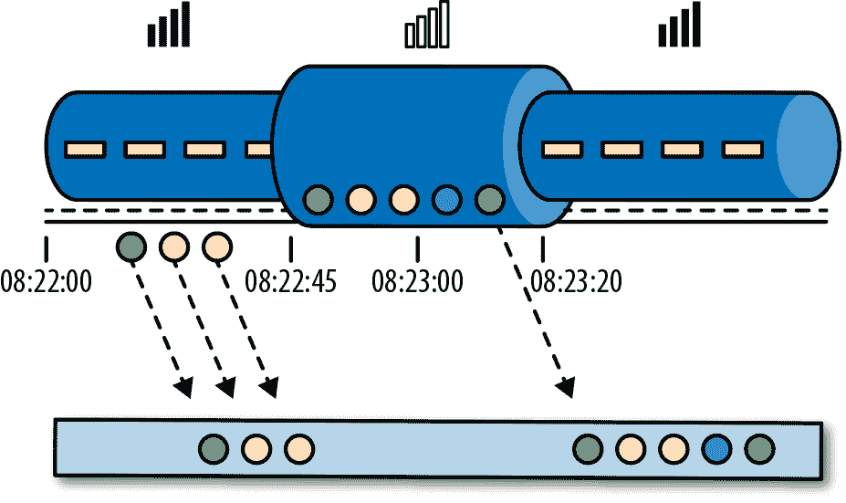

###### 图 2-11\. 接收在线手机游戏事件的应用程序在地铁上玩会遇到网络连接中断的间隙，但事件被缓存在玩家手机上，并在恢复连接时传送。

在线游戏是一个简单的场景，展示了操作语义应该依赖事件实际发生的时间，而不是应用程序接收事件的时间。在移动游戏的情况下，后果可能很严重，例如艾丽斯和她的团队感到失望，从而再也不想玩了。但有更加时间关键的应用程序，我们需要保证其语义。如果我们只考虑在一分钟内接收到多少数据，结果将会因网络连接速度或处理速度的不同而有所不同。而真正定义一分钟内事件数量的是数据本身的时间。

在艾丽斯的游戏示例中，流应用程序可以使用两种不同的时间概念：处理时间或事件时间。我们将在接下来的章节中描述这两种概念。

## 处理时间

处理时间是流处理操作员所在机器的本地时钟时间。处理时间窗口包括在某个时间段内到达窗口操作员的所有事件，这段时间由其机器的墙上时钟测量而得。如图 Figure 2-12 所示，在艾丽斯的情况中，处理时间窗口会继续计算时间，即使她的手机断网了，因此在此期间不会计算她的游戏活动。

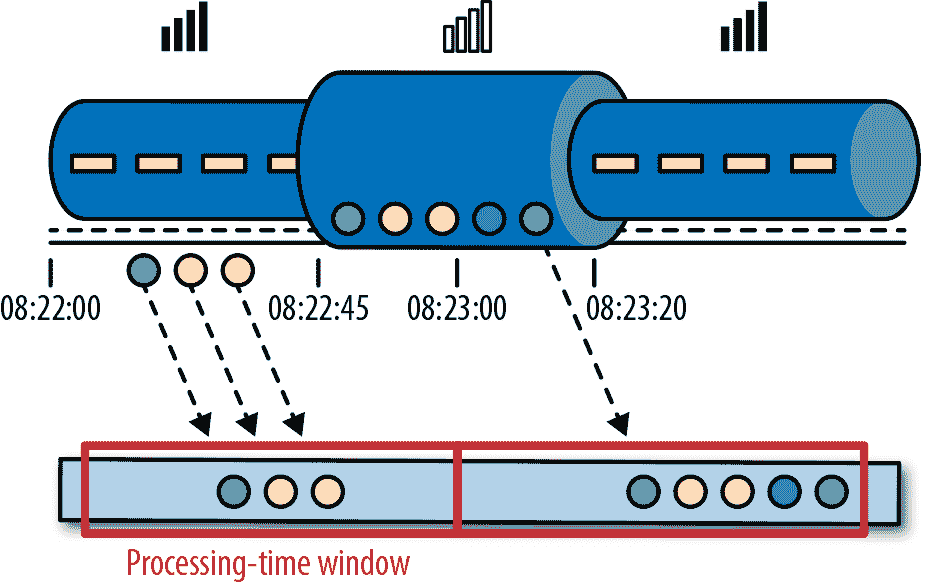

###### 图 2-12\. 在处理时间窗口中，即使爱丽丝的手机断开连接后，时间继续计数。

## 事件时间

事件时间是流中事件实际发生的时间。事件时间基于附加到流事件中的*时间戳*。时间戳通常存在于事件数据进入处理流水线之前（例如，事件创建时间）。图 2-13 显示，事件时间窗口可以正确地将事件放置在窗口中，反映了事情发生的真实情况，尽管一些事件*延迟*。

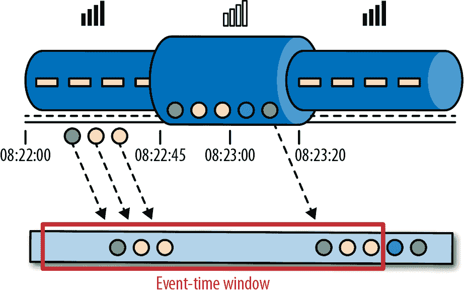

###### 图 2-13\. 事件时间正确地将事件放置在窗口中，反映了事情发生的真实情况。

事件时间完全将处理速度与结果解耦。基于事件时间的操作是可预测的，其结果是确定性的。事件时间窗口计算将产生相同的结果，无论流处理的速度有多快或事件何时到达操作符。

处理延迟事件只是使用事件时间可以克服的挑战之一。普遍存在的乱序数据问题也可以通过它解决。考虑一下鲍勃，是在线移动游戏的另一名玩家，恰好与爱丽丝同在一辆火车上。鲍勃和爱丽丝玩同一个游戏，但使用不同的移动服务提供商。当爱丽丝的手机在隧道内失去连接时，鲍勃的手机仍然保持连接并将事件传递给游戏应用程序。

依靠事件时间，即使数据出现乱序，我们也能保证结果的正确性。更重要的是，当与可重放流相结合时，时间戳的确定性赋予你**快进**过去的能力。也就是说，你可以重放流并分析历史数据，就像事件是实时发生的一样。此外，你还可以将计算快进到当前时刻，使得一旦你的程序赶上当前事件，它就可以继续作为一个实时应用程序，完全使用相同的程序逻辑。

## 水印

到目前为止，我们在讨论事件时间窗口时，忽略了一个非常重要的方面：*我们如何决定何时触发事件时间窗口*？也就是说，在我们可以确定在某个时间点之前收到了所有事件之前，我们需要等待多长时间？我们甚至如何知道数据会延迟？考虑到分布式系统的不可预测性和外部组件可能引起的任意延迟，这些问题没有一种绝对正确的答案。在本节中，我们将看到如何使用*水印*来配置事件时间窗口的行为。

水印是全局进度指标，表示我们确信不会再有延迟事件到达的时间点。实质上，水印提供了一个逻辑时钟，告知系统当前事件时间。当操作器接收到时间为 T 的水印时，可以假设不会再接收到时间戳小于 T 的事件。水印对事件时间窗口和处理乱序事件的操作器至关重要。一旦接收到水印，操作器就会收到信号，表明已观察到某个时间间隔内的所有时间戳，并触发计算或排序接收到的事件。

水印提供了结果可信度和延迟之间的可配置权衡。*渴望的*水印确保低延迟但提供较低的可信度。在这种情况下，延迟事件可能会在水印之后到达，我们应提供一些代码来处理它们。另一方面，如果水印过于宽松，您将获得高可信度，但可能会不必要地增加处理延迟。

在许多实际应用中，系统无法完全确定水印。在移动游戏的例子中，几乎不可能知道用户可能断开连接多长时间；他们可能在隧道中、登机或永远不再玩游戏。无论水印是用户定义还是自动生成的，在存在滞后任务的情况下，在分布式系统中追踪全局进度可能会有问题。因此，仅仅依赖水印可能并不总是一个好主意。相反，流处理系统提供某些机制来处理可能在水印之后到达的事件非常关键。根据应用要求，您可能希望忽略这些事件、记录它们或使用它们来修正之前的结果。

## 处理时间与事件时间

此时，你可能会想知道，如果事件时间能解决所有问题，为什么我们还要费心处理时间呢？事实是，在某些情况下，处理时间确实很有用处。处理时间窗口引入了可能的最低延迟。由于不考虑延迟事件和乱序事件，窗口只需缓冲事件并在达到指定时间长度后立即触发计算。因此，对于速度比准确性更重要的应用，处理时间非常方便。另一个案例是，当你需要定期实时报告结果时，与其准确性无关。一个示例应用是实时监控仪表板，在接收到事件后显示事件聚合数据。最后，处理时间窗口为流本身提供了忠实的表示，这可能对某些用例很重要。例如，你可能有兴趣观察流并计算每秒事件数量以检测故障。总结一下，处理时间提供低延迟，但结果取决于处理速度且不确定。另一方面，事件时间保证确定性结果，并允许处理延迟或乱序事件。

# 状态和一致性模型

现在我们转向流处理的另一个极其重要的方面——状态。状态在数据处理中无处不在，它是任何非平凡计算所必需的。为了产生结果，函数会在一段时间或事件数量内积累状态（例如计算聚合或检测模式）。有状态的操作符使用传入的事件和内部状态来计算它们的输出。例如，考虑一个滚动聚合操作符，它输出到目前为止所有事件的当前总和。该操作符将总和的当前值作为其内部状态，并在接收到新事件时更新它。类似地，考虑一个操作符，在检测到“高温”事件后，如果在 10 分钟内再次检测到“烟雾”事件，则发出警报。该操作符需要将“高温”事件存储在其内部状态中，直到它看到“烟雾”事件或者 10 分钟时间段到期为止。

如果考虑使用批处理系统来分析无界数据集的情况，则状态的重要性变得更加明显。在现代流处理器崛起之前，处理无界数据的常见方法是在批处理系统上重复调度小批量传入事件的作业。作业完成后，结果写入持久存储，并且所有操作符状态都丢失。一旦作业计划在下一批次上执行，它就无法访问前一个作业的状态。通常通过将状态管理委托给外部系统（如数据库）来解决此问题。相比之下，在持续运行的流作业中，状态跨事件是持久的，并且可以在编程模型中将其公开为一流对象。可以说，即使在流状态中使用外部系统管理，这种设计选择可能会引入额外的延迟。

由于流式操作符处理潜在的无界数据，必须小心，以防止内部状态无限增长。为了限制状态大小，操作符通常会维护某种事件概要或*摘要*。这样的摘要可以是计数、求和、迄今为止看到的事件的样本、窗口缓冲区或保留某个应用程序感兴趣属性的自定义数据结构。

正如您可以想象的那样，支持有状态操作符存在一些实现挑战：

状态管理

系统需要高效地管理状态，并确保免受并发更新的影响。

状态分区

并行化变得复杂，因为结果取决于状态和传入事件。幸运的是，在许多情况下，您可以按键对状态进行分区，并独立管理每个分区的状态。例如，如果您正在处理一组传感器的测量流，您可以使用分区操作状态来独立维护每个传感器的状态。

状态恢复

有状态操作符的第三个和最大的挑战是确保状态可以在故障的情况下恢复，并且结果将正确。

在接下来的部分，我们将详细讨论任务失败和结果保证。

## 任务失败

流作业中的操作符状态非常有价值，并且应当受到故障保护。如果在故障期间丢失状态，恢复后的结果将不正确。流作业长时间运行，因此状态可能会在几天甚至几个月内收集。在故障情况下，重新处理所有输入以重现丢失的状态将非常昂贵且耗时。

在本章开头，您看到如何将流处理程序建模为数据流图。在执行之前，这些被转化为由连接的并行任务组成的物理数据流图，每个任务运行某些操作逻辑，消耗输入流并为其他任务生成输出流。典型的实际设置可以在许多物理机器上并行运行数百个这样的任务。在长时间运行的流作业中，每个任务可以随时失败。如何确保这些故障被透明处理，以便您的流作业可以继续运行？事实上，您希望您的流处理器不仅在任务失败的情况下继续处理，而且还提供有关结果和操作状态的正确性保证。我们在本节讨论所有这些问题。

### 什么是任务失败？

对于输入流中的每个事件，任务是执行以下步骤的处理步骤：（1）接收事件，将其存储在本地缓冲区中；（2）可能更新内部状态；和（3）生成一个输出记录。在任何这些步骤中都可能发生故障，系统必须在故障情况下明确定义其行为。如果任务在第一步失败，事件会丢失吗？如果在更新内部状态后失败，系统会在恢复后再次更新它吗？在这些情况下，输出是否是确定性的？

###### 注意

我们假设网络连接是可靠的，并且没有记录会被丢弃或复制，所有事件最终按照 FIFO 顺序传递到其目的地。请注意，Flink 使用 TCP 连接，因此可以保证这些要求。我们还假设存在完美的故障检测器，并且没有任务会故意恶意行事，这意味着所有未失败的任务都遵循上述步骤。

在批处理场景中，所有这些问题都有答案，因为可以简单地从头重新启动批处理作业。因此，不会丢失任何事件，并且状态完全是从头构建起来的。然而，在流处理世界中，处理故障并非一个简单的问题。流处理系统通过提供结果保证来定义其在故障情况下的行为。接下来，我们将审查现代流处理器提供的保证类型以及系统实现这些保证所采用的一些机制。

## 结果保证

在我们描述不同类型的保证之前，我们需要澄清一些经常在讨论流处理器中任务失败时引起混淆的要点。在本章的其余部分中，当我们谈论“结果保证”时，我们指的是流处理器内部状态的一致性。也就是说，我们关心的是应用代码在从故障中恢复后看到的状态值的一致性。请注意，保证应用程序状态的一致性并不等同于保证其输出的一致性。一旦数据已经被发送到接收器，除非接收系统支持事务，否则很难保证结果的正确性。

### **最多一次**

当任务失败时，最简单的做法是不采取任何措施来恢复丢失的状态，并重播丢失的事件。最多一次是保证每个事件最多处理一次的特例。换句话说，事件可以简单地被丢弃，而且没有任何措施来确保结果的正确性。这种保证也被称为“无保证”，因为即使是每个事件都被丢弃的系统也可以提供此保证。完全没有保证听起来像是一个糟糕的主意，但如果您可以接受近似结果，并且您所关心的只是提供尽可能低的延迟，那么这可能是可以接受的。

### **至少一次**

在大多数实际应用程序中，事件不应丢失是期望。这种保证称为至少一次，意味着所有事件都将被处理，并且可能会有一些事件被处理多次。如果应用程序的正确性仅依赖于信息的完整性，则重复处理可能是可以接受的。例如，确定特定事件是否发生在输入流中可以通过至少一次保证正确实现。在最坏的情况下，您可能会定位到多次事件。然而，在至少一次保证下，计算特定事件在输入流中发生的次数可能会返回错误的结果。

为了确保至少一次的结果正确性，您需要一种重播事件的方法——无论是从源头还是从某个缓冲区。持久性事件日志将所有事件写入持久存储，以便在任务失败时可以重播。实现等效功能的另一种方法是使用记录确认。该方法将每个事件存储在缓冲区中，直到所有流水线中的任务都确认了其处理，此时可以丢弃该事件。

### **至少一次**

**精确一次**是最严格的保证，也是难以实现的。精确一次意味着不仅不会丢失事件，而且内部状态的更新将仅应用一次于每个事件。实质上，精确一次保证意味着我们的应用将提供正确的结果，就像从未发生过故障一样。

提供精确一次保证需要至少一次保证，因此再次需要数据重放机制。此外，流处理器需要确保内部状态的一致性。也就是说，在恢复之后，它应该知道事件更新是否已经反映在状态上。事务更新是实现此结果的一种方式，但可能会带来相当大的性能开销。相反，Flink 使用轻量级的快照机制来实现精确一次的结果保证。我们在“检查点、保存点和状态恢复”中讨论了 Flink 的容错算法。

### 端到端精确一次

到目前为止您已经看到的保证类型是指由流处理器管理的应用程序状态。然而，在真实的流处理应用程序中，除了流处理器之外，至少还会有一个源和一个汇。端到端保证指的是整个数据处理流水线的结果正确性。每个组件都提供自己的保证，整个流水线的端到端保证将是每个组件中最弱的保证。重要的是要注意，有时候您可以通过更弱的保证获得更强的语义。一个常见的情况是，当任务执行幂等操作时，比如最大值或最小值。在这种情况下，您可以通过至少一次保证实现精确一次语义。

# 总结

在本章中，您学习了数据流处理的基础知识。我们研究了数据流编程模型，并学习了如何将流处理应用程序表达为分布式数据流图。接下来，您学习了在并行处理无限流时的要求，并了解了流应用程序中延迟和吞吐量的重要性。我们介绍了基本的流操作，以及如何使用窗口在无界输入数据上计算有意义的结果。您学习了流处理中时间的含义，并比较了事件时间和处理时间的概念。最后，我们学习了在流处理应用程序中状态的重要性，以及如何保护它免受故障并保证正确的结果。

到目前为止，我们已经独立于 Apache Flink 考虑了流式概念。在本书的其余部分，我们将看到 Flink 如何实际实现这些概念，以及如何使用其 DataStream API 编写应用程序，以利用我们迄今为止介绍的所有功能。
