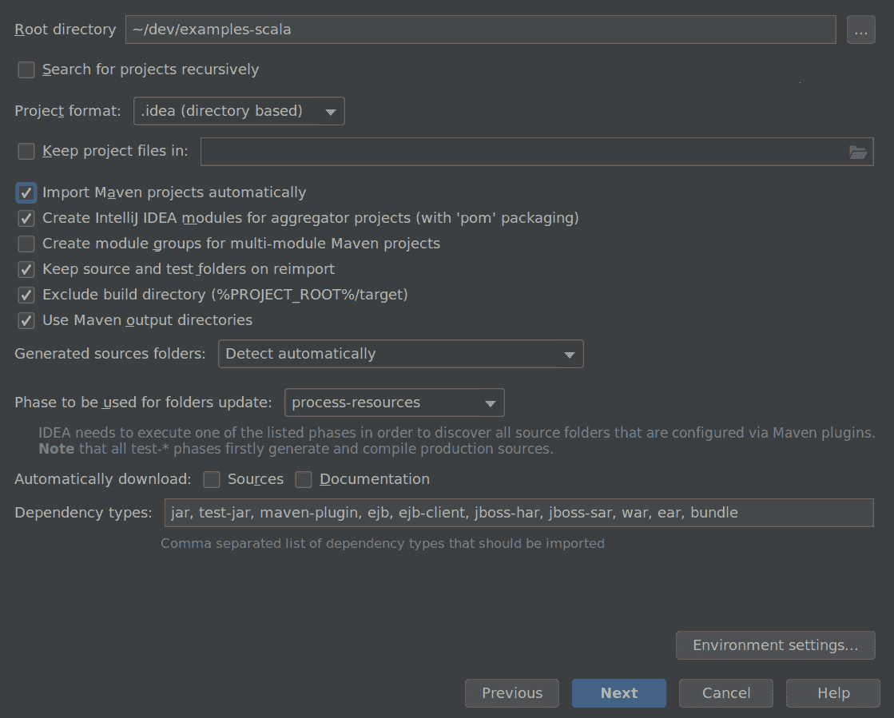
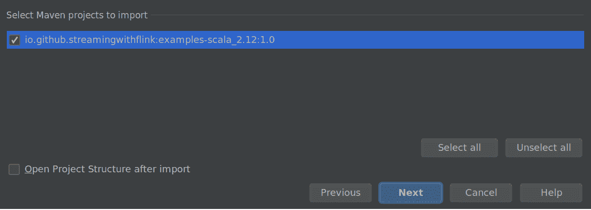
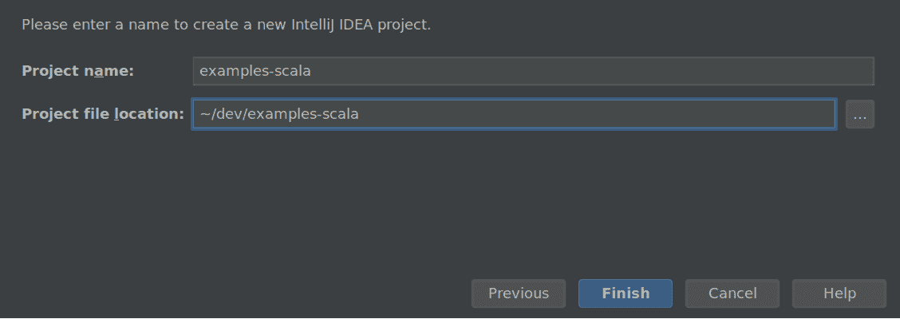

# 第四章：为 Apache Flink 设置开发环境

现在我们已经掌握了所有这些知识，是时候动手开始开发 Flink 应用程序了！在本章中，您将学习如何设置环境来开发、运行和调试 Flink 应用程序。我们将从讨论所需软件和本书代码示例的获取位置开始。利用这些示例，我们将展示如何在 IDE 中执行和调试 Flink 应用程序。最后，我们展示如何启动一个 Flink Maven 项目，这是新应用程序的起点。

# 所需软件

首先，让我们讨论您需要开发 Flink 应用程序的软件。您可以在 Linux、macOS 和 Windows 上开发和执行 Flink 应用程序。但是，UNIX-based 设置因其被大多数 Flink 开发人员偏好的环境而享有最丰富的工具支持。在本章的其余部分，我们将假设 UNIX-based 设置。作为 Windows 用户，您可以使用 Windows 子系统用于 Linux（WSL）、Cygwin 或 Linux 虚拟机来在 UNIX 环境中运行 Flink。

Flink 的 DataStream API 可用于 Java 和 Scala。因此，实现 Flink DataStream 应用程序需要 Java JDK — Java JDK 8（或更高版本）。仅安装 Java JRE 是不够的。

我们还假设以下软件也已安装，尽管这些并不是开发 Flink 应用程序的严格要求：

+   Apache Maven 3.x。本书的代码示例使用 Maven 构建管理。此外，Flink 提供了 Maven 原型来启动新的 Flink Maven 项目。

+   用于 Java 和/或 Scala 开发的 IDE。常见选择包括 IntelliJ IDEA、Eclipse 或带有适当插件（如 Maven、Git 和 Scala 支持）的 Netbeans。我们建议使用 IntelliJ IDEA。您可以按照 [IntelliJ IDEA 网站](http://bit.ly/1yi9UP3) 上的说明下载和安装它。

# 在 IDE 中运行和调试 Flink 应用程序

尽管 Flink 是一个分布式数据处理系统，但您通常会在本地机器上开发和运行初始测试。这样做可以简化开发，并简化集群部署，因为您可以在集群环境中运行完全相同的代码而无需进行任何更改。接下来，我们将描述如何获取我们在此处使用的代码示例，如何将其导入 IntelliJ，如何运行示例应用程序以及如何调试它。

## 在 IDE 中导入本书示例

本书的代码示例托管在 GitHub 上。在书的 [GitHub 页面](http://github.com/streaming-with-flink) 上，您将找到一个包含 Scala 示例和一个包含 Java 示例的存储库。我们将使用 Scala 存储库进行设置，但如果您更喜欢 Java，您应该能够按照相同的说明操作。

打开终端并运行以下 Git 命令，将 `examples-scala` 存储库克隆到您的本地机器上：¹

```
> git clone https://github.com/streaming-with-flink/examples-scala

```

您也可以从 GitHub 下载示例源代码的 zip 存档：

```
> wget https://github.com/streaming-with-flink/examples-scala/archive/master.zip
> unzip master.zip
```

书籍示例以 Maven 项目的形式提供。你会在`src/`目录中找到按章节分组的源代码：

```
.
└── main
    └── scala
        └── io
            └── github
                └── streamingwithflink
                    ├── chapter1
                    │   └── AverageSensorReadings.scala
                    ├── chapter5
                    │   └── ...
                    ├── ...
                    │   └── ...
                    └── util
                        └── ...

```

现在打开你的集成开发环境，并导入 Maven 项目。对大多数集成开发环境来说，导入步骤是相似的。以下我们详细解释 IntelliJ 中的这一步骤。

转到 文件 -> 新建 -> 从现有资源导入项目，选择书籍示例文件夹 *examples-scala*，然后点击确定。确保选择了“从外部模型导入项目”和“Maven”，然后点击下一步。

一个项目导入向导将引导你执行接下来的步骤，例如选择要导入的 Maven 项目（应该只有一个），选择 SDK，并命名项目。图 4-1 到图 4-3 展示了导入过程。



###### 图 4-1\. 将书籍示例存储库导入 IntelliJ



###### 图 4-2\. 选择要导入的 Maven 项目



###### 图 4-3\. 给你的项目命名并点击完成

就这样！现在你应该能够浏览和检查书籍示例代码了。

## 在集成开发环境中运行 Flink 应用程序

接下来，在你的集成开发环境中运行一本书的示例应用程序。搜索`AverageSensorReadings`类并打开它。正如在“快速浏览 Flink”中所讨论的，该程序生成多个热传感器的读取事件，将事件的温度从华氏度转换为摄氏度，并计算每秒钟每个传感器的平均温度。程序的结果将被输出到标准输出。和许多 DataStream 应用程序一样，该程序的源、汇以及操作符被组装在`AverageSensorReadings`类的`main()`方法中。

要启动应用程序，请运行`main()`方法。程序的输出将被写入集成开发环境的标准输出（或控制台）窗口。程序的输出将以几条关于并行操作符任务状态的日志语句开头，如 SCHEDULING、DEPLOYING 和 RUNNING。一旦所有任务都启动并运行，程序开始生成其结果，结果应类似于以下几行：

```
2> SensorReading(sensor_31,1515014051000,23.924656183848732)
4> SensorReading(sensor_32,1515014051000,4.118569049862492)
1> SensorReading(sensor_38,1515014051000,14.781835420242471)
3> SensorReading(sensor_34,1515014051000,23.871433252250583)

```

程序将继续生成新事件，处理它们，并每秒钟发出新结果，直到你终止它。

现在让我们快速讨论一下内部原理。如在“Flink 设置的组件”中所解释的，Flink 应用程序被提交给 JobManager（主节点），后者将执行任务分发给一个或多个 TaskManager（工作节点）。由于 Flink 是一个分布式系统，JobManager 和 TaskManagers 通常在不同的机器上作为单独的 JVM 进程运行。通常情况下，程序的`main()`方法组装数据流，并在调用`StreamExecutionEnvironment.execute()`方法时将其提交给远程 JobManager。

然而，也有一种模式，在这种模式下，调用 `execute()` 方法会启动一个 JobManager 和一个 TaskManager（默认情况下，具有与可用 CPU 线程一样多的插槽作为单独的线程在同一个 JVM 中）。因此，整个 Flink 应用程序是多线程的，并在同一个 JVM 进程中执行。这种模式用于在 IDE 中执行 Flink 程序。

## 在 IDE 中调试 Flink 应用程序

由于单个 JVM 执行模式，几乎可以像在 IDE 中调试任何其他程序一样调试 Flink 应用程序。您可以在代码中定义断点，并像正常调试应用程序一样调试您的应用程序。

然而，在使用 IDE 调试 Flink 应用程序时，有几件事情需要考虑：

+   除非您指定并行性，否则程序将由与开发机器的 CPU 线程数相同的线程执行。因此，您应该意识到您可能在调试一个多线程程序。

+   与将 Flink 程序发送到远程 JobManager 执行不同，该程序在单个 JVM 中执行。因此，某些问题，如类加载问题，无法正确调试。

+   尽管程序在单个 JVM 中执行，但记录被序列化以进行跨线程通信和可能的状态持久化。

# 启动一个 Flink Maven 项目

将 `examples-scala` 仓库导入到您的 IDE 中以试验 Flink 是一个很好的第一步。但是，您还应该知道如何从头开始创建一个新的 Flink 项目。

Flink 提供了用于生成 Java 或 Scala Flink 应用程序的 Maven 原型。打开终端并运行以下命令，创建一个 Flink Maven 快速启动 Scala 项目作为您的 Flink 应用程序的起点：

```
mvn archetype:generate                            \
   -DarchetypeGroupId=org.apache.flink            \
   -DarchetypeArtifactId=flink-quickstart-scala   \
   -DarchetypeVersion=1.7.1                       \
   -DgroupId=org.apache.flink.quickstart          \
   -DartifactId=flink-scala-project               \
   -Dversion=0.1                                  \
   -Dpackage=org.apache.flink.quickstart          \
   -DinteractiveMode=false
```

这将在名为 *flink-scala-project* 的文件夹中生成一个 Flink 1.7.1 的 Maven 项目。您可以通过更改上述 *mvn* 命令的相应参数来更改 Flink 版本、组和构件 ID、版本和生成的包。生成的文件夹包含一个 *src/* 文件夹和一个 *pom.xml* 文件。*src/* 文件夹具有以下结构：

```
src/
└── main
    ├── resources
    │   └── log4j.properties
    └── scala
        └── org
            └── apache
                └── flink
                    └── quickstart
                        ├── BatchJob.scala
                        └── StreamingJob.scala

```

该项目包含两个骨架文件，*BatchJob.scala* 和 *StreamingJob.scala*，作为您自己程序的起点。如果不需要，您也可以删除它们。

您可以按照我们在上一节中描述的步骤将项目导入到您的 IDE 中，或者您可以执行以下命令来构建一个 JAR 文件：

```
mvn clean package -Pbuild-jar

```

如果命令成功完成，您将在项目文件夹中找到一个新的 *target* 文件夹。该文件夹包含一个名为 *flink-scala-project-0.1.jar* 的文件，这是您的 Flink 应用程序的 JAR 文件。生成的 *pom.xml* 文件还包含如何向项目添加新依赖项的说明。

# 摘要

本章介绍了如何设置环境来开发和调试 Flink DataStream 应用程序，并使用 Flink 的 Maven 原型生成了一个 Maven 项目。显然的下一步是学习如何实际实现一个 DataStream 程序。

第五章将介绍 DataStream API 的基础知识，而第六章，第七章，和第八章将介绍与基于时间的操作符、有状态函数以及源和接收器连接器相关的一切。

¹ 我们还提供了一个名为[`examples-Java`的示例库](https://github.com/streaming-with-flink/examples-java)，其中包含所有用 Java 实现的示例。
