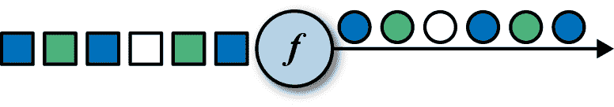
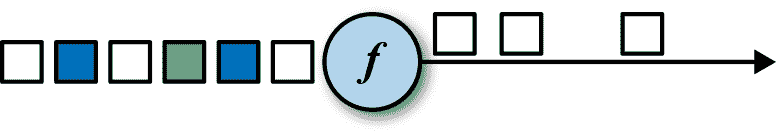
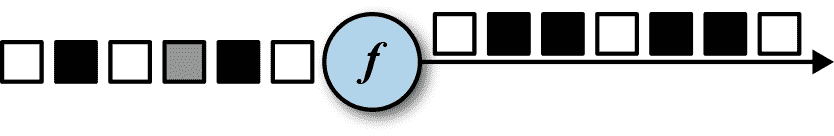
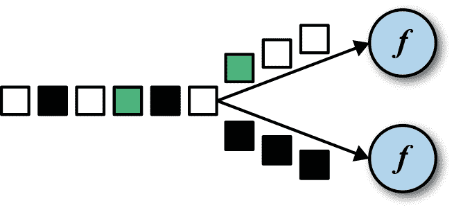
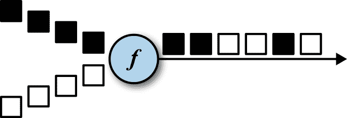
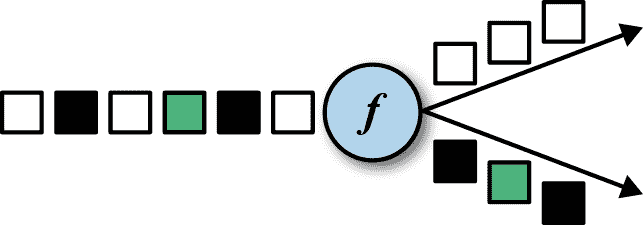
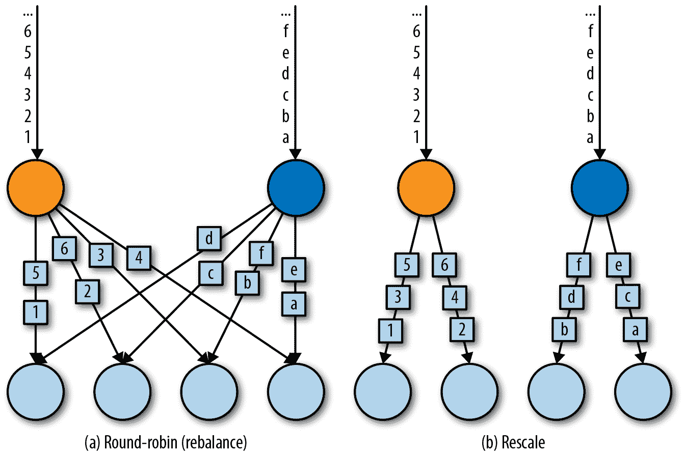

# 第五章：DataStream API（v1.7）

本章介绍了 Flink 的 DataStream API 的基础知识。我们展示了典型 Flink 流应用程序的结构和组件，讨论了 Flink 的类型系统和支持的数据类型，并展示了数据和分区转换。窗口操作符、基于时间的转换、有状态操作符和连接器将在接下来的章节中讨论。阅读完本章后，您将了解如何实现具有基本功能的流处理应用程序。我们的代码示例使用 Scala 以确保简洁性，但 Java API 在大多数情况下是类似的（会指出例外或特殊情况）。我们还在我们的[GitHub 存储库](https://github.com/streaming-with-flink/)中提供了用 Java 和 Scala 实现的完整示例应用程序。

# Hello, Flink!

让我们从一个简单的示例开始，以了解使用 DataStream API 编写流应用程序的基本结构和一些重要特性。我们将使用此示例展示 Flink 程序的基本结构，并介绍 DataStream API 的一些重要功能。我们的示例应用程序从多个传感器中摄取温度测量流。

首先，让我们看一下我们将用于表示传感器读数的数据类型：

```
case class SensorReading(
  id: String,
  timestamp: Long,
  temperature: Double)

```

示例中的程序（示例 5-1）将温度从华氏度转换为摄氏度，并每 5 秒计算一次每个传感器的平均温度。

##### 示例 5-1。每 5 秒计算一次传感器流的平均温度

```
// Scala object that defines the DataStream program in the main() method.
object AverageSensorReadings {

 // main() defines and executes the DataStream program
 def main(args: Array[String]) {

   // set up the streaming execution environment
   val env = StreamExecutionEnvironment.getExecutionEnvironment

   // use event time for the application
   env.setStreamTimeCharacteristic(TimeCharacteristic.EventTime)

   // create a DataStream[SensorReading] from a stream source
   val sensorData: DataStream[SensorReading] = env
     // ingest sensor readings with a SensorSource SourceFunction
     .addSource(new SensorSource)
     // assign timestamps and watermarks (required for event time)
     .assignTimestampsAndWatermarks(new SensorTimeAssigner)

   val avgTemp: DataStream[SensorReading] = sensorData
     // convert Fahrenheit to Celsius with an inline lambda function
     .map( r => {
         val celsius = (r.temperature - 32) * (5.0 / 9.0)
         SensorReading(r.id, r.timestamp, celsius)
       } )
     // organize readings by sensor id
     .keyBy(_.id)
     // group readings in 5 second tumbling windows
     .timeWindow(Time.seconds(5))
     // compute average temperature using a user-defined function
     .apply(new TemperatureAverager)

   // print result stream to standard out
   avgTemp.print()

   // execute application
   env.execute("Compute average sensor temperature")
 }
}

```

您可能已经注意到，Flink 程序是在常规 Scala 或 Java 方法中定义并提交执行的。通常情况下，这是在一个静态的 main 方法中完成的。在我们的示例中，我们定义了`AverageSensorReadings`对象，并在`main()`内包含大部分应用逻辑。

为了构建典型的 Flink 流应用程序：

1.  设置执行环境。

1.  从数据源中读取一个或多个流。

1.  应用流处理转换以实现应用逻辑。

1.  可选地将结果输出到一个或多个数据汇。

1.  执行程序。

现在我们详细看看这些部分。

## 设置执行环境

一个 Flink 应用程序首先需要做的是设置它的*执行环境*。执行环境决定程序是在本地机器上运行还是在集群上运行。在 DataStream API 中，应用程序的执行环境由`StreamExecutionEnvironment`表示。在我们的示例中，我们通过调用静态的`getExecutionEnvironment()`方法来获取执行环境。此方法根据调用方法时的上下文返回本地或远程环境。如果该方法从具有到远程集群的连接的提交客户端调用，则返回远程执行环境。否则，返回本地环境。

也可以按如下方式显式创建本地或远程执行环境：

```
// create a local stream execution environment
val localEnv: StreamExecutionEnvironment.createLocalEnvironment()

// create a remote stream execution environment
val remoteEnv = StreamExecutionEnvironment.createRemoteEnvironment(
  "host",                // hostname of JobManager
  1234,                  // port of JobManager process
  "path/to/jarFile.jar")  // JAR file to ship to the JobManager
```

接下来，我们使用`env.setStreamTimeCharacteristic(TimeCharacteristic.EventTime)`指示程序使用事件时间语义解释时间。执行环境提供了更多的配置选项，例如设置程序并行度和启用容错性。

## 读取输入流

一旦执行环境配置完成，就可以开始处理流并进行一些实际工作。`StreamExecutionEnvironment`提供了方法来创建流源，将数据流导入应用程序。数据流可以从消息队列或文件等源摄取，也可以动态生成。

在我们的示例中，我们使用：

```
val sensorData: DataStream[SensorReading] = 
  env.addSource(new SensorSource)

```

连接到传感器测量源并创建初始类型为`SensorReading`的`DataStream`。Flink 支持许多数据类型，我们将在下一节中描述。这里，我们使用 Scala case class 作为我们之前定义的数据类型。`SensorReading`包含传感器 ID、表示测量时间的时间戳以及测量的温度。`assignTimestampsAndWatermarks(new SensorTimeAssigner)`方法分配事件时间所需的时间戳和水印。现在我们不需要关心`SensorTimeAssigner`的实现细节。

## 应用转换

一旦我们有了`DataStream`，我们可以对其进行转换。有不同类型的转换。一些转换可以产生新的`DataStream`，可能是不同类型的，而其他转换则不修改`DataStream`的记录，但重新组织它通过分区或分组。应用程序的逻辑通过链式转换来定义。

在我们的示例中，我们首先应用了一个`map()`转换，将每个传感器读数的温度转换为摄氏度。然后，我们使用`keyBy()`转换来根据传感器 ID 对传感器读数进行分区。接下来，我们定义了一个`timeWindow()`转换，将每个传感器 ID 分区的传感器读数分组为 5 秒的滚动窗口：

```
val avgTemp: DataStream[SensorReading] = sensorData
     .map( r => {
           val celsius = (r.temperature - 32) * (5.0 / 9.0)
           SensorReading(r.id, r.timestamp, celsius)
       } )
     .keyBy(_.id)
     .timeWindow(Time.seconds(5))
     .apply(new TemperatureAverager)

```

窗口转换在“窗口操作符”中有详细描述。最后，我们应用一个用户定义的函数，在每个窗口上计算平均温度。我们将在本章后面的部分讨论用户定义函数的实现。

## 输出结果

流应用通常将其结果发射到某个外部系统，例如 Apache Kafka、文件系统或数据库。Flink 提供了一组良好维护的流接收器集合，可以用于将数据写入不同的系统。还可以实现自己的流接收器。还有一些应用程序不会发射结果，而是保留在内部以通过 Flink 的可查询状态功能提供服务。

在我们的示例中，结果是一个`DataStream[SensorReading]`记录。每个记录包含传感器在 5 秒内的平均温度。调用`print()`方法将结果流写入标准输出：

```
avgTemp.print()

```

###### 注意

注意，流式汇聚器的选择会影响应用程序的端到端一致性，无论应用程序的结果是以至少一次还是精确一次语义提供的。应用程序的端到端一致性取决于所选流汇聚器与 Flink 的检查点算法的集成。我们将在“应用程序一致性保证”中更详细地讨论此主题。

## 执行

当应用程序完全定义后，可以通过调用`StreamExecutionEnvironment.execute()`来执行。这是我们示例中的最后一次调用：

```
env.execute("Compute average sensor temperature")

```

Flink 程序是惰性执行的。也就是说，创建流源和转换的 API 调用不会立即触发任何数据处理。相反，API 调用在执行环境中构建执行计划，该计划由从环境创建的流源和所有应用于这些源的传递转换组成。只有在调用`execute()`时，系统才会触发程序的执行。

构建的计划被翻译成一个 JobGraph，并提交给 JobManager 进行执行。根据执行环境的类型，JobManager 可以作为本地线程（本地执行环境）启动，或者 JobGraph 被发送到远程 JobManager。如果 JobManager 远程运行，则必须将 JobGraph 与包含应用程序所有类和所需依赖项的 JAR 文件一起发送。

# 转换

在本节中，我们概述了 DataStream API 的基本转换。像窗口操作符和其他专业转换这样的与时间相关的操作符在后续章节中描述。流转换应用于一个或多个流，并将它们转换为一个或多个输出流。编写 DataStream API 程序主要是将这些转换组合起来，以创建实现应用程序逻辑的数据流图。

大多数流转换都基于用户定义的函数。这些函数封装了用户应用逻辑，并定义了如何将输入流的元素转换为输出流的元素。例如，`MapFunction`等函数被定义为实现特定转换函数接口的类：

```
class MyMapFunction extends MapFunction[Int, Int] {
  override def map(value: Int): Int =  value + 1
}

```

函数接口定义了需要用户实现的转换方法，例如上面示例中的`map()`方法。

大多数函数接口都设计为 SAM（单一抽象方法）接口，可以作为 Java 8 lambda 函数实现。Scala DataStream API 也内置了对 lambda 函数的支持。在展示 DataStream API 的转换时，我们展示了所有函数类的接口，但在代码示例中为简洁起见，大多数情况下使用 lambda 函数而不是函数类。

DataStream API 提供了最常见数据转换操作的转换方法。如果您熟悉批处理数据处理 API、函数式编程语言或 SQL，您会发现 API 的概念非常容易理解。我们将 DataStream API 的转换分为四类：

1.  基本转换是对单个事件的转换。

1.  `KeyedStream` 转换是在键的上下文中应用于事件的转换。

1.  多流转换将多个流合并为一个流，或将一个流拆分为多个流。

1.  分布转换重新组织流事件。

## 基本转换

基本转换处理单个事件，这意味着每个输出记录都是从单个输入记录生成的。简单值转换、记录分割或记录过滤是常见的基本函数示例。我们解释它们的语义并展示代码示例。

### Map

调用 `DataStream.map()` 方法指定映射转换，并生成新的 `DataStream`。它将每个传入的事件传递给用户定义的映射器，后者返回一个完全相同类型的输出事件。图 5-1 显示了将每个方块转换为圆形的映射转换。



###### 图 5-1\. 将每个方块转换为相同颜色圆形的映射操作

`MapFunction` 的类型与输入和输出事件的类型相匹配，并可以使用 `MapFunction` 接口指定。它定义了 `map()` 方法，将输入事件转换为一个输出事件：

```
// T: the type of input elements
// O: the type of output elements
MapFunction[T, O]
    > map(T): O

```

以下是一个简单的映射器，从输入流中提取每个 `SensorReading` 的第一个字段（`id`）：

```
val readings: DataStream[SensorReading] = ...
val sensorIds: DataStream[String] = readings.map(new MyMapFunction)

class MyMapFunction extends MapFunction[SensorReading, String] {
  override def map(r: SensorReading): String = r.id
}

```

在使用 Scala API 或 Java 8 时，映射器也可以表示为 Lambda 函数：

```
val readings: DataStream[SensorReading] = ...
val sensorIds: DataStream[String] = readings.map(r => r.id)

```

### 过滤

过滤转换通过对每个输入事件上的布尔条件进行评估来丢弃或转发流的事件。返回值为 `true` 保留输入事件并将其转发到输出，而 `false` 则会丢弃事件。调用 `DataStream.filter()` 方法指定过滤转换，并生成与输入 `DataStream` 类型相同的新 `DataStream`。图 5-2 显示了仅保留白色方块的过滤操作。



###### 图 5-2\. 仅保留白色值的过滤操作

布尔条件实现为一个函数，可以使用 `FilterFunction` 接口或 Lambda 函数。`FilterFunction` 接口与输入流的类型匹配，并定义了调用输入事件并返回布尔值的 `filter()` 方法：

```
// T: the type of elements
FilterFunction[T]
    > filter(T): Boolean

```

以下示例显示了一个过滤器，该过滤器丢弃所有温度低于 25°F 的传感器测量值：

```
val readings: DataStream[SensorReadings] = ...
val filteredSensors = readings
    .filter( r =>  r.temperature >= 25 )

```

### FlatMap

flatMap 转换类似于 map，但它可以为每个传入事件生成零个、一个或多个输出事件。事实上，flatMap 转换是 filter 和 map 的泛化，可以用来实现这两个操作。图 5-3 展示了一个 flatMap 操作，根据传入事件的颜色区分其输出。如果输入是白色方块，则输出未修改的事件。黑色方块被复制，灰色方块被过滤掉。



###### 图 5-3\. 执行 flatMap 操作，输出白色方块、复制黑色方块和丢弃灰色方块

flatMap 转换在每个传入事件上应用一个函数。相应的 `FlatMapFunction` 定义了 `flatMap()` 方法，通过将结果传递给 `Collector` 对象，可以返回零个、一个或多个事件：

```
// T: the type of input elements
// O: the type of output elements
FlatMapFunction[T, O]
    > flatMap(T, Collector[O]): Unit

```

此示例展示了在数据处理教程中常见的 flatMap 转换。该函数应用于一系列句子的流，将每个句子按空格字符拆分，并将每个结果单词作为单独的记录发出。

```
val sentences: DataStream[String] = ...
val words: DataStream[String] = sentences
  .flatMap(id => id.split(" "))

```

## 键控流转换

许多应用程序的常见需求是一起处理具有某种属性的事件组。DataStream API 提供了 `KeyedStream` 的抽象，它是一个被逻辑分成不相交子流的 `DataStream`，这些子流共享相同的键。

应用于 `KeyedStream` 上的有状态转换在当前处理事件的键的上下文中读取和写入状态。这意味着具有相同键的所有事件访问相同的状态，因此可以一起处理。

###### 注意

注意，有状态的转换和键控聚合必须小心使用。如果键域不断增长，例如因为键是唯一的事务 ID，您必须清理不再活动的键的状态，以避免内存问题。详见 “实现有状态函数”，该部分详细讨论了有状态函数。

`KeyedStream` 可以使用您之前看到的 map、flatMap 和 filter 转换进行处理。接下来，我们将使用 keyBy 转换将 `DataStream` 转换为 `KeyedStream`，并使用键控转换，如滚动聚合和 reduce。

### keyBy

keyBy 转换通过指定键将 `DataStream` 转换为 `KeyedStream`。根据键，流的事件被分配到分区中，以便由后续操作符的同一任务处理具有相同键的所有事件。具有不同键的事件可以由同一任务处理，但任务函数的键控状态始终在当前事件键的范围内访问。

考虑输入事件的颜色作为键，图 5-4 将黑色事件分配给一个分区，将所有其他事件分配给另一个分区。



###### 图 5-4\. 基于颜色对事件进行分区的 keyBy 操作

`keyBy()` 方法接收一个指定要按其分组的键（或键）的参数，并返回一个 `KeyedStream`。有不同的方法指定键。我们在 “定义键和引用字段” 中进行了介绍。以下代码将 `id` 字段声明为 `SensorReading` 记录流的键：

```
val readings: DataStream[SensorReading] = ...
val keyed: KeyedStream[SensorReading, String] = readings
  .keyBy(r => r.id)

```

Lambda 函数 `r => r.id` 从传感器读数 `r` 中提取 `id` 字段。

### 滚动聚合

滚动聚合转换应用于 `KeyedStream`，生成包括求和、最小值和最大值在内的 `DataStream` 聚合。滚动聚合运算符为每个观察到的键保留一个聚合值。对于每个传入的事件，运算符更新相应的聚合值并发出带有更新值的事件。滚动聚合不需要用户定义的函数，但接收一个指定计算聚合的字段的参数。DataStream API 提供以下滚动聚合方法：

`sum()`

输入流的指定字段的滚动求和。

`min()`

输入流的指定字段的滚动最小值。

`max()`

输入流的指定字段的滚动最大值。

`minBy()`

输入流的滚动最小值返回迄今为止观察到的最低值的事件。

`maxBy()`

输入流的指定字段的滚动最大值。

无法组合多个滚动聚合方法，一次只能计算单个滚动聚合。

考虑下面的示例，对 `Tuple3[Int, Int, Int]` 流的第一个字段进行键控，并在第二个字段上计算滚动求和：

```
val inputStream: DataStream[(Int, Int, Int)] = env.fromElements(
  (1, 2, 2), (2, 3, 1), (2, 2, 4), (1, 5, 3))

val resultStream: DataStream[(Int, Int, Int)] = inputStream
  .keyBy(0) // key on first field of the tuple
  .sum(1)   // sum the second field of the tuple in place

```

在本例中，元组输入流按第一个字段键控，并在第二个字段上计算滚动求和。示例的输出为键“1”时的 `(1,2,2)`，随后为 `(1,7,2)`，以及键“2”时的 `(2,3,1)`，随后为 `(2,5,1)`。第一个字段是公共键，第二个字段是求和值，第三个字段未定义。

# 仅在有界键域上使用滚动聚合

滚动聚合运算符为每个处理的键保留一个状态。由于此状态永远不会清除，应仅在具有有限键域的流上应用滚动聚合运算符。

### Reduce

Reduce 转换是滚动聚合的一般化。它在 `KeyedStream` 上应用 `ReduceFunction`，将每个传入的事件与当前减少的值组合，并生成一个 `DataStream`。Reduce 转换不会更改流的类型。输出流的类型与输入流的类型相同。

函数可以由实现 `ReduceFunction` 接口的类指定。`ReduceFunction` 定义了 `reduce()` 方法，该方法接受两个输入事件并返回相同类型的事件：

```
// T: the element type
ReduceFunction[T]
    > reduce(T, T): T

```

在下面的示例中，流以语言为键，结果是每种语言的持续更新单词列表：

```
val inputStream: DataStream[(String, List[String])] = env.fromElements(
  ("en", List("tea")), ("fr", List("vin")), ("en", List("cake")))

val resultStream: DataStream[(String, List[String])] = inputStream
  .keyBy(0)
  .reduce((x, y) => (x._1, x._2 ::: y._2))

```

Lambda 减少函数将第一个元组字段（键字段）转发，并连接第二个元组字段的`List[String]`值。

# 只在有界键域上使用滚动减少操作。

滚动减少操作符会为处理的每个键保留状态。由于此状态从不清理，您应仅对具有有界键域的流应用滚动减少操作符。

## 多流转换

许多应用程序接收需要共同处理的多个流或分割流以应用不同逻辑于不同子流。接下来我们讨论处理多个输入流或发出多个输出流的 DataStream API 转换。

### Union

`DataStream.union()` 方法合并两个或更多相同类型的 `DataStream` 并生成相同类型的新 `DataStream`。后续转换处理所有输入流的元素。 图 5-5 显示将黑色和灰色事件合并为单个输出流的联合操作。



###### 图 5-5。将两个输入流合并为一个联合操作。

事件以 FIFO 方式合并 —— 操作符不生成特定顺序的事件。此外，联合操作符不执行重复消除。每个输入事件都发射到下一个操作符。

以下显示如何将三个 `SensorReading` 类型的流联合为单个流：

```
val parisStream: DataStream[SensorReading] = ...
val tokyoStream: DataStream[SensorReading] = ...
val rioStream: DataStream[SensorReading] = ...
val allCities: DataStream[SensorReading] = parisStream
  .union(tokyoStream, rioStream)

```

### Connect、coMap 和 coFlatMap

在流处理中，将两个流的事件结合起来是一个非常常见的需求。考虑一个监控森林区域并在存在火灾高风险时输出警报的应用程序。该应用程序接收先前见过的温度传感器读数流以及额外的烟雾水平测量流。当温度超过给定阈值且烟雾水平较高时，应用程序会发出火灾警报。

DataStream API 提供连接转换以支持这类用例。¹ `DataStream.connect()` 方法接收一个 `DataStream` 并返回一个 `ConnectedStreams` 对象，表示这两个连接的流：

```
// first stream
val first: DataStream[Int] = ...
// second stream
val second: DataStream[String] = ...

// connect streams
val connected: ConnectedStreams[Int, String] = first.connect(second)
```

`ConnectedStreams` 对象提供了期望 `CoMapFunction` 和 `CoFlatMapFunction` 作为参数的 `map()` 和 `flatMap()` 方法。²

这两个功能在第一个和第二个输入流的类型以及输出流的类型上都有类型化，并定义了两个方法——分别用于每个输入的`map1()`和`flatMap1()`，以及用于处理第二个输入的`map2()`和`flatMap2()`：

```
// IN1: the type of the first input stream
// IN2: the type of the second input stream
// OUT: the type of the output elements
CoMapFunction[IN1, IN2, OUT]
    > map1(IN1): OUT
    > map2(IN2): OUT
```

```
// IN1: the type of the first input stream
// IN2: the type of the second input stream
// OUT: the type of the output elements
CoFlatMapFunction[IN1, IN2, OUT]
    > flatMap1(IN1, Collector[OUT]): Unit
    > flatMap2(IN2, Collector[OUT]): Unit
```

# 函数不能选择读取哪些 ConnectedStreams

无法控制`CoMapFunction`或`CoFlatMapFunction`方法的调用顺序。相反，一旦事件通过相应的输入到达，方法就会立即被调用。

通常，对两个流的联合处理要求基于某些条件确定地路由两个流的事件，以便由操作符的同一个并行实例进行处理。默认情况下，`connect()`不会建立两个流事件之间的关系，因此两个流的事件会随机分配给操作符实例。这种行为会导致不确定的结果，通常是不希望的。为了在`ConnectedStreams`上实现确定性转换，`connect()`可以与`keyBy()`或`broadcast()`结合使用。首先我们展示了`keyBy()`的情况：

```
val one: DataStream[(Int, Long)] = ...
val two: DataStream[(Int, String)] = ...

// keyBy two connected streams
val keyedConnect1: ConnectedStreams[(Int, Long), (Int, String)] = one
  .connect(two)
  .keyBy(0, 0) // key both input streams on first attribute

// alternative: connect two keyed streams
val keyedConnect2: ConnectedStreams[(Int, Long), (Int, String)] = one.keyBy(0)
  .connect(two.keyBy(0)

```

无论您是通过`keyBy()` `ConnectedStreams`还是通过`connect()`连接两个`KeyedStreams`，`connect()`转换将会将来自两个流的具有相同键的所有事件路由到同一个操作符实例。请注意，两个流的键应该引用同一类实体，就像 SQL 查询中的连接谓词一样。应用于连接和键控流的操作符可以访问键控状态。³

下一个示例展示了如何连接一个（非键控）`DataStream`和一个广播流：

```
val first: DataStream[(Int, Long)] = ...
val second: DataStream[(Int, String)] = ...

// connect streams with broadcast
val keyedConnect: ConnectedStreams[(Int, Long), (Int, String)] = first
  // broadcast second input stream
  .connect(second.broadcast())
```

所有广播流的事件都会复制并发送到后续处理函数的所有并行操作符实例。非广播流的事件则会简单地转发。因此，两个输入流的元素可以共同处理。

###### 注意

您可以使用广播状态来连接键控流和广播流。广播状态是`broadcast()`-`connect()`转换的改进版本。它还支持连接键控流和广播流，并将广播事件存储在受管理状态中。这允许您通过数据流动态配置操作符（例如添加或删除过滤规则或更新机器学习模型）。广播状态在“使用连接广播状态”中有详细讨论。

### 分割和选择

Split 是 Union 变换的反向转换。它将输入流分成两个或多个与输入流类型相同的输出流。每个传入事件可以路由到零个、一个或多个输出流。因此，Split 也可以用于过滤或复制事件。图 5-6 显示了一个将所有白色事件路由到一个单独流的 Split 操作符。



###### 图 5-6。将输入流分成白色事件流和其他事件流的分裂操作

`DataStream.split()`方法接收一个`OutputSelector`，定义了如何将流元素分配给命名输出。`OutputSelector`定义了一个`select()`方法，该方法对每个输入事件调用并返回一个`java.lang.Iterable[String]`。返回的`String`值指定将记录路由到的输出流。

```
// IN: the type of the split elements
OutputSelector[IN]
    > select(IN): Iterable[String]
```

`DataStream.split()`方法返回一个`SplitStream`，提供一个`select()`方法，通过指定输出名称从`SplitStream`中选择一个或多个流。

示例 5-2 将数字流分成大数流和小数流。

##### 示例 5-2。将元组流分成大数流和小数流。

```
val inputStream: DataStream[(Int, String)] = ...

val splitted: SplitStream[(Int, String)] = inputStream
  .split(t => if (t._1 > 1000) Seq("large") else Seq("small"))

val large: DataStream[(Int, String)] = splitted.select("large")
val small: DataStream[(Int, String)] = splitted.select("small")
val all: DataStream[(Int, String)] = splitted.select("small", "large") 

```

###### 注意

`split` 变换的一个限制是所有出站流都与输入类型相同。在“发射到侧输出”中，我们介绍了处理函数的侧输出功能，它可以从一个函数中发射多个不同类型的流。

## 分发变换

分区变换对应于我们在“数据交换策略”中介绍的数据交换策略。这些操作定义了事件分配给任务的方式。使用 DataStream API 构建应用程序时，系统会自动选择数据分区策略，并根据操作语义和配置的并行性将数据路由到正确的目的地。有时需要或希望在应用程序级别控制分区策略或定义自定义分区器。例如，如果我们知道`DataStream`的并行分区负载不均衡，可能希望重新平衡数据，以均匀分配后续运算符的计算负载。或者，应用程序逻辑可能要求操作的所有任务接收相同的数据，或者事件根据自定义策略进行分发。在本节中，我们介绍了允许用户控制分区策略或定义自己的`DataStream`方法。

###### 注意

请注意，`keyBy()`与本节讨论的分发变换不同。本节中的所有变换都生成一个`DataStream`，而`keyBy()`会生成一个`KeyedStream`，可以在其中应用有关键状态访问的变换。

随机

随机数据交换策略由`DataStream.shuffle()`方法实现。该方法根据均匀分布随机分发记录给后续运算符的并行任务。

轮询

`rebalance()` 方法将输入流分区，以便以轮询方式均匀分发事件给后续任务。图 5-7 描述了轮询分发变换。

重新缩放

`rescale()` 方法还以轮询方式分发事件，但仅分发给某些后续任务。从本质上讲，重新缩放分区策略提供了一种在发送任务数和接收任务数不相同时执行轻量级负载重新平衡的方法。如果接收任务数是发送任务数的倍数或反之，则重新缩放变换更有效率。

`rebalance()` 和 `rescale()` 之间的基本区别在于任务连接的形成方式。`rebalance()` 会在所有发送任务和所有接收任务之间创建通信通道，而 `rescale()` 只会从每个任务到下游运算符的一些任务之间创建通道。重新缩放分布变换的连接模式如 图 5-7 所示。



###### 图 5-7\. 重新平衡和重新缩放变换

广播

`broadcast()` 方法复制输入数据流，以便所有事件都发送到下游运算符的所有并行任务。

全局

`global()` 方法将输入数据流的所有事件发送到下游运算符的第一个并行任务。这种分区策略必须谨慎使用，因为将所有事件路由到同一个任务可能会影响应用程序的性能。

自定义

当预定义的分区策略都不适用时，可以使用 `partitionCustom()` 方法自定义分区策略。此方法接收一个实现分区逻辑并指定流应该分区的字段或键位置的 `Partitioner` 对象。以下示例将整数流分区，使所有负数被发送到第一个任务，而其他数字则随机发送到一个任务：

```
val numbers: DataStream[(Int)] = ...
numbers.partitionCustom(myPartitioner, 0)

object myPartitioner extends Partitioner[Int] {
  val r = scala.util.Random

  override def partition(key: Int, numPartitions: Int): Int = {
    if (key < 0) 0 else r.nextInt(numPartitions)
  }
}

```

# 设置并行性

Flink 应用在分布式环境中（如机器集群）并行执行。当一个 DataStream 程序提交给 JobManager 执行时，系统会创建数据流图并准备运算符进行执行。每个运算符会被并行化为一个或多个任务。每个任务会处理运算符输入流的一个子集。运算符的并行任务数称为运算符的并行度，它决定了运算符处理工作的分布程度和它能处理的数据量。

操作符的并行性可以在执行环境或每个单独操作符的级别上进行控制。默认情况下，一个应用程序的所有操作符的并行性都设置为应用程序执行环境的并行性。环境的并行性（因此也是所有操作符的默认并行性）会根据应用程序启动的上下文自动初始化。如果应用程序在本地执行环境中运行，则并行性设置为匹配 CPU 内核数。当将应用程序提交到正在运行的 Flink 集群时，环境并行性设置为集群的默认并行性，除非通过提交客户端明确指定（详见“运行和管理流应用程序”获取更多详细信息）。

一般来说，定义操作符的并行性相对于环境的默认并行性是个好主意。这样可以通过提交客户端调整并行性轻松扩展应用程序。您可以通过以下示例访问环境的默认并行性：

```
val env: StreamExecutionEnvironment.getExecutionEnvironment
// get default parallelism as configured in the cluster config or 
//   explicitly specified via the submission client.
val defaultP = env.env.getParallelism

```

您还可以覆盖环境的默认并行性，但将无法通过提交客户端控制应用程序的并行性：

```
val env: StreamExecutionEnvironment.getExecutionEnvironment
// set parallelism of the environment
env.setParallelism(32)
```

操作符的默认并行性可以通过显式指定来覆盖。在以下示例中，源操作符将以环境的默认并行性执行，映射转换将具有源的两倍任务数量，并且汇聚操作将始终由两个并行任务执行：

```
val env = StreamExecutionEnvironment.getExecutionEnvironment

// get default parallelism
val defaultP = env.getParallelism

// the source runs with the default parallelism
val result: = env.addSource(new CustomSource)
  // the map parallelism is set to double the default parallelism
  .map(new MyMapper).setParallelism(defaultP * 2)
  // the print sink parallelism is fixed to 2
  .print().setParallelism(2)

```

当您通过提交客户端提交应用程序并将并行性设置为 16 时，源将以并行性 16 运行，映射器将以 32 个任务运行，而汇聚将以 2 个任务运行。如果在本地环境中运行应用程序，例如在您的 IDE 上，在具有 8 个核心的机器上，源任务将以 8 个任务运行，映射器将以 16 个任务运行，而汇聚将以 2 个任务运行。

# 类型

Flink DataStream 应用程序处理表示为数据对象的事件流。函数使用数据对象调用并发出数据对象。在内部，Flink 需要能够处理这些对象。它们需要被序列化和反序列化以便通过网络传输或写入和读取状态后端、检查点和保存点。为了高效地完成这些操作，Flink 需要详细了解应用程序处理的数据类型。Flink 使用类型信息的概念来表示数据类型，并为每种数据类型生成特定的序列化器、反序列化器和比较器。

Flink 还提供了一种类型提取系统，分析函数的输入和返回类型以自动获取类型信息、序列化器和反序列化器。然而，在某些情况下，如 lambda 函数或泛型类型，需要显式提供类型信息来使应用程序正常工作或提高其性能。

在本节中，我们讨论了 Flink 支持的类型，如何为数据类型创建类型信息，以及如何在 Flink 的类型系统无法自动推断函数的返回类型时提供提示。

## 支持的数据类型

Flink 支持 Java 和 Scala 中所有常见的数据类型。最常用的类型可以分为以下几类：

+   原始类型

+   Java 和 Scala 元组

+   Scala 的 case 类

+   包括由 Apache Avro 生成的类在内的 POJOs

+   一些特殊类型

对于没有特别处理的类型，将其视为通用类型，并使用[Kryo 序列化框架](https://github.com/EsotericSoftware/kryo)对其进行序列化。

# 仅在备用解决方案中使用 Kryo

注意，如果可能的话，应该避免使用 Kryo。由于 Kryo 是一个通用序列化器，通常效率不是很高。Flink 提供配置选项，通过预注册类到 Kryo 来提高效率。此外，Kryo 没有提供良好的迁移路径来演变数据类型。

让我们看看每个类型类别。

原始类型

支持所有 Java 和 Scala 原始类型，例如`Int`（或 Java 中的`Integer`）、`String`和`Double`。以下是处理`Long`值流并递增每个元素的示例：

```
val numbers: DataStream[Long] = env.fromElements(1L, 2L, 3L, 4L)
numbers.map( n => n + 1)

```

Java 和 Scala 元组

元组是由固定数量的类型字段组成的复合数据类型。

Scala DataStream API 使用常规的 Scala 元组。以下示例筛选具有两个字段的`DataStream`元组：

```
// DataStream of Tuple2[String, Integer] for Person(name, age)
val persons: DataStream[(String, Integer)] = env.fromElements(
  ("Adam", 17), 
  ("Sarah", 23))

// filter for persons of age > 18
persons.filter(p => p._2 > 18)

```

Flink 提供了高效的 Java 元组实现。Flink 的 Java 元组最多可以有 25 个字段，每个长度实现为一个单独的类——`Tuple1`、`Tuple2`，直到`Tuple25`。元组类是强类型的。

我们可以将 Java DataStream API 中的过滤示例重写如下：

```
// DataStream of Tuple2<String, Integer> for Person(name, age)
DataStream<Tuple2<String, Integer>> persons = env.fromElements(
  Tuple2.of("Adam", 17),
  Tuple2.of("Sarah", 23));

// filter for persons of age > 18
persons.filter(p -> p.f1 > 18);

```

元组字段可以通过它们的公共字段名称如`f0`、`f1`、`f2`等（如前所示）或者通过使用`getField(int pos)`方法按位置访问，索引从 0 开始：

```
Tuple2<String, Integer> personTuple = Tuple2.of("Alex", "42");
Integer age = personTuple.getField(1); // age = 42

```

与它们的 Scala 对应物相比，Flink 的 Java 元组是可变的，因此可以重新分配字段的值。函数可以重用 Java 元组以减少垃圾收集器的压力。以下示例展示了如何更新 Java 元组的字段：

```
personTuple.f1 = 42;         // set the 2nd field to 42
personTuple.setField(43, 1); // set the 2nd field to 43

```

Scala 的 case 类

Flink 支持 Scala 的 case 类。案例类字段通过名称访问。以下是我们定义一个名为`Person`的 case 类，其中包含两个字段：`name`和`age`。至于元组，我们通过年龄筛选`DataStream`：

```
case class Person(name: String, age: Int)

val persons: DataStream[Person] = env.fromElements(
  Person("Adam", 17), 
  Person("Sarah", 23))

// filter for persons with age > 18
persons.filter(p => p.age > 18)

```

POJOs

Flink 分析每个不属于任何类别的类型，并检查是否可以将其识别并作为 POJO 类型处理。如果满足以下条件，Flink 将接受一个类作为 POJO：

+   它是一个公共类。

+   它有一个公共构造函数，没有任何参数——默认构造函数。

+   所有字段都是公共的或可以通过 getter 和 setter 访问。getter 和 setter 函数必须遵循默认命名方案，即对于类型为 `Y` 的字段 `x`，getter 为 `Y getX()`，setter 为 `setX(Y x)`。

+   所有字段的类型都受 Flink 支持。

例如，以下的 Java 类将被 Flink 标识为一个 POJO：

```
public class Person {
  // both fields are public
  public String name;
  public int age;

  // default constructor is present
  public Person() {}

  public Person(String name, int age) {
      this.name = name;
      this.age = age;
  }
}

DataStream<Person> persons = env.fromElements(
   new Person("Alex", 42),
   new Person("Wendy", 23)); 

```

由 Avro 生成的类会被 Flink 自动识别并作为 POJO 处理。

数组、列表、映射、枚举及其他特殊类型

Flink 支持多种特定用途的类型，如基本和对象 `Array` 类型；Java 的 `ArrayList`、`HashMap` 和 `Enum` 类型；以及 Hadoop 的 `Writable` 类型。此外，它还为 Scala 的 `Either`、`Option` 和 `Try` 类型提供类型信息，以及 Flink 的 Java 版本的 `Either` 类型。

## 为数据类型创建类型信息

Flink 类型系统的核心类是 `TypeInformation`。它为系统提供了生成序列化器和比较器所需的必要信息。例如，当你按键进行连接或分组时，`TypeInformation` 允许 Flink 执行语义检查，以确定用作键的字段是否有效。

当应用程序提交执行时，Flink 的类型系统尝试为框架处理的每种数据类型自动推导 `TypeInformation`。一个所谓的类型提取器分析所有函数的泛型类型和返回类型，以获取相应的 `TypeInformation` 对象。因此，你可能在不需要担心数据类型的 `TypeInformation` 的情况下使用 Flink 一段时间。然而，有时类型提取器会失败，或者你可能希望定义自己的类型并告诉 Flink 如何高效处理它们。在这种情况下，你需要为特定的数据类型生成 `TypeInformation`。

Flink 为 Java 和 Scala 提供了两个实用程序类，其中包含静态方法来生成 `TypeInformation`。对于 Java，辅助类是 `org.apache.flink.api.common.typeinfo.Types`，并且如以下示例所示使用：

```
// TypeInformation for primitive types
TypeInformation<Integer> intType = Types.INT;

// TypeInformation for Java Tuples
TypeInformation<Tuple2<Long, String>> tupleType = 
  Types.TUPLE(Types.LONG, Types.STRING);

// TypeInformation for POJOs
TypeInformation<Person> personType = Types.POJO(Person.class);
```

对于 Scala API，`TypeInformation` 的辅助类是 `org.apache.flink.api.scala.typeutils.Types`，并且使用如下所示：

```
// TypeInformation for primitive types
val stringType: TypeInformation[String] = Types.STRING

// TypeInformation for Scala Tuples
val tupleType: TypeInformation[(Int, Long)] = Types.TUPLE[(Int, Long)]

// TypeInformation for case classes
val caseClassType: TypeInformation[Person] = Types.CASE_CLASS[Person]

```

# Scala API 中的类型信息

在 Scala API 中，Flink 使用 Scala 编译器宏，在编译时为所有数据类型生成 `TypeInformation` 对象。要访问 `createTypeInformation` 宏函数，请确保始终向你的 Scala 应用程序添加以下导入语句：

```
import org.apache.flink.streaming.api.scala._
```

## 明确提供类型信息

在大多数情况下，Flink 可以自动推断类型并生成正确的`TypeInformation`。Flink 的类型提取器利用反射和分析函数签名和子类信息来推导用户定义函数的正确输出类型。不过，有时无法提取必要的信息（例如，由于 Java 擦除泛型类型信息）。此外，在某些情况下，Flink 可能不会选择生成最高效的序列化程序和反序列化程序的`TypeInformation`。因此，您可能需要为应用程序中使用的某些数据类型显式提供`TypeInformation`对象给 Flink。

有两种提供`TypeInformation`的方式。首先，您可以扩展函数类，通过实现`ResultTypeQueryable`接口来显式提供其返回类型的`TypeInformation`。以下示例显示了一个提供其返回类型的`MapFunction`：

```
class Tuple2ToPersonMapper extends MapFunction[(String, Int), Person]
    with ResultTypeQueryable[Person] {

  override def map(v: (String, Int)): Person = Person(v._1, v._2)

  // provide the TypeInformation for the output data type
  override def getProducedType: TypeInformation[Person] = Types.CASE_CLASS[Person]
}

```

在 Java DataStream API 中，当定义数据流时，您还可以使用`returns()`方法显式指定操作符的返回类型，如下所示：

```
DataStream<Tuple2<String, Integer>> tuples = ...
DataStream<Person> persons = tuples
   .map(t -> new Person(t.f0, t.f1))
   // provide TypeInformation for the map lambda function's return type
   .returns(Types.POJO(Person.class));

```

# 定义键和引用字段

在前一节中看到的一些转换需要输入流类型上的关键规范或字段引用。在 Flink 中，键不像处理键值对的系统那样预定义在输入类型中。相反，键被定义为对输入数据的函数。因此，不需要定义用于保存键和值的数据类型，这避免了大量的样板代码。

在接下来的内容中，我们讨论了在数据类型上引用字段和定义键的不同方法。

## 字段位置

如果数据类型是元组，可以通过简单地使用相应元组元素的字段位置来定义键。以下示例将输入流按输入元组的第二个字段键入：

```
val input: DataStream[(Int, String, Long)] = ...
val keyed = input.keyBy(1)

```

还可以定义由多个元组字段组成的复合键。在这种情况下，位置将按顺序提供为列表。我们可以通过以下方式将输入流键入第二个和第三个字段：

```
val keyed2 = input.keyBy(1, 2)

```

## 字段表达式

另一种定义键和选择字段的方式是使用基于`String`的字段表达式。字段表达式适用于元组、POJO 和案例类。它们还支持选择嵌套字段。

在本章的入门示例中，我们定义了以下案例类：

```
case class SensorReading(
  id: String, 
  timestamp: Long, 
  temperature: Double)
```

要通过传递字段名`id`给`keyBy()`函数来键入传感器 ID 的流：

```
val sensorStream: DataStream[SensorReading] = ...
val keyedSensors = sensorStream.keyBy("id")

```

POJO 或案例类字段通过其字段名来选择，就像上面的示例中那样。元组字段则通过它们的字段名（Scala 元组为 1 偏移，Java 元组为 0 偏移）或它们的 0 偏移字段索引来引用：

```
val input: DataStream[(Int, String, Long)] = ...
val keyed1 = input.keyBy("2") // key by 3rd field
val keyed2 = input.keyBy("_1") // key by 1st field

```

```
DataStream<Tuple3<Integer, String, Long>> javaInput = ...
javaInput.keyBy("f2") // key Java tuple by 3rd field
```

在 POJO 和元组的嵌套字段中，通过使用“`.`”（句点字符）来表示嵌套级别来选择。考虑以下案例类：

```
case class Address(
  address: String, 
  zip: String
  country: String)

case class Person(
  name: String,
  birthday: (Int, Int, Int), // year, month, day
  address: Address)

```

如果我们想引用一个人的邮政编码，可以使用字段表达式：

```
val persons: DataStream[Person] = ...
persons.keyBy("address.zip") // key by nested POJO field
```

还可以在混合类型的表达式上进行嵌套表达式。以下表达式访问了嵌入在 POJO 中的元组字段：

```
persons.keyBy("birthday._1") // key by field of nested tuple
```

可以使用通配符字段表达式 "`_`"（下划线字符）选择完整的数据类型：

```
persons.keyBy("birthday._") // key by all fields of nested tuple
```

## 键选择器

第三种指定键的选项是 `KeySelector` 函数。`KeySelector` 函数从输入事件中提取键：

```
// T: the type of input elements
// KEY: the type of the key
KeySelector[IN, KEY]
  > getKey(IN): KEY
```

入门示例实际上在 `keyBy()` 方法中使用了一个简单的 `KeySelector` 函数：

```
val sensorData: DataStream[SensorReading] = ...
val byId: KeyedStream[SensorReading, String] = sensorData
  .keyBy(r => r.id)

```

`KeySelector` 函数接收输入项并返回一个键。该键不一定是输入事件的字段，可以使用任意计算派生。在下面的示例中，`KeySelector` 函数返回元组字段的最大值作为键：

```
val input : DataStream[(Int, Int)] = ...
val keyedStream = input.keyBy(value => math.max(value._1, value._2))

```

与字段位置和字段表达式相比，`KeySelector` 函数的一个优点是由于 `KeySelector` 类的泛型类型，生成的键是强类型的。

# 实现函数

在本章的代码示例中，你已经看到了用户定义函数的实际操作。在本节中，我们将更详细地解释在 DataStream API 中定义和参数化函数的不同方式。

## 函数类

Flink 为用户定义的所有函数接口（如 `MapFunction`、`FilterFunction` 和 `ProcessFunction`）公开为接口或抽象类。

通过实现接口或扩展抽象类来实现函数。在以下示例中，我们实现了一个 `FilterFunction`，用于过滤包含字符串 `"flink"` 的字符串：

```
class FlinkFilter extends FilterFunction[String] {
  override def filter(value: String): Boolean = {
    value.contains("flink") 
  }
}

```

然后可以将函数类的实例作为参数传递给过滤转换：

```
val flinkTweets = tweets.filter(new FlinkFilter)

```

函数还可以实现为匿名类：

```
val flinkTweets = tweets.filter(
  new RichFilterFunction[String] {
    override def filter(value: String): Boolean = {
      value.contains("flink") 
    } 
  })

```

函数可以通过它们的构造函数接收参数。我们可以对上述示例进行参数化，并将 `String` `"flink"` 作为参数传递给 `KeywordFilter` 构造函数，如下所示：

```
val tweets: DataStream[String] = ???
val flinkTweets = tweets.filter(new KeywordFilter("flink"))

class KeywordFilter(keyWord: String) extends FilterFunction[String] {
  override def filter(value: String): Boolean = {
    value.contains(keyWord)
  }
}

```

当程序提交执行时，所有函数对象都使用 Java 序列化进行序列化，并发送到其对应操作符的所有并行任务。因此，所有配置值在对象反序列化后都得以保留。

# 函数必须是 Java 可序列化的

Flink 使用 Java 序列化序列化所有函数对象，以便将它们发送到工作进程。用户函数中包含的所有内容都必须是 `Serializable`。

如果你的函数需要一个不可序列化的对象实例，你可以将其实现为富函数，并在 `open()` 方法中初始化不可序列化字段，或者重写 Java 的序列化和反序列化方法。

## Lambda 函数

大多数 DataStream API 方法接受 Lambda 函数。Lambda 函数适用于 Scala 和 Java，并提供了一种简单而简洁的实现应用逻辑的方式，无需像访问状态和配置这样的高级操作。以下示例展示了一个过滤包含单词“flink”的 Lambda 函数：

```
val tweets: DataStream[String] = ...
// a filter lambda function that checks if tweets contains the word "flink"
val flinkTweets = tweets.filter(_.contains("flink"))

```

## 富函数

通常需要在函数处理第一条记录之前初始化函数或检索其执行上下文的信息。DataStream API 提供了富函数，它们比目前讨论的常规函数提供更多功能。

所有 DataStream API 转换函数都有富版本，并且您可以在可以使用常规函数或 lambda 函数的地方使用它们。富函数可以像常规函数类一样进行参数化。富函数的名称以 `Rich` 开头，后跟转换名称—`RichMapFunction`、`RichFlatMapFunction` 等。

当使用富函数时，可以实现两个额外的方法来扩展函数的生命周期：

+   `open()` 方法是富函数的初始化方法。在像 filter 或 map 这样的转换方法被调用之前，每个任务会调用一次 `open()` 方法。`open()` 通常用于只需执行一次的设置工作。请注意，`Configuration` 参数仅由 DataSet API 使用，而不由 DataStream API 使用。因此，应该忽略它。

+   `close()` 方法是函数的一个终结方法，它在转换方法的最后一次调用后每个任务调用一次。因此，通常用于清理和释放资源。

此外，`getRuntimeContext()` 方法提供对函数的 `RuntimeContext` 的访问。`RuntimeContext` 可用于检索信息，例如函数的并行性、其子任务索引以及执行函数的任务的名称。此外，它还包括用于访问分区状态的方法。在 Flink 中详细讨论了有状态流处理，可参考“实现有状态函数”。以下示例代码展示了如何使用 `RichFlatMapFunction` 的方法。示例 5-3 展示了 `RichFlatMapFunction` 的 open() 和 close() 方法。

##### 示例 5-3\. `RichFlatMapFunction` 的 open() 和 close() 方法。

```
class MyFlatMap extends RichFlatMapFunction[Int, (Int, Int)] {
  var subTaskIndex = 0

  override def open(configuration: Configuration): Unit = {
    subTaskIndex = getRuntimeContext.getIndexOfThisSubtask
    // do some initialization
    // e.g., establish a connection to an external system
  }

  override def flatMap(in: Int, out: Collector[(Int, Int)]): Unit = {
    // subtasks are 0-indexed
    if(in % 2 == subTaskIndex) {
      out.collect((subTaskIndex, in))
    }
    // do some more processing
  }

  override def close(): Unit = {
    // do some cleanup, e.g., close connections to external systems
  }
}

```

# 包括外部和 Flink 依赖

在实现 Flink 应用程序时，添加外部依赖是一个常见的需求。有许多流行的库可供选择，如 Apache Commons 或 Google Guava，用于各种用例。此外，大多数 Flink 应用程序依赖于一个或多个 Flink 连接器，用于从外部系统中摄取数据或将数据发出，如 Apache Kafka、文件系统或 Apache Cassandra。一些应用程序还利用 Flink 的领域特定库，如 Table API、SQL 或 CEP 库。因此，大多数 Flink 应用程序不仅依赖于 Flink 的 DataStream API 和 Java SDK，还依赖于额外的第三方和 Flink 内部依赖。

当应用程序执行时，必须将其所有依赖项可用于应用程序。默认情况下，Flink 集群仅加载核心 API 依赖项（DataStream 和 DataSet API）。应用程序需要的所有其他依赖项必须明确提供。

这样做的原因是为了保持默认依赖项的数量较少。⁴ 大多数连接器和库依赖于一个或多个库，这些库通常有几个额外的传递依赖项。这些经常包括常用库，如 Apache Commons 或 Google 的 Guava。许多问题源于从不同连接器或直接从用户应用程序中提取的同一库的不同版本之间的不兼容性。

有两种方法可以确保应用程序在执行时可用所有依赖项：

1.  将所有依赖项捆绑到应用程序的 JAR 文件中。这将产生一个自包含但通常相当大的应用程序 JAR 文件。

1.  一个依赖的 JAR 文件可以添加到 Flink 设置的 *./lib* 文件夹中。在这种情况下，当 Flink 进程启动时，这些依赖项将加载到类路径中。像这样添加到类路径的依赖项可供运行在 Flink 设置上的所有应用程序使用，并可能会相互干扰。

构建所谓的 fat JAR 文件是处理应用程序依赖项的首选方法。我们在 “引导 Flink Maven 项目” 中介绍的 Flink Maven 原型生成的 Maven 项目配置为生成包含所有必需依赖项的应用程序 fat JAR 文件。默认情况下包含在 Flink 进程类路径中的依赖项将自动排除在 JAR 文件之外。生成的 Maven 项目的 *pom.xml* 文件包含了说明如何添加额外依赖项的注释。

# 摘要

在本章中，我们介绍了 Flink 的 DataStream API 的基础知识。我们研究了 Flink 程序的结构，并学习了如何组合数据和分区转换来构建流式应用程序。我们还探讨了支持的数据类型以及指定键和用户定义函数的不同方法。如果您退后一步再次阅读介绍性的例子，您希望对正在发生的事情有更好的理解。在 第六章 中，事情将变得更加有趣——我们将学习如何通过窗口操作符和时间语义丰富我们的程序。

¹ Flink 特有的基于时间的流连接操作符，已在 第六章 中讨论。本节讨论的连接转换和共函数更加通用。

² 您还可以将 `CoProcessFunction` 应用于 `ConnectedStreams`。我们在 第六章 中讨论了 `CoProcessFunction`。

³ 详细内容请参见第八章关于键控状态的细节。

⁴ Flink 也旨在尽可能减少自己的外部依赖，并将大部分依赖（包括传递依赖）对用户应用程序隐藏起来，以防止版本冲突。
