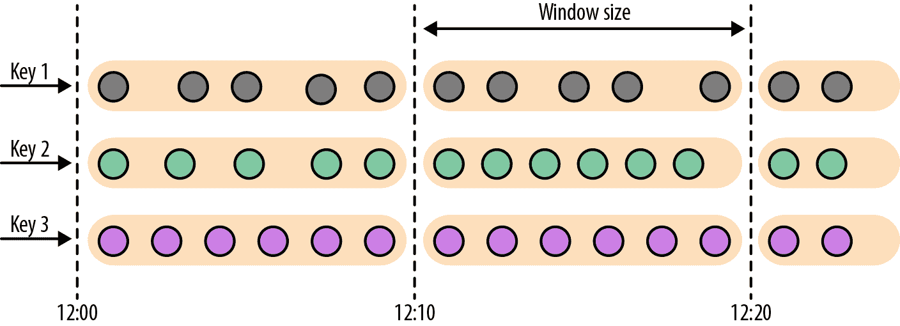
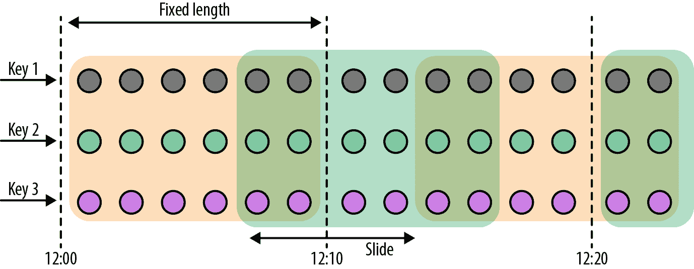
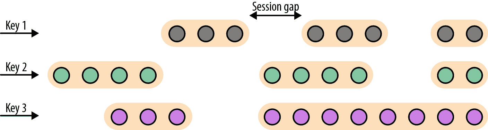
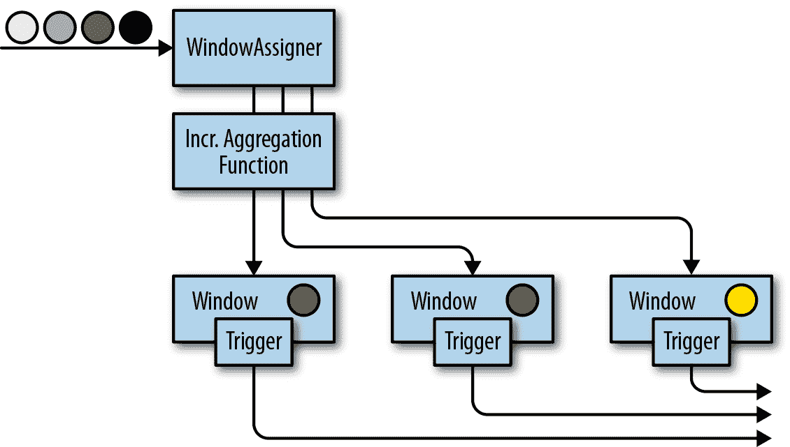
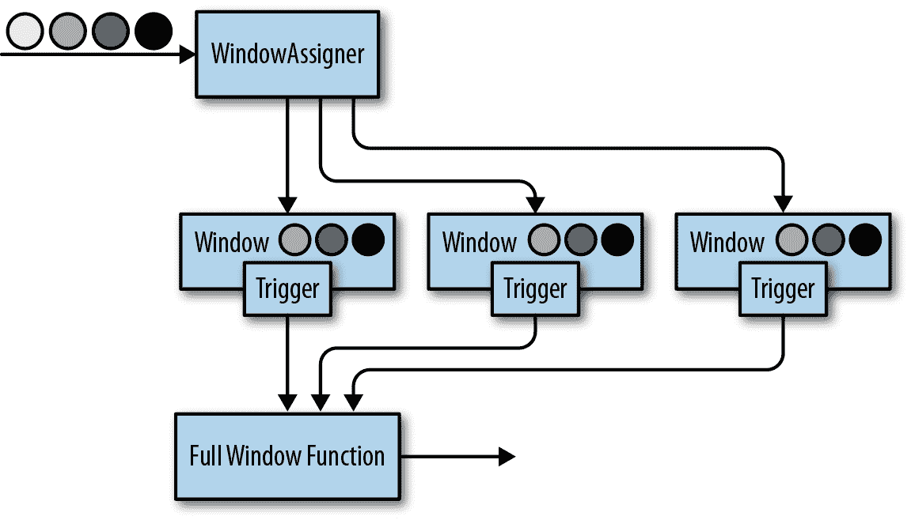
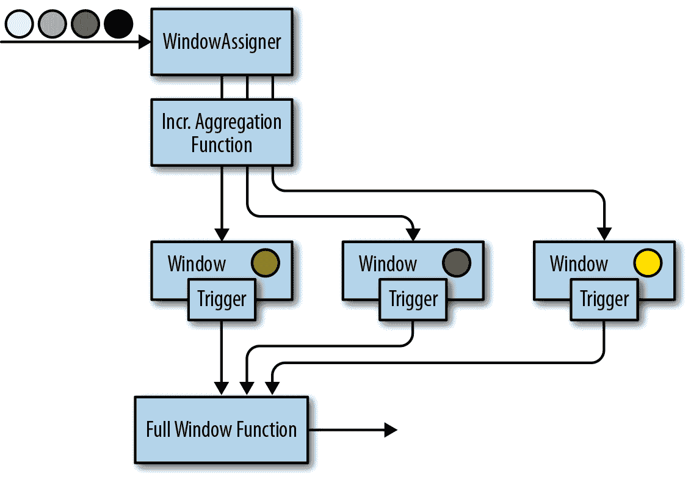
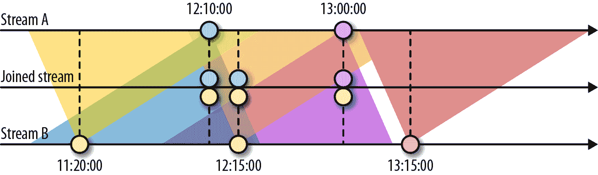
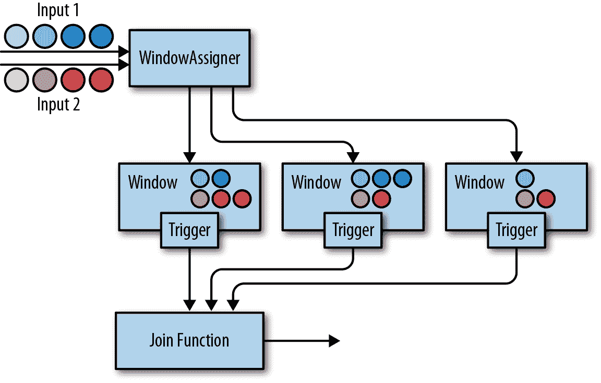

# 第六章：基于时间和窗口运算符

在本章中，我们将介绍用于时间处理和基于时间的运算符的 DataStream API 方法，例如窗口操作。正如您在 “时间语义” 中学到的，Flink 的基于时间的运算符可以使用不同的时间概念应用。

首先，我们将学习如何定义时间特性、时间戳和水印。接着，我们将介绍处理函数，这些低级转换函数提供时间戳和水印的访问，并能够注册定时器。接下来，我们将使用 Flink 的窗口 API，该 API 提供了最常见窗口类型的内置实现。您还将介绍自定义的用户定义窗口操作以及核心窗口构造，如分配器、触发器和逐出器。最后，我们将讨论如何在时间上对流进行连接，以及处理延迟事件的策略。

# 配置时间特性

要在分布式流处理应用程序中定义时间操作，理解时间的含义至关重要。当您指定一个窗口来收集每分钟的事件时，每个窗口将包含哪些确切的事件？在 DataStream API 中，您可以使用 *时间特性* 来告诉 Flink 在创建窗口时如何定义时间。时间特性是 `StreamExecutionEnvironment` 的属性，可以采用以下值：

`ProcessingTime`

指定操作符根据它们所执行的机器的系统时钟确定数据流的当前时间。处理时间窗口根据机器时间触发，并包含到达操作符的任何元素直到那个时间点为止。一般来说，使用处理时间进行窗口操作会导致非确定性结果，因为窗口的内容取决于元素到达的速度。这种设置提供非常低的延迟，因为处理任务无需等待水印推进事件时间。

`EventTime`

指定操作符通过使用数据本身的信息来确定当前时间。每个事件都携带一个时间戳，并且系统的逻辑时间由水印定义。正如您在 “时间戳” 中学到的，时间戳可以存在于进入数据处理管道之前的数据中，也可以由应用程序在源处分配。事件时间窗口在水印宣布接收到某个时间间隔的所有时间戳后触发。即使事件以无序方式到达，事件时间窗口也会计算确定性结果。窗口结果不会依赖于流的读取或处理速度。

`IngestionTime`

指定源操作符的处理时间为每个摄入记录的事件时间戳，并自动生成水印。它是 `EventTime` 和 `ProcessingTime` 的混合体。事件的摄入时间是它进入流处理器的时间。与事件时间相比，摄入时间不提供确定性结果，并且与事件时间具有类似的性能。

Example 6-1 展示了如何通过重新访问你在 “Hello, Flink!” 中编写的传感器流应用程序代码来设置时间特征。

##### Example 6-1\. 设置时间特征为事件时间

```
object AverageSensorReadings {

  // main() defines and executes the DataStream program
  def main(args: Array[String]) {
    // set up the streaming execution environment
    val env = StreamExecutionEnvironment.getExecutionEnvironment

    // use event time for the application
    env.setStreamTimeCharacteristic(TimeCharacteristic.EventTime)

    // ingest sensor stream
    val sensorData: DataStream[SensorReading] = env.addSource(...)
  }
}
```

将时间特征设置为 `EventTime` 可以启用时间戳和水印处理，并因此支持事件时间操作。当然，如果选择 `EventTime` 时间特征，你仍然可以使用处理时间窗口和定时器。

为了使用处理时间，请将 `TimeCharacteristic.EventTime` 替换为 `TimeCharacteristic.ProcessingTime`。

## 分配时间戳和生成水印

如 “事件时间处理” 中所讨论的，你的应用程序需要向 Flink 提供两个重要的信息，以便在事件时间中操作。每个事件必须与一个时间戳关联，通常表示事件实际发生的时间。事件时间流还需要携带水印，从中运算符推断当前事件时间。

时间戳和水印以自 1970-01-01T00:00:00Z 起的毫秒数指定。水印告知运算符不再预期时间戳小于或等于水印的事件。时间戳和水印可以由 `SourceFunction` 分配和生成，也可以使用显式的用户定义时间戳分配器和水印生成器。在 “源函数、时间戳和水印” 中讨论了在 `SourceFunction` 中分配时间戳和生成水印的方法。这里我们解释如何通过用户定义函数来实现这一点。

# 覆盖源生成的时间戳和水印

如果使用时间戳分配器，则会覆盖任何现有的时间戳和水印。

DataStream API 提供了 `TimestampAssigner` 接口，用于在流应用程序将元素摄取后从中提取时间戳。通常，时间戳分配器会在源函数之后立即调用，因为大多数分配器在生成水印时会对元素的时间戳顺序做出假设。由于元素通常是并行摄取的，任何导致 Flink 在并行流分区间重新分配元素的操作（如并行度变更、`keyBy()` 或其他显式重新分配操作），都会打乱元素的时间戳顺序。

最佳实践是尽可能在源处或甚至在 `SourceFunction` 内部分配时间戳并生成水印。根据用例，如果这些操作不会引起元素的重新分配，可以在分配时间戳之前对输入流进行初始过滤或转换。

为了确保事件时间操作的预期行为，应在任何事件时间依赖的转换之前调用分配器（例如，在第一个事件时间窗口之前）。

时间戳分配器的行为类似于其他转换操作符。它们在元素流上被调用，并产生一个新的时间戳元素流和水印流。时间戳分配器不会改变 `DataStream` 的数据类型。

示例 6-2 中的代码展示了如何使用时间戳分配器。在这个示例中，读取流之后，我们首先应用了一个过滤转换，然后调用了 `assignTimestampsAndWatermarks()` 方法，其中定义了时间戳分配器 `MyAssigner()`。

##### 示例 6-2\. 使用时间戳分配器

```
val env = StreamExecutionEnvironment.getExecutionEnvironment

// set the event time characteristic
env.setStreamTimeCharacteristic(TimeCharacteristic.EventTime)

// ingest sensor stream
val readings: DataStream[SensorReading] = env
  .addSource(new SensorSource)
  // assign timestamps and generate watermarks
  .assignTimestampsAndWatermarks(new MyAssigner())

```

在上面的示例中，`MyAssigner` 可以是 `AssignerWithPeriodicWatermarks` 或 `AssignerWithPunctuatedWatermarks` 类型之一。这两个接口都扩展了 DataStream API 提供的`TimestampAssigner`接口。第一个接口定义了定期发出水印的分配器，而第二个接口则根据输入事件的属性注入水印。接下来我们将详细描述这两个接口。

### 定期水印分配器

定期分配水印意味着我们指示系统在固定的机器时间间隔内发出水印并推进事件时间。默认间隔设置为两百毫秒，但可以使用 `ExecutionConfig.setAutoWatermarkInterval()` 方法进行配置：

```
val env = StreamExecutionEnvironment.getExecutionEnvironment
env.setStreamTimeCharacteristic(TimeCharacteristic.EventTime)
// generate watermarks every 5 seconds
env.getConfig.setAutoWatermarkInterval(5000)

```

在前面的示例中，您指示程序每隔 5 秒发出水印。实际上，每隔 5 秒，Flink 调用 `AssignerWithPeriodicWatermarks` 的 `getCurrentWatermark()` 方法。如果该方法返回一个非空值且时间戳大于先前水印的时间戳，则会转发新的水印。这个检查是为了确保事件时间持续增加；否则不会产生水印。

示例 6-3 展示了一个定期时间戳分配器，它通过跟踪到目前为止看到的最大元素时间戳来生成水印。当要求生成新的水印时，分配器返回一个时间戳减去 1 分钟的容差区间的水印。

##### 示例 6-3\. 定期水印分配器

```
class PeriodicAssigner 
    extends AssignerWithPeriodicWatermarks[SensorReading] {

  val bound: Long = 60 * 1000     // 1 min in ms
  var maxTs: Long = Long.MinValue // the maximum observed timestamp

  override def getCurrentWatermark: Watermark = {
    // generated watermark with 1 min tolerance
    new Watermark(maxTs - bound)
  }

  override def extractTimestamp(
      r: SensorReading, 
      previousTS: Long): Long = {
    // update maximum timestamp
    maxTs = maxTs.max(r.timestamp)
    // return record timestamp
    r.timestamp
  }
}

```

DataStream API 提供了两种常见情况下时间戳分配器与周期性水印的实现。如果您的输入元素具有单调递增的时间戳，您可以使用快捷方法`assignAscendingTimeStamps`。该方法使用当前时间戳生成水印，因为不会出现早于当前时间戳的时间戳。以下是如何为单调递增时间戳生成水印的示例：

```
val stream: DataStream[SensorReading] = ...
val withTimestampsAndWatermarks = stream
  .assignAscendingTimestamps(e => e.timestamp)
```

周期性水印生成的另一个常见情况是当您知道输入流中会遇到的最大延迟时，即元素时间戳与先前摄取的所有元素的最大时间戳之间的最大差异。对于这种情况，Flink 提供了`BoundedOutOfOrdernessTimeStampExtractor`，它将预期的最大延迟作为参数：

```
val stream: DataStream[SensorReading] = ...
val output = stream.assignTimestampsAndWatermarks(
  new BoundedOutOfOrdernessTimestampExtractorSensorReading)(e =>.timestamp)

```

在前述代码中，允许元素最多延迟 10 秒。这意味着如果元素的事件时间与所有先前元素的最大时间戳之间的差大于 10 秒，则元素可能会在其相应计算完成并且结果已经发出后到达以进行处理。Flink 提供了不同的策略来处理此类延迟事件，我们将在“处理延迟数据”中进一步讨论这些策略。

### 带标点水印的分配器

有时输入流中包含指示流进度的特殊元组或标记。对于这种情况或基于输入元素其他属性定义水印的情况，Flink 提供了`AssignerWithPunctuatedWatermarks`接口。该接口定义了`checkAndGetNextWatermark()`方法，在`extractTimestamp()`后立即调用。该方法可以决定是否生成新的水印。如果该方法返回一个大于最新生成的水印的非空水印，则会发出新的水印。

示例 6-4 展示了一个带有标点水印分配器的例子，它对从 ID 为`"sensor_1"`的传感器接收到的每个读数都发出一个水印。

##### 示例 6-4\. 标点水印分配器

```
class PunctuatedAssigner 
    extends AssignerWithPunctuatedWatermarks[SensorReading] {

  val bound: Long = 60 * 1000 // 1 min in ms

  override def checkAndGetNextWatermark(
      r: SensorReading, 
      extractedTS: Long): Watermark = {
    if (r.id == "sensor_1") {
      // emit watermark if reading is from sensor_1
      new Watermark(extractedTS - bound)
    } else {
      // do not emit a watermark
      null
    }
  }

  override def extractTimestamp(
      r: SensorReading, 
      previousTS: Long): Long = {
    // assign record timestamp
    r.timestamp
  }
}

```

## 水印、延迟和完整性

到目前为止，我们讨论了如何使用`TimestampAssigner`生成水印。但我们还未讨论水印对流式应用程序的影响。

水印用于平衡延迟和结果完整性。它们控制在执行计算之前等待数据到达的时间，例如完成窗口计算并发出结果。基于事件时间的操作员使用水印来确定其摄取记录的完整性和操作的进度。根据接收到的水印，操作员计算一个时间点，该时间点是其预期已接收到相关输入记录的时间点。

然而，现实是我们永远无法拥有完美的水印，因为那意味着我们始终确定没有延迟记录。在实践中，您需要进行合理的猜测，并使用启发式方法在应用程序中生成水印。您需要利用有关源、网络和分区的任何信息来估计进度和输入记录的延迟上限。估计意味着可能会出现错误，如果出现这种情况，您可能会生成不准确的水印，导致数据延迟或应用程序延迟不必要地增加。有了这些想法，您可以使用水印来平衡结果的延迟和结果的完整性。

如果生成松散的水印——即水印远远落后于已处理记录的时间戳——则会增加生成结果的延迟。您可能本可以更早生成结果，但必须等待水印。此外，状态大小通常会增加，因为应用程序需要缓冲更多数据，直到可以执行计算。然而，当您执行计算时，可以相当确定所有相关数据都已经可用。

另一方面，如果生成非常紧密的水印——即水印可能比某些后续记录的时间戳更大——则可能会在所有相关数据到达之前执行基于时间的计算。虽然这可能导致不完整或不准确的结果，但结果会及时产生且延迟较低。

与围绕所有数据均可用的批处理应用程序不同，延迟/完整性的权衡是流处理应用程序的基本特征，这些应用程序按照数据到达的方式处理无限数据。水印是控制应用程序在时间方面行为的有效方式。除了水印之外，Flink 还有许多功能来调整基于时间操作的确切行为，例如进程函数和窗口触发器，并提供处理延迟数据的不同方法，这些方法在 “处理延迟数据” 中讨论。

# 进程函数

尽管时间信息和水印对许多流处理应用程序至关重要，但您可能已经注意到，通过我们到目前为止所看到的基本 DataStream API 转换，我们无法访问它们。例如，`MapFunction` 无法访问时间戳或当前事件时间。

DataStream API 提供了一系列低级别转换，即进程函数，这些函数还可以访问记录时间戳和水印，并注册在未来特定时间触发的定时器。此外，进程函数具有侧输出功能，可将记录发射到多个输出流。进程函数通常用于构建事件驱动的应用程序，并实现预定义窗口和转换不适用的自定义逻辑。例如，Flink SQL 的大多数操作符都是使用进程函数实现的。

目前，Flink 提供了八种不同的处理函数：`ProcessFunction`、`KeyedProcessFunction`、`CoProcessFunction`、`ProcessJoinFunction`、`BroadcastProcessFunction`、`KeyedBroadcastProcessFunction`、`ProcessWindowFunction` 和 `ProcessAllWindowFunction`。正如它们的名字所示，这些函数适用于不同的上下文。然而，它们具有非常相似的功能集。我们将通过详细讨论 `KeyedProcessFunction` 来继续讨论这些共同的特性。

`KeyedProcessFunction` 是一个非常多功能的函数，可以应用于 `KeyedStream`。该函数对流的每条记录调用一次，并返回零个、一个或多个记录。所有处理函数都实现了 `RichFunction` 接口，因此提供了 `open()`、`close()` 和 `getRuntimeContext()` 方法。此外，`KeyedProcessFunction[KEY, IN, OUT]` 还提供以下两个方法：

1.  `processElement(v: IN, ctx: Context, out: Collector[OUT])` 对流的每条记录调用一次。通常情况下，通过将记录传递给 `Collector` 来发射结果记录。`Context` 对象使得处理函数变得特殊。它提供了访问当前记录的时间戳和键以及 `TimerService` 的能力。此外，`Context` 还可以将记录发送到侧输出。

1.  `onTimer(timestamp: Long, ctx: OnTimerContext, out: Collector[OUT])` 是一个回调函数，在先前注册的定时器触发时被调用。时间戳参数给出触发定时器的时间戳，而 `Collector` 允许发射记录。`OnTimerContext` 提供了与 `processElement()` 方法的 `Context` 对象相同的服务，并且还返回触发触发的时间域（处理时间或事件时间）。

## TimerService 和 Timers

`Context` 和 `OnTimerContext` 对象的 `TimerService` 提供以下方法：

+   `currentProcessingTime(): Long` 返回当前的处理时间。

+   `currentWatermark(): Long` 返回当前水印的时间戳。

+   `registerProcessingTimeTimer(timestamp: Long): Unit` 为当前键注册一个处理时间定时器。当执行机器的处理时间达到提供的时间戳时，定时器将触发。

+   `registerEventTimeTimer(timestamp: Long): Unit` 为当前键注册一个事件时间定时器。当水印更新到等于或大于定时器的时间戳时，定时器将触发。

+   `deleteProcessingTimeTimer(timestamp: Long): Unit` 删除先前为当前键注册的处理时间定时器。如果不存在这样的定时器，则此方法不会产生任何效果。

+   `deleteEventTimeTimer(timestamp: Long): Unit` 删除先前为当前键注册的事件时间定时器。如果不存在这样的定时器，则此方法不会产生任何效果。

当定时器触发时，将调用 `onTimer()` 回调函数。`processElement()` 和 `onTimer()` 方法是同步的，以防止对状态进行并发访问和操作。

# 非键控流上的定时器

定时器只能在键控流上注册。 定时器的常见用例是在某个键的一段不活动时间后清除键控状态或实现自定义基于时间的窗口逻辑。 要在非键控流上使用定时器，可以使用带有常量虚拟键的`KeySelector`创建一个键控流。 请注意，这将使所有数据移动到单个任务中，使操作符的实际并行度为 1。

对于每个键和时间戳，只能注册一个定时器，这意味着每个键可以有多个定时器，但每个时间戳只能有一个。 默认情况下，`KeyedProcessFunction`在堆上的优先队列中保存所有定时器的时间戳。 但是，您可以配置 RocksDB 状态后端来存储定时器。

定时器与函数的任何其他状态一起进行检查点。 如果应用程序需要从故障中恢复，则在应用程序重新启动时已过期的所有处理时间定时器将立即触发。 对于保存点中持久化的处理时间定时器也是如此。 定时器始终是异步检查点，有一个例外。 如果您正在使用 RocksDB 状态后端进行增量检查点并将定时器存储在堆上（默认设置），则会同步检查点它们。 在这种情况下，建议不要过度使用定时器，以避免长时间的检查点时间。

###### 注意

已注册在过去时间戳的定时器不会被静默丢弃，而是会被处理。 处理时间定时器在注册方法返回后立即触发。 事件时间定时器在处理下一个水印时触发。

以下代码显示如何将`KeyedProcessFunction`应用于`KeyedStream`。 该函数监视传感器的温度，并在处理时间内传感器温度单调增加超过 1 秒的情况下发出警告：

```
val warnings = readings
  // key by sensor id
  .keyBy(_.id)
  // apply ProcessFunction to monitor temperatures
  .process(new TempIncreaseAlertFunction)

```

`TempIncreaseAlterFunction`的实现如 示例 6-5 所示。

##### 示例 6-5。 如果传感器的处理时间温度单调增加了 1 秒，则发出警告的 KeyedProcessFunction

```
/** Emits a warning if the temperature of a sensor
  * monotonically increases for 1 second (in processing time).
  */
class TempIncreaseAlertFunction
    extends KeyedProcessFunction[String, SensorReading, String] {
  // stores temperature of last sensor reading
  lazy val lastTemp: ValueState[Double] = getRuntimeContext.getState(
      new ValueStateDescriptorDouble)
  // stores timestamp of currently active timer
  lazy val currentTimer: ValueState[Long] = getRuntimeContext.getState(
      new ValueStateDescriptorLong)

  override def processElement(
      r: SensorReading,
      ctx: KeyedProcessFunction[String, SensorReading, String]#Context,
      out: Collector[String]): Unit = {
    // get previous temperature
    val prevTemp = lastTemp.value()
    // update last temperature
    lastTemp.update(r.temperature)

    val curTimerTimestamp = currentTimer.value();
    if (prevTemp == 0.0 || r.temperature < prevTemp) {
      // temperature decreased; delete current timer
      ctx.timerService().deleteProcessingTimeTimer(curTimerTimestamp)
      currentTimer.clear()
    } else if (r.temperature > prevTemp && curTimerTimestamp == 0) {
      // temperature increased and we have not set a timer yet
      // set processing time timer for now + 1 second
      val timerTs = ctx.timerService().currentProcessingTime() + 1000
      ctx.timerService().registerProcessingTimeTimer(timerTs)
      // remember current timer
      currentTimer.update(timerTs)
    }
  }

  override def onTimer(
      ts: Long,
      ctx: KeyedProcessFunction[String, SensorReading, String]#OnTimerContext,
      out: Collector[String]): Unit = {
    out.collect("Temperature of sensor '" + ctx.getCurrentKey +
      "' monotonically increased for 1 second.")
    currentTimer.clear()
  }
}

```

## 发射到侧输出

DataStream API 的大多数操作符只有单个输出 - 它们生成一个具有特定数据类型的结果流。 仅分割操作符允许将流分割为具有相同类型的多个流。 侧输出是处理函数的功能，用于从具有可能具有不同类型的函数中发出多个流。 侧输出由`OutputTag[X]`对象标识，其中`X`是生成的侧输出流的类型。 处理函数可以通过`Context`对象将记录发射到一个或多个侧输出。

示例 6-6 显示如何通过`ProcessFunction`的侧输出`DataStream`发出数据。

##### 示例 6-6。 应用一个 ProcessFunction，通过侧输出发出数据

```
val monitoredReadings: DataStream[SensorReading] = readings
  // monitor stream for readings with freezing temperatures
  .process(new FreezingMonitor)

// retrieve and print the freezing alarms side output
monitoredReadings
  .getSideOutput(new OutputTagString)
  .print()

// print the main output
readings.print()
```

示例 6-7 展示了 `FreezingMonitor` 函数，它监控传感器读数流，并对低于 32°F 的读数向侧输出发出警告。

##### 示例 6-7. 一个将记录发送到侧输出的 ProcessFunction

```
/** Emits freezing alarms to a side output for readings 
 * with a temperature below 32F. */
class FreezingMonitor extends ProcessFunction[SensorReading, SensorReading] {

  // define a side output tag
  lazy val freezingAlarmOutput: OutputTag[String] =
    new OutputTagString

  override def processElement(
      r: SensorReading,
      ctx: ProcessFunction[SensorReading, SensorReading]#Context,
      out: Collector[SensorReading]): Unit = {
    // emit freezing alarm if temperature is below 32F
    if (r.temperature < 32.0) {
      ctx.output(freezingAlarmOutput, s"Freezing Alarm for ${r.id}")
    }
    // forward all readings to the regular output
    out.collect(r)
  }
}

```

## CoProcessFunction

对于两个输入的低级操作，DataStream API 还提供了 `CoProcessFunction`。类似于 `CoFlatMapFunction`，`CoProcessFunction` 为每个输入提供了一个转换方法，即 `processElement1()` 和 `processElement2()`。类似于 `ProcessFunction`，这两个方法都使用 `Context` 对象调用，该对象提供了对元素或计时器时间戳、`TimerService` 和侧输出的访问。`CoProcessFunction` 还提供了一个 `onTimer()` 回调方法。示例 6-8 展示了如何应用 `CoProcessFunction` 来合并两个流。

##### 示例 6-8. 应用 CoProcessFunction

```
// ingest sensor stream
val sensorData: DataStream[SensorReading] = ...

// filter switches enable forwarding of readings
val filterSwitches: DataStream[(String, Long)] = env
  .fromCollection(Seq(
    ("sensor_2", 10 * 1000L), // forward sensor_2 for 10 seconds
    ("sensor_7", 60 * 1000L)) // forward sensor_7 for 1 minute
  )

val forwardedReadings = readings
  // connect readings and switches
  .connect(filterSwitches)
  // key by sensor ids
  .keyBy(_.id, _._1)
  // apply filtering CoProcessFunction
  .process(new ReadingFilter)

```

展示了一个 `ReadingFilter` 函数的实现，它根据过滤器开关流动态过滤传感器读数流。详见 示例 6-9。

##### 示例 6-9. 实现一个动态过滤传感器读数流的 CoProcessFunction

```
class ReadingFilter
    extends CoProcessFunction[SensorReading, (String, Long), SensorReading] {

  // switch to enable forwarding
  lazy val forwardingEnabled: ValueState[Boolean] = getRuntimeContext.getState(
      new ValueStateDescriptorBoolean)

  // hold timestamp of currently active disable timer
  lazy val disableTimer: ValueState[Long] = getRuntimeContext.getState(
      new ValueStateDescriptorLong)

  override def processElement1(
      reading: SensorReading,
      ctx: CoProcessFunction[SensorReading, (String, Long), SensorReading]#Context,
      out: Collector[SensorReading]): Unit = {
    // check if we may forward the reading
    if (forwardingEnabled.value()) {
      out.collect(reading)
    }
  }

  override def processElement2(
      switch: (String, Long),
      ctx: CoProcessFunction[SensorReading, (String, Long), SensorReading]#Context,
      out: Collector[SensorReading]): Unit = {
    // enable reading forwarding
    forwardingEnabled.update(true)
    // set disable forward timer
    val timerTimestamp = ctx.timerService().currentProcessingTime() + switch._2
    val curTimerTimestamp = disableTimer.value()
      if (timerTimestamp > curTimerTimestamp) {
      // remove current timer and register new timer
      ctx.timerService().deleteEventTimeTimer(curTimerTimestamp)
      ctx.timerService().registerProcessingTimeTimer(timerTimestamp)
      disableTimer.update(timerTimestamp)
    }
  }

  override def onTimer(
      ts: Long,
      ctx: CoProcessFunction[SensorReading, (String, Long), SensorReading]
                            #OnTimerContext,
      out: Collector[SensorReading]): Unit = {
    // remove all state; forward switch will be false by default
    forwardingEnabled.clear()
    disableTimer.clear()
  }
}

```

# 窗口操作符

窗口在流式应用中是常见的操作。它们使得可以对无界流的*有界间隔*执行转换，如聚合操作。通常，这些间隔是使用基于时间的逻辑定义的。窗口操作符提供一种方法将事件分组为有限大小的桶，并在这些桶的有界内容上应用计算。例如，窗口操作符可以将流的事件分组为 5 分钟的窗口，并计算每个窗口收到了多少事件。

DataStream API 提供了最常见的窗口操作的内置方法，以及非常灵活的窗口机制来定义自定义的窗口逻辑。在本节中，我们将向您展示如何定义窗口操作符，介绍 DataStream API 的内置窗口类型，讨论可以应用于窗口的函数，最后解释如何定义自定义的窗口逻辑。

## 定义窗口操作符

窗口操作符可以应用于键控或非键控流。在键控窗口上评估窗口操作符是并行的，而非键控窗口在单个线程中处理。

要创建窗口操作符，您需要指定两个窗口组件：

1.  *窗口分配器* 确定如何将输入流的元素分组到窗口中。窗口分配器生成一个 `WindowedStream`（或者如果应用于非键控 `DataStream` 则为 `AllWindowedStream`）。

1.  *窗口函数* 应用于 `WindowedStream`（或 `AllWindowedStream`）并处理分配给窗口的元素。

以下代码显示了如何在键控或非键控流上指定窗口分配器和窗口函数：

```
// define a keyed window operator
stream
  .keyBy(...)                 
  .window(...)                   // specify the window assigner
  .reduce/aggregate/process(...) // specify the window function

// define a nonkeyed window-all operator
stream
  .windowAll(...)                // specify the window assigner
  .reduce/aggregate/process(...) // specify the window function

```

在本章的其余部分，我们仅关注键控窗口。非键控窗口（也称为所有窗口在 DataStream API 中）行为完全相同，除了它们收集所有数据并且不会并行评估。

###### 注意

请注意，您可以通过提供自定义触发器或清除器，并声明处理延迟元素的策略来自定义窗口操作符。有关详细信息，请参见本节稍后讨论的自定义窗口操作符。

## 内置窗口分配器

Flink 为最常见的窗口使用情况提供了内置窗口分配器。我们在这里讨论的所有分配器都是基于时间的，并在“数据流操作”中介绍。基于时间的窗口分配器根据其事件时间戳或当前处理时间将元素分配到窗口。时间窗口具有开始和结束时间戳。

所有内置窗口分配器都提供默认触发器，一旦（处理或事件）时间超过窗口的结束时间，即触发窗口评估。重要的是要注意，窗口在第一个元素分配给它时被创建。Flink 永远不会评估空窗口。

# 基于计数的窗口

除了基于时间的窗口，Flink 还支持基于计数的窗口——窗口按照元素到达窗口操作符的顺序分组。由于它们依赖于摄入顺序，基于计数的窗口不是确定性的。此外，如果在某些时候不使用自定义触发器来丢弃不完整和过期的窗口，它们可能会导致问题。

Flink 的内置窗口分配器创建的窗口类型为`TimeWindow`。该窗口类型基本上表示两个时间戳之间的时间间隔，其中起始时间包含在内，结束时间不包含在内。它公开了检索窗口边界的方法，以检查窗口是否相交，并合并重叠窗口。

在下面，我们展示了 DataStream API 的不同内置窗口分配器及其如何用于定义窗口操作符。

### 滚动窗口

滚动窗口分配器将元素放入非重叠的固定大小窗口中，如图 6-1 所示。



###### 图 6-1\. 滚动窗口分配器将元素放入固定大小的非重叠窗口中

Datastream API 提供了两个分配器——`TumblingEventTimeWindows`和`TumblingProcessingTimeWindows`——用于滚动事件时间和处理时间窗口。滚动窗口分配器接收一个参数，即时间单位内的窗口大小；可以使用分配器的`of(Time size)`方法指定此参数。时间间隔可以设置为毫秒、秒、分钟、小时或天。

以下代码显示了如何在传感器数据测量流上定义事件时间和处理时间滚动窗口：

```
val sensorData: DataStream[SensorReading] = ...

val avgTemp = sensorData
  .keyBy(_.id)
   // group readings in 1s event-time windows
  .window(TumblingEventTimeWindows.of(Time.seconds(1)))
  .process(new TemperatureAverager)

```

```
val avgTemp = sensorData
  .keyBy(_.id)
   // group readings in 1s processing-time windows
  .window(TumblingProcessingTimeWindows.of(Time.seconds(1)))
  .process(new TemperatureAverager)
```

在我们的第一个 DataStream API 示例中，“数据流操作”（ch02.html#chap-2-ops-on-streams）中窗口定义有所不同。在那里，我们使用 `timeWindow(size)` 方法定义了一个事件时间滚动窗口，这是 `window.(TumblingEventTimeWindows.of(size))` 或 `window.(TumblingProcessingTimeWindows.of(size))` 的快捷方式，具体取决于配置的时间特征。以下代码展示了如何使用此快捷方式：

```
val avgTemp = sensorData
  .keyBy(_.id)
   // shortcut for window.(TumblingEventTimeWindows.of(size))
  .timeWindow(Time.seconds(1))
  .process(new TemperatureAverager)

```

默认情况下，滚动窗口与时代时间（`1970-01-01-00:00:00.000`）对齐。例如，大小为一小时的分配器将在 00:00:00、01:00:00、02:00:00 等时刻定义窗口。或者，您可以在分配器的第二个参数中指定偏移量。以下代码显示了具有 15 分钟偏移的窗口，从 00:15:00 开始，依次类推：  

```
val avgTemp = sensorData
  .keyBy(_.id)
   // group readings in 1 hour windows with 15 min offset
  .window(TumblingEventTimeWindows.of(Time.hours(1), Time.minutes(15)))
  .process(new TemperatureAverager)

```

### 滑动窗口

滑动窗口分配器将元素分配到固定大小、以指定滑动间隔移动的窗口中，如图 6-2（#fig_sliding-assigner）所示。



###### 图 6-2\. 滑动窗口分配器将元素分配到固定大小、可能重叠的窗口中

对于滑动窗口，您需要指定窗口大小和滑动间隔，后者定义了新窗口启动的频率。当滑动间隔小于窗口大小时，窗口会重叠，元素可能会分配到多个窗口中。如果滑动间隔大于窗口大小，则有些元素可能不会被分配到任何窗口中，因此可能会被丢弃。

下面的代码展示了如何将传感器读数分组到大小为 1 小时、滑动间隔为 15 分钟的滑动窗口中。每个读数将被添加到四个窗口中。DataStream API 提供了事件时间和处理时间分配器，以及快捷方法，并且可以将时间间隔偏移量设置为窗口分配器的第三个参数：

```
// event-time sliding windows assigner
val slidingAvgTemp = sensorData
  .keyBy(_.id)
   // create 1h event-time windows every 15 minutes
  .window(SlidingEventTimeWindows.of(Time.hours(1), Time.minutes(15)))
  .process(new TemperatureAverager)

// processing-time sliding windows assigner
val slidingAvgTemp = sensorData
  .keyBy(_.id)
   // create 1h processing-time windows every 15 minutes
  .window(SlidingProcessingTimeWindows.of(Time.hours(1), Time.minutes(15)))
  .process(new TemperatureAverager)

// sliding windows assigner using a shortcut method
val slidingAvgTemp = sensorData
  .keyBy(_.id)
   // shortcut for window.(SlidingEventTimeWindow.of(size, slide))
  .timeWindow(Time.hours(1), Time(minutes(15)))
  .process(new TemperatureAverager)

```

### 会话窗口

会话窗口分配器将元素分配到活动期间不重叠的窗口中。会话窗口的边界由不活动间隙定义，即在此期间未收到记录。图 6-3（#fig_session-windows）说明了如何将元素分配到会话窗口中。



###### 图 6-3\. 会话窗口分配器将元素分配到由会话间隔定义的不同大小窗口中

下面的示例展示了如何将传感器读数分组到会话窗口中，其中每个会话由 15 分钟的不活动期定义：

```
// event-time session windows assigner
val sessionWindows = sensorData
  .keyBy(_.id)
   // create event-time session windows with a 15 min gap
  .window(EventTimeSessionWindows.withGap(Time.minutes(15)))
  .process(...)

// processing-time session windows assigner
val sessionWindows = sensorData
  .keyBy(_.id)
   // create processing-time session windows with a 15 min gap
  .window(ProcessingTimeSessionWindows.withGap(Time.minutes(15)))
  .process(...)

```

由于会话窗口的开始和结束取决于接收到的元素，窗口分配器无法立即将所有元素正确分配到窗口中。相反，`SessionWindows` 分配器最初将每个传入元素映射到具有元素时间戳作为起始时间和会话间隙作为窗口大小的窗口中。随后，它合并所有重叠范围的窗口。

## 在窗口上应用函数

窗口函数定义了在窗口元素上执行的计算。有两种类型的函数可以应用于窗口：

1.  *增量聚合函数*是在窗口中添加元素时直接应用，并保持和更新一个单一值作为窗口状态。这些函数通常非常节省空间，并最终作为结果发出聚合值。`ReduceFunction`和`AggregateFunction`都是增量聚合函数。

1.  *完整窗口函数*收集窗口中的所有元素，并在评估它们时对所有收集元素的列表进行迭代。完整窗口函数通常需要更多空间，但允许比增量聚合函数更复杂的逻辑。`ProcessWindowFunction`是一个完整窗口函数。

在本节中，我们讨论了可以应用于窗口上以执行聚合或窗口内容的任意计算的不同类型的函数。我们还展示了如何在窗口操作符中同时应用增量聚合和完整窗口函数。

### ReduceFunction

当讨论键控流上的运行聚合时，“键控流转换”介绍了`ReduceFunction`。`ReduceFunction`接受两个相同类型的值，并将它们组合成相同类型的单一值。当应用于窗口流时，`ReduceFunction`增量地聚合分配给窗口的元素。窗口仅存储聚合的当前结果——`ReduceFunction`输入（和输出）类型的单一值。当接收到新元素时，会用新元素和从窗口状态中读取的当前值调用`ReduceFunction`。窗口状态由`ReduceFunction`的结果替换。

在窗口上应用`ReduceFunction`的优点是每个窗口具有恒定且小的状态大小以及简单的函数接口。然而，`ReduceFunction`的应用通常受限且通常仅限于简单的聚合，因为输入和输出类型必须相同。

示例 6-10 显示了一个 lambda 减少函数，每 15 秒计算传感器的最低温度。

##### 示例 6-10\. 在 WindowedStream 上应用一个减少的 lambda 函数

```
val minTempPerWindow: DataStream[(String, Double)] = sensorData
  .map(r => (r.id, r.temperature))
  .keyBy(_._1)
  .timeWindow(Time.seconds(15))
  .reduce((r1, r2) => (r1._1, r1._2.min(r2._2)))

```

### AggregateFunction

类似于`ReduceFunction`，`AggregateFunction`也逐渐应用于分配给窗口的元素。此外，带有`AggregateFunction`的窗口操作符的状态也包括单一值。

尽管`AggregateFunction`的接口更加灵活，但与`ReduceFunction`的接口相比，实现起来更为复杂。以下代码展示了`AggregateFunction`的接口：

```
public interface AggregateFunction<IN, ACC, OUT> extends Function, Serializable {

  // create a new accumulator to start a new aggregate.
  ACC createAccumulator();

  // add an input element to the accumulator and return the accumulator.
  ACC add(IN value, ACC accumulator);

  // compute the result from the accumulator and return it.
  OUT getResult(ACC accumulator);

  // merge two accumulators and return the result.
  ACC merge(ACC a, ACC b);
}

```

该接口定义了输入类型`IN`，累加器类型`ACC`和结果类型`OUT`。与`ReduceFunction`不同，中间数据类型和输出类型不依赖于输入类型。

示例 6-11 展示了如何使用`AggregateFunction`来计算每个窗口传感器读数的平均温度。累加器维护了一个运行总和和计数，`getResult()`方法计算出平均值。

##### 示例 6-11。在 WindowedStream 上应用 AggregateFunction

```
val avgTempPerWindow: DataStream[(String, Double)] = sensorData
  .map(r => (r.id, r.temperature))
  .keyBy(_._1)
  .timeWindow(Time.seconds(15))
  .aggregate(new AvgTempFunction)

// An AggregateFunction to compute the average tempeature per sensor.
// The accumulator holds the sum of temperatures and an event count.
class AvgTempFunction
    extends AggregateFunction
  [(String, Double), (String, Double, Int), (String, Double)] {

  override def createAccumulator() = {
    ("", 0.0, 0)
  }

  override def add(in: (String, Double), acc: (String, Double, Int)) = {
    (in._1, in._2 + acc._2, 1 + acc._3)
  }

  override def getResult(acc: (String, Double, Int)) = {
    (acc._1, acc._2 / acc._3)
  }

  override def merge(acc1: (String, Double, Int), acc2: (String, Double, Int)) = {
    (acc1._1, acc1._2 + acc2._2, acc1._3 + acc2._3)
  }
}

```

### ProcessWindowFunction

`ReduceFunction`和`AggregateFunction`在分配给窗口的事件上逐步应用。然而，有时我们需要访问窗口中的所有元素来执行更复杂的计算，比如计算窗口中值的中位数或最频繁出现的值。对于这种应用，`ReduceFunction`和`AggregateFunction`都不适用。Flink 的 DataStream API 提供了`ProcessWindowFunction`来对窗口内容执行任意计算。

###### 注意

Flink 1.7 的 DataStream API 功能中包含了`WindowFunction`接口。`WindowFunction`已经被`ProcessWindowFunction`取代，这里不再讨论。

以下代码展示了`ProcessWindowFunction`的接口：

```
public abstract class ProcessWindowFunction<IN, OUT, KEY, W extends Window> 
    extends AbstractRichFunction {

  // Evaluates the window
  void process(
    KEY key, Context ctx, Iterable<IN> vals, Collector<OUT> out) throws Exception;

  // Deletes any custom per-window state when the window is purged
  public void clear(Context ctx) throws Exception {}

  // The context holding window metadata
  public abstract class Context implements Serializable {

    // Returns the metadata of the window
    public abstract W window();

    // Returns the current processing time
    public abstract long currentProcessingTime();

    // Returns the current event-time watermark
    public abstract long currentWatermark();

    // State accessor for per-window state
    public abstract KeyedStateStore windowState();

    // State accessor for per-key global state
    public abstract KeyedStateStore globalState();

    // Emits a record to the side output identified by the OutputTag.
    public abstract <X> void output(OutputTag<X> outputTag, X value);
  }
}

```

`process()`方法以窗口的键、一个`Iterable`以访问窗口中的元素，并一个`Collector`以发出结果。此外，该方法有一个类似其他处理方法的`Context`参数。`ProcessWindowFunction`的`Context`对象提供了对窗口元数据、当前处理时间和水印、状态存储以管理每个窗口和每个键的全局状态，以及侧输出以发出记录的访问。

当介绍处理函数时，我们已经讨论了`Context`对象的一些特性，比如访问当前处理和事件时间以及侧输出。然而，`ProcessWindowFunction`的`Context`对象还提供了独特的特性。窗口的元数据通常包含可以用作窗口标识符的信息，比如时间窗口的开始和结束时间戳。

另一个特性是每个窗口和每个键的全局状态。全局状态是指不受限于任何窗口的键控状态，而每个窗口状态是指当前正在评估的窗口实例。每个窗口状态用于维护应在同一窗口上的`process()`方法的多次调用之间共享的信息，这可能是由于配置允许的延迟或使用自定义触发器而发生的。利用每个窗口状态的`ProcessWindowFunction`需要实现其`clear()`方法，在窗口被清除之前清理任何窗口特定状态。全局状态可用于在同一键上的多个窗口之间共享信息。

示例 6-12 将传感器读数流分组为 5 秒钟的滚动窗口，并使用`ProcessWindowFunction`计算窗口内发生的最低和最高温度。它为每个窗口发出一条记录，包括窗口的开始和结束时间戳以及最小和最大温度。

##### 示例 6-12\. 使用`ProcessWindowFunction`计算每个传感器和窗口的最小和最大温度

```
// output the lowest and highest temperature reading every 5 seconds
val minMaxTempPerWindow: DataStream[MinMaxTemp] = sensorData
  .keyBy(_.id)
  .timeWindow(Time.seconds(5))
  .process(new HighAndLowTempProcessFunction)

case class MinMaxTemp(id: String, min: Double, max:Double, endTs: Long)

/**
 * A ProcessWindowFunction that computes the lowest and highest temperature
 * reading per window and emits them together with the 
 * end timestamp of the window.
 */
class HighAndLowTempProcessFunction
    extends ProcessWindowFunction[SensorReading, MinMaxTemp, String, TimeWindow] {

  override def process(
      key: String,
      ctx: Context,
      vals: Iterable[SensorReading],
      out: Collector[MinMaxTemp]): Unit = {

    val temps = vals.map(_.temperature)
    val windowEnd = ctx.window.getEnd

    out.collect(MinMaxTemp(key, temps.min, temps.max, windowEnd))
  }
}
```

内部实现中，由`ProcessWindowFunction`评估的窗口将所有分配的事件存储在`ListState`中。¹ 通过收集所有事件并提供对窗口元数据和其他功能的访问，`ProcessWindowFunction`可以处理比`ReduceFunction`或`AggregateFunction`更多的使用情况。然而，收集所有事件的窗口状态可能会比增量聚合窗口的状态显著更大。

### 增量聚合和`ProcessWindowFunction`

`ProcessWindowFunction`是一个非常强大的窗口函数，但是你需要谨慎使用，因为它通常在状态中保存的数据比增量聚合函数要多。很多时候，需要在窗口上应用的逻辑可以表示为增量聚合，但它也需要访问窗口元数据或状态。

如果您有增量聚合逻辑，但也需要访问窗口元数据，可以将执行增量聚合的`ReduceFunction`或`AggregateFunction`与提供更多功能的`ProcessWindowFunction`结合使用。分配给窗口的元素将立即聚合，并且当窗口触发时，聚合结果将传递给`ProcessWindowFunction`。`ProcessWindowFunction.process()`方法的`Iterable`参数将仅提供单个值，即增量聚合的结果。

在 DataStream API 中，可以通过在`reduce()`或`aggregate()`方法的第二个参数中提供`ProcessWindowFunction`来实现，如下面的代码所示：

```
input
  .keyBy(...)
  .timeWindow(...)
  .reduce(
    incrAggregator: ReduceFunction[IN],
    function: ProcessWindowFunction[IN, OUT, K, W])

```

```
input
  .keyBy(...)
  .timeWindow(...)
  .aggregate(
    incrAggregator: AggregateFunction[IN, ACC, V],
    windowFunction: ProcessWindowFunction[V, OUT, K, W])

```

示例 6-13 和 6-14 中的代码展示了如何使用`ReduceFunction`和`ProcessWindowFunction`组合解决与示例 6-12 中相同的用例，每 5 秒钟为每个传感器和每个窗口的最小和最大温度以及每个窗口的结束时间戳发出一次记录。

##### 示例 6-13\. 应用`ReduceFunction`进行增量聚合和`ProcessWindowFunction`进行窗口结果的最终化

```
case class MinMaxTemp(id: String, min: Double, max:Double, endTs: Long)

val minMaxTempPerWindow2: DataStream[MinMaxTemp] = sensorData
  .map(r => (r.id, r.temperature, r.temperature))
  .keyBy(_._1)
  .timeWindow(Time.seconds(5))
  .reduce(
    // incrementally compute min and max temperature
    (r1: (String, Double, Double), r2: (String, Double, Double)) => {
      (r1._1, r1._2.min(r2._2), r1._3.max(r2._3))
    },
    // finalize result in ProcessWindowFunction
    new AssignWindowEndProcessFunction()
  )

```

正如您在示例 6-13 中所看到的，`ReduceFunction`和`ProcessWindowFunction`都在`reduce()`方法调用中定义。由于聚合是由`ReduceFunction`执行的，所以`ProcessWindowFunction`只需将窗口结束时间戳追加到增量计算的结果中，如示例 6-14 所示。

##### 示例 6-14\. 实现一个`ProcessWindowFunction`，将窗口结束时间戳分配给增量计算结果

```
class AssignWindowEndProcessFunction
  extends 
  ProcessWindowFunction[(String, Double, Double), MinMaxTemp, String, TimeWindow] {

  override def process(
      key: String,
      ctx: Context,
      minMaxIt: Iterable[(String, Double, Double)],
      out: Collector[MinMaxTemp]): Unit = {

    val minMax = minMaxIt.head
    val windowEnd = ctx.window.getEnd
    out.collect(MinMaxTemp(key, minMax._2, minMax._3, windowEnd))
  }
}
```

## 自定义窗口操作符

使用 Flink 内置窗口分配器定义的窗口操作符可以解决许多常见用例。然而，随着您开始编写更高级的流式应用程序，您可能会发现自己需要实现更复杂的窗口逻辑，例如发射早期结果并在遇到延迟元素时更新其结果的窗口，或者在接收特定记录时开始和结束窗口。

DataStream API 通过允许您实现自定义分配器、触发器和清除器的接口和方法，来定义自定义窗口操作符。除了先前讨论的窗口函数外，这些组件在窗口操作符中共同工作，以分组和处理窗口中的元素。

当元素到达窗口操作符时，它将被交给`WindowAssigner`。分配器确定元素需要路由到哪些窗口。如果窗口尚不存在，则会创建窗口。

如果窗口操作符配置了增量聚合函数，比如`ReduceFunction`或`AggregateFunction`，则新添加的元素会立即聚合，并将结果存储为窗口的内容。如果窗口操作符没有增量聚合函数，则新元素将附加到包含所有分配元素的`ListState`中。

每当将元素添加到窗口时，它也会传递给窗口的触发器。触发器定义窗口何时准备好进行评估以及何时清除窗口内容。触发器可以根据分配的元素或注册的计时器（类似于过程函数）决定在特定时间点评估或清除其窗口的内容。

触发器触发时发生的情况取决于窗口操作符的配置函数。如果操作符仅配置了增量聚合函数，则会发出当前的聚合结果。此情况如图 6-4 所示。



###### 图 6-4\. 具有增量聚合函数的窗口操作符（每个窗口中的单个圆圈表示其聚合的窗口状态）

如果操作符仅具有全窗口函数，则该函数将应用于窗口的所有元素，并将结果输出，如图 6-5 所示。



###### 图 6-5\. 具有全窗口函数的窗口操作符（每个窗口中的圆圈表示其收集的原始输入记录）

最后，如果运算符具有增量聚合函数和全窗口函数，则全窗口函数应用于聚合值，并发出结果。图 6-6 描述了这种情况。



###### 图 6-6\. 具有增量聚合和全窗口函数的窗口操作员（每个窗口中的单个圆表示其聚合窗口状态）

逐出器是一个可选组件，可以在调用 `ProcessWindowFunction` 之前或之后注入。逐出器可以从窗口内容中删除收集的元素。由于它必须遍历所有元素，因此仅在未指定增量聚合函数时才能使用。

以下代码显示如何使用自定义触发器和逐出器定义窗口操作员：

```
stream
  .keyBy(...)
  .window(...)                   // specify the window assigner
 [.trigger(...)]                 // optional: specify the trigger
 [.evictor(...)]                 // optional: specify the evictor
  .reduce/aggregate/process(...) // specify the window function

```

虽然逐出器是可选组件，但每个窗口操作员都需要一个触发器来决定何时评估其窗口。为了提供简洁的窗口操作员 API，每个 `WindowAssigner` 都有一个默认触发器，除非明确定义了触发器。

###### 注意

请注意，显式指定的触发器会覆盖现有触发器，而不是补充它——窗口将仅基于最后定义的触发器进行评估。

在接下来的章节中，我们讨论窗口的生命周期，并介绍定义自定义窗口分配器、触发器和逐出器的接口。

### 窗口生命周期

窗口操作员在处理传入流元素时创建并通常也删除窗口。如前所述，元素由 `WindowAssigner` 分配给窗口，触发器决定何时评估窗口，并且窗口函数执行实际的窗口评估。在本节中，我们讨论窗口的生命周期——创建时机、包含的信息以及删除时机。

当 `WindowAssigner` 将第一个元素分配给窗口时，窗口被创建。因此，没有至少一个元素的窗口。窗口由以下不同状态组成：

窗口内容

窗口内容包含已分配给窗口的元素或窗口操作员具有 `ReduceFunction` 或 `AggregateFunction` 时的增量聚合结果。

窗口对象

`WindowAssigner` 返回零、一个或多个窗口对象。窗口操作员根据返回的对象对元素进行分组。因此，窗口对象包含用于区分彼此的窗口的信息。每个窗口对象都有一个结束时间戳，定义了窗口及其状态可以被删除的时间点。

触发器的定时器

触发器可以注册定时器，在特定时间点回调，例如评估窗口或清除其内容。这些定时器由窗口操作员维护。

触发器中的自定义状态

触发器可以定义和使用自定义的每窗口和每键状态。这些状态完全由触发器控制，而不是由窗口操作符维护。

当窗口操作符的窗口结束时间（由窗口对象的结束时间戳定义）到达时，窗口操作符将删除窗口。这是根据`WindowAssigner.isEventTime()`方法返回的值来决定，无论是处理时间语义还是事件时间语义。

当删除窗口时，窗口操作符会自动清除窗口内容并丢弃窗口对象。不会清除自定义触发器状态和注册的触发器定时器，因为这些状态对窗口操作符来说是不透明的。因此，触发器必须在`Trigger.clear()`方法中清除所有状态，以防止状态泄漏。

### 窗口分配器

`WindowAssigner`确定每个到达的元素分配到哪些窗口。一个元素可以添加到零个、一个或多个窗口中。以下显示了`WindowAssigner`接口：

```
public abstract class WindowAssigner<T, W extends Window> 
    implements Serializable {

  // Returns a collection of windows to which the element is assigned
  public abstract Collection<W> assignWindows(
    T element, 
    long timestamp, 
    WindowAssignerContext context);

  // Returns the default Trigger of the WindowAssigner
  public abstract Trigger<T, W> getDefaultTrigger(
    StreamExecutionEnvironment env);

  // Returns the TypeSerializer for the windows of this WindowAssigner
  public abstract TypeSerializer<W> getWindowSerializer(
    ExecutionConfig executionConfig);

  // Indicates whether this assigner creates event-time windows
  public abstract boolean isEventTime();

  // A context that gives access to the current processing time
  public abstract static class WindowAssignerContext {

    // Returns the current processing time
    public abstract long getCurrentProcessingTime();
  }
}

```

`WindowAssigner`被分配给传入元素的类型和窗口的类型。如果未指定显式触发器，则还需要提供一个默认触发器。代码中的示例 6-15 创建了一个用于 30 秒滚动事件时间窗口的自定义分配器。

##### 示例 6-15\. 用于滚动事件时间窗口的窗口分配器

```
/** A custom window that groups events into 30-second tumbling windows. */
class ThirtySecondsWindows
    extends WindowAssigner[Object, TimeWindow] {

  val windowSize: Long = 30 * 1000L

  override def assignWindows(
      o: Object,
      ts: Long,
      ctx: WindowAssigner.WindowAssignerContext): java.util.List[TimeWindow] = {

    // rounding down by 30 seconds
    val startTime = ts - (ts % windowSize)
    val endTime = startTime + windowSize
    // emitting the corresponding time window
    Collections.singletonList(new TimeWindow(startTime, endTime))
  }

  override def getDefaultTrigger(
      env: environment.StreamExecutionEnvironment): Trigger[Object, TimeWindow] = {
    EventTimeTrigger.create()
  }

  override def getWindowSerializer(
      executionConfig: ExecutionConfig): TypeSerializer[TimeWindow] = {
    new TimeWindow.Serializer
  }

  override def isEventTime = true
}

```

# 全局窗口分配器

`GlobalWindows`分配器将所有元素映射到同一个全局窗口。它的默认触发器是`NeverTrigger`，顾名思义，永不触发。因此，`GlobalWindows`分配器需要一个自定义触发器，可能还需要一个驱逐器来有选择地从窗口状态中移除元素。

`GlobalWindows`的结束时间戳是`Long.MAX_VALUE`。因此，`GlobalWindows`永远不会完全清理。当应用于具有不断变化的键空间的`KeyedStream`时，`GlobalWindows`将为每个键维护一些状态。应谨慎使用它。

除了`WindowAssigner`接口外，还有`MergingWindowAssigner`接口，它扩展了`WindowAssigner`。`MergingWindowAssigner`用于需要合并现有窗口的窗口操作符。例如，我们之前讨论过的`EventTimeSessionWindows`分配器，它通过为每个到达的元素创建一个新窗口，并在后续合并重叠窗口。

在合并窗口时，需要确保适当合并所有合并窗口及其触发器的状态。`Trigger`接口包含一个回调方法，在合并窗口时调用以合并与窗口关联的状态。窗口合并将在下一节中详细讨论。

### 触发器

触发器定义窗口何时被评估以及其结果何时被发出。触发器可以根据时间或数据特定条件的进度决定何时触发，例如元素计数或观察到的特定元素值。例如，前面讨论的时间窗口的默认触发器在处理时间或水印超过窗口结束边界的时间戳时触发。

触发器可以访问时间属性和定时器，并且可以与状态一起工作。因此，它们与流程函数一样强大。例如，您可以实现触发逻辑，当窗口接收到一定数量的元素时触发，当添加具有特定值的元素到窗口时触发，或者在添加的元素上检测到模式后触发，比如“5 秒内同一类型的两个事件”。还可以使用自定义触发器来计算和发出事件时间窗口的早期结果，即使在使用保守的水印策略时也能产生（不完整的）低延迟结果，这是一个常见的策略。

每次调用触发器时，它会产生一个`TriggerResult`，确定窗口应该发生什么。`TriggerResult`可以取以下值之一：

`CONTINUE`

不执行任何操作。

`FIRE`

如果窗口操作符具有`ProcessWindowFunction`，则调用该函数并发出结果。如果窗口仅具有增量聚合函数（`ReduceFunction`或`AggregateFunction`），则会发出当前聚合结果。窗口的状态不会改变。

`PURGE`

窗口的内容完全被丢弃，包括所有元数据的窗口也被移除。此外，会调用`ProcessWindowFunction.clear()`方法来清理所有自定义的每个窗口状态。

`FIRE_AND_PURGE`

`FIRE_AND_PURGE`：首先评估窗口（`FIRE`），然后移除所有状态和元数据（`PURGE`）。

可能的`TriggerResult`值使您能够实现复杂的窗口逻辑。自定义触发器可能会多次触发，计算新的或更新的结果，或者在满足某些条件时清除窗口而不发出结果。下一段代码展示了`Trigger` API：

```
public abstract class Trigger<T, W extends Window> implements Serializable {

  // Called for every element that gets added to a window
  TriggerResult onElement(
    T element, long timestamp, W window, TriggerContext ctx);

  // Called when a processing-time timer fires
  public abstract TriggerResult onProcessingTime(
    long timestamp, W window, TriggerContext ctx);

  // Called when an event-time timer fires
  public abstract TriggerResult onEventTime(
    long timestamp, W window, TriggerContext ctx);

  // Returns true if this trigger supports merging of trigger state
  public boolean canMerge();

  // Called when several windows have been merged into one window 
  // and the state of the triggers needs to be merged
  public void onMerge(W window, OnMergeContext ctx);

  // Clears any state that the trigger might hold for the given window
  // This method is called when a window is purged
  public abstract void clear(W window, TriggerContext ctx);
}

// A context object that is given to Trigger methods to allow them
// to register timer callbacks and deal with state
public interface TriggerContext {

  // Returns the current processing time
  long getCurrentProcessingTime();

  // Returns the current watermark time
  long getCurrentWatermark();

  // Registers a processing-time timer
  void registerProcessingTimeTimer(long time);

  // Registers an event-time timer
  void registerEventTimeTimer(long time);

  // Deletes a processing-time timer
  void deleteProcessingTimeTimer(long time);

  // Deletes an event-time timer
  void deleteEventTimeTimer(long time);

  // Retrieves a state object that is scoped to the window and the key of the trigger
  <S extends State> S getPartitionedState(StateDescriptor<S, ?> stateDescriptor);
}

// Extension of TriggerContext that is given to the Trigger.onMerge() method
public interface OnMergeContext extends TriggerContext {
  // Merges per-window state of the trigger
  // The state to be merged must support merging
  void mergePartitionedState(StateDescriptor<S, ?> stateDescriptor);
}

```

如您所见，通过提供对时间和状态的访问，触发器 API 可以用于实现复杂的逻辑。触发器有两个需要特别注意的方面：清理状态和合并触发器。

当在触发器中使用每个窗口状态时，需要确保在窗口删除时适当地删除此状态。否则，窗口操作符将随着时间的推移累积越来越多的状态，并且你的应用程序可能会在某个时刻失败。为了在删除窗口时清除所有状态，触发器的`clear()`方法需要移除所有自定义的每个窗口状态，并使用`TriggerContext`对象删除所有处理时间和事件时间计时器。不可能在定时器回调方法中清理状态，因为这些方法在窗口删除后不会被调用。

如果触发器与`MergingWindowAssigner`一起使用，则需要能够处理两个窗口合并的情况。在这种情况下，触发器的任何自定义状态也需要合并。`canMerge()`声明了一个触发器支持合并，而`onMerge()`方法需要实现执行合并的逻辑。如果触发器不支持合并，则不能与`MergingWindowAssigner`组合使用。

在合并触发器时，所有自定义状态的描述符都必须提供给`OnMergeContext`对象的`mergePartitionedState()`方法。

###### 注意

请注意，可合并的触发器只能使用可以自动合并的状态原语——`ListState`、`ReduceState` 或 `AggregatingState`。

示例 6-16 展示了一个在窗口结束时间到达之前提前触发的触发器。当第一个事件分配给窗口时，触发器会注册一个定时器，提前 1 秒到达当前水印时间。当定时器触发时，会注册一个新的定时器。因此，触发器最多每秒触发一次。

##### 示例 6-16\. 早期触发器

```
/** A trigger that fires early. The trigger fires at most every second. */
class OneSecondIntervalTrigger
    extends Trigger[SensorReading, TimeWindow] {

  override def onElement(
      r: SensorReading,
      timestamp: Long,
      window: TimeWindow,
      ctx: Trigger.TriggerContext): TriggerResult = {

    // firstSeen will be false if not set yet
    val firstSeen: ValueState[Boolean] = ctx.getPartitionedState(
      new ValueStateDescriptorBoolean)

    // register initial timer only for first element
    if (!firstSeen.value()) {
      // compute time for next early firing by rounding watermark to second
      val t = ctx.getCurrentWatermark + (1000 - (ctx.getCurrentWatermark % 1000))
      ctx.registerEventTimeTimer(t)
      // register timer for the window end
      ctx.registerEventTimeTimer(window.getEnd)
      firstSeen.update(true)
    }
    // Continue. Do not evaluate per element
    TriggerResult.CONTINUE
  }

  override def onEventTime(
      timestamp: Long,
      window: TimeWindow,
      ctx: Trigger.TriggerContext): TriggerResult = {
    if (timestamp == window.getEnd) {
      // final evaluation and purge window state
      TriggerResult.FIRE_AND_PURGE
    } else {
      // register next early firing timer
      val t = ctx.getCurrentWatermark + (1000 - (ctx.getCurrentWatermark % 1000))
      if (t < window.getEnd) {
        ctx.registerEventTimeTimer(t)
      }
      // fire trigger to evaluate window
      TriggerResult.FIRE
    }
  }

  override def onProcessingTime(
      timestamp: Long,
      window: TimeWindow,
      ctx: Trigger.TriggerContext): TriggerResult = {
    // Continue. We don't use processing time timers
    TriggerResult.CONTINUE
  }

  override def clear(
      window: TimeWindow,
      ctx: Trigger.TriggerContext): Unit = {

    // clear trigger state
    val firstSeen: ValueState[Boolean] = ctx.getPartitionedState(
      new ValueStateDescriptorBoolean)
    firstSeen.clear()
  }
}

```

注意，触发器使用自定义状态，这些状态使用`clear()`方法清理。由于我们使用了简单的不可合并的`ValueState`，触发器是不可合并的。

### 驱逐者

`Evictor`是 Flink 窗口机制中的可选组件。它可以在窗口函数评估之前或之后从窗口中移除元素。

示例 6-17 展示了`Evictor`接口。

##### 示例 6-17\. 驱逐者接口

```
public interface Evictor<T, W extends Window> extends Serializable {

  // Optionally evicts elements. Called before windowing function.
  void evictBefore(
    Iterable<TimestampedValue<T>> elements, 
    int size, 
    W window, 
    EvictorContext evictorContext);

  // Optionally evicts elements. Called after windowing function.
  void evictAfter(
    Iterable<TimestampedValue<T>> elements, 
    int size, 
    W window, 
    EvictorContext evictorContext);

// A context object that is given to Evictor methods.
interface EvictorContext {

  // Returns the current processing time.
  long getCurrentProcessingTime();

  // Returns the current event time watermark.
  long getCurrentWatermark();
}

```

`evictBefore()` 和 `evictAfter()` 方法分别在窗口函数应用于窗口内容之前和之后调用。这两种方法都使用一个`Iterable`，该`Iterable`提供了添加到窗口中的所有元素，窗口中的元素数量 (`size`)，窗口对象，以及一个`EvictorContext`，该上下文提供了对当前处理时间和水印的访问。可以通过在从`Iterable`获取的`Iterator`上调用`remove()`方法来从窗口中移除元素。

# 预聚合和驱逐者

驱逐者在窗口中的元素列表上进行迭代。只有在窗口收集所有添加的事件并且不对窗口内容应用`ReduceFunction`或`AggregateFunction`以增量聚合窗口内容时，它们才能应用。

逐步清理器通常用于`GlobalWindow`，部分清理窗口状态而不是清除整个窗口状态。

# 根据时间连接流

在处理流时，一个常见的需求是连接或结合两个流的事件。Flink 的 DataStream API 提供了两个内置操作符来根据时间条件连接流：区间连接和窗口连接。本节将描述这两种操作符。

如果您无法使用 Flink 的内置连接操作符表达所需的连接语义，可以实现自定义连接逻辑，例如`CoProcessFunction`、`BroadcastProcessFunction`或`KeyedBroadcastProcessFunction`。

###### 注意

注意，您应设计这样一个操作符，具有高效的状态访问模式和有效的状态清理策略。

## 区间连接

区间连接将来自具有相同键和时间戳之间最多指定间隔的两个流的事件连接起来。

图 6-7 展示了两个流 A 和 B 的区间连接，如果 B 事件的时间戳不比 A 事件的时间戳早一个小时，并且不比 A 事件的时间戳晚 15 分钟，则将 A 事件与 B 事件连接。连接区间是对称的，即来自 B 的事件将与所有比 B 事件早不超过 15 分钟且最多晚一个小时的所有 A 事件连接。



###### 图 6-7\. 一个区间连接将两个流 A 和 B 连接起来

目前，区间连接仅支持事件时间，并且使用`INNER JOIN`语义（没有匹配事件的事件将不会被转发）。区间连接定义如示例 6-18 所示。

##### 示例 6-18\. 使用区间连接

```
input1
  .keyBy(…)
  .between(<lower-bound>, <upper-bound>) // bounds with respect to input1
  .process(ProcessJoinFunction) // process pairs of matched events

```

成对连接的事件传递给`ProcessJoinFunction`。下界和上界定义为负数和正数时间间隔，例如，作为`between(Time.hour(-1), Time.minute(15))`。下界和上界可以任意选择，只要下界小于上界；您可以将所有 A 事件与所有 B 事件连接，其时间戳在 A 事件的时间之后一到两个小时之间。

区间连接需要缓冲来自一个或两个输入的记录。对于第一个输入，所有时间戳大于当前水印（上界）的记录都会被缓冲。对于第二个输入，所有时间戳大于当前水印加上下界的记录都会被缓冲。请注意，这两个边界可能是负数。在 图 6-7 中的连接存储了所有时间戳大于当前水印的 15 分钟流 A 记录，以及所有时间戳大于当前水印的一小时流 B 记录。您应注意，如果两个输入流的事件时间不同步，区间连接的存储需求可能显著增加，因为水印是由“较慢”的流确定的。

## 窗口连接

如其名称所示，窗口连接基于 Flink 的窗口机制。两个输入流的元素被分配到共同的窗口中，并在窗口完成时进行连接（或联合组合）。

示例 6-19 展示了如何定义窗口连接。

##### Example 6-19\. 合并两个窗口流

```
input1.join(input2)
  .where(...)       // specify key attributes for input1
  .equalTo(...)     // specify key attributes for input2
  .window(...)      // specify the WindowAssigner
 [.trigger(...)]    // optional: specify a Trigger
 [.evictor(...)]    // optional: specify an Evictor
  .apply(...)       // specify the JoinFunction
```

图 6-8 展示了 DataStream API 的窗口连接如何工作。



###### 图 6-8\. 窗口连接的操作方式

两个输入流都以它们的键属性作为键，并且共同的窗口分配器将两个流的事件映射到共同的窗口，意味着一个窗口存储来自两个输入的事件。当窗口的计时器触发时，对于第一个和第二个输入的每一对元素组合，都会调用`JoinFunction` ——即交叉乘积。还可以指定自定义触发器和逐出器。由于两个流的事件被映射到相同的窗口中，触发器和逐出器的行为与常规窗口操作符完全相同。

除了合并两个流外，还可以通过使用`coGroup()`来对窗口中的两个流进行联合分组而不是使用`join()`来进行操作符定义。整体逻辑相同，但是不是为每对来自两个输入的事件调用`JoinFunction`，而是为每个窗口调用一次`CoGroupFunction`，该函数使用来自两个输入的迭代器。

###### 注

应注意，连接窗口流可能具有意外的语义。例如，假设您使用配置了 1 小时滚动窗口的连接运算符加入两个流。第一个输入的元素与第二个输入的元素不会被连接，即使它们之间仅相隔 1 秒，但被分配到两个不同的窗口。

# 处理迟到数据

如前所述，水印可以用来平衡结果的完整性和结果的延迟性。除非选择一种非常保守的水印策略，以保证所有相关记录都将被包括，但这会带来很高的延迟，否则您的应用程序很可能需要处理迟到的元素。

迟到元素是指当一个计算需要其贡献时，它到达一个操作符。在事件时间窗口操作符的上下文中，如果一个事件到达操作符并且窗口分配器将其映射到一个已经计算完毕的窗口，那么该事件就是迟到的，因为操作符的水印超过了窗口的结束时间戳。

DataStream API 提供了处理迟到事件的不同选项：

+   迟到事件可以简单地丢弃。

+   迟到的事件可以重定向到一个单独的流。

+   基于迟到事件可以更新计算结果，并且必须发出更新。

在接下来的部分，我们将详细讨论这些选项，并展示它们如何应用于处理函数和窗口操作符。

## 丢弃迟到事件

处理延迟事件最简单的方法是简单地丢弃它们。对于事件时间窗口操作符来说，丢弃延迟到达的元素是默认行为。因此，延迟到达的元素不会创建新的窗口。

通过将它们的时间戳与当前水印进行比较，一个处理函数可以轻松地过滤掉延迟事件。

## 重定向延迟事件

也可以使用侧输出功能将延迟事件重定向到另一个 `DataStream` 中。然后，可以使用常规的接收器函数处理或发出延迟事件。根据业务需求，延迟数据可以稍后通过周期性的回填过程集成到流应用程序的结果中。Example 6-20 展示了如何指定一个带有侧输出的窗口操作符来处理延迟事件。

##### Example 6-20\. 定义一个带有侧输出的窗口操作符，用于处理延迟事件

```
val readings: DataStream[SensorReading] = ???

val countPer10Secs: DataStream[(String, Long, Int)] = readings
  .keyBy(_.id)
  .timeWindow(Time.seconds(10))
  // emit late readings to a side output
  .sideOutputLateData(new OutputTagSensorReading)
  // count readings per window
  .process(new CountFunction())

// retrieve the late events from the side output as a stream
val lateStream: DataStream[SensorReading] = countPer10Secs
  .getSideOutput(new OutputTagSensorReading)

```

一个处理函数可以通过比较事件时间戳与当前水印来识别延迟事件，并使用常规侧输出 API 将它们发出。Example 6-21 展示了一个 `ProcessFunction`，从其输入中过滤掉延迟传感器读数并将其重定向到侧输出流。

##### Example 6-21\. 一个 `ProcessFunction`，用于过滤掉延迟传感器读数并将其重定向到侧输出

```
val readings: DataStream[SensorReading] = ???
val filteredReadings: DataStream[SensorReading] = readings
  .process(new LateReadingsFilter)

// retrieve late readings
val lateReadings: DataStream[SensorReading] = filteredReadings
  .getSideOutput(new OutputTagSensorReading)

/** A ProcessFunction that filters out late sensor readings and 
 * re-directs them to a side output */
class LateReadingsFilter 
    extends ProcessFunction[SensorReading, SensorReading] {

  val lateReadingsOut = new OutputTagSensorReading

  override def processElement(
      r: SensorReading,
      ctx: ProcessFunction[SensorReading, SensorReading]#Context,
      out: Collector[SensorReading]): Unit = {

    // compare record timestamp with current watermark
    if (r.timestamp < ctx.timerService().currentWatermark()) {
      // this is a late reading => redirect it to the side output
      ctx.output(lateReadingsOut, r)
    } else {
      out.collect(r)
    }
  }
}

```

## 包含延迟事件的更新结果

延迟事件在计算完成后到达操作符。因此，操作符会发出一个不完整或不准确的结果。与其丢弃或重定向延迟事件，另一种策略是重新计算不完整的结果并发出更新。然而，为了能够重新计算和更新结果，需要考虑几个问题。

一个支持重新计算和更新已发出结果的操作符，在第一个结果被发出后需要保留所有必要的状态用于计算。然而，由于通常不可能永久保留所有状态，它需要在某个时刻清除状态。一旦为某个结果清除了状态，该结果就不能再更新，延迟事件只能被丢弃或重定向。

除了保留状态之外，下游操作符或跟随操作符的外部系统，需要能够处理先前发出结果的更新。例如，将键控窗口操作符的结果和更新写入键值存储的接收器操作符可以通过使用 upsert 写操作覆盖不准确的结果以进行处理。对于某些用例，还可能需要区分第一个结果和由于延迟事件导致的更新。

窗口操作符 API 提供了一个方法来明确声明您期望的延迟元素。在使用事件时间窗口时，您可以指定一个额外的时间段称为 *允许的延迟*。具有允许延迟的窗口操作符在水印通过窗口的结束时间戳后仍不会删除窗口及其状态。相反，操作符将继续维护完整的窗口，直到允许延迟期间。当延迟元素在允许延迟期间到达时，它将像及时元素一样被处理并传递给触发器。当水印通过窗口的结束时间戳加上延迟间隔时，窗口最终被删除，并且所有后续的延迟元素都被丢弃。

允许延迟可以使用 `allowedLateness()` 方法来指定，如 示例 6-22 所示。

##### 示例 6-22\. 定义一个允许延迟 5 秒的窗口操作符。

```
val readings: DataStream[SensorReading] = ???

val countPer10Secs: DataStream[(String, Long, Int, String)] = readings
  .keyBy(_.id)
  .timeWindow(Time.seconds(10))
  // process late readings for 5 additional seconds
  .allowedLateness(Time.seconds(5))
  // count readings and update results if late readings arrive
  .process(new UpdatingWindowCountFunction)

/** A counting WindowProcessFunction that distinguishes between 
 * first results and updates. */
class UpdatingWindowCountFunction
    extends ProcessWindowFunction[
            SensorReading, (String, Long, Int, String), String, TimeWindow] {

  override def process(
      id: String,
      ctx: Context,
      elements: Iterable[SensorReading],
      out: Collector[(String, Long, Int, String)]): Unit = {

    // count the number of readings
    val cnt = elements.count(_ => true)

    // state to check if this is the first evaluation of the window or not
    val isUpdate = ctx.windowState.getState(
      new ValueStateDescriptorBoolean)

    if (!isUpdate.value()) {
      // first evaluation, emit first result
      out.collect((id, ctx.window.getEnd, cnt, "first"))
      isUpdate.update(true)
    } else {
      // not the first evaluation, emit an update
      out.collect((id, ctx.window.getEnd, cnt, "update"))
    }
  }
}

```

进程函数也可以实现以支持延迟数据。由于状态管理在进程函数中始终是自定义和手动完成的，因此 Flink 不提供内置的 API 来支持延迟数据。相反，您可以使用记录时间戳、水印和计时器的基本构建块来实现必要的逻辑。

# 总结

在本章中，您学习了如何实现基于时间的流应用程序。我们解释了如何配置流应用程序的时间特性以及如何分配时间戳和水印。您了解了基于时间的操作符，包括 Flink 的处理函数、内置窗口和自定义窗口。我们还讨论了水印的语义，如何权衡结果的完整性和延迟性，以及处理延迟事件的策略。

¹ `ListState` 和它的性能特征在 第七章 中有详细讨论。
