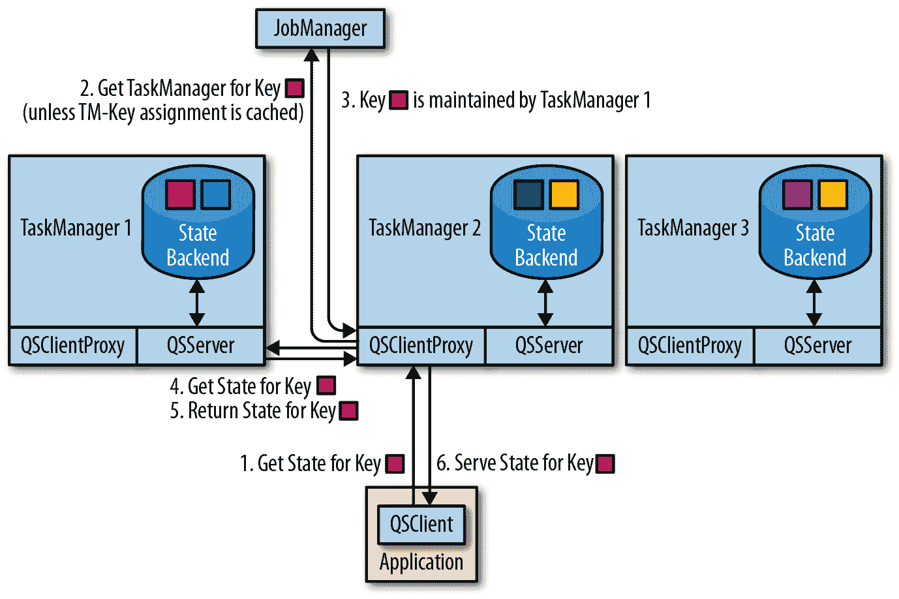

# 第七章：有状态操作符和应用程序

有状态操作符和用户函数是流处理应用程序的常见构建块。事实上，大多数复杂的操作需要记忆记录或部分结果，因为数据是流式传输并随时间到达。¹ Flink 的许多内置 DataStream 操作符、源和接收器都是有状态的，它们缓冲记录或维护部分结果或元数据。例如，窗口操作符收集输入记录以供`ProcessWindowFunction`处理，或者应用`ReduceFunction`后的结果，`ProcessFunction`记忆已安排的计时器，某些接收器函数维护关于事务的状态以提供精确一次性功能。除了内置操作符和提供的源和接收器外，Flink 的 DataStream API 还公开了接口以注册、维护和访问用户定义函数中的状态。

有状态流处理对流处理器的许多方面都有影响，比如故障恢复、内存管理以及流应用程序的维护。第二章和第三章分别讨论了有状态流处理的基础以及 Flink 架构的相关细节。第九章解释了如何设置和配置 Flink 以可靠地处理有状态应用程序。第十章提供了关于如何操作有状态应用程序的指导——如何从应用程序保存点中进行取值和恢复、应用程序的重新缩放以及应用程序升级。

本章重点讨论有状态用户定义函数的实现，并讨论有状态应用的性能和健壮性。具体来说，我们解释了如何在用户定义函数中定义和操作不同类型的状态。我们还讨论了性能方面的问题，以及如何控制函数状态的大小。最后，我们展示了如何将键控状态配置为可查询状态，并如何从外部应用程序访问它。

# 实现有状态函数

在“状态管理”中，我们解释了函数可以具有两种类型的状态，即键控状态和操作符状态。Flink 提供了多个接口来定义有状态函数。在本节中，我们展示了如何实现具有键控状态和操作符状态的函数。

## 在 RuntimeContext 声明键控状态

用户函数可以使用键控状态来存储和访问具有键属性上下文中的状态。对于键属性的每个不同值，Flink 维护一个状态实例。函数的键控状态实例分布在函数操作符的所有并行任务之间。这意味着函数的每个并行实例负责键域的一个子范围，并维护相应的状态实例。因此，键控状态非常类似于分布式键值映射。请参阅“状态管理”获取有关键控状态的更多详细信息。

只有应用于 `KeyedStream` 的函数才能使用键控状态。`KeyedStream` 是通过调用 `DataStream.keyBy()` 方法构建的，该方法在流上定义一个键。`KeyedStream` 根据指定的键进行分区，并记住键的定义。应用于 `KeyedStream` 上的操作符是在其键定义的上下文中应用的。

Flink 提供了多个用于键控状态的原语。状态原语定义了单个键的状态结构。选择正确的状态原语取决于函数与状态的交互方式。选择还会影响函数的性能，因为每个状态后端为这些原语提供了自己的实现。Flink 支持以下状态原语：

+   `ValueState[T]` 持有类型为 `T` 的单个值。可以使用 `ValueState.value()` 读取该值，并使用 `ValueState.update(value: T)` 进行更新。

+   `ListState[T]` 持有类型为 `T` 的元素列表。可以通过调用 `ListState.add(value: T)` 或 `ListState.addAll(values: java.util.List[T])` 将新元素追加到列表中。可以通过调用 `ListState.get()` 来访问状态元素，它返回一个覆盖所有状态元素的 `Iterable[T]`。不可能从 `ListState` 中删除单个元素，但可以通过调用 `ListState.update(values: java.util.List[T])` 来更新列表。调用此方法将用给定的值列表替换现有的值。

+   `MapState[K, V]` 持有键值对的映射。该状态原语提供了许多类似于常规 Java `Map` 的方法，如 `get(key: K)`、`put(key: K, value: V)`、`contains(key: K)`、`remove(key: K)`，以及对包含的条目、键和值进行迭代的方法。

+   `ReducingState[T]` 提供了与 `ListState[T]` 相同的方法（除了 `addAll()` 和 `update()`），但不是将值追加到列表中，而是立即使用 `ReduceFunction` 对值进行聚合。`get()` 返回的迭代器返回一个包含单个条目的 `Iterable`，即被减少的值。

+   `AggregatingState[I, O]` 的行为类似于 `ReducingState`。但它使用更通用的 `AggregateFunction` 来聚合值。`AggregatingState.get()` 计算最终结果并将其作为包含单个元素的 `Iterable` 返回。

所有状态原语都可以通过调用 `State.clear()` 来清除。

示例 7-1 展示了如何在传感器测量流中应用带键 `ValueState` 的 `FlatMapFunction`。该示例应用程序在传感器测量的温度与上次测量相比发生变化超过阈值时，发出警报事件。

##### 示例 7-1\. 使用带键 `ValueState` 的 `FlatMapFunction` 的应用

```
val sensorData: DataStream[SensorReading]  = ???
// partition and key the stream on the sensor ID
val keyedData: KeyedStream[SensorReading, String] = sensorData
  .keyBy(_.id)

// apply a stateful FlatMapFunction on the keyed stream which 
// compares the temperature readings and raises alerts
val alerts: DataStream[(String, Double, Double)] = keyedData
  .flatMap(new TemperatureAlertFunction(1.7))

```

带键状态的函数必须应用于`KeyedStream`。我们需要在应用函数之前在输入流上调用`keyBy()`来指定键。当调用带键输入函数的处理方法时，Flink 的运行时会自动将函数的所有带键状态对象放入由函数调用传递的记录键的上下文中。因此，函数只能访问当前处理的记录所属的状态。

示例 7-2 展示了一个带键的`ValueState`的`FlatMapFunction`的实现，它检查测量温度是否超过配置的阈值变化。

##### 示例 7-2\. 实现带键的`ValueState`的`FlatMapFunction`

```
class TemperatureAlertFunction(val threshold: Double)
    extends RichFlatMapFunction[SensorReading, (String, Double, Double)] {

  // the state handle object
  private var lastTempState: ValueState[Double] = _

  override def open(parameters: Configuration): Unit = {
    // create state descriptor
    val lastTempDescriptor = 
      new ValueStateDescriptorDouble
    // obtain the state handle
    lastTempState = getRuntimeContext.getStateDouble
  }

  override def flatMap(
      reading: SensorReading, 
      out: Collector[(String, Double, Double)]): Unit = {
    // fetch the last temperature from state
    val lastTemp = lastTempState.value()
    // check if we need to emit an alert
    val tempDiff = (reading.temperature - lastTemp).abs
    if (tempDiff > threshold) {
      // temperature changed by more than the threshold
      out.collect((reading.id, reading.temperature, tempDiff))
    }
    // update lastTemp state
    this.lastTempState.update(reading.temperature)
  }
}

```

要创建状态对象，我们必须通过`RuntimeContext`在 Flink 的运行时中注册一个`StateDescriptor`，这是由`RichFunction`公开的（参见“实现函数”讨论`RichFunction`接口）。`StateDescriptor`特定于状态原语，并包括状态的名称和数据类型。对于`ReducingState`和`AggregatingState`，描述符还需要一个`ReduceFunction`或`AggregateFunction`对象来聚合添加的值。状态名称在运算符范围内，因此函数可以通过注册多个状态描述符拥有多个状态对象。状态处理的数据类型被指定为`Class`或`TypeInformation`对象（参见“类型”讨论 Flink 的类型处理）。必须指定数据类型，因为 Flink 需要创建合适的序列化器。另外，还可以显式指定`TypeSerializer`来控制如何将状态写入状态后端、检查点和保存点。²

通常，状态句柄对象在`RichFunction`的`open()`方法中创建。在调用任何处理方法之前调用`open()`，例如在`FlatMapFunction`的情况下调用`flatMap()`。状态句柄对象（在示例 7-2 中的`lastTempState`）是函数类的常规成员变量。

###### 注意

状态句柄对象仅提供对状态的访问，该状态存储在状态后端中并进行维护。句柄本身不持有状态。

当函数注册`StateDescriptor`时，Flink 会检查状态后端是否有函数和给定名称和类型的状态数据。如果状态功能由于故障而重新启动或者从保存点启动应用程序，则可能会发生这种情况。在这两种情况下，Flink 将新注册的状态句柄对象链接到现有状态。如果状态后端不包含给定描述符的状态，则链接到句柄的状态将初始化为空。

Scala DataStream API 提供了语法快捷方式，以单个`ValueState`定义`map`和`flatMap`函数。示例 7-3 展示了如何使用快捷方式实现前面的示例。

##### 示例 7-3\. Scala DataStream API 中的 FlatMap 与键控 ValueState 的快捷方式

```
val alerts: DataStream[(String, Double, Double)] = keyedData
  .flatMapWithState[(String, Double, Double), Double] {
    case (in: SensorReading, None) =>
      // no previous temperature defined; just update the last temperature
      (List.empty, Some(in.temperature))
    case (r: SensorReading, lastTemp: Some[Double]) =>
      // compare temperature difference with threshold
      val tempDiff = (r.temperature - lastTemp.get).abs
      if (tempDiff > 1.7) {
        // threshold exceeded; emit an alert and update the last temperature
        (List((r.id, r.temperature, tempDiff)), Some(r.temperature))
      } else {
        // threshold not exceeded; just update the last temperature
        (List.empty, Some(r.temperature))
      }
  }

```

`flatMapWithState()`方法期望一个接受`Tuple2`的函数。元组的第一个字段保存了传递给`flatMap`的输入记录，第二个字段保存了处理记录的键的检索状态的`Option`。如果状态尚未初始化，`Option`未定义。该函数还返回一个`Tuple2`。第一个字段是`flatMap`结果的列表，第二个字段是状态的新值。

## 使用`ListCheckpointed`接口实现操作符列表状态

操作符状态针对操作符的每个并行实例进行管理。在操作符的同一并行任务中处理的所有事件都可以访问相同的状态。在“状态管理”中，我们讨论了 Flink 支持三种类型的操作符状态：列表状态、列表联合状态和广播状态。

实现函数可以通过实现`ListCheckpointed`接口来处理操作符列表状态。`ListCheckpointed`接口不处理像`ValueState`或`ListState`这样在状态后端注册的状态句柄。相反，函数将操作符状态实现为常规成员变量，并通过`ListCheckpointed`接口的回调函数与状态后端交互。该接口提供两个方法：

```
// returns a snapshot the state of the function as a list
snapshotState(checkpointId: Long, timestamp: Long): java.util.List[T]

// restores the state of the function from the provided list
restoreState(java.util.List[T] state): Unit

```

`snapshotState()`方法在 Flink 触发有状态函数的检查点时被调用。该方法有两个参数，`checkpointId`是检查点的唯一、单调递增标识符，`timestamp`是主节点启动检查点时的墙钟时间。该方法必须返回操作符状态作为可序列化状态对象的列表。

`restoreState()`方法在函数的状态需要初始化时总是被调用——当作业启动时（从保存点或其他），或者在发生故障时。该方法使用状态对象列表被调用，并且必须基于这些对象来恢复操作符的状态。

示例 7-4 展示了如何为函数实现`ListCheckpointed`接口，以计算每个分区中超过阈值的温度测量次数，对于函数的每个并行实例。

##### 示例 7-4\. 具有操作符列表状态的 RichFlatMapFunction

```
class HighTempCounter(val threshold: Double)
    extends RichFlatMapFunction[SensorReading, (Int, Long)]
    with ListCheckpointed[java.lang.Long] {

  // index of the subtask
  private lazy val subtaskIdx = getRuntimeContext
    .getIndexOfThisSubtask
  // local count variable
  private var highTempCnt = 0L

  override def flatMap(
      in: SensorReading, 
      out: Collector[(Int, Long)]): Unit = {
    if (in.temperature > threshold) {
      // increment counter if threshold is exceeded
      highTempCnt += 1
      // emit update with subtask index and counter
      out.collect((subtaskIdx, highTempCnt))
    }
  }

  override def restoreState(
      state: util.List[java.lang.Long]): Unit = {
    highTempCnt = 0
    // restore state by adding all longs of the list
    for (cnt <- state.asScala) {
      highTempCnt += cnt
    }
  }

  override def snapshotState(
      chkpntId: Long, 
      ts: Long): java.util.List[java.lang.Long] = {
    // snapshot state as list with a single count
    java.util.Collections.singletonList(highTempCnt)
  }
}

```

上述示例中的函数计算每个并行实例中超过配置阈值的温度测量次数。该函数使用操作状态，并为每个并行操作符实例具有一个单一的状态变量，该变量通过`ListCheckpointed`接口的方法进行检查点和恢复。请注意，`ListCheckpointed`接口在 Java 中实现，并期望使用`java.util.List`而不是 Scala 本地列表。

查看示例时，您可能会想知道为什么操作状态被处理为状态对象列表。如“Scaling Stateful Operators”中所讨论的那样，列表结构支持具有操作状态的函数的并行度变化。为了增加或减少具有操作状态函数的并行性，需要将操作状态重新分发到较大或较小数量的任务实例。这需要拆分或合并状态对象。由于拆分和合并状态的逻辑对于每个有状态功能都是自定义的，因此无法自动执行任意类型的状态的操作。

通过提供状态对象列表，具有操作状态的函数可以使用`snapshotState()`和`restoreState()`方法实现此逻辑。`snapshotState()`方法将操作状态拆分为多个部分，而`restoreState()`方法将操作状态从可能的多个部分组装起来。当函数的状态被恢复时，状态的各个部分分布在函数的所有并行实例中，并传递给`restoreState()`方法。如果有更多的并行子任务而没有状态对象，则某些子任务将以无状态启动，并且将以空列表调用`restoreState()`方法。

再次查看 Example 7-4 中的`HighTempCounter`函数，我们看到每个操作符的并行实例将其状态显示为具有单个条目的列表。如果增加此操作符的并行度，则一些新的子任务将使用空状态进行初始化，并从零开始计数。为了在重新调整`HighTempCounter`函数时实现更好的状态分布行为，我们可以实现`snapshotState()`方法，使其将其计数分割成多个部分，如 Example 7-5 所示。

##### Example 7-5\. 在重新调整比例期间分割操作列表状态以获得更好的分布

```
override def snapshotState(
    chkpntId: Long, 
    ts: Long): java.util.List[java.lang.Long] = {
  // split count into ten partial counts
  val div = highTempCnt / 10
  val mod = (highTempCnt % 10).toInt
  // return count as ten parts
  (List.fill(mod)(new java.lang.Long(div + 1)) ++
    List.fill(10 - mod)(new java.lang.Long(div))).asJava
}

```

# ListCheckpointed 接口使用 Java 序列化

`ListCheckpointed`接口使用 Java 序列化来序列化和反序列化状态对象列表。如果需要更新应用程序，则可能会遇到问题，因为 Java 序列化不允许迁移或配置自定义序列化程序。如果需要确保函数的操作状态可以演进，请使用`CheckpointedFunction`而不是`ListCheckpointed`接口。

## 使用连接广播状态

在流应用程序中的一个常见需求是将相同信息分发给函数的所有并行实例，并将其作为可恢复状态维护。一个示例是规则流和应用规则的事件流。应用规则的函数会接收两个输入流，即事件流和规则流。它将规则记忆在操作符状态中，以便将其应用于事件流的所有事件。由于函数的每个并行实例必须在其操作符状态中保留所有规则，因此需要广播规则流，以确保每个函数实例接收所有规则。

在 Flink 中，这样的状态称为广播状态。广播状态可以与常规的`DataStream`或`KeyedStream`结合使用。示例 7-6 展示了如何使用广播流动态配置阈值来实现温度警报应用程序。

##### 示例 7-6\. 连接广播流和键控事件流

```
val sensorData: DataStream[SensorReading] = ???
val thresholds: DataStream[ThresholdUpdate] = ???
val keyedSensorData: KeyedStream[SensorReading, String] = sensorData.keyBy(_.id)

// the descriptor of the broadcast state
val broadcastStateDescriptor =
  new MapStateDescriptorString, Double

val broadcastThresholds: BroadcastStream[ThresholdUpdate] = thresholds
  .broadcast(broadcastStateDescriptor)

// connect keyed sensor stream and broadcasted rules stream
val alerts: DataStream[(String, Double, Double)] = keyedSensorData
  .connect(broadcastThresholds)
  .process(new UpdatableTemperatureAlertFunction())

```

在三个步骤中，将具有广播状态的函数应用于两个流：

1.  通过调用`DataStream.broadcast()`并提供一个或多个`MapStateDescriptor`对象来创建`BroadcastStream`。每个描述符定义了稍后应用于`BroadcastStream`的单独广播状态函数。

1.  将`BroadcastStream`与`DataStream`或`KeyedStream`连接。必须将`BroadcastStream`作为`connect()`方法的参数。

1.  在连接的流上应用函数。根据另一个流是否有键，可以应用`KeyedBroadcastProcessFunction`或`BroadcastProcessFunction`。

示例 7-7 展示了支持运行时动态配置传感器阈值的`KeyedBroadcastProcessFunction`的实现。

##### 示例 7-7\. 实现`KeyedBroadcastProcessFunction`

```
class UpdatableTemperatureAlertFunction()
    extends KeyedBroadcastProcessFunction
      [String, SensorReading, ThresholdUpdate, (String, Double, Double)] {

  // the descriptor of the broadcast state
  private lazy val thresholdStateDescriptor =
    new MapStateDescriptorString, Double

  // the keyed state handle
  private var lastTempState: ValueState[Double] = _

  override def open(parameters: Configuration): Unit = {
    // create keyed state descriptor
    val lastTempDescriptor = new ValueStateDescriptorDouble
    // obtain the keyed state handle
    lastTempState = getRuntimeContext.getStateDouble
  }

  override def processBroadcastElement(
      update: ThresholdUpdate,
      ctx: KeyedBroadcastProcessFunction
        [String, SensorReading, ThresholdUpdate, (String, Double, Double)]#Context,
      out: Collector[(String, Double, Double)]): Unit = {
    // get broadcasted state handle
    val thresholds = ctx.getBroadcastState(thresholdStateDescriptor)

    if (update.threshold != 0.0d) {
      // configure a new threshold for the sensor
      thresholds.put(update.id, update.threshold)
    } else {
      // remove threshold for the sensor
      thresholds.remove(update.id)
    }
  }

  override def processElement(
      reading: SensorReading,
      readOnlyCtx: KeyedBroadcastProcessFunction
        [String, SensorReading, ThresholdUpdate, 
        (String, Double, Double)]#ReadOnlyContext,
      out: Collector[(String, Double, Double)]): Unit = {
    // get read-only broadcast state
    val thresholds = readOnlyCtx.getBroadcastState(thresholdStateDescriptor)
    // check if we have a threshold
    if (thresholds.contains(reading.id)) {
      // get threshold for sensor
      val sensorThreshold: Double = thresholds.get(reading.id)

      // fetch the last temperature from state
      val lastTemp = lastTempState.value()
      // check if we need to emit an alert
      val tempDiff = (reading.temperature - lastTemp).abs
      if (tempDiff > sensorThreshold) {
        // temperature increased by more than the threshold
        out.collect((reading.id, reading.temperature, tempDiff))
      }
    }

    // update lastTemp state
    this.lastTempState.update(reading.temperature)
  }
}

```

`BroadcastProcessFunction`和`KeyedBroadcastProcessFunction`与常规的`CoProcessFunction`不同，因为元素处理方法不对称。这些方法，`processElement()`和`processBroadcastElement()`，会使用不同的上下文对象调用。两个上下文对象都提供一个方法`getBroadcastState(MapStateDescriptor)`，用于访问广播状态句柄。然而，在`processElement()`方法中返回的广播状态句柄只能进行只读访问。这是一种安全机制，用于确保广播状态在所有并行实例中保存相同的信息。此外，这两个上下文对象还提供访问事件时间戳、当前水位线、当前处理时间和类似于其他处理函数的侧输出。

###### 注意

`BroadcastProcessFunction` 和 `KeyedBroadcastProcessFunction` 也有所不同。`BroadcastProcessFunction` 不提供定时器服务用于注册定时器，因此不提供 `onTimer()` 方法。请注意，不应从 `KeyedBroadcastProcessFunction` 的 `processBroadcastElement()` 方法中访问键控状态。由于广播输入未指定键，状态后端无法访问键控值，并将抛出异常。相反，`KeyedBroadcastProcessFunction.processBroadcastElement()` 方法的上下文提供了一个方法 `applyToKeyedState(StateDescriptor, KeyedStateFunction)`，用于将 `KeyedStateFunction` 应用到由 `StateDescriptor` 引用的键控状态的每个键的值上。

# 广播事件可能不会按确定性顺序到达

发送到广播状态操作符的不同并行任务的广播事件到达顺序可能会有所不同，如果发出广播消息的操作符的并行度大于 1。

因此，您应该确保广播状态的值不依赖于接收广播消息的顺序，或者确保广播操作符的并行度设置为 1。

## 使用 `CheckpointedFunction` 接口

`CheckpointedFunction` 接口是指定有状态函数的最低级别接口。它提供了注册和维护键控状态和操作状态的钩子，并且是唯一一个能访问操作符列表联合状态的接口——在恢复或保存点重启时，操作状态完全复制。³

`CheckpointedFunction` 接口定义了两个方法，`initializeState()` 和 `snapshotState()`，它们与操作符列表状态的 `ListCheckpointed` 接口的方法类似。当创建 `CheckpointedFunction` 的并行实例时调用 `initializeState()` 方法。这发生在应用程序启动时或由于故障而重新启动任务时。该方法调用时会传入一个 `FunctionInitializationContext` 对象，该对象提供对 `OperatorStateStore` 和 `KeyedStateStore` 对象的访问。状态存储负责在 Flink 运行时注册函数状态并返回状态对象，例如 `ValueState`、`ListState` 或 `BroadcastState`。每个状态都使用必须对该函数唯一的名称进行注册。当函数注册状态时，状态存储尝试通过检查状态后端是否持有以给定名称注册的函数状态来初始化状态。如果任务由于故障或从保存点重新启动，则将从保存的数据初始化状态。如果应用程序不是从检查点或保存点启动的，则状态将最初为空。

`snapshotState()` 方法在进行检查点之前立即被调用，并接收一个 `FunctionSnapshotContext` 对象作为参数。`FunctionSnapshotContext` 提供了检查点的唯一标识符和 JobManager 启动检查点时的时间戳。`snapshotState()` 方法的目的是确保所有状态对象在执行检查点之前都已更新。此外，结合 `CheckpointListener` 接口，`snapshotState()` 方法可以通过与 Flink 的检查点同步来一致地将数据写入外部数据存储。

示例 7-8 展示了如何使用 `CheckpointedFunction` 接口创建一个函数，该函数具有按键和操作状态进行计数的功能，统计超过指定阈值的传感器读数。

##### 示例 7-8\. 实现 CheckpointedFunction 接口的函数

```
class HighTempCounter(val threshold: Double)
    extends FlatMapFunction[SensorReading, (String, Long, Long)]
    with CheckpointedFunction {

  // local variable for the operator high temperature cnt
  var opHighTempCnt: Long = 0
  var keyedCntState: ValueState[Long] = _
  var opCntState: ListState[Long] = _

  override def flatMap(
      v: SensorReading, 
      out: Collector[(String, Long, Long)]): Unit = {
    // check if temperature is high
    if (v.temperature > threshold) {
      // update local operator high temp counter
      opHighTempCnt += 1
      // update keyed high temp counter
      val keyHighTempCnt = keyedCntState.value() + 1
      keyedCntState.update(keyHighTempCnt)
      // emit new counters
      out.collect((v.id, keyHighTempCnt, opHighTempCnt))
    }
  }

  override def initializeState(initContext: FunctionInitializationContext): Unit = {
    // initialize keyed state
    val keyCntDescriptor = new ValueStateDescriptorLong
    keyedCntState = initContext.getKeyedStateStore.getState(keyCntDescriptor)
    // initialize operator state
    val opCntDescriptor = new ListStateDescriptorLong
    opCntState = initContext.getOperatorStateStore.getListState(opCntDescriptor)
    // initialize local variable with state
    opHighTempCnt = opCntState.get().asScala.sum
  }

  override def snapshotState(
      snapshotContext: FunctionSnapshotContext): Unit = {
    // update operator state with local state
    opCntState.clear()
    opCntState.add(opHighTempCnt)
  }
}

```

## 关于完成检查点的通知

频繁同步是分布式系统性能限制的主要原因。Flink 的设计旨在减少同步点。检查点基于随数据流动的屏障实现，因此避免了跨应用程序的全局同步。

由于其检查点机制，Flink 可以实现非常好的性能。然而，另一个影响是应用的状态除了在进行检查点时的逻辑时间点外，永远不处于一致状态。对于某些操作符来说，了解检查点是否完成可能非常重要。例如，那些希望通过精确一次语义保证将数据写入外部系统的汇聚函数必须仅发出在成功检查点之前接收到的记录，以确保在发生故障时不会重新计算接收到的数据。

如 “检查点、保存点和状态恢复” 中所讨论的，只有当所有操作符任务成功将它们的状态检查点到检查点存储时，检查点才算成功。因此，只有 JobManager 能够确定检查点是否成功。需要接收关于完成检查点的通知的操作符可以实现 `CheckpointListener` 接口。该接口提供了 `notifyCheckpointComplete(long chkpntId)` 方法，在 JobManager 注册检查点完成时可能会被调用——当所有操作符成功将其状态复制到远程存储时。

###### 注意

注意，Flink 不保证每个完成的检查点都会调用 `notifyCheckpointComplete()` 方法。可能会有任务错过通知。在实现接口时需要考虑这一点。

# 为状态化应用程序启用故障恢复

流式应用程序应该持续运行，并且必须从故障中恢复，例如机器或进程失败。大多数流式应用程序要求故障不影响计算结果的正确性。

在 “检查点、保存点和状态恢复” 中，我们解释了 Flink 创建有状态应用程序一致检查点的机制，即在所有操作者处理所有事件达到应用程序输入流中特定位置的时间点上，所有内置和用户定义的有状态函数的状态快照。为了为应用程序提供容错能力，JobManager 在定期间隔内启动检查点。

应用程序需要通过 `StreamExecutionEnvironment` 明确启用周期性检查点机制，如 示例 7-9 所示。

##### 示例 7-9\. 为应用程序启用检查点

```
val env = StreamExecutionEnvironment.getExecutionEnvironment

// set checkpointing interval to 10 seconds (10000 milliseconds)
env.enableCheckpointing(10000L)

```

检查点间隔是一个重要的参数，影响检查点机制在常规处理期间的开销和从故障中恢复所需的时间。较短的检查点间隔会导致常规处理期间的开销增加，但可以实现更快的恢复，因为需要重新处理的数据量较少。

Flink 提供了更多调整参数来配置检查点行为，如一致性保证选择（精确一次或至少一次）、并发检查点数量以及取消长时间运行检查点的超时时间，以及几个特定于状态后端的选项。我们在 “调整检查点和恢复” 中详细讨论了这些选项。

# 确保有状态应用程序的可维护性

应用程序运行数周后的状态可能难以重新计算，甚至是不可能的。同时，长时间运行的应用程序需要维护。需要修复错误，调整功能，添加或移除功能，或者调整操作者的并行度以适应更高或更低的数据速率。因此，重要的是应用程序状态能够迁移到应用程序的新版本，或者重新分配给更多或更少的操作者任务。

Flink 提供了保存点（savepoints）来维护应用程序及其状态。然而，它要求应用程序初始版本的所有有状态操作符指定两个参数，以确保将来可以正确维护应用程序。这些参数是唯一的操作符标识符和最大并行度（对具有键控状态的操作符而言）。以下是如何设置这些参数的描述。

# 操作符唯一标识符和最大并行度已嵌入保存点中

操作符的唯一标识符和最大并行度嵌入到保存点中，不能更改。如果操作符的标识符或最大并行度已更改，则无法从先前获取的保存点启动应用程序。

一旦更改运算符标识符或最大并行度，就无法从保存点启动应用程序，而必须从头开始，没有任何状态初始化。

## 指定唯一运算符标识符

每个应用程序的运算符都应指定唯一标识符。标识符作为运算符的实际状态数据与元数据一同写入保存点。从保存点启动应用程序时，这些标识符用于将保存点中的状态映射到启动的应用程序的相应运算符。只有它们的标识符相同，保存点状态才能还原到启动应用程序的运算符。

如果您没有显式为状态应用程序的运算符设置唯一标识符，那么当您必须演变应用程序时，您将面临显著的限制。我们在“保存点”中更详细地讨论了唯一运算符标识符的重要性以及保存点状态的映射。

我们强烈建议为应用的每个运算符分配唯一的标识符。您可以使用`uid()`方法设置标识符，如示例 7-10 所示。

##### 示例 7-10\. 为运算符设置唯一标识符

```
val alerts: DataStream[(String, Double, Double)] = keyedSensorData
  .flatMap(new TemperatureAlertFunction(1.1))  
  .uid("TempAlert")

```

## 定义键控状态运算符的最大并行度

运算符的最大并行度参数定义了运算符键控状态分割为的键组数。键组的数量限制了可以扩展键控状态的最大并行任务数。“扩展有状态运算符”讨论了键组以及如何扩展和缩减键控状态。可以通过`StreamExecutionEnvironment`为应用程序的所有运算符设置最大并行度，或者使用`setMaxParallelism()`方法为每个运算符单独设置，如示例 7-11 所示。

##### 示例 7-11\. 设置运算符的最大并行度

```
val env = StreamExecutionEnvironment.getExecutionEnvironment

// set the maximum parallelism for this application
env.setMaxParallelism(512)

val alerts: DataStream[(String, Double, Double)] = keyedSensorData
  .flatMap(new TemperatureAlertFunction(1.1))
  // set the maximum parallelism for this operator and
  // override the application-wide value
  .setMaxParallelism(1024)

```

运算符的默认最大并行度取决于应用程序第一个版本中的运算符并行度：

+   如果并行度小于或等于 128，则最大并行度为 128。

+   如果运算符的并行度大于 128，则最大并行度计算为`nextPowerOfTwo(parallelism + (parallelism / 2))`和`2¹⁵`中的最小值。

# 状态应用的性能和健壮性

运算符与状态交互的方式对应用程序的健壮性和性能有影响。有几个方面会影响应用程序的行为，例如本地维护状态和执行检查点的状态后端的选择、检查点算法的配置以及应用程序状态的大小。在本节中，我们讨论需要考虑的方面，以确保长时间运行的应用程序具有健壮的执行行为和一致的性能。

## 选择状态后端

在“状态后端”中，我们解释了 Flink 如何在状态后端中维护应用程序状态。状态后端负责存储每个任务实例的本地状态，并在检查点被触发时将其持久化到远程存储中。由于本地状态可以以不同的方式进行维护和检查点，因此状态后端是可插拔的——两个应用程序可以使用不同的状态后端实现来维护它们的状态。选择状态后端会影响状态应用程序的稳健性和性能。每种状态后端都提供了不同状态原语的实现，例如`ValueState`、`ListState`和`MapState`。

目前，Flink 提供三种状态后端，分别是`MemoryStateBackend`、`FsStateBackend`和`RocksDBStateBackend`：

+   `MemoryStateBackend`将状态存储为任务管理器 JVM 进程堆上的常规对象。例如，`MapState`由 Java 的`HashMap`对象支持。尽管这种方法提供了非常低的读写状态延迟，但它对应用程序的稳健性有影响。如果任务实例的状态增长过大，JVM 和其上运行的所有任务实例可能会因为`OutOfMemoryError`而被终止。此外，这种方法可能由于在堆上放置了许多长期存在的对象而受到垃圾回收暂停的影响。在触发检查点时，`MemoryStateBackend`将状态发送到作业管理器，后者将其存储在其堆内存中。因此，应用程序的总状态必须适合于作业管理器的内存。由于其内存是易失性的，作业管理器故障时状态会丢失。由于这些限制，`MemoryStateBackend`仅建议用于开发和调试目的。

+   `FsStateBackend`将本地状态存储在任务管理器的 JVM 堆上，类似于`MemoryStateBackend`。但是，与将状态检查点写入作业管理器的易失性内存不同，`FsStateBackend`将状态写入远程持久化文件系统。因此，`FsStateBackend`在本地访问时提供内存中的速度，并在故障时提供容错性。然而，它受到任务管理器内存大小的限制，并可能因垃圾回收暂停而受到影响。

+   `RocksDBStateBackend`将所有状态存储到本地的 RocksDB 实例中。RocksDB 是一个嵌入式键值存储，将数据持久化到本地磁盘。为了从 RocksDB 读取和写入数据，需要进行序列化/反序列化。`RocksDBStateBackend`还将状态检查点写入到远程和持久的文件系统中。由于它将数据写入磁盘并支持增量检查点（更多信息请参见“检查点、保存点和状态恢复”），`RocksDBStateBackend`是处理非常大状态的应用程序的良好选择。用户报告称，具有多个 TB 状态大小的应用程序可以利用`RocksDBStateBackend`。然而，将数据读取和写入磁盘以及序列化/反序列化对象的开销会导致读取和写入性能较维护堆上状态时更低。

由于`StateBackend`是一个公共接口，也可以实现自定义状态后端。示例 7-12（见#code_rocksdb-config）展示了如何为应用程序及其所有状态功能配置状态后端（此处为`RocksDBStateBackend`）。

##### 示例 7-12\. 配置应用程序的`RocksDBStateBackend`

```
val env = StreamExecutionEnvironment.getExecutionEnvironment

val checkpointPath: String = ???
// configure path for checkpoints on the remote filesystem
val backend = new RocksDBStateBackend(checkpointPath)

// configure the state backend
env.setStateBackend(backend)

```

我们在“调优检查点和恢复”中讨论了如何在应用程序中使用和配置状态后端。

## 选择状态原语

状态操作符（内置或用户定义）的性能取决于多个方面，包括状态的数据类型、应用程序的状态后端和选择的状态原语。

对于像`RocksDBStateBackend`这样在读取或写入时对状态对象进行序列化/反序列化的状态后端，如`ValueState`、`ListState`或`MapState`的选择会对应用程序的性能产生重大影响。例如，当访问`ValueState`时，它会完全反序列化，更新时再序列化。`RocksDBStateBackend`的`ListState`实现在构建`Iterable`以读取值之前会反序列化所有列表条目。然而，向`ListState`添加单个值（追加到列表末尾）是一个廉价的操作，因为只有追加的值会被序列化。`RocksDBStateBackend`的`MapState`允许按键读取和写入值，只有读取或写入的键和值会进行序列化/反序列化。在迭代`MapState`的条目集时，序列化条目会从 RocksDB 预取，并且只有在实际访问键或值时才会反序列化。

例如，对于`RocksDBStateBackend`，使用`MapState[X, Y]`而不是`ValueState[HashMap[X, Y]]`效率更高。如果经常向列表追加元素并且不经常访问列表的元素，则`ListState[X]`比`ValueState[List[X]]`更有优势。

另一个良好的实践是每个函数调用仅更新状态一次。由于检查点与函数调用同步，多次状态更新不会带来任何好处，但在单个函数调用中多次更新状态可能会导致额外的序列化开销。

## 防止状态泄漏

流应用通常设计成连续运行数月甚至数年。如果应用状态持续增长，最终会变得过大并导致应用崩溃，除非采取措施将应用扩展到更多资源。为了防止应用的资源消耗随时间增长，控制操作状态的大小至关重要。由于状态处理直接影响操作符的语义，Flink 不能自动清理状态和释放存储空间。因此，所有有状态的操作符必须控制其状态的大小，并确保其不会无限增长。

状态增长的一个常见原因是在不断变化的键域上的键控状态。在这种情况下，有状态函数接收具有仅在一定时间段内活动且之后永不再接收的键的记录。典型示例是具有会话 ID 属性的点击事件流，该属性在一段时间后过期。在这种情况下，具有键控状态的函数将积累越来越多的键的状态。随着键空间的变化，过期键的状态变得陈旧且无用。解决此问题的方法是删除过期键的状态。然而，只有当函数收到具有该键的记录时，具有键控状态的函数才能访问该键的状态。在许多情况下，函数不知道记录是否是键的最后一个。因此，它将无法驱逐该键的状态，因为它可能会接收到键的另一条记录。

这个问题不仅存在于自定义有状态函数中，也存在于 DataStream API 的一些内置操作符中。例如，在`KeyedStream`上计算运行聚合，无论是使用内置的聚合函数如`min`、`max`、`sum`、`minBy`，或者使用自定义的`ReduceFunction`或`AggregateFunction`，都会保留每个键的状态并且不会清除它。因此，只有在键值来自于常量且有界的域时，才应使用这些函数。另一个例子是基于计数触发器的窗口，它们在接收到一定数量的记录时会处理和清理它们的状态。基于时间触发器的窗口（处理时间和事件时间）不受此影响，因为它们基于时间触发并清除它们的状态。

这意味着在设计和实现有状态操作符时，应考虑应用程序需求和其输入数据的属性，例如键域。如果应用程序需要用于移动键域的键控状态，则应确保在不再需要时清除键的状态。可以通过为将来的某个时间点注册定时器来实现这一点。⁴ 与状态类似，定时器也是在当前活动键的上下文中注册的。当定时器触发时，会调用回调方法并加载定时器键的上下文。因此，回调方法可以完全访问键的状态并清除它。支持注册定时器的函数包括窗口的`Trigger`接口和过程函数。两者均在第六章中有详细介绍。

示例 7-13 展示了一个`KeyedProcessFunction`，它比较连续两次的温度测量，并在差异大于一定阈值时触发警报。这与之前的键控状态示例相同，但`KeyedProcessFunction`还清除了一个小时内未提供任何新温度测量的键（即传感器）的状态。

##### 示例 7-13\. 清除其状态的有状态`KeyedProcessFunction`

```
class SelfCleaningTemperatureAlertFunction(val threshold: Double)
    extends KeyedProcessFunction[String, SensorReading, (String, Double, Double)] {

  // the keyed state handle for the last temperature
  private var lastTempState: ValueState[Double] = _
  // the keyed state handle for the last registered timer
  private var lastTimerState: ValueState[Long] = _

  override def open(parameters: Configuration): Unit = {
    // register state for last temperature
    val lastTempDesc = new ValueStateDescriptorDouble
    lastTempState = getRuntimeContext.getStateDouble
    // register state for last timer
    val lastTimerDesc = new ValueStateDescriptorLong
    lastTimerState = getRuntimeContext.getState(timestampDescriptor)
  }

  override def processElement(
      reading: SensorReading,
      ctx: KeyedProcessFunction
        [String, SensorReading, (String, Double, Double)]#Context,
      out: Collector[(String, Double, Double)]): Unit = {

    // compute timestamp of new clean up timer as record timestamp + one hour
    val newTimer = ctx.timestamp() + (3600 * 1000)
    // get timestamp of current timer
    val curTimer = lastTimerState.value()
    // delete previous timer and register new timer
    ctx.timerService().deleteEventTimeTimer(curTimer)
    ctx.timerService().registerEventTimeTimer(newTimer)
    // update timer timestamp state
    lastTimerState.update(newTimer)

    // fetch the last temperature from state
    val lastTemp = lastTempState.value()
    // check if we need to emit an alert
    val tempDiff = (reading.temperature - lastTemp).abs
    if (tempDiff > threshold) {
      // temperature increased by more than the threshold
      out.collect((reading.id, reading.temperature, tempDiff))
    }

    // update lastTemp state
    this.lastTempState.update(reading.temperature)
  }

  override def onTimer(
      timestamp: Long,
      ctx: KeyedProcessFunction
        [String, SensorReading, (String, Double, Double)]#OnTimerContext,
      out: Collector[(String, Double, Double)]): Unit = {

    // clear all state for the key
    lastTempState.clear()
    lastTimerState.clear()
  }
}

```

上述`KeyedProcessFunction`实现的状态清理机制工作如下。对于每个输入事件，都会调用`processElement()`方法。在比较温度测量值并更新最后一个温度之前，该方法通过删除先前的定时器并注册一个新的定时器来更新清理定时器。清理时间通过将当前记录的时间戳加一小时来计算。为了能够删除当前注册的定时器，其时间戳存储在额外的`ValueState[Long]`中，称为`lastTimerState`。之后，该方法比较温度，可能触发警报，并更新其状态。

由于我们的`KeyedProcessFunction`始终通过删除当前定时器并注册新定时器来更新注册的定时器，因此每个键只注册一个定时器。一旦定时器触发，将调用`onTimer()`方法。该方法清除与键相关联的所有状态，最后一个温度和最后一个定时器状态。

# 演进的有状态应用程序

经常需要修复错误或演变长时间运行的有状态流应用程序的业务逻辑。因此，通常需要将运行中的应用程序替换为更新版本，通常不会丢失应用程序的状态。

Flink 通过对运行中的应用程序进行保存点、停止它并从保存点启动应用程序的新版本来支持此类更新。⁵然而，只有在特定应用程序更改情况下，原始应用程序及其新版本需要保存点兼容性才能同时更新应用程序并保留其状态。接下来，我们将解释如何在保留保存点兼容性的同时演进应用程序。

在“保存点”中，我们解释了保存点中每个状态都可以通过由唯一操作符标识符和状态描述符声明的状态名称组成的复合标识符来访问。

# 设计应用程序时要考虑演进

重要的是要理解，应用程序的初始设计决定了以后如何以保存点兼容的方式进行修改。如果原始版本没有考虑更新，许多更改将是不可能的。为操作符分配唯一标识符对大多数应用程序更改是强制性的。

当从保存点启动应用程序时，启动的应用程序的操作符将通过使用操作符标识符和状态名称从保存点查找相应状态来初始化。从保存点兼容性的角度来看，这意味着应用程序可以通过以下三种方式进行演进：

1.  更新或扩展应用程序的逻辑，而不更改或删除现有状态。这包括向应用程序添加有状态或无状态操作符。

1.  从应用程序中删除一个状态。

1.  通过更改现有操作符的状态原语或状态数据类型来修改现有操作符的状态。

在接下来的几节中，我们将讨论这三种情况。

## 更新应用程序而不修改现有状态

如果应用程序在不删除或更改现有状态的情况下进行更新，则始终符合保存点兼容性，并且可以从早期版本的保存点启动。

如果向应用程序添加新的有状态操作符或向现有操作符添加新状态，则在从保存点启动应用程序时状态将初始化为空。

# 更改内置有状态操作符的输入数据类型

请注意，更改内置有状态操作符（如窗口聚合、基于时间的连接或异步函数的输入数据类型）通常会修改其内部状态的类型。因此，即使这些变化看起来不显眼，这些变化也不符合保存点兼容性。

## 从应用程序中删除状态

而不是向应用程序添加新状态，您可能还想通过删除状态来调整应用程序——可以通过删除完整的有状态运算符或仅从函数中删除状态。当新版本的应用程序从先前版本的保存点启动时，保存点包含无法映射到重新启动的应用程序的状态。如果运算符的唯一标识符或状态的名称已更改，情况也是如此。

默认情况下，为了避免丢失保存点中的状态，Flink 不会启动未恢复所有保存点中包含的状态的应用程序。但可以按照 “运行和管理流应用程序” 中描述的方式禁用此安全检查。因此，通过删除现有运算符的有状态运算符或状态，更新应用程序并不困难。

## 修改运算符的状态

虽然在应用程序中添加或删除状态相对简单且不影响保存点的兼容性，但修改现有运算符的状态则更为复杂。有两种方式可以修改状态：

+   通过更改状态的数据类型，例如将`ValueState[Int]`更改为`ValueState[Double]`

+   通过更改状态原语的类型，例如将`ValueState[List[String]]`更改为`ListState[String]`

在一些特定情况下，可以更改状态的数据类型。然而，目前 Flink 并不支持更改状态的原语（或结构）。有一些想法支持通过提供离线工具来转换保存点的情况。然而，截至 Flink 1.7，还没有这样的工具。以下我们重点讨论更改状态数据类型的问题。

为了理解修改状态数据类型的问题，我们必须了解保存点中状态数据的表示方式。保存点主要由序列化的状态数据组成。将状态 JVM 对象转换为字节的序列化程序由 Flink 的类型系统生成和配置。此转换基于状态的数据类型。例如，如果您有一个`ValueState[String]`，Flink 的类型系统会生成一个`StringSerializer`来将`String`对象转换为字节。序列化程序还用于将原始字节转换回 JVM 对象。根据状态后端存储数据是序列化的（如`RocksDBStateBackend`）还是作为堆上的对象（如`FSStateBackend`），当函数读取状态或应用程序从保存点重新启动时进行此转换。

由于 Flink 的类型系统根据状态的数据类型生成序列化器，当状态的数据类型发生变化时，序列化器可能会发生变化。例如，如果将`ValueState[String]`更改为`ValueState[Double]`，Flink 将创建一个`DoubleSerializer`来访问该状态。令人惊讶的是，使用`DoubleSerializer`来反序列化由`StringSerializer`序列化的二进制数据将失败。因此，在非常特定的情况下才支持更改状态的数据类型。

在 Flink 1.7 中，如果状态的数据类型被定义为 Apache Avro 类型，并且新数据类型也是根据 Avro 模式演化规则从原始类型演化而来的 Avro 类型，则支持更改状态的数据类型。Flink 的类型系统将自动生成能够读取先前数据类型版本的序列化器。

在 Flink 社区中，状态演进和迁移是一个重要的话题，得到了很多关注。您可以期待在 Apache Flink 未来版本中对这些场景的改进支持。尽管有这些努力，我们建议在将应用程序投入生产之前始终仔细检查是否可以按计划演进应用程序。

# 可查询状态

许多流处理应用程序需要与其他应用程序共享其结果。常见模式是将结果写入数据库或键值存储，并让其他应用程序从该数据存储中检索结果。这样的架构意味着需要设置和维护一个单独的系统，尤其是如果这需要是一个分布式系统的话，那么工作量可能会很大。

Apache Flink 提供了可查询状态功能，以解决通常需要外部数据存储来共享数据的用例。在 Flink 中，任何键控状态都可以作为可查询状态暴露给外部应用程序，并充当只读键值存储。状态流式处理应用程序像往常一样处理事件，并将其中间或最终结果存储和更新到可查询状态中。外部应用程序可以在流式应用程序运行时请求键的状态。

###### 注意

请注意，仅支持关键点查询。不可能请求键范围或运行更复杂的查询。

可查询状态并不解决所有需要外部数据存储的用例。例如，可查询状态只在应用程序运行时可访问。在应用程序由于错误而重新启动、重新调整应用程序或将其迁移到另一个集群时，不可访问。然而，它使许多应用程序更容易实现，例如实时仪表盘或其他监控应用程序。

在接下来的内容中，我们将讨论 Flink 的可查询状态服务的架构，并解释流处理应用程序如何暴露可查询状态以及外部应用程序如何查询它。

## 架构和启用可查询状态

Flink 的可查询状态服务由三个进程组成：

+   `QueryableStateClient`由外部应用程序用于提交查询并检索结果。

+   `QueryableStateClientProxy`接受并提供客户端请求的服务。每个 TaskManager 运行一个客户端代理。由于键控状态分布在运算符的所有并行实例之间，代理需要识别维护所请求键的状态的 TaskManager。此信息从管理键组分配的 JobManager 请求，并且一旦收到，会被缓存。⁶ 客户端代理从相应 TaskManager 的状态服务器检索状态并将结果提供给客户端。

+   `QueryableStateServer`为客户端代理提供服务请求。每个 TaskManager 运行一个状态服务器，该服务器从本地状态后端获取查询键的状态并将其返回给请求的客户端代理。

图 7-1 展示了可查询状态服务的架构。



###### 图 7-1\. Flink 可查询状态服务的架构

要在 Flink 设置中启用可查询状态服务——启动 TaskManager 内的客户端代理和服务器线程，您需要将*flink-queryable-state-runtime* JAR 文件添加到 TaskManager 进程的类路径中。这可以通过从安装的*./opt*文件夹复制到*./lib*文件夹来完成。当 JAR 文件位于类路径中时，可查询状态线程会自动启动，并且可以为可查询状态客户端提供服务。正确配置后，您将在 TaskManager 日志中找到以下日志消息：

```
Started the Queryable State Proxy Server @ …

```

客户端代理和服务器使用的端口及其他参数可以在*./conf/flink-conf.yaml*文件中配置。

## 暴露可查询状态

实现具有可查询状态的流应用程序很简单。您只需定义具有键控状态的函数，并在获取状态句柄之前调用`StateDescriptor`上的`setQueryable(String)`方法使状态可查询。示例 7-14 展示了如何使`lastTempState`可查询，以说明键控状态的用法。

##### 示例 7-14\. 配置可查询的键控状态

```
 override def open(parameters: Configuration): Unit = {

   // create state descriptor
   val lastTempDescriptor = 
     new ValueStateDescriptorDouble
   // enable queryable state and set its external identifier
   lastTempDescriptor.setQueryable("lastTemperature")
   // obtain the state handle
   lastTempState = getRuntimeContext
     .getStateDouble
}

```

通过`setQueryable()`方法传递的外部标识符可以自由选择，并且仅用于配置可查询状态客户端。

除了启用对任何类型键控状态的查询的通用方式外，Flink 还提供了定义流接收器的快捷方式，用于在可查询状态中存储流的事件。示例 7-15 展示了如何使用可查询状态接收器。

##### 示例 7-15\. 将 DataStream 写入可查询状态接收器

```
val tenSecsMaxTemps: DataStream[(String, Double)] = sensorData
  // project to sensor id and temperature
  .map(r => (r.id, r.temperature))
  // compute every 10 seconds the max temperature per sensor
  .keyBy(_._1)
  .timeWindow(Time.seconds(10))
  .max(1)

// store max temperature of the last 10 secs for each sensor 
// in a queryable state
tenSecsMaxTemps
  // key by sensor id
  .keyBy(_._1)
  .asQueryableState("maxTemperature")

```

`asQueryableState()`方法向流添加一个可查询状态的接收端。可查询状态的类型是`ValueState`，它保存输入流的类型的值——我们的示例`(String, Double)`。对于每个接收到的记录，可查询状态接收端将记录插入`ValueState`，以便每个键的最新事件始终被存储。

一个具有可查询状态功能的应用程序执行起来就像任何其他应用程序一样。您只需要确保任务管理器配置为启动其可查询状态服务，就像前面的部分讨论的那样。

## 从外部应用程序查询状态

任何基于 JVM 的应用程序都可以通过使用`QueryableStateClient`查询运行中 Flink 应用程序的可查询状态。这个类由`flink-queryable-state-client-java`依赖提供，您可以按以下方式将其添加到项目中：

```
<dependency>
  <groupid>org.apache.flink</groupid>
  <artifactid>flink-queryable-state-client-java_2.12</artifactid>
  <version>1.7.1</version>
</dependency>

```

`QueryableStateClient`使用任何 TaskManager 的主机名和可查询状态客户端代理侦听的端口进行初始化。默认情况下，客户端代理侦听端口为 9067，但端口可以在 *./conf/flink-conf.yaml* 文件中配置：

```
val client: QueryableStateClient = 
  new QueryableStateClient(tmHostname, proxyPort)

```

一旦获得状态客户端，您可以通过调用`getKvState()`方法查询应用程序的状态。该方法接受多个参数，如运行应用程序的`JobID`、状态标识符、应该获取状态的键、键的`TypeInformation`和查询状态的`StateDescriptor`。`JobID`可以通过 REST API、Web UI 或日志文件获取。`getKvState()`方法返回一个`CompletableFuture[S]`，其中`S`是状态的类型（例如，`ValueState[_]`或`MapState[_, _]`）。因此，客户端可以发送多个异步查询并等待它们的结果。示例 7-16 展示了一个简单的控制台仪表盘，查询在前一节中显示的应用程序的可查询状态。

##### 示例 7-16\. 一个简单的仪表盘应用程序，查询一个 Flink 应用程序的状态

```
object TemperatureDashboard {

  // assume local setup and TM runs on same machine as client
  val proxyHost = "127.0.0.1"
  val proxyPort = 9069

  // jobId of running QueryableStateJob
  // can be looked up in logs of running job or the web UI
  val jobId = "d2447b1a5e0d952c372064c886d2220a"

  // how many sensors to query
  val numSensors = 5
  // how often to query the state
  val refreshInterval = 10000

  def main(args: Array[String]): Unit = {
    // configure client with host and port of queryable state proxy
    val client = new QueryableStateClient(proxyHost, proxyPort)

    val futures = new Array[
      CompletableFuture[ValueState[(String, Double)]]](numSensors)
    val results = new ArrayDouble

    // print header line of dashboard table
    val header = 
      (for (i <- 0 until numSensors) yield "sensor_" + (i + 1))
        .mkString("\t| ")
    println(header)

    // loop forever
    while (true) {
      // send out async queries
      for (i <- 0 until numSensors) {
        futures(i) = queryState("sensor_" + (i + 1), client)
      }
      // wait for results
      for (i <- 0 until numSensors) {
        results(i) = futures(i).get().value()._2
      }
      // print result
      val line = results.map(t => f"$t%1.3f").mkString("\t| ")
      println(line)

      // wait to send out next queries
      Thread.sleep(refreshInterval)
    }
    client.shutdownAndWait()
  }

  def queryState(
      key: String,
      client: QueryableStateClient)
    : CompletableFuture[ValueState[(String, Double)]] = {

    client
      .getKvState[String, ValueState[(String, Double)], (String, Double)](
        JobID.fromHexString(jobId),
        "maxTemperature",
        key,
        Types.STRING,
        new ValueStateDescriptor(String, Double)]))
  }
}

```

要运行该示例，您必须首先启动带有可查询状态的流应用程序。一旦它运行起来，在日志文件或 Web UI 中查找`JobID`；将`JobID`设置在仪表板的代码中并运行它。然后，仪表板将开始查询运行中流应用程序的状态。

# 摘要

几乎每个非平凡的流式应用程序都是有状态的。DataStream API 提供了强大而易于使用的工具来访问和维护操作符状态。它提供了不同类型的状态原语，并支持可插拔的状态后端。尽管开发人员在与状态交互时具有很大的灵活性，但 Flink 的运行时管理着几个 terabytes 的状态，并在发生故障时确保精确一次性语义。如 第六章 中讨论的基于时间的计算与可扩展的状态管理的结合，使开发人员能够实现复杂的流式应用程序。可查询的状态是一个易于使用的功能，可以节省设置和维护数据库或键值存储以将流应用程序的结果暴露给外部应用程序的工作。

¹ 这与批处理不同，在批处理中，当收集到要处理的所有数据时，会调用用户定义的函数，如 `GroupReduceFunction`。

² 在更新应用程序时，状态的序列化格式是一个重要的方面，并且在本章后面进行了讨论。

³ 详细了解操作符列表并集状态的分布，请参阅 第三章。

⁴ 定时器可以基于事件时间或处理时间。

⁵ 第十章 解释了如何对正在运行的应用程序进行保存点，并如何从现有的保存点启动新的应用程序。

⁶ 关键组在 第三章 中有讨论。
