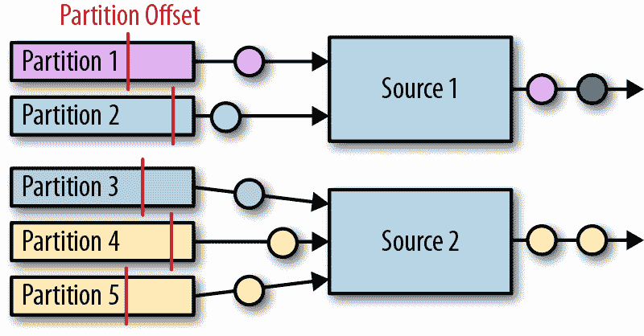

# 第八章：从外部系统读取和写入

数据可以存储在许多不同的系统中，如文件系统、对象存储、关系数据库系统、键值存储、搜索索引、事件日志、消息队列等等。每一类系统都被设计用于特定的访问模式，并擅长于服务特定的目的。因此，今天的数据基础设施通常由许多不同的存储系统组成。在将新组件添加到组合中之前，一个合乎逻辑的问题应该是：“它与我的堆栈中的其他组件如何协同工作？”

添加像 Apache Flink 这样的数据处理系统需要仔细考虑，因为它不包括自己的存储层，而是依赖于外部存储系统来摄取和持久化数据。因此，对于像 Flink 这样的数据处理器来说，提供一个充分配备的连接器库来从外部系统读取数据并将数据写入其中，以及实现自定义连接器的 API，是非常重要的。然而，仅仅能够读取或写入外部数据存储对于希望在故障情况下提供有意义的一致性保证的流处理器来说是不够的。

在本章中，我们讨论源和接收器连接器如何影响 Flink 流应用程序的一致性保证，并介绍 Flink 的最流行的连接器来读取和写入数据。您将学习如何实现自定义源和接收器连接器，以及如何实现发送异步读取或写入请求到外部数据存储的函数。

# 应用程序一致性保证

在 “检查点、保存点和状态恢复” 中，您了解到 Flink 的检查点和恢复机制周期性地获取应用程序状态的一致检查点。在发生故障时，应用程序的状态将从最新完成的检查点恢复，并继续处理。然而，仅仅能够将应用程序的状态重置到一致点并不足以实现应用程序的令人满意的处理保证。相反，应用程序的源和接收器连接器需要集成到 Flink 的检查点和恢复机制中，并提供特定的属性，以能够提供有意义的保证。

为了确保应用程序的精确一次状态一致性¹，应用程序的每个源连接器都需要能够将其读取位置设置为先前的检查点位置。在进行检查点时，源操作符会持久化其读取位置，并在恢复过程中恢复这些位置。支持读取位置检查点的源连接器示例包括将读取偏移量存储在文件的字节流中的基于文件的源，或者将读取偏移量存储在消费的 Kafka 主题分区中的 Kafka 源。如果应用程序从无法存储和重置读取位置的源连接器摄取数据，在故障发生时可能会导致数据丢失，并且只能提供至多一次保证。

Flink 的检查点和恢复机制与可重置的源连接器的结合确保了应用程序不会丢失任何数据。然而，应用程序可能会重复发出结果，因为在最后一个成功检查点之后发出的所有结果（在恢复时应用程序会回退到该检查点）将被再次发出。因此，可重置源和 Flink 的恢复机制虽然确保了应用程序状态的精确一次一致性，但不足以提供端到端的精确一次保证。

旨在提供端到端精确一次保证的应用程序需要特殊的接收器连接器。接收器连接器可以在不同情况下应用两种技术来实现精确一次保证：*幂等*写入和*事务*写入。

## 幂等写入

幂等操作可以多次执行，但只会产生单一变化。例如，重复将相同的键值对插入 hashmap 是一种幂等操作，因为第一次插入操作将键的值添加到映射中，所有后续插入操作不会改变映射，因为映射已经包含键值对。另一方面，追加操作不是幂等操作，因为多次追加相同的元素会导致多次追加。对于流应用程序来说，幂等写操作很有意义，因为它们可以多次执行而不改变结果。因此，它们可以在一定程度上缓解由 Flink 的检查点机制引起的重播结果的影响。

需要注意的是，一个依赖于幂等接收器实现精确一次性结果的应用程序必须保证在重播时覆盖先前写入的结果。例如，一个向键值存储进行更新插入的应用程序必须确保确定性地计算用于更新插入的键。此外，从接收器系统读取的应用程序在应用程序恢复期间可能观察到意外的结果。当重播开始时，先前发出的结果可能会被较早的结果覆盖。因此，在恢复应用程序的输出的应用程序可能会看到时间的倒退，例如读取较小的计数。此外，当重播进行时，流应用程序的总体结果将处于不一致状态，因为一些结果将被覆盖，而其他结果则没有。一旦重播完成，并且应用程序超过了先前失败的点，结果将再次变得一致。

## 事务性写入

第二种实现端到端精确一次性一致性的方法基于事务性写入。这里的想法是，仅将那些在最后一个成功检查点之前计算的结果写入外部接收器系统。这种行为保证了端到端精确一次性，因为在发生故障时，应用程序将被重置到最后一个检查点，并且在该检查点之后未将任何结果发出到接收器系统。通过仅在检查点完成后写入数据，事务性方法不会遭受幂等写入重播不一致性的问题。然而，它会增加延迟，因为结果只有在检查点完成时才变得可见。

Flink 提供了两个构建模块来实现事务性的接收器连接器——一个通用的 *写前日志 (WAL)* 接收器和一个 *两阶段提交 (2PC)* 接收器。WAL 接收器将所有结果记录写入应用程序状态，并在收到检查点完成的通知后将它们发送到接收器系统。由于接收器在状态后端缓冲记录，WAL 接收器可以与任何类型的接收器系统一起使用。然而，它无法提供牢固的精确一次性保证，² 还会增加应用程序的状态大小，并且接收器系统必须处理尖峰写入模式。

相比之下，2PC 接收器要求接收器系统提供事务支持或公开用于模拟事务的构建模块。对于每个检查点，接收器启动一个事务，并将所有接收到的记录追加到事务中，将它们写入接收器系统而不提交它们。当接收到检查点完成的通知时，它提交事务并实现已写入的结果。该机制依赖于接收器在从完成检查点之前打开的故障中恢复后提交事务的能力。

两阶段提交协议依赖于 Flink 现有的检查点机制。检查点屏障是启动新事务的通知，所有运算符关于各自检查点成功的通知是它们的提交投票，而 JobManager 关于检查点成功的通知则是提交事务的指令。与 WAL 汇流槽相比，2PC 汇流槽在特定的汇流槽系统和实现下可以实现精确一次的输出。此外，与 WAL 汇流槽的突发写入模式相比，2PC 汇流槽连续向汇流槽系统写入记录。

表 8-1 显示了不同类型的源和汇流槽连接器在最佳情况下可以实现的端到端一致性保证；根据汇流槽的实现，实际一致性可能会更差。

表 8-1\. 不同来源和汇流槽组合的端到端一致性保证

|   | 不可重置源 | 可重置源 |
| --- | --- | --- |
| 任何汇流槽 | At-most-once | At-least-once |

| 幂等汇流槽 | At-most-once | Exactly-once*（临时不一致性

在恢复期间）|

| WAL sink | At-most-once | At-least-once |
| --- | --- | --- |
| 2PC 汇流槽 | At-most-once | Exactly-once |

# 提供的连接器

Apache Flink 提供了连接器，用于从各种存储系统读取数据和写入数据。消息队列和事件日志，如 Apache Kafka、Kinesis 或 RabbitMQ，是常见的数据流摄取源。在以批处理为主导的环境中，数据流也经常通过监视文件系统目录并在文件出现时读取来进行摄取。

在汇流槽端，数据流通常会被产生到消息队列中，以便后续的流处理应用程序可用事件，写入文件系统进行归档或使数据可用于离线分析或批处理应用程序，或者插入到键值存储或关系数据库系统中，如 Cassandra、ElasticSearch 或 MySQL，以使数据可搜索和可查询，或用于服务仪表盘应用程序。

不幸的是，除了关系型数据库管理系统的 JDBC 外，大多数存储系统都没有标准接口。相反，每个系统都具有自己的连接器库和专有协议。因此，像 Flink 这样的处理系统需要维护几个专用连接器，以便能够从最常用的消息队列、事件日志、文件系统、键值存储和数据库系统中读取事件并写入事件。

Flink 提供了与 Apache Kafka、Kinesis、RabbitMQ、Apache Nifi、各种文件系统、Cassandra、ElasticSearch 和 JDBC 相连的连接器。此外，Apache Bahir 项目为 ActiveMQ、Akka、Flume、Netty 和 Redis 提供了额外的 Flink 连接器。

要在应用程序中使用提供的连接器，需要将其依赖项添加到项目的构建文件中。我们解释了如何在“包括外部和 Flink 依赖项”中添加连接器依赖项。

在接下来的章节中，我们将讨论 Apache Kafka 的连接器、基于文件的源和汇、以及 Apache Cassandra。这些是最常用的连接器，也代表了重要的源和汇系统类型。您可以在[Apache Flink](http://bit.ly/2UtSrGk)或[Apache Bahir](http://bit.ly/2HOGWmE)的文档中找到更多关于其他连接器的信息。

## Apache Kafka 源连接器

Apache Kafka 是一个分布式流处理平台。其核心是一个分布式发布-订阅消息系统，被广泛采用来摄取和分发事件流。在我们深入了解 Flink 的 Kafka 连接器之前，我们简要解释 Kafka 的主要概念。

Kafka 将事件流组织为所谓的主题（topics）。主题是一个事件日志，保证事件按照写入的顺序读取。为了扩展对主题的写入和读取，可以将其分割为分区，分布在集群中。顺序保证仅限于分区内部——当从不同分区读取时，Kafka 不提供顺序保证。在 Kafka 分区中的读取位置称为偏移量（offset）。

Flink 为所有常见的 Kafka 版本提供源连接器。从 Kafka 0.11 开始，客户端库的 API 发生了演变，并添加了新功能。例如，Kafka 0.10 增加了对记录时间戳的支持。从 1.0 版本开始，API 保持稳定。Flink 提供了一个通用的 Kafka 连接器，适用于自 Kafka 0.11 以来的所有版本。Flink 还提供了针对 Kafka 版本 0.8、0.9、0.10 和 0.11 的特定版本连接器。在本节的其余部分，我们将专注于通用连接器，并且对于特定版本的连接器，我们建议您查阅 Flink 的文档。

将通用的 Flink Kafka 连接器的依赖项添加到 Maven 项目中，如下所示：

```
<dependency>
   <groupId>org.apache.flink</groupId>
   <artifactId>flink-connector-kafka_2.12</artifactId>
   <version>1.7.1</version>
</dependency>
```

Flink Kafka 连接器并行摄取事件流。每个并行源任务可以从一个或多个分区读取。任务跟踪每个分区的当前读取偏移量，并将其包含在其检查点数据中。在从故障中恢复时，将恢复偏移量，并且源实例将继续从检查点偏移量读取。Flink Kafka 连接器不依赖于 Kafka 自身的偏移量跟踪机制，后者基于所谓的消费者组（consumer groups）。图 8-1 展示了将分区分配给源实例的过程。



###### 图 8-1\. Kafka 主题分区的读取偏移量

Kafka 源连接器的创建如示例 8-1 所示。

##### 示例 8-1\. 创建一个 Flink Kafka 源

```
val properties = new Properties()
properties.setProperty("bootstrap.servers", "localhost:9092")
properties.setProperty("group.id", "test")

val stream: DataStream[String] = env.addSource(
  new FlinkKafkaConsumerString,
    properties))

```

构造函数接受三个参数。第一个参数定义了要读取的主题。这可以是单个主题、主题列表或匹配所有要读取的主题的正则表达式。当从多个主题读取时，Kafka 连接器将所有主题的所有分区视为相同，并将它们的事件复用到单个流中。

第二个参数是一个`DeserializationSchema`或`KeyedDeserializationSchema`。Kafka 消息存储为原始字节消息，需要反序列化为 Java 或 Scala 对象。`SimpleStringSchema`是一个内置的`DeserializationSchema`，用于简单地将字节数组反序列化为`String`，如在示例 8-1 中所示。此外，Flink 提供了 Apache Avro 和基于文本的 JSON 编码的实现。`DeserializationSchema`和`KeyedDeserializationSchema`是公共接口，因此您可以随时实现自定义的反序列化逻辑。

第三个参数是一个`Properties`对象，用于配置用于连接和从 Kafka 读取的 Kafka 客户端。最少的`Properties`配置包括两个条目，`"bootstrap.servers"`和`"group.id"`。请参阅 Kafka 文档获取额外的配置属性。

为了提取事件时间戳并生成水印，您可以通过调用`FlinkKafkaConsumer.assignTimestampsAndWatermark()`向 Kafka 消费者提供一个`AssignerWithPeriodicWatermark`或`AssignerWithPunctuatedWatermark`。为每个分区应用分配器以利用每个分区的顺序保证，并且源实例根据水印传播协议合并分区水印（参见“水印传播和事件时间”）。

###### 注意

注意，如果分区变为非活动状态并且不提供消息，源实例的水印将无法取得进展。因此，单个不活动的分区会导致整个应用程序停滞，因为应用程序的水印无法取得进展。

自 0.10.0 版本起，Kafka 支持消息时间戳。当从 Kafka 0.10 或更高版本读取时，如果应用程序在事件时间模式下运行，消费者将自动提取消息时间戳作为事件时间时间戳。在这种情况下，您仍然需要生成水印，并应用一个`AssignerWithPeriodicWatermark`或`AssignerWithPunctuatedWatermark`，以转发先前分配的 Kafka 时间戳。

还有一些其他值得注意的配置选项。您可以配置从主题的分区最初读取的起始位置。有效选项包括：

+   Kafka 为通过`group.id`参数配置的消费者组所知的最后读取位置。这是默认行为：

    `FlinkKafkaConsumer.setStartFromGroupOffsets()`

+   每个单独分区的最早偏移量：

    `FlinkKafkaConsumer.setStartFromEarliest()`

+   每个分区的最新偏移量：

    `FlinkKafkaConsumer.setStartFromLatest()`

+   所有时间戳大于给定时间戳的记录（需要 Kafka 0.10.x 或更高版本）：

    `FlinkKafkaConsumer.setStartFromTimestamp(long)`

+   由 `Map` 对象提供的所有分区的特定读取位置：

    `FlinkKafkaConsumer.setStartFromSpecificOffsets(Map)`

###### 注意

请注意，此配置仅影响第一次读取位置。在恢复或从保存点启动时，应用程序将从检查点或保存点中存储的偏移量开始读取。

可以配置 Flink Kafka 消费者自动发现与正则表达式匹配的新主题或已添加到主题的新分区。这些功能默认情况下是禁用的，可以通过将参数 `flink.partition-discovery.interval-millis` 添加到 `Properties` 对象中并设置非负值来启用。

## Apache Kafka Sink Connector

Flink 为自 Kafka 0.8 以来的所有 Kafka 版本提供了汇流连接器。通过 Kafka 0.11，客户端库的 API 发生了演变，并添加了新特性，例如 Kafka 0.10 中的记录时间戳支持和 Kafka 0.11 中的事务写入。自 1.0 版本以来，API 保持稳定。Flink 提供了一个通用的 Kafka 连接器，适用于自 Kafka 0.11 以来的所有 Kafka 版本。Flink 还为 Kafka 版本 0.8、0.9、0.10 和 0.11 提供了特定版本的连接器。在本节的其余部分，我们专注于通用连接器，并建议您查阅 Flink 的文档以获取特定版本的连接器信息。Flink 的通用 Kafka 连接器的依赖项如下所示添加到 Maven 项目中：

```
<dependency>
   <groupId>org.apache.flink</groupId>
   <artifactId>flink-connector-kafka_2.12</artifactId>
   <version>1.7.1</version>
</dependency>
```

Kafka sink 可以像示例 Example 8-2 中所示添加到 DataStream 应用程序中。

##### 示例 8-2\. 创建 Flink Kafka sink

```
val stream: DataStream[String] = ...

val myProducer = new FlinkKafkaProducerString   // serialization schema

stream.addSink(myProducer)

```

在 Example 8-2 中使用的构造函数接收三个参数。第一个参数是逗号分隔的 Kafka 代理地址字符串。第二个参数是要写入数据的主题名称，最后一个是将汇流中的输入类型（在 Example 8-2 中为 `String`）转换为字节数组的 `SerializationSchema`。`SerializationSchema` 是我们在 Kafka 源部分讨论的 `DeserializationSchema` 的对应项。

`FlinkKafkaProducer` 提供了更多构造函数，具有不同的参数组合，如下所示：

+   与 Kafka 源连接器类似，您可以传递一个 `Properties` 对象以向内部 Kafka 客户端提供自定义选项。在使用 `Properties` 时，必须提供代理服务器列表作为 `"bootstrap.servers"` 属性。请参阅 Kafka 文档获取参数的详细列表。

+   您可以指定一个 `FlinkKafkaPartitioner` 来控制如何将记录映射到 Kafka 分区。我们稍后在本节中会更详细地讨论这个功能。

+   除了使用 `SerializationSchema` 将记录转换为字节数组之外，还可以指定 `KeyedSerializationSchema`，它将记录序列化为两个字节数组——一个用于 Kafka 消息的键，另一个用于值。此外，`KeyedSerializationSchema` 还公开更多面向 Kafka 的功能，例如覆盖目标主题以写入多个主题。

### Kafka sink 提供至少一次的保证

Flink 的 Kafka sink 提供的一致性保证取决于其配置。在以下条件下，Kafka sink 提供至少一次的保证：

+   Flink 的检查点已启用，应用程序的所有来源均可重置。

+   如果写入失败，sink 连接器会抛出异常，导致应用程序失败和恢复。这是默认行为。通过将 `retries` 属性设置为大于零的值（默认值），可以配置内部 Kafka 客户端重试写入。还可以通过在 sink 对象上调用 `setLogFailuresOnly(true)` 配置仅记录写入失败。请注意，这将使应用程序的任何输出保证失效。

+   当 Kafka sink 等待 Kafka 确认正在传输的记录后才完成检查点。这是默认行为。通过在 sink 对象上调用 `setFlushOnCheckpoint(false)` 可以禁用此等待。但是，这也会禁用任何输出保证。

### Kafka sink 提供确保一次的保证

Kafka 0.11 引入了对事务写入的支持。由于此功能，Flink 的 Kafka sink 在正确配置的情况下还能提供确保一次的输出保证。同样，Flink 应用程序必须启用检查点并从可重置的源消费。此外，`FlinkKafkaProducer` 提供了一个带有 `Semantic` 参数的构造函数，用于控制 sink 提供的一致性保证。可能的一致性值有：

+   `Semantic.NONE`，不提供任何保证——可能会丢失记录或写入多次。

+   `Semantic.AT_LEAST_ONCE`，确保不会丢失写入但可能会重复。这是默认设置。

+   `Semantic.EXACTLY_ONCE`，建立在 Kafka 的事务基础上，确保每条记录只写入一次。

在运行使用 Kafka sink 以恰好一次模式操作的 Flink 应用程序时，有几个需要考虑的事项，了解 Kafka 如何处理事务会有所帮助。简而言之，Kafka 的事务通过将所有消息附加到分区的日志中，并将未提交的事务的消息标记为未提交来工作。一旦事务提交，标记将更改为已提交。从主题读取消息的消费者可以通过隔离级别（通过 `isolation.level` 属性）配置，声明是否可以读取未提交的消息（`read_uncommitted`，默认情况下）或不可以（`read_committed`）。如果将消费者配置为 `read_committed`，它在遇到未提交的消息时停止从分区消费，并在消息提交后恢复。因此，未提交的事务可能会阻塞消费者从分区读取，并引入显著的延迟。Kafka 通过在超时间隔后拒绝并关闭事务来防范这种情况，这是通过 `transaction.timeout.ms` 属性配置的。

在 Flink 的 Kafka sink 上下文中，这一点非常重要，因为由于长时间的恢复周期等原因导致的事务超时会导致数据丢失。因此，适当配置事务超时属性至关重要。默认情况下，Flink Kafka sink 将 `transaction.timeout.ms` 设置为一小时，这意味着您可能需要调整 Kafka 设置中 `transaction.max.timeout.ms` 属性的默认设置为 15 分钟。此外，已提交消息的可见性取决于 Flink 应用程序的检查点间隔。请参考 Flink 文档，了解在启用恰好一次的一致性时的几个其他特殊情况。

# 检查您的 Kafka 集群配置

即使在确认写入后，Kafka 集群的默认配置仍可能导致数据丢失。您应该仔细审查 Kafka 设置的配置，特别注意以下参数：

+   `acks`

+   `log.flush.interval.messages`

+   `log.flush.interval.ms`

+   `log.flush.*`

我们建议您参考 Kafka 文档，了解其配置参数的详细信息以及适当配置的指南。

### 自定义分区和写入消息时间戳

在向 Kafka 主题写入消息时，Flink Kafka sink 任务可以选择写入主题的哪个分区。在 Flink Kafka sink 的某些构造函数中可以定义 `FlinkKafkaPartitioner`。如果未指定，默认分区器将每个 sink 任务映射到单个 Kafka 分区 —— 由同一 sink 任务发出的所有记录都写入同一个分区，如果任务多于分区，则单个分区可能包含多个 sink 任务的记录。如果分区数大于子任务数，则默认配置会导致空分区，这可能会对以事件时间模式消费主题的 Flink 应用程序造成问题。

通过提供自定义的 `FlinkKafkaPartitioner`，您可以控制记录如何路由到主题分区。例如，可以基于记录的键属性创建一个分区器，或者创建一个轮询分区器以进行均匀分布。还可以选择将分区委托给基于消息键的 Kafka。这需要一个 `KeyedSerializationSchema` 来提取消息键，并将 `FlinkKafkaPartitioner` 参数配置为 `null` 以禁用默认分区器。

最后，Flink 的 Kafka 汇流器可以配置为写入消息时间戳，自 Kafka 0.10 起支持。通过在汇流器对象上调用 `setWriteTimestampToKafka(true)` 来启用将记录的事件时间戳写入 Kafka。

## 文件系统源连接器

文件系统通常用于以成本效益的方式存储大量数据。在大数据架构中，它们经常用作批处理应用程序的数据源和数据接收器。与高级文件格式（例如 Apache Parquet 或 Apache ORC）结合使用时，文件系统可以有效地为 Apache Hive、Apache Impala 或 Presto 等分析查询引擎提供服务。因此，文件系统通常用于“连接”流和批处理应用程序。

Apache Flink 提供了可重置的源连接器，用于将文件中的数据作为流进行摄取。文件系统源是`flink-streaming-java`模块的一部分。因此，您无需添加其他依赖项即可使用此功能。Flink 支持不同类型的文件系统，例如本地文件系统（包括本地挂载的 NFS 或 SAN 共享，Hadoop HDFS，Amazon S3 和 OpenStack Swift FS）。请参阅 “文件系统配置” 以了解如何在 Flink 中配置文件系统。示例 8-3 显示了如何通过逐行读取文本文件来摄取流。

##### 示例 8-3\. 创建文件系统源

```
val lineReader = new TextInputFormat(null) 

val lineStream: DataStream[String] = env.readFileString                     // The monitoring interval in ms

```

`StreamExecutionEnvironment.readFile()` 方法的参数包括：

+   `FileInputFormat` 负责读取文件内容。我们稍后在本节讨论此接口的详细信息。在 示例 8-3 中，`TextInputFormat` 的 `null` 参数定义了单独设置的路径。

+   应读取的路径。如果路径引用的是文件，则读取单个文件。如果引用的是目录，则 `FileInputFormat` 会扫描目录以读取文件。

+   应读取路径的模式。模式可以是 `PROCESS_ONCE` 或 `PROCESS_CONTINUOUSLY`。在 `PROCESS_ONCE` 模式下，作业启动时会扫描一次读取路径，并读取所有匹配的文件。在 `PROCESS_CONTINUOUSLY` 模式下，在初始扫描后，路径会定期扫描，并持续读取新文件和修改过的文件。

+   扫描路径的周期（毫秒）。在 `PROCESS_ONCE` 模式下，此参数被忽略。

`FileInputFormat`是专门用于从文件系统读取文件的`InputFormat`。⁴ `FileInputFormat`读取文件分为两步。首先，它扫描文件系统路径并为所有匹配文件创建所谓的输入分片。输入分片定义文件的范围，通常通过起始偏移量和长度。在将大文件分割为多个分片后，可以将分片分发给多个读取任务以并行读取文件。根据文件的编码方式，可能需要仅生成单个分片来整体读取文件。`FileInputFormat`的第二步是接收输入分片，读取由分片定义的文件范围，并返回所有相应的记录。

在 DataStream 应用程序中使用的`FileInputFormat`还应实现`CheckpointableInputFormat`接口，该接口定义了在文件分片中检查点和重置`InputFormat`当前读取位置的方法。如果`FileInputFormat`没有实现`CheckpointableInputFormat`接口，那么当启用检查点时，文件系统源连接器只提供至少一次的保证，因为输入格式将从上次完成检查点时处理的分片的开头开始读取。

在 1.7 版本中，Flink 提供了几个扩展`FileInputFormat`并实现`CheckpointableInputFormat`的类。`TextInputFormat`按行读取文本文件（由换行符分割），`CsvInputFormat`的子类读取逗号分隔值文件，`AvroInputFormat`读取 Avro 编码记录文件。

在`PROCESS_CONTINUOUSLY`模式下，文件系统源连接器根据文件的修改时间戳识别新文件。这意味着如果文件被修改，其修改时间戳发生变化，那么文件将完全重新处理。这包括由于追加写入而进行的修改。因此，连续摄取文件的常见技术是将它们写入临时目录，并在最终确定后原子性地将它们移动到监视的目录中。当文件完全摄取并且检查点完成后，它可以从目录中移除。通过跟踪修改时间戳监控已摄取的文件，还涉及从具有最终一致性列表操作的文件存储（例如 S3）中读取文件的情况。由于文件可能不会按其修改时间戳的顺序显示，它们可能会被文件系统源连接器忽略。

注意，在`PROCESS_ONCE`模式下，文件系统路径扫描和创建所有分片后不会进行任何检查点。

如果您想在事件时间应用程序中使用文件系统源连接器，则应注意，由于输入分片是在单个进程中生成并以修改时间戳的顺序轮询分布到所有并行读取器中，因此生成水印可能具有挑战性。为了生成令人满意的水印，您需要考虑稍后由任务处理的分片中包含的记录的最小时间戳。

## 文件系统接收器连接器

将流写入文件是一个常见的需求，例如，为了为离线的即席分析准备低延迟的数据。由于大多数应用程序只能在文件最终完成后读取，并且流应用程序运行时间较长，流目标连接器通常将其输出分成多个文件。此外，通常会将记录组织成所谓的桶，以便消费应用程序更有控制地读取哪些数据。

类似于文件系统源连接器，Flink 的 `StreamingFileSink` 连接器包含在 `flink-streaming-java` 模块中。因此，您无需在构建文件中添加依赖项即可使用它。

`StreamingFileSink` 为应用程序提供端到端的精确一次性保证，前提是应用程序配置了精确一次性检查点，并且所有源在失败的情况下重置。我们将在本节后面更详细地讨论恢复机制。 示例 8-4 显示了如何使用最小配置创建 `StreamingFileSink` 并将其追加到流中。

##### 示例 8-4\. 在行编码模式下创建 `StreamingFileSink`

```
val input: DataStream[String] = …
val sink: StreamingFileSink[String] = StreamingFileSink
  .forRowFormat(
    new Path("/base/path"), 
    new SimpleStringEncoderString)
  .build()

input.addSink(sink)

```

当 `StreamingFileSink` 接收到一条记录时，该记录将被分配到一个桶中。桶是配置在 `StreamingFileSink` 构建器中的基路径的子目录——`"/base/path"` 在 示例 8-4 中。

桶由 `BucketAssigner` 选择，它是一个公共接口，并为每条记录返回一个确定记录将被写入的目录的 `BucketId`。可以使用构建器上的 `withBucketAssigner()` 方法配置 `BucketAssigner`。如果没有明确指定 `BucketAssigner`，则使用 `DateTimeBucketAssigner`，根据写入时的处理时间将记录分配给每小时的桶。

每个桶目录包含多个由多个并行 `StreamingFileSink` 实例同时写入的分片文件。此外，每个并行实例将其输出分成多个分片文件。分片文件的路径格式如下：

`[base-path]/[bucket-path]/part-[task-idx]-[id]`

例如，给定基路径 `"/johndoe/demo"` 和部分前缀 `"part"`，路径 `"/johndoe/demo/2018-07-22--17/part-4-8"` 指向了由第五个（0 索引）sink 任务写入到桶 `"2018-07-22--17"` ——2018 年 7 月 22 日下午 5 点的第八个文件。

# 提交文件的 ID 可能不连续

非连续的文件 ID，即提交文件名称中的最后一个数字，不表示数据丢失。`StreamingFileSink` 简单地递增文件 ID。在丢弃待处理文件时，不会重用它们的 ID。

`RollingPolicy` 决定任务何时创建新的部分文件。您可以使用构建器的 `withRollingPolicy()` 方法配置 `RollingPolicy`。默认情况下，`StreamingFileSink` 使用 `DefaultRollingPolicy`，配置为在部分文件超过 128 MB 或旧于 60 秒时滚动。您还可以配置一个非活动间隔，之后将滚动部分文件。

`StreamingFileSink` 支持两种向部分文件写入记录的模式：行编码和批量编码。在行编码模式下，每个记录都单独编码并附加到部分文件中。在批量编码模式下，记录被收集并批量写入。Apache Parquet 是一种需要批量编码的文件格式，它以列式格式组织和压缩记录。

示例 8-4 创建了一个使用行编码的 `StreamingFileSink`，通过提供一个 `Encoder` 将单个记录写入部分文件。在 示例 8-4 中，我们使用了 `SimpleStringEncoder`，它调用记录的 `toString()` 方法，并将记录的 `String` 表示写入文件。`Encoder` 是一个简单的接口，只有一个方法，可以轻松实现。

如 示例 8-5 所示，可以创建一个批量编码的 `StreamingFileSink`。

##### 示例 8-5\. 创建批量编码模式下的 StreamingFileSink

```
val input: DataStream[String] = …
val sink: StreamingFileSink[String] = StreamingFileSink
  .forBulkFormat(
    new Path("/base/path"), 
    ParquetAvroWriters.forSpecificRecord(classOf[AvroPojo]))
  .build()

input.addSink(sink)

```

批量编码模式下的 `StreamingFileSink` 需要一个 `BulkWriter.Factory`。在 示例 8-5 中，我们使用 Parquet 作为 Avro 文件的写入器。请注意，Parquet 写入器位于 `flink-parquet` 模块中，需要将其作为依赖项添加。通常情况下，`BulkWriter.Factory` 是一个接口，可以为自定义文件格式（如 Apache Orc）实现。

###### 注意

批量编码模式下的 StreamingFileSink 无法选择 `RollingPolicy`。批量编码格式只能与 `OnCheckpointRollingPolicy` 结合使用，该策略在每次检查点时滚动进行中的部分文件。

`StreamingFileSink` 提供精确一次输出保证。该接收器通过一种提交协议实现这一点，通过不同阶段移动文件：进行中、待处理和已完成，该协议基于 Flink 的检查点机制。当接收器写入文件时，文件处于进行中状态。当 `RollingPolicy` 决定滚动文件时，通过重命名将其关闭并移到待处理状态。当下一个检查点完成时，将待处理文件移动到已完成状态（再次通过重命名）。

# 可能永远不会提交的待处理文件

在某些情况下，待处理文件可能永远不会被提交。`StreamingFileSink` 确保这不会导致数据丢失。然而，这些文件不会自动清理。

在手动删除挂起文件之前，您需要检查它是否挂起或即将提交。一旦找到一个具有相同任务索引和较高 ID 的已提交文件，就可以安全地删除一个挂起文件。

在失败的情况下，sink 任务需要将其当前正在进行的文件重置为上一个成功检查点处的写入偏移量。这通过关闭当前正在进行的文件并丢弃文件末尾的无效部分来完成，例如通过使用文件系统的截断操作。

# StreamingFileSink 需要启用检查点

如果应用程序不启用检查点，`StreamingFileSink`将永远不会将文件从挂起状态移动到完成状态。

## Apache Cassandra Sink 连接器

Apache Cassandra 是一个流行的、可扩展的和高可用的列存储数据库系统。Cassandra 将数据集建模为包含多个类型列的行表。一个或多个列必须被定义为（复合）主键。每行可以通过其主键唯一标识。除了其他 API 之外，Cassandra 还提供 Cassandra 查询语言（CQL），这是一种类似于 SQL 的语言，用于读取和写入记录以及创建、修改和删除数据库对象，例如键空间和表。

Flink 提供了一个 sink 连接器，用于将数据流写入 Cassandra。Cassandra 的数据模型基于主键，并且所有写入到 Cassandra 的操作都具有 upsert 语义。结合确切一次的检查点、可重置源和确定性应用逻辑，upsert 写操作产生最终确切一次的输出一致性。输出只是最终一致，因为在恢复期间结果会重置到先前的版本，这意味着消费者可能会读取比之前读取的更旧的结果。此外，多个键的值的版本可能会不同步。

为了在恢复期间防止时间不一致性并为具有非确定性应用逻辑的应用程序提供确切一次的输出保证，Flink 的 Cassandra 连接器可以配置为利用 WAL。我们稍后在本节中会详细讨论 WAL 模式。以下代码显示了您需要在应用程序的构建文件中添加的依赖项，以使用 Cassandra sink 连接器：

```
<dependency>
  <groupId>org.apache.flink</groupId>
  <artifactId>flink-connector-cassandra_2.12</artifactId>
  <version>1.7.1</version>
</dependency>
```

为了说明 Cassandra sink 连接器的使用，我们使用一个简单的示例，展示一个包含传感器读数数据的 Cassandra 表，由`sensorId`和`temperature`两列组成。在示例 8-6 中的 CQL 语句创建了一个名为“example”的键空间和一个名为“sensors”的表。

##### 示例 8-6\. 定义一个 Cassandra 示例表

```
CREATE KEYSPACE IF NOT EXISTS example
  WITH replication = {'class': 'SimpleStrategy', 'replication_factor': '1'};

CREATE TABLE IF NOT EXISTS example.sensors (
  sensorId VARCHAR,
  temperature FLOAT,
  PRIMARY KEY(sensorId)
);

```

Flink 提供了不同的 sink 实现，用于将不同数据类型的数据流写入 Cassandra。Flink 的 Java 元组和 `Row` 类型以及 Scala 的内置元组和案例类与用户定义的 POJO 类型处理方式不同。我们分别讨论这两种情况。示例 8-7 展示了如何创建一个将 `DataStream[(String, Float)]` 写入“sensors”表的 sink。

##### 示例 8-7\. 为元组创建一个 Cassandra sink

```
val readings: DataStream[(String, Float)] = ???

val sinkBuilder: CassandraSinkBuilder[(String, Float)] =
  CassandraSink.addSink(readings)
sinkBuilder
  .setHost("localhost")
  .setQuery(
    "INSERT INTO example.sensors(sensorId, temperature) VALUES (?, ?);")
  .build()
```

Cassandra sink 使用通过调用 `CassandraSink.addSink()` 方法并传入应发出的 `DataStream` 对象来获取的构建器进行创建和配置。该方法返回适合 `DataStream` 数据类型的正确构建器。在示例 8-7 中，它返回一个处理 Scala 元组的 Cassandra sink 构建器。

为了元组、案例类和行创建的 Cassandra sink 构建器需要指定 CQL INSERT 查询。⁵ 该查询使用 `CassandraSinkBuilder.setQuery()` 方法进行配置。在执行期间，sink 将查询注册为准备好的语句，并将元组、案例类或行的字段转换为准备好的语句的参数。根据它们的位置将字段映射到参数；第一个值转换为第一个参数，依此类推。

由于 POJO 字段没有自然顺序，它们需要进行不同的处理。示例 8-8 展示了如何为类型为 `SensorReading` 的 POJO 配置 Cassandra sink。

##### 示例 8-8\. 为 POJO 创建一个 Cassandra sink

```
val readings: DataStream[SensorReading] = ???

CassandraSink.addSink(readings)
  .setHost("localhost")
  .build()

```

正如您在示例 8-8 中所看到的，我们并未指定 INSERT 查询。相反，POJO 交给了 Cassandra 的对象映射器，后者会自动将 POJO 字段映射到 Cassandra 表的字段。为了使其正常工作，需要使用 Cassandra 注解对 POJO 类及其字段进行注释，并为所有字段提供如示例 8-9 所示的设置器和获取器。在讨论支持的数据类型时，Flink 要求使用默认构造函数，如 “支持的数据类型” 中所述。

##### 示例 8-9\. 带有 Cassandra 对象映射器注解的 POJO 类

```
@Table(keyspace = "example", name = "sensors")
class SensorReadings(
  @Column(name = "sensorId") var id: String,
  @Column(name = "temperature") var temp: Float) {

  def this() = {
      this("", 0.0)
 }

  def setId(id: String): Unit = this.id = id
  def getId: String = id
  def setTemp(temp: Float): Unit = this.temp = temp
  def getTemp: Float = temp
}

```

除了图 8-7 和图 8-8 中的配置选项外，Cassandra sink 构建器提供了一些额外的方法来配置 sink 连接器：

+   `setClusterBuilder(ClusterBuilder)`: `ClusterBuilder` 构建了一个管理与 Cassandra 的连接的 Cassandra `Cluster`。除了其他选项外，它可以配置一个或多个联系点的主机名和端口；定义负载均衡、重试和重新连接策略；并提供访问凭据。

+   `setHost(String, [Int])`: 这个方法是一个简化版的`ClusterBuilder`，配置了单个联系点的主机名和端口。如果未配置端口，则使用 Cassandra 的默认端口 9042。

+   `setQuery(String)`: 这指定了 CQL INSERT 查询，用于将元组、case 类或行写入 Cassandra。查询不能配置为发射 POJO。

+   `setMapperOptions(MapperOptions)`: 这为 Cassandra 的对象映射器提供选项，如一致性配置、生存时间（TTL）和空字段处理。如果接收器发射元组、case 类或行，则选项将被忽略。

+   `enableWriteAheadLog([CheckpointCommitter])`: 这启用了 WAL，在非确定性应用逻辑的情况下提供了精确一次性输出保证。`CheckpointCommitter`用于将已完成检查点的信息存储在外部数据存储中。如果未配置`CheckpointCommitter`，则将信息写入特定的 Cassandra 表中。

基于 Flink 的`GenericWriteAheadSink`运算符实现了带 WAL 的 Cassandra 接收器连接器。关于这个运算符的工作方式，包括`CheckpointCommitter`的角色以及提供的一致性保证，在 “事务性接收器连接器” 中有更详细的描述。

# 实现自定义源函数

DataStream API 提供了两个接口来实现源连接器，以及相应的`RichFunction`抽象类：

+   `SourceFunction`和`RichSourceFunction`可以用来定义非并行源连接器，即运行单个任务的源。

+   `ParallelSourceFunction`和`RichParallelSourceFunction`可用于定义使用多个并行任务实例运行的源连接器。

除了非并行和并行之外，两个接口是相同的。就像处理函数的富变体一样，`RichSourceFunction`和`RichParallelSourceFunction`的子类可以重写`open()`和`close()`方法，并访问提供并行任务实例数及当前实例索引等信息的`RuntimeContext`。

`SourceFunction`和`ParallelSourceFunction`定义了两种方法：

+   `void run(SourceContext<T> ctx)`

+   `void cancel()`

`run()` 方法实际上是读取或接收记录并将其输入到 Flink 应用程序的工作。根据数据来源系统的不同，数据可能是推送或拉取的。`run()` 方法由 Flink 调用一次，并在专用源线程中运行，通常以无限循环（无限流）读取或接收数据并发出记录。任务可以在某个时间点被显式取消，或者在输入完全消耗时终止，例如有限流的情况。

当应用程序被取消并关闭时，Flink 会调用`cancel()`方法。为了执行优雅的关闭，运行在单独线程中的`run()`方法应该在调用`cancel()`方法时立即终止。示例 8-10 展示了一个从 0 计数到`Long.MaxValue`的简单源函数。

##### 示例 8-10\. 计数到 Long.MaxValue 的 SourceFunction

```
class CountSource extends SourceFunction[Long] {
  var isRunning: Boolean = true

  override def run(ctx: SourceFunction.SourceContext[Long]) = {

    var cnt: Long = -1
    while (isRunning && cnt < Long.MaxValue) {
      cnt += 1
      ctx.collect(cnt)
    }
  }

  override def cancel() = isRunning = false
}

```

## 可重置的源函数

本章前面我们解释过，Flink 只能为使用可以重放其输出数据的源连接器的应用程序提供满意的一致性保证。如果外部系统提供数据的源函数暴露了检索和重置读取偏移的 API，则源函数可以重放其输出。此类系统的示例包括提供文件流的偏移和用于将文件流移动到特定位置的查找方法的文件系统，以及为主题的每个分区提供偏移并可以设置分区读取位置的 Apache Kafka。相反的例子是从网络套接字读取数据的源连接器，它会立即丢弃传递的数据。

支持输出重播的源函数需要与 Flink 的检查点机制集成，并且在进行检查点时必须持久化所有当前的读取位置。当应用程序从保存点启动或从故障中恢复时，读取偏移会从最新的检查点或保存点中检索。如果应用程序在没有现有状态的情况下启动，则必须将读取偏移设置为默认值。可重置的源函数需要实现`CheckpointedFunction`接口，并应该将读取偏移和所有相关的元信息（例如文件路径或分区 ID）存储在操作符列表状态或操作符联合列表状态中，具体取决于在重新缩放应用程序的情况下如何分发偏移。有关操作符列表状态和联合列表状态的分发行为详情，请参见“扩展有状态操作符”。

此外，确保在进行检查点时不会在`SourceFunction.run()`方法中推进读取偏移并发出数据非常重要；换句话说，在调用`CheckpointedFunction.snapshotState()`方法时也是如此。这是通过在在一个同步于从`SourceContext.getCheckpointLock()`方法获取的锁对象上的代码中保护推进读取位置和发出记录的代码块来实现的。示例 8-11 展示了如何使得 示例 8-10 中的`CountSource`可重置。

##### 示例 8-11\. 可重置的 SourceFunction

```
class ResettableCountSource
    extends SourceFunction[Long] with CheckpointedFunction {

  var isRunning: Boolean = true
  var cnt: Long = _
  var offsetState: ListState[Long] = _

  override def run(ctx: SourceFunction.SourceContext[Long]) = {
    while (isRunning && cnt < Long.MaxValue) {
      // synchronize data emission and checkpoints
      ctx.getCheckpointLock.synchronized {
        cnt += 1
        ctx.collect(cnt)
      }
    }
  }

  override def cancel() = isRunning = false

  override def snapshotState(snapshotCtx: FunctionSnapshotContext): Unit = {
    // remove previous cnt
    offsetState.clear()
    // add current cnt
    offsetState.add(cnt)
  }

  override def initializeState(
      initCtx: FunctionInitializationContext): Unit = {

    val desc = new ListStateDescriptorLong
    offsetState = initCtx.getOperatorStateStore.getListState(desc)
    // initialize cnt variable
    val it = offsetState.get()
    cnt = if (null == it || !it.iterator().hasNext) {
      -1L
    } else {
      it.iterator().next()
    }
  }
}

```

## 源函数、时间戳和水印

源函数的另一个重要方面是时间戳和水印。如“事件时间处理”和“分配时间戳和生成水印”所指出的，DataStream API 提供了两种选项来分配时间戳和生成水印。可以通过专用的`TimestampAssigner`（详见“分配时间戳和生成水印”）分配和生成时间戳和水印，或者由源函数分配和生成。

源函数通过其`SourceContext`对象分配时间戳并发出水印。`SourceContext`提供以下方法：

+   `def collectWithTimestamp(T record, long timestamp): Unit`

+   `def emitWatermark(Watermark watermark): Unit`

`collectWithTimestamp()`以其关联的时间戳发出记录，而`emitWatermark()`则发出提供的水印。

除了消除额外运算符的需求之外，在源函数中分配时间戳和生成水印还具有以下好处，例如，如果源函数的一个并行实例从多个流分区中消费记录，比如 Kafka 主题的分区。通常情况下，如 Kafka 之类的外部系统只能保证流分区内的消息顺序。考虑到源函数操作符的并行度为 2，并从具有六个分区的 Kafka 主题读取数据的情况，则源函数的每个并行实例将从三个 Kafka 主题分区中读取记录。因此，源函数的每个实例复用三个流分区的记录来发出它们。复用记录很可能会引入与事件时间时间戳相关的额外无序性，从而导致下游时间戳分配器产生比预期更多的延迟记录。

为避免这种行为，源函数可以为每个流分区独立生成水印，并始终将其分区的最小水印作为其水印发出。这样可以确保在每个分区上的顺序保证被利用，且不会发出不必要的延迟记录。

源函数必须处理的另一个问题是那些变得空闲且不再发出数据的实例。这可能非常棘手，因为它可能阻止整个应用程序推进其水印，从而导致应用程序停滞。由于水印应该是数据驱动的，水印生成器（无论是集成在源函数中还是在时间戳分配器中）如果没有收到输入记录，则不会发出新的水印。如果查看 Flink 如何传播和更新水印（参见“水印传播和事件时间”），您可以看到，如果应用程序涉及到分区操作（`keyBy()`、`rebalance()`等），单个不推进水印的操作符可能会使应用程序的所有水印都停滞。

Flink 通过将源函数标记为临时空闲的机制来避免这种情况。在空闲时，Flink 的水印传播机制将忽略空闲的流分区。一旦源函数重新开始发出记录，源就会自动设置为活动状态。源函数可以通过调用方法`SourceContext.markAsTemporarilyIdle()`来决定何时将自己标记为空闲。

# 实现自定义的 Sink 函数

在 Flink 的 DataStream API 中，任何操作符或函数都可以向外部系统或应用程序发送数据。一个`DataStream`不一定要最终流向一个 sink 操作符。例如，您可以实现一个`FlatMapFunction`，通过 HTTP POST 调用将每个传入的记录发送出去，而不是通过其`Collector`。尽管如此，DataStream API 提供了一个专用的`SinkFunction`接口和一个相应的`RichSinkFunction`抽象类。⁷ `SinkFunction`接口提供了一个方法：

`void invoke(IN value, Context ctx)`

`SinkFunction`的`Context`对象提供了当前处理时间，当前水印（即在 sink 端的当前事件时间）以及记录的时间戳的访问权限。

示例 8-12 展示了一个简单的`SinkFunction`，将传感器读数写入到一个 socket 中。请注意，在启动程序之前，您需要启动一个监听 socket 的进程。否则，程序会因为无法打开到 socket 的连接而失败，抛出`ConnectException`。在 Linux 上运行命令`nc -l localhost 9191`来监听 localhost:9191。

##### 示例 8-12\. 一个简单的 SinkFunction，将数据写入到 socket 中

```
val readings: DataStream[SensorReading] = ???

// write the sensor readings to a socket
readings.addSink(new SimpleSocketSink("localhost", 9191))
  // set parallelism to 1 because only one thread can write to a socket
  .setParallelism(1)

// -----

class SimpleSocketSink(val host: String, val port: Int)
    extends RichSinkFunction[SensorReading] {

  var socket: Socket = _
  var writer: PrintStream = _

  override def open(config: Configuration): Unit = {
    // open socket and writer
    socket = new Socket(InetAddress.getByName(host), port)
    writer = new PrintStream(socket.getOutputStream)
  }

  override def invoke(
      value: SensorReading,
      ctx: SinkFunction.Context[_]): Unit = {
    // write sensor reading to socket
    writer.println(value.toString)
    writer.flush()
  }

  override def close(): Unit = {
    // close writer and socket
    writer.close()
    socket.close()
  }
}

```

正如讨论的那样，一个应用程序的端到端一致性保证取决于其 sink 连接器的属性。为了实现端到端的精确一次语义，一个应用程序需要具有幂等或事务性的 sink 连接器。示例 8-12 中的`SinkFunction`既不执行幂等写入，也不支持事务性写入。由于 socket 的特性是仅追加，无法执行幂等写入。由于 socket 不具备内置的事务支持，只能使用 Flink 的通用 WAL sink 来执行事务性写入。在接下来的几节中，您将学习如何实现幂等或事务性的 sink 连接器。

## 幂等的 Sink 连接器

对于许多应用程序来说，`SinkFunction`接口足以实现一个幂等的 sink 连接器。这是可能的，如果满足以下两个属性：

1.  结果数据具有确定性（组合）键，可以在其上执行幂等更新。对于计算每个传感器和每分钟的平均温度的应用程序，确定性键可以是传感器的 ID 和每分钟的时间戳。确定性键对于确保在恢复时正确覆盖所有写入非常重要。

1.  外部系统支持按键更新，如关系数据库系统或键值存储。

示例 8-13 展示了如何实现和使用一个幂等的`SinkFunction`，用于写入到 JDBC 数据库，本例中为内置的 Apache Derby 数据库。

##### 示例 8-13\. 一个幂等的 SinkFunction，用于向 JDBC 数据库写入

```
val readings: DataStream[SensorReading] = ???

// write the sensor readings to a Derby table
readings.addSink(new DerbyUpsertSink)

// -----

class DerbyUpsertSink extends RichSinkFunction[SensorReading] {
  var conn: Connection = _
  var insertStmt: PreparedStatement = _
  var updateStmt: PreparedStatement = _

  override def open(parameters: Configuration): Unit = {
    // connect to embedded in-memory Derby
    conn = DriverManager.getConnection(
       "jdbc:derby:memory:flinkExample",
       new Properties())
    // prepare insert and update statements
    insertStmt = conn.prepareStatement(
      "INSERT INTO Temperatures (sensor, temp) VALUES (?, ?)")
    updateStmt = conn.prepareStatement(
      "UPDATE Temperatures SET temp = ? WHERE sensor = ?")
  }

  override def invoke(r: SensorReading, context: Context[_]): Unit = {
    // set parameters for update statement and execute it
    updateStmt.setDouble(1, r.temperature)
    updateStmt.setString(2, r.id)
    updateStmt.execute()
    // execute insert statement if update statement did not update any row
    if (updateStmt.getUpdateCount == 0) {
      // set parameters for insert statement
      insertStmt.setString(1, r.id)
      insertStmt.setDouble(2, r.temperature)
      // execute insert statement
      insertStmt.execute()
    }
  }

  override def close(): Unit = {
    insertStmt.close()
    updateStmt.close()
    conn.close()
  }
}

```

由于 Apache Derby 没有提供内置的`UPSERT`语句，示例的 sink 在首先尝试更新行并在给定键不存在行时插入新行的情况下执行`UPSERT`写入操作。当 WAL 未启用时，Cassandra sink 连接器采用相同的方法。

## 事务性 Sink 连接器

每当幂等的 sink 连接器不适用时，无论是应用程序输出的特性、所需 sink 系统的属性，还是由于更严格的一致性要求，事务性 sink 连接器都可以作为一种选择。如前所述，事务性 sink 连接器需要与 Flink 的检查点机制集成，因为它们只有在检查点成功完成时才能将数据提交到外部系统。

为了简化事务性 sink 的实现，Flink 的 DataStream API 提供了两个模板，可以扩展为实现自定义 sink 运算符。这两个模板都实现了`CheckpointListener`接口，用于接收来自 JobManager 关于已完成检查点的通知（有关接口详细信息，请参见“接收有关已完成检查点的通知”）：

+   `GenericWriteAheadSink`模板会收集每个检查点的所有出站记录，并将它们存储在 sink 任务的操作状态中。在发现任务接收到检查点完成通知时，它会将已完成检查点的记录写入到外部系统。启用了 WAL 的 Cassandra sink 连接器实现了此接口。

+   `TwoPhaseCommitSinkFunction`模板利用外部 sink 系统的事务特性。对于每个检查点，它启动一个新事务，并在当前事务的上下文中将所有后续记录写入到 sink 系统。当接收到相应检查点的完成通知时，sink 会提交事务。

接下来，我们将描述两种接口及其一致性保证。

### GenericWriteAheadSink

`GenericWriteAheadSink`简化了具有改进一致性属性的 sink 运算符的实现。该运算符集成了 Flink 的检查点机制，并旨在将每条记录仅写入外部系统一次。但是，请注意，在某些故障场景中，写前日志 sink 可能会多次发出记录。因此，`GenericWriteAheadSink`不能提供百分之百的恰好一次保证，只能提供至少一次保证。我们将在本节的后续部分详细讨论这些场景。

`GenericWriteAheadSink`通过将所有接收到的记录追加到以检查点为分段的预写式日志中来工作。每当 sink 操作符接收到检查点屏障时，它就会开始一个新的段，并且所有后续记录都追加到新的段中。WAL 作为操作符状态存储和检查点。由于日志将被恢复，在发生故障的情况下不会丢失任何记录。

当`GenericWriteAheadSink`接收到有关已完成检查点的通知时，它会发射存储在 WAL 中与成功检查点对应的段中的所有记录。根据 sink 操作符的具体实现，记录可以写入任何类型的存储或消息系统。当所有记录成功发射后，相应的检查点必须在内部提交。

检查点在两个步骤中被提交。首先，sink 持久存储检查点已提交的信息，其次将记录从 WAL 中删除。不可能将提交信息存储在 Flink 的应用程序状态中，因为它不是持久的，并且在发生故障时将被重置。相反，`GenericWriteAheadSink`依赖于一个可插拔的组件称为`CheckpointCommitter`，用于在外部持久存储中存储和查找已提交检查点的信息。例如，默认情况下，Cassandra sink 连接器使用一个写入 Cassandra 的`CheckpointCommitter`。

由于`GenericWriteAheadSink`内置的逻辑，实现利用 WAL 的 sink 并不困难。扩展`GenericWriteAheadSink`的操作符需要提供三个构造参数：

+   如前所述的`CheckpointCommitter`

+   用于序列化输入记录的`TypeSerializer`

+   作业 ID 会传递给`CheckpointCommitter`，以便在应用程序重启时标识提交信息

此外，预写式操作符需要实现一个单一方法：

```
boolean sendValues(Iterable<IN> values, long chkpntId, long timestamp)

```

`GenericWriteAheadSink`调用`sendValues()`方法将完成检查点的所有记录写入外部存储系统。该方法接收一个检查点中所有记录的可迭代对象，检查点的 ID 以及检查点被获取的时间戳。如果所有写入都成功，则该方法必须返回`true`，如果写入失败，则返回`false`。

示例 8-14 展示了一个将数据写入标准输出的预写式 sink 的实现。它使用了`FileCheckpointCommitter`，这里不进行讨论。您可以在包含本书示例的存储库中查找其实现。

###### 注意

请注意，`GenericWriteAheadSink`未实现`SinkFunction`接口。因此，扩展`GenericWriteAheadSink`的 sink 无法使用`DataStream.addSink()`添加，而是使用`DataStream.transform()`方法附加。

##### 示例 8-14\. 向标准输出写入的 WAL sink

```
val readings: DataStream[SensorReading] = ???

// write the sensor readings to the standard out via a write-ahead log
readings.transform(
  "WriteAheadSink", new SocketWriteAheadSink)

// -----

class StdOutWriteAheadSink extends GenericWriteAheadSinkSensorReading),
    // Serializer for records
    createTypeInformation[SensorReading]
      .createSerializer(new ExecutionConfig),
    // Random JobID used by the CheckpointCommitter
    UUID.randomUUID.toString) {

  override def sendValues(
      readings: Iterable[SensorReading],
      checkpointId: Long,
      timestamp: Long): Boolean = {

    for (r <- readings.asScala) {
      // write record to standard out
      println(r)
    }
    true
  }
}

```

示例存储库包含一个应用程序，它定期失败和恢复，以演示 `StdOutWriteAheadSink` 和常规 `DataStream.print()` 汇聚在故障情况下的行为。

如前所述，`GenericWriteAheadSink` 无法提供百分之百的精确一次性保证。有两种故障情况可能导致记录被多次发射：

1.  当任务在运行 `sendValues()` 方法时程序失败。如果外部汇聚系统无法原子化地写入多条记录（要么全部写入，要么一个也不写入），那么可能会写入部分记录而其他记录未被写入。由于检查点尚未提交，因此在恢复期间，汇聚器将重新写入所有记录。

1.  所有记录都已正确写入，`sendValues()` 方法返回 true；然而，在调用 `CheckpointCommitter` 或 `CheckpointCommitter` 未能提交检查点之前，程序失败。在恢复期间，所有未提交检查点的记录将再次写入。

###### 注意

请注意，这些故障场景不会影响 Cassandra sink 连接器的精确一次性保证，因为它执行 UPSERT 写入。Cassandra sink 连接器受益于 WAL，因为它防止非确定性键，并防止向 Cassandra 写入不一致的内容。

### TwoPhaseCommitSinkFunction

Flink 提供了 `TwoPhaseCommitSinkFunction` 接口来简化提供端到端精确一次性保证的汇聚函数的实现。然而，一个 2PC 汇聚函数是否提供此类保证取决于实现细节。我们从一个问题开始讨论这个接口：“2PC 协议是否太昂贵？”

通常情况下，2PC 是确保分布式系统一致性的昂贵方法。然而，在 Flink 的背景下，该协议仅在每次检查点时运行一次。此外，`TwoPhaseCommitSinkFunction` 协议依赖于 Flink 的常规检查点机制，因此增加的开销很小。`TwoPhaseCommitSinkFunction` 工作方式与 WAL sink 类似，但不会在 Flink 的应用状态中收集记录；相反，它会将它们作为开放事务写入外部汇聚系统。

`TwoPhaseCommitSinkFunction` 实现了以下协议。在接收端任务发出第一条记录之前，它会在外部接收系统上启动一个事务。随后接收到的所有记录都将在事务的上下文中写入。当 JobManager 启动检查点并在应用程序源头注入障碍时，2PC 协议的投票阶段开始。当操作员接收到障碍时，它会检查其状态并在完成后向 JobManager 发送确认消息。当接收端任务接收到障碍时，它会持久化其状态，准备当前事务以供提交，并在 JobManager 处确认检查点。向 JobManager 发送的确认消息类似于教科书 2PC 协议的提交投票。接收端任务不应立即提交事务，因为不能保证作业的所有任务都会完成其检查点。接收端任务还会为在下一个检查点障碍之前到达的所有记录启动一个新事务。

当 JobManager 收到所有任务实例的成功检查点通知时，它会向所有感兴趣的任务发送检查点完成通知。此通知对应于 2PC 协议中的提交命令。当接收到通知时，接收端任务会提交先前检查点的所有未完成事务。⁸ 一旦接收端任务确认其检查点，即使出现故障，也必须能够提交相应的事务。如果事务无法提交，则接收端会丢失数据。当所有接收端任务都提交了其事务时，2PC 协议的一个迭代成功完成。

让我们总结外部接收系统的要求：

+   外部接收系统必须提供事务支持，或者接收端必须能够在外部系统上模拟事务。因此，接收端应能够写入接收系统，但在提交前写入的数据不能对外部可见。

+   在检查点间隔期间，事务必须保持打开状态并接受写入。

+   事务必须等待收到检查点完成通知后才能提交。在恢复周期中，这可能需要一些时间。如果接收系统关闭了一个事务（例如超时），未提交的数据将会丢失。

+   接收端必须能够在进程失败后恢复事务。一些接收系统提供了可以用于提交或中止未完成事务的事务 ID。

+   提交事务必须是幂等操作 - 接收端或外部系统应该能够知道事务已经提交，或者重复提交不会产生影响。

通过查看一个具体的示例，可以更容易理解接收器系统的协议和要求。在 示例 8-15 中展示了一个 `TwoPhaseCommitSinkFunction`，它向文件系统写入，保证了精确一次性。基本上，这是前面讨论的 `BucketingFileSink` 的简化版本。

##### 示例 8-15\. 一个写入文件的事务性接收器

```
class TransactionalFileSink(val targetPath: String, val tempPath: String)
    extends TwoPhaseCommitSinkFunction(String, Double), String, Void,
      createTypeInformation[Void].createSerializer(new ExecutionConfig)) {

  var transactionWriter: BufferedWriter = _

  /** Creates a temporary file for a transaction into which the records are
 * written.
    */
  override def beginTransaction(): String = {
    // path of transaction file is built from current time and task index
    val timeNow = LocalDateTime.now(ZoneId.of("UTC"))
      .format(DateTimeFormatter.ISO_LOCAL_DATE_TIME)
    val taskIdx = this.getRuntimeContext.getIndexOfThisSubtask
    val transactionFile = s"$timeNow-$taskIdx"

    // create transaction file and writer
    val tFilePath = Paths.get(s"$tempPath/$transactionFile")
    Files.createFile(tFilePath)
    this.transactionWriter = Files.newBufferedWriter(tFilePath)
    println(s"Creating Transaction File: $tFilePath")
    // name of transaction file is returned to later identify the transaction
    transactionFile
  }

  /** Write record into the current transaction file. */
  override def invoke(
      transaction: String,
      value: (String, Double),
      context: Context[_]): Unit = {
    transactionWriter.write(value.toString)
    transactionWriter.write('\n')
  }

  /** Flush and close the current transaction file. */
  override def preCommit(transaction: String): Unit = {
    transactionWriter.flush()
    transactionWriter.close()
  }

  /** Commit a transaction by moving the precommitted transaction file
    * to the target directory.
    */
  override def commit(transaction: String): Unit = {
    val tFilePath = Paths.get(s"$tempPath/$transaction")
    // check if the file exists to ensure that the commit is idempotent
    if (Files.exists(tFilePath)) {
      val cFilePath = Paths.get(s"$targetPath/$transaction")
      Files.move(tFilePath, cFilePath)
    }
  }

  /** Aborts a transaction by deleting the transaction file. */
  override def abort(transaction: String): Unit = {
    val tFilePath = Paths.get(s"$tempPath/$transaction")
    if (Files.exists(tFilePath)) {
      Files.delete(tFilePath)
    }
  }
}

```

`TwoPhaseCommitSinkFunction[IN, TXN, CONTEXT]` 有三个类型参数：

+   `IN` 指定了输入记录的类型。在 示例 8-15 中，这是一个 `Tuple2`，包含一个 `String` 和一个 `Double` 字段。

+   `TXN` 定义了一个事务标识符，用于在失败后识别和恢复事务。在 示例 8-15 中，这是一个字符串，保存着事务文件的名称。

+   `CONTEXT` 定义了一个可选的自定义上下文。在 示例 8-15 中的 `TransactionalFileSink` 不需要上下文，因此将其类型设置为 `Void`。

`TwoPhaseCommitSinkFunction` 的构造函数需要两个 `TypeSerializer`，一个用于 `TXN` 类型，另一个用于 `CONTEXT` 类型。

`TwoPhaseCommitSinkFunction` 最终定义了需要实现的五个函数：

+   `beginTransaction()`: `TXN` 开始一个新事务并返回事务标识符。在 示例 8-15 中的 `TransactionalFileSink` 创建一个新的事务文件并返回其名称作为标识符。

+   `invoke(txn: TXN, value: IN, context: Context[_]): Unit` 将一个值写入当前事务。在 示例 8-15 中的接收器将该值作为 `String` 追加到事务文件中。

+   `preCommit(txn: TXN): Unit` 预提交一个事务。预提交的事务将不会再接收到进一步的写入。我们在 示例 8-15 中的实现会刷新并关闭事务文件。

+   `commit(txn: TXN): Unit` 提交一个事务。该操作必须幂等——如果多次调用该方法，记录不应被写入输出系统两次。在 示例 8-15 中，我们检查事务文件是否仍然存在，并在是这种情况下将其移动到目标目录。

+   `abort(txn: TXN): Unit` 中止一个事务。该方法可能会对一个事务调用两次。我们在 示例 8-15 中的 `TransactionalFileSink` 检查事务文件是否仍然存在，并在是这种情况下将其删除。

正如您所看到的，接口的实现并不复杂。然而，实现的复杂性和一致性保证取决于许多因素，包括汇集系统的特性和能力。例如，Flink 的 Kafka 生产者实现了`TwoPhaseCommitSinkFunction`接口。正如前面提到的，如果由于超时而回滚事务，连接器可能会丢失数据。⁹ 因此，即使实现了`TwoPhaseCommitSinkFunction`接口，它也不能提供确切的仅一次保证。

# 异步访问外部系统

除了摄入或发出数据流之外，通过在远程数据库中查找信息来丰富数据流的操作是另一个常见的用例，需要与外部存储系统进行交互。一个示例是著名的 Yahoo!流处理基准，它基于广告点击流，需要使用存储在键值存储中的相应广告系列的详细信息来丰富它们。

处理此类用例的直接方法是实现一个`MapFunction`，该函数查询数据存储以获取每个处理记录，等待查询返回结果，丰富记录并发出结果。尽管这种方法易于实现，但存在一个主要问题：每次对外部数据存储的请求都会增加显著的延迟（请求/响应涉及两个网络消息），而`MapFunction`大部分时间都在等待查询结果。

Apache Flink 提供了`AsyncFunction`以减少远程 I/O 调用的延迟。`AsyncFunction`并发地发送多个查询并异步处理它们的结果。可以配置它以保持记录的顺序（请求的返回顺序可能与发送的顺序不同），或者按照查询结果的顺序返回结果以进一步减少延迟。该函数还与 Flink 的检查点机制完全集成——当前正在等待响应的输入记录被检查点，并且在恢复时重复查询。此外，`AsyncFunction`还能够正确地与事件时间处理配合工作，因为它确保即使启用了无序结果，水印也不会被记录超越。

为了利用`AsyncFunction`，外部系统应提供支持异步调用的客户端，这对许多系统来说是通用的。如果系统仅提供同步客户端，您可以创建线程来发送请求和处理它们。`AsyncFunction`的接口如下所示：

```
trait AsyncFunction[IN, OUT] extends Function {
  def asyncInvoke(input: IN, resultFuture: ResultFuture[OUT]): Unit
}

```

函数的类型参数定义其输入和输出类型。`asyncInvoke()` 方法为每个输入记录调用，带有两个参数。第一个参数是输入记录，第二个参数是回调对象，用于返回函数的结果或异常。在 示例 8-16 中，我们展示了如何在 `DataStream` 上应用 `AsyncFunction`。

##### 示例 8-16\. 在 DataStream 上应用 AsyncFunction

```
val readings: DataStream[SensorReading] = ???

val sensorLocations: DataStream[(String, String)] = AsyncDataStream
  .orderedWait(
    readings,
    new DerbyAsyncFunction,
    5, TimeUnit.SECONDS,    // timeout requests after 5 seconds
    100)                    // at most 100 concurrent requests
```

应用 `AsyncFunction` 的异步操作符配置为 `AsyncDataStream` 对象，¹⁰ 提供两个静态方法：`orderedWait()` 和 `unorderedWait()`。这两个方法根据不同的参数组合进行重载。`orderedWait()` 应用一个异步操作符，按输入记录的顺序发出结果，而 `unorderWait()` 操作符仅确保水印和检查点屏障保持对齐。额外的参数指定了何时超时异步调用以及启动多少并发请求。示例 8-17 展示了 `DerbyAsyncFunction`，它通过其 JDBC 接口查询嵌入的 Derby 数据库。

##### 示例 8-17\. 查询 JDBC 数据库的 AsyncFunction

```
class DerbyAsyncFunction
    extends AsyncFunction[SensorReading, (String, String)] {

  // caching execution context used to handle the query threads
  private lazy val cachingPoolExecCtx =
    ExecutionContext.fromExecutor(Executors.newCachedThreadPool())
  // direct execution context to forward result future to callback object
  private lazy val directExecCtx =
    ExecutionContext.fromExecutor(
      org.apache.flink.runtime.concurrent.Executors.directExecutor())

  /**
 * Executes JDBC query in a thread and handles the resulting Future
 * with an asynchronous callback.
 */
  override def asyncInvoke(
      reading: SensorReading,
      resultFuture: ResultFuture[(String, String)]): Unit = {

    val sensor = reading.id
    // get room from Derby table as Future
    val room: Future[String] = Future {
      // Creating a new connection and statement for each record.
      // Note: This is NOT best practice!
      // Connections and prepared statements should be cached.
      val conn = DriverManager
        .getConnection(
          "jdbc:derby:memory:flinkExample", 
          new Properties())
      val query = conn.createStatement()

      // submit query and wait for result; this is a synchronous call
      val result = query.executeQuery(
        s"SELECT room FROM SensorLocations WHERE sensor = '$sensor'")

      // get room if there is one
      val room = if (result.next()) {
        result.getString(1)
      } else {
        "UNKNOWN ROOM"
      }

      // close resultset, statement, and connection
      result.close()
      query.close()
      conn.close()
      // return room
      room
    }(cachingPoolExecCtx)

    // apply result handling callback on the room future
    room.onComplete {
      case Success(r) => resultFuture.complete(Seq((sensor, r)))
      case Failure(e) => resultFuture.completeExceptionally(e)
    }(directExecCtx)
  }
}

```

`DerbyAsyncFunction` 中的 `asyncInvoke()` 方法在 示例 8-17 中将阻塞 JDBC 查询包装在一个 `Future` 中，并通过 `CachedThreadPool` 执行。为了简洁起见，我们为每条记录创建一个新的 JDBC 连接，这显然效率不高，应该避免。`Future[String]` 包含了 JDBC 查询的结果。

最后，我们在 `Future` 上应用 `onComplete()` 回调，并将结果（或可能的异常）传递给 `ResultFuture` 处理程序。与 JDBC 查询 `Future` 不同，`onComplete()` 回调由 `DirectExecutor` 处理，因为将结果传递给 `ResultFuture` 是一个轻量级操作，不需要专用线程。请注意，所有操作都是以非阻塞方式完成的。

需要指出的是，`AsyncFunction` 实例为其每个输入记录顺序调用—函数实例不以多线程方式调用。因此，`asyncInvoke()` 方法应快速返回，通过启动异步请求并使用回调处理结果，将结果转发给 `ResultFuture`。必须避免的常见反模式包括：

+   发送阻塞 `asyncInvoke()` 方法的请求

+   发送异步请求，但在 `asyncInvoke()` 方法内等待请求完成

# 总结

在本章中，您学习了 Flink DataStream 应用程序如何从外部系统读取数据并写入数据，以及应用程序实现不同端到端一致性保证的要求。我们介绍了 Flink 最常用的内置源和接收器连接器，这些连接器也代表了不同类型的存储系统，如消息队列、文件系统和键值存储。

然后，我们向您展示了如何实现自定义源和接收器连接器，包括 WAL 和 2PC 接收器连接器，并提供了详细的示例。最后，您了解了 Flink 的 `AsyncFunction`，它通过异步执行和处理请求，显著提高了与外部系统交互的性能。

¹ 精确一次状态一致性是端到端精确一致性的要求，但并不相同。

² 我们在 “GenericWriteAheadSink” 中更详细地讨论了 WAL 接收器的一致性保证。

³ 有关时间戳分配器接口的详细信息，请参见 第六章。

⁴ `InputFormat` 是 Flink 在 DataSet API 中定义数据源的接口。

⁵ 与 SQL 的 INSERT 语句相比，CQL 的 INSERT 语句的行为类似于 upsert 查询——它们会覆盖具有相同主键的现有行。

⁶ 在 第五章 中讨论了 Rich 函数。

⁷ 通常使用 `RichSinkFunction` 接口，因为接收器函数通常需要在 `RichFunction.open()` 方法中建立与外部系统的连接。有关 `RichFunction` 接口的详细信息，请参见 第五章。

⁸ 如果确认消息丢失，一个任务可能需要提交多个事务。

⁹ 请参见 “Apache Kafka Sink Connector” 中的详细信息。

¹⁰ Java API 提供了一个 `AsyncDataStream` 类及其相应的静态方法。
