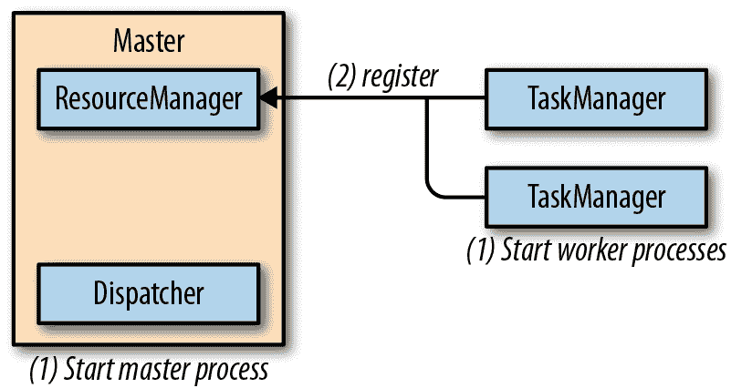
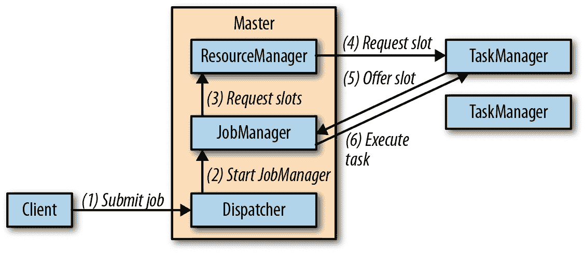
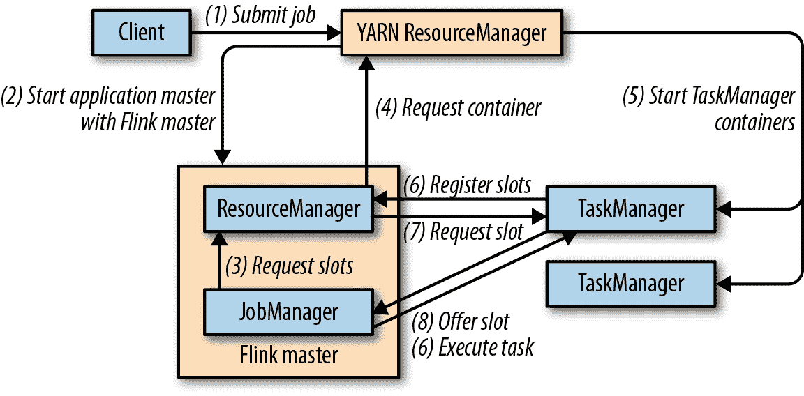
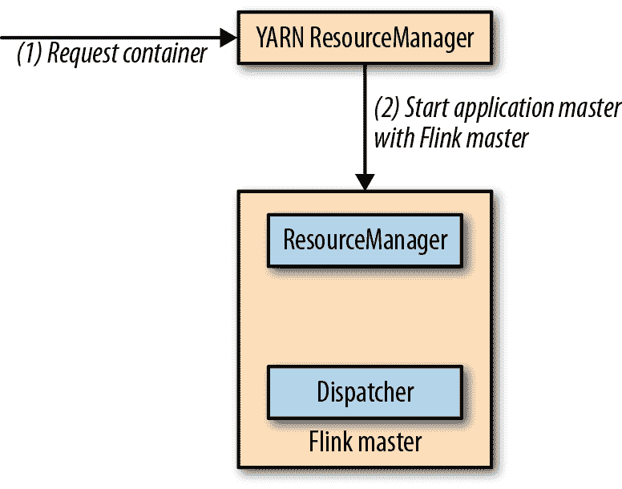
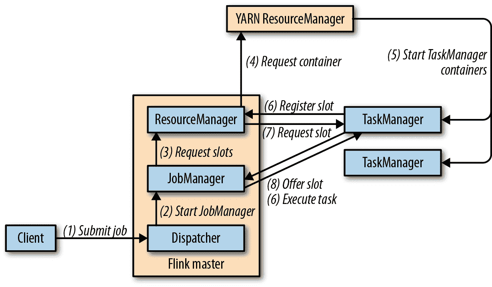

# 第九章：设置 Flink 用于流应用程序

当今的数据基础设施多种多样。像 Apache Flink 这样的分布式数据处理框架需要设置与多个组件交互，例如资源管理器、文件系统和用于分布式协调的服务。

在本章中，我们讨论了部署 Flink 集群的不同方法以及如何安全配置和使其高可用。我们解释了不同 Hadoop 版本和文件系统的 Flink 设置，并讨论了 Flink 主节点和工作节点进程的最重要配置参数。阅读完本章后，您将了解如何设置和配置 Flink 集群。

# 部署模式

Flink 可以在不同的环境中部署，例如本地机器、裸机集群、Hadoop YARN 集群或 Kubernetes 集群。在“Flink 设置的组件”中，我们介绍了 Flink 设置的不同组件：JobManager、TaskManager、ResourceManager 和 Dispatcher。本节中，我们解释了如何在不同的环境中配置和启动 Flink，包括独立集群、Docker、Apache Hadoop YARN 和 Kubernetes，以及在每种设置中如何组装 Flink 的组件。

## 独立集群

独立的 Flink 集群至少包括一个主进程和至少一个 TaskManager 进程，它们在一个或多个机器上运行。所有进程均作为常规 Java JVM 进程运行。图 9-1 展示了独立 Flink 设置。



###### 图 9-1\. 启动独立 Flink 集群

主进程在单独的线程中运行调度器（Dispatcher）和资源管理器（ResourceManager）。一旦它们开始运行，任务管理器（TaskManagers）会在资源管理器注册自己。图 9-2 展示了如何将作业提交到独立集群。



###### 图 9-2\. 将应用程序提交到 Flink 独立集群

客户端将作业提交给调度器（Dispatcher），调度器内部启动一个 JobManager 线程并提供执行的 JobGraph。JobManager 从资源管理器请求必要的处理槽，并在收到请求的槽后部署作业以执行。

在独立部署中，主节点和工作节点在发生故障时不会自动重新启动。如果有足够数量的处理槽可用，作业可以从工作节点故障中恢复。这可以通过运行一个或多个备用工作节点来保证。从主节点故障中恢复作业需要一个高可用设置，后面在本章中讨论。

要设置独立的 Flink 集群，请从 Apache Flink 网站下载二进制分发版，并使用以下命令解压 `tar` 存档：

```
tar xfz ./flink-1.7.1-bin-scala_2.12.tgz
```

提取的目录包括一个 *./bin* 文件夹，其中包含用于启动和停止 Flink 进程的 bash 脚本¹。*./bin/start-cluster.sh* 脚本在本地主机上启动一个主进程，以及一个或多个本地或远程机器上的 TaskManager 进程。

Flink 预配置为在本地设置上运行，并在本地机器上启动单个主进程和单个 TaskManager。启动脚本必须能够启动 Java 进程。如果 `java` 二进制文件不在 `PATH` 上，可以通过导出 `JAVA_HOME` 环境变量或在 *./conf/flink-conf.yaml* 中设置 `env.java.home` 参数来指定 Java 安装的基本文件夹。通过调用 `./bin/start-cluster.sh` 可以启动本地 Flink 集群。可以访问 *http://localhost:8081* 查看 Flink 的 Web UI，并检查连接的 TaskManagers 数量和可用的插槽数量。

要启动运行在多台机器上的分布式 Flink 集群，需要调整默认配置并完成几个额外的步骤。

+   所有应该运行 TaskManager 的机器的主机名（或 IP 地址）需要列在 *./conf/slaves* 文件中。

+   *start-cluster.sh* 脚本要求所有机器上都配置了无密码 SSH 配置，以便能够启动 TaskManager 进程。

+   Flink 分发文件夹必须在所有机器上位于相同的路径上。常见的方法是在每台机器上挂载一个网络共享的目录，其中包含 Flink 分发。

+   运行主进程的机器的主机名（或 IP 地址）需要在 *./conf/flink-conf.yaml* 文件中配置，使用配置键 `jobmanager.rpc.address`。

一切设置完成后，可以通过调用 `./bin/start-cluster.sh` 启动 Flink 集群。该脚本将在本地启动一个 JobManager，并为 *slaves* 文件中的每个条目启动一个 TaskManager。可以通过访问运行主进程的机器上的 Web UI 来检查主进程是否已启动，并且所有 TaskManager 是否成功注册。本地或分布式独立集群可以通过调用 `./bin/stop-cluster.sh` 停止。

## Docker

Docker 是一个流行的平台，用于将应用程序打包和运行在容器中。Docker 容器由主机系统的操作系统内核运行，因此比虚拟机更轻量级。此外，它们是隔离的，并且仅通过定义良好的通道进行通信。容器是从定义容器中软件的镜像启动的。

Flink 社区成员配置并构建 Apache Flink 的 Docker 镜像，并上传到 Docker Hub，这是一个公共 Docker 镜像仓库。² 该仓库存储了最新版本的 Flink 镜像。

在 Docker 中运行 Flink 是在本地机器上设置 Flink 集群的简便方法。对于本地 Docker 设置，您需要启动两种类型的容器：运行调度器和资源管理器的主容器，以及运行任务管理器的一个或多个工作容器。这些容器共同像独立部署一样工作（见“独立集群”）。启动后，任务管理器会在资源管理器上注册自己。当将作业提交给调度器时，它会生成一个作业管理器线程，该线程从资源管理器请求处理插槽。资源管理器将任务管理器分配给作业管理器，在所有必需的资源可用后，作业管理器部署作业。

主容器和工作容器使用相同的 Docker 镜像，但使用不同的参数启动，如示例 9-1 所示。

##### 示例 9-1\. 在 Docker 中启动主容器和工作容器

```
// start master process
docker run -d --name flink-jobmanager \
  -e JOB_MANAGER_RPC_ADDRESS=jobmanager \
  -p 8081:8081 flink:1.7 jobmanager

// start worker process (adjust the name to start more than one TM)
docker run -d --name flink-taskmanager-1 \
  --link flink-jobmanager:jobmanager \
  -e JOB_MANAGER_RPC_ADDRESS=jobmanager flink:1.7 taskmanager

```

Docker 将从 Docker Hub 下载请求的镜像及其依赖项，并启动运行 Flink 的容器。作业管理器的 Docker 内部主机名通过`JOB_MANAGER_RPC_ADDRESS`变量传递给容器，在容器的入口点中用于调整 Flink 的配置。

第一个命令的`-p 8081:8081`参数将主容器的 8081 端口映射到主机的 8081 端口，以便从主机访问 Web UI。您可以在浏览器中打开*http://localhost:8081*来访问 Web UI。Web UI 可用于上传应用程序 JAR 文件并运行应用程序。该端口还公开了 Flink 的 REST API。因此，您还可以使用 Flink 的 CLI 客户端在*./bin/flink*处提交应用程序，管理正在运行的应用程序，或请求有关集群或正在运行的应用程序的信息。

###### 注意

请注意，目前无法向 Flink Docker 镜像传递自定义配置。如果要调整某些参数，您需要构建自己的 Docker 镜像。可用的 Docker Flink 镜像的构建脚本是自定义镜像的良好起点。

您可以创建一个 Docker Compose 配置脚本，而不是手动启动两个（或更多）容器，该脚本会自动启动和配置运行在 Docker 容器中的 Flink 集群，可能还包括其他服务，如 ZooKeeper 和 Kafka。我们不会详细介绍这种模式的细节，但是 Docker Compose 配置需要指定网络配置，以便隔离容器中运行的 Flink 进程可以相互通信。有关详细信息，请参阅 Apache Flink 的文档。

## Apache Hadoop YARN

YARN 是 Apache Hadoop 的资源管理组件。它管理集群环境的计算资源——集群机器的 CPU 和内存，并向请求资源的应用程序提供这些资源。YARN 分配的资源为分布在集群中的容器³，应用程序在这些容器中运行它们的进程。由于其起源于 Hadoop 生态系统，YARN 通常由数据处理框架使用。

Flink 可以在 YARN 上以两种模式运行：作业模式和会话模式。在作业模式下，启动一个 Flink 集群以运行单个作业。作业终止后，停止 Flink 集群并归还所有资源。图 9-3 显示了如何向 YARN 集群提交 Flink 作业。



###### 图 9-3\. 在 YARN 上以作业模式启动 Flink 集群

当客户端提交作业以执行时，它会连接到 YARN 的资源管理器，启动一个新的 YARN 应用主节点进程，包括一个 JobManager 线程和一个资源管理器。JobManager 请求所需的插槽以运行 Flink 作业。随后，Flink 的资源管理器从 YARN 的资源管理器请求容器并启动 TaskManager 进程。一旦启动，TaskManagers 在 Flink 的资源管理器上注册其插槽，后者提供给 JobManager。最后，JobManager 向 TaskManagers 提交作业的任务以执行。

会话模式启动一个长时间运行的 Flink 集群，可以运行多个作业，需要手动停止。如果在会话模式下启动，Flink 会连接到 YARN 的资源管理器，启动一个应用主节点，其中包括一个分派器线程和一个 Flink 资源管理器线程。图 9-4 显示了一个空闲的 Flink YARN 会话设置。



###### 图 9-4\. 在 YARN 上以会话模式启动 Flink 集群

当提交作业以执行时，分派器启动一个 JobManager 线程，后者从 Flink 的资源管理器请求插槽。如果没有足够的插槽可用，Flink 的资源管理器会请求从 YARN 的资源管理器获取额外的容器，以启动 TaskManager 进程，这些进程在 Flink 的资源管理器上注册。一旦有足够的插槽可用，Flink 的资源管理器分配它们给 JobManager，并开始作业执行。图 9-5 显示了作业在 Flink 的 YARN 会话模式下的执行方式。



###### 图 9-5\. 向 Flink YARN 会话集群提交作业

对于作业模式和会话模式下的两种设置，Flink 的 ResourceManager 将自动重新启动失败的 TaskManagers。在 *./conf/flink-conf.yaml* 配置文件中，有几个参数可以用来控制 Flink 在 YARN 上的恢复行为。例如，您可以配置最大的失败容器数量，直到应用程序被终止。为了从主节点故障中恢复，需要配置一个高可用的设置，如后面章节所述。

无论您是在 YARN 上的作业模式还是会话模式下运行 Flink，它都需要访问正确版本的 Hadoop 依赖项和 Hadoop 配置路径。"与 Hadoop 组件集成" 详细描述了所需的配置。

在一个工作正常且配置良好的 YARN 和 HDFS 设置的情况下，可以使用以下命令将 Flink 作业提交到 YARN 上执行，使用 Flink 的命令行客户端：

```
./bin/flink run -m yarn-cluster ./path/to/job.jar
```

参数 `-m` 定义了要提交作业的主机。如果设置为关键字 `yarn-cluster`，则客户端将作业提交到由 Hadoop 配置标识的 YARN 集群。Flink 的 CLI 客户端支持许多其他参数，例如控制 TaskManager 容器的内存。请参考文档以获取可用参数的参考。启动的 Flink 集群的 Web UI 由运行在 YARN 集群中某个节点上的主进程提供。您可以通过 YARN 的 Web UI 访问它，在应用概述页面的“跟踪 URL: ApplicationMaster”下提供了一个链接。

使用 `./bin/yarn-session.sh` 脚本可以启动一个 Flink YARN 会话，该脚本还使用各种参数来控制容器的大小、YARN 应用程序的名称或提供动态属性。默认情况下，该脚本会打印会话集群的连接信息并且不会返回。当脚本终止时，会话会停止并释放所有资源。还可以使用 `-d` 标志在后台模式下启动一个 YARN 会话。可以使用 YARN 的应用程序工具终止一个分离的 Flink 会话。

一旦 Flink YARN 会话运行起来，您可以使用命令 `./bin/flink run ./path/to/job.jar` 向会话提交作业。

###### 注意

请注意，您无需提供连接信息，因为 Flink 已经记住了在 YARN 上运行的 Flink 会话的连接详细信息。与作业模式类似，Flink 的 Web UI 是从 YARN 的 Web UI 的应用概述中链接过来的。

## Kubernetes

Kubernetes 是一个开源平台，允许用户在分布式环境中部署和扩展容器化应用程序。给定一个 Kubernetes 集群和打包成容器镜像的应用程序，您可以创建应用程序的部署，告诉 Kubernetes 启动多少个应用程序实例。Kubernetes 将在其资源的任何地方运行请求的容器，并在发生故障时重新启动它们。Kubernetes 还可以负责打开用于内部和外部通信的网络端口，并提供进程发现和负载均衡的服务。Kubernetes 可以在本地、云环境或混合基础设施上运行。

部署数据处理框架和应用程序在 Kubernetes 上变得非常流行。Apache Flink 也可以在 Kubernetes 上部署。在深入探讨如何在 Kubernetes 上设置 Flink 之前，我们需要简要解释一些 Kubernetes 术语：

+   一个 *pod* 是由 Kubernetes 启动和管理的容器。⁴

+   一个 *部署* 定义了运行的特定数量的 pod 或容器。Kubernetes 确保请求的 pod 数量持续运行，并自动重新启动失败的 pod。部署可以进行水平扩展或缩减。

+   Kubernetes 可以在集群的任何地方运行 pod。当 pod 因故障重新启动或部署进行水平扩展或缩减时，IP 地址可能会变化。如果 pod 需要彼此通信，则这显然是一个问题。Kubernetes 提供了服务来解决这个问题。一个 *服务* 定义了如何访问某一组 pod 的策略。它负责在集群中的不同节点上启动 pod 时更新路由。

# 在本地机器上运行 Kubernetes

Kubernetes 设计用于集群操作。然而，Kubernetes 项目提供了 Minikube，一个在单台机器上本地运行单节点 Kubernetes 集群的环境，用于测试或日常开发。如果您想尝试在 Kubernetes 上运行 Flink 但又没有 Kubernetes 集群，我们建议设置 Minikube。

要成功在部署在 Minikube 上的 Flink 集群上运行应用程序，您需要在部署 Flink 之前运行以下命令：`minikube ssh 'sudo ip link set docker0 promisc on'`。

Flink 在 Kubernetes 上的设置定义了两个部署——一个用于运行主进程的 pod，另一个用于工作进程 pod。还有一个服务将主 pod 的端口暴露给工作 pod。主和工作两种类型的 pod 的行为与之前描述的独立或 Docker 部署的进程相同。主部署配置如 示例 9-2 所示。

##### 示例 9-2\. 用于 Flink 主节点的 Kubernetes 部署

```
apiVersion: extensions/v1beta1
kind: Deployment
metadata:
  name: flink-master
spec:
  replicas: 1
  template:
    metadata:
      labels:
        app: flink
        component: master
    spec:
      containers:
      - name: master
        image: flink:1.7
        args:
        - jobmanager
        ports:
        - containerPort: 6123
          name: rpc
        - containerPort: 6124
          name: blob
        - containerPort: 6125
          name: query
        - containerPort: 8081
          name: ui
        env:
        - name: JOB_MANAGER_RPC_ADDRESS
          value: flink-master
```

此部署指定应运行一个单一的主容器（`replicas: 1`）。主容器从 Flink 1.7 Docker 镜像启动（`image: flink:1.7`），并使用一个参数启动主进程（`args: - jobmanager`）。此外，部署配置了要为 RPC 通信、blob 管理器（用于交换大文件）、可查询状态服务器以及 Web UI 和 REST 接口打开容器的哪些端口。示例 9-3 展示了工作 Pod 的部署。

##### 示例 9-3\. 两个 Flink 工作节点的 Kubernetes 部署

```
apiVersion: extensions/v1beta1
kind: Deployment
metadata:
  name: flink-worker
spec:
  replicas: 2
  template:
    metadata:
      labels:
        app: flink
        component: worker
    spec:
      containers:
      - name: worker
        image: flink:1.7
        args:
        - taskmanager
        ports:
        - containerPort: 6121
          name: data
        - containerPort: 6122
          name: rpc
        - containerPort: 6125
          name: query
        env:
        - name: JOB_MANAGER_RPC_ADDRESS
          value: flink-master
```

工作部署与主节点部署几乎相同，但有几点不同之处。首先，工作部署指定了两个副本，即启动了两个工作容器。工作容器基于相同的 Flink Docker 镜像启动，但使用不同的参数（`args: -taskmanager`）。此外，部署还打开了几个端口，并传递了 Flink 主节点部署的服务名称，以便工作节点可以访问主节点。展示了公开主进程并使其对工作容器可访问的服务定义在示例 9-4 中。

##### 示例 9-4\. 用于 Flink 主节点的 Kubernetes 服务

```
apiVersion: v1
kind: Service
metadata:
  name: flink-master
spec:
  ports:
  - name: rpc
    port: 6123
  - name: blob
    port: 6124
  - name: query
    port: 6125
  - name: ui
    port: 8081
  selector:
    app: flink
    component: master
```

您可以通过将每个定义存储在单独的文件中（例如*master-deployment.yaml*、*worker-deployment.yaml*或*master-service.yaml*）来为 Kubernetes 创建一个 Flink 部署。这些文件也提供在我们的代码仓库中。一旦有了定义文件，您可以使用`kubectl`命令将它们注册到 Kubernetes：

```
kubectl create -f master-deployment.yaml
kubectl create -f worker-deployment.yaml
kubectl create -f master-service.yaml

```

运行这些命令时，Kubernetes 开始部署请求的容器。您可以通过运行以下命令显示所有部署的状态：

```
kubectl get deployments
```

当您首次创建部署时，将需要一些时间来下载 Flink 容器镜像。一旦所有 Pod 都启动，您将在 Kubernetes 上运行一个 Flink 集群。但是，根据给定的配置，Kubernetes 不会将任何端口导出到外部环境。因此，您无法访问主容器来提交应用程序或访问 Web UI。您首先需要告诉 Kubernetes 从主容器到本地机器创建端口转发。通过运行以下命令来完成这一操作：

```
kubectl port-forward deployment/flink-master 8081:8081
```

当端口转发运行时，您可以在*http://localhost:8081*访问 Web UI。

现在，您可以上传并提交作业到运行在 Kubernetes 上的 Flink 集群。此外，您可以使用 Flink CLI 客户端（*./bin/flink*）提交应用程序，并访问 REST 接口请求 Flink 集群的信息或管理运行中的应用程序。

当工作 Pod 失败时，Kubernetes 将自动重新启动失败的 Pod，并恢复应用程序（假设启用并正确配置了检查点）。为了从主 Pod 故障中恢复，您需要配置一个高可用设置。

您可以通过运行以下命令关闭运行在 Kubernetes 上的 Flink 集群：

```
kubectl delete -f master-deployment.yaml
kubectl delete -f worker-deployment.yaml
kubectl delete -f master-service.yaml

```

在本节中使用的 Flink Docker 映像不支持自定义 Flink 部署的配置。您需要使用调整过的配置构建自定义 Docker 映像。提供的映像构建脚本是开始自定义映像的良好起点。

# 高可用设置

大多数流处理应用程序理想情况下应持续执行，尽可能少地停机。因此，许多应用程序必须能够自动从执行过程中的任何故障中恢复。虽然 ResourceManager 处理了工作节点的故障，但 JobManager 组件的故障需要配置高可用性（HA）设置。

Flink 的 JobManager 存储有关应用程序及其执行的元数据，例如应用程序 JAR 文件、JobGraph 和已完成检查点的指针。在主节点故障时，需要恢复这些信息。Flink 的 HA 模式依赖于 Apache ZooKeeper，这是一个用于分布式协调和一致性存储的服务，并且依赖于持久的远程存储，例如 HDFS、NFS 或 S3\. JobManager 将所有相关数据存储在持久存储中，并向 ZooKeeper 写入信息的指针 — 存储路径。在发生故障时，新的 JobManager 会从 ZooKeeper 查找指针，并从持久存储加载元数据。我们在 “高可用设置” 中更详细地介绍了 Flink 的 HA 设置的操作模式和内部机制。在本节中，我们将为不同的部署选项配置此模式。

一个 Flink 的 HA 设置需要运行的 Apache ZooKeeper 集群和持久的远程存储，例如 HDFS、NFS 或 S3\. 为了帮助用户快速启动一个用于测试目的的 ZooKeeper 集群，Flink 提供了一个用于启动的辅助脚本。首先，您需要通过调整 *./conf/zoo.cfg* 文件来配置集群中所有 ZooKeeper 进程的主机和端口。完成后，可以调用 `./bin/start-zookeeper-quorum.sh` 在每个配置的节点上启动一个 ZooKeeper 进程。

# 请勿将 start-zookeeper-quorum.sh 用于生产环境设置

在生产环境中，不应使用 Flink 的 ZooKeeper 脚本，而应仔细配置和部署一个 ZooKeeper 集群。

*./conf/flink-conf.yaml* 文件中设置参数来配置 Flink 的 HA 模式，具体设置如 示例 9-5 所示。

##### 示例 9-5\. HA Flink 集群的配置

```
# REQUIRED: enable HA mode via ZooKeeper
high-availability: zookeeper

# REQUIRED: provide a list of all ZooKeeper servers of the quorum
high-availability.zookeeper.quorum: address1:2181[,...],addressX:2181

# REQUIRED: set storage location for job metadata in remote storage
high-availability.storageDir: hdfs:///flink/recovery

# RECOMMENDED: set the base path for all Flink clusters in ZooKeeper.
# Isolates Flink from other frameworks using the ZooKeeper cluster.
high-availability.zookeeper.path.root: /flink

```

## HA 独立设置

Flink 独立部署不依赖于资源提供程序，如 YARN 或 Kubernetes。所有进程都需要手动启动，并且没有组件监视这些进程并在发生故障时重新启动它们。因此，独立的 Flink 集群需要备用的 Dispatcher 和 TaskManager 进程，可以接管失败进程的工作。

除了启动备用的 TaskManager 外，独立部署不需要额外的配置来从 TaskManager 失败中恢复。所有启动的 TaskManager 进程都会注册到活动 ResourceManager。只要有足够的处理插槽处于待命状态以补偿丢失的 TaskManager，应用程序就可以从 TaskManager 失败中恢复。ResourceManager 分配先前空闲的处理插槽，应用程序重新启动。

如果配置了高可用性，独立部署的所有调度器都会注册到 ZooKeeper。ZooKeeper 选举一个负责执行应用程序的领导调度器。当提交应用程序时，负责的调度器会启动一个 JobManager 线程，将其元数据存储在配置的持久存储中，并在 ZooKeeper 中存储指针，如前所述。如果运行活动调度器和 JobManager 的主进程失败，ZooKeeper 将选举新的调度器作为领导者。领导调度器通过启动一个新的 JobManager 线程来恢复失败的应用程序，该线程从 ZooKeeper 中查找元数据指针并从持久存储加载元数据。

除了之前讨论的配置外，高可用性独立部署还需要进行以下配置更改。在 *./conf/flink-conf.yaml* 中，你需要为每个运行的集群设置一个集群标识符。如果多个 Flink 集群依赖同一个 ZooKeeper 实例进行故障恢复，则这是必需的。

```
# RECOMMENDED: set the path for the Flink cluster in ZooKeeper.
# Isolates multiple Flink clusters from each other.
# The cluster id is required to look up the metadata of a failed cluster.
high-availability.cluster-id: /cluster-1

```

如果你已经运行了一个 ZooKeeper 集群且正确配置了 Flink，你可以使用常规的 *./bin/start-cluster.sh* 脚本来启动一个高可用的独立集群，只需在 *./conf/masters* 文件中添加额外的主机名和端口。

## 高可用性 YARN 设置

YARN 是一个集群资源和容器管理器。默认情况下，它会自动重启失败的主节点和 TaskManager 容器。因此，在 YARN 设置中，你不需要运行备用进程来实现高可用。

Flink 的主进程作为一个 YARN ApplicationMaster 启动。YARN 会自动重新启动失败的 ApplicationMaster，但会跟踪并限制重新启动的次数，以防止无限恢复循环。你需要在 YARN 配置文件 *yarn-site.xml* 中配置最大 ApplicationManager 重启次数，如下所示：

```
<property>
  <name>yarn.resourcemanager.am.max-attempts</name>
  <value>4</value>
  <description>
    The maximum number of application master execution attempts.
    Default value is 2, i.e., an application is restarted at most once.
  </description>
</property>
```

此外，你需要调整 Flink 的配置文件 *./conf/flink-conf.yaml* 并配置应用程序重启尝试的次数：

```
# Restart an application at most 3 times (+ the initial start).
# Must be less or equal to the configured maximum number of attempts.
yarn.application-attempts: 4

```

YARN 仅计算由于应用程序故障而导致的重启次数——不考虑由于抢占、硬件故障或重新启动而导致的重启。如果运行的是 Hadoop YARN 版本 2.6 或更高版本，则 Flink 会自动配置尝试失败的有效间隔。此参数指定只有在有效间隔内超过重试尝试时，应用程序才完全取消，意味着不考虑间隔前的尝试。Flink 会将该间隔配置为 *./conf/flink-conf.yaml* 中的 `akka.ask.timeout` 参数的相同值，默认为 10 秒。

给定运行中的 ZooKeeper 集群和正确配置的 YARN 和 Flink 设置，您可以像没有启用 HA 一样启动作业模式或会话模式的 Flink 集群——通过 `./bin/flink run -m yarn-cluster` 和 `./bin/yarn-session.sh`。

###### 注意

请注意，您必须为连接到同一 ZooKeeper 集群的所有 Flink 会话集群配置不同的集群 ID。在启动作业模式的 Flink 集群时，集群 ID 自动设置为启动应用程序的 ID，因此是唯一的。

## HA Kubernetes 设置

在使用如 “Kubernetes” 中描述的主部署和工作部署在 Kubernetes 上运行 Flink 时，Kubernetes 将自动重新启动失败的容器，以确保正确数量的 pod 正在运行。这足以从由 ResourceManager 处理的工作器故障中恢复。然而，从主节点故障中恢复需要额外的配置，如前所述。

要启用 Flink 的 HA 模式，您需要调整 Flink 的配置并提供诸如 ZooKeeper quorum 节点的主机名、持久存储路径和 Flink 的集群 ID 等信息。所有这些参数都需要添加到 Flink 的配置文件（*./conf/flink-conf.yaml*）中。

# Flink 镜像中的自定义配置

不幸的是，在之前 Docker 和 Kubernetes 示例中使用的 Flink Docker 镜像不支持设置自定义配置参数。因此，该镜像不能用于在 Kubernetes 上设置 HA Flink 集群。相反，您需要构建一个自定义镜像，该镜像可以“硬编码”所需的参数，或者足够灵活，可以通过参数或环境变量动态调整配置。标准的 Flink Docker 镜像是定制自己的 Flink 镜像的良好起点。

# 与 Hadoop 组件集成

Apache Flink 可以轻松集成到 Hadoop YARN 和 HDFS 以及 Hadoop 生态系统的其他组件，如 HBase。在所有这些情况下，Flink 需要在其类路径上具有 Hadoop 依赖项。

提供 Flink 与 Hadoop 依赖项的三种方法：

1.  使用为特定 Hadoop 版本构建的 Flink 二进制分发版本。Flink 提供了最常用的原生 Hadoop 版本的构建。

1.  为特定的 Hadoop 版本构建 Flink。如果 Flink 的二进制发行版都不适用于您环境中部署的 Hadoop 版本，例如运行补丁版的 Hadoop 版本或发行商提供的 Hadoop 版本（如 Cloudera、Hortonworks 或 MapR），则此方法很有用。

    要为特定的 Hadoop 版本构建 Flink，您需要 Flink 的源代码，可以从网站下载源码分发版或从项目的 Git 存储库克隆稳定的发行版分支，Java JDK 至少为版本 8，以及 Apache Maven 3.2。进入 Flink 源代码的基础文件夹，并在以下命令中运行一个：

    ```
    // build Flink for a specific official Hadoop version
    mvn clean install -DskipTests -Dhadoop.version=2.6.1

    // build Flink for a Hadoop version of a distributor
    mvn clean install -DskipTests -Pvendor-repos \
    -Dhadoop.version=2.6.1-cdh5.0.0
    ```

    完成的构建位于 *./build-target* 文件夹中。

1.  使用不带 Hadoop 的 Flink 分发版本，并手动配置 Hadoop 依赖的类路径。如果提供的构建都不适合您的设置，这种方法就很有用。必须在 `HADOOP_CLASSPATH` 环境变量中声明 Hadoop 依赖的类路径。如果未配置此变量，可以通过以下命令自动设置它（如果 `hadoop` 命令可访问）：`` export HADOOP_CLASSPATH=`hadoop classpath` ``。

    `hadoop` 命令的 `classpath` 选项会打印其配置的类路径。

除了配置 Hadoop 依赖项之外，还需要提供 Hadoop 配置目录的位置。应通过导出 `HADOOP_CONF_DIR`（优选）或 `HADOOP_CONF_PATH` 环境变量来完成。一旦 Flink 知道了 Hadoop 的配置，它就可以连接到 YARN 的 ResourceManager 和 HDFS。

# 文件系统配置

Apache Flink 在各种任务中使用文件系统。应用程序可以从文件读取输入并将其结果写入文件（参见“文件系统源连接器”），应用程序的检查点和元数据会持久化到远程文件系统以进行恢复（参见“检查点、保存点和状态恢复”），某些内部组件利用文件系统将数据分发到任务中，例如应用程序的 JAR 文件。

Flink 支持多种文件系统。由于 Flink 是一个分布式系统，运行在集群或云环境中，因此文件系统通常需要全局访问权限。因此，Hadoop HDFS、S3 和 NFS 是常用的文件系统。

与其他数据处理系统类似，Flink 根据路径的 URI 方案来识别路径所指向的文件系统。例如，*file:///home/user/data.txt* 指向本地文件系统中的文件，*hdfs:///namenode:50010/home/user/data.txt* 指向指定的 HDFS 集群中的文件。

在 Flink 中，文件系统由 `org.apache.flink.core.fs.FileSystem` 类的实现来表示。`FileSystem` 类实现文件系统操作，如从文件中读取和写入、创建目录或文件以及列出目录的内容。Flink 进程（JobManager 或 TaskManager）为每个配置的文件系统实例化一个 `FileSystem` 对象，并在所有本地任务之间共享，以确保强制执行诸如限制打开连接数等配置约束。

Flink 提供了以下最常用文件系统的实现：

本地文件系统

Flink 内置支持本地文件系统，包括本地挂载的网络文件系统，如 NFS 或 SAN，并且不需要额外的配置。本地文件系统使用 *file://* URI 方案来引用。

Hadoop HDFS

Flink 对 HDFS 的连接器始终位于 Flink 的类路径中。但是，为了使其工作，需要在类路径中加载 Hadoop 依赖项。"与 Hadoop 组件集成" 解释了如何确保加载 Hadoop 依赖项。HDFS 路径以 *hdfs://* 方案为前缀。

Amazon S3

Flink 提供了两种连接到 S3 的替代文件系统连接器，基于 Apache Hadoop 和 Presto。这两个连接器都是完全自包含的，不会暴露任何依赖项。要安装这两个连接器之一，需要将相应的 JAR 文件从 *./opt* 文件夹移动到 *./lib* 文件夹。Flink 文档提供了有关配置 S3 文件系统的更多详细信息。S3 路径使用 *s3://* 方案来指定。

OpenStack Swift FS

Flink 提供了一个基于 Apache Hadoop 的 Swift FS 连接器。该连接器完全自包含，不会暴露任何依赖项。通过将 swift-connector JAR 文件从 *./opt* 移动到 *./lib* 文件夹来安装。Swift FS 路径通过 *swift://* 方案来标识。

对于 Flink 没有提供专用连接器的文件系统，如果正确配置，Flink 可以委托给 Hadoop 文件系统连接器。这就是为什么 Flink 能够支持所有 HCFSs。

Flink 在 *./conf/flink-conf.yaml* 中提供了一些配置选项，用于指定默认文件系统和限制文件系统连接的数量。您可以指定一个默认的文件系统方案（*fs.default-scheme*），如果路径没有提供方案，将自动添加为前缀。例如，如果您指定 *fs.default-scheme: hdfs://nnode1:9000*，路径 */result* 将扩展为 *hdfs://nnode1:9000/result*。

您可以限制从文件系统读取（输入）和写入（输出）的连接数。配置可以按 URI 方案定义。相关的配置键包括：

```
fs.<scheme>.limit.total: (number, 0/-1 mean no limit)
fs.<scheme>.limit.input: (number, 0/-1 mean no limit)
fs.<scheme>.limit.output: (number, 0/-1 mean no limit)
fs.<scheme>.limit.timeout: (milliseconds, 0 means infinite)
fs.<scheme>.limit.stream-timeout: (milliseconds, 0 means infinite)

```

连接数根据 TaskManager 进程和路径权限进行跟踪，*hdfs://nnode1:50010* 和 *hdfs://nnode2:50010* 分别进行跟踪。可以单独为输入和输出连接配置连接限制，也可以作为总连接数进行配置。当文件系统达到其连接限制并尝试打开新连接时，它将阻塞并等待另一个连接关闭。超时参数定义了等待连接请求失败的时间（`fs.<scheme>.limit.timeout`）以及等待空闲连接关闭的时间（`fs.<scheme>.limit.stream-timeout`）。

您还可以提供自定义的文件系统连接器。查看[Flink 文档](http://bit.ly/2HxINvi)了解如何实现和注册自定义文件系统。

# 系统配置

Apache Flink 提供了许多参数来配置其行为和调整其性能。所有参数都可以在 *./conf/flink-conf.yaml* 文件中定义，该文件以键值对的形式组织为扁平的 YAML 文件。配置文件由不同组件读取，例如启动脚本、主节点和工作节点的 JVM 进程以及 CLI 客户端。例如，启动脚本（例如 *./bin/start-cluster.sh*）解析配置文件以提取 JVM 参数和堆大小设置，而 CLI 客户端（*./bin/flink*）提取连接信息以访问主进程。在修改配置文件后，需要重新启动 Flink 才能生效。

为了改进开箱即用体验，Flink 预配置为本地设置。您需要调整配置以成功在分布式环境中运行 Flink。在本节中，我们讨论了设置 Flink 集群时通常需要配置的不同方面。我们建议您参考[官方文档](http://bit.ly/2O4T7fv)，以获取所有参数的详尽列表和详细描述。

## Java 和类加载

默认情况下，Flink 使用与 `PATH` 环境变量链接的 Java 可执行文件启动 JVM 进程。如果 Java 不在 `PATH` 中，或者您想使用不同的 Java 版本，可以通过 `JAVA_HOME` 环境变量或配置文件中的 `env.java.home` 键指定 Java 安装的根文件夹。Flink 的 JVM 进程可以使用自定义的 Java 选项启动，例如用于微调垃圾收集器或启用远程调试的键 `env.java.opts`、`env.java.opts.jobmanager` 和 `env.java.opts.taskmanager`。

运行具有外部依赖的作业时常见类加载问题。为了执行 Flink 应用程序，必须由类加载器加载应用程序 JAR 文件中的所有类。Flink 将每个作业的类注册到单独的用户代码类加载器中，以确保作业的依赖不会干扰 Flink 的运行时依赖项或其他作业的依赖项。用户代码类加载器在相应作业终止时被释放。Flink 的系统类加载器加载 *./lib* 文件夹中的所有 JAR 文件，并且用户代码类加载器是从系统类加载器派生的。

默认情况下，Flink 首先在子（用户代码）类加载器中查找用户代码类，然后在父（系统）类加载器中查找，以防止作业与 Flink 使用相同依赖版本冲突。但是，您也可以通过 `classloader.resolve-order` 配置键来反转查找顺序。

###### 注意

注意一些类始终首先由父类加载器解析 (`classloader.parent-first-patterns.default`)。您可以通过提供一个类名模式的白名单来扩展列表，这些类名模式首先从父类加载器解析 (`classloader.parent-first-patterns.additional`)。

## CPU

Flink 不会主动限制其消耗的 CPU 资源量。然而，它使用处理插槽（详见 “任务执行” 进行详细讨论）来控制可以分配给工作进程（TaskManager）的任务数量。一个 TaskManager 提供一定数量的插槽，这些插槽由 ResourceManager 注册和管理。JobManager 请求一个或多个插槽来执行应用程序。每个插槽可以处理应用程序的一个切片，应用程序中每个操作符的一个并行任务。因此，JobManager 需要至少获取与应用程序的最大操作符并行度相同数量的插槽。⁶ 任务作为线程在工作进程（TaskManager）内执行，并且会占用它们需要的 CPU 资源。

TaskManager 提供的插槽数量由配置文件中的 `taskmanager.numberOfTaskSlots` 键控制。默认为每个 TaskManager 一个插槽。通常只需为独立设置配置插槽数量，因为在集群资源管理器（YARN、Kubernetes、Mesos）上运行 Flink 可以轻松地在每个计算节点上启动多个 TaskManager（每个具有一个插槽）。

## 主存储器和网络缓冲区

Flink 的主控和工作进程具有不同的内存需求。主控进程主要管理计算资源（ResourceManager）并协调应用程序的执行（JobManager），而工作进程则负责处理重活和处理可能大量数据。

通常，主进程的内存需求适中。默认情况下，它使用 1GB JVM 堆内存启动。如果主进程需要管理几个应用程序或具有许多运算符的应用程序，则可能需要使用`jobmanager.heap.size`配置键增加 JVM 堆大小。

配置工作进程的内存涉及到多个组件，因为有多个组件分配不同类型的内存。最重要的参数是 JVM 堆内存的大小，使用`taskmanager.heap.size`键进行设置。堆内存用于所有对象，包括任务管理器运行时、应用程序的操作符和函数以及飞行中的数据。使用内存或文件系统状态后端的应用程序状态也存储在 JVM 上。请注意，单个任务可能会消耗其所在 JVM 的整个堆内存。Flink 不能保证或授予每个任务或插槽的堆内存。每个任务管理器的单个插槽配置具有更好的资源隔离性，并且可以防止行为异常的应用程序干扰不相关的应用程序。如果您运行具有许多依赖关系的应用程序，则 JVM 的非堆内存也可能会显著增长，因为它存储所有任务管理器和用户代码类。

除了 JVM 外，另外两个主要的内存消耗者是 Flink 的网络堆栈和 RocksDB（用作状态后端时）。Flink 的网络堆栈基于 Netty 库，它从本地（堆外）内存中分配网络缓冲区。Flink 需要足够数量的网络缓冲区，以便能够从一个工作进程向另一个工作进程发送记录。缓冲区的数量取决于操作符任务之间的网络连接总数。对于通过分区或广播连接连接的两个操作符，缓冲区的数量取决于发送和接收操作符并行度的乘积。对于具有多个分区步骤的应用程序，这种二次依赖关系可能很快累积到需要进行网络传输的大量内存。

Flink 的默认配置仅适用于较小规模的分布式设置，并且需要调整以适应更严重的规模。如果缓冲区的数量未适当配置，则作业提交将以`java.io.IOException: Insufficient number of network buffers`失败。在这种情况下，您应该为网络堆栈提供更多内存。

网络缓冲区分配的内存量由 `taskmanager.network.memory.fraction` 键配置，该键确定为网络缓冲区分配的 JVM 大小的分数。默认情况下，使用 JVM 堆大小的 10%。由于缓冲区分配为堆外内存，因此 JVM 堆会减少相应的量。`taskmanager.memory.segment-size` 配置键确定网络缓冲区的大小，默认为 32 KB。减少网络缓冲区的大小会增加缓冲区的数量，但可能会降低网络堆栈的效率。您还可以指定用于网络缓冲区的最小 (`taskmanager.network.memory.min`) 和最大 (`taskmanager.network.memory.max`) 内存量（默认分别为 64 MB 和 1 GB），以设置相对配置值的绝对限制。

RocksDB 是配置工作进程内存时需要考虑的另一个内存消耗者。不幸的是，确定 RocksDB 的内存消耗并不直接，因为它取决于应用程序中键控状态的数量。对于每个键控操作符的任务，Flink 创建一个单独的（嵌入式）RocksDB 实例。在每个实例中，操作符的每个不同状态存储在单独的列族（或表）中。在默认配置下，每个列族需要约 200 MB 到 240 MB 的堆外内存。您可以通过多个参数调整 RocksDB 的配置并优化其性能。

配置 TaskManager 内存设置时，应调整 JVM 堆内存大小，以便为 JVM 非堆内存（类和元数据）和如果配置为状态后端的 RocksDB 留出足够的内存。网络内存会自动从配置的 JVM 堆大小中减去。请记住，某些资源管理器（如 YARN）会在容器超出内存预算时立即终止该容器。

## 磁盘存储

Flink 工作进程出于多种原因将数据存储在本地文件系统中，包括接收应用程序 JAR 文件、写入日志文件以及在配置了 RocksDB 状态后端时维护应用程序状态。通过 `io.tmp.dirs` 配置键，您可以指定一个或多个目录（用冒号分隔），用于在本地文件系统中存储数据。默认情况下，数据写入由 Java 系统属性 `java.io.tmpdir` 决定的默认临时目录，Linux 和 MacOS 上为 `/tmp`。`io.tmp.dirs` 参数用作 Flink 大多数组件本地存储路径的默认值。但是，这些路径也可以单独配置。

# 确保不自动清理临时目录

一些 Linux 发行版定期清理临时目录 `/tmp`。如果计划运行持续的 Flink 应用程序，请确保禁用此行为或配置不同的目录。否则，作业恢复可能会丢失存储在临时目录中的元数据而失败。

`blob.storage.directory` 键配置了 blob 服务器的本地存储目录，用于交换诸如应用程序 JAR 文件之类的大文件。`env.log.dir` 键配置了 TaskManager 写入其日志文件的目录（在 Flink 设置中，默认为 *./log* 目录）。最后，RocksDB 状态后端在本地文件系统中维护应用程序状态。该目录使用 `state.backend.rocksdb.localdir` 键进行配置。如果未明确配置存储目录，则 RocksDB 使用 `io.tmp.dirs` 参数的值。

## 检查点和状态后端

Flink 提供了几种选项来配置状态后端如何检查其状态。可以在应用程序代码中显式指定所有参数，如 “调整检查点和恢复” 中所述。但是，您还可以通过 Flink 的配置文件为 Flink 集群提供默认设置，如果未声明特定于作业的选项，则会应用这些设置。

影响应用程序性能的重要选择之一是维护其状态的状态后端。您可以使用 `state.backend` 键定义集群的默认状态后端。此外，您可以启用异步检查点（`state.backend.async`）和增量检查点（`state.backend.incremental`）。一些后端不支持所有选项，可能会忽略它们。您还可以配置远程存储的根目录，用于写入检查点（`state.checkpoints.dir`）和保存点（`state.savepoints.dir`）。

一些检查点选项是特定于后端的。对于 RocksDB 状态后端，您可以定义一个或多个路径，RocksDB 在这些路径上存储其本地文件（`state.backend.rocksdb.localdir`），以及定时器状态是存储在堆（默认）还是在 RocksDB 中（`state.backend.rocksdb.timer-service.factory`）。

最后，您可以默认启用并配置 Flink 集群的本地恢复。要启用本地恢复，请将参数 `state.backend.local-recovery` 设置为 true。还可以指定本地状态副本的存储位置（`taskmanager.state.local.root-dirs`）。

## 安全性

数据处理框架是公司 IT 基础设施中敏感的组件，需要防止未经授权的使用和对数据的访问。Apache Flink 支持 Kerberos 认证，并可以配置为使用 SSL 加密所有网络通信。

Flink 支持与 Hadoop 及其组件（YARN、HDFS、HBase）、ZooKeeper 和 Kafka 的 Kerberos 集成。您可以为每个服务单独启用和配置 Kerberos 支持。Flink 支持两种认证模式——Keytabs 和 Hadoop 委托令牌。Keytabs 是首选方法，因为令牌在一段时间后会过期，这可能会导致长时间运行的流处理应用程序出现问题。请注意，凭据与 Flink 集群绑定，而不是与运行的作业绑定；所有在同一集群上运行的应用程序使用相同的认证令牌。如果您需要使用不同的凭据工作，您应该启动一个新的集群。请参阅[Flink 文档](http://bit.ly/2Fc4i3e)以获取关于启用和配置 Kerberos 认证的详细说明。

Flink 支持通信双方的互相认证，并使用 SSL 对内部和外部通信进行网络通信加密。对于内部通信（RPC 调用、数据传输和分发库或其他文件的 blob 服务通信），所有的 Flink 进程（调度器、资源管理器、作业管理器和任务管理器）都执行互相认证——发送方和接收方通过 SSL 证书进行验证。证书作为一个共享的秘密可以嵌入到容器中或者附加到 YARN 设置中。

所有与 Flink 服务的外部通信——提交和控制应用程序以及访问 REST 接口——都通过 REST/HTTP 端点进行。⁸ 您也可以为这些连接启用 SSL 加密。还可以启用双向认证。然而，推荐的方法是设置和配置一个专用的代理服务来控制对 REST 端点的访问。原因是代理服务提供比 Flink 更多的认证和配置选项。目前尚不支持对查询状态通信的加密和认证。

默认情况下，未启用 SSL 认证和加密。由于设置涉及多个步骤，如生成证书、设置信任存储和密钥存储以及配置密码套件，我们建议您参阅官方的[Flink 文档](http://bit.ly/2Fc4i3e)。文档还包括如何在独立集群、Kubernetes 和 YARN 等不同环境中进行操作和技巧。

# 概要

在本章中，我们讨论了 Flink 在不同环境中的设置以及如何配置高可用设置。我们解释了如何启用对各种文件系统的支持以及如何与 Hadoop 及其组件集成。最后，我们讨论了最重要的配置选项。我们没有提供全面的配置指南；而是建议您参考[Apache Flink 的官方文档](http://bit.ly/2O5ikGP)，以获取所有配置选项的完整列表和详细描述。

¹ 要在 Windows 上运行 Flink，可以使用提供的批处理脚本，也可以在 Windows Subsystem for Linux (WSL) 或 Cygwin 上使用常规的 bash 脚本。所有脚本仅适用于本地设置。

² Flink Docker 镜像不包含在官方 Apache Flink 发行版中。

³ 注意，YARN 中的容器概念与 Docker 中的容器不同。

⁴ Kubernetes 还支持由多个紧密链接的容器组成的 pod。

⁵ ApplicationMaster 是 YARN 应用的主进程。

⁶ 可以将运算符分配给不同的槽共享组，从而将它们的任务分配给不同的槽。

⁷ 详见“配置恢复”了解此功能的详情。

⁸ 第十章讨论了作业提交和 REST 接口。
