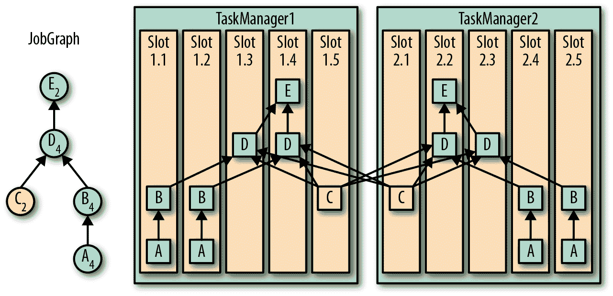
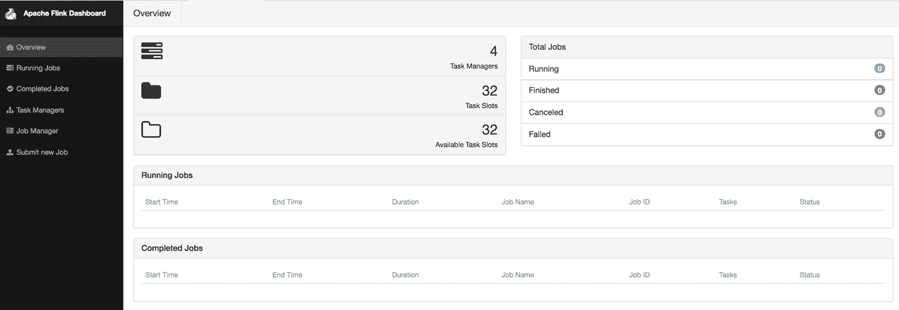
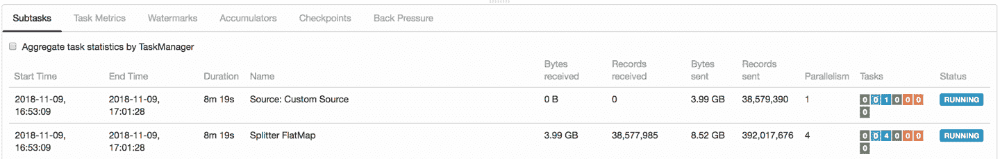
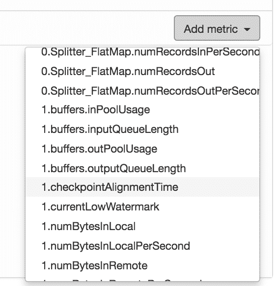
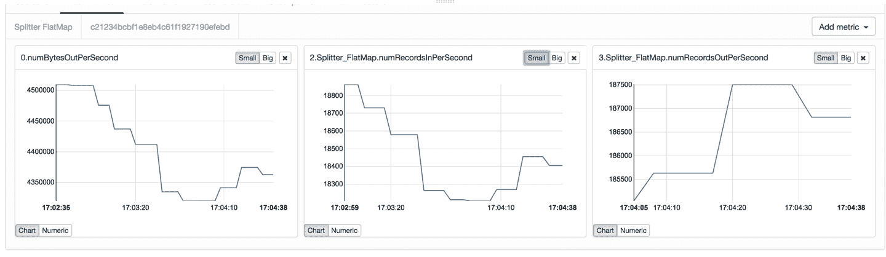

# 第十章：操作 Flink 和流应用程序

流应用程序是长时间运行的，其工作负载通常是不可预测的。流作业连续运行几个月并不罕见，因此其操作需求与短暂批处理作业的需求有很大不同。考虑一种情况，您在部署的应用程序中检测到一个 bug。如果您的应用程序是批处理作业，您可以轻松地在离线状态下修复 bug，然后在当前作业实例完成后重新部署新的应用程序代码。但是如果您的作业是长时间运行的流作业呢？在保证正确性的同时如何低成本地应用重新配置？

如果您正在使用 Flink，您无需担心。Flink 将会为您完成所有繁重的工作，因此您可以轻松监视、操作和重新配置您的作业，同时保留精确一次性状态语义。在本章中，我们介绍 Flink 用于操作和维护连续运行的流应用程序的工具。我们将向您展示如何收集指标并监视您的应用程序，以及在想要更新应用程序代码或调整应用程序资源时如何保持结果的一致性。

# 运行和管理流应用程序

正如您所预期的那样，维护流应用程序比维护批处理应用程序更具挑战性。流应用程序具有状态并且持续运行，而批处理应用程序则是周期性执行的。重新配置、扩展或更新批处理应用程序可以在执行之间进行，这比升级连续摄取、处理和发射数据的应用程序要容易得多。

然而，Apache Flink 具有许多功能，可以显著简化流应用程序的维护工作。这些功能大多基于保存点。¹ Flink 提供以下接口来监视和控制其主节点、工作节点和应用程序：

1.  命令行客户端是用于提交和控制应用程序的工具。

1.  REST API 是命令行客户端和 Web UI 使用的基础接口。用户和脚本可以访问它，并提供对系统和应用程序指标的访问，以及提交和管理应用程序的端点。

1.  Web UI 是一个提供有关 Flink 集群和正在运行的应用程序的详细信息和指标的 Web 界面。它还提供基本功能来提交和管理应用程序。Web UI 在 “Flink Web UI” 中有描述。

在本节中，我们解释了保存点的实际方面，并讨论了如何使用 Flink 的命令行客户端和 REST API 启动、停止、暂停和恢复、扩展以及升级具有状态的流应用程序。

## Savepoints

保存点基本上与检查点相同——它是应用程序状态的一致完整快照。但是，检查点和保存点的生命周期不同。检查点会根据应用程序的配置自动创建，在失败时加载，并由 Flink 自动删除（具体取决于应用程序的配置）。此外，除非应用程序显式启用检查点保留，否则在取消应用程序时检查点会被自动删除。相比之下，保存点必须由用户或外部服务手动触发，并且永远不会被 Flink 自动删除。

保存点是持久数据存储中的一个目录。它包括一个子目录，其中包含包含所有任务状态的数据文件，以及一个包含所有数据文件绝对路径的二进制元数据文件。由于元数据文件中的路径是绝对的，将保存点移动到不同路径将使其无法使用。这是保存点的结构：

```
# Savepoint root path
/savepoints/

# Path of a particular savepoint
/savepoints/savepoint-:shortjobid-:savepointid/

# Binary metadata file of a savepoint
/savepoints/savepoint-:shortjobid-:savepointid/_metadata

# Checkpointed operator states
/savepoints/savepoint-:shortjobid-:savepointid/:xxx

```

## 使用命令行客户端管理应用程序

Flink 的命令行客户端提供启动、停止和管理 Flink 应用程序的功能。它从 *./conf/flink-conf.yaml* 文件中读取配置（参见 “系统配置”）。您可以在 Flink 设置的根目录中使用命令 `./bin/flink` 调用它。

在没有额外参数的情况下运行，客户端会打印帮助消息。

# Windows 上的命令行客户端

命令行客户端基于一个 bash 脚本。因此，它无法在 Windows 命令行中运行。*./bin/flink.bat* 脚本提供的功能非常有限。如果您是 Windows 用户，建议使用常规命令行客户端，并在 WSL 或 Cygwin 上运行。

### 启动应用程序

您可以使用命令行客户端的 `run` 命令启动应用程序：

```
./bin/flink run ~/myApp.jar
```

上述命令从 JAR 文件的 *META-INF/MANIFEST.MF* 文件的 `program-class` 属性引用的类的 `main()` 方法开始应用程序，而不向应用程序传递任何参数。客户端将 JAR 文件提交到主进程，然后将其分发到工作节点。

您可以通过在命令的末尾附加参数来传递参数给应用程序的 `main()` 方法：

```
./bin/flink run ~/myApp.jar my-arg1 my-arg2 my-arg3

```

默认情况下，客户端在提交应用程序后不会返回，而是等待其终止。您可以使用 `-d` 标志以分离模式提交应用程序，如下所示：

```
./bin/flink run -d ~/myApp.jar

```

客户端不会等待应用程序终止，而是返回并打印提交的作业 ID。作业 ID 用于在获取保存点、取消或重新缩放应用程序时指定作业。您可以使用 `-p` 标志指定应用程序的默认并行度：

```
./bin/flink run -p 16 ~/myApp.jar

```

上述命令将执行环境的默认并行度设置为 16。执行环境的默认并行度会被应用源代码显式指定的所有设置覆盖——在`StreamExecutionEnvironment`或操作符上调用`setParallelism()`定义的并行度优先于默认值。

如果您的应用程序 JAR 文件的清单文件未指定入口类，则可以使用`-c`参数指定该类：

```
./bin/flink run -c my.app.MainClass ~/myApp.jar

```

客户端将尝试启动静态的`main()`方法，位于`my.app.MainClass`类中。

默认情况下，客户端将应用程序提交到由*./conf/flink-conf.yaml*文件指定的 Flink 主节点（有关不同设置的配置，请参阅“系统配置”）。您可以使用`-m`标志将应用程序提交到特定的主节点进程：

```
./bin/flink run -m myMasterHost:9876 ~/myApp.jar

```

此命令将应用程序提交到运行在主机`myMasterHost`端口`9876`上的主节点。

###### 注意

如果您首次启动应用程序或未提供保存点或检查点以初始化状态，则应用程序的状态将为空。在这种情况下，一些有状态的操作符会运行特殊逻辑来初始化它们的状态。例如，如果没有可恢复的读取位置，则 Kafka 源需要选择消费主题的分区偏移量。

### 列出正在运行的应用程序

对于要应用于运行中作业的所有操作，您需要提供一个标识应用程序的 JobID。可以从 Web UI、REST API 或使用命令行客户端获取作业的 ID。运行以下命令时，客户端将打印所有运行中作业的列表，包括它们的 JobID：

```
./bin/flink list -r
Waiting for response...
------------------ Running/Restarting Jobs -------------------
17.10.2018 21:13:14 : bc0b2ad61ecd4a615d92ce25390f61ad : 
Socket Window WordCount (RUNNING)
​--------------------------------------------------------------

```

在此示例中，JobID 为`bc0b2ad61ecd4a615d92ce25390f61ad`。

### 进行保存点和处理

可以使用命令行客户端为正在运行的应用程序获取保存点，如下所示：

```
./bin/flink savepoint <jobId> [savepointPath]

```

此命令触发具有提供的 JobID 的保存点。如果显式指定保存点路径，则保存在提供的目录中。否则，将使用*flink-conf.yaml*文件中配置的默认保存点目录。

要为作业`bc0b2ad61ecd4a615d92ce25390f61ad`触发保存点，并将其存储在目录*hdfs:///xxx:50070/savepoints*中，我们调用命令行客户端：

```
./bin/flink savepoint bc0b2ad61ecd4a615d92ce25390f61ad \
hdfs:///xxx:50070/savepoints
Triggering savepoint for job bc0b2ad61ecd4a615d92ce25390f61ad.
Waiting for response...
Savepoint completed. 
Path: hdfs:///xxx:50070/savepoints/savepoint-bc0b2a-63cf5d5ccef8
You can resume your program from this savepoint with the run command.

```

保存点可能占用大量空间，并且不会被 Flink 自动删除。您需要手动删除它们以释放已使用的存储空间。可以使用以下命令删除保存点：

```
./bin/flink savepoint -d <savepointPath>

```

要删除之前触发的保存点，请执行以下命令：

```
./bin/flink savepoint -d \
hdfs:///xxx:50070/savepoints/savepoint-bc0b2a-63cf5d5ccef8
Disposing savepoint 'hdfs:///xxx:50070/savepoints/savepoint-bc0b2a-63cf5d5ccef8'.
Waiting for response...
​Savepoint 'hdfs:///xxx:50070/savepoints/savepoint-bc0b2a-63cf5d5ccef8' disposed.

```

# 删除保存点

删除一个保存点之前，不得在另一个检查点或保存点完成之前进行。由于系统处理保存点类似于常规检查点，运营商也会收到完成保存点的通知并对其进行操作。例如，事务性下沉在保存点完成时提交对外系统的更改。为了确保输出的精确一次性，Flink 必须从最新完成的检查点或保存点中恢复。如果 Flink 尝试从已删除的保存点中恢复，故障恢复将失败。一旦另一个检查点（或保存点）完成，您可以安全地删除保存点。

### 取消应用程序

应用程序可以以两种方式取消：带保存点或不带保存点。要取消运行中的应用程序而不获取保存点，请运行以下命令：

```
./bin/flink cancel <jobId>

```

为了在取消正在运行的应用程序之前获取保存点，请将 `-s` 标志添加到 `cancel` 命令中：

```
./bin/flink cancel -s [savepointPath] <jobId>

```

如果您未指定 `savepointPath`，则将使用在 *./conf/flink-conf.yaml* 文件中配置的默认保存点目录（详见“系统配置”）。如果保存点文件夹既未在命令中显式指定，也未从配置中提供，则命令将失败。要取消具有作业 ID `bc0b2ad61ecd4a615d92ce25390f61ad` 的应用程序并将保存点存储在 *hdfs:///xxx:50070/savepoints*，请运行以下命令：

```
./bin/flink cancel -s \
hdfs:///xxx:50070/savepoints d5fdaff43022954f5f02fcd8f25ef855
Cancelling job bc0b2ad61ecd4a615d92ce25390f61ad 
with savepoint to hdfs:///xxx:50070/savepoints.
Cancelled job bc0b2ad61ecd4a615d92ce25390f61ad. 
Savepoint stored in hdfs:///xxx:50070/savepoints/savepoint-bc0b2a-d08de07fbb10.

```

# 取消应用程序可能会失败

请注意，如果获取保存点失败，则作业将继续运行。您需要尝试取消作业的另一个尝试。

### 从保存点启动应用程序

从保存点启动应用程序非常简单。您只需使用运行命令启动应用程序，并使用 `-s` 选项另外提供保存点的路径：

```
./bin/flink run -s <savepointPath> [options] <jobJar> [arguments]

```

当作业启动时，Flink 将保存点的各个状态快照与启动应用程序的所有状态进行匹配。这种匹配分为两步。首先，Flink 比较保存点和应用程序操作符的唯一标识符。其次，它为每个操作符匹配状态标识符（详见“保存点”）。

# 您应该定义唯一的操作符 ID

如果您没有使用 `uid()` 方法为您的操作符分配唯一的 ID，Flink 将分配默认标识符，这些标识符是依赖于操作符类型和所有前面操作符的哈希值。由于无法更改保存点中的标识符，如果您不使用 `uid()` 手动分配操作符标识符，则在更新和演变应用程序时的选择将更少。

如前所述，仅当应用程序与保存点兼容时，才能从保存点启动应用程序。未修改的应用程序始终可以从其保存点重新启动。但是，如果重新启动的应用程序与保存点所取的应用程序不同，则需要考虑三种情况：

+   如果你向应用程序**添加了新的状态**或更改了有状态操作符的唯一标识符，则 Flink 在保存点中找不到相应的状态快照。在这种情况下，新状态将被初始化为空。

+   如果你从应用程序中**删除了一个状态**或者更改了有状态操作符的唯一标识符，那么在保存点中存在无法匹配到应用程序的状态。在这种情况下，Flink 不会启动应用程序，以避免丢失保存点中的状态。你可以通过在运行命令中添加 `-n` 选项来禁用此安全检查。

+   如果你在应用程序中**更改了状态**—改变了状态原语或修改了状态的数据类型—应用程序将无法启动。这意味着你不能轻易地演变应用程序中状态的数据类型，除非你从一开始就考虑了应用程序中的状态演变。Flink 社区目前正在努力改进对状态演变的支持。（参见《修改操作符状态》。）

### 扩展应用程序的内部和外部

增加或减少应用程序的并行度并不困难。你需要进行保存点，取消应用程序，并从保存点重新启动并调整并行度。应用程序的状态将自动重新分布到更大或更小数量的并行操作任务中。有关不同类型的操作符状态和键控状态如何扩展的详细信息，请参阅《扩展有状态操作符》。但是，有几点需要考虑。

如果你需要确保一次性结果，你应该进行保存点，并使用集成的保存点并取消命令停止应用程序。这可以防止保存点之后完成另一个检查点，从而触发一次性 sink 在保存点之后发出数据。

如《设置并行度》中所述，应用程序及其操作符的并行度可以通过不同方式指定。默认情况下，操作符使用其关联的 `StreamExecutionEnvironment` 的默认并行度运行。可以在启动应用程序时指定默认并行度（例如，使用 CLI 客户端中的 `-p` 参数）。如果你实现的应用程序使其操作符的并行度依赖于默认环境并行度，那么你可以通过从相同的 JAR 文件启动应用程序并指定新的并行度来简单地扩展应用程序。然而，如果在 `StreamExecutionEnvironment` 上或某些操作符上硬编码了并行度，则可能需要在提交执行之前调整源代码并重新编译和重新打包应用程序。

如果你的应用程序的并行度依赖于环境的默认并行度，Flink 提供了一个原子重新调整命令，可以进行保存点，取消应用程序，并使用新的默认并行度重新启动：

```
./bin/flink modify <jobId> -p <newParallelism>

```

要将 jobId `bc0b2ad61ecd4a615d92ce25390f61ad` 的应用程序重新调整到并行度为 16，请运行以下命令：

```
./bin/flink modify bc0b2ad61ecd4a615d92ce25390f61ad -p 16
Modify job bc0b2ad61ecd4a615d92ce25390f61ad.
​Rescaled job bc0b2ad61ecd4a615d92ce25390f61ad. Its new parallelism is 16.

```

如 “缩放有状态操作符” 中所述，Flink 将有状态的操作符的键控状态分布在所谓的键组的粒度上。因此，有状态操作符的最大并行度取决于键组的数量。使用 `setMaxParallelism()` 方法可为每个操作符配置键组的数量。（见 “定义键控状态操作符的最大并行度”。）

## 使用 REST API 管理应用程序

用户或脚本可以直接访问 REST API，并公开有关 Flink 集群及其应用程序的信息，包括指标以及提交和控制应用程序的端点。Flink 从同一 Web 服务器运行 REST API 和 Web UI，作为 Dispatcher 进程的一部分。默认情况下，它们都公开在端口 8081 上。您可以通过 *./conf/flink-conf.yaml* 文件中的配置键 `rest.port` 配置不同的端口。值为 -1 会禁用 REST API 和 Web UI。

与 REST API 交互的常见命令行工具是 `curl`。典型的 `curl` REST 命令如下：

```
curl -X <HTTP-Method> [-d <parameters>] http://hostname:port/v1/<REST-point>

```

`v1` 表示 REST API 的版本。Flink 1.7 提供第一个版本 (`v1`) 的 API。假设您在运行本地 Flink 设置，并将其 REST API 公开在端口 8081 上，则以下 `curl` 命令提交一个对 `/overview` REST 端点的 `GET` 请求：

```
curl -X GET http://localhost:8081/v1/overview

```

命令返回有关集群的一些基本信息，如 Flink 版本、TaskManagers 数量、任务槽以及正在运行、已完成、取消或失败的作业：

```
{
 "taskmanagers":2,
 "slots-total":8,
 "slots-available":6,
 "jobs-running":1,
 "jobs-finished":2,
 "jobs-cancelled":1,
 "jobs-failed":0,
 "flink-version":"1.7.1",
 "flink-commit":"89eafb4"
}

```

下面列出并简要描述了最重要的 REST 调用。有关支持的所有调用列表，请参阅 Apache Flink 的[官方文档](http://bit.ly/2TAPy6N)。“使用命令行客户端管理应用程序” 提供了有关一些操作（如升级或扩展应用程序）的更多详细信息。

### 管理和监控 Flink 集群

REST API 提供了一些端点，用于查询运行中集群的信息以及关闭它。表 10-1、10-2 和 10-3 显示了获取有关 Flink 集群信息的 REST 请求，如任务槽数、运行和完成的作业、JobManager 的配置或所有连接的 TaskManagers 列表。

表 10-1\. 获取基本集群信息的 REST 请求

| 请求 | `GET /overview` |
| --- | --- |
| 响应 | 显示集群的基本信息如上所示 |

表 10-2\. 获取 JobManager 配置的 REST 请求

| 请求 | `GET /jobmanager/config` |
| --- | --- |
| 响应 | 返回 *./conf/flink-conf.yaml* 中定义的 JobManager 的配置 |

表 10-3\. 列出所有连接的 TaskManagers 的 REST 请求

| 请求 | `GET /taskmanagers` |
| --- | --- |
| 响应 | 返回包括其 ID 和基本信息（如内存统计和连接端口）在内的所有 TaskManager 列表 |

表格 10-4 显示了用于列出为 JobManager 收集的所有指标的 REST 请求。

表格 10-4\. 列出可用 JobManager 指标的 REST 请求

| 请求 | `GET /jobmanager/metrics` |
| --- | --- |
| 响应 | 返回为 JobManager 可用的指标列表 |

要检索一个或多个 JobManager 指标，请将所有请求的指标添加到请求中的 `get` 查询参数：

```
curl -X GET http://hostname:port/v1/jobmanager/metrics?get=metric1,metric2

```

表格 10-5 显示了用于列出 TaskManager 收集的所有指标的 REST 请求。

表格 10-5\. 列出可用 TaskManager 指标的 REST 请求

| 请求 |
| --- |

```
GET /taskmanagers/<tmId>/metrics

```

|

| 参数 | `tmId`：已连接的 TaskManager 的 ID |
| --- | --- |
| 响应 | 返回所选 TaskManager 可用的指标列表 |

要检索一个或多个 TaskManager 的指标，请将所有请求的指标添加到请求中的 `get` 查询参数：

```
curl -X GET http://hostname:port/v1/taskmanagers/<tmId>/metrics?get=metric1

```

您还可以使用显示在 表格 10-6 中的 REST 调用关闭集群。

表格 10-6\. 关闭集群的 REST 请求

| 请求 | `DELETE /cluster` |
| --- | --- |
| 动作 | 关闭 Flink 集群。请注意，在独立模式下，只有主进程将被终止，工作进程将继续运行。 |

### 管理和监控 Flink 应用程序

REST API 还可用于管理和监控 Flink 应用程序。要启动应用程序，首先需要将应用程序的 JAR 文件上传到集群。表格 10-7，10-8 和 10-9 显示了管理这些 JAR 文件的 REST 终端点。

表格 10-7\. 上传 JAR 文件的 REST 请求

| 请求 | `POST /jars/upload` |
| --- | --- |
| 参数 | 文件必须以多部分数据形式发送 |
| 动作 | 将 JAR 文件上传到集群 |
| 响应 | 已上传的 JAR 文件的存储位置 |

上传 JAR 文件的 `curl` 命令：

```
curl -X POST -H "Expect:" -F "jarfile=@path/to/flink-job.jar" \
 http://hostname:port/v1/jars/upload

```

表格 10-8\. 列出所有已上传 JAR 文件的 REST 请求

| 请求 | `GET /jars` |
| --- | --- |
| 响应 | 所有已上传的 JAR 文件列表。列表包括 JAR 文件的内部 ID、原始名称和上传时间。 |

表格 10-9\. 删除 JAR 文件的 REST 请求

| 请求 | `DELETE /jars/<jarId>` |
| --- | --- |
| 参数 | `jarId`：由列表 JAR 文件命令提供的 JAR 文件的 ID |
| 动作 | 删除由提供的 ID 引用的 JAR 文件 |

应用程序是通过显示在 表格 10-10 中的 REST 调用从上传的 JAR 文件启动的。

表格 10-10\. 启动应用程序的 REST 请求

| 请求 | `POST /jars/<jarId>/run` |
| --- | --- |
| 参数 | `jarId`：从中启动应用程序的 JAR 文件的 ID。您可以将其他参数作为 JSON 对象传递，例如作业参数、入口类、默认并行度、保存点路径和允许非恢复状态标志。 |
| 操作 | 使用提供的参数启动由 JAR 文件（及其入口类）定义的应用程序。如果提供了保存点路径，则从保存点初始化应用程序状态。 |
| 响应 | 启动应用程序的作业 ID |

使用默认并行度为 4 启动应用程序的 `curl` 命令是：

```
curl -d '{"parallelism":"4"}' -X POST \
http://localhost:8081/v1/jars/43e844ef-382f-45c3-aa2f-00549acd961e_App.jar/run

```

表 10-11、10-12 和 10-13 显示如何使用 REST API 管理运行中的应用程序。

表 10-11\. 列出所有应用程序的 REST 请求

| 请求 | `GET /jobs` |
| --- | --- |
| 响应 | 列出所有运行中应用程序的作业 ID，以及最近失败、取消和完成的应用程序的作业 ID。 |

表 10-12\. 显示应用程序详细信息的 REST 请求

| 请求 | `GET /jobs/<jobId>` |
| --- | --- |
| 参数 | `jobId`: 由列表应用程序命令提供的作业 ID |
| 响应 | 基本统计信息，如应用程序的名称、启动时间（和结束时间），以及有关执行任务的信息，包括摄取和发出的记录数和字节数 |

REST API 还提供有关应用程序以下方面的更详细信息：

+   应用程序的操作计划

+   应用程序的配置

+   应用程序在各个详细级别上的收集指标

+   检查点度量

+   回压指标

+   导致应用程序失败的异常

查看 [官方文档](http://bit.ly/2TAPy6N) 获取访问此信息的详细信息。

表 10-13\. 取消应用程序的 REST 请求

| 请求 |
| --- |

```
PATCH /jobs/<jobId>
```

|

| 参数 | `jobId`: 由列表应用程序命令提供的作业 ID |
| --- | --- |
| 操作 | 取消应用程序 |

您还可以通过显示在 表 10-14 中的 REST 调用获取正在运行的应用程序的保存点。

表 10-14\. 用于获取应用程序保存点的 REST 请求

| 请求 |
| --- |

```
POST /jobs/<jobId>/savepoints
```

|

| 参数 | 由列表应用程序命令提供的作业 ID。此外，您需要提供一个 JSON 对象，其中包含保存点文件夹的路径，并告知是否终止带有保存点的应用程序。 |
| --- | --- |
| 操作 | 获取应用程序的保存点 |
| 响应 | 用于检查保存点触发操作是否成功完成的请求 ID |

触发不取消保存点的 `curl` 命令是：

```
curl -d '{"target-directory":"file:///savepoints", "cancel-job":"false"}'\ 
-X POST http://localhost:8081/v1/jobs/e99cdb41b422631c8ee2218caa6af1cc/savepoints
{"request-id":"ebde90836b8b9dc2da90e9e7655f4179"}

```

# 使用保存点取消应用程序可能失败

只有在成功获取保存点的情况下，取消应用程序的请求才会成功。如果保存点命令失败，应用程序将继续运行。

要检查带有 ID `ebde90836b8b9dc2da90e9e7655f4179` 的请求是否成功，并检索保存点运行的路径：

```
curl -X GET http://localhost:8081/v1/jobs/e99cdb41b422631c8ee2218caa6af1cc/\
savepoints/ebde90836b8b9dc2da90e9e7655f4179
{"status":{"id":"COMPLETED"} 
"operation":{"location":"file:///savepoints/savepoint-e99cdb-34410597dec0"}}

```

要释放保存点，请使用显示在 表 10-15 中的 REST 调用。

表 10-15\. 释放保存点的 REST 请求

| 请求 |
| --- |

```
POST /savepoint-disposal
```

|

| 参数 | 需要提供作为 JSON 对象参数的保存点路径 |
| --- | --- |
| 操作 | 处置一个保存点 |
| 响应 | 用于检查保存点是否成功释放的请求 ID |

要使用 `curl` 处置一个保存点，请运行：

```
curl -d '{"savepoint-path":"file:///savepoints/savepoint-e99cdb-34410597"}'\
-X POST http://localhost:8081/v1/savepoint-disposal
{"request-id":"217a4ffe935ceac2c281bdded76729d6"}

```

表 10-16 显示重新缩放应用程序的 REST 调用。

表 10-16\. 重新缩放应用程序的 REST 请求

| 请求 |
| --- |

```
PATCH /jobs/<jobID>/rescaling
```

|

| 参数 | `jobID`：由列表应用命令提供的作业 ID。此外，您需要将应用程序的新并行度作为 URL 参数提供。 |
| --- | --- |
| 操作 | 获取一个保存点，取消应用程序，并使用保存点的新默认并行度重新启动应用程序 |
| 响应 | 用于检查重缩放请求是否成功的请求 ID |

要使用 `curl` 将应用程序重新缩放到新的默认并行度 16，请运行：

```
curl -X PATCH
http://localhost:8081/v1/jobs/129ced9aacf1618ebca0ba81a4b222c6/rescaling\
?parallelism=16
{"request-id":"39584c2f742c3594776653f27833e3eb"}

```

# 应用程序可能不会重新缩放

如果触发的保存点失败，应用程序将继续以原始并行度运行。您可以使用请求 ID 检查重新缩放请求的状态。

## 在容器中捆绑和部署应用程序

到目前为止，我们已经解释了如何在运行中的 Flink 集群上启动应用程序。这就是我们称之为框架风格的应用程序部署。在“应用程序部署”中，我们简要介绍了另一种选择——库模式，它不需要运行 Flink 集群来提交作业。

在库模式下，应用程序被捆绑到一个 Docker 镜像中，该镜像还包含所需的 Flink 二进制文件。该镜像可以通过两种方式启动——作为 JobMaster 容器或 TaskManager 容器。当镜像作为 JobMaster 部署时，容器启动一个 Flink 主进程，立即启动捆绑的应用程序。TaskManager 容器在 JobMaster 注册自己并提供其处理插槽。一旦有足够的插槽可用，JobMaster 容器就会部署应用程序以执行。

运行 Flink 应用程序的库式风格类似于在容器化环境中部署微服务。当部署在容器编排框架（如 Kubernetes）上时，框架会重新启动失败的容器。在本节中，我们描述了如何构建特定作业的 Docker 镜像以及如何在 Kubernetes 上部署库式捆绑应用程序。

### 构建特定作业的 Flink Docker 镜像

Apache Flink 提供了一个脚本来构建特定作业的 Flink Docker 镜像。该脚本包含在源分发和 Flink 的 Git 存储库中。它不是 Flink 二进制分发的一部分。

您可以下载并提取 Flink 的源分发包，或克隆 Git 存储库。从分发包的基本文件夹开始，脚本位于 *./flink-container/docker/build.sh*。

构建脚本创建并注册一个新的 Docker 镜像，该镜像基于 Java Alpine 镜像，这是一个提供 Java 的最小基础镜像。脚本需要以下参数：

+   Flink 存档的路径

+   应用程序 JAR 文件的路径

+   新镜像的名称

要使用包含本书示例应用程序的 Flink 1.7.1 构建镜像，请执行以下脚本：

```
cd ./flink-container/docker
./build.sh \
    --from-archive <path-to-Flink-1.7.1-archive> \
    --job-jar <path-to-example-apps-JAR-file> \
    --image-name flink-book-apps

```

如果在构建脚本完成后运行`docker images`命令，您应该看到一个名为`flink-book-apps`的新 Docker 镜像。

*./flink-container/docker*目录还包含一个*docker-compose.yml*文件，用于使用`docker-compose`部署 Flink 应用程序。

如果运行以下命令，则从“A Quick Look at Flink”的示例应用程序部署到一个主控和三个工作容器的 Docker 上：

```
FLINK_DOCKER_IMAGE_NAME=flink-book-jobs \
  FLINK_JOB=io.github.streamingwithflink.chapter1.AverageSensorReadings \
  DEFAULT_PARALLELISM=3 \
  docker-compose up -d

```

您可以通过访问运行在*http://localhost:8081*的 Web UI 来监控和控制应用程序。

### 在 Kubernetes 上运行特定作业的 Docker 镜像

在 Kubernetes 上运行特定作业的 Docker 镜像与在“Kubernetes”中描述的启动 Flink 集群非常相似。原则上，您只需调整描述部署的 YAML 文件以使用包含作业代码的镜像，并配置它在容器启动时自动启动作业。

Flink 为源分发或项目 Git 仓库中提供的 YAML 文件提供模板。从基础目录开始，模板位于以下位置：

```
./flink-container/kubernetes
```

该目录包含两个模板文件：

+   *job-cluster-job.yaml.template*将主控容器配置为 Kubernetes 作业。

+   *task-manager-deployment.yaml.template*将工作容器配置为 Kubernetes 部署。

两个模板文件都包含需要替换为实际值的占位符：

+   `${FLINK_IMAGE_NAME}`：作业特定镜像的名称。

+   `${FLINK_JOB}`：要启动的作业的主类。

+   `${FLINK_JOB_PARALLELISM}`：作业的并行度。此参数还确定启动的工作容器数量。

如您所见，这些是我们在使用`docker-compose`部署作业特定镜像时使用的相同参数。该目录还包含一个定义 Kubernetes 服务的 YAML 文件*job-cluster-service.yaml*。一旦复制了模板文件并配置了所需的值，您就可以像以前一样使用`kubectl`将应用程序部署到 Kubernetes：

```
kubectl create -f job-cluster-service.yaml
kubectl create -f job-cluster-job.yaml
kubectl create -f task-manager-deployment.yaml

```

# 在 Minikube 上运行特定作业图像

在 Minikube 集群上运行特定作业图像需要比在“Kubernetes”中讨论的步骤多一些。问题在于 Minikube 试图从公共 Docker 镜像注册表而不是您机器的本地 Docker 注册表中获取自定义镜像。

但是，您可以通过运行以下命令配置 Docker 将其镜像部署到 Minikube 自己的注册表：

```
eval $(minikube docker-env)

```

之后您在此 shell 中构建的所有映像都将部署到 Minikube 的映像注册表中。Minikube 必须在运行状态。

此外，您需要在 YAML 文件中设置`ImagePullPolicy`为`Never`，以确保 Minikube 从其自己的注册表中获取映像。

一旦特定于作业的容器运行起来，你可以按照“Kubernetes”章节描述的方式将集群视为常规的 Flink 集群。

# 控制任务调度

Flink 应用程序通过将运算符并行化为任务并分布这些任务到集群中的工作进程来并行执行。与许多其他分布式系统一样，Flink 应用程序的性能很大程度上取决于任务的调度方式。分配任务的工作进程、与任务同处一个位置的任务以及分配给工作进程的任务数量，这些因素都可能对应用程序的性能产生显著影响。

在“任务执行”章节中，我们描述了 Flink 如何将任务分配给插槽，并如何利用任务链接来减少本地数据交换的成本。在本节中，我们讨论了如何调整默认行为、控制任务链接以及任务分配到插槽，以提高应用程序的性能。

## 控制任务链接

任务链接将两个或多个运算符的并行任务融合成一个由单个线程执行的单个任务。融合的任务通过方法调用交换记录，因此基本上没有通信成本。由于任务链接可以提高大多数应用程序的性能，因此在 Flink 中默认启用。

然而，某些应用程序可能不会从任务链接中获益。一个原因是为了打破昂贵函数的链条，以便在不同的处理插槽上执行它们。您可以通过`StreamExecutionEnvironment`完全禁用应用程序的任务链接：

```
StreamExecutionEnvironment.disableOperatorChaining()

```

除了为整个应用程序禁用链接外，您还可以控制单个运算符的链接行为。要禁用特定运算符的链接，可以调用其`disableChaining()`方法。这将阻止该运算符的任务链接到前后任务（Example 10-1）。

##### Example 10-1\. 为运算符禁用任务链接

```
val input: DataStream[X] = ...
val result: DataStream[Y] = input
  .filter(new Filter1())
  .map(new Map1())
  // disable chaining for Map2
  .map(new Map2()).disableChaining()
  .filter(new Filter2())

```

Example 10-1 中的代码会产生三个任务：`Filter1` 和 `Map1` 的链接任务，`Map2` 的单独任务以及 `Filter2` 的任务，不允许链接到 `Map2`。

还可以通过调用其`startNewChain()`方法（Example 10-2）来启动运算符的新链。该运算符的任务将不会链接到前面的任务，但如果符合链接要求，则会链接到后续任务。

##### Example 10-2\. 使用运算符启动新的任务链

```
val input: DataStream[X] = ...
val result: DataStream[Y] = input
  .filter(new Filter1())
  .map(new Map1())
  // start a new chain for Map2 and Filter2
  .map(new Map2()).startNewChain()
  .filter(new Filter2())

```

在示例 10-2 中创建了两个链接任务：一个任务用于 `Filter1` 和 `Map1`，另一个任务用于 `Map2` 和 `Filter2`。请注意，新的链接任务以调用`startNewChain()`方法的操作符开始——在我们的示例中是`Map2`。

## 定义槽共享组

Flink 的默认任务调度策略将程序的完整切片分配给单个处理槽，即将应用程序的每个操作符的一个任务分配给单个处理槽。² 根据应用程序的复杂性和操作符的计算成本，这种默认策略可能会使处理槽过载。Flink 提供手动控制任务分配到槽的机制——即槽共享组。

每个操作符都是槽共享组的成员。所有属于同一槽共享组的操作符任务都由相同的槽处理。在槽共享组内，任务按照“任务执行”中描述的方式分配给槽——每个槽处理每个操作符的最多一个任务。因此，一个槽共享组需要与其操作符的最大并行度相同数量的处理槽。属于不同槽共享组的操作符任务不由相同的槽执行。

默认情况下，每个操作符都属于`"default"`槽共享组。对于每个操作符，您可以使用`slotSharingGroup(String)`方法显式指定其槽共享组。如果其输入操作符都属于同一组，则操作符继承其输入操作符的槽共享组。如果输入操作符属于不同组，则操作符属于`"default"`组。示例 10-3 展示了如何在 Flink DataStream 应用程序中指定槽共享组。

##### 示例 10-3 控制任务调度与槽共享组

```
// slot-sharing group "green"
val a: DataStream[A] = env.createInput(...)
  .slotSharingGroup("green")
  .setParallelism(4)
val b: DataStream[B] = a.map(...)
  // slot-sharing group "green" is inherited from a
  .setParallelism(4)

// slot-sharing group "yellow"
val c: DataStream[C] = env.createInput(...)
  .slotSharingGroup("yellow")
  .setParallelism(2)

// slot-sharing group "blue"
val d: DataStream[D] = b.connect(c.broadcast(...)).process(...)
  .slotSharingGroup("blue")
  .setParallelism(4)
val e = d.addSink()
  // slot-sharing group "blue" is inherited from d
  .setParallelism(2)

```

应用程序在示例 10-3 中包括五个操作符、两个源、两个中间操作符和一个接收操作符。这些操作符分配到三个共享槽组中：`green`、`yellow`和`blue`。图 10-1 显示了应用程序的 JobGraph 及其任务如何映射到处理槽。



###### 图 10-1 控制任务调度与槽共享组

该应用程序需要 10 个处理槽。蓝色和绿色的槽共享组各需四个槽，因为其分配的操作符具有最大并行度。黄色的槽共享组需要两个槽。

# 调整检查点和恢复

启用故障容错的 Flink 应用程序会定期对其状态进行检查点。检查点可以是一项昂贵的操作，因为需要复制到持久存储的数据量可能相当大。增加检查点间隔可以减少常规处理期间的故障容错开销。但是，这也会增加作业在从故障中恢复后需要重新处理的数据量，以赶上流的尾部。

Flink 提供了几个参数来调整检查点和状态后端。配置这些选项对于确保生产中流应用程序的可靠和平稳运行非常重要。例如，减少每个检查点的开销可以促进更高的检查点频率，从而加快恢复周期。在本节中，我们描述了用于控制应用程序检查点和恢复的参数。

## 配置检查点

当您为应用程序启用检查点时，必须指定检查点间隔——JobManager 将在该间隔内启动应用程序源头的检查点。

在`StreamExecutionEnvironment`上启用了检查点：

```
val env: StreamExecutionEnvironment = ???

// enable checkpointing with an interval of 10 seconds.
env.enableCheckpointing(10000);

```

进一步配置检查点行为的选项由`CheckpointConfig`提供，该对象可从`StreamExecutionEnvironment`中获取：

```
// get the CheckpointConfig from the StreamExecutionEnvironment
val cpConfig: CheckpointConfig = env.getCheckpointConfig

```

默认情况下，Flink 创建检查点以确保状态一致性为一次性。但是，也可以配置为提供至少一次性保证：

```
// set mode to at-least-once
cpConfig.setCheckpointingMode(CheckpointingMode.AT_LEAST_ONCE);

```

根据应用程序的特性、其状态的大小以及状态后端及其配置，检查点可能需要几分钟的时间。此外，状态的大小可能会随时间的推移而增长和缩小，可能是由于长时间运行的窗口。因此，检查点花费的时间可能比配置的检查点间隔长。默认情况下，Flink 每次只允许一个检查点处于进行中状态，以避免检查点占用用于常规处理的太多资源。如果根据配置的检查点间隔需要启动检查点，但当前有另一个检查点正在进行，第二个检查点将被暂停，直到第一个检查点完成。

如果许多或所有检查点的时间超过了检查点间隔，这种行为可能不是最佳选择，原因有两个。首先，这意味着应用程序的常规数据处理将始终与并发检查点竞争资源。因此，其处理速度减慢，可能无法取得足够的进展以跟上传入的数据。其次，可能会因为需要等待另一个检查点完成而延迟检查点，从而导致较低的检查点间隔，在恢复期间导致较长的赶上处理。Flink 提供了参数来解决这些情况。

为确保应用程序能够取得足够的进展，您可以配置检查点之间的最小暂停时间。如果将最小暂停时间配置为 30 秒，则在完成一个检查点后的前 30 秒内不会启动新的检查点。这也意味着有效的检查点间隔至少为 30 秒，并且最多同时进行一个检查点。

```
// make sure we process at least 30s without checkpointing
cpConfig.setMinPauseBetweenCheckpoints(30000);

```

在某些情况下，您可能希望确保在配置的检查点间隔内进行检查点，即使检查点需要的时间超过了该间隔。一个例子是当检查点需要很长时间但不消耗太多资源时；例如，由于对外部系统的高延迟调用操作。在这种情况下，您可以配置最大并发检查点数目。

```
// allow three checkpoint to be in progress at the same time 
cpConfig.setMaxConcurrentCheckpoints(3);

```

###### 注意

保存点与检查点并发进行。由于检查点操作，Flink 不会延迟显式触发的保存点。无论进行中的检查点数目如何，保存点始终会启动。

为避免长时间运行的检查点，您可以配置超时间隔，超过此间隔后将取消检查点。默认情况下，检查点在 10 分钟后取消。

```
// checkpoints have to complete within five minutes, or are discarded
cpConfig.setCheckpointTimeout(300000);

```

最后，您可能还想配置检查点失败时的处理方式。默认情况下，检查点失败会导致应用程序重新启动的异常。您可以禁用此行为，并在检查点错误后让应用程序继续运行。

```
// do not fail the job on a checkpointing error
cpConfig.setFailOnCheckpointingErrors(false);

```

### 启用检查点压缩

Flink 支持压缩检查点和保存点。在 Flink 1.7 之前，唯一支持的压缩算法是 Snappy。您可以如下启用压缩检查点和保存点：

```
val env: StreamExecutionEnvironment = ???

// enable checkpoint compression
env.getConfig.setUseSnapshotCompression(true)

```

###### 注意

注意，增量 RocksDB 检查点不支持检查点压缩。

### 在应用程序停止后保留检查点

检查点的目的是在失败后恢复应用程序。因此，在作业停止运行时，无论是由于故障还是显式取消，它们都会清理。但是，您还可以启用一个称为外部化检查点的功能，在应用程序停止后保留检查点。

```
// Enable externalized checkpoints
cpConfig.enableExternalizedCheckpoints(
  ExternalizedCheckpointCleanup.RETAIN_ON_CANCELLATION)

```

外部化检查点有两个选项：

+   `RETAIN_ON_CANCELLATION`在应用程序完全失败并显式取消时保留检查点。

+   `DELETE_ON_CANCELLATION`仅在应用程序完全失败后保留检查点。如果显式取消应用程序，则删除检查点。

###### 注意

外部化检查点不替代保存点。它们使用特定于状态后端的存储格式，不支持重新调整大小。因此，在应用程序失败后，它们足以重新启动应用程序，但比保存点灵活性较低。应用程序再次运行后，可以进行保存点。

## 配置状态后端

应用程序的状态后端负责维护本地状态，执行检查点和保存点，并在故障后恢复应用程序状态。因此，应用程序状态后端的选择和配置对检查点性能有很大影响。有关各个状态后端的详细信息，请参阅"选择状态后端"。

应用程序的默认状态后端是 `MemoryStateBackend`。由于它将所有状态保存在内存中，并且检查点完全存储在易失性和 JVM 大小限制的 JobManager 堆存储中，因此不建议用于生产环境。但是，它在本地开发 Flink 应用程序时表现良好。"检查点和状态后端"描述了如何配置 Flink 集群的默认状态后端。

您还可以明确选择应用程序的状态后端：

```
val env: StreamExecutionEnvironment = ???

// create and configure state backend of your choice
val stateBackend: StateBackend = ???
// set state backend
env.setStateBackend(stateBackend)

```

不同的状态后端可以使用最小设置创建，如下所示。`MemoryStateBackend` 不需要任何参数。但是，有些构造函数接受参数以启用或禁用异步检查点（默认情况下启用）并限制状态的大小（默认为 5 MB）：

```
// create a MemoryStateBackend
val memBackend = new MemoryStateBackend()

```

`FsStateBackend` 只需要一个路径来定义检查点的存储位置。还有构造函数变体可用于启用或禁用异步检查点（默认情况下启用）：

```
// create a FsStateBackend that checkpoints to the /tmp/ckp folder
val fsBackend = new FsStateBackend("file:///tmp/ckp", true)

```

`RocksDBStateBackend` 只需要一个路径来定义检查点的存储位置，并采用一个可选参数来启用增量检查点（默认情况下禁用）。`RocksDBStateBackend` 总是异步写入检查点：

```
// create a RocksDBStateBackend that writes incremental checkpoints 
// to the /tmp/ckp folder
val rocksBackend = new RocksDBStateBackend("file:///tmp/ckp", true)

```

在"检查点和状态后端"中，我们讨论了状态后端的配置选项。当然，您也可以在应用程序中配置状态后端，覆盖默认值或群集范围的配置。为此，您必须通过向状态后端传递一个 `Configuration` 对象来创建一个新的后端对象。有关可用配置选项的描述，请参阅"检查点和状态后端"：

```
// all of Flink's built-in backends are configurable
val backend: ConfigurableStateBackend = ??? 

// create configuration and set options
val sbConfig = new Configuration()
sbConfig.setBoolean("state.backend.async", true)
sbConfig.setString("state.savepoints.dir", "file:///tmp/svp")

// create a configured copy of the backend
val configuredBackend = backend.configure(sbConfig)

```

由于 RocksDB 是一个外部组件，它带来了一套自己的调优参数，这些参数也可以为您的应用程序进行调整。默认情况下，RocksDB 针对 SSD 存储进行了优化，如果状态存储在旋转磁盘上，则性能不佳。Flink 为常见硬件设置提供了一些预定义的设置以提高性能。查看[文档](http://bit.ly/2CQu8bg)以了解更多可用的设置。您可以按以下方式将预定义选项应用于 `RocksDBStateBackend`：

```
val backend: RocksDBStateBackend = ???

// set predefined options for spinning disk storage
backend.setPredefinedOptions(PredefinedOptions.SPINNING_DISK_OPTIMIZED)

```

## 配置恢复

当经过检查点的应用程序失败时，将通过启动其任务、恢复其状态（包括源任务的读取偏移量）并继续处理来重启它。应用程序重新启动后立即处于追赶阶段。由于应用程序的源任务被重置到较早的输入位置，它处理先前失败时处理的数据以及应用程序关闭时累积的数据。

为了能够赶上流的尾部，应用程序必须以比新数据到达的速度更高的速度处理累积的数据。在应用程序追赶时，处理延迟——即输入变为可用直至实际处理的时间——会增加。

因此，应用程序在重启后需要足够的备用资源来成功恢复其常规处理。这意味着应用程序在常规处理期间不应该接近 100%的资源消耗。为恢复可用的资源越多，追赶阶段完成得越快，处理延迟恢复正常的速度也越快。

除了对恢复的资源考虑外，我们还将讨论另外两个与恢复相关的话题：重启策略和本地恢复。

### 重启策略

根据导致应用程序崩溃的故障，应用程序可能会因同样的故障再次崩溃。一个常见例子是应用程序无法处理的无效或损坏的输入数据。在这种情况下，应用程序将陷入无尽的恢复循环中，消耗大量资源而无法恢复到常规处理状态。Flink 具有三种重启策略来解决这个问题：

+   *固定延迟重启策略*会重新启动应用程序固定次数，并在重启尝试之前等待一段时间。

+   *故障率重启策略*在可配置的故障率未超出范围的情况下重启应用程序。故障率指定为在时间间隔内的最大故障次数。例如，您可以配置应用程序只要在过去的十分钟内没有超过三次失败就会重启。

+   *无重启策略*不会重启应用程序，而是立即失败。

应用程序的重启策略是通过`StreamExecutionEnvironment`配置的，如示例 10-4 所示。

##### 示例 10-4\. 配置应用程序的重启策略

```
val env = StreamExecutionEnvironment.getExecutionEnvironment

env.setRestartStrategy(
  RestartStrategies.fixedDelayRestart(
    5,                            // number of restart attempts
    Time.of(30, TimeUnit.SECONDS) // delay between attempts
))

```

如果没有显式定义重启策略，则使用的默认重启策略是固定延迟重启策略，重启尝试次数为`Integer.MAX_VALUE`，延迟为 10 秒。

### 本地恢复

Flink 的状态后端（除了 `MemoryStateBackend`）将检查点存储在远程文件系统中。这样首先保证状态已保存且持久化，其次能够在工作节点丢失或应用程序重新缩放时重新分发状态。然而，在恢复期间从远程存储读取状态并不是非常高效的。此外，在恢复时，可能能够在与故障前相同的工作节点上重新启动应用程序。

Flink 支持一个称为本地恢复的功能，可显著加快恢复速度，如果应用程序能够重新启动到相同的机器上。启用时，状态后端还将检查点数据的副本存储在其工作节点的本地磁盘上，除了将数据写入远程存储系统。应用程序重新启动时，Flink 尝试将相同的任务调度到相同的工作节点。如果成功，任务首先尝试从本地磁盘加载检查点数据。如果出现任何问题，它们会回退到远程存储。

本地恢复的实现方式是远程系统中的状态副本为真实数据源。任务仅在远程写入成功时才确认检查点。此外，检查点不会因为本地状态副本失败而失败。由于检查点数据被写入两次，本地恢复会增加检查点的开销。

可以在 *flink-conf.yaml* 文件中为集群或每个应用程序启用和配置本地恢复，方法如下所示：

+   `state.backend.local-recovery`: 此标志用于启用或禁用本地恢复。默认情况下，本地恢复未激活。

+   `taskmanager.state.local.root-dirs`: 此参数指定一个或多个本地路径，用于存储本地状态副本。

###### 注意

本地恢复仅影响分区键控状态，这种状态始终被分区，并且通常占据大部分状态大小。操作符状态不会存储在本地，需要从远程存储系统中检索。然而，操作符状态通常比键控状态小得多。此外，`MemoryStateBackend` 不支持本地恢复，因为它本身不支持大状态。

# 监控 Flink 集群和应用程序

监控您的流处理作业对确保其健康运行至关重要，并及早检测到可能的配置错误、资源不足或意外行为的症状。特别是当流处理作业是更大数据处理管道或用户面向应用程序的事件驱动服务的一部分时，您可能希望尽可能精确地监控其性能，并确保其满足延迟、吞吐量、资源利用率等特定目标。

Flink 在运行时收集一组预定义的指标，并提供一个框架，允许您定义和跟踪自己的指标。

## Flink Web UI

使用 Flink 的 Web UI 是了解您的 Flink 集群概况以及了解作业内部运行情况的最简单方法。您可以通过访问 `http://**<jobmanager-hostname>**:8081` 来访问仪表板。

在主屏幕上，您将看到集群配置的概述，包括 TaskManagers 的数量，配置和可用任务插槽数量，以及正在运行和已完成的作业数。图 10-2 展示了仪表板主屏幕的一个实例。左侧菜单链接到有关作业和配置参数的更详细信息，还允许通过上传 JAR 文件进行作业提交。



###### 图 10-2\. Apache Flink Web UI 主屏幕

如果您单击正在运行的作业，可以快速查看每个任务或子任务的运行统计信息，如图 10-3](#fig_statistics) 所示。您可以检查交换的持续时间、字节和记录，并根据需要对每个 TaskManager 进行汇总。



###### 图 10-3\. 运行中作业的统计数据

如果您单击“任务度量”选项卡，可以从下拉菜单中选择更多度量指标，如图 10-4](#fig_metrics) 所示。这些指标包括有关任务的更精细的统计信息，例如缓冲区使用情况、水印和输入/输出速率。



###### 图 10-4\. 选择要绘制的指标

图 10-5 展示了选择的指标如何显示为持续更新的图表。



###### 图 10-5\. 实时度量图

*检查点* 选项卡（图 10-3）显示有关先前和当前检查点的统计信息。在 *概述* 下，您可以查看触发了多少个检查点、正在进行中的检查点、成功完成的检查点或失败的检查点。如果单击 *历史* 视图，可以检索更详细的信息，例如状态、触发时间、状态大小以及在检查点对齐阶段期间缓冲的字节数。*摘要* 视图汇总检查点统计信息，并提供所有已完成检查点的最小、最大和平均值。最后，在 *配置* 下，您可以查看检查点的配置属性，例如设置的间隔和超时值。

类似地，*背压* 选项卡显示每个操作符和子任务的背压统计信息。如果单击行，将触发背压采样，并且将在大约五秒钟内看到消息 *采样进行中…*。采样完成后，您将在第二列中看到背压状态。受背压影响的任务将显示 *HIGH* 标志；否则，您应该看到一个漂亮的绿色 *OK* 消息显示。

## 度量系统

在生产环境中运行诸如 Flink 之类的数据处理系统时，监控其行为至关重要，以便发现和诊断性能下降的原因。Flink 默认收集多个系统和应用程序指标。指标按操作符、TaskManager 或 JobManager 收集。在这里，我们描述了一些常用的指标，并引导您参阅 Flink 文档获取可用指标的完整列表。

类别包括 CPU 利用率、内存使用情况、活动线程数、垃圾收集统计信息、网络指标（如排队的输入/输出缓冲区数）、整个集群的指标（如运行中的作业数和可用资源）、作业指标（包括运行时间、重试次数和检查点信息）、I/O 统计信息（包括本地和远程记录交换数）、水印信息、特定连接器的指标等。

### 注册和使用指标

要注册指标，您需要通过在`RuntimeContext`上调用`getMetrics()`方法来检索`MetricGroup`，如示例 Example 10-5 所示。

##### 示例 10-5\. 在 FilterFunction 中注册和使用指标

```
class PositiveFilter extends RichFilterFunction[Int] {

  @transient private var counter: Counter = _

  override def open(parameters: Configuration): Unit = {
    counter = getRuntimeContext
      .getMetricGroup
      .counter("droppedElements")
  }

  override def filter(value: Int): Boolean = {
    if (value > 0) {
      true
    }
    else {
      counter.inc()
      false
    }
  }
}

```

### 指标组

Flink 指标通过`MetricGroup`接口进行注册和访问。`MetricGroup`提供了创建嵌套的命名指标层次结构的方法，并提供了注册以下指标类型的方法：

Counter

`org.apache.flink.metrics.Counter`指标用于计量计数，并提供了增加和减少计数的方法。您可以使用`MetricGroup`上的`counter(String name, Counter counter)`方法注册计数器指标。

Gauge

`Gauge`指标在某一时刻计算任意类型的值。要使用`Gauge`，您需要实现`org.apache.flink.metrics.Gauge`接口，并使用`MetricGroup`上的`gauge(String name, Gauge gauge)`方法进行注册。代码示例 Example 10-6 展示了`WatermarkGauge`指标的实现，它公开了当前水印。

##### 示例 10-6\. 实现了一个展示当前水印的 WatermarkGauge 指标

```
public class WatermarkGauge implements Gauge<Long> {
  private long currentWatermark = Long.MIN_VALUE;

  public void setCurrentWatermark(long watermark) {
    this.currentWatermark = watermark;
    }

  @Override
  public Long getValue() {
    return currentWatermark;
  }
}

```

# 指标以字符串形式报告

如果类型没有提供有意义的`toString()`实现，指标报告器将把`Gauge`值转换为`String`，因此请确保您提供一个有意义的实现。

Histogram

您可以使用直方图表示数值数据的分布情况。Flink 的直方图专门用于报告长整型值的指标。`org.apache.flink.metrics.Histogram`接口允许您收集值，获取已收集值的当前计数，并为迄今为止见过的值创建统计信息，如最小值、最大值、标准差和平均值。

除了创建自己的直方图实现外，Flink 还允许您使用[DropWizard](https://github.com/dropwizard/metrics)直方图，方法是在以下位置添加依赖：

```
<dependency>
  <groupId>org.apache.flink</groupId>
  <artifactId>flink-metrics-dropwizard</artifactId>
  <version>flink-version</version>
</dependency>
```

您可以使用 `DropwizardHistogramWrapper` 类在 Flink 程序中注册一个 DropWizard 直方图，如 示例 10-7 所示。

##### 示例 10-7\. 使用 DropwizardHistogramWrapper

```
// create and register histogram
DropwizardHistogramWrapper histogramWrapper = 
  new DropwizardHistogramWrapper(
    new com.codahale.metrics.Histogram(new SlidingWindowReservoir(500)))
metricGroup.histogram("myHistogram", histogramWrapper)

// update histogram
histogramWrapper.update(value)

```

米

您可以使用 `Meter` 指标来测量某些事件发生的速率（每秒事件数）。`org.apache.flink.metrics.Meter` 接口提供了标记一个或多个事件发生、获取每秒事件当前速率以及获取计量器上标记的当前事件数的方法。

与直方图一样，您可以通过在 `pom.xml` 中添加 `flink-metrics-dropwizard` 依赖项并使用 `DropwizardMeterWrapper` 类将 Meter 用作 `DropWizard` 米来实现。

### 作用域和格式化指标

Flink 指标属于一个作用域，可以是系统作用域（用于系统提供的指标）或用户作用域（用于自定义用户指标）。指标由一个包含最多三个部分的唯一标识符引用：

1.  用户在注册指标时指定的名称

1.  可选的用户作用域

1.  系统作用域

例如，名称“myCounter”，用户作用域“MyMetrics”和系统作用域“localhost.taskmanager.512”将导致标识符“localhost.taskmanager.512.MyMetrics.myCounter”。您可以通过设置 `metrics.scope.delimiter` 配置选项来更改默认的“.” 分隔符。

系统作用域声明指标引用的系统组件以及应包含的上下文信息。指标可以作用于作业管理器、任务管理器、作业、操作器或任务。您可以通过在 *flink-conf.yaml* 文件中设置相应的指标选项来配置指标应包含的上下文信息。我们在 表 10-17 中列出了一些这些配置选项及其默认值。

表 10-17\. 系统作用域配置选项及其默认值

| 作用域 | 配置键 | 默认值 |
| --- | --- | --- |
| 作业管理器 | metrics.scope.jm | <host>.jobmanager |
| 作业管理器和作业 | metrics.scope.jm.job | <host>.jobmanager.<job_name> |
| 任务管理器 | metrics.scope.tm | <host>.taskmanager.<tm_id> |
| 任务管理器和作业 | metrics.scope.tm.job | <host>.taskmana**​****​**ger.<tm_id>.<job_name> |
| 任务 | metrics.scope.task | <host>.taskmanager.<tm_id>.<job_name>.<task_name>.<subtask_index> |
| 操作器 | metrics.scope.operator | <host>.taskmanager.<tm_id>.<job_name>.<operator_name>.<subtask_index> |

配置键包含常量字符串，如“taskmanager”，以及显示在尖括号中的变量。后者将在运行时替换为实际值。例如，`TaskManager` 指标的默认作用域可能创建作用域“localhost.taskmanager.512”，其中“localhost”和“512”是参数值。表 10-18 显示了可用于配置指标作用域的所有变量。

表 10-18\. 可用于配置指标作用域格式的所有变量

| 范围 | 可用变量 |
| --- | --- |
| `作业管理器：` | `<host>` |
| `任务管理器：` | `<host>, <tm_id>` |
| `作业：` | `<job_id>, <job_name>` |
| `任务：` | `<task_id>, <task_name>, <task_attempt_id>, <task_attempt_num>, <subtask_index>` |
| `操作符：` | `<operator_id>, <operator_name>, <subtask_index>` |

# 作业范围标识符必须是唯一的。

如果同时运行多个相同的作业副本，由于字符串冲突，可能会导致指标不准确。为避免此风险，您应确保每个作业的作用域标识符是唯一的。可以通过包含 `<job_id>` 来轻松处理此问题。

您还可以通过调用 `MetricGroup` 的 `addGroup()` 方法来为指标定义用户范围，如 示例 10-8 中所示。

##### 示例 10-8\. 定义用户范围“我的指标”

```
counter = getRuntimeContext
  .getMetricGroup
  .addGroup("MyMetrics")
  .counter("myCounter")

```

### 暴露指标

现在您已经学会了如何注册、定义和分组指标，您可能想知道如何从外部系统访问它们。毕竟，您可能收集指标是为了创建实时仪表板或将测量结果馈送给另一个应用程序。您可以通过*报告器*将指标暴露给外部后端系统，而 Flink 为其中的几种提供了实现（参见 表 10-19 ）。

表 10-19\. 可用指标报告器列表

| 报告器 | 实现 |
| --- | --- |
| `JMX` | org.apache.flink.metrics.jmx.JMXReporter |
| `Graphite` | org.apache.flink.metrics.graphite.GraphiteReporter |
| `Prometheus` | org.apache.flink.metrics.prometheus.PrometheusReporter |
| `PrometheusPushGateway` | org.apache.flink.metrics.prometheus.PrometheusPushGatewayReporter |
| `StatsD` | org.apache.flink.metrics.statsd.StatsDReporter |
| `Datadog` | org.apache.flink.metrics.datadog.DatadogHttpReporter |
| `Slf4j` | org.apache.flink.metrics.slf4j.Slf4jReporter |

如果要使用不在上述列表中的指标后端系统，还可以通过实现 *org.apache.flink.metrics.reporter.MetricReporter* 接口来定义自己的报告器。

报告器需要在 `flink-conf.yaml` 中进行配置。将以下行添加到您的配置文件中将定义一个名为“my_reporter”的 JMX 报告器，监听 9020-9040 端口：

```
metrics.reporters: my_reporter
Metrics.reporter.my_jmx_reporter.class: org.apache.flink.metrics.jmx.JMXReporter
metrics.reporter.my_jmx_reporter.port: 9020-9040

```

请参阅[Flink 文档](http://bit.ly/2FcdlBe)获取每个受支持报告器的完整配置选项列表。

## 监控延迟

延迟可能是您希望监控以评估流式作业性能特征的第一个指标。与此同时，它也是分布式流式引擎（如 Flink）中定义的最棘手的指标之一。在“延迟”中，我们广义地定义延迟为*处理事件所需的时间*。您可以想象，在高速率流式作业中尝试按事件跟踪延迟的精确实现在实践中可能会出现问题。如果事件对多个窗口贡献，考虑到窗口运算符会进一步复杂化延迟跟踪，我们是否需要报告第一次调用的延迟，还是需要等到评估事件可能属于的所有窗口？如果一个窗口多次触发会怎么样？

Flink 采用简单和低开销的方法来提供有用的延迟度量测量。它并不试图严格为每个事件测量延迟，而是通过定期从源发出特殊记录并允许用户跟踪这些记录到达接收器所需时间来近似延迟。这种特殊记录称为*延迟标记*，它携带一个时间戳，指示其发出时间。

要启用延迟跟踪，您需要配置从源发出延迟标记的频率。您可以通过在`ExecutionConfig`中设置`latencyTrackingInterval`来实现这一点，如下所示：

```
env.getConfig.setLatencyTrackingInterval(500L)

```

延迟间隔以毫秒为单位指定。接收到延迟标记后，除接收器外的所有运算符将其向下游转发。延迟标记使用与正常流记录相同的数据流通道和队列，因此它们的跟踪延迟反映了记录等待处理的时间。但是，它们不测量记录处理所需的时间，也不测量记录在状态中等待处理的时间。

运算符在一个延迟度量器中保留延迟统计信息，其中包含最小值、最大值和平均值，以及 50、95 和 99 百分位值。接收器运算符则保留每个并行源实例接收到的延迟标记统计信息，因此检查接收器处的延迟标记可以用来近似记录在数据流中遍历的时间。如果您想自定义运算符处理延迟标记的方式，您可以覆盖`processLatencyMarker()`方法，并使用`LatencyMarker`的方法`getMarkedTime()`、`getVertexId()`和`getSubTaskIndex()`来检索相关信息。

# 警惕时钟偏移

如果您没有使用像 NTP 这样的自动时钟同步服务，您的机器时钟可能会出现时钟偏移。在这种情况下，延迟跟踪估计将不可靠，因为其当前实现假设时钟已同步。

# 配置日志记录行为

日志记录是调试和理解应用程序行为的另一个重要工具。默认情况下，Flink 使用[SLF4J 日志抽象](https://www.slf4j.org/)以及 log4j 日志框架。

示例 10-9 展示了一个 `MapFunction`，它记录每个输入记录的转换过程。

##### 示例 10-9\. 在 MapFunction 中使用日志记录

```
import org.apache.flink.api.common.functions.MapFunction
import org.slf4j.LoggerFactory
import org.slf4j.Logger

class MyMapFunction extends MapFunction[Int, String] {

  Logger LOG = LoggerFactory.getLogger(MyMapFunction.class)

  override def map(value: Int): String = {
    LOG.info("Converting value {} to string.", value)
    value.toString
  }
}
```

要修改 log4j 记录器的属性，请修改 *conf/* 文件夹中的 *log4j.properties* 文件。例如，以下行将根日志级别设置为“warning”：

```
log4j.rootLogger=WARN
```

要设置自定义文件名和文件位置，请将 `-Dlog4j.configuration=` 参数传递给 JVM。Flink 还提供了 *log4j-cli.properties* 文件（用于命令行客户端）和 *log4j-yarn-session.properties* 文件（用于启动 YARN 会话的命令行客户端）。

除了 log4j 外，logback 也是一种替代方案，Flink 为该后端提供了默认配置文件。若要使用 logback 替代 log4j，则需要从 *lib/* 文件夹中移除 log4j。关于如何设置和配置后端的详细信息，请参阅[Flink 的文档](http://bit.ly/2JgrAZJ)和[logback 手册](http://bit.ly/2FPJbUH)。

# 概述

本章中，我们讨论了如何在生产环境中运行、管理和监控 Flink 应用程序。我们解释了收集和公开系统和应用程序指标的 Flink 组件、如何配置日志记录系统，以及如何使用命令行客户端和 REST API 启动、停止、恢复和调整应用程序。

¹ 请参阅第 3 章了解保存点的详细信息及其功能。

² 默认调度行为在第 3 章中有解释。
