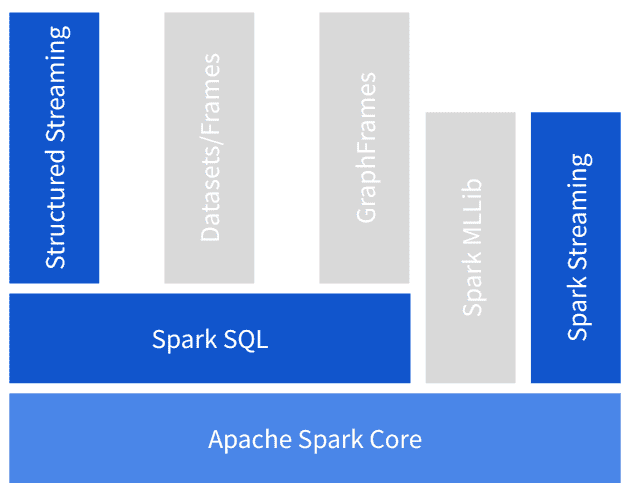

# 第一章：引入流处理

2011 年，马克·安德森（Marc Andreessen）著名地说过，“软件正在吞噬世界”，指的是在许多企业面临数字转型挑战的时代，数字经济蓬勃发展。成功的在线企业采用“在线”和“移动”运营模式，正在取代传统的“实体店”对手。

例如，想象一下在摄影店购买新相机的传统体验：我们会去店里转转，可能向店员询问几个问题，最终决定购买一个满足我们需求和期望的型号。完成购买后，店铺会记录信用卡交易，或者在现金支付时只会记录现金余额的变化，店长会知道他们库存中的特定相机型号减少了一个。

现在，让我们将这种体验带到在线环境中：首先，我们开始在网上搜索。我们访问了几家在线商店，我们在一个又一个商店之间留下了数字足迹。网站上的广告突然开始向我们展示我们查看的相机及其竞争对手的促销活动。最终，我们找到了一家在线商店提供给我们最好的交易并购买了相机。我们创建了一个账户。我们的个人数据被注册并与购买相关联。在我们完成购买时，我们被提供了其他人购买相同相机时可能喜欢的额外选项。我们的每一次数字交互，比如在网上搜索关键词，点击某些链接或花时间阅读特定页面，都会生成一系列事件，这些事件被收集并转化为业务价值，比如个性化广告或升级推荐。

评论安德森的话，2015 年，德里斯·布伊塔特（Dries Buytaert）说，“不，实际上，*数据*正在吞噬世界。”他的意思是，今天的颠覆性公司不再仅仅因为他们的软件而颠覆，而是因为他们收集的独特数据以及将这些数据转化为价值的能力。

流处理技术的采用是由企业日益增长的需求驱动的，以改善其在运营环境中对变化做出反应和适应的时间。这种随数据到来即时处理的方式提供了技术和战略上的优势。这种持续采用的示例包括互联网商务等行业，这些行业通过与客户的 24/7 互动创建了持续运行的数据管道，或者信用卡公司，分析交易在发生时以便检测和阻止欺诈活动。

另一个推动流处理的因素是，我们生成数据的能力远远超过我们理解数据的能力。我们不断增加个人和专业环境中计算能力设备的数量<破折号>电视机、连接汽车、智能手机、自行车电脑、智能手表、监控摄像机、恒温器等等。我们正在用设备围绕自己产生事件日志：代表设备历史上的行动和事件流的消息流。随着我们将这些设备越来越多地互联起来，我们创造了一种能够访问和因此分析这些事件日志的能力。这种现象为我们在近乎实时数据分析领域开启了令人难以置信的创意和创新的大爆发，前提是我们找到一种使分析成为可能的方法。在这个聚合事件日志的世界中，流处理提供了最节约资源的方式来促进数据流的分析。

毫不奇怪的是，数据正在吞噬这个世界，*流数据*也是如此。

在本章中，我们将使用 Apache Spark 开始我们的流处理之旅。为了让我们能够讨论 Spark 在流处理领域的能力，我们需要建立对流处理的共同理解，其应用及其挑战。在我们建立这种共同语言之后，我们将 Apache Spark 作为一个通用的数据处理框架引入，能够使用统一模型处理批处理和流处理工作负载的要求。最后，我们将重点介绍 Spark 的流处理能力，其中我们介绍了两个可用的 API：Spark Streaming 和 Structured Streaming。我们简要讨论它们的显著特点，以提供一个关于本书其余部分内容的预览。

# 什么是流处理？

流处理是一种从*无界数据*中提取信息的学科和相关技术集合。

在他的书籍*流式系统*中，Tyler Akidau 如下定义了无界数据：

> 一种数据集类型，大小是无限的（至少在理论上是这样）。

鉴于我们的信息系统建立在诸如内存和存储容量等有限资源的硬件上，它们不可能容纳无界数据集。相反，我们观察数据在处理系统中的接收形式，即随时间流逝事件的流。我们称之为数据*流*。

相比之下，我们将*有界数据*定义为已知大小的数据集。我们可以计算有界数据集中元素的数量。

## 批处理与流处理的比较

我们如何处理这两种类型的数据集？通过*批处理*，我们指的是对有界数据集进行的计算分析。在实际应用中，这意味着可以从某种形式的存储中作为整体获取和检索这些数据集。我们在计算过程开始时知道数据集的大小，并且该过程的持续时间是有限的。

相比之下，*流处理*关注数据到达系统时的处理。考虑到数据流的无界特性，流处理器需要持续运行，直至数据流不再提供新数据。理论上，这可能是永久的。

流处理系统应用编程和操作技术，以利用有限的计算资源处理潜在无限的数据流。

## 流处理中的时间概念

数据可以以两种形式出现：

+   静态状态，以文件形式、数据库内容或其他某种记录形式存在

+   运动中，作为连续生成的信号序列，如传感器的测量或移动车辆的 GPS 信号

我们已经讨论过，流处理程序是一种假设其输入可能无限大的程序。更具体地说，流处理程序假设其输入是一系列信号，长度不确定，*随时间观察*。

从时间线的角度来看，*静态数据*是过去的数据：可以说，所有有界数据集，无论是存储在文件中还是包含在数据库中，最初都是随时间收集到某种存储中的数据流。用户数据库，上个季度所有订单，城市中出租车行程的 GPS 坐标等，都始于存储库中收集的各个事件。

尝试推理*数据在运动*中更具挑战性。原始生成数据和其可用于处理之间存在时间差。该时间差可能非常短，如在同一数据中心生成和处理的网络日志事件，或者更长，如汽车通过隧道时的 GPS 数据，该数据仅在车辆离开隧道后重新建立无线连接时才可用于处理。

我们可以观察到，事件生成和流处理系统处理时存在不同的时间线。这些时间线如此重要，以至于我们给它们特定的名称：

事件时间

事件创建的时间。时间信息由生成事件的设备的本地时钟提供。

处理时间

事件由流处理系统处理的时间。这是运行处理逻辑的服务器的时钟。通常与计算处理延迟或作为确定重复输出的标准相关。

当我们需要相互关联、排序或聚合事件时，这些时间线之间的区别变得非常重要。

## 不确定因素

在时间线上，静态数据关联于过去，而运动数据可以视为现在。但未来呢？这次讨论中最微妙的一点是，它对系统接收事件的吞吐量没有任何假设。

一般来说，流处理系统不要求输入定期产生、一次性产生或遵循特定的节奏。这意味着，由于计算通常有成本，预测峰值负载是一个挑战：将突然到达的输入元素与处理它们所需的计算资源匹配起来。

如果我们有足够的计算能力来应对突如其来的输入元素增加，我们的系统将如期产生结果，但如果我们没有为这种输入数据的突发增加做好计划，一些流处理系统可能会面临延迟、资源限制或故障。

处理不确定性是流处理的重要方面。

总之，流处理让我们从随时间交付的事件中提取信息。然而，当我们接收和处理数据时，我们需要处理事件时间的复杂性以及无界输入带来的不确定性。

我们为什么要面对额外的麻烦？在接下来的章节中，我们将概述一些使用案例，这些案例说明了流处理所增加的价值，并展示了它如何在数据流上提供更快速、可操作的洞察力，从而带来商业价值。

# 一些流处理的例子

流处理的应用范围与我们想象新的实时创新应用数据的能力一样广泛。以下使用案例是我们以一种或另一种方式参与的一个小样本，用来说明流处理的广泛应用领域：

设备监控

一家小型创业公司推出了一个基于云的物联网设备监视器，能够收集、处理和存储来自多达 1000 万台设备的数据。多个流处理器被部署用于支持应用程序的不同部分，从使用内存存储的实时仪表板更新，到连续数据聚合，如唯一计数和最小/最大测量。

故障检测

一家大型硬件制造商应用了复杂的流处理管道来接收设备指标。使用时间序列分析，可以检测潜在的故障，并自动发送纠正措施回到设备。

计费现代化

一家知名的保险公司将其计费系统迁移到了流处理管道。通过这个系统，现有的主机基础设施的批量导出数据被流式传输，以满足现有的计费流程，同时允许保险代理人的新实时流通过同样的逻辑进行服务。

车队管理

一家车队管理公司安装了能够实时报告受管控车辆的数据的设备，例如位置、电机参数和燃油水平，使其能够执行诸如地理限制的规则，并分析驾驶员在速度限制方面的行为。

媒体推荐

一家国家级媒体公司部署了一个流式处理管道，将新视频（如新闻报道）引入其推荐系统，使得视频几乎在被加入公司媒体库后立即对用户进行个性化推荐。之前的系统需要数小时才能完成同样的任务。

更快速的贷款

一家从事贷款服务的银行通过将多个数据流合并到一个流式应用程序中，将贷款批准时间从数小时减少到数秒。

这些用例的共同特点是企业需要在收到数据后的短时间内处理数据并生成可操作的见解。这个时间相对于用例来说不同：虽然对于贷款批准来说*几分钟*已经非常快速，但是要在设备故障时检测并在给定的服务级别阈值内采取纠正措施，可能需要毫秒级响应。

在所有情况下，我们可以认为*数据*尽可能新鲜时效果更好。

现在我们已经了解了流处理是什么，以及它如何被今天使用的一些示例所应用，是时候深入探讨支持其实现的概念了。

# 扩展数据处理

在讨论分布式计算在流处理中的影响之前，让我们快速浏览一下*MapReduce*，这个为可扩展和可靠数据处理奠定基础的计算模型。

## MapReduce

编程分布式系统的历史在 2003 年 2 月经历了一个显著事件。杰夫·迪恩和桑杰·吉玛瓦特在多次重写谷歌的爬网和索引系统后，开始注意到一些可以通过一个共同接口公开的操作。这使他们开发出了*MapReduce*，一个在谷歌大型集群上进行分布式处理的系统。

> 之所以我们没有早些开发 MapReduce 的一部分原因可能是，当我们的规模较小时，我们的计算使用的机器较少，因此鲁棒性并不是一个很大的问题：周期性地检查一些计算并从检查点重新启动整个计算是可以接受的。但是一旦达到一定规模，这种方式就变得不可行了，因为你总是在重新启动事务而无法取得任何进展。
> 
> 杰夫·迪恩，2013 年 8 月，给布拉德福德·F·里昂的电子邮件

MapReduce 首先是一种编程 API，其次是一组组件，使得编写分布式系统相对于其前身变得更加容易。

它的核心原则是两个函数：

Map

map 操作将一个要应用于集合每个元素的函数作为参数。通过分布式文件系统，集合的元素以分布方式读取，每个执行程序机器每次读取一个块。然后，所有驻留在本地块中的集合元素将该函数应用于它们，并且如果适用，执行程序将发出该应用的结果。

减少

减少操作接受两个参数：一个是中性元素，即如果传递一个空集合给*reduce*操作，它将返回的值。另一个是聚合操作，它接受聚合的当前值、集合的新元素，并将它们合并成一个新的聚合。

这两个高阶函数的组合足以表达我们在数据集上想要执行的每个操作。

## 从中汲取的教训：可扩展性和容错性

从程序员的角度来看，MapReduce 的主要优势包括：

+   它有一个简单的 API。

+   它提供了非常高的表现力。

+   它显著减轻了将程序分布化的困难，从程序员的肩膀上转移到库设计者的肩膀上。特别是，弹性已内建于该模型中。

尽管这些特性使得模型变得吸引人，但 MapReduce 的主要成功在于其能够支持增长。随着数据量的增加和不断增长的业务需求导致更多的信息提取作业，MapReduce 模型展示了两个关键属性：

可扩展性

随着数据集的增长，可以向机器集群添加更多资源，以保持稳定的处理性能。

容错

系统能够持续运行并从部分故障中恢复。所有数据都是复制的。如果一个携带数据的执行程序崩溃，只需重新启动在崩溃执行程序上运行的任务即可。因为主节点跟踪该任务，这不会带来任何特别的问题，除了重新调度。

这两个特征的结合使得系统能够在根本不可靠的环境中持续支持工作负载，*这些特性也是我们对流处理的要求*。

# 分布式流处理

与批处理一般情况下相比，使用 MapReduce 模型进行流处理的一个基本区别是，虽然批处理可以访问完整的数据集，但在流处理中，我们每次只能看到数据集的一小部分。

这种情况在分布式系统中变得更加严重；也就是说，为了将处理负载分布到一系列执行程序中，我们进一步将输入流分割成分区。每个执行程序只能看到完整流的部分视图。

分布式流处理框架的挑战在于提供一个抽象，隐藏用户不需要关心的复杂性，并允许我们将流作为一个整体来推理。

## 分布式系统中的有状态流处理

让我们想象一下，在总统选举期间我们正在统计选票。经典的批处理方法是等待所有选票都被投出，然后开始计数。尽管这种方法可以产生正确的最终结果，但因为在选举过程结束之前不知道（中间）结果，这将导致新闻过程非常乏味。

更令人兴奋的场景是，我们可以在每个选票投出时计算每位候选人的票数。在任何时刻，我们都可以通过参与者的部分计数看到当前的排名以及投票趋势。我们可以预测结果。

要实现这种情景，流处理器需要保持一个内部注册表，记录到目前为止看到的选票。为了保证计数的一致性，这个注册表必须能够从任何部分故障中恢复。确实，由于技术故障，我们不能要求公民们再次发出他们的选票。

此外，任何可能的故障恢复都不能影响最终结果。我们不能因为系统恢复不良的副作用而冒险宣布错误的获胜候选人。

这个场景说明了在分布式环境中运行的有状态流处理的挑战。有状态处理对系统提出了额外的负担：

+   我们需要确保状态随时间得以保留。

+   我们要求数据在部分系统故障的情况下，仍能保证一致性。

正如你将在本书中看到的，解决这些问题是流处理的重要方面。

现在我们更清楚了推动流处理流行以及这一学科挑战性因素的驱动力，我们可以介绍 Apache Spark。作为统一的数据分析引擎，Spark 提供了对批处理和流处理的数据处理能力，使其成为满足数据密集型应用需求的极佳选择，接下来我们将详细讨论。

# 介绍 Apache Spark

Apache Spark 是一个快速、可靠和容错的大规模数据处理分布式计算框架。

## 第一波：功能 API

在早期，Spark 的突破在于其对内存的新颖使用和表达功能 API。Spark 内存模型使用 RAM 在处理数据时缓存数据，处理速度比 Hadoop MapReduce 快 100 倍，后者是 Google MapReduce 的开源实现，用于批量工作负载。

其核心抽象——*弹性分布式数据集*（RDD），引入了一个丰富的函数式编程模型，将集群上的分布式计算复杂性抽象化。它引入了*转换*和*动作*的概念，提供了比我们在 MapReduce 概述中讨论的 map 和 reduce 阶段更具表达力的编程模型。在这个模型中，许多可用的*转换*，如`map`、`flatmap`、`join`和`filter`，表达了数据从一种内部表示到另一种的惰性转换，而急切操作称为*动作*，在分布式系统上材料化计算以生成结果。

## 第二波：SQL

Spark 项目历史上的第二个变革者是引入 Spark SQL 和*数据框*（后来是*数据集*，一个强类型的数据框）。从高层次来看，Spark SQL 为具有模式的任何数据集添加了 SQL 支持。它使我们可以像查询 SQL 数据库一样查询逗号分隔值（CSV）、Parquet 或 JSON 数据集。

这一演进还降低了用户采用的门槛。高级分布式数据分析不再是软件工程师的专属领域；现在数据科学家、业务分析师以及熟悉 SQL 的其他专业人员也可以轻松使用。从性能角度来看，SparkSQL 为 Spark 引入了查询优化器和物理执行引擎，使其在使用更少资源的同时运行速度更快。

## 统一引擎

如今，Spark 是一个统一的分析引擎，提供批处理和流处理功能，并支持多语言数据分析方法，在 Scala、Java、Python 和 R 语言中提供 API。

虽然在本书的上下文中，我们将关注 Apache Spark 的流处理功能，其批处理功能同样先进，并且与流处理应用程序高度互补。Spark 的统一编程模型意味着开发人员只需学习一种新的范式来处理批处理和流处理工作负载。

###### 注意

在本书的过程中，我们将*Apache Spark*和*Spark*互换使用。当我们希望强调项目或开源方面时，我们使用*Apache Spark*，而当我们指代技术总体时，我们使用*Spark*。

## Spark 组件

图 1-1 展示了 Spark 如何由一个核心引擎、构建在其之上的一组抽象（表示为水平层）、以及使用这些抽象来处理特定领域的库（垂直框）组成。我们已经突出显示了本书涵盖的领域，并将未涵盖的部分置灰。要了解更多关于 Apache Spark 其他领域的信息，我们推荐阅读 Bill Chambers 和 Matei Zaharia（O’Reilly）的*Spark 权威指南*，以及 Holden Karau 和 Rachel Warren（O’Reilly）的*高性能 Spark*。

###### 图 1-1\. Spark 提供的抽象层（水平）和库（垂直）

作为 Spark 中的抽象层，我们有以下内容：

Spark Core

包含 Spark 核心执行引擎和一组低级函数 API，用于将计算分发到一组计算资源的集群，Spark 的术语中称为 *执行器*。其集群抽象允许将工作负载提交到 YARN、Mesos 和 Kubernetes，也可以使用自己的独立集群模式，在此模式下，Spark 作为一项专用服务在一组机器的集群中运行。其数据源抽象使其能够集成许多不同的数据提供者，例如文件、块存储、数据库和事件代理。

Spark SQL

实现了 Spark 的高级 `Dataset` 和 `DataFrame` API，并在任意数据源之上增加了 SQL 支持。它还通过 Catalyst 查询引擎、项目 Tungsten 中的代码生成和内存管理引入了一系列性能改进。

基于这些抽象构建的库解决了大规模数据分析的不同领域：*MLLib* 用于机器学习，*GraphFrames* 用于图分析，以及本书关注的两个流处理 API：Spark Streaming 和 Structured Streaming。

## Spark Streaming

Spark Streaming 是建立在核心 Spark 引擎的分布式处理能力之上的第一个流处理框架。它是在 2013 年 2 月的 Spark 0.7.0 版本中作为 alpha 发布，随着时间的推移逐步发展成为今天业界广泛采用的成熟 API，用于处理大规模数据流。

Spark Streaming 的概念基于一个简单而强大的前提：通过将连续的数据流转换为离散的数据集合，应用 Spark 的分布式计算能力进行流处理。这种流处理方法被称为 *微批处理* 模型；与大多数其他流处理实现中占主导地位的 *逐元素处理* 模型形成对比。

Spark Streaming 使用与 Spark 核心相同的函数式编程范式，但引入了一个新的抽象，*离散流* 或 *DStream*，它暴露了一个编程模型，用于操作流中的底层数据。

## 结构化流处理

结构化流处理是建立在 Spark SQL 抽象之上的流处理器。它通过扩展 `Dataset` 和 `DataFrame` API 添加了流处理能力。因此，它采用了基于模式的转换模型，这是其名称中 *结构化* 部分的来源，并继承了 Spark SQL 中实现的所有优化。

结构化流处理作为 Spark 2.0 中的实验性 API 在 2016 年 7 月引入。一年后，它在 Spark 2.2 版本中达到了 *一般可用性*，适合用于生产部署。作为一个相对新的开发，结构化流处理每个 Spark 的新版本都在快速演进。

结构化流处理使用声明性模型从流或一组流获取数据。要充分利用该 API，需要为流中的数据指定模式。除了支持`Dataset`和`DataFrame` API 提供的一般转换模型外，它还引入了流特定功能，如支持事件时间、流连接以及与底层运行时的分离。最后一个特性为不同执行模型的运行时实现打开了大门。默认实现使用经典的微批处理方法，而较新的*连续处理*后端则为接近实时的连续执行模式提供了实验性支持。

结构化流处理（Structured Streaming）提供了一个统一的模型，将流处理带到与面向批处理应用程序相同的水平，消除了大量关于流处理推理的认知负担。

# Where Next?

如果您立刻想要学习这两个 API 中的任何一个，您可以直接跳转到第二部分中的结构化流处理或者第三部分中的 Spark 流处理。

如果您对流处理不熟悉，我们建议您继续阅读本书的初始部分，因为我们会构建在讨论特定框架时使用的词汇和常见概念。
