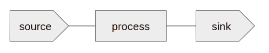
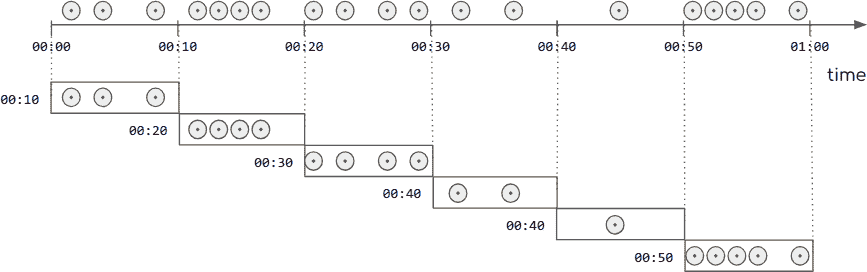
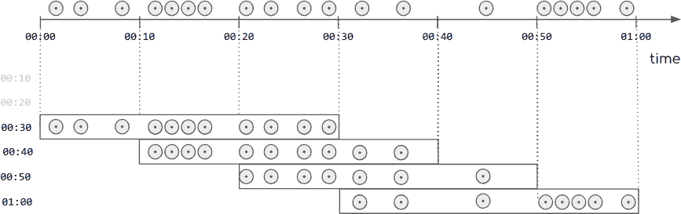
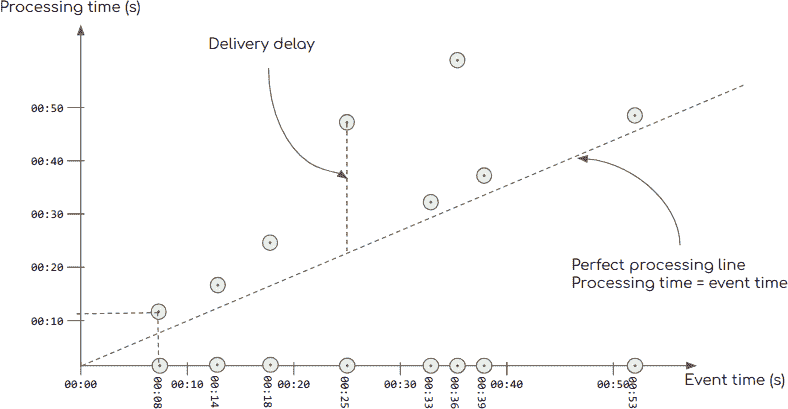
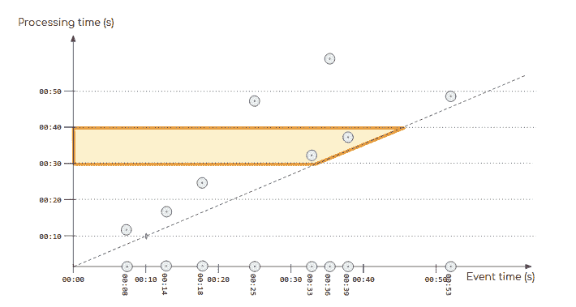
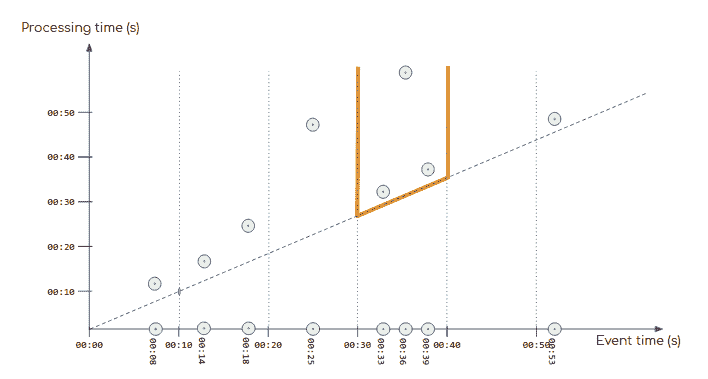
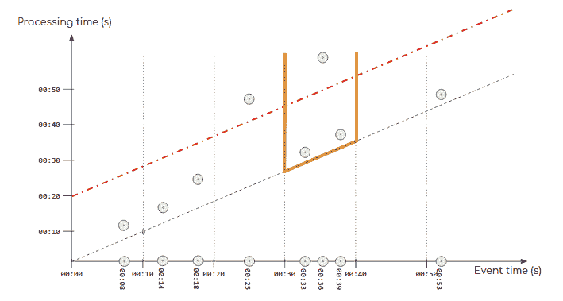

# 第二章：流处理模型

在本章中，我们将数据流的概念——即“移动中的数据”源——与允许我们表达流处理的编程语言原语和构造进行了桥接。

我们希望首先描述简单而基本的概念，然后再讨论 Apache Spark 如何表示它们。具体来说，我们想涵盖以下流处理的组件：

+   数据源

+   流处理管道

+   数据汇

我们接下来展示这些概念如何映射到由 Apache Spark 实现的特定流处理模型。

接下来，我们描述具有状态的流处理，这是一种需要通过一些中间状态进行过去计算记录的流处理类型。最后，我们考虑了时间戳事件流以及解决诸如“如果事件的顺序和及时性不符合期望，我该怎么办？”等问题的基本概念。

# 源和汇

正如前文提到的，Apache Spark 在其两个流系统——结构化流和 Spark Streaming 中，是一个具有 Scala、Java、Python 和 R 编程语言 API 的编程框架。它只能操作进入使用此框架程序的运行时的数据，并且一旦数据被发送到另一个系统，它就停止操作该数据。

在数据静止的情况下，您可能已经熟悉这个概念：要在文件记录中存储的数据上操作，我们需要将该文件读入内存以便操作，一旦我们通过对这些数据进行计算生成了输出，我们就可以将该结果写入另一个文件。同样的原理适用于数据库——这是数据静止的另一个例子。

同样地，数据流可以在 Apache Spark 的流处理框架中作为流式*数据源*访问。在流处理的上下文中，从流中访问数据通常被称为*消费流*。这种抽象被呈现为一个接口，允许实现针对特定系统连接的实例：如 Apache Kafka、Flume、Twitter、TCP 套接字等。

同样地，我们将用于在 Apache Spark 控制之外写入数据流的抽象称为*流式汇*。Spark 项目本身提供了许多连接器，以及丰富的开源和商业第三方集成生态系统。

在图 2-1 中，我们以流处理系统中源和汇的概念作图说明。数据由处理组件从源消费，最终结果由汇生成。



###### 图 2-1。简化的流模型

源和汇点的概念代表了系统的边界。在分布式框架中，对系统边界的标记是有意义的，因为这种分布式框架在我们的计算资源中可能有着高度复杂的足迹。例如，可以将一个 Apache Spark 集群连接到另一个 Apache Spark 集群，或者连接到另一个分布式系统，其中 Apache Kafka 就是一个常见的例子。在这种情况下，一个框架的汇点就是下游框架的源。这种链式连接通常被称为*管道*。源和汇点的名称对于描述数据从一个系统传递到下一个系统，以及我们在独立讨论每个系统时采用的视角，都是有用的。

# 从彼此定义的不可变流

在源和汇点之间，是流处理框架的可编程构造。我们暂不深入讨论这个主题的细节，你将在第二部分（Part II）和第三部分（Part III）中看到它们在结构化流和 Spark 流处理中的应用。但我们可以介绍一些概念，这些概念对于理解我们如何表达流处理是有用的。

Apache Spark 中的两个流 API 都采用了函数式编程的方法：它们声明对数据流进行的转换和聚合操作，假设这些流是不可变的。因此，对于给定的流，不可能改变其一个或多个元素。相反，我们使用转换来表达如何处理一个流的内容以获取派生数据流。这确保在程序的任何给定点，可以通过一系列明确声明的转换和操作来追溯任何数据流到其输入。因此，在 Spark 集群中的任何特定过程都可以仅通过程序和输入数据重建数据流的内容，使计算变得明确和可重现。

# 转换和聚合

Spark 广泛使用*转换*和*聚合*。转换是表达对流中每个元素的处理方式的计算。例如，创建一个派生流，使其每个输入流元素都加倍，就对应一个转换操作。而聚合则产生依赖于许多元素，可能是流到目前为止的每个元素的结果。例如，收集输入流的前五个最大数值就是一个聚合操作。每 10 分钟计算某个读数的平均值也是聚合的一个例子。

另一种指代这些概念的方式是说，转换具有 *窄依赖*（为了生成输出的一个元素，你只需要输入的一个元素），而聚合具有 *宽依赖*（为了生成输出的一个元素，你需要观察到迄今为止遇到的许多输入流元素）。这种区别很有用。它让我们能够设想一种使用高阶函数产生结果的基本函数。

虽然 Spark Streaming 和 Structured Streaming 在表示数据流的方式上有所不同，但它们操作的 API 性质相似。它们都以一系列应用于不可变输入流的转换形式呈现自己，并产生一个输出流，可以是真正的数据流，也可以是输出操作（数据汇）。

# 窗口聚合

流处理系统通常依靠发生在实时的动作进行数据喂养：社交媒体消息、网页点击、电子商务交易、金融事件或传感器读数也是这类事件的常见例子。我们的流处理应用通常具有多个地方日志的集中视图，无论是零售位置还是共同应用的网页服务器。即使单独查看每个事务可能并不实用，甚至可能不切实际，我们可能对近期一段时间内事件的属性感兴趣；例如，过去的 15 分钟或过去的一小时，甚至两者都可能。

此外，流处理的核心思想是系统应该长时间运行，处理连续的数据流。随着这些事件不断发生，较旧的事件通常对你尝试完成的任何处理变得越来越不相关。

我们发现许多应用程序需要定期和周期性的基于时间的聚合，我们称之为 *窗口*。

## Tumbling 窗口

窗口聚合的最自然概念是“每隔一段时间执行一次分组函数”。例如，“每小时的最高和最低环境温度”或“每 15 分钟的总能量消耗（千瓦）”是窗口聚合的示例。注意这些时间段天然是连续且不重叠的。我们称这种固定时间段的分组，其中每个组跟随前一个组并且不重叠，为 *tumbling 窗口*。

当我们需要在固定时间段内对数据进行聚合，并且每个时间段独立于前一段时，tumbling 窗口是一种常见的选择。图 2-2 展示了在元素流上的一个 10 秒 tumbling 窗口。这幅图说明了 tumbling 窗口的 tumbling 特性。



###### 图 2-2\. Tumbling 窗口

## 滑动窗口

*滑动窗口*是在一段时间内的聚合，其报告频率高于聚合周期本身。因此，滑动窗口是指带有两个时间规范的聚合：窗口长度和报告频率。通常读起来像“每隔 *y* 频率报告一个时间间隔 *x* 的分组函数”。例如，“过去一天的平均股票价格，每小时报告一次”。正如您可能已经注意到的那样，滑动窗口与平均函数的这种组合是滑动窗口的最广为人知的形式，通常被称为*移动平均*。

图 2-3 展示了一个窗口大小为 30 秒，报告频率为 10 秒的滑动窗口。在插图中，我们可以观察到*滑动窗口*的一个重要特征：它们不适用于小于窗口大小的时间段。我们可以看到在时间 `00:10` 和 `00:20` 没有报告的窗口。



###### 图 2-3\. 滑动窗口

虽然您在最终插图中看不到它，但绘制图表的过程揭示了一个有趣的特性：我们可以通过添加最新数据和删除过期元素来构建和维护一个滑动窗口，同时保持所有其他元素不变。

值得注意的是，滚动窗口是滑动窗口的一个特例，在这种情况下，报告频率等于窗口大小。

# 无状态和有状态处理

现在我们对 Apache Spark 中流处理系统的编程模型有了更好的了解，我们可以看看我们想要在数据流上应用的计算的性质。在我们的上下文中，数据流基本上是随时间观察到的长集合元素。实际上，结构化流推动了这一逻辑，认为数据流是记录的虚拟表，其中每一行对应一个元素。

# 有状态流

无论流是被视为连续扩展的集合还是表，这种方法为我们提供了对我们可能发现有趣的计算类型的一些见解。在某些情况下，重点放在对元素或元素组的连续和独立处理上：这些是我们希望基于众所周知的启发式处理某些元素的情况，例如来自事件日志的警报消息。

这种关注是完全合理的，但几乎不需要像 Apache Spark 这样的高级分析系统。更常见的是，我们对基于整个流的分析的新元素的实时反应感兴趣，例如在集合中检测异常值或从事件数据计算最近的聚合统计信息。例如，可能有趣的是在飞机发动机读数流中找到异常振动模式，这需要理解我们感兴趣的引擎类型的常规振动测量。

这种方法同时试图理解新数据和已经看到的数据的上下文，通常会导致*有状态流处理*。有状态流处理是一种学科，我们在输入数据流中观察到的新元素上计算出一些内容，并刷新帮助我们执行此计算的内部数据。

例如，如果我们正在尝试进行异常检测，我们希望用每个新的流元素更新的内部状态将是一个机器学习模型，而我们要执行的计算是判断输入元素是否应该分类为异常。

这种计算模式受到分布式流处理系统（如 Apache Spark）的支持，因为它可以利用大量的计算能力，并且是对实时数据做出反应的一种新的令人兴奋的方式。例如，我们可以计算输入数字的运行均值和标准差，并且如果一个新元素与这个均值的五个标准差之外，就输出一条消息。这是标记我们输入元素分布中特定极端异常值的一种简单但有用的方式。¹ 在这种情况下，流处理器的内部状态仅存储我们流的运行均值和标准差——即一对数字。

# 限制状态的大小

对于新手流处理领域的从业者来说，一个常见的陷阱是试图存储与输入数据流的大小成比例的大量内部数据。例如，如果您想要移除流中的重复记录，一种天真的方法是存储已经看到的每条消息，并将新消息与它们进行比较。这不仅会增加每个传入记录的计算时间，还会有无界的内存需求，最终会超出任何集群的限制。

这是一个常见的错误，因为流处理的前提是输入事件的数量没有限制，虽然在分布式 Spark 集群中可用的内存可能很大，但它始终是有限的。因此，中间状态表示可以非常有用，用来表达相对于全局数据流上观察到的元素进行操作的计算，但这是一种有风险的方法。如果选择有中间数据，您需要确保在任何给定时间可能存储的数据量严格限制在少于可用内存的上限内，而不考虑可能遇到的数据量。

# 示例：Scala 中的本地有状态计算

为了理解状态的概念，而不必深入复杂的分布式流处理，我们从 Scala 中的一个简单的非分布式流示例开始。

斐波那契序列经典上被定义为有状态流：它是以 0 和 1 开始的序列，然后由其前两个元素的和组成，如示例 2-1 所示。

##### 示例 2-1. 有状态计算的斐波那契元素

```
scala> val ints = Stream.from(0)
ints: scala.collection.immutable.Stream[Int] = Stream(0, ?)

scala> val fibs = (ints.scanLeft((0, 1)){ case ((previous, current), index) =>
        (current, (previous + current))})

fibs: scala.collection.immutable.Stream[(Int, Int)] = Stream((0,1), ?)

scala> fibs.take(8).print
(0,1), (1,1), (1,2), (2,3), (3,5), (5,8), (8,13), (13,21), empty

Scala> fibs.map{ case (x, y) => x}.take(8).print
0, 1, 1, 2, 3, 5, 8, 13, empty
```

状态型流处理指的是任何需要查看过去信息以获取结果的流处理。在计算流的下一个元素时，保持一些*状态*信息是必要的。

在这里，这是在`scanLeft`函数的递归参数中实现的，在这里我们可以看到`fibs`每个元素都有两个元素的元组：所寻求的结果和下一个值。我们可以对元组列表`fibs`应用简单的转换，仅保留最左边的元素，从而获得经典的斐波那契数列。

强调的重要点是，为了获取第*n*个位置的值，我们必须处理所有*n–1*个元素，并在沿着流移动时保持中间的`(i-1, i)`元素。

但是，是否可能在纯粹无状态的情况下定义它，而不是参考其先前的值？

## 作为流变换的无状态斐波那契序列的定义

要将此计算表达为流，以整数作为输入并输出斐波那契序列，我们将其表达为一种流变换，使用无状态的`map`函数将每个数字转换为其斐波那契值。我们可以在示例 2-2 中看到此方法的实现。

##### 示例 2-2. 无状态计算的斐波那契元素

```
scala> import scala.math.{pow, sqrt}
import scala.math.{pow, sqrt}

scala> val phi = (sqrt(5)+1) / 2
phi: Double = 1.618033988749895

scala> def fibonacciNumber(x: Int): Int =
  ((pow(phi,x) - pow(-phi,-x))/sqrt(5)).toInt
fibonacciNumber: (x: Int)Int

scala> val integers = Stream.from(0)
integers: scala.collection.immutable.Stream[Int] = Stream(0, ?)
scala> integers.take(10).print
0, 1, 2, 3, 4, 5, 6, 7, 8, 9, empty

scala> val fibonacciSequence = integers.map(fibonacciNumber)
fibonacciSequence: scala.collection.immutable.Stream[Int] = Stream(0, ?)

scala>fibonacciSequence.take(8).print
0, 1, 1, 2, 3, 5, 8, 13, empty
```

这个相当反直觉的定义使用一个整数流，从单个整数(0)开始，然后定义斐波那契序列作为一个计算，它接收作为流的输入的整数*n*，并返回斐波那契序列的第*n*个元素作为结果。这使用了一个称为*Binet 公式*的浮点数公式，可以直接计算序列的第*n*个元素，而不需要先前的元素；也就是说，不需要知道流的状态。

注意我们如何在 Scala 中获取这个序列的有限数量的元素并打印它们，作为显式操作。这是因为我们的流元素的计算是惰性执行的，它仅在需要时调用我们的流评估，考虑到从最后的实体化点到原始源产生它们所需的元素。

# 无状态或有状态流处理

我们用一个相当简单的案例说明了状态型和无状态型流处理之间的区别，这个案例使用了两种方法来解决。虽然有状态的版本与定义非常相似，但它需要更多的计算资源来产生结果：它需要遍历流并在每一步保持中间值。

无状态版本虽然有点牵强，但采用了更简单的方法：我们使用无状态函数来获得结果。无论我们需要第 9 个还是第 999999 个斐波那契数，计算成本大致相同。

我们可以将这个想法推广到流处理。有状态的处理在资源使用上更为昂贵，并且在面对失败时也引入了一些问题：如果我们的计算在流处理过程中半途而废会发生什么？尽管一个安全的经验法则是在可用时选择无状态选项，但许多我们可以在数据流上提出的有趣问题通常是有状态的性质。例如：用户在我们网站上的会话持续多久？出租车在城市中使用的路径是什么？工业机器上的压力传感器的移动平均值是多少？

在整本书中，我们将看到，有状态的计算更为通用，但它们也带来了自身的约束。流处理框架的重要方面是提供处理这些约束的功能，并使用户能够创建业务需要的解决方案。

# 时间的影响

到目前为止，我们考虑了在产生数据流每个元素的结果时跟踪中间数据的优势，因为这使我们能够分析每个元素相对于它们所属的数据流的情况，只要我们保持这些中间数据在有界和合理的大小。现在，我们想考虑另一个流处理独特的问题，即对时间戳消息进行操作。

## 基于时间戳事件的计算

数据流中的元素始终具有*处理时间*。也就是说，根据定义，流处理系统观察来自数据源的新事件的时间。这个时间完全由处理运行时确定，并且完全独立于数据流元素的内容。

然而，对于大多数数据流，我们也谈论到*事件时间*的概念，即事件实际发生的时间。当系统感知事件的能力允许时，这个时间通常作为消息负载的一部分添加到数据流中。

时间戳是一个操作，它包括在生成消息的时刻添加时间记录，这将成为数据流的一部分。这是一种无处不在的实践，存在于最简单的嵌入式设备（只要它们有时钟）以及金融交易系统中最复杂的日志中。

## 时间戳作为时间概念的提供者

时间戳的重要性在于它允许用户考虑数据生成的时刻来推理其数据。

例如，如果我使用可穿戴设备记录了早晨的慢跑，并在回到家后将设备与手机同步，我希望看到我刚刚穿过森林时的心率和速度的详细信息，而不是把数据看作上传到某个云服务器的无时间序列值。正如我们所见，时间戳为数据提供了时间的上下文。

因此，由于事件日志在今天被分析的数据流中占据很大一部分，这些时间戳有助于理解特定系统在特定时间发生了什么。由于从创建数据的各种系统或设备传输数据到处理它的群集是一个易于发生不同形式故障的操作，某些事件可能会延迟、重新排序或丢失，所以这个完整的图像通常因此变得更难以捉摸。

常常，像 Apache Spark 这样的框架的用户希望在不妥协其系统的反应能力的情况下弥补这些风险。出于这种愿望，产生了以下的一个学科：

+   明确标记的正确和重新排序的结果

+   中间前景结果

根据流处理系统对数据流中的时间戳事件的最佳知识分类，可以反映出此分类是基于数据流提供的事件，并且有待于视图能够通过延迟的流元素的迟到来完成此视图。这个过程构成了*事件时间处理*的基础。

在 Spark 中，这个特性仅由结构化流处理原生支持。尽管 Spark Streaming 缺乏对事件时间处理的内置支持，但通过开发工作和一些数据整合过程，可以手动实现相同类型的基本功能，正如您将在第二十二章中看到的。

## 事件时间与处理时间

我们认识到有一个时间轴，在这个轴上创建了事件，并且在另一个时间轴上处理这些事件：

+   *事件时间*指的是事件最初生成时的时间线。通常，生成设备上的时钟会在事件本身中放置一个时间戳，这意味着即使在传输延迟的情况下，所有来自同一来源的事件也可以按时间顺序排序。

+   *处理时间*是事件被流处理系统处理的时间。这个时间仅在技术或实施层面上是相关的。例如，它可以用来为结果添加处理时间戳，从而区分重复值，即使这些输出值具有不同的处理时间。

想象我们有一系列随时间产生和处理的事件，如图 2-4 所示。



###### 图 2-4\. 事件与处理时间

让我们更仔细地看一下这个问题：

+   x 轴代表事件时间线，该轴上的点表示每个事件生成的时间。

+   y 轴是处理时间。图表区域上的每个点对应 x 轴中相应事件的处理时间。例如，创建于 `00:08` 的事件（x 轴上的第一个）在大约 `00:12` 左右被处理，这时其在 y 轴上的标记。

+   对角线代表理想的处理时间。在一个理想的世界中，使用零延迟的网络，事件被创建后立即被处理。请注意，在那条线以下不可能有处理事件，因为这意味着事件在创建之前就已经被处理。

+   对角线和处理时间之间的垂直距离是 *交付延迟*：事件生产和最终消费之间经过的时间。

在这个框架的指导下，现在让我们考虑一个 10 秒窗口聚合，如 图 2-5 所示。



###### 图 2-5\. 处理时间窗口

我们首先考虑在处理时间上定义的窗口：

+   流处理器使用其内部时钟来测量 10 秒间隔。

+   所有落在该时间间隔内的事件都属于窗口。

+   在 图 2-5 中，水平线定义了这些 10 秒窗口。

我们还突出显示了时间间隔 `00:30-00:40` 对应的窗口。它包含两个事件，事件时间为 `00:33` 和 `00:39`。

在这个窗口中，我们可以欣赏到两个重要特征：

+   窗口边界非常清晰，正如我们在高亮区域中看到的。这意味着窗口有明确定义的开始和结束。窗口关闭时，我们知道什么在里面，什么在外面。

+   它的内容是任意的。它们与事件生成的时间无关。例如，尽管我们会认为 `00:30-00:40` 窗口会包含事件 `00:36`，但我们可以看到它已经不在结果集中，因为它迟到了。

现在让我们考虑在事件时间上定义的相同 10 秒窗口。在这种情况下，我们使用 *事件创建时间* 作为窗口聚合标准。图 2-6 展示了这些窗口如何与我们之前看到的处理时间窗口大不相同。在这种情况下，窗口 `00:30-00:40` 包含在那段时间内*创建*的所有事件。我们还可以看到，这个窗口没有自然的上界来定义窗口何时结束。在事件 `00:36` 创建晚了超过 20 秒。因此，要报告窗口 `00:30-00:40` 的结果，我们至少需要等到 `01:00`。如果一个事件被网络丢弃并永远不会到达，我们要等多久？为了解决这个问题，我们引入一个称为 *水印* 的任意截止时间，以处理这种开放边界的后果，如延迟、排序和去重。



###### 图 2-6\. 事件时间窗口

## 使用水印进行计算

正如我们已经注意到的，流处理生成周期性结果，通过分析其输入中观察到的事件。当具备使用事件消息中的时间戳的能力时，流处理器能够根据水印的概念将这些消息分成两类。

水印在任何给定时刻是*我们在数据流上接受的最旧时间戳*。任何比这个期望更旧的事件都不会被包括在流处理的结果中。流引擎可以选择以另一种方式处理它们，例如报告它们在*延迟到达*通道中。

然而，为了考虑可能的延迟事件，这个水印通常比我们预期事件传递的平均延迟要大得多。还要注意，这个水印是一个随时间单调增加的流动值，² 它随着数据流的观察时间而滑动一个延迟容忍窗口。

当我们将水印的概念应用于我们的事件时间图表时，如图 2-7 所示，我们可以欣赏到水印关闭了事件时间窗口定义留下的开放边界，提供了决定哪些事件属于窗口，哪些事件太迟以至于不应被考虑处理的标准。



###### 图 2-7\. 事件时间中的水印

当流的水印概念被定义后，流处理器可以在以下两种模式之一下运行：要么生成相对于水印之前所有事件的输出，此时输出是最终的，因为到目前为止已经观察到所有这些元素，而且再也不会考虑比这更旧的事件；要么生成相对于水印之前的数据的输出，同时可能随时在流中到达比水印更新的新的延迟元素，并且这些新数据可以改变输出结果。在后一种情况下，我们可以将输出视为临时的，因为新数据仍然可以改变最终结果，而在前一种情况下，结果是最终的，没有新数据能够改变它。

我们详细研究了如何在第十二章中具体表达和操作这种计算方式。

最后请注意，对于临时结果，我们正在存储中间值，并且以某种方式要求在延迟事件到达时修改它们的计算。这个过程需要一定的内存空间。因此，事件时间处理是另一种有状态计算的形式，并且受到相同的限制：为了处理水印，流处理器需要存储大量的中间数据，并因此消耗与*水印长度 × 到达速率 × 消息大小*大致相对应的大量内存。

另外，由于我们需要等待水印过期以确保我们拥有构成间隔的所有元素，因此使用水印并希望每个间隔有唯一最终结果的流处理过程必须将其输出延迟至水印的长度至少。

###### 注意

我们想要概述事件时间处理，因为它是我们在第一章中提到的不对事件输入流的吞吐量做任何假设的特例。

在事件时间处理中，我们假设将水印设置为某个值是合适的。也就是说，我们只有在水印允许消息在创建时间和到达输入数据流时的顺序之间遇到的延迟时，基于事件时间处理的流计算的结果才是有意义的。

过小的水印会导致丢弃过多事件并且产生严重不完整的结果。过大的水印会延迟被认为是完整结果的输出时间过长，并增加流处理系统为保留所有中间事件而增加的资源需求。

用户需要确保选择一个适合他们所需的事件时间处理并且适合他们可用的计算资源的水印，这一点由用户自己负责。

# 概要

在本章中，我们探讨了流处理编程模型中独特的主要概念：

+   数据源和接收器

+   有状态处理

+   事件时间处理

随着书籍的进展，我们探索了 Apache Spark 流式 API 中这些概念的实现。

¹ 由于切比雪夫不等式的帮助，我们知道在这个数据流上的警报应该以不到 5%的概率发生。

² 水印天生是非递减的。
