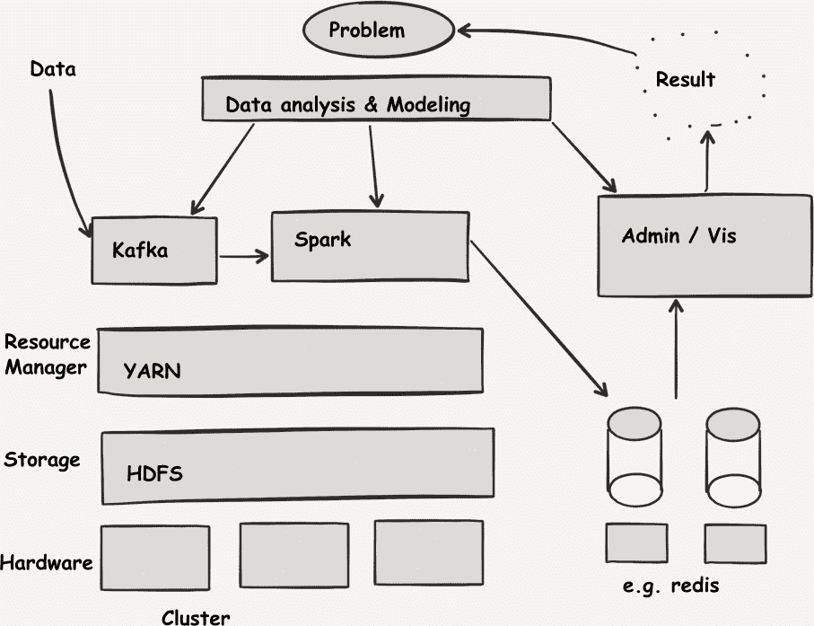
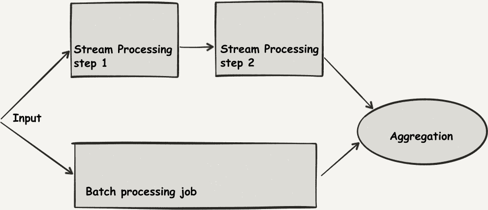
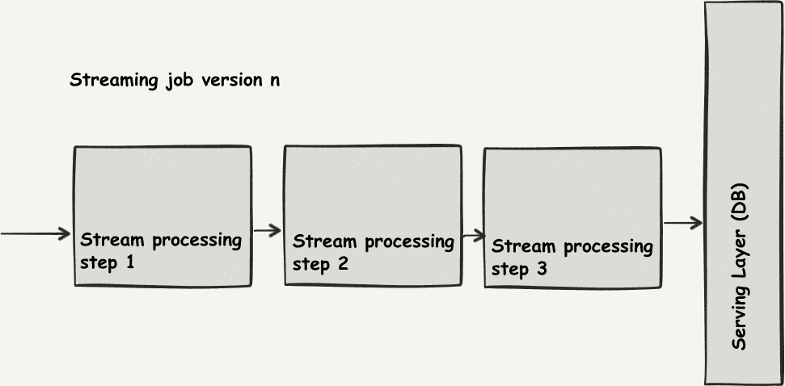

# 第三章：流处理架构

分布式数据分析系统的实现必须处理计算资源池的管理，例如内部机器群集或预留的基于云的容量，以满足部门甚至整个公司的计算需求。由于团队和项目很少在时间上有相同的需求，如果几个团队共享计算资源，计算机群集最好是摊销的共享资源，这需要处理多租户问题。

当两个团队的需求不同时，给每个团队提供公平和安全的访问集群资源变得很重要，同时确保随着时间的推移最佳利用计算资源。

这一需求迫使使用大型集群的人们通过模块化来应对这种异构性，使得几个功能块成为数据平台中可互换的组成部分。例如，当我们将数据库存储作为功能块时，提供此功能的最常见组件是关系型数据库，如 PostgreSQL 或 MySQL，但是当流应用程序需要以非常高的吞吐量写入数据时，像 Apache Cassandra 这样的可扩展的列式数据库会是更好的选择。

在本章中，我们简要探讨了构成流数据平台架构的不同部分，并查看了处理引擎相对于其他组件在完整解决方案中的位置。在我们深入了解流架构的各个元素后，我们探索了两种用于处理流应用程序的架构风格：Lambda 架构和 Kappa 架构。

# 数据平台的组件

我们可以将数据平台视为标准组件的组合，这些组件预计对大多数利益相关者有用，并且专门的系统则为解决业务挑战而服务。

图 3-1 说明了这一难题的各个部分。

###### 图 3-1\. 数据平台的组成部分

从架构底部的裸金属级别到业务需求所需的实际数据处理，你可以找到以下内容：

硬件层级

在本地硬件安装、数据中心或潜在的虚拟化在同质云解决方案中（如 Amazon、Google 或 Microsoft 的 T 恤大小套餐），安装基本操作系统。

持久性层级

在这个基线基础设施之上，通常期望机器提供一个共享接口来存储其计算结果以及可能的输入。在这一层级上，你会找到诸如 Hadoop 分布式文件系统（HDFS）之类的分布式存储解决方案——还有许多其他分布式存储系统。在云上，这种持久性层由专门的服务提供，比如 Amazon Simple Storage Service（Amazon S3）或 Google Cloud Storage。

资源管理器

在持久性之后，大多数集群架构提供了一个单一的协商点，用于提交要在集群上执行的作业。这是资源管理器的任务，如 YARN 和 Mesos，以及更进化的云原生时代的调度程序，如 Kubernetes。

执行引擎

更高级别的是执行引擎，它负责执行实际的计算任务。其定义特征是它与程序员输入的接口并描述数据操作。Apache Spark、Apache Flink 或 MapReduce 就是此类的例子。

数据摄入组件

除了执行引擎，您还可以找到一个数据摄入服务器，可以直接插入该引擎。事实上，从分布式文件系统读取数据的旧做法经常被另一种可以实时查询的数据源所补充或甚至替代。消息系统或日志处理引擎如 Apache Kafka 在这个层次上被设置。

处理后的数据接收器

在执行引擎的输出端，您经常会找到一个高级数据接收器，它可能是另一个分析系统（在执行提取、转换和加载[ETL]作业的情况下），NoSQL 数据库或其他服务。

可视化层

我们应该注意，因为数据处理的结果只有在集成到更大的框架中才有用，所以这些结果通常被插入到可视化中。如今，由于被分析的数据迅速演变，这种可视化已经从旧的静态报告转向更实时的视觉界面，通常使用一些基于 Web 的技术。

在这种架构中，作为计算引擎的 Spark 专注于提供数据处理能力，并依赖于与图片的其他块具有功能接口。特别是，它实现了一个集群抽象层，允许它与 YARN、Mesos 和 Kubernetes 作为资源管理器进行接口，通过易于扩展的 API 提供连接到许多数据源，而新的数据源可以轻松添加，并集成了输出数据接收器，以向上游系统展示结果。

# 架构模型

现在我们将注意力转向具体架构中流处理和批处理之间的关联。特别是，我们将问自己一个问题，即如果我们有一个能够进行流处理的系统，那么批处理是否仍然相关，如果是，为什么呢？

在本章中，我们对比了两种流应用程序架构的概念：*Lambda 架构* 建议在并行运行的批处理对应应用程序中复制一个流应用程序，以获得互补的结果，而 *Kappa 架构* 则主张如果需要比较应用程序的两个版本，这两个版本都应该是流应用程序。我们将详细看看这些架构的意图，以及我们将检验的内容，尽管 Kappa 架构在一般情况下更容易和更轻量化实现，但仍可能存在需要 Lambda 架构的情况，以及为什么。

# 在流应用程序中使用批处理组件

通常情况下，如果我们开发一个批处理应用程序，它以周期性间隔运行成为一个流应用程序，我们已经提供了批处理数据集，并且表示这种周期性分析的批处理程序。在这个演化使用案例中，如前几章所述，我们希望演变成一个流应用程序，以获得一个更轻、更简单的应用程序，能够更快地提供结果。

在一个全新的应用程序中，我们可能也有兴趣创建一个参考批处理数据集：大多数数据工程师不仅仅是解决问题一次，而是重新审视他们的解决方案，并持续改进，特别是如果价值或收入与他们的解决方案的性能有关。出于这个目的，批处理数据集有设置基准的优势：一旦收集完毕，它就不再改变，可以用作“测试集”。确实，我们可以将批处理数据集重新播放到流系统中，以比较其性能与先前的迭代或已知基准。

在这种情况下，我们识别出批处理和流处理组件之间的三个交互级别，从最少混合到最多混合的批处理：

*代码重用*

通常源于参考批处理实现，寻求尽可能多地重新使用它，以避免重复努力。这是 Spark 突出的领域，因为可以特别容易地调用转换 Resilient Distributed Databases (RDDs) 和 DataFrames 的函数 — 它们共享大部分相同的 API，只有数据输入和输出的设置是不同的。

*数据重用*

在这种情况下，流应用程序从一个特征或数据源中定期准备的批处理作业中获得自身的数据。这是一种常见模式：例如，一些国际应用程序必须处理时间转换，而一个常见的陷阱是夏令时规则比预期更频繁地改变。在这种情况下，考虑这些数据作为我们的流应用程序自身依赖的新依赖源是很好的。

*混合处理*

应用程序在其生命周期内被理解为同时具有批处理和流处理组件。这种模式相对频繁地发生，出于希望管理应用程序提供的洞察力的精度以及处理应用程序自身版本控制和演进的意愿。

前两种用途是便利性的用途，但最后一个引入了一个新概念：使用批处理数据集作为基准。在接下来的小节中，我们看到这如何影响流应用程序的架构。

# 参考性数据流架构

在重放性和随时间性能分析的世界中，有两个历史悠久但相互冲突的建议。我们的主要关注点是如何测量和测试流应用程序的性能。在这样做时，我们的设置可能会发生两种变化：模型的性质（由于改进尝试的结果）和模型操作的数据（由于有机变化的结果）。例如，如果我们处理来自气象传感器的数据，我们可以预期数据中会有季节性变化模式。

为了确保我们能进行苹果与苹果的比较，我们已经确定，重播*批处理数据集*到我们流应用程序的两个版本是有用的：它确保我们没有看到真正反映数据变化的性能变化。理想情况下，在这种情况下，我们将测试我们在年度数据中的改进，确保我们在当前季节的优化不至于在六个月后损害性能。

然而，我们希望争辩说，与*批处理分析*的比较同样是必要的，超出使用基准数据集的使用——这正是架构比较发挥作用的地方。

## Lambda 架构

Lambda 架构（图 3-2）建议定期执行批处理分析（例如每晚一次），并在数据流入时补充模型，直至能够基于整天的数据生成新版本的批处理分析。

它是由 Nathan Marz 在博客文章 [“如何战胜 CAP 定理”](http://bit.ly/1ATyjbD).¹ 中作为此类引入的。它源于这样一个理念：我们希望强调数据分析精度以外的两个新颖点。

+   数据分析的历史重放性非常重要

+   由新数据产生的结果的可用性也是非常重要的一点。

###### 图 3-2\. Lambda 架构

这是一个有用的架构，但其缺点显而易见：这样的设置很复杂，需要维护两个用于相同目的的相同代码版本。即使 Spark 在让我们在批处理和流处理版本的应用程序之间重用大部分代码方面提供了帮助，应用程序的这两个版本在生命周期上是不同的，这可能看起来很复杂。

这个问题的另一个观点建议，保留能够向两个版本的流式应用程序（新的、改进的实验和旧的、稳定的工作马）提供相同数据集的能力，有助于我们解决方案的可维护性。

## Kappa 架构

这种架构，如 图 3-3 所述，比较了两个流式应用程序，并且取消了任何批处理，指出如果需要读取批处理文件，则可以简单地组件可以逐记录地重放此文件的内容作为流式数据源。这种简单性仍然是一个巨大的优势，因为甚至是向这两个应用程序版本提供数据的代码也可以被重复使用。在这种被称为 *Kappa 架构* 的范式中（[[Kreps2014]](app01.xhtml#Kreps2014)），没有去重，并且心理模型更简单。

###### 图 3-3\. Kappa 架构

这引出了一个问题：批处理计算仍然重要吗？我们应该把我们的应用程序全部转换为全天候的流式处理吗？

我们认为 Lambda 架构中衍生出的一些概念仍然相关；事实上，在某些情况下它们非常有用，尽管这些情况并不总是容易理解。

仍然有一些用例是值得付出努力实现我们的分析的批处理版本，然后与我们的流式解决方案进行比较的。

# 流式与批处理算法比较

在选择流式应用的通用架构模型时，有两个重要的考虑因素需要考虑：

+   流式算法有时在性质上完全不同

+   流式算法不能保证在与批处理算法的比较中表现良好。

让我们在接下来的两个部分中使用激励性的例子来探讨这些想法。

## 流式算法在性质上有时完全不同

有时，很难从流式计算中推断出批处理，或者反过来，这两类算法具有不同的特性。这意味着乍看之下我们可能无法在这两种方法之间重复使用代码，但更重要的是，应该非常谨慎地比较这两种处理模式的性能特征。

为了使事情更加明确，让我们看一个例子：购买或租赁问题。在这种情况下，我们决定去滑雪。我们可以花$500 购买滑雪板，或者花$50 租借滑雪板。我们应该租借还是购买？

我们的直觉策略是先租借，看看我们是否喜欢滑雪。但假设我们确实喜欢：在这种情况下，我们最终会意识到我们花费的钱比如果我们一开始就买了滑雪板要多。

在这种计算的批处理版本中，我们“事后”进行，被告知我们一生中将要滑雪的总次数。在这个问题的流或在线版本中，我们被要求在每个离散的滑雪事件发生时做出决策（产生输出）。策略是根本不同的。

在这种情况下，我们可以考虑流算法的竞争比率。我们在最坏的输入上运行算法，然后将其“成本”与批算法在“事后”所做的决策进行比较。

在我们的买房或租房问题中，让我们考虑以下的流策略：我们租房直到租房支出与买房相等，这时我们选择买房。

如果我们滑雪九次或更少，我们是最优的，因为我们的支出与事后的支出相同。竞争比率为一。如果我们滑雪十次或更多，我们支付 $450 + $500 = $950。最坏的输入是接收到 10 个“滑雪旅行”决策事件，在这种情况下，批处理算法在事后将支付 $500。这种策略的竞争比率是（2 - 1/10）。

如果我们选择另一种算法，比如“总是第一次买”，那么最坏的输入是只滑雪一次，这意味着竞争比率是 $500 / $50 = 10。

###### 注意

性能比率或竞争比率是算法返回的值距离最优解有多远的度量标准。如果一个算法在所有实例中的目标值不超过最优离线值的ρ倍，则形式上称为ρ-竞争算法。

更好的竞争比率更小，而竞争比率大于一显示流算法在某些输入上表现明显较差。很容易看出，在最坏的输入条件下，批处理算法，以严格更多信息事后进行，总是预计能表现更好（任何流算法的竞争比率大于一）。

## 流算法不能保证在与批处理算法的性能上表现良好

另一个不服管教的例子是**装箱问题**。在装箱问题中，一组不同大小或不同重量的物体必须装入若干个箱子或容器中，每个箱子或容器具有一定的体积或重量容量。挑战在于找到一种物体分配到箱子中的方式，使使用的容器数量最小化。

在计算复杂性理论中，该算法的离线版本被称为*NP-hard*。问题的简单变体是*决策*问题：知道这些物体是否能够装入指定数量的箱子中。它本身是 NP 完全的，这意味着（对于我们这里的目的）在计算上非常困难。

在实践中，这种算法被广泛使用，从实际货物在集装箱中的装运，到操作系统匹配各种大小的空闲内存块的内存分配请求的方式。

这些问题有许多变体，但我们想要关注在线版本与离线版本之间的区别——在线版本的算法以对象流作为输入，而离线版本的算法在甚至开始计算过程之前就可以检查整组输入对象。

在线算法按任意顺序处理项目，然后将每个项目放入第一个能容纳它的箱子中，如果没有这样的箱子存在，则打开一个新箱子并将项目放入其中。这种贪婪逼近算法总是允许将输入对象放入最多情况下是次优的箱子数中，这意味着我们可能会使用比必要更多的箱子。

一种更好的算法，仍然相对直观易懂，是*首次适合减少策略*，它通过首先按其大小降序排序要插入的项目，然后将每个项目插入列表中第一个具有足够剩余空间的箱子。该算法在 2007 年被证明非常接近最优算法，可以产生绝对最小的箱子数（[[Dosa2007]](app01.xhtml#Dosa2007)）。

然而，首次适合减少策略依赖于我们可以在开始处理和将其放入箱子之前按大小降序对项目进行排序的想法。

现在，试图在在线装箱问题的情况下应用这样的方法，情况完全不同，因为我们处理的是一个无法排序的元素流。直觉上，因此很容易理解，在线装箱问题——在其操作时缺乏预见性——比离线装箱问题要困难得多。

###### 警告

如果考虑流算法的竞争比，这种直觉事实上得到了证明支持。这是在线算法消耗的资源与通过最小化输入对象集合中可以打包的箱子数量的在线最优算法使用的资源之比。背包（或装箱）问题的这种竞争比实际上是任意糟糕的（也就是说，很大；见[[Sharp2007]](app01.xhtml#Sharp2007)），这意味着总是可能遇到一种“糟糕”的序列，在这种序列中，在线算法的表现将与最优算法的表现有任意远的距离。

本节中涉及的更大问题是，不能保证流算法的表现优于批处理算法，因为这些算法必须在没有预见的情况下运行。特别是一些在线算法，包括背包问题，已经被证明在与其离线算法比较时存在任意大的性能比率。

这意味着，打个比方，我们有一个工人像批处理一样接收数据，好像一开始数据就在一个*储藏室*里，另一个工人则像流处理一样接收数据，好像数据在一个*传送带*上，然后*无论我们的流处理工人多么聪明，总有办法以一种病态的方式将项目放在传送带上，使他完成的任务结果比批处理工人任意糟糕*。

从这次讨论中得出的要点有两个：

+   流处理系统确实“更轻量”：它们的语义可以用富有表现力的术语表达许多低延迟分析。

+   流式 API 鼓励我们使用流处理或在线算法来实现分析，其中启发式方法很遗憾地受限，正如我们之前看到的。

# 概要

总之，批处理处理即使已经过时的说法也是不准确的：批处理处理仍然相关，至少对于为流处理问题提供性能基准。任何负责任的工程师应该对批处理算法在“事后”运行与其流应用相同输入时的性能有一个良好的了解：

+   如果当前的流处理算法有已知的竞争比率，并且结果表现可以接受，仅运行流处理可能就足够了。

+   如果当前实施的流处理与批处理版本之间没有已知的竞争比率，定期运行批量计算是一个有价值的基准，可以用来评估其应用。

¹ 如果您想了解与 CAP 定理（也称为 Brewer 定理）的联系更多信息，我们建议您查阅原始文章。该定理集中描述了分布式计算中一些限制到数据处理系统的一个有限部分的基本限制。在我们的情况下，我们关注的是该约束的实际影响。
