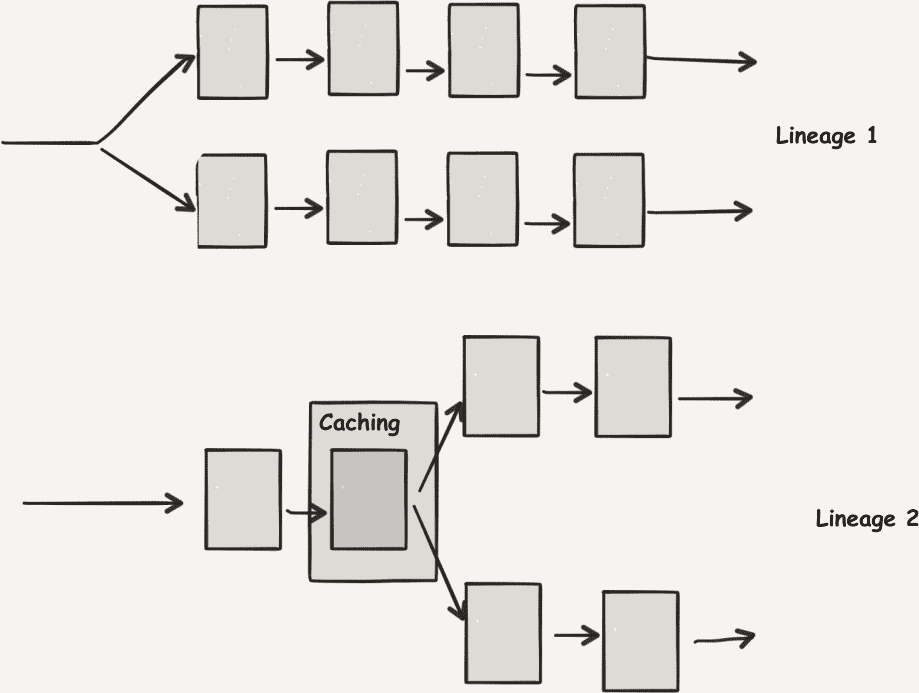

# 第四章：Apache Spark 作为流处理引擎

在 第三章 中，我们描绘了流数据平台的一般架构图，并确定了作为分布式处理引擎的 Spark 在大数据系统中的位置。

这种架构告诉我们，在处理流数据时，特别是使用 Apache Spark 进行流数据处理时，可以期待接口和与生态系统其余部分的链接。无论是在其 Spark Streaming 还是 Structured Streaming 形式中，流处理都是 Apache Spark 的另一种 *执行模式*。

在本章中，我们将介绍使 Spark 成为流处理引擎的主要特性。

# 两种 API 的故事

正如我们在 “介绍 Apache Spark” 中提到的，Spark 提供了两种不同的流处理 API，即 Spark Streaming 和 Structured Streaming：

Spark Streaming

这是一个 API 和一组连接器，其中 Spark 程序以微批次的形式服务于从流中收集的数据，这些微批次在固定时间间隔内间隔，并执行给定的计算，并在每个间隔最终返回结果。

结构化流处理

这是一个 API 和一组连接器，建立在 SQL 查询优化器 Catalyst 的基础上。它提供了基于 `DataFrame` 和不断更新的无界表的连续查询概念，从流中获取新记录。

Spark 在这些方面提供的接口特别丰富，以至于本书大部分内容都在解释这两种处理流数据集的方式。需要注意的一点是，这两种 API 都依赖于 Spark 的核心功能，并在分布式计算、内存缓存和集群交互等低级特性上共享许多特性。

作为其 MapReduce 前身的一大进步，Spark 提供了丰富的操作符集，允许程序员表达复杂的处理，包括机器学习或事件时间操作。我们将在稍后更详细地讨论允许 Spark 实现这一功能的基本特性。

我们只想概述一下，这些接口在设计上与其批处理对应物一样简单——在 `DStream` 上操作感觉就像在 `RDD` 上操作，在流式 `Dataframe` 上操作看起来几乎与批处理类似。

Apache Spark 自称为统一引擎，为开发人员提供了一致的环境，无论他们想要开发批处理还是流处理应用程序。在这两种情况下，开发人员都可以利用分布式框架的全部能力和速度。

这种多功能性增强了开发的灵活性。在部署完整的流处理应用程序之前，程序员和分析师首先尝试在具有快速反馈循环的交互式环境中发现见解。Spark 提供了一个基于 Scala *REPL*（Read-Eval-Print-Loop）的内置 shell，可用作原型开发场所。还有几种笔记本实现可供选择，如 Zeppelin、Jupyter 或 Spark Notebook，它们将这种交互式体验带入用户友好的 Web 界面。这个原型开发阶段在开发的早期阶段至关重要，其速度也是如此。

如果您回顾 图 3-1 中的图表，您会注意到我们在图表中称为 *results* 的内容实际上是可操作的见解——通常意味着收入或成本节省——每次完全遍历一个循环（从业务或科学问题开始并结束）时生成。总结来说，这个循环是实验方法的一个粗略表示，经历观察、假设、实验、测量、解释和结论。

Apache Spark 在其流处理模块中，始终致力于谨慎管理切换到流应用程序的认知负荷。它还有其他一些重要的设计选择，对其流处理能力有着重要影响，从其内存存储开始。

# Spark 的内存使用

Spark 提供了数据集片段的内存存储，必须从数据源初始加载。数据源可以是分布式文件系统或其他存储介质。Spark 的内存存储形式类似于数据缓存操作。

因此，Spark 内存存储中的 *value* 具有一个 *base*，即其初始数据源，以及应用于它的连续操作层。

## 失败恢复

发生故障时会发生什么？因为 Spark 精确知道首次用于摄取数据的数据源，也知道到目前为止对其执行的所有操作，因此它可以从头开始重建丢失数据片段，这是在崩溃执行器上的情况。显然，如果这种重建（在 Spark 的术语中称为 *recovery*）不需要完全从头开始，速度会更快。因此，Spark 提供了一种复制机制，与分布式文件系统相似。

然而，由于内存是如此宝贵但有限的资源，Spark 默认使缓存的存活时间很短。

## 延迟评估

正如您将在后续章节中详细了解的那样，在 Spark 的存储中，可以定义在值上执行的大部分操作都是延迟执行的，只有在执行最终的渴望输出操作时，才会触发 Spark 集群中的实际计算执行。值得注意的是，如果一个程序由一系列线性操作组成，前一个操作结果在下一个操作消耗其输入后会立即 *消失*。

## 缓存提示

另一方面，如果我们有多个操作要在单个中间结果上执行，会发生什么？我们是否必须多次计算它？幸运的是，Spark 允许用户指定中间值的重要性，并且如何保护其内容以供以后使用。

图 4-1 展示了此类操作的数据流程。

###### 图 4-1\. 对缓存值的操作

最后，Spark 提供了在集群内存不足时将缓存溢出到二级存储的机会，将内存操作扩展到次级且明显较慢的存储，以保留数据处理过程的功能方面，当面对临时高峰负载时。

现在我们对 Apache Spark 的主要特性有了一个大致了解，让我们花些时间专注于 Spark 内部的一个设计选择，即延迟与吞吐量的权衡。

# 理解延迟

正如我们提到的，Spark Streaming 选择了微批处理。它在固定的时间间隔内生成一批元素，当该间隔“滴答”结束时，开始处理上个间隔收集到的数据。结构化流处理则采取了稍微不同的方式，它会尽可能缩小所讨论的间隔（上一个微批处理的处理时间），在某些情况下还提出了连续处理模式。然而，微批处理仍然是 Apache Spark 流处理中主导的内部执行模式。

微批处理的一个结果是，任何微批至少延迟了批处理的任何特定元素的处理时间。

首先，微批处理创建了基准延迟。目前还不清楚可以将这种延迟减小到多小，尽管大约一秒钟是较为常见的下限数值。对于许多应用程序来说，几分钟的延迟已经足够；例如：

+   拥有仪表板，可以在过去几分钟内刷新您网站的关键性能指标

+   提取社交网络中最近的热门话题

+   计算一组家庭能耗趋势

+   在推荐系统中引入新媒体

虽然 Spark 是一个平等机会的处理器，并延迟了所有数据元素（最多）一个批次才对其进行操作，但还存在一些其他流处理引擎，可以快速处理具有优先级的某些元素，确保它们的响应速度更快。如果对这些特定元素的响应时间至关重要，那么像 Apache Flink 或 Apache Storm 这样的替代流处理器可能更合适。但如果您只对*平均*快速处理感兴趣，比如监控系统时，Spark 提供了一个有趣的选择。

# 面向吞吐量的处理

总而言之，Spark 在流处理方面真正擅长的是面向吞吐量的数据分析。

我们可以将微批处理方法比作火车：它到达车站，等待一段时间的乘客，然后将所有上车的乘客一起运送到他们的目的地。尽管对于同样的行程，乘客可能选择驾车或出租车可以更快地从门到门出发，但火车的乘客批量确保更多旅客抵达他们的目的地。火车为相同的行程提供更高的吞吐量，但有些乘客必须等到火车启程。

Spark 核心引擎经过优化，适用于分布式批处理。在流处理上的应用确保了每单位时间可以处理大量数据。Spark 通过一次处理多个元素摊销了分布式任务调度的开销，并且正如我们在本章早期看到的那样，它利用内存技术、查询优化、缓存甚至代码生成来加速数据集的转换过程。

在使用 Spark 进行端到端应用时，一个重要的约束是接收处理数据的下游系统必须能够接受流处理过程提供的完整输出。否则，在突然的负载高峰面前，我们可能会出现应用程序瓶颈，从而导致级联故障。

# Spark 的多语言 API

现在我们已经概述了 Apache Spark 的主要设计基础，这些基础对流处理有影响，即丰富的 API 和内存处理模型，定义在执行引擎的模型内。我们已经探讨了 Apache Spark 的特定流处理模式，从较高的角度来看，我们确定了微批处理的主导性使我们认为 Spark 更适合面向吞吐量导向的任务，其中更多的数据意味着更高的质量。现在，我们希望把注意力放在 Spark 突出的另一个方面：其编程生态系统。

Spark 最初是作为一个仅限于 Scala 的项目编写的。随着兴趣和采纳的扩展，支持不同用户档案的需求也随之增加，这些用户具有不同的背景和编程语言技能。在科学数据分析领域，Python 和 R 可以说是首选语言，而在企业环境中，Java 占据主导地位。

Spark 不仅仅是一个用于分布式计算的库，它已经成为一个多语言框架，用户可以使用 Scala、Java、Python 或 R 语言进行接口交互。开发语言仍然是 Scala，这也是主要创新的地方。

###### 注意

长期以来，Java API 的覆盖范围与 Scala 相当同步，这要归功于 Scala 语言提供的出色 Java 兼容性。尽管在 Spark 1.3 及更早版本中，Python 在功能上落后，但现在大部分已经迎头赶上。最新增加的是 R，其功能完备性正在积极进行中。

这个多才多艺的接口让各种水平和背景的程序员都涌向 Spark，以满足他们自己的数据分析需求。对 Spark 开源项目的贡献的惊人且不断增长的丰富性证明了 Spark 作为一个联合框架的强大性。

然而，Spark 最好为其用户提供计算服务的方法不仅仅是让他们使用自己喜欢的编程语言。

# 快速实现数据分析

Spark 在开发流数据分析管道方面的优势不仅在于提供 Scala 中简洁的高级 API，还在于 Java 和 Python 中的兼容 API。它还提供了作为开发过程中的实用快捷方式的 Spark 的简单模型。

在 Spark 中实现组件复用是一个有价值的资产，如同使用 Java 生态系统中用于机器学习和许多其他领域的库。例如，Spark 让用户可以轻松地从[斯坦福 CoreNLP](http://bit.ly/2UMALSk) 库中受益，从而避免编写分词器这样的痛苦任务。总之，这使您可以快速原型化您的流数据管道解决方案，快速获得第一批结果，以便在管道开发的每个步骤中选择合适的组件。

最后，通过 Spark 进行流处理让您受益于其容错模型，使您有信心故障机器不会使流应用程序陷入困境。如果您喜欢失败的 Spark 作业的自动重启，那么在运行 24/7 的流式操作时，您将会双倍欣赏这种弹性。

总之，Spark 是一个框架，尽管在延迟方面做出了一些妥协，但在构建数据分析管道时进行了优化：在丰富的环境中进行快速原型设计，并在不利条件下保持稳定的运行时性能是它认可并直接解决的问题，为用户提供了显著的优势。

# 欲了解更多关于 Spark 的信息

本书专注于流处理。因此，我们迅速介绍了与 Spark 相关的概念，特别是关于批处理的部分。最详细的参考资料分别是[[Karau2015]](app01.xhtml#Karau2015) 和 [[Chambers2018]](app01.xhtml#Chambers2018)。

在更低层次的方法上，[Spark 编程指南](http://bit.ly/1Bns1XZ) 的官方文档也是另一种可访问的必读资料。

# 总结

在本章中，您了解了 Spark 及其来源。

+   您已经看到了 Spark 如何通过关键的性能改进来扩展该模型，特别是在内存计算方面，以及如何通过新的高阶函数扩展 API。

+   我们还考虑了 Spark 如何集成到大数据解决方案的现代生态系统中，包括其与其老大哥 Hadoop 相比，专注于更小的占用空间。

+   我们专注于流式 API，特别是它们的微批处理方法的含义，适合的用途以及它们不适用的应用程序。

+   最后，我们考虑了在 Spark 环境中的流处理，以及如何通过敏捷地构建流水线，加上可靠、容错的部署来实现最佳使用案例。
