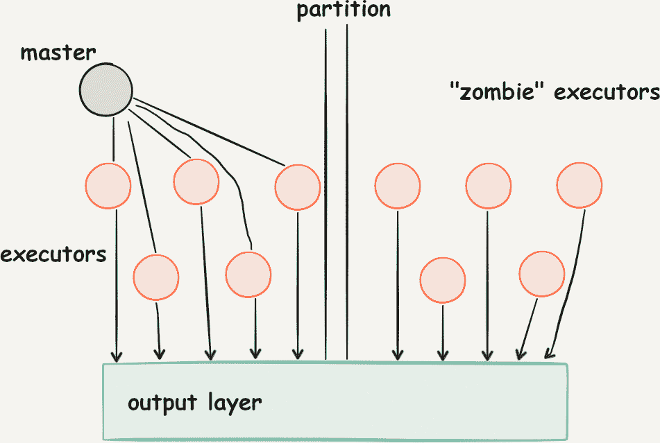

# 第五章：Spark 的分布式处理模型

作为一个分布式处理系统，Spark 依赖于计算资源的可用性和可寻址性来执行任意的工作负载。

尽管可以将 Spark 作为一个独立的分布式系统来解决一个特定的问题，但随着组织在其数据成熟度水平上的发展，通常需要部署一个完整的数据架构，正如我们在第三章中讨论的那样。

在本章中，我们希望讨论 Spark 与其计算环境的交互以及如何适应所选择环境的特性和约束。

首先，我们调查集群管理器的当前选择：YARN、Mesos 和 Kubernetes。集群管理器的范围超出了运行数据分析，因此有大量资源可以获取关于它们任何一个的深入知识。对于我们的目的，我们将提供 Spark 作为参考的集群管理器提供商的额外细节。

一旦您了解了集群管理器的角色及 Spark 如何与其交互，我们将探讨在分布式环境中容错性的各个方面以及 Spark 的执行模型如何在该上下文中运作。

有了这些背景，您将能够理解 Spark 提供的数据可靠性保证及其如何适用于流式执行模型。

# 运行 Apache Spark 与集群管理器

我们首先要讨论在一个*集群*上分布流处理的学科。这组机器具有一般目的，并且需要接收流应用程序的运行时二进制文件和启动脚本——这被称为*配置*。事实上，现代集群是自动管理的，并且包括大量的机器在*多租户*的情况下运行，这意味着许多利益相关者希望在一天中的不同时间访问和使用同一个集群。因此，这些集群由*集群管理器*管理。

集群管理器是一种软件，接收来自多个用户的利用请求，将其匹配到一些资源上，并代表用户预留这些资源一定的时间，并将用户应用程序放置在一些资源上供其使用。集群管理器角色的挑战包括非平凡的任务，如在可用机器池中为用户请求找到最佳位置或者在多个用户应用程序共享同一物理基础设施时安全地隔离用户应用程序。这些管理器能够发挥作用或者失效的一些考虑因素包括任务的碎片化、最佳位置、可用性、抢占和优先级。因此，集群管理本身就是一门学科，超出了 Apache Spark 的范围。相反，Apache Spark 利用现有的集群管理器将其工作负载分布到集群中。

## 集群管理器示例

一些流行的集群管理器示例包括以下内容：

+   Apache YARN，这是一个相对成熟的集群管理器，起源于 Apache Hadoop 项目。

+   Apache Mesos，这是一个基于 Linux 容器技术的集群管理器，最初是 Apache Spark 存在的原因。

+   Kubernetes，这是一个现代的集群管理器，诞生于面向服务的部署 API，实践中起源于 Google，并在 Cloud Native Computing Foundation 的旗下以其现代形式发展。

Spark 有时会让人感到困惑的地方在于，作为一个发行版，Apache Spark 包含了自己的集群管理器，这意味着 Apache Spark 有能力作为其特定的部署协调器。

在本章的其余部分，我们将看以下内容：

+   Spark 自己的集群管理器及其*特殊用途*意味着它在容错或多租户领域承担的责任比生产集群管理器如 Mesos、YARN 或 Kubernetes 少。

+   分布式流应用程序期望的*交付保证*的标准级别如何不同，以及 Spark 如何满足这些保证。

+   微批处理（microbatching），作为 Spark 处理流处理的独特因素，来自于*大同步处理*（BSP）十年前的模型，并为从 Spark Streaming 到 Structured Streaming 的演进路径铺平道路。

# Spark 自己的集群管理器

Spark 有两个内部集群管理器：

*本地*集群管理器

用于测试目的的集群管理器（或资源管理器）的功能。它通过依赖于本地机器仅有少量可用核心的线程模型来复制分布式机器群的存在。这种模式通常不会引起很多困惑，因为它仅在用户的笔记本电脑上执行。

*独立*集群管理器

一个相对简单的、仅限于 Spark 的集群管理器，在资源分配的切片和切割能力方面相当有限。独立集群管理器持有并使得 Spark 执行器部署和启动的整个工作节点可用。它还期望执行器已经预先部署在那里，并且将*.jar*实际传送到新机器不在其范围之内。它有能力接管一定数量的执行器，这些执行器是其工作节点部署的一部分，并在其上执行任务。这个集群管理器对于 Spark 开发人员来说非常有用，提供了一个简单的资源管理解决方案，让您可以专注于在没有任何花哨功能的环境中改进 Spark。不建议将独立集群管理器用于生产部署。

简而言之，Apache Spark 是一个*任务调度器*，它调度的是*任务*，这些任务是从用户程序中提取的计算分布单元。Spark 还通过包括 Apache Mesos、YARN 和 Kubernetes 在内的集群管理器进行通信和部署，或者在某些情况下允许使用其自己的独立集群管理器。这种通信的目的是预留一定数量的*执行器*，这些执行器是 Spark 理解的等大小的计算资源单位，一种虚拟的“节点”。所讨论的预留资源可以由集群管理器提供，如下：

+   有限的进程（例如，在某些 YARN 的基本用例中），其中进程的资源消耗受到计量，但默认情况下不会阻止它们访问彼此的资源。

+   *容器*（例如，在 Mesos 或 Kubernetes 的情况下），其中容器是一种相对轻量级的资源预留技术，源自 Linux 内核的 cgroups 和命名空间，并通过 Docker 项目实现了它们的最流行版本。

+   它们也可以是上述任一部署在*虚拟机*（VMs）上，这些虚拟机本身带有特定的核心和内存预留。

# 集群操作

详细描述这三种技术所涉及的不同隔离级别超出了本书的范围，但对于生产环境的设置非常值得探索。

请注意，在企业级生产集群管理领域，我们还会遇到作业队列、优先级、多租户选项和抢占等概念，这些都是集群管理器的领域，因此在专注于 Spark 的材料中很少讨论。

然而，对于您来说，理解您的集群管理器设置的具体细节是至关重要的，以了解如何在多个团队共享的机器集群上成为一个“好公民”。有许多关于如何运行适当的集群管理器的良好实践，而许多团队竞争其资源。关于这些建议，您应该咨询本章末尾列出的参考资料以及您的本地 DevOps 团队。

# 理解分布式系统中的弹性和容错能力

对于分布式应用程序来说，弹性和容错是绝对必要的：它们是我们能够完成用户计算的条件。如今，集群由理想情况下在其生命周期内接近峰值容量运行的廉价机器组成。

简而言之，硬件经常出现故障。一个*弹性*的应用程序可以在其分布式环境中处理延迟和非关键故障，并取得进展。一个*容错*的应用程序能够在其一个或多个节点意外终止的情况下成功完成其进程。

这种弹性尤其在流处理中尤为重要，因为我们安排的应用程序应该能够持续运行一段未确定的时间。这段未确定的时间通常与数据源的生命周期相关联。例如，如果我们正在运行一个零售网站，并分析用户访问网站时的交易和网站交互，我们可能有一个数据源将在我们业务的整个生命周期内可用，而我们希望这个时间非常长，如果我们的业务要成功的话。

因此，一个以流式方式处理我们数据的系统应该能够长时间不间断地运行。

流式计算中的“秀必须继续”的方法使得我们应用的容错和故障容忍特性变得更加重要。对于批处理作业，我们可以启动它，希望它能成功，如果需要更改或在失败的情况下重新启动。但对于在线流式 Spark 流水线，这不是一个合理的假设。

## 故障恢复

在容错的背景下，我们还希望了解从一个特定节点故障到恢复需要多长时间。实际上，流处理有一个特定的方面：数据源持续实时生成数据。要处理批处理计算的故障，我们总是有机会从头重新启动，并接受获取计算结果需要更长时间的事实。因此，容错的一个非常原始的形式是检测到部署的特定节点失败，停止计算，并从头重新启动。这个过程可能需要比我们为该计算预算的原始持续时间长两倍以上，但如果我们不赶时间，这仍然可以接受。

对于流处理，*我们需要继续接收数据*，因此在恢复的集群尚未准备好进行任何处理时，可能需要存储数据。这可能在高吞吐量时成为问题：如果我们尝试从头开始重新启动，我们不仅需要重新处理自应用程序开始以来观察到的所有数据——这本身就可能是一个挑战——而且在重新处理历史数据期间，我们需要继续接收并可能存储在我们试图赶上时生成的新数据。这种从头开始重新启动的模式对于流式处理来说是如此棘手，以至于我们将特别关注 Spark 在节点不可用或无功能情况下仅重新启动 *最小* 计算量的能力。

## 集群管理器对容错的支持

我们想强调为什么仍然重要理解 Spark 的容错保证，即使 YARN、Mesos 或 Kubernetes 的集群管理器中也有类似的功能。要理解这一点，我们可以考虑集群管理器在与能够报告故障并请求新资源以应对这些异常的框架紧密合作时帮助容错。Spark 具有这样的能力。

例如，*生产*集群管理器（如 YARN、Mesos 或 Kubernetes）具有通过检查节点上的端点并要求节点报告其自身的就绪状态和活跃状态来检测节点故障的能力。如果这些集群管理器检测到故障并且有备用容量，它们将用另一个节点替换该节点，以供 Spark 使用。这一特定操作意味着 Spark 执行器代码将在另一个节点上重新启动，然后尝试加入现有的 Spark 集群。

集群管理器本质上不具有对其保留的节点上运行的应用程序进行内省的能力。它的责任仅限于运行用户代码的容器。

那个责任边界是 Spark 弹性特性开始的地方。为了从失败节点中恢复，Spark 需要执行以下操作：

+   确定该节点是否包含应以检查点文件形式再现的某些状态。

+   理解在作业的哪个阶段节点应重新加入计算。

这里的目标是我们探索一下，如果一个节点被集群管理器替换，Spark 是否具有能力利用这个新节点，并将计算分布到它上面。

在这种背景下，我们关注 Spark 作为应用程序的责任，并在必要时强调集群管理器的能力：例如，节点可能由于硬件故障或其工作被更高优先级的作业简单地抢占而被替换。Apache Spark 对*为什么*毫不知情，而专注于*如何*。

# 数据传递语义

正如您在流式模型中看到的，流式作业基于实时生成的数据操作，这意味着中间结果需要定期提供给流水线的*消费者*。

这些结果由我们集群的某些部分产生。理想情况下，我们希望这些可观察结果与数据到达的实时性相一致。这意味着我们希望得到精确的结果，并希望尽快获得它们。然而，分布式计算也有自己的挑战，有时不仅包括个别节点的故障，如我们所提到的，还包括像*网络分区*这样的情况，其中集群的某些部分无法与该集群的其他部分进行通信，如图 5-1 所示。

###### 图 5-1\. 网络分区

Spark 是使用*driver/executor*架构设计的。一个特定的机器，*driver*，负责跟踪*作业进度*以及用户的作业提交，并且该程序的计算是随着数据的到达而发生的。然而，如果网络分区分隔了集群的某些部分，*driver*可能只能跟踪形成初始集群的执行器的一部分。在我们的分区的另一部分中，我们将找到完全能够运行但无法向*driver*报告其计算进程的节点。

这产生了一个有趣的情况，即那些“僵尸”节点不会接收新任务，但可能正在完成它们之前获得的某些计算片段。由于不知道分区的存在，它们将像任何执行器一样报告它们的结果。由于这些“僵尸”结果的报告有时不通过*driver*（为了避免*driver*成为瓶颈），这些结果的报告可能会成功。

由于*driver*，一个单一的记账点，并不知道那些僵尸执行器仍在运行并报告结果，它将重新安排丢失的执行器需要在新节点上完成的相同任务。这造成了一个“双答复”问题，即通过分区丢失的僵尸机器和承载重新安排任务的机器都报告了相同的结果。这带来了真实的后果：我们之前提到的流计算的一个例子是路由金融交易的任务。在这种情况下，双重提款或双重股票购买订单可能会产生巨大的后果。

引起不同处理语义的问题不仅仅是上述问题。另一个重要的原因是，当流处理应用的输出和状态检查点无法在一个原子操作中完成时，在检查点和输出之间发生故障将导致数据损坏。

因此，这些挑战导致了“至少一次”处理和“至多一次”处理之间的区别：

至少一次

这个处理确保了流的每个元素至少被处理一次或更多次。

至多一次

这个处理确保了流的每个元素最多被处理一次。

确切一次

这就是“至少一次”和“至多一次”的组合。

至少一次处理是我们想确保每个初始数据块都已处理的概念——它处理了我们之前谈到的节点故障。正如我们提到的，当流处理过程遭受部分失败时，需要替换一些节点或重新计算一些数据，我们需要重新处理丢失的计算单元，同时保持数据的摄入。如果不遵守至少一次处理，有可能在特定条件下丢失数据。

反对称概念称为最多一次处理。最多一次处理系统保证，将重复结果的僵尸节点与重新安排的节点一样以一致的方式处理，我们只保留一组结果。通过跟踪*其结果所涉及的数据*，我们能够确保丢弃重复的结果，从而得到最多一次处理的保证。我们实现这一点的方式依赖于作用于结果接收的“最后一英里”的幂等性概念。幂等性使得函数的应用两次（或更多次）于任何数据时，结果与第一次相同。这可以通过跟踪我们报告结果的数据，并在流处理输出处有一个记账系统来实现。

# 微批处理和逐个元素处理

在本节中，我们要讨论流处理的两种重要方法：*批同步处理*和*逐条记录处理*。

这一目标是将这两个概念连接到 Spark 用于流处理的两个 API：Spark Streaming 和 Structured Streaming。

## 微批处理：批量同步处理的一种应用

Spark Streaming，在 Spark 中流处理的更成熟模型，大致近似于所谓的*批量同步并行*（BSP）系统。

BSP 的要点在于它包括两个方面：

+   异步工作的分割分布

+   同步屏障，按固定间隔到达

分割是每个连续的流处理步骤要完成的工作分割成数量大致与可用于执行此任务的执行器数量成比例的并行块的概念。每个执行器接收其自己的工作块（或块），并单独工作，直到第二个元素到来。特定的资源负责跟踪计算的进度。在 Spark Streaming 中，这是一个“驱动程序”上的同步点，允许工作进入下一步。在这些预定的步骤之间，集群上的所有执行器都在做相同的事情。

请注意，在此调度过程中传递的是描述用户希望对数据执行的处理的函数。数据已经位于各个执行器上，通常在集群的生命周期内直接传递到这些资源。

这在 2016 年由 Heather Miller 称为“函数传递风格”（并在[[Miller2016]](app01.xhtml#Miller2016)中正式化）：异步将安全函数传递给分布式、静态、不可变数据，在无状态容器中使用惰性组合子来消除中间数据结构。

进行进一步数据处理轮次的频率由时间间隔决定。这个时间间隔是一个任意的持续时间，以批处理时间来衡量；也就是说，在您的集群中作为“挂钟”时间观察所期望看到的内容。

对于流处理，我们选择在小的固定间隔内实现屏障，以更好地近似数据处理的实时概念。

## 逐条记录处理

相比之下，逐条记录处理通过*流水线处理*：它分析用户指定函数描述的整个计算，并将其部署为使用集群资源的流水线。然后，唯一剩下的问题就是通过各种资源流动数据，按照规定的流水线进行操作。请注意，在后一种情况下，计算的每个步骤在集群中的某个地方都有具体体现。

大多数按照这一范式运行的系统包括 Apache Flink，Naiad，Storm 和 IBM Streams。（您可以在第二十九章中进一步了解这些内容。）这并不一定意味着这些系统无法进行微批处理，而是表明它们的主要或最原生的操作模式，并说明它们对流水线处理过程的依赖通常是其核心。

这两者之间特定事件到达系统反应所需的最小延迟时间非常不同：微批处理系统的最小延迟时间因此是完成当前微批（批处理间隔）的接收所需的时间加上在数据落到的执行器上启动任务所需的时间（也称为调度时间）。另一方面，逐条记录处理系统可以在遇到感兴趣事件时立即作出反应。

## 微批处理与逐条处理之间的权衡

尽管其延迟较高，微批处理系统提供了显著的优势：

+   它们能够在同步障碍边界上*适应*。如果一些执行器已经显示出不足或丢失数据，这种适应可能代表了从故障中恢复的任务。周期性的同步还可以为我们提供添加或移除执行器节点的机会，使我们能够根据我们观察到的集群负载通过数据源的吞吐量来增加或减少资源。

+   我们的 BSP 系统有时可以更容易地提供*强一致性*，因为它们的批处理决策—指示特定数据批次的开始和结束—是确定性的并被记录下来。因此，任何计算都可以重新进行，并且第二次会产生相同的结果。

+   在微批的开始时，我们可以将数据作为*集合*提供，这样我们可以执行有效的优化，为计算数据提供思路。利用每个微批次，我们可以考虑具体的情况，而不是一般处理，这适用于所有可能的输入。例如，我们可以在决定处理或丢弃每个微批之前进行采样或计算统计量。

更重要的是，即使是瞬时的微批也可以作为明确定义的元素来有效地指定批处理和流处理的编程方式。即使只有瞬时，微批看起来也*像是*静态数据。

# 将微批处理和逐条处理结合在一起

在像 Apache Flink 或 Naiad 这样的系统中实现的微批处理和逐条处理的结合仍然是研究的课题。¹.]

虽然它不能解决每一个问题，但由微批处理支持的结构化流处理并不会在 API 级别上暴露这种选择，允许独立于固定批处理间隔的演进。事实上，结构化流处理的默认内部执行模型是微批处理，具有动态批处理间隔。对于某些操作符，结构化流处理还实现了连续处理，这是我们在第十五章中涉及的内容。

# 动态批处理间隔

什么是*动态批处理间隔*？动态批处理间隔是指在流式处理的`DataFrame`或`Dataset`中，数据的重新计算包括对新接收到的数据进行更新。这种更新基于触发器，并且通常基于时间段进行。该时间段仍然是基于我们预期在整个集群内同步的固定世界时钟信号，代表了每个执行器共享的单一同步时间源。

然而，这个触发器也可以是“尽可能频繁”这一声明。这个声明只是一个新批次应该在前一个批次处理完之后立即启动的想法，给第一个批次一个合理的初始持续时间。这意味着系统将尽可能频繁地启动批次。在这种情况下，可以观察到的延迟接近于逐个处理的情况。这里的思想是，由此系统产生的微批次将收敛到最小可管理的大小，使得我们的流通过执行器计算更快地产生结果。一旦产生了那个结果，Spark 驱动程序将启动并安排一个新的查询。

# 结构化流处理模型

结构化流处理的主要步骤如下：

1.  当 Spark 驱动程序触发新的批次时，处理从更新从数据源读取的数据账户开始，特别是获取最新批次的起始和结束的数据偏移量。

1.  这之后是逻辑规划，构建要在数据上执行的连续步骤，然后是查询规划（步内优化）。

1.  然后通过添加新的数据批次来更新我们试图刷新的连续查询的实际计算的启动和调度。

因此，从计算模型的角度来看，我们将看到 API 与 Spark Streaming 有显著的不同。

## 批处理间隔的消失

现在我们简要解释一下结构化流批处理的含义及其对操作的影响。

在结构化流处理中，我们使用的批处理间隔不再是一个计算预算。在 Spark Streaming 中，理念是，如果我们每两分钟产生一次数据，并且每两分钟将数据流入 Spark 的内存，我们应该在至少两分钟内对该批数据进行计算，并清除我们集群中的内存以便下一个微批次。理想情况下，数据流入的量与流出的量相同，并且我们集群的集体内存使用保持稳定。

使用结构化流，没有这种固定的时间同步，我们在集群中看到性能问题的能力更加复杂：一个不稳定的集群——即无法通过尽快完成计算来“清除”数据的集群——将看到不断增长的批处理时间，增长速度加快。我们可以预期，控制这个批处理时间将至关重要。

然而，如果我们的集群与数据吞吐量的大小正确匹配，那么具有尽可能频繁更新的许多优势。特别是，我们应该期望在我们结构化流集群中看到比以往保守批处理间隔时间更高粒度的非常频繁的结果。

¹ 最近由伯克利大学推出的一个与 Spark 相关的有趣项目名为 Drizzle，它使用“组调度”来形成一种类似于长寿命的流水线，跨多个批次持久存在，旨在创建接近连续的查询。参见 [Venkataraman2016
