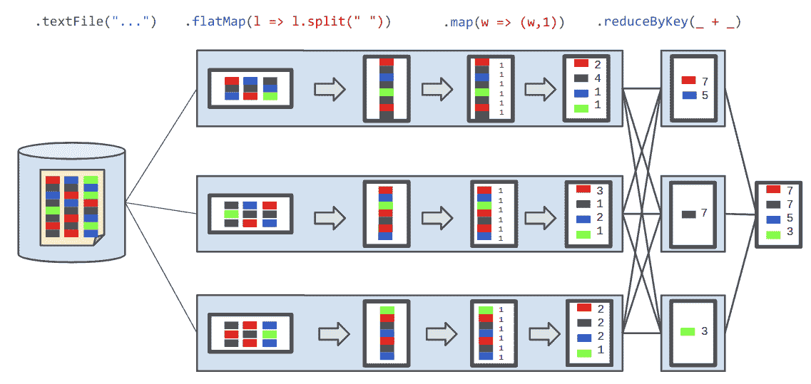
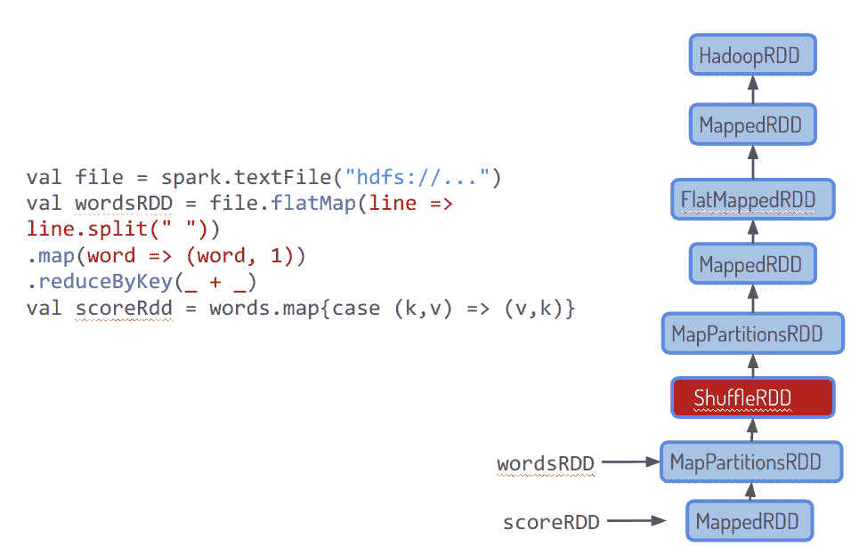
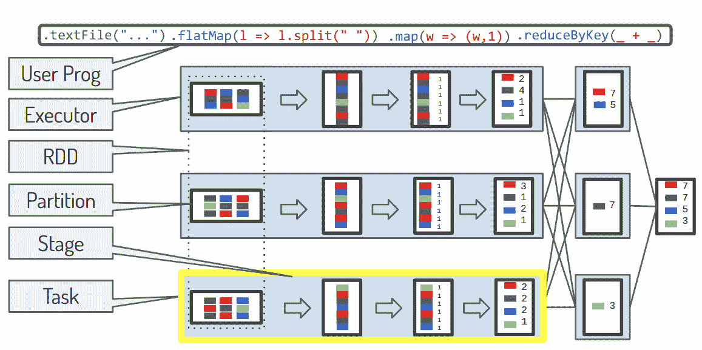

# 第六章：Spark 的弹性模型

在大多数情况下，流处理作业是长时间运行的作业。根据定义，随着时间推移观察和处理的数据流会导致连续运行的作业。当它们处理数据时，可能会累积中间结果，在数据离开处理系统后难以重现。因此，失败的成本相当高，并且在某些情况下，完全恢复是棘手的。

在分布式系统中，特别是依赖于商品硬件的系统中，故障是大小的函数：系统越大，任何时候某些组件发生故障的概率就越高。分布式流处理器需要在其操作模型中考虑到这种故障的可能性。

在本章中，我们将看到 Apache Spark 平台提供的弹性：它如何能够恢复部分故障以及在故障发生时通过系统传递数据时我们得到的保证种类。我们首先概述 Spark 的不同内部组件及其与核心数据结构的关系。有了这些知识，您可以进一步了解不同级别的故障对系统的影响以及 Spark 提供的恢复措施。

# Spark 中的弹性分布式数据集

Spark 的数据表示建立在 *弹性分布式数据集*（RDDs）之上。RDDs 最早在 2011 年由论文“Resilient Distributed Datasets: A Fault-Tolerant Abstraction for In-Memory Cluster Computing” [[Zaharia2011]](app01.xhtml#Zaharia2011) 中提出，是 Spark 中的基础数据结构。正是在这个基础层面上，Spark 提供了强大的容错保证。

RDDs 由分区组成，这些分区是存储在单个节点上的数据段，并由 Spark 驱动程序跟踪，呈现给用户作为位置透明的数据结构。

我们在 图 6-1 中说明了这些组件，其中经典的 *词频统计* 应用程序被分解为组成 RDD 的不同元素。

###### 图 6-1\. 在分布式系统中表示的 RDD 操作

彩色块是数据元素，最初存储在分布式文件系统中，在图的最左侧表示。数据以分区形式存储，以彩色块的列形式展示在文件内部。每个分区被读取到一个执行器中，我们将其视为水平块。实际的数据处理发生在执行器内部。在那里，数据根据 RDD 级别描述的转换进行转换：

+   `.flatMap(l => l.split(" "))` 将句子按空格分割为单词。

+   `.map(w => (w,1))` 将每个单词转换为形如 `(<word>, 1)` 的元组，为计数做准备。

+   `.reduceByKey(_ + _)` 计算计数，使用 `<word>` 作为键，并将加法操作应用于附加的数字。

+   最终结果通过使用相同的 `reduce` 操作将部分结果合并而得到。

RDDs 构成了 Spark 的编程核心。所有其他抽象，无论是批处理还是流处理，包括 `DataFrame`、`DataSet` 和 `DStream`，都是使用 `RDD` 创建的设施构建的，更重要的是，它们继承了相同的容错能力。我们在 “RDDs as the Underlying Abstraction for DStreams” 中对 `RDD` 编程模型进行了简要介绍。

`RDD` 的另一个重要特性是，Spark 会尽量将它们的数据保存在内存中，只要系统中有足够的容量。此行为可通过存储级别进行配置，并且可以通过调用缓存操作进行显式控制。

我们在这里提到这些结构，是为了说明 Spark 通过修改数据来跟踪用户计算的进展。确实，通过检查程序的控制流程（包括循环和可能的递归调用）来了解用户想要做什么有多么困难和容易出错。定义分布式数据集类型，让用户从其他数据源或从一个数据集创建另一个数据集，会更可靠。

在 图 6-2 中，我们展示了相同的 *单词计数* 程序，现在以用户提供的代码形式（左侧）和生成的内部 `RDD` 操作链形式展示。这种依赖链形成了一种特定类型的图，称为有向无环图（DAG）。DAG 通知调度程序，适当地称为 `DAGScheduler`，如何分发计算，也是失败恢复功能的基础，因为它表示内部数据及其依赖关系。

###### 图 6-2\. RDD 衍生线

当系统跟踪这些分布式数据集的有序创建时，它同时跟踪已完成的工作和尚未完成的工作。

# Spark 组件

要理解 Spark 中容错机制的作用层次，有必要先浏览一下一些核心概念的术语。我们首先假设用户提供的程序被分成块并在各种机器上执行，就像我们在前一节中看到的，并如 图 6-3 所示。

###### 图 6-3\. Spark 术语

让我们详细讲解一下这些步骤，这些步骤在 图 6-3 中有所展示，这些步骤定义了 Spark 运行时的词汇表：

用户程序

Spark Streaming 中的用户应用程序由用户指定的 *函数调用* 组成，操作在弹性数据结构（如 RDD、DStream、流式 DataSet 等）上，分为 *actions* 和 *transformations*。

转换后的用户程序

用户程序可能会进行调整，修改一些指定调用，使其更简单、更易理解的方式是 map-fusion。¹ 查询计划在 Spark SQL 中是一个类似但更高级的概念。

RDD

分布式、弹性数据集的逻辑表示。在图示中，我们看到初始 RDD 由三部分组成，称为分区。

分区

分区是可以独立加载的数据集的物理片段。

阶段

然后将用户的操作分组到*阶段*中，这些阶段的边界将用户操作分为必须分开执行的步骤。例如，需要在多个节点之间进行数据洗牌的操作，如两个不同上游操作结果的连接，标志着一个独特的阶段。Apache Spark 中的阶段是顺序执行的单位：它们一个接一个地执行。在任何给定时间，最多只能运行一个相互依赖的阶段。

作业

在定义这些*阶段*之后，Spark 应该采取哪些内部操作是明确的。事实上，在这个阶段，定义了一组相互依赖的*作业*。而作业，准确地说，是调度单位的词汇。它们从整个 Spark 集群的角度描述正在处理的工作，无论它是在队列中等待还是当前在多台机器上运行。（虽然它没有明确表示，在图 6-3 中，作业是完整的转换集。）

任务

根据它们的源数据在集群上的位置，作业可以被切割成*任务*，跨越分布式和单机计算之间的概念边界：任务是本地计算的单位，是作业的本地、执行器绑定部分的名称。

Spark 旨在确保所有这些步骤免受伤害，并在任何此过程中发生的任何事故的情况下快速恢复。这种关注反映在由上述概念结构化的容错设施中：在任务、作业、阶段或程序级别发生的重启和检查点操作。

# Spark 的容错保证

现在我们已经看到组成 Spark 内部机制的“部件”，我们准备理解故障可以发生在许多不同的层次上。在本节中，我们看到 Spark 容错保证按“逐渐扩大的爆炸半径”组织，从较小的故障到较大的故障。我们将调查以下内容：

+   如何通过重新启动减轻 Spark 任务失败

+   如何通过洗牌服务减轻 Spark 阶段失败

+   如何通过驱动程序重新启动减轻用户程序的*编排者*消失

当您完成本节时，您将对 Spark 在运行时提供的保证有一个清晰的心理图景，让您理解配置良好的 Spark 作业可以处理的故障场景。

## 任务失败恢复

当运行任务的基础设施出现故障或程序中的逻辑条件导致偶发的作业失败时（如`OutOfMemory`、网络、存储错误，或者与正在处理的数据质量相关的问题（例如解析错误、`NumberFormatException`或`NullPointerException`等常见异常）），任务可能会失败。

如果任务的输入数据已通过`cache()`或`persist()`存储，并且所选的存储级别意味着数据的复制（查找设置以 `_2` 结尾的存储级别，例如 `MEMORY_ONLY_SER_2`），则任务不需要重新计算其输入，因为集群中的另一台机器上存在完整副本。然后，我们可以使用此输入重新启动任务。表 6-1 总结了 Spark 中可配置的不同存储级别及其在内存使用和复制因子方面的特性。

表 6-1\. Spark 存储级别

| 级别 | 使用磁盘 | 使用内存 | 使用堆外存储 | 对象（反序列化） | 复制的副本数量 |
| --- | --- | --- | --- | --- | --- |
| `NONE` |  |  |  |  | 1 |
| `DISK_ONLY` | X |  |  |  | 1 |
| `DISK_ONLY_2` | X |  |  |  | 2 |
| `MEMORY_ONLY` |  | X |  | X | 1 |
| `MEMORY_ONLY_2` |  | X |  | X | 2 |
| `MEMORY_ONLY_SER` |  | X |  |  | 1 |
| `MEMORY_ONLY_SER_2` |  | X |  |  | 2 |
| `MEMORY_AND_DISK` | X | X |  | X | 1 |
| `MEMORY_AND_DISK_2` | X | X |  | X | 2 |
| `MEMORY_AND_DISK_SER` | X | X |  |  | 1 |
| `MEMORY_AND_DISK_SER_2` | X | X |  |  | 2 |
| `OFF_HEAP` |  |  | X |  | 1 |

然而，如果没有持久性或者存储级别不能保证任务输入数据的存在副本，Spark 驱动程序将需要查询存储用户指定计算的 DAG，以确定哪些作业段需要重新计算。

因此，在缓存或存储级别上没有足够的预防措施时，一个任务的失败可能会触发多个其他任务的重新计算，直到阶段边界。

阶段边界意味着一个洗牌，而洗牌意味着中间数据将以某种方式被实现：正如我们所讨论的，洗牌将执行者转变为数据服务器，可以向任何其他充当目标执行者提供数据。

因此，这些执行者拥有导致洗牌的映射操作的副本。因此，参与洗牌的执行者具有导致其之前映射操作的副本。但如果你有一个即将崩溃的下游执行者，并能依赖于洗牌的上游服务器（它们为类似映射操作的输出提供服务），这将是一个救命稻草。如果情况相反呢：你需要面对一个上游执行者的崩溃？

## 阶段失败恢复

我们已经看到任务失败（可能由于执行器崩溃）是集群上发生的最频繁的事件，因此也是最重要的事件需要避免。反复发生的任务失败将导致包含该任务的阶段失败。这让我们进入第二个允许 Spark 抵抗任意阶段失败的设施：*shuffle service*。

当此失败发生时，总是意味着数据的某种回滚，但是根据定义，shuffle 操作依赖于所有前面步骤中涉及的执行器。

自 Spark 1.3 开始，我们引入了**shuffle service**，它允许您处理通过集群分布的映射数据，具有良好的本地性，但更重要的是，通过不是 Spark 任务的服务器。这是一个用 Java 编写的外部文件交换服务，不依赖于 Spark，并且设计成比 Spark executor 更长时间运行的服务。这个额外的服务作为 Spark 所有集群模式中的一个单独进程连接，仅为执行器提供数据文件交换，以便在 shuffle 之前可靠地传输数据。通过 netty 后端高度优化，允许在传输数据时减少非常低的开销。因此，一旦执行器的映射任务执行完毕，就可以关闭执行器，此时 shuffle 服务已经拥有其数据的副本。由于数据传输更快，传输时间也大大减少，减少了执行器可能面临问题的脆弱时间。

## 驱动程序失败恢复

在了解了 Spark 如何从特定任务和阶段的失败中恢复后，我们现在可以看一下 Spark 提供的用于恢复驱动程序失败的功能。在 Spark 中，驱动程序具有至关重要的角色：它是块管理器的存放处，知道集群中每个数据块的位置。同时也是 DAG 存在的地方。

最后，驱动程序是作业调度状态、元数据和日志的存放地。因此，如果丢失驱动程序，则整个 Spark 集群可能会丢失其在计算中达到的阶段、实际计算内容以及服务它的数据，一箭双雕。

### 集群模式部署

Spark 实现了所谓的*集群部署模式*，允许驱动程序托管在集群上，而不是用户的计算机上。

部署模式有两种选项：在客户端模式下，驱动程序在提交应用程序的客户端的同一进程中启动。然而，在集群模式下，驱动程序是从集群内的一个工作进程中启动的，客户端进程在提交应用程序后立即退出，而不等待应用程序完成。

总之，这使得 Spark 能够自动重启驱动程序，以便用户可以以“点火并忘记”的方式启动作业，开始作业然后关闭笔记本电脑以赶上下一趟火车。每个 Spark 的集群模式都提供一个 Web UI，用户可以访问其应用程序的日志。另一个优势是驱动程序的失败并不标志着作业的结束，因为集群管理器将重新启动驱动程序进程。但这只允许从头开始恢复，因为计算的临时状态—之前存储在驱动程序机器上—可能已丢失。

### 检查点

为了避免在驱动程序崩溃时丢失中间状态，Spark 提供了检查点选项；即，定期记录应用程序状态的快照到磁盘上。`sparkContext.setCheckpointDirectory()`选项的设置应指向可靠的存储（例如，Hadoop 分布式文件系统[HDFS]），因为让驱动程序尝试从其本地文件系统重建中间 RDD 的状态是毫无意义的：这些中间 RDD 是在集群的执行者上创建的，因此不应需要与驱动程序进行任何交互来备份它们。

我们稍后会详细讨论关于检查点的话题，在第二十四章。同时，仍然有一个任何 Spark 集群的组件的潜在故障我们尚未解决：主节点。

# 概要

这次关于 Spark 核心容错和高可用模式的介绍应该让您对 Spark 提供的主要基本组件和设施有所了解。请注意，到目前为止，这些内容都不专门针对 Spark Streaming 或结构化 Streaming，但所有这些教训都适用于流式 API，因为它们需要提供长时间运行的、容错的，但性能高效的应用程序。

注意，这些设施反映了对特定集群中故障频率的不同关注点。这些设施反映了对特定集群中故障频率的不同关注点：

+   通过设置通过 Zookeeper 保持最新的故障转移主节点等功能，真正关注的是在 Spark 应用程序设计中避免单点故障。

+   Spark Shuffle Service 的目的是避免在长列表的计算步骤末尾进行 Shuffle 步骤时出现任何问题，使整个过程因执行者的故障而变得脆弱。

后者是一个更频繁的发生。前者是关于处理每种可能的条件，后者更多关于确保平稳的性能和高效的恢复。

¹ 这个过程将`l.map(foo).map(bar)`转换为`l.map((x) => bar(foo(x)))`
