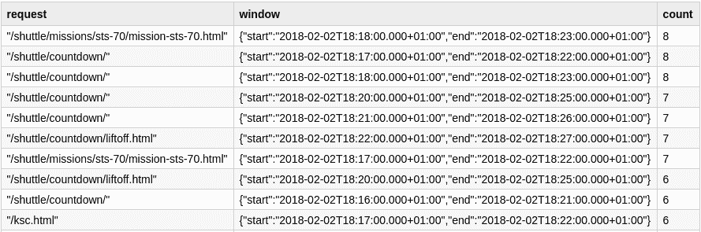

# 第七章：介绍结构化流处理

在数据密集型企业中，我们发现许多大型数据集：来自面向互联网服务器的日志文件、购物行为表以及带有传感器数据的 NoSQL 数据库，这些都是一些例子。所有这些数据集共享相同的基本生命周期：它们在某个时间点为空，并逐渐被到达的数据点填充，这些数据点被导向某种形式的次要存储。这个数据到达的过程不过是将*数据流*实体化到次要存储上。然后，我们可以使用我们喜爱的分析工具对这些*静态*数据集进行分析，使用称为*批处理*的技术，因为它们一次处理大块数据，并且通常需要大量时间来完成，从几分钟到几天不等。

在*Spark SQL*中的`Dataset`抽象是分析静态数据的一种方式。它特别适用于*结构化*的数据；也就是说，它遵循了定义好的模式。Spark 中的`Dataset` API 结合了类似 SQL 的 API 的表达能力和类型安全的集合操作，这些操作类似于 Scala 集合和`Resilient Distributed Dataset`（RDD）编程模型。同时，`Dataframe` API 与 Python Pandas 和 R Dataframes 类似，扩展了 Spark 用户的范围，超越了最初的数据工程师核心，这些人习惯于在函数范式中开发。这种更高级的抽象旨在通过使用熟悉的 API，支持现代数据工程和数据科学实践，让更广泛的专业人士加入到大数据分析的行列中。

如果不必等待数据“*安定下来*”，而是可以在数据保持原始流形式时应用相同的`Dataset`概念，会怎样？

结构化流模型是`Dataset`SQL 导向模型的扩展，用于处理运动中的数据：

+   数据来自*source*流，并假定具有定义的模式。

+   事件流可以看作是附加到无界表的行。

+   要从流中获取结果，我们将计算表达为对该表的查询。

+   通过不断地将相同查询应用于更新的表，我们创建一个处理后事件的输出流。

+   结果事件被提供给一个输出*sink*。

+   *Sink*可以是存储系统、另一个流后端或准备消耗处理后数据的应用程序。

在这种模型中，我们理论上*无界*的表必须在具有定义资源限制的物理系统中实现。因此，模型的实现需要考虑和限制来处理潜在的无限数据流入。

为了解决这些挑战，结构化流引入了对`Dataset`和`DataFrame` API 的新概念，例如支持事件时间、*水印*和确定存储过去数据时间长度的不同输出模式。

从概念上讲，结构化流处理模型模糊了批处理和流处理之间的界限，大大减少了处理快速移动数据分析的负担。

# 使用结构化流处理的第一步

在上一节中，我们学习了构成结构化流处理的高级概念，如数据源、数据汇和查询。现在，我们将从实际角度探索结构化流处理，以简化的网络日志分析用例为例进行说明。

在我们开始深入研究我们的第一个流处理应用程序之前，我们将看看如何将 Apache Spark 中的经典批处理分析应用到相同的用例中。

本练习有两个主要目标：

+   首先，大多数，如果不是全部，流数据分析都是从研究静态数据样本开始的。从一个数据文件开始研究会更容易，可以直观地了解数据的外观，显示的模式类型以及定义我们从数据中提取所需知识的过程。通常，只有在定义和测试我们的数据分析作业之后，我们才会将其转换为可以将我们的分析逻辑应用于正在移动的数据的流处理过程。

+   其次，从实际角度来看，我们可以欣赏 Apache Spark 如何通过统一的 API 简化从批量探索到流处理应用程序的过渡的许多方面。

这种探索将使我们能够比较和对比 Spark 中批处理和流处理 API，并向我们展示从一个模式转换到另一个模式所需的必要步骤。

# 在线资源

对于此示例，我们使用来自公共 1995 年 NASA Apache 网络日志的 Apache Web 服务器日志，最初来源于[*http://ita.ee.lbl.gov/html/contrib/NASA-HTTP.html*](http://ita.ee.lbl.gov/html/contrib/NASA-HTTP.html)。

出于本练习的目的，原始日志文件已被拆分为每日文件，并且每个日志行都已格式化为 JSON。压缩的 `NASA-weblogs` 文件可以从[*https://github.com/stream-processing-with-spark*](https://github.com/stream-processing-with-spark)下载。

下载这个数据集，并将其放在计算机上的一个文件夹中。

# 批处理分析

鉴于我们正在处理归档日志文件，我们可以一次性访问所有数据。在我们开始构建流处理应用程序之前，让我们简要地*插曲*一下，看看经典批量分析作业的样子。

# 在线资源

对于此示例，我们将在书籍的在线资源中使用 `batch_weblogs` 笔记本，位于[*https://github.com/stream-processing-with-spark*](https://github.com/stream-processing-with-spark)][[*https://github.com/stream-processing-with-spark*](https://github.com/stream-processing-with-spark)]。

首先，我们从我们解压缩它们的目录中加载以 JSON 编码的日志文件：

```
// This is the location of the unpackaged files. Update accordingly
val logsDirectory = ???
val rawLogs = sparkSession.read.json(logsDirectory)
```

接下来，我们声明数据的模式为一个`case class`，以使用类型化的`Dataset` API。按照数据集的正式描述（在[NASA-HTTP](http://bit.ly/2YwMAhG)）中，日志结构如下：

> 日志是一个 ASCII 文件，每个请求一行，包含以下列：
> 
> +   发出请求的主机。如果可能，是主机名，否则是互联网地址（如果未查找到名称）。
> +   
> +   时间戳格式为“DAY MON DD HH:MM:SS YYYY”，其中 DAY 是星期几，MON 是月份名称，DD 是月份中的日期，HH:MM:SS 是使用 24 小时制的时间，YYYY 是年份。时区为–0400。
> +   
> +   给出的请求用引号括起来。
> +   
> +   HTTP 回复代码。
> +   
> +   回复中的字节数。

将该模式转换为 Scala，我们有以下`case class`定义：

```
import java.sql.Timestamp
case class WebLog(host: String,
                  timestamp: Timestamp,
                  request: String,
                  http_reply: Int,
                  bytes: Long
                 )
```

###### 注意

我们使用`java.sql.Timestamp`作为时间戳的类型，因为它在 Spark 内部得到支持，并且不需要其他选项可能需要的任何额外`cast`。

我们使用先前的模式定义，将原始 JSON 转换为类型化数据结构：

```
import org.apache.spark.sql.functions._
import org.apache.spark.sql.types.IntegerType
// we need to narrow the `Interger` type because
// the JSON representation is interpreted as `BigInteger`
val preparedLogs = rawLogs.withColumn("http_reply",
                                      $"http_reply".cast(IntegerType))
val weblogs = preparedLogs.as[WebLog]
```

现在我们将数据结构化后，可以开始询问我们感兴趣的问题了。作为第一步，我们想知道我们的数据集中包含多少条记录：

```
val recordCount = weblogs.count
>recordCount: Long = 1871988
```

一个常见的问题是：“每天最受欢迎的 URL 是什么？”为了回答这个问题，我们首先将时间戳缩减到月份中的某一天。然后我们按照这个新的`dayOfMonth`列和请求 URL 进行分组，并在此聚合上进行计数。最后我们按降序排序以获取前面的 top URLs：

```
val topDailyURLs = weblogs.withColumn("dayOfMonth", dayofmonth($"timestamp"))
                          .select($"request", $"dayOfMonth")
                          .groupBy($"dayOfMonth", $"request")
                          .agg(count($"request").alias("count"))
                          .orderBy(desc("count"))

topDailyURLs.show()
+----------+----------------------------------------+-----+
|dayOfMonth|                                 request|count|
+----------+----------------------------------------+-----+
|        13|GET /images/NASA-logosmall.gif HTTP/1.0 |12476|
|        13|GET /htbin/cdt_main.pl HTTP/1.0         | 7471|
|        12|GET /images/NASA-logosmall.gif HTTP/1.0 | 7143|
|        13|GET /htbin/cdt_clock.pl HTTP/1.0        | 6237|
|         6|GET /images/NASA-logosmall.gif HTTP/1.0 | 6112|
|         5|GET /images/NASA-logosmall.gif HTTP/1.0 | 5865|
        ...
```

前几位的都是图片。现在怎么办？看到前几位的 URL 是站点上常用的图片并不罕见。我们真正感兴趣的是生成最多流量的内容页面。为了找到这些页面，我们首先过滤出`html`内容，然后继续应用我们刚学到的 top 聚合。

如我们所见，请求字段是引用的`[HTTP_VERB] URL [HTTP_VERSION]`序列。我们将提取 URL，并仅保留以*.html*、*.htm*结尾或无扩展名（目录）的 URL。这是为了本例的简化：

```
val urlExtractor = """^GET (.+) HTTP/\d.\d""".r
val allowedExtensions = Set(".html",".htm", "")
val contentPageLogs = weblogs.filter {log =>
  log.request match {
    case urlExtractor(url) =>
      val ext = url.takeRight(5).dropWhile(c => c != '.')
      allowedExtensions.contains(ext)
    case _ => false
  }
}
```

有了这个仅包含*.html*、*.htm*和目录的新数据集，我们继续应用与之前相同的*top-k*函数：

```
val topContentPages = contentPageLogs
  .withColumn("dayOfMonth", dayofmonth($"timestamp"))
  .select($"request", $"dayOfMonth")
  .groupBy($"dayOfMonth", $"request")
  .agg(count($"request").alias("count"))
  .orderBy(desc("count"))

topContentPages.show()
+----------+------------------------------------------------+-----+
|dayOfMonth|                                         request|count|
+----------+------------------------------------------------+-----+
|        13| GET /shuttle/countdown/liftoff.html HTTP/1.0"  | 4992|
|         5| GET /shuttle/countdown/ HTTP/1.0"              | 3412|
|         6| GET /shuttle/countdown/ HTTP/1.0"              | 3393|
|         3| GET /shuttle/countdown/ HTTP/1.0"              | 3378|
|        13| GET /shuttle/countdown/ HTTP/1.0"              | 3086|
|         7| GET /shuttle/countdown/ HTTP/1.0"              | 2935|
|         4| GET /shuttle/countdown/ HTTP/1.0"              | 2832|
|         2| GET /shuttle/countdown/ HTTP/1.0"              | 2330|
        ...
```

我们可以看到那个月份最受欢迎的页面是*liftoff.html*，对应于探索发现航天飞机发射的报道，详细记录在[NASA 档案](https://go.nasa.gov/2Q9HBQX)中。紧随其后的是`countdown/`，即发射前几天的倒计时页面。

# 流分析

在前一节中，我们探索了历史上 NASA 的网络日志记录。我们发现这些记录中的趋势事件发生在实际事件之后很久。

流分析的一个关键驱动因素是组织对及时信息的增加需求，这些信息可以帮助他们在多个不同层次上做出决策。

我们可以利用我们在使用面向批处理方法探索归档记录时学到的经验，创建一个流作业，将在发生事件时提供趋势信息。

我们观察到与批量分析不同的第一个区别是数据的来源。对于我们的流处理练习，我们将使用 TCP 服务器来模拟一个实时传递其日志的网络系统。模拟器将使用相同的数据集，但将其通过 TCP 套接字连接供给，这将成为我们分析的流。

# 在线资源

对于此示例，我们将使用书籍在线资源中的笔记本`weblog_TCP_server`和`streaming_weblogs`，位于[*https://github.com/stream-processing-with-spark*](https://github.com/stream-processing-with-spark)。

## 连接到流

如果您回顾本章的介绍，结构化流定义了源和接收端概念作为消费流和生成结果的关键抽象。我们将使用`TextSocketSource`实现来通过 TCP 套接字连接到服务器。套接字连接由服务器的主机和它监听连接的端口定义。这两个配置元素是创建`socket`源所必需的：

```
val stream = sparkSession.readStream
  .format("socket")
  .option("host", host)
  .option("port", port)
  .load()
```

注意，创建流与静态数据源声明非常相似。不再使用`read`构建器，而是使用`readStream`构造，并向其传递流源所需的参数。在进行此练习的过程中以及稍后深入了解结构化流的细节时，API 基本上与静态数据的`DataFrame`和`Dataset` API 相同，但有一些您将详细了解的修改和限制。

## 准备流中的数据

`socket`源生成一个带有一列`value`的流`DataFrame`，该列包含从流接收的数据。有关详细信息，请参见“Socket 源”。

在批量分析案例中，我们可以直接加载数据作为 JSON 记录。对于`Socket`源，数据是纯文本。为了将原始数据转换为`WebLog`记录，我们首先需要一个模式。模式提供了将文本解析为 JSON 对象所需的信息。当我们谈论*结构化*流时，它就是*结构*。

在为数据定义模式之后，我们继续创建一个`Dataset`，按以下步骤操作：

```
import java.sql.Timestamp
case class WebLog(host:String,
                  timestamp: Timestamp,
                  request: String,
                  http_reply:Int,
                  bytes: Long
                 )
val webLogSchema = Encoders.product[WebLog].schema 
val jsonStream = stream.select(from_json($"value", webLogSchema) as "record") 
val webLogStream: Dataset[WebLog] = jsonStream.select("record.*").as[WebLog] 
```


从`case class`定义中获取模式


使用 Spark SQL 内置的 JSON 支持将文本`value`转换为 JSON


使用`Dataset` API 将 JSON 记录转换为`WebLog`对象

通过这个过程，我们得到了一个`WebLog`记录的`Streaming Dataset`。

## 对流数据集的操作

我们刚刚获得的`webLogStream`是类型为`Dataset[WebLog]`的流，就像我们在批处理分析作业中看到的一样。这个实例与批处理版本的不同之处在于`webLogStream`是一个流式`Dataset`。

我们可以通过查询对象来观察到这一点：

```
webLogStream.isStreaming
> res: Boolean = true
```

在批处理作业的这一点上，我们正在对我们的数据创建第一个查询：我们的数据集中包含多少记录？当我们可以访问所有数据时，这是一个我们可以轻松回答的问题。然而，如何计算不断到达的记录数？答案是我们认为在静态`Dataset`上通常执行的一些操作，如计算所有记录数，对于`Streaming Dataset`来说并没有明确定义的含义。

正如我们可以观察到的，尝试在以下代码片段中执行`count`查询将导致`AnalysisException`：

```
val count = webLogStream.count()
> org.apache.spark.sql.AnalysisException: Queries with streaming sources must
be executed with writeStream.start();;
```

这意味着我们在静态`Dataset`或`DataFrame`上使用的直接查询现在需要两个层次的交互。首先，我们需要声明流的转换，然后我们需要启动流处理过程。

## 创建查询

什么是流行的网址？在什么时间范围内？现在，我们可以立即分析访问网站日志的流，不再需要等待一天或一个月（甚至在 NASA 网站日志的情况下超过 20 年），以获得流行网址的排名。随着趋势的展示，我们可以在更短的时间窗口内获得这些信息。

首先，为了定义我们感兴趣的时间段，我们在某个时间戳上创建一个窗口。结构化流的一个有趣特性是，我们可以在数据生成时的时间戳上定义时间间隔，也称为*事件时间*，而不是数据被处理时的时间。

我们的窗口定义将是五分钟的事件数据。鉴于我们的时间线是模拟的，这五分钟可能比实际时钟时间快得多或慢得多。通过这种方式，我们可以清楚地看到结构化流如何使用事件中的时间戳信息来跟踪事件时间线。

正如我们从批处理分析中学到的那样，我们应该提取 URL 并仅选择内容页面，比如*.html*、.*htm*或目录。在继续定义窗口查询之前，让我们先应用这些获得的知识：

```
// A regex expression to extract the accessed URL from weblog.request
val urlExtractor = """^GET (.+) HTTP/\d.\d""".r
val allowedExtensions = Set(".html", ".htm", "")

val contentPageLogs: String => Boolean = url => {
  val ext = url.takeRight(5).dropWhile(c => c != '.')
  allowedExtensions.contains(ext)
}

val urlWebLogStream = webLogStream.flatMap { weblog =>
  weblog.request match {
    case urlExtractor(url) if (contentPageLogs(url)) =>
      Some(weblog.copy(request = url))
    case _ => None
  }
}
```

我们已经将请求转换为仅包含访问的 URL 并过滤掉所有非内容页面。现在，我们定义窗口查询来计算热门趋势 URL：

```
val rankingURLStream = urlWebLogStream
    .groupBy($"request", window($"timestamp", "5 minutes", "1 minute"))
    .count()
```

## 启动流处理

到目前为止，我们所遵循的所有步骤都是为了定义流将经历的过程。但是目前还没有处理任何数据。

要启动结构化流作业，我们需要指定一个`sink`和一个`output mode`。这是结构化流引入的两个新概念：

+   `sink`定义了我们想要将结果数据实体化的位置；例如，可以是文件系统中的文件，内存中的表，或者是其他流系统如 Kafka。

+   `output mode`定义了我们希望交付结果的方式：我们是否希望每次看到所有数据，仅更新，还是只看到新记录？

这些选项提供给`writeStream`操作。它创建了开始流消费的流查询，实现在查询上声明的计算，并将结果生成到输出`sink`中。

我们稍后详细讨论所有这些概念。现在，让我们凭经验使用它们并观察结果。

对于我们在示例 7-1 中展示的查询，我们使用`memory` `sink`和输出模式`complete`，每次向结果添加新记录时都会有一个完全更新的表，以跟踪 URL 排名的结果。

##### 示例 7-1 编写流到 `sink`

```
val query = rankingURLStream.writeStream
  .queryName("urlranks")
  .outputMode("complete")
  .format("memory")
  .start()
```

`memory sink`将数据输出到与给定的`queryName`选项中相同名称的临时表中。我们可以通过查询`Spark SQL`注册的表来观察到这一点：

```
scala> spark.sql("show tables").show()
+--------+---------+-----------+
|database|tableName|isTemporary|
+--------+---------+-----------+
|        | urlranks|       true|
+--------+---------+-----------+
```

在示例 7-1 中的表达式中，`query`的类型是`StreamingQuery`，它是一个处理查询生命周期的处理程序。

## 探索数据

鉴于我们在生产者端加速日志时间线，几秒钟后，我们可以执行下一个命令来查看第一个窗口的结果，如图 7-1 所示。

注意处理时间（几秒钟）与事件时间（数百分钟的日志）是如何分离的：

```
urlRanks.select($"request", $"window", $"count").orderBy(desc("count"))
```



###### 图 7-1 URL 排名：按窗口查询结果

我们在第十二章中详细探讨事件时间。

# 摘要

在进入结构化流处理的初始阶段，您已经了解到流应用程序开发背后的过程。通过从过程的批处理版本开始，您对数据有了直观的理解，并利用这些见解，我们创建了作业的流处理版本。在这个过程中，您可以体会到结构化批处理和流处理 API 之间的密切联系，尽管我们也观察到在流处理上下文中一些通常的批处理操作不适用。

通过这个练习，我们希望增加您对结构化流处理的好奇心。您现在已经准备好通过本节的学习路径了。
