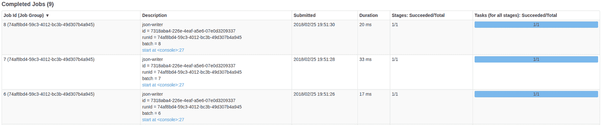

# 第八章：结构化流处理编程模型

结构化流处理建立在构建在 Spark SQL 的 `DataFrame` 和 `Dataset` API 之上的基础上。通过扩展这些 API 以支持流式工作负载，结构化流处理继承了 Spark SQL 引入的高级语言特性以及底层优化，包括使用 Catalyst 查询优化器和 Project Tungsten 提供的低开销内存管理和代码生成。同时，结构化流处理在 Spark SQL 的所有支持语言绑定中可用，包括 Scala、Java、Python 和 R，尽管一些高级状态管理功能目前仅在 Scala 中可用。由于 Spark SQL 使用的中间查询表示形式，程序的性能在使用的*语言绑定*无关时是相同的。

结构化流处理引入了对事件时间的支持，覆盖了所有窗口和聚合操作，可以轻松编写使用事件生成时间而非进入处理引擎的时间（也称为*处理时间*）的逻辑。你在“时间的影响”中学习了这些概念。

结构化流处理在 Spark 生态系统中的可用性使得 Spark 能够统一经典批处理和基于流的数据处理的开发体验。

在本章中，我们通过按照通常需要创建结构化流作业的步骤顺序来审视结构化流处理的编程模型：

+   初始化 Spark

+   数据源：获取流数据

+   声明我们希望应用于流数据的操作

+   数据汇：输出生成的数据

# 初始化 Spark

Spark API 的可见统一部分是，`SparkSession` 成为了使用结构化流处理的*批处理*和*流处理*应用程序的单一入口点。

因此，我们创建 Spark 作业的入口点与使用 Spark 批处理 API 相同：我们实例化一个 `SparkSession`，如示例 8-1 所示。

##### 示例 8-1\. 创建本地 Spark 会话

```
import org.apache.spark.sql.SparkSession

val spark = SparkSession
  .builder()
  .appName("StreamProcessing")
  .master("local[*]")
  .getOrCreate()
```

# 使用 Spark Shell

当使用 Spark shell 探索结构化流处理时，`SparkSession` 已经提供为 `spark`。我们不需要创建任何额外的上下文来使用结构化流处理。

# 数据源：获取流数据

在结构化流处理中，*源*是一个抽象概念，允许我们从流数据生产者消费数据。源并非直接创建，而是`sparkSession` 提供了一个构建方法 `readStream`，它公开了用于指定流源（称为*格式*）及其配置的 API。

例如，示例 8-2 中的代码创建一个`File`流式数据源。我们使用`format`方法指定源的类型。`schema`方法允许我们为数据流提供模式，对于某些源类型（如`File`源）来说，这是必需的。

##### 示例 8-2\. 文件流式数据源

```
val fileStream = spark.readStream
  .format("json")
  .schema(schema)
  .option("mode","DROPMALFORMED")
  .load("/tmp/datasrc")

>fileStream:
org.apache.spark.sql.DataFrame = [id: string, timestamp: timestamp ... ]
```

每个源实现都有不同的选项，有些有可调参数。在示例 8-2 中，我们将选项`mode`设置为`DROPMALFORMED`。此选项指示 JSON 流处理器放弃任何不符合 JSON 格式或不匹配提供的模式的行。

在幕后，对`spark.readStream`的调用创建一个`DataStreamBuilder`实例。此实例负责通过构建器方法调用管理提供的不同选项。在此`DataStreamBuilder`实例上调用`load(...)`验证构建器提供的选项，如果一切正常，则返回流`DataFrame`。

###### 注意

我们可以欣赏到 Spark API 中的对称性：`readStream`提供了声明流源的选项，而`writeStream`让我们指定输出接收器和我们的进程所需的输出模式。它们是`DataFrame`API 中`read`和`write`的对应物。因此，它们提供了一种记忆 Spark 程序中使用的执行模式的简便方法：

+   `read`/`write`：批处理操作

+   `readStream`/`writeStream`：流式操作

在我们的示例中，这个流`DataFrame`表示的是从监视提供的*路径*并处理该路径中的每个新文件作为 JSON 编码数据而产生的数据流。所有格式不正确的代码都将从此数据流中丢弃。

加载流式数据源是延迟执行的。我们得到的是流的表示，体现在流`DataFrame`实例中，我们可以用它来表达我们想要应用的一系列转换，以实现我们特定的业务逻辑。创建流`DataFrame`不会导致任何数据被消耗或处理，直到流被实现为止。这需要一个*查询*，如后面所示。

## 可用的数据源

自 Spark v2.4.0 起，支持以下流式数据源：

`json`、`orc`、`parquet`、`csv`、`text`、`textFile`

这些都是基于文件的流式数据源。基本功能是监视文件系统中的路径（文件夹）并原子地消费放置在其中的文件。然后将找到的文件由指定的格式化程序解析。例如，如果提供了`json`，则使用 Spark 的`json`读取器处理文件，使用提供的模式信息。

`socket`

建立与假定通过套接字连接提供文本数据的 TCP 服务器的客户端连接。

`kafka`

创建能够从 Kafka 检索数据的 Kafka 消费者。

`rate`

使用 `rowsPerSecond` 选项以给定速率生成行流。这主要是作为测试源使用的。

我们在 第十章 中详细介绍了源。

# 转换流数据

正如我们在上一节中看到的，调用 `load` 的结果是一个流式 `DataFrame`。在使用 `source` 创建了我们的流式 `DataFrame` 后，我们可以使用 `Dataset` 或 `DataFrame` API 来表达我们想要应用于流数据的逻辑，以实现我们的特定用例。

###### 警告

请记住，`DataFrame` 是 `Dataset[Row]` 的别名。虽然这看似是一个小的技术区别，但在从 Scala 等类型化语言使用时，`Dataset` API 提供了一个类型化的接口，而 `DataFrame` 的使用是无类型的。当从 Python 等动态语言使用结构化 API 时，`DataFrame` API 是唯一可用的 API。

在使用类型化 `Dataset` 上的操作时，性能会有影响。虽然 `DataFrame` API 中使用的 SQL 表达式可以被查询计划器理解并进一步优化，但是 `Dataset` 操作中提供的闭包对查询计划器来说是不透明的，因此可能比完全相同的 `DataFrame` 对应物运行得更慢。

假设我们正在使用传感器网络的数据，在 示例 8-3 中，我们从 `sensorStream` 中选择 `deviceId`、`timestamp`、`sensorType` 和 `value` 字段，并仅筛选出传感器类型为 `temperature` 且其 `value` 高于给定 `threshold` 的记录。

##### 示例 8-3\. 过滤和投影

```
val highTempSensors = sensorStream
  .select($"deviceId", $"timestamp", $"sensorType", $"value")
  .where($"sensorType" === "temperature" && $"value" > threshold)
```

同样地，我们可以对数据进行聚合，并对组进行时间操作。示例 8-4 表明我们可以使用事件本身的 `timestamp` 信息来定义一个五分钟的时间窗口，每分钟滑动一次。我们在 第十二章 中详细讨论了事件时间。

这里需要理解的重点是，结构化流 API 在批处理分析中实际上与 `Dataset` API 几乎相同，但具有一些特定于流处理的额外规定。

##### 示例 8-4\. 按传感器类型的时间平均值

```
val avgBySensorTypeOverTime = sensorStream
  .select($"timestamp", $"sensorType", $"value")
  .groupBy(window($"timestamp", "5 minutes", "1 minute"), $"sensorType")
  .agg(avg($"value")
```

如果您对 Spark 的结构化 API 不熟悉，我们建议您先熟悉一下。详细介绍这个 API 超出了本书的范围。我们推荐参考 *Spark: The Definitive Guide*（O’Reilly，2018），由 Bill Chambers 和 Matei Zaharia 编写，作为一个全面的参考资料。

## DataFrame API 上的流 API 限制

正如我们在前一章中提到的，一些标准 `DataFrame` 和 `Dataset` API 提供的操作在流上是没有意义的。

我们举了 `stream.count` 的例子，这在流上没有意义。一般来说，需要立即材料化底层数据集的操作是不允许的。

这些是流上不直接支持的 API 操作：

+   `count`

+   `show`

+   `describe`

+   `limit`

+   `take(n)`

+   `distinct`

+   `foreach`

+   `sort`

+   多重堆叠聚合

在这些操作之外，部分支持流-流和静态流的`join`。

### 理解限制

尽管某些操作，如`count`或`limit`，在流上没有意义，但其他一些流操作在计算上是困难的。例如，`distinct`就是其中之一。要在任意流中过滤重复项，需要记住到目前为止看到的所有数据，并将每个新记录与已看到的所有记录进行比较。第一个条件需要无限的内存，第二个具有*O*(*n*²)的计算复杂度，随着元素数量(*n*)的增加，这变得难以接受。

### 聚合流上的操作

一些不支持的操作在我们对流应用聚合函数后变得定义明确。虽然我们不能对流进行`count`，但我们可以计算每分钟接收的消息数量或某种类型设备的数量。

在 Example 8-5 中，我们定义了每分钟每个`sensorType`事件的`count`。

##### Example 8-5\. 按时间计数传感器类型

```
val avgBySensorTypeOverTime = sensorStream
  .select($"timestamp", $"sensorType")
  .groupBy(window($"timestamp", "1 minutes", "1 minute"), $"sensorType")
  .count()
```

同样，也可以在聚合数据上定义`sort`，尽管进一步限制为输出模式为`complete`的查询。我们将在“outputMode”中更详细地讨论输出模式。

### 流去重

我们讨论过，在任意流上执行`distinct`在计算上是困难的。但如果我们能定义一个键，告诉我们何时已经看到流中的元素，我们可以使用它来去除重复项：

`stream.dropDuplicates("<key-column>")`…

### 工作解决方案

尽管某些操作不能像*批量*模型中那样直接支持，但有替代方法可以实现相同的功能：

`foreach`

尽管`foreach`不能直接在流上使用，但有一个*foreach sink*提供相同的功能。

指定在流输出定义中的汇聚。

`show`

尽管`show`需要立即实现查询，因此无法在流式`Dataset`上使用，但我们可以使用`console` sink 将数据输出到屏幕上。

# 汇聚：输出生成的数据

到目前为止，我们所做的所有操作——比如创建流并对其应用转换——都是声明性的。它们定义了从哪里消费数据以及我们想对其应用哪些操作。但到目前为止，系统中仍然没有数据流动。

在我们能够启动流之前，我们首先需要定义*输出数据*的*何处*和*如何*去：

+   *Where* 关联流式接收端：我们流式数据的接收端。

+   *How* 指的是输出模式：如何处理我们流中的结果记录。

从 API 角度来看，我们通过在流式`DataFrame`或`Dataset`上调用`writeStream`来实现流的材料化，如 Example 8-6 所示。

在流式 `Dataset` 上调用 `writeStream` 创建一个 `DataStreamWriter`。这是一个生成器实例，提供配置流处理过程输出行为的方法。

##### 示例 8-6\. 文件流式处理输出目的地

```
val query = stream.writeStream
  .format("json")
  .queryName("json-writer")
  .outputMode("append")
  .option("path", "/target/dir")
  .option("checkpointLocation", "/checkpoint/dir")
  .trigger(ProcessingTime("5 seconds"))
  .start()

>query: org.apache.spark.sql.streaming.StreamingQuery = ...
```

我们在 第十一章 中详细讨论了输出目的地。

## format

`format` 方法允许我们通过提供内置输出目的地的名称或自定义输出目的地的完全限定名称来指定输出目的地。

从 Spark v2.4.0 开始，以下流式处理输出目的地可用：

`console` sink

打印到标准输出的输出目的地。它显示的行数可以通过选项 `numRows` 进行配置。

file sink

基于文件和特定格式的输出目的地，将结果写入文件系统。格式由提供的格式名称指定：`csv`、`hive`、`json`、`orc`、`parquet`、`avro` 或 `text`。

`kafka` sink

一个 Kafka 特定的生产者 sink，能够写入一个或多个 Kafka 主题。

`memory` sink

使用提供的查询名称作为表名创建内存表。此表接收流的结果的持续更新。

`foreach` sink

提供编程接口，逐个访问流内容的元素。

`foreachBatch` sink

`foreachBatch` 是一个编程接口，提供对每个结构化流执行的每个微批次对应的完整 `DataFrame` 的访问。

## outputMode

`outputMode` 指定了记录如何添加到流查询输出的语义。支持的模式有 `append`、`update` 和 `complete`：

`append`

（默认模式）仅将最终记录添加到输出流。当来自输入流的新记录无法修改其值时，记录被视为*最终*。这种情况始终适用于线性转换，例如应用投影、过滤和映射后的转换。此模式确保每个生成的记录仅输出一次。

`update`

自上次触发以来添加了新的和更新的记录到输出流。`update` 仅在聚合的上下文中有意义，其中随着新记录的到达，聚合值会发生变化。如果多个输入记录更改单个结果，则在触发间隔之间的所有更改将被整理成一个输出记录。

`complete`

`complete` 模式输出流的完整内部表示。此模式还涉及到聚合，因为对于非聚合流，我们需要记住到目前为止所看到的所有记录，这是不切实际的。从实际角度来看，只有在对低基数条件下聚合值时（如*按国家计数的访问者*），才建议使用 `complete` 模式，因为我们知道国家的数量是有限的。

### 理解 append 语义

当流查询包含聚合时，最终定义变得不那么显而易见。在聚合计算中，新的传入记录可能在符合使用的聚合标准时改变现有的聚合值。根据我们的定义，我们不能在不知道其值最终的情况下使用`append`输出记录。因此，将`append`输出模式与聚合查询结合使用限制为仅在使用事件时间表达聚合且定义了`watermark`时有效。在这种情况下，当`watermark`过期后，`append`将输出一个事件，因此认为没有新的记录能够改变聚合值。因此，`append`模式下的输出事件将延迟聚合时间窗口加上水印偏移量。

## queryName

使用`queryName`，我们可以为查询指定一个名称，一些接收器使用它，同时也显示在 Spark 控制台中的作业描述中，如图 8-1 所示。



###### 图 8-1\. Spark UI 中显示的已完成作业，展示了作业描述中的查询名称。

## option

使用`option`方法，我们可以为流提供特定的键值对配置，类似于源的配置。每个接收器可以具有特定的配置，我们可以使用此方法进行定制。

我们可以添加尽可能多的`.option(...)`调用来配置接收器。

## options

`options`是`option`的替代方案，它接受包含我们要设置的所有键值配置参数的`Map[String, String]`。这种替代方案更适合外部化配置模型，其中我们不预先知道要传递给接收器配置的设置。

## trigger

可选的`trigger`选项允许我们指定生成结果的频率。默认情况下，结构化流处理将尽快处理输入并生成结果。指定触发器时，将在每个触发间隔产生输出。

`org.apache.spark.sql.streaming.Trigger`提供以下支持的触发器：

`ProcessingTime(<interval>)`

允许我们指定决定查询结果频率的时间间隔。

`Once()`

特定的`Trigger`允许我们执行一次流作业。它对于测试和将定义的流作业应用为单次批处理操作非常有用。

`Continuous(<checkpoint-interval>)`

这个触发器将执行引擎切换到实验性的`continuous`引擎，用于低延迟处理。`checkpoint-interval`参数指示数据弹性异步检查点的频率。不应与`ProcessingTime`触发器的`batch interval`混淆。我们在第十五章中探讨了这个新的执行选项。

## start()

要实现流式计算，我们需要启动流处理过程。最后，`start()`将完整的作业描述实现为流式计算，并启动内部调度过程，从源消费数据、处理数据，并将结果生成到接收器。`start()`返回一个`StreamingQuery`对象，这是一个用于管理每个查询个体生命周期的控制句柄。这意味着我们可以在同一个`sparkSession`内独立地同时启动和停止多个查询。

# 总结

阅读完本章后，您应该对结构化流式编程模型和 API 有一个很好的理解。在本章中，您学到了以下内容：

+   每个流处理程序都以定义源和当前可用源为开始。

+   我们可以重复使用大部分熟悉的`Dataset`和`DataFrame`API 来转换流数据。

+   在流式模式下，一些常见的`batch`API 操作是没有意义的。

+   接收器是流输出的可配置定义。

+   流中输出模式和聚合操作之间的关系。

+   所有转换都是惰性执行的，我们需要`start`我们的流程以使数据通过系统流动。

在下一章中，你将应用你新获得的知识来创建一个全面的流处理程序。之后，我们将深入探讨结构化流式处理 API 的特定领域，如事件时间处理、窗口定义、水印概念和任意状态处理。
