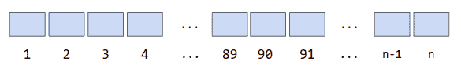
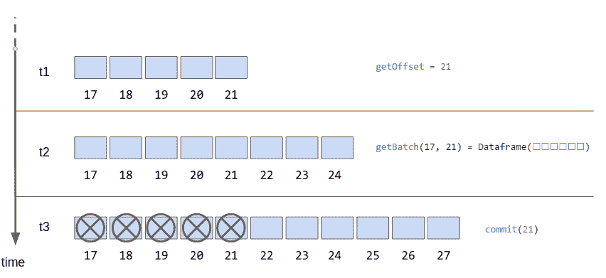

# 第十章：结构化流源

前几章对结构化流编程模型提供了很好的概述，并展示了如何在实际中应用它。您还看到了源是每个结构化流程序的起点。在本章中，我们研究了源的一般特性，并更详细地审视了可用的源，包括它们的不同配置选项和操作模式。

# 理解源

在结构化流中，源是表示流数据提供程序的抽象。源接口背后的概念是，流数据是随时间持续流动的事件序列，可以看作是一个按单调递增计数器索引的序列。

图 10-1 显示了流中每个事件被认为具有不断增加的偏移量。



###### 图 10-1\. 流被视为事件索引序列

正如在 图 10-2 中所示的，偏移量用于从外部源请求数据，并指示已经消耗的数据。结构化流通过向外部系统请求当前偏移量并将其与上次处理的偏移量进行比较来知晓是否有数据需要处理。要处理的数据是通过获取 `start` 和 `end` 之间的一个 *批次* 来请求的。通过提交给定的偏移量通知源已经处理了数据。源契约保证已处理的偏移量小于或等于提交的偏移量的所有数据，并且随后的请求只会规定大于该提交的偏移量。基于这些保证，源可以选择丢弃已处理的数据以释放系统资源。



###### 图 10-2\. 偏移量处理序列

让我们更详细地看一下在 图 10-2 中显示的基于偏移量处理的动态：

1.  在 *t1* 时，系统调用 `getOffset` 并获取 *源* 的当前偏移量。

1.  在 *t2* 时，系统通过调用 `getBatch(start, end)` 获取到最后已知偏移量的批次。请注意，此期间可能会有新数据到达。

1.  在 *t3* 时，系统 `提交` 偏移量，源删除相应记录。

这一过程不断重复，确保获取流数据。为了从可能的失败中恢复，偏移量通常会被 *检查点* 到外部存储。

除了基于偏移量的交互，源必须满足两个要求：为了可靠性，源必须以相同顺序可重放；并且源必须提供模式。

## 可靠的源必须是可重播的

在结构化流处理中，*可重放性*是指能够请求已经请求但尚未提交的流的部分。就像我们可以倒回正在观看的 Netflix 系列节目，以查看因为分心而错过的片段一样，数据源必须提供重播已请求但未提交流的能力。通过调用 `getBatch` 并指定我们想要重新接收的偏移范围来实现这一点。

当结构化流处理过程完全失败后，数据源仍然能够生成未提交的偏移范围时，源被认为是可靠的。在此失败恢复过程中，偏移量从其上次已知的检查点恢复，并从数据源重新请求。这要求支持数据安全存储在 `streaming` 过程外的实际流系统。通过要求数据源具备可重放性，结构化流处理将恢复责任委托给数据源。这意味着只有可靠的数据源与结构化流处理一起工作，以创建强大的端到端交付保证。

## 数据源必须提供模式

Spark 结构化 API 的一个定义特征是它们依赖于模式信息来处理不同层次的数据。与处理不透明的字符串或字节数组 blob 相对，模式信息提供了关于数据字段和类型的洞察力。我们可以使用模式信息来驱动从查询规划到数据的内部二进制表示、存储和访问的不同层次的优化。

数据源必须提供描述其生成数据的模式信息。一些数据源实现允许配置此模式，并使用此配置信息自动解析传入数据并将其转换为有效记录。事实上，许多基于文件的流式数据源（如 JSON 或逗号分隔值（CSV）文件）遵循这种模式，用户必须提供文件格式使用的模式以确保正确解析。其他一些数据源使用固定的内部模式来表达每条记录的元数据信息，并将有效载荷的解析留给应用程序。

从架构角度来看，创建基于模式驱动的流处理应用程序是可取的，因为它有助于全局理解数据如何在系统中流动，并推动多进程流水线的不同阶段的正式化。

### 定义模式

在结构化流处理中，我们重用 Spark SQL API 来创建模式定义。有几种不同的方法可以用来定义流内容的模式：通过编程方式、从 `case class` 定义中推断，或者从现有数据集加载：

在编程方式中

我们使用`StructType`和`StructField`类来构建模式的表示。例如，要表示具有*id*、*type*和*位置坐标*的跟踪车辆，我们可以构造以下相应的模式结构：

```
import org.apache.spark.sql.{StructType, StructField}_
import org.apache.spark.sql.types._

val schema = StructType(
  List(
    StructField("id", StringType, true),
    StructField("type", StringType, true),
    StructField("location", StructType(List(
        StructField("latitude", DoubleType, false),
        StructField("longitude", DoubleType, false)
        )), false)
    )
  )
```

`StructField`可以包含嵌套的`StructType`，从而可以创建任意深度和复杂度的模式。

通过推断

在 Scala 中，模式也可以使用任意组合的`case class`来表示。给定单个`case class`或`case class`层次结构，可以通过为`case class`创建`Encoder`并从该`encoder`实例获取模式来计算模式表示。

使用此方法，可以像下面这样获取先前示例中使用的相同模式定义：

```
import org.apache.spark.sql.Encoders

// Define the case class hierarchy
case class Coordinates(latitude: Double, longitude: Double)
case class Vehicle(id: String, `type`: String, location: Coordinates )
// Obtain the Encoder, and the schema from the Encoder
val schema = Encoders.product[Vehicle].schema
```

从数据集中提取

获取模式定义的一种实用方法是通过维护以 Parquet 等模式感知格式存储的样本数据文件。为了获取我们的模式定义，我们加载样本数据集，并从加载的`DataFrame`中获取模式定义：

```
val sample = spark.read.parquet(<path-to-sample>)
val schema = sample.schema
```

定义模式的编程方式功能强大，但需要付出努力，并且维护复杂，往往导致错误。在原型设计阶段加载数据集可能是实用的，但在某些情况下，需要保持样本数据集的最新状态，这可能会导致意外的复杂性。

尽管选择最佳方法可能因用例而异，但一般来说，在使用 Scala 时，我们更倾向于在可能的情况下使用推断方法。

# 可用的数据源

下面是当前在结构化流 Spark 分发中可用的源：

文件

允许摄入存储为文件的数据。在大多数情况下，数据转换为进一步在流模式中处理的记录。支持这些格式：JSON、CSV、Parquet、ORC 和纯文本。

Kafka

允许从 Apache Kafka 消费流数据。

套接字

一个 TCP 套接字客户端能够连接到 TCP 服务器并消费文本数据流。流必须使用 UTF-8 字符集进行编码。

速率

生成具有可配置生产率的内部生成的`(timestamp, value)`记录流。通常用于学习和测试目的。

正如我们在“理解数据源”中讨论的那样，当结构化流处理失败时，源提供从偏移量回放的能力时，认为这些源是可靠的。根据此标准，我们可以将可用的源分类如下：

可靠

文件源、Kafka 源

不可靠

套接字源、速率源

不可靠的源仅在可以容忍数据丢失时才可用于生产系统。

###### 警告

流源 API 目前正在不断发展中。截至目前为止，没有稳定的公共 API 来开发自定义源。预计在不久的将来会发生变化。

在本章的后续部分中，我们将详细探讨当前可用的数据来源。作为生产就绪的来源，文件和 Kafka 来源具有许多我们将详细讨论的选项。套接字和速率来源在功能上有所限制，这将通过其简明的覆盖来表现出来。

# 文件来源

文件来源是一个简单的流数据来源，从监视的文件系统目录中读取文件。基于文件的交接是一种常用的方法，用于将基于批处理的过程与流式系统桥接起来。批处理过程以文件格式生成其输出，并将其放置在一个通用目录中，文件来源的适当实现可以捡起这些文件并将其内容转换为记录流，以进一步在流模式下处理。

## 指定文件格式

文件使用指定的格式进行读取，该格式由`readStream`构建器的`.format(<format_name>)`方法提供，或者通过`DataStreamReader`的专用方法指定要使用的格式；例如，`readStream.parquet('/path/to/dir/')`。当使用每种支持格式对应的专用方法时，方法调用应作为构建器的最后一次调用。

例如，示例 10-1 中的三种形式是等效的。

##### 示例 10-1\. 构建文件流

```
// Use format and load path
val fileStream = spark.readStream
  .format("parquet")
  .schema(schema)
  .load("hdfs://data/exchange")

// Use format and path options
val fileStream = spark.readStream
  .format("parquet")
  .option("path", "hdfs://data/exchange")
  .schema(schema)
  .load()

// Use dedicated method
val fileStream = spark.readStream
  .schema(schema)
  .parquet("hdfs://data/exchange")
```

截至 Spark v2.3.0，结构化流支持以下基于文件的格式。这些是静态`DataFrame`、`Dataset`和 SQL API 支持的相同文件格式：

+   CSV

+   JSON

+   Parquet

+   ORC

+   文本

+   textFile

## 常见选项

无论具体格式如何，文件来源的一般功能是监视由其特定 URL 标识的共享文件系统中的目录。所有文件格式都支持一组通用选项，这些选项控制文件流入并定义文件的老化标准。

###### 警告

由于 Apache Spark 是一个快速发展的项目，API 及其选项可能会在未来版本中发生变化。此外，在本节中，我们仅涵盖适用于流处理工作负载的最相关选项。要获取最新信息，请始终查看与您的 Spark 版本对应的 API [文档](http://spark.apache.org/)。

这些选项可以设置给所有基于文件的来源：

`maxFilesPerTrigger`（默认：未设置）

指示每个查询触发器将消耗多少文件。此设置限制每个触发器处理的文件数量，从而帮助控制系统中的数据流入。

`latestFirst`（默认：`false`）

当设置此标志为`true`时，较新的文件优先用于处理。当最新数据的优先级高于旧数据时，请使用此选项。

`maxFileAge`（默认：`7 days`）

目录中为文件定义了一个年龄阈值。比阈值更老的文件将不符合处理条件，将被有效地忽略。这个阈值是相对于目录中最近的文件而不是系统时钟的。例如，如果`maxFileAge`是`2 days`，并且最近的文件是昨天的，那么考虑文件是否太旧的阈值将会是*三天前之前的*。这种动态类似于事件时间上的水印。

`fileNameOnly`（默认为`false`）

当设置为`true`时，如果两个文件具有相同的名称，则它们将被视为相同；否则，将考虑完整路径。

###### 注意

当设置`latestFirst`为`true`并配置了`maxFilesPerTrigger`选项时，将忽略`maxFileAge`，因为可能会出现这样一种情况，即为了处理而变得比阈值更老的文件。在这种情况下，无法设置老化策略。

## 常见文本解析选项（CSV、JSON）

一些文件格式，如 CSV 和 JSON，使用可配置的解析器将每个文件中的文本数据转换为结构化记录。上游进程可能会创建不符合预期格式的记录，这些记录被视为损坏。

流式系统的特点是其持续运行。当接收到坏数据时，流处理过程不应该失败。根据业务需求，我们可以丢弃无效记录或将被视为损坏的数据路由到单独的错误处理流程。

### 处理解析错误

以下选项允许配置解析器的行为，以处理那些被视为损坏的记录：

`mode`（默认为`PERMISSIVE`）

控制解析过程中处理损坏记录的方式。允许的值包括`PERMISSIVE`、`DROPMALFORMED`和`FAILFAST`。

+   `PERMISSIVE`：损坏记录的值将插入由选项`columnNameOfCorruptRecord`配置的特殊字段中，该字段必须存在于模式中。所有其他字段将设置为`null`。如果字段不存在，则记录将被丢弃（与`DROPMALFORMED`的行为相同）。

+   `DROPMALFORMED`：丢弃损坏的记录。

+   `FAILFAST`：发现损坏记录时会抛出异常。在流处理中不推荐使用此方法，因为异常的传播可能会导致流处理失败并停止。

`columnNameOfCorruptRecord`（默认为“_corrupt_record”）

允许配置包含损坏记录的字符串值的特殊字段。还可以通过设置 Spark 配置中的`spark.sql.columnNameOfCorruptRecord`来配置此字段。如果同时设置了`spark.sql.columnNameOfCorruptRecord`和此选项，则此选项优先。

### 模式推断

`inferSchema`（默认为`false`）

不支持模式推断。设置此选项将被忽略。提供*模式*是强制性的。

### 日期和时间格式

`dateFormat` (默认："yyyy-MM-dd")

配置用于解析 `date` 字段的模式。自定义模式遵循在[java.text.SimpleDateFormat](https://docs.oracle.com/javase/8/docs/api/java/text/SimpleDateFormat.html)中定义的格式。

`timestampFormat` (默认："yyyy-MM-dd'T'HH:mm:ss.SSSXXX")

配置用于解析 `timestamp` 字段的模式。自定义模式遵循在[java.text.SimpleDateFormat](https://docs.oracle.com/javase/8/docs/api/java/text/SimpleDateFormat.html)中定义的格式。

## JSON 文件源格式

文件源的 JSON 格式支持我们消耗以 JSON 编码的文本文件，其中文件中的每一行都被期望是一个有效的 JSON 对象。使用提供的模式解析 JSON 记录。不符合模式的记录被视为无效，有多个选项可用于控制无效记录的处理。

### JSON 解析选项

默认情况下，JSON 文件源期望文件内容遵循[JSON Lines 规范](http://jsonlines.org/)。即，文件中的每一行对应一个符合指定模式的有效 JSON 文档。每行应以换行符（`\n`）分隔。还支持 `CRLF` 字符（`\r\n`），因为会忽略尾随空白。

我们可以调整 JSON 解析器的容错性，以处理不完全符合标准的数据。还可以更改处理被视为损坏的记录的行为。以下选项允许配置解析器的行为：

`allowComments` (默认："false")

启用后，允许文件中的 Java/C++ 风格的注释，并且将忽略相应的行；例如：

```
// Timestamps are in ISO 8601 compliant format
{"id":"x097abba", "timestamp": "2018-04-01T16:32:56+00:00"}
{"id":"x053ba0bab", "timestamp": "2018-04-01T16:35:02+00:00"}
```

否则，在 JSON 文件中的注释将被视为损坏记录，并根据 `mode` 设置进行处理。

`allowNumericLeadingZeros` (默认："false")

启用后，数字中的前导零将被允许（例如，00314）。否则，前导零将被视为无效的数值，相应的记录将被视为损坏，并且会根据 `mode` 设置进行处理。

`allowSingleQuotes` (默认："true")

允许使用单引号作为字段的标记。启用后，单引号和双引号都被允许。无论此设置如何，引号字符不能嵌套，并且在值中使用时必须适当地转义；例如：

```
// valid record
{"firstname":"Alice", 'lastname': 'Wonderland'}
// invalid nesting
{"firstname":'Elvis "The King"', 'lastname': 'Presley'}
// correct escaping
{"firstname":'Elvis \"The King\"', 'lastname': 'Presley'}
```

`allowUnquotedFieldNames` (默认："false")

允许未引用的 JSON 字段名（例如，`{firstname:"Alice"}`）。注意，当使用此选项时，字段名中不能包含空格（例如，`{first name:"Alice"}` 被视为损坏，即使字段名与模式匹配）。请谨慎使用。

`multiLine` (默认："false")

启用后，解析器将不再解析 JSON Lines，而是将每个文件的内容视为单个有效的 JSON 文档，并尝试将其内容解析为遵循定义模式的记录。

当文件的生产者只能输出完整的 JSON 文档作为文件时，请使用此选项。在这种情况下，使用顶层数组来分组记录，如示例 10-2 所示。

##### 示例 10-2\. 使用顶层数组分组记录

```
[
  {"firstname":"Alice", "last name":"Wonderland", "age": 7},
  {"firstname":"Coraline", "last name":"Spin"   , "age":15}
]
```

`primitivesAsString` (默认 `false`)

当启用时，原始值类型被视为字符串。这允许您读取具有混合类型字段的文档，但所有值都将作为`String`读取。

在示例 10-3 中，生成的 `age` 字段的类型为 `String`，包含 *“Coraline”* 的 `age="15"` 值和 *“Diana”* 的 `age="unknown"` 值。

##### 示例 10-3\. `primitivesAsString` 的使用

```
{"firstname":"Coraline", "last name":"Spin", "age": 15}
{"firstname":"Diana", "last name":"Prince", "age": "unknown"}
```

## CSV 文件源格式

CSV 是一种流行的表格数据存储和交换格式，被企业应用广泛支持。`File Source` CSV 格式支持允许我们在结构化流应用程序中摄取和处理这些应用程序的输出。尽管“CSV”原来的名称表示值是用逗号分隔的，但分隔符通常可以自由配置。有许多配置选项可用于控制将数据从纯文本转换为结构化记录的方式。

在本节的其余部分，我们涵盖了最常见的选项，特别是那些与流处理相关的选项。关于格式相关的选项，请参考[最新文档](https://spark.apache.org/docs/latest/api/scala/index.html#org.apache.spark.sql.DataFrameReader%40csv.html)。以下是最常用的 CSV 解析选项：

### CSV 解析选项

`comment` (默认：“” [禁用])

配置用于标记为注释行的字符；例如，当使用 `option("comment","#")` 时，我们可以解析以下包含注释的 CSV：

```
#Timestamps are in ISO 8601 compliant format
x097abba, 2018-04-01T16:32:56+00:00, 55
x053ba0bab, 2018-04-01T16:35:02+00:00, 32
```

`header` (默认：`false`)

需要提供模式，因此标题行将被忽略并且不起作用。

`multiline` (默认：`false`)

将每个文件视为一个跨越文件中所有行的记录。

`quote` (默认：`"` [双引号])

配置用于包围包含列分隔符的值的字符。

`sep` (默认：`,` [逗号])

配置用于分隔每行中字段的字符。

## Parquet 文件源格式

Apache Parquet 是一种基于列的文件数据存储格式。内部表示将原始行拆分为列的块，并使用压缩技术进行存储。因此，需要特定列的查询无需读取完整文件，而是可以独立地访问和检索相关的片段。Parquet 支持复杂的嵌套数据结构，并保留数据的模式结构。由于其增强的查询功能、有效利用存储空间和保留模式信息，Parquet 是存储大型复杂数据集的流行格式。

### 模式定义

要从 Parquet 文件创建流源，只需提供数据的模式和目录位置。在流声明期间提供的模式对于流源定义的整个期间是固定的。

示例 10-4 展示了如何使用提供的模式从`hdfs://data/folder`文件夹创建基于 Parquet 的文件源。

##### 示例 10-4\. 构建 Parquet 源示例

```
// Use format and load path
val fileStream = spark.readStream
  .schema(schema)
  .parquet("hdfs://data/folder")
```

## 文本文件源格式

文件来源的文本格式支持纯文本文件的摄取。使用配置选项，可以逐行或整个文件作为单个文本块进行摄取。此来源产生的数据模式自然是`StringType`，无需指定。这是一个通用格式，我们可以用来摄取任意文本，从著名的词频统计到专有文本格式的自定义解析。

### 文本摄取选项

除了我们在 “常见选项” 中看到的文件源的常见选项之外，文本文件格式支持使用`wholetext`选项将文本文件作为整体读取：

`wholetext`（默认为 `false`）

如果设置为 true，则将整个文件作为单个文本块读取。否则，使用标准的行分隔符（`\n`、`\r\n`、`\r`）将文本拆分成行，并将每行视为一个记录。

### text 和 textFile

文本格式支持两种 API 替代方案：

`text`

返回一个动态类型的带有单个`value`字段的`DataFrame`，类型为`StringType`

`textFile`

返回一个静态类型的`Dataset[String]`

我们可以使用`text`格式规范作为终止方法调用或作为`format`选项。要获得静态类型的`Dataset`，必须将`textFile`作为流构建器调用的最后一步。示例 10-5 中的示例展示了具体的 API 使用方式。

##### 示例 10-5\. 文本格式 API 使用

```
// Text specified as format
>val fileStream = spark.readStream.format("text").load("hdfs://data/folder")
fileStream: org.apache.spark.sql.DataFrame = [value: string]

// Text specified through dedicated method
>val fileStream = spark.readStream.text("hdfs://data/folder")
fileStream: org.apache.spark.sql.DataFrame = [value: string]

// TextFile specified through dedicated method
val fileStream = spark.readStream.textFile("/tmp/data/stream")
fileStream: org.apache.spark.sql.Dataset[String] = [value: string]
```

# Kafka 源

Apache Kafka 是基于分布式日志概念的发布/订阅（pub/sub）系统。Kafka 具有高度可扩展性，并且在消费者和生产者端处理数据时提供高吞吐量和低延迟的处理能力。在 Kafka 中，组织的单位是主题。发布者将数据发送到主题，订阅者从他们订阅的主题接收数据。这种数据交付是可靠的。Apache Kafka 已成为广泛应用于各种流处理用例的消息基础设施的热门选择。

Kafka 的结构化流源实现了订阅者角色，可以消费发布到一个或多个主题的数据。这是一个可靠的数据源。回顾我们在 “理解数据源” 中的讨论，这意味着即使部分或完全失败并重新启动流处理过程，数据交付语义也是有保证的。

## 设置 Kafka 源

要创建一个 Kafka 源，我们在 Spark 会话中使用 `format("kafka")` 方法和 `createStream` 构建器。连接到 Kafka 需要两个必需的参数：Kafka 代理的地址和我们想要连接的主题。

连接到的 Kafka 代理的地址通过选项 `kafka.bootstrap.servers` 提供，作为一个包含逗号分隔的 `host:port` 对列表的 `String`。

示例 10-6 展示了一个简单的 Kafka 源定义。它通过连接位于 `host1:port1`、`host2:port2` 和 `host3:port3` 的代理订阅单个主题 `topic1`。

##### 示例 10-6\. 创建一个 Kafka 源

```
>val kafkaStream = spark.readStream
  .format("kafka")
  .option("kafka.bootstrap.servers", "host1:port1,host2:port2,host3:port3")
  .option("subscribe", "topic1")
  .option("checkpointLocation", "hdfs://spark/streaming/checkpoint")
  .load()

kafkaStream: org.apache.spark.sql.DataFrame =
  [key: binary, value: binary ... 5 more fields]

>kafkaStream.printSchema

root
 |-- key: binary (nullable = true)
 |-- value: binary (nullable = true)
 |-- topic: string (nullable = true)
 |-- partition: integer (nullable = true)
 |-- offset: long (nullable = true)
 |-- timestamp: timestamp (nullable = true)
 |-- timestampType: integer (nullable = true)

>val dataStream = kafkaStream.selectExpr("CAST(key AS STRING)",
                                         "CAST(value AS STRING)")
                             .as[(String, String)]

dataStream: org.apache.spark.sql.Dataset[(String, String)] =
  [key: string, value: string]
```

该调用的结果是一个包含五个字段的 `DataFrame`：`key`、`value`、`topic`、`partition`、`offset`、`timestamp`、`timestampType`。具有这些字段的模式固定了 Kafka 源。它提供了从 Kafka 获取的原始 `key` 和 `values` 以及每个消费记录的元数据。

通常，我们只对消息的 `key` 和 `value` 感兴趣。`key` 和 `value` 都包含一个二进制负载，在内部表示为 `Byte Array`。当使用 `String` 序列化器将数据写入 Kafka 时，我们可以通过将值强制转换为 `String` 来读取数据，如示例中的最后一个表达式所示。尽管基于文本的编码是一种常见做法，但这不是交换数据的最节省空间的方式。其他编码，如具有模式感知的 AVRO 格式，可能提供更好的空间效率，并附带嵌入模式信息的好处。

消息中的附加元数据，例如 `topic`、`partition` 或 `offset`，可以在更复杂的场景中使用。例如，`topic` 字段将包含生成记录的 *主题*，可以用作标签或分辨器，以防我们同时订阅多个主题。

## 选择一个主题订阅方法

有三种不同的方法来指定我们想要消费的主题或主题列表：

+   `subscribe`

+   `subscribePattern`

+   `assign`

Kafka 源设置必须包含这些订阅选项中的一个且仅一个。它们提供不同的灵活性级别，以选择要订阅的主题和甚至分区：

`subscribe`

接受一个单一主题或逗号分隔的主题列表：`topic1, topic2, ..., topicn`。此方法订阅每个主题，并创建一个统一的流，包含所有主题的数据的并集；例如，`.option("subscribe", "topic1,topic3")`。

`subscribePattern`

这类似于 `subscribe` 的行为，但主题使用正则表达式模式指定。例如，如果我们有主题 `'factory1Sensors'、'factory2Sensors'、'street1Sensors'、'street2Sensors'`，我们可以通过表达式 `.option("subscribePattern", "factory[\\d]+Sensors")` 订阅所有“工厂”传感器。

`assign`

允许针对特定主题的特定分区进行精细化的指定以进行消费。在 Kafka API 中称为`TopicPartition`。通过 JSON 对象指定每个主题的分区，其中每个键是一个主题，其值是分区数组。例如，选项定义`.option("assign", """{"sensors":[0,1,3]}""")`将订阅主题*sensors*的分区 0、1 和 3。要使用此方法，我们需要关于主题分区的信息。我们可以通过 Kafka API 或配置获取分区信息。

## 配置 Kafka 源选项

结构化流处理中 Kafka 源有两类配置选项：专用源配置和直接传递给底层 Kafka 消费者的选项。

### Kafka 源特定选项

下列选项配置了 Kafka 源的行为，特别是关于如何消费偏移量的配置：

`startingOffsets`（默认值：`latest`）

可接受的值为`earliest`、`latest`或表示主题、它们的分区及给定偏移量关联的 JSON 对象。实际偏移量值始终为正数。有两个特殊的偏移量值：`-2`表示`earliest`，`-1`表示`latest`；例如，`""" {"topic1": { "0": -1, "1": -2, "2":1024 }} """`

`startingOffsets`仅在首次启动查询时使用。所有后续重新启动将使用存储的*checkpoint*信息。要从特定偏移量重新启动流作业，需要删除*checkpoint*的内容。

`failOnDataLoss`（默认值：`true`）

此标志指示在可能会丢失数据的情况下是否失败重新启动流查询。通常是当偏移量超出范围、主题被删除或主题重新平衡时。我们建议在开发/测试周期中将此选项设置为`false`，因为使用连续生产者停止/重新启动查询端往往会触发失败。在生产部署时将其设置回`true`。

`kafkaConsumer.pollTimeoutMs`（默认值：`512`）

在运行在 Spark 执行器上的分布式消费者从 Kafka 获取数据时，等待数据的轮询超时（毫秒）。

`fetchOffset.numRetries`（默认值：`3`）

获取 Kafka 偏移量失败之前的重试次数。

`fetchOffset.retryIntervalMs`（默认值：`10`）

偏移量获取重试之间的延迟（毫秒）。

`maxOffsetsPerTrigger`（默认值：未设置）

此选项允许我们为每个查询触发器设置总记录的速率限制。配置的限制将均匀分布在订阅主题的分区集合中。

## Kafka 消费者选项

可以通过向配置键添加 `'kafka.'` 前缀来将配置选项传递到此源的底层 Kafka 消费者。

例如，要为 Kafka 源配置传输层安全性（TLS）选项，可以通过在源配置中设置 Kafka 消费者配置选项 `security.protocol` 来设置 `kafka.security.protocol`。

示例 10-7 展示了如何使用此方法为 Kafka 源配置 TLS。

##### 示例 10-7\. Kafka 源 TLS 配置示例

```
val tlsKafkaSource = spark.readStream.format("kafka")
  .option("kafka.bootstrap.servers", "host1:port1, host2:port2")
  .option("subscribe", "topsecret")
  .option("kafka.security.protocol", "SSL")
  .option("kafka.ssl.truststore.location", "/path/to/truststore.jks")
  .option("kafka.ssl.truststore.password", "truststore-password")
  .option("kafka.ssl.keystore.location", "/path/to/keystore.jks")
  .option("kafka.ssl.keystore.password", "keystore-password")
  .option("kafka.ssl.key.password", "password")
  .load()
```

###### 注意

要获取 Kafka 消费者配置选项的详尽列表，请参阅官方的 [Kafka 文档](http://bit.ly/2HnFl63)。

### 禁止的配置选项

并非所有标准消费者配置选项都可以使用，因为它们与源的内部处理过程冲突，该过程受我们在 “Kafka 源特定选项” 中看到的设置控制。

这些选项被禁止使用，如 表 10-1 所示。这意味着尝试使用任何这些选项都将导致 `IllegalArgumentException`。

表 10-1\. 禁止的 Kafka 选项

| option | 原因 | 备选方案 |
| --- | --- | --- |
| `auto.offset.reset` | 在结构化流中管理偏移量 | 使用 `startingOffsets` 替代 |
| `enable.auto.commit` | 在结构化流中管理偏移量 |  |
| `group.id` | 每个查询内部管理唯一的组 ID |  |
| `key.deserializer` | 负载始终表示为 `Byte Array` | 可以通过编程方式将其反序列化为特定格式 |
| `value.deserializer` | 负载始终表示为 `Byte Array` | 可以通过编程方式将其反序列化为特定格式 |
| `interceptor.classes` | 消费者拦截器可能会破坏内部数据表示 |  |

# Socket 源

传输控制协议（TCP）是一种连接导向的协议，它使客户端和服务器之间能够进行双向通信。该协议支持互联网上许多高级通信协议，如 FTP、HTTP、MQTT 等。虽然应用层协议如 HTTP 在 TCP 连接之上添加了额外的语义，但许多应用程序仍通过 UNIX 套接字提供纯文本的 TCP 连接以传输数据。

Socket 源是一个 TCP 套接字客户端，能够连接到提供 UTF-8 编码的基于文本的数据流的 TCP 服务器。它使用提供的 `host` 和 `port` 作为必选的 `options` 连接到 TCP 服务器。

## 配置

要连接到 TCP 服务器，我们需要主机的地址和端口号。还可以配置 Socket 源以在接收到每行数据时添加时间戳。

这些是配置选项：

`host`（必选）

要连接的 TCP 服务器的 DNS 主机名或 IP 地址。

`port`（必选）

要连接的 TCP 服务器的端口号。

`includeTimestamp`（默认：`false`）

当启用时，Socket 源会将到达时间戳添加到每行数据中。它还会更改此*源*生成的模式，添加`timestamp`作为附加字段。

在示例 10-8 中，我们观察到此源提供的两种操作模式。通过`host`、`port`配置，生成的流`DataFrame`只有一个名为`value`的字段，类型为`String`。当我们将`includeTimestamp`标志设置为`true`时，生成的流`DataFrame`的模式包含字段`value`和`timestamp`，其中`value`与之前相同为`String`类型，而`timestamp`为`Timestamp`类型。同时，请注意此源创建时打印的日志警告。

##### 示例 10-8\. Socket 源示例

```
// Only using host and port

>val stream = spark.readStream
  .format("socket")
  .option("host", "localhost")
  .option("port", 9876)
  .load()

18/04/14 17:02:34 WARN TextSocketSourceProvider:
The socket source should not be used for production applications!
It does not support recovery.

stream: org.apache.spark.sql.DataFrame = [value: string]

// With added timestamp information

val stream = spark.readStream
  .format("socket")
  .option("host", "localhost")
  .option("port", 9876)
  .option("includeTimestamp", true)
  .load()

18/04/14 17:06:47 WARN TextSocketSourceProvider:
The socket source should not be used for production applications!
It does not support recovery.

stream: org.apache.spark.sql.DataFrame = [value: string, timestamp: timestamp]
```

## 操作

Socket 源创建一个 TCP 客户端，连接到配置中指定的 TCP 服务器。此客户端在 Spark 驱动程序上运行。它将传入数据保存在内存中，直到查询消耗该数据并提交相应的偏移量。已提交偏移量的数据将被驱逐，在正常情况下保持内存使用稳定。

回顾“理解数据源”中的讨论，如果源能在失败和流程重启时重放未提交的偏移量，则认为该源是可靠的。但这个源不可靠，因为 Spark 驱动程序的失败将导致内存中的所有未提交数据丢失。

仅在对数据丢失可接受的情况下才应使用此源。

###### 注意

一个常见的架构替代方案是，使用 Kafka 作为可靠的中间存储而不是直接使用 Socket 源连接到 TCP 服务器。可以使用强大的微服务来桥接 TCP 服务器和 Kafka。该微服务从 TCP 服务器收集数据，并以原子方式将其传送到 Kafka。然后，我们可以使用可靠的 Kafka 源来消费数据，并在结构化流中进一步处理。

# Rate 源

Rate 源是一个内部流生成器，以可配置的频率生成一系列记录，单位为`records/second`。输出是一系列记录`(timestamp, value)`，其中`timestamp`对应于记录生成时刻，而`value`是递增计数器：

```
> val stream = spark.readStream.format("rate").load()

stream: org.apache.spark.sql.DataFrame = [timestamp: timestamp, value: bigint]
```

此内容旨在用于基准测试和探索结构化流，因为它不依赖于外部系统的正常运行。正如前面的示例所示，这非常容易创建并完全自包含。

示例 10-9 中的代码创建了一个每秒 100 行的速率流，具有 60 秒的逐步增加时间。生成的`DataFrame`的模式包含两个字段：类型为`Timestamp`的`timestamp`和模式级别为`BigInt`、内部表示为`Long`的`value`。

##### 示例 10-9\. Rate 源示例

```
> val stream = spark.readStream.format("rate")
  .option("rowsPerSecond", 100)
  .option("rampUpTime",60)
  .load()
stream: org.apache.spark.sql.DataFrame = [timestamp: timestamp, value: bigint]
```

## 选项

Rate source 支持几个选项，用于控制吞吐量和并行级别：

`rowsPerSecond`（默认：1）

每秒生成的行数。

`rampUpTime`（默认：0）

在流的开始阶段，记录的生成将逐渐增加，直到达到设定的时间。增长是线性的。

`numPartitions`（默认：默认的 Spark 并行级别）

要生成的分区数。更多的分区可以增加记录生成和下游查询处理的并行级别。
