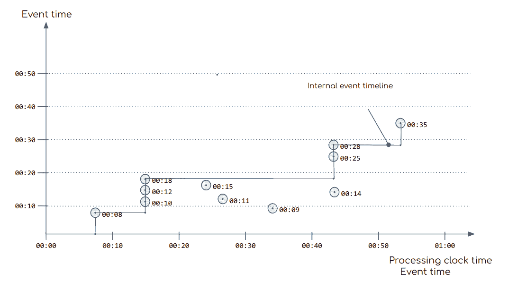
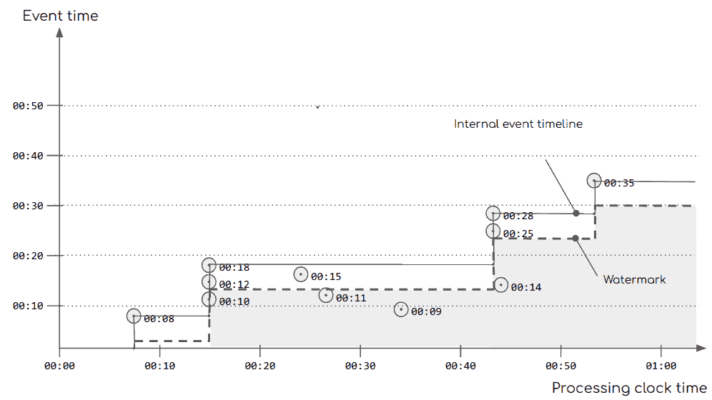

# 第十二章：基于事件时间的流处理

在 “时间的影响” 中，我们从一般角度讨论了流处理中时间的影响。

正如我们回忆的那样，*事件时间处理* 指的是从产生时的时间轴观察事件流，并从这个视角应用处理逻辑。当我们有兴趣分析事件数据随时间变化的模式时，有必要像在事件产生时观察它们一样处理事件。为此，我们需要设备或系统在事件产生时为其“盖上时间戳”。因此，特定事件绑定时间通常称为“时间戳”。我们使用这个时间作为我们的时间演变参考框架。

为了说明这个概念，让我们探讨一个熟悉的例子。考虑一个用于监控本地天气状况的天气站网络。一些远程站点通过移动网络连接，而其他一些站点则托管在志愿者家中，其可访问的互联网连接质量不同。天气监测系统不能依赖事件的到达顺序，因为这种顺序主要依赖于它们连接到的网络的速度和可靠性。相反，天气应用依赖于每个天气站为传递的事件标记时间戳。我们的流处理然后使用这些时间戳来计算基于时间的聚合，供天气预报系统使用。

流处理引擎使用事件时间的能力很重要，因为我们通常关注事件产生的相对顺序，而不是事件处理的顺序。在本章中，我们将了解结构化流处理如何无缝支持事件时间处理。

# 理解结构化流处理中的事件时间

在服务器端，时间的概念由运行任何给定应用程序的计算机的内部时钟控制。对于在机群上运行的分布式应用程序，使用诸如*网络时间协议*（NTP）等时钟同步技术和协议是强制性的做法，以将所有时钟调整到同一时间。其目的是，运行在一群计算机集群上的分布式应用程序的不同部分可以对事件的时间轴和相对顺序做出一致的决策。

然而，当数据来自外部设备，例如传感器网络、其他数据中心、手机或连接的汽车等，我们无法保证它们的时钟与我们集群中的机器对齐。我们需要从产生系统的角度解释传入事件的时间轴，而不是参考处理系统的内部时钟。图 12-1 描绘了这种场景。



###### 图 12-1\. 内部事件时间线

在图 12-1 中，我们展示了结构化流处理中时间处理的方式：

+   在 x 轴上，我们有处理时间，即处理系统的时钟时间。

+   y 轴表示事件时间轴的内部表示。

+   事件以圆圈表示，并且其对应的事件时间标签显示在旁边。

+   事件到达时间对应于 x 轴上的时间。

随着事件进入系统，我们内部的时间概念也在不断前进：

1.  第一个事件`00:08`在`00:07`进入系统，“早”于机器时钟的视角。我们可以理解，内部时钟时间不影响我们对事件时间轴的感知。

1.  事件时间轴前进到`00:08`。

1.  下一批事件，`00:10`、`00:12`、`00:18`到达进行处理。事件时间轴提升到`00:18`，因为这是到目前为止观察到的最大时间。

1.  `00:15`进入系统。由于`00:15`早于当前内部时间的`00:18`，事件时间轴保持其当前值。

1.  同样，接收到了`00:11`和`00:09`。我们应该处理这些事件吗，还是已经太晚了？

1.  处理下一组事件时，`00:14`、`00:25`、`00:28`，流式处理时钟增加到它们的最大值`00:28`。

一般来说，结构化流处理通过保持在事件中声明为时间戳字段的单调递增上界来推断事件处理的时间轴。这个非线性时间轴是本章时间处理特性中使用的主要时钟。结构化流处理理解事件源时间流动的能力将事件生成与事件处理时间分离开来。例如，我们可以回放一周内的事件序列，并且结构化流处理能够为所有事件时间聚合产生正确的结果。如果时间由计算机时钟控制，这是不可能的。

# 使用事件时间

在结构化流处理中，我们可以利用内置的事件时间支持来进行两个方面的优化：基于时间的聚合和状态管理。

在这两种情况下，第一步都是确保我们的数据中有一个以正确格式存在的字段，以便结构化流处理能够将其理解为时间戳。

Spark SQL 支持`java.sql.Timestamp`作为`Timestamp`类型。对于其他基本类型，我们需要先将值转换为`Timestamp`，然后才能用于事件时间处理。在表 12-1 中，初始的`ts`字段包含给定类型的时间戳，并总结了如何获取相应的`Timestamp`类型。

表 12-1\. 获取时间戳字段

| `ts`基本类型 | SQL 函数 |
| --- | --- |
| `Long` | `$"ts".cast(TimestampType))` |
| 默认格式为*yyyy-MM-dd HH:mm:ss*的`String` | `$"ts".cast(TimestampType)` |
| 使用默认格式*yyyy-MM-dd HH:mm:ss*的`String`（备选） | `to_timestamp($"ts”)` |
| 使用自定义格式的`String`，例如*dd-MM-yyyy HH:mm:ss* | `to_timestamp($"ts", "dd-MM-yyyy HH:mm:ss")` |

# 处理时间

正如我们在本节介绍中讨论的那样，我们区分事件时间和处理时间处理之间的区别。事件时间指的是事件产生时的时间轴，与处理时间无关。相反，处理时间是事件流被处理引擎摄取时的时间轴，基于处理事件流的计算机时钟。这是事件进入处理引擎时的“现在”。

有些情况下，事件数据不包含时间信息，但我们仍然希望利用结构化流提供的本地基于时间的函数。在这些情况下，我们可以向事件数据添加*处理时间*时间戳，并将该时间戳用作事件时间。

继续使用相同的示例，我们可以使用`current_timestamp` SQL 函数添加处理时间信息：

```
// Lets assume an existing streaming dataframe of weather station readings
// (id: String, pressure: Double, temperature: Double)

// we add a processing-time timestamp
val timeStampEvents = raw.withColumn("timestamp", current_timestamp())
```

# 水印

在本章开头，我们学到外部因素可能影响事件消息的传递，因此，在使用事件时间进行处理时，我们无法保证顺序或传递。事件可能会延迟或根本不到达。延迟多久才算太晚？我们在考虑它们完整之前要保持部分聚合多长时间？为了回答这些问题，结构化流引入了水印的概念。水印是一个时间阈值，指定我们在声明事件太晚之前等待多长时间。超过水印视为过期的事件将被丢弃。

水印是基于内部时间表示的阈值计算的。正如我们可以在图 12-2 中看到的，水印线是从事件时间线推断出的时间线的一条移动线。在这个图表中，我们可以观察到所有落在“灰色区域”下方的事件都被认为“太晚”，并且在消费该事件流的计算中将不予考虑。



###### 图 12-2\. 内部事件时间轴上的水印

我们通过将`timestamp`字段与水印对应的时间阈值链接来声明水印。继续使用表 12-1 的示例，我们可以这样声明水印：

```
// Lets assume an existing streaming dataframe of weather station readings
// (id: String, ts:Long, pressure: Double, temperature: Double)

val timeStampEvents = raw.withColumn("timestamp", $"ts".cast(TimestampType))
                         .withWatermak("timestamp", "5 minutes")
```

# 基于时间窗口的聚合

我们对数据流想要提出的一个自然问题是在固定时间间隔内的聚合信息。由于流可能永无止境，所以在流处理上下文中，我们更感兴趣的是知道在 15 分钟间隔内“有多少个 X”。

使用事件时间处理，结构化流处理消除了在面对我们在本章讨论过的事件传递挑战时处理中间状态的通常复杂性。结构化流处理负责保持数据的部分聚合，并使用与选择的输出模式相对应的语义更新下游消费者。

## 定义基于时间的窗口

我们在“窗口聚合”中讨论了基于窗口的聚合概念，介绍了*tumbling*和*sliding*窗口的定义。在结构化流处理中，内置的事件时间支持使得定义和使用此类基于窗口的操作变得简单。

从 API 的角度来看，窗口聚合使用`window`函数作为分组条件来声明。`window`函数必须应用于我们希望用作事件时间的字段。

在继续我们的气象站场景时，在示例 12-1 中，我们可以计算每 10 分钟全报告站点的平均压力。

##### 示例 12-1\. 计算总平均数

```
$>val perMinuteAvg = timeStampEvents
  .withWatermak("timestamp", "5 minutes")
  .groupBy(window($"timestamp", "1 minute"))
  .agg(avg($"pressure"))

$>perMinuteAvg.printSchema // let's inspect the schema of our window aggregation

root
 |-- window: struct (nullable = true)
 |    |-- start: timestamp (nullable = true)
 |    |-- end: timestamp (nullable = true)
 |-- pressureAvg: double (nullable = true)
 |-- tempAvg: double (nullable = true)

$>perMinuteAvg.writeStream.outputMode("append").format("console").start()
// after few minutes
+---------------------------------------------+-------------+-------------+
|window                                       |pressureAvg  |tempAvg      |
+---------------------------------------------+-------------+-------------+
|[2018-06-17 23:27:00.0,2018-06-17 23:28:00.0]|101.515516867|5.19433723603|
|[2018-06-17 23:28:00.0,2018-06-17 23:29:00.0]|101.481236804|13.4036089642|
|[2018-06-17 23:29:00.0,2018-06-17 23:30:00.0]|101.534757332|7.29652790939|
|[2018-06-17 23:30:00.0,2018-06-17 23:31:00.0]|101.472349471|9.38486237260|
|[2018-06-17 23:31:00.0,2018-06-17 23:32:00.0]|101.523849943|12.3600638827|
|[2018-06-17 23:32:00.0,2018-06-17 23:33:00.0]|101.531088691|11.9662189701|
|[2018-06-17 23:33:00.0,2018-06-17 23:34:00.0]|101.491889383|9.07050033207|
+---------------------------------------------+-------------+-------------+
```

在这个例子中，我们观察到窗口聚合的结果模式包含窗口期，用`start`和`end`时间戳指示每个生成的窗口，以及相应的计算数值。

## 理解如何计算间隔

窗口间隔与开始小时对应的第二/分钟/小时/天对齐。例如，`window($"timestamp", "15 minutes")`将生成以小时开始对齐的 15 分钟间隔。

第一个间隔的开始时间是在过去，以调整窗口对齐而没有任何数据丢失。这意味着第一个间隔可能只包含通常间隔数据的一小部分。因此，如果我们每秒接收大约 100 条消息，那么在 15 分钟内我们预计会看到大约 90,000 条消息，而我们的第一个窗口可能只是这些数据的一小部分。

窗口中的时间间隔在开始时包含，结束时不包含。在*间隔表示法*中，这写作`start-time, end-time)`。根据之前定义的 15 分钟间隔，具有时间戳`11:30:00.00`的数据点将属于`11:30-11:45`的窗口间隔。

## 使用复合聚合键

在[示例 12-1 中，我们为压力和温度传感器计算了全局聚合值。我们还对每个气象站计算聚合值感兴趣。我们可以通过创建一个复合聚合键来实现这一点，其中我们将`stationId`添加到聚合条件中，就像我们在静态`DataFrame` API 中处理一样。示例 12-2 说明了我们如何做到这一点。

##### 示例 12-2\. 每个站点的平均数计算

```
$>val minuteAvgPerStation = timeStampEvents
  .withWatermak("timestamp", "5 minutes")
  .groupBy($"stationId", window($"timestamp", "1 minute"))
  .agg(avg($"pressure") as "pressureAvg", avg($"temp") as "tempAvg")

// The aggregation schema now contains the station Id
$>minuteAvgPerStation.printSchema
root
 |-- stationId: string (nullable = true)
 |-- window: struct (nullable = true)
 |    |-- start: timestamp (nullable = true)
 |    |-- end: timestamp (nullable = true)
 |-- pressureAvg: double (nullable = true)
 |-- tempAvg: double (nullable = true)

$>minuteAvgPerStation.writeStream.outputMode("append").format("console").start

+---------+-----------------------------------------+-----------+------------+
|stationId|window                                   |pressureAvg|tempAvg     |
+---------+-----------------------------------------+-----------+------------+
|d60779f6 |[2018-06-24 18:40:00,2018-06-24 18:41:00]|101.2941341|17.305931400|
|d1e46a42 |[2018-06-24 18:40:00,2018-06-24 18:41:00]|101.0664287|4.1361759034|
|d7e277b2 |[2018-06-24 18:40:00,2018-06-24 18:41:00]|101.8582047|26.733601007|
|d2f731cc |[2018-06-24 18:40:00,2018-06-24 18:41:00]|101.4787068|9.2916271894|
|d2e710aa |[2018-06-24 18:40:00,2018-06-24 18:41:00]|101.7895921|12.575678298|
   ...
|d2f731cc |[2018-06-24 18:41:00,2018-06-24 18:42:00]|101.3489804|11.372200251|
|d60779f6 |[2018-06-24 18:41:00,2018-06-24 18:42:00]|101.6932267|17.162540135|
|d1b06f88 |[2018-06-24 18:41:00,2018-06-24 18:42:00]|101.3705194|-3.318370333|
|d4c162ee |[2018-06-24 18:41:00,2018-06-24 18:42:00]|101.3407332|19.347538519|
+---------+-----------------------------------------+-----------+------------+
// ** output has been edited to fit into the page
```

## Tumbling 和 Sliding 窗口

`window`是一个 SQL 函数，接受`TimestampType`类型的`timeColumn`和额外的参数来指定窗口的持续时间：

```
window(timeColumn: Column,
       windowDuration: String,
       slideDuration: String,
       startTime: String)
```

此方法的过载定义使`slideDuration`和`startTime`成为可选项。

此 API 允许我们指定两种窗口类型：滚动窗口和滑动窗口。可选的`startTime`可以延迟窗口的创建，例如当我们希望在流量稳定之后允许一个上升期之后。

### 滚动窗口

滚动窗口将时间段分割为不重叠的连续周期。当我们需要“每 15 分钟的总计”或“每小时每个发电机的生产水平”时，它们是自然的窗口操作。我们通过仅提供`windowDuration`参数来指定滚动窗口：

```
window($"timestamp", "5 minutes")
```

此`window`定义每五分钟生成一个结果。

### 滑动窗口

与滚动窗口相比，滑动窗口是重叠的时间间隔。间隔的大小由`windowDuration`确定。在该间隔内流中的所有值都将考虑在内进行聚合操作。对于下一个切片，我们添加在`slideDuration`期间到达的元素，移除对应于最旧*切片*的元素，并对窗口内的数据应用聚合，每个`slideDuration`生成一个结果：

```
window($"timestamp", "10 minutes", "1 minute")
```

此窗口定义使用 10 分钟的数据每分钟生成一个结果。

值得注意的是，滚动窗口是滑动窗口的一种特例，其中`windowDuration`和`slideDuration`具有相等的值：

```
window($"timestamp", "5 minutes", "5 minutes")
```

如果`slideInterval`大于`windowDuration`，使用这种情况会导致 Structured Streaming 抛出`org.apache.spark.sql.AnalysisException`错误是非法的。

### 时间间隔偏移

窗口定义的第三个参数称为`startTime`，提供了一种偏移窗口对齐的方式。在“理解如何计算间隔”中，我们看到窗口间隔对齐到上一个时间量级。`startTime`（在我们看来是一个误称）允许我们按照指定的时间偏移窗口间隔。

在以下窗口定义中，我们通过 2 分钟偏移一个 10 分钟窗口，滑动间隔为 5 分钟，结果是时间间隔如`00:02-00:12, 00:07-00:17, 00:12-00:22, ...`

```
window($"timestamp", "10 minutes", "5 minute", "2 minutes")
```

`startTime`必须严格小于`slideDuration`。如果提供了无效的配置，Structured Streaming 将抛出`org.apache.spark.sql.AnalysisException`错误。直观地说，鉴于`slideDuration`提供了报告窗口的周期性，我们可以偏移该周期仅一段小于该周期本身的时间。

# 记录去重

结构化流处理提供了一个内置函数，用于移除流中的重复记录。可以指定一个水印，确定何时安全丢弃先前见过的键。

基本形式相当简单：

```
val deduplicatedStream = stream.dropDuplicates(<field> , <field>, ...)
```

尽管如此，这种基本方法并不被鼓励，因为它要求您存储定义唯一记录的字段集合的所有接收到的值，这可能会导致无界的情况。

更健壮的替代方案是在`dropDuplicates`函数之前在流上指定水印：

```
val deduplicatedStream = stream
  .withWatermark(<event-time-field>, <delay-threshold>)
  .dropDuplicates(<field> , <field>, ...)
```

使用水印时，早于水印的键变得符合删除条件，使状态存储能够保持其存储需求有界。

# 摘要

在本章中，我们探讨了结构化流如何实现事件时间的概念以及 API 提供的使用事件数据中嵌入的时间的设施：

+   我们学习了如何使用事件时间，以及在需要时如何回退到处理时间。

+   我们探讨了水印，这是一个重要的概念，让我们能够确定哪些事件已经太迟，以及何时可能从存储中删除与状态相关的数据。

+   我们看到了窗口操作的不同配置及其与事件时间的关联。

+   最后，我们学习了关于去重函数如何使用水印来保持其状态有界的内容。

事件时间处理是结构化流中内置的一组强大特性，它封装了处理时间、顺序和延迟的复杂性，提供了易于使用的 API。

尽管如此，在某些情况下内置函数无法足够实现特定的有状态处理。对于这些情况，结构化流提供了高级函数来实现任意的有状态处理，正如我们在下一章中所见。
