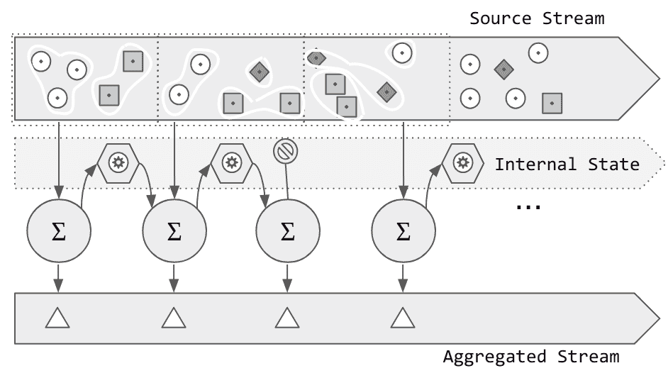

# 第十三章：高级有状态操作

第八章展示了如何使用结构化流的现有聚合函数轻松表达聚合操作，使用*结构化* Spark API。第十二章展示了 Spark 内置支持使用事件流中的嵌入时间信息（所谓的*事件时间处理*）的有效性。

但是，在需要满足不被内置模型直接支持的自定义聚合条件时，我们需要研究如何进行高级有状态操作以解决这些情况。

结构化流提供了一个 API 来实现任意有状态处理。这个 API 由两个操作表示：`mapGroupsWithState`和`flatMapGroupsWithState`。这两个操作允许我们创建状态的自定义定义，设置该状态随时间推移如何演变的规则，确定其何时过期，并提供一种方法将此状态定义与传入数据结合以生成结果。

`mapGroupsWithState`和`flatMapGroupsWithState`之间的主要区别在于前者必须为每个处理过的组生成单个结果，而后者可能生成零个或多个结果。从语义上讲，这意味着当新数据始终导致新状态时应使用`mapGroupsWithState`，而在所有其他情况下应使用`flatMapGroupsWithState`。

在内部，结构化流负责在操作之间管理状态，并确保其在整个流处理过程中的可用性和容错保存。

# 例如：车队管理

假设有一个车队管理解决方案，车队中的车辆具备无线网络功能。每辆车定期报告其地理位置以及诸如燃油水平、速度、加速度、方位、引擎温度等多个操作参数。利益相关者希望利用这些遥测数据流来实现一系列应用程序，帮助他们管理业务的运营和财务方面。

利用目前了解到的结构化流特性，我们已经能够实现许多用例，比如使用事件时间窗口监控每天行驶的公里数或通过应用过滤器查找低燃油警告的车辆。

现在，我们希望有一个行程的概念：从起点到终点的驾驶路段。单独来看，行程的概念有助于计算燃油效率或监控地理围栏协议的遵守情况。当分析成组时，行程信息可能揭示出运输模式、交通热点，以及与其他传感器信息结合时，甚至可以报告道路条件。从我们流处理的角度来看，我们可以将行程视为一个任意的时间窗口，当车辆开始移动时打开，当最终停止时关闭。我们在 第十二章 中看到的事件时间窗口聚合使用固定的时间间隔作为窗口条件，因此对于实现我们的行程分析没有帮助。

我们可以意识到，我们需要一个更强大的状态定义，不仅仅基于时间，还基于任意条件。在我们的例子中，这个条件是车辆正在行驶。

# 理解带状态操作

任意状态操作 `mapGroupsWithState` 和 `flatMapGroupWithState` 专门使用类型化的 `Dataset` API，可以使用 Scala 或 Java 绑定。

根据我们正在处理的数据和我们状态转换的要求，我们需要提供三种类型定义，通常编码为 `case class`（Scala）或 `Java Bean`（Java）：

+   输入事件 (`I`)

+   要保持的任意状态 (`S`)

+   输出 (`O`)（如果适用，则此类型可能与状态表示相同）

所有这些类型都必须可以编码为 Spark SQL 类型。这意味着应该有一个可用的 `Encoder`。通常的导入语句

```
import spark.implicits._
```

对于所有基本类型、元组和 `case class`，都足够。

有了这些类型，我们可以制定状态转换函数，实现我们的自定义状态处理逻辑。

`mapGroupsWithState` 要求此函数返回一个必需的单一值：

```
def mappingFunction(key: K, values: Iterator[I], state: GroupState[S]): O
```

`flatMapGroupsWithState` 要求此函数返回一个 `Iterator`，可能包含零个或多个元素：

```
def flatMappingFunction(
    key: K, values: Iterator[I], state: GroupState[S]): Iterator[O]
```

`GroupState[S]` 是由结构化流提供的包装器，在执行过程中用于管理状态 `S`。在函数内部，`GroupState` 提供对状态的变异访问以及检查和设置超时的能力。

###### 警告

`mappingFunction`/`flatMappingFunction` 的实现*必须*是可序列化的。

在运行时，此函数通过 Java 序列化分发到集群的执行器上。这个要求也导致我们*绝不能*在函数体中包含任何本地状态，比如计数器或其他可变变量。所有管理的状态*必须*封装在 `State` 表示类中。

## 内部状态流

在图 13-1 中，我们展示了将输入数据（事件形式）与内部维护的状态结合起来生成结果的过程。在这个图表中，`mappingFunction`（用`Σ`表示）使用自定义逻辑处理这组元素，当与`GroupState[S]`管理的状态结合时，会产生一个结果。在这个示例中，我们使用了停止符号来表示超时。在`MapGroupsWithState`的情况下，超时也会触发事件的生成，并且*应该*清除状态。考虑到清除逻辑由编程逻辑控制，完全的状态管理责任在开发者手中。结构化流只提供基础构件。



###### 图 13-1\. 带状态动态的映射组

# 使用`MapGroupsWithState`

在“滑动窗口”中，我们看到如何基于时间窗口计算移动平均值。这种基于时间的窗口会独立于窗口中找到的元素数量产生结果。

现在，假设我们的需求是计算每个键接收的最后 10 个元素的移动平均值。我们不能使用时间窗口，因为我们不知道我们需要多长时间来获取所需数量的元素。相反，我们可以使用具有自定义状态的计数窗口来定义我们自己的基于计数的窗口。

# 在线资源

例如，我们将使用在线资源中的`map_groups_with_state`笔记本，位于[*http://github.com/stream-processing-with-spark*](http://github.com/stream-processing-with-spark)。

让我们从在“滑动窗口”中使用的相同流式数据集开始。`WeatherEvent` `case class`成为我们的输入类型（I）：

```
// a representation of a weather station event
case class WeatherEvent(stationId: String,
  timestamp: Timestamp,
  location:(Double,Double),
  pressure: Double,
  temp: Double)

val weatherEvents: Dataset[WeatherEvents] = ...
```

接下来，我们定义状态（S）。我们想要的是在我们的状态中保留最新的*n*个元素并丢弃任何更旧的元素。这似乎是使用 FIFO（先进先出）集合（如`Queue`）的自然应用。新元素添加到队列的前面，我们保留最近的*n*个元素，并丢弃任何更旧的元素。

我们的状态定义变成了由`Queue`支持的`FIFOBuffer`，并带有几个辅助方法以便于其使用：

```
import scala.collection.immutable.Queue
case class FIFOBufferT extends Serializable {

  def add(element: T): FIFOBuffer[T] =
    this.copy(data = data.enqueue(element).take(capacity))

  def get: List[T] = data.toList

  def size: Int = data.size
}
```

接下来，我们需要定义输出类型（O），该类型是状态计算的结果。我们状态计算的期望结果是输入`WeatherEvent`中传感器值的移动平均值。我们还想知道用于计算的值的时间跨度。有了这些知识，我们设计我们的输出类型，`WeatherEventAverage`：

```
import java.sql.Timestamp
case class WeatherEventAverage(stationId: String,
                               startTime: Timestamp,
                               endTime:Timestamp,
                               pressureAvg: Double,
                               tempAvg: Double)
```

有了这些定义，我们可以继续创建`mappingFunction`，它将现有状态和新元素组合成一个结果。我们可以在示例 13-1 中看到映射函数的实现。请记住，这个函数还负责通过`GroupState`包装器提供的函数更新内部状态。重要的是要注意，状态不能被更新为`null`值。试图这样做将抛出`IllegalArgumentException`。要删除状态，请使用`state.remove()`方法。

##### 示例 13-1\. 使用`mapGroupsWithState`进行基于计数的移动平均值

```
import org.apache.spark.sql.streaming.GroupState
def mappingFunction(
    key: String,
    values: Iterator[WeatherEvent],
    state: GroupState[FIFOBuffer[WeatherEvent]]
  ): WeatherEventAverage = {

  // the size of the window
  val ElementCountWindowSize = 10

  // get current state or create a new one if there's no previous state
  val currentState = state.getOption
    .getOrElse(
      new FIFOBufferWeatherEvent
    )

  // enrich the state with the new events
  val updatedState = values.foldLeft(currentState) {
    case (st, ev) => st.add(ev)
  }

  // update the state with the enriched state
  state.update(updatedState)

  // if we have enough data, create a WeatherEventAverage from the state
  // otherwise, make a zeroed record
  val data = updatedState.get
  if (data.size > 2) {
    val start = data.head
    val end = data.last
    val pressureAvg = data
      .map(event => event.pressure)
      .sum / data.size
    val tempAvg = data
      .map(event => event.temp)
      .sum / data.size
    WeatherEventAverage(
      key,
      start.timestamp,
      end.timestamp,
      pressureAvg,
      tempAvg
    )
  } else {
    WeatherEventAverage(
      key,
      new Timestamp(0),
      new Timestamp(0),
      0.0,
      0.0
    )
  }
}
```

现在，我们使用`mappingFunction`来声明流式`Dataset`的有状态转换：

```
import org.apache.spark.sql.streaming.GroupStateTimeout
val weatherEventsMovingAverage = weatherEvents
  .groupByKey(record => record.stationId)
  .mapGroupsWithState(GroupStateTimeout.ProcessingTimeTimeout)(mappingFunction)
```

请注意，我们首先在我们的领域中的键标识符中创建*组*。在这个例子中，这是`stationId`。`groupByKey`操作创建了一个中间结构，一个`KeyValueGroupedDataset`，它成为了`[map|flatMap]GroupWithState`操作的入口点。

除了映射函数之外，我们还需要提供一个超时类型。超时类型可以是`ProcessingTimeTimeout`或`EventTimeTimeout`。因为我们不依赖事件的时间戳来进行状态管理，所以我们选择了`ProcessingTimeTimeout`。我们稍后在本章中详细讨论超时管理。

最后，我们可以通过使用控制台接收器轻松观察查询结果：

```
val outQuery = weatherEventsMovingAverage.writeStream
  .format("console")
  .outputMode("update")
  .start()

+---------+-------------------+-------------------+------------+------------+
|stationId|startTime          |endTime            |pressureAvg |tempAvg     |
+---------+-------------------+-------------------+------------+------------+
|d1e46a42 |2018-07-08 19:20:31|2018-07-08 19:20:36|101.33375295|19.753225782|
|d1e46a42 |2018-07-08 19:20:31|2018-07-08 19:20:44|101.33667584|14.287718525|
|d60779f6 |2018-07-08 19:20:38|2018-07-08 19:20:48|101.59818386|11.990002708|
|d1e46a42 |2018-07-08 19:20:31|2018-07-08 19:20:49|101.34226429|11.294964619|
|d60779f6 |2018-07-08 19:20:38|2018-07-08 19:20:51|101.63191940|8.3239282534|
|d8e16e2a |2018-07-08 19:20:40|2018-07-08 19:20:52|101.61979385|5.0717571842|
|d4c162ee |2018-07-08 19:20:34|2018-07-08 19:20:53|101.55532969|13.072768358|
+---------+-------------------+-------------------+------------+------------+
// (!) output edited to fit in the page
```

# 使用 FlatMapGroupsWithState

我们之前的实现有一个缺陷。你能发现吗？

当我们开始处理流，并且在我们收集到我们认为需要计算移动平均值的所有元素之前，`mapGroupsWithState`操作会产生零值：

```
+---------+-------------------+-------------------+-----------+-------+
|stationId|startTime          |endTime            |pressureAvg|tempAvg|
+---------+-------------------+-------------------+-----------+-------+
|d2e710aa |1970-01-01 01:00:00|1970-01-01 01:00:00|0.0        |0.0    |
|d1e46a42 |1970-01-01 01:00:00|1970-01-01 01:00:00|0.0        |0.0    |
|d4a11632 |1970-01-01 01:00:00|1970-01-01 01:00:00|0.0        |0.0    |
+---------+-------------------+-------------------+-----------+-------+
```

正如我们之前提到的，`mapGroupsWithState`要求状态处理函数在每个触发间隔处理的每个组产生单个记录。当新数据的到来与每个键相对应自然地更新其状态时，这是很好的。

但是在某些情况下，我们的状态逻辑要求一系列事件发生后才能生成结果。在我们当前的示例中，我们需要*n*个元素才能开始计算它们的平均值。在其他情况下，一个单独的传入事件可能会完成多个临时状态，从而产生多个结果。例如，单个质量运输到达目的地可能会更新所有乘客的旅行状态，可能会为每个乘客产生一条记录。

`flatMapGroupsWithState`是`mapGroupsWithState`的泛化，其中状态处理函数生成一个结果的`Iterator`，该结果可能包含零个或多个元素。

让我们看看如何使用此函数来改进我们对*n*个元素的移动平均计算。

# 在线资源

对于此示例，我们将使用书籍在线资源中的`mapgroupswithstate-n-moving-average`笔记本，位于[*https://github.com/stream-processing-with-spark*](https://github.com/stream-processing-with-spark)。

我们需要更新映射函数以返回一个结果的`Iterator`。在我们的情况下，当我们没有足够的值来计算平均值时，这个`Iterator`将包含零个元素，否则包含一个值。我们修改后的函数看起来像示例 13-2。

##### 示例 13-2。使用基于计数的移动平均数的`flatMapGroupsWithState`

```
import org.apache.spark.sql.streaming._
def flatMappingFunction(
    key: String,
    values: Iterator[WeatherEvent],
    state: GroupState[FIFOBuffer[WeatherEvent]]
  ): Iterator[WeatherEventAverage] = {

  val ElementCountWindowSize = 10

  // get current state or create a new one if there's no previous state
  val currentState = state.getOption
    .getOrElse(
      new FIFOBufferWeatherEvent
    )

  // enrich the state with the new events
  val updatedState = values.foldLeft(currentState) {
    case (st, ev) => st.add(ev)
  }

  // update the state with the enriched state
  state.update(updatedState)

  // only when we have enough data, create a WeatherEventAverage from the state
  // before that, we return an empty result.
  val data = updatedState.get
  if (data.size == ElementCountWindowSize) {
    val start = data.head
    val end = data.last
    val pressureAvg = data
      .map(event => event.pressure)
      .sum / data.size
    val tempAvg = data
      .map(event => event.temp)
      .sum / data.size
    Iterator(
      WeatherEventAverage(
        key,
        start.timestamp,
        end.timestamp,
        pressureAvg,
        tempAvg
      )
    )
  } else {
    Iterator.empty
  }
}

val weatherEventsMovingAverage = weatherEvents
  .groupByKey(record => record.stationId)
  .flatMapGroupsWithState(
    OutputMode.Update,
    GroupStateTimeout.ProcessingTimeTimeout
  )(flatMappingFunction)
```

使用`flatMapGroupsWithState`，我们不再需要生成人为的零记录。除此之外，我们的状态管理定义现在严格地要求有*n*个元素来生成结果。

## 输出模式

尽管`map`和`flatMapGroupsWithState`操作之间结果的基数差异可能看起来像一个小的实际 API 差异，但它在显而易见的变量产生结果之外具有更深远的影响。

正如我们在示例中所看到的，`flatMapGroupsWithState`需要额外指定输出模式。这是为了向下游过程提供有关状态操作的记录生成语义的信息。反过来，这有助于 Structured Streaming 计算下游接收器的允许输出操作。

在`flatMapGroupsWithState`中指定的输出模式可以是以下之一：

`update`

这表明生成的记录是非最终的。它们是中间结果，可能随后通过新信息进行更新。在前面的示例中，键的新数据到达时会生成一个新的数据点。下游接收器必须使用`update`，并且不能跟随`flatMapGroupsWithState`操作的任何聚合。

`append`

这表示我们已经收集到了所有需要为一个组生成结果的信息，没有进一步的传入事件会改变该结果。下游接收器必须使用`append`模式来写入。鉴于`flatMapGroupsWithState`应用了一个最终记录，可以对该结果应用进一步的聚合。

## 随时间管理状态

管理随时间推移的状态的一个关键要求是确保我们有一个稳定的工作集。¹也就是说，我们的进程所需的内存随时间有界，并且保持在安全距离内，以允许波动。

在我们在第十二章中看到的基于时间窗口等托管有状态聚合中，Structured Streaming 内部管理机制以清除被认为过期的状态和事件，以限制内存使用量。当我们使用`[map|flatMap]GroupsWithState`提供的自定义状态管理能力时，我们还必须承担清除旧状态的责任。

幸运的是，Structured Streaming 暴露了时间和超时信息，我们可以用它来决定何时过期某些状态。第一步是决定要使用的时间参考。超时可以基于事件时间或处理时间，选择是针对特定 `[map|flatMap]GroupsWithState` 处理的状态全局设置的。

在调用 `[map|flatMap]GroupsWithState` 时指定超时类型。回顾移动平均数示例，我们配置了 `mapGroupsWithState` 函数以如下方式使用处理时间：

```
import org.apache.spark.sql.streaming.GroupStateTimeout
val weatherEventsMovingAverage = weatherEvents
  .groupByKey(record => record.stationId)
  .mapGroupsWithState(GroupStateTimeout.ProcessingTimeTimeout)(mappingFunction)
```

要使用事件时间，我们还需要声明水印定义。此定义由事件的时间戳字段和水印的配置滞后组成。如果我们想要在上一个示例中使用事件时间，我们会这样声明：

```
val weatherEventsMovingAverage = weatherEvents
  .withWatermark("timestamp", "2 minutes")
  .groupByKey(record => record.stationId)
  .mapGroupsWithState(GroupStateTimeout.EventTimeTimeout)(mappingFunction)
```

超时类型声明了全局的时间参考源。还有选项 `GroupStateTimeout.NoTimeout`，适用于不需要超时的情况。超时的实际值由每个个体组管理，使用 `GroupState` 中可用的方法来管理超时：`state.setTimeoutDuration` 或 `state.setTimeoutTimestamp`。

要确定状态是否已过期，我们检查 `state.hasTimedOut`。当状态超时时，对于已超时组的值，将发出对 `(flat)MapFunction` 的调用，空迭代器。

让我们利用超时功能。继续我们的运行示例，我们首先要做的是提取状态转换为事件：

```
def stateToAverageEvent(
    key: String,
    data: FIFOBuffer[WeatherEvent]
  ): Iterator[WeatherEventAverage] = {
  if (data.size == ElementCountWindowSize) {
    val events = data.get
    val start = events.head
    val end = events.last
    val pressureAvg = events
      .map(event => event.pressure)
      .sum / data.size
    val tempAvg = events
      .map(event => event.temp)
      .sum / data.size
    Iterator(
      WeatherEventAverage(
        key,
        start.timestamp,
        end.timestamp,
        pressureAvg,
        tempAvg
      )
    )
  } else {
    Iterator.empty
  }
}
```

现在，我们可以利用这个新的抽象来转换我们的状态，无论是在超时的情况下，还是在通常数据进入的场景中。请注意在 Example 13-3 中如何使用超时信息来清除即将过期的状态。

##### 示例 13-3\. 在 `flatMapGroupsWithState` 中使用超时

```
import org.apache.spark.sql.streaming.GroupState
def flatMappingFunction(
    key: String,
    values: Iterator[WeatherEvent],
    state: GroupState[FIFOBuffer[WeatherEvent]]
  ): Iterator[WeatherEventAverage] = {
  // first check for timeout in the state
  if (state.hasTimedOut) {
    // when the state has a timeout, the values are empty
    // this validation is only to illustrate the point
    assert(
      values.isEmpty,
      "When the state has a timeout, the values are empty"
    )
    val result = stateToAverageEvent(key, state.get)
    // evict the timed-out state
    state.remove()
    // emit the result of transforming the current state into an output record
    result
  } else {
    // get current state or create a new one if there's no previous state
    val currentState = state.getOption.getOrElse(
      new FIFOBufferWeatherEvent
    )
    // enrich the state with the new events
    val updatedState = values.foldLeft(currentState) {
      case (st, ev) => st.add(ev)
    }
    // update the state with the enriched state
    state.update(updatedState)
    state.setTimeoutDuration("30 seconds")
    // only when we have enough data,
    // create a WeatherEventAverage from the accumulated state
    // before that, we return an empty result.
    stateToAverageEvent(key, updatedState)
  }
}
```

### 当超时实际上超时时

在结构化流处理中超时的语义确保在时钟超过水印之后才会超时。这符合我们对超时的直觉：我们的状态在设定的过期时间之前不会超时。

超时语义与常规直觉有所不同的地方在于超时事件实际发生的*时间*是在过期时间过去之后。

目前，超时处理绑定到接收新数据上。因此，一段时间内沉默的流并且不生成新触发器进行处理，也不会生成超时。当前的超时语义是根据事件性质定义的：超时事件将在状态过期后最终触发，没有任何关于超时事件何时触发的严格上界的保证。正式地说：超时事件触发的时间没有严格的上限。

###### 警告

目前正在进行工作，使超时在没有新数据可用时也能触发。

# 总结

在本章中，我们了解了结构化流处理中的任意状态处理 API。我们探讨了`mapGroupsWithState`和`flatMapGroupsWithState`之间的细节和差异，包括它们产生的事件及其支持的输出模式。最后，我们还学习了超时设置，并了解了其语义。

尽管这个 API 的使用比常规的类 SQL 构造更复杂，但它为我们提供了一个强大的工具集，用于实现任意状态管理，以解决最苛刻的流式使用场景的开发需求。

¹ *工作集* 是指进程在一段时间内用于运行的内存量。
