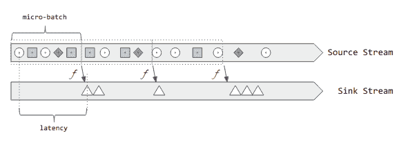
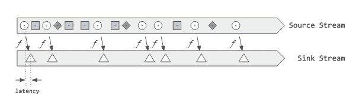

# 第十五章：实验性领域：连续处理与机器学习

结构化流处理首次出现在 Spark 2.0 中作为一个实验性 API，提供了一个新的流处理模型，旨在简化我们思考流应用的方式。在 Spark 2.2 中，结构化流处理“毕业”成为*适用于生产环境*，表明这种新模型已准备好供行业采用。在 Spark 2.3 中，我们看到在流连接方面进一步改进，并引入了一个新的实验性连续执行模型，用于低延迟流处理。

与任何新的成功开发一样，我们可以期待结构化流处理保持快速进展。尽管行业采用将为重要特性提供进化反馈，但市场趋势如机器学习日益增长的流行性将推动未来发布的路线图。

在本章中，我们希望深入探讨一些正在开发中的领域，这些领域可能会成为未来版本的主流。

# 连续处理

*连续处理*是结构化流处理的一种替代执行模式，允许对单个事件进行低延迟处理。它作为 Spark v2.3 中的实验性功能被包含进来，并且仍在积极开发中，特别是在交付语义、有状态操作支持和监控领域。

## 理解连续处理

Spark 的初始流处理 API，Spark Streaming，旨在重用 Spark 的批处理能力。简而言之，数据流被分成小块交给 Spark 进行处理，使用其本机批处理执行模式的核心引擎。在短时间间隔内定期重复此过程，不断消耗输入流并以流式方式生成结果。这被称为*微批处理模型*，我们在第五章早期已经讨论过。在本书的后续部分讨论 Spark Streaming 时，我们将更详细地研究该模型的应用。现在要记住的重要部分是，称为*批处理间隔*的时间间隔定义是原始微批处理实现的关键。

### 结构化流处理中的微批处理

当引入结构化流处理时，发生了类似的演进。与引入替代处理模型不同，结构化流处理被嵌入到`Dataset` API 中，并重用了底层 Spark SQL 引擎的现有功能。因此，结构化流处理提供了统一的 API，与传统的批处理模式完全融合，并充分利用了 Spark SQL 引入的性能优化，如查询优化和 Tungsten 代码生成。

在这一努力中，底层引擎获得了额外的能力来支持流处理工作负载，如增量查询执行和随时间的弹性状态管理的支持。

在 API 表面上，结构化流处理避免了将时间概念作为显式用户参数。这使得可以实现基于事件时间的聚合，因为时间概念是从数据流中推断出来的。在内部，执行引擎仍然依赖微批处理架构，但时间的抽象允许创建具有不同执行模型的引擎。

离开固定时间微批处理的第一个执行模型是结构化流处理中的*尽力而为*执行，在未指定`trigger`时是默认模式。在尽力而为模式下，下一个微批处理会在上一个结束后立即开始。这创建了结果流的可观察连续性，并改善了底层计算资源的使用。

微批处理执行引擎采用任务调度模型。在集群上进行任务调度和协调非常昂贵，最小的可能延迟大约为 100 毫秒。

在 图 15-1 中，您可以观察到使用微批处理模型过滤传入的“圆形”并将其转换为“三角形”的过程。我们收集在特定间隔内到达的所有元素，并同时对它们应用我们的函数 *f*。



###### 图 15-1\. 微批处理延迟

处理延迟是在*源*流中事件到达和在*sink*中产生结果之间的时间间隔。正如我们所了解的，在微批处理模型中，延迟的上限是批处理间隔加上处理数据所需的时间，其中包括计算本身以及在集群的执行器中执行此类计算所需的协调。

### 引入连续处理：低延迟流处理模式

利用结构化流处理中的时间抽象，可以引入新的执行模式，而无需更改面向用户的 API。

在连续处理执行模式中，数据处理查询作为长时间运行的任务在执行器上*持续*执行。并行模型很简单：对于每个输入分区，集群的节点上会运行这样一个任务。该任务订阅输入分区并持续处理传入的各个事件。在连续处理查询部署下，集群中会创建一组任务的拓扑结构。

如图 15-2 所示，这种新的执行模型消除了微批处理延迟，并在每个元素处理完毕后立即生成结果。此模型类似于 Apache Flink。



###### 图 15-2\. 连续处理延迟

## 使用连续处理

使用连续处理执行模式所需的所有操作是指定`Trigger.Continuous`作为`trigger`并提供一个时间间隔给异步检查点函数，如我们在这个简约示例中所展示的：

```
import org.apache.spark.sql.streaming.Trigger

val stream = spark.readStream
    .format("rate")
    .option("rowsPerSecond", "5")
    .load()

val evenElements = stream.select($"timestamp", $"value").where($"value" % 2 === 0)

val query = evenElements.writeStream
    .format("console")
    .trigger(Trigger.Continuous("2 seconds"))
    .start()
```

###### 警告

不要将`Trigger.Continuous(<time-interval>)`提供的时间间隔与微批次间隔混淆。这是异步检查点操作的时间间隔，由*连续查询*执行器完成。

## 限制

尽管在 API 级别没有变化，但在连续模式下支持的查询类型有一些限制。直觉上，连续模式与可以逐元素应用的查询一起工作。在 SQL 术语中，我们可以使用选择、投影和转换，包括 SQL 函数，除了聚合之外。在函数式术语中，我们可以使用`filter`、`map`、`flatMap`和`mapPartitions`。

在使用聚合和窗口函数时，特别是处理基于事件的数据时，我们必须等待迟到和乱序数据的时间更长。窗口中的时间段及相关概念，如*水印*，并不能从这种执行模型的低延迟特性中受益。在这种情况下，推荐的方法是退回到基于微批次的引擎，将`Trigger.Continuous(<checkpoint-interval>)`替换为微批次触发器定义：`Trigger.ProcessingTime(<trigger-interval>)`。

支持任意状态处理，例如`[flat]mapGroupsWithState`，目前正在开发中。

# 机器学习

随着可用数据量和其到达速度的增加，传统的信号理解技术成为从数据中提取可操作见解的主要障碍。

机器学习本质上是算法和统计分析技术的结合，用于从数据中*学习*，并利用这种学习为某些问题提供答案。机器学习使用数据来估计模型，即对世界某个方面的数学表示。一旦确定了模型，就可以在现有或新数据上查询以获得答案。

我们从数据中期望得到的答案的性质将机器学习算法的目标分为三类：

回归

我们希望在连续范围内预测一个值。示例：使用关于学生缺课次数和某课程学习小时数的数据，预测他们在期末考试中的成绩。

分类

我们希望将数据点分为几个类别之一。示例：给定一段文本样本，我们希望估计其语言。

聚类

给定一组元素，我们希望使用某种相似性概念将其划分为子集。示例：在一个在线葡萄酒商店，我们希望将具有相似购买行为的客户分组。

在学习过程中，我们还有*监督*的概念。当被训练的算法需要将一些观测映射到结果的数据时，我们称之为*监督学习*。回归和分类技术属于*监督学习*范畴。以我们之前的考试成绩为例，要建立我们的回归模型，我们需要一个包含学生历史表现数据的数据集，其中包括学生报告的考试成绩、缺席次数和学习时间。获取*好*的数据是机器学习任务中最具挑战性的方面。

## 学习与利用

我们可以识别出机器学习技术应用中的两个阶段：

+   学习阶段，其中数据被准备并用于估计模型。这也被称为*训练*或*学习*。

+   利用阶段，估计模型在新数据上被查询。这个阶段被称为*预测*或*评分*。

机器学习的训练阶段通常使用历史数据集。这些数据集通常被清理并准备用于目标应用。机器学习方法还需要一个验证阶段，其中结果模型将针对已知结果的数据集进行评估，通常称为*测试*或*验证*集。测试阶段的结果是报告学习模型在训练期间未见过的数据上表现如何的度量指标。

## 将机器学习模型应用于流数据

正如我们之前提到的，创建机器学习模型通常是一个基于批处理的过程，使用历史数据来训练统计模型。一旦该模型可用，就可以对新数据进行*评分*，以获取该模型训练的特定方面的估计值。

Apache Spark 统一的*结构化*API 在批处理、机器学习和流处理中使得将先前训练的模型应用于流式`DataFrame`变得简单。

假设模型已存储在磁盘上，该过程包括两个步骤：

1.  加载模型。

1.  使用其`transform`方法将模型应用于流式`DataFrame`。

让我们通过一个例子来看看 API 的实际应用。

## 示例：使用环境传感器估计房间占用情况

在编写本书的这部分内容时，我们一直在使用传感器信息作为主题。到目前为止，我们已经利用传感器数据探索了结构化流处理的数据处理和分析能力。现在，假设我们在一系列房间中放置了这样的环境传感器，但我们不是追踪温度或湿度数据的变化，而是想利用这些信息驱动一个新颖的应用。我们希望通过使用传感器数据来估计某一时刻房间是否被占用。虽然单独的温度或湿度可能不足以确定房间是否在使用中，但也许这些因素的组合能够在一定程度上预测占用情况。

# 在线资源

对于本例，我们将在书籍的在线资源中使用`occupancy_detection_model`和`occupancy_streaming_prediction`笔记本，位于[*https://github.com/stream-processing-with-spark*](https://github.com/stream-processing-with-spark)。

对于本例，我们将使用一个占用数据集，该数据集是为了回答该问题而收集的。该[数据集](http://bit.ly/2PH7De8)包含以下模式：

```
 |-- id: integer (nullable = true)
 |-- date: timestamp (nullable = true)
 |-- Temperature: double (nullable = true)
 |-- Humidity: double (nullable = true)
 |-- Light: double (nullable = true)
 |-- CO2: double (nullable = true)
 |-- HumidityRatio: double (nullable = true)
 |-- Occupancy: integer (nullable = true)
```

训练数据集中的占用信息是通过房间的摄像头图像获得的，以确定其中是否有人员存在。

使用这些数据，我们训练了一个逻辑回归模型，用于估计占用情况，表示为二项结果[0,1]，其中 0 = 未占用，1 = 占用。

###### 注意

对于本例，我们假设训练好的模型已经在磁盘上可用。这个例子的完整训练阶段可以在书籍的在线资源中找到。

第一步是加载先前训练的模型：

```
$ import org.apache.spark.ml._
$ val pipelineModel = PipelineModel.read.load(modelFile)
>pipelineModel: org.apache.spark.ml.PipelineModel = pipeline_5b323b4dfffd
```

此调用会生成一个包含我们流水线各个阶段信息的模型。

通过调用`model.stages`，我们可以可视化这些阶段：

```
$ model.stages
res16: Array[org.apache.spark.ml.Transformer] =
    Array(vecAssembler_7582c780b304, logreg_52e582f4bdb0)
```

我们的流水线包括两个阶段：`VectorAssembler`和`LogisticRegression`分类器。`VectorAssembler`是一个转换器，将输入数据中选择的字段选择性地转换为数值`Vector`，作为模型的输入。`LogisticRegression`阶段是经过训练的逻辑回归分类器。它使用学习到的参数将输入`Vector`转换为三个字段，这些字段将添加到`streaming` `DataFrame`中：`rawPrediction`、`probability`和`prediction`。

对于我们的应用程序，我们感兴趣的是`prediction`值，该值将告诉我们房间是否正在使用（1）或未使用（0）。

下一步，如示例 15-1 所示，是将模型应用于流`DataFrame`。

##### 示例 15-1\. 在结构化流中使用训练好的机器学习模型

```
// let's assume an existing sensorDataStream
$ val scoredStream = pipeline.transform(sensorDataStream)

// inspect the schema of the resulting DataFrame
$ scoredStream.printSchema
root
  |-- id: long (nullable = true)
  |-- timestamp: timestamp (nullable = true)
  |-- date: timestamp (nullable = true)
  |-- Temperature: double (nullable = true)
  |-- Humidity: double (nullable = true)
  |-- Light: double (nullable = true)
  |-- CO2: double (nullable = true)
  |-- HumidityRatio: double (nullable = true)
  |-- Occupancy: integer (nullable = true)
  |-- features: vector (nullable = true)
  |-- rawPrediction: vector (nullable = true)
  |-- probability: vector (nullable = true)
  |-- prediction: double (nullable = false)
```

此时，我们有一个包含原始流数据预测的流`DataFrame`。

我们流预测的最后一步是处理预测数据。在这个例子中，我们将限制此步骤，使用内存接收器查询数据，以访问结果数据作为 SQL 表：

```
import org.apache.spark.sql.streaming.Trigger
val query = scoredStream.writeStream
        .format("memory")
        .queryName("occ_pred")
        .start()

// let the stream run for a while first so that the table gets populated
sparkSession.sql("select id, timestamp, occupancy, prediction from occ_pred")
            .show(10, false)

+---+-----------------------+---------+----------+
|id |timestamp              |occupancy|prediction|
+---+-----------------------+---------+----------+
|211|2018-08-06 00:13:15.687|1        |1.0       |
|212|2018-08-06 00:13:16.687|1        |1.0       |
|213|2018-08-06 00:13:17.687|1        |1.0       |
|214|2018-08-06 00:13:18.687|1        |1.0       |
|215|2018-08-06 00:13:19.687|1        |1.0       |
|216|2018-08-06 00:13:20.687|1        |0.0       |
|217|2018-08-06 00:13:21.687|1        |0.0       |
|218|2018-08-06 00:13:22.687|0        |0.0       |
|219|2018-08-06 00:13:23.687|0        |0.0       |
|220|2018-08-06 00:13:24.687|0        |0.0       |
+---+-----------------------+---------+----------+
```

鉴于我们使用测试数据集来驱动我们的流，我们还可以访问原始占用数据。在这个有限的样本中，我们可以观察到实际占用和预测大多数但不是所有时间都是准确的。

对于实际应用，我们通常有兴趣将此服务提供给其他应用程序。也许以基于 HTTP 的 API 形式，或通过发布/订阅消息交互。我们可以使用任何可用的接收器将结果写入其他系统以供进一步使用。

### 模型服务的挑战

训练好的机器学习模型很少是完美的。总是有机会用更多或更好的数据训练模型，或者调整其参数以提高预测准确性。随着训练好的模型不断发展，挑战在于在新模型可用时升级我们的流处理评分过程。

从训练阶段到应用中利用机器学习模型的生命周期管理过程通常被称为*模型服务*的广义概念。

模型服务包括将训练好的模型转移到生产平台并保持这些在线*服务*过程与最新训练好的模型保持更新的过程。

### 结构化流处理中的模型服务

在结构化流处理中，无法更新正在运行的查询。就像我们在示例 15-1 中看到的那样，在我们的流处理过程中将模型评分步骤作为转换包含其中。在启动相应的流查询之后，该声明成为部署的查询计划的一部分，并将在查询停止之前运行。因此，在结构化流处理中直接支持更新机器学习模型是不可能的。然而，可以创建一个管理系统，调用结构化流处理 API 停止、更新和重新启动查询，以便提供新模型。

模型服务的主题在 Spark 社区中是一个持续讨论的话题，并且肯定会在未来版本的 Spark 和结构化流处理中看到进展。

## 在线训练

在我们早些描述的机器学习过程中，我们区分了学习和评分阶段，其中学习步骤主要是离线过程。在流应用的上下文中，可以随着数据的到来训练机器学习模型。这也称为*在线学习*。当我们希望适应数据中的变化模式时，例如社交网络的兴趣变化或者金融市场的趋势分析时，在线学习尤为有趣。

在线学习提出了一套新的挑战，因为其实施要求每个数据点只被观察一次，并且必须考虑到观察到的数据总量可能是无限的。

在其当前形式下，结构化流处理不支持*在线训练*。正在努力实现一些（有限的）结构化流处理在线学习的形式，其中最显著的是[霍尔登·卡劳和塞思·亨德里克森](https://oreil.ly/2IZwIQU)以及[拉姆·斯里哈沙和弗拉德·费恩伯格](http://bit.ly/2VFUV4J)。

看起来在结构化流处理之上实施在线学习的早期尝试已经失去了动力。这种情况可能会在未来发生改变，因此请关注结构化流处理的新版本，以获取此领域的潜在更新。
