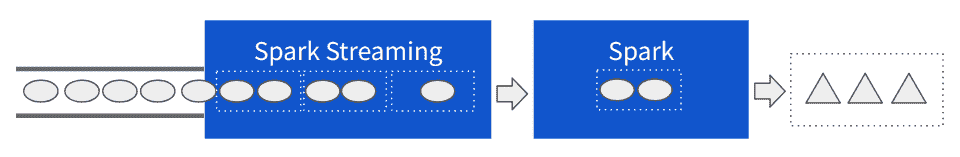
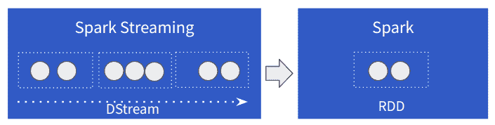

# 第十六章：介绍 Spark Streaming

Spark Streaming 是建立在 Spark 分布式处理能力之上的第一个流处理框架。如今，它提供了一个成熟的 API，在行业中被广泛采用来处理大规模数据流。

Spark 是一个通过设计在处理分布在一组机器上的数据方面非常出色的系统。Spark 的核心抽象化是*弹性分布式数据集*（RDD），其流畅的函数式 API 允许创建将分布式数据视为集合的程序。这种抽象化使我们能够通过对分布式数据集的转换来推理数据处理逻辑。通过这样做，它减少了以前创建和执行可扩展和分布式数据处理程序所需的认知负荷。

Spark Streaming 是基于简单而强大的前提创建的：通过将 Spark 的分布式计算能力应用于流处理，将连续的数据流转换为 Spark 可操作的离散数据集。

正如我们可以在图 16-1 中看到的那样，Spark Streaming 的主要任务是从流中获取数据，将其打包成小批次，并提供给 Spark 进行进一步处理。然后将输出产生到某个下游系统。



###### 图 16-1。Spark 和 Spark Streaming 的实际应用

# DStream 抽象化

而结构化流，你在第 II 部分中学到的，将其流能力构建在*Spark SQL*抽象化的`DataFrame`和`Dataset`之上，而 Spark Streaming 则依赖于更基础的 Spark RDD 抽象化。与此同时，Spark Streaming 引入了一个新概念：*离散化流*或 DStream。DStream 表示一种数据的离散块，这些块随时间表现为 RDD。正如我们可以在图 16-2 中看到的那样。



###### 图 16-2。Spark Streaming 中的 DStreams 和 RDDs

DStream 抽象化主要是一个执行模型，当与函数式编程模型结合时，为我们提供了一个完整的框架来开发和执行流应用程序。

## DStreams 作为编程模型

DStreams 的代码表示给了我们一个与 RDD API 一致的函数式编程 API，并增加了处理聚合、基于时间的操作和有状态计算的流特定函数。在 Spark Streaming 中，我们通过从其中一个原生实现（如 `SocketInputStream`）创建 DStream 或使用提供特定于流提供程序的 DStream 实现的众多连接器之一来消费流（这是 Kafka、Twitter 或 Kinesis 连接器为 Spark Streaming 提供的情况，仅举几例）：

```
// creates a dstream using a client socket connected to the given host and port
val textDStream = ssc.socketTextStream("localhost", 9876)
```

获得了一个`DStream`的引用后，我们可以使用`DStream` API 提供的函数来实现我们的应用逻辑。例如，如果前面代码中的`textDStream`连接到一个日志服务器，我们可以统计错误发生的次数：

```
// we break down the stream of logs into error or info (not error)
// and create pairs of `(x, y)`.
// (1, 1) represents an error, and
// (0, 1) a non-error occurrence.
val errorLabelStream = textDStream.map{line =>
    if (line.contains("ERROR")) (1, 1) else (0, 1)
  }
```

然后，我们可以通过使用称为`reduce`的聚合函数计算总数并计算错误率：

```
// reduce by key applies the provided function for each key.
val errorCountStream = errorLabelStream.reduce {
    case ((x1,y1), (x2, y2))  => (x1+x2, y1+y2)
  }
```

要获取我们的错误率，我们执行一个安全的除法：

```
// compute the error rate and create a string message with the value
val errorRateStream = errorCountStream.map {case (errors, total) =>
    val errorRate = if (total > 0 ) errors.toDouble/total else 0.0
    "Error Rate:" + errorRate
  }
```

需要注意的是，到目前为止，我们一直在 DStream 上使用变换，但尚未进行数据处理。所有 DStream 上的变换都是惰性的。定义流处理应用程序逻辑的过程更好地看作是将在启动流处理后应用于数据的一组变换。因此，这是 Spark Streaming 将在来自源 DStream 的数据上重复执行的操作计划。DStreams 是不可变的。只有通过一系列变换，我们才能处理并从我们的数据中获取结果。

最后，DStream 编程模型要求变换必须以输出操作结束。这种特定操作指定了 DStream 的具体实现方式。在我们的情况下，我们有兴趣将此流计算的结果打印到控制台上：

```
// print the results to the console
errorRateStream.print()
```

总结来说，DStream 编程模型由对流载荷进行的变换的功能组合组成，由一个或多个*输出操作*实现，并由 Spark Streaming 引擎重复执行。

## DStreams 作为执行模型

在前面介绍的 Spark Streaming 编程模型中，我们可以看到数据如何从其原始形式转换为我们预期的结果，作为一系列惰性功能变换。Spark Streaming 引擎负责将这些功能变换链转化为实际的执行计划。这是通过从输入流(s)接收数据，将数据收集到批次中，并及时将其传递给 Spark 来实现的。

等待数据的时间度量称为*批处理间隔*。通常是一个较短的时间，从大约两百毫秒到几分钟不等，具体取决于应用程序对延迟的要求。批处理间隔是 Spark Streaming 中的中心时间单位。在每个批处理间隔内，将前一个间隔对应的数据发送给 Spark 进行处理，同时接收新数据。这个过程在 Spark Streaming 作业处于活动和健康状态时重复进行。这种重复的微批处理操作的自然结果是，在批处理间隔的持续时间内，对批处理数据的计算必须完成，以便在新的微批处理到达时仍然有可用的计算资源。正如本书的这一部分将会介绍的那样，批处理间隔决定了 Spark Streaming 中大多数其他功能的时间。

总结一下，DStream 模型规定数据的连续流通过常规时间间隔（称为批处理间隔）离散化为微批次。在每个批处理间隔，Spark Streaming 将相应时间段内的数据以及要应用的功能转换交给 Spark 处理。然后，Spark 对数据进行计算并生成结果，通常发送到外部系统。Spark 最多有相同的批处理间隔时间来处理数据，否则会出现问题，稍后您将了解到。

# Spark Streaming 应用程序的结构

为了对 Spark Streaming 应用程序的结构和编程模型有直观的理解，我们将从一个例子开始。

任何 Spark Streaming 应用程序都需要执行以下四项操作：

+   创建一个*Spark Streaming Context*

+   从数据源或其他 DStreams 定义一个或多个 DStreams

+   定义一个或多个输出操作，以实现这些 DStream 操作的结果

+   启动 Spark Streaming Context 以启动流处理。

出于我们例子的考虑，在它运行一段时间后我们将停止这个过程。

作业的行为是在定义流处理上下文实例之后并启动之间定义的操作中定义的。从这个意义上讲，在启动之前对上下文的操作定义了流应用程序的脚手架，其行为和执行将在流应用程序的整个持续期间内定义。

在定义阶段，将定义所有的 DStreams 及其转换，并且“连接”了 Spark Streaming 应用程序的行为。

请注意，一旦启动了 Spark Streaming Context，就不能向其添加新的 DStream，也不能结构上修改任何现有的 DStream。

## 创建 Spark Streaming Context

Spark Streaming Context 的目标是跟踪在 Spark 集群中创建、配置和处理 DStreams。因此，它根据每个间隔产生的 Spark RDD 创建作业，并跟踪 DStream 的血统。

为了更清楚地了解这个情况，我们将看看如何创建一个流上下文来托管我们的流。在 Spark shell 中，最简单的方法是在 Spark Context 周围包装一个流上下文，而在 shell 中可通过名称`sc`访问它：

```
scala> import org.apache.spark.streaming._
import org.apache.spark.streaming._

scala> val ssc = new StreamingContext(sc, Seconds(2))
ssc: org.apache.spark.streaming.StreamingContext =
      org.apache.spark.streaming.StreamingContext@77331101
```

流处理上下文负责启动延迟到对应的`streamingContext`实例上调用`start()`方法的摄入过程。

###### 警告

初学者常见的错误是尝试通过在本地模式中分配一个单核（`--master "local[1]"`）或者在单核虚拟机中启动 Spark Streaming 来测试，接收器消耗数据会阻塞同一机器上的任何 Spark 处理，导致流作业无法进展。

## 定义一个 DStream

现在让我们声明一个 DStream，它将监听任意本地端口上的数据。单独的 DStream 不会做任何事情。与需要 `actions` 来实现计算的 RDD 类似，DStreams 需要声明输出操作，以触发 DStream 转换执行的调度。在本例中，我们使用了 `count` 转换，它计算每个批次间隔接收到的元素数量：

```
scala> val dstream = ssc.socketTextStream("localhost", 8088)
dstream: org.apache.spark.streaming.dstream.ReceiverInputDStream[String] =
      org.apache.spark.streaming.dstream.SocketInputDStream@3042f1b

scala> val countStream = dstream.count()
countStream: org.apache.spark.streaming.dstream.DStream[Long] =
      org.apache.spark.streaming.dstream.MappedDStream@255b84a9
```

## 定义输出操作

对于这个示例，我们使用了 `print`，这是一个输出操作，每个批次间隔输出 `DStream` 中的少量元素样本：

```
scala> countStream.print()
```

现在，在另一个控制台中，我们可以循环遍历我们的姓氏常见文件，并通过使用一个小型 Bash 脚本将其发送到本地 TCP socket 中：

```
$ { while :; do cat names.txt; sleep 0.05; done; } | netcat -l -p 8088
```

这段代码遍历我们拥有的文件，并持续通过 TCP socket 无限发送。

## 启动 Spark Streaming 上下文

此时，我们已经创建了一个 DStream，声明了一个简单的 `count` 转换，并使用 `print` 作为输出操作来观察结果。我们还启动了我们的服务器套接字数据生产者，它正在循环遍历一个名字文件，并将每个条目发送到网络套接字。然而，我们看不到任何结果。要将在 DStream 上声明的转换物化为运行中的进程，我们需要启动 Streaming Context，表示为 `ssc`：

```
scala> ssc.start()

...
\-------------------------------------------
Time: 1491775416000 ms
\-------------------------------------------
1086879

\-------------------------------------------
Time: 1491775420000 ms
\-------------------------------------------
956881

\-------------------------------------------
Time: 1491775422000 ms
\-------------------------------------------
510846

\-------------------------------------------
Time: 1491775424000 ms
\-------------------------------------------
0

\-------------------------------------------
Time: 1491775426000 ms
\-------------------------------------------
932714
```

## 停止流处理过程

在我们最初的 Spark Streaming 探索中的最后一步是停止流程。在停止 `streamingContext` 后，其范围内声明的所有 DStreams 都将停止，并且不再消耗数据：

```
scala> ssc.stop(stopSparkContext = false)
```

无法重新启动已停止的 `streamingContext`。要重新启动已停止的作业，需要重新执行从创建 `streamingContext` 实例开始的完整设置。

# 摘要

在本章中，我们介绍了 Spark Streaming 作为 Spark 中第一个也是最成熟的流处理 API。

+   我们了解了 DStreams：Spark Streaming 中的核心抽象。

+   我们探索了 DStream 的函数式 API，并在我们的第一个应用程序中应用它。

+   我们掌握了 DStream 模型的概念以及如何通过称为间隔的时间度量来定义微批次。

在接下来的章节中，您将更深入地了解 Spark Streaming 中的编程模型和执行方面。
