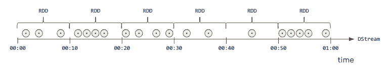

# 第十七章：Spark Streaming 编程模型

在第十六章中，您学习了 Spark Streaming 的核心抽象——DStream，以及它如何将微批执行模型与函数式编程 API 融合，以提供 Spark 上流处理的完整基础。

在本章中，我们探索了 DStream 抽象提供的 API，该 API 允许以流式方式实现任意复杂的业务逻辑。从 API 的角度来看，DStreams 将他们的大部分工作委托给 Spark 中的底层数据结构——弹性分布式数据集（RDD）。在我们深入了解 DStream API 的细节之前，我们将快速浏览 RDD 抽象。理解 RDD 的概念和 API 对理解 DStreams 的工作方式至关重要。

# RDD 作为 DStreams 的基础抽象

Spark 在其 API 和库中只有一个数据结构作为基本元素：RDD。这是一个多态集合，表示一袋元素，其中要分析的数据表示为任意 Scala 类型。数据集分布在集群的执行器上，并使用这些机器进行处理。

###### 注意

自引入 Spark SQL 以来，`DataFrame`和`Dataset`抽象已成为推荐的 Spark 编程接口。在最新版本中，只有库程序员需要了解 RDD API 及其运行时。尽管在接口级别上很少看到 RDD，但它们仍驱动核心引擎的分布式计算能力。

要理解 Spark 的工作原理，强烈建议掌握 RDD 级别编程的基本知识。在接下来的章节中，我们仅涵盖最显著的元素。如果想更深入地了解 RDD 编程模型，请参考[[Karau2015]](app01.xhtml#Karau2015)。

在使用这些 RDD 时，主要是在 RDD 集合类型上调用函数。该 API 中的函数是高阶函数。从这个意义上讲，使用 Spark 编程核心涉及到函数式编程：实际上，当一个编程语言能够在任何地方定义函数时，它被认为是函数式的：作为参数、作为变量，或更一般地作为语法元素。但更重要的是，在编程语言理论层面上，只有当它能够将函数作为参数传递时，一个语言才成为函数式编程语言。在接下来的示例中，我们将看到 Spark 如何让你使用`map`的实现来通过将任意函数应用于每个单独元素来转换集合的所有值。

在以下示例中，我们读取一个包含人口普查数据中频繁姓氏的文本文件作为`RDD[String]`（读作*字符串的 RDD*）。然后，我们使用`map`操作获取这些名字的长度，该操作将初始名称表示为`String`并转换为其长度：

```
scala> val names = sc.textFile("/home/learning-spark-streaming/names.txt")
names: org.apache.spark.rdd.RDD[String] =
      MapPartitionsRDD[1] at textFile at <console>:24
scala> names.take(10)
res0: Array[String] =
      Array(smith, johnson, williams, jones, brown, davis, miller,
            wilson, moore, taylor)
scala> val lengths = names.map(str => str.length )
lengths: org.apache.spark.rdd.RDD[Int] =
      MapPartitionsRDD[3] at map at <console>:27
scala> lengths.take(10)
res3: Array[Int] = Array(6, 6, 6, 8, 9, 7, 7, 7, 6, 6)
```

Spark 还为我们提供了 `reduce` 函数，它允许我们将集合的关键元素聚合成另一个结果，通过迭代组合获得。我们还将使用 `count` 操作，它计算 RDD 中元素的数量。让我们来看一下：

```
scala> val totalLength = lengths.reduce( (acc, newValue) => acc + newValue )
totalLength: Int = 606623
scala> val count = lengths.count()
count: Int = 88799
scala> val average = totalLength.toDouble / count
average: Double = 6.831417020461942
```

值得注意的是，`reduce` 要求 RDD 不为空。否则，它会抛出 `java.lang.UnsupportedOperationException` 异常，并显示消息：`empty collection`。虽然我们讨论的是处理大型数据集，这似乎是个极端情况，但在我们想要实时处理传入数据时，这变得必要。

为了克服这个限制，我们可以使用 `fold`，这是一个类似于 `reduce` 的聚合器。除了减少函数，`fold` 还允许我们定义一个初始的“零”元素，以便与聚合函数一起正常工作，即使 RDD 为空。

`fold` 和 `reduce` 都使用了一个封闭于 RDD 类型的聚合函数。因此，我们可以对 `Int` 类型的 RDD 进行求和，或者根据度量计算 RDD 的笛卡尔坐标的 `min` 或 `max`。有些情况下，我们希望返回与 RDD 所表示的数据类型不同的类型。更一般的 `aggregate` 函数让你确定如何在中间步骤中组合不同的输入和输出类型：

```
scala> names.aggregate[TAB]
def aggregateU
 (seqOp: (U, T) => U, combOp: (U, U) => U)(implicit scala.reflect.ClassTag[U]): U

scala> names.fold[TAB]
   def fold(zeroValue: T)(op: (T, T) => T): T
```

此 API 的易用性使得 Spark RDD 被赋予了“*终极 Scala 集合*”的绰号。这个提到 Spark 原始实现编程语言的引用指向 Scala 的集合库，该库已经让我们能够在单台机器上享受到丰富 API 的函数式编程。它让我们可以从最初的 MapReduce 模型的基本 `map` 和 `reduce` 扩展我们的数据处理词汇。

Spark 的真正的天才之处在于，它复制了 Scala API 的易用性，并将其扩展到可以在计算资源集群上运行。RDD API 定义了两类广泛的函数：转换和操作。转换，如 `map` 或 `filter`，让我们通过对其 *parent* 应用转换的结果创建新的 RDD 来处理 RDD 中包含的不可变数据。这些 RDD 转换链形成了一个指向 Spark 原始数据在哪里以及如何将其转换为期望结果的有向无环图或 DAG。所有的转换都是声明式和延迟执行的。这意味着它们不会导致数据实际被处理。要获取结果，我们需要通过发出 *action* 来实现转换链的材料化。操作触发了数据操作的分布式执行，并产生具体的结果。它可以是写入文件或在屏幕上打印样本。

还有其他的函数式操作，例如 `flatMap`、`groupBy` 和 `zip` 也是可用的。你还可以找到 RDD 的组合子，比如 `join` 和 `cogroup`，允许你合并两个或多个现有的 RDD。

# 理解 DStream 转换

DStream 编程 API 包括转换或高阶函数，这些函数以另一个函数作为参数。在 API 层面上，`DStream[T]` 是一个强类型数据结构，表示类型为 `T` 的数据流。

DStreams 是不可变的。这意味着我们不能直接在其内容中进行突变。相反，我们通过对输入 DStream 应用一系列*转换*来实现我们预期的应用逻辑。每个转换都会创建一个新的 DStream，表示从父 DStream 转换后的数据。DStream 转换是惰性的，这意味着在系统需要实现结果之前，底层数据实际上不会被处理。对于 DStreams，这个实现过程是通过触发特定操作（称为*输出操作*）来产生结果到流式汇中。

###### 注意

对于来自函数式编程背景的读者，显然可以将 DStream 转换视为纯函数，而输出操作则是产生结果到外部系统的具有副作用的函数。

让我们使用我们在介绍中早期使用的代码来复习这些概念：

```
val errorLabelStream = textDStream.map{ line =>
    if (line.contains("ERROR")) (1, 1) else (0, 1)
  }
```

这里，`textDStream` 包含文本行。使用 `map` 转换，我们对原始的 `DStream[String]` 中的每一行应用一个相当朴素的错误计数函数，结果得到一个新的 `DStream[(Long, Long)]`，包含 `long` 元组。在这种情况下，`map` 是一个 DStream 转换，它接受一个可应用于其内容的函数，本例中是 `String`，以产生另一个转换后的 DStream。

DStreams 是一种流抽象，其中流的元素在时间维度上被分组为微批次，正如我们在 图 17-1 中展示的那样。每个微批次由一个 RDD 表示。在执行层面上，Spark Streaming 的主要任务是调度和管理数据块的及时收集和传递给 Spark。然后，Spark 核心引擎将应用程序逻辑中的编程操作序列应用于数据。



###### 图 17-1\. 映射到 Spark Streaming 上的流模型

回到如何在 API 中反映这一点，我们看到有像经典的 `map`、`filter` 等操作符，这些操作符作用于单个元素。这些操作遵循分布式执行的相同原则，并且遵循批量 Spark 对应项的相同序列化约束。

还有一些操作符，如`transform`和`foreachRDD`，它们操作的是 RDD 而不是单个元素。这些操作符由 Spark Streaming 调度器执行，并且提供给它们的函数在驱动程序的上下文中运行。在这些操作符的范围内，我们可以实现跨微批次边界的逻辑，如历史记录或维护应用程序级计数器。它们还提供对所有 Spark 执行上下文的访问。在这些操作符内部，我们可以与 Spark SQL、Spark ML 甚至管理流应用程序的生命周期进行交互。这些操作是重复流微批次调度、元素级转换和 Spark 运行时上下文之间真正的桥梁。

使用这种区分，我们可以观察到两种广义上的转换组：

以元素为中心的 DStream 转换

应用于流的单个元素的转换。

以 RDD 为中心的 DStream 转换。

适用于每个微批次的基础 RDD 的转换。

除了这一般分类外，我们还发现 DStream API 中的另外两类转换：

计数转换

专门的操作来统计流中的元素。

修改结构的转换

改变 DStream 的内部结构或组织但不改变内容的转换。

在本章的其余部分，我们详细研究这些转换。

# 以元素为中心的 DStream 转换

一般来说，DStream API 上的以元素为中心的转换与 RDD API 中同样可用的函数相对应，统一了 Spark 中批处理和流处理模式的开发体验。

最常用的转换如下所示：

###### 注意

每个转换的签名都已经简化，去掉了隐式参数，以使签名更加简洁，适用时。

`map`

```
  mapU => U): DStream[U]

```

在 DStream 上的`map`函数接受一个函数`T => U`并将其应用于`DStream[T]`的每个元素，保持 RDD 结构不变。与 RDD 类似，它是进行大规模并行操作的适当选择，对于它的输入是否与数据的其余部分在特定位置上没有关系。

`flatMap`

```
  flatMapU => TraversableOnce[U]): DStream[U]

```

`flatMap`通常是`map`的伴侣，它不返回类型为`U`的元素，而是返回`TraversableOnce`容器类型的元素。这些容器在返回之前会合并成一个单一的容器。所有 Scala 集合都实现了`TraversableOnce`接口，使它们都可以作为此函数的目标类型使用。

`flatMap`的常见用例是当我们希望从单个元素创建零个或多个目标元素时。我们可以使用`flatMap`将记录展开为多个元素，或者与`Option`类型结合使用时，可以用它来过滤不符合某些条件的输入记录。

一个重要的备注是，这个版本的`flatMap`不遵循严格的单子定义，其定义应该是：`flatMapU => DStream[U]): DStream[U]`。这经常会让有函数编程背景的新手感到困惑。

`mapPartitions`

```
  mapPartitionsU => Iterator[U],
                   preservePartitioning: Boolean = false): DStream[U]

```

这个函数与 RDD 上定义的同名函数类似，允许我们直接在 RDD 的每个分区上应用`map`操作。结果是一个新的`DStream[U]`，其中的元素被映射。与 RDD 上定义的`mapPartitions`调用一样，这个函数非常有用，因为它允许我们具有执行器特定的行为；即，某些逻辑不会为每个元素重复执行，而是每个处理数据的执行器执行一次。

一个经典的例子是初始化一个随机数生成器，然后在每个分区的处理中使用，可以通过`Iterator[T]`访问。另一个有用的情况是分摊昂贵资源的创建成本，例如服务器或数据库连接，并重复使用这些资源来处理每个输入元素。另一个优点是初始化代码直接在执行器上运行，使我们能够在分布式计算过程中使用不可序列化的库。

`filter`

```
filter(filterFunc: (T) => Boolean): DStream[T]

```

此函数根据作为参数传递的谓词选择 DStream 的一些元素。与`map`一样，谓词在 DStream 的每个元素上都被检查。请注意，如果在特定批处理间隔期间未接收到验证谓词的元素，则可能生成空 RDD。

`glom`

```
glom(): DStream[Array[T]]

```

这个函数与 RDD 上定义的同名函数类似，允许我们合并数组中的元素。实际上，作为 RDD 上`glom`调用的结果返回元素数组（与分区数相同），DStream 的等效函数返回对其每个组成 RDD 调用`glom`函数的结果。

`reduce`

```
  reduce(reduceFunc: (T, T) => T): DStream[T]

```

这是 RDD 上`reduce`函数的等效版本。它允许我们使用提供的聚合函数聚合 RDD 的元素。`reduce`接受两个参数的函数，*累加器*和 RDD 的新元素，并返回累加器的新值。因此，将`reduce`应用于`DStream[T]`的结果是相同类型`T`的 DStream，每个`批处理间隔`将包含仅一个元素的 RDD：累加器的最终值。特别需要注意的是，使用`reduce`时应谨慎：它不能单独处理空 RDD，在流应用程序中，始终可能发生空数据批次，例如数据生产或摄取停滞时。

我们可以根据这些不同的转换方式进行总结，根据它们对源 DStream 的操作类型。在 Table 17-1 中，我们可以看到是否有任何操作作用于整个 RDD 而不是逐个元素，以及它是否对输出 RDD 有约束。

表 17-1\. 一些关键的 DStream 操作的计算模型和输出

| 操作 | 效果 | 输出 RDD 的结构 |
| --- | --- | --- |
| `map` ,`filter` | 逐元素 | 未改变（与原始元素数量相同） |
| `glom` | 按分区 | 与原始分区数相同的数组 |
| `mapPartitions` | 按分区 | 与原始 RDD 相同数量的分区 |
| `reduce` ,`fold` | 聚合 | 一个元素 |
| `flatMap` | 逐元素 | 输出容器的大小个元素 |

# 基于 RDD 的 DStream 转换

这些操作让我们直接访问 `DStream` 的底层 RDD。这些操作之所以特殊，是因为它们在 Spark 驱动程序的上下文中执行。因此，我们可以访问由 Spark Session（或 Spark context）提供的功能，以及驱动程序程序的执行上下文。在这个本地执行环境中，我们可以访问局部变量、数据存储或 API 调用外部服务，这可能会影响您希望处理数据的方式。

最常用的转换如下：

`transform`

```
transformU => RDD[U]): DStream[U]
transformU => RDD[U]): DStream[U]

```

`transform` 允许我们重用一个类型为 `RDD[T] => RDD[U]` 的转换函数，并将其应用于 DStream 的每个组成 RDD。它通常用于利用为批处理作业编写的一些处理，或更简单地在另一个上下文中，产生一个流处理过程。

`transform` 也有一个定时版本，签名为 `(RDD[T], Time) => RDD[U]`。正如我们将很快在 `foreachRDD` 操作中提到的，这对于将 DStream 中的数据与其所属批次的时间标记起来非常有用。

`transformWith`

```
transformWithU,V => RDD[V]
): DStream[V]
transformWithU,V => RDD[V]
): DStream[V]

```

`transformWith` 让我们可以使用任意转换函数将该 DStream 与另一个 DStream 结合起来。我们可以用它来实现两个 DStream 之间的自定义 `join` 函数，其中 `join` 函数不基于键。例如，我们可以应用一个相似性函数，并组合那些足够“接近”的元素。与 `transform` 类似，`transformWith` 提供了一个重载，提供对批次时间的访问，以提供一个时间戳机制的不同化入口数据。

# 计数

因为流的内容通常包含重要的基数数据，例如计算日志中的错误数量或推文中的哈希标签，因此计数是一个频繁操作，在 Spark 中已经被优化到足以支持特定的 API 函数。

有趣的是，尽管 `count` 在 RDD API 中是一个具有物化操作的函数，因为它直接产生一个结果，在 `DStream` API 中，它是一个转换操作，生成一个新的 `DStream`，其每个微批次间隔都带有计数。

Spark Streaming 为给定的 `DStream` 提供了几个计数函数，最好通过示例来理解。

假设我们有一个由名字按其首字母键控的 DStream，并且该 DStream “重复”自己：每个 RDD，在每个批次间隔中，由每个字母的 10 个不同名字组成：

```
val namesRDD: RDD[(Char, String)] = ...
val keyedNames: DStream[(Char, String)] =
    ConstantInputDStream(namesRDD, 5s)
```

这将导致 表 17-2 中显示的结果。

表 17-2\. 计数操作

| 操作 | 返回类型 | 结果 |
| --- | --- | --- |
| `keyedNames.count()` | `DStream[Long]` | 260 |
| `keyedNames.countByWindow(60s)` | `DStream[Long]` | 因为相同的 `RDD` 每次都重复，所以为 260 |
| `keyedNames.countByValue()` | `DStream[((Char, String), Long)]` | 每个 260 个不同的（第一个字符，名称）对分别为 1 |
| `keyedNames.countByKey()` | `DStream[(Char, Long)]` | 每个 26 个字母分别为 10 |
| `keyednames.countByValueAndWindow(60s)` | `DStream[((Char, String), Long)]` | 每个 260 个不同的（第一个字符，名称）对分别为 12 |

# 改变结构的转换操作

前面的操作都是转换操作；也就是说，它们在将函数应用于流的内容后始终返回一个 DStream。还有其他一些不会转换流中数据，而是转换 DStream 结构以及在某些情况下通过 Spark 集群的数据流动：

`repartition`

```
repartition(int numPartitions): DStream[T]

```

`repartition` 会生成一个具有增加或减少底层 RDD 中分区的新 DStream。重新分区允许我们改变某些流计算的并行特性。例如，当少量输入流提供大量数据时，我们可能希望将其分发到一个大集群进行一些 CPU 密集型计算时增加分区。减少分区可能在写入数据库之前确保有少量分区有大量元素时很有用。注意，提供的参数是目标分区数量的绝对数。此操作是否会增加或减少分区取决于该 DStream 的原始分区数量，而原始分区数量又可能依赖于源的并行性。

与面向数据的转换不同，正确使用 `repartition` 需要了解输入并行性、分布式计算的复杂性以及流作业将运行的集群大小。

`union`

```
union(other: DStream[T]): DStream[T]

```

`union` 将两个相同类型的 DStreams 合并为一个流。结果是一个 DStream，其中包含两个输入 DStreams 中找到的元素。另一种用法是在 `streamingContext` 实例上调用 `union` 并传入一组要连接的 DStreams。这种形式允许我们一次性合并多个 DStreams：

```
unionT: DStream[T]
```

# 总结

在本章中，我们学习了 DStream 提供的 API，以实现流应用程序。我们看到了以下内容：

+   DStreams 是不可变的，我们通过转换操作来操作它们。

+   转换是惰性的。它们需要通过特殊的输出操作来实现物化。

+   DStreams 提供了丰富的函数 API，允许对元素进行转换。

+   一些转换会暴露底层的 RDD，从而提供对丰富的 Spark 核心 API 的全面访问。

在接下来的章节中，您将学习如何通过创建 DStreams 从外部系统获取数据。您还将了解到一组特定的操作，在 Spark Streaming 行话中称为输出操作，这些操作触发对我们数据流的转换执行，并能够将数据生成到其他系统或者辅助存储中。
