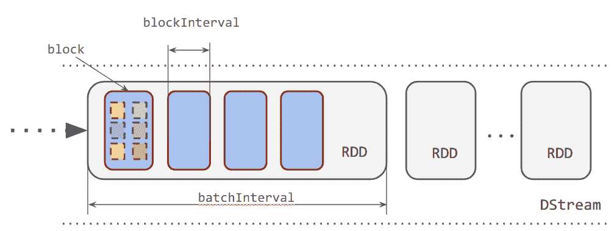
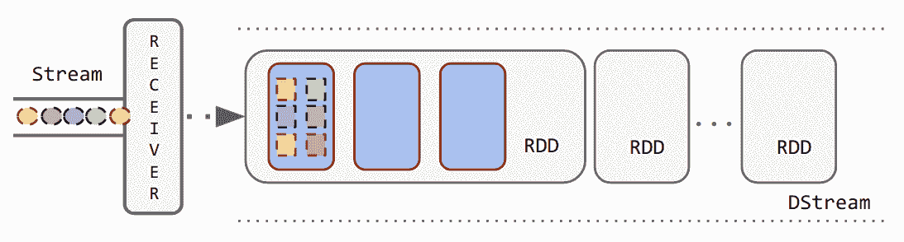
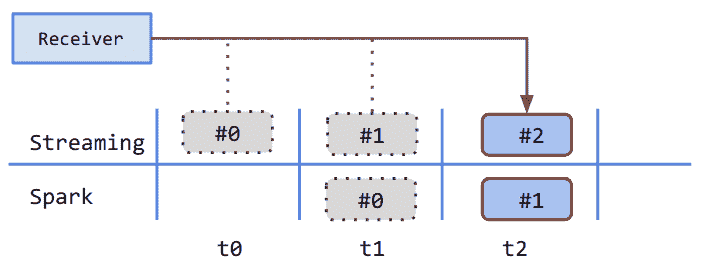
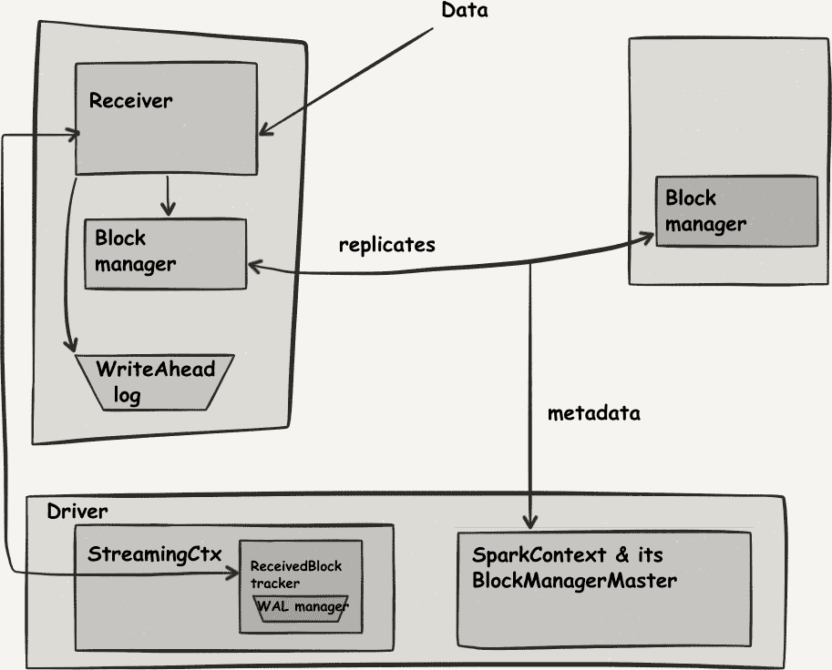
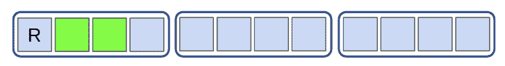
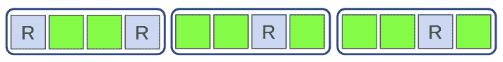

# 第十八章：Spark Streaming 执行模型

当我们在第十六章开始我们的 Spark Streaming 之旅时，我们讨论了 DStream 抽象体现了这个流 API 提供的编程和操作模型。在了解了第十七章中的编程模型之后，我们准备理解 Spark Streaming 运行时背后的执行模型。

在本章中，您将了解批处理同步架构以及它如何为我们提供一个微批处理流模型的推理框架。然后，我们探讨了 Spark Streaming 如何使用接收器模型消费数据以及这种模型在数据处理可靠性方面提供的保证。最后，我们探讨了直接 API 作为传送流数据提供者的替代方法，该方法能够提供可靠的数据传输。

# 批处理同步架构

在第五章中，我们讨论了*批处理同步并行*或*BSP*模型作为一个理论框架，允许我们推理如何在流的微批处理数据上进行分布式流处理。

Spark Streaming 遵循类似于批处理同步并行的处理模型：

+   假定集群上的所有 Spark 执行器都有同步时钟；例如，通过网络时间协议（NTP）服务器同步。

+   对于基于接收器的数据源，一个或多个执行器运行一个特殊的 Spark 作业，一个*接收器*。这个接收器负责消费流的新元素。它接收两个时钟周期：

    +   最频繁的时钟周期被称为*块间隔*。它标志着从流接收的元素应该分配到一个块中；也就是说，应该由单个执行器处理的流的部分，对于当前间隔。每个这样的块成为每个批处理间隔产生的 Resilient Distributed Dataset（RDD）的一个分区。

    +   第二个更少频繁的是*批处理间隔*。它标记着接收器应该在上一个时钟周期以来收集的流数据装配到一起，并为集群上的分布式处理生成一个 RDD。

+   在使用直接方法时，只有批处理间隔的时钟周期是相关的。

+   在所有处理过程中，与常规（批处理）Spark 作业一样，块被传递给块管理器，该组件确保放入 Spark 的任何数据块根据配置的持久性级别进行复制，以实现容错性。

+   每个批处理间隔，上一个批处理间隔接收数据的 RDD 变得可用，并因此计划在本批处理期间进行处理。

图 18-1 展示了这些元素如何在概念上形成一个 DStream。



###### 图 18-1。DStream 结构：块和批次

为了实现与严格的批量同步模型并发执行，这里的障碍是在批处理间隔到达新的*RDD*。但是在 Spark Streaming 中，这实际上并不是障碍，因为数据传递独立于集群在新批处理到达时的状态：Spark 的接收器不会等待集群完成接收数据才开始新批处理。

这不是设计上的错误；相反，这是 Spark Streaming 试图以最诚实的方式进行实时流处理的结果：尽管具有微批处理模型，但 Spark Streaming 承认流没有预定义的结束，并且系统需要持续接收数据。

这种相对简单模型的结果是，负责接收数据的 Spark Streaming 作业——接收器——需要作为集群中定期工作的作业进行调度。如果它崩溃，将在另一个执行程序上重新启动，继续数据的摄取而无需进一步中断。

# 接收器模型

正如我们之前暗示的，在 Spark Streaming 中，接收器是能够连续从输入流中收集数据的进程，而不考虑 Spark 集群处理状态的过程。

该组件是流源提供的数据与 Spark Streaming 数据处理引擎之间的适配器。作为适配器，它实现了外部流的特定 API 和语义，并使用内部契约传递该数据。图 18-2 展示了 DStream 数据流中接收器的角色。



###### 图 18-2\. 接收器模型

## 接收器 API

最基本的接收器包括三种方法：

`def onStart()`

启动来自外部源的数据接收。在实践中，`onStart`应异步启动入站数据收集过程并立即返回。

`def store(...)`

将一个或多个数据元素传递给 Spark Streaming。每当有新数据可用时，必须从`onStart`启动的异步过程中调用`store`。

`def stop(...)`

停止接收过程。`stop`必须负责正确清理`onStart`启动的接收过程使用的任何资源。

该模型提供了一个通用接口，可以实现集成各种流数据提供者。注意通用性如何抽象出流系统的数据传递方法。我们可以实现一个始终连接的基于推送的接收器，如 TCP 客户端套接字，以及基于请求的拉取连接器，如与某些系统的 REST/HTTP 连接器。

## 接收器工作原理

接收器的任务是从流数据源收集数据并将其传递给 Spark Streaming。直观来说，这很容易理解：随着数据的到来，它们在批处理间隔的时间内被收集并打包成数据块。一旦完成每个批处理间隔时间段，收集的数据块就会交给 Spark 进行处理。

图 18-3 描述了这个事件序列的时间安排。在流处理过程开始时，接收器开始收集数据。在*t0*间隔结束时，第一个收集的块`#0`被传递给 Spark 进行处理。在时间*t2*时，Spark 正在处理在*t1*收集的数据块，而接收器正在收集对应于块`#2`的数据。



###### 图 18-3\. 接收器的操作

我们可以总结说，在任何时间点，Spark 正在处理上一个数据批次，而接收器正在收集当前间隔的数据。在 Spark 处理完一个批次（如图 18-3 中的`#0`）后，它可以被清理。RDD 将被清理的时间由 `spark.cleaner.ttl` 设置决定。

## 接收器的数据流

图 18-4 描述了这种情况下 Spark 应用程序的数据流。



###### 图 18-4\. Spark 接收器的数据流

在这个图中，我们可以看到数据摄入作为一个作业发生，它被转化为一个执行器上的单个任务。此任务处理与数据源的连接并启动数据传输。它由 Spark Context 管理，这是驱动器机器内的一个簿记对象。

在每个块间隔周期（在运行接收器的执行器上测量），这台机器将收到的上一个块间隔的数据分组成一个块。然后将这个块注册给 Block Manager，也存在于 Spark Context 的簿记中，驱动器上。此过程启动了数据复制，以确保 Spark Streaming 中的源数据按照存储级别指示的次数进行复制。

在每个批处理间隔周期（在驱动程序上测量），驱动程序会将接收到的上一个批处理间隔的数据进行分组，已正确复制的数据封装为一个 RDD。Spark 会将这个 RDD 注册给作业调度程序，从而启动对该特定 RDD 的作业调度——事实上，Spark Streaming 微批处理模型的整个核心在于重复调度用户定义的程序来处理连续的批处理 RDD 数据。

## 内部数据的弹性

接收器是独立的作业这一事实具有后果，特别是对于资源使用和数据传递语义。为执行其数据收集作业，接收器在执行器上消耗一个核心，无论需要做多少工作。因此，使用单个流接收器将导致数据摄取由执行器中的单个核心按顺序完成，这成为限制 Spark Streaming 可以摄取数据量的因素。

Spark 的复制基本单元是块：任何块可以位于一个或多个机器上（最多达到配置中指定的持久性级别，因此默认情况下最多为两个），只有当块达到该持久性级别时，它才能被处理。因此，只有当 RDD 的每个块都复制了，它才能被考虑用于作业调度。

在 Spark 引擎端，每个块都成为 RDD 的一个分区。数据分区和应用于数据的工作的组合成为一个任务。通常每个任务可以并行处理，通常在包含数据的执行器上本地处理。因此，我们可以期望从单个接收器获取的 RDD 的并行性水平正好是批处理间隔与块间隔的比率，如 Equation 18-1 中定义的那样。

##### Equation 18-1\. 单接收器分区

<math alttext="numberpartitions equals StartFraction batchinterval Over blockinterval EndFraction" display="block"><mrow><mtext>numberpartitions</mtext> <mo>=</mo> <mfrac><mtext>batchinterval</mtext> <mtext>blockinterval</mtext></mfrac></mrow></math>

在 Spark 中，任务并行性的通常经验法则是将任务数与可用执行器核心数的比率设置为两到三倍。对于我们的讨论，我们应该将块间隔设置为 Equation 18-2 中所示的值的三倍。

##### Equation 18-2\. 块间隔调整

<math alttext="blockinterval equals StartFraction batchinterval Over 3 asterisk Sparkcores EndFraction" display="block"><mrow><mtext>blockinterval</mtext> <mo>=</mo> <mfrac><mtext>batchinterval</mtext> <mrow><mn>3</mn><mo>*</mo><mtext>Sparkcores</mtext></mrow></mfrac></mrow></math>

## 接收器并行性

我们提到单个接收器将成为 Spark Streaming 可以处理的数据量的限制因素。

增加数据吞吐量的一个简单方法是在代码级别声明更多的 DStreams。每个 DStream 将附加到其自己的消费者上——因此每个消费者将在集群上消耗自己的核心。DStream 操作 `union` 允许我们合并这些流，确保我们从各个输入流产生单一的数据流水线。

假设我们并行创建 DStreams 并将它们放在一个序列中：

```
val inputDstreams: Seq[DStream[(K,V)]] = Seq.fill(parallelism: Int) {
... // the input Stream creation function
}
val joinedStream  = ssc.union(inputDstreams)
```

###### 警告

创建的 DStreams 的`union`非常重要，因为这样可以将输入 DStream 的转换流水线数量减少到一个。如果不这样做，会导致阶段数量乘以消费者数量，从而造成不必要的开销。

通过这种方式，我们可以利用接收器并行性，这里用并行创建的 DStreams 的 `#parallelism` 因子来表示。

## 平衡资源：接收器与处理核心

每个创建的接收器在集群中消耗自己的核心，增加消费者并行性对于可用于集群处理的核心数有影响。

假设我们有一个 12 核心的集群，我们希望将其专用于我们的流分析应用程序。当使用单个接收器时，我们使用一个核心用于接收和九个核心用于处理数据。集群可能会未充分利用，因为单个接收器可能无法接收足够的数据以利用所有可用的处理核心。图 18-5 说明了这种情况，其中绿色节点用于处理，灰色节点保持空闲。



###### 图 18-5\. 单接收器分配

为了提高集群利用率，我们增加接收器的数量，正如我们刚才讨论的那样。在我们的假设场景中，使用四个接收器为我们提供了更好的资源分配，如图 18-6 所示。



###### 图 18-6\. 多接收器分配

批处理间隔由分析需求确定并保持不变。那么，块间隔应该是多少呢？嗯，同时并行摄取的四个 DStreams 必然会在每个块间隔内创建四倍于单个 DStream 的块数。因此，对于相同的块间隔，联合 DStream 的分区数将是原始情况的四倍。因此，我们不能使用相同的块间隔。相反，我们应该使用以下方案：

<math alttext="blockinterval equals StartFraction 4 asterisk batchinterval Over 3 asterisk Sparkcores EndFraction" display="block"><mrow><mtext>blockinterval</mtext> <mo>=</mo> <mfrac><mrow><mn>4</mn><mo>*</mo><mtext>batchinterval</mtext></mrow> <mrow><mn>3</mn><mo>*</mo><mtext>Sparkcores</mtext></mrow></mfrac></mrow></math>

因为我们希望*至少*有三个分区，所以我们将这个数字*向下*舍入到最近的毫秒数。

一般来说，根据任意一组特征，我们应该采用以下方法：

<math alttext="blockinterval equals StartFraction receivers asterisk batchinterval Over partitionspercore asterisk Sparkcores EndFraction" display="block"><mrow><mtext>blockinterval</mtext> <mo>=</mo> <mfrac><mrow><mtext>receivers</mtext><mo>*</mo><mtext>batchinterval</mtext></mrow> <mrow><mtext>partitionspercore</mtext><mo>*</mo><mtext>Sparkcores</mtext></mrow></mfrac></mrow></math>

系统中使用的总核心数如下所示：

<math><mtext>总系统核心数</mtext><mo>=</mo><mtext>接收器数</mtext><mo>+</mo><mtext>Spark 核心数</mtext></math>

## 通过预先写日志（WAL）实现零数据丢失

在 Spark v1.2 之前的原始接收器设计存在重大设计缺陷。当接收器为当前块收集数据时，该数据仅存储在接收器进程的内存缓冲区中。只有在块完成并交付后，数据才会在集群中复制。如果接收器失败，缓冲区中的数据将丢失且无法恢复，导致数据丢失。

为了防止数据丢失，接收器收集的数据会额外追加到可靠文件系统上的日志文件中。这被称为预先写日志（WAL），这是数据库设计中常用的组件，用于保证可靠和持久的数据接收。

WAL 是一个仅追加的结构，在数据传送进行处理之前将其写入。当已知数据正确处理时，其日志条目标记为已处理。在数据库世界中，等效的过程是事务提交，其中涉及的数据使得该日志也称为*提交日志*。

在失败情况下，从 WAL 中回放数据，从最后一个注册提交之后的记录开始，以补偿接收器可能的数据丢失。WAL 和接收器的组合被称为可靠接收器。基于可靠接收器模型的流式数据源被称为*可靠数据源*。

### 启用 WAL

要启用基于 WAL 的数据传递以确保零数据丢失，我们需要应用以下设置：

`streamingContext.checkpoint(dir)`

此目录用于检查点和预写日志。

`spark.streaming.receiver.writeAheadLog.enable`（默认值：`false`）

设置为 `true` 以启用预写日志过程。

请注意，由于写入日志的工作量增加，流作业的总吞吐量可能会降低，而总资源使用量可能会增加。由于 WAL 写入可靠的文件系统，该文件系统的基础设施需要足够的资源来接受对日志的连续写入流，包括存储和处理能力。

# 无接收器或直接模型

Spark Streaming 致力于成为一个通用的流处理框架。在这个前提下，接收器模型提供了一个通用的、与数据源无关的合约，使得可以集成任何流式数据源。但是一些数据源允许直接消费模型，其中接收器作为数据传递过程中的中介变得不再必要。

Kafka 作为 Spark Streaming 作业的流后端越来越受欢迎，因此引起了额外的关注。在前一节中，我们了解到 WAL 作为解决接收器模型在面对故障时实现零数据丢失的解决方案。

Kafka 的核心是分布式提交日志的实现。当实现了 Kafka 的可靠接收器后，发现使用 WAL（写前日志）只是在重复 Kafka 已有的功能。此外，从 Kafka 消费数据到接收器甚至是不必要的。让我们回顾一下，接收器通过在 Spark 内存中复制块来处理数据冗余。Kafka 已经通过数据复制来保证数据可靠性，并提供了等效的数据耐久性保证。要从 Kafka 消费数据，只需跟踪已处理数据的*偏移量*，并计算批次间接收到的新数据的偏移量即可。对每个分区消费使用这两个偏移量足以启动一个 Spark 作业，直接消费由这两个偏移量确定的数据段并对其进行操作。当微批处理成功时，消费的偏移量被提交。

直连器模型更像是一个管理者，而不是一个数据经纪人。其角色是计算由 Spark 处理的数据段，并维护待处理数据与已处理数据的簿记。鉴于 Kafka 高性能和低延迟的数据传递特性，这种方法比基于接收器的实现更快，且需要的资源更少。

###### 注意

对于 Kafka 的*直连*连接器的具体用法，请参阅第十九章。

# 摘要

到目前为止，我们已经看到了 Spark Streaming 执行模型的基础以及它处理流处理的基本原理：

+   流是在数据源上看到的随时间聚合的数据。在每个块间隔上，会产生一个新的数据分区并复制。在每个批次间隔（块间隔的倍数）上，生成的数据会组装成 RDD，并可以安排作业在其上运行。

+   调度由脚本中的用户定义函数完成，但也可以是某些内置功能的副产品（例如检查点）。调度本身具有固定的核心。

+   创建 DStream 的最通用方式是接收器模型，它在执行器上连接输入源创建作业，消耗一个核心。在某些情况下，通过创建多个 DStream 可以增加并行性。

+   资源分配和配置参数等因素影响流作业的整体性能，并有调整此类行为的选项。

+   启用 WAL 可以防止潜在的数据丢失，但会增加额外的资源使用。

+   对于提供高性能和持久数据传递保证的特定系统，如 Kafka，可以将接收器的责任降低到最小的簿记，以按照流系统的本机术语计算微批次间隔。这种模型称为直连模型，比将数据复制和复制到 Spark 集群内存中更节约资源且性能更高。
