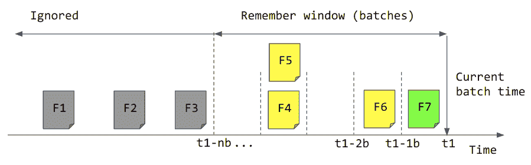

# 第十九章：Spark Streaming 数据源

正如您在 第二章 中学到的，流数据源是持续提供数据的数据提供者。在 Spark Streaming 中，*数据源*是在 Spark Streaming 作业上下文中运行的适配器，它们实现与外部流数据源的交互，并使用 DStream 抽象将数据提供给 Spark Streaming。从编程的角度来看，消费流数据源意味着使用相应源的实现创建一个 DStream。

在 “DStream 抽象” 中，我们看到了如何从网络套接字消费数据的示例。让我们在 示例 19-1 中重新访问该示例。

##### 示例 19-1\. 从套接字连接创建文本流

```
// creates a DStream using a client socket connected to the given host and port
val textDStream: DStream[String] = ssc.socketTextStream("localhost", 9876)
```

在 示例 19-1 中，我们可以看到流数据源的创建由专门的实现提供。在这种情况下，由`ssc`实例，即*流上下文*提供，结果是一个包含通过套接字传递的文本数据的`DStream[String]`。尽管每种数据源的实现方式不同，但这种模式对所有数据源都是相同的：创建一个数据源需要一个`streamingContext`，并且产生一个表示流内容的 DStream。流应用程序进一步在结果 DStream 上操作，以实现所需作业的逻辑。

# 数据源类型

作为通用的流处理框架，Spark Streaming 可以与各种流数据源集成。

根据操作模式分类，数据源有三种不同类型：

+   基础

+   基于接收器的

+   直接数据源

## 基础数据源

基本数据源由`streamingContext`本地提供。它们主要作为示例或测试数据源提供，并且不提供故障恢复语义。因此，在生产系统中不推荐使用它们。

以下是基本的数据源：

文件数据源

用于监视文件系统目录并读取新文件。文件是在系统之间传递数据的广泛机制，特别是在从基于批处理的集成模型（如数据仓库和许多数据湖实现）发展而来的系统中。

队列数据源

本地于`streamingContext`的生产者-消费者队列，可用于将数据注入到 Spark Streaming 中。通常用于测试。

我们将讨论`ConstantInputDStream`，它虽然不是官方的数据源，但它执行与*Queue*数据源类似的功能，并且使用起来更加简单。

## 基于接收器的数据源

如我们在第十八章中讨论的，接收器是 Spark Streaming 中的特殊进程，负责从流源接收数据，并以 RDD 的形式可靠地将其传递给 Spark。接收器负责实现数据传输的可靠性，即使支持的数据源不能提供此类保证。为此，它们在集群内接收并复制数据，然后才能使其可用于 Spark 进行处理。

在这一类源中，我们还有可靠的接收器，通过使用预写日志（WAL）改进数据接收保证。

从编程模型的角度来看，每个接收器都与一个单一的 DStream 相关联，该 DStream 表示其接收器传递给 Spark Streaming 应用程序的数据。

在分布式环境中扩展接收器的数量，我们创建多个 DStream 实例来消费其数据。

鉴于接收模型是最初在 Spark Streaming 中实现的原始交互模型，所有从最初版本起支持的源都作为基于接收器的源可用，尽管其中许多已被推荐使用直接源取代。最常用的接收器包括：Socket、Kafka、Kinesis、Flume 和 Twitter。

接收器 API 还允许创建自定义源。这促进了 Spark Streaming 的第三方源的增长，也让我们可以创建自己的定制源，例如连接传统企业系统。

## 直接源

正如我们之前在第十八章中讨论的，有些源（如 Kafka）本地提供强大的数据传输保证，这使得接收器模型对于这些源的数据可靠性变得无关紧要。

直接模型，也称为*无接收器模型*，是一个轻量级的控制器，负责跟踪与从相应源消费数据相关的元数据，并从中计算微批次，将实际的数据传输和处理留给核心 Spark 引擎。这一简化的流程直接依赖于流源后端的数据传输语义和 Spark 的可靠计算模型。

使用直接方法实现的最流行的数据源是 Kafka 和 Kinesis。

# 常用的数据源

鉴于 Spark Streaming 的广泛采用，有许多开源和专有的可用源。在本章的其余部分，我们将介绍 Spark 项目提供的最受欢迎的源。

我们从基本源开始，*File*和*Queue*源，因为它们非常易于使用，可以提供低门槛的入门体验，用于开始在 Spark Streaming 中开发一些示例。

在回顾了内置的基本源之后，我们转向一个基于接收器的源的例子：*socket*源，这是一个实现 TCP 客户端套接字的源，可以连接到网络端口上的 TCP 服务器并接收数据。

接下来，我们讨论 Kafka 源，鉴于 Apache Kafka 可能是当前用于构建流系统的最流行的开源事件代理。鉴于 Kafka 的广泛使用，它具有详细和最新的在线覆盖其与 Spark Streaming 集成的内容。在本讨论中，我们强调使用模式作为采用的起点。

我们在这一章中提到了 Apache Bahir，您可以在那里找到更多关于 Spark Streaming 的资源。

# 文件源

文件源监视文件系统中的给定目录，并在发现目录中的新文件时处理它们。目标文件系统必须与运行 Spark Streaming 的分布式环境兼容和可寻址。常见的存储选择是 Hadoop 分布式文件系统（HDFS）。云块存储系统，如 Simple Storage Service（Amazon S3），也得到支持，尽管需要进一步测试其对报告新文件时的行为的影响。此源非常适用于桥接传统系统，这些系统通常以文件批次的形式交付其结果。

文件源以`StreamingContext`中的专用方法形式出现。`StreamingContext`提供了几个版本，具有不断增加的配置选项。

最简单的方法用于从文件系统目录路径加载文本文件流：

```
val stream: DStream[String] = ssc.textFileStream(path)
```

类似的方法用于加载包含固定长度记录的二进制文件流：

```
val stream: DStream[Array[Byte]] = ssc.binaryRecordsStream(path, recordLength)
```

对于自定义数据格式，文件源的一般形式采用`K`作为`KeyClass`，`V`作为`ValueClass`，`F`作为`InputFormatClass`的类型。所有这些类型都使用 Hadoop API 定义，该 API 提供了许多常用类型的可用实现。结果是一个与提供的类型定义对应的 key-value 对的 DStream：

```
val stream: DStream[(K,V)] = ssc.fileStream[K,V,F] (
    directory: String,
    filter: Path => Boolean,
    newFilesOnly: Boolean,
    conf: Configuration)
```

参数如下所示：

`directory: String`

要监视的新文件目录。

`filter: Path => Boolean`

用于评估要处理的文件的谓词。选择仅`.log`文件的过滤谓词示例如下：

```
filter = (p:Path) => p.getFileName.toString.endsWith(".log")
```

`newFilesOnly: Boolean`

用于指示在流处理开始时是否应考虑监视目录中的现有文件的标志。当`newFilesOnly`为`true`时，将根据示例中指定的时间规则考虑目录中存在的文件。当为`false`时，将选择作业开始时在监视文件夹中存在的所有文件进行处理。

`conf: Configuration`

这是一个 Hadoop 配置实例。我们可以使用它来设置特定行为，如行尾字符或特定存储提供程序的凭据。例如，我们可以手动指定一个实现提供程序和凭据，以访问给定的 Amazon S3 存储桶，如下所示：

```
val s3Conf = new Configuration()
s3Conf.set("fs.s3.impl","org.apache.hadoop.fs.s3native.NativeS3FileSystem")
s3Conf.set("fs.s3.awsAccessKeyId",awsAccessKeyId)
s3Conf.set("fs.s3.awsSecretAccessKey", awsSecretAccessKey)

val stream = ssc.fileStream[K,V,F] (directory, filter, newFilesOnly, s3Conf)
```

## 工作原理

每个批次间隔时，文件源会检查监视目录的列表。所有在目录中找到的新文件都会被选中进行处理，作为 RDD 读取，并交给 Spark 进行处理。

文件源如何定义新文件值得特别关注：

+   每个批次间隔时，会评估目录列表。

+   文件的年龄由其最后修改时间戳确定。

+   在处理窗口间隔内具有修改时间戳的文件被视为待处理的文件，并添加到已处理文件列表中。

+   已处理的文件会在处理窗口间隔的长度内被记忆，这样已经处理过的文件就不会再次被选择。

+   超过处理窗口间隔的文件会被忽略。如果文件之前已经被记忆，则会从*记忆*列表中移除，并变为*遗忘*。我们在图 19-1 中展示了这个过程。


###### 图 19-1\. Spark Streaming 文件源在 t0 时的记忆窗口

让我们更仔细地研究图 19-1 中发生的情况：

+   当前批次时间被标记为 *t0*。

+   记忆窗口由 *n* 个微批次组成。

+   文件 F1 和 F2 处于*忽略*区域。它们可能在过去已经处理过，但是 Spark Streaming 并不知情。

+   文件 F3 和 F4 已经被处理，并且目前还在记忆中。

+   文件 F5 和 F6 是新文件。它们被选中进行处理，并包含在记忆列表中。

当时间推进到下一个批次间隔时，如图 19-2 所示，我们可以观察到 F3 已经变老并成为忽略列表的一部分。新文件 F7 被选中进行处理，并包含在记忆列表中。



###### 图 19-2\. Spark Streaming 文件源在 t1 时的记忆窗口

只要 Spark Streaming 进程运行，此过程就会持续下去。我们可以通过设置 `spark.streaming.minRememberDuration` 来配置记忆窗口的长度，默认为 60 秒。需要注意的是，此过程假定文件系统时钟与运行 Spark Streaming 作业的执行器时钟是同步的。

记忆窗口以微批次的形式计算。尽管配置参数 `spark.streaming.minRememberDuration` 提供了时间间隔，实际窗口将计算为 `ceiling(remember_duration/batch_interval)`。

例如，使用默认的记忆持续时间 60 秒和批次间隔 45 秒，记忆批次的数量将为 `ceil(60/45) = 2`。这意味着记忆期的实际持续时间为 90 秒。

###### 警告

File source 不提供任何数据可靠性保证。在使用 File source 的流处理进程重新启动时，恢复语义将基于时钟时间和 Figure 19-2 中记忆窗口的动态。这意味着快速恢复可能会导致重复记录，因为已处理的文件再次符合条件；而如果恢复时间较长，未处理的文件可能会超过记忆窗口的点而变得无效，导致数据丢失。

对于稳健的基于文件的流集成，我们建议使用结构化流和其 File source。

# Queue Source

Queue source 是一个程序化的数据源。它不接收来自外部系统的数据。相反，它提供一个生产者-消费者队列，允许创建作为消费者的 DStream，并可以从进程内部作为生产者提供数据。

作为基本数据源，Queue source 由 `streamingContext` 实例提供：

```
// ssc is an instance of SparkContext
val queueStream: InputDStream[T] = queueStreamT
```

这里是参数：

`queue: Queue[RDD[T]]`

类型为 `RDD[T]` 的 `scala.collection.mutable.Queue`。这个队列必须事先创建。它可能已经填充了数据，或者数据可以稍后推送。

`oneAtATime: Boolean`

一个标志，指示如何处理来自队列的数据。当 `oneAtATime = true` 时，每个批次间隔将从队列中取出单个 RDD 元素进行处理。当 `oneAtATime = false` 时，每个批次间隔将一次性消费队列中所有可用的 RDD 元素。

`defaultRDD: RDD[T]`

一个 RDD 实例，用于在队列为空时提供处理。这个选项可以确保在生产者独立于消费者的情况下始终有数据。当队列为空时，有一个可用的重载，省略了这个参数，此时没有数据可用。

## 工作原理

Queue source 实现了使用 `queue` 作为中介的生产者-消费者模式。程序化生产者向队列添加 RDD 数据。消费者端实现了 DStream 接口，并将数据呈现给流处理系统。

Queue source 的主要用例是为 Spark Streaming 程序创建单元测试。测试数据被准备并添加到队列中。测试执行使用与 Queue source 关联的 DStream，并根据预期进行断言。

## 使用 Queue Source 进行单元测试

例如，假设我们想测试 `streamWordCount`，这是一个流实现的著名单词计数程序，用于统计数据集中单词的实例。

单词计数的流版本可能如下所示：

```
val streamWordCount: DStream[String] => DStream[(String, Long)] = stream =>
    stream.flatMap(sentence => sentence.split(","))
          .map(word => (word.trim, 1L))
          .reduceByKey((count1: Long, count2:Long) => count1 + count2)
```

这是单词计数计算的功能性表示。请注意，我们期望以函数的参数形式而不是给定的 DStream 实现为起点。通过这种方式，我们将 DStream 实例与处理过程分离，允许我们将 `queueDStream` 作为输入。

要创建`queueDStream`，我们需要一个`queue`和一些数据，其中数据必须已经是 RDD：

```
import scala.collection.mutable.Queue
val queue = new Queue[RDD[String]]() // the mutable queue instance
val data = List(
    "Chimay, Ciney, Corsendonck, Duivel, Chimay, Corsendonck ",
    "Leffe, Ciney, Leffe, Ciney, Grimbergen, Leffe, La Chouffe, Leffe",
    "Leffe, Hapkin, Corsendonck, Leffe, Hapkin, La Chouffe, Leffe"
  )
// we create a list of RDDs, each one containing a String of words
val rdds = data.map(sentence => sparkContext.parallelize(Array(sentence)))
// we enqueue the rdds
queue.enqueue(rdds:_*)
```

有了数据和队列，我们可以创建`queueDStream`：

```
val testStream  = ssc.queueStream(queue = queue, oneAtATime = true)
```

接下来的步骤涉及一种从流输出中提取结果的方法。因为我们正在考虑使用`queues`，所以我们还使用它来捕获结果：

```
val queueOut = new Queue[Array[(String, Long)]]()
```

现在，我们准备定义我们测试的执行：

```
streamWordCount(testStream).foreachRDD(rdd => queueOut.enqueue(rdd.collect))
ssc.start()
ssc.awaitTerminationOrTimeout(3000) // 3 batch intervals of 1 second
```

最后，我们可以断言我们收到了期望的结果：

```
// first batch
assert(queueOut.dequeue.contains("Chimay" -> 2), "missing an expected element")
// second batch
assert(queueOut.dequeue.contains("Leffe" -> 4), "missing an expected element")
```

## 队列源的简单替代方法：`ConstantInputDStream`

`ConstantInputDStream`允许我们在每个批次间隔内向流提供单个 RDD 值。虽然它并非官方的*源*，但`ConstantInputDStream`提供了类似于队列源的功能，并且设置起来要容易得多。虽然队列源允许我们以编程方式向流作业提供自定义数据的微批次，但`ConstantInputDStream`允许我们提供一个将在每个批次间隔内不断重放的单个 RDD：

```
// ssc is an instance of SparkContext
val constantStream: InputDStream[T] = new ConstantInputDStreamT
```

这些是参数：

`ssc: StreamingContext`

这是当前活动的`StreamingContext`实例。

`rdd: RDD[T]`

这是每个批次间隔内要重播的 RDD。

### 它的工作原理

在创建时提供给`ConstantInputDStream`的`RDD`实例将在每个批次间隔内重新播放。这创建了一个可以用于测试目的的恒定数据源。

### `ConstantInputDStream`作为随机数据生成器

常常我们需要为测试或仿真目的生成一个随机数据集。正如我们刚学到的，`ConstantInputDStream`一次又一次地重复相同的 RDD。这种技术的关键在于函数就是值。我们不是创建数据 RDD，而是创建函数的 RDD，这些函数在每个批次间隔内评估，从而在我们的流应用程序中连续生成随机数据流。

对于这种技术，我们需要首先创建一个随机数据生成器，它是从`Unit`到我们期望类型的函数：`() => T`。在本例中，我们将生成一个传感器记录流。每个记录都是一个逗号分隔的`String`，其中包含一个`id`，一个`timestamp`和一个`value`：

```
import scala.util.Random

val maxSensorId = 1000
// random sensor Id
val sensorId: () => Int = () =>  Random.nextInt(maxSensorId)
// random sensor value
val data: () => Double = () => Random.nextDouble
// current time as timestamp in milliseconds
val timestamp: () => Long = () => System.currentTimeMillis
// Generates records with Random data, with 10% of invalid records

val recordGeneratorFunction: () => String = { () =>
   if (Random.nextDouble < 0.9) {
     Seq(sensorId().toString, timestamp(), data()).mkString(",")
   } else {
     // simulate 10% crap data as well… real world streams are seldom clean
     "!!~corrupt~^&##$"
   }
}
```

通过这个`recordGeneratorFunction`，我们可以创建一个函数的`RDD`：

```
// we assume `n` as the number of records delivered by each RDD
val n = 100
val nGenerators = Seq.fill(n)(recordGeneratorFunction)
val sensorDataGeneratorRDD = sparkContext.parallelize(nGenerators )
```

###### 注意

这种方法的理念在于，在 Scala 中，函数本身就是值。RDD 是值的集合，因此我们可以创建函数的集合。

现在，我们可以使用`sensorDataGeneratorRDD`创建我们的`ConstantInputDStream`：

```
import org.apache.spark.streaming.dstream.ConstantInputDStream
// ssc is an active streaming context
val stream: DStream[() => String] =
    new ConstantInputDStream(ssc, sensorDataGeneratorRDD)
```

注意`DStream[() => String]`的类型签名。要使值具体化，我们需要评估该函数。考虑到这种转换是 DStream 血统的一部分，它将在每个批次间隔内发生，有效地每次生成新的值：

```
val materializedValues = stream.map(generatorFunc => generatorFunc())
```

如果我们正在使用 Spark Shell，我们可以通过使用`print`输出操作并启动`streamingContext`来观察这些值：

```
materializedValues.print() // output operation
ssc.start

-------------------------------------------
Time: 1550491831000 ms
-------------------------------------------
581,1550491831012,0.22741105530053118
112,1550491831012,0.636337819187351
247,1550491831012,0.46327133256442854
!!~corrupt~^&##$
65,1550491831012,0.5154695043787045
634,1550491831012,0.8736169835370479
885,1550491831012,0.6434156134252232
764,1550491831012,0.03938150372641791
111,1550491831012,0.05571238399267886
!!~corrupt~^&##$
```

这种技术非常有用，可以在开发阶段的早期阶段获得测试数据，而无需花费时间和精力设置外部流系统。

# Socket 源

Socket 源作为一个 TCP 客户端，并实现为一个基于接收器的源，接收器进程实例化和管理 TCP 客户端连接。它连接到运行在网络位置上的 TCP 服务器，由其 `host:port` 组合标识。

Socket 源作为 `sparkContext` 的一种方法可用。其一般形式如下：

```
// ssc is an instance of SparkContext
val stream: DStream[Type] =
  ssc.socketStreamType
```

它具有以下参数：

`hostname: String`

这是要连接的服务器的网络主机。

`port: Int`

要连接的网络端口。

`converter: (InputStream) => Iterator[Type]`

能够将输入流解码为指定目标类型的函数。

`storageLevel: StorageLevel`

用于接收此源接收的数据的 `StorageLevel`。一个推荐的起点是 `StorageLevel.MEMORY_AND_DISK_SER_2`，这是其他源的通用默认值。

也有一个简化版本，用于使用 UTF-8 字符集进行文本流编码。鉴于其简易性，这种替代方案是最常用的：

```
// ssc is an instance of SparkContext
val stream: DStream[String] = ssc.socketTextStream(host, port)
```

## 工作原理

Socket 源实现为一个基于接收器的进程，负责处理套接字连接和相关逻辑以接收数据流。

Socket 源通常用作测试源。由于可以简单地使用诸如 `netcat` 等命令行实用程序创建网络服务器的简易性，因此 Socket 源已成为 Spark Streaming 可用的许多基本示例的首选源。在这种情况下，通常在同一台机器上运行客户端和服务器，因此使用 `localhost` 作为 *host* 指定的常见做法，如以下代码片段所示：

```
// ssc is an instance of SparkContext
val textStream = ssc.socketTextStream("localhost", 9876)
```

值得注意的是，仅当 Spark 运行在本地模式时，使用 `localhost` 才有效。如果 Spark 运行在集群中，则 Socket 源接收器进程将托管在任意执行程序上。因此，在集群设置中，必须正确使用 IP 地址或 DNS 名称以便 Socket 源连接到服务器。

###### 提示

Spark 项目中 Socket 源的实现位于 [SocketInputDStream.scala](http://bit.ly/2vqPRCv)，是开发自定义接收器的良好示例。

# Kafka 源

在流平台方面，Apache Kafka 是可伸缩消息代理的最受欢迎选择之一。Apache Kafka 是基于分布式提交日志抽象的高度可伸缩的分布式流平台。

Kafka 实现了发布/订阅模式：客户端（在 Kafka 术语中称为*生产者*）将数据发布到代理中。消费者使用基于拉取的订阅，这使得不同的订阅者可以以不同的速度消费可用的数据。一个订阅者可能会在数据实时可用时消费数据，而另一个可能会选择随时间取得较大的数据块；例如，当我们想要生成过去一小时数据的报告时。这种特定的行为使得 Kafka 与 Spark Streaming 非常匹配，因为它与微批处理方法互补：更长的微批处理自然会包含更多数据，并且可以增加应用程序的吞吐量，而更短的批处理间隔则会改善应用程序的延迟，但会降低吞吐量。

Kafka 源作为一个单独的库可用，需要在项目的依赖项中导入它才能使用。

对于 Spark 2.4，这是要使用的依赖关系：

```
groupId = org.apache.spark
artifactId = spark-streaming-kafka-0-10_2.11
version = 2.4.0
```

###### 警告

请注意，结构化流处理的 Kafka 集成是一个不同的库。确保您使用正确的依赖项来使用 API。

要创建 Kafka 直接流，我们在`KafkaUtils`中调用`createDirectStream`，这是此源的实现提供程序：

```
val stream: InputDStream[ConsumerRecord[K, V]] =
  KafkaUtils.createDirectStreamK, V
```

以下是类型参数：

`K`

消息键的类型。

`V`

消息值的类型。

并且这些是预期的参数：

`ssc: StreamingContext`

活动的流处理上下文。

`locationStrategy: LocationStrategy`

用于在执行器上为给定的`(topic, partition)`调度消费者的策略。选择如下：

`PreferBrokers`

尝试将消费者调度到与 Kafka brokers 相同的执行器上。这仅在 Spark 和 Kafka 运行在同一物理节点上的不太可能的情况下有效。

`PreferConsistent`

尝试保留给定的`(topic, partition)`的消费者-执行器映射。出于性能原因，这一点很重要，因为消费者实现了消息预取。

`PreferFixed(map: java.util.Map[TopicPartition, String])`

将特定的`(topic, partition)`组合放置在指定的执行器上。首选策略是`LocationStrategies.PreferConsistent`。其他两个选项仅在非常特定的情况下使用。注意，位置偏好是一个提示。实际上，分区的消费者可以根据资源的可用性放置在其他位置。

`consumerStrategy: ConsumerStrategy[K, V]`

消费者策略确定如何选择`(topics, partitions)`用于消费。有三种不同的策略可用：

`Subscribe`

订阅一系列命名主题。

`SubscribePattern`

订阅与提供的`regex`模式匹配的主题集合。

`Assign`

提供要消耗的`(topics, partitions)`的固定列表。请注意，使用此方法时，可能会跳过给定主题的任意分区。只有在要求调用这种严格策略时才使用。在这种情况下，最好计算`(topic, partition)`分配，而不是依赖静态配置。最常见的`consumerStrategy`是`Subscribe`。我们将在下一个示例中说明使用此策略的 Kafka 源的用法。

## 使用 Kafka 源

设置 Kafka 源需要我们定义一个配置，并在源的创建中使用该配置。此配置提供为`configuration-name, value`的`map`。以下是配置中的必填元素：

`bootstrap.servers`

将 Kafka broker 的位置提供为逗号分隔的`host:port`列表。

`key.deserializer`

用于将二进制流反序列化为预期键类型的类。Kafka 已经实现了最常见的类型。

`value.deserializer`

类似于`key.deserializer`，但用于值。

`group.id`

要使用的 Kafka 消费者组名称。

`auto.offset.reset`

当新的消费者组订阅时，分区中的起始点。`earliest`开始消费主题中所有可用的数据，而`latest`忽略所有现有数据，并从组加入时的最后偏移开始消费记录。

有许多可以调整的底层 Kafka 消费者参数。要查看所有配置参数的列表，请参阅[在线文档](http://bit.ly/2vrUH2n)：

```
import org.apache.spark.streaming.kafka010._

val preferredHosts = LocationStrategies.PreferConsistent
val topics = List("random")
import org.apache.kafka.common.serialization.StringDeserializer
val kafkaParams: Map[String, Object] = Map(
  "bootstrap.servers" -> "localhost:9092",
  "key.deserializer" -> classOf[StringDeserializer],
  "value.deserializer" -> classOf[StringDeserializer],
  "group.id" -> "randomStream",
  "auto.offset.reset" -> "latest",
  "enable.auto.commit" -> Boolean.box(true)
)
```

配置就绪后，我们可以继续创建直接的 Kafka 源：

```
import org.apache.kafka.common.TopicPartition
val offsets = Map(new TopicPartition("datatopic", 0) -> 2L)

val dstream = KafkaUtils.createDirectStreamString, String)
```

在本例中，我们使用`offsets`参数为我们的`topic`指定了初始偏移量，以说明此选项的用法。

## 如何工作

基于偏移量的 Kafka 直接流功能，这些偏移量是流中元素位置的索引。

数据传递的要点在于，Spark 驱动程序从 Apache Kafka 查询偏移量，并为每个批处理间隔决定偏移范围。收到这些偏移量后，驱动程序通过为每个分区启动任务来分发它们，从而实现 Kafka 分区和工作中的 Spark 分区之间的 1:1 并行性。每个任务使用其特定的偏移范围检索数据。驱动程序不会将数据发送给执行者；相反，它只发送他们用于直接消费数据的几个偏移量。因此，从 Apache Kafka 摄取数据的并行性要比传统的接收器模型好得多，后者每个流都由单台机器消耗。

这对于容错性也更有效，因为那些 `DirectStream` 中的执行器通过提交偏移量来确认其特定偏移量的数据接收情况。在发生故障时，新的执行器从已知的最新提交偏移量中获取分区数据。这种行为保证了至少一次的数据传递语义，因为输出操作符仍然可以提供已经看到的数据的重播。为了有效地实现恰好一次的语义，我们要求输出操作是幂等的。也就是说，多次执行操作与执行一次操作的结果相同。例如，使用确保记录唯一主键的数据库写入记录，这样如果记录被插入，我们将只找到一个实例。

# 如何找到更多资源

一些源自 Spark 代码库的起源，以及一些额外的贡献，都转移到了 [Apache Bahir](https://bahir.apache.org)，这是一个为多个 Apache Spark 和 Apache Flink 扩展提供支持的项目的总库。

在这些扩展中，我们找到一系列 Spark Streaming 连接器，包括以下内容：

Apache CouchDB/Cloudant

一个 NoSQL 数据库

Akka

Google Cloud Pub/Sub 一个基于云的专有 pub/sub 系统

MQTT

一个轻量级的机器对机器/物联网（IoT）发布/订阅协议

Twitter

一个订阅来自这个流行社交网络推文的来源

ZeroMQ

一个异步消息传递库

要使用 Apache Bahir 库中的连接器，将相应的依赖项添加到项目构建定义中，并使用库提供的专用方法创建流。
