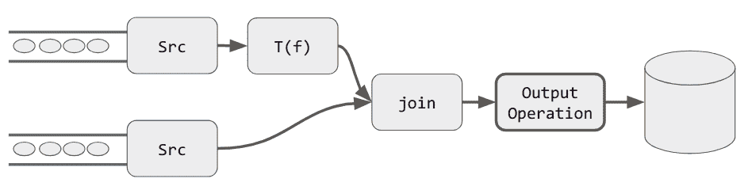
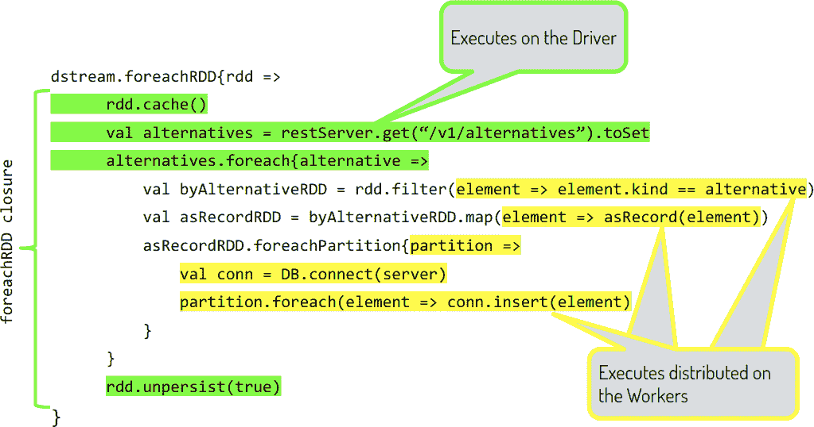

# 第二十章：Spark Streaming 下沉

通过以 DStream 表示的源获取数据，并使用 DStream API 应用一系列转换来实现业务逻辑后，我们希望检查、保存或将结果生成到外部系统。

正如我们在 第二章 中回顾的那样，在我们的通用流处理模型中，负责将数据从流处理过程外部化的组件被称为 sink。在 Spark Streaming 中，使用所谓的 *输出操作* 实现 sink。

在本章中，我们将探讨 Spark Streaming 通过这些输出操作将数据生成到外部系统的能力和方式。

# 输出操作

输出操作在每个 Spark Streaming 应用程序中扮演了关键角色。它们需要触发对 DStream 的计算，并通过可编程接口提供对结果数据的访问。

在 图 20-1 中，我们展示了一个通用的 Spark Streaming 作业，它将两个流作为输入，转换其中一个，然后在将结果写入数据库之前将它们连接在一起。在执行时，以 *输出操作* 结束的 DStream 转换链成为一个 Spark 作业。



###### 图 20-1. 一个 Spark Streaming 作业

该作业连接到 Spark Streaming 调度程序。反过来，调度程序在每个批处理间隔触发定义的作业的执行，如 图 20-2 所示。


###### 图 20-2. Spark Streaming 调度程序

输出操作为以下内容提供了链接：

+   DStreams 上惰性转换的序列

+   Spark Streaming 调度程序

+   我们将数据生成到的外部系统

从执行模型的角度来看，流程序中声明的每个输出操作都按照程序中声明的顺序连接到 Spark Streaming 调度程序。这种顺序保证了后续的输出操作会在前一个操作执行完成后触发。例如，在以下代码片段中，我们在将媒体资产存储到数据库之前将其添加到可搜索索引中。Spark Streaming 中输出操作的执行顺序保证了新媒体在通过搜索索引变得可搜索之前被添加到主数据库中：

```
// assume a mediaStream is a DStream[Media],
// Media is the type that contains the meta-data for new audio/video assets

// Save to the assets database
mediaStream.foreachRDD{mediaRDD => assetsDB.store(mediaRDD)}

// Add the new media to an ElasticSearch Index
mediaStream.saveToEs("assets/media")
```

每个 Spark Streaming 作业至少必须有一个输出操作。这是一个逻辑要求；否则，就无法实现转换或获取结果。此要求在运行时通过调用 `sparkStreamingContext.start()` 操作来执行。如果流作业未提供至少一个输出操作，将无法启动，并抛出以下错误：

```
scala> ssc.start()

17/06/30 12:30:16 ERROR StreamingContext:
    Error starting the context, marking it as stopped
java.lang.IllegalArgumentException:
    requirement failed: No output operations registered, so nothing to execute
```

输出操作，顾名思义，提供对声明在 DStream 上的计算结果数据的访问。我们使用它们来观察结果数据，将其保存到磁盘上，或将其提供给其他系统，例如将其存储在数据库中以供后续查询，或直接发送到在线监控系统进行观察。

总体来说，输出操作的功能是按照批处理间隔指定的时间间隔调度提供的操作。对于采用闭包的输出操作，闭包中的代码在每个批处理间隔都会在 Spark 驱动程序上执行，而不是在集群中分布执行。所有的输出操作都返回`Unit`；即，它们只执行具有副作用的操作，并且不可组合。流处理作业可以具有尽可能多的输出操作。它们是 DStreams 转换 DAG 的端点。

# 内置输出操作

Spark Streaming 核心库提供了一些输出操作。我们将在以下小节中看到它们。

## print

`print()`将 DStream 的前几个元素输出到标准输出。当没有参数使用时，它将在每个流间隔中打印 DStream 的前 10 个元素，包括操作运行时的时间戳。还可以调用带有任意数量的`print(num: Int)`，以获得每个流间隔中给定的最大元素数。

鉴于结果仅写入标准输出，`print`的实际用途仅限于探索和调试流计算，其中我们可以在控制台上看到 DStream 的前几个元素的连续日志。

例如，在我们在第二章中使用的名字网络流中调用`print()`，我们看到以下内容：

```
namesDStream.print()
ssc.start()

-------------------------------------------
Time: 1498753595000 ms
-------------------------------------------
MARSHALL
SMITH
JONES
BROWN
JOHNSON
WILLIAMS
MILLER
TAYLOR
WILSON
DAVIS
...
```

## saveAsxyz

`saveAsxyz`系列的输出操作为流输出提供了基于文件的接收器。以下是可用的选项：

`saveAsTextFiles(prefix, suffix)`

将 DStream 的内容存储为文件系统中的文件。前缀和可选的后缀用于定位和命名目标文件系统中的文件。每个流间隔生成一个文件。每个生成的文件的名称将是`prefix-<timestamp_in_milliseconds>[.suffix]`。

`saveAsObjectFiles(prefix, suffix)`

使用标准 Java 序列化将可序列化对象的 DStream 保存到文件中。文件生成的动态与`saveAsTextFiles`相同。

`saveAsHadoopFiles(prefix, suffix)`

将 DStream 保存为 Hadoop 文件。文件生成的动态与`saveAsTextFiles`相同。

## `foreachRDD`

`foreachRDD(func)`是一个通用的输出操作，它提供对每个流间隔内 DStream 中底层 RDD 的访问。

所有前面提到的其他输出操作都使用`foreachRDD`来支持它们的实现。我们可以说`foreachRDD`是 Spark Streaming 的原生输出操作符，而所有其他输出操作都是由它派生出来的。

这是我们实现 Spark Streaming 结果的工具函数，可以说是最有用的本地输出操作。因此，它值得拥有自己的部分。

# 将 foreachRDD 用作可编程的 Sink

`foreachRDD`是与通过在 DStream 上声明的转换上处理的数据交互的主要方法。`foreachRDD`有两种方法重载：

`foreachRDD(foreachFunc: RDD[T] => Unit)`

作为参数传递的函数接收一个`RDD`并对其应用具有副作用的操作。

`foreachRDD(foreachFunc: (RDD[T], Time) => Unit)`

这是一个替代方案，我们还可以访问操作发生的时间，这可以用于区分数据的到达时间的视角。

###### 注意

需要注意的是，`foreachRDD`方法提供的时间是指处理时间。正如我们在“时间的影响”中讨论的那样，这是流处理引擎处理事件的时间。类型为`T`的事件包含在`RDD[T]`中，可能包含有关事件生成时间的其他信息，我们理解为事件时间的时间域。

在`foreachRDD`闭包的内部，我们可以访问 Spark Streaming 的两个抽象层：

Spark Streaming 调度程序

在`foreachRDD`闭包中应用的函数（不操作 RDD）会在 Spark Streaming 调度程序的驱动程序中本地执行。这个层次对于迭代的记账、访问外部 Web 服务以丰富流数据、本地（可变）变量或本地文件系统非常有用。需要注意的是，在这个层次上，我们可以访问`SparkContext`和`SparkSession`，从而可以与 Spark 的其他子系统（如 Spark SQL、DataFrames 和 Datasets）进行交互。

RDD 操作

应用于闭包函数提供的 RDD 的操作将在 Spark 集群中分布执行。在这个范围内允许所有常规的基于 RDD 的操作。这些操作将遵循典型的 Spark 核心流程，即序列化和在集群中分布执行。

在`foreachRDD`中观察到的常见模式是两个闭包：外部作用域包含本地操作，内部闭包应用于在集群中执行的 RDD。这种二元性经常是混淆的根源，最好通过代码示例学习。

让我们考虑 Example 20-1 中的代码片段，在其中我们希望将传入的数据按照一组 *alternatives*（任何具体的分类）进行排序。这些备选项会动态变化，并由我们通过外部服务访问的外部 web 服务进行管理。在每个批次间隔中，会向外部服务查询要考虑的备选项集合。对于每个备选项，我们创建一个 `formatter`。我们使用这个特定的 `formatter` 来通过分布式 `map` 转换来转换相应的记录。最后，我们在过滤后的 RDD 上使用 `foreachPartition` 操作获取一个连接到数据库并存储记录的连接。由于 `DB` 连接不可序列化，因此我们需要在 RDD 上使用这个特定的构造来在每个执行器上获取本地实例。

###### 注意

这是一个简化版的实际 Spark Streaming 生产作业，负责对许多不同客户的设备的物联网（IoT）数据进行排序。

##### 示例 20-1\. foreachRDD 内的 RDD 操作

```
dstream.foreachRDD{rdd => 
    rdd.cache() 
    val alternatives = restServer.get(“/v1/alternatives”).toSet 
    alternatives.foreach{alternative =>  
      val filteredRDD = rdd.filter(element => element.kind == alternative) 
      val formatter = new Formatter(alternative) 
      val recordRDD = filteredRDD.map(element => formatter(element))
      recordRDD.foreachPartition{partition => 
          val conn = DB.connect(server) 
          partition.foreach(element => conn.insert(alternative, element) 
      }
    }
    rdd.unpersist(true) 
}
```

乍一看，这个 DStream 输出操作中发生了很多事情。让我们把它分解成更易消化的部分：


我们在 DStream 上声明了一个 `foreachRDD` 操作，并使用闭包表示法 `f{ x => y }` 提供内联实现。


我们从缓存提供的 `RDD` 开始我们的实现，因为我们将多次迭代其内容。（我们在 “缓存” 中详细讨论了缓存。）


我们访问 web 服务。这每个批次间隔发生一次，并且执行发生在驱动程序主机上。这在网络层面也很重要，因为执行器可能被“封闭”在私有网络中，而驱动程序可能具有防火墙访问基础设施中的其他服务。


我们开始一个循环，迭代接收集合中的值，使我们能够迭代地过滤 `RDD` 中包含的值。


这声明了对 RDD 的 `filter` 转换。这个操作是惰性的，并且将在集群中以分布式方式进行，当某些动作需要实现时。


我们获得一个对可序列化 Formatter 实例的本地引用，我们在第 7 行中用它来格式化上一步骤中过滤的记录。


我们在我们过滤后的 `RDD` 上使用 `foreachPartition` 操作。


我们需要在执行器上有一个本地的数据库驱动程序实例。


我们并行插入记录到数据库中。


最后，我们`unpersist` `RDD`以释放内存供下一次迭代使用。

在 图 20-3 中，我们强调了`foreachRDD`调用闭包内代码的不同执行范围。简而言之，所有不由 RDD 操作支持的代码在驱动程序上下文中以本地方式执行。对 RDD 调用的函数和闭包在集群中以分布方式执行。我们必须格外注意避免将非可序列化的代码从本地上下文传递到 RDD 执行上下文。这在 Spark Streaming 应用中经常是问题的根源。



###### 图 20-3\. `foreachRDD`闭包的范围

正如我们所看到的，`foreachRDD`是一个多才多艺的输出操作，我们可以混合和匹配本地和分布式操作，以获得我们计算的结果并在流处理逻辑处理后将数据推送到其他系统。

# 第三方输出操作

几个第三方库通过在 Scala 中使用库增强模式为特定目标系统添加了对 Spark Streaming 的支持，以添加输出操作到 DStreams。

例如，Datastax 的 [Spark-Cassandra Connector](http://bit.ly/2IPiUIL) 允许在 DStreams 上执行`saveToCassandra`操作，直接将流数据保存到目标 Apache Cassandra keyspace 和 table 中。由 Ben Fradet 开发的 [spark-kafka-writer](http://bit.ly/2ZNLrnw) 提供了类似的构造，`dStream.writeToKafka`，用于将 DStream 写入 Kafka 主题。

Elasticsearch 通过相同的模式为 Spark Streaming 提供支持。Elasticsearch 库对`DStream` API 进行了增强，添加了`saveToEs`调用。更多信息可以在 Elastic 的 [Spark 集成指南](http://bit.ly/2V3DyLL) 中找到。

这些库的实现利用了 Scala 的隐式转换和`foreachRDD`在幕后提供了用户友好的高级 API，以针对特定的第三方系统，使用户免受与前面解释的`foreachRDD`中多级抽象相关的复杂细节的困扰。

更多连接器，请参见 [SparkPackages](https://spark-packages.org)。
